# `matplotlib\extern\agg24-svn\include\agg_span_pattern_rgb.h` 详细设计文档

Anti-Grain Geometry (AGG) 库中的 RGB 图案生成器模板类，用于在渲染管线中生成带有偏移和透明度控制的 RGB 颜色图案span，支持从源图像提取像素并应用 alpha 混合

## 整体流程

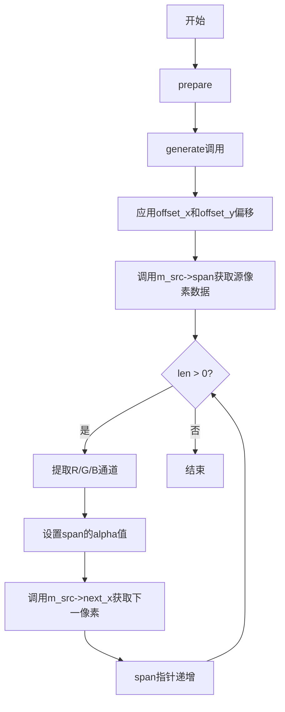

## 类结构

```
agg (命名空间)
└── span_pattern_rgb<Source> (模板类)
```

## 全局变量及字段


### `span_pattern_rgb.m_src`
    
指向源图像的指针，用于获取图案数据

类型：`source_type*`
    


### `span_pattern_rgb.m_offset_x`
    
X方向偏移量，用于在源图像上水平移动采样起始点

类型：`unsigned`
    


### `span_pattern_rgb.m_offset_y`
    
Y方向偏移量，用于在源图像上垂直移动采样起始点

类型：`unsigned`
    


### `span_pattern_rgb.m_alpha`
    
Alpha透明度值，用于控制生成span的透明度

类型：`value_type`
    
    

## 全局函数及方法


### `span_pattern_rgb.span_pattern_rgb()`

默认构造函数，用于创建一个未初始化的 `span_pattern_rgb` 对象，不接受任何参数，也不执行任何成员初始化操作。

参数：
- 无

返回值：
- 无返回值（构造函数）

#### 流程图

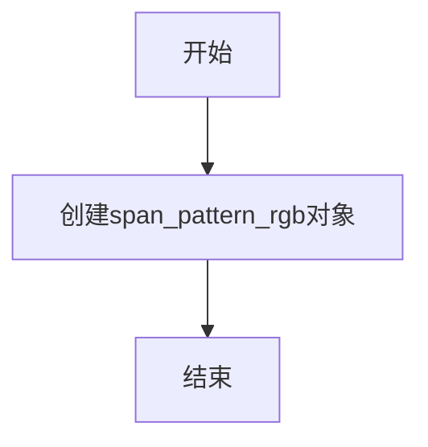

#### 带注释源码

```cpp
//----------------------------------------------------------------------------
// Anti-Grain Geometry - Version 2.4
// Copyright (C) 2002-2005 Maxim Shemanarev (http://www.antigrain.com)
//
// Permission to copy, use, modify, sell and distribute this software 
// is granted provided this copyright notice appears in all copies. 
// This software is provided "as is" without express or implied
// warranty, and with no claim as to its suitability for any purpose.
//
//----------------------------------------------------------------------------
// Contact: mcseem@antigrain.com
//          mcseemagg@yahoo.com
//          http://www.antigrain.com
//----------------------------------------------------------------------------
//
// Adaptation for high precision colors has been sponsored by 
// Liberty Technology Systems, Inc., visit http://lib-sys.com
//
// Liberty Technology Systems, Inc. is the provider of
// PostScript and PDF technology for software developers.
// 
//----------------------------------------------------------------------------


#ifndef AGG_SPAN_PATTERN_RGB_INCLUDED
#define AGG_SPAN_PATTERN_RGB_INCLUDED

#include "agg_basics.h"

namespace agg
{

    //========================================================span_pattern_rgb
    template<class Source> class span_pattern_rgb
    {
    public:
        typedef Source source_type;
        typedef typename source_type::color_type color_type;
        typedef typename source_type::order_type order_type;
        typedef typename color_type::value_type value_type;
        typedef typename color_type::calc_type calc_type;

        //--------------------------------------------------------------------
        // 默认构造函数，不接受任何参数，不初始化任何成员变量
        span_pattern_rgb() {}
        
        // 带参数的构造函数，用于初始化源图像和偏移量
        span_pattern_rgb(source_type& src, 
                         unsigned offset_x, unsigned offset_y) :
            m_src(&src),
            m_offset_x(offset_x),
            m_offset_y(offset_y),
            m_alpha(color_type::base_mask)
        {}

        //--------------------------------------------------------------------
        void   attach(source_type& v)      { m_src = &v; }
               source_type& source()       { return *m_src; }
        const  source_type& source() const { return *m_src; }

        //--------------------------------------------------------------------
        void       offset_x(unsigned v) { m_offset_x = v; }
        void       offset_y(unsigned v) { m_offset_y = v; }
        unsigned   offset_x() const { return m_offset_x; }
        unsigned   offset_y() const { return m_offset_y; }
        void       alpha(value_type v) { m_alpha = v; }
        value_type alpha() const { return m_alpha; }

        //--------------------------------------------------------------------
        void prepare() {}
        void generate(color_type* span, int x, int y, unsigned len)
        {   
            x += m_offset_x;
            y += m_offset_y;
            const value_type* p = (const value_type*)m_src->span(x, y, len);
            do
            {
                span->r = p[order_type::R];
                span->g = p[order_type::G];
                span->b = p[order_type::B];
                span->a = m_alpha;
                p = m_src->next_x();
                ++span;
            }
            while(--len);
        }

    private:
        source_type* m_src;
        unsigned     m_offset_x;
        unsigned     m_offset_y;
        value_type   m_alpha;

    };

}

#endif
```


### `span_pattern_rgb.span_pattern_rgb`

带参构造函数，用于初始化 `span_pattern_rgb` 类的实例，设置源图像指针、x和y方向的偏移量以及alpha值。

参数：

- `src`：`source_type&`，源图像对象引用，提供颜色生成所需的图像数据
- `offset_x`：`unsigned`，X轴偏移量，用于在生成颜色时调整起始x坐标
- `offset_y`：`unsigned`，Y轴偏移量，用于在生成颜色时调整起始y坐标

返回值：`void`，无返回值（构造函数）

#### 流程图

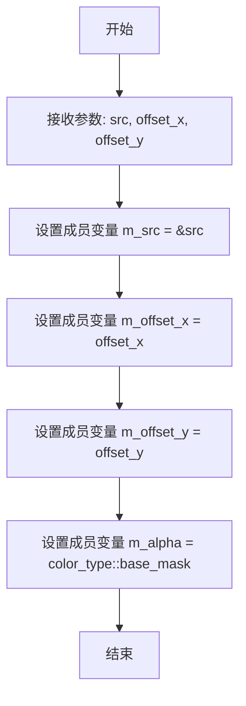

#### 带注释源码

```cpp
//--------------------------------------------------------------------
span_pattern_rgb(source_type& src, 
                 unsigned offset_x, unsigned offset_y) :
    m_src(&src),              // 将源对象地址赋值给成员指针m_src
    m_offset_x(offset_x),    // 初始化X轴偏移量
    m_offset_y(offset_y),    // 初始化Y轴偏移量
    m_alpha(color_type::base_mask)  // 初始化alpha通道为最大值（不透明）
{}
```


### `span_pattern_rgb.attach`

该方法用于将源图像绑定到`span_pattern_rgb`渲染器，以便后续可以基于该源图像生成RGB模式的像素行。

参数：

- `v`：`source_type&`，要绑定的源图像引用

返回值：`void`，无返回值

#### 流程图

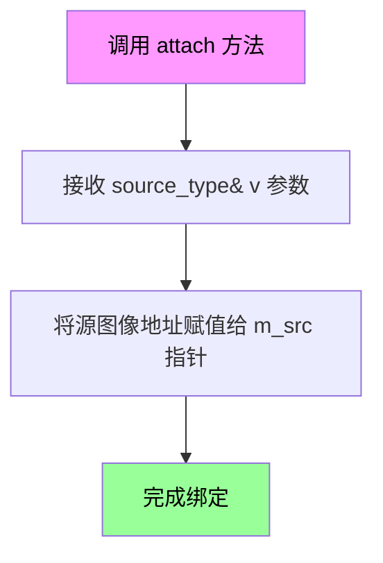

#### 带注释源码

```
//----------------------------------------------------------------------------
// 类: span_pattern_rgb
// 方法: attach
//----------------------------------------------------------------------------
// 功能: 将源图像绑定到渲染器
//
// 参数:
//   v - source_type&: 源图像引用
//
// 返回值: void
//----------------------------------------------------------------------------
void attach(source_type& v)
{ 
    // 将传入的源图像指针保存到成员变量 m_src 中
    // 这样后续的 generate() 方法就可以通过 m_src 访问源图像数据
    m_src = &v; 
}
```


### `span_pattern_rgb.source()`

该方法返回对源图像的引用，用于获取或操作底层的图像源对象，支持可修改和只读两种访问方式。

参数：该方法无参数

返回值：`source_type&`（非const版本）/ `const source_type&`（const版本），返回关联的源图像引用

#### 流程图

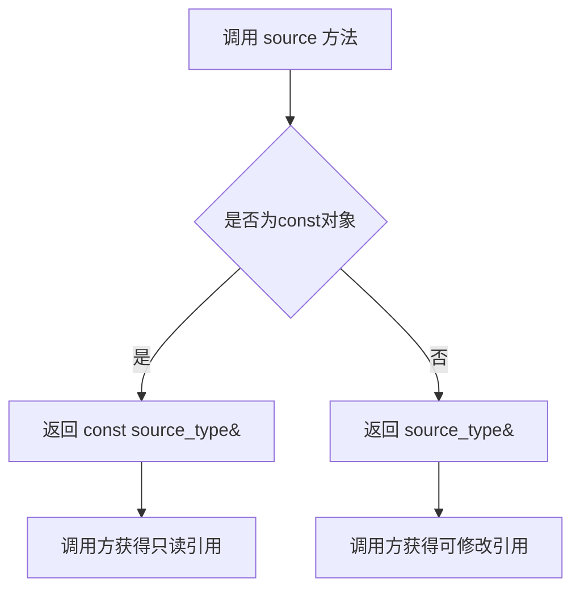

#### 带注释源码

```cpp
//--------------------------------------------------------------------
void   attach(source_type& v)      { m_src = &v; }
       source_type& source()       { return *m_src; }
const  source_type& source() const { return *m_src; }
//--------------------------------------------------------------------
```

**源码详解：**
- `attach(source_type& v)`：将外部的source对象地址赋值给内部指针m_src，建立关联关系
- `source_type& source()`：非const版本，返回可修改的源图像引用，允许调用者修改源图像数据
- `const source_type& source() const`：const版本，返回只读的源图像引用，确保在const对象或const成员函数中安全访问

#### 完整类结构参考

**类名：** `span_pattern_rgb<Source>`

**类字段：**
- `m_src`：`source_type*`，指向源图像的指针
- `m_offset_x`：`unsigned`，X轴偏移量
- `m_offset_y`：`unsigned`，Y轴偏移量
- `m_alpha`：`value_type`，透明度值

**类方法：**
- `span_pattern_rgb()`：无参构造函数
- `span_pattern_rgb(source_type& src, unsigned offset_x, unsigned offset_y)`：带参构造函数，初始化源图像和偏移量
- `attach(source_type& v)`：附加源图像
- `source()` / `source() const`：获取源图像引用（重点方法）
- `offset_x() / offset_x(unsigned v)`：获取/设置X偏移
- `offset_y() / offset_y(unsigned v)`：获取/设置Y偏移
- `alpha() / alpha(value_type v)`：获取/设置透明度
- `prepare()`：准备函数（空实现）
- `generate(color_type* span, int x, int y, unsigned len)`：生成颜色插值

#### 关键组件信息

- **Source（模板参数）**：源图像类型，需包含color_type、order_type、span()和next_x()方法
- **color_type**：颜色类型定义
- **order_type**：颜色通道顺序（如RGB顺序）

#### 潜在技术债务与优化空间

1. **空实现的prepare()方法**：当前prepare()为空实现，可能需要子类重写或添加实际初始化逻辑
2. **硬编码的alpha赋值**：在generate()中强制设置alpha值，缺少对源图像alpha通道的支持
3. **模板代码膨胀**：每个实例化都会生成独立代码，可能增加二进制体积
4. **缺乏错误检查**：未检查m_src是否为空指针，可能导致空指针解引用

#### 设计目标与约束

- **设计目标**：为pattern渲染提供RGB颜色插值的span生成器，支持图像平铺和偏移
- **模板约束**：Source类型必须实现span()和next_x()方法接口
- **颜色顺序**：依赖order_type定义颜色通道顺序，需与实际颜色格式匹配

#### 错误处理与异常设计

- 当前实现未进行空指针检查，attach()和构造函数应考虑添加断言或异常机制
- 建议在source()方法中添加nullptr检查，防止访问已分离的源图像

#### 数据流与状态机

```
外部Source → span_pattern_rgb.attach() → m_src指针存储
                                      ↓
        generate()调用 → m_src->span()获取像素行
                                      ↓
        逐像素处理 → 颜色重排 + alpha设置 → 输出span数组
```

#### 外部依赖与接口契约

- **依赖接口**：
  - `source_type::span(x, y, len)`：获取图像行数据
  - `source_type::next_x()`：移动到下一个像素位置
  - `source_type::color_type`：颜色类型定义
  - `source_type::order_type`：颜色通道顺序定义
- **调用方职责**：确保source对象生命周期覆盖span_pattern_rgb对象，或在使用期间保持有效引用


### `span_pattern_rgb.offset_x(unsigned)`

设置X方向的偏移量，用于在生成颜色渐变时水平移动图案。该方法是类`span_pattern_rgb`的成员方法，用于修改私有成员变量`m_offset_x`的值，该偏移量会在`generate()`方法中被应用到x坐标上。

参数：

-  `v`：`unsigned`，新的X方向偏移量值

返回值：`void`，无返回值

#### 流程图

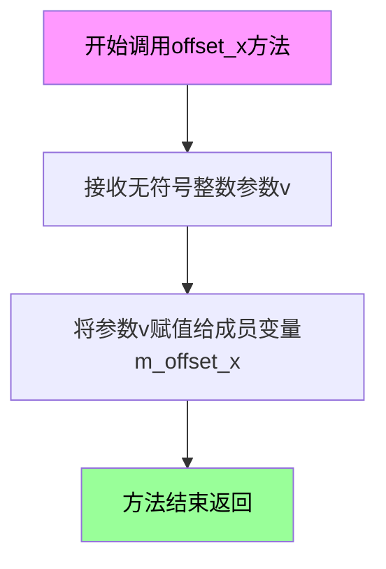

#### 带注释源码

```cpp
//--------------------------------------------------------------------
void offset_x(unsigned v) { m_offset_x = v; }
```

**源码解释：**
- 这是一个简单的setter方法，接受一个无符号整数参数`v`
- 将参数`v`直接赋值给私有成员变量`m_offset_x`
- `m_offset_x`用于在`generate()`方法中水平偏移图案的x坐标
- 该方法不返回任何值（void返回类型）
- 对应的getter方法为`offset_x() const`，返回当前存储的偏移值


### `span_pattern_rgb.offset_y`

设置图案生成器的Y轴偏移量，用于在生成颜色扫描线时调整纹理图案的垂直起始位置。

参数：

- `v`：`unsigned`，新的Y偏移量值

返回值：`void`，无返回值，用于设置成员变量m_offset_y的值

#### 流程图

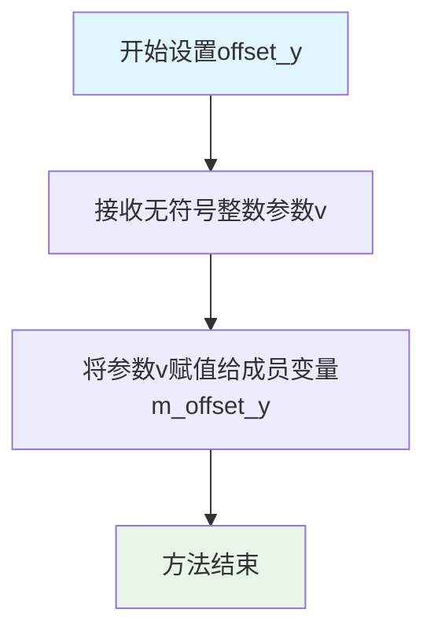

#### 带注释源码

```cpp
//--------------------------------------------------------------------
void offset_y(unsigned v) 
{ 
    // 参数v: 新的Y偏移量值
    // 功能: 将成员变量m_offset_y设置为传入的v值
    //       用于在generate方法中调整纹理图案的垂直偏移
    m_offset_y = v; 
}
```

#### 关联信息

**所属类**: `span_pattern_rgb<Source>`

**类功能描述**: 
`span_pattern_rgb`是一个模板类，用于在Anti-Grain Geometry库中生成基于图案（pattern）的RGB颜色扫描线。该类从源图像中提取图案块，并可设置X和Y方向的偏移量来控制图案的对齐。

**相关方法**:
- `offset_x(unsigned v)` - 设置X偏移量
- `offset_x() const` - 获取X偏移量
- `offset_y() const` - 获取Y偏移量（getter版本）

**成员变量**:
- `m_offset_y`：`unsigned` 类型，存储Y轴偏移量，在generate方法中会与传入的y坐标相加来确定实际采样的纹理坐标


### `span_pattern_rgb.offset_x`

获取X方向偏移量。该方法返回当前图案在X轴方向的像素偏移量，用于控制图案纹理的水平起始位置。

参数：无

返回值：`unsigned`，返回成员变量 `m_offset_x` 的当前值，表示X方向的偏移量（像素数）。

#### 流程图

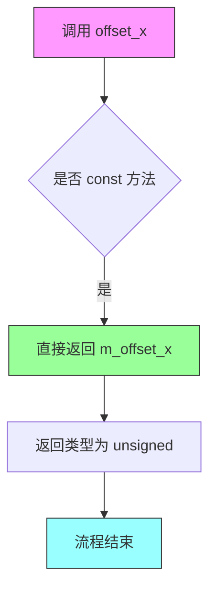

#### 带注释源码

```cpp
//--------------------------------------------------------------------
unsigned   offset_x() const { return m_offset_x; }
//--------------------------------------------------------------------
/**
 * 获取X方向偏移量
 * 
 * @return unsigned 当前设置的X轴偏移量（像素单位）
 * 
 * 该方法返回成员变量 m_offset_x 的值，该值在构造函数中初始化，
 * 并可通过 offset_x(unsigned v) 方法进行修改。
 * 
 * 偏移量影响 generate() 方法中图案的采样起始位置：
 * - x 坐标会先加上 m_offset_x 再用于查询源图像
 * - 这允许图案在扫描线生成时产生水平平移效果
 * 
 * 示例用途：
 *   创建一个移动的图案效果时，可动态修改此偏移值
 */
```

#### 相关上下文信息

**所属类**：span_pattern_rgb

**类功能概述**：一个模板类，用于生成基于图案（pattern）的RGB颜色扫描线（span），常用于纹理映射和图案填充场景。

**成员变量关系**：
- `m_offset_x` 与 `m_offset_y` 配合使用，共同决定图案采样的起始坐标
- `offset_x()` 与 `offset_y()` 成对出现，分别控制水平和垂直偏移

**调用场景**：
- 在 `generate()` 方法内部，X坐标会先加上 `m_offset_x` 再传给源对象的 `span()` 方法
- 用户可能需要查询当前偏移值以进行同步或调试

**设计意图**：
- 该类采用模版方法模式，允许灵活替换不同的 Source 类型
- offset_x/setter 和 offset_x/getter 成对提供，符合封装原则
- const 修饰符表明该查询操作不会修改对象状态


### `span_pattern_rgb.offset_y`

获取Y偏移量。该方法为常量成员函数，返回当前设置的Y轴偏移量，用于在图案渲染时调整纹理的垂直起始位置。

参数： 无

返回值：`unsigned`，返回当前存储的Y偏移量值（无符号整数类型）

#### 流程图

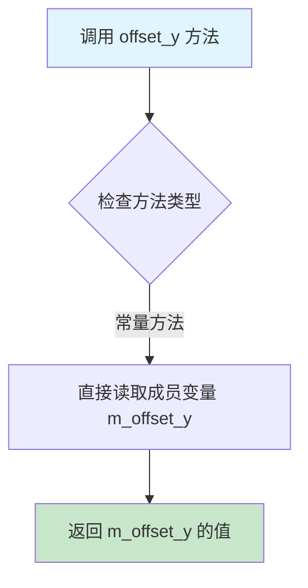

#### 带注释源码

```cpp
// 获取Y偏移量的常量成员函数
// 返回类型：unsigned（无符号整数）
// 功能：返回成员变量 m_offset_y 的当前值，用于图案渲染时的垂直偏移
unsigned offset_y() const 
{ 
    return m_offset_y;  // 直接返回私有成员变量 m_offset_y 的值
}
```

#### 上下文信息

**所属类**：`span_pattern_rgb<Source>`

**类功能概述**：
`span_pattern_rgb` 是一个模板类，用于在 Anti-Grain Geometry (AGG) 库中实现基于图案的 RGB 颜色生成器。它从源图像中提取图案数据，并根据设置的偏移量生成扫描线颜色值。

**相关成员**：

| 成员名称 | 类型 | 描述 |
|---------|------|------|
| `m_src` | `source_type*` | 指向源图像的指针 |
| `m_offset_x` | `unsigned` | X轴偏移量 |
| `m_offset_y` | `unsigned` | Y轴偏移量 |
| `m_alpha` | `value_type` | 透明度值 |

**配对方法**：

| 方法 | 功能 |
|------|------|
| `offset_y(unsigned v)` | 设置Y偏移量 |
| `offset_x()` | 获取X偏移量 |
| `offset_x(unsigned v)` | 设置X偏移量 |

#### 技术债务与优化空间

1. **命名一致性**：offset_x 和 offset_y 返回 unsigned 类型，但对于坐标偏移，考虑使用整型以支持负偏移
2. **边界检查**：当前实现未对偏移量进行边界验证，可能导致访问越界
3. **内联建议**：该方法适合声明为 inline 以减少函数调用开销

#### 设计约束

- 该方法为常量成员函数，不会修改对象状态
- 返回的偏移值直接影响 `generate()` 方法中的图像采样坐标计算
- 偏移量与源图像的尺寸关系未进行验证


### `span_pattern_rgb.alpha`

设置span pattern RGB的透明度(alpha)值，用于控制生成像素的透明度。

参数：

-  `v`：`value_type`，要设置的透明度值，通常为0-255的无符号整数

返回值：`void`，无返回值

#### 流程图

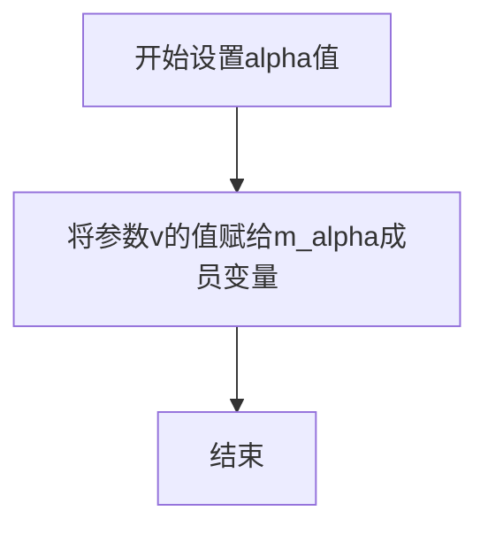

#### 带注释源码

```cpp
//--------------------------------------------------------------------
void       alpha(value_type v) { m_alpha = v; }
// 设置透明度值
// 参数: v - value_type类型的透明度值
// 功能: 将传入的透明度值v赋值给成员变量m_alpha
//       该alpha值会在generate方法中应用到所有生成的像素上
//       value_type通常是unsigned char，范围0-255
// 返回: void，无返回值
```

#### 关联信息

**所属类**：`span_pattern_rgb`

**成员变量**：
- `m_alpha`：`value_type`，存储透明度值，初始值为`color_type::base_mask`（在构造函数中设置）

**对应的getter方法**：
- `value_type alpha() const` - 获取当前alpha值

**使用场景**：
该方法与`generate`方法配合使用，在生成颜色span时将`m_alpha`值赋给每个像素的a通道，从而实现对整个span pattern的透明度控制。


### `span_pattern_rgb.alpha()`

获取颜色 alpha 通道值的 getter 方法，返回当前设置的 alpha 透明度值。

参数：
- 无

返回值：`value_type`，返回 alpha 通道的值（0-255或相应颜色基掩码范围内的值），表示颜色的不透明度。

#### 流程图

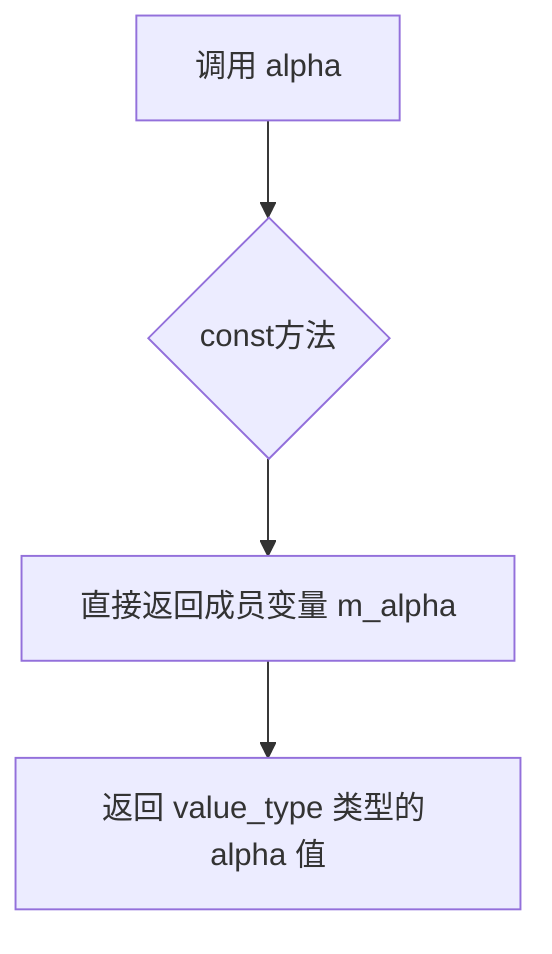

#### 带注释源码

```cpp
//----------------------------------------------------------------------------
// 获取 alpha 值
//----------------------------------------------------------------------------
// 返回值类型: value_type - 颜色值的基类型（如 uint8_t）
// 功能: 返回成员变量 m_alpha，该值控制颜色的透明度
//----------------------------------------------------------------------------
value_type alpha() const { return m_alpha; }

//----------------------------------------------------------------------------
// 设置 alpha 值（配套的 setter 方法）
//----------------------------------------------------------------------------
// 参数: value_type v - 要设置的 alpha 值
// 功能: 将成员变量 m_alpha 设置为指定的 alpha 值
//----------------------------------------------------------------------------
void alpha(value_type v) { m_alpha = v; }
```

#### 上下文信息

该方法是 `span_pattern_rgb` 模板类的成员方法，位于 `agg::span_pattern_rgb` 类中。

- **所属类**：`span_pattern_rgb<Source>`
- **类功能**：用于生成带有图案的颜色跨度（span），支持 RGB 颜色模式和可配置的 alpha 通道
- **成员变量**：`m_alpha` - value_type 类型，存储 alpha 通道值，初始化为 `color_type::base_mask`（通常为颜色最大值，如 255）

#### 相关方法

| 方法名 | 类型 | 功能 |
|--------|------|------|
| `alpha(value_type v)` | setter | 设置 alpha 值 |
| `prepare()` | 成员方法 | 准备生成（空实现） |
| `generate(...)` | 成员方法 | 生成颜色跨度，应用 m_alpha 到每个像素 |


### `span_pattern_rgb.prepare()`

该方法是一个空实现，作为span模式生成器的准备接口，用于在生成span之前执行必要的初始化操作。当前实现不做任何处理，留给子类重写以实现具体的准备逻辑。

参数：
- （无参数）

返回值：`void`，无返回值

#### 流程图

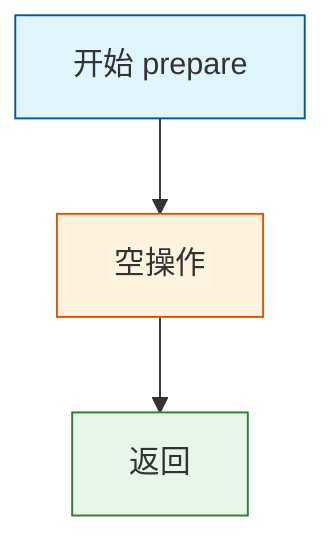

#### 带注释源码

```
//--------------------------------------------------------------------
/// @brief 准备生成span的接口方法
/// 
/// 这是一个空实现，作为span模式生成器的准备阶段接口。
/// 在实际使用中，如果需要在生成span之前执行某些初始化操作，
/// 可以在子类中重写此方法。当前实现不做任何处理。
void prepare() {}
```

#### 关联信息

该方法属于 `span_pattern_rgb` 类，该类是一个模板类，用于处理RGB颜色模式的span模式生成。主要功能是从源图像中提取RGB颜色并生成对应的span，支持偏移量和alpha通道的设置。

**相关方法**：
- `generate()` - 实际生成span的方法，与 `prepare()` 配合使用
- `attach()` - 绑定源图像
- `offset_x()/offset_y()` - 设置偏移量

**设计意图**：
该方法采用了模板方法模式，`prepare()` 作为钩子方法存在，允许子类在生成span之前执行自定义的初始化逻辑，如缓存计算、参数验证等。


### span_pattern_rgb.generate

生成RGB图案span，根据源图像和给定的坐标及长度，从源图像中提取RGB颜色数据并填充到目标span数组中，同时应用alpha值。

参数：
- span：color_type*，指向目标颜色数组的指针，用于存储生成的span数据
- x：int，x坐标，相对于源图像的起始位置
- y：int，y坐标，相对于源图像的起始位置
- len：unsigned，要生成的span长度（即像素数量）

返回值：void，无返回值

#### 流程图

```mermaid
graph TD
    A[开始] --> B[调整坐标: x += m_offset_x, y += m_offset_y]
    B --> C[获取源span指针: p = m_src->span(x, y, len)]
    C --> D{len > 0?}
    D -->|是| E[复制颜色分量: span->r = p[order_type::R], span->g = p[order_type::G], span->b = p[order_type::B]]
    E --> F[设置alpha: span->a = m_alpha]
    F --> G[移动源指针: p = m_src->next_x()]
    G --> H[移动目标span指针: ++span]
    H --> I[长度减一: --len]
    I --> D
    D -->|否| J[结束]
```

#### 带注释源码

```
// 生成RGB图案span
// span: 目标颜色数组指针
// x: x坐标
// y: y坐标
// len: span长度
void generate(color_type* span, int x, int y, unsigned len)
{   
    // 应用x和y的偏移量
    x += m_offset_x;
    y += m_offset_y;
    
    // 从源图像获取span数据
    const value_type* p = (const value_type*)m_src->span(x, y, len);
    
    // 遍历每个像素
    do
    {
        // 复制红色分量
        span->r = p[order_type::R];
        // 复制绿色分量
        span->g = p[order_type::G];
        // 复制蓝色分量
        span->b = p[order_type::B];
        // 设置alpha值
        span->a = m_alpha;
        
        // 移动到源图像的下一个x位置
        p = m_src->next_x();
        // 移动到目标span的下一个位置
        ++span;
    }
    // 循环直到长度为零
    while(--len);
}
```


## 关键组件


### span_pattern_rgb 类模板

span_pattern_rgb 是一个模板类，用于在 Anti-Grain Geometry 渲染引擎中生成 RGB 图案的像素扫描线（span）。它从源图像中按指定偏移提取像素数据，并应用透明度控制。

### 张量索引与偏移机制

通过 m_offset_x 和 m_offset_y 成员实现图案的空间索引定位，支持在生成像素时对源图像进行二维偏移，从而实现图案的无缝平铺和定位需求。

### 惰性加载准备模式

prepare() 方法为空实现，采用惰性加载模式，将所有准备工作延迟到 generate() 方法中执行，避免了不必要的初始化开销。

### 反量化支持

使用模板参数中的 value_type 和 calc_type 实现反量化处理，支持不同精度级别的颜色值计算，确保颜色数据在模板类中的类型安全传递。

### 量化策略与颜色通道

通过 order_type::R/G/B 常量实现颜色通道的灵活索引，配合 color_type::base_mask 进行颜色掩码处理，确保颜色值在有效范围内。

### 透明度控制

m_alpha 成员提供全局透明度控制，支持在生成像素时对整个 span 应用统一的 alpha 值，实现淡入淡出等效果。

### 源图像抽象接口

通过 source_type 模板参数实现对不同图像源的类型无关访问，支持 attach() 方法动态挂载源图像，提供了良好的扩展性。


## 问题及建议


### 已知问题

- **空指针风险**：`generate` 方法中直接使用 `m_src` 指针，但未对其进行空指针检查，可能导致程序崩溃
- **硬编码类型转换**：在 `generate` 方法中使用C风格强制转换 `(const value_type*)m_src->span(x, y, len)`，缺乏类型安全，可能产生未定义行为
- **缺失const正确性**：`attach` 方法仅接受非const引用，无法附加const源对象，且类中缺乏对const源类型的完整支持
- **不完整的RAII**：缺少显式的拷贝构造函数和拷贝赋值运算符，可能导致指针悬挂或重复释放（虽然模板类通常隐式生成，但显式定义更安全）
- **prepare方法空实现**：`prepare()` 方法为空实现，这是模板方法模式的一部分，但空实现可能表明设计不完整或调用方可能误用
- **无错误传播机制**：`span()` 和 `next_x()` 的返回值未进行有效性验证，底层错误无法向上传播

### 优化建议

- 添加空指针检查或使用 `std::unique_ptr`/`std::shared_ptr` 管理资源生命周期
- 将C风格转换替换为C++的 `static_cast` 或 `reinterpret_cast`，或通过类型别名明确转换意图
- 添加 `const` 版本的 `attach` 方法和 `source()` 方法，增强const正确性
- 考虑添加 `noexcept` 规范到不会抛出异常的函数（如简单的getter方法）
- 实现虚析构函数或接口类以支持多态使用（如果需要扩展）
- 添加 `explicit` 关键字到单参数构造函数防止隐式转换
- 为 `prepare` 方法添加实现或文档说明为何为空
- 使用 `std::span` 或类似机制替代裸指针以增强内存安全


## 其它


### 设计目标与约束

该模板类旨在为AGG渲染引擎提供高效的RGB图案颜色生成功能，核心目标是在保持低内存开销的前提下实现灵活的图案纹理映射。设计约束包括：模板参数Source必须实现特定的接口契约（如span()和next_x()方法），颜色格式固定为RGB模式，且偏移量和透明度参数受限于无符号整型范围。

### 错误处理与异常设计

本类采用异常安全的非抛出设计原则。attach()方法直接赋值指针，不进行空值检查，调用方需确保传入有效的source对象。generate()方法依赖于Source对象的span()和next_x()方法返回有效指针，若Source实现有问题可能导致未定义行为。无显式错误码返回机制，错误将通过下游调用链传播。

### 数据流与状态机

数据流从Source对象开始，经由offset_x和offset_y偏移调整后，通过span()方法获取原始颜色数据，再按照RGB顺序复制到目标span数组，同时应用alpha透明度值。generate()方法内部为纯函数式处理，无状态机设计。

### 外部依赖与接口契约

模板参数Source类型必须满足以下接口契约：具有color_type类型定义、order_type类型定义、span(x,y,len)方法返回const value_type*、next_x()方法返回const value_type*。依赖agg_basics.h基础类型定义，依赖于order_type::R/G/B常量进行颜色通道索引。

### 内存管理考虑

该类本身不管理动态内存，持有Source指针为原始指针形式。generate()方法中栈上分配的临时指针p直接引用Source返回的内存，无需额外释放。调用方需确保在span对象生命周期内Source对象有效。

### 线程安全性

该类不包含任何线程同步机制。多个线程同时操作同一span_pattern_rgb实例的generate()方法是线程不安全的，需要外部加锁保护。Source对象的线程安全性由其自身实现决定。

### 性能特征

generate()方法使用do-while循环实现，在编译时可获得良好的循环展开优化。核心操作仅包含指针运算和整数索引，性能关键路径极简。offset调整在每次generate调用时执行，适合实时渲染场景。

### 配置选项

通过offset_x/offset_y方法可在运行时动态调整图案起始位置，支持纹理平铺效果。通过alpha方法可整体调整输出透明度，实现淡入淡出或多层混合效果。

### 扩展点

可通过特化或偏特化支持其他颜色空间（如RGBA、CMYK）。可继承该类并重写generate()方法实现自定义颜色变换逻辑。可通过包装Source类型实现缓存或预处理层。

### 使用示例和参考

典型用法：创建span_pattern_rgb<rasterizer>实例，配置offset和alpha参数，在渲染循环中为每个像素行调用prepare()和generate()方法获取颜色数据。参考AGG库中其他span_*实现（如span_pattern_gray、span_image_filter）作为对比参考。

    