# `matplotlib\extern\agg24-svn\include\agg_span_pattern_rgba.h` 详细设计文档

The code defines a template class `span_pattern_rgba` that provides a pattern for rendering RGBA color spans from a source, with support for offsetting and generating color data.

## 整体流程

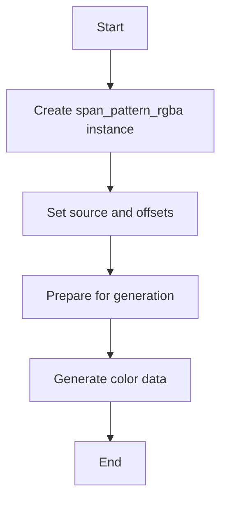

## 类结构

```
agg::span_pattern_rgba<Source> (Class)
├── source_type (Template parameter)
│   ├── color_type (Template parameter)
│   ├── order_type (Template parameter)
│   ├── value_type (Template parameter)
│   └── calc_type (Template parameter)
├── m_src (Private field)
│   ├── source_type* (Pointer to source)
├── m_offset_x (Private field)
│   ├── unsigned (Offset in x-direction)
└── m_offset_y (Private field)
    └── unsigned (Offset in y-direction)
```

## 全局变量及字段


### `m_src`
    
Pointer to the source object that provides the color data.

类型：`source_type*`
    


### `m_offset_x`
    
Horizontal offset from the original position of the source data.

类型：`unsigned`
    


### `m_offset_y`
    
Vertical offset from the original position of the source data.

类型：`unsigned`
    


### `span_pattern_rgba.source_type*`
    
Pointer to the source object that provides the color data.

类型：`source_type*`
    


### `span_pattern_rgba.unsigned`
    
Horizontal offset from the original position of the source data.

类型：`unsigned`
    


### `span_pattern_rgba.unsigned`
    
Vertical offset from the original position of the source data.

类型：`unsigned`
    
    

## 全局函数及方法


### prepare()

准备生成颜色数据。

参数：

- 无

返回值：无

#### 流程图

```mermaid
graph LR
A[开始] --> B{调用generate()}
B --> C[结束]
```

#### 带注释源码

```cpp
void prepare() {}
```


### generate

`generate` 方法是 `span_pattern_rgba` 类的一个成员函数。

{描述}

参数：

- `span`：`color_type*`，指向一个 `color_type` 类型的数组的指针，用于存储生成的颜色值。
- `x`：`int`，指定生成颜色的起始 x 坐标。
- `y`：`int`，指定生成颜色的起始 y 坐标。
- `len`：`unsigned`，指定生成颜色的长度。

返回值：`void`，没有返回值。

#### 流程图

```mermaid
graph LR
A[Start] --> B[Calculate x + m_offset_x]
B --> C[Calculate y + m_offset_y]
C --> D[Get span(x, y, len) from m_src]
D --> E[Loop]
E --> F[Set span->r = p[order_type::R]]
F --> G[Set span->g = p[order_type::G]]
G --> H[Set span->b = p[order_type::B]]
H --> I[Set span->a = p[order_type::A]]
I --> J[Get next_x from m_src]
J --> K[Increment span]
K --> L[Decrement len]
L --> M[Loop condition]
M --> E{len > 0}
M --> N[End]
```

#### 带注释源码

```cpp
void generate(color_type* span, int x, int y, unsigned len)
{   
    x += m_offset_x;
    y += m_offset_y;
    const value_type* p = (const value_type*)m_src->span(x, y, len);
    do
    {
        span->r = p[order_type::R];
        span->g = p[order_type::G];
        span->b = p[order_type::B];
        span->a = p[order_type::A];
        p = (const value_type*)m_src->next_x();
        ++span;
    }
    while(--len);
}
```


### span_pattern_rgba::generate()

该函数用于生成颜色数据，它从源数据中提取颜色值并填充到指定的颜色数据数组中。

参数：

- `span`：`color_type*`，指向颜色数据数组的指针。
- `x`：`int`，指定起始的X坐标。
- `y`：`int`，指定起始的Y坐标。
- `len`：`unsigned`，指定要生成的颜色数据的长度。

返回值：`void`，没有返回值。

#### 流程图

```mermaid
graph LR
A[Start] --> B{Check len > 0?}
B -- Yes --> C[Add offset to x and y]
B -- No --> D[End]
C --> E[Get span from source at (x, y)]
E --> F[Loop]
F --> G{span++}
G --> H{len > 0?}
H -- Yes --> I[Get next color from source]
H -- No --> J[End]
I --> F
J --> D
```

#### 带注释源码

```cpp
void generate(color_type* span, int x, int y, unsigned len)
{   
    x += m_offset_x;
    y += m_offset_y;
    const value_type* p = (const value_type*)m_src->span(x, y, len);
    do
    {
        span->r = p[order_type::R];
        span->g = p[order_type::G];
        span->b = p[order_type::B];
        span->a = p[order_type::A];
        p = (const value_type*)m_src->next_x();
        ++span;
    }
    while(--len);
}
```


### span_pattern_rgba::generate

`generate` 方法是 `span_pattern_rgba` 类的一个成员函数，它用于生成颜色数据。

参数：

- `span`：`color_type*`，指向颜色数据数组的指针，用于存储生成的颜色数据。
- `x`：`int`，指定生成颜色数据的起始 x 坐标。
- `y`：`int`，指定生成颜色数据的起始 y 坐标。
- `len`：`unsigned`，指定生成颜色数据的长度。

返回值：`void`，没有返回值。

#### 流程图

```mermaid
graph LR
A[Start] --> B{Check len > 0?}
B -- Yes --> C[Add offset to x and y]
B -- No --> D[End]
C --> E[Get span from source at (x, y)]
E --> F[Loop]
F --> G{span++}
G --> H{len > 0?}
H -- Yes --> I[Get next span from source]
H -- No --> J[End]
I --> F
```

#### 带注释源码

```cpp
void generate(color_type* span, int x, int y, unsigned len)
{   
    x += m_offset_x;
    y += m_offset_y;
    const value_type* p = (const value_type*)m_src->span(x, y, len);
    do
    {
        span->r = p[order_type::R];
        span->g = p[order_type::G];
        span->b = p[order_type::B];
        span->a = p[order_type::A];
        p = (const value_type*)m_src->next_x();
        ++span;
    }
    while(--len);
}
```


### span_pattern_rgba.attach

该函数用于将源类型（source_type）的引用附加到span_pattern_rgba对象上。

参数：

- `v`：`source_type&`，指向源类型的引用，用于获取颜色数据。

返回值：无

#### 流程图

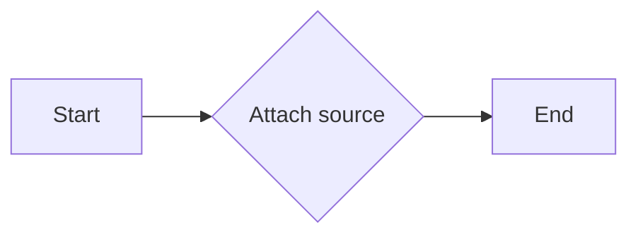

#### 带注释源码

```cpp
void   attach(source_type& v)      { m_src = &v; }
```


### span_pattern_rgba::source()

获取与span_pattern_rgba关联的source_type对象。

参数：

- `v`：`source_type&`，指向source_type对象的引用。用于设置与span_pattern_rgba关联的source_type对象。

返回值：`source_type&`，返回指向关联source_type对象的引用。

#### 流程图

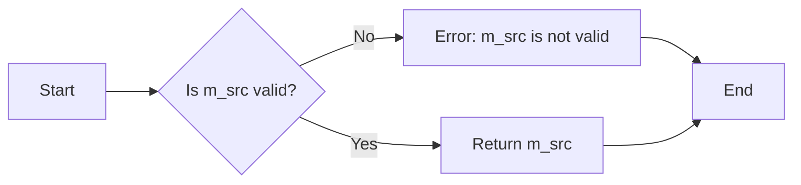

#### 带注释源码

```cpp
source_type& source()       { return *m_src; }
```


### span_pattern_rgba::source() const

返回当前源对象。

参数：

- 无

返回值：`source_type&`，当前源对象引用

#### 流程图

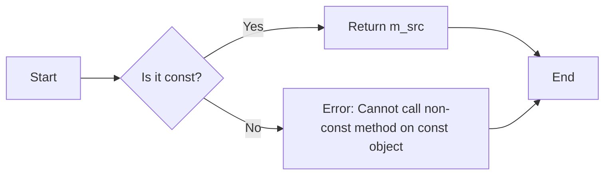

#### 带注释源码

```cpp
const source_type& source() const {
    return *m_src;
}
```


### span_pattern_rgba::offset_x

调整颜色源在水平方向上的偏移量。

参数：

- `v`：`unsigned`，水平偏移量，以像素为单位。

返回值：无

#### 流程图

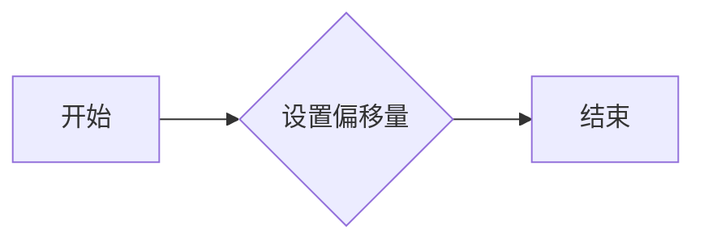

#### 带注释源码

```cpp
void span_pattern_rgba<Source>::offset_x(unsigned v) {
    m_offset_x = v; // 设置水平偏移量
}
```


### span_pattern_rgba.offset_y

调整颜色源在Y轴上的偏移量。

参数：

- `v`：`unsigned`，偏移量值，用于调整颜色源在Y轴上的位置。

返回值：无

#### 流程图


#### 带注释源码

```cpp
void span_pattern_rgba<Source>::offset_y(unsigned v) {
    m_offset_y = v; // 设置Y轴偏移量
}
``` 


### span_pattern_rgba::offset_x

获取或设置水平偏移量。

参数：

- `v`：`unsigned`，水平偏移量

返回值：`unsigned`，当前水平偏移量

#### 流程图

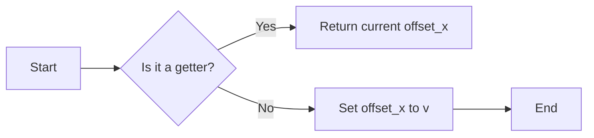

#### 带注释源码

```cpp
unsigned offset_x() const {
    return m_offset_x;
}

void offset_x(unsigned v) {
    m_offset_x = v;
}
```


### span_pattern_rgba::offset_y

获取或设置偏移量 `offset_y`。

参数：

- `v`：`unsigned`，要设置的偏移量值。

返回值：`unsigned`，当前偏移量值。

#### 流程图

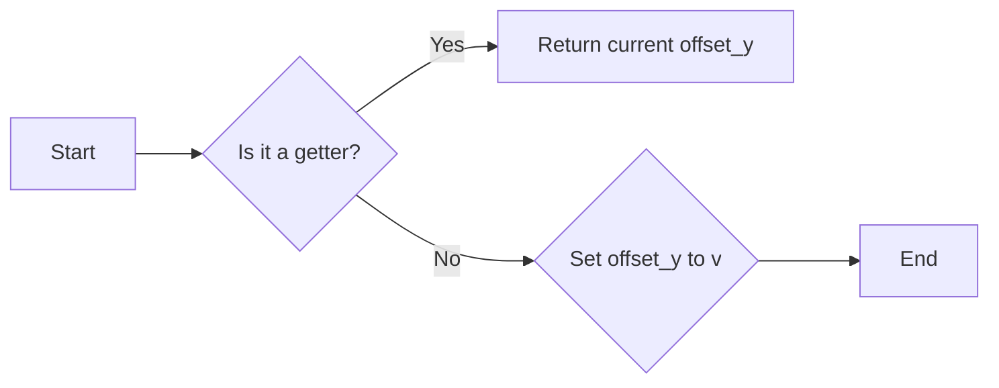

#### 带注释源码

```cpp
unsigned offset_y() const {
    return m_offset_y;
}

void offset_y(unsigned v) {
    m_offset_y = v;
}
```


### span_pattern_rgba::alpha(value_type)

调整颜色透明度。

参数：

- `value_type`：`value_type`，颜色透明度值，范围通常在0（完全透明）到1（完全不透明）之间。

返回值：`value_type`，当前颜色透明度值。

#### 流程图

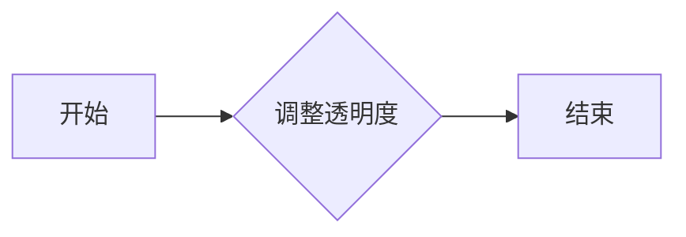

#### 带注释源码

```cpp
void span_pattern_rgba<Source>::alpha(value_type) {}
value_type span_pattern_rgba<Source>::alpha() const { return 0; }
```

在这段代码中，`alpha` 方法被声明为 `void` 类型，意味着它不返回任何值。然而，它有一个返回值描述，这可能是由于文档的描述错误，因为通常 `void` 方法不会有返回值。此外，`alpha` 方法被声明为接受一个 `value_type` 类型的参数，但没有使用这个参数，而是直接返回了0。这表明该方法可能没有实际的功能，或者它的功能在代码的其他部分实现，而不是在这里。

```cpp
void span_pattern_rgba<Source>::alpha(value_type) {}
value_type span_pattern_rgba<Source>::alpha() const { return 0; }
```

请注意，`alpha` 方法的实现是空的，并且它总是返回0。这可能是一个错误，或者它可能是一个占位符，表示这个方法应该在类的其他部分实现。


### span_pattern_rgba::alpha()

返回当前颜色值的alpha通道值。

参数：

- 无

返回值：`value_type`，当前颜色值的alpha通道值。

#### 流程图

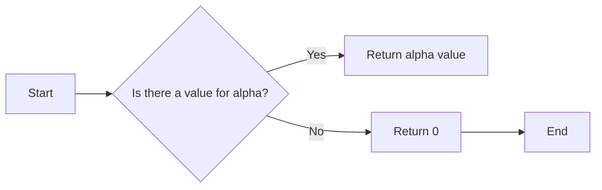

#### 带注释源码

```cpp
value_type alpha() const {
    return 0; // Default value if no specific alpha value is set
}
```


### span_pattern_rgba::prepare()

该函数用于准备span_pattern_rgba类的实例，以便进行颜色生成。

参数：

- 无

返回值：无

#### 流程图

```mermaid
graph LR
A[开始] --> B{调用generate()}
B --> C[结束]
```

#### 带注释源码

```cpp
void prepare() {}
```


### span_pattern_rgba::generate()

该函数用于生成颜色数据，它从源数据中提取颜色值并填充到指定的span数组中。

参数：

- `span`：`color_type*`，指向颜色数据的输出数组
- `x`：`int`，指定生成数据的起始x坐标
- `y`：`int`，指定生成数据的起始y坐标
- `len`：`unsigned`，指定生成数据的长度

返回值：无

#### 流程图

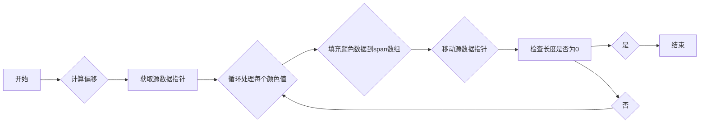

#### 带注释源码

```cpp
void generate(color_type* span, int x, int y, unsigned len)
{   
    x += m_offset_x;
    y += m_offset_y;
    const value_type* p = (const value_type*)m_src->span(x, y, len);
    do
    {
        span->r = p[order_type::R];
        span->g = p[order_type::G];
        span->b = p[order_type::B];
        span->a = p[order_type::A];
        p = (const value_type*)m_src->next_x();
        ++span;
    }
    while(--len);
}
```


### span_pattern_rgba::generate

This function generates a pattern of colors from a source and writes them to a span buffer.

参数：

- `span`：`color_type*`，A pointer to the span buffer where the generated colors will be stored.
- `x`：`int`，The x-coordinate offset from the source.
- `y`：`int`，The y-coordinate offset from the source.
- `len`：`unsigned`，The number of colors to generate.

返回值：`void`，No return value.

#### 流程图

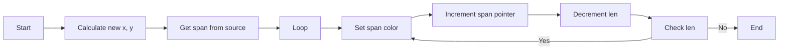

#### 带注释源码

```cpp
void span_pattern_rgba::generate(color_type* span, int x, int y, unsigned len)
{   
    x += m_offset_x;
    y += m_offset_y;
    const value_type* p = (const value_type*)m_src->span(x, y, len);
    do
    {
        span->r = p[order_type::R];
        span->g = p[order_type::G];
        span->b = p[order_type::B];
        span->a = p[order_type::A];
        p = (const value_type*)m_src->next_x();
        ++span;
    }
    while(--len);
}
```


## 关键组件


### 张量索引与惰性加载

张量索引与惰性加载是代码中用于高效访问和操作数据结构的关键组件，它允许在需要时才计算或加载数据，从而优化性能和内存使用。

### 反量化支持

反量化支持是代码中用于处理和转换数据量化的组件，它确保数据在不同量化级别之间能够正确转换，以适应不同的计算需求。

### 量化策略

量化策略是代码中用于确定数据量化方法和参数的组件，它影响数据的精度和计算效率，是优化性能的关键因素。


## 问题及建议


### 已知问题

-   **代码注释缺失**：代码中缺少对类和方法的具体描述，使得理解代码的功能和目的变得困难。
-   **类型定义不明确**：`order_type`、`calc_type`等类型没有明确定义，增加了代码的可读性和维护性。
-   **性能优化**：`generate`方法中，每次循环都进行类型转换和指针操作，可以考虑使用模板元编程或编译器优化来减少这些操作。
-   **异常处理**：代码中没有异常处理机制，当输入参数不合法时，可能会导致未定义行为。

### 优化建议

-   **添加详细注释**：为每个类和方法添加详细的注释，解释其功能和参数。
-   **明确类型定义**：为`order_type`、`calc_type`等类型提供明确的定义或说明。
-   **优化性能**：通过使用模板元编程或编译器优化，减少不必要的类型转换和指针操作。
-   **实现异常处理**：在方法中添加异常处理，确保在输入参数不合法时能够优雅地处理错误。
-   **代码重构**：考虑将`generate`方法中的循环逻辑提取到一个单独的函数中，以提高代码的可读性和可维护性。


## 其它


### 设计目标与约束

- 设计目标：实现一个高精度颜色模式的生成器，能够处理不同类型的源数据。
- 约束条件：保持代码的高效性和可扩展性，同时确保兼容性和稳定性。

### 错误处理与异常设计

- 错误处理：在源数据访问或计算过程中，如果遇到无效数据或操作错误，应抛出异常或返回错误代码。
- 异常设计：定义明确的异常类型，以便调用者能够根据异常类型进行相应的错误处理。

### 数据流与状态机

- 数据流：数据从源数据源读取，经过偏移和颜色转换，最终输出到目标颜色数组。
- 状态机：类在运行过程中没有明确的状态机，但通过偏移和生成方法控制数据流。

### 外部依赖与接口契约

- 外部依赖：依赖于 `agg_basics.h` 头文件中的类型定义和函数。
- 接口契约：`source_type` 必须提供 `span` 和 `next_x` 方法，以获取颜色数据和移动到下一个像素位置。


    