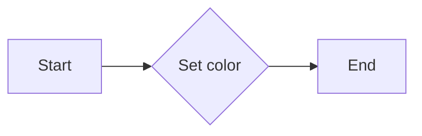
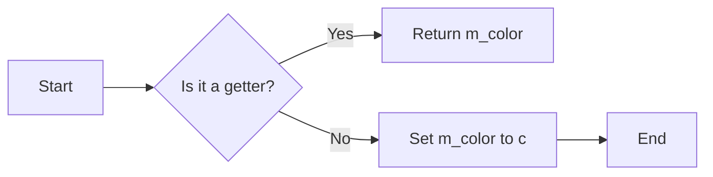
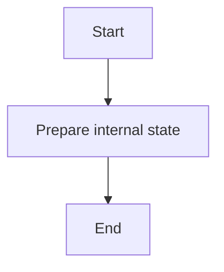
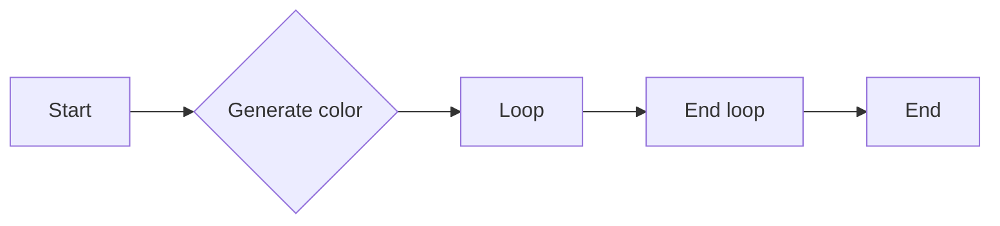
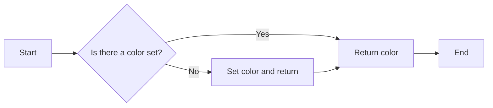
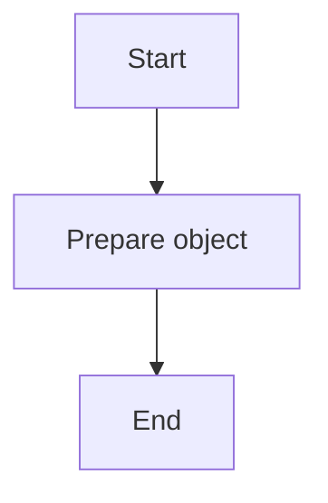
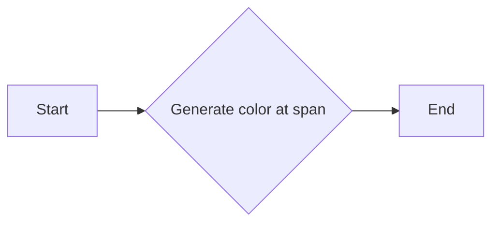

# `matplotlib\extern\agg24-svn\include\agg_span_solid.h` 详细设计文档

The code defines a template class for generating a solid color span in the Anti-Grain Geometry (AGG) library, which is used for rendering graphics.

## 整体流程

```mermaid
graph TD
    A[Include agg_basics.h] --> B[Define span_solid template class]
    B --> C[Public methods: color(), prepare(), generate()]
    C --> D[Private field: m_color]
```

## 类结构

```
agg::span_solid (template class)
├── color_type (color_type)
```

## 全局变量及字段


### `color_type`
    
A template type representing the color type used by the span_solid class.

类型：`template <class ColorT>`
    


### `span_solid.m_color`
    
The color value used to fill the span of pixels.

类型：`color_type`
    
    

## 全局函数及方法


### span_solid::color

该函数用于设置`span_solid`对象的颜色。

参数：

- `c`：`const color_type&`，指向要设置的颜色值的引用。

返回值：`void`，没有返回值。

#### 流程图



#### 带注释源码

```cpp
void color(const color_type& c) { m_color = c; }
```


### `span_solid::color()`

获取或设置当前颜色。

参数：

- `c`：`const color_type&`，当前颜色值

返回值：`const color_type&`，当前颜色值

#### 流程图



#### 带注释源码

```cpp
const color_type& color() const {
    // Return the current color value
    return m_color;
}
``` 


### `span_solid<color_type>::prepare()`

`prepare()` 方法用于初始化 `span_solid` 类的内部状态，以便进行后续的渲染操作。

参数：

- 无

返回值：无

#### 流程图



#### 带注释源码

```cpp
void span_solid<color_type>::prepare()
{
    // No specific action is taken here, as the internal state is already
    // initialized in the constructor and the color method.
}
```


### `span_solid<color_type>::generate`

该函数用于生成一个颜色均匀的像素行，其中每个像素的颜色都是通过`span_solid`对象指定的颜色。

参数：

- `span`：`color_type*`，指向目标像素行的指针。
- `x`：`int`，像素行的起始X坐标。
- `y`：`int`，像素行的起始Y坐标。
- `len`：`unsigned`，像素行的长度。

返回值：`void`，没有返回值。

#### 流程图



#### 带注释源码

```
void span_solid<color_type>::generate(color_type* span, int x, int y, unsigned len)
{   
    do { *span++ = m_color; } while(--len);
}
```


### span_solid.color

该函数用于设置`span_solid`类的颜色值。

参数：

- `c`：`const color_type&`，颜色值，用于设置`span_solid`类的颜色。

返回值：`void`，无返回值。

#### 流程图


#### 带注释源码

```cpp
void color(const color_type& c) { m_color = c; }
```


### span_solid::color()

该函数用于获取span_solid类的颜色值。

参数：

- `c`：`const color_type&`，指向颜色值的引用，用于获取当前的颜色值。

返回值：`const color_type&`，指向颜色值的常量引用，返回当前的颜色值。

#### 流程图



#### 带注释源码

```cpp
const color_type& color() const {
    return m_color;
}
```


### span_solid::prepare()

该函数用于准备span_solid对象，以便进行后续的渲染操作。

参数：

- 无

返回值：无

#### 流程图



#### 带注释源码

```cpp
void span_solid::prepare()
{
    // 函数体为空，表示没有具体的准备步骤
}
```


### span_solid::generate

`generate` 方法是 `span_solid` 类的一个成员函数，用于生成一个颜色均匀的像素行。

参数：

- `span`：`color_type*`，指向目标像素行的指针。
- `x`：`int`，像素行的起始 x 坐标。
- `y`：`int`，像素行的起始 y 坐标。
- `len`：`unsigned`，像素行的长度。

返回值：`void`，没有返回值。

#### 流程图



#### 带注释源码

```cpp
void span_solid<color_type>::generate(color_type* span, int x, int y, unsigned len)
{   
    do { *span++ = m_color; } while(--len);
}
```


## 关键组件


### 张量索引与惰性加载

张量索引与惰性加载是用于高效处理大型数据集的机制，它允许在需要时才加载数据，从而减少内存消耗和提高性能。

### 反量化支持

反量化支持是针对量化技术的一种优化，它允许在量化过程中进行反向操作，以便在需要时恢复原始数据精度。

### 量化策略

量化策略是用于将高精度数据转换为低精度表示的方法，以减少存储需求和加速计算过程。


## 问题及建议


### 已知问题

-   **代码复用性低**：`span_solid` 类仅支持单一颜色，缺乏灵活性，无法处理多种颜色或渐变效果。
-   **类型限制**：`color_type` 是一个模板参数，但未指定具体实现，可能导致类型不匹配或编译错误。
-   **异常处理**：代码中没有异常处理机制，如果发生错误（如内存访问错误），可能导致程序崩溃。

### 优化建议

-   **增加颜色处理功能**：扩展 `span_solid` 类，使其能够处理多种颜色和渐变效果，提高其通用性。
-   **类型安全**：为 `color_type` 提供具体的实现或类型约束，确保类型安全。
-   **异常处理**：添加异常处理机制，以捕获和处理潜在的错误，提高代码的健壮性。
-   **文档和注释**：增加详细的文档和注释，解释类的使用方法和功能，提高代码的可读性和可维护性。
-   **性能优化**：考虑使用更高效的算法或数据结构来处理颜色生成，提高代码的性能。

## 其它


### 设计目标与约束

- 设计目标：实现一个简单的、可复用的颜色填充类，用于在图像渲染中填充单一颜色。
- 约束条件：类必须能够接受任何类型的颜色，并能够填充任意长度的像素行。

### 错误处理与异常设计

- 错误处理：由于该类仅用于颜色填充，不涉及复杂逻辑，因此错误处理主要集中在参数验证上。
- 异常设计：如果传入的参数不符合预期（例如，颜色类型不支持），则抛出异常。

### 数据流与状态机

- 数据流：数据流从外部传入颜色值，通过`color()`方法设置，然后通过`generate()`方法输出到像素行。
- 状态机：该类没有状态机，因为它不涉及状态转换。

### 外部依赖与接口契约

- 外部依赖：依赖于`agg_basics.h`头文件，该文件提供了基本类型和宏定义。
- 接口契约：`span_solid`类提供了一个简单的接口，用于设置颜色和生成填充像素行。


    