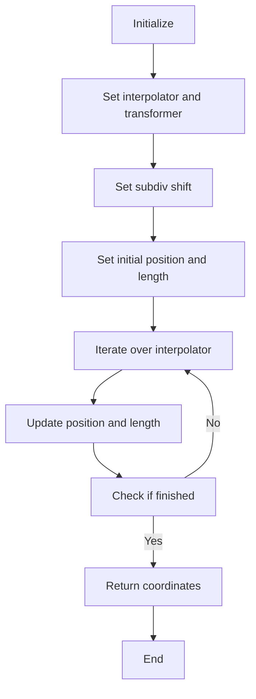
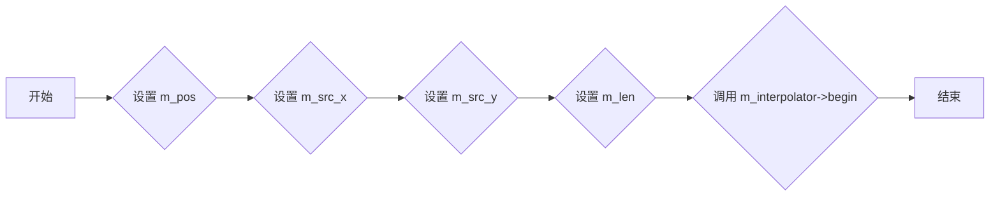
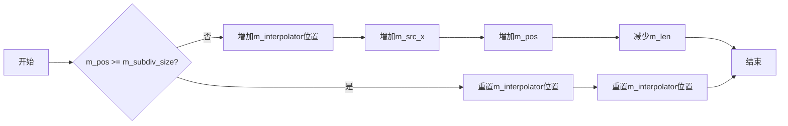
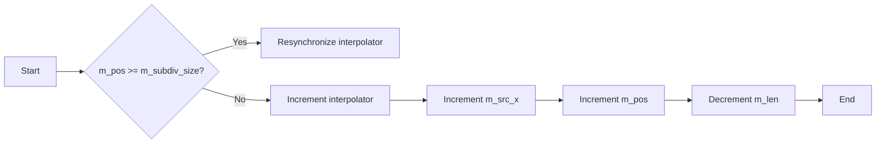
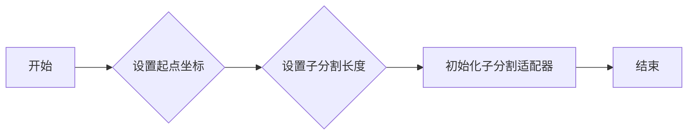
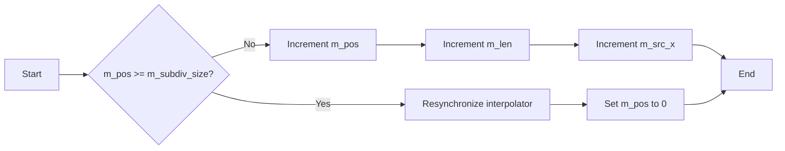

# `matplotlib\extern\agg24-svn\include\agg_span_subdiv_adaptor.h` 详细设计文档

The code defines a template class `span_subdiv_adaptor` that serves as an adapter for subdividing and interpolating spans of data, typically used in graphics rendering.

## 整体流程



## 类结构

```
agg::span_subdiv_adaptor<Interpolator, SubpixelShift> (模板类)
├── interpolator_type (模板参数类型)
│   ├── trans_type (模板参数类型)
│   └── sublixel_scale_e (枚举)
│       ├── subpixel_shift
│       └── subpixel_scale
├── m_subdiv_shift (私有成员变量)
│   ├── m_subdiv_size (私有成员变量)
│   ├── m_subdiv_mask (私有成员变量)
│   ├── m_interpolator (私有成员变量)
│   ├── m_src_x (私有成员变量)
│   ├── m_src_y (私有成员变量)
│   ├── m_pos (私有成员变量)
│   └── m_len (私有成员变量)
└── begin, operator++, coordinates, local_scale (公有成员函数)
```

## 全局变量及字段


### `subpixel_shift`
    
The shift amount for subpixel precision.

类型：`unsigned`
    


### `subpixel_scale`
    
The scale factor for subpixel precision, calculated as 2 raised to the power of subpixel_shift.

类型：`unsigned`
    


### `m_subdiv_shift`
    
The shift amount for the subdivision of the span.

类型：`unsigned`
    


### `m_subdiv_size`
    
The size of the subdivision, calculated as 2 raised to the power of m_subdiv_shift.

类型：`unsigned`
    


### `m_subdiv_mask`
    
The mask used to limit the subdivision size to the nearest power of two.

类型：`unsigned`
    


### `m_src_x`
    
The source x-coordinate, adjusted for subpixel precision.

类型：`int`
    


### `m_src_y`
    
The source y-coordinate.

类型：`double`
    


### `m_pos`
    
The current position within the span.

类型：`unsigned`
    


### `m_len`
    
The length of the span to be processed.

类型：`unsigned`
    


### `span_subdiv_adaptor.m_subdiv_shift`
    
The shift amount for the subdivision of the span.

类型：`unsigned`
    


### `span_subdiv_adaptor.m_subdiv_size`
    
The size of the subdivision, calculated as 2 raised to the power of m_subdiv_shift.

类型：`unsigned`
    


### `span_subdiv_adaptor.m_subdiv_mask`
    
The mask used to limit the subdivision size to the nearest power of two.

类型：`unsigned`
    


### `span_subdiv_adaptor.m_interpolator`
    
A pointer to the interpolator object used for the span.

类型：`Interpolator*`
    


### `span_subdiv_adaptor.m_src_x`
    
The source x-coordinate, adjusted for subpixel precision.

类型：`int`
    


### `span_subdiv_adaptor.m_src_y`
    
The source y-coordinate.

类型：`double`
    


### `span_subdiv_adaptor.m_pos`
    
The current position within the span.

类型：`unsigned`
    


### `span_subdiv_adaptor.m_len`
    
The length of the span to be processed.

类型：`unsigned`
    
    

## 全局函数及方法


### begin

`begin` 方法是 `span_subdiv_adaptor` 类的一个成员函数，用于初始化子分割适配器的状态。

参数：

- `x`：`double`，表示起始点的 x 坐标。
- `y`：`double`，表示起始点的 y 坐标。
- `len`：`unsigned`，表示要处理的线段长度。

返回值：无

#### 流程图



#### 带注释源码

```cpp
void begin(double x, double y, unsigned len)
{
    m_pos   = 1;
    m_src_x = iround(x * subpixel_scale) + subpixel_scale;
    m_src_y = y;
    m_len   = len;
    if(len > m_subdiv_size) len = m_subdiv_size;
    m_interpolator->begin(x, y, len);
}
``` 


### `span_subdiv_adaptor::operator++`

增加子像素分割适配器的位置。

参数：

- 无

返回值：`void`，无返回值

#### 流程图



#### 带注释源码

```cpp
        //----------------------------------------------------------------
        void operator++()
        {
            ++(*m_interpolator); // 增加m_interpolator的位置
            if(m_pos >= m_subdiv_size) // 检查是否达到子分割大小
            {
                unsigned len = m_len; // 保存剩余长度
                if(len > m_subdiv_size) len = m_subdiv_size; // 限制长度
                m_interpolator->resynchronize(double(m_src_x) / double(subpixel_scale) + len, 
                                              m_src_y, 
                                              len); // 重置m_interpolator的位置
                m_pos = 0; // 重置位置计数器
            }
            m_src_x += subpixel_scale; // 增加源X坐标
            ++m_pos; // 增加位置计数器
            --m_len; // 减少剩余长度
        }
``` 


### coordinates

获取当前插值器的坐标。

参数：

- `x`：`int*`，指向存储x坐标的整数指针
- `y`：`int*`，指向存储y坐标的整数指针

返回值：`void`，无返回值

#### 流程图

```mermaid
graph LR
A[Start] --> B{Check m_interpolator}
B -- Yes --> C[Call m_interpolator->coordinates(x, y)]
B -- No --> D[Error: m_interpolator is null]
C --> E[End]
D --> E
```

#### 带注释源码

```cpp
        //----------------------------------------------------------------
        void coordinates(int* x, int* y) const
        {
            m_interpolator->coordinates(x, y);
        }
``` 


### `span_subdiv_adaptor::local_scale`

`span_subdiv_adaptor::local_scale` 方法是 `span_subdiv_adaptor` 类的一个成员函数，用于获取局部缩放因子。

参数：

- `x`：`int*`，指向一个整数，用于存储局部缩放因子的 x 分量。
- `y`：`int*`，指向一个整数，用于存储局部缩放因子的 y 分量。

返回值：无

#### 流程图

```mermaid
graph LR
A[Start] --> B{Call m_interpolator->local_scale(x, y)}
B --> C[End]
```

#### 带注释源码

```cpp
        //----------------------------------------------------------------
        void local_scale(int* x, int* y) const
        {
            m_interpolator->local_scale(x, y);
        }
```


### span_subdiv_adaptor::begin

初始化子分割适配器的起点。

参数：

- `x`：`double`，起点X坐标。
- `y`：`double`，起点Y坐标。
- `len`：`unsigned`，子分割的长度。

返回值：无

#### 流程图

```mermaid
graph LR
A[开始] --> B{设置m_pos}
B --> C{设置m_src_x}
C --> D{设置m_src_y}
D --> E{设置m_len}
E --> F{调用m_interpolator->begin(x, y, len)}
F --> G[结束]
```

#### 带注释源码

```cpp
void begin(double x, double y, unsigned len)
{
    m_pos   = 1;
    m_src_x = iround(x * subpixel_scale) + subpixel_scale;
    m_src_y = y;
    m_len   = len;
    if(len > m_subdiv_size) len = m_subdiv_size;
    m_interpolator->begin(x, y, len);
}
```


### span_subdiv_adaptor::operator++

该函数是`span_subdiv_adaptor`类的一个成员函数，用于递增迭代器。

参数：

- 无

返回值：`void`，无返回值

#### 流程图



#### 带注释源码

```cpp
void operator++()
{
    ++(*m_interpolator);
    if(m_pos >= m_subdiv_size)
    {
        unsigned len = m_len;
        if(len > m_subdiv_size) len = m_subdiv_size;
        m_interpolator->resynchronize(double(m_src_x) / double(subpixel_scale) + len, 
                                      m_src_y, 
                                      len);
        m_pos = 0;
    }
    m_src_x += subpixel_scale;
    ++m_pos;
    --m_len;
}
```


### span_subdiv_adaptor::transformer

获取或设置用于变换的转换器。

参数：

- `trans`：`const trans_type&`，一个指向转换器的引用，用于设置转换器。

返回值：`const trans_type&`，一个指向当前转换器的引用。

#### 流程图

```mermaid
graph LR
A[span_subdiv_adaptor] --> B{transformer()}
B --> C[const trans_type&]
```

#### 带注释源码

```cpp
        //----------------------------------------------------------------
        const trans_type& transformer() const 
        { 
            return *m_interpolator->transformer(); 
        }
        void transformer(const trans_type& trans) 
        { 
            m_interpolator->transformer(trans); 
        }
```


### span_subdiv_adaptor::operator++

该函数是`span_subdiv_adaptor`类的一个成员函数，用于递增迭代器。

参数：

- 无

返回值：`void`，无返回值

#### 流程图


#### 带注释源码

```cpp
void operator++()
{
    ++(*m_interpolator);
    if(m_pos >= m_subdiv_size)
    {
        unsigned len = m_len;
        if(len > m_subdiv_size) len = m_subdiv_size;
        m_interpolator->resynchronize(double(m_src_x) / double(subpixel_scale) + len, 
                                      m_src_y, 
                                      len);
        m_pos = 0;
    }
    m_src_x += subpixel_scale;
    ++m_pos;
    --m_len;
}
```


### `span_subdiv_adaptor::begin`

初始化子分割适配器的起点。

参数：

- `x`：`double`，起点X坐标。
- `y`：`double`，起点Y坐标。
- `len`：`unsigned`，子分割的长度。

返回值：`void`，无返回值。

#### 流程图



#### 带注释源码

```cpp
        //----------------------------------------------------------------
        void begin(double x, double y, unsigned len)
        {
            m_pos   = 1;
            m_src_x = iround(x * subpixel_scale) + subpixel_scale;
            m_src_y = y;
            m_len   = len;
            if(len > m_subdiv_size) len = m_subdiv_size;
            m_interpolator->begin(x, y, len);
        }
``` 


### span_subdiv_adaptor::operator++

该函数是`span_subdiv_adaptor`类的一个成员函数，用于递增迭代器。

参数：

- 无

返回值：`void`，无返回值

#### 流程图



#### 带注释源码

```cpp
        //----------------------------------------------------------------
        void operator++()
        {
            ++(*m_interpolator); // Increment the interpolator
            if(m_pos >= m_subdiv_size) // Check if position is at the end of subdiv_size
            {
                unsigned len = m_len; // Store the current length
                if(len > m_subdiv_size) len = m_subdiv_size; // Limit the length to subdiv_size
                m_interpolator->resynchronize(double(m_src_x) / double(subpixel_scale) + len, 
                                              m_src_y, 
                                              len); // Resynchronize the interpolator
                m_pos = 0; // Reset position
            }
            m_src_x += subpixel_scale; // Increment source x by subpixel scale
            ++m_pos; // Increment position
            --m_len; // Decrement length
        }
``` 


### span_subdiv_adaptor.coordinates

该函数用于获取当前插值器的坐标。

参数：

- `x`：`int*`，用于存储计算出的x坐标。
- `y`：`int*`，用于存储计算出的y坐标。

返回值：无

#### 流程图

```mermaid
graph LR
A[Start] --> B{Call m_interpolator->coordinates(x, y)}
B --> C[End]
```

#### 带注释源码

```cpp
        //----------------------------------------------------------------
        void coordinates(int* x, int* y) const
        {
            m_interpolator->coordinates(x, y);
        }
``` 


### span_subdiv_adaptor::local_scale

该函数用于获取局部缩放因子。

参数：

- `x`：`int*`，指向存储x坐标的整数指针
- `y`：`int*`，指向存储y坐标的整数指针

返回值：`void`，无返回值

#### 流程图

```mermaid
graph LR
A[Start] --> B{Call m_interpolator->local_scale(x, y)}
B --> C[End]
```

#### 带注释源码

```cpp
        //----------------------------------------------------------------
        void local_scale(int* x, int* y) const
        {
            m_interpolator->local_scale(x, y);
        }
``` 


## 关键组件


### 张量索引与惰性加载

张量索引与惰性加载是代码中用于高效处理和访问数据结构的关键组件。它允许在需要时才计算或加载数据，从而减少内存使用和提高性能。

### 反量化支持

反量化支持是代码中用于处理高精度浮点数到低精度整数转换的关键组件。它确保在图像处理和几何计算中保持足够的精度。

### 量化策略

量化策略是代码中用于优化数据表示和计算的关键组件。它通过减少数据精度来减少内存使用和计算时间，同时保持足够的精度以满足应用需求。


## 问题及建议


### 已知问题

-   **代码复杂度**：类 `span_subdiv_adaptor` 包含多个成员变量和方法，这可能导致代码难以理解和维护。
-   **性能问题**：在 `begin` 方法中，对 `len` 的检查可能导致不必要的性能开销，特别是在 `len` 值远大于 `m_subdiv_size` 时。
-   **代码重复**：`subpixel_scale` 的计算在多个地方重复出现，可以考虑将其定义为常量或计算一次后存储。

### 优化建议

-   **简化代码结构**：考虑将一些逻辑分离到单独的函数中，以减少类的复杂性。
-   **优化性能**：在 `begin` 方法中，如果 `len` 值远大于 `m_subdiv_size`，可以提前进行优化，避免不必要的循环。
-   **减少代码重复**：将 `subpixel_scale` 的计算移到类的构造函数中，并在需要的地方引用该值，而不是重复计算。
-   **文档注释**：增加对类成员变量和方法的详细文档注释，以提高代码的可读性和可维护性。
-   **类型安全**：考虑使用类型安全的编程实践，例如使用引用而不是指针，以减少内存泄漏和指针错误的风险。


## 其它


### 设计目标与约束

- 设计目标：实现一个高效的子像素细分适配器，用于在图像处理中提供高质量的图像渲染。
- 约束条件：适配器需要支持多种插值器，并能够适应不同的子像素细分级别。

### 错误处理与异常设计

- 错误处理：当输入参数不合法时，抛出异常。
- 异常设计：使用标准异常处理机制，确保异常能够被正确捕获和处理。

### 数据流与状态机

- 数据流：数据流从输入的坐标和长度开始，通过插值器进行计算，最终输出坐标和局部缩放比例。
- 状态机：适配器包含一个内部状态机，用于管理插值器的状态和细分级别。

### 外部依赖与接口契约

- 外部依赖：依赖于插值器类和变换器类。
- 接口契约：插值器类和变换器类需要提供特定的接口，以便适配器能够正确使用它们。

### 安全性和隐私

- 安全性：确保代码不会因为外部输入而受到攻击。
- 隐私：不涉及敏感数据，因此隐私不是主要考虑因素。

### 性能考量

- 性能目标：优化代码，确保在处理大量数据时保持高效。
- 性能考量：使用高效的算法和数据结构，减少不必要的计算和内存使用。

### 可维护性和可扩展性

- 可维护性：代码结构清晰，易于理解和维护。
- 可扩展性：设计允许轻松添加新的插值器和变换器。

### 测试与验证

- 测试策略：编写单元测试和集成测试，确保适配器在各种情况下都能正常工作。
- 验证方法：使用基准测试和性能测试来验证适配器的性能。

### 文档和注释

- 文档：提供详细的文档，包括类和方法描述、参数说明和示例代码。
- 注释：在代码中添加必要的注释，以提高代码的可读性和可维护性。

### 代码风格和规范

- 代码风格：遵循统一的代码风格规范，确保代码的一致性和可读性。
- 规范：遵循编程语言的最佳实践和编码规范。


    