# `matplotlib\extern\agg24-svn\include\agg_trans_affine.h` 详细设计文档

This file defines the trans_affine class, which represents an affine transformation in Cartesian coordinates. It includes methods for rotation, scaling, translation, and skewing, as well as operations for multiplying and inverting transformations.

## 整体流程

```mermaid
graph TD
    A[Start] --> B[Create trans_affine object]
    B --> C[Set transformations (rotate, scale, translate)]
    C --> D[Transform points]
    D --> E[Check validity of transformation]
    E -->|Yes| F[End]
    E -->|No| G[Invert transformation and retry]
```

## 类结构

```
trans_affine (Affine Transformation)
├── trans_affine_rotation (Rotation)
├── trans_affine_scaling (Scaling)
├── trans_affine_translation (Translation)
├── trans_affine_skewing (Skewing)
├── trans_affine_line_segment (Line Segment)
└── trans_affine_reflection_unit (Reflection Unit)
    └── trans_affine_reflection (Reflection)
```

## 全局变量及字段


### `affine_epsilon`
    
The default epsilon value used for comparison of double precision floating point numbers in affine transformations.

类型：`double`
    


### `trans_affine.sx`
    
The scaling factor along the x-axis.

类型：`double`
    


### `trans_affine.shy`
    
The skewing factor along the y-axis.

类型：`double`
    


### `trans_affine.shx`
    
The skewing factor along the x-axis.

类型：`double`
    


### `trans_affine.sy`
    
The scaling factor along the y-axis.

类型：`double`
    


### `trans_affine.tx`
    
The translation factor along the x-axis.

类型：`double`
    


### `trans_affine.ty`
    
The translation factor along the y-axis.

类型：`double`
    
    

## 全局函数及方法


### is_equal

Check to see if two matrices are equal

参数：

-  `m`：`const trans_affine&`，The matrix to compare with

返回值：`bool`，Returns true if the matrices are equal, false otherwise

#### 流程图

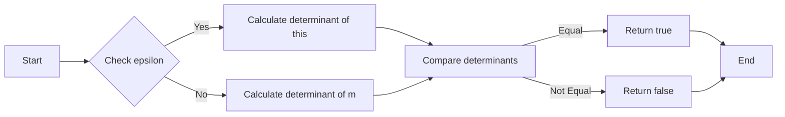

#### 带注释源码

```cpp
bool trans_affine::is_equal(const trans_affine& m, double epsilon) const
{
    double det_this = determinant();
    double det_m = m.determinant();
    return (fabs(det_this - det_m) < epsilon);
}
```


### trans_affine::transform

Transforms a point (x, y) using the affine transformation matrix.

参数：

- `x`：`double*`，The pointer to the x-coordinate of the point to be transformed.
- `y`：`double*`，The pointer to the y-coordinate of the point to be transformed.

返回值：`void`，No return value.

#### 流程图

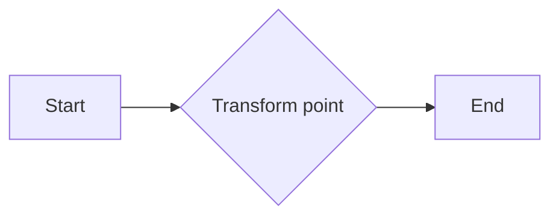

#### 带注释源码

```cpp
inline void trans_affine::transform(double* x, double* y) const
{
    double tmp = *x;
    *x = tmp * sx  + *y * shx + tx;
    *y = tmp * shy + *y * sy  + ty;
}
```


### `trans_affine.inverse_transform`

This method performs the inverse transformation on a point given its coordinates. It calculates the inverse of the current affine transformation matrix and applies it to the point.

参数：

- `x`：`double*`，The pointer to the x-coordinate of the point to be transformed.
- `y`：`double*`，The pointer to the y-coordinate of the point to be transformed.

返回值：`void`，No return value. The transformed coordinates are stored in the provided pointers.

#### 流程图

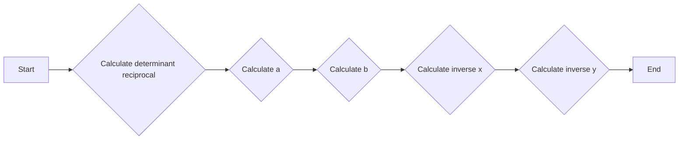

#### 带注释源码

```cpp
inline void trans_affine::inverse_transform(double* x, double* y) const
{
    double d = determinant_reciprocal();
    double a = (*x - tx) * d;
    double b = (*y - ty) * d;
    *x = a * sy - b * shx;
    *y = b * sx - a * shy;
}
``` 


### `trans_affine::determinant`

计算矩阵的行列式。

参数：

- 无

返回值：`double`，矩阵的行列式值

#### 流程图

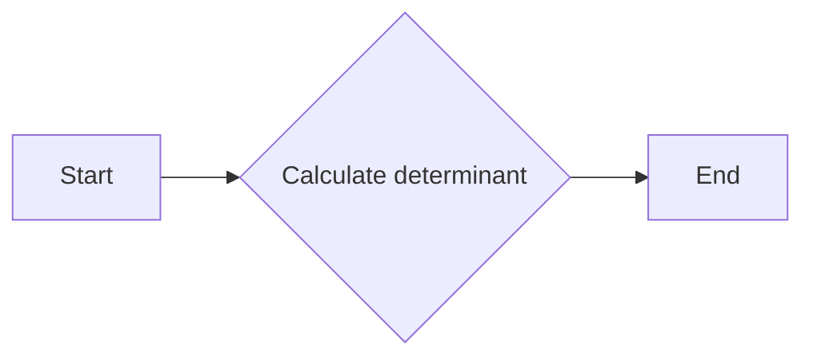

#### 带注释源码

```cpp
double trans_affine::determinant() const
{
    return sx * sy - shy * shx;
}
```


### `trans_affine::determinant_reciprocal`

计算矩阵行列式的倒数。

参数：

- 无

返回值：`double`，行列式的倒数

#### 流程图

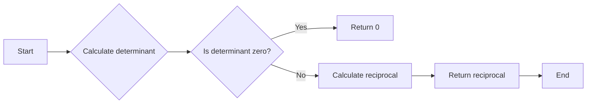

#### 带注释源码

```cpp
inline double trans_affine::determinant_reciprocal() const
{
    return 1.0 / (sx * sy - shy * shx);
}
```


### trans_affine::transform

Transforms a point (x, y) using the affine transformation matrix.

参数：

- `x`：`double*`，The pointer to the x-coordinate of the point to be transformed.
- `y`：`double*`，The pointer to the y-coordinate of the point to be transformed.

返回值：`void`，No return value.

#### 流程图


#### 带注释源码

```cpp
inline void trans_affine::transform(double* x, double* y) const
{
    double tmp = *x;
    *x = tmp * sx  + *y * shx + tx;
    *y = tmp * shy + *y * sy  + ty;
}
```


### trans_affine::is_valid

Check if the matrix is not degenerate.

参数：

- `epsilon`：`double`，The epsilon value to use for comparison. Default is `affine_epsilon`.

返回值：`bool`，Returns `true` if the matrix is not degenerate, otherwise `false`.

#### 流程图

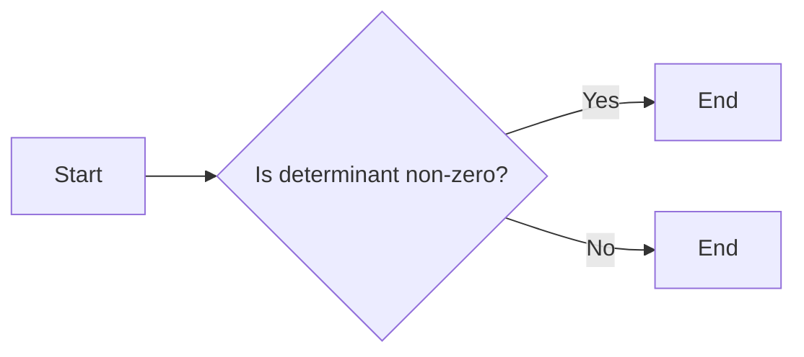

#### 带注释源码

```cpp
inline bool trans_affine::is_valid(double epsilon) const
{
    return fabs(determinant()) > epsilon;
}
```


### trans_affine.is_identity

Check if the matrix is an identity matrix.

参数：

-  `epsilon`：`double`，The epsilon value to use for comparison. Default is `affine_epsilon`.

返回值：`bool`，Returns `true` if the matrix is an identity matrix, otherwise `false`.

#### 流程图

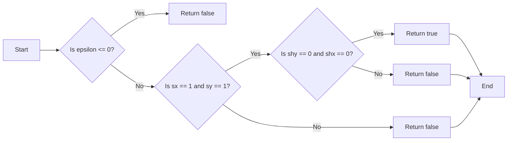

#### 带注释源码

```cpp
inline bool trans_affine::is_identity(double epsilon) const
{
    if (epsilon <= 0.0)
    {
        return false;
    }
    if (sx == 1.0 && sy == 1.0)
    {
        if (shy == 0.0 && shx == 0.0)
        {
            return true;
        }
    }
    return false;
}
```


### trans_affine::translate

将平移变换应用于变换矩阵。

参数：

- `x`：`double`，沿X轴的平移量
- `y`：`double`，沿Y轴的平移量

返回值：`const trans_affine&`，当前变换矩阵的引用

#### 流程图

```mermaid
graph LR
A[Start] --> B{Call translate(x, y)}
B --> C[Update tx and ty]
C --> D[Return]
```

#### 带注释源码

```cpp
inline const trans_affine& trans_affine::translate(double x, double y) 
{ 
    tx += x;
    ty += y; 
    return *this;
}
```


### `trans_affine::transform`

Transforms a point (x, y) using the affine transformation matrix.

参数：

- `x`：`double*`，The pointer to the x-coordinate of the point to be transformed.
- `y`：`double*`，The pointer to the y-coordinate of the point to be transformed.

返回值：`void`，No return value.

#### 流程图


#### 带注释源码

```cpp
inline void trans_affine::transform(double* x, double* y) const
{
    double tmp = *x;
    *x = tmp * sx  + *y * shx + tx;
    *y = tmp * shy + *y * sy  + ty;
}
```


### `trans_affine::transform`

Transforms a point (x, y) using the affine transformation matrix.

参数：

- `x`：`double*`，The pointer to the x-coordinate of the point to be transformed.
- `y`：`double*`，The pointer to the y-coordinate of the point to be transformed.

返回值：`void`，No return value.

#### 流程图


#### 带注释源码

```cpp
inline void trans_affine::transform(double* x, double* y) const
{
    double tmp = *x;
    *x = tmp * sx  + *y * shx + tx;
    *y = tmp * shy + *y * sy  + ty;
}
```


### `trans_affine::scaling_abs`

This method calculates the absolute scaling factors along the x and y axes of an affine transformation. It is used to estimate scaling coefficients in image resampling, providing a more accurate estimation when there is considerable shear.

参数：

- `x`：`double*`，A pointer to a double where the absolute scaling factor along the x-axis will be stored.
- `y`：`double*`，A pointer to a double where the absolute scaling factor along the y-axis will be stored.

返回值：`void`，No return value.

#### 流程图

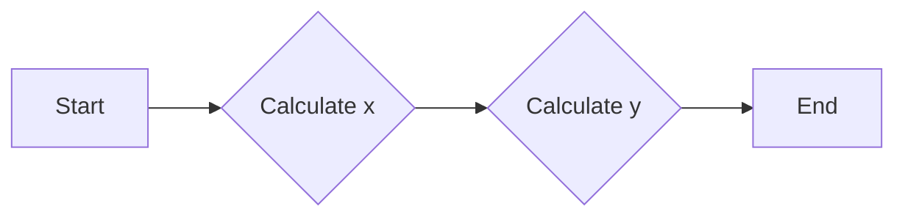

#### 带注释源码

```cpp
inline void trans_affine::scaling_abs(double* x, double* y) const
{
    // Used to calculate scaling coefficients in image resampling. 
    // When there is considerable shear this method gives us much
    // better estimation than just sx, sy.
    *x = sqrt(sx  * sx  + shx * shx);
    *y = sqrt(shy * shy + sy  * sy);
}
``` 


### trans_affine.reset

Reset the affine transformation to the identity matrix.

参数：

- 无

返回值：`const trans_affine&`，返回当前对象，表示修改后的变换矩阵。

#### 流程图

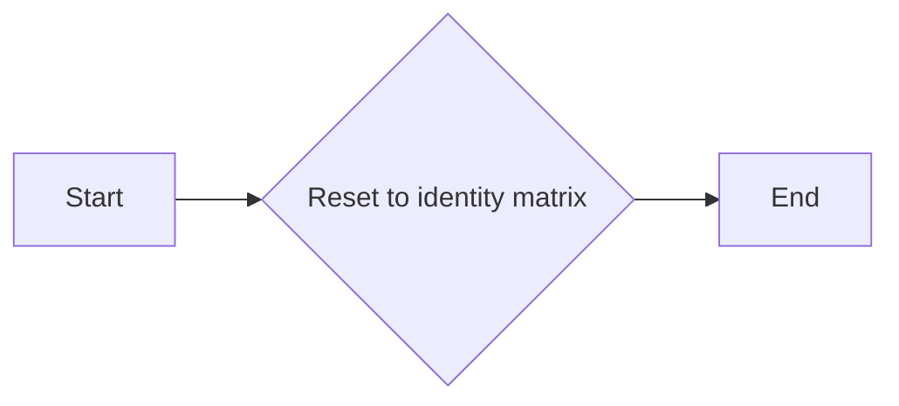

#### 带注释源码

```cpp
inline const trans_affine& trans_affine::reset()
{
    sx = 1.0; shy = 0.0; shx = 0.0; sy = 1.0; tx = 0.0; ty = 0.0;
    return *this;
}
```


### trans_affine::translate

This method translates the affine transformation by a given amount along the x and y axes.

参数：

- `x`：`double`，沿x轴移动的距离
- `y`：`double`，沿y轴移动的距离

返回值：`const trans_affine&`，返回当前对象，表示修改后的变换

#### 流程图

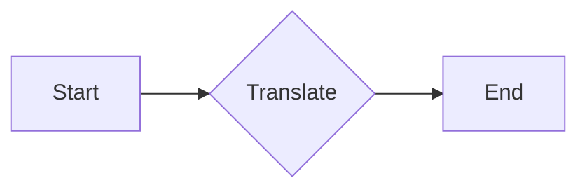

#### 带注释源码

```cpp
inline const trans_affine& trans_affine::translate(double x, double y) 
{ 
    tx += x;
    ty += y; 
    return *this;
}
```


### trans_affine.rotate

This method rotates the affine transformation by a specified angle.

参数：

- `a`：`double`，The angle of rotation in degrees.

返回值：`const trans_affine&`，The current `trans_affine` object after rotation.

#### 流程图

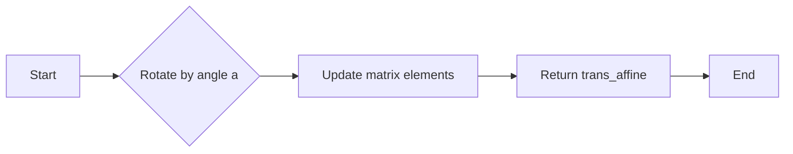

#### 带注释源码

```cpp
inline const trans_affine& trans_affine::rotate(double a) 
{
    double ca = cos(a); 
    double sa = sin(a);
    double t0 = sx  * ca - shy * sa;
    double t2 = shx * ca - sy * sa;
    double t4 = tx  * ca - ty * sa;
    shy = sx  * sa + shy * ca;
    sy  = shx * sa + sy * ca; 
    ty  = tx  * sa + ty * ca;
    sx  = t0;
    shx = t2;
    tx  = t4;
    return *this;
}
```


### trans_affine::scale

This method scales the transformation matrix by the given scale factor along both axes.

参数：

- `s`：`double`，The scale factor to apply to both axes. If only one value is provided, it is used for both the X and Y axes.

返回值：`const trans_affine&`，The current transformation matrix after scaling.

#### 流程图

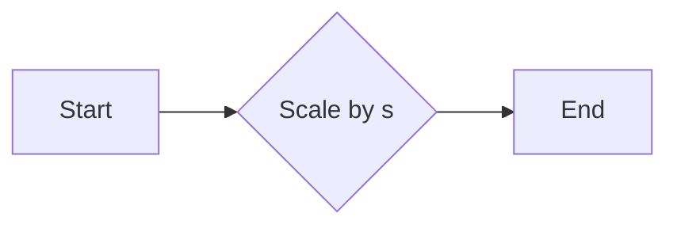

#### 带注释源码

```cpp
inline const trans_affine& trans_affine::scale(double s) 
{
    double m = s; // Possible hint for the optimizer
    sx  *= m;
    shx *= m;
    tx  *= m;
    shy *= m;
    sy  *= m;
    ty  *= m;
    return *this;
}
```


### trans_affine::multiply

Multiply the matrix to another one.

参数：

- `m`：`const trans_affine&`，The matrix to multiply with.

返回值：`const trans_affine&`，The result of the multiplication.

#### 流程图

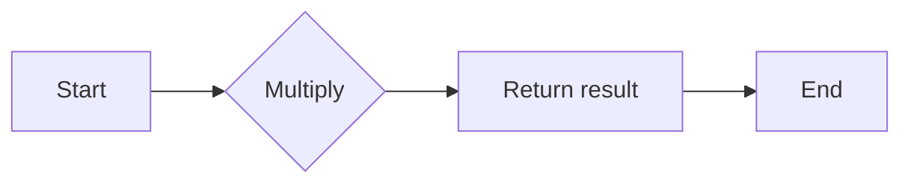

#### 带注释源码

```cpp
inline const trans_affine& trans_affine::multiply(const trans_affine& m) const
{
    double a = sx * m.sx + shy * m.shx;
    double b = sx * m.shy + sy * m.sy;
    double c = shx * m.sx + sy * m.shx;
    double d = shx * m.shy + sy * m.sy;
    double e = tx * m.sx + ty * m.shx + m.tx;
    double f = tx * m.shy + ty * m.sy + m.ty;

    sx = a;
    shy = b;
    shx = c;
    sy = d;
    tx = e;
    ty = f;

    return *this;
}
```


### trans_affine.invert

Inverts the affine transformation matrix.

参数：

- 无

返回值：`const trans_affine&`，返回当前对象，其矩阵被反转。

#### 流程图

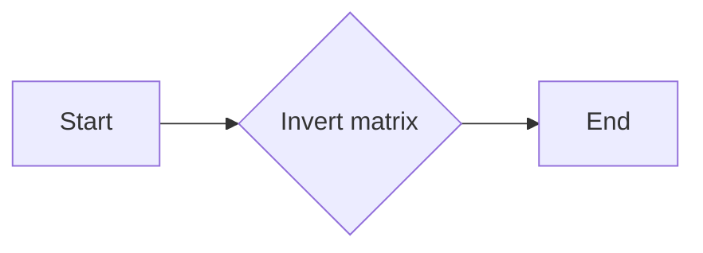

#### 带注释源码

```cpp
inline const trans_affine& trans_affine::invert()
{
    double d = determinant_reciprocal();
    sx *= d; shy *= d; shx *= d; sy *= d;
    tx *= d; ty *= d;
    return *this;
}
``` 


### trans_affine.flip_x

This method mirrors the transformation matrix around the X-axis, effectively flipping the Y-coordinates of the points being transformed.

参数：

- 无

返回值：`const trans_affine&`，返回当前对象，表示修改后的变换矩阵

#### 流程图

```mermaid
graph LR
A[Start] --> B{Call flip_x()}
B --> C[End]
```

#### 带注释源码

```cpp
inline const trans_affine& trans_affine::flip_x()
{
    double t0 = sx;
    sx = sy;
    sy = t0;
    return *this;
}
```


### trans_affine.flip_y

This method mirrors the transformation matrix around the Y-axis, effectively flipping the coordinates vertically.

参数：

- 无

返回值：`const trans_affine&`，返回当前对象，表示修改后的变换矩阵

#### 流程图

```mermaid
graph LR
A[Start] --> B{Call flip_y()}
B --> C[End]
```

#### 带注释源码

```cpp
inline const trans_affine& trans_affine::flip_y()
{
    double t0 = sx;
    sx = -shx;
    shx = t0;
    return *this;
}
```


### trans_affine.store_to

Store the matrix to an array of doubles.

参数：

- `m`：`double*`，A pointer to an array of doubles where the matrix will be stored.

返回值：`void`，No return value.

#### 流程图

```mermaid
graph LR
A[Start] --> B{Store matrix elements}
B --> C[End]
```

#### 带注释源码

```cpp
void trans_affine::store_to(double* m) const
{
    *m++ = sx; *m++ = shy; *m++ = shx; *m++ = sy; *m++ = tx; *m++ = ty;
}
```


### trans_affine.load_from

This method loads the affine transformation matrix from a given array of doubles.

参数：

- `m`：`const double*`，A pointer to an array of six doubles representing the transformation matrix.

返回值：`const trans_affine&`，The current `trans_affine` object after loading the matrix.

#### 流程图

```mermaid
graph LR
A[Start] --> B{Load matrix from array}
B --> C[End]
```

#### 带注释源码

```cpp
const trans_affine& trans_affine::load_from(const double* m)
{
    sx = *m++; shy = *m++; shx = *m++; sy = *m++; tx = *m++;  ty = *m++;
    return *this;
}
```


### trans_affine::transform

Transforms a point by applying the affine transformation.

参数：

- `x`：`double*`，The pointer to the x-coordinate of the point to be transformed.
- `y`：`double*`，The pointer to the y-coordinate of the point to be transformed.

返回值：`void`，No return value.

#### 流程图

```mermaid
graph LR
A[Start] --> B{Transform point}
B --> C[End]
```

#### 带注释源码

```cpp
inline void trans_affine::transform(double* x, double* y) const
{
    double tmp = *x;
    *x = tmp * sx  + *y * shx + tx;
    *y = tmp * shy + *y * sy  + ty;
}
```


### trans_affine.inverse_transform

This method performs the inverse transformation on a point given the current affine transformation matrix.

参数：

- `x`：`double*`，The pointer to the x-coordinate of the point to be transformed.
- `y`：`double*`，The pointer to the y-coordinate of the point to be transformed.

返回值：`void`，No return value. The transformed coordinates are stored in the provided pointers.

#### 流程图

```mermaid
graph LR
A[Start] --> B{Check for valid matrix}
B -- Yes --> C[Calculate inverse determinant]
B -- No --> D[Error handling]
C --> E[Calculate inverse matrix elements]
E --> F[Transform point using inverse matrix]
F --> G[End]
```

#### 带注释源码

```cpp
inline void trans_affine::inverse_transform(double* x, double* y) const
{
    double d = determinant_reciprocal();
    double a = (*x - tx) * d;
    double b = (*y - ty) * d;
    *x = a * sy - b * shx;
    *y = b * sx - a * shy;
}
```


### trans_affine::determinant

Calculate the determinant of the matrix.

参数：

- 无

返回值：`double`，The determinant of the matrix.

#### 流程图

```mermaid
graph LR
A[Start] --> B{Calculate determinant}
B --> C[End]
```

#### 带注释源码

```cpp
inline double trans_affine::determinant() const
{
    return sx * sy - shy * shx;
}
```


### trans_affine.determinant_reciprocal

Calculate the reciprocal of the determinant of the affine transformation matrix.

参数：

- 无

返回值：`double`，The reciprocal of the determinant of the matrix.

#### 流程图

```mermaid
graph LR
A[Start] --> B{Calculate determinant}
B --> C{Is determinant zero?}
C -- Yes --> D[Return 0]
C -- No --> E[Calculate reciprocal]
E --> F[Return reciprocal]
F --> G[End]
```

#### 带注释源码

```cpp
inline double trans_affine::determinant_reciprocal() const
{
    return 1.0 / (sx * sy - shy * shx);
}
```


### trans_affine.is_valid

Check if the matrix is not degenerate.

参数：

- `epsilon`：`double`，The epsilon value to use for comparison. Default is `affine_epsilon`.

返回值：`bool`，Returns `true` if the matrix is not degenerate, otherwise `false`.

#### 流程图

```mermaid
graph LR
A[Start] --> B{Check determinant}
B -->|Yes| C[Valid]
B -->|No| D[Invalid]
C --> E[End]
D --> E
```

#### 带注释源码

```cpp
inline bool trans_affine::is_valid(double epsilon) const
{
    return fabs(determinant()) > epsilon;
}
```


### trans_affine.is_identity

This method checks if the affine transformation matrix is an identity matrix.

参数：

- 无

返回值：`bool`，If the matrix is an identity matrix, returns `true`; otherwise, returns `false`.

#### 流程图

```mermaid
graph LR
A[Start] --> B{Is matrix identity?}
B -- Yes --> C[End]
B -- No --> D[End]
```

#### 带注释源码

```cpp
inline bool trans_affine::is_identity(double epsilon) const
{
    return is_equal(trans_affine(1.0, 0.0, 0.0, 1.0, 0.0, 0.0), epsilon);
}
```


### trans_affine.is_equal

Check if two affine transformations are equal within a specified epsilon.

参数：

- `m`：`const trans_affine&`，The affine transformation to compare with.
- `epsilon`：`double`，The epsilon value to use for the comparison. Default is `affine_epsilon`.

返回值：`bool`，Returns `true` if the transformations are equal within the epsilon, otherwise `false`.

#### 流程图

```mermaid
graph LR
A[Start] --> B{Check epsilon}
B -->|epsilon == 0| C[Return false]
B -->|epsilon != 0| D{Calculate difference}
D --> E{Is difference < epsilon?}
E -->|Yes| F[Return true]
E -->|No| G[Return false]
F --> H[End]
G --> H
```

#### 带注释源码

```cpp
bool trans_affine::is_equal(const trans_affine& m, double epsilon) const
{
    double diff = fabs(sx - m.sx) + fabs(shy - m.shy) +
                  fabs(shx - m.shx) + fabs(sy - m.sy) +
                  fabs(tx - m.tx) + fabs(ty - m.ty);
    return diff < epsilon;
}
```


### trans_affine_rotation

This function creates a rotation matrix for an affine transformation.

参数：

- `a`：`double`，The angle of rotation in degrees.

返回值：`trans_affine_rotation`，A rotation matrix that can be used to rotate points.

#### 流程图

```mermaid
graph LR
A[trans_affine_rotation] --> B{Create rotation matrix}
B --> C[Return rotation matrix]
```

#### 带注释源码

```cpp
class trans_affine_rotation : public trans_affine
{
public:
    trans_affine_rotation(double a) : 
      trans_affine(cos(a), sin(a), -sin(a), cos(a), 0.0, 0.0)
    {}
};
```


### trans_affine::translate

This method translates the affine transformation by a given amount along the x and y axes.

参数：

- `x`：`double`，沿x轴移动的距离
- `y`：`double`，沿y轴移动的距离

返回值：`const trans_affine&`，返回当前对象，表示修改后的变换

#### 流程图

```mermaid
graph LR
A[Start] --> B{Call translate(x, y)}
B --> C[Update tx and ty]
C --> D[Return current object]
D --> E[End]
```

#### 带注释源码

```cpp
inline const trans_affine& trans_affine::translate(double x, double y) 
{ 
    tx += x;
    ty += y; 
    return *this;
}
```


### trans_affine::transform

Transforms a point (x, y) using the affine transformation matrix.

参数：

- `x`：`double*`，The pointer to the x-coordinate of the point to be transformed.
- `y`：`double*`，The pointer to the y-coordinate of the point to be transformed.

返回值：`void`，No return value.

#### 流程图

```mermaid
graph LR
A[Start] --> B{Transform point}
B --> C[End]
```

#### 带注释源码

```cpp
inline void trans_affine::transform(double* x, double* y) const
{
    double tmp = *x;
    *x = tmp * sx  + *y * shx + tx;
    *y = tmp * shy + *y * sy  + ty;
}
```


### trans_affine.scaling_abs

This method calculates the absolute scaling factors for the x and y axes of an affine transformation. It is used to estimate scaling coefficients in image resampling, providing a more accurate estimation when there is considerable shear.

参数：

- `x`：`double*`，A pointer to a double where the absolute scaling factor for the x-axis will be stored.
- `y`：`double*`，A pointer to a double where the absolute scaling factor for the y-axis will be stored.

返回值：`void`，This method does not return a value.

#### 流程图

```mermaid
graph LR
A[Start] --> B{Calculate x}
B --> C{Calculate y}
C --> D[End]
```

#### 带注释源码

```cpp
inline void trans_affine::scaling_abs(double* x, double* y) const
{
    // Used to calculate scaling coefficients in image resampling. 
    // When there is considerable shear this method gives us much
    // better estimation than just sx, sy.
    *x = sqrt(sx  * sx  + shx * shx);
    *y = sqrt(shy * shy + sy  * sy);
}
``` 


## 关键组件


### 张量索引与惰性加载

张量索引与惰性加载是代码中用于高效处理和访问数据结构的关键组件。它允许在需要时才计算或加载数据，从而优化内存使用和性能。

### 反量化支持

反量化支持是代码中用于处理和转换数据的关键组件。它允许将量化数据转换回原始精度，以便进行更精确的计算和分析。

### 量化策略

量化策略是代码中用于优化数据表示和存储的关键组件。它通过减少数据精度来减少内存使用和计算需求，同时保持足够的精度以满足特定应用的需求。


## 问题及建议


### 已知问题

-   **代码复杂度**：代码中定义了多个类和操作符重载，这可能导致代码难以理解和维护。
-   **性能优化**：在 `trans_affine_rotation` 类中，`sin()` 和 `cos()` 函数被计算了两次，这可能会对性能产生轻微影响。
-   **错误处理**：代码中没有对矩阵的有效性进行检查，如果尝试对退化矩阵进行求逆，可能会得到不可预测的结果。

### 优化建议

-   **简化代码结构**：考虑将相关的操作和功能合并到单个类中，以简化代码结构并提高可读性。
-   **优化性能**：在 `trans_affine_rotation` 类中，可以避免重复计算 `sin()` 和 `cos()` 函数。
-   **增加错误处理**：在执行矩阵操作之前，应该检查矩阵的有效性，以避免不可预测的结果。
-   **文档化**：为代码添加更详细的文档，包括每个类和方法的用途、参数和返回值。
-   **单元测试**：编写单元测试以确保代码的正确性和稳定性。


## 其它


### 设计目标与约束

- 设计目标：提供高效的二维线性变换操作，包括旋转、缩放、平移和倾斜。
- 约束条件：保持变换的线性特性，确保变换后的线段仍然是线段，不变成曲线。
- 性能要求：通过矩阵运算实现变换，确保变换效率。

### 错误处理与异常设计

- 错误处理：避免对退化矩阵进行逆变换，以防止不可预测的结果。
- 异常设计：不提供异常处理机制，因为所有操作都应保证成功执行。

### 数据流与状态机

- 数据流：类内部使用成员变量存储变换矩阵的各个元素。
- 状态机：类内部没有状态机，所有操作都是基于矩阵运算。

### 外部依赖与接口契约

- 外部依赖：依赖于数学库（如math.h）进行三角函数计算。
- 接口契约：提供一系列接口方法，用于执行不同的变换操作。

### 安全性与权限

- 安全性：确保所有操作都不会导致内存泄漏或未定义行为。
- 权限：所有方法都是公开的，没有权限控制。

### 可维护性与可扩展性

- 可维护性：代码结构清晰，易于理解和维护。
- 可扩展性：可以通过继承和组合机制扩展新的变换类型。

### 测试与验证

- 测试：提供单元测试，确保所有变换操作的正确性。
- 验证：通过与其他数学库或工具进行对比验证。

### 性能优化

- 性能优化：通过优化矩阵运算和避免不必要的计算来提高性能。

### 代码风格与规范

- 代码风格：遵循C++编码规范，确保代码可读性和一致性。
- 规范：使用命名空间和头文件保护，避免命名冲突。

### 文档与注释

- 文档：提供详细的设计文档和代码注释，方便开发者理解和使用。
- 注释：对每个类和方法提供清晰的描述和参数说明。

### 依赖管理

- 依赖管理：确保所有依赖库的正确安装和配置。

### 版本控制

- 版本控制：使用版本控制系统（如Git）管理代码版本和变更记录。

### 部署与维护

- 部署：提供部署指南，确保代码可以顺利部署到目标环境。
- 维护：定期进行代码审查和性能优化，确保代码的稳定性和可靠性。


    