# `matplotlib\extern\agg24-svn\include\agg_trans_bilinear.h` 详细设计文档

This code defines a class `trans_bilinear` that performs bilinear 2D transformations between quadrangles or rectangles.

## 整体流程

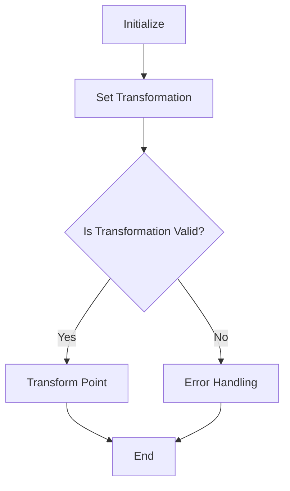

## 类结构

```
agg::trans_bilinear (Class)
├── iterator_x (Nested Class)
```

## 全局变量及字段


### `m_valid`
    
Indicates whether the transformation equations have been solved successfully.

类型：`bool`
    


### `m_mtx`
    
A 4x2 matrix used for the bilinear transformation calculations.

类型：`double[4][2]`
    


### `iterator_x.inc_x`
    
Increment in x for the iterator.

类型：`double`
    


### `iterator_x.inc_y`
    
Increment in y for the iterator.

类型：`double`
    


### `iterator_x.x`
    
Current x value of the iterator.

类型：`double`
    


### `iterator_x.y`
    
Current y value of the iterator.

类型：`double`
    
    

## 全局函数及方法


### trans_bilinear

This function is a member of the `trans_bilinear` class and is used to perform bilinear 2D transformations between two quadrangles or between a rectangle and a quadrangle.

参数：

- `src`：`const double*`，指向前四个点的源坐标数组的指针，这些点定义了源四边形。
- `dst`：`const double*`，指向前四个点的目标坐标数组的指针，这些点定义了目标四边形。

返回值：无

#### 流程图

```mermaid
graph LR
A[Start] --> B{quad_to_quad(src, dst)}
B --> C{m_valid = simul_eq<4, 2>::solve(left, right, m_mtx)}
C --> D{Return}
D --> E[End]
```

#### 带注释源码

```cpp
void quad_to_quad(const double* src, const double* dst)
{
    double left[4][4];
    double right[4][2];

    unsigned i;
    for(i = 0; i < 4; i++)
    {
        unsigned ix = i * 2;
        unsigned iy = ix + 1;
        left[i][0] = 1.0;
        left[i][1] = src[ix] * src[iy];
        left[i][2] = src[ix];
        left[i][3] = src[iy];

        right[i][0] = dst[ix];
        right[i][1] = dst[iy];
    }
    m_valid = simul_eq<4, 2>::solve(left, right, m_mtx);
}
```


### agg::trans_bilinear::quad_to_quad

Set the transformations using two arbitrary quadrangles.

参数：

- `src`：`const double*`，Source quadrangle coordinates.
- `dst`：`const double*`，Destination quadrangle coordinates.

返回值：`void`，No return value.

#### 流程图

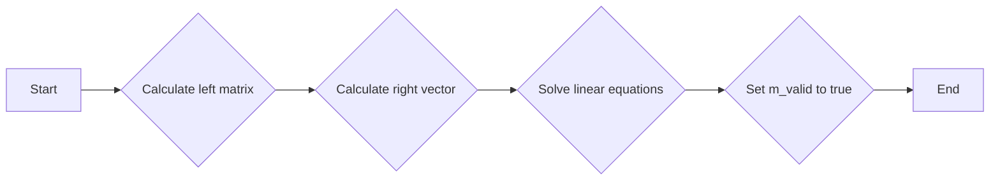

#### 带注释源码

```cpp
void trans_bilinear::quad_to_quad(const double* src, const double* dst)
{
    double left[4][4];
    double right[4][2];

    unsigned i;
    for(i = 0; i < 4; i++)
    {
        unsigned ix = i * 2;
        unsigned iy = ix + 1;
        left[i][0] = 1.0;
        left[i][1] = src[ix] * src[iy];
        left[i][2] = src[ix];
        left[i][3] = src[iy];

        right[i][0] = dst[ix];
        right[i][1] = dst[iy];
    }
    m_valid = simul_eq<4, 2>::solve(left, right, m_mtx);
}
```


### trans_bilinear

This function is a constructor for the `trans_bilinear` class that sets up the bilinear transformation from a rectangle to a quadrangle using the given coordinates.

参数：

- `x1`：`double`，The x-coordinate of the first corner of the rectangle.
- `y1`：`double`，The y-coordinate of the first corner of the rectangle.
- `x2`：`double`，The x-coordinate of the second corner of the rectangle.
- `y2`：`double`，The y-coordinate of the second corner of the rectangle.
- `quad`：`const double*`，An array of four doubles representing the coordinates of the quadrangle.

返回值：`trans_bilinear`对象，No explicit return value, the object is constructed with the given parameters.

#### 流程图

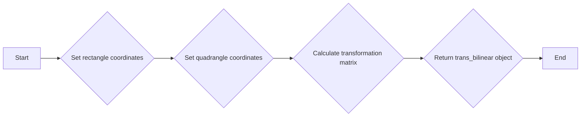

#### 带注释源码

```cpp
// Direct transformations 
trans_bilinear(double x1, double y1, double x2, double y2, const double* quad)
{
    rect_to_quad(x1, y1, x2, y2, quad);
}
```


### agg::trans_bilinear::quad_to_rect

This function sets the reverse transformations from a quadrangle to a rectangle. It takes a quadrangle defined by its vertices and the coordinates of the rectangle to which it will be transformed.

参数：

- `quad`：`const double*`，指向包含四个顶点坐标的数组的指针。每个顶点坐标由两个连续的 `double` 值表示，第一个值是 x 坐标，第二个值是 y 坐标。
- `x1`：`double`，目标矩形左上角的 x 坐标。
- `y1`：`double`，目标矩形左上角的 y 坐标。
- `x2`：`double`，目标矩形右下角的 x 坐标。
- `y2`：`double`，目标矩形右下角的 y 坐标。

返回值：`void`，没有返回值。

#### 流程图

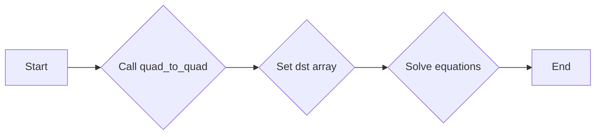

#### 带注释源码

```cpp
void quad_to_rect(const double* quad, 
                  double x1, double y1, double x2, double y2)
{
    double dst[8];
    dst[0] = dst[6] = x1;
    dst[2] = dst[4] = x2;
    dst[1] = dst[3] = y1;
    dst[5] = dst[7] = y2;
    quad_to_quad(quad, dst);
}
```


### trans_bilinear::quad_to_quad(const double* src, const double* dst)

This method sets the bilinear 2D transformation using two arbitrary quadrangles. It calculates the transformation matrix by solving a system of linear equations derived from the coordinates of the source and destination quadrangles.

参数：

- `src`：`const double*`，指向源四边形的坐标数组，包含8个double类型的值，依次为四个顶点的x和y坐标。
- `dst`：`const double*`，指向目标四边形的坐标数组，包含8个double类型的值，依次为四个顶点的x和y坐标。

返回值：`void`，无返回值。

#### 流程图

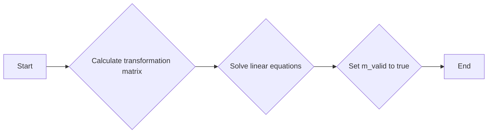

#### 带注释源码

```cpp
void trans_bilinear::quad_to_quad(const double* src, const double* dst)
{
    double left[4][4];
    double right[4][2];

    unsigned i;
    for(i = 0; i < 4; i++)
    {
        unsigned ix = i * 2;
        unsigned iy = ix + 1;
        left[i][0] = 1.0;
        left[i][1] = src[ix] * src[iy];
        left[i][2] = src[ix];
        left[i][3] = src[iy];

        right[i][0] = dst[ix];
        right[i][1] = dst[iy];
    }
    m_valid = simul_eq<4, 2>::solve(left, right, m_mtx);
}
``` 


### trans_bilinear.rect_to_quad

This function sets the direct transformations, i.e., from a rectangle to a quadrangle.

参数：

- `x1`：`double`，The x-coordinate of the first corner of the rectangle.
- `y1`：`double`，The y-coordinate of the first corner of the rectangle.
- `x2`：`double`，The x-coordinate of the second corner of the rectangle.
- `y2`：`double`，The y-coordinate of the second corner of the rectangle.
- `quad`：`const double*`，An array of four doubles representing the coordinates of the quadrangle.

返回值：`void`，No return value.

#### 流程图

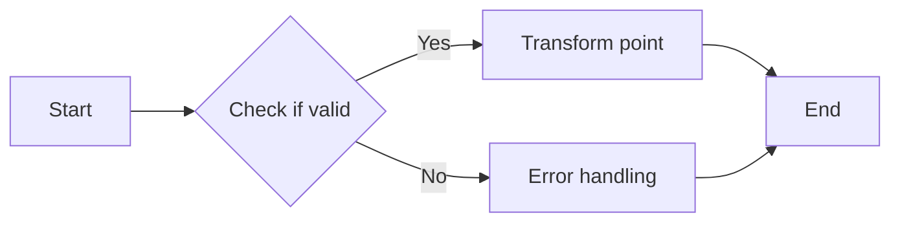

#### 带注释源码

```cpp
void rect_to_quad(double x1, double y1, double x2, double y2, const double* quad)
{
    double src[8];
    src[0] = src[6] = x1;
    src[2] = src[4] = x2;
    src[1] = src[3] = y1;
    src[5] = src[7] = y2;
    quad_to_quad(src, quad);
}
```


### trans_bilinear::quad_to_rect

This function sets the reverse transformations from a quadrangle to a rectangle using the provided quadrangle coordinates and rectangle coordinates.

参数：

- `quad`：`const double*`，The coordinates of the quadrangle (4 points).
- `x1`：`double`，The x-coordinate of the first corner of the rectangle.
- `y1`：`double`，The y-coordinate of the first corner of the rectangle.
- `x2`：`double`，The x-coordinate of the second corner of the rectangle.
- `y2`：`double`，The y-coordinate of the second corner of the rectangle.

返回值：`void`，No return value.

#### 流程图

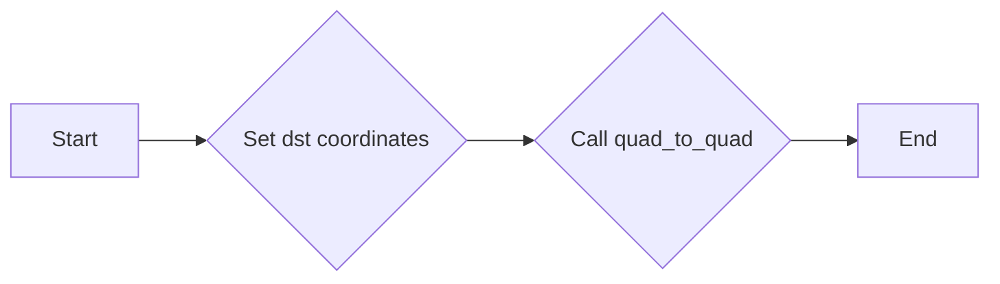

#### 带注释源码

```cpp
void trans_bilinear::quad_to_rect(const double* quad, 
                                  double x1, double y1, double x2, double y2)
{
    double dst[8];
    dst[0] = dst[6] = x1;
    dst[2] = dst[4] = x2;
    dst[1] = dst[3] = y1;
    dst[5] = dst[7] = y2;
    quad_to_quad(quad, dst);
}
```


### trans_bilinear.is_valid()

Check if the bilinear transformation equations were solved successfully.

参数：

- 无

返回值：`bool`，Indicates whether the transformation equations were solved successfully.

#### 流程图

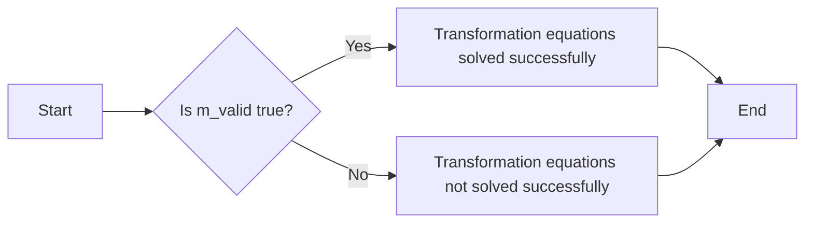

#### 带注释源码

```cpp
bool is_valid() const { return m_valid; }
```


### trans_bilinear.transform(double* x, double* y) const

Transforms a point (x, y) using the bilinear transformation matrix.

参数：

- `x`：`double*`，The pointer to the x-coordinate of the point to be transformed.
- `y`：`double*`，The pointer to the y-coordinate of the point to be transformed.

返回值：`void`，No return value. The transformed coordinates are stored in the provided pointers.

#### 流程图

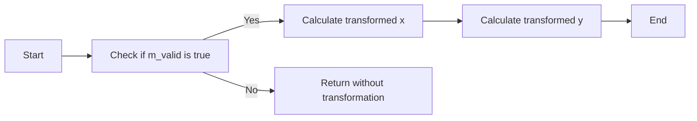

#### 带注释源码

```cpp
        //--------------------------------------------------------------------
        // Transform a point (x, y)
        void transform(double* x, double* y) const
        {
            double tx = *x;
            double ty = *y;
            double xy = tx * ty;
            *x = m_mtx[0][0] + m_mtx[1][0] * xy + m_mtx[2][0] * tx + m_mtx[3][0] * ty;
            *y = m_mtx[0][1] + m_mtx[1][1] * xy + m_mtx[2][1] * tx + m_mtx[3][1] * ty;
        }
```


### agg::trans_bilinear::iterator_x::begin(double x, double y, double step) const

This function initializes an iterator for the x-axis of a bilinear transformation.

参数：

- `x`：`double`，The initial x-coordinate for the iterator.
- `y`：`double`，The initial y-coordinate for the iterator.
- `step`：`double`，The step size for the iterator.

返回值：`agg::trans_bilinear::iterator_x`，An iterator object that can be used to iterate over the x-axis of the bilinear transformation.

#### 流程图

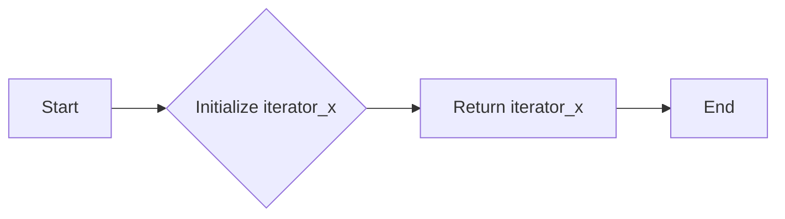

#### 带注释源码

```cpp
iterator_x begin(double x, double y, double step) const
{
    return iterator_x(x, y, step, m_mtx);
}
```


### iterator_x.begin()

This method returns an iterator_x object that can be used to iterate over the transformed coordinates of a quadrilateral.

参数：

- `x`：`double`，The initial x-coordinate of the iterator.
- `y`：`double`，The initial y-coordinate of the iterator.
- `step`：`double`，The step size for the iterator.

返回值：`iterator_x`，An iterator_x object that can be used to iterate over the transformed coordinates.

#### 流程图

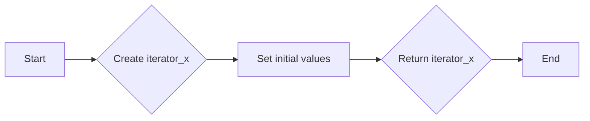

#### 带注释源码

```cpp
iterator_x begin(double x, double y, double step) const
{
    return iterator_x(x, y, step, m_mtx);
}
```


### iterator_x.begin(double x, double y, double step) const

This method returns an iterator_x object that can be used to iterate over transformed points in a 2D space based on the given transformation matrix.

参数：

- `x`：`double`，The initial x-coordinate of the point to start the iteration from.
- `y`：`double`，The initial y-coordinate of the point to start the iteration from.
- `step`：`double`，The step size to increment the x and y coordinates during the iteration.

返回值：`iterator_x`，An iterator_x object that can be used to iterate over the transformed points.

#### 流程图

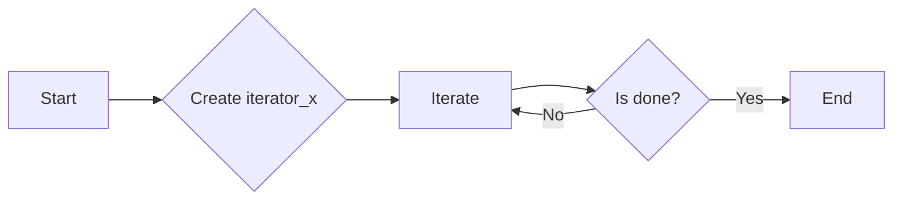

#### 带注释源码

```cpp
iterator_x begin(double x, double y, double step) const
{
    return iterator_x(x, y, step, m_mtx);
}
```


### iterator_x::operator ++()

This method increments the iterator by one step in the transformed space.

参数：

- `*this`：`iterator_x`，The iterator object itself, which is incremented.
- ...

返回值：`void`，No return value, the iterator is incremented in place.

#### 流程图


#### 带注释源码

```cpp
void iterator_x::operator ++ ()
{
    x += inc_x;
    y += inc_y;
}
```


## 关键组件


### 张量索引与惰性加载

张量索引与惰性加载是代码中用于高效访问和操作大型数据结构（如张量）的关键组件。它允许在需要时才计算或加载数据，从而减少内存使用和提高性能。

### 反量化支持

反量化支持是代码中用于处理和转换量化数据的关键组件。它允许在量化与去量化之间进行转换，确保数据在量化过程中的准确性和可靠性。

### 量化策略

量化策略是代码中用于确定数据量化方法和参数的关键组件。它决定了数据在量化过程中的精度和范围，对最终的性能和准确性有重要影响。


## 问题及建议


### 已知问题

-   **代码复杂度**：`trans_bilinear` 类包含多个构造函数和成员函数，这可能导致代码难以理解和维护。
-   **性能问题**：`simul_eq` 模板类用于求解线性方程组，其性能可能成为瓶颈，特别是在处理大型矩阵时。
-   **代码可读性**：代码中存在大量的数学运算，缺乏注释，可能对非数学背景的开发者造成理解困难。
-   **错误处理**：代码中没有明确的错误处理机制，如果求解失败或输入数据不正确，可能会导致未定义行为。

### 优化建议

-   **重构代码**：将复杂的逻辑分解为更小的函数，提高代码的可读性和可维护性。
-   **优化性能**：考虑使用更高效的线性代数库或算法来处理大型矩阵，以提高性能。
-   **增加注释**：为代码中的数学运算和算法添加详细的注释，以便其他开发者理解。
-   **实现错误处理**：添加错误处理机制，确保在输入数据不正确或求解失败时，能够给出明确的错误信息。
-   **使用设计模式**：考虑使用设计模式，如工厂模式或策略模式，来管理不同的变换类型，提高代码的灵活性和可扩展性。
-   **单元测试**：编写单元测试来验证代码的正确性和稳定性，确保在代码修改后不会引入新的错误。


## 其它


### 设计目标与约束

- 设计目标：实现一个高效的二维双线性变换类，能够处理任意四边形之间的变换。
- 约束条件：代码应保持高效性，避免不必要的计算，同时保持代码的可读性和可维护性。

### 错误处理与异常设计

- 错误处理：当求解线性方程组失败时，`m_valid` 标志将被设置为 `false`，表示变换无效。
- 异常设计：当前代码中没有使用异常处理机制，但可以通过抛出异常来处理潜在的运行时错误。

### 数据流与状态机

- 数据流：输入数据包括源四边形和目标四边形的坐标，输出数据为变换后的点坐标。
- 状态机：`trans_bilinear` 类没有明确的状态机，但其行为可以通过其方法调用序列来描述。

### 外部依赖与接口契约

- 外部依赖：依赖于 `agg_basics.h` 和 `agg_simul_eq.h` 头文件。
- 接口契约：`trans_bilinear` 类提供了接口来设置变换、检查变换有效性、执行变换和迭代变换后的点。


    