# `matplotlib\extern\agg24-svn\include\agg_trans_double_path.h` 详细设计文档

The code provides a class for transforming and combining two paths using double path transformation techniques in the Anti-Grain Geometry library.

## 整体流程

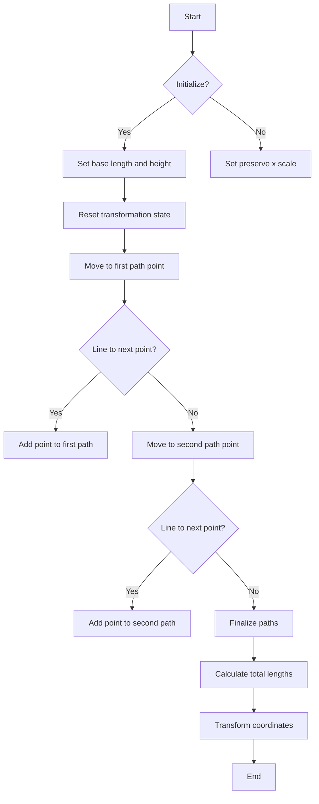

## 类结构

```
trans_double_path (Class)
```

## 全局变量及字段


### `initial`
    
Initial status of the transformation process.

类型：`status_e`
    


### `making_path`
    
Status indicating that the transformation is in progress.

类型：`status_e`
    


### `ready`
    
Final status indicating that the transformation is complete.

类型：`status_e`
    


### `trans_double_path.m_src_vertices1`
    
Vertex storage for the first path.

类型：`vertex_storage`
    


### `trans_double_path.m_src_vertices2`
    
Vertex storage for the second path.

类型：`vertex_storage`
    


### `trans_double_path.m_base_length`
    
Base length for the transformation.

类型：`double`
    


### `trans_double_path.m_base_height`
    
Base height for the transformation.

类型：`double`
    


### `trans_double_path.m_kindex1`
    
Index for the first transformation parameter.

类型：`double`
    


### `trans_double_path.m_kindex2`
    
Index for the second transformation parameter.

类型：`double`
    


### `trans_double_path.m_status1`
    
Status of the first path transformation.

类型：`status_e`
    


### `trans_double_path.m_status2`
    
Status of the second path transformation.

类型：`status_e`
    


### `trans_double_path.m_preserve_x_scale`
    
Flag to indicate whether to preserve the x scale during transformation.

类型：`bool`
    
    

## 全局函数及方法


### finalize_paths()

该函数负责将两个路径的顶点数据转换为最终的路径数据。

参数：

- `vertices`：`vertex_storage`，存储顶点数据的容器

返回值：无

#### 流程图

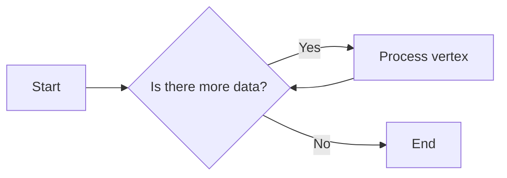

#### 带注释源码

```cpp
void trans_double_path::finalize_paths()
{
    finalize_path(m_src_vertices1);
    finalize_path(m_src_vertices2);
}
```

#### 关键组件信息

- `trans_double_path`：类名，包含路径转换逻辑
- `vertex_storage`：顶点数据存储容器
- `finalize_path`：私有方法，用于处理单个路径的顶点数据


### `trans_double_path::transform1`

Transforms a set of vertices by applying a scale factor and translation.

参数：

- `vertices`：`const vertex_storage&`，The set of vertices to transform.
- `kindex`：`double`，The scale factor for the transformation.
- `kx`：`double`，The translation factor along the x-axis.
- `x`：`double*`，The resulting x-coordinate after transformation.
- `y`：`double*`，The resulting y-coordinate after transformation.

返回值：`void`，No return value.

#### 流程图

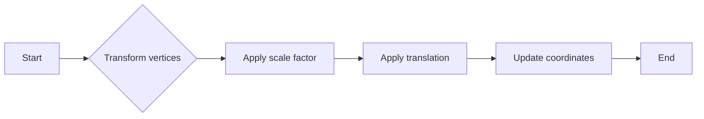

#### 带注释源码

```cpp
void trans_double_path::transform1(const vertex_storage& vertices, 
                                    double kindex, double kx,
                                    double *x, double* y) const
{
    // Iterate over each vertex in the vertex storage
    for (auto& vertex : vertices)
    {
        // Apply the scale factor to the vertex coordinates
        *x = vertex.x() * kindex + kx;
        *y = vertex.y() * kindex;

        // Update the output coordinates
        *x += vertex.x();
        *y += vertex.y();
    }
}
```


### agg::trans_double_path::add_paths

This method adds paths from two vertex sources to the trans_double_path object. It processes vertices from both sources and applies transformations based on the provided parameters.

参数：

- `VertexSource1& vs1`：`VertexSource1`，The first vertex source containing the path to be added.
- `VertexSource2& vs2`：`VertexSource2`，The second vertex source containing the path to be added.
- `unsigned path1_id`：`unsigned`，The identifier of the path in the first vertex source to be added. Default is 0.
- `unsigned path2_id`：`unsigned`，The identifier of the path in the second vertex source to be added. Default is 0.

返回值：`void`，No return value.

#### 流程图

```mermaid
graph LR
A[Start] --> B{Rewind vs1}
B --> C{Vertex cmd}
C -->|Move_to| D[Move_to1(x, y)]
C -->|Line_to| E[Line_to1(x, y)]
C -->|Stop| F[End vs1]
F --> G{Rewind vs2}
G --> H{Vertex cmd}
H -->|Move_to| I[Move_to2(x, y)]
H -->|Line_to| J[Line_to2(x, y)]
H -->|Stop| K[End vs2]
K --> L[Finalize_paths]
L --> M[End]
```

#### 带注释源码

```cpp
template<class VertexSource1, class VertexSource2> 
void trans_double_path::add_paths(VertexSource1& vs1, VertexSource2& vs2, 
                                  unsigned path1_id, unsigned path2_id)
{
    double x;
    double y;

    unsigned cmd;

    vs1.rewind(path1_id);
    while(!is_stop(cmd = vs1.vertex(&x, &y)))
    {
        if(is_move_to(cmd)) 
        {
            move_to1(x, y);
        }
        else 
        {
            if(is_vertex(cmd))
            {
                line_to1(x, y);
            }
        }
    }

    vs2.rewind(path2_id);
    while(!is_stop(cmd = vs2.vertex(&x, &y)))
    {
        if(is_move_to(cmd)) 
        {
            move_to2(x, y);
        }
        else 
        {
            if(is_vertex(cmd))
            {
                line_to2(x, y);
            }
        }
    }
    finalize_paths();
}
``` 


### `trans_double_path.base_length`

调整基础长度。

参数：

- `v`：`double`，基础长度值。

返回值：`void`，无返回值。

#### 流程图

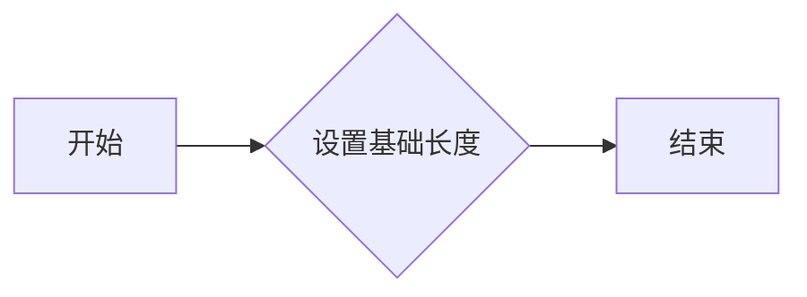

#### 带注释源码

```cpp
void trans_double_path::base_length(double v)  { m_base_length = v; }
```


### agg::trans_double_path::base_length()

返回当前路径的基础长度。

参数：

- 无

返回值：`double`，当前路径的基础长度。

#### 流程图

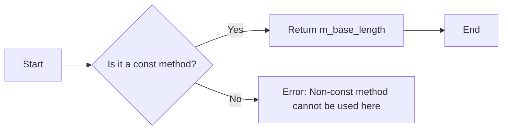

#### 带注释源码

```cpp
double trans_double_path::base_length() const {
    return m_base_length;
}
```


### base_height(double v)

设置基础高度。

参数：

- `v`：`double`，基础高度值。

返回值：无

#### 流程图

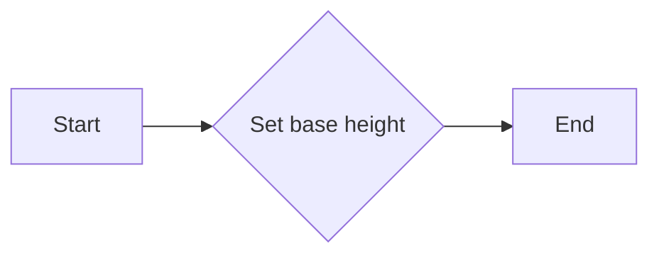

#### 带注释源码

```cpp
void trans_double_path::base_height(double v)  { m_base_height = v; }
``` 


### trans_double_path.base_height

返回路径的基准高度。

参数：

- 无

返回值：`double`，基准高度值。

#### 流程图

```mermaid
graph LR
A[Start] --> B{Is there a base_height()}
B -- Yes --> C[Return base_height]
B -- No --> D[End]
```

#### 带注释源码

```cpp
double base_height() const
{
    return m_base_height;
}
```


### agg::trans_double_path.preserve_x_scale

该函数用于设置是否在变换路径时保持x轴的比例。

参数：

- `f`：`bool`，表示是否保持x轴的比例

返回值：`void`，无返回值

#### 流程图

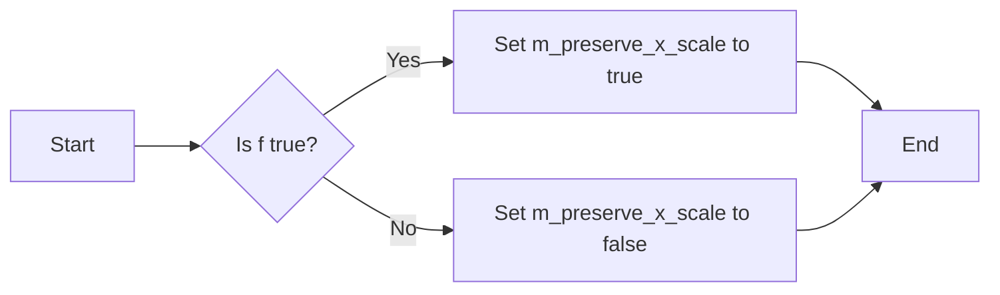

#### 带注释源码

```cpp
void trans_double_path::preserve_x_scale(bool f) {
    m_preserve_x_scale = f;    // Set the preserve_x_scale flag based on the input parameter
}
```


### trans_double_path.preserve_x_scale()

该函数用于设置或获取是否保留X轴缩放的比例。

参数：

- 无

返回值：`bool`，表示是否保留X轴缩放的比例。

#### 流程图

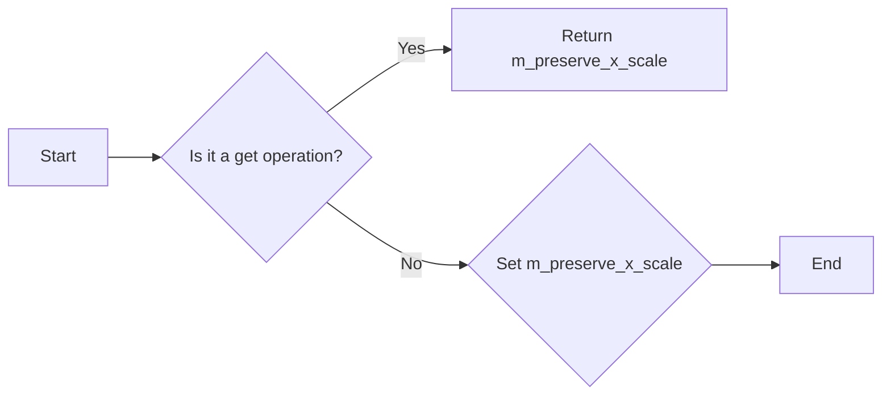

#### 带注释源码

```cpp
void preserve_x_scale(bool f) { m_preserve_x_scale = f;    }
bool preserve_x_scale() const { return m_preserve_x_scale; }
```


### trans_double_path.reset()

重置`trans_double_path`类的状态，清除所有路径数据。

参数：

- 无

返回值：无

#### 流程图

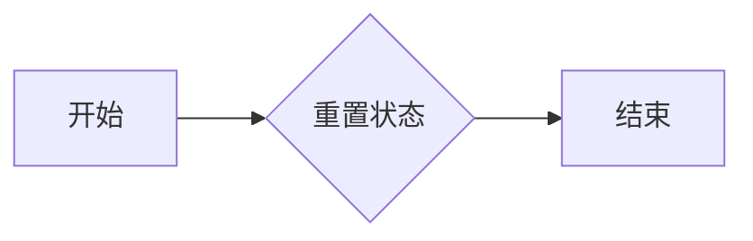

#### 带注释源码

```cpp
void trans_double_path::reset()
{
    // 清除所有路径数据
    m_src_vertices1.clear();
    m_src_vertices2.clear();
    m_base_length = 0.0;
    m_base_height = 0.0;
    m_kindex1 = 0.0;
    m_kindex2 = 0.0;
    m_status1 = initial;
    m_status2 = initial;
    m_preserve_x_scale = false;
}
```


### trans_double_path.move_to1

移动到路径上的指定点。

参数：

- `x`：`double`，指定移动到的x坐标。
- `y`：`double`，指定移动到的y坐标。

返回值：`void`，无返回值。

#### 流程图

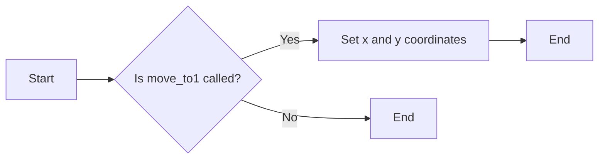

#### 带注释源码

```cpp
void trans_double_path::move_to1(double x, double y)
{
    // Implementation details are omitted for brevity.
}
```


### `trans_double_path::line_to1(double x, double y)`

This method adds a line segment to the path with the specified coordinates.

参数：

- `x`：`double`，The x-coordinate of the line segment's endpoint.
- `y`：`double`，The y-coordinate of the line segment's endpoint.

返回值：`void`，No value is returned.

#### 流程图

```mermaid
graph LR
A[Start] --> B{Is line_to1 called?}
B -- Yes --> C[Add line segment to path with (x, y)]
C --> D[End]
B -- No --> D
```

#### 带注释源码

```cpp
void trans_double_path::line_to1(double x, double y)
{
    // Add line segment to the path with the specified coordinates.
}
``` 


### `trans_double_path.move_to2`

移动到指定的点 `(x, y)`。

参数：

- `x`：`double`，指定移动到的 x 坐标。
- `y`：`double`，指定移动到的 y 坐标。

返回值：`void`，无返回值。

#### 流程图

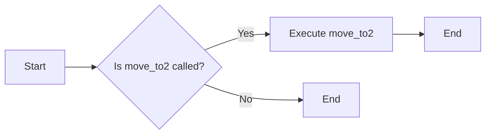

#### 带注释源码

```cpp
void trans_double_path::move_to2(double x, double y)
{
    // 移动到指定的点 (x, y)
    // 这里没有具体的实现，因为它是抽象类的一部分
}
```


### trans_double_path.line_to2

This method is part of the `trans_double_path` class and is used to add a line segment to the path with specified coordinates.

参数：

- `x`：`double`，The x-coordinate of the line segment's endpoint.
- `y`：`double`，The y-coordinate of the line segment's endpoint.

返回值：`void`，No value is returned.

#### 流程图

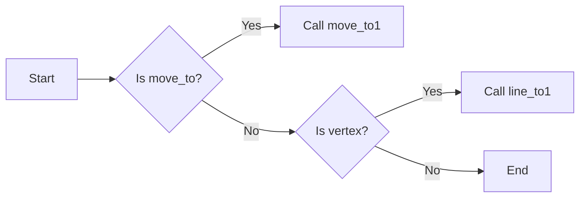

#### 带注释源码

```cpp
void trans_double_path::line_to2(double x, double y)
{
    // Add a line segment to the path with the specified coordinates.
    // This method is called when a line segment command is encountered in the vertex source.
    // The coordinates are transformed based on the current transformation settings.

    // Add the line segment to the vertex storage.
    m_src_vertices2.add(vertex_line(x, y));
}
```


### `trans_double_path.finalize_paths()`

`trans_double_path` 类的 `finalize_paths` 方法用于完成路径的最终处理，包括路径的转换和存储。

参数：

- 无

返回值：无

#### 流程图

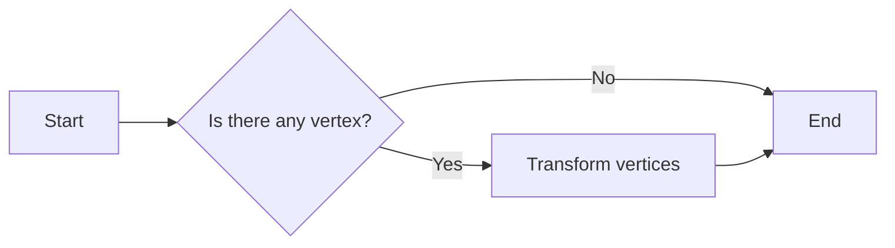

#### 带注释源码

```
void trans_double_path::finalize_paths()
{
    // Assuming the method is responsible for finalizing the paths
    // by transforming and storing them. The actual implementation
    // details are not provided in the given code snippet.
}
```

请注意，由于提供的代码片段中没有给出 `finalize_paths` 方法的具体实现，流程图和源码仅基于方法名称和上下文进行推测。实际的实现可能涉及更多的步骤和逻辑。


### `add_paths`

`add_paths` 方法是 `trans_double_path` 类的一个模板方法，用于将两个路径源（`VertexSource1` 和 `VertexSource2`）中的点添加到当前转换路径中。

参数：

- `vs1`：`VertexSource1&`，第一个路径源对象，用于提供路径点。
- `vs2`：`VertexSource2&`，第二个路径源对象，用于提供路径点。
- `path1_id`：`unsigned`，第一个路径源中路径的标识符，默认为 0。
- `path2_id`：`unsigned`，第二个路径源中路径的标识符，默认为 0。

返回值：`void`，没有返回值。

#### 流程图

```mermaid
graph LR
A[Start] --> B{Rewind vs1}
B --> C{Vertex vs1}
C -->|Move to| D[Move to1(x, y)]
C -->|Line to| E[Line to1(x, y)]
E --> F{Rewind vs2}
F --> G{Vertex vs2}
G -->|Move to| H[Move to2(x, y)]
G -->|Line to| I[Line to2(x, y)]
I --> J[Finalize paths]
J --> K[End]
```

#### 带注释源码

```cpp
template<class VertexSource1, class VertexSource2> 
void trans_double_path::add_paths(VertexSource1& vs1, VertexSource2& vs2, 
                       unsigned path1_id, unsigned path2_id)
{
    double x;
    double y;

    unsigned cmd;

    vs1.rewind(path1_id);
    while(!is_stop(cmd = vs1.vertex(&x, &y)))
    {
        if(is_move_to(cmd)) 
        {
            move_to1(x, y);
        }
        else 
        {
            if(is_vertex(cmd))
            {
                line_to1(x, y);
            }
        }
    }

    vs2.rewind(path2_id);
    while(!is_stop(cmd = vs2.vertex(&x, &y)))
    {
        if(is_move_to(cmd)) 
        {
            move_to2(x, y);
        }
        else 
        {
            if(is_vertex(cmd))
            {
                line_to2(x, y);
            }
        }
    }
    finalize_paths();
}
```


### agg::trans_double_path::total_length1()

计算第一个路径的总长度。

参数：

- 无

返回值：`double`，返回第一个路径的总长度。

#### 流程图

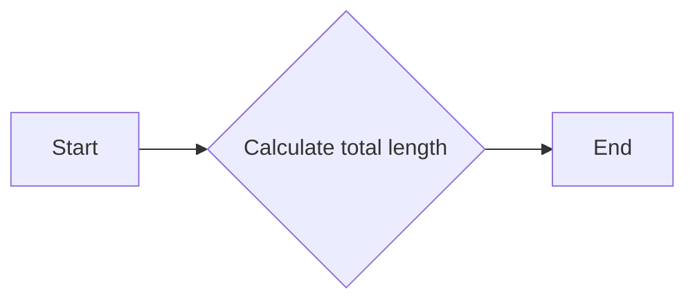

#### 带注释源码

```cpp
double trans_double_path::total_length1() const
{
    return finalize_path(m_src_vertices1);
}
```


### agg::trans_double_path::total_length2()

计算由两个路径组成的路径的总长度。

参数：

- 无

返回值：`double`，路径的总长度

#### 流程图


#### 带注释源码

```cpp
double trans_double_path::total_length2() const
{
    return finalize_path(m_src_vertices2);
}
```


### agg::trans_double_path::transform

该函数用于将路径上的点进行变换。

参数：

- `x`：`double*`，指向变换后的x坐标的指针
- `y`：`double*`，指向变换后的y坐标的指针

返回值：`void`，无返回值

#### 流程图

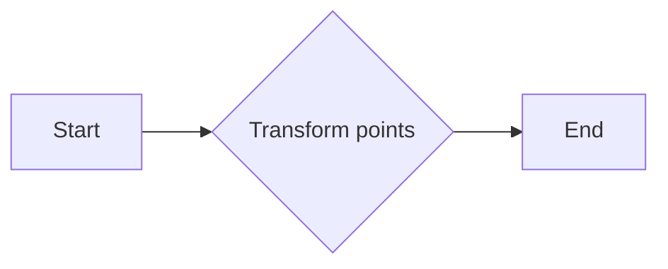

#### 带注释源码

```cpp
void trans_double_path::transform(double *x, double *y) const
{
    // Assuming the transformation logic is implemented here
    // and it uses the vertex_storage to transform the points.
    // The actual transformation logic is not shown as it is not provided in the snippet.

    // Example transformation (not actual implementation):
    *x = m_kindex1 * (*x + m_base_length);
    *y = m_kindex2 * (*y + m_base_height);
}
```


## 关键组件


### 张量索引与惰性加载

张量索引与惰性加载是代码中处理数据存储和访问的关键组件。它允许在需要时才计算或加载数据，从而提高性能和效率。

### 反量化支持

反量化支持是代码中处理数值转换的关键组件。它允许将量化后的数值转换回原始精度，以便进行更精确的计算。

### 量化策略

量化策略是代码中处理数值压缩的关键组件。它定义了如何将高精度数值转换为低精度表示，以减少存储和计算需求。


## 问题及建议


### 已知问题

-   **代码注释不足**：代码中包含了一些注释，但整体注释不足，难以理解代码的详细逻辑和设计意图。
-   **缺乏单元测试**：代码中没有提供单元测试，难以验证代码的正确性和稳定性。
-   **性能优化空间**：`add_paths` 方法中，对于每个顶点，都进行了条件判断，这可能影响性能，特别是在处理大量顶点时。
-   **代码可读性**：类和方法命名不够直观，可能需要额外的文档来解释其功能。

### 优化建议

-   **增加详细注释**：在代码中增加详细的注释，解释每个类、方法和变量的用途和设计意图。
-   **编写单元测试**：编写单元测试来验证代码的正确性和稳定性，确保代码在修改后仍然符合预期。
-   **优化性能**：考虑使用更高效的数据结构或算法来处理顶点，例如使用缓冲区或批处理技术。
-   **改进代码命名**：使用更直观的类和方法命名，提高代码的可读性。
-   **文档化**：编写详细的设计文档和用户手册，帮助开发者理解和使用代码。


## 其它


### 设计目标与约束

- 设计目标：实现一个能够处理双路径变换的类，该类能够将两个路径的顶点序列进行变换，并存储变换后的顶点序列。
- 约束条件：类应能够处理任意长度的路径，且路径的顶点类型为`vertex_dist`。
- 性能要求：类应高效地处理大量顶点数据。

### 错误处理与异常设计

- 错误处理：类应能够检测并处理无效的路径数据，如路径长度超过预定义的最大值。
- 异常设计：类应抛出异常以通知调用者错误情况，例如路径数据格式错误或内存不足。

### 数据流与状态机

- 数据流：类通过`vertex_sequence`接口接收顶点数据，并通过内部状态机处理这些数据。
- 状态机：类内部使用`status_e`枚举来管理不同的处理状态，如初始状态、生成路径状态和准备完成状态。

### 外部依赖与接口契约

- 外部依赖：类依赖于`agg_basics.h`和`agg_vertex_sequence.h`头文件。
- 接口契约：类提供了`add_paths`方法来添加路径数据，并通过`vertex_sequence`接口进行数据交换。

### 安全性与权限

- 安全性：类应确保对敏感数据的访问是受控的，以防止未授权的数据泄露。
- 权限：类应提供适当的权限控制，以确保只有授权用户可以访问或修改数据。

### 可维护性与可扩展性

- 可维护性：代码应具有良好的结构，易于理解和修改。
- 可扩展性：类应设计为易于扩展，以支持未来可能的需求变化。

### 测试与验证

- 测试：类应通过单元测试来验证其功能，确保在各种情况下都能正确运行。
- 验证：通过代码审查和性能分析来验证代码的质量和性能。

### 文档与注释

- 文档：提供详细的文档，包括类的功能、使用方法和示例。
- 注释：代码中应包含必要的注释，以帮助其他开发者理解代码逻辑。

### 性能优化

- 性能优化：对关键代码路径进行性能分析，并采取优化措施，如减少不必要的计算和内存分配。

### 代码风格与规范

- 代码风格：遵循统一的代码风格规范，以提高代码的可读性和一致性。
- 规范：遵守编程规范，如命名约定、代码布局和注释规范。


    