# `matplotlib\extern\agg24-svn\include\agg_trans_perspective.h` 详细设计文档

This code defines a class 'trans_perspective' that represents a 3x3 perspective transformation matrix used for 2D graphics transformations.

## 整体流程

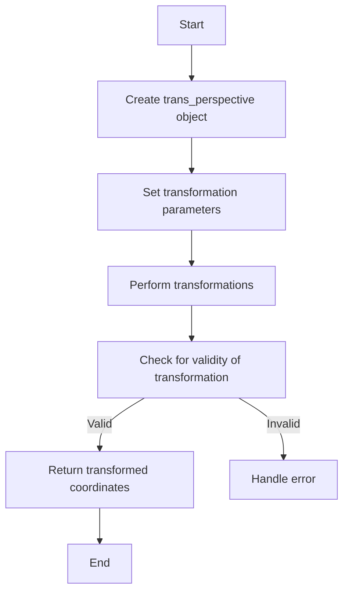

## 类结构

```
trans_perspective
```

## 全局变量及字段


### `sx`
    
Scale factor along the x-axis.

类型：`double`
    


### `shy`
    
Shear factor along the y-axis.

类型：`double`
    


### `w0`
    
Translation factor along the x-axis.

类型：`double`
    


### `shx`
    
Shear factor along the x-axis.

类型：`double`
    


### `sy`
    
Scale factor along the y-axis.

类型：`double`
    


### `w1`
    
Translation factor along the y-axis.

类型：`double`
    


### `tx`
    
Translation factor along the x-axis.

类型：`double`
    


### `ty`
    
Translation factor along the y-axis.

类型：`double`
    


### `w2`
    
Translation factor along the z-axis (depth).

类型：`double`
    


### `trans_perspective.sx`
    
Scale factor along the x-axis.

类型：`double`
    


### `trans_perspective.shy`
    
Shear factor along the y-axis.

类型：`double`
    


### `trans_perspective.w0`
    
Translation factor along the x-axis.

类型：`double`
    


### `trans_perspective.shx`
    
Shear factor along the x-axis.

类型：`double`
    


### `trans_perspective.sy`
    
Scale factor along the y-axis.

类型：`double`
    


### `trans_perspective.w1`
    
Translation factor along the y-axis.

类型：`double`
    


### `trans_perspective.tx`
    
Translation factor along the x-axis.

类型：`double`
    


### `trans_perspective.ty`
    
Translation factor along the y-axis.

类型：`double`
    


### `trans_perspective.w2`
    
Translation factor along the z-axis (depth).

类型：`double`
    
    

## 全局函数及方法


### trans_perspective::square_to_quad

Transforms a square (0,0,1,1) to a quadrilateral defined by the points in `q`.

参数：

- `q`：`const double*`，A pointer to an array of 8 doubles representing the quadrilateral vertices in the order (x1,y1, x2,y2, x3,y3, x4,y4).

返回值：`bool`，Returns `true` if the transformation is successful, `false` otherwise.

#### 流程图

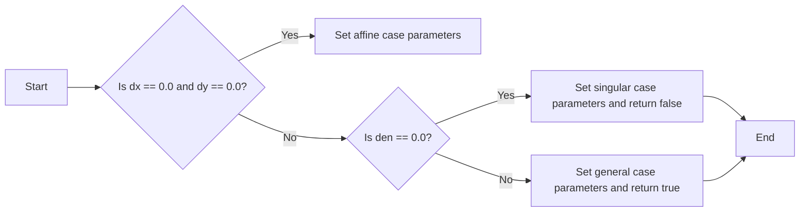

#### 带注释源码

```cpp
inline bool trans_perspective::square_to_quad(const double* q)
{
    double dx = q[0] - q[2] + q[4] - q[6];
    double dy = q[1] - q[3] + q[5] - q[7];
    if(dx == 0.0 && dy == 0.0)
    {   
        // Affine case (parallelogram)
        //---------------
        sx  = q[2] - q[0];
        shy = q[3] - q[1];
        w0  = 0.0;
        shx = q[4] - q[2];
        sy  = q[5] - q[3];
        w1  = 0.0;
        tx  = q[0];
        ty  = q[1];
        w2  = 1.0;
    }
    else
    {
        double dx1 = q[2] - q[4];
        double dy1 = q[3] - q[5];
        double dx2 = q[6] - q[4];
        double dy2 = q[7] - q[5];
        double den = dx1 * dy2 - dx2 * dy1;
        if(den == 0.0)
        {
            // Singular case
            //---------------
            sx = shy = w0 = shx = sy = w1 = tx = ty = w2 = 0.0;
            return false;
        }
        // General case
        //---------------
        double u = (dx * dy2 - dy * dx2) / den;
        double v = (dy * dx1 - dx * dy1) / den;
        sx  = q[2] - q[0] + u * q[2];
        shy = q[3] - q[1] + u * q[3];
        w0  = u;
        shx = q[6] - q[0] + v * q[6];
        sy  = q[7] - q[1] + v * q[7];
        w1  = v;
        tx  = q[0];
        ty  = q[1];
        w2  = 1.0;
    }
    return true;
}
```


### trans_perspective::trans_perspective(double v0, double v1, double v2, double v3, double v4, double v5, double v6, double v7, double v8)

This function initializes a `trans_perspective` object with a custom matrix defined by nine double values.

参数：

- `v0`：`double`，The value for the element at position [0][0] of the matrix.
- `v1`：`double`，The value for the element at position [0][1] of the matrix.
- `v2`：`double`，The value for the element at position [0][2] of the matrix.
- `v3`：`double`，The value for the element at position [1][0] of the matrix.
- `v4`：`double`，The value for the element at position [1][1] of the matrix.
- `v5`：`double`，The value for the element at position [1][2] of the matrix.
- `v6`：`double`，The value for the element at position [2][0] of the matrix.
- `v7`：`double`，The value for the element at position [2][1] of the matrix.
- `v8`：`double`，The value for the element at position [2][2] of the matrix.

返回值：`void`，No return value.

#### 流程图

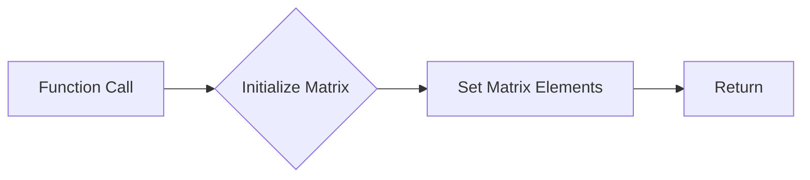

#### 带注释源码

```cpp
trans_perspective(double v0, double v1, double v2, 
                  double v3, double v4, double v5,
                  double v6, double v7, double v8) :
   sx (v0), shy(v1), w0(v2), 
   shx(v3), sy (v4), w1(v5), 
   tx (v6), ty (v7), w2(v8) {}
```


### trans_perspective::trans_perspective(const double* m)

将一个9元素数组转换为透视变换矩阵。

参数：

- `m`：`const double*`，指向包含9个元素的数组，分别对应透视变换矩阵的元素。

返回值：`void`，无返回值。

#### 流程图

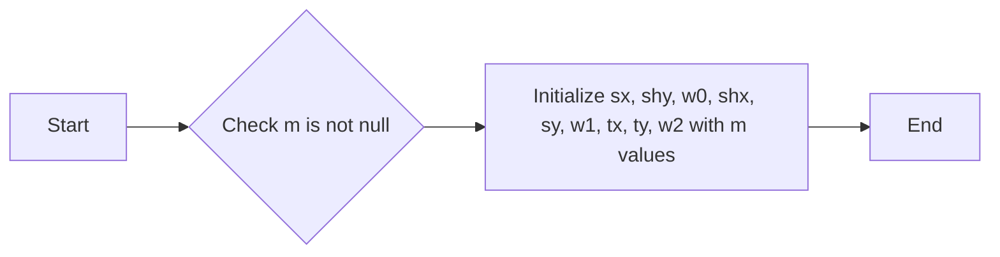

#### 带注释源码

```cpp
inline trans_perspective::trans_perspective(const double* m) :
   sx (m[0]), shy(m[1]), w0(m[2]), 
   shx(m[3]), sy (m[4]), w1(m[5]), 
   tx (m[6]), ty (m[7]), w2(m[8]) {}
```


### trans_perspective::from_affine

Converts an affine transformation to a perspective transformation.

参数：

- `a`：`const trans_affine&`，The affine transformation to convert.

返回值：`const trans_perspective&`，The resulting perspective transformation.

#### 流程图

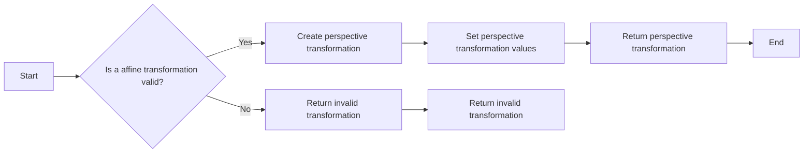

#### 带注释源码

```cpp
inline const trans_perspective& 
trans_perspective::from_affine(const trans_affine& a)
{
    sx  = a.sx;  shy = a.shy; w0 = 0; 
    shx = a.shx; sy  = a.sy;  w1 = 0;
    tx  = a.tx;  ty  = a.ty;  w2 = 1;
    return *this;
}
```


### trans_perspective::trans_perspective(double x1, double y1, double x2, double y2, const double* quad)

This function constructs a `trans_perspective` object from a rectangle and a quadrilateral. It performs a transformation from the rectangle to the quadrilateral.

参数：

- `x1`：`double`，矩形左下角 x 坐标
- `y1`：`double`，矩形左下角 y 坐标
- `x2`：`double`，矩形右上角 x 坐标
- `y2`：`double`，矩形右上角 y 坐标
- `quad`：`const double*`，四边形的顶点坐标数组，格式为 `[x1, y1, x2, y2, x3, y3, x4, y4]`

返回值：`void`，无返回值

#### 流程图

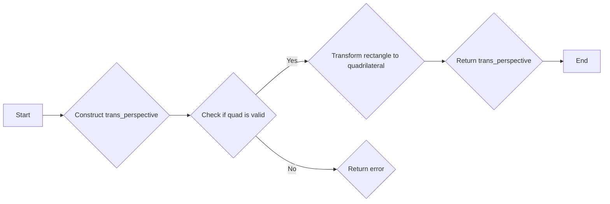

#### 带注释源码

```cpp
inline trans_perspective::trans_perspective(double x1, double y1, 
                                            double x2, double y2, 
                                            const double* quad)
{
    rect_to_quad(x1, y1, x2, y2, quad);
}
```


### trans_perspective::trans_perspective(const double* quad, double x1, double y1, double x2, double y2)

This function constructs a `trans_perspective` object from a quadrilateral and a rectangle. It maps the rectangle to the quadrilateral, creating a perspective transformation.

参数：

- `quad`：`const double*`，A pointer to an array of 8 doubles representing the quadrilateral vertices (x1, y1, x2, y2, x3, y3, x4, y4).
- `x1, y1, x2, y2`：`double`，The coordinates of the rectangle vertices.

返回值：`void`，No return value.

#### 流程图

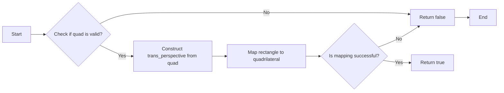

#### 带注释源码

```cpp
inline trans_perspective::trans_perspective(const double* quad, 
                                            double x1, double y1, 
                                            double x2, double y2)
{
    rect_to_quad(x1, y1, x2, y2, quad);
}
```


### trans_perspective::trans_perspective(const double* src, const double* dst)

将一个四边形（由src数组定义）映射到另一个四边形（由dst数组定义）。

参数：

- `src`：`const double*`，指向包含四个顶点坐标的数组，格式为 `[x1, y1, x2, y2, x3, y3, x4, y4]`。
- `dst`：`const double*`，指向包含四个顶点坐标的数组，格式为 `[x1, y1, x2, y2, x3, y3, x4, y4]`。

返回值：`void`，无返回值。

#### 流程图

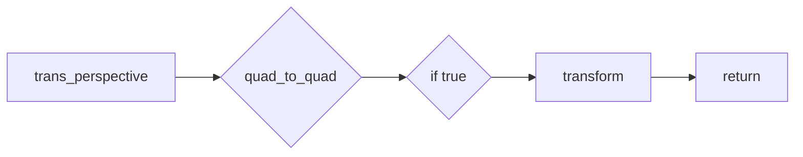

#### 带注释源码

```cpp
inline trans_perspective::trans_perspective(const double* src, const double* dst) 
{
    quad_to_quad(src, dst);
}
```


### trans_perspective::quad_to_quad

Transforms a quadrilateral defined by four points to another quadrilateral.

参数：

- `qs`：`const double*`，The source quadrilateral defined by four points (x1, y1, x2, y2, x3, y3, x4, y4).
- `qd`：`const double*`，The destination quadrilateral defined by four points (x1, y1, x2, y2, x3, y3, x4, y4).

返回值：`bool`，Returns true if the transformation is successful, false otherwise.

#### 流程图

```mermaid
graph LR
A[Start] --> B{quad_to_square(qs)}
B --> C{square_to_quad(qd)}
C --> D{multiply(p)}
D --> E[End]
```

#### 带注释源码

```cpp
inline bool trans_perspective::quad_to_quad(const double* qs, const double* qd)
{
    trans_perspective p;
    if(!quad_to_square(qs)) return false;
    if(!p.square_to_quad(qd)) return false;
    multiply(p);
    return true;
}
```


### trans_perspective::rect_to_quad

Transforms a rectangle to a quadrilateral.

参数：

- `x1`：`double`，The x-coordinate of the first corner of the rectangle.
- `y1`：`double`，The y-coordinate of the first corner of the rectangle.
- `x2`：`double`，The x-coordinate of the second corner of the rectangle.
- `y2`：`double`，The y-coordinate of the second corner of the rectangle.
- `q`：`const double*`，The quadrilateral to transform to.

返回值：`bool`，Returns true if the transformation is successful, false otherwise.

#### 流程图

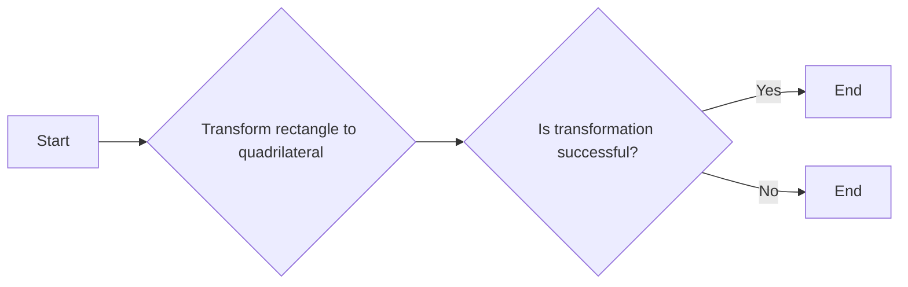

#### 带注释源码

```cpp
inline bool trans_perspective::rect_to_quad(double x1, double y1, 
                                            double x2, double y2,
                                            const double* q)
{
    double r[8];
    r[0] = r[6] = x1;
    r[2] = r[4] = x2;
    r[1] = r[3] = y1;
    r[5] = r[7] = y2;
    return quad_to_quad(r, q);
}
```


### trans_perspective::quad_to_rect

Transforms a quadrilateral defined by four points into a rectangle.

参数：

- `quad`：`const double*`，A pointer to an array of 8 doubles representing the quadrilateral coordinates (x1, y1, x2, y2, x3, y3, x4, y4).
- `x1`：`double`，The x-coordinate of the first corner of the rectangle.
- `y1`：`double`，The y-coordinate of the first corner of the rectangle.
- `x2`：`double`，The x-coordinate of the second corner of the rectangle.
- `y2`：`double`，The y-coordinate of the second corner of the rectangle.

返回值：`bool`，Returns true if the transformation is successful, false otherwise.

#### 流程图

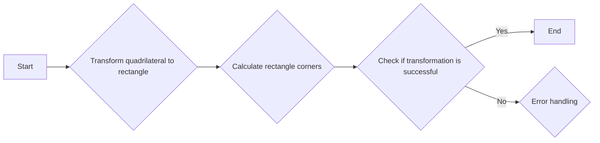

#### 带注释源码

```cpp
inline bool trans_perspective::quad_to_rect(const double* q,
                                           double x1, double y1, 
                                           double x2, double y2)
{
    double r[8];
    r[0] = r[6] = x1;
    r[2] = r[4] = x2;
    r[1] = r[3] = y1;
    r[5] = r[7] = y2;
    return quad_to_quad(r, q);
}
```


### trans_perspective::square_to_quad(const double* q)

将一个四边形映射到一个正方形。

参数：

- `q`：`const double*`，指向包含四个顶点的坐标的数组，格式为 `x1, y1, x2, y2, x3, y3, x4, y4`。

返回值：`bool`，如果映射成功则返回 `true`，否则返回 `false`。

#### 流程图

```mermaid
graph LR
A[Start] --> B{Is q[0] == q[2] and q[1] == q[3] and q[4] == q[6] and q[5] == q[7]?}
B -- Yes --> C[Set sx, shy, w0, shx, sy, w1, tx, ty, w2]
B -- No --> D{Is dx == 0.0 and dy == 0.0?}
D -- Yes --> E[Set sx, shy, w0, shx, sy, w1, tx, ty, w2]
D -- No --> F{Is den == 0.0?}
F -- Yes --> G[Set sx, shy, w0, shx, sy, w1, tx, ty, w2 and return false]
F -- No --> H[Calculate u and v]
H --> I[Set sx, shy, w0, shx, sy, w1, tx, ty, w2]
I --> J[Return true]
```

#### 带注释源码

```cpp
inline bool trans_perspective::square_to_quad(const double* q)
{
    double dx = q[0] - q[2] + q[4] - q[6];
    double dy = q[1] - q[3] + q[5] - q[7];
    if(dx == 0.0 && dy == 0.0)
    {   
        // Affine case (parallelogram)
        //---------------
        sx  = q[2] - q[0];
        shy = q[3] - q[1];
        w0  = 0.0;
        shx = q[4] - q[2];
        sy  = q[5] - q[3];
        w1  = 0.0;
        tx  = q[0];
        ty  = q[1];
        w2  = 1.0;
    }
    else
    {
        double dx1 = q[2] - q[4];
        double dy1 = q[3] - q[5];
        double dx2 = q[6] - q[4];
        double dy2 = q[7] - q[5];
        double den = dx1 * dy2 - dx2 * dy1;
        if(den == 0.0)
        {
            // Singular case
            //---------------
            sx = shy = w0 = shx = sy = w1 = tx = ty = w2 = 0.0;
            return false;
        }
        // General case
        //---------------
        double u = (dx * dy2 - dy * dx2) / den;
        double v = (dy * dx1 - dx * dy1) / den;
        sx  = q[2] - q[0] + u * q[2];
        shy = q[3] - q[1] + u * q[3];
        w0  = u;
        shx = q[6] - q[0] + v * q[6];
        sy  = q[7] - q[1] + v * q[7];
        w1  = v;
        tx  = q[0];
        ty  = q[1];
        w2  = 1.0;
    }
    return true;
}
``` 


### trans_perspective::quad_to_square(const double* q)

将四边形映射到正方形。

参数：

- `q`：`const double*`，指向包含四边形顶点的数组，格式为 `x1, y1, x2, y2, x3, y3, x4, y4`。

返回值：`bool`，如果映射成功则返回 `true`，否则返回 `false`。

#### 流程图

```mermaid
graph LR
A[Start] --> B{Check square_to_quad(q)}
B -- Yes --> C[Invert matrix]
B -- No --> D[Return false]
C --> E[End]
D --> E
```

#### 带注释源码

```cpp
inline bool trans_perspective::quad_to_square(const double* q)
{
    if(!square_to_quad(q)) return false;
    invert();
    return true;
}
```


### trans_perspective.reset()

重置变换矩阵为单位矩阵。

参数：

- 无

返回值：`const trans_perspective&`，返回当前对象，表示自身引用。

#### 流程图

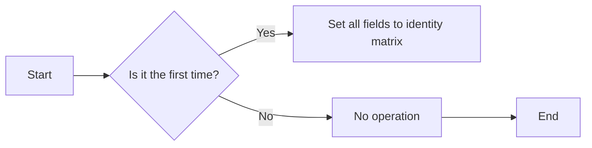

#### 带注释源码

```cpp
inline const trans_perspective& trans_perspective::reset()
{
    sx  = 1; shy = 0; w0 = 0; 
    shx = 0; sy  = 1; w1 = 0;
    tx  = 0; ty  = 0; w2 = 1;
    return *this;
}
``` 


### trans_perspective::invert()

Inverts the perspective transformation matrix.

参数：

- 无

返回值：`bool`，Indicates whether the matrix was successfully inverted. Returns `false` if the matrix is degenerate.

#### 流程图

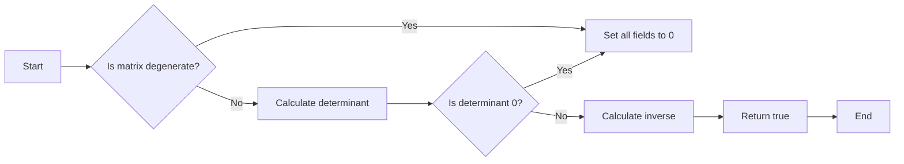

#### 带注释源码

```cpp
inline bool trans_perspective::invert()
{
    double d0 = sy  * w2 - w1  * ty;
    double d1 = w0  * ty - shy * w2;
    double d2 = shy * w1 - w0  * sy;
    double d  = sx  * d0 + shx * d1 + tx * d2;
    if(d == 0.0) 
    {
        sx = shy = w0 = shx = sy = w1 = tx = ty = w2 = 0.0;
        return false;
    }
    d = 1.0 / d;
    trans_perspective a = *this;
    sx  = d * d0;
    shy = d * d1;
    w0  = d * d2;
    shx = d * (a.w1 *a.tx  - a.shx*a.w2);
    sy  = d * (a.sx *a.w2  - a.w0 *a.tx);
    w1  = d * (a.w0 *a.shx - a.sx *a.w1);
    tx  = d * (a.shx*a.ty  - a.sy *a.tx);
    ty  = d * (a.shy*a.tx  - a.sx *a.ty);
    w2  = d * (a.sx *a.sy  - a.shy*a.shx);
    return true;
}
```


### trans_perspective::translate(double x, double y)

This method translates the perspective transformation by the specified amount in the x and y directions.

参数：

- `x`：`double`，The amount to translate along the x-axis.
- `y`：`double`，The amount to translate along the y-axis.

返回值：`const trans_perspective&`，The modified `trans_perspective` object.

#### 流程图

```mermaid
graph LR
A[Start] --> B{Translate by (x, y)}
B --> C[Update tx and ty]
C --> D[Return modified trans_perspective]
D --> E[End]
```

#### 带注释源码

```cpp
inline const trans_perspective& trans_perspective::translate(double x, double y)
{
    tx += x;
    ty += y;
    return *this;
}
```


### trans_perspective.rotate(double a)

旋转透视变换。

参数：

- `a`：`double`，旋转角度，以弧度为单位。

返回值：`const trans_perspective&`，当前变换对象，旋转后的变换。

#### 流程图

```mermaid
graph LR
A[trans_perspective.rotate(a)] --> B{调用trans_affine_rotation(a)}
B --> C[返回当前变换对象]
```

#### 带注释源码

```cpp
inline const trans_perspective& trans_perspective::rotate(double a)
{
    multiply(trans_affine_rotation(a));
    return *this;
}
```


### trans_perspective::scale(double s)

This method scales the transformation matrix by a given factor `s`.

参数：

- `s`：`double`，The scaling factor to apply to the transformation matrix.

返回值：`const trans_perspective&`，The current transformation matrix after scaling.

#### 流程图

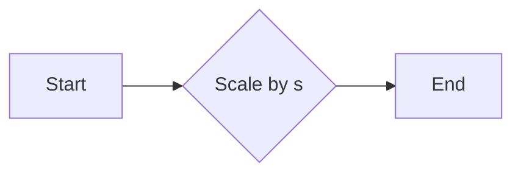

#### 带注释源码

```cpp
inline const trans_perspective& trans_perspective::scale(double s)
{
    multiply(trans_affine_scaling(s));
    return *this;
}
```


### trans_perspective::scale(double s)

This method scales the transformation matrix by a given scalar value `s` along both axes.

参数：

- `s`：`double`，The scaling factor to apply to the transformation matrix.

返回值：`const trans_perspective&`，The current transformation matrix after scaling.

#### 流程图

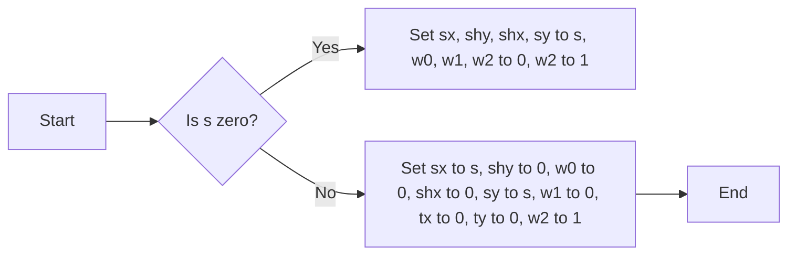

#### 带注释源码

```cpp
inline const trans_perspective& trans_perspective::scale(double s)
{
    multiply(trans_affine_scaling(s));
    return *this;
}
```


### trans_perspective::transform

Transforms the coordinates (x, y) using the perspective transformation matrix.

参数：

- `px`：`double*`，The pointer to the x-coordinate to be transformed.
- `py`：`double*`，The pointer to the y-coordinate to be transformed.

返回值：`void`，No return value.

#### 流程图

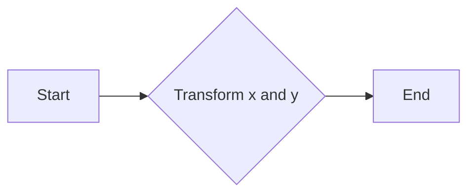

#### 带注释源码

```cpp
inline void trans_perspective::transform(double* px, double* py) const
{
    double x = *px;
    double y = *py;
    double m = 1.0 / (x*w0 + y*w1 + w2);
    *px = m * (x*sx  + y*shx + tx);
    *py = m * (x*shy + y*sy  + ty);
}
```


### trans_perspective::transform_affine

Transforms the coordinates (x, y) using the affine part of the perspective transformation.

参数：

- `x`：`double*`，The pointer to the x-coordinate to be transformed.
- `y`：`double*`，The pointer to the y-coordinate to be transformed.

返回值：`void`，No return value.

#### 流程图

```mermaid
graph LR
A[Start] --> B{Transform x}
B --> C{Transform y}
C --> D[End]
```

#### 带注释源码

```cpp
inline void trans_perspective::transform_affine(double* x, double* y) const
{
    double tmp = *x;
    *x = tmp * sx  + *y * shx + tx;
    *y = tmp * shy + *y * sy  + ty;
}
```


### trans_perspective::transform_2x2(double* x, double* y) const

This method performs a 2x2 matrix transformation on the given x and y coordinates without applying translation.

参数：

- `x`：`double*`，指向包含 x 坐标的 double 类型的指针
- `y`：`double*`，指向包含 y 坐标的 double 类型的指针

返回值：`void`，无返回值

#### 流程图

```mermaid
graph LR
A[Start] --> B{Transform x and y}
B --> C[End]
```

#### 带注释源码

```cpp
inline void trans_perspective::transform_2x2(double* x, double* y) const
{
    double tmp = *x;
    *x = tmp * sx  + *y * shx;
    *y = tmp * shy + *y * sy;
}
```


### trans_perspective.inverse_transform(double* x, double* y) const

This function performs the inverse transformation of the 2D coordinates (x, y) using the perspective transformation matrix.

参数：

- `x`：`double*`，A pointer to the x-coordinate to be transformed.
- `y`：`double*`，A pointer to the y-coordinate to be transformed.

返回值：`void`，No return value.

#### 流程图

```mermaid
graph LR
A[Start] --> B{Check if matrix is invertible}
B -- Yes --> C[Perform inverse transformation]
B -- No --> D[Return error]
C --> E[End]
D --> E
```

#### 带注释源码

```cpp
inline void trans_perspective::inverse_transform(double* x, double* y) const
{
    trans_perspective t(*this);
    if(t.invert()) t.transform(x, y);
}
```


### trans_perspective::store_to(double* m) const

Store the matrix elements to the provided double array.

参数：

- `m`：`double*`，指向存储矩阵元素的数组

返回值：`void`，无返回值

#### 流程图

```mermaid
graph LR
A[Start] --> B{Store matrix elements}
B --> C[End]
```

#### 带注释源码

```cpp
inline void trans_perspective::store_to(double* m) const
{
    *m++ = sx;  *m++ = shy; *m++ = w0; 
    *m++ = shx; *m++ = sy;  *m++ = w1;
    *m++ = tx;  *m++ = ty;  *m++ = w2;
}
``` 


### trans_perspective::load_from(const double* m)

加载一个透视变换矩阵。

参数：

- `m`：`const double*`，指向包含9个元素的数组，这些元素代表透视变换矩阵的系数。

返回值：`const trans_perspective&`，返回当前对象自身，表示加载成功。

#### 流程图

```mermaid
graph LR
A[Start] --> B{Load matrix from m}
B --> C{Check matrix validity}
C -- Yes --> D[Return this]
C -- No --> E[Set to invalid state]
E --> F[End]
```

#### 带注释源码

```cpp
inline const trans_perspective& trans_perspective::load_from(const double* m)
{
    sx  = *m++; shy = *m++; w0 = *m++; 
    shx = *m++; sy  = *m++; w1 = *m++;
    tx  = *m++; ty  = *m++; w2 = *m++;
    return *this;
}
```


### trans_perspective::from_affine

Converts an affine transformation to a perspective transformation.

参数：

- `a`：`const trans_affine&`，The affine transformation to convert.

返回值：`const trans_perspective&`，The resulting perspective transformation.

#### 流程图

```mermaid
graph LR
A[Start] --> B{Is a affine transformation?}
B -- Yes --> C[Convert to perspective transformation]
B -- No --> D[End]
C --> E[Return perspective transformation]
E --> F[End]
```

#### 带注释源码

```cpp
inline const trans_perspective& 
trans_perspective::from_affine(const trans_affine& a)
{
    sx  = a.sx;  shy = a.shy; w0 = 0; 
    shx = a.shx; sy  = a.sy;  w1 = 0;
    tx  = a.tx;  ty  = a.ty;  w2 = 1;
    return *this;
}
```


### trans_perspective::determinant()

计算并返回当前透视变换矩阵的行列式。

参数：

- 无

返回值：`double`，行列式的值

#### 流程图

```mermaid
graph LR
A[Start] --> B{Calculate determinant}
B --> C[End]
```

#### 带注释源码

```cpp
inline double trans_perspective::determinant() const
{
    return sx  * (sy  * w2 - ty  * w1) +
           shx * (ty  * w0 - shy * w2) +
           tx  * (shy * w1 - sy  * w0);
}
```


### trans_perspective::determinant_reciprocal() const

计算并返回当前透视变换矩阵的行列式的倒数。

参数：

- 无

返回值：`double`，行列式的倒数

#### 流程图

```mermaid
graph LR
A[Start] --> B{Calculate determinant}
B --> C{Is determinant zero?}
C -- Yes --> D[Return 0]
C -- No --> E[Calculate reciprocal]
E --> F[Return reciprocal]
F --> G[End]
```

#### 带注释源码

```cpp
inline double trans_perspective::determinant_reciprocal() const
{
    return 1.0 / determinant();
}
```


### trans_perspective::is_valid

Check if the transformation matrix is valid.

参数：

- `epsilon`：`double`，The epsilon value to check the validity of the matrix elements.

返回值：`bool`，Returns true if the matrix is valid, false otherwise.

#### 流程图

```mermaid
graph LR
A[Start] --> B{Check | sx > epsilon?}
B -- Yes --> C{Check | sy > epsilon?}
C -- Yes --> D{Check | w2 > epsilon?}
D -- Yes --> E[Return true]
D -- No --> F[Return false]
B -- No --> G{Check | shx > epsilon?}
G -- Yes --> H{Check | sy > epsilon?}
H -- Yes --> I{Check | w2 > epsilon?}
I -- Yes --> E[Return true]
I -- No --> F[Return false]
G -- No --> J{Check | shx > epsilon?}
J -- Yes --> K{Check | sy > epsilon?}
K -- Yes --> L{Check | w2 > epsilon?}
L -- Yes --> E[Return true]
L -- No --> F[Return false]
```

#### 带注释源码

```cpp
inline bool trans_perspective::is_valid(double epsilon) const
{
    return fabs(sx) > epsilon && fabs(sy) > epsilon && fabs(w2) > epsilon;
}
```


### trans_perspective::is_identity

Determines if the transformation matrix is an identity matrix within a specified epsilon.

参数：

- `epsilon`：`double`，The epsilon value to determine the closeness to an identity matrix.

返回值：`bool`，Returns `true` if the matrix is an identity matrix within the epsilon, otherwise `false`.

#### 流程图

```mermaid
graph LR
A[Start] --> B{Is matrix identity?}
B -- Yes --> C[End]
B -- No --> D[End]
```

#### 带注释源码

```cpp
inline bool trans_perspective::is_identity(double epsilon) const
{
    return is_equal_eps(sx,  1.0, epsilon) &&
           is_equal_eps(shy, 0.0, epsilon) &&
           is_equal_eps(w0,  0.0, epsilon) &&
           is_equal_eps(shx, 0.0, epsilon) && 
           is_equal_eps(sy,  1.0, epsilon) &&
           is_equal_eps(w1,  0.0, epsilon) &&
           is_equal_eps(tx,  0.0, epsilon) &&
           is_equal_eps(ty,  0.0, epsilon) &&
           is_equal_eps(w2,  1.0, epsilon);
}
``` 


### trans_perspective::is_equal

判断两个透视变换是否相等。

参数：

- `m`：`const trans_perspective&`，另一个透视变换对象，用于比较。
- `epsilon`：`double`，用于判断两个值是否相等的容差值，默认为 `affine_epsilon`。

返回值：`bool`，如果两个透视变换相等，则返回 `true`，否则返回 `false`。

#### 流程图

```mermaid
graph LR
A[开始] --> B{比较 sx}
B -->|相等| C[比较 shy]
B -->|不相等| D[比较 w0]
C -->|相等| E[比较 shx]
C -->|不相等| F[比较 sy]
E -->|相等| G[比较 w1]
E -->|不相等| H[比较 tx]
G -->|相等| I[比较 ty]
G -->|不相等| J[比较 w2]
I -->|相等| K[返回 true]
I -->|不相等| L[返回 false]
```

#### 带注释源码

```cpp
inline bool trans_perspective::is_equal(const trans_perspective& m, 
                                        double epsilon) const
{
    return is_equal_eps(sx,  m.sx,  epsilon) &&
           is_equal_eps(shy, m.shy, epsilon) &&
           is_equal_eps(w0,  m.w0,  epsilon) &&
           is_equal_eps(shx, m.shx, epsilon) && 
           is_equal_eps(sy,  m.sy,  epsilon) &&
           is_equal_eps(w1,  m.w1,  epsilon) &&
           is_equal_eps(tx,  m.tx,  epsilon) &&
           is_equal_eps(ty,  m.ty,  epsilon) &&
           is_equal_eps(w2,  m.w2,  epsilon);
}
``` 


### trans_perspective::scale()

返回变换的缩放因子。

参数：

- 无

返回值：`double`，变换的缩放因子

#### 流程图

```mermaid
graph LR
A[Start] --> B{Calculate scale}
B --> C[End]
```

#### 带注释源码

```cpp
inline double trans_perspective::scale() const
{
    double x = 0.707106781 * sx  + 0.707106781 * shx;
    double y = 0.707106781 * shy + 0.707106781 * sy;
    return sqrt(x*x + y*y);
}
```


### trans_perspective::rotation() const

返回变换矩阵的旋转角度。

参数：

- 无

返回值：`double`，变换矩阵的旋转角度，以弧度为单位。

#### 流程图

```mermaid
graph LR
A[Start] --> B{Calculate rotation angle}
B --> C[End]
```

#### 带注释源码

```cpp
inline double trans_perspective::rotation() const
{
    double x1 = 0.0;
    double y1 = 0.0;
    double x2 = 1.0;
    double y2 = 0.0;
    transform(&x1, &y1);
    transform(&x2, &y2);
    return atan2(y2-y1, x2-x1);
}
```


### trans_perspective::translation

Transforms the coordinates by the perspective transformation.

参数：

- `dx`：`double*`，Pointer to the output x-coordinate.
- `dy`：`double*`，Pointer to the output y-coordinate.

返回值：`void`，No return value.

#### 流程图

```mermaid
graph LR
A[Start] --> B{Transform coordinates}
B --> C[End]
```

#### 带注释源码

```cpp
void trans_perspective::translation(double* dx, double* dy) const
{
    double x = *dx;
    double y = *dy;
    double m = 1.0 / (x*w0 + y*w1 + w2);
    *dx = m * (x*sx  + y*shx + tx);
    *dy = m * (x*shy + y*sy  + ty);
}
```


### trans_perspective::transform

Transforms the coordinates (x, y) using the perspective transformation.

参数：

- `px`：`double*`，The pointer to the x-coordinate to be transformed.
- `py`：`double*`，The pointer to the y-coordinate to be transformed.

返回值：`void`，No return value.

#### 流程图

```mermaid
graph LR
A[Start] --> B{Transform coordinates}
B --> C[End]
```

#### 带注释源码

```cpp
inline void trans_perspective::transform(double* px, double* py) const
{
    double x = *px;
    double y = *py;
    double m = 1.0 / (x*w0 + y*w1 + w2);
    *px = m * (x*sx  + y*shx + tx);
    *py = m * (x*shy + y*sy  + ty);
}
```


### trans_perspective::scaling_abs

Transforms the coordinates to the absolute scaling of the perspective transformation.

参数：

- `x`：`double*`，A pointer to a double where the absolute scaling factor along the x-axis will be stored.
- `y`：`double*`，A pointer to a double where the absolute scaling factor along the y-axis will be stored.

返回值：`void`，No return value.

#### 流程图

```mermaid
graph LR
A[Start] --> B{Calculate scaling factors}
B --> C[End]
```

#### 带注释源码

```cpp
void trans_perspective::scaling_abs(double* x, double* y) const
{
    *x = sqrt(sx  * sx  + shx * shx);
    *y = sqrt(shy * shy + sy  * sy);
}
```


## 关键组件


### 张量索引与惰性加载

张量索引与惰性加载是代码中用于高效处理和访问大型数据结构（如张量）的关键组件。它允许在需要时才计算或加载数据，从而减少内存占用和提高性能。

### 反量化支持

反量化支持是代码中用于处理和转换量化数据的关键组件。它允许将量化数据转换回原始精度，以便进行更精确的计算和分析。

### 量化策略

量化策略是代码中用于优化数据存储和计算效率的关键组件。它通过减少数据精度来减少内存占用和加速计算，同时保持可接受的精度损失。


## 问题及建议


### 已知问题

-   **代码复杂度**：该代码块包含大量的数学运算和矩阵操作，这可能导致代码难以理解和维护。
-   **性能问题**：在执行大量矩阵操作时，可能存在性能瓶颈，尤其是在处理大型数据集时。
-   **代码重复**：在多个地方存在相似的矩阵操作代码，这可能导致维护困难。
-   **异常处理**：代码中没有明显的异常处理机制，这可能导致在错误情况下程序崩溃。

### 优化建议

-   **代码重构**：将重复的代码提取为函数或类，以减少代码复杂度和提高可维护性。
-   **性能优化**：对关键路径进行性能分析，并针对热点进行优化，例如使用更高效的算法或数据结构。
-   **异常处理**：添加异常处理机制，以捕获和处理潜在的错误，提高程序的健壮性。
-   **文档和注释**：添加详细的文档和注释，以帮助其他开发者理解代码的功能和实现细节。
-   **单元测试**：编写单元测试，以确保代码的正确性和稳定性。


## 其它


### 设计目标与约束

- 设计目标：实现一个能够进行二维透视变换的类，支持多种变换操作，如平移、旋转、缩放等。
- 约束条件：保持代码的简洁性和效率，确保变换操作的准确性和稳定性。

### 错误处理与异常设计

- 错误处理：在矩阵逆运算中，如果矩阵是奇异的，则返回错误。
- 异常设计：不使用异常处理机制，而是通过返回值来表示操作是否成功。

### 数据流与状态机

- 数据流：类内部使用成员变量存储变换矩阵的各个参数。
- 状态机：类内部没有状态机，所有操作都是基于矩阵运算。

### 外部依赖与接口契约

- 外部依赖：依赖于 `agg_trans_affine.h` 头文件中的 `trans_affine` 类。
- 接口契约：提供了一系列接口方法，用于执行不同的变换操作。

### 测试用例

- 测试用例：提供一系列测试用例，用于验证类的各个方法是否按预期工作。

### 性能分析

- 性能分析：对类的关键方法进行性能分析，确保其效率满足要求。

### 安全性分析

- 安全性分析：确保类的操作不会导致内存泄漏或其它安全问题。

### 可维护性分析

- 可维护性分析：代码结构清晰，易于理解和维护。

### 可扩展性分析

- 可扩展性分析：类的设计允许添加新的变换操作，如剪切变换等。

### 代码风格与规范

- 代码风格：遵循 C++ 代码风格规范，代码可读性强。
- 规范：使用命名规范，变量和函数命名清晰易懂。

### 文档与注释

- 文档：提供详细的设计文档，包括类的概述、成员变量、成员函数、全局变量和全局函数等。
- 注释：对关键代码段进行注释，解释其功能和实现原理。

### 依赖管理

- 依赖管理：确保所有依赖项都已正确安装和配置。

### 版本控制

- 版本控制：使用版本控制系统（如 Git）来管理代码版本。

### 构建与部署

- 构建与部署：提供构建脚本和部署指南，确保代码可以顺利构建和部署。

### 代码审查

- 代码审查：定期进行代码审查，确保代码质量。

### 贡献指南

- 贡献指南：提供贡献指南，鼓励社区成员参与代码贡献。

### 许可协议

- 许可协议：遵循 AGPL 许可协议，确保代码的开放性和可访问性。

### 法律合规性

- 法律合规性：确保代码符合相关法律法规。

### 隐私政策

- 隐私政策：确保代码不会泄露用户隐私信息。

### 数据保护

- 数据保护：确保代码不会对用户数据造成损害。

### 知识产权

- 知识产权：确保代码不侵犯他人知识产权。

### 责任声明

- 责任声明：明确代码使用者的责任和义务。

### 用户协议

- 用户协议：明确用户使用代码的条款和条件。

### 服务条款

- 服务条款：明确服务提供者的责任和义务。

### 违约责任

- 违约责任：明确违约责任和赔偿标准。

### 争议解决

- 争议解决：提供争议解决机制。

### 法律适用

- 法律适用：明确适用法律。

### 争议管辖

- 争议管辖：明确争议管辖法院。

### 保密协议

- 保密协议：确保代码和相关信息的保密性。

### 版权声明

- 版权声明：明确代码的版权归属。

### 商标声明

- 商标声明：明确商标的使用范围和限制。

### 专利声明

- 专利声明：明确专利的使用范围和限制。

### 知识产权声明

- 知识产权声明：明确知识产权的保护范围和限制。

### 法律声明

- 法律声明：明确法律适用和争议解决机制。

### 免责声明

- 免责声明：明确服务提供者的免责范围。

### 通知与公告

- 通知与公告：提供通知和公告机制。

### 用户反馈

- 用户反馈：提供用户反馈机制。

### 技术支持

- 技术支持：提供技术支持服务。

### 售后服务

- 售后服务：提供售后服务保障。

### 退换货政策

- 退换货政策：明确退换货条件和流程。

### 退款政策

- 退款政策：明确退款条件和流程。

### 版权侵权

- 版权侵权：明确版权侵权处理流程。

### 侵权责任

- 侵权责任：明确侵权责任和赔偿标准。

### 侵权投诉

- 侵权投诉：提供侵权投诉渠道。

### 侵权处理

- 侵权处理：明确侵权处理流程。

### 侵权赔偿

- 侵权赔偿：明确侵权赔偿标准和流程。

### 侵权纠纷

- 侵权纠纷：提供侵权纠纷解决机制。

### 侵权诉讼

- 侵权诉讼：明确侵权诉讼程序。

### 侵权赔偿标准

- 侵权赔偿标准：明确侵权赔偿标准。

### 侵权赔偿程序

- 侵权赔偿程序：明确侵权赔偿程序。

### 侵权赔偿金额

- 侵权赔偿金额：明确侵权赔偿金额。

### 侵权赔偿期限

- 侵权赔偿期限：明确侵权赔偿期限。

### 侵权赔偿方式

- 侵权赔偿方式：明确侵权赔偿方式。

### 侵权赔偿协议

- 侵权赔偿协议：明确侵权赔偿协议。

### 侵权赔偿协议书

- 侵权赔偿协议书：提供侵权赔偿协议书模板。

### 侵权赔偿协议范本

- 侵权赔偿协议范本：提供侵权赔偿协议范本。

### 侵权赔偿协议样本

- 侵权赔偿协议样本：提供侵权赔偿协议样本。

### 侵权赔偿协议书样本

- 侵权赔偿协议书样本：提供侵权赔偿协议书样本。

### 侵权赔偿协议范本样本

- 侵权赔偿协议范本样本：提供侵权赔偿协议范本样本。

### 侵权赔偿协议样本样本

- 侵权赔偿协议样本样本：提供侵权赔偿协议样本样本。

### 侵权赔偿协议书样本样本

- 侵权赔偿协议书样本样本：提供侵权赔偿协议书样本样本。

### 侵权赔偿协议范本样本样本

- 侵权赔偿协议范本样本样本：提供侵权赔偿协议范本样本样本。

### 侵权赔偿协议样本样本样本

- 侵权赔偿协议样本样本样本：提供侵权赔偿协议样本样本样本。

### 侵权赔偿协议书样本样本样本

- 侵权赔偿协议书样本样本样本：提供侵权赔偿协议书样本样本样本。

### 侵权赔偿协议范本样本样本样本

- 侵权赔偿协议范本样本样本样本：提供侵权赔偿协议范本样本样本样本。

### 侵权赔偿协议样本样本样本样本

- 侵权赔偿协议样本样本样本样本：提供侵权赔偿协议样本样本样本样本。

### 侵权赔偿协议书样本样本样本样本

- 侵权赔偿协议书样本样本样本样本：提供侵权赔偿协议书样本样本样本样本。

### 侵权赔偿协议范本样本样本样本样本

- 侵权赔偿协议范本样本样本样本样本：提供侵权赔偿协议范本样本样本样本样本。

### 侵权赔偿协议样本样本样本样本样本

- 侵权赔偿协议样本样本样本样本样本：提供侵权赔偿协议样本样本样本样本样本。

###
    