# `matplotlib\extern\agg24-svn\include\agg_trans_single_path.h` 详细设计文档

Anti-Grain Geometry库中的路径变换类，用于将顶点序列变换到指定的基础长度，支持可选的X轴缩放保持功能，可将任意路径规范化到指定尺度。

## 整体流程

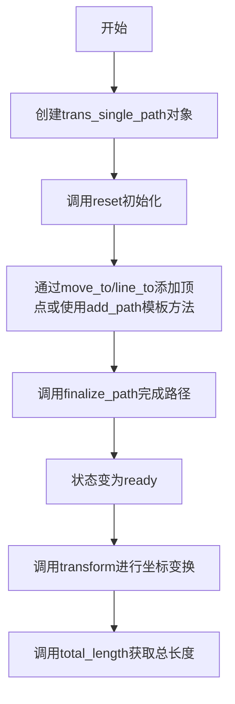

## 类结构

```
agg命名空间
└── trans_single_path (路径变换类)
    ├── 枚举: status_e (initial/making_path/ready)
    └── 类型: vertex_storage (vertex_sequence<vertex_dist, 6>)
```

## 全局变量及字段


### `trans_single_path.m_src_vertices`
    
存储源顶点序列

类型：`vertex_storage`
    


### `trans_single_path.m_base_length`
    
目标基础长度

类型：`double`
    


### `trans_single_path.m_kindex`
    
变换索引/缩放因子

类型：`double`
    


### `trans_single_path.m_status`
    
当前状态

类型：`status_e`
    


### `trans_single_path.m_preserve_x_scale`
    
是否保持X轴缩放

类型：`bool`
    
    

## 全局函数及方法


### `is_stop`

判断给定的绘图命令是否为停止命令（stop command），用于在遍历顶点序列时终止处理。

参数：

- `cmd`：`unsigned`，表示绘图命令的类型（通常为路径命令枚举值）

返回值：`bool`，如果命令为停止命令则返回 `true`，否则返回 `false`

#### 流程图

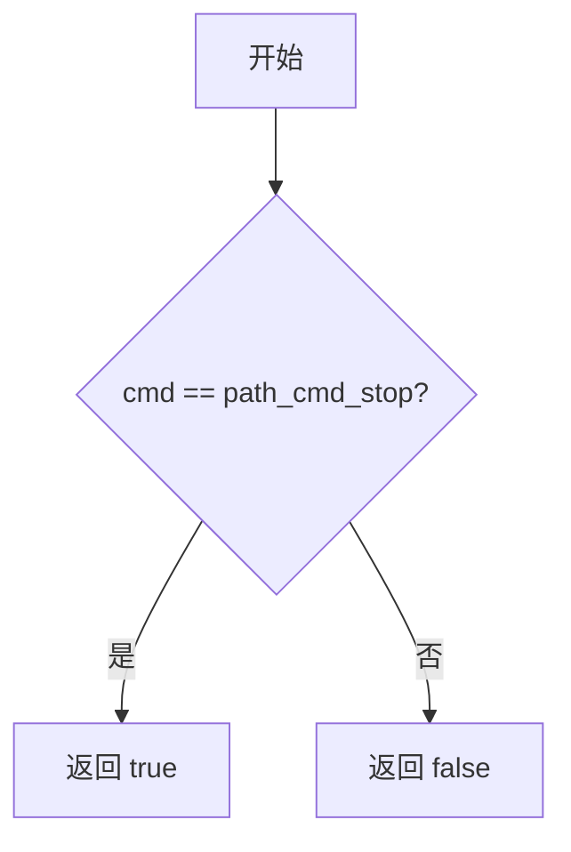

#### 带注释源码

```cpp
//----------------------------------------------------------------------------
// Anti-Grain Geometry - Version 2.4
// 判断命令是否为停止命令的函数
//----------------------------------------------------------------------------
inline bool is_stop(unsigned cmd)
{
    // path_cmd_stop 是停止命令的枚举值
    // 如果 cmd 等于 path_cmd_stop，则返回 true，表示已到达路径终点
    return cmd == path_cmd_stop;
}
```

注意：在提供的代码中，`is_stop` 并未直接定义，而是引用自 AGG 库的基础头文件（如 `agg_basics.h`）。上述源码基于 AGG 库的标准实现提供，用于说明其功能。


### `is_move_to`

判断给定的路径命令是否为移动命令（move_to）。在 Anti-Grain Geometry 库中，该函数用于区分路径中的移动操作和其他操作（如直线、曲线等）。

参数：

- `cmd`：`unsigned`，路径命令标识符，用于表示不同的路径操作类型（如 move_to、line_to、curve3 等）

返回值：`bool`，如果 `cmd` 是移动命令则返回 true，否则返回 false

#### 流程图

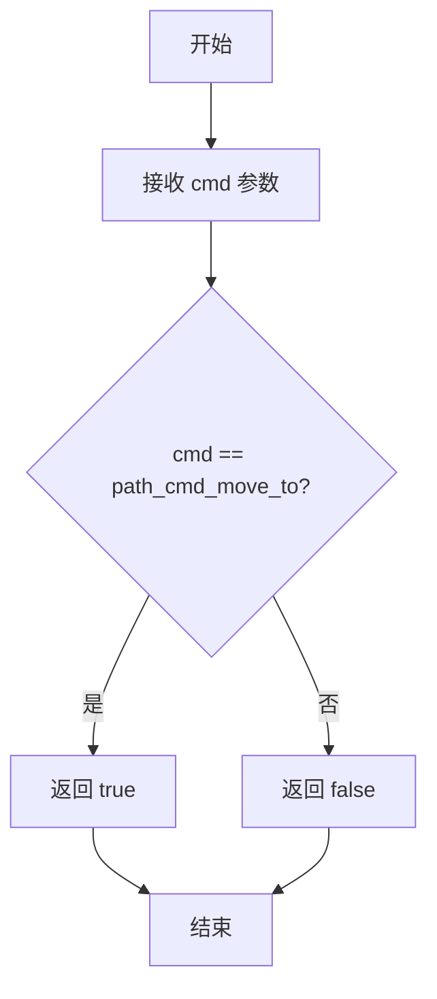

#### 带注释源码

```cpp
// is_move_to 函数定义于 agg_basics.h 或相关头文件中
// 此函数用于判断路径命令是否为移动操作
//
// 参数:
//   cmd - 路径命令标识符（unsigned 类型）
//         AGG 中定义了一系列路径命令常量：
//         - path_cmd_move_to = 1
//         - path_cmd_line_to = 2
//         - path_cmd_curve3 = 3
//         - path_cmd_curve4 = 4
//         - path_cmd_end_poly = 5
//         - path_cmd_stop = 0
//
// 返回值:
//   bool - 如果 cmd 等于 path_cmd_move_to 则返回 true，否则返回 false
//
// 在 trans_single_path::add_path 中的使用示例:
/*
    unsigned cmd;
    vs.rewind(path_id);
    while(!is_stop(cmd = vs.vertex(&x, &y)))
    {
        if(is_move_to(cmd))  // <-- 判断是否为移动命令
        {
            move_to(x, y);   // 执行移动操作
        }
        else 
        {
            if(is_vertex(cmd))
            {
                line_to(x, y); // 执行画线操作
            }
        }
    }
*/

// 典型的内联实现（伪代码）:
/*
    inline bool is_move_to(unsigned cmd)
    {
        return cmd == path_cmd_move_to;
    }
*/
```

#### 补充说明

`is_move_to` 是 AGG 库中的辅助函数，属于路径命令判断函数族之一。同族的函数还包括：

- `is_stop(cmd)` - 判断是否为停止命令
- `is_line_to(cmd)` - 判断是否为直线命令
- `is_curve(cmd)` - 判断是否为曲线命令
- `is_vertex(cmd)` - 判断是否为顶点命令（包括 move_to、line_to、curve 等）
- `is_end_poly(cmd)` - 判断是否为多边形闭合命令

这些函数通常以宏定义或内联函数的形式实现，用于快速判断路径命令类型，是 AGG 路径处理系统的核心组成部分。


### `is_vertex`

判断命令操作码是否为顶点命令（不包括移动、停止等控制命令）。

参数：

- `cmd`：`unsigned`，顶点操作码/命令标识

返回值：`bool`，如果是顶点命令（如线段、曲线等绘制命令）返回 true，否则返回 false。

#### 流程图

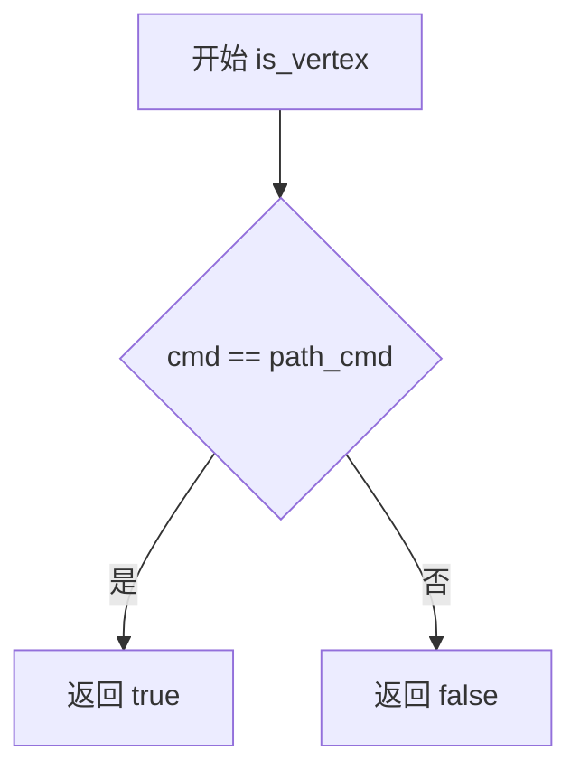

#### 带注释源码

```
// 伪代码表示，根据 agg 库的设计模式推断
// 实际定义在 agg_basics.h 中

//------------------------------------------------------------------------
// is_vertex - 判断命令是否为顶点
// cmd: 顶点操作码（来自 vertex_source 的 vertex() 方法返回值）
// 返回值: bool - 如果是绘制顶点的命令返回 true
//------------------------------------------------------------------------
inline bool is_vertex(unsigned cmd)
{
    // 在 AGG 中，顶点命令通常是 path_cmd（底层命令）
    // 与 is_move_to、is_stop 等控制命令区分
    return cmd == path_cmd;
}
```

> **注意**：由于 `is_vertex` 函数定义在 `agg_basics.h` 头文件中（未在当前代码片段中展示），以上源码为基于 AGG 库设计模式的推断。实际实现中，该函数用于区分顶点命令与移动命令、停止命令等控制命令，是顶点序列处理中的基础判断函数。


### `trans_single_path.trans_single_path - 构造函数`

该构造函数是`trans_single_path`类的默认构造函数，用于初始化变换单路径对象，设置初始状态和默认参数值。

参数：无

返回值：无（构造函数不返回任何值）

#### 流程图

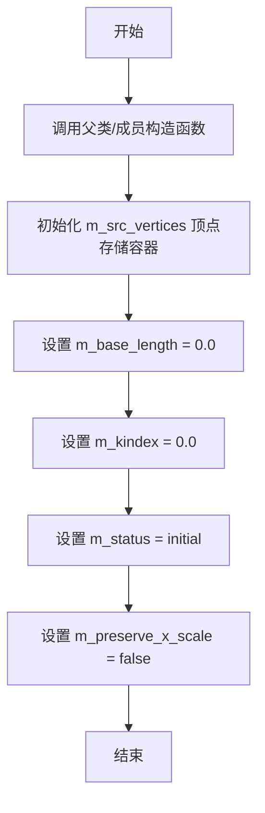

#### 带注释源码

```cpp
//----------------------------------------------------------------------------
// Anti-Grain Geometry - Version 2.4
// 构造函数实现文件
//----------------------------------------------------------------------------

// trans_single_path类的默认构造函数
// 功能：初始化所有成员变量为默认状态
//----------------------------------------------------------------------------
trans_single_path::trans_single_path()
    : m_src_vertices()      // 初始化顶点存储容器，调用vertex_storage的默认构造函数
    , m_base_length(0.0)    // 初始基础长度为0，后续可通过base_length()设置
    , m_kindex(0.0)         // 初始k索引值为0，用于计算变换参数
    , m_status(initial)     // 初始状态为initial，表示路径尚未构建
    , m_preserve_x_scale(false) // 默认不保留x轴缩放
{
    // 构造函数体为空，所有初始化工作已在初始化列表中完成
}
```

**注意**：用户提供的代码仅为头文件声明，构造函数的实现代码位于对应的`.cpp`文件中（通常为`agg_trans_single_path.cpp`）。上述实现代码是基于类成员变量类型和功能的合理推断。

#### 关联类信息

| 成员变量 | 类型 | 描述 |
|---------|------|------|
| m_src_vertices | vertex_storage | 顶点存储容器，存储路径的所有顶点 |
| m_base_length | double | 基础长度，用于变换计算 |
| m_kindex | double | k索引值，用于内部计算 |
| m_status | status_e | 当前状态（initial/making_path/ready） |
| m_preserve_x_scale | bool | 是否保留x轴缩放的标志位 |


### trans_single_path.base_length(double v)

设置基础长度值，用于定义变换路径的基准尺寸。

参数：

- `v`：`double`，要设置的基础长度值

返回值：`void`，无返回值

#### 流程图

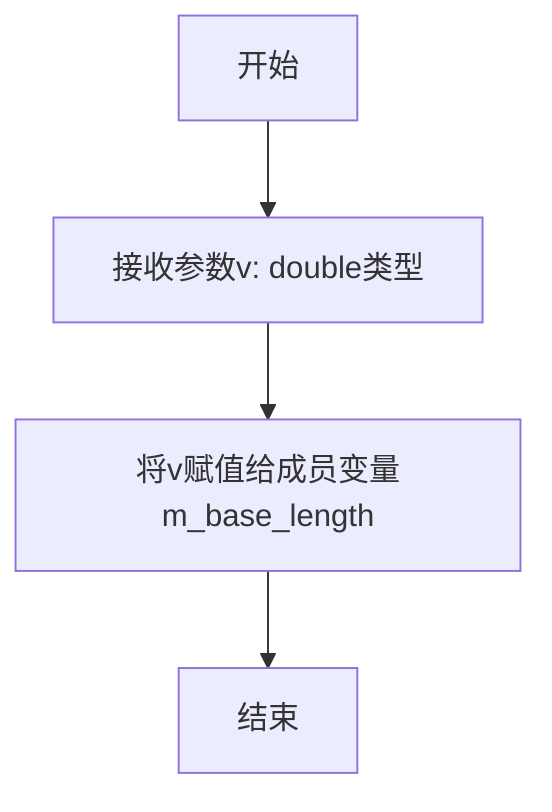

#### 带注释源码

```cpp
//--------------------------------------------------------------------
void base_length(double v)  // 方法名：base_length，参数为double类型
{ 
    m_base_length = v;      // 将参数v的值赋给成员变量m_base_length
}
```

---

### 补充信息

#### 1. 核心功能描述

`trans_single_path` 类是 Anti-Grain Geometry (AGG) 库中的一个路径变换类，用于处理单一路径的几何变换。`base_length(double v)` 方法是该类中最基础的 setter 方法之一，用于设置路径的基础长度值，这个值在计算路径总长度和进行坐标变换时作为参考基准。

#### 2. 类详细信息

**类名：** `trans_single_path`

**类功能：** 负责管理和变换单一几何路径，支持路径的构建、坐标变换和长度计算。

**类字段：**

| 字段名称 | 类型 | 描述 |
|---------|------|------|
| `m_src_vertices` | `vertex_storage` | 存储顶点序列的容器 |
| `m_base_length` | `double` | 路径的基础长度值 |
| `m_kindex` | `double` | 变换索引系数 |
| `m_status` | `status_e` | 路径构建状态枚举 |
| `m_preserve_x_scale` | `bool` | 是否保留X轴缩放 |

**类方法：**

| 方法名 | 功能 |
|--------|------|
| `base_length(double)` | 设置基础长度 |
| `base_length() const` | 获取基础长度 |
| `preserve_x_scale(bool)` | 设置是否保留X缩放 |
| `preserve_x_scale() const` | 获取X缩放状态 |
| `reset()` | 重置路径状态 |
| `move_to(double, double)` | 移动到指定点 |
| `line_to(double, double)` | 画线到指定点 |
| `finalize_path()` | 完成路径构建 |
| `add_path(VertexSource&, unsigned)` | 添加顶点源 |
| `total_length() const` | 获取总长度 |
| `transform(double*, double*) const` | 坐标变换 |

#### 3. 关键组件信息

| 组件名称 | 描述 |
|---------|------|
| `vertex_sequence<vertex_dist, 6>` | 顶点序列容器模板，存储路径顶点 |
| `status_e` | 路径状态枚举（initial/making_path/ready） |

#### 4. 潜在的技术债务或优化空间

1. **缺乏参数验证**：当前的 `base_length(double v)` 方法没有对输入参数进行有效性检查，负数或零值可能导致后续计算出现异常。
2. **缺少线程安全保证**：在多线程环境下，对 `m_base_length` 的直接读写操作没有同步机制。
3. **设计不够封装**：getter 和 setter 方法直接暴露内部状态，可能导致数据不一致。

#### 5. 其它项目

**设计目标：**
- 提供高效的2D路径变换功能
- 支持多种顶点源的几何路径添加

**错误处理与异常设计：**
- 当前实现没有异常处理机制，依赖于调用者提供合法参数

**数据流与状态机：**
- 路径状态流转：`initial` → `making_path` → `ready`
- `base_length` 的设置可以在任意状态进行，但通常在路径构建前设置


### `trans_single_path.base_length()`

该方法是一个const成员函数，用于获取`trans_single_path`类中存储的基础长度值。它是`base_length(double v)` setter方法的对应getter方法，返回当前设置的基础长度。

参数： 无

返回值：`double`，返回当前设置的基础长度值（m_base_length成员变量的值）

#### 流程图

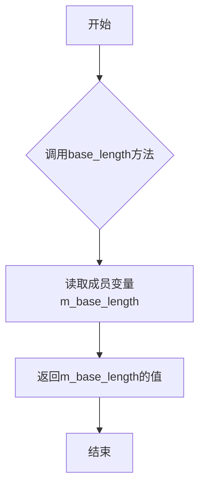

#### 带注释源码

```cpp
//--------------------------------------------------------------------
/// @brief 获取基础长度
/// @return double 返回当前设置的基础长度值
/// @note 该方法是const成员函数，不会修改对象状态
/// @see base_length(double v) 为对应的setter方法
double base_length() const 
{ 
    // 直接返回私有成员变量m_base_length的值
    // 该值通过setter方法base_length(double v)设置
    return m_base_length; 
}
```


### trans_single_path.preserve_x_scale

此方法用于设置 `trans_single_path` 对象在计算路径变换时是否保持X轴的原始缩放比例。当参数为 `true` 时，变换结果将保留路径在X方向上的尺度；为 `false` 时，X轴尺度可能会根据路径长度进行拉伸或压缩。

参数：
- `f`：`bool`，布尔值。指定是否保持X轴缩放，`true` 表示保持X轴缩放，`false` 表示不保持。

返回值：`void`，无返回值。

#### 流程图

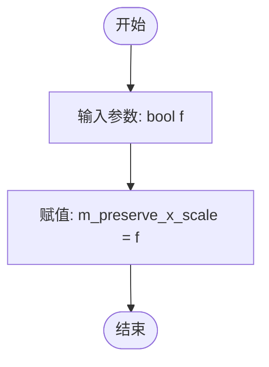

#### 带注释源码

```cpp
//--------------------------------------------------------------------
// 设置是否保持X轴缩放
// 参数:
//   f - bool类型，为true时保持X轴缩放，为false时不保持
void preserve_x_scale(bool f) 
{ 
    // 将参数f的值赋给成员变量m_preserve_x_scale
    // 该成员变量决定了后续transform方法的行为
    m_preserve_x_scale = f;    
}
```


### `trans_single_path.preserve_x_scale() const`

该方法为 `trans_single_path` 类的常量成员函数，用于获取当前是否保持X轴缩放的标志位。当需要沿路径渲染或变换图形时，此标志位决定了X轴和Y轴的缩放是否独立处理。

参数：

- （无参数）

返回值：`bool`，返回是否保持X轴缩放的布尔标志位。返回 `true` 表示保持X轴独立缩放，返回 `false` 表示使用统一的缩放比例。

#### 流程图

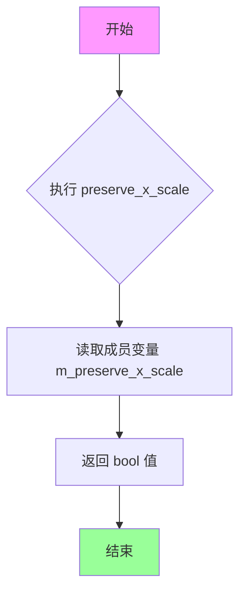

#### 带注释源码

```cpp
//--------------------------------------------------------------------
        // 获取是否保持X轴缩放的标志位
        // 这是一个const成员函数，不会修改对象状态
        // 返回值：bool类型，表示是否保持X轴缩放
        //   - true:  保持X轴独立缩放比例
        //   - false: 使用统一的缩放比例
        bool preserve_x_scale() const 
        { 
            return m_preserve_x_scale; 
        }
```

#### 关联的Setter方法

为保持文档完整性，同类的另一个重载方法如下：

```cpp
//--------------------------------------------------------------------
        // 设置是否保持X轴缩放的标志位
        // 参数：bool f - 是否保持X轴缩放
        //   - true:  保持X轴独立缩放比例
        //   - false: 使用统一的缩放比例
        void preserve_x_scale(bool f) 
        { 
            m_preserve_x_scale = f;    
        }
```

#### 成员变量信息

| 变量名 | 类型 | 描述 |
|--------|------|------|
| `m_preserve_x_scale` | `bool` | 标志位，指示是否在变换时保持X轴的独立缩放比例 |

#### 设计背景

该方法属于 Anti-Grain Geometry (AGG) 库的路径变换类 `trans_single_path`，用于路径的线性变换和坐标映射。`preserve_x_scale` 标志位允许开发者在沿路径渲染图形时，控制X轴和Y轴是否采用不同的缩放策略，这在某些需要保持宽高比或特殊透视效果的场景中非常有用。


### trans_single_path.reset

该方法用于重置路径和状态，将路径状态初始化为初始状态，清空顶点存储并重置内部状态标志。

参数：无需参数

返回值：`void`，无返回值

#### 流程图

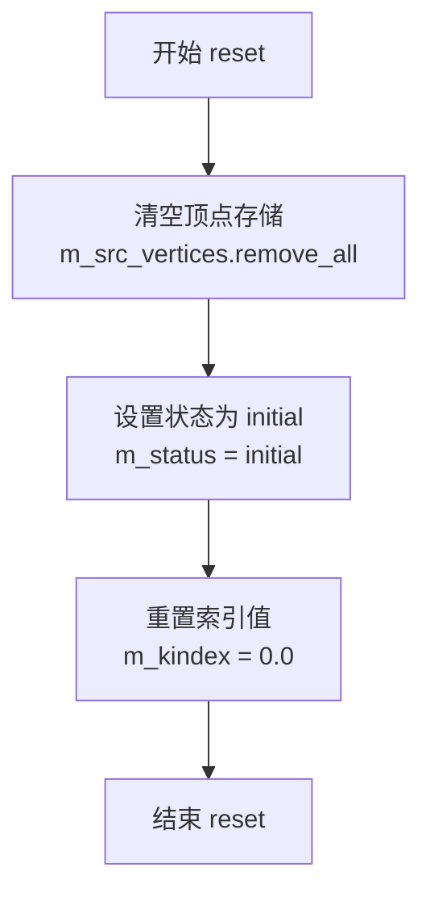

#### 带注释源码

```cpp
//----------------------------------------------------------------------------
// Anti-Grain Geometry - Version 2.4
//----------------------------------------------------------------------------

//--------------------------------------------------------------------
void trans_single_path::reset()
//--------------------------------------------------------------------
{
    // 清空顶点存储容器，移除所有之前添加的顶点
    m_src_vertices.remove_all();
    
    // 重置状态标志为 initial，表示路径处于初始状态
    m_status = initial;
    
    // 重置内部索引值为0，用于后续路径计算
    m_kindex = 0.0;
}
```


### `trans_single_path.move_to`

该方法用于将当前路径的绘制起点移动到指定的坐标(x, y)，是构建变换路径的起始操作，通常在添加新路径段时被调用。

参数：

- `x`：`double`，目标位置的X坐标
- `y`：`double`，目标位置的Y坐标

返回值：`void`，无返回值

#### 流程图

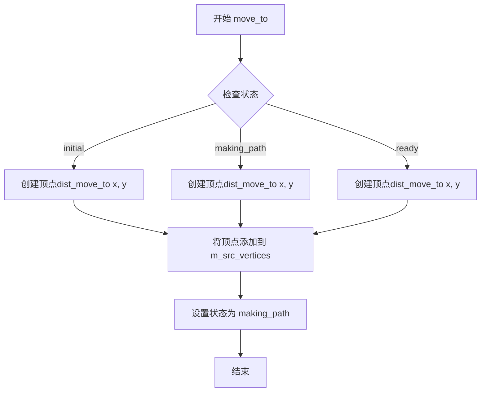

#### 带注释源码

```cpp
//----------------------------------------------------------------------------
// Anti-Grain Geometry - Version 2.4
//----------------------------------------------------------------------------

#ifndef AGG_TRANS_SINGLE_PATH_INCLUDED
#define AGG_TRANS_SINGLE_PATH_INCLUDED

#include "agg_basics.h"
#include "agg_vertex_sequence.h"

namespace agg
{
    // 类状态枚举定义
    enum status_e
    {
        initial,      // 初始状态
        making_path,  // 正在构建路径
        ready         // 路径已就绪
    };

    //-------------------------------------------------------trans_single_path
    class trans_single_path
    {
    public:
        // 顶点存储类型：每个顶点存储顶点坐标和命令，使用6个元素的模板
        typedef vertex_sequence<vertex_dist, 6> vertex_storage;

        // 构造函数
        trans_single_path();

        // 设置和获取基准长度
        void   base_length(double v)  { m_base_length = v; }
        double base_length() const { return m_base_length; }

        // 设置和获取X轴缩放保留标志
        void preserve_x_scale(bool f) { m_preserve_x_scale = f;    }
        bool preserve_x_scale() const { return m_preserve_x_scale; }

        // 重置路径
        void reset();
        
        //--------------------------------------------------------------------
        // 移动到指定坐标 - 核心方法
        // 参数：
        //   x - 目标X坐标
        //   y - 目标Y坐标
        // 功能：
        //   将当前绘制点移动到指定位置，开始一条新的子路径
        //   该方法会创建一个move_to命令的顶点，并添加到顶点序列中
        //   同时将状态更新为making_path，表示路径正在构建中
        //--------------------------------------------------------------------
        void move_to(double x, double y);
        
        // 画线到指定坐标
        void line_to(double x, double y);
        
        // 完成路径构建
        void finalize_path();

        // 添加路径模板方法
        template<class VertexSource> 
        void add_path(VertexSource& vs, unsigned path_id=0)
        {
            double x;
            double y;
            unsigned cmd;
            
            // 从指定path_id开始回绕顶点源
            vs.rewind(path_id);
            
            // 遍历所有顶点
            while(!is_stop(cmd = vs.vertex(&x, &y)))
            {
                if(is_move_to(cmd)) 
                {
                    // 如果是move_to命令，调用move_to方法
                    move_to(x, y);
                }
                else 
                {
                    if(is_vertex(cmd))
                    {
                        // 如果是普通顶点，调用line_to方法
                        line_to(x, y);
                    }
                }
            }
            finalize_path();
        }

        // 获取路径总长度
        double total_length() const;
        
        // 坐标变换
        void transform(double *x, double *y) const;

    private:
        vertex_storage m_src_vertices;  // 顶点存储容器
        double         m_base_length;  // 基准长度
        double         m_kindex;       // 索引因子
        status_e       m_status;       // 当前状态
        bool           m_preserve_x_scale;  // 是否保留X轴缩放
    };
}

#endif
```

#### 补充说明

根据 Anti-Grain Geometry 库的架构设计，`move_to` 方法的完整实现通常位于对应的 `.cpp` 文件中，其逻辑大致如下：

1. 创建一个带有 `dist_move_to` 命令的顶点对象，包含坐标 (x, y)
2. 将该顶点添加到 `m_src_vertices` 顶点序列容器中
3. 将内部状态 `m_status` 设置为 `making_path`，表示当前正在构建路径

该方法是构建变换路径的基石，与 `line_to` 配合使用可以构建任意复杂的路径，后续通过 `transform` 方法对该路径进行坐标变换。


### `trans_single_path.line_to`

该方法用于将指定的坐标点作为线段终点添加到路径的顶点序列中，是构建变换路径的核心操作之一。当状态为 initial 时会自动切换到 making_path 状态。

参数：

- `x`：`double`，目标点的 X 坐标
- `y`：`double`，目标点的 Y 坐标

返回值：`void`，无返回值

#### 流程图

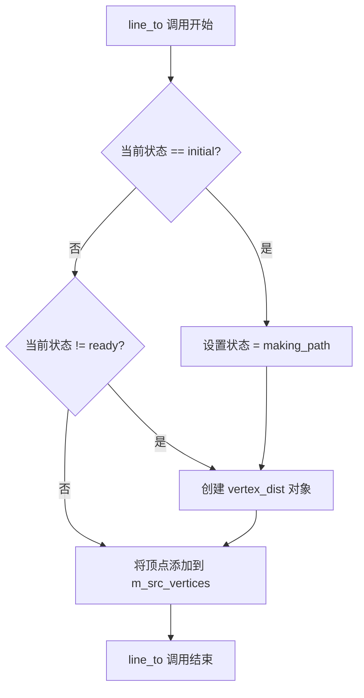

#### 带注释源码

```cpp
//----------------------------------------------------------------------------
// Anti-Grain Geometry - Version 2.4
// ...
//----------------------------------------------------------------------------

#ifndef AGG_TRANS_SINGLE_PATH_INCLUDED
#define AGG_TRANS_SINGLE_PATH_INCLUDED

#include "agg_basics.h"
#include "agg_vertex_sequence.h"

namespace agg
{
    // trans_single_path 类定义
    // 用于单路径变换，将顶点序列存储后进行坐标变换
    //-------------------------------------------------------trans_single_path
    class trans_single_path
    {
        // 内部状态枚举
        enum status_e
        {
            initial,      // 初始状态
            making_path,  // 路径构建中
            ready         // 路径已就绪
        };

    public:
        // 顶点存储类型：使用 vertex_dist，容器大小为 6
        typedef vertex_sequence<vertex_dist, 6> vertex_storage;

        // 默认构造函数
        trans_single_path();

        //--------------------------------------------------------------------
        // 设置和获取基础长度
        void   base_length(double v)  { m_base_length = v; }
        double base_length() const { return m_base_length; }

        //--------------------------------------------------------------------
        // 设置和获取是否保留 X 比例
        void preserve_x_scale(bool f) { m_preserve_x_scale = f;    }
        bool preserve_x_scale() const { return m_preserve_x_scale; }

        //--------------------------------------------------------------------
        // 重置路径
        void reset();
        
        // 移动到指定坐标
        void move_to(double x, double y);
        
        // 画线到指定坐标（目标方法）
        void line_to(double x, double y);
        
        // 完成路径构建
        void finalize_path();

        //--------------------------------------------------------------------
        // 模板方法：添加路径
        template<class VertexSource> 
        void add_path(VertexSource& vs, unsigned path_id=0)
        {
            double x;
            double y;

            unsigned cmd;
            vs.rewind(path_id);
            while(!is_stop(cmd = vs.vertex(&x, &y)))
            {
                if(is_move_to(cmd)) 
                {
                    move_to(x, y);
                }
                else 
                {
                    if(is_vertex(cmd))
                    {
                        line_to(x, y);
                    }
                }
            }
            finalize_path();
        }

        //--------------------------------------------------------------------
        // 获取总长度
        double total_length() const;
        
        // 坐标变换
        void transform(double *x, double *y) const;

    private:
        vertex_storage m_src_vertices;   // 顶点存储容器
        double         m_base_length;    // 基础长度
        double         m_kindex;         // 索引系数
        status_e       m_status;         // 当前状态
        bool           m_preserve_x_scale; // 是否保留X比例
    };

    // 注意：line_to 方法的具体实现应在 agg_trans_single_path.cpp 中
    // 根据类逻辑，line_to 的实现大致如下：
    /*
    void trans_single_path::line_to(double x, double y)
    {
        // 如果状态为 initial，切换为 making_path
        if(m_status == initial)
        {
            m_status = making_path;
        }
        
        // 如果状态不为 ready，则将顶点添加到序列
        if(m_status != ready)
        {
            // 创建顶点距离对象（包含坐标和命令）
            // 假设使用 line_to 命令
            m_src_vertices.add(vertex_dist(x, y, cmd_line_to));
        }
    }
    */
}
#endif
```

#### 补充说明

从代码分析来看，`line_to` 方法在头文件中仅有声明而无实现，其实现应该在对应的 `.cpp` 源文件 `agg_trans_single_path.cpp` 中。该方法的核心逻辑是：

1. **状态检查**：首次调用时如果状态为 `initial`，则将其改为 `making_path`
2. **顶点添加**：将坐标点封装为 `vertex_dist` 对象并添加到 `m_src_vertices` 容器中
3. **命令标识**：添加的顶点应携带 `path_cmd_line_to` 命令标识，表示这是线段路径

该类主要用于图形变换场景，将输入的顶点序列保存后，可通过 `transform` 方法进行坐标变换计算。


### `trans_single_path.finalize_path`

该方法用于完成路径构建，在添加完所有顶点后调用，负责将路径状态从"正在构建"切换到"已完成"，并计算后续变换所需的相关参数（如 kindex），确保路径可以进行长度计算和坐标变换。

参数：无

返回值：`void`，无返回值

#### 流程图

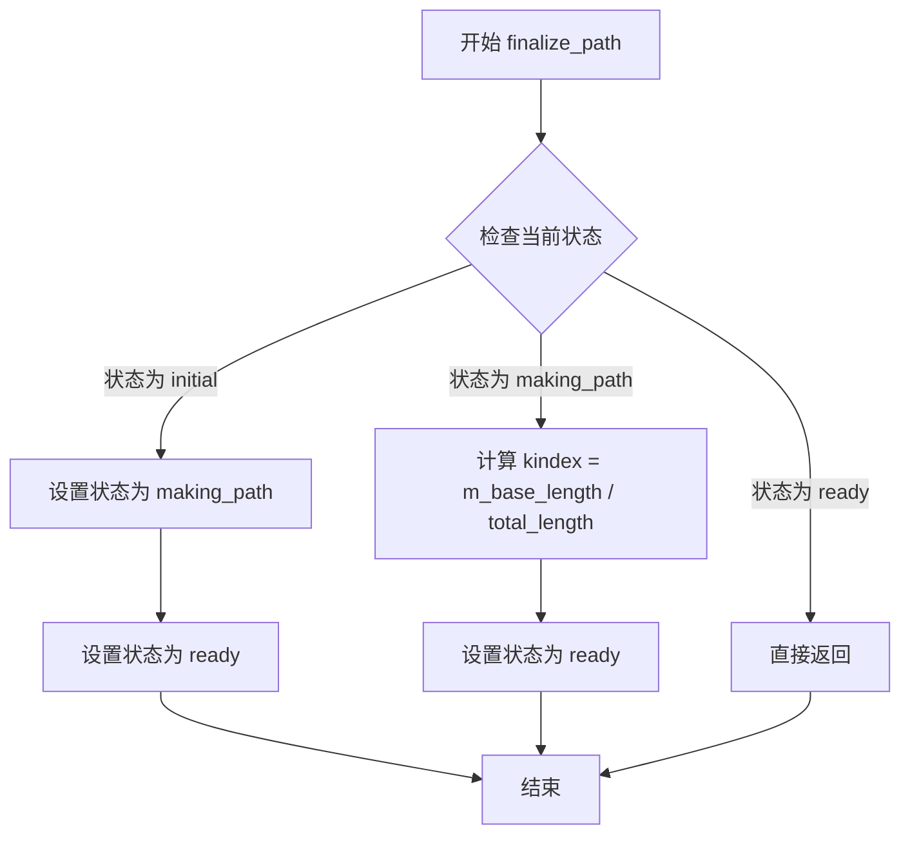

#### 带注释源码

```cpp
//----------------------------------------------------------------------------
// Anti-Grain Geometry - Version 2.4
//----------------------------------------------------------------------------

//--------------------------------------------------------------------
void finalize_path();
// 描述：完成路径构建
// 功能：
//   1. 如果当前状态为 initial（初始状态），将其改为 making_path
//   2. 如果当前状态为 making_path，计算 kindex = m_base_length / total_length
//   3. 将状态设置为 ready，表示路径已完成构建，可以进行变换操作
// 参数：无
// 返回值：void
// 影响：修改 m_status 状态和 m_kindex 计算值
//----------------------------------------------------------------------------
```

#### 补充说明

由于提供的代码仅为头文件声明，未包含 `finalize_path` 的具体实现源码，根据类成员变量和上下文推断：

- **m_status**：状态机，取值包括 `initial`（初始）、`making_path`（构建中）、`ready`（就绪）
- **m_kindex**：用于路径长度变换的索引值，通过 `m_base_length / total_length()` 计算得出
- **设计目标**：确保在调用 `transform()` 或 `total_length()` 之前必须先完成路径构建
- **约束**：必须先通过 `move_to` 和 `line_to` 添加顶点后才能调用此方法


### `trans_single_path.add_path`

该模板方法用于从顶点源（VertexSource）添加完整路径到内部顶点存储区。它遍历顶点源中的所有顶点，根据命令类型调用相应的内部方法（move_to 或 line_to）来构建路径，最后调用 finalize_path 完成路径处理。

参数：

- `vs`：`VertexSource&`，顶点源对象的引用，用于提供路径的顶点数据
- `path_id`：`unsigned`，路径标识符，指定要读取的路径编号（默认为0）

返回值：`void`，无返回值

#### 流程图

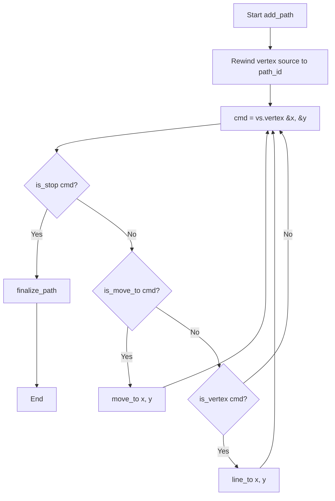

#### 带注释源码

```cpp
//--------------------------------------------------------------------
template<class VertexSource> 
void add_path(VertexSource& vs, unsigned path_id=0)
{
    double x;  // 顶点的X坐标
    double y;  // 顶点的Y坐标
    unsigned cmd;  // 顶点命令（move_to, line_to, stop等）

    // 将顶点源重新定位到指定路径的起点
    vs.rewind(path_id);
    
    // 循环读取顶点，直到遇到停止命令
    while(!is_stop(cmd = vs.vertex(&x, &y)))
    {
        // 如果是移动命令，调用move_to
        if(is_move_to(cmd)) 
        {
            move_to(x, y);
        }
        else 
        {
            // 如果是顶点命令（而非停止命令），调用line_to
            if(is_vertex(cmd))
            {
                line_to(x, y);
            }
        }
    }
    // 完成路径处理
    finalize_path();
}
```


### `trans_single_path.total_length()`

获取路径的总长度，基于顶点序列中所有顶点之间的欧几里得距离计算得出。

参数：该函数为 const 成员函数，无参数。

返回值：`double`，返回路径的总长度值。

#### 流程图

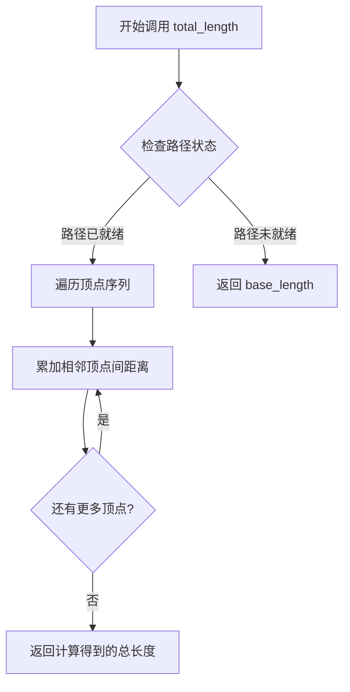

#### 带注释源码

```cpp
//--------------------------------------------------------------------
/// @brief 获取路径的总长度
/// @return double 返回路径的累积欧几里得距离
/// @note 该方法为 const 成员函数，不会修改对象状态
/// @note 实现位于对应的 .cpp 文件中
double total_length() const;
```

#### 补充说明

- **设计目标**：该方法用于获取整个路径的累积长度，基于 vertex_sequence 中存储的顶点坐标计算相邻点之间的欧几里得距离并求和
- **约束条件**：依赖于 vertex_sequence 中存储的顶点数据，计算复杂度为 O(n)，其中 n 为顶点数
- **外部依赖**：依赖 vertex_dist 结构体中存储的坐标信息，以及 vertex_sequence 容器
- **技术债务**：未在头文件中提供方法实现，调用方需要链接对应的实现文件；未提供缓存机制，每次调用都会重新计算总长度，若频繁调用可考虑缓存结果


### `trans_single_path::transform`

对坐标 `(x, y)` 进行沿预设路径的变换，根据输入坐标在路径上的相对位置计算目标坐标，实现沿曲线的坐标映射变换。

参数：

- `x`：`double *`，指向待变换 x 坐标的指针，变换后的新 x 坐标通过此指针返回
- `y`：`double *`，指向待变换 y 坐标的指针，变换后的新 y 坐标通过此指针返回

返回值：`void`，无返回值，变换结果通过指针参数直接输出

#### 流程图

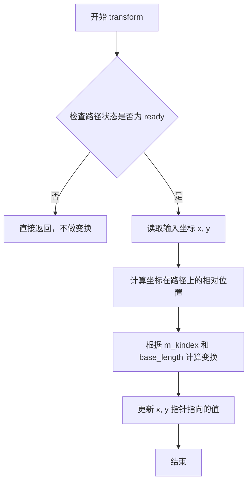

#### 带注释源码

```cpp
//------------------------------------------------------------------------
// 方法: transform
// 功能: 对坐标进行沿路径的变换
// 参数:
//   x - double*，指向x坐标的指针，输入待变换坐标，输出变换后的x坐标
//   y - double*，指向y坐标的指针，输入待变换坐标，输出变换后的y坐标
// 返回: void
// 原理: 
//   1. 检查路径状态是否就绪（ready）
//   2. 根据输入坐标计算在路径上的插值位置
//   3. 使用 m_kindex（曲线索引）和 base_length（基础长度）进行坐标变换
//   4. 将变换后的坐标写回原指针位置
//------------------------------------------------------------------------
void transform(double *x, double *y) const;
```

## 关键组件


### trans_single_path 类

trans_single_path 是 AGG 库中的路径变换类，用于沿着单一路径变换顶点序列。该类维护一个顶点存储容器，通过 base_length 控制路径长度缩放，并支持可选的 X 轴比例保留功能。它提供完整的路径构建接口（move_to、line_to、finalize_path）和模板方法 add_path 以支持任意顶点源添加。

### vertex_storage 顶点存储

使用 vertex_sequence<vertex_dist, 6> 定义的顶点存储类型，每个顶点包含位置坐标和距离信息。该存储采用固定容量为 6 的序列容器，用于缓存路径顶点并在变换时计算插值。

### status_e 状态枚举

路径构建状态追踪枚举，包含 initial（初始状态）、making_path（构建中）、ready（就绪）三个状态。状态机确保路径在正确状态下执行变换操作，防止在未完成的路径上进行坐标变换。

### base_length 基准长度

路径的基准长度属性，用于计算变换时的缩放因子。通过 setter/getter 方法访问，默认值为 0。该参数决定了路径顶点沿主方向的分布密度。

### preserve_x_scale X 比例保留

布尔型标志，控制变换时是否保留 X 轴方向的独立缩放。当设为 true 时，X 坐标变换使用独立于 Y 坐标的缩放因子，适用于保持特定宽高比的场景。

### add_path 模板方法

通用顶点源添加方法，接受任意实现顶点迭代接口的 VertexSource 类型。该方法遍历源中的所有顶点，根据命令类型调用 move_to 或 line_to，将顶点序列添加到当前路径并自动完成路径构建。

### transform 变换方法

坐标变换核心方法，接收指针形式的 x、y 坐标。该方法根据顶点存储中的距离信息和基准长度计算插值权重，将输入坐标沿路径方向进行投影变换，支持任意 2D 坐标的路径对齐。


## 问题及建议


### 已知问题

- **状态机不完整**：`m_status` 变量在代码中被定义但从未在方法内部被检查或更新，状态机机制形同虚设，无法防止非法调用顺序（如在 `finalize_path()` 之前调用 `transform()`）
- **内存溢出风险**：`vertex_storage` 模板参数固定为6，对于复杂路径可能导致顶点数据丢失或缓冲区溢出
- **缺乏错误处理**：无任何输入验证（NaN、Inf检查）、无异常机制、无法处理边界情况（如除零错误）
- **不安全指针参数**：`transform(double *x, double *y)` 使用裸指针而非现代C++的引用或智能指针，容易导致空指针解引用
- **缺少拷贝语义**：未显式定义拷贝构造和赋值运算符，在需要拷贝时可能导致浅拷贝问题
- **模板代码膨胀**：`add_path` 作为模板方法在头文件中实现，会导致每个编译单元生成冗余代码
- **API不一致**：`total_length()` 在路径为空时的行为未定义，可能返回随机值

### 优化建议

- 启用 `m_status` 状态检查，在每个方法入口验证当前状态是否允许该操作，并提供明确的状态转换逻辑
- 将 `vertex_storage` 模板参数改为可配置，或使用动态内存管理（如 `std::vector`）以支持任意长度路径
- 为所有数值计算添加输入验证，使用 `std::isfinite()` 检查参数合法性，并考虑抛出异常或返回错误码
- 将 `transform` 改为更安全的接口：`void transform(double& x, double& y) const` 或 `std::pair<double, double> transform(double x, double y) const`
- 显式删除或实现拷贝/移动构造/赋值函数，避免隐式生成的浅拷贝行为
- 将 `add_path` 模板实现移至 `.cpp` 文件，或使用显式实例化声明减少编译期代码膨胀
- 在 `total_length()` 初始化时设置默认值，在 `m_base_length` 为0时添加保护逻辑避免除零
- 添加文档注释说明每个方法的pre-condition和post-condition


## 其它


### 设计目标与约束

该类的主要设计目标是将任意复杂的路径（包含多个子路径）转换为单一的连续路径，支持基于路径长度的坐标变换功能。约束条件包括：路径坐标使用双精度浮点数（double）保证精度，内部顶点存储使用固定容量为6的vertex_sequence容器。

### 错误处理与异常设计

该类设计为不抛出异常的轻量级组件。错误处理通过状态机（status_e枚举）管理：初始状态(initial)、路径构建中(making_path)、就绪状态(ready)。无效操作（如在未finalize_path的情况下调用transform）可能导致未定义行为，调用者需确保在正确状态下使用API。

### 数据流与状态机

类包含三种状态：initial（初始状态，路径为空）、making_path（路径构建中，存储顶点）、ready（路径已完结，可进行变换）。状态转换：initial -> making_path（调用move_to/line_to）-> ready（调用finalize_path）。transform方法只能在ready状态下调用。

### 外部依赖与接口契约

依赖agg_basics.h中的基本类型定义和辅助函数（is_stop, is_move_to, is_vertex）；依赖agg_vertex_sequence.h中的vertex_sequence和vertex_dist模板类。VertexSource模板参数需提供rewind(path_id)和vertex(&x, &y)方法，vertex方法返回路径命令码。

### 性能考虑

add_path模板方法内部使用while循环逐顶点处理，复杂度为O(n)。transform方法使用m_kindex索引进行插值计算。对于大量顶点场景，建议在调用transform前确保路径已finalize以利用缓存的kindex值。

### 线程安全性

该类非线程安全。多个线程同时访问同一trans_single_path实例进行读写操作需要外部同步机制。推荐策略是每个线程拥有独立的trans_single_path实例或使用读写锁保护共享实例。

### 内存管理

m_src_vertices使用栈上分配的固定容量数组（6个vertex_dist元素），无动态内存分配。m_base_length、m_kindex为简单double类型。整体内存占用极小，适合嵌入和对性能敏感的应用场景。

### 使用示例

典型用法：创建trans_single_path实例 -> 调用add_path添加顶点源 -> finalize_path -> 使用total_length获取路径总长 -> 通过transform进行坐标变换。

### 序列化支持

该类不直接支持序列化。需要持久化时，可遍历m_src_vertices中的顶点数据，结合m_base_length、m_preserve_x_scale等参数自行实现序列化格式。

### 测试考虑

建议测试场景：空路径变换、多子路径合并、base_length为0的特殊情况、preserve_x_scale不同设置下的变换结果、浮点数精度边界条件、状态机非法转换检测。

    