# `matplotlib\extern\agg24-svn\include\agg_trans_viewport.h` 详细设计文档

这是Anti-Grain Geometry (AGG) 库中的一个视口变换模块，实现了世界坐标(World Coordinates)到设备/屏幕坐标(Device Coordinates)的正交变换，支持三种宽高比模式(拉伸、适应、裁剪)，并提供仿射变换矩阵的导出功能。

## 整体流程

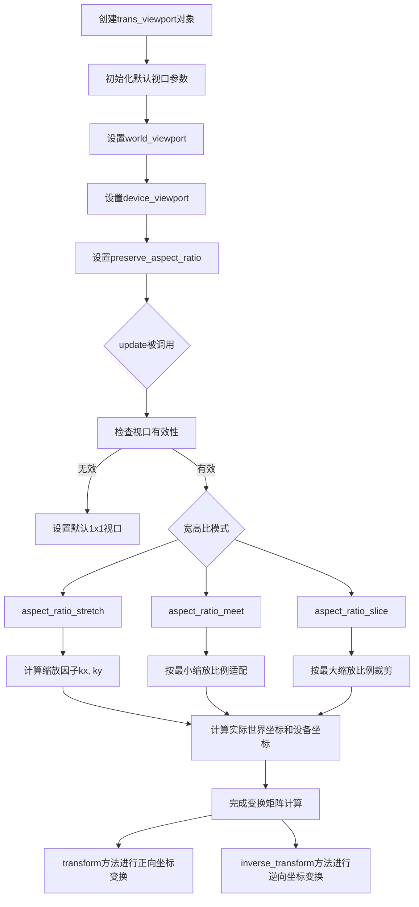

## 类结构

```
agg (命名空间)
└── trans_viewport (视口变换类)
    ├── 枚举: aspect_ratio_e
    │   ├── aspect_ratio_stretch (拉伸)
    │   ├── aspect_ratio_meet (适应/包含)
    │   └── aspect_ratio_slice (裁剪)
```

## 全局变量及字段


### `aspect_ratio_stretch`
    
宽高比拉伸模式，任意缩放

类型：`enum value`
    


### `aspect_ratio_meet`
    
宽高比适应模式，保持完整内容

类型：`enum value`
    


### `aspect_ratio_slice`
    
宽高比剪切模式，充满视口

类型：`enum value`
    


### `trans_viewport.m_world_x1`
    
世界坐标系左上角x坐标

类型：`double`
    


### `trans_viewport.m_world_y1`
    
世界坐标系左上角y坐标

类型：`double`
    


### `trans_viewport.m_world_x2`
    
世界坐标系右下角x坐标

类型：`double`
    


### `trans_viewport.m_world_y2`
    
世界坐标系右下角y坐标

类型：`double`
    


### `trans_viewport.m_device_x1`
    
设备坐标系左上角x坐标

类型：`double`
    


### `trans_viewport.m_device_y1`
    
设备坐标系左上角y坐标

类型：`double`
    


### `trans_viewport.m_device_x2`
    
设备坐标系右下角x坐标

类型：`double`
    


### `trans_viewport.m_device_y2`
    
设备坐标系右下角y坐标

类型：`double`
    


### `trans_viewport.m_aspect`
    
宽高比处理模式枚举

类型：`aspect_ratio_e`
    


### `trans_viewport.m_is_valid`
    
视口参数有效性标志

类型：`bool`
    


### `trans_viewport.m_align_x`
    
x轴对齐系数(0.0-1.0)

类型：`double`
    


### `trans_viewport.m_align_y`
    
y轴对齐系数(0.0-1.0)

类型：`double`
    


### `trans_viewport.m_wx1`
    
实际变换后世界坐标x1

类型：`double`
    


### `trans_viewport.m_wy1`
    
实际变换后世界坐标y1

类型：`double`
    


### `trans_viewport.m_wx2`
    
实际变换后世界坐标x2

类型：`double`
    


### `trans_viewport.m_wy2`
    
实际变换后世界坐标y2

类型：`double`
    


### `trans_viewport.m_dx1`
    
设备坐标x方向平移量

类型：`double`
    


### `trans_viewport.m_dy1`
    
设备坐标y方向平移量

类型：`double`
    


### `trans_viewport.m_kx`
    
x轴缩放因子

类型：`double`
    


### `trans_viewport.m_ky`
    
y轴缩放因子

类型：`double`
    
    

## 全局函数及方法


### `agg::trans_viewport::update()`

该私有成员函数是视口变换器的核心计算逻辑，负责根据当前设置的世界坐标范围、设备坐标范围和宽高比模式，计算并更新内部变换参数（缩放因子、偏移量、有效世界坐标范围等），以支持世界坐标到设备坐标的仿射变换。

参数：（无参数）

返回值：`void`，无返回值

#### 流程图

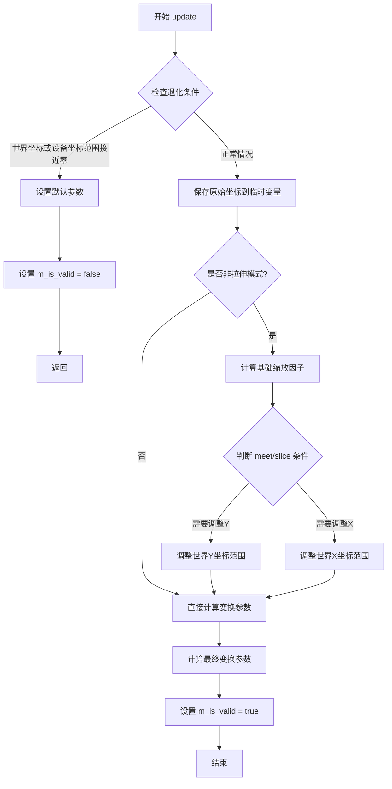

#### 带注释源码

```cpp
//----------------------------------------------------------------------------
// trans_viewport::update - 计算内部变换参数
// 该函数根据当前的世界坐标视口和设备坐标视口，计算仿射变换所需的
// 缩放因子(kx, ky)、偏移量(dx1, dy1)以及实际使用的世界坐标范围
//----------------------------------------------------------------------------
inline void trans_viewport::update()
{
    // 定义极小值用于避免除零错误
    const double epsilon = 1e-30;
    
    //-----------------------------------------------------------------------
    // 退化情况检查：如果世界坐标或设备坐标的宽度/高度接近零，
    // 则设置默认变换参数并标记为无效
    //-----------------------------------------------------------------------
    if(fabs(m_world_x1  - m_world_x2)  < epsilon ||
       fabs(m_world_y1  - m_world_y2)  < epsilon ||
       fabs(m_device_x1 - m_device_x2) < epsilon ||
       fabs(m_device_y1 - m_device_y2) < epsilon)
    {
        // 设置默认世界坐标范围（单位宽度）
        m_wx1 = m_world_x1;
        m_wy1 = m_world_y1;
        m_wx2 = m_world_x1 + 1.0;
        m_wy2 = m_world_y2 + 1.0;
        
        // 设置默认设备坐标原点
        m_dx1 = m_device_x1;
        m_dy1 = m_device_y1;
        
        // 设置默认缩放因子（单位缩放）
        m_kx  = 1.0;
        m_ky  = 1.0;
        
        // 标记变换无效
        m_is_valid = false;
        return;
    }

    //-----------------------------------------------------------------------
    // 正常情况：保存原始坐标到临时变量，后续可能会根据宽高比调整
    //-----------------------------------------------------------------------
    double world_x1  = m_world_x1;
    double world_y1  = m_world_y1;
    double world_x2  = m_world_x2;
    double world_y2  = m_world_y2;
    double device_x1 = m_device_x1;
    double device_y1 = m_device_y1;
    double device_x2 = m_device_x2;
    double device_y2 = m_device_y2;
    
    //-----------------------------------------------------------------------
    // 宽高比处理：如果不是拉伸模式，需要保持宽高比
    //-----------------------------------------------------------------------
    if(m_aspect != aspect_ratio_stretch)
    {
        double d;
        
        // 计算基础缩放因子（基于原始世界坐标范围）
        m_kx = (device_x2 - device_x1) / (world_x2 - world_x1);
        m_ky = (device_y2 - device_y1) / (world_y2 - world_y1);

        // 根据宽高比模式和对齐方式调整世界坐标范围
        // meet模式：完整显示整个世界区域，可能有留白
        // slice模式：填满设备区域，可能裁剪世界区域
        if((m_aspect == aspect_ratio_meet) == (m_kx < m_ky))
        {
            // 需要在Y方向上调整
            d         = (world_y2 - world_y1) * m_ky / m_kx;
            world_y1 += (world_y2 - world_y1 - d) * m_align_y;
            world_y2  =  world_y1 + d;
        }
        else
        {
            // 需要在X方向上调整
            d         = (world_x2 - world_x1) * m_kx / m_ky;
            world_x1 += (world_x2 - world_x1 - d) * m_align_x;
            world_x2  =  world_x1 + d;
        }
    }
    
    //-----------------------------------------------------------------------
    // 计算最终变换参数：将调整后的世界坐标范围映射到设备坐标范围
    //-----------------------------------------------------------------------
    // 保存实际使用的世界坐标范围
    m_wx1 = world_x1;
    m_wy1 = world_y1;
    m_wx2 = world_x2;
    m_wy2 = world_y2;
    
    // 保存设备坐标原点
    m_dx1 = device_x1;
    m_dy1 = device_y1;
    
    // 计算最终缩放因子（基于调整后的世界坐标范围）
    m_kx  = (device_x2 - device_x1) / (world_x2 - world_x1);
    m_ky  = (device_y2 - device_y1) / (world_y2 - world_y1);
    
    // 标记变换有效
    m_is_valid = true;
}
```


### `trans_viewport.trans_viewport()`

构造函数，初始化默认视口。将世界坐标和设备坐标设置为默认的单位矩形（0,0 到 1,1），并设置默认的宽高比模式为拉伸（aspect_ratio_stretch），同时初始化对齐因子、缩放因子等内部状态，使视口对象处于有效的初始状态。

参数：此构造函数无显式参数（使用成员初始化列表进行初始化）

返回值：无（构造函数）

#### 流程图

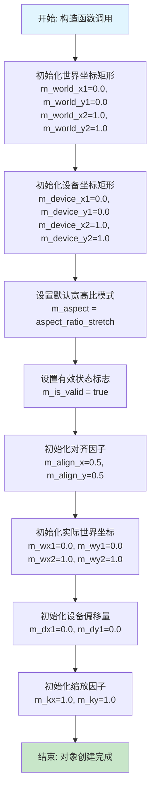

#### 带注释源码

```cpp
//----------------------------------------------------------------------------
// trans_viewport 类的默认构造函数
// 初始化视口变换器为默认状态：
// - 世界坐标和设备坐标都默认为单位矩形 (0,0) -> (1,1)
// - 宽高比模式默认为拉伸 (aspect_ratio_stretch)
// - 对齐因子默认为居中 (0.5, 0.5)
// - 缩放因子默认为 1.0
//----------------------------------------------------------------------------
trans_viewport() : 
    //-------------------------------
    // 世界坐标边界 (用户定义的世界空间范围)
    //-------------------------------
    m_world_x1(0.0),      // 世界坐标左上角 X
    m_world_y1(0.0),      // 世界坐标左上角 Y
    m_world_x2(1.0),      // 世界坐标右下角 X
    m_world_y2(1.0),      // 世界坐标右下角 Y
    
    //-------------------------------
    // 设备坐标边界 (目标设备/屏幕空间范围)
    //-------------------------------
    m_device_x1(0.0),     // 设备坐标左上角 X
    m_device_y1(0.0),     // 设备坐标左上角 Y
    m_device_x2(1.0),     // 设备坐标右下角 X
    m_device_y2(1.0),     // 设备坐标右下角 Y
    
    //-------------------------------
    // 宽高比控制
    //-------------------------------
    m_aspect(aspect_ratio_stretch),  // 默认拉伸模式: 忽略宽高比，完全填充目标区域
    
    //-------------------------------
    // 有效性标志
    //-------------------------------
    m_is_valid(true),     // 初始状态设为有效，update() 方法会根据情况更新此标志
    
    //-------------------------------
    // 对齐因子 (用于 meet/slice 模式)
    //-------------------------------
    m_align_x(0.5),       // 水平对齐: 0.0=左对齐, 0.5=居中, 1.0=右对齐
    m_align_y(0.5),       // 垂直对齐: 0.0=顶部, 0.5=居中, 1.0=底部
    
    //-------------------------------
    // 实际世界坐标 (经过宽高比处理后)
    //-------------------------------
    m_wx1(0.0),           // 实际世界坐标左上角 X (用于变换计算)
    m_wy1(0.0),           // 实际世界坐标左上角 Y
    m_wx2(1.0),           // 实际世界坐标右下角 X
    m_wy2(1.0),           // 实际世界坐标右下角 Y
    
    //-------------------------------
    // 设备坐标偏移 (用于变换计算)
    //-------------------------------
    m_dx1(0.0),           // 设备坐标偏移量 X
    m_dy1(0.0),           // 设备坐标偏移量 Y
    
    //-------------------------------
    // 缩放因子 (世界坐标到设备坐标的变换系数)
    //-------------------------------
    m_kx(1.0),            // X轴缩放系数
    m_ky(1.0)             // Y轴缩放系数
{}                        // 构造函数体为空，所有初始化在初始化列表中完成
```


### `trans_viewport.preserve_aspect_ratio`

设置视口的宽高比保持模式（preserve aspect ratio）和对齐参数，用于在设备坐标和世界坐标转换时控制如何保持宽高比例。

参数：

- `alignx`：`double`，X轴对齐系数，范围通常在0.0到1.0之间，表示在世界视口区域内水平方向的对齐位置（0.0为左对齐，0.5为居中，1.0为右对齐）
- `aligny`：`double`，Y轴对齐系数，范围通常在0.0到1.0之间，表示在世界视口区域内垂直方向的对齐位置（0.0为顶部对齐，0.5为居中，1.0为底部对齐）
- `aspect`：`aspect_ratio_e`，宽高比模式枚举，指定当设备视口和世界视口宽高比不同时的处理方式（`aspect_ratio_stretch`拉伸填充、`aspect_ratio_meet`保持比例完整显示、`aspect_ratio_slice`保持比例裁剪显示）

返回值：`void`，无返回值

#### 流程图

```mermaid
flowchart TD
    A[开始 preserve_aspect_ratio] --> B[设置成员变量 m_align_x = alignx]
    B --> C[设置成员变量 m_align_y = aligny]
    C --> D[设置成员变量 m_aspect = aspect]
    D --> E[调用 update 方法]
    E --> F[结束]
    
    subgraph update方法内部逻辑
    E --> G{检查视口尺寸有效性}
    G -->|无效| H[设置默认变换参数<br/>m_is_valid = false]
    G -->|有效| I{aspect != stretch?}
    I -->|否| J[直接计算缩放系数kx, ky]
    I -->|是| K{计算kx和ky<br/>比较宽高比}
    K --> L{m_aspect == meet<br/>且 kx < ky?}
    L -->|是| M[根据ky调整world_y1/y2<br/>使用align_y对齐]
    L -->|否| N{计算d值<br/>根据kx调整world_x1/x2<br/>使用align_x对齐]
    M --> J
    N --> J
    J --> O[计算最终变换参数<br/>m_kx, m_ky, m_dx1, m_dy1<br/>m_wx1~m_wy2]
    O --> P[m_is_valid = true]
    end
```

#### 带注释源码

```cpp
//----------------------------------------------------------------------------
// 方法: trans_viewport::preserve_aspect_ratio
// 功能: 设置宽高比保持模式和对齐参数
//----------------------------------------------------------------------------
void preserve_aspect_ratio(double alignx, 
                           double aligny, 
                           aspect_ratio_e aspect)
{
    // 1. 设置X轴对齐系数，范围0.0(左)~1.0(右)，0.5为居中
    m_align_x = alignx;
    
    // 2. 设置Y轴对齐系数，范围0.0(上)~1.0(下)，0.5为居中
    m_align_y = aligny;
    
    // 3. 设置宽高比处理模式
    //    aspect_ratio_stretch: 拉伸填充整个设备视口
    //    aspect_ratio_meet:    保持宽高比，完整显示（可能留白）
    //    aspect_ratio_slice:   保持宽高比，裁剪显示（可能溢出）
    m_aspect  = aspect;
    
    // 4. 调用update方法重新计算所有变换参数
    //    该方法会根据新的对齐参数和宽高比模式
    //    计算实际的world视口范围和缩放系数
    update();
}
```

#### 相关上下文信息

**设计目标**：
- 提供灵活的宽高比控制，使开发者能够在不同形状的设备视口中正确显示世界坐标内容
- 支持三种常见的宽高比处理策略：拉伸、完整显示、裁剪

**调用关系**：
- 该方法通常在设置完`device_viewport()`和`world_viewport()`之后调用
- 内部会触发`update()`方法，该方法是整个视口变换的核心计算逻辑

**潜在优化点**：
- 当前每次调用`preserve_aspect_ratio()`都会立即调用`update()`，如果需要连续设置多个参数，可以考虑提供批量设置接口以减少重复计算
- `update()`方法中使用了`fabs()`与`epsilon`比较来判断有效性，可以考虑使用更健壮的数值比较方法


### `trans_viewport.device_viewport`

设置设备视口的坐标范围，用于定义设备（屏幕）坐标系的边界，同时触发内部转换参数的更新计算。

参数：

- `x1`：`double`，设备视口左上角的x坐标
- `y1`：`double`，设备视口左上角的y坐标
- `x2`：`double`，设备视口右下角的x坐标
- `y2`：`double`，设备视口右下角的y坐标

返回值：`void`，无返回值

#### 流程图

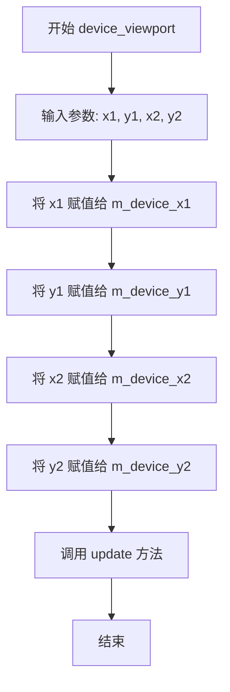

#### 带注释源码

```cpp
//----------------------------------------------------------------------------
// 方法: trans_viewport::device_viewport
// 功能: 设置设备视口的坐标范围
// 参数: 
//   x1 - 设备视口左上角的x坐标
//   y1 - 设备视口左上角的y坐标
//   x2 - 设备视口右下角的x坐标
//   y2 - 设备视口右下角的y坐标
// 返回: void
//----------------------------------------------------------------------------
void device_viewport(double x1, double y1, double x2, double y2)
{
    // 将输入的设备视口坐标赋值给成员变量
    m_device_x1 = x1;  // 设备视口左上角x坐标
    m_device_y1 = y1;  // 设备视口左上角y坐标
    m_device_x2 = x2;  // 设备视口右下角x坐标
    m_device_y2 = y2;  // 设备视口右下角y坐标
    
    // 调用update方法重新计算转换参数
    // 该方法会根据世界视口和设备视口的设置，
    // 计算出正确的缩放因子(kx, ky)和偏移量(dx1, dy1)
    update();
}
```


### `trans_viewport.world_viewport`

设置世界视口（World Viewport）的范围，用于定义世界坐标系中的感兴趣区域。该方法接收四个坐标参数来指定视口的左上角和右下角，并更新内部的视口参数。

参数：

- `x1`：`double`，世界视口左上角的 X 坐标
- `y1`：`double`，世界视口左上角的 Y 坐标
- `x2`：`double`，世界视口右下角的 X 坐标
- `y2`：`double`，世界视口右下角的 Y 坐标

返回值：`void`，无返回值

#### 流程图

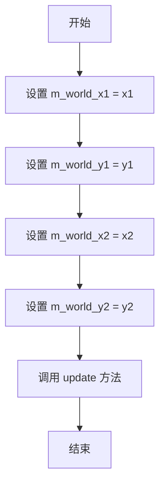

#### 带注释源码

```cpp
//-------------------------------------------------------------------
// 设置世界视口范围
// 参数: x1, y1 - 视口左上角坐标
//       x2, y2 - 视口右下角坐标
void world_viewport(double x1, double y1, double x2, double y2)
{
    m_world_x1 = x1;  // 设置世界视口左上角 X 坐标
    m_world_y1 = y1;  // 设置世界视口左上角 Y 坐标
    m_world_x2 = x2;  // 设置世界视口右下角 X 坐标
    m_world_y2 = y2;  // 设置世界视口右下角 Y 坐标
    update();         // 调用 update 方法重新计算变换参数
}
```


### `trans_viewport.device_viewport`

该方法是 `trans_viewport` 类的重载 getter 方法，用于通过指针参数输出设备视口（device viewport）的四个边界坐标（左下角和右上角）。它是一个 const 成员函数，仅读取内部存储的设备视口坐标值而不修改对象状态。

参数：

- `x1`：`double*`，输出设备视口左下角的 X 坐标
- `y1`：`double*`，输出设备视口左下角的 Y 坐标
- `x2`：`double*`，输出设备视口右上角的 X 坐标
- `y2`：`double*`，输出设备视口右上角的 Y 坐标

返回值：`void`，无返回值，通过指针参数间接输出结果

#### 流程图

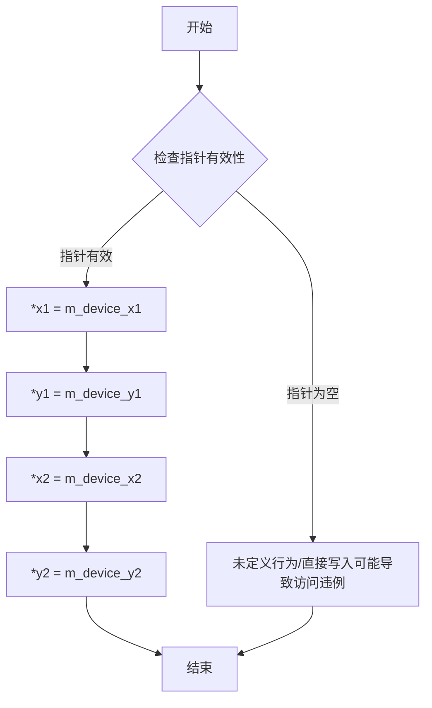

#### 带注释源码

```cpp
//-------------------------------------------------------------------
// 重载的设备视口获取方法（通过指针参数输出）
// @param x1: 输出设备视口左下角 X 坐标的指针
// @param y1: 输出设备视口左下角 Y 坐标的指针
// @param x2: 输出设备视口右上角 X 坐标的指针
// @param y2: 输出设备视口右上角 Y 坐标的指针
// @return: 无返回值，结果通过指针参数输出
//-------------------------------------------------------------------
void device_viewport(double* x1, double* y1, double* x2, double* y2) const
{
    // 将成员变量 m_device_x1（设备视口左下角 X 坐标）的值写入指针 x1 所指向的内存
    *x1 = m_device_x1;
    // 将成员变量 m_device_y1（设备视口左下角 Y 坐标）的值写入指针 y1 所指向的内存
    *y1 = m_device_y1;
    // 将成员变量 m_device_x2（设备视口右上角 X 坐标）的值写入指针 x2 所指向的内存
    *x2 = m_device_x2;
    // 将成员变量 m_device_y2（设备视口右上角 Y 坐标）的值写入指针 y2 所指向的内存
    *y2 = m_device_y2;
}
```

#### 补充说明

此方法的设计体现了以下特点：

1. **Const 正确性**：方法声明为 `const`，表明它不会修改对象的内部状态，符合类的设计约束。
2. **输出参数模式**：使用指针参数来"输出"多个值，这是 C++ 中常见的从函数返回多个值的方式（尤其是在 C++11 之前）。
3. **与另一个重载版本的对比**：
   - 第一个 `device_viewport(double x1, double y1, double x2, double y2)` 是 setter，用于设置设备视口。
   - 第二个 `device_viewport(double* x1, double* y1, double* x2, double* y2)` 是 getter，用于获取设备视口。

4. **关联的成员变量**：
   - `m_device_x1`, `m_device_y1`：设备视口左下角坐标
   - `m_device_x2`, `m_device_y2`：设备视口右上角坐标


### `trans_viewport.world_viewport`

该方法为`trans_viewport`类的成员函数，是`world_viewport`方法的 const 重载版本。通过指针参数输出世界坐标视口的边界矩形（左上角和右下角坐标），允许调用者获取当前配置的世界视口范围。

参数：

- `x1`：`double*`，指向存储世界视口左上角 X 坐标的变量的指针
- `y1`：`double*`，指向存储世界视口左上角 Y 坐标的变量的指针
- `x2`：`double*`，指向存储世界视口右下角 X 坐标的变量的指针
- `y2`：`double*`，指向存储世界视口右下角 Y 坐标的变量的指针

返回值：`void`，无返回值。坐标值通过指针参数回填给调用者

#### 流程图

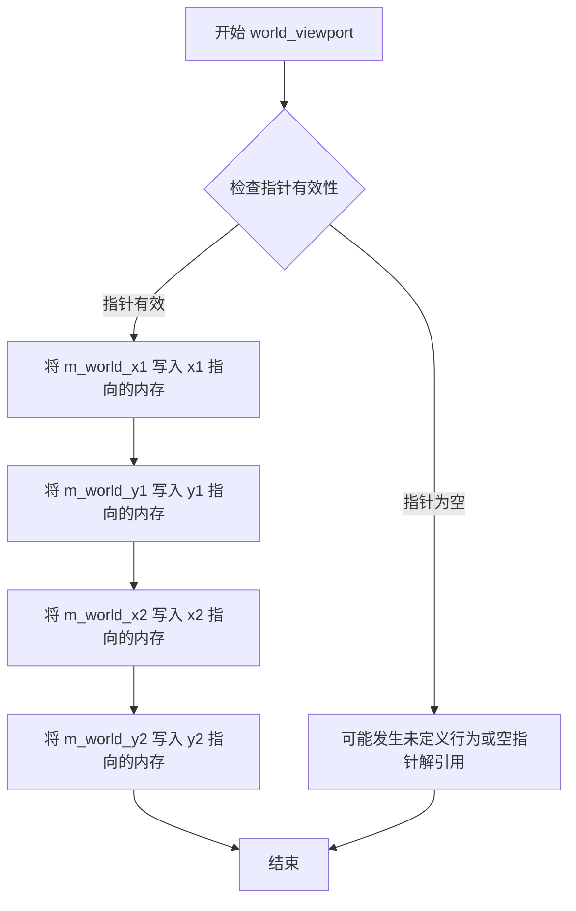

#### 带注释源码

```cpp
//-------------------------------------------------------------------
// 获取世界视口边界坐标（重载版本）
// 通过指针参数回填世界视口的左上角和右下角坐标
//-------------------------------------------------------------------
void world_viewport(double* x1, double* y1, double* x2, double* y2) const
{
    // 将成员变量 m_world_x1（左上角 X 坐标）写入 x1 指针指向的内存
    *x1 = m_world_x1;
    
    // 将成员变量 m_world_y1（左上角 Y 坐标）写入 y1 指针指向的内存
    *y1 = m_world_y1;
    
    // 将成员变量 m_world_x2（右下角 X 坐标）写入 x2 指针指向的内存
    *x2 = m_world_x2;
    
    // 将成员变量 m_world_y2（右下角 Y 坐标）写入 y2 指针指向的内存
    *y2 = m_world_y2;
}
```


### `trans_viewport.world_viewport_actual`

获取经过实际计算（考虑纵横比处理后）的世界视口坐标。该方法返回的是经过 `preserve_aspect_ratio` 处理后实际用于变换的世界视口区域，而非原始设置的理想世界视口。

参数：

- `x1`：`double*`，输出参数，实际世界视口左上角的 X 坐标
- `y1`：`double*`，输出参数，实际世界视口左上角的 Y 坐标
- `x2`：`double*`，输出参数，实际世界视口右下角的 X 坐标
- `y2`：`double*`，输出参数，实际世界视口右下角的 Y 坐标

返回值：`void`，无返回值，结果通过输出参数返回

#### 流程图

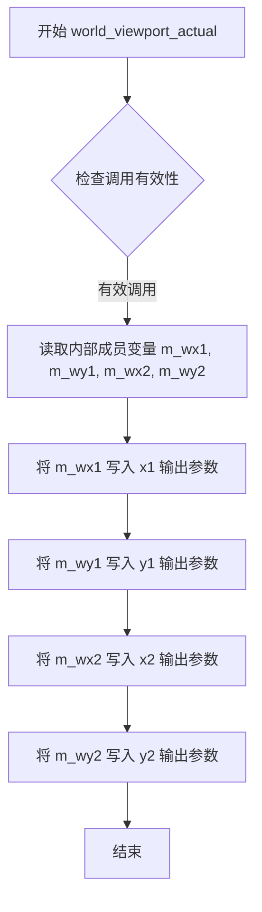

#### 带注释源码

```cpp
//-------------------------------------------------------------------
// 获取实际计算后的世界视口坐标
// 该方法返回的是经过纵横比处理后实际使用的世界视口区域
// 与 world_viewport() 方法设置的原始视口不同，当设置了 preserve_aspect_ratio() 后
// 实际视口会根据对齐方式和缩放策略进行调整
//-------------------------------------------------------------------
void world_viewport_actual(double* x1, double* y1, 
                           double* x2, double* y2) const
{
    // 将内部成员变量 m_wx1（实际世界视口左边界）写入输出参数 x1
    *x1 = m_wx1;
    
    // 将内部成员变量 m_wy1（实际世界视口上边界）写入输出参数 y1
    *y1 = m_wy1;
    
    // 将内部成员变量 m_wx2（实际世界视口右边界）写入输出参数 x2
    *x2 = m_wx2;
    
    // 将内部成员变量 m_wy2（实际世界视口下边界）写入输出参数 y2
    *y2 = m_wy2;
}
```


### `trans_viewport.is_valid`

获取视口有效性状态。该方法返回一个布尔值，表示当前视口变换参数是否有效。当世界坐标或设备坐标的区间为零或非常小（接近epsilon）时，视口将被标记为无效。

参数：无

返回值：`bool`，表示视口变换是否有效。返回true表示视口参数有效，可以进行正常的坐标变换；返回false表示视口参数无效（如坐标区间为零或非常小）。

#### 流程图

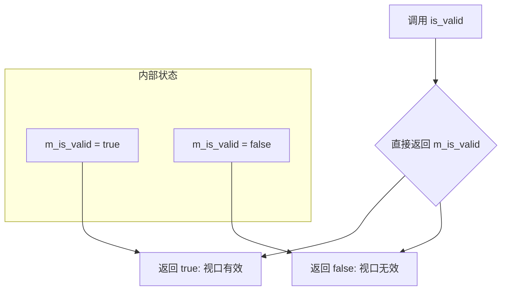

#### 带注释源码

```cpp
//-------------------------------------------------------------------
// is_valid - 获取视口有效性状态
//-------------------------------------------------------------------
// 参数：无
// 返回值：bool - 视口有效性标志
//   true  - 视口参数有效，可以进行正常的坐标变换
//   false - 视口参数无效（坐标区间为零或非常小）
//-------------------------------------------------------------------
// 说明：
//   该方法是一个简单的getter，返回内部成员变量m_is_valid的状态。
//   m_is_valid在update()方法中被设置，当以下情况之一发生时会被设为false：
//   1. 世界坐标x1与x2的差值小于epsilon (1e-30)
//   2. 世界坐标y1与y2的差值小于epsilon (1e-30)
//   3. 设备坐标x1与x2的差值小于epsilon (1e-30)
//   4. 设备坐标y1与y2的差值小于epsilon (1e-30)
//
// 使用场景：
//   在进行坐标变换前，应先调用此方法检查视口有效性，
//   避免在无效视口状态下进行变换导致除零错误或异常结果。
//-------------------------------------------------------------------
bool is_valid() const 
{ 
    return m_is_valid; 
}
```

#### 相关上下文源码（m_is_valid的设置逻辑）

```cpp
// trans_viewport::update() 方法中设置 m_is_valid 的逻辑
inline void trans_viewport::update()
{
    const double epsilon = 1e-30;
    // 检查所有坐标区间是否有效（大于epsilon）
    if(fabs(m_world_x1  - m_world_x2)  < epsilon ||
       fabs(m_world_y1  - m_world_y2)  < epsilon ||
       fabs(m_device_x1 - m_device_x2) < epsilon ||
       fabs(m_device_y1 - m_device_y2) < epsilon)
    {
        // 设置默认值并标记为无效
        m_wx1 = m_world_x1;
        m_wy1 = m_world_y1;
        m_wx2 = m_world_x1 + 1.0;
        m_wy2 = m_world_y2 + 1.0;
        m_dx1 = m_device_x1;
        m_dy1 = m_device_y1;
        m_kx  = 1.0;
        m_ky  = 1.0;
        m_is_valid = false;  // 标记为无效
        return;
    }
    // ... 正常计算逻辑 ...
    m_is_valid = true;  // 标记为有效
}
```


### `trans_viewport.align_x`

该方法为`trans_viewport`类的const成员函数，用于获取视口在保持宽高比时的x轴对齐参数。该参数决定当世界坐标视口与设备视口宽高比不一致时，内容在水平方向上的对齐方式（0.0为左对齐，0.5为居中，1.0为右对齐）。

参数：该方法无参数。

返回值：`double`，返回x轴对齐值（m_align_x），表示水平方向的对齐系数，取值范围通常在0.0到1.0之间。

#### 流程图

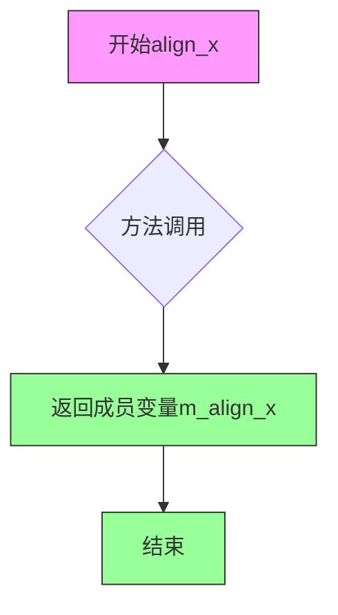

#### 带注释源码

```cpp
//-------------------------------------------------------------------
// 获取x轴对齐值
// 该值用于在保持宽高比模式下确定视口水平对齐方式
// 0.0 = 左对齐, 0.5 = 居中, 1.0 = 右对齐
// 返回值：double类型的对齐系数
//-------------------------------------------------------------------
double align_x() const 
{ 
    return m_align_x;  // 返回私有成员变量m_align_x
}
```

该方法是典型的getter访问器，属于最小权限原则（Principle of Least Authority）的实现，仅提供只读访问而不暴露内部状态的可变性。对齐参数在`preserve_aspect_ratio()`方法设置后，通过此方法供外部查询使用。


### `trans_viewport.align_y()`

获取Y轴对齐值，用于在保持宽高比时确定世界坐标系在设备坐标系中的垂直对齐方式。

参数： 无

返回值：`double`，返回Y轴对齐值，范围通常为0.0到1.0，用于控制viewport在垂直方向上的对齐位置（0.0为底部，0.5为居中，1.0为顶部）。

#### 流程图

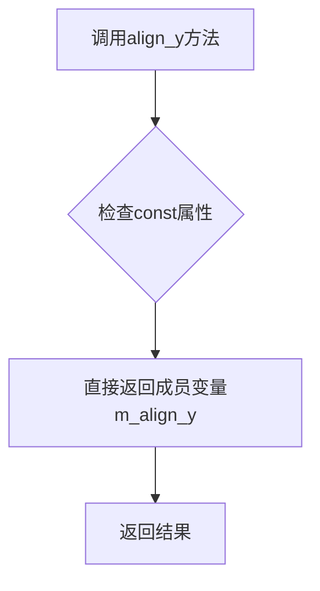

#### 带注释源码

```cpp
//-------------------------------------------------------------------
// 获取Y轴对齐值
// 该方法是一个const成员函数，不修改对象状态
// 返回值m_align_y是一个double类型，范围通常是0.0到1.0
// 0.0表示底部对齐，0.5表示居中对齐，1.0表示顶部对齐
// 该值在preserve_aspect_ratio方法中被设置，用于控制当aspect_ratio
// 为aspect_ratio_meet或aspect_ratio_slice时的垂直对齐行为
//-------------------------------------------------------------------
double align_y() const { return m_align_y; }
```

#### 相关上下文信息

- **所属类**：`trans_viewport`（视口变换类）
- **关联方法**：
  - `preserve_aspect_ratio(double alignx, double aligny, aspect_ratio_e aspect)`：设置对齐值
  - `align_x()`：获取X轴对齐值的对应方法
  - `update()`：内部方法，根据对齐值计算实际的world viewport
- **成员变量**：`m_align_y`（double类型，Y轴对齐因子，初始值为0.5）
- **使用场景**：在处理宽高比（meet或slice模式）时，决定世界坐标系在设备坐标系中的垂直对齐方式


### `trans_viewport.aspect_ratio()`

该方法为`trans_viewport`类的成员函数，用于获取当前配置的宽高比模式（aspect ratio mode），返回值为`aspect_ratio_e`枚举类型，表示视口在缩放时的宽高比处理策略（拉伸、适应或裁剪）。

参数：该方法无参数。

返回值：`aspect_ratio_e`，返回当前设置的宽高比模式枚举值。

#### 流程图

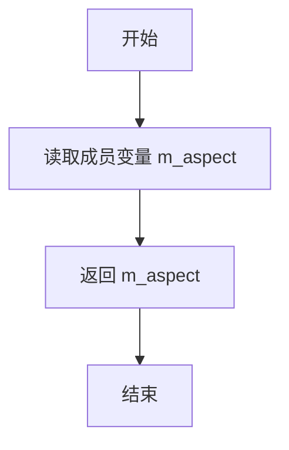

#### 带注释源码

```cpp
//-------------------------------------------------------------------
// 获取宽高比模式
// 返回值类型: aspect_ratio_e
// 返回值描述: 返回当前设置的宽高比模式（stretch/meet/slice）
//-------------------------------------------------------------------
aspect_ratio_e aspect_ratio() const 
{ 
    // 直接返回成员变量 m_aspect，该变量存储了当前的宽高比模式设置
    return m_aspect; 
}
```

#### 上下文信息

- **所属类**：`agg::trans_viewport`
- **文件位置**：`agg_trans_viewport.h`
- **访问权限**：public const 成员函数
- **关联枚举**：`aspect_ratio_e`（包含 `aspect_ratio_stretch`、`aspect_ratio_meet`、`aspect_ratio_slice` 三个枚举值）
- **成员变量**：`m_aspect`（类型：`aspect_ratio_e`，存储宽高比模式）
- **设计意图**：该方法是一个简单的getter访问器，用于获取视口对象的宽高比处理策略，供外部代码判断或使用当前的缩放策略。
- **线程安全性**：由于是const成员函数，且仅读取成员变量，因此是线程安全的。
- **异常安全性**：该方法不抛出任何异常。
- **调用场景**：通常在需要根据宽高比模式进行特定处理时调用，例如在图形渲染中决定如何保持纵横比。


### `trans_viewport.transform`

该方法执行正向坐标变换，将世界坐标（World Coordinates）转换为设备坐标（Device Coordinates），实现从绘图空间到屏幕空间的映射，是视口变换的核心方法。

参数：

- `x`：`double*`，指向X坐标的指针，输入为世界坐标X，输出为设备坐标X
- `y`：`double*`，指向Y坐标的指针，输入为世界坐标Y，输出为设备坐标Y

返回值：`void`，无返回值，但通过指针参数直接修改坐标值

#### 流程图

```mermaid
flowchart TD
    A[开始 transform] --> B[读取输入坐标<br/>x = *x, y = *y]
    B --> C[计算设备X坐标<br/>*x = (x - m_wx1) * m_kx + m_dx1]
    C --> D[计算设备Y坐标<br/>*y = (y - m_wy1) * m_ky + m_dy1]
    D --> E[结束 transform<br/>坐标已转换为设备坐标]
    
    C -.->|使用成员变量| F[m_wx1: 世界视口左边界<br/>m_kx: X方向缩放系数<br/>m_dx1: 设备视口左边界]
    D -.->|使用成员变量| G[m_wy1: 世界视口上边界<br/>m_ky: Y方向缩放系数<br/>m_dy1: 设备视口上边界]
```

#### 带注释源码

```cpp
//-------------------------------------------------------------------
// transform - 正向坐标变换(世界->设备)
// 将世界坐标系中的点变换到设备(屏幕)坐标系中
//-------------------------------------------------------------------
void transform(double* x, double* y) const
{
    // 步骤1: 将x坐标从世界空间平移到原点
    //       (*x - m_wx1) 计算相对于世界视口左边界的偏移量
    // 步骤2: 应用X方向的缩放变换
    //       * m_kx 将世界坐标单位转换为设备坐标单位
    // 步骤3: 加上设备视口的偏移量
    //       + m_dx1 将坐标平移到设备视口位置
    *x = (*x - m_wx1) * m_kx + m_dx1;
    
    // 步骤1: 将y坐标从世界空间平移到原点
    //       (*y - m_wy1) 计算相对于世界视口上边界的偏移量
    // 步骤2: 应用Y方向的缩放变换
    //       * m_ky 将世界坐标单位转换为设备坐标单位
    // 步骤3: 加上设备视口的偏移量
    //       + m_dy1 将坐标平移到设备视口位置
    *y = (*y - m_wy1) * m_ky + m_dy1;
}
```

#### 关键变量说明

| 变量名 | 类型 | 描述 |
|--------|------|------|
| m_wx1 | double | 实际世界视口X轴起始坐标（经纵横比调整后） |
| m_wy1 | double | 实际世界视口Y轴起始坐标（经纵横比调整后） |
| m_dx1 | double | 设备视口X轴起始坐标 |
| m_dy1 | double | 设备视口Y轴起始坐标 |
| m_kx | double | X方向缩放系数（设备宽度/世界宽度） |
| m_ky | double | Y方向缩放系数（设备高度/世界高度） |

#### 变换公式详解

该变换等价于以下仿射变换矩阵的运算：

```
| x_device |   | m_kx   0   m_dx1 |   | x_world - m_wx1 |
| y_device | = | 0    m_ky  m_dy1 | * | y_world - m_wy1 |
|    1     |   | 0      0     1  |   |        1        |
```

即：先平移世界坐标到原点 → 缩放 → 再平移到设备视口位置。


### `trans_viewport.transform_scale_only()`

该方法仅对坐标进行缩放变换，不包含平移分量。通过将输入坐标分别乘以预计算的水平缩放因子 `m_kx` 和垂直缩放因子 `m_ky`，实现从世界坐标系到设备坐标系的纯缩放变换，适用于只需要缩放而无需平移的场景（如计算局部缩放比例）。

参数：

- `x`：`double*`，指向X坐标的指针，变换后直接修改该指针指向的值
- `y`：`double*`，指向Y坐标的指针，变换后直接修改该指针指向的值

返回值：`void`，无返回值（结果通过指针参数直接修改）

#### 流程图

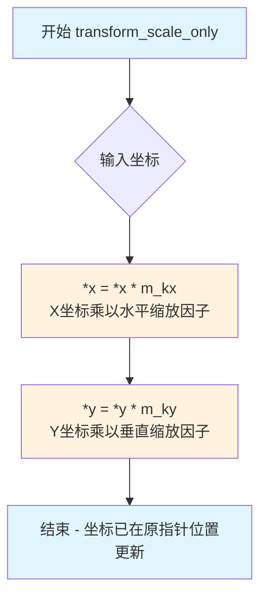

#### 带注释源码

```cpp
//-------------------------------------------------------------------
// 仅缩放的正向变换（仅应用缩放因子，不包含平移）
//-------------------------------------------------------------------
void transform_scale_only(double* x, double* y) const
{
    // 将X坐标乘以水平缩放因子 m_kx
    // m_kx = (device_x2 - device_x1) / (world_x2 - world_x1)
    // 表示世界坐标X到设备坐标X的缩放比例
    *x *= m_kx;
    
    // 将Y坐标乘以垂直缩放因子 m_ky
    // m_ky = (device_y2 - device_y1) / (world_y2 - world_y1)
    // 表示世界坐标Y到设备坐标Y的缩放比例
    *y *= m_ky;
}
```


### `trans_viewport.inverse_transform`

该方法执行从设备空间（Device Space）到世界空间（World Space）的逆向坐标变换。它根据视口配置参数（缩放系数和平移量），将屏幕上的点坐标反向映射回虚拟世界坐标系中。

参数：

- `x`：`double*`，指向设备坐标X值的指针。变换后，该值被覆盖为对应的世界坐标X值。
- `y`：`double*`，指向设备坐标Y值的指针。变换后，该值被覆盖为对应的世界坐标Y值。

返回值：`void`，无返回值。结果通过指针参数回传。

#### 流程图

```mermaid
graph TD
    A[开始: 输入设备坐标 (x_dev, y_dev)] --> B[减去设备偏移]
    B --> C{计算 X 坐标}
    C --> D[x_world = (x_dev - m_dx1) / m_kx + m_wx1]
    D --> E{计算 Y 坐标}
    E --> F[y_world = (y_dev - m_dy1) / m_ky + m_wy1]
    F --> G[结束: 输出世界坐标 (x_world, y_world)]
    
    subgraph 内部变量
    m_dx1[设备X偏移 m_dx1]
    m_dy1[设备Y偏移 m_dy1]
    m_kx[缩放系数 X m_kx]
    m_ky[缩放系数 Y m_ky]
    m_wx1[世界X原点 m_wx1]
    m_wy1[世界Y原点 m_wy1]
    end
```

#### 带注释源码

```cpp
        //-------------------------------------------------------------------
        // 逆向坐标变换 (设备 -> 世界)
        // 公式推导：正向变换为 x' = (x - wx1) * kx + dx1
        //          逆向变换为 x = (x' - dx1) / kx + wx1
        //-------------------------------------------------------------------
        void inverse_transform(double* x, double* y) const
        {
            // 1. 获取当前设备坐标
            // 2. 减去设备原点的偏移量 (m_dx1, m_dy1)
            // 3. 除以缩放因子 (m_kx, m_ky) 以撤销缩放
            // 4. 加上世界原点的偏移量 (m_wx1, m_wy1) 以得到最终世界坐标
            
            *x = (*x - m_dx1) / m_kx + m_wx1;
            *y = (*y - m_dy1) / m_ky + m_wy1;
        }
```


### `trans_viewport.inverse_transform_scale_only`

对坐标进行仅缩放因子的逆向变换，即只移除缩放效果而不考虑平移偏移量。该方法将设备坐标（或已缩放的坐标）逆向映射回世界坐标空间，假设原始变换仅包含均匀或非均匀缩放。

参数：

- `x`：`double*`，指向x坐标的指针，传入需要逆向变换的x坐标，输出变换后的x坐标
- `y`：`double*`，指向y坐标的指针，传入需要逆向变换的y坐标，输出变换后的y坐标

返回值：`void`，无返回值，结果通过指针参数输出

#### 流程图

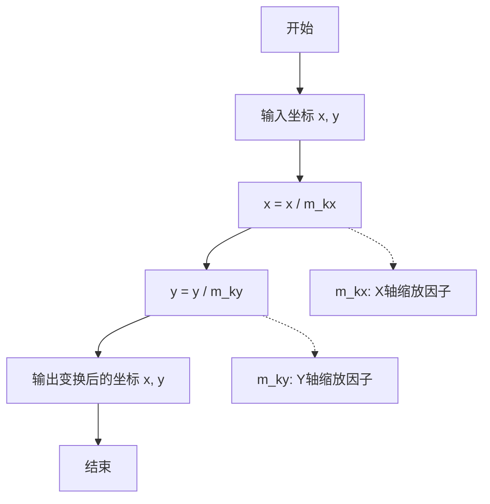

#### 带注释源码

```cpp
//-------------------------------------------------------------------
// 对坐标进行仅缩放的逆向变换
// 仅移除缩放效果，不处理平移（与 inverse_transform 不同）
// 适用于从已经缩放的坐标恢复到原始世界坐标的场景
//-------------------------------------------------------------------
void inverse_transform_scale_only(double* x, double* y) const
{
    // 使用X轴缩放因子的倒数进行逆向变换
    // 即：x = x / m_kx，等同于 x = x * (1/m_kx)
    *x /= m_kx;
    
    // 使用Y轴缩放因子的倒数进行逆向变换
    // 即：y = y / m_ky，等同于 y = y * (1/m_ky)
    *y /= m_ky;
}
```


### `trans_viewport.device_dx`

获取设备视口在 x 轴方向的偏移量。该方法计算并返回世界坐标到设备坐标线性变换公式中的 x 轴截距（即常数项），它由设备视口的起始位置减去世界视口起始位置经过缩放后的值决定。

参数：  
无

返回值：`double`，返回设备坐标变换矩阵中的 x 轴平移分量（偏移量）。

#### 流程图

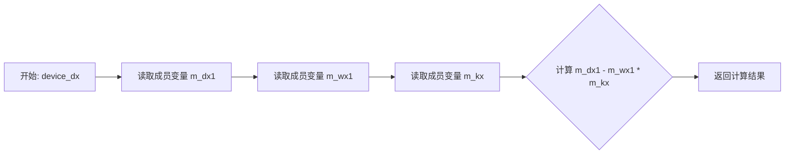

#### 带注释源码

```cpp
//-------------------------------------------------------------------
// Anti-Grain Geometry - Version 2.4
// 获取设备x偏移量
//-------------------------------------------------------------------
// 返回值: double, 设备坐标变换矩阵中的x轴平移分量
// 公式: m_dx1 - m_wx1 * m_kx
//       (设备起始X) - (世界起始X * X轴缩放系数)
//-------------------------------------------------------------------
double device_dx() const 
{ 
    return m_dx1 - m_wx1 * m_kx; 
}
```


### trans_viewport.device_dy

获取设备y方向的偏移量。该方法计算并返回视口变换中设备坐标系相对于世界坐标系的y方向平移量，通过从设备视口的起始y坐标中减去世界视口起始y坐标与y方向缩放因子的乘积得到。

参数：该方法没有参数。

返回值：`double`，返回设备y方向的偏移量，计算公式为 `m_dy1 - m_wy1 * m_ky`，其中 `m_dy1` 是设备视口起始y坐标，`m_wy1` 是世界视口起始y坐标，`m_ky` 是y方向的缩放因子。

#### 流程图

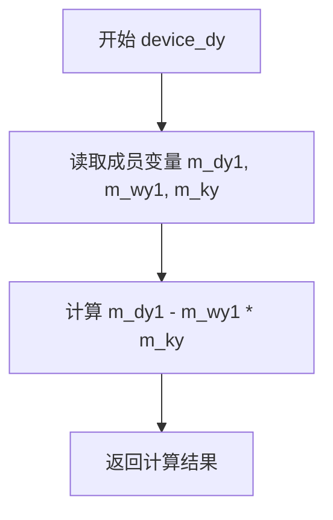

#### 带注释源码

```cpp
//-------------------------------------------------------------------
// 获取设备y方向的偏移量
// 该方法计算视口变换中设备坐标系相对于世界坐标系的y方向平移量
// 计算公式：device_y_offset = device_y1 - world_y1 * scale_y
//-------------------------------------------------------------------
double device_dy() const 
{ 
    // m_dy1: 设备视口的起始y坐标
    // m_wy1: 世界视口的起始y坐标（经过对齐和宽高比处理后）
    // m_ky:  y方向的缩放因子
    return m_dy1 - m_wy1 * m_ky; 
}
```


### `trans_viewport.scale_x()`

获取视口变换器在x轴方向的缩放因子（scale factor）。该方法返回内部成员变量 `m_kx` 的值，用于表示从世界坐标空间到设备坐标空间在x轴上的缩放比例。

参数：
- （无参数）

返回值：`double`，返回x轴方向的缩放因子（m_kx），即世界坐标到设备坐标的x轴缩放比例。

#### 流程图

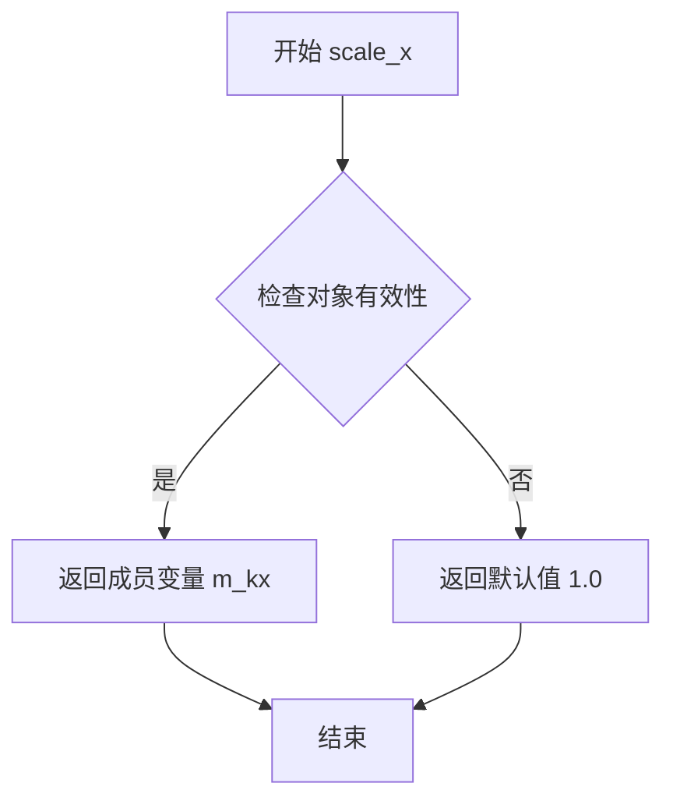

> **注**：实际上该方法直接返回 `m_kx`，流程图展示了 `m_kx` 的计算来源（`update()` 方法中计算得出）。当视口无效时，`update()` 会将 `m_kx` 设置为 1.0。

#### 带注释源码

```cpp
//-------------------------------------------------------------------
// 获取x轴缩放因子
//-------------------------------------------------------------------
double scale_x() const
{
    // 直接返回成员变量 m_kx
    // m_kx 在 update() 方法中计算得出：
    // m_kx = (device_x2 - device_x1) / (world_x2 - world_x1)
    // 表示设备坐标范围与世界坐标范围的比值
    return m_kx;
}
```

#### 关联信息

| 关联元素 | 类型 | 说明 |
|---------|------|------|
| `m_kx` | `double` | x轴缩放因子，世界坐标到设备坐标的x轴缩放比例 |
| `m_ky` | `double` | y轴缩放因子，与 `scale_x()` 对应的y轴版本 |
| `scale_y()` | `double` | 获取y轴缩放因子的方法 |
| `scale()` | `double` | 获取平均缩放因子 `(m_kx + m_ky) * 0.5` |
| `update()` | `void` | 私有方法，计算并更新 `m_kx`、`m_ky` 等变换参数 |

#### 技术说明

- **设计模式**：该方法遵循 Getter 模式，是典型的访问器方法
- **const 限定符**：方法声明为 const，表明它不会修改对象状态
- **线程安全**：由于是只读操作，在多线程环境下可以安全并发访问
- **与 `scale_y()` 的关系**：`scale_x()` 和 `scale_y()` 可以返回不同的值（当宽高比不为1时），用于实现非均匀缩放或保持宽高比的视口变换


### `trans_viewport.scale_y`

获取y轴缩放因子，用于将世界坐标系的y值转换为设备（屏幕）坐标系的y值。该方法返回内部计算的y轴缩放系数m_ky，该系数在update()方法中根据世界视口和设备视口的尺寸计算得出。

参数： 无

返回值：`double`，返回y轴缩放因子（m_ky），用于坐标变换计算

#### 流程图

```mermaid
flowchart TD
    A[开始 scale_y] --> B{const方法}
    B --> C[返回成员变量 m_ky]
    C --> D[结束]
    
    B -.->|读取操作| E[m_ky存储了y轴缩放系数]
    E --> C
```

#### 带注释源码

```cpp
//-------------------------------------------------------------------
// 获取y轴缩放因子
// 该方法返回在update()中计算的y轴缩放系数m_ky
// m_ky = (device_y2 - device_y1) / (world_y2 - world_y1)
// 用于将世界坐标系的y值转换为设备坐标系的y值
//-------------------------------------------------------------------
double scale_y() const
{
    return m_ky;  // 返回y轴缩放因子，类型为double
}
```

#### 相关上下文信息

**m_ky变量说明**：
- **名称**: m_ky
- **类型**: double
- **描述**: y轴缩放系数，在update()方法中计算，计算公式为：m_ky = (device_y2 - device_y1) / (world_y2 - world_y1)

**调用关系**：
- scale_y() 被 inverse_transform()、inverse_transform_scale_only()、transform()、transform_scale_only() 等坐标变换方法使用
- m_ky 在 set_viewport() 或 preserve_aspect_ratio() 触发 update() 时被重新计算

**设计意图**：
该方法是典型的getter访问器，提供对内部状态m_ky的只读访问。由于m_ky是只读计算的（仅在update()中修改），因此设计为const方法，保证不会修改对象状态。


### `trans_viewport.scale()`

该方法用于获取视图端口的平均缩放因子，通过计算水平缩放因子(m_kx)和垂直缩放因子(m_ky)的算术平均值得到。这是进行统一缩放计算的常用方式，适用于需要保持宽高比一致的场景。

参数：  
无参数

返回值：`double`，返回水平缩放因子和垂直缩放因子的算术平均值，用于表示视图的综合缩放级别。

#### 流程图

```mermaid
flowchart TD
    A[开始 scale] --> B[获取成员变量 m_kx]
    B --> C[获取成员变量 m_ky]
    C --> D[计算平均值: (m_kx + m_ky) * 0.5]
    D --> E[返回平均值]
```

#### 带注释源码

```cpp
//-------------------------------------------------------------------
// 获取平均缩放因子
// 该方法计算水平缩放因子和垂直缩放因子的算术平均值
// 用于获取视图的综合缩放级别，在需要统一缩放时使用
//-------------------------------------------------------------------
double scale() const
{
    // 返回水平缩放因子(m_kx)和垂直缩放因子(m_ky)的算术平均值
    // m_kx: 水平方向从世界坐标到设备坐标的缩放因子
    // m_ky: 垂直方向从世界坐标到设备坐标的缩放因子
    return (m_kx + m_ky) * 0.5;
}
```


### `trans_viewport.to_affine()`

该方法将视口的世界坐标到设备坐标的变换转换为仿射变换矩阵（trans_affine），通过组合平移和缩放变换，实现从世界空间到设备空间的完整坐标映射。

参数： 无

返回值：`trans_affine`，返回一个仿射变换矩阵，包含从世界坐标到设备坐标的完整变换（平移→缩放→平移）

#### 流程图

```mermaid
graph TD
    A[开始] --> B[创建平移矩阵: translation(-m_wx1, -m_wy1)]
    B --> C[组合缩放矩阵: scaling(m_kx, m_ky)]
    C --> D[组合平移矩阵: translation(m_dx1, m_dy1)]
    D --> E[返回组合后的仿射变换矩阵]
    
    subgraph 变换顺序
    B -.- F[将世界坐标原点移至视口起点]
    C -.- G[应用x和y方向的缩放因子]
    D -.- H[将变换后的坐标移至设备空间]
    end
```

#### 带注释源码

```cpp
//-------------------------------------------------------------------
// 将视口变换转换为仿射变换矩阵
// 该矩阵组合了从世界坐标到设备坐标的完整变换过程
//-------------------------------------------------------------------
trans_affine to_affine() const
{
    // 第一步：创建平移矩阵，将世界坐标原点平移到视口起点(m_wx1, m_wy1)的相反位置
    // 效果：将世界坐标(x, y)转换为(x - m_wx1, y - m_wy1)
    trans_affine mtx = trans_affine_translation(-m_wx1, -m_wy1);
    
    // 第二步：组合缩放矩阵，应用x和y方向的缩放因子(m_kx, m_ky)
    // 效果：将平移后的坐标按比例缩放
    mtx *= trans_affine_scaling(m_kx, m_ky);
    
    // 第三步：组合平移矩阵，将坐标平移到设备空间(m_dx1, m_dy1)
    // 效果：将变换后的坐标移到设备视口位置
    mtx *= trans_affine_translation(m_dx1, m_dy1);
    
    // 返回完整的仿射变换矩阵
    // 等价变换公式: 
    // device_x = (world_x - m_wx1) * m_kx + m_dx1
    // device_y = (world_y - m_wy1) * m_ky + m_dy1
    return mtx;
}
```


### `trans_viewport.to_affine_scale_only()`

该方法将视口变换器中的缩放因子转换为仅包含缩放信息的仿射变换矩阵，用于处理只需要缩放变换的场景。

参数：
- （无参数）

返回值：`trans_affine`，返回一个仅包含缩放信息的仿射变换矩阵，矩阵的缩放分量分别为 x 方向的 `m_kx` 和 y 方向的 `m_ky`，不包含任何平移信息。

#### 流程图

```mermaid
flowchart TD
    A[开始] --> B{获取缩放因子}
    B --> C[读取成员变量 m_kx]
    B --> D[读取成员变量 m_ky]
    C --> E[调用 trans_affine_scaling 创建缩放矩阵]
    D --> E
    E --> F[返回 trans_affine 对象]
    F --> G[结束]
```

#### 带注释源码

```cpp
//-------------------------------------------------------------------
// 将视口变换器的缩放信息转换为仅缩放的仿射矩阵
// 该方法仅提取缩放因子，忽略平移和旋转信息
//-------------------------------------------------------------------
trans_affine to_affine_scale_only() const
{
    // 调用 trans_affine_scaling 构造函数，传入 x 和 y 方向的缩放因子
    // m_kx: x 方向的缩放系数，由 update() 方法计算得出
    // m_ky: y 方向的缩放系数，由 update() 方法计算得出
    // 返回一个仅包含缩放信息的仿射变换矩阵对象
    return trans_affine_scaling(m_kx, m_ky);
}
```


### `trans_viewport.byte_size`

获取 `trans_viewport` 对象占用的字节大小，主要用于序列化（serialize）和反序列化（deserialize）操作时确定内存块的大小。

**参数：** 无

**返回值：** `unsigned`，返回当前 `trans_viewport` 对象实际占用的内存字节数。

#### 流程图

```mermaid
flowchart TD
    A[开始 byte_size] --> B{执行 sizeof(*this)}
    B --> C[返回 unsigned 类型值]
    C --> D[结束]
```

#### 带注释源码

```cpp
//-------------------------------------------------------------------
// 方法: byte_size
// 功能: 获取 trans_viewport 对象占用的字节大小
// 说明: 该方法返回当前对象实例的字节数，用于序列化/反序列化操作
//       确保在内存拷贝时分配足够大的缓冲区
//-------------------------------------------------------------------
unsigned byte_size() const
{
    // sizeof(*this) 编译时计算整个 trans_viewport 类的字节大小
    // 包括所有成员变量：m_world_x1/2, m_device_x1/2, m_aspect 等
    return sizeof(*this);
}
```


### `trans_viewport.serialize`

将当前视口变换器的完整内部状态（包括所有坐标、缩放因子、对齐方式等成员变量）以二进制方式直接拷贝到指定的外部缓冲区中，实现对象的序列化和持久化。

参数：

- `ptr`：`int8u*`（无符号8位整数指针），指向用于存储序列化数据的输出缓冲区，需要确保缓冲区大小至少为 `sizeof(trans_viewport)` 字节

返回值：`void`，无返回值，但会在指定地址写入完整的对象二进制数据

#### 流程图

```mermaid
flowchart TD
    A[开始 serialize] --> B{检查 ptr 是否有效}
    B -->|是| C[计算当前对象大小: sizeof]
    B -->|否| D[未定义行为]
    C --> E[使用 memcpy 将对象二进制数据拷贝到 ptr 指向的缓冲区]
    E --> F[结束]
```

#### 带注释源码

```cpp
// 将 trans_viewport 对象的完整二进制表示复制到指定的内存缓冲区
// 该操作将对象的所有成员变量（包括世界坐标、设备坐标、缩放因子、对齐参数等）
// 以原始二进制形式保存，可用于后续的反序列化或进程间通信
void serialize(int8u* ptr) const
{
    // 使用 memcpy 直接拷贝整个对象的内存表示
    // this 指针指向当前 trans_viewport 对象
    // sizeof(*this) 计算对象总字节数
    // ptr 是目标缓冲区地址，需确保空间足够
    memcpy(ptr, this, sizeof(*this)); 
}
```


### `trans_viewport.deserialize`

该方法用于从字节流中恢复 `trans_viewport` 对象的完整状态，通过 `memcpy` 将外部字节数据直接拷贝到当前对象实例中，实现对象的反序列化操作。

参数：

- `ptr`：`const int8u*`，指向包含序列化字节数据的外部缓冲区指针

返回值：`void`，无返回值

#### 流程图

```mermaid
graph TD
    A[开始 deserialize] --> B{检查指针有效性}
    B -->|是| C[执行 memcpy 从 ptr 拷贝 sizeof trans_viewport 字节到 this]
    C --> D[结束 - 对象状态已恢复]
    
    style A fill:#f9f,color:#000
    style D fill:#9f9,color:#000
```

#### 带注释源码

```cpp
//----------------------------------------------------------------------------
// 反序列化方法：从字节流恢复对象状态
//----------------------------------------------------------------------------
void deserialize(const int8u* ptr)
{
    // 使用 memcpy 将外部字节流直接拷贝到当前对象
    // sizeof(*this) 获取当前类的完整字节大小
    // ptr 指向已序列化的字节数据（由 serialize 方法产生）
    memcpy(this, ptr, sizeof(*this));
}
```

#### 补充说明

| 项目 | 说明 |
|------|------|
| **设计目标** | 提供对象的序列化和反序列化能力，用于对象的持久化存储或网络传输 |
| **约束条件** | 序列化/反序列化双方必须是相同平台、相同编译器的 `trans_viewport` 实例，否则由于内存布局差异可能导致未定义行为 |
| **错误处理** | 无任何运行时错误检查，调用者需确保 `ptr` 指针有效且指向足够长度的数据 |
| **安全性风险** | `memcpy(this, ptr, ...)` 为裸指针操作，存在潜在的内存覆写风险；若字节流来源于不可信输入，可能导致对象状态被恶意构造 |
| **优化空间** | 可考虑增加版本号或校验和机制，增强跨平台兼容性和数据完整性验证 |
| **对应方法** | `serialize(int8u* ptr) const` - 序列化方法，将对象状态写入字节流 |


### trans_viewport.update()

该私有方法负责计算实际的世界坐标到设备坐标的映射参数，根据设置的宽高比模式（stretch/meet/slice）自动调整视口，确保图像正确显示而不失真。

参数：
- （无参数，通过类的成员变量获取输入）

返回值：`void`，无返回值，通过更新类的成员变量间接返回结果

#### 流程图

```mermaid
flowchart TD
    A[开始 update] --> B{检查视口是否有效}
    B -->|无效| C[设置默认参数]
    C --> D[设置 m_is_valid = false]
    D --> E[返回]
    B -->|有效| F{宽高比模式是否为 stretch?}
    F -->|是| G[直接使用原始世界坐标和设备坐标]
    F -->|否| H{计算缩放因子 kx, ky}
    H --> I{m_aspect == aspect_ratio_meet<br/>并且 kx < ky?}
    I -->|是| J[根据 ky 计算新的 world_y1, world_y2]
    I -->|否| K{aspect_ratio_meet 且 kx >= ky<br/>或 aspect_ratio_slice 且 kx >= ky}
    K -->|是| L[根据 kx 计算新的 world_x1, world_x2]
    K -->|否| M[保持原坐标]
    J --> N[计算最终参数]
    L --> N
    G --> N
    M --> N
    N --> O[设置 m_wx1, m_wy1, m_wx2, m_wy2]
    O --> P[设置 m_dx1, m_dy1, m_kx, m_ky]
    P --> Q[设置 m_is_valid = true]
    Q --> R[结束]
```

#### 带注释源码

```cpp
//----------------------------------------------------------------------------
// trans_viewport::update - 私有方法
// 计算实际的世界坐标到设备坐标的映射参数
//----------------------------------------------------------------------------
inline void trans_viewport::update()
{
    // 定义一个极小值用于浮点数比较
    const double epsilon = 1e-30;
    
    // 检查世界坐标或设备坐标是否存在无效值（长度为0或接近0）
    if(fabs(m_world_x1  - m_world_x2)  < epsilon ||
       fabs(m_world_y1  - m_world_y2)  < epsilon ||
       fabs(m_device_x1 - m_device_x2) < epsilon ||
       fabs(m_device_y1 - m_device_y2) < epsilon)
    {
        // 视口无效，设置默认的1x1单位视口
        m_wx1 = m_world_x1;
        m_wy1 = m_world_y1;
        m_wx2 = m_world_x1 + 1.0;  // 默认宽度为1
        m_wy2 = m_world_y2 + 1.0;  // 默认高度为1
        m_dx1 = m_device_x1;
        m_dy1 = m_device_y1;
        m_kx  = 1.0;  // 默认X轴缩放
        m_ky  = 1.0;  // 默认Y轴缩放
        m_is_valid = false;  // 标记为无效
        return;  // 提前返回
    }

    // 复制原始坐标到临时变量（可能因宽高比处理而修改）
    double world_x1  = m_world_x1;
    double world_y1  = m_world_y1;
    double world_x2  = m_world_x2;
    double world_y2  = m_world_y2;
    double device_x1 = m_device_x1;
    double device_y1 = m_device_y1;
    double device_x2 = m_device_x2;
    double device_y2 = m_device_y2;
    
    // 如果不是拉伸模式，需要处理宽高比
    if(m_aspect != aspect_ratio_stretch)
    {
        // 计算基于原始坐标的缩放因子
        m_kx = (device_x2 - device_x1) / (world_x2 - world_x1);
        m_ky = (device_y2 - device_y1) / (world_y2 - world_y1);

        // 根据宽高比模式和align参数调整世界坐标
        // meet: 完整显示图像，可能有留白
        // slice: 裁剪图像以填满视口
        if((m_aspect == aspect_ratio_meet) == (m_kx < m_ky))
        {
            // 需要在Y方向上适配
            d         = (world_y2 - world_y1) * m_ky / m_kx;
            world_y1 += (world_y2 - world_y1 - d) * m_align_y;
            world_y2  =  world_y1 + d;
        }
        else
        {
            // 需要在X方向上适配
            d         = (world_x2 - world_x1) * m_kx / m_ky;
            world_x1 += (world_x2 - world_x1 - d) * m_align_x;
            world_x2  =  world_x1 + d;
        }
    }
    
    // 保存实际的世界坐标范围
    m_wx1 = world_x1;
    m_wy1 = world_y1;
    m_wx2 = world_x2;
    m_wy2 = world_y2;
    
    // 保存设备坐标
    m_dx1 = device_x1;
    m_dy1 = device_y1;
    
    // 计算最终的缩放因子
    m_kx  = (device_x2 - device_x1) / (world_x2 - world_x1);
    m_ky  = (device_y2 - device_y1) / (world_y2 - world_y1);
    
    // 标记视口为有效
    m_is_valid = true;
}
```

## 关键组件


### trans_viewport 类

视口转换器类，负责世界坐标到设备坐标的正交变换，支持三种纵横比模式（stretch/meet/slice），并提供仿射变换矩阵输出。

### aspect_ratio_e 枚举

定义了三种纵横比处理策略：aspect_ratio_stretch（拉伸填充）、aspect_ratio_meet（保持比例完整显示）、aspect_ratio_slice（保持比例裁切）。

### 坐标变换方法组

包含 transform()、inverse_transform()、transform_scale_only()、inverse_transform_scale_only() 四个方法，负责世界坐标与设备坐标之间的双向转换，支持仅缩放变换。

### update() 私有方法

核心计算逻辑，根据世界视口和设备视口计算缩放系数(kx/ky)和偏移量(dx1/dy1)，处理各种纵横比模式下的视口适配，是类的内部状态更新引擎。

### to_affine() 方法

将视口变换转换为仿射变换矩阵，支持与 AGG 其他变换组件集成，提供更灵活的变换应用。

### 序列化方法组

serialize() 和 deserialize() 方法支持视口状态的二进制序列化和反序列化，用于状态保存和恢复。

### 视口边界管理

world_viewport() 和 device_viewport() 方法组管理世界坐标和设备坐标的视口边界，支持设置和查询功能。

### 缩放因子访问

scale()、scale_x()、scale_y() 方法提供统一的缩放信息访问接口。


## 问题及建议


### 已知问题

- **序列化/反序列化不安全**：`serialize` 和 `deserialize` 方法直接使用 `memcpy(this, ...)` 复制整个对象，包括可能的填充字节和对齐问题。在不同编译器/平台间序列化可能失败，且复制 bool 类型存在字节序和实现定义的风险。
- **状态初始化不一致**：构造函数初始化了 m_wx1/m_wy1/m_wx2/m_wy2 等内部状态变量，但 `update()` 在构造函数中未被调用，导致初始状态下内部计算值与用户设置的 world/device viewport 不一致，直到调用 `preserve_aspect_ratio`、`device_viewport` 或 `world_viewport` 才会同步。
- **API 命名歧义**：`device_viewport()` 和 `world_viewport()` 的 getter 版本返回的是用户原始设置值，而非经过 aspect ratio 处理后的实际 viewport 值（`world_viewport_actual()` 返回的才是实际值），这容易造成使用者误解。
- **除零检查不完善**：`update()` 中仅使用 `fabs(...) < epsilon` 检查是否为零，但未检查 NaN 或无穷大输入，若输入为 NaN 则 `fabs(NaN) < epsilon` 结果为 false，可能导致后续计算产生更多 NaN。
- **输入参数直接修改**：transform 系列方法直接修改传入的指针参数 `*x` 和 `*y`，不符合函数式风格，也不便于链式调用或同时需要原始值和转换值的场景。

### 优化建议

- **修复序列化实现**：使用更安全的序列化方式，逐字段序列化关键数据而非直接内存拷贝，并考虑添加版本号字段以支持向后兼容。
- **改进初始化流程**：在构造函数末尾调用 `update()` 确保内部状态一致，或添加 `recalculate()`/`sync()` 方法显式同步状态。
- **统一 viewport API**：考虑添加 `device_viewport_actual()` getter 或将 getter 重命名为 `device_viewport_unsafe_get_original_input()` 以明确语义，避免混淆。
- **增强输入验证**：在 `update()` 开头添加 `std::isnan()` 或 `std::isinf()` 检查，遇到非法输入时设置 `m_is_valid = false` 并抛出异常或返回错误码。
- **提供非修改式变换方法**：添加返回新值的变换方法，如 `double transform_x(double x) const` 和 `double transform_y(double y) const`，或在 transform 方法中增加可选的输出参数重载版本。
- **优化计算缓存**：对于频繁调用的场景，可考虑将 `scale()` 结果缓存，在 `update()` 中计算并存取。


## 其它


### 设计目标与约束

本代码的设计目标是提供一种在二维图形渲染中实现世界坐标系与设备（屏幕）坐标系之间正交变换的机制。核心约束包括：1）仅支持线性正交变换，不支持旋转和剪切；2）宽高比处理仅支持三种固定模式（stretch/meet/slice）；3）所有计算使用双精度浮点数；4）变换矩阵通过scale和translation实现，不保留完整的仿射变换矩阵；5）不支持视口边界的动态调整，必须通过完整的viewport设置触发更新。

### 错误处理与异常设计

代码采用传统的C风格错误处理机制，不使用异常。主要错误处理方式包括：1）通过m_is_valid布尔标志表示当前变换是否有效；2）在update()方法中使用epsilon(1e-30)比较判断世界坐标或设备坐标是否存在零宽度/高度的情况；3）当检测到无效视口时，自动设置默认的1x1单位变换并将m_is_valid设为false；4）transform等变换方法不检查有效性，调用者需自行通过is_valid()判断；5）序列化/反序列化使用memcpy，对指针指向的内存区域无任何校验。

### 数据流与状态机

trans_viewport内部维护两套坐标系参数：原始参数（m_world_x1/y1/x2/y2和m_device_x1/y1/x2/y2）和计算后的实际参数（m_wx1/y1/x2/y2、m_dx1/y1、m_kx/ky）。状态转换流程为：用户调用setter方法（如device_viewport、world_viewport、preserve_aspect_ratio）→ 修改原始参数 → 调用update() → 计算实际变换参数 → 更新m_is_valid状态。关键状态节点包括：初始状态（默认1x1视口）、有效状态（正常变换）、无效状态（零尺寸视口）。数据流向：输入坐标 → transform → 输出坐标，或 inverse_transform → 输出坐标。

### 外部依赖与接口契约

主要外部依赖：1）agg_trans_affine类：提供仿射变换矩阵构建能力，用于to_affine()和to_affine_scale_only()方法；2）<string.h>：提供memcpy用于序列化；3）double类型数学运算依赖标准库。接口契约规定：1）所有setter方法（device_viewport、world_viewport、preserve_aspect_ratio）会立即触发update()重新计算；2）getter方法不改变状态；3）transform和inverse_transform方法直接修改传入的指针值，无返回值；4）序列化要求ptr指向至少byte_size()字节的内存区域；5）反序列化会完整覆盖对象当前状态包括所有私有成员。

### 并发特性与线程安全性

该类不包含任何线程同步机制。成员变量m_is_valid、m_kx、m_ky等在多线程环境下直接读写存在竞态条件。设计为单线程使用场景，不适合无额外同步的多线程共享实例。若需多线程使用，应在调用端保证互斥访问或提供副本。

### 数值精度与边界条件

数值精度完全依赖double类型（IEEE 754 64位浮点）。epsilon值1e-30用于零值判断可能过小，在极端坐标值下可能失效。scale计算为(m_kx + m_ky) * 0.5的几何平均近似，当x和y方向缩放差异大时不够精确。inverse_transform在m_kx或m_ky接近零时会产生极大或无穷值，调用者需自行避免除零。

### 序列化与持久化

提供byte_size()、serialize()和deserialize()方法支持对象二进制序列化。注意：1）序列化结果包含所有成员变量，包括可能的填充字节；2）反序列化直接memcpy覆盖this，绕过构造函数；3）未验证序列化数据的版本兼容性；4）在不同编译环境/平台间序列化可能因字节序或填充导致失败。

### 使用示例与典型场景

典型使用流程：1）创建trans_viewport实例；2）调用world_viewport()设置世界坐标范围；3）调用device_viewport()设置设备视口；4）调用preserve_aspect_ratio()设置对齐方式和宽高比模式；5）使用transform()将世界坐标转换为设备坐标，或inverse_transform()反向转换。常用于：图形编辑器的画布缩放、图像查看器的自适应显示、游戏引擎的视口裁剪、图表的比例适配等场景。

### 已知限制与扩展建议

已知限制：1）不支持视口的渐进动画过渡；2）不支持多视口同步管理；3）缺少边界裁剪功能；4）宽高比计算逻辑在极端比例下可能产生意外结果。扩展建议：1）可考虑增加事件回调机制通知视口变化；2）可添加边界钳制功能防止坐标溢出；3）可增加缓动函数支持平滑动画；4）可添加变换矩阵的直接获取接口替代to_affine组合。

    