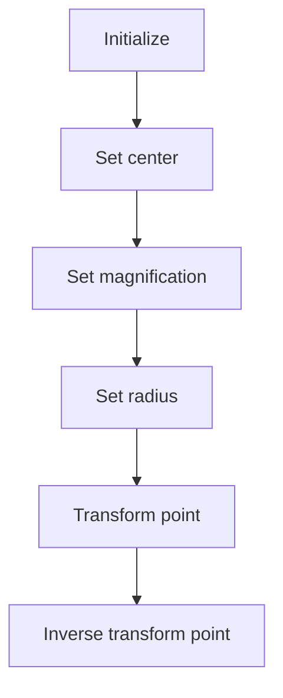
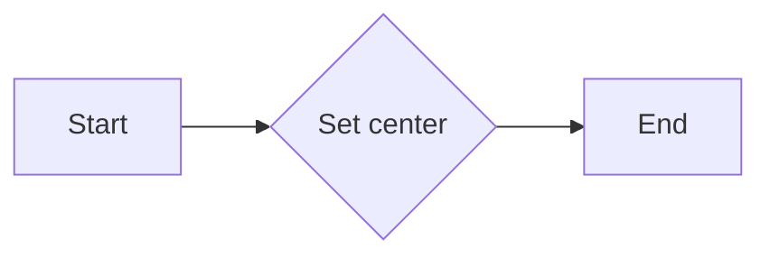
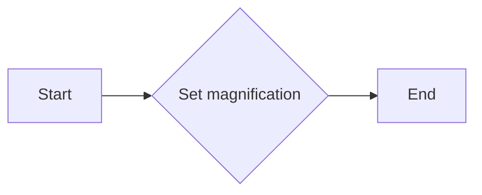
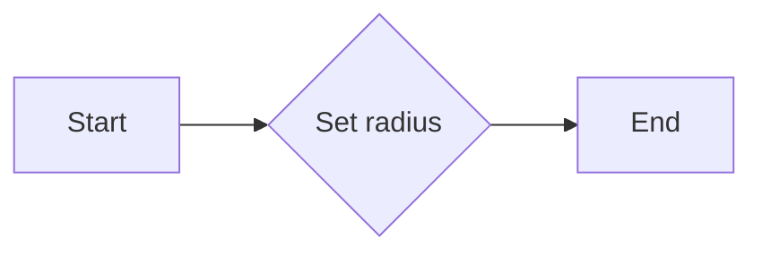
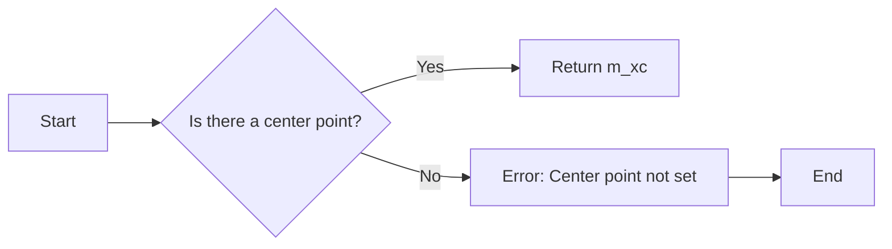
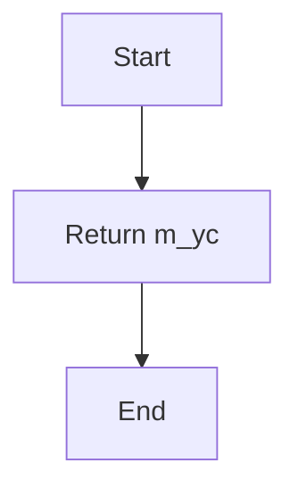
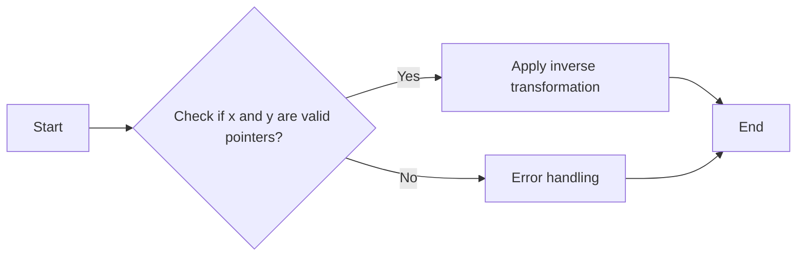

# `matplotlib\extern\agg24-svn\include\agg_trans_warp_magnifier.h` 详细设计文档

The code defines a class `trans_warp_magnifier` that provides functionality for magnifying and transforming points in a 2D space based on a center point, magnification factor, and radius.

## 整体流程



## 类结构

```
agg::trans_warp_magnifier (Class)
```

## 全局变量及字段


### `m_xc`
    
The x-coordinate of the center point.

类型：`double`
    


### `m_yc`
    
The y-coordinate of the center point.

类型：`double`
    


### `m_magn`
    
The magnification factor.

类型：`double`
    


### `m_radius`
    
The radius of the transformation area.

类型：`double`
    


### `trans_warp_magnifier.m_xc`
    
The x-coordinate of the center point.

类型：`double`
    


### `trans_warp_magnifier.m_yc`
    
The y-coordinate of the center point.

类型：`double`
    


### `trans_warp_magnifier.m_magn`
    
The magnification factor.

类型：`double`
    


### `trans_warp_magnifier.m_radius`
    
The radius of the transformation area.

类型：`double`
    
    

## 全局函数及方法


### trans_warp_magnifier

trans_warp_magnifier 类的构造函数。

参数：

- 无

返回值：无

#### 流程图

```mermaid
graph LR
A[Start] --> B{trans_warp_magnifier()}
B --> C[Initialize fields]
C --> D[End]
```

#### 带注释源码

```cpp
trans_warp_magnifier() : m_xc(0.0), m_yc(0.0), m_magn(1.0), m_radius(1.0) {}
```


### trans_warp_magnifier.center

Sets the center point of the magnification.

参数：

- `x`：`double`，The x-coordinate of the center point.
- `y`：`double`，The y-coordinate of the center point.

返回值：`void`，No return value.

#### 流程图



#### 带注释源码

```cpp
void trans_warp_magnifier::center(double x, double y) {
    m_xc = x;
    m_yc = y;
}
```


### trans_warp_magnifier.magnification

Sets the magnification factor of the warp magnifier.

参数：

- `m`：`double`，The magnification factor to set. This value is used to scale the warp effect.

返回值：`void`，This method does not return a value.

#### 流程图



#### 带注释源码

```cpp
void trans_warp_magnifier::magnification(double m)
{
    m_magn = m;
}
```


### trans_warp_magnifier.radius

Sets the radius of the transformation area.

参数：

- `r`：`double`，The radius of the transformation area. This value determines the size of the area that will be transformed.

返回值：`void`，This method does not return a value.

#### 流程图



#### 带注释源码

```cpp
void trans_warp_magnifier::radius(double r)
{
    m_radius = r;
}
```


### trans_warp_magnifier.xc()

Returns the x-coordinate of the center point.

参数：

- 无

返回值：`double`，The x-coordinate of the center point.

#### 流程图



#### 带注释源码

```cpp
double xc()            const { return m_xc; }
```


### trans_warp_magnifier::yc

Returns the y-coordinate of the center point.

参数：

- 无

返回值：`double`，The y-coordinate of the center point.

#### 流程图



#### 带注释源码

```cpp
double trans_warp_magnifier::yc() const {
    return m_yc; // Return the y-coordinate of the center point
}
```


### trans_warp_magnifier.magnification()

返回放大因子。

参数：

- 无

返回值：`double`，放大因子

#### 流程图

```mermaid
graph LR
A[Start] --> B{Is magnification() called?}
B -- Yes --> C[Return m_magn]
B -- No --> D[End]
```

#### 带注释源码

```cpp
double magnification() const {
    return m_magn;
}
```


### trans_warp_magnifier.radius()

Returns the radius of the transformation area.

参数：

- 无

返回值：`double`，The radius of the transformation area.

#### 流程图

```mermaid
graph LR
A[Start] --> B{Is radius() called?}
B -- Yes --> C[Return m_radius]
B -- No --> D[End]
```

#### 带注释源码

```cpp
double radius() const {
    return m_radius;
}
```


### trans_warp_magnifier::transform

Transforms a point based on the magnification settings.

参数：

- `x`：`double*`，A pointer to the x-coordinate of the point to be transformed.
- `y`：`double*`，A pointer to the y-coordinate of the point to be transformed.

返回值：`void`，No return value. The transformation is applied directly to the values pointed to by `x` and `y`.

#### 流程图


#### 带注释源码

```
void trans_warp_magnifier::transform(double* x, double* y) const
{
    // Calculate the transformed coordinates
    double transformed_x = m_xc + m_radius * m_magn * (*x - m_xc);
    double transformed_y = m_yc + m_radius * m_magn * (*y - m_yc);

    // Assign the transformed coordinates to the pointers
    *x = transformed_x;
    *y = transformed_y;
}
```


### trans_warp_magnifier.inverse_transform

Inversely transforms a point based on the magnification settings.

参数：

- `x`：`double*`，A pointer to the x-coordinate of the point to be transformed.
- `y`：`double*`，A pointer to the y-coordinate of the point to be transformed.

返回值：`void`，No return value. The transformation is applied directly to the values pointed to by `x` and `y`.

#### 流程图



#### 带注释源码

```
void trans_warp_magnifier::inverse_transform(double* x, double* y) const
{
    // Check if the pointers are valid
    if (x == nullptr || y == nullptr)
    {
        // Handle error: invalid pointers
        return;
    }

    // Apply inverse transformation
    *x = (*x - m_xc) / m_magn;
    *y = (*y - m_yc) / m_magn;
}
```


## 关键组件


### 张量索引与惰性加载

张量索引与惰性加载是用于高效处理大型数据集的关键技术，它允许在需要时才加载数据，从而减少内存消耗和提高处理速度。

### 反量化支持

反量化支持是针对量化模型进行优化的一种技术，它允许模型在量化后仍然保持较高的精度和性能。

### 量化策略

量化策略是用于将浮点数模型转换为低精度整数模型的方法，它包括选择合适的量化位宽和量化范围等。


## 问题及建议


### 已知问题

-   **代码注释不足**：代码中缺少对类和方法的具体实现细节的注释，这可能会对理解和维护代码造成困难。
-   **缺乏单元测试**：代码中没有提供单元测试，这可能导致在修改或扩展代码时引入新的错误。
-   **全局变量和函数的使用**：代码中使用了全局变量和函数，这可能会增加代码的耦合度，并使得代码难以维护。

### 优化建议

-   **添加详细注释**：为每个类和方法添加详细的注释，解释其功能和实现细节。
-   **实现单元测试**：为每个类和方法编写单元测试，确保代码的正确性和稳定性。
-   **重构全局变量和函数**：考虑将全局变量和函数封装到类中，以减少代码的耦合度，并提高代码的可维护性。
-   **代码风格一致性**：确保代码风格的一致性，例如命名规范、缩进等，以提高代码的可读性。
-   **性能优化**：考虑对性能敏感的部分进行优化，例如使用更高效的算法或数据结构。


## 其它


### 设计目标与约束

- 设计目标：实现一个可缩放和旋转的图像变换器，用于图像处理中的放大和缩小操作。
- 约束条件：代码应保持高效，以适应实时图像处理的需求。

### 错误处理与异常设计

- 错误处理：类方法中应包含对输入参数的验证，确保它们在有效范围内。
- 异常设计：如果输入参数无效，应抛出异常或返回错误代码。

### 数据流与状态机

- 数据流：类方法接收输入参数（x, y），执行变换，并返回变换后的坐标。
- 状态机：该类没有状态机，因为它不涉及状态转换。

### 外部依赖与接口契约

- 外部依赖：无外部依赖。
- 接口契约：类方法应遵循良好的接口契约，确保调用者理解其预期行为。

### 安全性与权限

- 安全性：确保类方法不会因为错误的输入而导致程序崩溃。
- 权限：无特殊权限要求。

### 性能考量

- 性能考量：优化算法以减少计算量，提高处理速度。

### 可维护性与可扩展性

- 可维护性：代码结构清晰，易于理解和维护。
- 可扩展性：类设计允许未来添加更多变换功能。

### 测试与验证

- 测试：编写单元测试以确保每个方法按预期工作。
- 验证：通过实际图像处理应用验证变换器的性能和准确性。

### 文档与注释

- 文档：提供详细的设计文档和代码注释，以便其他开发者理解和使用。
- 注释：在代码中添加必要的注释，解释复杂逻辑和算法。

### 代码风格与规范

- 代码风格：遵循统一的代码风格规范，提高代码可读性。
- 规范：确保代码遵循最佳实践，如避免魔法数字、使用常量等。

### 版本控制与发布

- 版本控制：使用版本控制系统管理代码变更。
- 发布：定期发布代码更新，包括新功能和修复。

### 法律与合规

- 法律：确保代码符合相关法律法规。
- 合规：遵守开源协议，尊重知识产权。


    