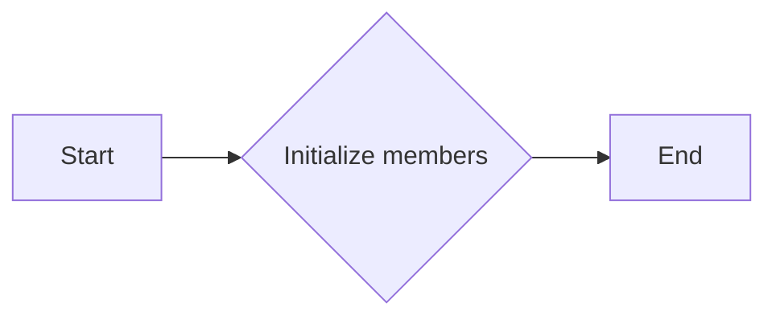
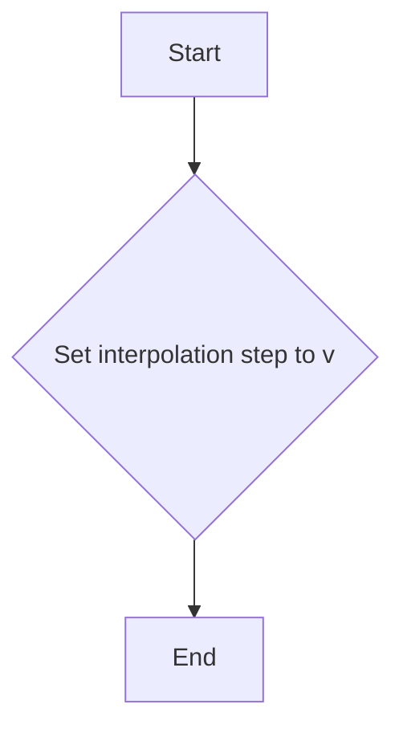
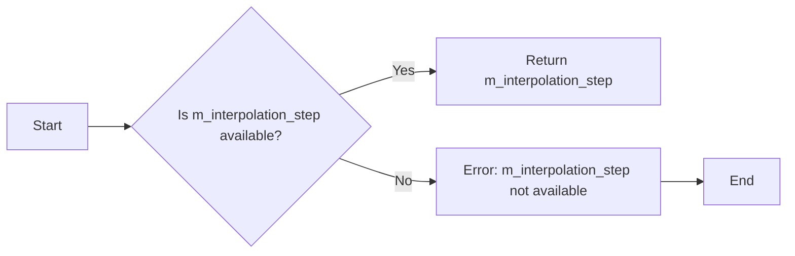
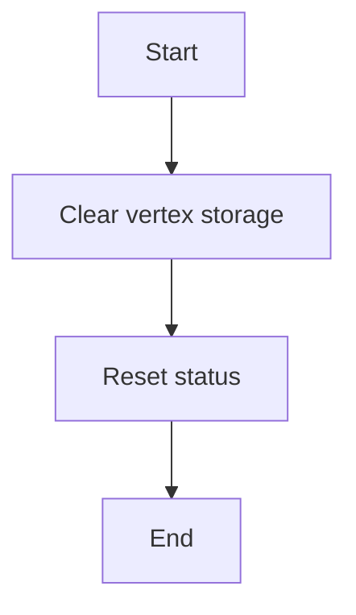
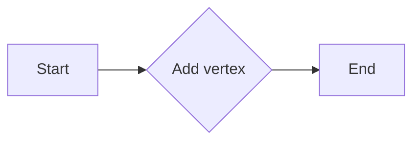
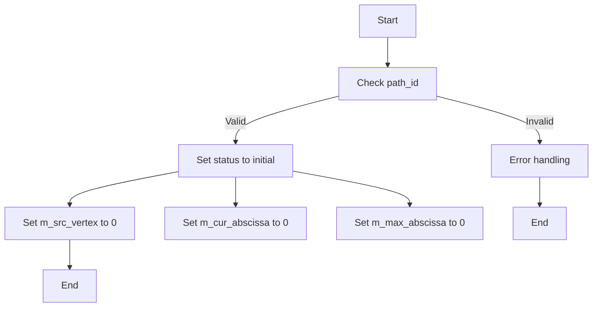
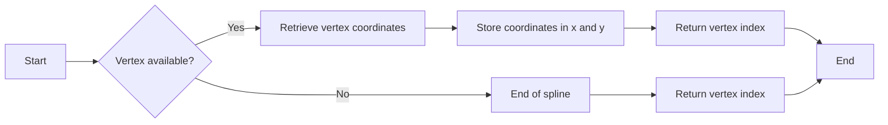

# `matplotlib\extern\agg24-svn\include\agg_vcgen_bspline.h` 详细设计文档

This code defines a class for generating vertices for B-spline curves, providing methods for adding vertices, removing all vertices, and generating vertices along the spline curve.

## 整体流程

```mermaid
graph TD
    A[Start] --> B[Create instance of vcgen_bspline]
    B --> C[Add vertices to the spline using add_vertex() method]
    C --> D[Remove all vertices using remove_all() method]
    D --> E[Interpolate vertices using interpolation_step() method]
    E --> F[Generate vertices along the spline using vertex() method]
    F --> G[End]
```

## 类结构

```
agg::vcgen_bspline
```

## 全局变量及字段


### `status_e`
    
Enumeration for the status of the vertex generator.

类型：`enum`
    


### `vertex_storage`
    
Storage for vertices of the spline.

类型：`pod_bvector<point_d, 6>`
    


### `bspline`
    
B-spline class for handling spline calculations.

类型：`bspline`
    


### `m_interpolation_step`
    
Step size for interpolation.

类型：`double`
    


### `m_closed`
    
Flag indicating if the spline is closed.

类型：`unsigned`
    


### `m_status`
    
Current status of the vertex generator.

类型：`status_e`
    


### `m_src_vertex`
    
Index of the current source vertex.

类型：`unsigned`
    


### `m_cur_abscissa`
    
Current abscissa value for the vertex generator.

类型：`double`
    


### `m_max_abscissa`
    
Maximum abscissa value for the vertex generator.

类型：`double`
    


### `vcgen_bspline.vertex_storage m_src_vertices`
    
Storage for vertices of the spline.

类型：`pod_bvector<point_d, 6>`
    


### `vcgen_bspline.bspline m_spline_x`
    
B-spline for the x-coordinate of the spline.

类型：`bspline`
    


### `vcgen_bspline.bspline m_spline_y`
    
B-spline for the y-coordinate of the spline.

类型：`bspline`
    


### `vcgen_bspline.double m_interpolation_step`
    
Step size for interpolation.

类型：`double`
    


### `vcgen_bspline.unsigned m_closed`
    
Flag indicating if the spline is closed.

类型：`unsigned`
    


### `vcgen_bspline.status_e m_status`
    
Current status of the vertex generator.

类型：`status_e`
    


### `vcgen_bspline.unsigned m_src_vertex`
    
Index of the current source vertex.

类型：`unsigned`
    


### `vcgen_bspline.double m_cur_abscissa`
    
Current abscissa value for the vertex generator.

类型：`double`
    


### `vcgen_bspline.double m_max_abscissa`
    
Maximum abscissa value for the vertex generator.

类型：`double`
    
    

## 全局函数及方法


### `vcgen_bspline::vcgen_bspline()`

构造函数，用于初始化`vcgen_bspline`类的实例。

参数：

- 无

返回值：无

#### 流程图



#### 带注释源码

```cpp
vcgen_bspline::vcgen_bspline()
{
    // Initialize members
    m_src_vertices.clear();
    m_spline_x.clear();
    m_spline_y.clear();
    m_interpolation_step = 0.0;
    m_closed = 0;
    m_status = initial;
    m_src_vertex = 0;
    m_cur_abscissa = 0.0;
    m_max_abscissa = 0.0;
}
```


### vcgen_bspline.interpolation_step

This function sets the interpolation step for the bspline vertex generator.

参数：

- `v`：`double`，The interpolation step value to set.

返回值：`void`，No return value.

#### 流程图



#### 带注释源码

```cpp
void vcgen_bspline::interpolation_step(double v) {
    m_interpolation_step = v; // Set the interpolation step to the provided value
}
```


### vcgen_bspline.interpolation_step() const

该函数用于获取当前的双曲插值步长。

参数：

- `v`：`double`，当前的双曲插值步长

返回值：`double`，当前的双曲插值步长

#### 流程图



#### 带注释源码

```cpp
double interpolation_step() const
{
    return m_interpolation_step;
}
```


### `vcgen_bspline.remove_all()`

`remove_all` 方法用于清除 `vcgen_bspline` 类中的所有顶点，重置状态，以便重新开始生成贝塞尔曲线。

参数：

- 无

返回值：无

#### 流程图



#### 带注释源码

```cpp
// Vertex Generator Interface
void remove_all()
{
    m_src_vertices.clear(); // 清除顶点存储
    m_status = initial;     // 重置状态为初始状态
}
```


### `vcgen_bspline.add_vertex(double x, double y, unsigned cmd)`

This method adds a vertex to the vertex storage of the `vcgen_bspline` class. It takes the x and y coordinates of the vertex and a command that determines how the vertex should be added.

参数：

- `x`：`double`，The x-coordinate of the vertex to be added.
- `y`：`double`，The y-coordinate of the vertex to be added.
- `cmd`：`unsigned`，A command that specifies how the vertex should be added.

返回值：`void`，This method does not return a value.

#### 流程图



#### 带注释源码

```
void vcgen_bspline::add_vertex(double x, double y, unsigned cmd)
{
    // Add the vertex to the vertex storage
    m_src_vertices.push_back(point_d(x, y));
}
```


### `vcgen_bspline.rewind`

Rewinds the vertex source to the beginning of the specified path.

参数：

- `path_id`：`unsigned`，The identifier of the path to rewind. This is used to select the correct path within the vertex source.

返回值：`void`，This function does not return a value.

#### 流程图



#### 带注释源码

```cpp
void vcgen_bspline::rewind(unsigned path_id)
{
    // Check if the path_id is valid
    if (path_id == m_closed) {
        // Set the status to initial
        m_status = initial;
        // Reset the source vertex index
        m_src_vertex = 0;
        // Reset the current abscissa
        m_cur_abscissa = 0.0;
        // Reset the maximum abscissa
        m_max_abscissa = 0.0;
    } else {
        // Handle invalid path_id
        // Error handling code would go here
    }
}
```


### `vcgen_bspline.vertex(double* x, double* y)`

This function is part of the `vcgen_bspline` class and is used to generate vertices for a spline curve. It retrieves the next vertex from the spline and stores its coordinates in the provided `x` and `y` pointers.

参数：

- `x`：`double*`，A pointer to a `double` variable where the x-coordinate of the vertex will be stored.
- `y`：`double*`，A pointer to a `double` variable where the y-coordinate of the vertex will be stored.

返回值：`unsigned`，The index of the vertex that was retrieved. If the end of the spline is reached, it returns the index of the last vertex.

#### 流程图



#### 带注释源码

```
unsigned vertex(double* x, double* y)
{
    if (m_status == stop)
        return m_src_vertices.size();

    if (m_status == initial)
    {
        m_spline_x.set_points(m_src_vertices.begin(), m_src_vertices.end());
        m_spline_y.set_points(m_src_vertices.begin(), m_src_vertices.end());
        m_status = ready;
    }

    if (m_status == ready)
    {
        m_cur_abscissa += m_interpolation_step;
        if (m_cur_abscissa >= m_max_abscissa)
        {
            m_status = end_poly;
        }
        else
        {
            m_spline_x.get_point(m_cur_abscissa, x);
            m_spline_y.get_point(m_cur_abscissa, y);
            m_status = polygon;
        }
    }

    if (m_status == polygon)
    {
        m_spline_x.get_point(m_cur_abscissa, x);
        m_spline_y.get_point(m_cur_abscissa, y);
        m_cur_abscissa += m_interpolation_step;
        if (m_cur_abscissa >= m_max_abscissa)
        {
            m_status = end_poly;
        }
    }

    return m_src_vertices.size();
}
``` 


## 关键组件


### 张量索引与惰性加载

张量索引与惰性加载是用于高效处理和访问大型数据集的技术，它允许在需要时才计算或加载数据，从而减少内存使用和提高性能。

### 反量化支持

反量化支持是指系统或算法能够处理和解释量化后的数据，通常用于降低模型大小和加速推理过程。

### 量化策略

量化策略是指将浮点数数据转换为固定点数表示的方法，以减少模型大小和提高计算效率。


## 问题及建议


### 已知问题

-   **代码封装性不足**：类 `vcgen_bspline` 的成员变量 `m_src_vertices`、`m_spline_x`、`m_spline_y`、`m_interpolation_step`、`m_closed`、`m_status`、`m_src_vertex`、`m_cur_abscissa` 和 `m_max_abscissa` 没有通过私有成员变量进行封装，直接暴露在外部，这可能导致外部代码直接修改这些变量，违反封装原则。
-   **复制构造函数和赋值运算符未定义**：类 `vcgen_bspline` 没有定义复制构造函数和赋值运算符，这可能导致在复制对象时出现未定义行为，违反了C++的规则。
-   **异常处理缺失**：代码中没有显示的异常处理机制，如果内部操作失败，可能会导致未处理的异常。

### 优化建议

-   **增加私有成员变量**：将所有成员变量设置为私有，并通过公共方法提供访问和修改的接口，以增强封装性。
-   **定义复制构造函数和赋值运算符**：为类 `vcgen_bspline` 定义复制构造函数和赋值运算符，确保对象在复制时的正确性。
-   **添加异常处理**：在可能发生错误的地方添加异常处理，确保程序的健壮性。
-   **文档注释**：为类和成员函数添加详细的文档注释，说明其功能和用法，提高代码的可读性和可维护性。
-   **单元测试**：编写单元测试来验证类的行为，确保代码的正确性和稳定性。
-   **代码审查**：进行代码审查，确保代码质量符合项目标准。


## 其它


### 设计目标与约束

- 设计目标：实现一个高效的贝塞尔曲线生成器，能够处理多段贝塞尔曲线，并支持动态插值。
- 约束条件：代码应保持简洁，易于维护，并遵循C++编程规范。

### 错误处理与异常设计

- 错误处理：通过返回状态码或抛出异常来处理错误情况。
- 异常设计：使用C++标准异常库来处理潜在的错误。

### 数据流与状态机

- 数据流：输入为一系列顶点，输出为贝塞尔曲线的顶点序列。
- 状态机：`vcgen_bspline` 类包含一个状态枚举，用于跟踪生成器的当前状态。

### 外部依赖与接口契约

- 外部依赖：依赖于 `agg_basics.h`、`agg_array.h` 和 `agg_bspline.h`。
- 接口契约：`vcgen_bspline` 类实现了 `Vertex Generator Interface` 和 `Vertex Source Interface`，定义了与外部系统交互的接口。

### 安全性与权限

- 安全性：确保代码不会因为外部输入而崩溃或执行恶意操作。
- 权限：类成员函数应限制对敏感数据的访问。

### 性能考量

- 性能考量：优化算法和数据结构，以确保高效的曲线生成。

### 可测试性与可维护性

- 可测试性：代码应易于单元测试，确保每个功能模块都能独立验证。
- 可维护性：代码结构清晰，易于理解和修改。

### 代码风格与命名规范

- 代码风格：遵循C++编程规范，保持代码整洁。
- 命名规范：使用有意义的变量和函数名，遵循驼峰命名法。

### 代码复用性

- 代码复用性：设计模块化代码，以便在其他项目中复用。

### 文档与注释

- 文档：提供详细的文档，包括类和方法描述。
- 注释：在代码中添加必要的注释，解释复杂逻辑。

### 版本控制与发布策略

- 版本控制：使用版本控制系统（如Git）来管理代码变更。
- 发布策略：定期发布稳定版本，并记录变更日志。

### 用户反馈与支持

- 用户反馈：收集用户反馈，用于改进产品。
- 支持服务：提供技术支持，帮助用户解决问题。


    