# `matplotlib\extern\agg24-svn\include\agg_vcgen_contour.h` 详细设计文档

The code defines a class 'vcgen_contour' that is used to generate contours for vector graphics. It handles the creation of vertices and manages the contour generation process.

## 整体流程

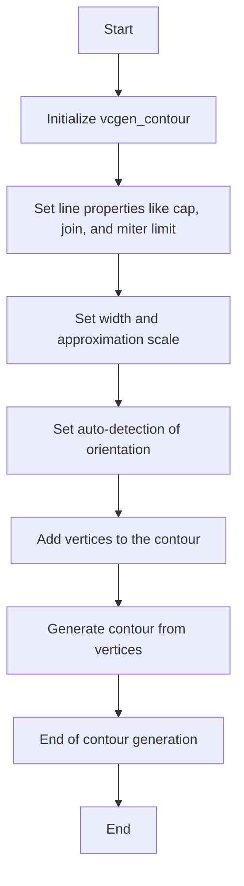

## 类结构

```
agg::vcgen_contour
```

## 全局变量及字段


### `line_cap_e`
    
Enumeration for line cap styles.

类型：`enum`
    


### `line_join_e`
    
Enumeration for line join styles.

类型：`enum`
    


### `inner_join_e`
    
Enumeration for inner join styles.

类型：`enum`
    


### `vertex_sequence`
    
Template class for vertex sequences.

类型：`template class`
    


### `pod_bvector`
    
Template class for point coordinate storage.

类型：`template class`
    


### `point_d`
    
Structure for 2D points with double precision.

类型：`struct`
    


### `math_stroke`
    
Class for mathematical stroke operations.

类型：`class`
    


### `coord_storage`
    
Template class for coordinate storage.

类型：`template class`
    


### `status_e`
    
Enumeration for contour generation status.

类型：`enum`
    


### `vertex_storage`
    
Template class for vertex storage.

类型：`template class`
    


### `double`
    
Double precision floating point number.

类型：`double`
    


### `unsigned`
    
Unsigned integer type.

类型：`unsigned`
    


### `vcgen_contour.m_stroker`
    
Mathematical stroke object for contour operations.

类型：`math_stroke<coord_storage>`
    


### `vcgen_contour.m_width`
    
Line width for contour drawing.

类型：`double`
    


### `vcgen_contour.m_src_vertices`
    
Source vertex storage for contour generation.

类型：`vertex_storage`
    


### `vcgen_contour.m_out_vertices`
    
Output vertex storage for contour coordinates.

类型：`coord_storage`
    


### `vcgen_contour.m_status`
    
Current status of contour generation process.

类型：`status_e`
    


### `vcgen_contour.m_src_vertex`
    
Index of the current source vertex.

类型：`unsigned`
    


### `vcgen_contour.m_out_vertex`
    
Index of the current output vertex.

类型：`unsigned`
    


### `vcgen_contour.m_closed`
    
Flag indicating if the contour is closed.

类型：`unsigned`
    


### `vcgen_contour.m_orientation`
    
Orientation of the contour.

类型：`unsigned`
    


### `vcgen_contour.m_auto_detect`
    
Flag for auto-detection of contour orientation.

类型：`bool`
    
    

## 全局函数及方法


### `vcgen_contour::line_cap`

Sets the line cap style for the stroker.

参数：

- `lc`：`line_cap_e`，The line cap style to set. This can be one of the following values: `butt`, `round`, or `square`.

返回值：`line_cap_e`，The current line cap style.

#### 流程图

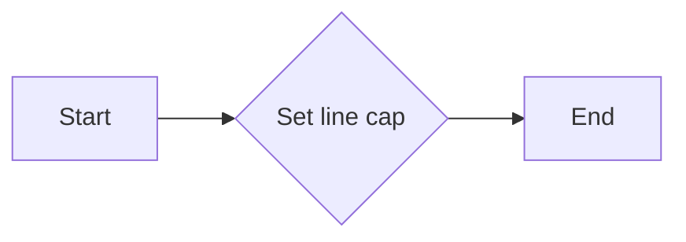

#### 带注释源码

```cpp
void line_cap(line_cap_e lc)     { m_stroker.line_cap(lc); }
```


### `vcgen_contour::line_join`

`vcgen_contour::line_join` 方法用于设置线段连接的样式。

参数：

- `line_join_e lj`：`line_join_e`，指定线段连接的样式，可以是 `miter`, `bevel`, 或 `round`。

返回值：无

#### 流程图

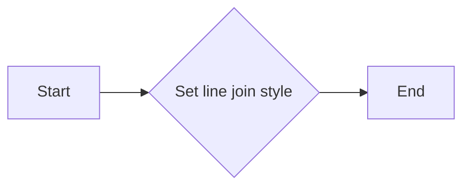

#### 带注释源码

```cpp
void vcgen_contour::line_join(line_join_e lj)
{
    m_stroker.line_join(lj);
}
```


### `vcgen_contour::inner_join`

`vcgen_contour::inner_join` 方法用于设置轮廓生成器中内角连接的类型。

参数：

- `inner_join_e ij`：`inner_join_e`，指定内角连接的类型。

返回值：无

#### 流程图

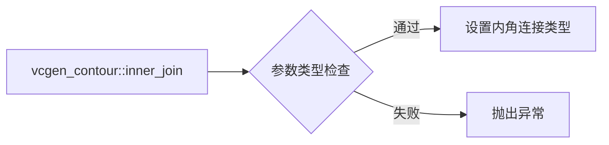

#### 带注释源码

```cpp
void vcgen_contour::inner_join(inner_join_e ij)
{
    m_stroker.inner_join(ij);
}
```


### width

`void width(double w)`

设置轮廓的宽度。

参数：

- `w`：`double`，轮廓的宽度。

返回值：无

#### 流程图

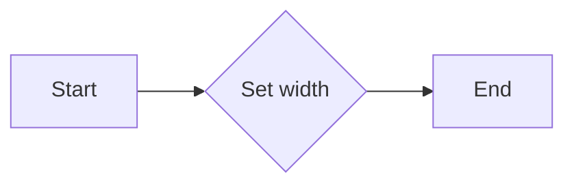

#### 带注释源码

```cpp
void width(double w) { m_stroker.width(m_width = w); }
```


### `vcgen_contour.miter_limit`

`vcgen_contour.miter_limit` 方法用于设置线条的斜接限制。

参数：

- `ml`：`double`，斜接限制值，用于控制斜接线的最大长度。

返回值：`void`，无返回值。

#### 流程图

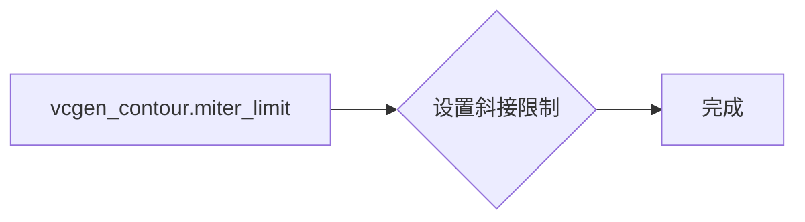

#### 带注释源码

```cpp
void vcgen_contour::miter_limit(double ml)
{
    m_stroker.miter_limit(ml);
}
```


### miter_limit_theta

`vcgen_contour.miter_limit_theta` 方法用于设置抗锯齿线条的斜接限制角度。

参数：

- `t`：`double`，斜接限制角度，单位为度。

返回值：`void`，无返回值。

#### 流程图

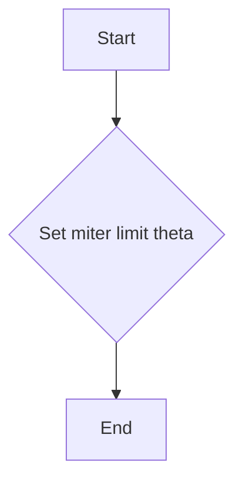

#### 带注释源码

```cpp
void miter_limit_theta(double t) {
    m_stroker.miter_limit_theta(t);
}
```


### {vcgen_contour.inner_miter_limit}

Sets the inner miter limit for the contour generation.

参数：

- `ml`：`double`，The miter limit value. This value is used to limit the length of the miter when joining two lines.

返回值：`void`，No return value.

#### 流程图

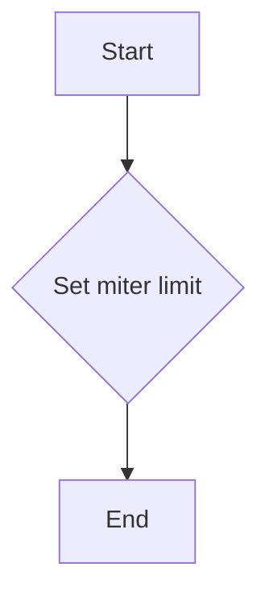

#### 带注释源码

```cpp
void inner_miter_limit(double ml) {
    m_stroker.inner_miter_limit(ml);
}
```


### `vcgen_contour::approximation_scale`

`vcgen_contour::approximation_scale` 方法用于设置抗锯齿渲染时的近似比例。

参数：

- `as`：`double`，表示近似比例值。该值用于控制渲染时的抗锯齿效果，值越大，抗锯齿效果越好，但渲染速度会相应降低。

返回值：无

#### 流程图

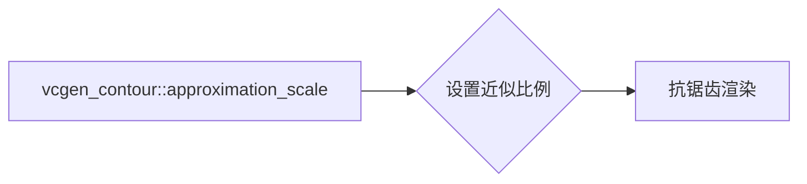

#### 带注释源码

```cpp
void approximation_scale(double as) { m_stroker.approximation_scale(as); }
```


### `vcgen_contour.auto_detect_orientation`

自动检测轮廓的方向。

参数：

- `v`：`bool`，一个布尔值，用于启用或禁用自动检测轮廓方向的功能。

返回值：`bool`，当前自动检测轮廓方向的状态。

#### 流程图

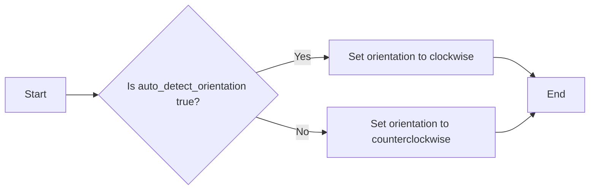

#### 带注释源码

```cpp
void auto_detect_orientation(bool v) { m_auto_detect = v; }
bool auto_detect_orientation() const { return m_auto_detect; }
```


### `vcgen_contour.remove_all()`

移除所有已添加的顶点和坐标，重置生成器状态。

参数：

- 无

返回值：`void`，无返回值

#### 流程图

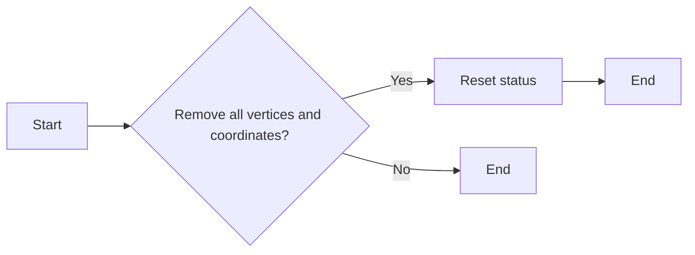

#### 带注释源码

```cpp
// Remove all vertices and coordinates, reset the generator status.
void remove_all()
{
    m_src_vertices.clear();
    m_out_vertices.clear();
    m_status = initial;
    m_src_vertex = 0;
    m_out_vertex = 0;
    m_closed = 0;
    m_orientation = 0;
}
```


### `vcgen_contour.add_vertex`

This method adds a vertex to the contour being generated.

参数：

- `x`：`double`，The x-coordinate of the vertex to be added.
- `y`：`double`，The y-coordinate of the vertex to be added.
- `cmd`：`unsigned`，The command associated with the vertex, indicating how the vertex should be processed.

返回值：`void`，No value is returned.

#### 流程图

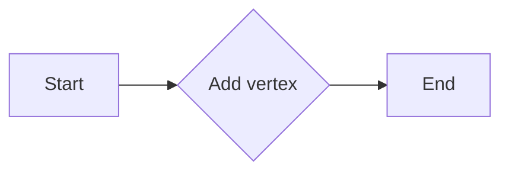

#### 带注释源码

```cpp
void vcgen_contour::add_vertex(double x, double y, unsigned cmd)
{
    // Implementation details are omitted for brevity.
}
```


### `vcgen_contour.rewind`

Rewinds the vertex source interface to the beginning of the vertex sequence.

参数：

- `path_id`：`unsigned`，Identifies the path within the contour. This is used to rewind to the specific path's beginning.

返回值：`void`，No return value.

#### 流程图

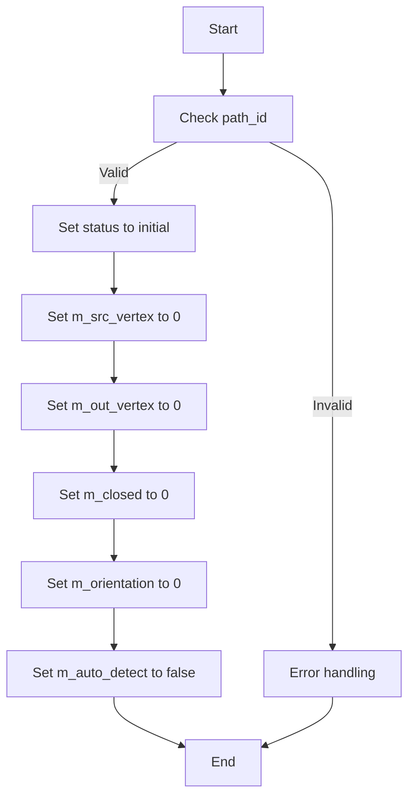

#### 带注释源码

```cpp
void vcgen_contour::rewind(unsigned path_id)
{
    // Check if the path_id is valid
    if (path_id == m_closed) {
        // Set status to initial
        m_status = initial;
        // Set m_src_vertex to 0
        m_src_vertex = 0;
        // Set m_out_vertex to 0
        m_out_vertex = 0;
        // Set m_closed to 0
        m_closed = 0;
        // Set m_orientation to 0
        m_orientation = 0;
        // Set m_auto_detect to false
        m_auto_detect = false;
    } else {
        // Error handling for invalid path_id
        // (Error handling code would go here)
    }
}
```


### `vcgen_contour.add_vertex`

This method adds a vertex to the contour generator.

参数：

- `x`：`double`，The x-coordinate of the vertex.
- `y`：`double`，The y-coordinate of the vertex.
- `cmd`：`unsigned`，The command that specifies how the vertex should be added to the contour.

返回值：`void`，No return value.

#### 流程图

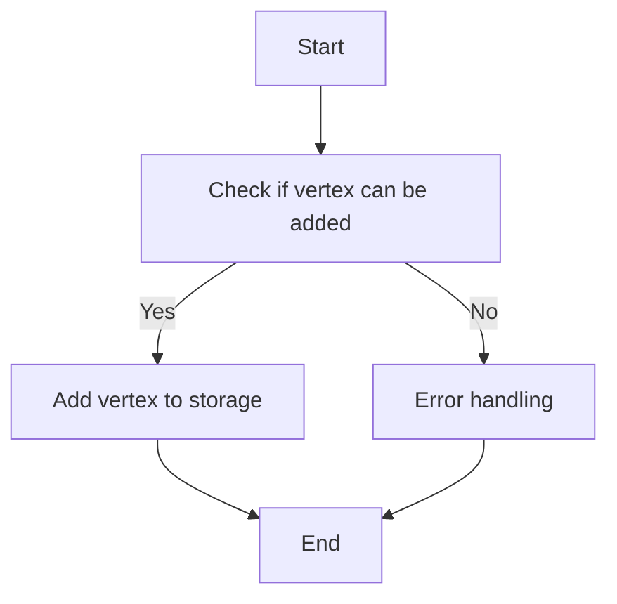

#### 带注释源码

```cpp
void add_vertex(double x, double y, unsigned cmd)
{
    // Add vertex to the storage
    m_src_vertices.push_back(vertex_dist(x, y, cmd));
}
```


### `vcgen_contour::vcgen_contour()`

初始化轮廓生成器。

参数：

- 无

返回值：无

#### 流程图

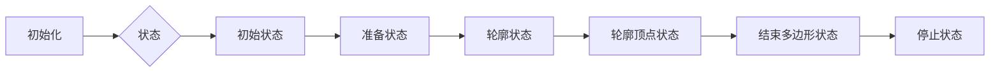

#### 带注释源码

```cpp
vcgen_contour::vcgen_contour()
{
    m_stroker = math_stroke<coord_storage>();
    m_width = 1.0;
    m_src_vertices = vertex_storage();
    m_out_vertices = coord_storage();
    m_status = initial;
    m_src_vertex = 0;
    m_out_vertex = 0;
    m_closed = 0;
    m_orientation = 0;
    m_auto_detect = true;
}
```


### `vcgen_contour::line_cap`

Sets the line cap style for the contour generation.

参数：

- `line_cap_e lc`：`enum line_cap_e`，The line cap style to set. This can be one of `butt`, `round`, or `square`.

返回值：`void`，No return value.

#### 流程图


#### 带注释源码

```cpp
void vcgen_contour::line_cap(line_cap_e lc) {
    m_stroker.line_cap(lc);
}
```


### `vcgen_contour::line_join`

Sets the line join style for the contour generation.

参数：

- `line_join_e lj`：`enum line_join_e`，The line join style to set. This can be one of the following values: `miter`, `bevel`, or `round`.

返回值：`void`，No return value.

#### 流程图

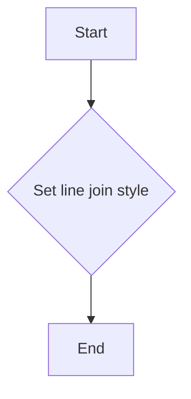

#### 带注释源码

```cpp
void vcgen_contour::line_join(line_join_e lj)
{
    m_stroker.line_join(lj);
}
```


### `vcgen_contour::inner_join(inner_join_e ij)`

Sets the inner join style.

参数：

- `ij`：`inner_join_e`，The inner join style to set. This can be one of the following values: `inner_join_e::bevel`, `inner_join_e::miter`, or `inner_join_e::round`.

返回值：`void`，No return value.

#### 流程图

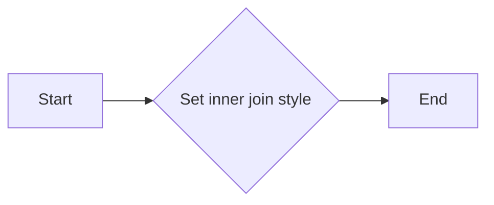

#### 带注释源码

```cpp
void vcgen_contour::inner_join(inner_join_e ij) {
    m_stroker.inner_join(ij);
}
```


### vcgen_contour.width(double w)

Sets the line width for the contour generation.

参数：

- `w`：`double`，The width of the line to be used for contour generation.

返回值：`void`，No return value.

#### 流程图


#### 带注释源码

```cpp
void width(double w) { m_stroker.width(m_width = w); }
```


### `vcgen_contour.miter_limit(double ml)`

Sets the miter limit for the contour generation.

参数：

- `ml`：`double`，The miter limit value. It is the maximum ratio of the length of the miter to the length of the side of the triangle.

返回值：`void`，No return value.

#### 流程图

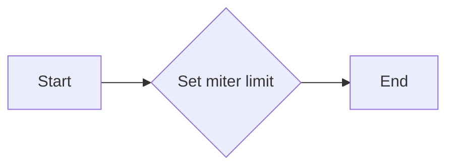

#### 带注释源码

```cpp
void vcgen_contour::miter_limit(double ml)
{
    m_stroker.miter_limit(ml);
}
```


### `vcgen_contour.miter_limit_theta(double t)`

Sets the miter limit theta for the contour generation.

参数：

- `t`：`double`，The miter limit theta value. It specifies the maximum angle for the miter join in degrees.

返回值：`void`，No return value.

#### 流程图

```mermaid
graph TD
A[Start] --> B{Set miter limit theta}
B --> C[End]
```

#### 带注释源码

```cpp
void vcgen_contour::miter_limit_theta(double t)
{
    m_stroker.miter_limit_theta(t);
}
```


### `vcgen_contour.inner_miter_limit(double ml)`

Sets the inner miter limit of the contour generator.

参数：

- `ml`：`double`，The miter limit value for the inner miter. This value controls the maximum angle of the miter at the corners of the contour.

返回值：`void`，No return value. The method modifies the miter limit of the contour generator in place.

#### 流程图

```mermaid
graph LR
A[Start] --> B{Set miter limit}
B --> C[End]
```

#### 带注释源码

```cpp
void vcgen_contour::inner_miter_limit(double ml)
{
    m_stroker.inner_miter_limit(ml);
}
```


### `vcgen_contour.approximation_scale(double as)`

Sets the approximation scale for the contour generation.

参数：

- `as`：`double`，The approximation scale to set for the contour generation.

返回值：`void`，No return value.

#### 流程图

```mermaid
graph LR
A[Start] --> B{Set approximation scale}
B --> C[End]
```

#### 带注释源码

```cpp
void approximation_scale(double as) { m_stroker.approximation_scale(as); }
```


### `vcgen_contour.auto_detect_orientation(bool v)`

Enables or disables auto-detection of orientation for the contour generation.

参数：

- `v`：`bool`，Determines whether auto-detection of orientation is enabled or disabled.

返回值：`void`，No return value.

#### 流程图

```mermaid
graph TD
    A[Start] --> B{Is v true?}
    B -- Yes --> C[Set m_auto_detect to true]
    B -- No --> D[Set m_auto_detect to false]
    D --> E[End]
```

#### 带注释源码

```
void vcgen_contour::auto_detect_orientation(bool v) {
    m_auto_detect = v; // Set the auto-detection flag based on the input parameter
}
```


### `vcgen_contour.remove_all()`

Removes all vertices from the contour.

参数：

- 无

返回值：无

#### 流程图

```mermaid
graph LR
A[Start] --> B[Remove all vertices from m_out_vertices]
B --> C[Set m_out_vertex to 0]
C --> D[End]
```

#### 带注释源码

```
void vcgen_contour::remove_all()
{
    // Remove all vertices from m_out_vertices
    m_out_vertices.clear();
    // Set m_out_vertex to 0
    m_out_vertex = 0;
}
```


### `vcgen_contour.add_vertex(double x, double y, unsigned cmd)`

Adds a vertex to the contour.

参数：

- `x`：`double`，The x-coordinate of the vertex.
- `y`：`double`，The y-coordinate of the vertex.
- `cmd`：`unsigned`，The command associated with the vertex.

返回值：`void`，No return value.

#### 流程图

```mermaid
graph TD
    A[Start] --> B[Call add_vertex(x, y, cmd)]
    B --> C[Update vertex_storage and coord_storage]
    C --> D[End]
```

#### 带注释源码

```cpp
void vcgen_contour::add_vertex(double x, double y, unsigned cmd)
{
    // Add the vertex to the vertex_storage and coord_storage
    m_src_vertices.push_back(vertex_dist(x, y, cmd));
    m_out_vertices.push_back(point_d(x, y));
}
```


### `vcgen_contour.rewind(unsigned path_id)`

Resets the vertex source interface to the beginning of the specified path.

参数：

- `path_id`：`unsigned`，The identifier of the path to reset. This is used to select the correct vertex source for the contour generation.

返回值：`void`，This function does not return a value.

#### 流程图

```mermaid
graph TD
    A[Start] --> B[Check path_id]
    B -->|Valid| C[Set status to initial]
    B -->|Invalid| D[Error handling]
    C --> E[Reset vertex source interface]
    E --> F[End]
    D --> G[End]
```

#### 带注释源码

```cpp
void vcgen_contour::rewind(unsigned path_id)
{
    // Check if the path_id is valid
    if (path_id == m_closed) {
        // Set the status to initial
        m_status = initial;
        // Reset the vertex source interface
        m_src_vertex = 0;
        m_out_vertex = 0;
    } else {
        // Handle invalid path_id
        // Error handling code would go here
    }
}
```


### `vcgen_contour.vertex(double* x, double* y)`

Retrieves the next vertex from the contour generator.

参数：

- `x`：`double*`，A pointer to a double where the x-coordinate of the vertex will be stored.
- `y`：`double*`，A pointer to a double where the y-coordinate of the vertex will be stored.

返回值：`unsigned`，The index of the vertex that was retrieved, or 0 if there are no more vertices.

#### 流程图

```mermaid
graph LR
A[Start] --> B{Vertex available?}
B -- Yes --> C[Retrieve vertex]
B -- No --> D[End]
C --> E[Store x-coordinate]
E --> F[Store y-coordinate]
F --> G[Return vertex index]
G --> H[End]
D --> H
```

#### 带注释源码

```cpp
unsigned vertex(double* x, double* y)
{
    if (m_status == stop)
        return 0;

    if (m_status == initial)
    {
        m_status = ready;
        m_stroker.rewind();
    }

    if (m_status == ready)
    {
        if (m_src_vertices.size() == 0)
        {
            m_status = stop;
            return 0;
        }

        m_stroker.current_vertex(m_src_vertices[0].x, m_src_vertices[0].y);
        m_status = outline;
    }

    if (m_status == outline)
    {
        if (m_src_vertices.size() == 1)
        {
            m_status = end_poly;
        }
        else
        {
            m_stroker.current_vertex(m_src_vertices[1].x, m_src_vertices[1].y);
            m_src_vertices.pop_front();
        }
    }

    if (m_status == end_poly)
    {
        m_status = out_vertices;
    }

    if (m_status == out_vertices)
    {
        if (m_out_vertices.size() == 0)
        {
            m_status = stop;
            return 0;
        }

        *x = m_out_vertices[0].x;
        *y = m_out_vertices[0].y;
        m_out_vertices.pop_front();
        return m_out_vertex++;
    }

    return 0;
}
```


## 关键组件


### 张量索引与惰性加载

张量索引与惰性加载是代码中用于高效处理和访问数据结构的关键组件。它允许在需要时才计算或加载数据，从而优化内存使用和性能。

### 反量化支持

反量化支持是代码中用于处理和转换数据量化的组件。它允许在量化数据时进行精确的反量化操作，确保数据的准确性和可靠性。

### 量化策略

量化策略是代码中用于优化数据表示和处理的组件。它通过减少数据精度来减少内存使用和计算量，同时保持足够的精度以满足应用需求。


## 问题及建议


### 已知问题

-   **代码注释不足**：代码中缺少详细的注释，使得理解代码的功能和逻辑变得困难。
-   **枚举类型未详细说明**：`status_e` 枚举类型没有提供详细的描述，这可能会影响对状态转换的理解。
-   **成员变量用途不明确**：一些成员变量，如 `m_orientation`，没有提供明确的描述，难以理解其用途。
-   **接口契约不明确**：代码中的一些接口，如 `vertex` 方法，没有明确说明其契约，例如输入和输出参数的预期类型和范围。

### 优化建议

-   **添加详细注释**：为每个类、方法、变量和枚举添加详细的注释，以帮助其他开发者理解代码。
-   **文档化枚举类型**：为 `status_e` 枚举类型提供详细的描述，说明每个状态的意义和转换条件。
-   **明确成员变量用途**：为每个成员变量提供明确的描述，说明其用途和作用。
-   **明确接口契约**：为每个接口提供详细的契约说明，包括输入和输出参数的类型、范围和预期行为。
-   **代码重构**：考虑对代码进行重构，以提高代码的可读性和可维护性，例如使用更清晰的命名约定和减少嵌套的代码块。
-   **单元测试**：编写单元测试来验证代码的正确性和稳定性，确保代码在修改后仍然符合预期行为。
-   **性能优化**：评估代码的性能，并考虑进行优化，以提高代码的执行效率。


## 其它


### 设计目标与约束

- 设计目标：
  - 提供一个高效的轮廓生成器，用于在二维空间中生成平滑的轮廓。
  - 支持多种线帽、线连接和内连接样式。
  - 支持自定义宽度、斜率限制和近似比例。
  - 支持自动检测轮廓方向。
- 约束：
  - 必须使用AGG库中的数学和几何工具。
  - 必须保持代码的可读性和可维护性。

### 错误处理与异常设计

- 错误处理：
  - 通过返回值和状态码来指示操作成功或失败。
  - 对于无效的参数，抛出异常或返回错误代码。
- 异常设计：
  - 使用C++标准异常库来处理异常情况。
  - 异常类应提供清晰的错误信息和恢复策略。

### 数据流与状态机

- 数据流：
  - 输入：顶点序列和命令。
  - 输出：生成的轮廓。
- 状态机：
  - 状态：初始、准备、轮廓、顶点、结束多边形、停止。
  - 转换：根据输入顶点和命令在状态之间转换。

### 外部依赖与接口契约

- 外部依赖：
  - AGG库：用于数学和几何计算。
  - C++标准库：用于异常处理和字符串操作。
- 接口契约：
  - `vcgen_contour`类提供了一系列接口，用于控制轮廓生成过程。
  - `math_stroke`类用于处理线条样式和宽度。
  - `vertex_sequence`和`pod_bvector`类用于存储顶点和坐标。


    