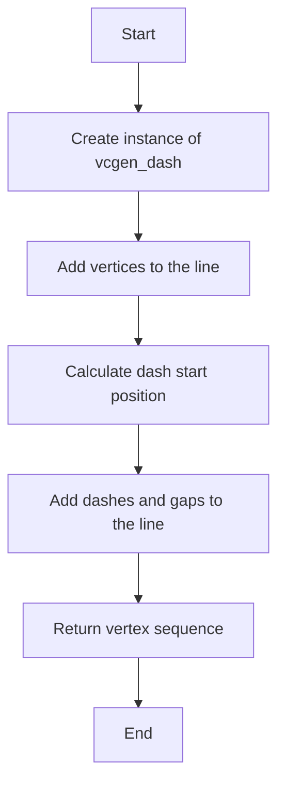
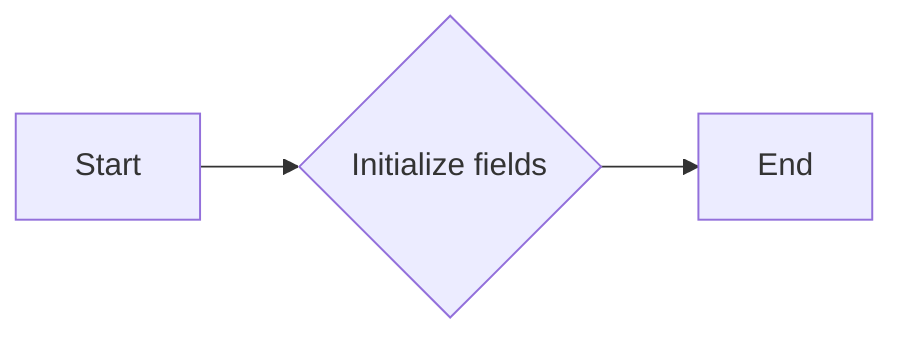
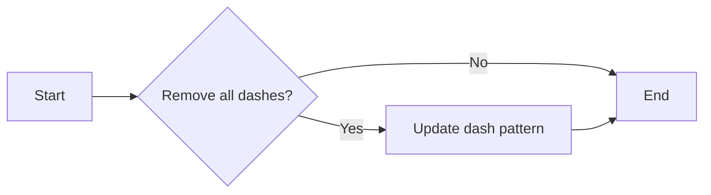
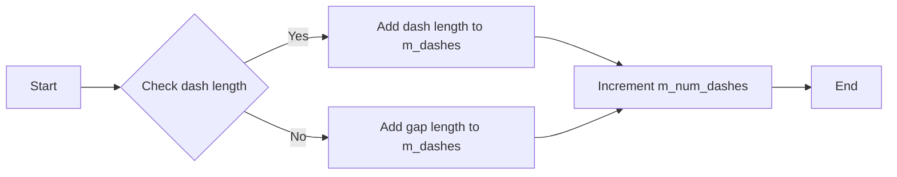
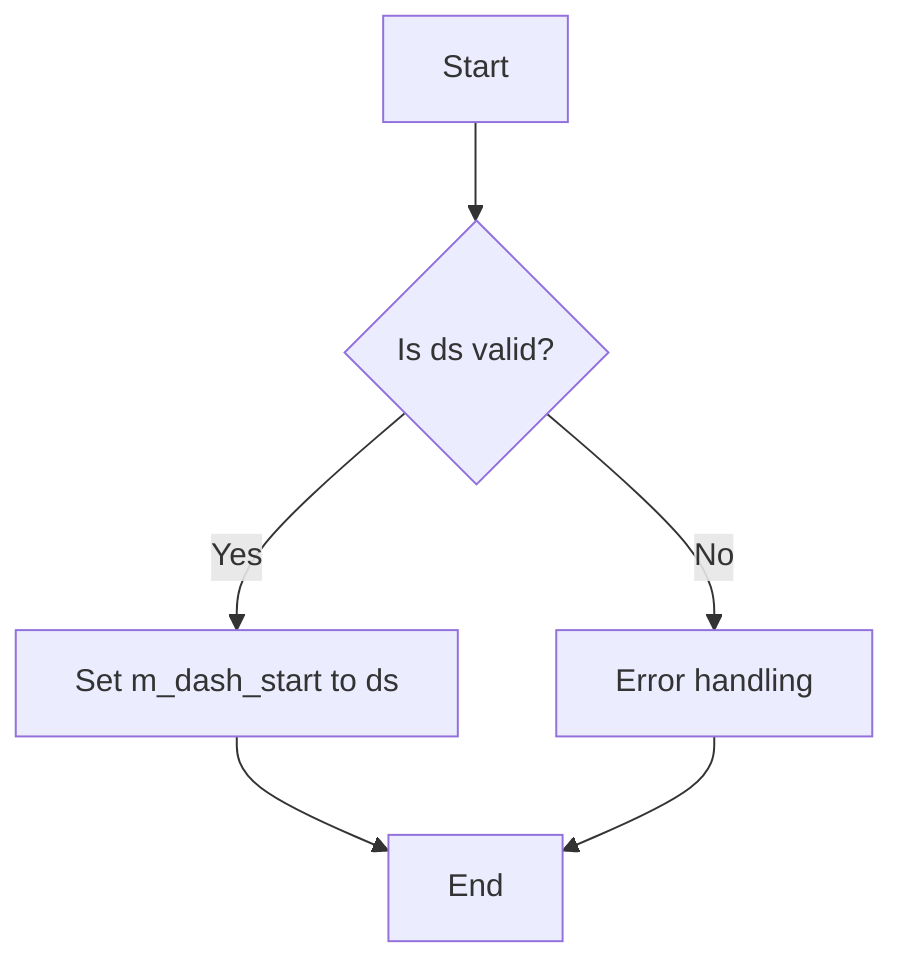
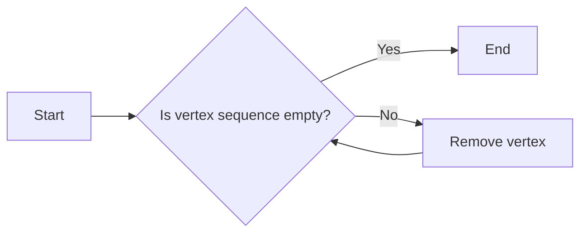
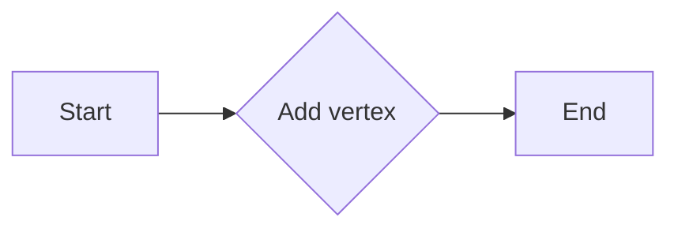
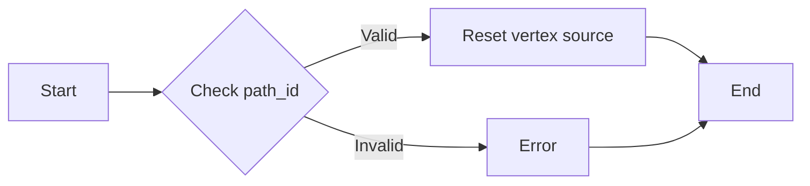
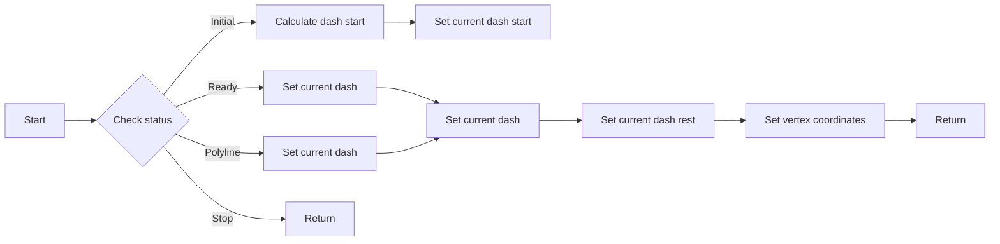

# `matplotlib\extern\agg24-svn\include\agg_vcgen_dash.h` 详细设计文档

This code defines a class 'vcgen_dash' that generates dashed lines for vector graphics. It manages the dashes and gaps in the line pattern, and provides an interface for adding vertices to the line.

## 整体流程



## 类结构

```
vcgen_dash (Line Dash Generator)
```

## 全局变量及字段


### `max_dashes`
    
Maximum number of dashes

类型：`enum max_dashes_e`
    


### `status_e`
    
Enumeration for different statuses of the generator

类型：`enum status_e`
    


### `vcgen_dash.m_dashes`
    
Array to store dash lengths

类型：`double[max_dashes]`
    


### `vcgen_dash.m_total_dash_len`
    
Total length of dashes

类型：`double`
    


### `vcgen_dash.m_num_dashes`
    
Number of dashes

类型：`unsigned`
    


### `vcgen_dash.m_dash_start`
    
Start position of the first dash

类型：`double`
    


### `vcgen_dash.m_shorten`
    
Shorten the line by this amount

类型：`double`
    


### `vcgen_dash.m_curr_dash_start`
    
Current dash start position

类型：`double`
    


### `vcgen_dash.m_curr_dash`
    
Current dash index

类型：`unsigned`
    


### `vcgen_dash.m_curr_rest`
    
Current rest length

类型：`double`
    


### `vcgen_dash.m_v1`
    
Pointer to the first vertex

类型：`const vertex_dist*`
    


### `vcgen_dash.m_v2`
    
Pointer to the second vertex

类型：`const vertex_dist*`
    


### `vcgen_dash.m_src_vertices`
    
Vertex storage

类型：`vertex_storage`
    


### `vcgen_dash.m_closed`
    
Flag to indicate if the path is closed

类型：`unsigned`
    


### `vcgen_dash.m_status`
    
Current status of the generator

类型：`status_e`
    


### `vcgen_dash.m_src_vertex`
    
Current vertex index

类型：`unsigned`
    
    

## 全局函数及方法


### `vcgen_dash::vcgen_dash()`

构造函数，用于初始化`vcgen_dash`类的实例。

参数：

- 无

返回值：无

#### 流程图



#### 带注释源码

```cpp
vcgen_dash::vcgen_dash()
{
    // Initialize fields
    m_dashes[max_dashes] = 0.0;
    m_total_dash_len = 0.0;
    m_num_dashes = 0;
    m_dash_start = 0.0;
    m_shorten = 0.0;
    m_curr_dash_start = 0.0;
    m_curr_dash = 0;
    m_curr_rest = 0.0;
    m_v1 = nullptr;
    m_v2 = nullptr;
    m_src_vertices.rewind(0);
    m_closed = 0;
    m_status = initial;
    m_src_vertex = 0;
}
```


### `vcgen_dash.remove_all_dashes()`

Remove all dashes from the dash pattern.

参数：

- 无

返回值：`void`，无返回值

#### 流程图



#### 带注释源码

```cpp
void vcgen_dash::remove_all_dashes()
{
    // Reset the dash pattern by setting all dash lengths to zero.
    for (unsigned i = 0; i < max_dashes; ++i)
    {
        m_dashes[i] = 0.0;
    }
    // Reset the total dash length.
    m_total_dash_len = 0.0;
    // Reset the number of dashes.
    m_num_dashes = 0;
    // Reset the current dash start position.
    m_dash_start = 0.0;
}
```


### `vcgen_dash.add_dash(double dash_len, double gap_len)`

Add a dash and gap to the line.

参数：

- `dash_len`：`double`，The length of the dash.
- `gap_len`：`double`，The length of the gap following the dash.

返回值：`void`，No return value.

#### 流程图



#### 带注释源码

```
void vcgen_dash::add_dash(double dash_len, double gap_len)
{
    if (dash_len > 0.0 && gap_len > 0.0)
    {
        m_dashes[m_num_dashes] = dash_len;
        m_total_dash_len += dash_len;
        m_num_dashes++;
        if (m_num_dashes < max_dashes)
        {
            m_dashes[m_num_dashes] = gap_len;
            m_total_dash_len += gap_len;
            m_num_dashes++;
        }
    }
}
```


### `vcgen_dash::dash_start(double ds)`

Set the start position of the dash.

参数：

- `ds`：`double`，The start position of the dash.

返回值：`void`，No return value.

#### 流程图



#### 带注释源码

```cpp
void vcgen_dash::dash_start(double ds)
{
    // Set the start position of the dash
    m_dash_start = ds;
}
```


### vcgen_dash.shorten(double s)

Shorten the line by a certain amount.

参数：

- `s`：`double`，The amount by which to shorten the line.

返回值：`void`，No return value.

#### 流程图

```mermaid
graph LR
A[vcgen_dash.shorten(s)] --> B{Set m_shorten}
B --> C[End]
```

#### 带注释源码

```
void vcgen_dash::shorten(double s) {
    // Set the member variable m_shorten to the provided value s.
    m_shorten = s;
}
```


### `vcgen_dash.remove_all()`

Remove all vertices from the vertex sequence.

参数：

- 无

返回值：`void`，无返回值

#### 流程图



#### 带注释源码

```cpp
// Vertex Generator Interface
void remove_all();
```

```cpp
void vcgen_dash::remove_all()
{
    m_src_vertices.clear();
}
```


### `vcgen_dash.add_vertex(double x, double y, unsigned cmd)`

This method adds a vertex to the line defined by the vertex generator `vcgen_dash`.

参数：

- `x`：`double`，The x-coordinate of the vertex to be added.
- `y`：`double`，The y-coordinate of the vertex to be added.
- `cmd`：`unsigned`，The command associated with the vertex, which can be used to control the behavior of the vertex generator.

返回值：`void`，No value is returned.

#### 流程图



#### 带注释源码

```cpp
void vcgen_dash::add_vertex(double x, double y, unsigned cmd)
{
    // Implementation details are omitted for brevity.
}
```


### `vcgen_dash.rewind(unsigned path_id)`

Rewind the vertex source to the beginning of the specified path.

参数：

- `path_id`：`unsigned`，指定要重置的路径ID。

返回值：`void`，无返回值。

#### 流程图



#### 带注释源码

```cpp
// Vertex Source Interface
void     rewind(unsigned path_id);
```


```cpp
// Vertex Source Interface
void     rewind(unsigned path_id)
{
    // Implementation details are not shown here as they are not provided in the given code snippet.
    // This function is expected to reset the vertex source to the beginning of the specified path.
}
```


### vcgen_dash.vertex(double* x, double* y)

Get the next vertex from the dash pattern.

参数：

- `x`：`double*`，指向用于存储当前顶点x坐标的变量
- `y`：`double*`，指向用于存储当前顶点y坐标的变量

返回值：`void`，无返回值

#### 流程图



#### 带注释源码

```cpp
unsigned vertex(double* x, double* y)
{
    if (m_status == initial)
    {
        calc_dash_start(m_dash_start);
        m_status = ready;
    }

    if (m_status == ready)
    {
        if (m_curr_dash < m_num_dashes)
        {
            m_curr_rest -= m_shorten;
            if (m_curr_rest <= 0.0)
            {
                m_curr_rest = m_curr_dash_start - m_curr_rest;
                m_curr_dash++;
                if (m_curr_dash < m_num_dashes)
                {
                    m_curr_dash_start = m_dashes[m_curr_dash];
                }
                else
                {
                    m_status = polyline;
                }
            }
        }
        else
        {
            m_status = polyline;
        }
    }

    if (m_status == polyline)
    {
        if (m_curr_dash < m_num_dashes)
        {
            m_curr_rest -= m_shorten;
            if (m_curr_rest <= 0.0)
            {
                m_curr_rest = m_curr_dash_start - m_curr_rest;
                m_curr_dash++;
                if (m_curr_dash < m_num_dashes)
                {
                    m_curr_dash_start = m_dashes[m_curr_dash];
                }
                else
                {
                    m_status = stop;
                }
            }
        }
        else
        {
            m_status = stop;
        }
    }

    if (m_status == stop)
    {
        return 0;
    }

    *x = m_v1[m_curr_dash].x;
    *y = m_v1[m_curr_dash].y;

    return 1;
}
```


## 关键组件


### 张量索引与惰性加载

用于高效地访问和操作张量数据，通过惰性加载减少内存占用。

### 反量化支持

提供对反量化操作的支持，以优化数值计算。

### 量化策略

定义量化策略，用于在数值计算中实现精度控制。


## 问题及建议


### 已知问题

-   **代码注释不足**：代码中缺少对类和方法的具体描述，使得理解代码功能和实现细节变得困难。
-   **枚举类型未详细说明**：`max_dashes_e` 和 `status_e` 枚举类型没有提供详细的描述，这可能会影响其他开发者对这些枚举值的理解。
-   **全局变量和函数的使用**：代码中使用了全局变量和函数，这可能会增加代码的耦合性和维护难度。
-   **内存管理**：`vertex_storage` 类使用了动态分配的内存，但没有提供释放内存的机制，可能会导致内存泄漏。

### 优化建议

-   **增加详细的代码注释**：为每个类、方法和重要变量添加注释，以帮助其他开发者理解代码的功能和实现细节。
-   **详细说明枚举类型**：为枚举类型提供详细的描述，说明每个枚举值的含义和用途。
-   **减少全局变量和函数的使用**：尽可能使用局部变量和类成员变量，减少全局变量和函数的使用，以降低代码的耦合性。
-   **提供内存管理机制**：为使用动态分配内存的类提供析构函数或清理函数，以确保及时释放内存，避免内存泄漏。
-   **考虑使用智能指针**：对于需要动态分配内存的场景，考虑使用智能指针（如 `std::unique_ptr` 或 `std::shared_ptr`），以简化内存管理。
-   **优化性能**：对于性能敏感的部分，考虑使用更高效的数据结构和算法，例如使用数组而不是动态数组来存储 `m_dashes`。


## 其它


### 设计目标与约束

- 设计目标：实现一个高效的线段虚线生成器，能够根据给定的虚线长度和间隙长度生成虚线。
- 约束条件：虚线长度和间隙长度必须为正数，且虚线长度不能超过最大虚线长度限制。

### 错误处理与异常设计

- 错误处理：当输入的虚线长度或间隙长度为负数时，抛出异常。
- 异常设计：定义自定义异常类，用于处理虚线生成过程中的错误。

### 数据流与状态机

- 数据流：输入虚线长度和间隙长度，通过类方法计算虚线起点，并生成虚线序列。
- 状态机：定义状态枚举，包括初始状态、准备状态、线段状态和停止状态，以控制虚线生成过程。

### 外部依赖与接口契约

- 外部依赖：依赖于`agg_basics.h`和`agg_vertex_sequence.h`头文件。
- 接口契约：定义`vertex_sequence`模板类和虚线生成器接口，确保与其他组件的兼容性。

### 安全性与权限

- 安全性：确保虚线生成器不会因为输入错误而导致程序崩溃。
- 权限：限制对虚线生成器内部状态的访问，以防止未授权修改。

### 性能考量

- 性能考量：优化虚线生成算法，确保在处理大量虚线时保持高效性能。

### 可维护性与可扩展性

- 可维护性：代码结构清晰，易于理解和维护。
- 可扩展性：设计允许未来添加新的虚线样式或调整虚线参数。

### 测试与验证

- 测试：编写单元测试，验证虚线生成器的功能正确性。
- 验证：通过实际应用场景验证虚线生成器的性能和稳定性。

### 文档与注释

- 文档：提供详细的设计文档和用户手册。
- 注释：在代码中添加必要的注释，解释关键代码段的功能。

### 代码风格与规范

- 代码风格：遵循统一的代码风格规范，提高代码可读性。
- 规范：确保代码符合项目编码规范，便于团队协作。

### 版本控制与发布

- 版本控制：使用版本控制系统管理代码变更。
- 发布：定期发布代码更新，包括新功能和修复的bug。


    