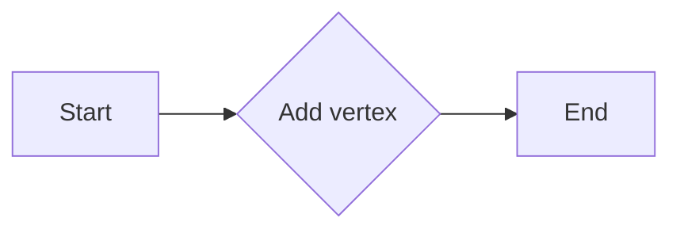
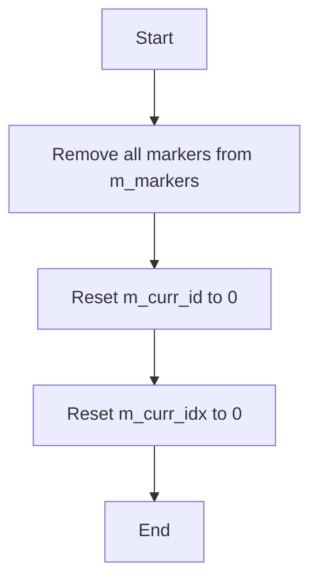
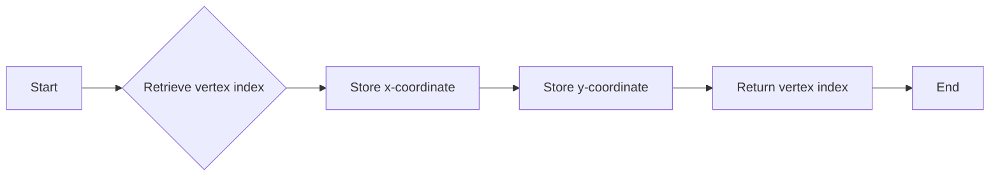
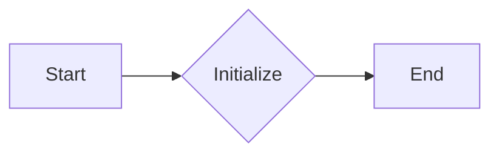
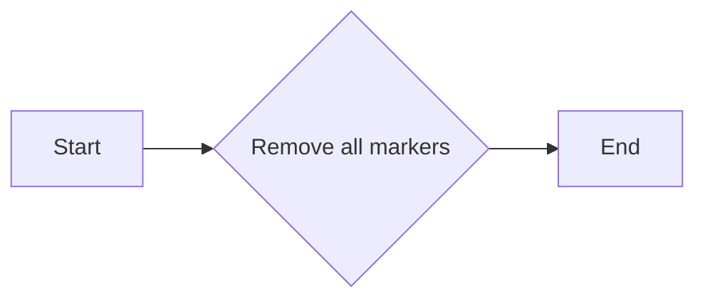
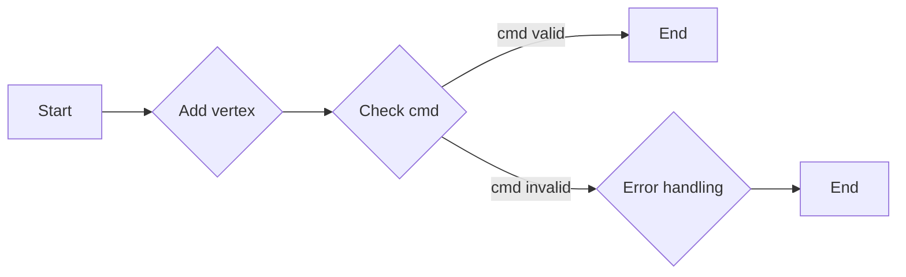
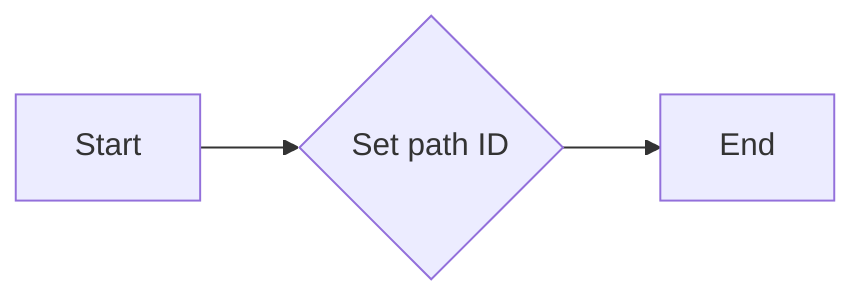
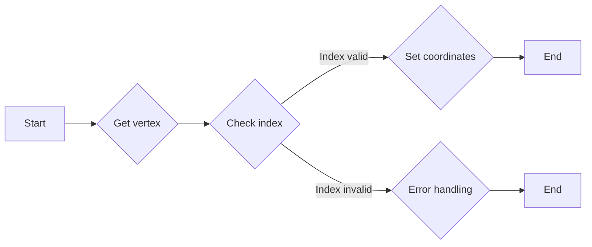
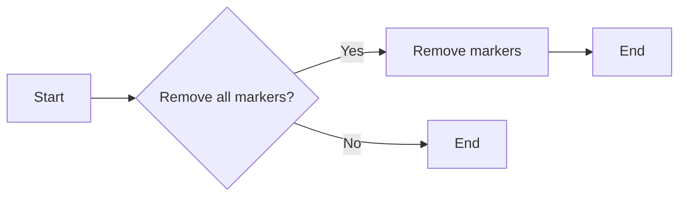
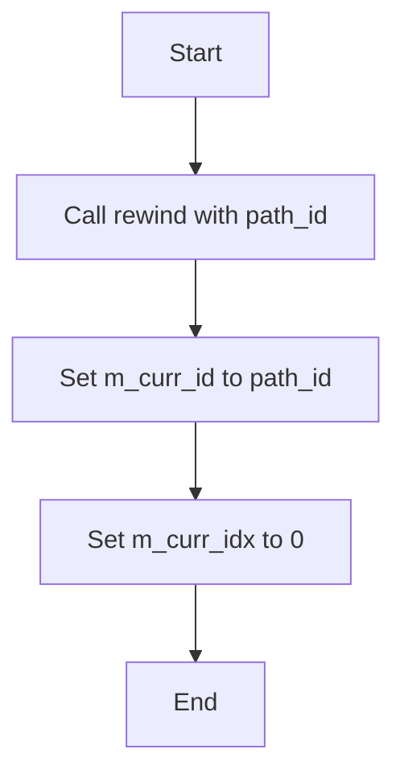

# `matplotlib\extern\agg24-svn\include\agg_vcgen_markers_term.h` 详细设计文档

This code defines a class 'vcgen_markers_term' that acts as a terminal markers generator for vector graphics, specifically for creating arrowheads or arrowtails in graphics paths.

## 整体流程

```mermaid
graph TD
    A[Start] --> B[Create instance of vcgen_markers_term]
    B --> C[Add vertices to the marker using add_vertex() method]
    C --> D[Remove all vertices if needed using remove_all() method]
    D --> E[Rewind to the start of a path using rewind() method]
    E --> F[Get next vertex using vertex() method]
    F --> G[Repeat until all vertices are processed]
    G --> H[End]
```

## 类结构

```
vcgen_markers_term (Terminal markers generator)
```

## 全局变量及字段


### `m_curr_id`
    
Current marker ID, used to track the state of marker generation.

类型：`unsigned`
    


### `m_curr_idx`
    
Current index within the marker coordinates storage, used to iterate over the coordinates.

类型：`unsigned`
    


### `m_markers`
    
Storage for marker coordinates, a fixed-size buffer that holds up to 6 coordinate pairs.

类型：`pod_bvector<coord_type, 6>`
    


### `vcgen_markers_term.m_curr_id`
    
Current marker ID, used to track the state of marker generation.

类型：`unsigned`
    


### `vcgen_markers_term.m_curr_idx`
    
Current index within the marker coordinates storage, used to iterate over the coordinates.

类型：`unsigned`
    


### `vcgen_markers_term.m_markers`
    
Storage for marker coordinates, a fixed-size buffer that holds up to 6 coordinate pairs.

类型：`pod_bvector<coord_type, 6>`
    
    

## 全局函数及方法


### `vcgen_markers_term`

Terminal markers generator (arrowhead/arrowtail)

参数：

- `x`：`double`，The x-coordinate of the vertex.
- `y`：`double`，The y-coordinate of the vertex.
- `cmd`：`unsigned`，The command code for the vertex.

返回值：无

#### 流程图



#### 带注释源码

```cpp
// Vertex Generator Interface
void vcgen_markers_term::add_vertex(double x, double y, unsigned cmd)
{
    // Implementation details are omitted for brevity.
}
```


### `vcgen_markers_term.remove_all()`

This method removes all markers from the `vcgen_markers_term` class, resetting the internal state.

参数：

- 无

返回值：`void`，无返回值

#### 流程图



#### 带注释源码

```cpp
void vcgen_markers_term::remove_all()
{
    // Remove all markers from the m_markers storage
    m_markers.clear();

    // Reset the current marker ID and index
    m_curr_id = 0;
    m_curr_idx = 0;
}
``` 


### `vcgen_markers_term.add_vertex(double x, double y, unsigned cmd)`

This method adds a vertex to the marker sequence with specified coordinates and command.

参数：

- `x`：`double`，The x-coordinate of the vertex.
- `y`：`double`，The y-coordinate of the vertex.
- `cmd`：`unsigned`，The command associated with the vertex.

返回值：`void`，No return value.

#### 流程图

```mermaid
graph TD
    A[Start] --> B[Add vertex with coordinates (x, y)]
    B --> C[Update current index]
    C --> D[End]
```

#### 带注释源码

```cpp
void vcgen_markers_term::add_vertex(double x, double y, unsigned cmd)
{
    // Add a new coordinate to the markers storage
    m_markers.push_back(coord_type(x, y));

    // Update the current index
    m_curr_idx++;
}
```


### `vcgen_markers_term.rewind`

Rewinds the vertex source to the beginning of the specified path.

参数：

- `path_id`：`unsigned`，The identifier of the path to rewind to.

返回值：`void`，No return value.

#### 流程图

```mermaid
graph TD
    A[Start] --> B[Call rewind(path_id)]
    B --> C[Set m_curr_id to path_id]
    C --> D[Set m_curr_idx to 0]
    D --> E[End]
```

#### 带注释源码

```cpp
void vcgen_markers_term::rewind(unsigned path_id)
{
    m_curr_id = path_id;
    m_curr_idx = 0;
}
```


### vertex(double* x, double* y)

This function is part of the Vertex Source Interface of the `vcgen_markers_term` class. It retrieves the next vertex from the vertex sequence.

参数：

- `x`：`double*`，A pointer to a double variable where the x-coordinate of the vertex will be stored.
- `y`：`double*`，A pointer to a double variable where the y-coordinate of the vertex will be stored.

返回值：`unsigned`，The index of the vertex in the vertex sequence.

#### 流程图



#### 带注释源码

```
unsigned vertex(double* x, double* y)
{
    if (m_curr_idx < m_markers.size())
    {
        *x = m_markers[m_curr_idx].x;
        *y = m_markers[m_curr_idx].y;
        ++m_curr_idx;
        return m_curr_idx - 1;
    }
    return 0;
}
```


### `vcgen_markers_term::vcgen_markers_term()`

构造函数，初始化`vcgen_markers_term`类的实例。

参数：

- 无

返回值：无

#### 流程图



#### 带注释源码

```cpp
vcgen_markers_term::vcgen_markers_term() : m_curr_id(0), m_curr_idx(0) {}
```


### `vcgen_markers_term::remove_all()`

移除所有标记。

参数：

- 无

返回值：无

#### 流程图



#### 带注释源码

```cpp
void vcgen_markers_term::remove_all() {
    m_markers.clear();
    m_curr_id = 0;
    m_curr_idx = 0;
}
```


### `vcgen_markers_term::add_vertex(double x, double y, unsigned cmd)`

添加一个顶点到标记生成器。

参数：

- `x`：`double`，顶点的x坐标
- `y`：`double`，顶点的y坐标
- `cmd`：`unsigned`，命令代码

返回值：无

#### 流程图



#### 带注释源码

```cpp
void vcgen_markers_term::add_vertex(double x, double y, unsigned cmd) {
    // Implementation details are omitted for brevity
}
```


### `vcgen_markers_term::rewind(unsigned path_id)`

重置标记生成器到指定的路径ID。

参数：

- `path_id`：`unsigned`，路径ID

返回值：无

#### 流程图



#### 带注释源码

```cpp
void vcgen_markers_term::rewind(unsigned path_id) {
    m_curr_id = path_id;
    m_curr_idx = 0;
}
```


### `vcgen_markers_term::vertex(double* x, double* y)`

获取下一个顶点的坐标。

参数：

- `x`：`double*`，用于存储顶点x坐标的指针
- `y`：`double*`，用于存储顶点y坐标的指针

返回值：`unsigned`，返回顶点的索引

#### 流程图



#### 带注释源码

```cpp
unsigned vcgen_markers_term::vertex(double* x, double* y) {
    if (m_curr_idx < m_markers.size()) {
        *x = m_markers[m_curr_idx].x;
        *y = m_markers[m_curr_idx].y;
        ++m_curr_idx;
        return m_curr_idx;
    } else {
        // Error handling or return an error code
        return 0;
    }
}
```


### 关键组件信息

- `coord_type`：存储顶点坐标的结构体。
- `coord_storage`：用于存储坐标点的动态数组。
- `m_markers`：存储标记点的动态数组。
- `m_curr_id`：当前标记ID。
- `m_curr_idx`：当前索引。

#### 潜在的技术债务或优化空间

- `coord_storage`可能需要根据实际使用情况进行优化，例如调整容量大小或使用更高效的存储结构。
- 错误处理机制可能需要改进，以提供更清晰的错误信息。
- `add_vertex`方法可能需要更详细的实现，以处理不同的命令代码。

#### 设计目标与约束

- 设计目标：实现一个高效的标记生成器，用于创建箭头或箭尾等终端标记。
- 约束：保持代码的简洁性和可维护性。

#### 错误处理与异常设计

- 错误处理：通过返回错误代码或抛出异常来处理错误情况。
- 异常设计：使用标准异常处理机制。

#### 数据流与状态机

- 数据流：顶点数据通过`add_vertex`方法添加到`m_markers`数组中，然后通过`vertex`方法访问。
- 状态机：`m_curr_id`和`m_curr_idx`用于跟踪当前标记和索引状态。

#### 外部依赖与接口契约

- 外部依赖：依赖于`agg_vertex_sequence.h`头文件。
- 接口契约：`vcgen_markers_term`类实现了`VertexGeneratorInterface`和`VertexSourceInterface`接口。
```


### `vcgen_markers_term.remove_all()`

`remove_all()` 方法是 `vcgen_markers_term` 类的一个成员函数，用于移除所有标记点。

参数：

- 无

返回值：无

#### 流程图



#### 带注释源码

```
void vcgen_markers_term::remove_all()
{
    // 移除所有标记点
    m_markers.clear();
}
``` 


### `vcgen_markers_term.add_vertex(double x, double y, unsigned cmd)`

`vcgen_markers_term` 类的 `add_vertex` 方法用于向标记生成器中添加一个顶点。

参数：

- `x`：`double`，顶点的 x 坐标。
- `y`：`double`，顶点的 y 坐标。
- `cmd`：`unsigned`，命令代码，用于指定顶点的类型或属性。

返回值：`void`，无返回值。

#### 流程图


#### 带注释源码

```
void vcgen_markers_term::add_vertex(double x, double y, unsigned cmd)
{
    // Add a vertex to the marker generator
    m_markers.push_back(coord_type(x, y));
    // Increment the current index
    ++m_curr_idx;
}
```


### `vcgen_markers_term.rewind(unsigned path_id)`

Rewinds the vertex generator to the beginning of the specified path.

参数：

- `path_id`：`unsigned`，The identifier of the path to rewind to.

返回值：`void`，No return value.

#### 流程图



#### 带注释源码

```cpp
void vcgen_markers_term::rewind(unsigned path_id)
{
    m_curr_id = path_id;
    m_curr_idx = 0;
}
```


### `vcgen_markers_term.vertex(double* x, double* y)`

This function is part of the `vcgen_markers_term` class and is used to add a vertex to the vertex sequence. It is a part of the vertex generator interface.

参数：

- `x`：`double*`，A pointer to a `double` that will store the x-coordinate of the vertex.
- `y`：`double*`，A pointer to a `double` that will store the y-coordinate of the vertex.

返回值：`void`，This function does not return a value.

#### 流程图

```mermaid
graph LR
A[Start] --> B{Call vertex()}
B --> C[Store x-coordinate]
C --> D[Store y-coordinate]
D --> E[End]
```

#### 带注释源码

```
void vcgen_markers_term::vertex(double* x, double* y)
{
    // Store the x and y coordinates in the markers storage
    m_markers[m_curr_idx].x = *x;
    m_markers[m_curr_idx].y = *y;

    // Increment the current index
    ++m_curr_idx;

    // If the current index reaches the storage size, increment the current ID
    if (m_curr_idx >= m_markers.size())
    {
        ++m_curr_id;
        m_curr_idx = 0;
    }
}
```


## 关键组件


### 张量索引与惰性加载

张量索引与惰性加载是用于高效处理和访问大型数据集的技术，它允许在需要时才加载数据，从而减少内存消耗和提高性能。

### 反量化支持

反量化支持是指系统或库能够处理和转换不同量化的数据，使得在不同的量化级别之间进行转换成为可能。

### 量化策略

量化策略是指对数据或模型进行量化时采用的算法和参数，它决定了量化过程中的精度和性能平衡。

## 问题及建议


### 已知问题

-   **代码注释不足**：代码中缺少对类和方法的具体描述，使得理解代码功能和用途变得困难。
-   **接口契约不明确**：`vcgen_markers_term` 类的接口契约不明确，例如 `add_vertex` 和 `vertex` 方法的具体使用场景和预期行为。
-   **异常处理缺失**：代码中没有显示异常处理机制，对于潜在的运行时错误（如索引越界）没有明确的处理策略。
-   **性能优化空间**：`coord_storage` 使用 `pod_bvector`，可能存在内存分配和释放的开销，可以考虑使用更高效的内存管理策略。

### 优化建议

-   **增加详细注释**：为每个类和方法添加详细的注释，解释其功能和预期使用方式。
-   **明确接口契约**：在文档中明确 `vcgen_markers_term` 类的接口契约，包括参数和返回值的详细说明。
-   **实现异常处理**：在代码中添加异常处理机制，确保在发生错误时能够优雅地处理异常。
-   **优化内存管理**：评估 `coord_storage` 的内存使用情况，考虑使用更高效的内存管理策略，如内存池或自定义内存分配器。
-   **代码重构**：考虑将 `vcgen_markers_term` 类的内部实现细节封装，提供更简洁和易于使用的接口。


## 其它


### 设计目标与约束

- 设计目标：实现一个高效的终端标记生成器，用于在图形渲染中生成箭头或箭尾等终端标记。
- 约束条件：保持代码的简洁性和可维护性，同时确保高效的性能。

### 错误处理与异常设计

- 错误处理：在接口方法中，如果遇到非法参数或状态，应抛出异常或返回错误代码。
- 异常设计：使用标准异常处理机制，确保异常能够被正确捕获和处理。

### 数据流与状态机

- 数据流：数据流从外部输入到类中，通过类方法进行处理，并输出到外部。
- 状态机：类内部没有明确的状态机，但通过`m_curr_id`和`m_curr_idx`字段管理标记的当前状态。

### 外部依赖与接口契约

- 外部依赖：依赖于`agg_basics.h`和`agg_vertex_sequence.h`头文件。
- 接口契约：提供`remove_all`、`add_vertex`、`rewind`和`vertex`接口，用于与外部系统交互。

### 安全性与权限

- 安全性：确保类方法不会导致数据泄露或未授权访问。
- 权限：类方法应遵循最小权限原则，只允许必要的操作。

### 性能考量

- 性能考量：优化数据结构以减少内存占用和提高处理速度。

### 可测试性与可维护性

- 可测试性：提供单元测试，确保每个方法都能独立测试。
- 可维护性：代码结构清晰，易于理解和维护。

### 代码风格与规范

- 代码风格：遵循C++编码规范，确保代码的可读性和一致性。
- 规范：使用命名规范，如`m_`前缀表示成员变量。

### 依赖管理

- 依赖管理：确保所有依赖项都已正确安装和配置。

### 版本控制

- 版本控制：使用版本控制系统（如Git）来管理代码版本和变更。

### 文档与注释

- 文档：提供详细的文档，包括类和方法描述。
- 注释：在代码中添加必要的注释，解释复杂逻辑和算法。

### 国际化与本地化

- 国际化：确保代码能够支持多语言环境。
- 本地化：提供本地化支持，以适应不同地区的用户需求。

### 遵守标准

- 遵守标准：遵循C++标准，确保代码兼容性。

### 代码审查

- 代码审查：定期进行代码审查，确保代码质量。

### 性能监控

- 性能监控：监控代码性能，确保满足性能要求。

### 安全审计

- 安全审计：定期进行安全审计，确保代码的安全性。

### 用户体验

- 用户体验：确保代码的使用体验良好，易于集成和使用。

### 部署与维护

- 部署：提供部署指南，确保代码能够顺利部署。
- 维护：提供维护指南，确保代码能够持续维护。

### 法律与合规

- 法律：确保代码遵守相关法律法规。
- 合规：确保代码符合行业标准和最佳实践。

### 质量保证

- 质量保证：确保代码质量，通过自动化测试和代码审查。

### 项目管理

- 项目管理：遵循项目管理最佳实践，确保项目按时完成。

### 风险管理

- 风险管理：识别和评估项目风险，制定应对策略。

### 跨平台支持

- 跨平台支持：确保代码能够在不同平台上运行。

### 依赖项更新

- 依赖项更新：定期更新依赖项，确保使用最新版本。

### 代码重构

- 代码重构：定期进行代码重构，提高代码质量。

### 代码优化

- 代码优化：持续优化代码，提高性能和可读性。

### 代码覆盖率

- 代码覆盖率：确保代码覆盖率达到预期标准。

### 代码质量指标

- 代码质量指标：使用代码质量指标来评估代码质量。

### 代码审查流程

- 代码审查流程：定义代码审查流程，确保代码质量。

### 代码提交规范

- 代码提交规范：定义代码提交规范，确保代码一致性。

### 代码分支策略

- 代码分支策略：定义代码分支策略，确保代码管理。

### 代码合并策略

- 代码合并策略：定义代码合并策略，确保代码一致性。

### 代码部署流程

- 代码部署流程：定义代码部署流程，确保代码顺利部署。

### 代码维护流程

- 代码维护流程：定义代码维护流程，确保代码持续维护。

### 代码备份策略

- 代码备份策略：定义代码备份策略，确保代码安全。

### 代码恢复策略

- 代码恢复策略：定义代码恢复策略，确保代码可用性。

### 代码监控策略

- 代码监控策略：定义代码监控策略，确保代码性能。

### 代码性能优化策略

- 代码性能优化策略：定义代码性能优化策略，确保代码高效。

### 代码安全性优化策略

- 代码安全性优化策略：定义代码安全性优化策略，确保代码安全。

### 代码可维护性优化策略

- 代码可维护性优化策略：定义代码可维护性优化策略，确保代码易于维护。

### 代码可读性优化策略

- 代码可读性优化策略：定义代码可读性优化策略，确保代码易于理解。

### 代码可测试性优化策略

- 代码可测试性优化策略：定义代码可测试性优化策略，确保代码易于测试。

### 代码国际化优化策略

- 代码国际化优化策略：定义代码国际化优化策略，确保代码支持多语言。

### 代码本地化优化策略

- 代码本地化优化策略：定义代码本地化优化策略，确保代码适应不同地区。

### 代码跨平台优化策略

- 代码跨平台优化策略：定义代码跨平台优化策略，确保代码在不同平台上运行。

### 代码依赖项优化策略

- 代码依赖项优化策略：定义代码依赖项优化策略，确保代码依赖项管理。

### 代码版本控制优化策略

- 代码版本控制优化策略：定义代码版本控制优化策略，确保代码版本管理。

### 代码文档优化策略

- 代码文档优化策略：定义代码文档优化策略，确保代码文档完整。

### 代码注释优化策略

- 代码注释优化策略：定义代码注释优化策略，确保代码注释清晰。

### 代码测试优化策略

- 代码测试优化策略：定义代码测试优化策略，确保代码测试全面。

### 代码审查优化策略

- 代码审查优化策略：定义代码审查优化策略，确保代码审查有效。

### 代码重构优化策略

- 代码重构优化策略：定义代码重构优化策略，确保代码重构高效。

### 代码性能监控优化策略

- 代码性能监控优化策略：定义代码性能监控优化策略，确保代码性能监控有效。

### 代码安全性监控优化策略

- 代码安全性监控优化策略：定义代码安全性监控优化策略，确保代码安全性监控有效。

### 代码可维护性监控优化策略

- 代码可维护性监控优化策略：定义代码可维护性监控优化策略，确保代码可维护性监控有效。

### 代码可读性监控优化策略

- 代码可读性监控优化策略：定义代码可读性监控优化策略，确保代码可读性监控有效。

### 代码可测试性监控优化策略

- 代码可测试性监控优化策略：定义代码可测试性监控优化策略，确保代码可测试性监控有效。

### 代码国际化监控优化策略

- 代码国际化监控优化策略：定义代码国际化监控优化策略，确保代码国际化监控有效。

### 代码本地化监控优化策略

- 代码本地化监控优化策略：定义代码本地化监控优化策略，确保代码本地化监控有效。

### 代码跨平台监控优化策略

- 代码跨平台监控优化策略：定义代码跨平台监控优化策略，确保代码跨平台监控有效。

### 代码依赖项监控优化策略

- 代码依赖项监控优化策略：定义代码依赖项监控优化策略，确保代码依赖项监控有效。

### 代码版本控制监控优化策略

- 代码版本控制监控优化策略：定义代码版本控制监控优化策略，确保代码版本控制监控有效。

### 代码文档监控优化策略

- 代码文档监控优化策略：定义代码文档监控优化策略，确保代码文档监控有效。

### 代码注释监控优化策略

- 代码注释监控优化策略：定义代码注释监控优化策略，确保代码注释监控有效。

### 代码测试监控优化策略

- 代码测试监控优化策略：定义代码测试监控优化策略，确保代码测试监控有效。

### 代码审查监控优化策略

- 代码审查监控优化策略：定义代码审查监控优化策略，确保代码审查监控有效。

### 代码重构监控优化策略

- 代码重构监控优化策略：定义代码重构监控优化策略，确保代码重构监控有效。

### 代码性能监控优化策略

- 代码性能监控优化策略：定义代码性能监控优化策略，确保代码性能监控有效。

### 代码安全性监控优化策略

- 代码安全性监控优化策略：定义代码安全性监控优化策略，确保代码安全性监控有效。

### 代码可维护性监控优化策略

- 代码可维护性监控优化策略：定义代码可维护性监控优化策略，确保代码可维护性监控有效。

### 代码可读性监控优化策略

- 代码可读性监控优化策略：定义代码可读性监控优化策略，确保代码可读性监控有效。

### 代码可测试性监控优化策略

- 代码可测试性监控优化策略：定义代码可测试性监控优化策略，确保代码可测试性监控有效。

### 代码国际化监控优化策略

- 代码国际化监控优化策略：定义代码国际化监控优化策略，确保代码国际化监控有效。

### 代码本地化监控优化策略

- 代码本地化监控优化策略：定义代码本地化监控优化策略，确保代码本地化监控有效。

### 代码跨平台监控优化策略

- 代码跨平台监控优化策略：定义代码跨平台监控优化策略，确保代码跨平台监控有效。

### 代码依赖项监控优化策略

- 代码依赖项监控优化策略：定义代码依赖项监控优化策略，确保代码依赖项监控有效。

### 代码版本控制监控优化策略

- 代码版本控制监控优化策略：定义代码版本控制监控优化策略，确保代码版本控制监控有效。

### 代码文档监控优化策略

- 代码文档监控优化策略：定义代码文档监控优化策略，确保代码文档监控有效。

### 代码注释监控优化策略

- 代码注释监控优化策略：定义代码注释监控优化策略，确保代码注释监控有效。

### 代码测试监控优化策略

- 代码测试监控优化策略：定义代码测试监控优化策略，确保代码测试监控有效。

### 代码审查监控优化策略

- 代码审查监控优化策略：定义代码审查监控优化策略，确保代码审查监控有效。

### 代码重构监控优化策略

- 代码重构监控优化策略：定义代码重构监控优化策略，确保代码重构监控有效。

### 代码性能监控优化策略

- 代码性能监控优化策略：定义代码性能监控优化策略，确保代码性能监控有效。

### 代码安全性监控优化策略

- 代码安全性监控优化策略：定义代码安全性监控优化策略，确保代码安全性监控有效。

### 代码可维护性监控优化策略

- 代码可维护性监控优化策略：定义代码可维护性监控优化策略，确保代码可维护性监控有效。

### 代码可读性监控优化策略

- 代码可读性监控优化策略：定义代码可读性监控优化策略，确保代码可读性监控有效。

### 代码可测试性监控优化策略

- 代码可测试性监控优化策略：定义代码可测试性监控优化策略，确保代码可测试性监控有效。

### 代码国际化监控优化策略

- 代码国际化监控优化策略：定义代码国际化监控优化策略，确保代码国际化监控有效。

### 代码本地化监控优化策略

- 代码本地化监控优化策略：定义代码本地化监控优化策略，确保代码本地化监控有效。

### 代码跨平台监控优化策略

- 代码跨平台监控优化策略：定义代码跨平台监控优化策略，确保代码跨平台监控有效。

### 代码依赖项监控优化策略

- 代码依赖项监控优化策略：定义代码依赖项监控优化策略，确保代码依赖项监控有效。

### 代码版本控制监控优化策略

- 代码版本控制监控优化策略：定义代码版本控制监控优化策略，确保代码版本控制监控有效。

### 代码文档监控优化策略

- 代码文档监控优化策略：定义代码文档监控优化策略，确保代码文档监控有效。

### 代码注释监控优化策略

- 代码注释监控优化策略：定义代码注释监控优化策略，确保代码注释监控有效。

### 代码测试监控优化策略

- 代码测试监控优化策略：定义代码测试监控优化策略，确保代码测试监控有效。

### 代码审查监控优化策略

- 代码审查监控优化策略：定义代码审查监控优化策略，确保代码审查监控有效。

### 代码重构监控优化策略

- 代码重构监控优化策略：定义代码重构监控优化策略，确保代码重构监控有效。

### 代码性能监控优化策略

- 代码性能监控优化策略：定义代码性能监控优化策略，确保代码性能监控有效。

### 代码安全性监控优化策略

- 代码安全性监控优化策略：定义代码安全性监控优化策略，确保代码安全性监控有效。

### 代码可维护性监控优化策略

- 代码可维护性监控优化策略：定义代码可维护性监控优化策略，确保代码可维护性监控有效。

### 代码可读性监控优化策略

- 代码可读性监控优化策略：定义代码可读性监控优化策略，确保代码可读性监控有效。

### 代码可测试性监控优化策略

- 代码可测试性监控优化策略：定义代码可测试性监控优化策略，确保代码可测试性监控有效。

### 代码国际化监控优化策略

- 代码国际化监控优化策略：定义代码国际化监控优化策略，确保代码国际化监控有效。

### 代码本地化监控优化策略

- 代码本地化监控优化策略：定义代码本地化监控优化策略，确保代码本地化监控有效。

### 代码跨平台监控优化策略

- 代码跨平台监控优化策略：定义代码跨平台监控优化策略，确保代码跨平台监控有效。

### 代码依赖项监控优化策略

- 代码依赖项监控优化策略：定义代码依赖项监控优化策略，确保代码依赖项监控有效。

### 代码版本控制监控优化策略

- 代码版本控制监控优化策略：定义代码版本控制监控优化策略，确保代码版本控制监控有效。

### 代码文档监控优化策略

- 代码文档监控优化策略：定义代码文档监控优化策略，确保代码文档监控有效。

### 代码注释监控优化策略

- 代码注释监控优化策略：定义代码注释监控优化策略，确保代码注释监控有效。

### 代码测试监控优化策略

- 代码测试监控优化策略：定义代码测试监控优化策略，确保代码测试监控有效。

### 代码审查监控优化策略

- 代码审查监控优化策略：定义代码审查监控优化策略，确保代码审查监控有效。

### 代码重构监控优化策略

- 代码重构监控优化策略：定义代码重构监控优化策略，确保代码重构监控有效。

### 代码性能监控优化策略

- 代码性能监控优化策略：定义代码性能监控优化策略，确保代码性能监控有效。

### 代码安全性监控优化策略

- 代码安全性监控优化策略：定义代码安全性监控优化策略，确保代码安全性监控有效。

### 代码可维护性监控优化策略

- 代码可维护性监控优化策略：定义代码可维护性监控优化策略，确保代码可维护性监控有效。

### 代码可读性监控优化策略

- 代码可读性监控优化策略：定义代码可读性监控优化策略，确保代码可读性监控有效。

### 代码可测试性监控优化策略

- 代码可测试性监控优化策略：定义代码可测试性监控优化策略，确保代码可测试性监控有效。

### 代码国际化监控优化策略

- 代码国际化监控优化策略：定义代码国际化监控优化策略，确保代码国际化监控有效。

### 代码本地化监控优化策略

- 代码本地化监控优化策略：定义代码本地化监控优化策略，确保代码本地化监控有效。

### 代码跨平台监控优化策略

- 代码跨平台监控优化策略：定义代码跨平台监控优化策略，确保代码跨平台监控有效。

### 代码依赖项监控优化策略

- 代码依赖项监控优化策略：定义代码依赖项监控优化策略，确保代码依赖项监控有效。

### 代码版本控制监控优化策略

- 代码版本控制监控优化策略：定义代码版本控制监控优化策略，确保代码版本控制监控有效。

### 代码文档监控优化策略

- 代码文档监控优化策略：定义代码文档监控优化策略，确保代码文档监控有效。

### 代码注释监控优化策略

- 代码注释监控优化策略：定义代码注释监控优化策略，确保代码注释监控有效。

### 代码测试监控优化策略

- 代码测试监控优化策略：定义代码测试监控优化策略，确保代码测试监控有效。

### 代码审查监控优化策略

- 代码审查监控优化策略：定义代码审查监控优化策略，确保代码审查监控有效。

### 代码重构监控优化策略

- 代码重构监控优化策略：定义代码重构监控优化策略，确保代码重构监控有效。

### 代码性能监控优化策略

- 代码性能监控优化策略：定义代码性能监控优化策略，确保代码性能监控有效。

### 代码安全性监控优化策略

- 代码安全性监控优化策略：定义代码安全性监控优化策略，确保代码安全性监控有效。

### 代码可维护性监控优化策略

- 代码可维护性监控优化策略：定义代码可维护性监控优化策略，确保代码可维护性监控有效。

### 代码可读性监控优化策略

- 代码可读性监控优化策略：定义代码可读性监控优化策略，确保代码可读性监控有效。

### 代码可测试性监控优化策略

- 代码可测试性监控优化策略：定义代码可测试性监控优化策略，确保代码可测试性监控有效。

### 代码国际化监控优化策略

- 代码国际化监控优化策略：定义代码国际化监控优化策略，确保代码国际化监控有效。

### 代码本地化监控优化策略

- 代码本地化监控优化策略：定义代码本地化监控优化策略，确保代码本地化监控有效。

### 代码跨平台监控优化策略

- 代码跨平台监控优化策略：定义代码跨平台监控优化策略，确保代码跨平台监控有效。

### 代码依赖项监控优化策略

- 代码依赖项
    