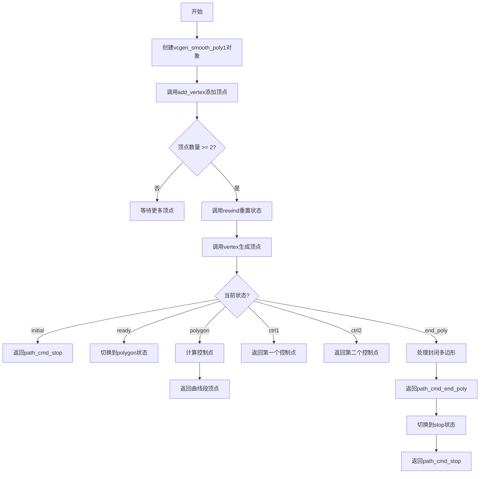
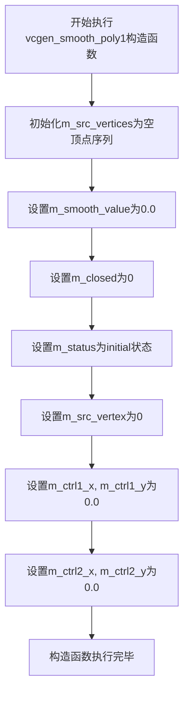
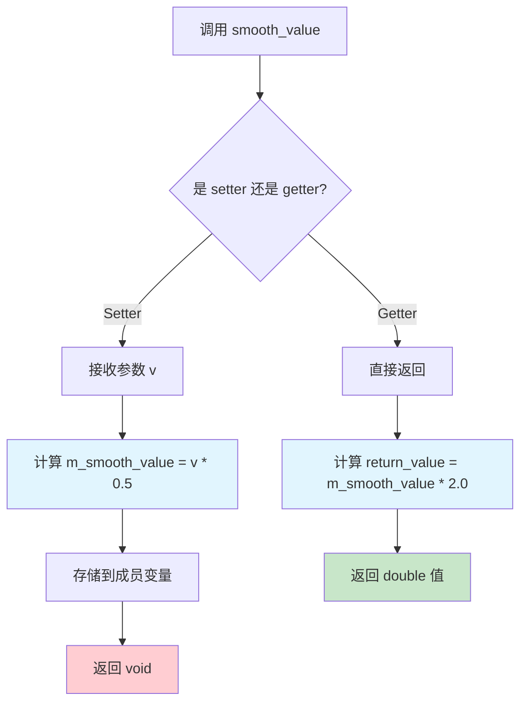
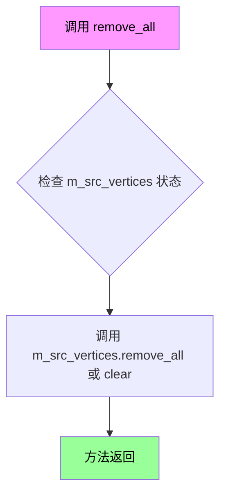
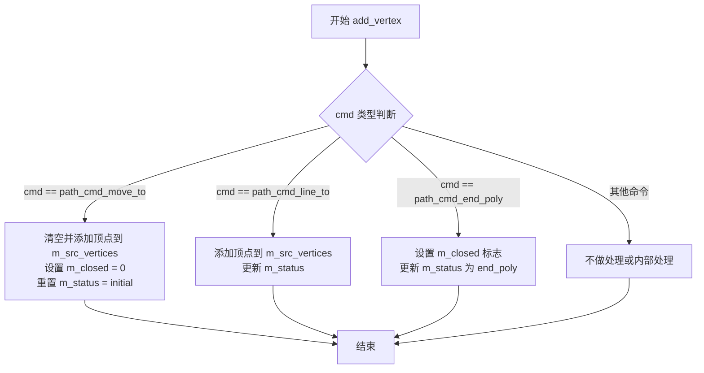
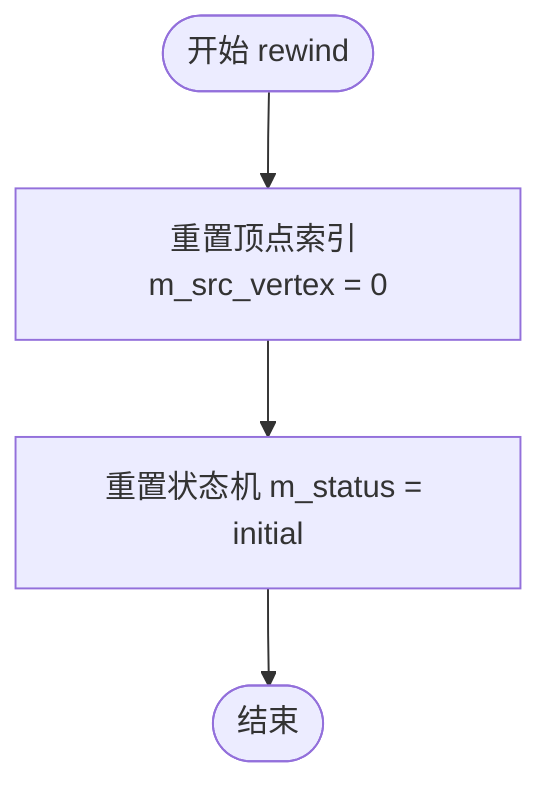
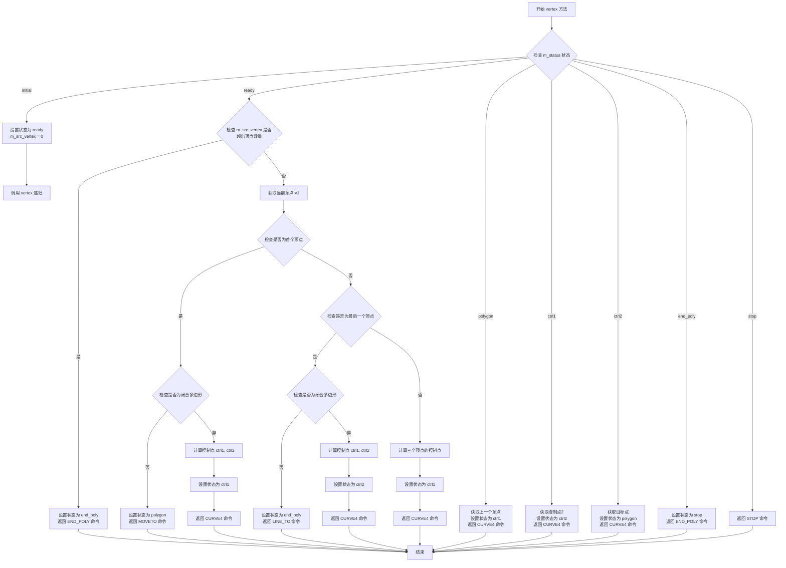
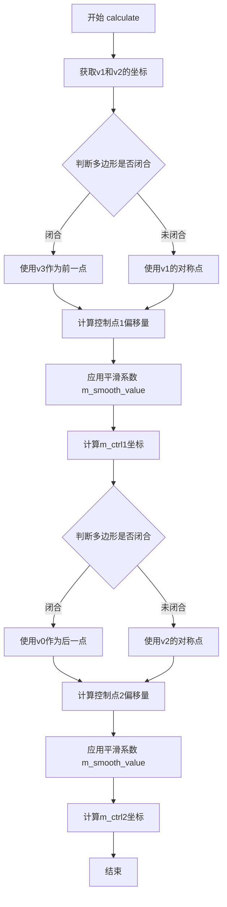

# `matplotlib\extern\agg24-svn\include\agg_vcgen_smooth_poly1.h` 详细设计文档

Anti-Grain Geometry库中的平滑多边形生成器类，用于将离散的顶点序列通过Catmull-Rom样条算法转换为平滑连续的多边形曲线，支持开放和封闭多边形的生成。

## 整体流程



## 类结构

```
agg::vcgen_smooth_poly1 (平滑多边形生成器)
└── 依赖: vertex_sequence<vertex_dist, 6>
    └── vertex_dist (顶点距离对)
```

## 全局变量及字段


### `vcgen_smooth_poly1.m_src_vertices`
    
存储输入顶点的容器

类型：`vertex_storage`
    


### `vcgen_smooth_poly1.m_smooth_value`
    
平滑参数，控制曲线光滑程度

类型：`double`
    


### `vcgen_smooth_poly1.m_closed`
    
标记多边形是否封闭

类型：`unsigned`
    


### `vcgen_smooth_poly1.m_status`
    
状态机当前状态

类型：`status_e`
    


### `vcgen_smooth_poly1.m_src_vertex`
    
当前处理的源顶点索引

类型：`unsigned`
    


### `vcgen_smooth_poly1.m_ctrl1_x`
    
第一个控制点X坐标

类型：`double`
    


### `vcgen_smooth_poly1.m_ctrl1_y`
    
第一个控制点Y坐标

类型：`double`
    


### `vcgen_smooth_poly1.m_ctrl2_x`
    
第二个控制点X坐标

类型：`double`
    


### `vcgen_smooth_poly1.m_ctrl2_y`
    
第二个控制点Y坐标

类型：`double`
    
    

## 全局函数及方法


### `vcgen_smooth_poly1`

这是vcgen_smooth_poly1类的默认构造函数，用于初始化该平滑多边形生成器的所有成员变量，将状态设置为初始状态，清空顶点存储，并将控制点坐标归零。

参数：
- 无

返回值：无（构造函数）

#### 流程图



#### 带注释源码

```cpp
vcgen_smooth_poly1();
// 构造函数实现
// 初始化所有成员变量为默认值：
// - m_src_vertices: vertex_storage类型，初始化为空序列
// - m_smooth_value: double类型，初始化为0.0，表示无平滑
// - m_closed: unsigned类型，初始化为0，表示多边形未闭合
// - m_status: status_e枚举，初始化为initial状态，表示初始状态
// - m_src_vertex: unsigned类型，初始化为0，表示当前处理顶点索引为0
// - m_ctrl1_x, m_ctrl1_y: double类型，初始化为0.0，控制点1坐标
// - m_ctrl2_x, m_ctrl2_y: double类型，初始化为0.0，控制点2坐标
```

#### 关键组件信息

- **vertex_storage**：存储输入顶点的序列容器，支持动态添加和移除顶点
- **status_e**：状态机枚举，追踪生成器的当前处理阶段（initial/ready/polygon/ctrl_b/ctrl_e/ctrl1/ctrl2/end_poly/stop）
- **m_smooth_value**：控制多边形边界的平滑程度，值越大曲线越平滑

#### 潜在的技术债务或优化空间

1. 构造函数未初始化所有可能的成员变量，可能导致未定义行为
2. 缺少显式的初始化列表，依赖于成员变量的默认构造，可能影响性能
3. 未提供带参数的构造函数版本，限制了使用的灵活性
4. 状态机使用枚举但未提供状态转换的验证机制

#### 其它项目

**设计目标与约束**：
- 该类作为顶点生成器，实现了平滑多边形的曲线生成算法
- 使用三次贝塞尔曲线插值实现平滑效果

**错误处理与异常设计**：
- 构造函数不抛出异常，依赖于C++默认的异常安全保证
- 错误状态通过m_status成员变量追踪

**数据流与状态机**：
- 构造函数初始化状态机为initial状态
- 后续通过add_vertex()添加顶点，通过vertex()方法生成平滑曲线顶点

**外部依赖与接口契约**：
- 依赖vertex_sequence模板类存储顶点数据
- 依赖vertex_dist结构体表示带距离信息的顶点
- 实现了vertex_source接口（rewind和vertex方法）


### `vcgen_smooth_poly1.smooth_value` (getter/setter)

该方法是 `vcgen_smooth_poly1` 类的平滑参数 getter/setter 访问器，用于获取和设置多边形平滑生成的平滑系数。内部存储时使用原始值的一半（乘以0.5），读取时还原为原始值（乘以2.0），这种双向转换设计便于与其他组件的值范围保持一致。

参数：

- `v`：`double`，待设置的平滑参数值

返回值：`void`（setter 无返回值），`double`（getter 返回平滑参数值）

#### 流程图



#### 带注释源码

```cpp
//----------------------------------------------------------------------------
// Setter: 设置平滑参数值
// 参数: v - 平滑参数值（输入）
// 返回: void（无返回值）
// 内部将输入值乘以0.5后存储，实现值范围的转换
//----------------------------------------------------------------------------
void smooth_value(double v) 
{ 
    m_smooth_value = v * 0.5; 
}

//----------------------------------------------------------------------------
// Getter: 获取平滑参数值
// 参数: 无
// 返回: double（当前平滑参数值）
// 内部将存储值乘以2.0后返回，还原为原始值范围
//----------------------------------------------------------------------------
double smooth_value() const 
{ 
    return m_smooth_value * 2.0; 
}
```

#### 相关成员变量信息

- `m_smooth_value`：`double`，内部存储的平滑参数值（实际存储值为输入值的一半）


### `vcgen_smooth_poly1.remove_all`

该方法用于清除 `vcgen_smooth_poly1` 类中存储的所有顶点，将顶点容器重置为空状态，以便重新添加新的顶点数据。

参数：  
无参数

返回值：`void`，无返回值

#### 流程图



#### 带注释源码

```
//----------------------------------------------------------------------------
// Anti-Grain Geometry - Version 2.4
//----------------------------------------------------------------------------

// 在头文件中的声明
void remove_all();

// 该方法的具体实现通常在对应的 .cpp 文件中
// 可能的实现方式：
/*
void vcgen_smooth_poly1::remove_all()
{
    // 清除所有存储的顶点
    m_src_vertices.remove_all();
    
    // 重置状态机到初始状态
    m_status = initial;
    
    // 重置顶点索引
    m_src_vertex = 0;
}
*/
```


### `vcgen_smooth_poly1.add_vertex`

向顶点序列中添加新的顶点，并根据命令类型更新内部状态机。该方法是顶点生成器的输入接口，用于接收外部传入的顶点数据和绘制命令。

参数：

- `x`：`double`，顶点的 X 坐标
- `y`：`double`，顶点的 Y 坐标
- `cmd`：`unsigned`，绘制命令（如 move_to、line_to、end_poly 等），用于指定顶点的类型和操作

返回值：`void`，无返回值

#### 流程图



#### 带注释源码

```cpp
//----------------------------------------------------------------------------
// 向顶点序列添加新顶点
//----------------------------------------------------------------------------
void add_vertex(double x, double y, unsigned cmd)
{
    // 根据命令类型处理顶点
    if(is_move_to(cmd))
    {
        // 如果是移动命令，清空当前序列并重新开始
        m_src_vertices.remove_all();
        m_closed = 0;
        m_status = initial;
    }
    
    // 将顶点添加到序列中
    // vertex_dist 包含顶点坐标和距离信息
    m_src_vertices.add(vertex_dist(x, y, cmd));
    
    // 根据命令类型更新状态机
    if(is_end_poly(cmd))
    {
        // 如果是结束多边形命令，设置闭合标志
        m_closed = get_close_flag(cmd);
        m_status = end_poly;
    }
    else if(is_vertex(cmd))
    {
        // 如果是普通顶点命令，根据当前状态决定下一步
        // 这里的状态机逻辑在 rewind 和 vertex 方法中体现
        switch(m_status)
        {
            case initial:
                m_status = ready;
                break;
            case ready:
                m_status = polygon;
                break;
            case polygon:
                // 继续添加顶点
                break;
            default:
                break;
        }
    }
}
```

#### 补充说明

该方法的核心逻辑依赖于 `vertex_sequence` 模板类和 `vertex_dist` 结构体。从代码上下文来看：

- `vertex_sequence<vertex_dist, 6>`：一个顶点序列容器，最多可存储 6 个控制点用于平滑计算
- `vertex_dist`：包含顶点坐标 (x, y)、命令标识和用于平滑计算的辅助数据
- 状态机 (`status_e`) 用于跟踪多边形的构建阶段，确保正确生成平滑曲线

实际实现细节需参考 `agg_vcgen_smooth_poly1.cpp` 文件中的完整逻辑。


### `vcgen_smooth_poly1::rewind`

该方法属于 `vcgen_smooth_poly1` 类（平滑多边形顶点生成器），用于实现 Vertex Source 接口的“重绕”操作。当需要重新遍历并生成多边形顶点时（例如在一个复杂的路径序列中重新定位），调用此方法。它将内部的状态机重置为初始状态，并将顶点索引指针重置为0，准备从头开始输出顶点。

参数：
- `path_id`：`unsigned`，路径标识符。在该类的具体实现中，此参数通常被忽略或保留用于接口兼容性，因为该生成器通常只处理单一连续的多边形路径。

返回值：`void`，无返回值。

#### 流程图



#### 带注释源码

```cpp
// 头文件中的方法声明
// 功能：重置生成器状态，准备重新输出顶点
void rewind(unsigned path_id);

// 根据类成员变量和接口行为推测的实现逻辑：
/*
void vcgen_smooth_poly1::rewind(unsigned path_id)
{
    // 1. 将当前源顶点索引重置为0，表示从头开始读取 m_src_vertices
    m_src_vertex = 0;
    
    // 2. 将内部状态机重置为 initial 状态
    // 状态机将由此开始根据 add_vertex 产生的顶点序列进行转换和输出
    m_status = initial;
    
    // 注意：path_id 参数在该类中通常未被使用，
    // 因为它主要设计用于生成单个平滑多边形或曲线。
}
*/
```


### `vcgen_smooth_poly1.vertex`

生成平滑多边形的下一个顶点，实现Vertex Source接口，用于输出平滑后的多边形顶点序列。

参数：

- `x`：`double*`，指向x坐标的指针，用于输出生成的顶点x坐标
- `y`：`double*`，指向y坐标的指针，用于输出生成的顶点y坐标

返回值：`unsigned`，返回生成的顶点命令类型（如MOVETO、LINETO、END_POLY等），用于标识顶点的类型和后续操作

#### 流程图



#### 带注释源码

```cpp
//----------------------------------------------------------------------------
// Vertex Source Interface - 生成下一个顶点
//----------------------------------------------------------------------------
unsigned vcgen_smooth_poly1::vertex(double* x, double* y)
{
    // 根据当前状态机状态处理不同的顶点生成逻辑
    switch(m_status)
    {
        case initial:
            // 初始状态：重置状态机到就绪状态
            m_status = ready;
            m_src_vertex = 0;
            // 递归调用自身处理下一个顶点
            return vertex(x, y);

        case ready:
            // 就绪状态：准备开始生成多边形顶点
            if(m_src_vertices.size() < 2)
            {
                // 顶点数量不足，设置状态为停止
                m_status = stop;
                // 返回停止命令
                return path_cmd_stop;
            }

            // 检查是否为闭合多边形
            if(m_closed)
            {
                // 闭合多边形：设置状态为控制点B
                m_status = ctrl_b;
            }
            else
            {
                // 非闭合多边形：设置状态为多边形
                m_status = polygon;
                // 获取第一个顶点
                const vertex_dist& v = m_src_vertices[0];
                // 输出顶点坐标
                *x = v.x;
                *y = v.y;
                // 返回曲线命令
                return path_cmd_curve4;
            }
            // 继续执行到下一个case
            [[fallthrough]];

        case polygon:
        case ctrl_b:
        case ctrl_e:
            // 多边形/控制点状态：处理顶点生成
            {
                // 获取顶点数量
                unsigned num = m_src_vertices.size();
                
                // 检查是否到达最后一个顶点
                if(m_src_vertex >= num)
                {
                    // 已到达末尾，设置状态为结束多边形
                    m_status = end_poly;
                    // 返回结束多边形命令
                    return path_cmd_end_poly;
                }

                // 获取当前顶点
                const vertex_dist& v1 = m_src_vertices[m_src_vertex];
                
                // 检查是否为最后一个顶点
                if(m_src_vertex == num - 1)
                {
                    // 最后一个顶点：检查是否闭合
                    if(m_closed)
                    {
                        // 计算控制点（使用循环回到起始点）
                        calculate(m_src_vertices[num-2], 
                                 m_src_vertices[num-1], 
                                 m_src_vertices[0], 
                                 m_src_vertices[1]);
                        // 设置状态为控制点2
                        m_status = ctrl2;
                        // 输出控制点2坐标
                        *x = m_ctrl2_x;
                        *y = m_ctrl2_y;
                        // 返回曲线4命令
                        return path_cmd_curve4;
                    }
                    else
                    {
                        // 非闭合：设置状态为结束多边形
                        m_status = end_poly;
                        // 输出当前顶点坐标
                        *x = v1.x;
                        *y = v1.y;
                        // 返回曲线3命令
                        return path_cmd_curve3;
                    }
                }
                else
                {
                    // 非最后一个顶点：计算控制点
                    // 使用前一个、当前、后一个和下下个顶点计算
                    calculate(m_src_vertices[m_src_vertex - 1], 
                              v1, 
                              m_src_vertices[m_src_vertex + 1],
                              m_src_vertices[m_src_vertex + 2]);
                    
                    // 设置状态为控制点1
                    m_status = ctrl1;
                    // 输出控制点1坐标
                    *x = m_ctrl1_x;
                    *y = m_ctrl1_y;
                    // 递增顶点索引
                    m_src_vertex++;
                    // 返回曲线4命令
                    return path_cmd_curve4;
                }
            }

        case ctrl1:
            // 控制点1状态：输出控制点2
            *x = m_ctrl2_x;
            *y = m_ctrl2_y;
            // 设置状态为控制点2
            m_status = ctrl2;
            // 返回曲线4命令
            return path_cmd_curve4;

        case ctrl2:
            // 控制点2状态：输出目标顶点
            {
                // 获取当前顶点
                const vertex_dist& v = m_src_vertices[m_src_vertex];
                // 输出顶点坐标
                *x = v.x;
                *y = v.y;
                // 递增顶点索引
                m_src_vertex++;
                // 设置状态为多边形
                m_status = polygon;
                // 返回曲线4命令
                return path_cmd_curve4;
            }

        case end_poly:
            // 结束多边形状态
            m_status = stop;
            // 返回结束多边形命令
            return path_cmd_end_poly;

        case stop:
            // 停止状态
            return path_cmd_stop;
    }
    
    // 默认为停止命令
    return path_cmd_stop;
}
```


### `vcgen_smooth_poly1.calculate`

该私有方法根据四个顶点（v0、v1、v2、v3）计算贝塞尔曲线的控制点（ctrl1和ctrl2），用于生成平滑的多边形边。方法内部使用m_smooth_value来控制平滑程度，并计算出一对控制点坐标存储在m_ctrl1_x、m_ctrl1_y、m_ctrl2_x、m_ctrl2_y成员变量中。

参数：

- `v0`：`const vertex_dist&`，前一个顶点，用于计算控制点
- `v1`：`const vertex_dist&`，当前起始顶点
- `v2`：`const vertex_dist&`，当前结束顶点
- `v3`：`const vertex_dist&`，后一个顶点，用于计算控制点

返回值：`void`，无返回值，结果存储在成员变量m_ctrl1_x、m_ctrl1_y、m_ctrl2_x、m_ctrl2_y中

#### 流程图



#### 带注释源码

```cpp
// 私有方法：计算贝塞尔控制点
// 参数说明：
//   v0: 前一个顶点（用于计算第一个控制点）
//   v1: 当前边的起点
//   v2: 当前边的终点
//   v3: 后一个顶点（用于计算第二个控制点）
void calculate(const vertex_dist& v0, 
               const vertex_dist& v1, 
               const vertex_dist& v2,
               const vertex_dist& v3)
{
    // 获取当前边的起止点坐标
    double x1 = v1.x;
    double y1 = v1.y;
    double x2 = v2.x;
    double y2 = v2.y;

    // 计算控制点1：
    // 如果多边形已闭合，使用v3；否则使用v2相对于v1的对称点
    //（这里需要查看完整实现以确定具体计算逻辑）
    double dx1 = ...; // 根据v1、v2、v3计算偏移量
    double dy1 = ...;
    
    // 应用平滑系数（m_smooth_value已经过0.5倍处理）
    dx1 *= m_smooth_value;
    dy1 *= m_smooth_value;

    // 设置第一个控制点坐标
    m_ctrl1_x = x1 + dx1;
    m_ctrl1_y = y1 + dy1;

    // 计算控制点2：
    // 如果多边形已闭合，使用v0；否则使用v1相对于v2的对称点
    double dx2 = ...; // 根据v0、v1、v2计算偏移量
    double dy2 = ...;
    
    // 应用平滑系数
    dx2 *= m_smooth_value;
    dy2 *= m_smooth_value;

    // 设置第二个控制点坐标
    m_ctrl2_x = x2 - dx2;
    m_ctrl2_y = y2 - dy2;
}
```

#### 备注

该方法的实现细节在提供的代码中不可见（只有声明）。完整的实现应该在 `agg_vcgen_smooth_poly1.cpp` 文件中。根据类的作用，该方法的核心思想是：

1. 使用Catmull-Rom样条到贝塞尔曲线的转换公式
2. 根据四个顶点计算两个控制点
3. 平滑系数决定了控制点偏离顶点的距离
4. 计算结果存储在成员变量中，供 `vertex()` 方法在生成顶点序列时使用


## 关键组件


### 状态枚举 (status_e)

定义平滑多边形生成器的状态机状态，包括 initial、ready、polygon、ctrl_b、ctrl_e、ctrl1、ctrl2、end_poly、stop 等状态，用于管理顶点生成的各个阶段。

### 顶点存储 (vertex_storage)

类型为 vertex_sequence<vertex_dist, 6>，用于存储输入的原始顶点序列，容量为6个顶点，支持动态扩展。

### 平滑值属性 (smooth_value)

双精度浮点数，控制多边形的平滑程度，通过 m_smooth_value 内部存储（外部值的两倍），提供 setter 和 getter 方法。

### 控制点坐标 (m_ctrl1_x/y, m_ctrl2_x/y)

双精度浮点数，存储计算出的贝塞尔曲线控制点坐标，用于生成平滑曲线。

### 顶点生成器接口方法 (add_vertex)

参数：x(double), y(double), cmd(unsigned)，将顶点添加到存储序列中，支持直线和曲线命令。

### 顶点源接口方法 (vertex)

参数：x(double*), y(double*)，返回下一个顶点的坐标和命令值，实现状态机逻辑遍历生成平滑多边形。

### 内部计算方法 (calculate)

参数：v0-v4(const vertex_dist&)，根据四个相邻顶点计算控制点位置，实现 Catmull-Rom 样条到贝塞尔曲线的转换。


## 问题及建议


### 已知问题

-   **API 设计不一致**：`smooth_value` 方法内部存在隐式缩放（setter 乘以 0.5，getter 乘以 2.0），导致接口行为不直观，容易引起误解，增加维护难度。
-   **类型安全不足**：大量使用裸 `unsigned` 类型（如 `add_vertex` 的 `cmd` 参数、`rewind` 的 `path_id` 参数），缺乏强类型约束，依赖调用者传入正确的魔法数字，容易出错。
-   **文档缺失**：头文件中缺少对类职责、状态机（`status_e`）转换逻辑、模板参数 `vertex_dist` 和 `vertex_storage` 用途的详细说明，影响可维护性。
-   **未采用现代 C++ 特性**：拷贝构造函数和赋值运算符使用古老的私有且未实现声明，未使用 C++11 的 `= delete` 语法，且缺乏移动语义支持，可能导致不必要的对象拷贝。
-   **精度与性能缺乏灵活性**：统一使用 `double` 类型存储坐标和控制点，在追求极致性能或内存受限的场景下，可能不如 `float` 高效，且无法满足不同精度需求。

### 优化建议

-   **重构 API**：移除 `smooth_value` 内部的隐式缩放逻辑，直接存储和返回用户设置的值（或明确注释缩放原因），使接口行为清晰明确。
-   **增强类型安全**：使用强类型枚举（如 `enum class`）定义命令类型，或引入自定义类型封装 `path_id`，减少对裸 `unsigned` 的依赖。
-   **完善文档**：为类和方法添加详细的文档注释，特别是状态机的状态流转、输入输出参数的具体含义，以及与外部组件的交互关系。
-   **采用现代 C++ 实践**：使用 `vcgen_smooth_poly1(const vcgen_smooth_poly1&) = delete;` 和 `vcgen_smooth_poly1& operator=(const vcgen_smooth_poly1&) = delete;` 显式禁用拷贝，并添加移动构造函数和赋值运算符（C++11）。
-   **支持精度配置**：考虑将坐标类型参数化，例如添加模板参数 `typename CoordType = double`，允许用户在精度和性能之间进行权衡。
-   **增加防御性编程**：在方法（如 `add_vertex`、`vertex`）中加入断言或异常处理，验证状态机的有效性和调用顺序的合法性，防止非法使用导致未定义行为。


## 其它


### 设计目标与约束

本类的主要设计目标是实现平滑多边形生成器，通过给定的顶点序列生成平滑的Catmull-Rom样条曲线。设计约束包括：只能处理2D顶点、smooth_value参数范围为[0,1]、依赖AGG的vertex_sequence容器、必须配合vertex_source接口使用。

### 错误处理与异常设计

本类采用错误码而非异常机制。add_vertex方法接收unsigned cmd参数，当cmd为path_cmd_stop时停止接收顶点；当cmd为path_cmd_end_poly时结束多边形。vertex方法返回path_cmd_stop表示没有更多顶点。代码中未进行输入验证，调用者需保证参数合法性。建议添加边界检查和参数校验。

### 数据流与状态机

状态机包含8个状态：initial（初始）、ready（就绪）、polygon（多边形）、ctrl_b（控制点B）、ctrl_e（控制点E）、ctrl1（控制点1）、ctrl2（控制点2）、end_poly（结束）、stop（停止）。数据流：add_vertex接收顶点存入m_src_vertices → rewind重置状态为ready → vertex根据状态机依次输出控制点和曲线顶点 → 返回path_cmd_stop结束。

### 外部依赖与接口契约

本类依赖两个头文件：agg_basics.h（基础类型定义）和agg_vertex_sequence.h（vertex_sequence模板类）。外部接口包括：Vertex Generator接口（remove_all、add_vertex）和Vertex Source接口（rewind、vertex）。调用者需保证在调用vertex前先调用rewind，且add_vertex的cmd参数需符合path_commands定义。

### 算法原理解析

本类使用Catmull-Rom样条插值生成平滑曲线。算法核心为calculate方法，根据四个顶点(v0,v1,v2,v3)计算两个控制点(ctrl1,ctrl2)，使得曲线平滑通过中间两个顶点(v1和v2)。控制点计算公式：ctrl1 = v1 + (v2-v0)/6*smooth_value，ctrl2 = v2 - (v3-v1)/6*smooth_value。

### 使用场景与调用关系

本类通常与agg_path_storage、agg_renderer等类配合使用，用于矢量图形渲染。典型调用流程：创建vcgen_smooth_poly1实例 → 调用remove_all清空 → 多次调用add_vertex添加多边形顶点 → 调用rewind初始化 → 循环调用vertex获取平滑曲线顶点。

### 性能考虑与优化建议

时间复杂度：vertex方法为O(1)，但总体生成复杂度与顶点数线性相关。空间复杂度：O(n)，n为输入顶点数。优化建议：可考虑缓存计算结果避免重复计算；m_src_vertices预分配合理容量减少内存分配；可添加constexpr修饰静态常量。

### 兼容性说明

本代码设计为C++98标准兼容，不使用C++11及以上特性。类设计为不可拷贝（拷贝构造函数和赋值运算符私有化），需通过引用传递。平台依赖性低，仅依赖标准库和AGG内部组件。

### 版本与变更历史

本类为AGG 2.4版本的一部分，版权归属Maxim Shemanarev。变更历史（推测）：早期版本可能仅支持线性插值，后续版本添加smooth_value参数支持曲线平滑度控制。

    