# `matplotlib\extern\agg24-svn\include\agg_vcgen_stroke.h` 详细设计文档

The code defines a stroke generator class for vector graphics, which handles the creation of stroke paths for rendering.

## 整体流程

```mermaid
graph TD
    A[Start] --> B{Is vertex added?}
    B -- Yes --> C[Add vertex to storage]
    B -- No --> D[Check status]
    D --> E{Is path closed?}
    E -- Yes --> F[End polygon}
    E -- No --> G[Continue adding vertices]
    F --> H[Update stroke path]
    H --> I{Is stroke complete?}
    I -- Yes --> J[End stroke]
    I -- No --> K[Return to B]
```

## 类结构

```
vcgen_stroke (Stroke generator)
```

## 全局变量及字段


### `line_cap_e`
    
Enumeration for line caps.

类型：`enum`
    


### `line_join_e`
    
Enumeration for line joins.

类型：`enum`
    


### `inner_join_e`
    
Enumeration for inner joins.

类型：`enum`
    


### `vertex_sequence`
    
Template class for vertex sequences.

类型：`template class`
    


### `pod_bvector`
    
Template class for point coordinate storage.

类型：`template class`
    


### `point_d`
    
Structure for 2D points with double precision.

类型：`struct`
    


### `math_stroke`
    
Class for stroke operations on points.

类型：`class`
    


### `status_e`
    
Enumeration for stroke generator status.

类型：`enum`
    


### `vertex_storage`
    
Template class for vertex storage.

类型：`template class`
    


### `coord_storage`
    
Template class for coordinate storage.

类型：`template class`
    


### `vcgen_stroke.m_stroker`
    
Math stroke object for stroke operations.

类型：`math_stroke<coord_storage>`
    


### `vcgen_stroke.m_src_vertices`
    
Vertex storage for source vertices.

类型：`vertex_storage`
    


### `vcgen_stroke.m_out_vertices`
    
Coordinate storage for output vertices.

类型：`coord_storage`
    


### `vcgen_stroke.m_shorten`
    
Shortening value for vertices.

类型：`double`
    


### `vcgen_stroke.m_closed`
    
Flag indicating if the path is closed.

类型：`unsigned`
    


### `vcgen_stroke.m_status`
    
Current status of the stroke generator.

类型：`status_e`
    


### `vcgen_stroke.m_prev_status`
    
Previous status of the stroke generator.

类型：`status_e`
    


### `vcgen_stroke.m_src_vertex`
    
Index of the current source vertex.

类型：`unsigned`
    


### `vcgen_stroke.m_out_vertex`
    
Index of the current output vertex.

类型：`unsigned`
    
    

## 全局函数及方法


### `vcgen_stroke::vcgen_stroke()`

构造函数，用于初始化`vcgen_stroke`类的实例。

参数：

- 无

返回值：无

#### 流程图

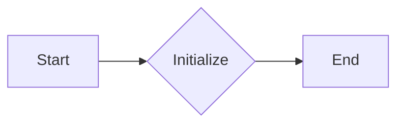

#### 带注释源码

```cpp
vcgen_stroke::vcgen_stroke()
{
    // Constructor implementation
}
```


### `vcgen_stroke::line_cap(line_cap_e lc)`

设置线条的端点样式。

参数：

- `lc`：`line_cap_e`，线条端点样式

返回值：无

#### 流程图

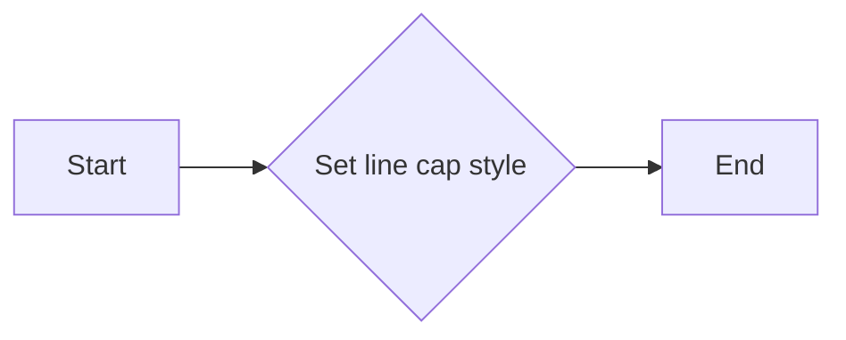

#### 带注释源码

```cpp
void line_cap(line_cap_e lc)     { m_stroker.line_cap(lc); }
```


### `vcgen_stroke::line_join(line_join_e lj)`

设置线条的连接样式。

参数：

- `lj`：`line_join_e`，线条连接样式

返回值：无

#### 流程图

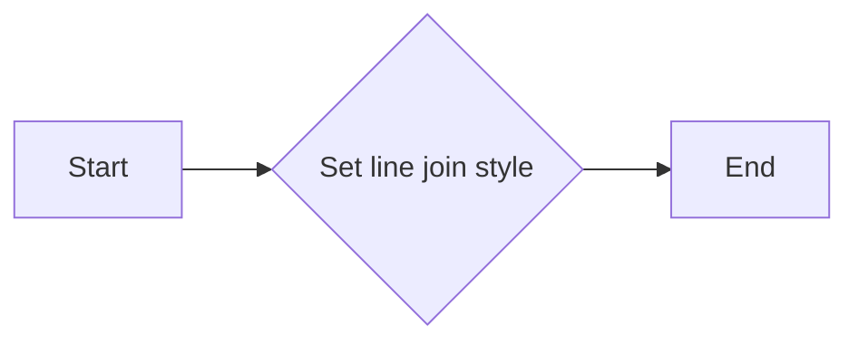

#### 带注释源码

```cpp
void line_join(line_join_e lj)   { m_stroker.line_join(lj); }
```


### `vcgen_stroke::inner_join(inner_join_e ij)`

设置内部线条的连接样式。

参数：

- `ij`：`inner_join_e`，内部线条连接样式

返回值：无

#### 流程图

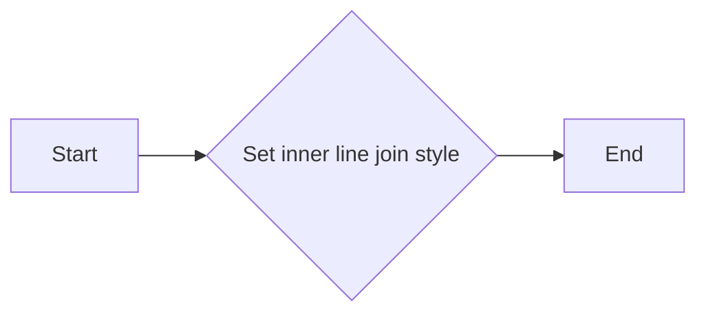

#### 带注释源码

```cpp
void inner_join(inner_join_e ij) { m_stroker.inner_join(ij); }
```


### `vcgen_stroke::width(double w)`

设置线条的宽度。

参数：

- `w`：`double`，线条宽度

返回值：无

#### 流程图

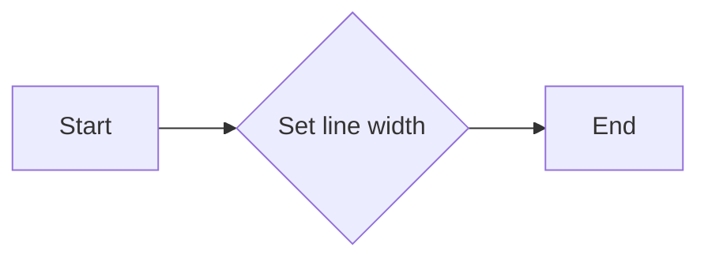

#### 带注释源码

```cpp
void width(double w) { m_stroker.width(w); }
```


### `vcgen_stroke::miter_limit(double ml)`

设置外切线斜率的限制。

参数：

- `ml`：`double`，外切线斜率的限制

返回值：无

#### 流程图

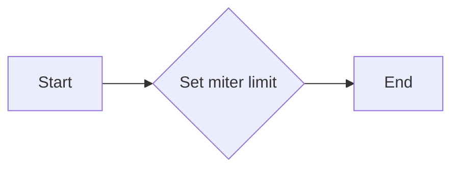

#### 带注释源码

```cpp
void miter_limit(double ml) { m_stroker.miter_limit(ml); }
```


### `vcgen_stroke::miter_limit_theta(double t)`

设置外切线斜率的限制角度。

参数：

- `t`：`double`，外切线斜率的限制角度

返回值：无

#### 流程图

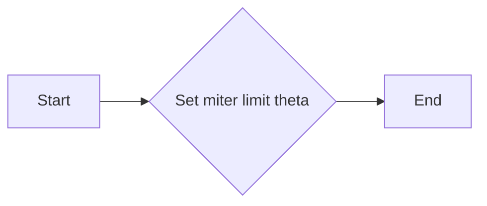

#### 带注释源码

```cpp
void miter_limit_theta(double t) { m_stroker.miter_limit_theta(t); }
```


### `vcgen_stroke::inner_miter_limit(double ml)`

设置内部外切线斜率的限制。

参数：

- `ml`：`double`，内部外切线斜率的限制

返回值：无

#### 流程图

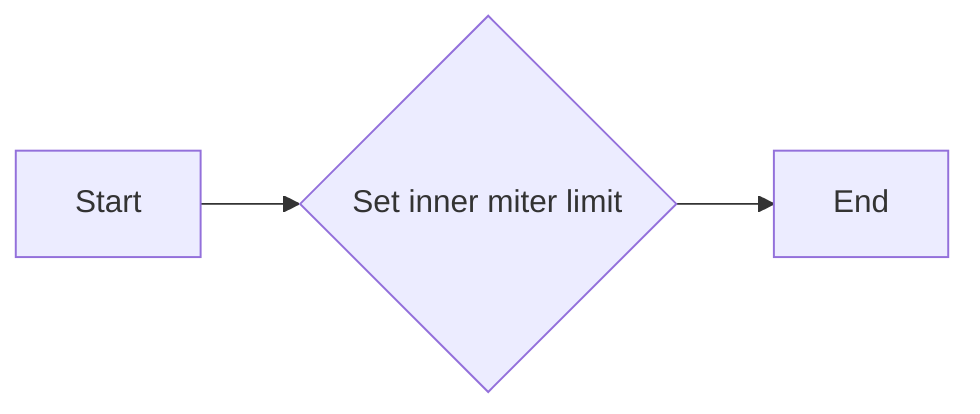

#### 带注释源码

```cpp
void inner_miter_limit(double ml) { m_stroker.inner_miter_limit(ml); }
```


### `vcgen_stroke::approximation_scale(double as)`

设置近似比例。

参数：

- `as`：`double`，近似比例

返回值：无

#### 流程图

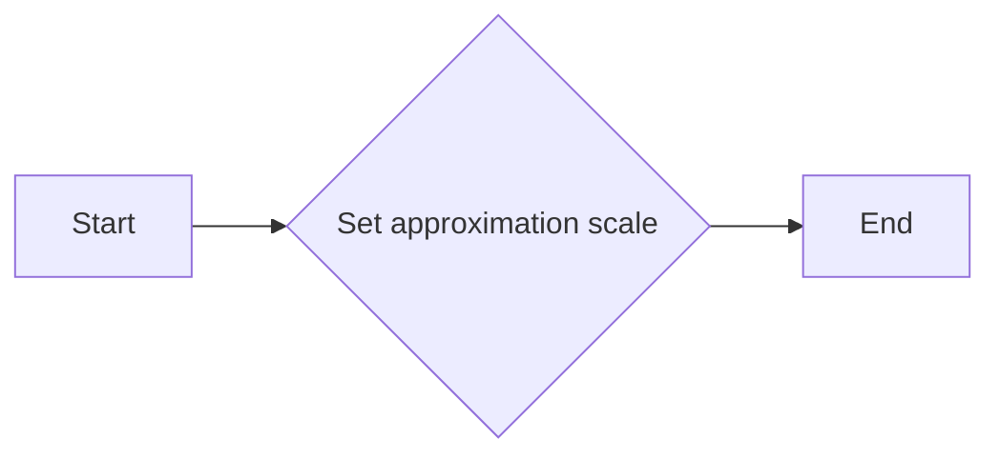

#### 带注释源码

```cpp
void approximation_scale(double as) { m_stroker.approximation_scale(as); }
```


### `vcgen_stroke::shorten(double s)`

设置缩短量。

参数：

- `s`：`double`，缩短量

返回值：无

#### 流程图

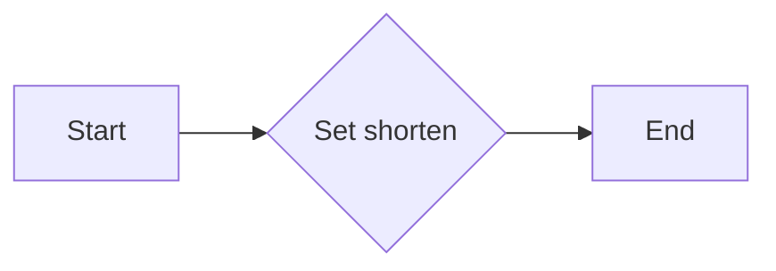

#### 带注释源码

```cpp
void shorten(double s) { m_shorten = s; }
```


### `vcgen_stroke::remove_all()`

移除所有顶点。

参数：

- 无

返回值：无

#### 流程图

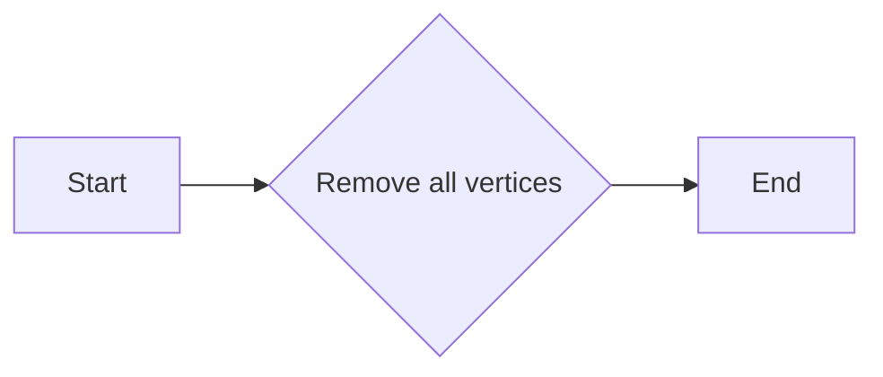

#### 带注释源码

```cpp
void remove_all()
{
    // Remove all vertices implementation
}
```


### `vcgen_stroke::add_vertex(double x, double y, unsigned cmd)`

添加顶点到路径。

参数：

- `x`：`double`，顶点的x坐标
- `y`：`double`，顶点的y坐标
- `cmd`：`unsigned`，顶点命令

返回值：无

#### 流程图

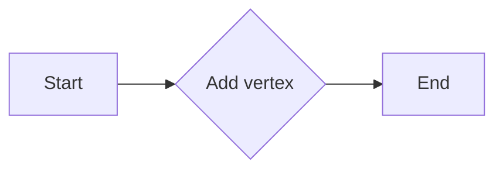

#### 带注释源码

```cpp
void add_vertex(double x, double y, unsigned cmd)
{
    // Add vertex implementation
}
```


### `vcgen_stroke::rewind(unsigned path_id)`

重置路径。

参数：

- `path_id`：`unsigned`，路径ID

返回值：无

#### 流程图

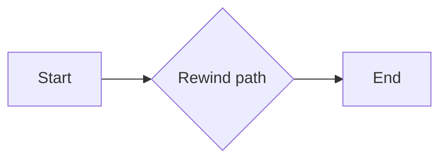

#### 带注释源码

```cpp
void rewind(unsigned path_id)
{
    // Rewind path implementation
}
```


### `vcgen_stroke::vertex(double* x, double* y)`

获取顶点坐标。

参数：

- `x`：`double*`，用于存储x坐标的指针
- `y`：`double*`，用于存储y坐标的指针

返回值：`unsigned`，顶点索引

#### 流程图

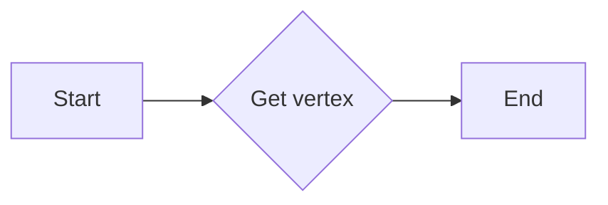

#### 带注释源码

```cpp
unsigned vertex(double* x, double* y)
{
    // Get vertex implementation
}
```


### `vcgen_stroke::m_stroker`

`math_stroke<coord_storage>`类型的字段，用于存储数学相关的线条绘制信息。

- 类型：`math_stroke<coord_storage>`
- 描述：存储数学相关的线条绘制信息


### `vcgen_stroke::m_src_vertices`

`vertex_storage`类型的字段，用于存储源顶点信息。

- 类型：`vertex_storage`
- 描述：存储源顶点信息


### `vcgen_stroke::m_out_vertices`

`coord_storage`类型的字段，用于存储输出顶点信息。

- 类型：`coord_storage`
- 描述：存储输出顶点信息


### `vcgen_stroke::m_shorten`

`double`类型的字段，用于存储缩短量。

- 类型：`double`
- 描述：存储缩短量


### `vcgen_stroke::m_closed`

`unsigned`类型的字段，用于存储路径是否闭合。

- 类型：`unsigned`
- 描述：存储路径是否闭合


### `vcgen_stroke::m_status`

`status_e`类型的字段，用于存储状态。

- 类型：`status_e`
- 描述：存储状态


### `vcgen_stroke::m_prev_status`

`status_e`类型的字段，用于存储上一个状态。

- 类型：`status_e`
- 描述：存储上一个状态


### `vcgen_stroke::m_src_vertex`

`unsigned`类型的字段，用于存储源顶点索引。

- 类型：`unsigned`
- 描述：存储源顶点索引


### `vcgen_stroke::m_out_vertex`

`unsigned`类型的字段，用于存储输出顶点索引。

- 类型：`unsigned`
- 描述：存储输出顶点索引


### 潜在的技术债务或优化空间

- 代码中存在一些未实现的函数，如`remove_all()`和`add_vertex()`的具体实现。
- 可以考虑使用模板来提高代码的泛化能力。
- 可以优化内存使用，例如通过使用智能指针来管理内存。


### 设计目标与约束

- 设计目标：实现一个高效的线条绘制器。
- 约束：代码需要遵循AGG库的设计规范。


### 错误处理与异常设计

- 代码中未明确处理错误和异常。
- 可以考虑添加错误处理机制，例如检查参数的有效性。


### 数据流与状态机

- 数据流：顶点数据从源顶点存储传输到输出顶点存储。
- 状态机：根据不同的状态执行不同的操作，如添加顶点、重置路径等。


### 外部依赖与接口契约

- 代码依赖于AGG库中的`math_stroke`类。
- 接口契约：通过`vertex_sequence`和`pod_bvector`等接口与外部进行交互。
```


### `vcgen_stroke.line_cap(line_cap_e lc)`

Sets the line cap style for the stroke operation.

参数：

- `lc`：`line_cap_e`，The line cap style to be set. This can be one of the following values: `butt`, `round`, or `square`.

返回值：无

#### 流程图


#### 带注释源码

```cpp
void line_cap(line_cap_e lc)     { m_stroker.line_cap(lc); }
```


### `vcgen_stroke::line_join`

`vcgen_stroke::line_join` 方法用于设置线段连接处的样式。

参数：

- `line_join_e lj`：`line_join_e`，指定线段连接处的样式，可以是 `miter`, `bevel`, 或 `round`。

返回值：无

#### 流程图

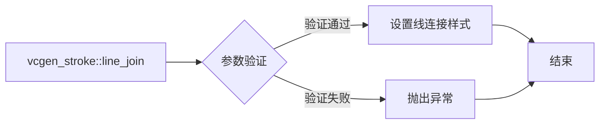

#### 带注释源码

```
void vcgen_stroke::line_join(line_join_e lj)
{
    m_stroker.line_join(lj);
}
```


### `vcgen_stroke::line_cap`

`vcgen_stroke::line_cap` 方法用于设置线段端点的样式。

参数：

- `line_cap_e lc`：`line_cap_e`，指定线段端点的样式，可以是 `butt`, `square`, `round`, 或 `projecting`。

返回值：无

#### 流程图

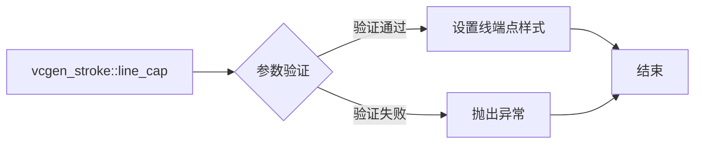

#### 带注释源码

```
void vcgen_stroke::line_cap(line_cap_e lc)
{
    m_stroker.line_cap(lc);
}
```


### `vcgen_stroke::inner_join`

`vcgen_stroke::inner_join` 方法用于设置内连接处的样式。

参数：

- `inner_join_e ij`：`inner_join_e`，指定内连接处的样式，可以是 `miter`, `bevel`, 或 `round`。

返回值：无

#### 流程图

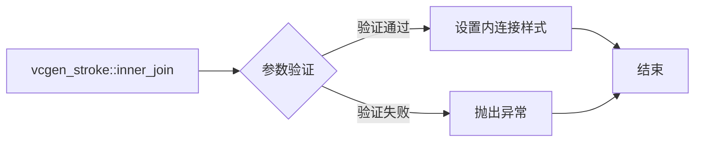

#### 带注释源码

```
void vcgen_stroke::inner_join(inner_join_e ij)
{
    m_stroker.inner_join(ij);
}
```


### `vcgen_stroke::width`

`vcgen_stroke::width` 方法用于设置线宽。

参数：

- `double w`：`double`，指定线宽。

返回值：无

#### 流程图

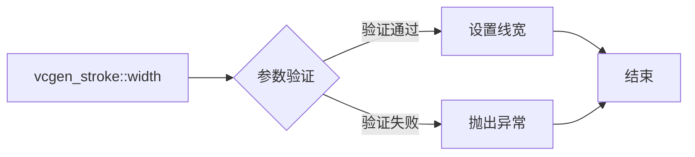

#### 带注释源码

```
void vcgen_stroke::width(double w)
{
    m_stroker.width(w);
}
```


### `vcgen_stroke::miter_limit`

`vcgen_stroke::miter_limit` 方法用于设置斜接限制。

参数：

- `double ml`：`double`，指定斜接限制。

返回值：无

#### 流程图

```mermaid
graph LR
A[vcgen_stroke::miter_limit] --> B{参数验证}
B -->|验证通过| C[设置斜接限制]
B -->|验证失败| D[抛出异常]
C --> E[结束]
D --> E
```

#### 带注释源码

```
void vcgen_stroke::miter_limit(double ml)
{
    m_stroker.miter_limit(ml);
}
```


### `vcgen_stroke::miter_limit_theta`

`vcgen_stroke::miter_limit_theta` 方法用于设置斜接限制角度。

参数：

- `double t`：`double`，指定斜接限制角度。

返回值：无

#### 流程图

```mermaid
graph LR
A[vcgen_stroke::miter_limit_theta] --> B{参数验证}
B -->|验证通过| C[设置斜接限制角度]
B -->|验证失败| D[抛出异常]
C --> E[结束]
D --> E
```

#### 带注释源码

```
void vcgen_stroke::miter_limit_theta(double t)
{
    m_stroker.miter_limit_theta(t);
}
```


### `vcgen_stroke::inner_miter_limit`

`vcgen_stroke::inner_miter_limit` 方法用于设置内斜接限制。

参数：

- `double ml`：`double`，指定内斜接限制。

返回值：无

#### 流程图

```mermaid
graph LR
A[vcgen_stroke::inner_miter_limit] --> B{参数验证}
B -->|验证通过| C[设置内斜接限制]
B -->|验证失败| D[抛出异常]
C --> E[结束]
D --> E
```

#### 带注释源码

```
void vcgen_stroke::inner_miter_limit(double ml)
{
    m_stroker.inner_miter_limit(ml);
}
```


### `vcgen_stroke::approximation_scale`

`vcgen_stroke::approximation_scale` 方法用于设置近似比例。

参数：

- `double as`：`double`，指定近似比例。

返回值：无

#### 流程图

```mermaid
graph LR
A[vcgen_stroke::approximation_scale] --> B{参数验证}
B -->|验证通过| C[设置近似比例]
B -->|验证失败| D[抛出异常]
C --> E[结束]
D --> E
```

#### 带注释源码

```
void vcgen_stroke::approximation_scale(double as)
{
    m_stroker.approximation_scale(as);
}
```


### `vcgen_stroke::shorten`

`vcgen_stroke::shorten` 方法用于设置缩短值。

参数：

- `double s`：`double`，指定缩短值。

返回值：无

#### 流程图

```mermaid
graph LR
A[vcgen_stroke::shorten] --> B{参数验证}
B -->|验证通过| C[设置缩短值]
B -->|验证失败| D[抛出异常]
C --> E[结束]
D --> E
```

#### 带注释源码

```
void vcgen_stroke::shorten(double s)
{
    m_shorten = s;
}
```


### `vcgen_stroke::remove_all`

`vcgen_stroke::remove_all` 方法用于移除所有顶点。

参数：无

返回值：无

#### 流程图

```mermaid
graph LR
A[vcgen_stroke::remove_all] --> B{移除所有顶点}
B --> C[结束]
```

#### 带注释源码

```
void vcgen_stroke::remove_all()
{
    m_src_vertices.clear();
    m_out_vertices.clear();
    m_closed = 0;
    m_status = initial;
    m_prev_status = initial;
    m_src_vertex = 0;
    m_out_vertex = 0;
}
```


### `vcgen_stroke::add_vertex`

`vcgen_stroke::add_vertex` 方法用于添加顶点。

参数：

- `double x`：`double`，指定顶点的 x 坐标。
- `double y`：`double`，指定顶点的 y 坐标。
- `unsigned cmd`：`unsigned`，指定顶点的命令。

返回值：无

#### 流程图

```mermaid
graph LR
A[vcgen_stroke::add_vertex] --> B{参数验证}
B -->|验证通过| C{添加顶点}
B -->|验证失败| D[抛出异常]
C --> E[结束]
D --> E
```

#### 带注释源码

```
void vcgen_stroke::add_vertex(double x, double y, unsigned cmd)
{
    m_src_vertices.push_back(vertex_dist(x, y, cmd));
}
```


### `vcgen_stroke::rewind`

`vcgen_stroke::rewind` 方法用于重置路径。

参数：

- `unsigned path_id`：`unsigned`，指定路径 ID。

返回值：无

#### 流程图

```mermaid
graph LR
A[vcgen_stroke::rewind] --> B{参数验证}
B -->|验证通过| C{重置路径}
B -->|验证失败| D[抛出异常]
C --> E[结束]
D --> E
```

#### 带注释源码

```
void vcgen_stroke::rewind(unsigned path_id)
{
    // Implementation depends on the specific requirements of the path management
}
```


### `vcgen_stroke::vertex`

`vcgen_stroke::vertex` 方法用于获取顶点。

参数：

- `double* x`：`double*`，用于存储顶点的 x 坐标。
- `double* y`：`double*`，用于存储顶点的 y 坐标。

返回值：`unsigned`，返回顶点的索引。

#### 流程图

```mermaid
graph LR
A[vcgen_stroke::vertex] --> B{参数验证}
B -->|验证通过| C{获取顶点}
B -->|验证失败| D[抛出异常]
C --> E{返回顶点索引}
D --> E
```

#### 带注释源码

```
unsigned vcgen_stroke::vertex(double* x, double* y)
{
    if (m_out_vertex < m_out_vertices.size())
    {
        *x = m_out_vertices[m_out_vertex].x();
        *y = m_out_vertices[m_out_vertex].y();
        ++m_out_vertex;
        return m_out_vertex;
    }
    return 0;
}
```


### `vcgen_stroke.inner_join(inner_join_e ij)`

This method sets the inner join style for the stroke generator.

参数：

- `ij`：`inner_join_e`，The type of inner join style to be set. This can be one of the following values: `inner_join_e::miter`, `inner_join_e::bevel`, or `inner_join_e::round`.

返回值：`void`，This method does not return a value.

#### 流程图

```mermaid
graph LR
A[Start] --> B{Set inner join style}
B --> C[End]
```

#### 带注释源码

```
void vcgen_stroke::inner_join(inner_join_e ij) {
    m_stroker.inner_join(ij);
}
```


### `vcgen_stroke::line_cap` 

Sets the line cap style for the stroke operation.

参数：

- `lc`：`line_cap_e`，The line cap style to be set. This can be one of the following values: `butt`, `round`, or `square`.

返回值：`line_cap_e`，The current line cap style.

#### 流程图

```mermaid
graph LR
A[Start] --> B{Is line_cap called?}
B -- Yes --> C[Set line cap style]
B -- No --> D[End]
C --> E[Return current line cap style]
E --> F[End]
```

#### 带注释源码

```cpp
void vcgen_stroke::line_cap(line_cap_e lc)     { m_stroker.line_cap(lc); }
```


### `vcgen_stroke.line_join()` 

Sets the line join style for the stroke operation.

参数：

- `line_join_e lj`：`line_join_e`，The type of line join to use. This can be `miter`, `bevel`, or `round`.

返回值：`void`，No return value. The line join style is set directly on the stroke object.

#### 流程图

```mermaid
graph LR
A[vcgen_stroke] --> B{line_join_e lj}
B --> C{Set line join style}
C --> D[End]
```

#### 带注释源码

```cpp
void line_join(line_join_e lj) { m_stroker.line_join(lj); }
```


### `vcgen_stroke.inner_join()` 

This function sets the inner join style for the stroke generator.

参数：

- `inner_join_e ij`：`inner_join_e`，This parameter specifies the inner join style to be used for the stroke.

返回值：`void`，This function does not return a value.

#### 流程图

```mermaid
graph LR
A[Function Call] --> B{Set Inner Join Style}
B --> C[End Function]
```

#### 带注释源码

```cpp
void inner_join(inner_join_e ij) { m_stroker.inner_join(ij); }
```


### `vcgen_stroke.width(double w)`

Sets the width of the stroke.

参数：

- `w`：`double`，The width of the stroke.

返回值：`void`，No return value.

#### 流程图

```mermaid
graph LR
A[Start] --> B{Set width}
B --> C[End]
```

#### 带注释源码

```cpp
void width(double w) { m_stroker.width(w); }
```


### `vcgen_stroke.miter_limit(double ml)`

This function sets the miter limit for the stroke generator.

参数：

- `ml`：`double`，The miter limit value. It is the maximum ratio of the length of the miter to the length of the segment.

返回值：`void`，No return value.

#### 流程图

```mermaid
graph LR
A[Start] --> B{Set miter limit}
B --> C[End]
```

#### 带注释源码

```cpp
void vcgen_stroke::miter_limit(double ml)
{
    m_stroker.miter_limit(ml);
}
```


### `vcgen_stroke.miter_limit_theta(double t)`

This function sets the miter limit angle for the stroke generator.

参数：

- `t`：`double`，The angle in degrees to set as the miter limit.

返回值：`void`，No return value.

#### 流程图

```mermaid
graph TD
    A[Start] --> B[Set miter limit angle]
    B --> C[End]
```

#### 带注释源码

```cpp
void vcgen_stroke::miter_limit_theta(double t) {
    m_stroker.miter_limit_theta(t);
}
```


### `vcgen_stroke.inner_miter_limit(double ml)`

This function sets the inner miter limit for the stroke generator.

参数：

- `ml`：`double`，The inner miter limit value. It determines the maximum angle for which miter joins are used.

返回值：`void`，No return value.

#### 流程图

```mermaid
graph TD
    A[Start] --> B{Set inner miter limit}
    B --> C[End]
```

#### 带注释源码

```
void inner_miter_limit(double ml) { m_stroker.inner_miter_limit(ml); }
```


### `vcgen_stroke.approximation_scale(double as)`

Adjusts the approximation scale for the stroke rendering.

参数：

- `as`：`double`，The approximation scale factor. This value is used to adjust the accuracy of the stroke rendering.

返回值：`void`，No return value. The method modifies the stroke rendering parameters.

#### 流程图

```mermaid
graph LR
A[vcgen_stroke.approximation_scale] --> B{Adjusts scale}
B --> C[No return value]
```

#### 带注释源码

```cpp
void approximation_scale(double as) { m_stroker.approximation_scale(as); }
```


### `vcgen_stroke.width(double w)`

This method sets the width of the stroke for the `vcgen_stroke` class, which is used to generate stroke paths.

参数：

- `w`：`double`，The width of the stroke. This value determines the thickness of the line that will be drawn.

返回值：`void`，This method does not return a value.

#### 流程图

```mermaid
graph LR
A[Start] --> B{Set width}
B --> C[End]
```

#### 带注释源码

```cpp
void width(double w) { m_stroker.width(w); }
```


### `vcgen_stroke.miter_limit()` 

Sets the miter limit for the stroke operation.

参数：

- `double ml`：`double`，The miter limit value. It is the maximum ratio of the length of the miter to the length of the segment.

返回值：`void`，No return value. The miter limit is set directly on the stroke operation.

#### 流程图

```mermaid
graph LR
A[Start] --> B{Set miter limit}
B --> C[End]
```

#### 带注释源码

```cpp
void vcgen_stroke::miter_limit(double ml)
{
    m_stroker.miter_limit(ml);
}
```


### `vcgen_stroke.inner_miter_limit()` const

This function sets the inner miter limit for the stroke generator.

参数：

- 无参数

返回值：`double`，The current inner miter limit value

#### 流程图

```mermaid
graph LR
A[Start] --> B{Is there a current inner miter limit?}
B -- Yes --> C[Return current inner miter limit]
B -- No --> D[Set default inner miter limit]
D --> E[End]
```

#### 带注释源码

```
double inner_miter_limit() const {
    return m_stroker.inner_miter_limit();
}
```


### `vcgen_stroke::approximation_scale` 

Sets the approximation scale for the stroke rendering.

参数：

-  `double as`：`double`，The approximation scale factor for the stroke rendering.

返回值：`double`，The current approximation scale factor.

#### 流程图

```mermaid
graph LR
A[Start] --> B{Set approximation scale}
B --> C[End]
```

#### 带注释源码

```cpp
void approximation_scale(double as) { m_stroker.approximation_scale(as); }
``` 


### vcgen_stroke.shorten(double s)

This function is used to set the shortening factor for the stroke generator. It adjusts the distance between vertices to create a more compact or stretched stroke.

参数：

- `s`：`double`，The shortening factor. It determines how much the stroke is shortened or stretched. A value of 1.0 means no shortening, while a value less than 1.0 will shorten the stroke, and a value greater than 1.0 will stretch it.

返回值：`void`，This function does not return a value.

#### 流程图

```mermaid
graph LR
A[vcgen_stroke.shorten(double s)] --> B{Set shortening factor}
B --> C[Adjust vertex distance]
```

#### 带注释源码

```
void vcgen_stroke::shorten(double s) {
    m_shorten = s; // Set the shortening factor
}
``` 


### vcgen_stroke.shorten()

This function is used to set the shortening factor for the stroke generator, which affects the width of the stroke.

参数：

- `s`：`double`，The shortening factor to be applied to the stroke width.

返回值：`double`，The current shortening factor.

#### 流程图

```mermaid
graph LR
A[Start] --> B{Set shortening factor}
B --> C[End]
```

#### 带注释源码

```cpp
void vcgen_stroke::shorten(double s) {
    m_shorten = s;
}
```


### `vcgen_stroke.remove_all()`

This method removes all vertices from the vertex storage of the `vcgen_stroke` class, effectively clearing the path or shape being generated.

参数：

- 无

返回值：`void`，无返回值，但会清空所有顶点。

#### 流程图

```mermaid
graph TD
    A[Start] --> B[Remove all vertices from m_src_vertices]
    B --> C[Set m_out_vertices to empty]
    C --> D[Set m_status to initial]
    D --> E[End]
```

#### 带注释源码

```
void vcgen_stroke::remove_all()
{
    m_src_vertices.clear();
    m_out_vertices.clear();
    m_status = initial;
}
```


### `vcgen_stroke.add_vertex(double x, double y, unsigned cmd)`

This method adds a vertex to the stroke generator's vertex storage. It takes the x and y coordinates of the vertex and a command that specifies how the vertex should be handled.

参数：

- `x`：`double`，The x-coordinate of the vertex. It represents the horizontal position of the vertex in the coordinate system.
- `y`：`double`，The y-coordinate of the vertex. It represents the vertical position of the vertex in the coordinate system.
- `cmd`：`unsigned`，The command that specifies how the vertex should be handled. It can be used to control the behavior of the stroke generator.

返回值：`void`，This method does not return a value.

#### 流程图

```mermaid
graph LR
A[Start] --> B{Add vertex}
B --> C[End]
```

#### 带注释源码

```
void vcgen_stroke::add_vertex(double x, double y, unsigned cmd)
{
    // Implementation details are omitted for brevity.
}
```


### `vcgen_stroke.rewind(unsigned path_id)`

Rewinds the vertex source to the beginning of the specified path.

参数：

- `path_id`：`unsigned`，The identifier of the path to rewind to the beginning.

返回值：`void`，No return value.

#### 流程图

```mermaid
graph TD
    A[Start] --> B[Check path_id]
    B -- Valid path_id? --> C[Set status to initial]
    B -- Invalid path_id? --> D[Error handling]
    C --> E[Reset vertex source]
    E --> F[End]
    D --> G[End]
```

#### 带注释源码

```
void vcgen_stroke::rewind(unsigned path_id)
{
    // Check if the path_id is valid
    if (path_id == m_closed) {
        // Set status to initial
        m_status = initial;
        // Reset vertex source
        m_src_vertex = 0;
        m_out_vertex = 0;
    } else {
        // Error handling for invalid path_id
        // (Error handling code would go here)
    }
}
```


### `vcgen_stroke.vertex(double* x, double* y)`

This function is part of the `vcgen_stroke` class, which is a vertex generator interface. It retrieves the next vertex from the vertex source and stores it in the provided `x` and `y` pointers.

参数：

- `x`：`double*`，指向用于存储当前顶点X坐标的指针。
- `y`：`double*`，指向用于存储当前顶点Y坐标的指针。

返回值：`void`，无返回值。

#### 流程图

```mermaid
graph LR
A[Start] --> B{Vertex available?}
B -- Yes --> C[Store vertex coordinates in x and y]
B -- No --> D[End]
C --> E[End]
```

#### 带注释源码

```
unsigned vertex(double* x, double* y)
{
    if (m_status == out_vertices)
    {
        if (m_out_vertex < m_out_vertices.size())
        {
            *x = m_out_vertices[m_out_vertex].x;
            *y = m_out_vertices[m_out_vertex].y;
            ++m_out_vertex;
            return 1;
        }
        else
        {
            m_status = stop;
            return 0;
        }
    }
    // Other conditions and logic...
}
``` 


## 关键组件


### 张量索引与惰性加载

张量索引与惰性加载是代码中处理数据存储和访问的关键组件。它允许在需要时才加载数据，从而提高性能和减少内存消耗。

### 反量化支持

反量化支持是代码中处理数值转换的关键组件。它允许将量化后的数据转换回原始精度，以便进行进一步处理。

### 量化策略

量化策略是代码中处理数据压缩的关键组件。它定义了如何将高精度数据转换为低精度表示，以减少存储和计算需求。


## 问题及建议


### 已知问题

-   **代码注释不足**：代码中缺少详细的注释，使得理解代码的功能和逻辑变得困难。
-   **代码风格不一致**：代码中存在不同的命名约定和缩进风格，这可能会影响代码的可读性和可维护性。
-   **缺乏单元测试**：代码中没有提供单元测试，这可能会影响代码的稳定性和可靠性。
-   **全局变量和函数的使用**：代码中使用了全局变量和函数，这可能会增加代码的耦合性和降低模块化程度。

### 优化建议

-   **添加详细注释**：为代码添加详细的注释，解释代码的功能、逻辑和设计决策。
-   **统一代码风格**：遵循一致的代码风格指南，以提高代码的可读性和可维护性。
-   **编写单元测试**：编写单元测试来验证代码的功能和逻辑，确保代码的稳定性和可靠性。
-   **减少全局变量和函数的使用**：尽量减少全局变量和函数的使用，以降低代码的耦合性和提高模块化程度。
-   **考虑使用设计模式**：根据代码的功能和结构，考虑使用合适的设计模式，以提高代码的可扩展性和可维护性。
-   **性能优化**：分析代码的性能瓶颈，进行相应的优化，以提高代码的执行效率。


## 其它


### 设计目标与约束

- 设计目标：实现一个高效的路径生成器，用于创建平滑的线条。
- 约束条件：保持代码的效率和可维护性，同时确保接口的简洁和易用性。

### 错误处理与异常设计

- 错误处理：通过返回值和状态码来指示操作的成功或失败。
- 异常设计：使用标准的异常处理机制来处理不可预见的错误情况。

### 数据流与状态机

- 数据流：输入路径数据通过`add_vertex`方法添加到`m_src_vertices`中，然后通过`vertex`方法从`m_out_vertices`中输出。
- 状态机：`vcgen_stroke`类内部使用`status_e`枚举来管理不同的处理状态，如`initial`、`ready`、`cap1`等。

### 外部依赖与接口契约

- 外部依赖：依赖于`agg_math_stroke.h`头文件中的`math_stroke`类。
- 接口契约：`vcgen_stroke`类提供了`Vertex Generator Interface`和`Vertex Source Interface`，定义了添加顶点和获取顶点的接口。

### 安全性与权限

- 安全性：确保对敏感数据的访问受到适当的控制。
- 权限：确保只有授权的用户可以访问或修改敏感数据。

### 性能考量

- 性能考量：优化算法和数据结构以提高处理速度和减少内存占用。

### 可测试性与可维护性

- 可测试性：设计易于测试的单元和集成测试。
- 可维护性：编写清晰、简洁的代码，并使用适当的命名约定和注释。

### 代码风格与规范

- 代码风格：遵循C++编码规范，确保代码的可读性和一致性。
- 规范：使用命名空间来避免命名冲突，并确保代码的模块化。

### 版本控制与文档

- 版本控制：使用版本控制系统来管理代码的版本和变更。
- 文档：提供详细的文档，包括API文档和设计文档。

### 部署与维护

- 部署：提供部署指南，确保代码可以顺利部署到目标环境。
- 维护：制定维护计划，确保代码的长期可用性和稳定性。


    