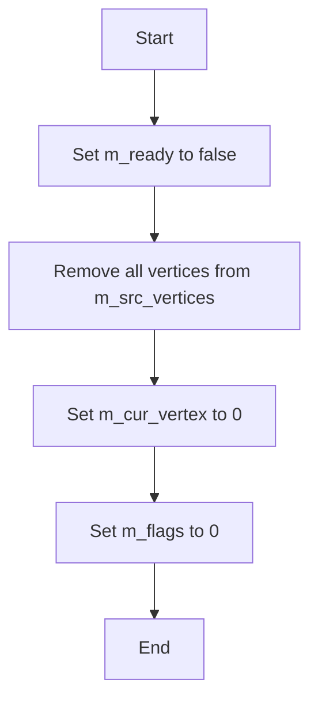
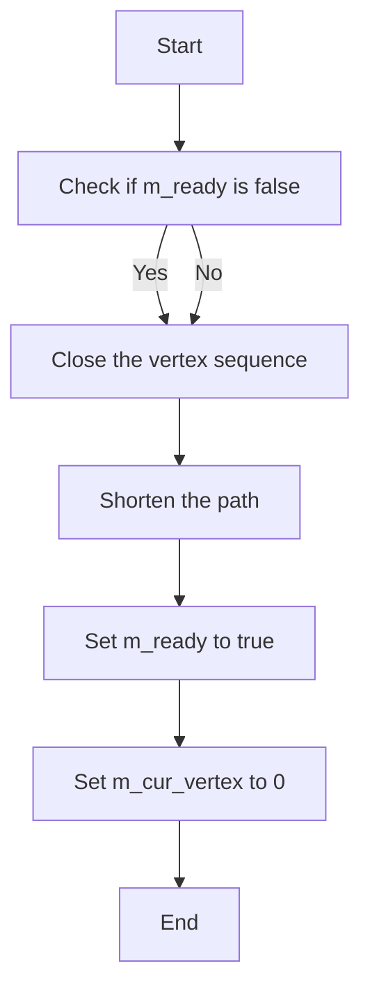
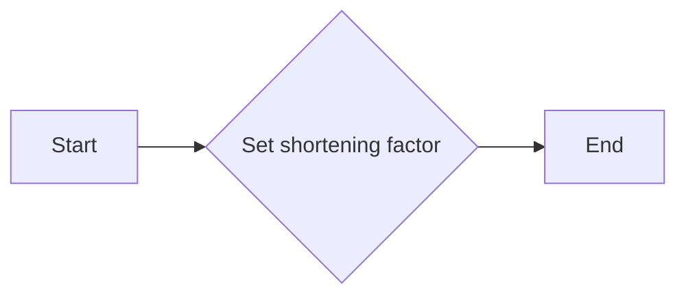
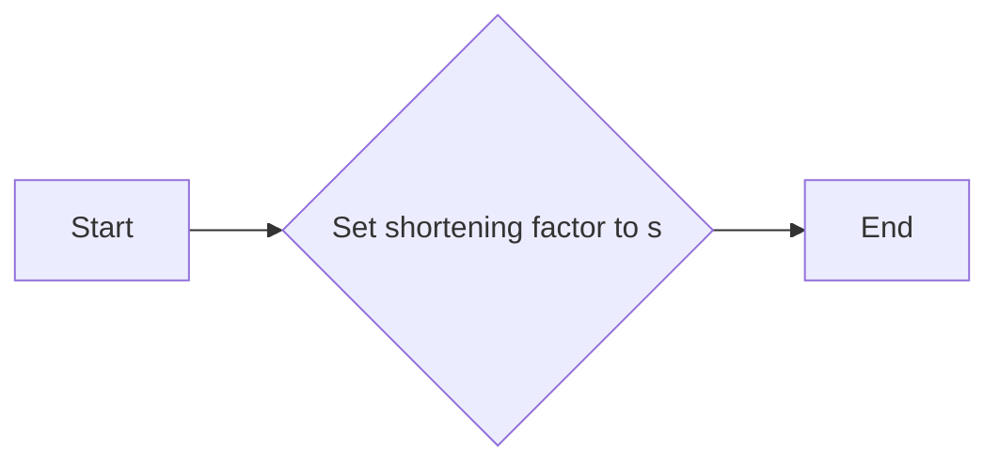
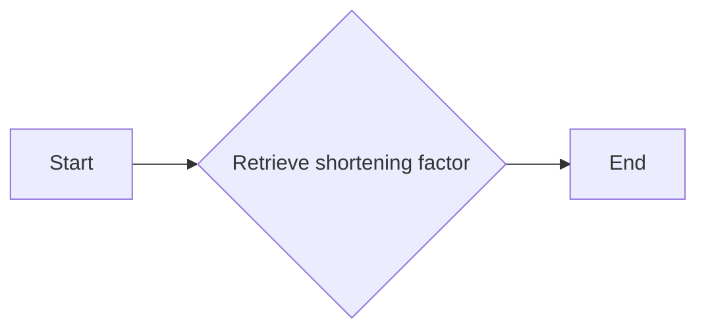
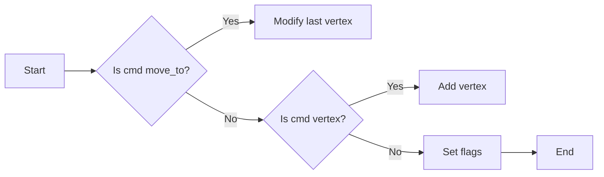
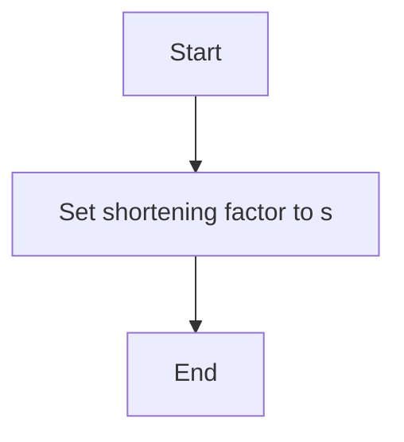
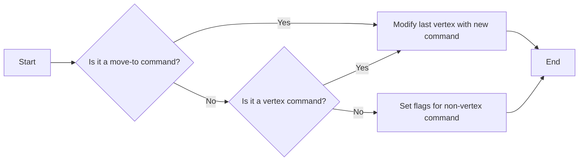
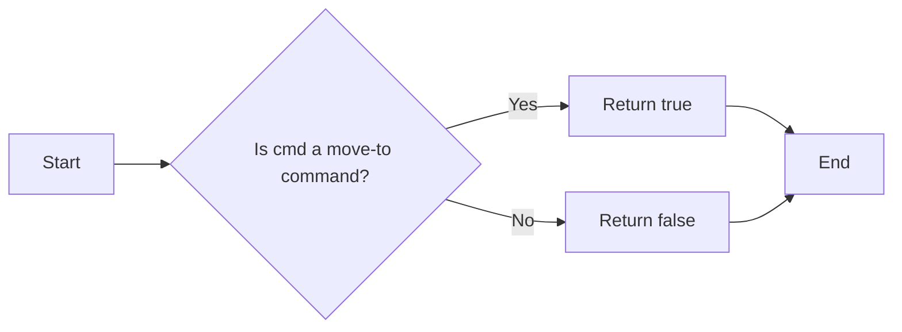
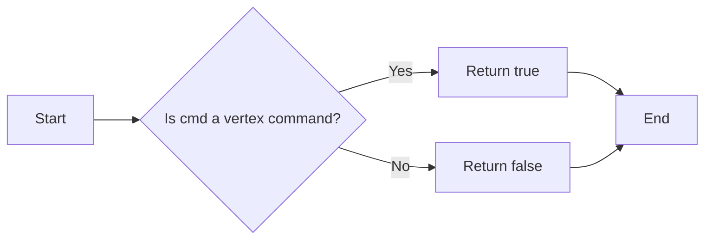

# `matplotlib\extern\agg24-svn\include\agg_vcgen_vertex_sequence.h` 详细设计文档

This code defines a vertex generator class for creating and managing vertex sequences used in vector graphics rendering. It provides methods to add vertices, remove all vertices, rewind the vertex sequence, and retrieve vertices with commands.

## 整体流程

```mermaid
graph TD
    A[Start] --> B[Create instance of vcgen_vertex_sequence]
    B --> C[Add vertices to the sequence]
    C --> D[Call rewind() to prepare the sequence]
    D --> E[Retrieve vertices using vertex() method]
    E --> F[End]
```

## 类结构

```
vcgen_vertex_sequence (Vertex Generator)
├── vertex_dist_cmd (Vertex command)
├── vertex_sequence (Vertex storage)
└── agg (Namespace)
```

## 全局变量及字段


### `m_flags`
    
Holds flags related to the path's state.

类型：`unsigned`
    


### `m_cur_vertex`
    
Current vertex index in the vertex sequence.

类型：`unsigned`
    


### `m_shorten`
    
Distance to shorten the path vertices.

类型：`double`
    


### `m_ready`
    
Indicates if the vertex sequence is ready for iteration.

类型：`bool`
    


### `m_src_vertices`
    
Vertex storage for the vertex sequence.

类型：`vertex_storage`
    


### `vertex_dist_cmd.x`
    
X coordinate of the vertex.

类型：`double`
    


### `vertex_dist_cmd.y`
    
Y coordinate of the vertex.

类型：`double`
    


### `vertex_dist_cmd.cmd`
    
Command associated with the vertex.

类型：`unsigned`
    


### `vertex_sequence.elements`
    
Pointer to the elements of the vertex sequence.

类型：`vertex_type*`
    


### `vertex_sequence.size`
    
Size of the vertex sequence.

类型：`unsigned`
    
    

## 全局函数及方法


### `vcgen_vertex_sequence::remove_all()`

清除所有顶点，重置状态。

参数：

- 无

返回值：无

#### 流程图



#### 带注释源码

```cpp
inline void vcgen_vertex_sequence::remove_all()
{
    m_ready = false;
    m_src_vertices.remove_all(); // Remove all vertices from the vertex storage
    m_cur_vertex = 0; // Reset current vertex index
    m_flags = 0; // Reset flags
}
```


### `vcgen_vertex_sequence::add_vertex(double, double, unsigned)`

This method adds a vertex to the vertex sequence. It takes a position `(x, y)` and a command `cmd` that specifies the type of vertex to add.

参数：

- `x`：`double`，The x-coordinate of the vertex position.
- `y`：`double`，The y-coordinate of the vertex position.
- `cmd`：`unsigned`，The command that specifies the type of vertex to add.

返回值：`void`，No value is returned.

#### 流程图

```mermaid
graph LR
A[Start] --> B{Is cmd a move-to command?}
B -- Yes --> C[Modify last vertex with (x, y, cmd)]
B -- No --> D{Is cmd a vertex command?}
D -- Yes --> E[Add vertex with (x, y, cmd)]
D -- No --> F[Set flags with cmd]
F --> G[End]
```

#### 带注释源码

```cpp
inline void vcgen_vertex_sequence::add_vertex(double x, double y, unsigned cmd)
{
    m_ready = false;
    if(is_move_to(cmd))
    {
        m_src_vertices.modify_last(vertex_dist_cmd(x, y, cmd));
    }
    else
    {
        if(is_vertex(cmd))
        {
            m_src_vertices.add(vertex_dist_cmd(x, y, cmd));
        }
        else
        {
            m_flags = cmd & path_flags_mask;
        }
    }
}
```


### `vcgen_vertex_sequence::rewind(unsigned path_id)`

重置顶点序列生成器到初始状态，准备重新遍历顶点。

参数：

- `path_id`：`unsigned`，用于标识路径的ID，但在当前实现中未使用。

返回值：`void`，无返回值。

#### 流程图



#### 带注释源码

```cpp
inline void vcgen_vertex_sequence::rewind(unsigned) 
{ 
    if(!m_ready)
    {
        m_src_vertices.close(is_closed(m_flags));
        shorten_path(m_src_vertices, m_shorten, get_close_flag(m_flags));
    }
    m_ready = true;
    m_cur_vertex = 0; 
}
```


### `vcgen_vertex_sequence::vertex(double* x, double* y)`

This function retrieves the next vertex from the vertex sequence and stores its coordinates in the provided pointers.

参数：

- `x`：`double*`，A pointer to a double where the x-coordinate of the vertex will be stored.
- `y`：`double*`，A pointer to a double where the y-coordinate of the vertex will be stored.

返回值：`unsigned`，The command associated with the vertex or a special command indicating the end of the path or a stop condition.

#### 流程图

```mermaid
graph TD
    A[Start] --> B{Is m_ready false?}
    B -- Yes --> C[Call rewind()]
    B -- No --> D[Get vertex from m_src_vertices]
    D --> E[Store x and y coordinates]
    E --> F[Increment m_cur_vertex]
    F --> G{Is m_cur_vertex equal to m_src_vertices.size?}
    G -- Yes --> H[Return path_cmd_end_poly | m_flags]
    G -- No --> I{Is m_cur_vertex greater than m_src_vertices.size?}
    I -- Yes --> J[Return path_cmd_stop]
    I -- No --> K[Return v.cmd]
    K --> L[End]
```

#### 带注释源码

```cpp
inline unsigned vcgen_vertex_sequence::vertex(double* x, double* y)
{
    if(!m_ready)
    {
        rewind(0);
    }

    if(m_cur_vertex == m_src_vertices.size())
    {
        ++m_cur_vertex;
        return path_cmd_end_poly | m_flags;
    }

    if(m_cur_vertex > m_src_vertices.size())
    {
        return path_cmd_stop;
    }

    vertex_type& v = m_src_vertices[m_cur_vertex++];
    *x = v.x;
    *y = v.y;
    return v.cmd;
}
```


### `vcgen_vertex_sequence::shorten(double s)`

This method sets the shortening factor for the vertex sequence. It is used to reduce the number of vertices in the sequence by a specified factor, which can be useful for optimizing rendering performance.

参数：

- `s`：`double`，The shortening factor. It represents the ratio of the original vertex distance to the new vertex distance.

返回值：`void`，This method does not return a value.

#### 流程图



#### 带注释源码

```cpp
void vcgen_vertex_sequence::shorten(double s) {
    m_shorten = s; // Set the shortening factor to the provided value
}
```


### `vcgen_vertex_sequence::shorten(double s)`

This method sets the shortening factor for the vertex sequence.

参数：

- `s`：`double`，The shortening factor to apply to the vertex sequence. This value determines how much the vertices are moved closer together.

返回值：`void`，No return value. The method modifies the internal state of the `vcgen_vertex_sequence` object.

#### 流程图



#### 带注释源码

```cpp
void vcgen_vertex_sequence::shorten(double s) 
{
    m_shorten = s; // Set the shortening factor to the provided value
}
```

### `vcgen_vertex_sequence::shorten() const`

This method retrieves the current shortening factor for the vertex sequence.

参数：

- None

返回值：`double`，The current shortening factor applied to the vertex sequence.

#### 流程图



#### 带注释源码

```cpp
double vcgen_vertex_sequence::shorten() const 
{
    return m_shorten; // Return the current shortening factor
}
``` 


### `vcgen_vertex_sequence::add_vertex`

This method adds a vertex to the vertex sequence. It takes a position (x, y) and a command indicating the type of vertex (move to, line, or close).

参数：

- `x`：`double`，The x-coordinate of the vertex position.
- `y`：`double`，The y-coordinate of the vertex position.
- `cmd`：`unsigned`，The command indicating the type of vertex to add.

返回值：`void`，No return value.

#### 流程图



#### 带注释源码

```cpp
inline void vcgen_vertex_sequence::add_vertex(double x, double y, unsigned cmd)
{
    m_ready = false;
    if(is_move_to(cmd))
    {
        m_src_vertices.modify_last(vertex_dist_cmd(x, y, cmd));
    }
    else
    {
        if(is_vertex(cmd))
        {
            m_src_vertices.add(vertex_dist_cmd(x, y, cmd));
        }
        else
        {
            m_flags = cmd & path_flags_mask;
        }
    }
}
```


### `vcgen_vertex_sequence::remove_all()`

移除所有顶点，重置状态。

参数：

- 无

返回值：无

#### 流程图


#### 带注释源码

```cpp
inline void vcgen_vertex_sequence::remove_all()
{
    m_ready = false;
    m_src_vertices.remove_all(); // Remove all vertices from the vertex storage
    m_cur_vertex = 0; // Reset current vertex index
    m_flags = 0; // Reset flags
}
```


### `vcgen_vertex_sequence::add_vertex(double, double, unsigned)`

This method adds a vertex to the vertex sequence. It takes a position `(x, y)` and a command `cmd` that specifies the type of vertex to add.

参数：

- `x`：`double`，The x-coordinate of the vertex position.
- `y`：`double`，The y-coordinate of the vertex position.
- `cmd`：`unsigned`，The command that specifies the type of vertex to add.

返回值：`void`，No return value.

#### 流程图

```mermaid
graph LR
A[Start] --> B{Is cmd a move-to command?}
B -- Yes --> C[Modify last vertex with (x, y, cmd)]
B -- No --> D{Is cmd a vertex command?}
D -- Yes --> E[Add vertex with (x, y, cmd)]
D -- No --> F[Set flags with cmd]
F --> G[End]
```

#### 带注释源码

```cpp
inline void vcgen_vertex_sequence::add_vertex(double x, double y, unsigned cmd)
{
    m_ready = false;
    if(is_move_to(cmd))
    {
        m_src_vertices.modify_last(vertex_dist_cmd(x, y, cmd));
    }
    else
    {
        if(is_vertex(cmd))
        {
            m_src_vertices.add(vertex_dist_cmd(x, y, cmd));
        }
        else
        {
            m_flags = cmd & path_flags_mask;
        }
    }
}
```


### `vcgen_vertex_sequence::rewind(unsigned path_id)`

重置顶点生成器到序列的开始，准备进行迭代。

参数：

- `path_id`：`unsigned`，用于标识路径的ID，但在当前实现中未使用。

返回值：`void`，无返回值。

#### 流程图


#### 带注释源码

```cpp
inline void vcgen_vertex_sequence::rewind(unsigned) 
{ 
    if(!m_ready)
    {
        m_src_vertices.close(is_closed(m_flags));
        shorten_path(m_src_vertices, m_shorten, get_close_flag(m_flags));
    }
    m_ready = true;
    m_cur_vertex = 0; 
}
```


### `vcgen_vertex_sequence::vertex(double* x, double* y)`

This method retrieves the next vertex from the vertex sequence and stores its coordinates in the provided pointers.

参数：

- `x`：`double*`，A pointer to a double where the x-coordinate of the vertex will be stored.
- `y`：`double*`，A pointer to a double where the y-coordinate of the vertex will be stored.

返回值：`unsigned`，The command associated with the vertex or a special command indicating the end of the path or a stop condition.

#### 流程图

```mermaid
graph TD
    A[Start] --> B{Is m_ready false?}
    B -- Yes --> C[Call rewind()]
    B -- No --> D[Get vertex from m_src_vertices]
    D --> E[Store x and y coordinates]
    E --> F[Return vertex command]
    F --> G[End]
```

#### 带注释源码

```cpp
inline unsigned vcgen_vertex_sequence::vertex(double* x, double* y)
{
    if(!m_ready)
    {
        rewind(0);
    }

    if(m_cur_vertex == m_src_vertices.size())
    {
        ++m_cur_vertex;
        return path_cmd_end_poly | m_flags;
    }

    if(m_cur_vertex > m_src_vertices.size())
    {
        return path_cmd_stop;
    }

    vertex_type& v = m_src_vertices[m_cur_vertex++];
    *x = v.x;
    *y = v.y;
    return v.cmd;
}
```


### `vcgen_vertex_sequence::shorten(double s)`

This method sets the shortening factor for the vertex sequence. It is used to control the degree of simplification applied to the path.

参数：

- `s`：`double`，The shortening factor. It determines how much the path should be simplified.

返回值：`void`，No return value.

#### 流程图



#### 带注释源码

```cpp
void vcgen_vertex_sequence::shorten(double s) {
    m_shorten = s; // Set the shortening factor to the provided value
}
```


### vcgen_vertex_sequence::vertex

This function is part of the Vertex Source Interface of the `vcgen_vertex_sequence` class. It retrieves the next vertex from the vertex sequence, adjusting for any shortening that has been specified.

参数：

- `x`：`double*`，A pointer to a double where the x-coordinate of the vertex will be stored.
- `y`：`double*`，A pointer to a double where the y-coordinate of the vertex will be stored.

返回值：`unsigned`，The command associated with the vertex, which indicates the type of vertex (e.g., move to, line to, close path, etc.).

#### 流程图

```mermaid
graph TD
    A[Start] --> B{Is m_ready false?}
    B -- Yes --> C[Call rewind()]
    B -- No --> D[Get vertex from m_src_vertices]
    C --> E[Set m_ready to true]
    D --> F[Set *x to v.x and *y to v.y]
    D --> G[Increment m_cur_vertex]
    F --> H[Return v.cmd]
    G --> I[End]
```

#### 带注释源码

```cpp
inline unsigned vcgen_vertex_sequence::vertex(double* x, double* y)
{
    if(!m_ready)
    {
        rewind(0);
    }

    if(m_cur_vertex == m_src_vertices.size())
    {
        ++m_cur_vertex;
        return path_cmd_end_poly | m_flags;
    }

    if(m_cur_vertex > m_src_vertices.size())
    {
        return path_cmd_stop;
    }

    vertex_type& v = m_src_vertices[m_cur_vertex++];
    *x = v.x;
    *y = v.y;
    return v.cmd;
}
```


### `vcgen_vertex_sequence::remove_all()`

移除所有顶点，重置状态。

参数：

- 无

返回值：无

#### 流程图


#### 带注释源码

```cpp
inline void vcgen_vertex_sequence::remove_all()
{
    m_ready = false;
    m_src_vertices.remove_all(); // Remove all vertices from the vertex storage
    m_cur_vertex = 0; // Reset current vertex index
    m_flags = 0; // Reset flags
}
``` 


### `vcgen_vertex_sequence::modify_last(vertex_dist_cmd)`

修改序列中的最后一个顶点。

参数：

- `vertex_dist_cmd`：`vertex_dist_cmd`，表示要修改的顶点信息，包括位置和命令。

返回值：无

#### 流程图



#### 带注释源码

```cpp
inline void vcgen_vertex_sequence::add_vertex(double x, double y, unsigned cmd)
{
    m_ready = false;
    if(is_move_to(cmd))
    {
        m_src_vertices.modify_last(vertex_dist_cmd(x, y, cmd));
    }
    else
    {
        if(is_vertex(cmd))
        {
            m_src_vertices.add(vertex_dist_cmd(x, y, cmd));
        }
        else
        {
            m_flags = cmd & path_flags_mask;
        }
    }
}
```


### `vertex_dist_cmd`

表示顶点信息的数据结构。

参数：

- `x`：`double`，顶点的x坐标。
- `y`：`double`，顶点的y坐标。
- `cmd`：`unsigned`，顶点的命令。

返回值：无

#### 流程图


#### 带注释源码

```cpp
struct vertex_dist_cmd
{
    double x;
    double y;
    unsigned cmd;

    vertex_dist_cmd(double x, double y, unsigned cmd) : x(x), y(y), cmd(cmd) {}
};
```


### `is_move_to`

检查命令是否为移动到新位置的命令。

参数：

- `cmd`：`unsigned`，要检查的命令。

返回值：`bool`，如果命令是移动到新位置的命令，则返回`true`，否则返回`false`。

#### 流程图



#### 带注释源码

```cpp
inline bool is_move_to(unsigned cmd)
{
    return cmd == path_cmd_move_to;
}
```


### `is_vertex`

检查命令是否为顶点命令。

参数：

- `cmd`：`unsigned`，要检查的命令。

返回值：`bool`，如果命令是顶点命令，则返回`true`，否则返回`false`。

#### 流程图



#### 带注释源码

```cpp
inline bool is_vertex(unsigned cmd)
{
    return cmd == path_cmd_line_to || cmd == path_cmd_quadratic_to || cmd == path_cmd_cubic_to;
}
```


### `path_flags_mask`

用于从命令中提取路径标志的掩码。

参数：无

返回值：`unsigned`，路径标志掩码。

#### 流程图

```mermaid
graph LR
A[Start] --> B[Return path_flags_mask]
B --> C[End]
```

#### 带注释源码

```cpp
const unsigned path_flags_mask = 0x00FF;
```


### `m_ready`

表示顶点序列是否已准备好。

参数：无

返回值：`bool`，如果顶点序列已准备好，则返回`true`，否则返回`false`。

#### 流程图

```mermaid
graph LR
A[Start] --> B{Is m_ready true?}
B -- Yes --> C[Return true]
B -- No --> D[Return false]
C --> E[End]
D --> E
```

#### 带注释源码

```cpp
bool m_ready;
```


### `m_src_vertices`

顶点序列存储。

参数：无

返回值：`vertex_storage`，顶点序列存储。

#### 流程图

```mermaid
graph LR
A[Start] --> B[Return m_src_vertices]
B --> C[End]
```

#### 带注释源码

```cpp
vertex_storage m_src_vertices;
```


### `m_flags`

表示路径标志。

参数：无

返回值：`unsigned`，路径标志。

#### 流程图

```mermaid
graph LR
A[Start] --> B[Return m_flags]
B --> C[End]
```

#### 带注释源码

```cpp
unsigned m_flags;
```


### `m_cur_vertex`

当前顶点的索引。

参数：无

返回值：`unsigned`，当前顶点的索引。

#### 流程图

```mermaid
graph LR
A[Start] --> B[Return m_cur_vertex]
B --> C[End]
```

#### 带注释源码

```cpp
unsigned m_cur_vertex;
```


### `m_shorten`

表示路径缩短的量。

参数：无

返回值：`double`，路径缩短的量。

#### 流程图

```mermaid
graph LR
A[Start] --> B[Return m_shorten]
B --> C[End]
```

#### 带注释源码

```cpp
double m_shorten;
```


### `m_ready`

表示顶点序列是否已准备好。

参数：无

返回值：`bool`，如果顶点序列已准备好，则返回`true`，否则返回`false`。

#### 流程图

```mermaid
graph LR
A[Start] --> B{Is m_ready true?}
B -- Yes --> C[Return true]
B -- No --> D[Return false]
C --> E[End]
D --> E
```

#### 带注释源码

```cpp
bool m_ready;
```


### `remove_all`

从顶点序列中移除所有顶点。

参数：无

返回值：无

#### 流程图

```mermaid
graph LR
A[Start] --> B[Set m_ready to false]
B --> C[Remove all vertices from m_src_vertices]
B --> D[Set m_cur_vertex to 0]
B --> E[Set m_flags to 0]
C --> F[End]
D --> F
E --> F
```

#### 带注释源码

```cpp
inline void vcgen_vertex_sequence::remove_all()
{
    m_ready = false;
    m_src_vertices.remove_all();
    m_cur_vertex = 0;
    m_flags = 0;
}
```


### `add_vertex`

向顶点序列添加顶点。

参数：

- `x`：`double`，顶点的x坐标。
- `y`：`double`，顶点的y坐标。
- `cmd`：`unsigned`，顶点的命令。

返回值：无

#### 流程图

```mermaid
graph LR
A[Start] --> B{Is cmd a move-to command?}
B -- Yes --> C[Modify last vertex with new command]
B -- No --> D{Is cmd a vertex command?}
D -- Yes --> E[Add vertex to m_src_vertices]
D -- No --> F[Set flags for non-vertex command]
C --> G[End]
E --> G
F --> G
```

#### 带注释源码

```cpp
inline void vcgen_vertex_sequence::add_vertex(double x, double y, unsigned cmd)
{
    m_ready = false;
    if(is_move_to(cmd))
    {
        m_src_vertices.modify_last(vertex_dist_cmd(x, y, cmd));
    }
    else
    {
        if(is_vertex(cmd))
        {
            m_src_vertices.add(vertex_dist_cmd(x, y, cmd));
        }
        else
        {
            m_flags = cmd & path_flags_mask;
        }
    }
}
```


### `rewind`

重置顶点序列的当前顶点索引。

参数：

- `path_id`：`unsigned`，路径标识符。

返回值：无

#### 流程图

```mermaid
graph LR
A[Start] --> B{Is m_ready false?}
B -- Yes --> C[Close m_src_vertices]
B -- No --> D[Shorten path in m_src_vertices]
C --> E[Set m_ready to true]
C --> F[Set m_cur_vertex to 0]
D --> E
D --> F
E --> G[End]
```

#### 带注释源码

```cpp
inline void vcgen_vertex_sequence::rewind(unsigned)
{ 
    if(!m_ready)
    {
        m_src_vertices.close(is_closed(m_flags));
        shorten_path(m_src_vertices, m_shorten, get_close_flag(m_flags));
    }
    m_ready = true;
    m_cur_vertex = 0; 
}
```


### `vertex`

从顶点序列中获取下一个顶点。

参数：

- `x`：`double*`，用于存储顶点x坐标的指针。
- `y`：`double*`，用于存储顶点y坐标的指针。

返回值：`unsigned`，顶点的命令。

#### 流程图

```mermaid
graph LR
A[Start] --> B{Is m_ready false?}
B -- Yes --> C[Call rewind()]
B -- No --> D[Check if m_cur_vertex is equal to m_src_vertices.size()]
D -- Yes --> E[Return path_cmd_end_poly | m_flags]
D -- No --> F[Check if m_cur_vertex is greater than m_src_vertices.size()]
F -- Yes --> G[Return path_cmd_stop]
F -- No --> H[Get vertex from m_src_vertices[m_cur_vertex]]
H --> I[Increment m_cur_vertex]
I --> J[Return vertex command]
J --> K[End]
```

#### 带注释源码

```cpp
inline unsigned vcgen_vertex_sequence::vertex(double* x, double* y)
{
    if(!m_ready)
    {
        rewind(0);
    }

    if(m_cur_vertex == m_src_vertices.size())
    {
        ++m_cur_vertex;
        return path_cmd_end_poly | m_flags;
    }

    if(m_cur_vertex > m_src_vertices.size())
    {
        return path_cmd_stop;
    }

    vertex_type& v = m_src_vertices[m_cur_vertex++];
    *x = v.x;
    *y = v.y;
    return v.cmd;
}
```


### `shorten_path`

缩短路径。

参数：

- `vertices`：`vertex_sequence`，顶点序列。
- `shorten`：`double`，路径缩短的量。
- `close_flag`：`unsigned`，关闭标志。

返回值：无

#### 流程图

```mermaid
graph LR
A[Start] --> B[Shorten path in vertices by amount shorten]
B --> C[End]
```

#### 带注释源码

```cpp
void shorten_path(vertex_sequence& vertices, double shorten, unsigned close_flag)
{
    // Implementation of path shortening
}
```


### `is_closed`

检查路径是否闭合。

参数：

- `flags`：`unsigned`，路径标志。

返回值：`bool`，如果路径闭合，则返回`true`，否则返回`false`。

#### 流程图

```mermaid
graph LR
A[Start] --> B{Is close_flag set?}
B -- Yes --> C[Return true]
B -- No --> D[Return false]
C --> E[End]
D --> E
```

#### 带注释源码

```cpp
inline bool is_closed(unsigned flags)
{
    return flags & path_close_flag;
}
```


### `get_close_flag`

获取关闭标志。

参数：

- `flags`：`unsigned`，路径标志。

返回值：`unsigned`，关闭标志。

#### 流程图

```mermaid
graph LR
A[Start] --> B[Return close_flag]
B --> C[End]
```

#### 带注释源码

```cpp
inline unsigned get_close_flag(unsigned flags)
{
    return flags & path_close_flag;
}
```


### `path_flags_mask`

用于从命令中提取路径标志的掩码。

参数：无

返回值：`unsigned`，路径标志掩码。

#### 流程图

```mermaid
graph LR
A[Start] --> B[Return path_flags_mask]
B --> C[End]
```

#### 带注释源码

```cpp
const unsigned path_flags_mask = 0x00FF;
```


### `path_cmd_move_to`

移动到新位置的命令。

参数：无

返回值：`unsigned`，移动到新位置的命令。

#### 流程图

```mermaid
graph LR
A[Start] --> B[Return path_cmd_move_to]
B --> C[End]
```

#### 带注释源码

```cpp
const unsigned path_cmd_move_to = 0x0001;
```


### `path_cmd_line_to`

直线到命令。

参数：无

返回值：`unsigned`，直线到命令。

#### 流程图

```mermaid
graph LR
A[Start] --> B[Return path_cmd_line_to]
B --> C[End]
```

#### 带注释源码

```cpp
const unsigned path_cmd_line_to = 0x0002;
```


### `path_cmd_quadratic_to`

二次贝塞尔曲线到命令。

参数：无

返回值：`unsigned`，二次贝塞尔曲线到命令。

#### 流程图

```mermaid
graph LR
A[Start] --> B[Return path_cmd_quadratic_to]
B --> C[End]
```

#### 带注释源码

```cpp
const unsigned path_cmd_quadratic_to = 0x0004;
```


### `path_cmd_cubic_to`

三次贝塞尔曲线到命令。

参数：无

返回值：`unsigned`，三次贝塞尔曲线到命令。

#### 流程图

```mermaid
graph LR
A[Start] --> B[Return path_cmd_cubic_to]
B --> C[End]
```

#### 带注释源码

```cpp
const unsigned path_cmd_cubic_to = 0x0008;
```


### `path_cmd_end_poly`

结束多边形命令。

参数：无

返回值：`unsigned`，结束多边形命令。

#### 流程图

```mermaid
graph LR
A[Start] --> B[Return path_cmd_end_poly]
B --> C[End]
```

#### 带注释源码

```cpp
const unsigned path_cmd_end_poly = 0x0010;
```


### `path_cmd_stop`

停止命令。

参数：无

返回值：`unsigned`，停止命令。

#### 流程图

```mermaid
graph LR
A[Start] --> B[Return path_cmd_stop]
B --> C[End]
```

#### 带注释源码

```cpp
const unsigned path_cmd_stop = 0x0020;
```


### `path_close_flag`

路径关闭标志。

参数：无

返回值：`unsigned`，路径关闭标志。

#### 流程图

```mermaid
graph LR
A[Start] --> B[Return path_close_flag]
B --> C[End]
```

#### 带注释源码

```cpp
const unsigned path_close_flag = 0x0100;
```


### `vertex_sequence`

顶点序列。

参数：无

返回值：`vertex_sequence`，顶点序列。

#### 流程图

```mermaid
graph LR
A[Start] --> B[Return vertex_sequence]
B --> C[End]
```

#### 带注释源码

```cpp
template<typename vertex_type, size_t storage_size>
class vertex_sequence
{
public:
    // Implementation of vertex_sequence
};
```


### `remove_all`

从顶点序列中移除所有顶点。

参数：无

返回值：无

#### 流程图

```mermaid
graph LR
A[Start] --> B[Remove all vertices from vertex_sequence]
B --> C[End]
```

#### 带注释源码

```cpp
template<typename vertex_type, size_t storage_size>
inline void vertex_sequence<vertex_type, storage_size>::remove_all()
{
    // Implementation of remove_all
}
```


### `close`

关闭顶点序列。

参数：

- `close_flag`：`unsigned`，关闭标志。

返回值：无

#### 流程图

```mermaid
graph LR
A[Start] --> B[Close vertex_sequence with close_flag]
B --> C[End]
```

#### 带注释源码

```cpp
template<typename vertex_type, size_t storage_size>
inline void vertex_sequence<vertex_type, storage_size>::close(unsigned close_flag)
{
    // Implementation of close
}
```


### `shorten_path`

缩短路径。

参数：

- `vertices`：`vertex_sequence`，顶点序列。
- `shorten`：`double`，路径缩短的量。
- `close_flag`：`unsigned`，关闭标志。

返回值：无

#### 流程图

```mermaid
graph LR
A[Start] --> B[Shorten path in vertices by amount shorten]
B --> C[End]
```

#### 带注释源码

```cpp
template<typename vertex_type, size_t storage_size>
inline void vertex_sequence<vertex_type, storage_size>::shorten_path(double shorten, unsigned close_flag)
{
    // Implementation of shorten_path
}
```


### `size`

返回顶点序列的大小。

参数：无

返回值：`size_t`，顶点序列的大小。

#### 流程图

```mermaid
graph LR
A[Start] --> B[Return size of vertex_sequence]
B --> C[End]
```

#### 带注释源码

```cpp
template<typename vertex_type, size_t storage_size>
inline size_t vertex_sequence<vertex_type, storage_size>::size() const
{
    // Implementation of size
}
```


### `operator[]`

访问顶点序列中的顶点。

参数：

- `index`：`size_t`，顶点的索引。

返回值：`vertex_type&`，顶点序列中的顶点。

#### 流程图

```mermaid
graph LR
A[Start] --> B[Return vertex at index from vertex_sequence]
B


### `vcgen_vertex_sequence::add_vertex`

添加顶点到顶点序列。

参数：

- `x`：`double`，顶点的x坐标。
- `y`：`double`，顶点的y坐标。
- `cmd`：`unsigned`，顶点命令。

返回值：`void`，无返回值。

#### 流程图

```mermaid
graph TD
    A[Start] --> B{Is Move To?}
    B -- Yes --> C[Modify Last Vertex]
    B -- No --> D{Is Vertex?}
    D -- Yes --> E[Add Vertex]
    D -- No --> F[Set Flags]
    E --> G[End]
    F --> G
    C --> G
```

#### 带注释源码

```cpp
inline void vcgen_vertex_sequence::add_vertex(double x, double y, unsigned cmd)
{
    m_ready = false;
    if(is_move_to(cmd))
    {
        m_src_vertices.modify_last(vertex_dist_cmd(x, y, cmd));
    }
    else
    {
        if(is_vertex(cmd))
        {
            m_src_vertices.add(vertex_dist_cmd(x, y, cmd));
        }
        else
        {
            m_flags = cmd & path_flags_mask;
        }
    }
}
```


### `vcgen_vertex_sequence::rewind(unsigned path_id)`

Rewind the vertex sequence to the beginning of the path.

参数：

- `path_id`：`unsigned`，The identifier of the path. This parameter is not used in this implementation.

返回值：`void`，No return value.

#### 流程图

```mermaid
graph TD
    A[Start] --> B[Check if m_ready is false]
    B -->|Yes| C[Call m_src_vertices.close(is_closed(m_flags))]
    B -->|No| C
    C --> D[Call shorten_path(m_src_vertices, m_shorten, get_close_flag(m_flags))]
    D --> E[Set m_ready to true]
    E --> F[Set m_cur_vertex to 0]
    F --> G[End]
```

#### 带注释源码

```cpp
inline void vcgen_vertex_sequence::rewind(unsigned) 
{ 
    if(!m_ready)
    {
        m_src_vertices.close(is_closed(m_flags));
        shorten_path(m_src_vertices, m_shorten, get_close_flag(m_flags));
    }
    m_ready = true;
    m_cur_vertex = 0; 
}
```


### `vcgen_vertex_sequence::rewind(unsigned path_id)`

Rewind the vertex sequence to the beginning of the path.

参数：

- `path_id`：`unsigned`，The identifier of the path to rewind. This parameter is not used in this implementation.

返回值：`void`，No return value.

#### 流程图

```mermaid
graph TD
    A[Start] --> B[Check if m_ready is false]
    B -->|Yes| C[Close the vertex sequence]
    C -->|Yes| D[Shorten the path]
    D -->|Yes| E[Set m_ready to true]
    D -->|No| F[Set m_ready to true]
    E --> G[Set m_cur_vertex to 0]
    G --> H[End]
```

#### 带注释源码

```cpp
inline void vcgen_vertex_sequence::rewind(unsigned) 
{ 
    if(!m_ready)
    {
        m_src_vertices.close(is_closed(m_flags));
        shorten_path(m_src_vertices, m_shorten, get_close_flag(m_flags));
    }
    m_ready = true;
    m_cur_vertex = 0; 
}
```


### `vcgen_vertex_sequence::vertex`

获取当前顶点的坐标和命令。

参数：

- `x`：`double*`，指向用于存储当前顶点x坐标的变量的指针。
- `y`：`double*`，指向用于存储当前顶点y坐标的变量的指针。

返回值：`unsigned`，返回当前顶点的命令。

#### 流程图

```mermaid
graph TD
    A[Start] --> B{Check m_ready}
    B -- Yes --> C[Get vertex from m_src_vertices]
    B -- No --> D[Call rewind()]
    D --> C
    C --> E[Set *x and *y with vertex coordinates]
    C --> F[Return vertex command]
    E --> G[End]
    F --> G
```

#### 带注释源码

```cpp
inline unsigned vcgen_vertex_sequence::vertex(double* x, double* y)
{
    if(!m_ready)
    {
        rewind(0);
    }

    if(m_cur_vertex == m_src_vertices.size())
    {
        ++m_cur_vertex;
        return path_cmd_end_poly | m_flags;
    }

    if(m_cur_vertex > m_src_vertices.size())
    {
        return path_cmd_stop;
    }

    vertex_type& v = m_src_vertices[m_cur_vertex++];
    *x = v.x;
    *y = v.y;
    return v.cmd;
}
```

## 关键组件


### 张量索引与惰性加载

张量索引与惰性加载是代码中用于高效访问和操作大型数据结构（如多边形顶点序列）的关键组件。它允许在需要时才计算或加载数据，从而减少内存使用和提高性能。

### 反量化支持

反量化支持是代码中用于处理和转换量化数据的关键组件。它确保量化数据在处理过程中保持准确性和一致性。

### 量化策略

量化策略是代码中用于优化数据表示和存储的关键组件。它通过减少数据精度来减少内存使用，同时保持足够的精度以满足应用需求。


## 问题及建议


### 已知问题

-   **代码复杂度**：代码中存在多个内联函数和复杂的逻辑，这可能导致代码难以理解和维护。
-   **错误处理**：代码中没有明显的错误处理机制，例如在`vertex`方法中，如果`m_cur_vertex`超出范围，会返回`path_cmd_stop`，但没有进一步的错误处理。
-   **性能优化**：`rewind`方法中调用`shorten_path`可能是一个性能瓶颈，特别是在处理大量顶点时。
-   **代码重用**：`vertex_dist_cmd`类和`vertex_sequence`模板的使用可能限制了代码的通用性和重用性。

### 优化建议

-   **重构代码**：将复杂的逻辑分解为更小的函数，以提高代码的可读性和可维护性。
-   **增加错误处理**：在关键操作中增加错误检查和异常处理，确保程序的健壮性。
-   **性能优化**：考虑使用更高效的数据结构或算法来处理顶点序列，例如使用空间分割技术来减少`shorten_path`的调用次数。
-   **代码重用**：将`vertex_dist_cmd`和`vertex_sequence`设计为更通用的模板，以便在多个项目中重用。
-   **文档化**：为代码添加详细的文档注释，包括每个函数的参数、返回值和功能描述，以便其他开发者更容易理解和使用代码。


## 其它


### 设计目标与约束

- 设计目标：实现一个高效的顶点生成器，用于处理和生成顶点序列，支持路径的缩短和闭合操作。
- 约束条件：保持代码的简洁性和可维护性，同时确保高效的性能。

### 错误处理与异常设计

- 错误处理：通过检查状态标志和返回特定的错误代码来处理潜在的错误情况。
- 异常设计：未使用异常处理机制，而是通过返回特定的错误代码来指示错误。

### 数据流与状态机

- 数据流：数据从外部输入（如坐标和命令），经过处理（如添加顶点、缩短路径），然后输出为顶点序列。
- 状态机：类内部维护多个状态，如`m_ready`表示顶点序列是否准备好，`m_flags`存储路径标志。

### 外部依赖与接口契约

- 外部依赖：依赖于`agg_basics.h`、`agg_vertex_sequence.h`和`agg_shorten_path.h`头文件。
- 接口契约：提供`vertex_dist_cmd`和`vertex_sequence`类型的定义，以及`remove_all`、`add_vertex`、`rewind`和`vertex`等接口方法。

### 安全性与权限

- 安全性：类内部使用私有成员变量和私有方法来保护数据，防止外部直接访问。
- 权限：通过构造函数和赋值运算符的私有化来防止外部实例化和赋值。

### 性能考量

- 性能考量：通过使用`inline`关键字优化方法调用，减少不必要的内存分配，提高性能。

### 测试与验证

- 测试：应编写单元测试来验证每个方法的功能和性能。
- 验证：通过代码审查和性能分析来确保代码的质量和性能。

### 维护与扩展性

- 维护：代码应具有良好的可读性和可维护性，便于未来的修改和扩展。
- 扩展性：设计应考虑未来的扩展，如支持更多的顶点命令和路径操作。

### 代码风格与规范

- 代码风格：遵循C++编码规范，确保代码的一致性和可读性。
- 规范：使用命名约定和注释来提高代码的可理解性。


    