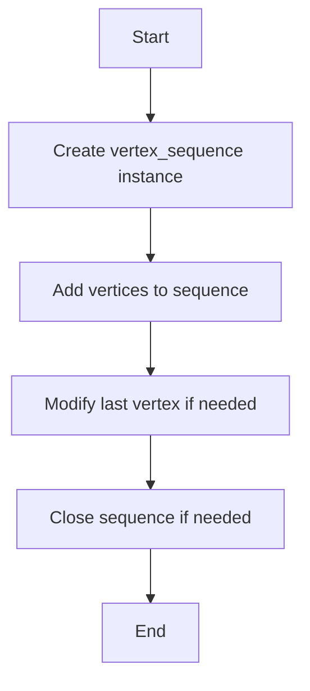
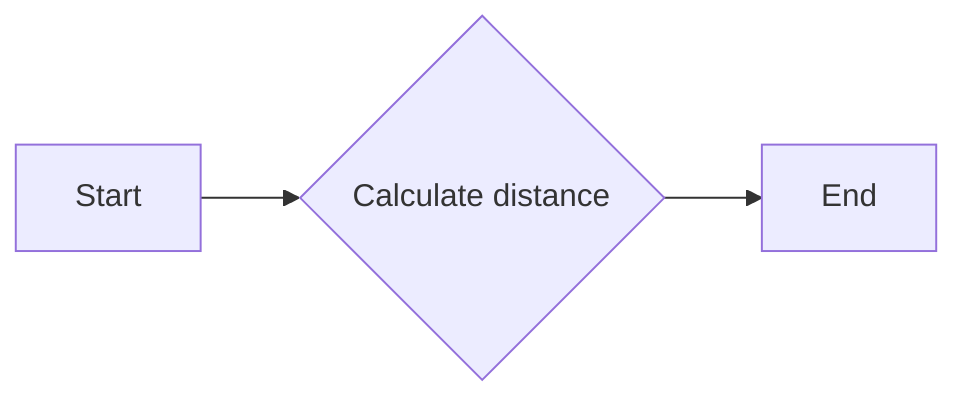
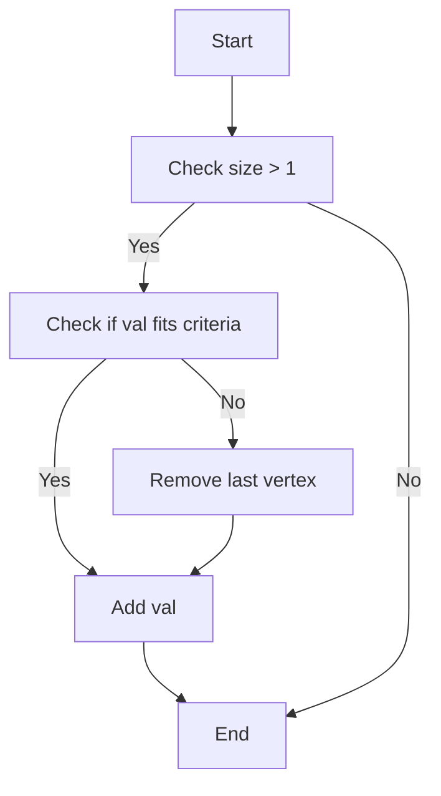
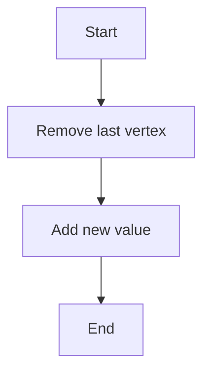
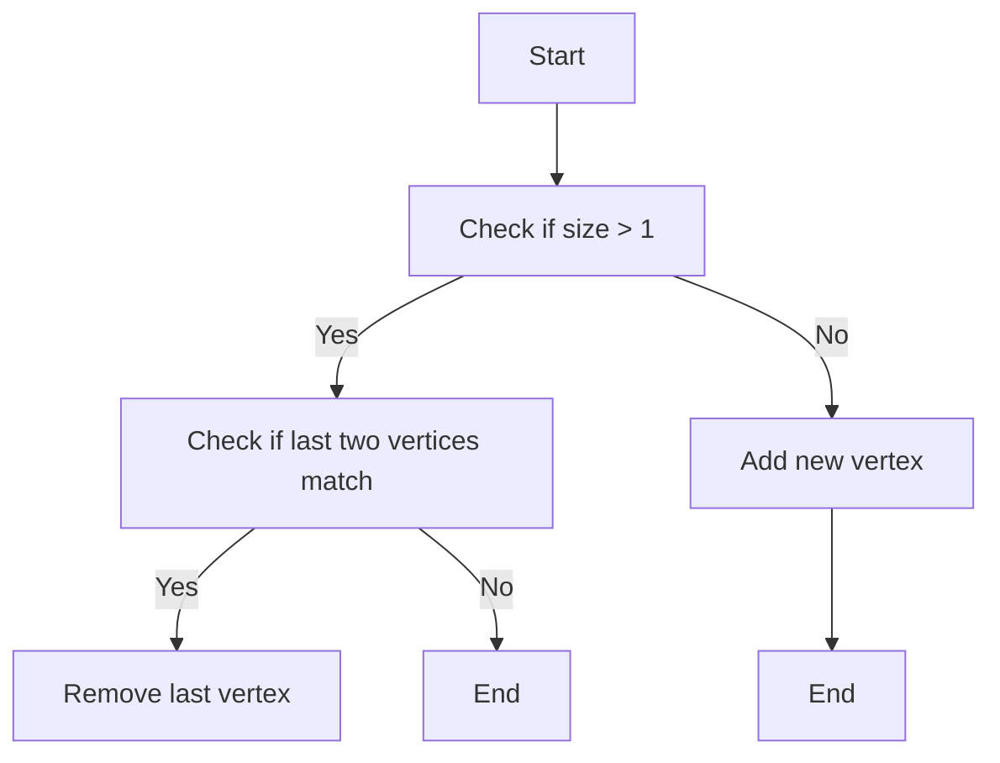
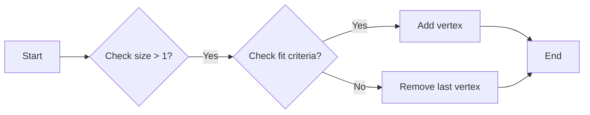
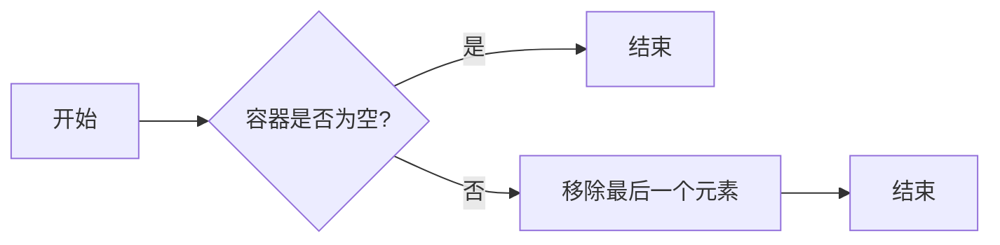
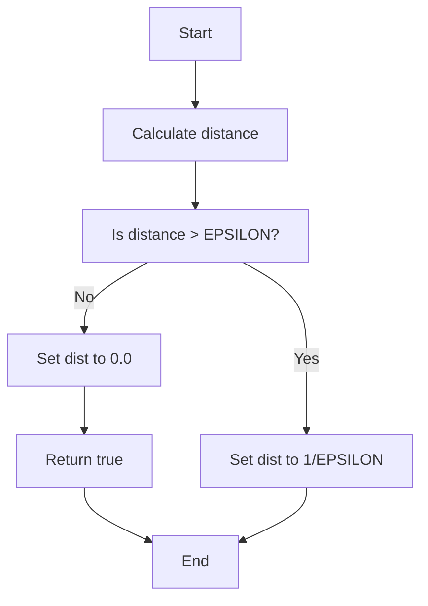
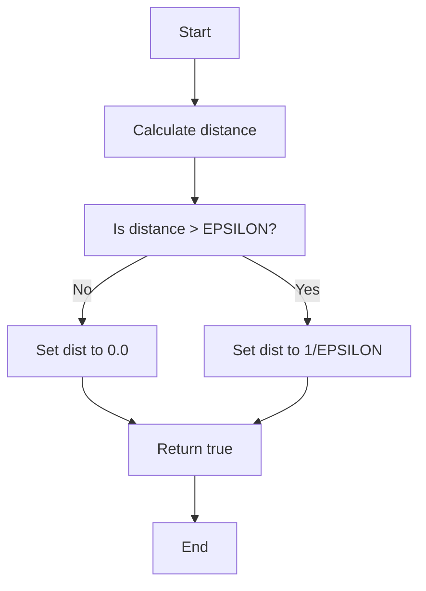

# `matplotlib\extern\agg24-svn\include\agg_vertex_sequence.h` 详细设计文档

This code defines a template class `vertex_sequence` for managing a sequence of vertices, with methods to add, modify, and close the sequence. It also includes a `vertex_dist` struct for storing vertex positions and distances, and a `vertex_dist_cmd` struct for storing additional command information.

## 整体流程



## 类结构

```
agg::vertex_sequence (Template class)
├── agg::pod_bvector (Base class)
│   ├── add (Method)
│   ├── remove_last (Method)
│   ├── size (Method)
│   └── ...
├── agg::vertex_dist (Struct)
│   ├── x (Field)
│   ├── y (Field)
│   ├── dist (Field)
│   └── ...
└── agg::vertex_dist_cmd (Struct)
    ├── cmd (Field)
    └── ... 
```

## 全局变量及字段


### `EPSILON`
    
A small value used for floating-point comparisons.

类型：`double`
    


### `vertex_dist_epsilon`
    
A small value used for calculating distances between vertices in vertex_dist and vertex_dist_cmd structures.

类型：`double`
    


### `vertex_sequence.val`
    
Reference to the value to be added to the vertex sequence.

类型：`const T&`
    


### `pod_bvector.size`
    
The current size of the pod_bvector.

类型：`unsigned`
    


### `vertex_dist.x`
    
The x-coordinate of the vertex.

类型：`double`
    


### `vertex_dist.y`
    
The y-coordinate of the vertex.

类型：`double`
    


### `vertex_dist.dist`
    
The distance to the next vertex.

类型：`double`
    


### `vertex_dist_cmd.cmd`
    
An additional command value associated with the vertex.

类型：`unsigned`
    
    

## 全局函数及方法


### calc_distance

计算两个点之间的距离。

参数：

- `x1`：`double`，第一个点的 x 坐标
- `y1`：`double`，第一个点的 y 坐标
- `x2`：`double`，第二个点的 x 坐标
- `y2`：`double`，第二个点的 y 坐标

返回值：`double`，两个点之间的距离

#### 流程图



#### 带注释源码

```cpp
double calc_distance(double x1, double y1, double x2, double y2)
{
    return sqrt(pow(x2 - x1, 2) + pow(y2 - y1, 2));
}
```


### vertex_sequence.add

This function adds a new vertex to the vertex sequence. It checks if the new vertex is within a certain distance from the previous vertex and removes the previous vertex if it is not, ensuring that the vertices are not coinciding.

参数：

- `val`：`const T&`，The vertex to be added to the sequence.

返回值：`void`，No return value.

#### 流程图



#### 带注释源码

```cpp
template<class T, unsigned S> 
void vertex_sequence<T, S>::add(const T& val)
{
    if(base_type::size() > 1)
    {
        if(!(*this)[base_type::size() - 2]((*this)[base_type::size() - 1])) 
        {
            base_type::remove_last();
        }
    }
    base_type::add(val);
}
``` 


### vertex_sequence.modify_last

修改序列中的最后一个顶点。

参数：

- `val`：`const T&`，要修改为的顶点值

返回值：无

#### 流程图



#### 带注释源码

```cpp
template<class T, unsigned S> 
void vertex_sequence<T, S>::modify_last(const T& val)
{
    base_type::remove_last(); // 移除最后一个顶点
    add(val); // 添加新的顶点
}
```


### vertex_sequence.close

This function closes the vertex sequence by removing vertices that do not meet certain criteria, based on the operator defined for the vertex type.

参数：

- `closed`：`bool`，Indicates whether the vertex sequence should be closed. If true, the function will also remove vertices that do not connect to the first vertex.

返回值：`void`，No return value. The vertex sequence is modified in place.

#### 流程图



#### 带注释源码

```cpp
template<class T, unsigned S> 
void vertex_sequence<T, S>::close(bool closed)
{
    while(base_type::size() > 1)
    {
        if((*this)[base_type::size() - 2]((*this)[base_type::size() - 1])) break;
        T t = (*this)[base_type::size() - 1];
        base_type::remove_last();
        modify_last(t);
    }

    if(closed)
    {
        while(base_type::size() > 1)
        {
            if((*this)[base_type::size() - 1]((*this)[0])) break;
            base_type::remove_last();
        }
    }
}
```


### vertex_sequence.add

This method adds a new vertex to the vertex sequence. It checks if the new vertex fits certain criteria based on the previous vertex using the operator() of the vertex type. If the vertex does not fit the criteria, it is not added to the sequence.

参数：

- `val`：`const T&`，The vertex to be added to the sequence.

返回值：`void`，No return value.

#### 流程图



#### 带注释源码

```cpp
template<class T, unsigned S> 
void vertex_sequence<T, S>::add(const T& val)
{
    if(base_type::size() > 1)
    {
        if(!(*this)[base_type::size() - 2]((*this)[base_type::size() - 1])) 
        {
            base_type::remove_last();
        }
    }
    base_type::add(val);
}
``` 


### pod_bvector.remove_last

移除 pod_bvector 容器中的最后一个元素。

参数：

- 无

返回值：`void`，无返回值

#### 流程图



#### 带注释源码

```cpp
    //------------------------------------------------------------------------
    template<class T, unsigned S> 
    void pod_bvector<T, S>::remove_last()
    {
        if (!this->size()) return;

        this->size() -= 1;
    }
```


### vertex_dist::operator()

This function calculates the distance between two vertices and determines if the distance is greater than a specified epsilon value.

参数：

- `val`：`const vertex_dist&`，The next vertex to calculate the distance with.

返回值：`bool`，Returns true if the distance between the vertices is greater than `vertex_dist_epsilon`, otherwise false.

#### 流程图



#### 带注释源码

```cpp
bool operator () (const vertex_dist& val)
{
    bool ret = (dist = calc_distance(x, y, val.x, val.y)) > vertex_dist_epsilon;
    if(!ret) dist = 1.0 / vertex_dist_epsilon;
    return ret;
}
``` 


### vertex_dist_cmd.operator()

This function is an overloaded operator for the `vertex_dist_cmd` struct. It calculates the distance between two vertices and returns a boolean indicating whether the distance is greater than a specified epsilon value.

参数：

- `val`：`const vertex_dist&`，The vertex to which the distance is calculated.

返回值：`bool`，Returns `true` if the distance between the vertices is greater than `vertex_dist_epsilon`, otherwise `false`.

#### 流程图



#### 带注释源码

```cpp
bool operator () (const vertex_dist& val)
{
    bool ret = (dist = calc_distance(x, y, val.x, val.y)) > vertex_dist_epsilon;
    if(!ret) dist = 1.0 / vertex_dist_epsilon;
    return ret;
}
```


## 关键组件


### 张量索引与惰性加载

张量索引与惰性加载是代码中用于高效处理和存储大量数据的关键组件。它允许在需要时才计算或加载数据，从而减少内存消耗和提高性能。

### 反量化支持

反量化支持是代码中用于处理和转换数据的关键组件。它允许将量化数据转换回原始数据，以便进行进一步处理或分析。

### 量化策略

量化策略是代码中用于优化数据存储和计算的关键组件。它通过减少数据精度来减少内存消耗和提高计算速度。

## 问题及建议


### 已知问题

-   **模板参数S的默认值**：`vertex_sequence`类模板的参数`S`有一个默认值6，这可能不是所有情况下都合适。如果默认值太小，可能会导致频繁的内存分配和复制操作；如果太大，可能会浪费内存。应该根据预期的使用场景来调整默认值。
-   **`add`方法的性能**：`add`方法在添加新顶点之前会检查最后一个顶点，这可能导致不必要的性能开销，尤其是在顶点序列很长时。可以考虑优化这个检查逻辑，例如通过维护一个额外的标志来指示是否需要检查。
-   **`close`方法的性能**：`close`方法在关闭顶点序列时会进行多次迭代和删除操作，这可能会影响性能。可以考虑使用更高效的数据结构或算法来优化这个过程。
-   **`vertex_dist`和`vertex_dist_cmd`的`dist`计算**：`vertex_dist`和`vertex_dist_cmd`中的`dist`计算可能会因为除以一个非常小的数（`vertex_dist_epsilon`）而导致精度问题。应该确保`EPSILON`值足够小，同时避免除以零的情况。

### 优化建议

-   **动态调整模板参数S**：提供一个方法来动态调整`vertex_sequence`的模板参数`S`，以便根据实际使用情况优化内存使用。
-   **优化`add`方法**：在`add`方法中，如果不需要检查最后一个顶点，则可以跳过这个检查，以提高性能。
-   **优化`close`方法**：考虑使用更高效的数据结构，如链表，来优化`close`方法中的迭代和删除操作。
-   **改进`dist`计算**：确保`EPSILON`值足够小，并且在进行除法操作之前检查除数不为零，以避免精度问题。
-   **文档和注释**：代码中缺少详细的文档和注释，这可能会使得理解和维护代码变得更加困难。应该添加必要的文档和注释来提高代码的可读性和可维护性。


## 其它


### 设计目标与约束

- 设计目标：
  - 提供一个灵活的容器来存储顶点序列。
  - 支持在添加新顶点时进行过滤和计算。
  - 支持修改最后一个顶点。
  - 支持关闭顶点序列，移除不符合条件的顶点。

- 约束：
  - 顶点类型 `T` 必须支持 `operator()` 用于过滤和计算。
  - 使用模板以支持不同类型的顶点。

### 错误处理与异常设计

- 错误处理：
  - 如果顶点类型 `T` 不支持 `operator()`，则容器无法正常工作。
  - 如果尝试添加不符合条件的顶点，则该顶点将被忽略。

- 异常设计：
  - 没有使用异常处理机制，因为错误通常可以通过返回值或状态来处理。

### 数据流与状态机

- 数据流：
  - 顶点数据通过 `add` 方法添加到容器中。
  - `modify_last` 方法用于修改最后一个顶点。
  - `close` 方法用于关闭顶点序列，移除不符合条件的顶点。

- 状态机：
  - 没有明确的状态机，因为操作是线性的，没有复杂的状态转换。

### 外部依赖与接口契约

- 外部依赖：
  - `agg_basics.h`：提供基本类型和宏定义。
  - `agg_array.h`：提供数组操作。
  - `agg_math.h`：提供数学函数。

- 接口契约：
  - `vertex_sequence` 类的 `add`、`modify_last` 和 `close` 方法必须由顶点类型 `T` 支持的 `operator()` 来实现。
  - `vertex_dist` 和 `vertex_dist_cmd` 结构体必须实现 `operator()` 用于过滤和计算。

    