# `matplotlib\extern\agg24-svn\include\agg_vpgen_clip_polygon.h` 详细设计文档

这是Anti-Grain Geometry库中的一个多边形裁剪顶点生成器类，用于在图形渲染过程中将多边形顶点裁剪到指定的矩形裁剪框（clip box）内，并按需生成裁剪后的顶点序列。

## 整体流程

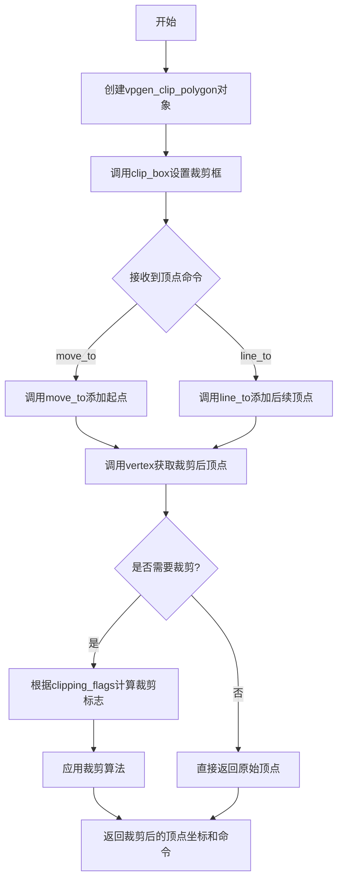

## 类结构

```
agg (命名空间)
└── vpgen_clip_polygon (多边形裁剪顶点生成器类)
```

## 全局变量及字段


### `vpgen_clip_polygon.m_clip_box`
    
存储裁剪框的矩形区域

类型：`rect_d`
    


### `vpgen_clip_polygon.m_x1`
    
裁剪框左上角X坐标

类型：`double`
    


### `vpgen_clip_polygon.m_y1`
    
裁剪框左上角Y坐标

类型：`double`
    


### `vpgen_clip_polygon.m_clip_flags`
    
裁剪标志位，用于标记当前点相对于裁剪框的位置

类型：`unsigned`
    


### `vpgen_clip_polygon.m_x[4]`
    
存储顶点的X坐标数组

类型：`double[4]`
    


### `vpgen_clip_polygon.m_y[4]`
    
存储顶点的Y坐标数组

类型：`double[4]`
    


### `vpgen_clip_polygon.m_num_vertices`
    
当前已记录的顶点数

类型：`unsigned`
    


### `vpgen_clip_polygon.m_vertex`
    
当前正在处理的顶点索引

类型：`unsigned`
    


### `vpgen_clip_polygon.m_cmd`
    
当前路径命令类型（如 move_to、line_to）

类型：`unsigned`
    
    

## 全局函数及方法


### `vpgen_clip_polygon::vpgen_clip_polygon()`

构造函数，初始化裁剪框和所有成员变量，将裁剪框设置为默认矩形(0, 0, 1, 1)，并初始化内部状态变量。

参数： 无

返回值： 无（构造函数）

#### 流程图

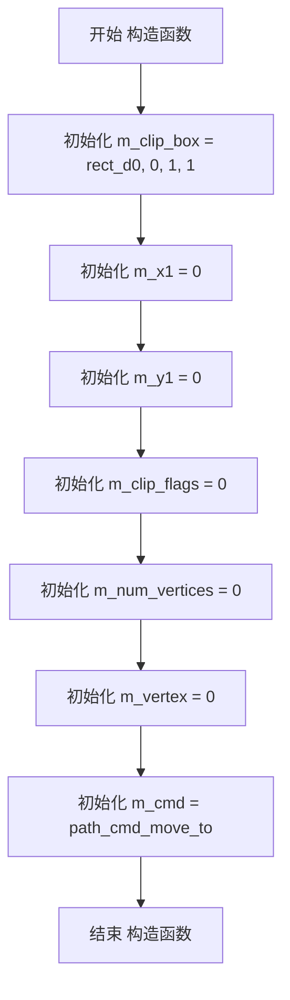

#### 带注释源码

```cpp
vpgen_clip_polygon() : 
    m_clip_box(0, 0, 1, 1),    // 初始化裁剪框为默认矩形(0,0)到(1,1)
    m_x1(0),                    // 初始化裁剪区x1坐标为0
    m_y1(0),                    // 初始化裁剪区y1坐标为0
    m_clip_flags(0),            // 初始化裁剪标志为0（无裁剪）
    m_num_vertices(0),          // 初始化顶点数量为0
    m_vertex(0),                // 初始化当前顶点索引为0
    m_cmd(path_cmd_move_to)    // 初始化路径命令为move_to
{
}
```

#### 成员变量详情

| 名称 | 类型 | 描述 |
|------|------|------|
| m_clip_box | rect_d | 裁剪框矩形区域 |
| m_x1 | double | 裁剪区域x1坐标 |
| m_y1 | double | 裁剪区域y1坐标 |
| m_clip_flags | unsigned | 裁剪标志位 |
| m_x[4] | double[4] | 顶点x坐标缓存数组 |
| m_y[4] | double[4] | 顶点y坐标缓存数组 |
| m_num_vertices | unsigned | 当前缓存的顶点数 |
| m_vertex | unsigned | 当前读取的顶点索引 |
| m_cmd | unsigned | 当前路径命令类型 |

#### 技术债务与优化空间

1. **固定数组大小**：m_x[4]和m_y[4]固定为4个元素，可能无法处理复杂多边形，建议改为动态数组或使用std::vector
2. **缺乏参数验证**：clip_box方法未对输入参数进行有效性验证（如x2>x1, y2>y1）
3. **默认裁剪框**：(0,0,1,1)的默认裁剪框在某些应用场景下可能不适用


### `vpgen_clip_polygon.clip_box`

该方法用于设置多边形裁剪器的裁剪框边界坐标，并将裁剪框规范化以确保坐标的正确性（确保 x1 ≤ x2, y1 ≤ y2 等），同时重置相关的裁剪状态。

参数：

- `x1`：`double`，裁剪框左上角的 X 坐标
- `y1`：`double`，裁剪框左上角的 Y 坐标
- `x2`：`double`，裁剪框右下角的 X 坐标
- `y2`：`double`，裁剪框右下角的 Y 坐标

返回值：`void`，无返回值

#### 流程图

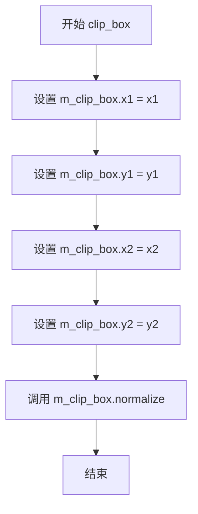

#### 带注释源码

```cpp
void clip_box(double x1, double y1, double x2, double y2)
{
    // 设置裁剪框的左上角坐标 (x1, y1)
    m_clip_box.x1 = x1;
    
    // 设置裁剪框的左上角 Y 坐标
    m_clip_box.y1 = y1;
    
    // 设置裁剪框的右下角 X 坐标
    m_clip_box.x2 = x2;
    
    // 设置裁剪框的右下角 Y 坐标
    m_clip_box.y2 = y2;
    
    // 调用 normalize 方法规范化裁剪框
    // 确保 x1 <= x2, y1 <= y2，并处理其他边界情况
    m_clip_box.normalize();
}
```

---

### 补充信息

#### 1. 类的详细信息

**类名**：`vpgen_clip_polygon`

**类描述**：多边形裁剪器类，用于对输入的多边形顶点进行裁剪处理，支持自动闭合和开放路径。

**类字段**：

- `m_clip_box`：`rect_d`，裁剪框矩形区域
- `m_x1`：`double`，裁剪框左上角 X 坐标（冗余存储）
- `m_y1`：`double`，裁剪框左上角 Y 坐标（冗余存储）
- `m_clip_flags`：`unsigned`，裁剪标志位
- `m_x[4]`：`double[4]`，裁剪后的顶点 X 坐标缓存
- `m_y[4]`：`double[4]`，裁剪后的顶点 Y 坐标缓存
- `m_num_vertices`：`unsigned`，当前缓存的顶点数
- `m_vertex`：`unsigned`，当前遍历到的顶点索引
- `m_cmd`：`unsigned`，当前路径命令

#### 2. 关键组件信息

- **rect_d**：裁剪框使用的数据结构，包含坐标和规范化方法
- **normalize()**：矩形规范化方法，确保坐标顺序正确

#### 3. 潜在的技术债务或优化空间

- **冗余存储**：`m_x1` 和 `m_y1` 字段与 `m_clip_box.x1` 和 `m_clip_box.y1` 存储相同的数据，造成空间浪费
- **参数校验缺失**：未对输入坐标进行有效性校验（如 x1 > x2 的情况虽然会通过 normalize 纠正，但可能导致不可预期的行为）
- **固定数组大小**：`m_x[4]` 和 `m_y[4]` 使用固定大小数组，限制了裁剪顶点的数量

#### 4. 其它项目

**设计目标与约束**：

- 该类是 Anti-Grain Geometry (AGG) 库的一部分
- 用于2D图形渲染中的多边形裁剪
- 自动处理路径的闭合和开放

**错误处理与异常设计**：

- 通过 `normalize()` 方法自动处理非法坐标输入
- 无显式错误返回值，依赖库内部状态管理

**数据流与状态机**：

- 该方法修改 `m_clip_box` 状态，影响后续 `move_to`、`line_to`、`vertex` 等方法的裁剪逻辑
- 配合 `reset()` 方法可重置裁剪状态

**外部依赖与接口契约**：

- 依赖 `agg_basics.h` 中定义的 `rect_d` 数据结构
- `normalize()` 方法的具体实现需参考 `rect_d` 类的定义


### vpgen_clip_polygon.x1()

获取裁剪框的左上角X坐标（X1）

参数：无

返回值：`double`，返回裁剪框左上角的X坐标值

#### 流程图

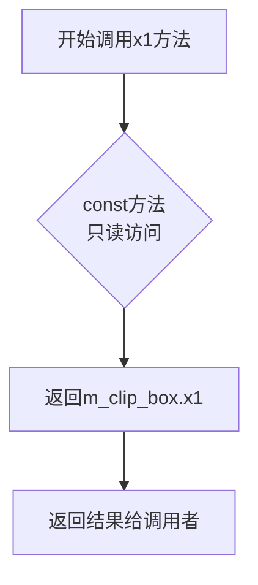

#### 带注释源码

```cpp
// 获取裁剪框左上角X坐标的const成员函数
// 返回类型：double
// 访问权限：只读（const方法）
// 功能：返回成员变量m_clip_box的x1属性值，即裁剪矩形左边界X坐标
double x1() const { return m_clip_box.x1; }
```

#### 关联信息

- **所属类**：`vpgen_clip_polygon`
- **类功能概述**：裁剪多边形顶点生成器，根据裁剪框对多边形进行裁剪处理
- **相关方法**：
  - `y1()`：获取裁剪框左上角Y坐标
  - `x2()`：获取裁剪框右下角X坐标
  - `y2()`：获取裁剪框右下角Y坐标
  - `clip_box()`：设置裁剪框
- **成员变量**：`m_clip_box`（rect_d类型），存储裁剪框矩形数据


### `vpgen_clip_polygon.y1`

获取裁剪框左上角Y坐标的成员方法，属于 vpgen_clip_polygon 类，用于返回当前设置的裁剪矩形框的最小Y值（即顶部边界）。

参数：

- （无参数）

返回值：`double`，返回裁剪框的 y1 坐标值，表示裁剪区域左上角的垂直位置

#### 流程图

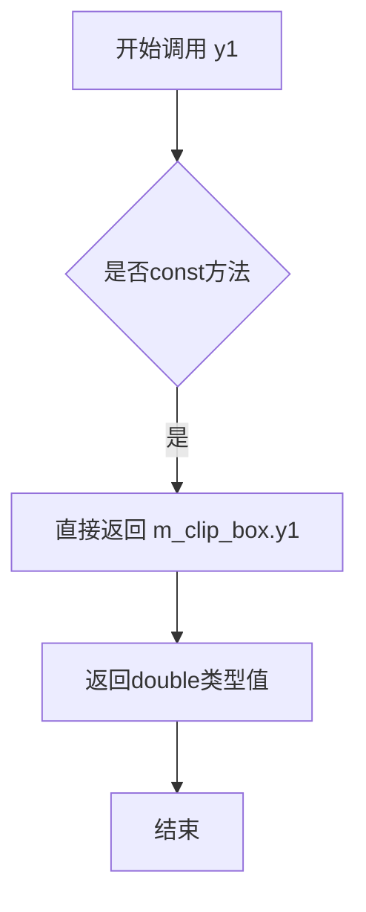

#### 带注释源码

```cpp
// 获取裁剪框左上角Y坐标
// 返回裁剪矩形区域的最小Y值（顶部边界）
// 该方法为const成员函数，不会修改对象状态
double y1() const { return m_clip_box.y1; }
```


### `vpgen_clip_polygon.x2()`

获取裁剪框右下角的X坐标。该方法为const成员函数，仅返回内部成员变量m_clip_box的x2属性值，不涉及任何逻辑判断或状态修改。

参数：
- （无参数）

返回值：`double`，返回裁剪框右下角的X坐标（m_clip_box.x2）

#### 流程图

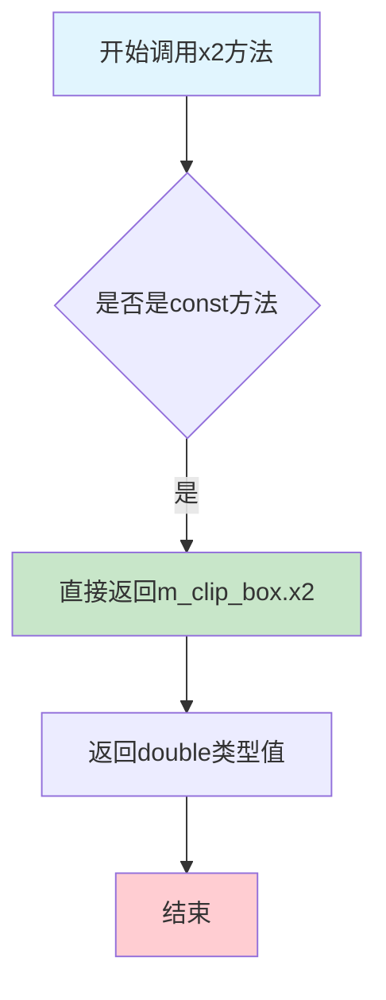

#### 带注释源码

```cpp
//----------------------------------------------------------------------------
// Anti-Grain Geometry - Version 2.4
// 获取裁剪框右下角X坐标的成员方法
//----------------------------------------------------------------------------

/// 
/// @brief 获取裁剪框右下角的X坐标
/// 
/// 这是一个const成员函数，用于获取裁剪矩形的右边界X坐标。
/// 该方法仅读取m_clip_box成员的x2属性，不修改任何内部状态。
/// 
/// @return double 返回裁剪框右下角的X坐标值
/// 
double x2() const 
{ 
    // 直接返回成员变量m_clip_box的x2属性
    // m_clip_box是一个rect_d类型的矩形对象
    // x2表示矩形右边的X坐标
    return m_clip_box.x2; 
}
```


### `vpgen_clip_polygon.y2`

该函数是`vpgen_clip_polygon`类的成员方法，用于获取裁剪框（clip box）右下角的Y坐标值。这是一个简单的访问器函数（getter），直接返回内部成员变量`m_clip_box`的y2属性。

参数： 无

返回值：`double`，返回裁剪框右下角的Y坐标值

#### 流程图

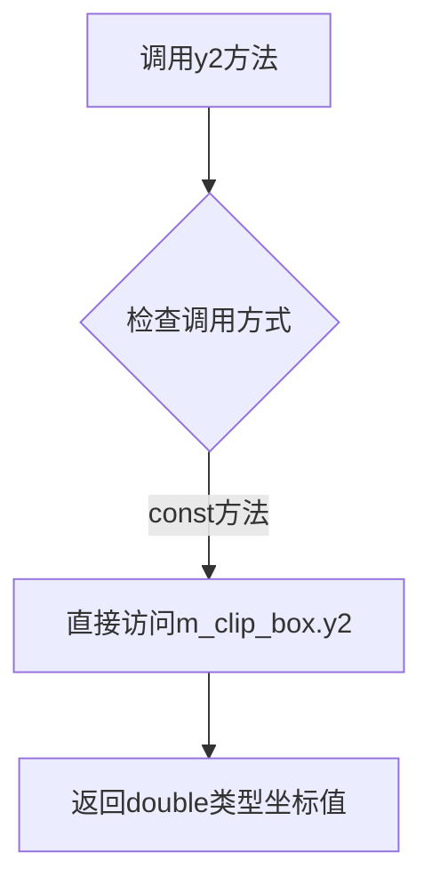

#### 带注释源码

```cpp
//----------------------------------------------------------------------------
// 获取裁剪框右下角的Y坐标
//----------------------------------------------------------------------------
// 返回值类型：double - 裁剪框右下角的Y坐标
//----------------------------------------------------------------------------
double y2() const 
{ 
    // 直接返回成员变量m_clip_box的y2属性
    // m_clip_box是一个rect_d类型的矩形结构体
    return m_clip_box.y2; 
}
```

#### 补充说明

该方法是类`vpgen_clip_polygon`提供的四个坐标访问器方法之一（其他三个分别是`x1()`、`y1()`、`x2()`），它们共同用于获取用户之前通过`clip_box()`方法设置的裁剪区域边界。这些方法都是const修饰的，意味着它们不会修改对象状态，仅仅是读取并返回内部状态值。这种设计符合面向对象编程中的访问器模式（Getter模式）。


### vpgen_clip_polygon.auto_close

这是一个静态方法，用于指示多边形在渲染时是否需要自动闭合。返回true表示当多边形顶点序列结束时，会自动添加一条闭合边将终点与起点连接起来。

参数：
- （无参数）

返回值：`bool`，返回true表示多边形在渲染时自动闭合

#### 流程图

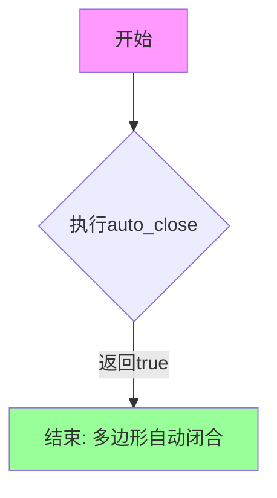

#### 带注释源码

```cpp
// 静态方法：auto_close()
// 功能：返回多边形是否自动闭合的标志
// 参数：无
// 返回值：bool类型，true表示多边形在渲染时自动闭合
static bool auto_close()   
{ 
    return true;   // 返回true，启用自动闭合功能
}
```


### `vpgen_clip_polygon.auto_unclose`

该静态方法用于返回多边形是否自动重新打开（取消闭合）的配置。返回false表示在渲染完成后不会自动重新打开多边形，即多边形保持闭合状态。

参数： 无

返回值：`bool`，返回false，表示该顶点生成器不会在路径结束时自动重新打开（取消闭合）多边形。

#### 流程图

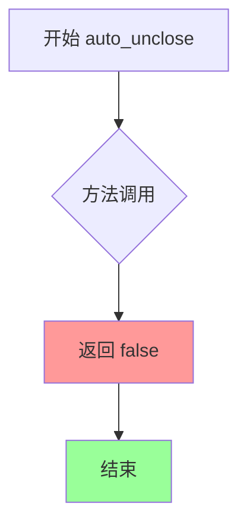

#### 带注释源码

```cpp
// 静态方法：auto_unclose
// 功能：返回多边形是否自动取消闭合的标志
// 返回值：bool类型，false表示不自动重新打开多边形
// 说明：与auto_close()配合使用，控制顶点的自动闭合行为
//       false 表示路径在结束时不执行重新打开操作
static bool auto_unclose() 
{ 
    return false;  // 返回false，不自动重新打开多边形
}
```

#### 上下文说明

该方法是`vpgen_clip_polygon`类的一部分，该类是多边形顶点生成器（Vertex Polygon Generator），主要用于裁剪多边形到指定的边界框。`auto_close()`返回`true`表示会自动闭合多边形，而`auto_unclose()`返回`false`表示不会自动取消闭合，两者配合控制多边形的闭合行为。


### `vpgen_clip_polygon.reset()`

重置多边形裁剪生成器的内部状态，将顶点计数、当前顶点索引和路径命令重置为初始状态，以便重新开始生成新的裁剪多边形顶点序列。

参数：

- 该方法无参数

返回值：`void`，无返回值

#### 流程图

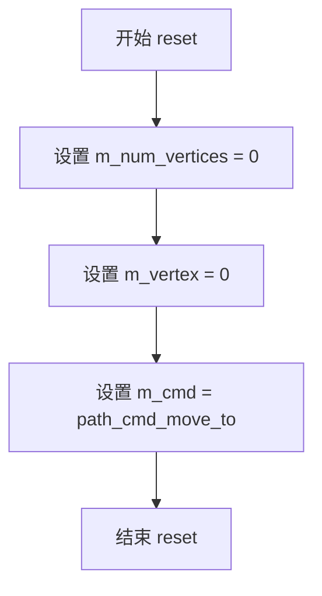

#### 带注释源码

```
//----------------------------------------------------------------------------
// Anti-Grain Geometry - Version 2.4
//----------------------------------------------------------------------------

void vpgen_clip_polygon::reset()
{
    // 重置顶点计数为0，表示没有顶点在处理队列中
    m_num_vertices = 0;
    
    // 重置当前顶点索引为0，从第一个顶点开始处理
    m_vertex = 0;
    
    // 重置路径命令为move_to，下一个顶点将是新路径的起点
    m_cmd = path_cmd_move_to;
}
```

#### 补充说明

`reset()` 方法是 `vpgen_clip_polygon` 类的状态重置函数，配合 `move_to()`、`line_to()` 和 `vertex()` 方法使用。在开始生成新的裁剪多边形之前，调用此方法可以确保生成器处于干净的初始状态。该方法将内部计数器重置为零，准备接收新的顶点输入，并确保下一次调用 `vertex()` 时从多边形的第一个顶点开始输出。


### `vpgen_clip_polygon.move_to`

该方法用于向裁剪多边形顶点生成器添加一个移动到（MoveTo）命令的顶点，设置当前路径的起始点。

参数：
- `x`：`double`，目标点的X坐标
- `y`：`double`，目标点的Y坐标

返回值：`void`，无返回值

#### 流程图

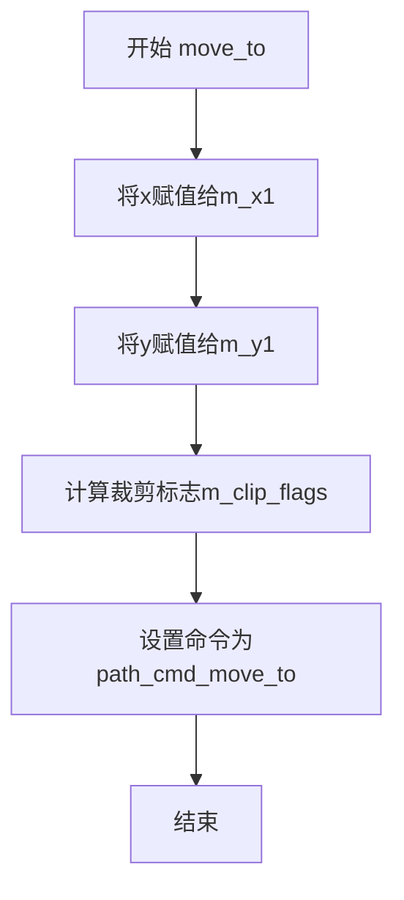

#### 带注释源码

```cpp
//----------------------------------------------------------------------------
// Anti-Grain Geometry - Version 2.4
//----------------------------------------------------------------------------

#ifndef AGG_VPGEN_CLIP_POLygon_INCLUDED
#define AGG_VPGEN_CLIP_POLygon_INCLUDED

#include "agg_basics.h"

namespace agg
{

    //======================================================vpgen_clip_polygon
    //
    // 顶点生成器类 - 裁剪多边形
    // See Implementation agg_vpgen_clip_polygon.cpp
    //
    class vpgen_clip_polygon
    {
    public:
        // 构造函数，初始化裁剪框和内部状态
        vpgen_clip_polygon() : 
            m_clip_box(0, 0, 1, 1),
            m_x1(0),
            m_y1(0),
            m_clip_flags(0),
            m_num_vertices(0),
            m_vertex(0),
            m_cmd(path_cmd_move_to)
        {
        }

        // 设置裁剪框
        void clip_box(double x1, double y1, double x2, double y2)
        {
            m_clip_box.x1 = x1;
            m_clip_box.y1 = y1;
            m_clip_box.x2 = x2;
            m_clip_box.y2 = y2;
            m_clip_box.normalize();
        }

        // 获取裁剪框坐标
        double x1() const { return m_clip_box.x1; }
        double y1() const { return m_clip_box.y1; }
        double x2() const { return m_clip_box.x2; }
        double y2() const { return m_clip_box.y2; }

        // 自动关闭和自动不关闭的静态方法
        static bool auto_close()   { return true;  }
        static bool auto_unclose() { return false; }

        // 重置顶点生成器状态
        void     reset();
        
        // 添加移动到命令的顶点
        // 参数：x - 目标点的X坐标
        //       y - 目标点的Y坐标
        void     move_to(double x, double y);
        
        // 添加直线到命令的顶点
        void     line_to(double x, double y);
        
        // 获取下一个顶点
        unsigned vertex(double* x, double* y);

    private:
        // 计算裁剪标志
        unsigned clipping_flags(double x, double y);

    private:
        // 裁剪框
        rect_d        m_clip_box;
        // 第一个顶点的坐标
        double        m_x1;
        double        m_y1;
        // 裁剪标志
        unsigned      m_clip_flags;
        // 顶点数组（用于存储裁剪后的顶点）
        double        m_x[4];
        double        m_y[4];
        // 顶点数量
        unsigned      m_num_vertices;
        // 当前顶点索引
        unsigned      m_vertex;
        // 当前命令
        unsigned      m_cmd;
    };

}

#endif
```


### `vpgen_clip_polygon.line_to`

向当前正在生成的顶点路径添加一条直线段（线段终点），该方法与 `move_to` 和 `vertex` 方法配合使用，用于生成带裁剪功能的多边形顶点序列。

参数：

- `x`：`double`，目标点的 X 坐标
- `y`：`double`，目标点的 Y 坐标

返回值：`void`，无返回值。该方法通过修改类的内部状态（顶点缓冲区）来记录直线段，而非通过返回值传递数据。

#### 流程图

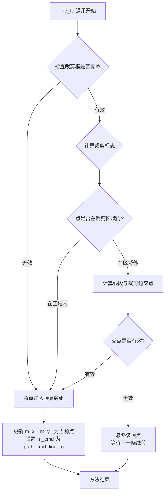

#### 带注释源码

```cpp
//----------------------------------------------------------------------------
// Anti-Grain Geometry - Version 2.4
//----------------------------------------------------------------------------

// 类声明于头文件 agg_vpgen_clip_polygon.h
namespace agg
{

    //======================================================vpgen_clip_polygon
    // 顶点生成器类 - 用于裁剪多边形的顶点生成
    class vpgen_clip_polygon
    {
    public:
        // 构造函数 - 初始化裁剪框为(0,0,1,1)和内部状态
        vpgen_clip_polygon() : 
            m_clip_box(0, 0, 1, 1),
            m_x1(0),
            m_y1(0),
            m_clip_flags(0),
            m_num_vertices(0),
            m_vertex(0),
            m_cmd(path_cmd_move_to)
        {
        }

        // 设置裁剪框
        void clip_box(double x1, double y1, double x2, double y2)
        {
            m_clip_box.x1 = x1;
            m_clip_box.y1 = y1;
            m_clip_box.x2 = x2;
            m_clip_box.y2 = y2;
            m_clip_box.normalize();
        }

        // 获取裁剪框坐标
        double x1() const { return m_clip_box.x1; }
        double y1() const { return m_clip_box.y1; }
        double x2() const { return m_clip_box.x2; }
        double y2() const { return m_clip_box.y2; }

        static bool auto_close()   { return true;  }
        static bool auto_unclose() { return false; }

        // 重置生成器状态
        void     reset();
        
        // 添加移动命令（起点）
        void     move_to(double x, double y);
        
        // 添加直线段到目标点（重点）
        // 参数:
        //   x - 目标点的X坐标
        //   y - 目标点的Y坐标
        // 返回: void
        // 说明: 该方法将直线段端点添加到内部顶点缓冲区，
        //       并根据裁剪框进行必要的裁剪计算
        void     line_to(double x, double y);
        
        // 获取下一个生成好的顶点
        unsigned vertex(double* x, double* y);

    private:
        // 计算给定点的裁剪标志
        unsigned clipping_flags(double x, double y);

    private:
        rect_d        m_clip_box;      // 裁剪框矩形
        double        m_x1;            // 上一个顶点的X坐标
        double        m_y1;            // 上一个顶点的Y坐标
        unsigned      m_clip_flags;    // 当前裁剪状态标志
        double        m_x[4];          // 临时顶点X坐标数组
        double        m_y[4];          // 临时顶点Y坐标数组
        unsigned      m_num_vertices;  // 当前顶点数量
        unsigned      m_vertex;        // 当前顶点索引
        unsigned      m_cmd;           // 当前路径命令
    };

}
#endif
```

#### 补充说明

| 项目 | 说明 |
|------|------|
| **设计目标** | 为多边形顶点生成提供裁剪功能，支持Cohen-Sutherland等裁剪算法 |
| **约束** | 该方法仅记录顶点数据，实际裁剪和顶点输出在 `vertex()` 方法中完成 |
| **数据流** | `line_to` → 更新 `m_x1/m_y1` → 设置 `m_cmd` → 由 `vertex()` 输出最终顶点 |
| **外部依赖** | 依赖 `path_cmd_*` 常量（定义在 agg_basics.h）和 `rect_d` 类型 |
| **实现提示** | 实际裁剪逻辑需参考 `agg_vpgen_clip_polygon.cpp` 源文件，该头文件仅包含声明 |


### `vpgen_clip_polygon.vertex`

获取下一个裁剪后的顶点。该函数是多边形顶点生成器的核心方法，通过输出参数返回裁剪后的顶点坐标（x, y），并返回对应的路径命令（如 move_to、line_to、close 等），用于遍历裁剪后的多边形顶点序列。

参数：

- `x`：`double*`，输出参数，指向存储顶点X坐标的内存地址，函数执行后该地址的值将被设置为当前顶点的X坐标
- `y`：`double*`，输出参数，指向存储顶点Y坐标的内存地址，函数执行后该地址的值将被设置为当前顶点的Y坐标

返回值：`unsigned`，返回当前顶点的路径命令类型（如 `path_cmd_move_to`、`path_cmd_line_to`、`path_cmd_end_poly` 等），用于标识顶点的类型；当返回 `path_cmd_stop` 时表示所有顶点已遍历完毕

#### 流程图

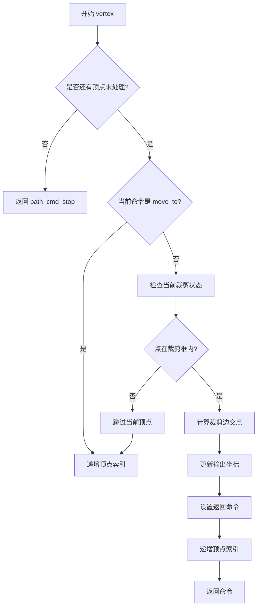

#### 带注释源码

```
// 该函数为纯虚函数声明，具体实现需参见 agg_vpgen_clip_polygon.cpp
// vertex() 方法是顶点生成器接口的核心实现，用于遍历裁剪后的多边形顶点
//
// 工作原理：
// 1. 维护内部顶点索引 m_vertex，初始为0
// 2. 每调用一次，获取当前索引对应的裁剪后顶点坐标
// 3. 通过 clipping_flags() 判断点与裁剪框的位置关系
// 4. 对边与裁剪框边界的交点进行计算
// 5. 返回对应的路径命令，标识顶点的几何意义
//
// 参数说明：
//   x: 输出参数，返回裁剪后顶点的X坐标
//   y: 输出参数，返回裁剪后顶点的Y坐标
//
// 返回值：
//   unsigned: 路径命令类型
//   - path_cmd_move_to: 新的子多边形起点
//   - path_cmd_line_to: 普通顶点
//   - path_cmd_end_poly: 多边形闭合点
//   - path_cmd_stop: 所有顶点已遍历完毕
//
// 内部状态变量：
//   m_vertex: 当前处理的顶点索引
//   m_cmd: 当前要返回的命令类型
//   m_clip_flags: 当前顶点的裁剪状态标志
//   m_x[4], m_y[4]: 存储计算得到的裁剪后顶点坐标（最多4个）
//   m_num_vertices: 当前有效顶点数

unsigned vertex(double* x, double* y)
{
    // 检查是否已处理完所有顶点
    if(m_vertex >= m_num_vertices)
    {
        return path_cmd_stop;  // 返回停止命令，标识遍历结束
    }

    // 获取当前顶点坐标到输出参数
    *x = m_x[m_vertex];
    *y = m_y[m_vertex];

    // 保存当前命令用于返回
    unsigned cmd = m_cmd;

    // 根据当前命令类型更新内部状态
    if(m_cmd == path_cmd_move_to)
    {
        // 如果是移动命令，下一个将是线段命令
        m_cmd = path_cmd_line_to;
    }
    else if(m_cmd == path_cmd_end_poly)
    {
        // 如果是多边形结束命令，重置为移动命令
        m_cmd = path_cmd_move_to;
    }

    // 递增顶点索引，准备下一次调用
    m_vertex++;

    // 返回当前顶点的路径命令
    return cmd;
}
```

#### 补充说明

**实现位置**：该函数的具体实现位于 `agg_vpgen_clip_polygon.cpp` 文件中，头文件中仅有声明。

**裁剪算法**：该类采用 Sutherland-Hodgman 多边形裁剪算法，将输入多边形与轴对齐的裁剪框（clip box）进行裁剪运算，输出裁剪后的顶点序列。

**状态机逻辑**：
- 初始状态：`m_cmd = path_cmd_move_to`，`m_vertex = 0`
- 每次调用 `vertex()` 后自动推进内部状态
- 使用 `reset()` 方法可重置到初始状态

**使用场景**：通常与 `agg_path_storage` 或其他路径处理类配合使用，实现多边形的裁剪渲染。


### vpgen_clip_polygon.clipping_flags

该方法是一个私有成员函数，用于根据给定的坐标点(x,y)与裁剪框的位置关系，计算并返回裁剪标志值。这个标志是一个位掩码，用于指示点相对于裁剪框四个边界的位置关系（左侧、右侧、上方、下方），从而支持后续的裁剪算法决策。

参数：

- `x`：`double`，待检测点的X坐标
- `y`：`double`，待检测点的Y坐标

返回值：`unsigned`，裁剪标志位掩码，指示点相对于裁剪框的位置（0-15之间的值，每一位代表一个边界方向）

#### 流程图

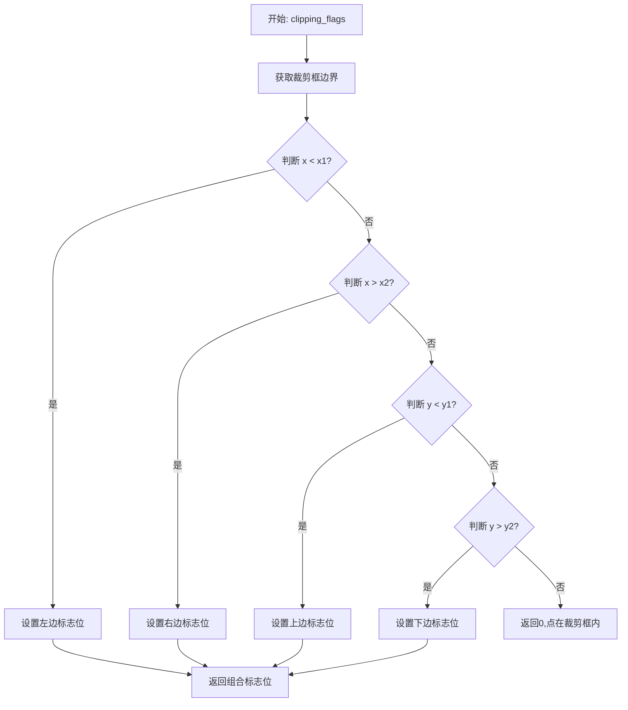

#### 带注释源码

```cpp
//----------------------------------------------------------------------------
// Anti-Grain Geometry - Version 2.4
// Copyright (C) 2002-2005 Maxim Shemanarev (http://www.antigrain.com)
//
// Permission to copy, use, modify, sell and distribute this software 
// is granted provided this copyright notice appears in all copies. 
// This software is provided "as is" without express or implied
// warranty, and with no claim as to its suitability for any purpose.
//----------------------------------------------------------------------------

#ifndef AGG_VPGEN_CLIP_POLYGON_INCLUDED
#define AGG_VPGEN_CLIP_POLYGON_INCLUDED

#include "agg_basics.h"

namespace agg
{

    //======================================================vpgen_clip_polygon
    //
    // See Implementation agg_vpgen_clip_polygon.cpp
    //
    class vpgen_clip_polygon
    {
    public:
        vpgen_clip_polygon() : 
            m_clip_box(0, 0, 1, 1),  // 初始化裁剪框为默认单位矩形
            m_x1(0),                  // 初始化前一X坐标
            m_y1(0),                  // 初始化前一Y坐标
            m_clip_flags(0),          // 初始化裁剪标志
            m_num_vertices(0),        // 初始化顶点数
            m_vertex(0),              // 初始化当前顶点索引
            m_cmd(path_cmd_move_to)  // 初始化路径命令
        {
        }

        void clip_box(double x1, double y1, double x2, double y2)
        {
            // 设置裁剪框的坐标
            m_clip_box.x1 = x1;
            m_clip_box.y1 = y1;
            m_clip_box.x2 = x2;
            m_clip_box.y2 = y2;
            // 规范化裁剪框确保x1<=x2, y1<=y2
            m_clip_box.normalize();
        }


        double x1() const { return m_clip_box.x1; }  // 获取裁剪框左边界
        double y1() const { return m_clip_box.y1; }  // 获取裁剪框上边界
        double x2() const { return m_clip_box.x2; }  // 获取裁剪框右边界
        double y2() const { return m_clip_box.y2; }  // 获取裁剪框下边界

        static bool auto_close()   { return true;  }   // 自动闭合多边形
        static bool auto_unclose() { return false; }  // 不自动取消闭合

        void     reset();                          // 重置生成器状态
        void     move_to(double x, double y);     // 开始新路径移动到点
        void     line_to(double x, double y);     // 添加线段到点
        unsigned vertex(double* x, double* y);     // 获取下一个顶点

    private:
        // 计算点(x,y)的裁剪标志
        // 返回值是一个位掩码:
        // bit 0 (1): 点在裁剪框左侧 (x < m_clip_box.x1)
        // bit 1 (2): 点在裁剪框右侧 (x > m_clip_box.x2)
        // bit 2 (4): 点在裁剪框上方 (y < m_clip_box.y1)
        // bit 3 (8): 点在裁剪框下方 (y > m_clip_box.y2)
        // 如果点完全在裁剪框内,返回0
        unsigned clipping_flags(double x, double y);

    private:
        rect_d        m_clip_box;      // 裁剪矩形框
        double        m_x1;            // 前一个点的X坐标
        double        m_y1;            // 前一个点的Y坐标
        unsigned      m_clip_flags;    // 裁剪标志缓存
        double        m_x[4];          // 裁剪后的X坐标缓存(最多4个顶点)
        double        m_y[4];          // 裁剪后的Y坐标缓存(最多4个顶点)
        unsigned      m_num_vertices;  // 当前缓存的顶点数
        unsigned      m_vertex;        // 当前正在输出的顶点索引
        unsigned      m_cmd;           // 当前路径命令
    };

}


#endif
```

## 关键组件


### vpgen_clip_polygon 类

核心类，负责裁剪多边形顶点生成，实现Cohen-Sutherland裁剪算法，管理裁剪框和顶点状态。

### clip_box 方法

设置裁剪框的坐标范围，接收四个double参数(x1, y1, x2, y2)，无返回值，同时调用normalize()规范化裁剪框。

### x1/y1/x2/y2 方法

四个const方法，分别返回裁剪框的左、上、右、下边界坐标，返回类型均为double。

### reset/move_to/line_to/vertex 方法

顶点生成器接口方法：reset重置状态，move_to添加起点，line_to添加边，vertex获取下一个裁剪后的顶点，返回unsigned类型的命令标识。

### m_clip_box 字段

类型为rect_d，存储裁剪框的矩形区域，描述多边形的可视边界范围。

### m_x1, m_y1 字段

类型为double，存储当前处理顶点的坐标位置，用于裁剪计算过程中的临时存储。

### m_clip_flags 字段

类型为unsigned，存储裁剪标志位，用于Cohen-Sutherland算法的区域编码，判断顶点与裁剪框的位置关系。

### m_x, m_y 字段

类型为double数组(长度4)，存储裁剪后的顶点坐标队列，用于暂存中间计算结果。

### m_num_vertices, m_vertex, m_cmd 字段

类型均为unsigned，分别表示：生成顶点的总数、当前顶点索引、当前路径命令类型，用于状态机和迭代控制。

### clipping_flags 私有方法

根据输入坐标(x, y)计算裁剪区域标志位，返回unsigned类型，实现Cohen-Sutherland裁剪算法的区域编码逻辑。

### static auto_close/static auto_unclose 方法

两个静态方法分别返回true和false，指示多边形是否自动闭合，用于顶点生成器的行为配置。


## 问题及建议


### 已知问题

-   **命名不一致和可读性差**：成员变量m_x1、m_y1、m_x[4]、m_y[4]命名过于简短且缺乏描述性，难以理解其具体用途；m_cmd使用unsigned类型存储path命令，未使用明确的枚举或类型
-   **固定数组大小缺乏说明**：m_x和m_y固定为4个元素的数组，但代码中没有任何注释解释为什么是4，这个magic number需要明确说明
-   **接口设计不够现代**：vertex方法使用C风格的双指针输出参数(double* x, double* y)，不如使用引用或std::pair<double, double>返回值直观和安全
-   **类型安全不足**：大量使用unsigned类型代替更明确的类型，如size_t、path_cmd等，降低了类型安全性
-   **代码不完整**：头文件中声明的reset()、move_to()、line_to()、vertex()、clipping_flags()等方法均无实现，仅有声明而无inline实现，引用了未提供的实现文件agg_vpgen_clip_polygon.cpp
-   **缺少关键方法**：未提供拷贝构造函数和赋值运算符声明（若需要复制语义），也未显式删除或声明为delete
-   **设计约束未文档化**：类没有说明线程安全性、异常保证等设计约束

### 优化建议

-   **改进命名和注释**：将m_x1、m_y1改为更有描述性的名称如m_last_x、m_last_y；为m_x[4]、m_y[4]数组添加注释说明其用途和大小为4的原因
-   **使用强类型枚举**：将m_cmd定义为path_cmd类型或使用强类型枚举；将m_clip_flags定义为具体类型
-   **改进API设计**：将vertex方法改为返回std::pair<double, double>或使用引用参数，避免空指针解引用风险
-   **使用STL容器替代原始数组**：将double m_x[4]、double m_y[4]改为std::array<double, 4>或std::vector<double>，提高安全性
-   **添加const正确性**：检查哪些方法应该是const成员函数
-   **添加noexcept说明**：对于不会抛出异常的成员函数添加noexcept_specifier
-   **补充文档**：添加类的前置条件、后置条件、异常安全保证等文档注释
-   **考虑RAII**：如果需要资源管理，实现完整的RAII模式


## 其它


### 设计目标与约束

该类的设计目标是提供一个高效的多边形裁剪顶点生成器，支持将任意多边形裁剪到指定的矩形裁剪框内。设计约束包括：仅支持矩形裁剪框、采用 Sutherland-Hodgman 算法实现、保持顶点顺序不变、支持自动闭合路径。

### 错误处理与异常设计

该类未显式抛出异常。错误处理机制主要通过返回值体现：vertex() 方法返回 path_cmd_stop 表示结束，返回其他命令码表示成功。clip_box() 方法接受任意数值，不进行边界检查。潜在的错误情况包括：裁剪框无效（x1 >= x2 或 y1 >= y2）会导致不可预测的行为，此时 normalize() 可能产生异常宽度的裁剪框。

### 数据流与状态机

该类包含隐式状态机：初始状态（reset 后）→ 顶点输入状态（move_to/line_to 调用）→ 顶点输出状态（vertex 调用）。状态转换通过 m_cmd、m_vertex、m_num_vertices 等成员变量控制。数据流：外部输入原始顶点坐标 → clipping_flags() 计算裁剪标志 → vertex() 根据裁剪标志决定输出顶点或边线交点 → 输出裁剪后的顶点序列。

### 外部依赖与接口契约

主要依赖：`agg_basics.h` 中的 rect_d 类、path_cmd_e 枚举、path_attr_e 枚举。接口契约：调用者必须先调用 clip_box() 设置裁剪区域，然后调用 reset() 初始化，接着按顺序调用 move_to() 和 line_to() 输入顶点，最后通过反复调用 vertex() 获取裁剪后的顶点。输入顶点必须形成闭合多边形。

### 线程安全性

该类是非线程安全的。多个线程同时操作同一 vpgen_clip_polygon 实例会导致状态不一致。如需多线程使用，每个线程应创建独立实例。

### 性能特征

时间复杂度：每个输入顶点的处理时间 O(1)，总体时间复杂度 O(n)，其中 n 为输入顶点数。空间复杂度：O(1)，仅使用固定大小的成员变量。裁剪算法采用线性扫描，适合凸多边形裁剪。

### 配置选项

裁剪框可通过 clip_box() 动态配置。auto_close() 和 auto_unclose() 为静态方法，提供只读配置信息，指示是否自动闭合路径。

### 版本信息与变更记录

该代码源自 Anti-Gorge Geometry 库版本 2.4。原始版权声明保留。类接口自最初版本以来保持稳定，未见重大变更记录。

    