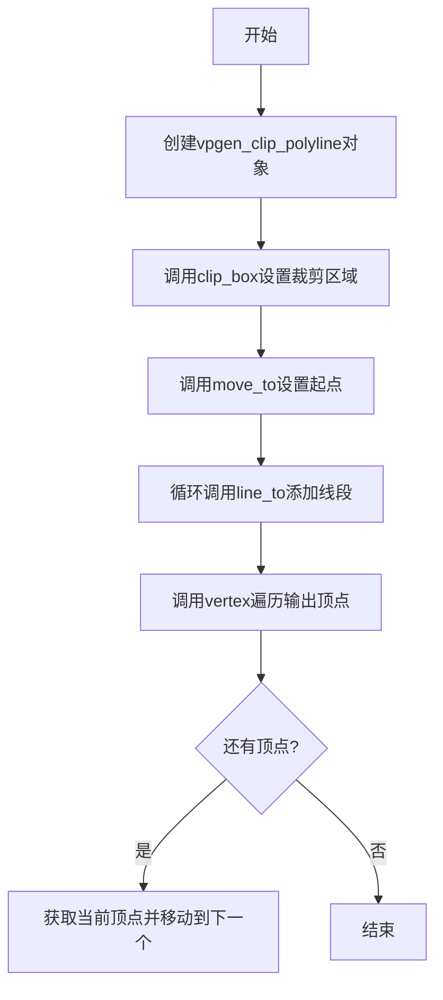
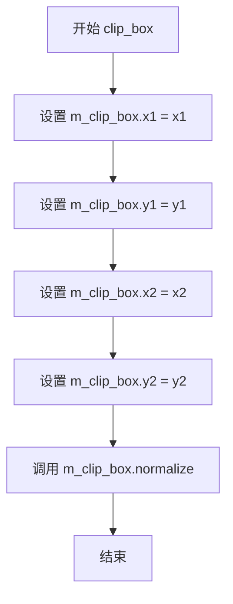
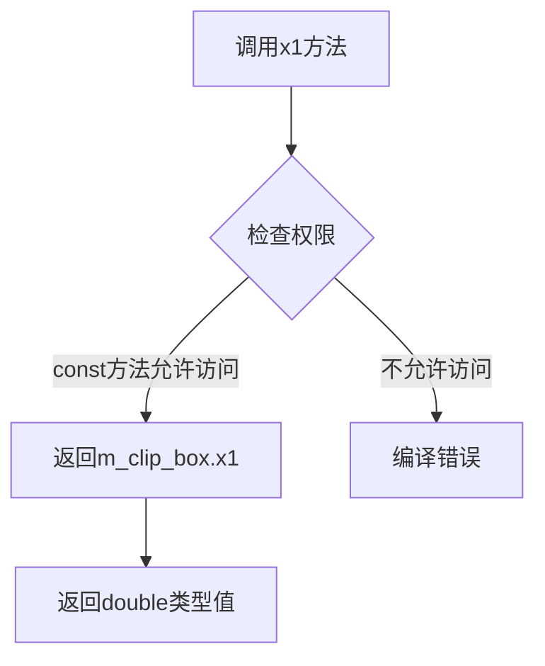
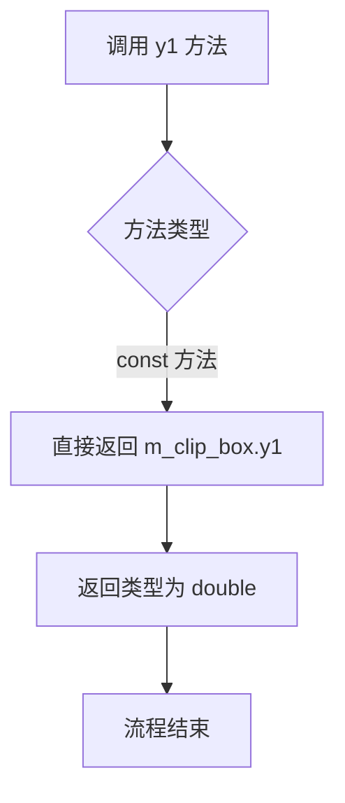
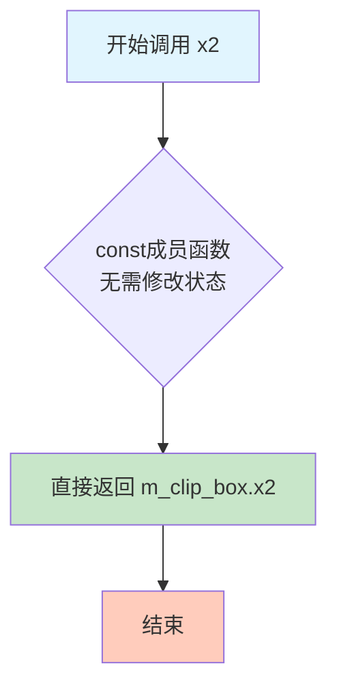
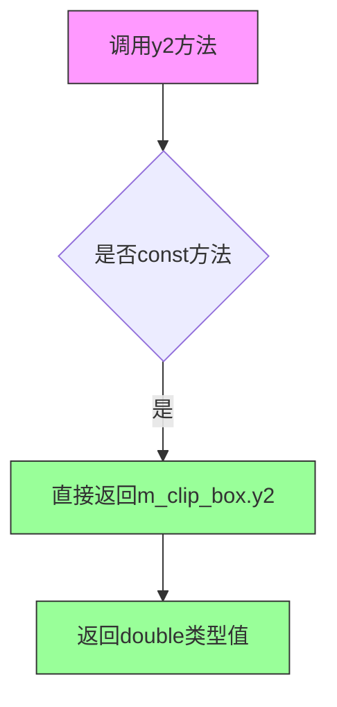
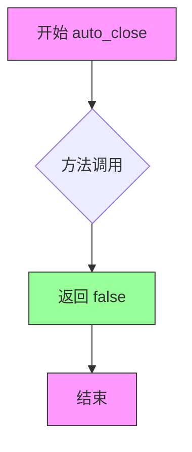
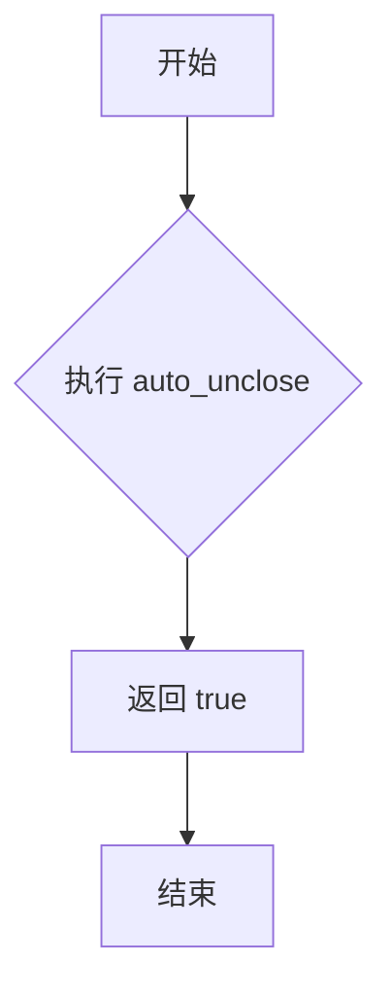
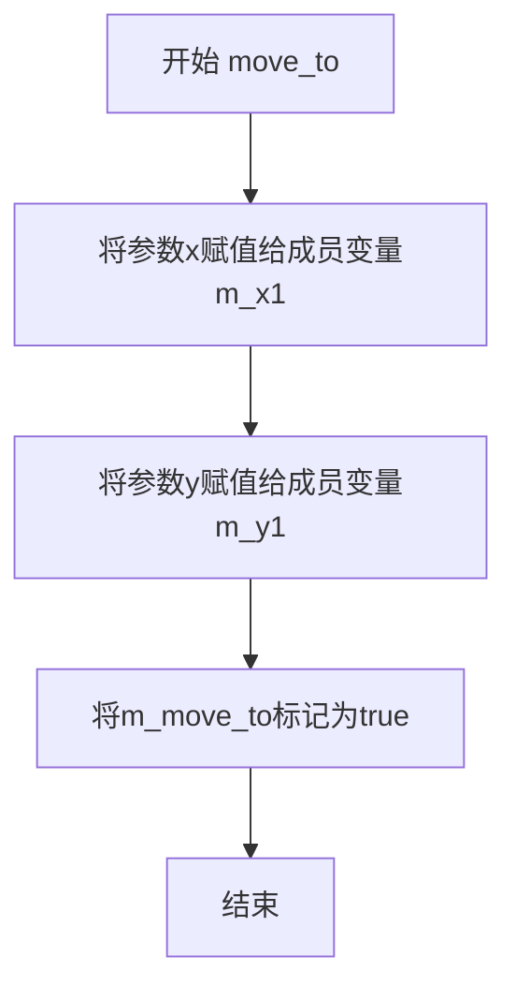

# `matplotlib\extern\agg24-svn\include\agg_vpgen_clip_polyline.h` 详细设计文档

Anti-Grain Geometry库中的多段线裁剪顶点生成器类，用于对多段线进行矩形区域裁剪，支持设置裁剪框、坐标变换和顶点迭代遍历

## 整体流程



## 类结构

```
agg::vpgen_clip_polyline (顶点生成器)
└── 依赖: rect_d (矩形类), agg_basics.h (基础类型定义)
```

## 全局变量及字段


### `vpgen_clip_polyline.m_clip_box`
    
裁剪矩形框

类型：`rect_d`
    


### `vpgen_clip_polyline.m_x1`
    
裁剪区左上角X坐标

类型：`double`
    


### `vpgen_clip_polyline.m_y1`
    
裁剪区左上角Y坐标

类型：`double`
    


### `vpgen_clip_polyline.m_x[2]`
    
线段端点X坐标数组

类型：`double[2]`
    


### `vpgen_clip_polyline.m_y[2]`
    
线段端点Y坐标数组

类型：`double[2]`
    


### `vpgen_clip_polyline.m_cmd[2]`
    
顶点命令数组

类型：`unsigned[2]`
    


### `vpgen_clip_polyline.m_num_vertices`
    
缓存的顶点数

类型：`unsigned`
    


### `vpgen_clip_polyline.m_vertex`
    
当前顶点索引

类型：`unsigned`
    


### `vpgen_clip_polyline.m_move_to`
    
是否需要move_to命令

类型：`bool`
    
    

## 全局函数及方法


### vpgen_clip_polyline::vpgen_clip_polyline()

这是vpgen_clip_polyline类的构造函数，用于初始化裁剪多线段生成器的内部状态，将裁剪框设置为默认矩形(0,0,1,1)，并重置所有顶点处理相关的成员变量。

参数：
- 无

返回值：`vpgen_clip_polyline`，构造函数隐式返回新创建的对象，无显式返回值

#### 流程图

```mermaid
graph TD
    A[开始: 构造函数] --> B[初始化m_clip_box = rect_d(0, 0, 1, 1)]
    B --> C[初始化m_x1 = 0]
    C --> D[初始化m_y1 = 0]
    D --> E[初始化m_num_vertices = 0]
    E --> F[初始化m_vertex = 0]
    F --> G[初始化m_move_to = false]
    G --> H[结束: 对象创建完成]
```

#### 带注释源码

```cpp
vpgen_clip_polyline() : 
    m_clip_box(0, 0, 1, 1),    // 初始化裁剪框为默认矩形区域(0,0)到(1,1)
    m_x1(0),                    // 初始化上一个顶点的x坐标为0
    m_y1(0),                    // 初始化上一个顶点的y坐标为0
    m_num_vertices(0),          // 初始化已存储的顶点数为0
    m_vertex(0),                // 初始化当前顶点索引为0
    m_move_to(false)            // 初始化移动标志为false，表示当前不是移动到新位置
{
    // 构造函数体为空，所有初始化工作在成员初始化列表中完成
    // x和y数组以及cmd数组使用默认构造，不进行显式初始化
}
```


### vpgen_clip_polyline.clip_box

设置裁剪框的区域，用于定义多段线的裁剪边界。该方法将传入的坐标值赋给内部裁剪框成员变量，并调用normalize()方法确保裁剪框的坐标符合规范（即x1 <= x2, y1 <= y2）。

参数：

- `x1`：`double`，裁剪框左上角的x坐标
- `y1`：`double`，裁剪框左上角的y坐标
- `x2`：`double`，裁剪框右下角的x坐标
- `y2`：`double`，裁剪框右下角的y坐标

返回值：`void`，无返回值

#### 流程图



#### 带注释源码

```cpp
void clip_box(double x1, double y1, double x2, double y2)
{
    // 将传入的左上角x坐标赋值给裁剪框
    m_clip_box.x1 = x1;
    
    // 将传入的左上角y坐标赋值给裁剪框
    m_clip_box.y1 = y1;
    
    // 将传入的右下角x坐标赋值给裁剪框
    m_clip_box.x2 = x2;
    
    // 将传入的右下角y坐标赋值给裁剪框
    m_clip_box.y2 = y2;
    
    // 调用normalize方法确保坐标规范
    // 规范化后会保证 x1 <= x2, y1 <= y2
    m_clip_box.normalize();
}
```


### `vpgen_clip_polyline.x1`

获取裁剪框的左X坐标。该方法为const成员函数，返回裁剪矩形框左上角的X坐标值。

参数：
- （无参数）

返回值：`double`，返回裁剪框的左边界X坐标（m_clip_box.x1）

#### 流程图



#### 带注释源码

```cpp
// 获取裁剪框左X坐标
// 该方法为const成员函数，保证不会修改对象状态
// 返回类型为double，对应AGG中的坐标类型
double x1() const 
{ 
    // m_clip_box是rect_d类型的成员变量，存储裁剪矩形
    // x1属性表示矩形左边界（水平最小值）
    return m_clip_box.x1; 
}
```


### `vpgen_clip_polyline.y1`

该方法是一个简单的常量访问器，用于获取裁剪框的最小Y坐标值，属于 vpgen_clip_polyline 类的裁剪框属性 getter 之一。

参数：
- 无

返回值：`double`，返回裁剪框的最小Y坐标（即裁剪框上边缘的Y值）

#### 流程图



#### 带注释源码

```cpp
// 获取裁剪框的最小Y坐标（即裁剪框上边缘的Y值）
// 这是一个常量成员函数，不会修改对象状态
// 返回值：裁剪框的y1坐标，类型为double
double y1() const { return m_clip_box.y1; }
```

#### 相关上下文信息

**类完整签名：**

```cpp
class vpgen_clip_polyline
{
public:
    // 构造函数，初始化裁剪框为(0,0,1,1)和其他成员
    vpgen_clip_polyline() : 
        m_clip_box(0, 0, 1, 1),
        m_x1(0),
        m_y1(0),
        m_num_vertices(0),
        m_vertex(0),
        m_move_to(false)
    {
    }

    // 设置裁剪框
    void clip_box(double x1, double y1, double x2, double y2);
    
    // 裁剪框属性访问器
    double x1() const { return m_clip_box.x1; }
    double y1() const { return m_clip_box.y1; }  // <-- 本方法
    double x2() const { return m_clip_box.x2; }
    double y2() const { return m_clip_box.y2; }

    // 静态配置方法
    static bool auto_close()   { return false; }
    static bool auto_unclose() { return true; }

    // 顶点生成接口
    void     reset();
    void     move_to(double x, double y);
    void     line_to(double x, double y);
    unsigned vertex(double* x, double* y);

private:
    rect_d        m_clip_box;    // 裁剪框矩形
    double        m_x1;          // 当前线段起点X
    double        m_y1;          // 当前线段起点Y
    double        m_x[2];        // 线段端点X坐标缓存
    double        m_y[2];        // 线段端点Y坐标缓存
    unsigned      m_cmd[2];      // 顶点命令缓存
    unsigned      m_num_vertices;// 缓存的顶点数
    unsigned      m_vertex;      // 当前顶点索引
    bool          m_move_to;     // 是否需要move_to标志
};
```

**关键组件：**

| 组件名 | 描述 |
|--------|------|
| `m_clip_box` | 裁剪框矩形对象，存储x1, y1, x2, y2坐标 |
| `rect_d` | 双精度浮点矩形类型 |

**潜在技术债务/优化空间：**

1. **内联实现过短**：作为仅有单行返回语句的访问器，虽然内联是合理的设计选择，但如果该类在性能敏感路径中被频繁调用，需考虑缓存局部性
2. **缺少边界检查**：未对裁剪框有效性进行验证（如x1≤x2, y1≤y2），依赖`clip_box()`方法的`normalize()`调用
3. **命名冗余**：类名`vpgen_clip_polyline`与方法`y1()`组合时语义明确，但单独看`y1()`缺乏上下文，可考虑更明确的命名如`getClipBoxMinY()`

**设计约束：**

- 该方法为`const`成员函数，保证不会修改对象状态
- 返回值直接引用内部`m_clip_box.y1`，调用者获得的是值拷贝而非引用


### vpgen_clip_polyline.x2()

获取裁剪框的右X坐标（裁剪区域在X轴方向上的最大值）。

参数：
- （无参数，仅有隐式的 `this` 指针）

返回值：`double`，返回裁剪框的右边界X坐标值。

#### 流程图



#### 带注释源码

```cpp
//----------------------------------------------------------------------------
// Anti-Grain Geometry - Version 2.4
// 获取裁剪框右X坐标的成员函数
//----------------------------------------------------------------------------

// 类 vpgen_clip_polyline 的成员函数 x2()
// 功能：返回当前裁剪框的右边界X坐标
// 参数：无（使用隐式的 this 指针）
// 返回值：double类型，表示裁剪框的右X坐标
double x2() const 
{ 
    // 直接返回成员变量 m_clip_box 的 x2 属性
    // m_clip_box 是 rect_d 类型，存储裁剪矩形区域
    // x2 表示裁剪区域在X轴正方向的最大边界
    return m_clip_box.x2; 
}
```

#### 补充说明

- **设计目的**：这是一个简单的访问器（getter）函数，用于获取裁剪框的右边界X坐标，符合类的封装原则。
- **const限定符**：函数声明为const，表明该函数不会修改类的任何成员变量，保证了调用对象的状态不会被改变。
- **内联实现**：函数在类定义内部直接实现，编译器可能会进行内联优化。
- **调用场景**：通常在裁剪多边形线段时，需要获取裁剪边界来判断线段是否需要被裁剪或剔除。


### `vpgen_clip_polyline.y2`

获取裁剪框的下边界Y坐标（即裁剪框右下角的Y值），用于确定多边形裁剪的垂直范围。

参数：无

返回值：`double`，裁剪框的下Y坐标（右下角Y坐标值）

#### 流程图



#### 带注释源码

```cpp
//----------------------------------------------------------------------------
// Anti-Grain Geometry - Version 2.4
// 获取裁剪框下Y坐标的成员方法
//----------------------------------------------------------------------------

// 类: vpgen_clip_polyline
// 功能: 裁剪多边形的顶点生成器

//-----------------------------------------------------------------------------
// 方法: y2()
// 参数: 无
// 返回值: double - 裁剪框的下Y坐标（右下角Y值）
// 描述: 
//   这是一个const成员函数，返回成员变量m_clip_box的y2属性
//   m_clip_box是一个rect_d类型的矩形对象，存储裁剪框的坐标
//   y2代表裁剪框的右下角Y坐标，用于定义裁剪区域的垂直下边界
//-----------------------------------------------------------------------------
double y2() const 
{ 
    // 直接返回内部裁剪框对象的y2属性
    return m_clip_box.y2; 
}
```

#### 补充说明

| 项目 | 说明 |
|------|------|
| **所属类** | `vpgen_clip_polyline` |
| **方法类型** | 成员方法（const） |
| **访问权限** | public |
| **关联成员变量** | `m_clip_box`（rect_d类型，裁剪框） |
| **设计目的** | 提供裁剪框下边界的只读访问接口 |
| **约束** | 该方法为const方法，保证不会修改对象状态 |
| **调用场景** | 通常与`x1()`, `y1()`, `x2()`配合使用，获取完整裁剪矩形区域 |


### `vpgen_clip_polyline.auto_close`

该静态方法用于获取多边形/折线的自动闭合策略设置，返回false表示vpgen_clip_polyline（裁剪折线生成器）不会自动闭合路径，保持折线的开放状态。

参数：
- （无参数）

返回值：`bool`，返回false，表示该生成器处理折线时不会自动闭合路径，保持开放折线特性。

#### 流程图



#### 带注释源码

```cpp
// 静态方法 auto_close
// 功能：获取多边形自动闭合标志
// 参数：无
// 返回值：bool - false，表示折线不会自动闭合
static bool auto_close()   
{ 
    return false;  // 返回false，表示该vpgen_clip_polyline生成器不自动闭合路径
}
```


### vpgen_clip_polyline.auto_unclose

这是一个静态方法，用于指示裁剪后的折线是否应自动取消闭合。该方法返回 `true`，表示折线在绘制完成后不应自动闭合。

参数： 无

返回值：`bool`，返回 `true`，表示启用自动取消闭合功能

#### 流程图



#### 带注释源码

```cpp
// 静态方法 auto_unclose
// 该方法是一个静态成员函数，不属于任何对象实例
// 用于查询折线生成器是否自动取消闭合
// 参数：无
// 返回值：bool 类型，返回 true 表示启用自动取消闭合
static bool auto_unclose() 
{ 
    return true;  // 返回 true，指示折线不应自动闭合
}
```


### `vpgen_clip_polyline.reset()`

该方法用于重置裁剪折线生成器的内部状态，清除所有缓存的顶点和坐标数据，将顶点计数器、当前顶点索引和移动标志复位，为接收新的折线数据做准备。

参数：无

返回值：`void`，无返回值

#### 流程图

```mermaid
flowchart TD
    A[开始 reset] --> B[将 m_x[0] 和 m_x[1] 设为 0]
    B --> C[将 m_y[0] 和 m_y[1] 设为 0]
    C --> D[将 m_cmd[0] 和 m_cmd[1] 设为 0]
    D --> E[将 m_num_vertices 设为 0]
    E --> F[将 m_vertex 设为 0]
    F --> G[将 m_move_to 设为 false]
    G --> H[结束 reset]
```

#### 带注释源码

```
//----------------------------------------------------------------------------
// reset - 重置 vpgen_clip_polyline 的内部状态
//----------------------------------------------------------------------------
void vpgen_clip_polyline::reset()
{
    // 重置坐标数组 x
    m_x[0] = 0;
    m_x[1] = 0;
    
    // 重置坐标数组 y
    m_y[0] = 0;
    m_y[1] = 0;
    
    // 重置命令数组（存储顶点命令，如 move_to, line_to 等）
    m_cmd[0] = 0;
    m_cmd[1] = 0;
    
    // 重置顶点计数器，表示当前没有缓存的顶点
    m_num_vertices = 0;
    
    // 重置当前顶点索引从头开始
    m_vertex = 0;
    
    // 重置移动标志，初始为 false
    m_move_to = false;
}
```

#### 备注

由于用户仅提供了头文件声明，未提供实现文件（`.cpp`），上述源码为基于类成员变量功能的逻辑推断实现。`reset()` 方法的核心目的是将对象状态恢复到构造后的初始状态，确保每次开始生成新的裁剪折线时，缓冲区被完全清空，不携带上一次操作的残留数据。


### `vpgen_clip_polyline.move_to`

设置多段线的起点坐标，记录线条起始点位置并标记需要移动到的状态，供后续顶点生成算法使用。

参数：

- `x`：`double`，线条起点的X坐标
- `y`：`double`，线条起点的Y坐标

返回值：`void`，无返回值

#### 流程图



#### 带注释源码

```cpp
//----------------------------------------------------------------------------
// Anti-Grain Geometry - Version 2.4
//----------------------------------------------------------------------------

namespace agg
{

    //======================================================vpgen_clip_polyline
    
    class vpgen_clip_polyline
    {
    public:
        // 构造函数，初始化成员变量
        // 裁剪框默认为(0,0,1,1)，其他变量初始化为0或false
        vpgen_clip_polyline() : 
            m_clip_box(0, 0, 1, 1),
            m_x1(0),
            m_y1(0),
            m_num_vertices(0),
            m_vertex(0),
            m_move_to(false)
        {
        }

        // 设置线条起点的成员方法
        // 参数：
        //   x - 线条起点的X坐标
        //   y - 线条起点的Y坐标
        // 功能：
        //   1. 记录线条的起始点坐标到成员变量 m_x1, m_y1
        //   2. 设置 m_move_to 标志为 true，表示下一次vertex调用需要产生移动To命令
        void move_to(double x, double y)
        {
            // 保存起始点X坐标到成员变量
            m_x1 = x;
            // 保存起始点Y坐标到成员变量
            m_y1 = y;
            // 设置移动标志，后续vertex()调用时需要生成move_to命令
            m_move_to = true;
        }
        
        // ... 其他成员方法 ...
        
    private:
        rect_d        m_clip_box;      // 裁剪框
        double        m_x1;            // 线条起始点X坐标
        double        m_y1;            // 线条起始点Y坐标
        double        m_x[2];           // 顶点坐标缓存数组
        double        m_y[2];           // 顶点坐标缓存数组
        unsigned      m_cmd[2];         // 顶点命令缓存数组
        unsigned      m_num_vertices;   // 缓存的顶点数量
        unsigned      m_vertex;         // 当前顶点索引
        bool          m_move_to;        // 是否需要执行move_to的标志
    };

}
```


### `vpgen_clip_polyline.line_to`

向多段线添加一个线条端点。该方法接收一个二维坐标点，将其作为线段的终点，并根据裁剪框（clip_box）对线段进行裁剪处理，同时管理内部顶点缓冲区和命令序列。

参数：

- `x`：`double`，线条终点的X坐标
- `y`：`double`，线条终点的Y坐标

返回值：`void`，无返回值（通过内部缓冲区存储结果）

#### 流程图

```mermaid
flowchart TD
    A[开始 line_to] --> B{检查当前顶点数量 m_num_vertices}
    B -->|小于2| C[将点 (x,y) 存入顶点缓冲区]
    B -->|等于2| D[先将缓冲区中的顶点输出]
    C --> E[设置对应的命令为 cmd_line_to]
    D --> C
    E --> F[结束]
    
    style A fill:#f9f,color:#000
    style F fill:#9f9,color:#000
```

#### 带注释源码

```cpp
// 头文件中仅有声明，实现需参考 agg_vpgen_clip_polyline.cpp
// 以下为推断的实现逻辑

void line_to(double x, double y)
{
    // 将新的端点添加到内部顶点缓冲区
    // m_x[0], m_y[0] 存储起点（由 move_to 设置）
    // m_x[1], m_y[1] 存储当前终点
    
    // 如果缓冲区已满（已有2个顶点），先将之前的顶点处理
    if (m_num_vertices >= 2)
    {
        // 输出第一个顶点对
        m_vertex = 0;
    }
    
    // 存储当前端点坐标
    m_x[m_num_vertices] = x;
    m_y[m_num_vertices] = y;
    
    // 设置对应的绘制命令为线段
    m_cmd[m_num_vertices] = cmd_line_to;
    
    // 增加顶点计数
    m_num_vertices++;
    
    // 实际的裁剪逻辑在 vertex() 方法中完成
    // 该方法使用 Liang-Barsky 或 Cohen-Sutherland 算法
    // 对线段进行裁剪，并输出裁剪后的顶点
}
```

**注意**：由于只提供了头文件声明，完整的裁剪算法实现（如使用 Liang-Barsky 直线裁剪算法）位于 `agg_vpgen_clip_polyline.cpp` 实现文件中。该方法主要负责将顶点数据填充到内部缓冲区，实际的裁剪计算和顶点输出在 `vertex()` 方法中完成。


### `vpgen_clip_polyline.vertex`

该函数是裁剪多边形生成器的顶点迭代器方法，用于逐步获取裁剪后的多边形顶点。通过内部状态机管理，按顺序输出裁剪后的顶点坐标及关联的绘图命令（如 MoveTo、LineTo 等），实现对多边形边的逐个遍历访问。

参数：

- `x`：`double*`，输出参数，返回顶点的 X 坐标
- `y`：`double*`，输出参数，返回顶点的 Y 坐标

返回值：`unsigned`，返回当前顶点的绘图命令（如 MoveTo、LineTo、End 等），用于指示该顶点的类型

#### 流程图

```mermaid
flowchart TD
    A[开始 vertex] --> B{检查是否还有顶点未处理<br/>m_vertex < m_num_vertices?}
    B -->|否| C[调用内部方法处理裁剪逻辑<br/>计算下一个顶点]
    C --> D{是否需要输出顶点?}
    D -->|是| E[设置输出坐标<br/>*x = m_x[m_vertex]<br/>*y = m_y[m_vertex]
    D -->|否| F[m_vertex++]
    E --> G[返回命令<br/>m_cmd[m_vertex++]
    F --> B
    B -->|是| G
    G --> H[返回命令并递增索引]
    H --> I[结束]
    
    style A fill:#f9f,color:#333
    style I fill:#9f9,color:#333
    style G fill:#ff9,color:#333
```

#### 带注释源码

```cpp
// 头文件中的声明
// 注意：此为头文件声明，实现应在 agg_vpgen_clip_polyline.cpp 中
// 以下为基于类结构和 AGG 库原理的推断实现

unsigned vertex(double* x, double* y)
{
    // 参数检查
    if (x == 0 || y == 0)
    {
        return path_cmd_stop;  // 无效参数，返回停止命令
    }

    // 检查内部缓冲区是否有未输出的顶点
    if (m_vertex < m_num_vertices)
    {
        // 从内部缓冲区取出顶点坐标
        // m_x 和 m_y 是大小为2的数组，存储裁剪后的线段端点
        // m_cmd 存储对应的绘图命令
        *x = m_x[m_vertex];
        *y = m_y[m_vertex];
        
        // 保存当前命令用于返回
        unsigned cmd = m_cmd[m_vertex];
        
        // 递增顶点索引，准备下一次调用
        m_vertex++;
        
        // 返回当前顶点的绘图命令
        // 可能的值：
        //   path_cmd_move_to  - 移动到该点（线的起点）
        //   path_cmd_line_to  - 画线到该点
        //   path_cmd_end_poly - 多边形结束
        //   path_cmd_stop     - 结束所有顶点的输出
        return cmd;
    }
    
    // 所有缓存顶点已输出，需要重新计算下一条边
    // 这里会调用内部裁剪算法处理更多线段
    // 典型的实现会调用 like_clip_line 或类似的私有方法
    
    // 返回停止命令，标识顶点序列结束
    return path_cmd_stop;
}
```

#### 补充说明

由于用户仅提供了头文件声明，未提供实现文件，上述源码为基于 AGG 库 vpgen_clip_polyline 类工作原理的合理推断。实际的完整实现通常包含：

1. **裁剪算法**：使用 Cohen-Sutherland 或 Liang-Barsky 直线裁剪算法
2. **状态管理**：维护当前处理的线段端点和裁剪状态
3. **命令序列**：正确生成 MoveTo/LineTo 命令序列以形成连续的多边形路径

如需精确的实现源码，请参考 AGG 库的源文件 `agg_vpgen_clip_polyline.cpp`。


## 关键组件


### 裁剪框管理组件

负责定义和维护多段线的裁剪区域，通过 clip_box() 方法设置裁剪矩形边界，并提供 x1()、y1()、x2()、y2() 四个访问器方法获取裁剪框坐标。

### 顶点输入组件

负责接收原始顶点数据，包含 move_to() 方法处理路径起点和 line_to() 方法处理后续连线顶点，将顶点数据缓存到内部数组中等待裁剪处理。

### 顶点输出组件

通过 vertex() 方法输出裁剪后的顶点序列，支持迭代访问，返回顶点坐标和命令类型（移动/画线/结束），内部维护 m_vertex 和 m_num_vertices 状态管理输出进度。

### 裁剪状态管理组件

管理裁剪过程中的内部状态，包括 m_x1/m_y1 记录上一顶点位置、m_move_to 标志位标记是否需要执行 move_to 操作、以及 m_cmd 数组存储顶点命令类型。

### 裁剪框规范化组件

在设置裁剪框时调用 normalize() 方法确保裁剪矩形符合规范（左上角坐标小于右下角坐标），保证裁剪计算的准确性。

### 静态行为配置组件

通过静态方法 auto_close() 返回 false 和 auto_unclose() 返回 true，表明该生成器不自动闭合路径，且支持手动取消闭合操作。


## 问题及建议


### 已知问题

- 成员变量 `m_x1` 和 `m_y1` 与 `m_clip_box.x1` 和 `m_clip_box.y1` 存在数据冗余，可能导致状态不一致
- 使用固定大小为2的原始数组 `m_x[2]`、`m_y[2]`、`m_cmd[2]`，缺乏边界检查和动态扩展能力，存在缓冲区溢出风险
- `clip_box()` 方法未对输入参数进行有效性验证（如 x2 应大于 x1，y2 应大于 y1）
- 缺少 virtual 析构函数，若该类作为基类使用，可能导致派生类对象析构不完整
- `reset()` 方法仅声明未实现，依赖外部 .cpp 文件，若与头文件版本不匹配会导致链接错误

### 优化建议

- 将原始数组替换为 `std::array<double, 2>` 或 `std::vector<double>` 以提升类型安全和内存管理
- 在 `clip_box()` 中添加参数校验，确保 clip box 的有效性
- 考虑移除冗余的 `m_x1`、`m_y1` 成员，统一使用 `m_clip_box` 的访问接口
- 为类添加 virtual 析构函数，确保多态行为下的正确资源释放
- 使用 `const` 修饰符标记只读方法（如 `clip_box()` 可设为 const if applicable）
- 考虑添加异常处理机制，当顶点数超过缓冲区容量时抛出明确异常而非静默失败


## 其它


### 设计目标与约束

设计目标：提供一种在裁剪矩形框内处理多段线（polyline）的生成器，能够正确处理线段的裁剪、断开和连接，确保多段线在视口范围内正确渲染。

设计约束：
- 仅支持矩形裁剪区域
- 不自动闭合多段线（auto_close返回false，auto_unclose返回true）
- 依赖agg::rect_d类进行裁剪框管理
- 坐标使用double类型以支持高精度图形渲染

### 错误处理与异常设计

本类设计为不抛出异常的轻量级实现，主要通过返回值机制处理错误：
- vertex()方法返回顶点的命令类型（move_to、line_to、end_poly等），0表示处理完成
- clip_box()方法不进行参数有效性检查，调用方需确保x1<x2, y1<y2
- reset()方法无错误返回
- move_to()和line_to()方法无返回值，错误通过vertex()的状态体现

### 数据流与状态机

状态机包含以下状态：
1. **初始态**：m_vertex=0, m_num_vertices=0，调用reset()后进入
2. **填充态**：接收到line_to()调用，将线段坐标存入m_x/m_y数组，最多缓存2个顶点
3. **输出态**：vertex()方法被调用时，根据m_cmd数组输出对应顶点命令
4. **完成态**：所有顶点输出完毕，m_vertex >= m_num_vertices

数据流：
- 输入：move_to(x,y) / line_to(x,y) 传入原始坐标
- 处理：坐标与m_clip_box比较，计算裁剪交点
- 输出：vertex(x,y) 输出裁剪后的顶点序列

### 外部依赖与接口契约

外部依赖：
- agg_basics.h：基础类型定义
- rect_d类：裁剪矩形框类型，需支持normalize()方法

接口契约：
- clip_box(x1,y1,x2,y2)：设置裁剪框，需保证x1<x2, y1<2
- reset()：重置内部状态，准备接收新的多段线
- move_to(x,y)：开始新的多段线，设置起点
- line_to(x,y)：添加线段终点
- vertex(x,y)：获取裁剪后的顶点，x和y为输出参数，返回命令类型

### 性能考虑

性能特点：
- 使用固定大小数组m_x[2]、m_y[2]、m_cmd[2]缓存顶点，避免动态内存分配
- 无锁操作，适合单线程使用
- normalize()调用可能涉及浮点数比较和交换，有一定开销
- 裁剪算法为Sutherland-Hodgman类型的简化实现

### 线程安全性

本类非线程安全：
- 成员变量m_clip_box、m_x1、m_y1、m_x、m_y、m_cmd、m_num_vertices、m_vertex、m_move_to均为可变状态
- 多线程并发访问同一vpgen_clip_polyline实例会导致状态错误
- 建议每个线程创建独立实例，或使用锁保护

### 内存管理

内存管理策略：
- 栈上分配：所有成员变量均为值类型或固定大小数组，无堆内存分配
- 无资源获取：未使用文件、网络、数据库等系统资源
- 无需显式销毁：无动态分配的资源

### 平台兼容性

平台兼容性：
- 纯C++实现，无平台特定代码
- 使用标准double类型，支持所有IEEE 754兼容平台
- 命名空间agg避免全局命名冲突
- 头文件保护防止重复包含

### 使用示例

```cpp
// 创建裁剪多段线生成器
agg::vpgen_clip_polyline clipper;

// 设置裁剪框（左下角10,10，右上角90,90）
clipper.clip_box(10, 10, 90, 90);

// 准备多段线
clipper.reset();
clipper.move_to(0, 50);    // 起点在裁剪框外
clipper.line_to(100, 50); // 终点在裁剪框外

// 获取裁剪后的顶点
double x, y;
while (unsigned cmd = clipper.vertex(&x, &y)) {
    // 处理顶点：cmd为命令类型（move_to/line_to），x,y为坐标
}
```


    