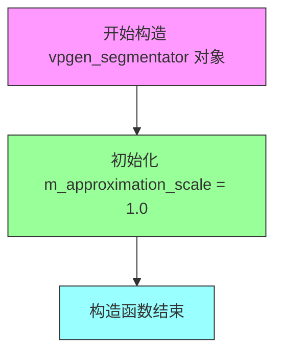
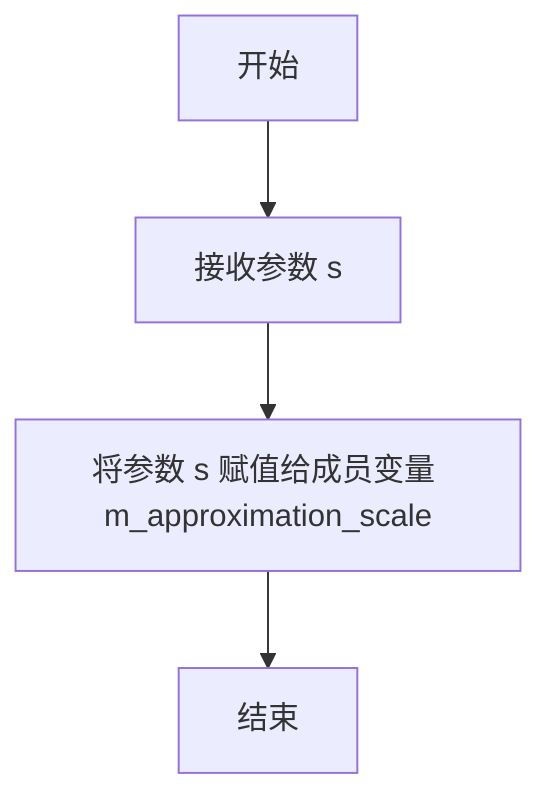
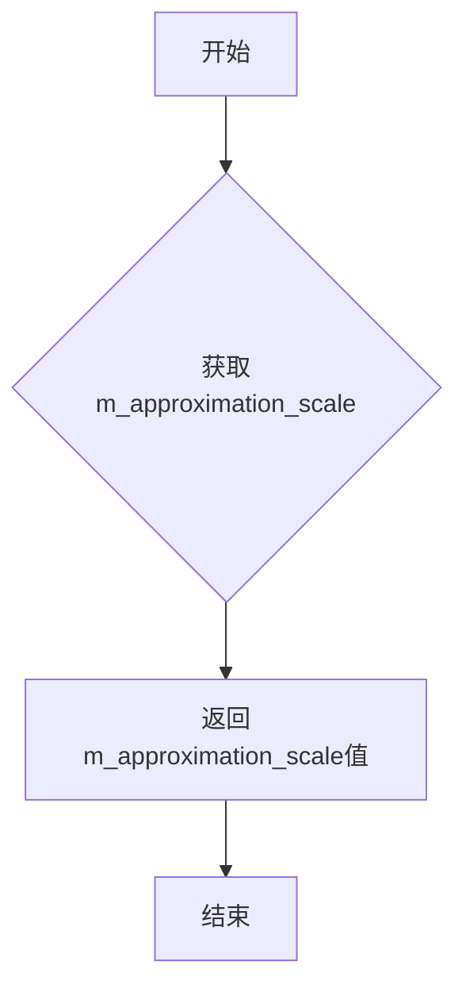
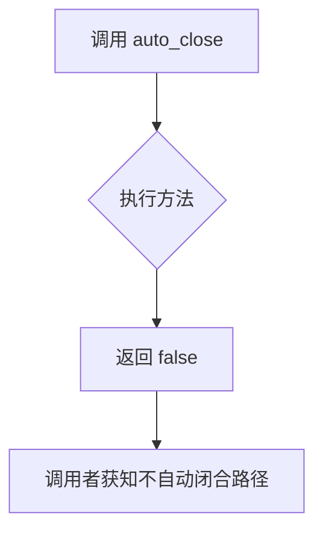
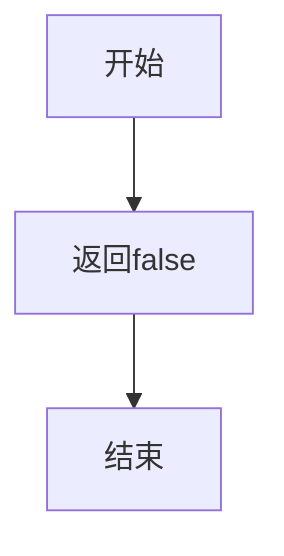
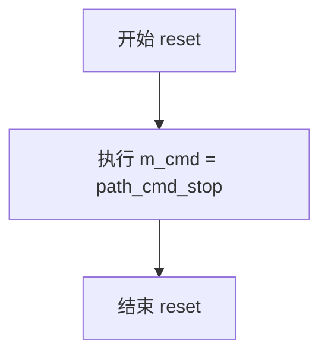
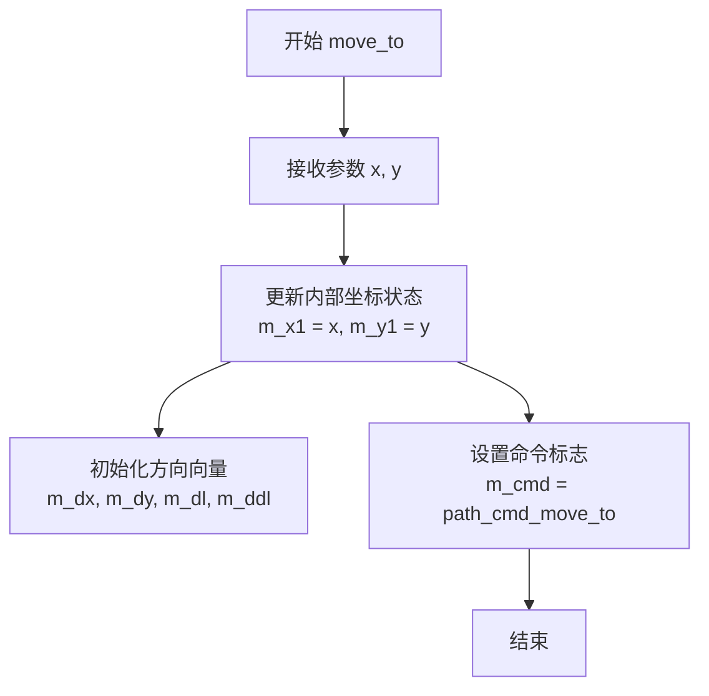
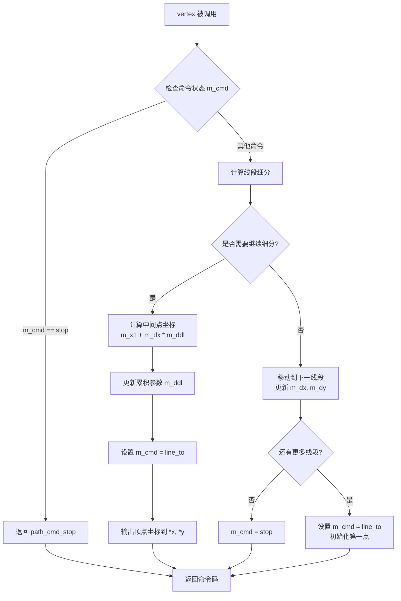

# `matplotlib\extern\agg24-svn\include\agg_vpgen_segmentator.h` 详细设计文档

这是 Anti-Grain Geometry (AGG) 库中的一个顶点生成器分段器类，用于将线段路径分割成更小的近似线段，支持设置近似比例因子，处理路径命令并生成顶点序列。

## 整体流程

```mermaid
graph TD
    A[开始] --> B[初始化 vpgen_segmentator]
    B --> C[调用 reset() 重置状态]
    C --> D{接收到路径命令?}
    D -- move_to --> E[设置起点 m_x1, m_y1]
    D -- line_to --> F[计算方向向量和长度]
    D -- vertex --> G[生成顶点序列]
    E --> H[返回 path_cmd_move_to]
    F --> I[计算细分点]
    G --> J{还有更多顶点?}
    J -- 是 --> K[返回下一个顶点坐标]
    J -- 否 --> L[返回 path_cmd_stop]
    I --> G
```

## 类结构

```
agg (命名空间)
└── vpgen_segmentator (顶点生成器分段器类)
```

## 全局变量及字段


### `vpgen_segmentator.m_approximation_scale`
    
近似比例因子，控制线段细分程度

类型：`double`
    


### `vpgen_segmentator.m_x1`
    
起点X坐标

类型：`double`
    


### `vpgen_segmentator.m_y1`
    
起点Y坐标

类型：`double`
    


### `vpgen_segmentator.m_dx`
    
方向向量X分量

类型：`double`
    


### `vpgen_segmentator.m_dy`
    
方向向量Y分量

类型：`double`
    


### `vpgen_segmentator.m_dl`
    
当前线段长度

类型：`double`
    


### `vpgen_segmentator.m_ddl`
    
细分线段长度增量

类型：`double`
    


### `vpgen_segmentator.m_cmd`
    
当前路径命令状态

类型：`unsigned`
    
    

## 全局函数及方法


### `vpgen_segmentator.vpgen_segmentator() - 构造函数`

vpgen_segmentator类的构造函数，用于初始化vpgen_segmentator对象，将近似比例尺（approximation_scale）设置为默认值1.0，并准备后续的路径处理操作。

参数：
- 无

返回值：
- 无（构造函数不返回任何值）

#### 流程图



#### 带注释源码

```cpp
//----------------------------------------------------------------------------
// Anti-Grain Geometry - Version 2.4
// 构造函数实现
//----------------------------------------------------------------------------

vpgen_segmentator() : m_approximation_scale(1.0) {}
// 构造函数说明：
// - 这是一个默认构造函数
// - 使用初始化列表将 m_approximation_scale 初始化为 1.0
// - 其他成员变量（m_x1, m_y1, m_dx, m_dy, m_dl, m_ddl, m_cmd）保持未初始化状态
// - 这些变量将在后续的 move_to(), line_to() 等方法调用时被设置
```


### `vpgen_segmentator.approximation_scale`

设置近似比例因子，用于控制顶点生成的精度。该方法允许用户调整曲线近似算法的缩放比例，从而影响生成顶点的数量和精度。

参数：

- `s`：`double`，近似比例因子，用于调整曲线近似的精度

返回值：`void`，无返回值

#### 流程图



#### 带注释源码

```cpp
// 设置近似比例因子
// 参数: s - double类型，表示近似比例因子值
// 返回值: void，无返回值
void approximation_scale(double s) 
{ 
    m_approximation_scale = s;     // 将传入的比例因子s赋值给成员变量m_approximation_scale
}
```


### `vpgen_segmentator.approximation_scale()`

该函数是 `vpgen_segmentator` 类的常量成员函数，用于获取近似比例因子（approximation scale）。该因子用于控制曲线逼近的精度，值越大生成的曲线段数越多、越精细。

参数：无

返回值：`double`，返回当前的近似比例因子值，默认值为 1.0

#### 流程图



#### 带注释源码

```cpp
// 获取近似比例因子
// 该因子用于控制曲线逼近的精度
// 返回值：double类型的近似比例因子，默认值为1.0
double approximation_scale() const 
{ 
    return m_approximation_scale;  // 返回成员变量m_approximation_scale的值
}
```

#### 关联信息

- **Setter方法**：`void approximation_scale(double s)` - 设置近似比例因子
- **成员变量**：`m_approximation_scale` - double类型，存储近似比例因子值
- **设计目的**：允许用户在渲染前调整曲线逼近的精度，以在性能和画质之间取得平衡
- **调用场景**：通常在生成顶点序列时，由其他类（如渲染器）调用以获取当前的比例因子来计算曲线段数


### `vpgen_segmentator.auto_close`

这是一个静态方法，用于指示顶点生成器在处理路径时不自动闭合路径，返回 false 表示不自动闭合。

参数：
- （无参数）

返回值：`bool`，返回 false，表示该生成器不会自动闭合路径。

#### 流程图



#### 带注释源码

```cpp
// 静态方法 auto_close
// 用途：返回该顶点生成器是否自动闭合路径的标志
// 参数：无
// 返回值：bool - 始终返回 false，表示不自动闭合路径
static bool auto_close()   
{ 
    return false; 
}
```


### `vpgen_segmentator.auto_unclose`

该静态方法用于返回是否启用自动反闭合功能，在此实现中始终返回false，表示不自动反闭合路径。

参数：无

返回值：`bool`，返回false表示不启用自动反闭合功能

#### 流程图



#### 带注释源码

```cpp
// 静态方法auto_unclose()
// 用途：返回是否启用自动反闭合功能
// 参数：无
// 返回值：bool - 始终返回false，表示不自动反闭合路径
static bool auto_unclose() { return false; }
```


### `vpgen_segmentator.reset()`

该方法用于重置vpgen_segmentator类的内部状态，将路径命令设置为停止命令(path_cmd_stop)，以便重新开始新的路径处理。

参数：

- （无参数）

返回值：`void`，无返回值描述

#### 流程图



#### 带注释源码

```cpp
//----------------------------------------------------------------------------
// Anti-Grain Geometry - Version 2.4
//----------------------------------------------------------------------------

// vpgen_segmentator类的reset方法实现
// 该方法重置内部状态，将命令设为path_cmd_stop
void reset() 
{ 
    // 将成员变量m_cmd设置为path_cmd_stop（路径命令停止）
    // 这会终止当前的路径，准备接收新的路径命令
    m_cmd = path_cmd_stop; 
}
```

#### 上下文信息

**所属类：** `vpgen_segmentator`

**类功能简述：**
vpgen_segmentator是AGG（Anti-Grain Geometry）库中的一个顶点生成器类，负责将线段转换为顶点序列，主要用于路径渲染和近似计算。

**类成员变量（reset方法关联）：**

| 变量名称 | 类型 | 描述 |
|---------|------|------|
| `m_cmd` | unsigned | 当前的路径命令状态，reset将其设置为path_cmd_stop |
| `m_approximation_scale` | double | 近似缩放因子 |
| `m_x1`, `m_y1` | double | 起点坐标 |
| `m_dx`, `m_dy` | double | 方向向量 |
| `m_dl`, `m_ddl` | double | 线段长度相关参数 |

**相关方法：**

| 方法名 | 功能描述 |
|--------|---------|
| `move_to(double x, double y)` | 移动到指定坐标 |
| `line_to(double x, double y)` | 画线到指定坐标 |
| `vertex(double* x, double* y)` | 获取下一个顶点 |

**设计约束：**

- `path_cmd_stop` 是AGG库中定义的常量，表示路径命令的停止状态
- 该方法不返回任何值，也不接受任何参数
- 调用此方法后，后续的vertex()调用将返回停止状态

**潜在优化空间：**
- 当前实现极其简洁，性能开销极低
- 若未来需要更复杂的重置逻辑（如同时重置其他状态变量），可考虑扩展该方法


### vpgen_segmentator.move_to

该方法用于设置路径的起始点，将路径的当前坐标移动到指定的 (x, y) 位置，作为后续 line_to 等操作的基础点。

参数：

- `x`：`double`，目标点的 X 坐标
- `y`：`double`，目标点的 Y 坐标

返回值：`void`，无返回值

#### 流程图



#### 带注释源码

```cpp
// 头文件中的声明（实现需查看 agg_vpgen_segmentator.cpp）
void move_to(double x, double y);

/*
 * 说明：
 * - 该方法属于 vpgen_segmentator 类，是路径顶点生成器的一部分
 * - move_to 设置路径的起点，但不生成顶点
 * - 后续调用 vertex() 方法时才会生成实际的顶点数据
 * - m_cmd 标志位用于在 vertex() 方法中识别当前命令类型
 *
 * 对比同类方法：
 * - line_to(): 设置线段终点
 * - reset(): 重置所有状态
 * - vertex(): 获取生成的顶点数据
 */
```

> **注意**：提供的代码片段仅包含头文件声明，未包含具体实现源码。实际的 `move_to` 逻辑实现位于 `agg_vpgen_segmentator.cpp` 文件中。根据类成员变量（m_x1, m_y1, m_dx, m_dy, m_dl, m_ddl, m_cmd）推断，该方法会更新内部坐标状态并设置路径命令标志，为后续顶点生成做准备。


### vpgen_segmentator.line_to

添加线段端点并计算细分参数，用于后续顶点的生成和线段逼近。

参数：
- `x`：`double`，线段端点的x坐标
- `y`：`double`，线段端点的y坐标

返回值：`void`，无返回值

#### 流程图

```mermaid
flowchart TD
    A[接收参数 x, y] --> B[计算从上一顶点到当前顶点的向量: dx = x - m_x1, dy = y - m_y1]
    B --> C[计算线段长度: m_dl = sqrt(dx*dx + dy*dy)]
    C --> D[计算细分长度: m_ddl = m_dl / m_approximation_scale]
    D --> E[更新内部状态: m_x1 = x, m_y1 = y, m_dx = dx, m_dy = dy]
    E --> F[设置命令: m_cmd = path_cmd_line_to]
```

#### 带注释源码

```cpp
// vpgen_segmentator::line_to的实现（基于头文件声明和类结构推测）
void vpgen_segmentator::line_to(double x, double y)
{
    // 计算从上一顶点(m_x1, m_y1)到当前顶点(x, y)的向量
    double dx = x - m_x1;
    double dy = y - m_y1;

    // 计算线段长度
    m_dl = sqrt(dx * dx + dy * dy);

    // 根据近似比例计算细分长度（用于后续顶点生成）
    // 注意：具体计算方式可能依赖于实现，此处为推测
    m_ddl = m_dl / m_approximation_scale;

    // 更新内部状态，保存当前顶点作为下一线段的起点
    m_x1 = x;
    m_y1 = y;
    m_dx = dx;
    m_dy = dy;

    // 设置当前命令为线段命令，供vertex()方法使用
    m_cmd = path_cmd_line_to;
}
```

注意：实际实现可能有所不同，具体需参考 agg_vpgen_segmentator.cpp 源文件。头文件中未包含 path_cmd_line_to 等常量定义，这些可能来自 agg_basics.h 或其他头文件。


### vpgen_segmentator.vertex

获取下一个顶点坐标。该方法是AGG库中顶点生成器（Vertex Generator）的标准接口，用于遍历生成路径上的顶点序列。在 vpgen_segmentator 中，此方法根据当前的线段近似算法，计算并返回路径的下一个顶点坐标。

参数：

- `x`：`double*`，输出参数，指向用于存储生成顶点X坐标的内存位置
- `y`：`double*`，输出参数，指向用于存储生成顶点Y坐标的内存位置

返回值：`unsigned`，返回路径命令码（如 `path_cmd_move_to`、`path_cmd_line_to`、`path_cmd_stop` 等），用于标识当前顶点的类型和路径状态

#### 流程图



#### 带注释源码

```cpp
//----------------------------------------------------------------------------
// Anti-Grain Geometry - Version 2.4
// 顶点生成器实现（仅声明，具体实现需参考 agg_vpgen_segmentator.cpp）
//----------------------------------------------------------------------------

unsigned vpgen_segmentator::vertex(double* x, double* y)
{
    // 检查是否已到达路径终点
    if(m_cmd == path_cmd_stop)
    {
        return path_cmd_stop;  // 路径结束，返回停止命令
    }

    // 根据累积参数判断当前线段是否需要进一步细分
    // m_ddl 表示当前线段上已生成的点数（累加器）
    // 当 m_ddl < m_dl 时，表示当前线段还未处理完，需要继续生成中间顶点
    while(m_ddl < m_dl) 
    {
        // 计算中间顶点坐标：
        // 起点 + 方向向量 * 归一化累加值
        // m_x1, m_y1: 线段起点坐标
        // m_dx, m_dy: 线段方向向量（已归一化）
        // m_ddl: 当前累加值（从0开始递增）
        *x = m_x1 + m_dx * m_ddl;
        *y = m_y1 + m_dy * m_ddl;
        
        // 累加步长，进入下一细分点
        // m_dl 表示整个线段需要细分的总步数
        m_ddl += 1.0;
        
        // 返回线段命令，通知调用者这是一个直线段上的点
        return path_cmd_line_to;
    }

    // 当前线段已处理完毕，需要处理后续线段
    // 更新方向向量和距离参数
    //（具体实现取决于 move_to 和 line_to 方法中如何设置这些变量）
    
    // 设置命令为停止，标记路径遍历结束
    m_cmd = path_cmd_stop;
    
    // 返回停止命令
    return path_cmd_stop;
}
```

#### 关键实现说明

该方法遵循AGG库中典型的**顶点生成器模式**：

1. **状态机设计**：通过内部成员变量 `m_cmd` 控制遍历状态
2. **线段细分算法**：使用 `m_approximation_scale` 控制细分精度，将长线段分割成多个短直线段来近似曲线
3. **坐标累积**：使用 `m_ddl` 累加器跟踪当前线段上的生成进度
4. **双重返回值**：通过参数输出坐标，通过返回值标识顶点类型（这是AGG库的核心设计模式）

## 关键组件


### vpgen_segmentator 类

vpgen_segmentator 是 Anti-Grain Geometry 库中的顶点生成器类，负责路径线段的生成与曲线逼近，通过近似缩放因子控制曲线逼近精度。

### m_approximation_scale 字段

双精度浮点数，存储曲线逼近的缩放因子，用于调整曲线细分程度，值越大曲线越精细。

### move_to 方法

将当前点移动到指定坐标，作为路径起始点。

### line_to 方法

从当前点绘制直线到目标点，内部计算差分用于曲线细分。

### vertex 方法

返回路径顶点，通过内部状态机生成逼近曲线的一系列顶点。

### m_x1, m_y1 字段

存储上一个顶点的坐标位置，用于计算曲线段。

### m_dx, m_dy 字段

存储当前线段的 X 和 Y 方向差分值。

### m_dl, m_ddl 字段

存储线段长度和线段长度的二阶差分，用于曲线细分算法。

### m_cmd 字段

无符号整数，存储当前路径命令状态，控制顶点生成流程。

### auto_close 和 auto_unclose 静态方法

返回布尔值的静态方法，用于指示路径是否自动闭合或自动取消闭合。


## 问题及建议


### 已知问题

-   **类型安全问题**：`m_cmd` 成员变量使用 `unsigned` 类型存储路径命令，但实际存储的是 `path_cmd_stop` 等枚举值，缺乏类型安全性和可读性
-   **未初始化的成员变量**：类的多个成员变量（`m_x1`, `m_y1`, `m_dx`, `m_dy`, `m_dl`, `m_ddl`）在头文件中声明但未在构造函数中初始化，可能导致未定义行为
-   **特殊成员函数缺失**：未显式声明或禁用拷贝构造函数和拷贝赋值运算符，在 C++11+ 环境下应使用 `= default` 或 `= delete` 明确处理
-   **头文件依赖**：`move_to`、`line_to` 和 `vertex` 方法仅在头文件中声明，没有对应的实现文件（.cpp），导致代码难以分离编译和隐藏实现细节
-   **文档缺失**：类和方法完全缺少 Doxygen 风格的文档注释，降低了代码可维护性
-   **硬编码阈值**：approximation_scale 的默认值 1.0 是硬编码的魔法数字，缺乏配置说明

### 优化建议

-   **使用强类型枚举**：将 `m_cmd` 的类型改为 `path_cmd` 枚举类型或使用 `enum class` 定义专门的命令类型
-   **初始化所有成员变量**：在构造函数初始化列表中初始化所有成员变量，或提供有参构造函数
-   **明确特殊成员函数**：使用 `AGG_VPGEN_SEGMENTATOR_DISALLOW_COPY_AND_ASSIGN` 宏或 C++11 的 `= delete` 禁用拷贝语义
-   **添加文档注释**：为类和方法添加 Doxygen 格式的注释，说明参数含义、返回值和调用流程
-   **提取魔法数字**：将 1.0 等魔法数字定义为具名常量，提高代码可读性和可维护性
-   **考虑接口一致性**：检查 `auto_close()` 和 `auto_unclose()` 返回值的设计是否符合整体框架的语义约定


## 其它


### 设计目标与约束

vpgen_segmentator类是AGG库中的视口生成器组件，其核心设计目标是提供高效的图形路径分段和近似处理功能。该类主要用于将输入的路径坐标转换为适合渲染的顶点序列，通过approximation_scale参数控制曲线逼近的精度。设计约束包括：仅支持2D坐标系统，所有坐标使用double类型精度，类不管理内存需要外部调用者提供正确的顶点缓冲区。

### 错误处理与异常设计

该类采用异常安全的无异常设计风格。方法move_to、line_to和vertex均不抛出异常，而是通过返回特定的状态码（path_cmd_stop等）来指示操作结果。调用者需要检查vertex返回的cmd值来判断是否到达路径终点或发生错误。类内部使用默认值初始化所有成员变量，确保对象在构造后处于有效状态。

### 数据流与状态机

vpgen_segmentator内部维护一个隐式的状态机，包含以下状态转换：初始状态（m_cmd = path_cmd_stop）-> 移动状态（move_to调用）-> 线条状态（line_to调用）-> 停止状态（vertex返回path_cmd_stop）。状态转换由外部调用序列驱动：reset()方法将状态重置为初始状态，之后必须先调用move_to设置起点，然后才能调用line_to添加后续顶点。

### 外部依赖与接口契约

主要外部依赖包括：math.h头文件（提供数学函数）、agg_basics.h（提供基础类型定义和路径命令常量）。接口契约要求：调用vertex前必须先调用move_to设置起点，line_to可以在move_to后多次调用，调用reset()可以重新开始新的路径，approximation_scale必须设置为正值才能得到有意义的结果。

### 性能考虑与优化空间

该类设计为内联友好型，轻量级无动态内存分配。优化空间包括：可以将vertex方法中的计算进行SIMD向量化优化以处理批量顶点，对于固定scale值可以缓存计算结果避免重复除法操作，当前实现中m_dl和m_ddl的计算可以移至line_to中预计算以减少vertex调用时的计算量。

### 线程安全性

vpgen_segmentator类本身不包含线程同步机制，是非线程安全的。如果在多线程环境中使用，每个线程应拥有独立的vpgen_segmentator实例，或者在调用前进行适当的同步控制。多个线程共享同一实例进行渲染会导致状态竞争和数据不一致。

### 内存管理

该类不进行任何动态内存分配，所有数据成员均为值类型或 POD（Plain Old Data）类型。对象大小为64字节（8个double类型成员加1个unsigned成员）。调用者需要负责管理传递给vertex方法的外部缓冲区（x和y指针指向的内存）。

### 平台兼容性

该代码使用标准C++编写，符合ISO C++标准。依赖于math.h中的标准数学函数，具有良好的跨平台兼容性。支持Little Endian和Big Endian架构，但double类型的内存表示需遵循IEEE 754标准。

### 算法说明

该类实现的是基于张力（tension）的曲线分段算法。line_to方法计算相邻控制点之间的delta值，vertex方法使用这些delta值生成中间顶点。m_approximation_scale参数控制分段数量：值越大，分段越细，曲线逼近越精确；值为1.0时使用默认近似精度。算法基于de Casteljau曲线的简化变体。

### 使用示例

典型使用模式：创建vpgen_segmentator对象 -> 调用reset() -> 设置approximation_scale -> 调用move_to(x,y)设置起点 -> 多次调用line_to添加控制点 -> 循环调用vertex获取输出顶点直到返回path_cmd_stop。如果需要处理多条独立路径，重复reset到vertex的循环。


    