# `matplotlib\extern\agg24-svn\include\ctrl\agg_bezier_ctrl.h` 详细设计文档

This code defines classes for controlling and manipulating bezier curves in a graphics application, providing methods to set curve points, colors, and other properties, and handling user interactions like mouse clicks and arrow keys.

## 整体流程

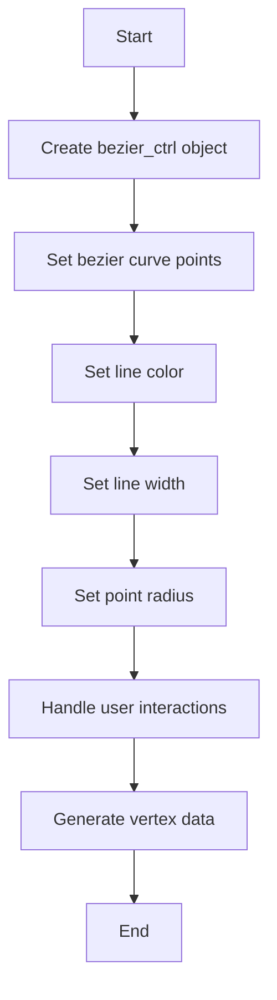

## 类结构

```
agg::bezier_ctrl_impl
├── agg::curve3_ctrl_impl
│   ├── agg::curve3_ctrl
│   └── agg::bezier_ctrl
└── agg::ctrl
```

## 全局变量及字段


### `m_curve`
    
Represents the bezier curve control points.

类型：`curve4`
    


### `m_ellipse`
    
Represents an ellipse.

类型：`ellipse`
    


### `m_stroke`
    
Represents the stroke conversion for the bezier curve.

类型：`conv_stroke<curve4>`
    


### `m_poly`
    
Represents the polygon control for the bezier curve.

类型：`polygon_ctrl_impl`
    


### `m_idx`
    
Index for tracking the current path in the vertex source interface.

类型：`unsigned`
    


### `bezier_ctrl_impl.m_curve`
    
Represents the bezier curve control points.

类型：`curve4`
    


### `bezier_ctrl_impl.m_ellipse`
    
Represents an ellipse.

类型：`ellipse`
    


### `bezier_ctrl_impl.m_stroke`
    
Represents the stroke conversion for the bezier curve.

类型：`conv_stroke<curve4>`
    


### `bezier_ctrl_impl.m_poly`
    
Represents the polygon control for the bezier curve.

类型：`polygon_ctrl_impl`
    


### `bezier_ctrl_impl.m_idx`
    
Index for tracking the current path in the vertex source interface.

类型：`unsigned`
    


### `curve3_ctrl_impl.m_curve`
    
Represents the bezier curve control points.

类型：`curve3`
    


### `curve3_ctrl_impl.m_ellipse`
    
Represents an ellipse.

类型：`ellipse`
    


### `curve3_ctrl_impl.m_stroke`
    
Represents the stroke conversion for the bezier curve.

类型：`conv_stroke<curve3>`
    


### `curve3_ctrl_impl.m_poly`
    
Represents the polygon control for the bezier curve.

类型：`polygon_ctrl_impl`
    


### `curve3_ctrl_impl.m_idx`
    
Index for tracking the current path in the vertex source interface.

类型：`unsigned`
    


### `curve3_ctrl.m_color`
    
Represents the color of the line for the bezier curve.

类型：`ColorT`
    


### `bezier_ctrl.m_color`
    
Represents the color of the line for the bezier curve.

类型：`ColorT`
    
    

## 全局函数及方法


### bezier_ctrl_impl::curve

将四个控制点添加到贝塞尔曲线中。

参数：

- `x1`：`double`，第一个控制点的x坐标
- `y1`：`double`，第一个控制点的y坐标
- `x2`：`double`，第二个控制点的x坐标
- `y2`：`double`，第二个控制点的y坐标
- `x3`：`double`，第三个控制点的x坐标
- `y3`：`double`，第三个控制点的y坐标
- `x4`：`double`，第四个控制点的x坐标
- `y4`：`double`，第四个控制点的y坐标

返回值：`curve4&`，返回当前曲线对象引用

#### 流程图

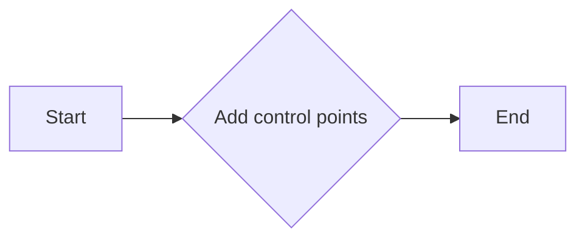

#### 带注释源码

```cpp
void bezier_ctrl_impl::curve(double x1, double y1, 
                             double x2, double y2, 
                             double x3, double y3,
                             double x4, double y4)
{
    m_curve.add_point(x1, y1);
    m_curve.add_point(x2, y2);
    m_curve.add_point(x3, y3);
    m_curve.add_point(x4, y4);
}
```


### bezier_ctrl_impl::curve

该函数用于设置和控制贝塞尔曲线的控制点。

参数：

- `x1`：`double`，贝塞尔曲线的第一个控制点X坐标。
- `y1`：`double`，贝塞尔曲线的第一个控制点Y坐标。
- `x2`：`double`，贝塞尔曲线的第二个控制点X坐标。
- `y2`：`double`，贝塞尔曲线的第二个控制点Y坐标。
- `x3`：`double`，贝塞尔曲线的第三个控制点X坐标。
- `y3`：`double`，贝塞尔曲线的第三个控制点Y坐标。
- `x4`：`double`，贝塞尔曲线的第四个控制点X坐标。
- `y4`：`double`，贝塞尔曲线的第四个控制点Y坐标。

返回值：`void`，无返回值。

#### 流程图

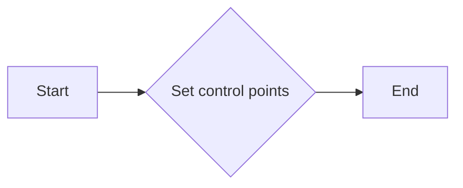

#### 带注释源码

```cpp
void bezier_ctrl_impl::curve(double x1, double y1, 
                             double x2, double y2, 
                             double x3, double y3,
                             double x4, double y4)
{
    m_curve.xn(0) = x1;
    m_curve.yn(0) = y1;
    m_curve.xn(1) = x2;
    m_curve.yn(1) = y2;
    m_curve.xn(2) = x3;
    m_curve.yn(2) = y3;
    m_curve.xn(3) = x4;
    m_curve.yn(3) = y4;
}
```


### bezier_ctrl_impl::curve()

{描述} 该方法用于设置和控制贝塞尔曲线的四个控制点。

参数：

- `x1`：`double`，控制点1的x坐标
- `y1`：`double`，控制点1的y坐标
- `x2`：`double`，控制点2的x坐标
- `y2`：`double`，控制点2的y坐标
- `x3`：`double`，控制点3的x坐标
- `y3`：`double`，控制点3的y坐标
- `x4`：`double`，控制点4的x坐标
- `y4`：`double`，控制点4的y坐标

返回值：`curve4&`，返回当前贝塞尔曲线的引用

#### 流程图


#### 带注释源码

```cpp
void bezier_ctrl_impl::curve(double x1, double y1, 
                             double x2, double y2, 
                             double x3, double y3,
                             double x4, double y4)
{
    m_curve.set_points(x1, y1, x2, y2, x3, y3, x4, y4);
}
```


### bezier_ctrl_impl::curve

将四个控制点添加到贝塞尔曲线中。

参数：

- `x1`：`double`，控制点1的x坐标
- `y1`：`double`，控制点1的y坐标
- `x2`：`double`，控制点2的x坐标
- `y2`：`double`，控制点2的y坐标
- `x3`：`double`，控制点3的x坐标
- `y3`：`double`，控制点3的y坐标
- `x4`：`double`，控制点4的x坐标
- `y4`：`double`，控制点4的y坐标

返回值：`curve4&`，返回当前曲线对象引用

#### 流程图


#### 带注释源码

```cpp
void bezier_ctrl_impl::curve(double x1, double y1, 
                             double x2, double y2, 
                             double x3, double y3,
                             double x4, double y4)
{
    m_curve.add_point(x1, y1);
    m_curve.add_point(x2, y2);
    m_curve.add_point(x3, y3);
    m_curve.add_point(x4, y4);
}
``` 


### bezier_ctrl_impl::curve

将四个控制点添加到贝塞尔曲线中。

参数：

- `x1`：`double`，第一个控制点的x坐标
- `y1`：`double`，第一个控制点的y坐标
- `x2`：`double`，第二个控制点的x坐标
- `y2`：`double`，第二个控制点的y坐标
- `x3`：`double`，第三个控制点的x坐标
- `y3`：`double`，第三个控制点的y坐标
- `x4`：`double`，第四个控制点的x坐标
- `y4`：`double`，第四个控制点的y坐标

返回值：`curve4&`，返回当前贝塞尔曲线对象

#### 流程图


#### 带注释源码

```cpp
void bezier_ctrl_impl::curve(double x1, double y1, 
                             double x2, double y2, 
                             double x3, double y3,
                             double x4, double y4)
{
    m_curve.add_point(x1, y1);
    m_curve.add_point(x2, y2);
    m_curve.add_point(x3, y3);
    m_curve.add_point(x4, y4);
}
``` 


### bezier_ctrl_impl::curve

将四个控制点添加到贝塞尔曲线中。

参数：

- `x1`：`double`，第一个控制点的x坐标
- `y1`：`double`，第一个控制点的y坐标
- `x2`：`double`，第二个控制点的x坐标
- `y2`：`double`，第二个控制点的y坐标
- `x3`：`double`，第三个控制点的x坐标
- `y3`：`double`，第三个控制点的y坐标
- `x4`：`double`，第四个控制点的x坐标
- `y4`：`double`，第四个控制点的y坐标

返回值：`curve4&`，返回当前曲线对象引用

#### 流程图


#### 带注释源码

```cpp
void bezier_ctrl_impl::curve(double x1, double y1, 
                             double x2, double y2, 
                             double x3, double y3,
                             double x4, double y4)
{
    m_curve.add_point(x1, y1);
    m_curve.add_point(x2, y2);
    m_curve.add_point(x3, y3);
    m_curve.add_point(x4, y4);
}
``` 


### bezier_ctrl_impl::curve

将四个控制点添加到贝塞尔曲线中。

参数：

- `x1`：`double`，第一个控制点的x坐标
- `y1`：`double`，第一个控制点的y坐标
- `x2`：`double`，第二个控制点的x坐标
- `y2`：`double`，第二个控制点的y坐标
- `x3`：`double`，第三个控制点的x坐标
- `y3`：`double`，第三个控制点的y坐标
- `x4`：`double`，第四个控制点的x坐标
- `y4`：`double`，第四个控制点的y坐标

返回值：`curve4&`，返回当前曲线对象引用

#### 流程图


#### 带注释源码

```cpp
void bezier_ctrl_impl::curve(double x1, double y1, 
                             double x2, double y2, 
                             double x3, double y3,
                             double x4, double y4)
{
    m_curve.add_point(x1, y1);
    m_curve.add_point(x2, y2);
    m_curve.add_point(x3, y3);
    m_curve.add_point(x4, y4);
}
``` 


### bezier_ctrl_impl::curve

将四个控制点添加到贝塞尔曲线中。

参数：

- `x1`：`double`，第一个控制点的x坐标
- `y1`：`double`，第一个控制点的y坐标
- `x2`：`double`，第二个控制点的x坐标
- `y2`：`double`，第二个控制点的y坐标
- `x3`：`double`，第三个控制点的x坐标
- `y3`：`double`，第三个控制点的y坐标
- `x4`：`double`，第四个控制点的x坐标
- `y4`：`double`，第四个控制点的y坐标

返回值：`curve4&`，返回当前曲线对象引用

#### 流程图


#### 带注释源码

```cpp
void bezier_ctrl_impl::curve(double x1, double y1, 
                             double x2, double y2, 
                             double x3, double y3,
                             double x4, double y4)
{
    m_curve.add_point(x1, y1);
    m_curve.add_point(x2, y2);
    m_curve.add_point(x3, y3);
    m_curve.add_point(x4, y4);
}
``` 


### bezier_ctrl_impl::curve

将四个控制点添加到贝塞尔曲线中。

参数：

- `x1`：`double`，第一个控制点的x坐标
- `y1`：`double`，第一个控制点的y坐标
- `x2`：`double`，第二个控制点的x坐标
- `y2`：`double`，第二个控制点的y坐标
- `x3`：`double`，第三个控制点的x坐标
- `y3`：`double`，第三个控制点的y坐标
- `x4`：`double`，第四个控制点的x坐标
- `y4`：`double`，第四个控制点的y坐标

返回值：`curve4&`，返回当前贝塞尔曲线对象

#### 流程图


#### 带注释源码

```cpp
void bezier_ctrl_impl::curve(double x1, double y1, 
                             double x2, double y2, 
                             double x3, double y3,
                             double x4, double y4)
{
    m_curve.add_point(x1, y1);
    m_curve.add_point(x2, y2);
    m_curve.add_point(x3, y3);
    m_curve.add_point(x4, y4);
}
```


### bezier_ctrl_impl::curve

将四个控制点添加到贝塞尔曲线中。

参数：

- `x1`：`double`，第一个控制点的x坐标
- `y1`：`double`，第一个控制点的y坐标
- `x2`：`double`，第二个控制点的x坐标
- `y2`：`double`，第二个控制点的y坐标
- `x3`：`double`，第三个控制点的x坐标
- `y3`：`double`，第三个控制点的y坐标
- `x4`：`double`，第四个控制点的x坐标
- `y4`：`double`，第四个控制点的y坐标

返回值：`curve4&`，返回当前贝塞尔曲线对象

#### 流程图


#### 带注释源码

```cpp
void bezier_ctrl_impl::curve(double x1, double y1, 
                             double x2, double y2, 
                             double x3, double y3,
                             double x4, double y4)
{
    m_curve.add_point(x1, y1);
    m_curve.add_point(x2, y2);
    m_curve.add_point(x3, y3);
    m_curve.add_point(x4, y4);
}
```


### bezier_ctrl_impl::curve

将四个控制点添加到贝塞尔曲线中。

参数：

- `x1`：`double`，第一个控制点的x坐标
- `y1`：`double`，第一个控制点的y坐标
- `x2`：`double`，第二个控制点的x坐标
- `y2`：`double`，第二个控制点的y坐标
- `x3`：`double`，第三个控制点的x坐标
- `y3`：`double`，第三个控制点的y坐标
- `x4`：`double`，第四个控制点的x坐标
- `y4`：`double`，第四个控制点的y坐标

返回值：`curve4&`，返回当前贝塞尔曲线对象

#### 流程图


#### 带注释源码

```cpp
void bezier_ctrl_impl::curve(double x1, double y1, 
                             double x2, double y2, 
                             double x3, double y3,
                             double x4, double y4)
{
    m_curve.add_point(x1, y1);
    m_curve.add_point(x2, y2);
    m_curve.add_point(x3, y3);
    m_curve.add_point(x4, y4);
}
``` 


### bezier_ctrl_impl::line_width

设置或获取曲线控制点的线宽。

参数：

- `w`：`double`，线宽值

返回值：`double`，当前线宽值

#### 流程图

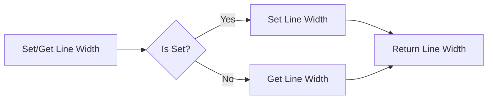

#### 带注释源码

```cpp
void bezier_ctrl_impl::line_width(double w) { m_stroke.width(w); }
double bezier_ctrl_impl::line_width() const   { return m_stroke.width(); }
```


### bezier_ctrl_impl.point_radius

设置或获取控制多边形的点半径。

参数：

- `r`：`double`，控制多边形的点半径。

返回值：`double`，当前控制多边形的点半径。

#### 流程图

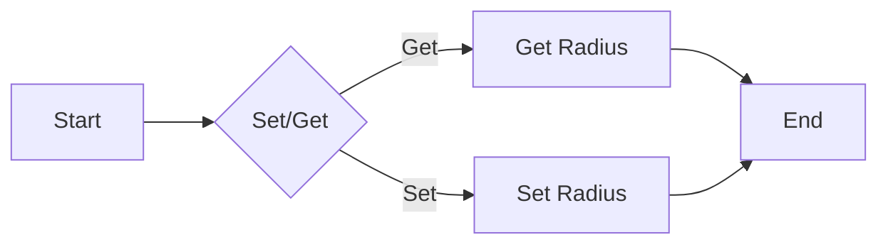

#### 带注释源码

```cpp
void bezier_ctrl_impl::point_radius(double r) { m_poly.point_radius(r); }
double bezier_ctrl_impl::point_radius() const   { return m_poly.point_radius(); }
```


### bezier_ctrl_impl.in_rect

Determines if a point is inside the bounding rectangle of the bezier curve.

参数：

- `x`：`double`，The x-coordinate of the point to check.
- `y`：`double`，The y-coordinate of the point to check.

返回值：`bool`，Returns `true` if the point is inside the bounding rectangle, otherwise `false`.

#### 流程图

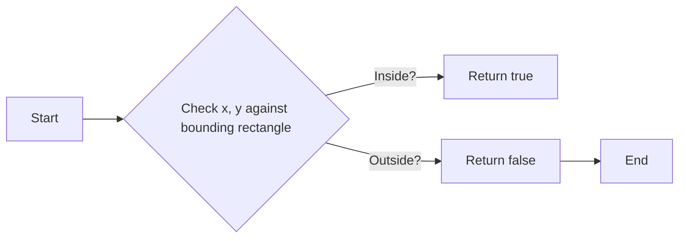

#### 带注释源码

```cpp
virtual bool in_rect(double x, double y) const
{
    // Check if the point is inside the bounding rectangle of the bezier curve
    return m_poly.in_rect(x, y);
}
```


### bezier_ctrl_impl.on_mouse_button_down

This method handles the mouse button down event for the bezier control.

参数：

- `x`：`double`，The x-coordinate of the mouse event.
- `y`：`double`，The y-coordinate of the mouse event.

返回值：`bool`，Returns `true` if the event was handled, `false` otherwise.

#### 流程图

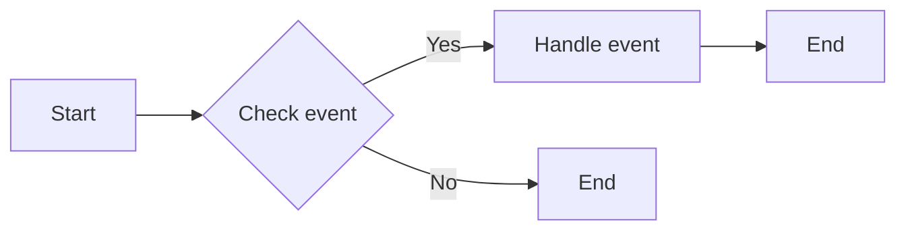

#### 带注释源码

```cpp
virtual bool on_mouse_button_down(double x, double y)
{
    // Implementation of the mouse button down event handling
    // ...
    return true; // Assuming the event is handled
}
```


### bezier_ctrl_impl.on_mouse_button_up

This method handles the mouse button up event for the bezier control.

参数：

- `x`：`double`，The x-coordinate of the mouse event.
- `y`：`double`，The y-coordinate of the mouse event.

返回值：`bool`，Returns `true` if the event was handled, `false` otherwise.

#### 流程图

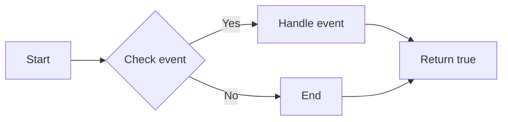

#### 带注释源码

```cpp
virtual bool on_mouse_button_up(double x, double y)
{
    // Implementation of the mouse button up event handling
    // ...
    return true; // Assuming the event is handled
}
```


### bezier_ctrl_impl.on_mouse_move

This method handles the mouse movement event for the bezier control.

参数：

- `x`：`double`，The x-coordinate of the mouse position.
- `y`：`double`，The y-coordinate of the mouse position.
- `button_flag`：`bool`，A flag indicating whether a mouse button is pressed.

返回值：`bool`，Returns `true` if the event is handled, `false` otherwise.

#### 流程图

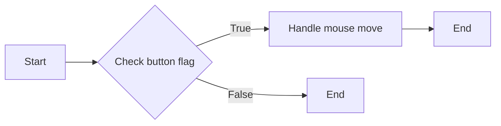

#### 带注释源码

```cpp
virtual bool on_mouse_move(double x, double y, bool button_flag)
{
    // Implementation of the mouse move event handling
    // ...
    return true; // Assuming the event is handled
}
```


### bezier_ctrl_impl.on_arrow_keys

This method handles arrow key events for the bezier control object.

参数：

- `left`：`bool`，Indicates whether the left arrow key is pressed.
- `right`：`bool`，Indicates whether the right arrow key is pressed.
- `down`：`bool`，Indicates whether the down arrow key is pressed.
- `up`：`bool`，Indicates whether the up arrow key is pressed.

返回值：`bool`，Returns `true` if the event is handled, `false` otherwise.

#### 流程图

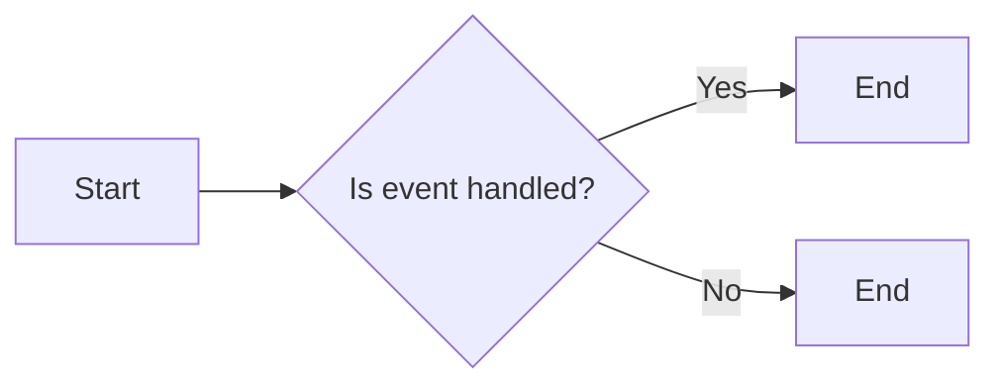

#### 带注释源码

```cpp
virtual bool on_arrow_keys(bool left, bool right, bool down, bool up)
{
    // Implementation of arrow key handling
    // ...
    return false; // Placeholder return value
}
```


### bezier_ctrl_impl.num_paths

返回控制点曲线的路径数量。

参数：

- 无

返回值：`unsigned`，表示路径数量

#### 流程图

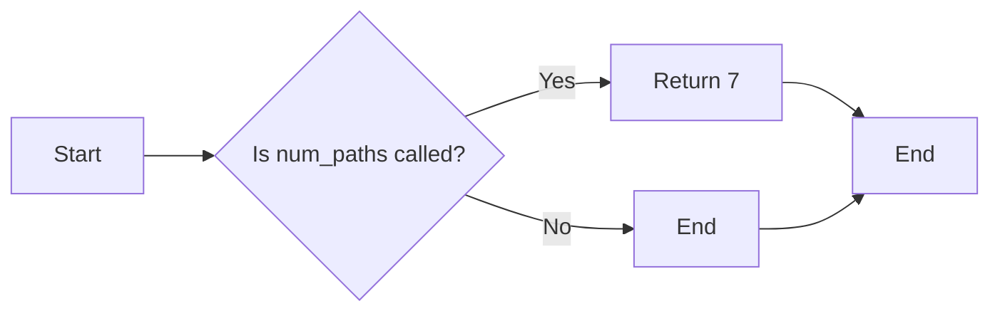

#### 带注释源码

```cpp
unsigned num_paths() { return 7; };
```


### bezier_ctrl_impl.rewind

Rewind the vertex source to the beginning of the specified path.

参数：

- `path_id`：`unsigned`，指定要重置的路径ID。

返回值：`void`，无返回值。

#### 流程图

```mermaid
graph LR
A[Start] --> B{Check path_id}
B -->|Valid| C[Set m_idx to 0]
B -->|Invalid| D[Error: Invalid path_id]
C --> E[End]
D --> E
```

#### 带注释源码

```cpp
void bezier_ctrl_impl::rewind(unsigned path_id)
{
    if (path_id < num_paths())
    {
        m_idx = 0;
    }
    else
    {
        // Error: Invalid path_id
    }
}
```


### bezier_ctrl_impl.vertex

This method is a part of the `bezier_ctrl_impl` class and is used to retrieve the vertex information for a specific path in the bezier curve.

参数：

- `x`：`double*`，A pointer to a double variable where the x-coordinate of the vertex will be stored.
- `y`：`double*`，A pointer to a double variable where the y-coordinate of the vertex will be stored.

返回值：`unsigned`，The index of the next vertex after the current one.

#### 流程图

```mermaid
graph LR
A[Start] --> B{Retrieve vertex info}
B --> C[Store x-coordinate]
C --> D[Store y-coordinate]
D --> E[Return next vertex index]
E --> F[End]
```

#### 带注释源码

```cpp
unsigned vertex(double* x, double* y)
{
    unsigned idx = m_idx;
    if (idx < m_curve.num_vertices())
    {
        *x = m_curve.xn(idx);
        *y = m_curve.yn(idx);
        ++m_idx;
    }
    return idx;
}
``` 


### curve3_ctrl_impl.curve3

This function defines a cubic Bezier curve using four points.

参数：

- `x1`：`double`，The x-coordinate of the first control point.
- `y1`：`double`，The y-coordinate of the first control point.
- `x2`：`double`，The x-coordinate of the second control point.
- `y2`：`double`，The y-coordinate of the second control point.
- `x3`：`double`，The x-coordinate of the third control point.
- `y3`：`double`，The y-coordinate of the third control point.

返回值：`curve3&`，A reference to the curve object.

#### 流程图

```mermaid
graph LR
A[Start] --> B{Define control points}
B --> C[Set curve points]
C --> D[Return curve reference]
D --> E[End]
```

#### 带注释源码

```cpp
void curve3_ctrl_impl::curve(double x1, double y1, 
                             double x2, double y2, 
                             double x3, double y3)
{
    m_poly.xn(0) = x1;
    m_poly.yn(0) = y1;
    m_poly.xn(1) = x2;
    m_poly.yn(1) = y2;
    m_poly.xn(2) = x3;
    m_poly.yn(2) = y3;
}
```


### curve3_ctrl_impl.curve

该函数用于设置三次贝塞尔曲线的控制点。

参数：

- `x1`：`double`，三次贝塞尔曲线的第一个控制点的x坐标。
- `y1`：`double`，三次贝塞尔曲线的第一个控制点的y坐标。
- `x2`：`double`，三次贝塞尔曲线的第二个控制点的x坐标。
- `y2`：`double`，三次贝塞尔曲线的第二个控制点的y坐标。
- `x3`：`double`，三次贝塞尔曲线的第三个控制点的x坐标。
- `y3`：`double`，三次贝塞尔曲线的第三个控制点的y坐标。

返回值：`curve3&`，返回当前曲线对象，以便链式调用。

#### 流程图

```mermaid
graph LR
A[Start] --> B{Set control points}
B --> C[End]
```

#### 带注释源码

```cpp
void curve3_ctrl_impl::curve(double x1, double y1, 
                             double x2, double y2, 
                             double x3, double y3)
{
    m_curve.xn(0) = x1;
    m_curve.yn(0) = y1;
    m_curve.xn(1) = x2;
    m_curve.yn(1) = y2;
    m_curve.xn(2) = x3;
    m_curve.yn(2) = y3;
}
``` 


### curve3_ctrl_impl.curve

This function defines the control points for a cubic Bezier curve and updates the internal state of the `curve3_ctrl_impl` class.

参数：

- `x1`：`double`，The x-coordinate of the first control point.
- `y1`：`double`，The y-coordinate of the first control point.
- `x2`：`double`，The x-coordinate of the second control point.
- `y2`：`double`，The y-coordinate of the second control point.
- `x3`：`double`，The x-coordinate of the third control point.
- `y3`：`double`，The y-coordinate of the third control point.

返回值：`curve3&`，A reference to the internal `curve3` object that represents the cubic Bezier curve.

#### 流程图

```mermaid
graph LR
A[Start] --> B{Set control points}
B --> C[Update internal state]
C --> D[Return curve reference]
D --> E[End]
```

#### 带注释源码

```cpp
void curve3_ctrl_impl::curve(double x1, double y1, 
                             double x2, double y2, 
                             double x3, double y3)
{
    m_poly.xn(0) = x1;
    m_poly.yn(0) = y1;
    m_poly.xn(1) = x2;
    m_poly.yn(1) = y2;
    m_poly.xn(2) = x3;
    m_poly.yn(2) = y3;
}
```


### curve3_ctrl_impl::curve

曲线控制类实现中的曲线绘制方法。

参数：

- `x1`：`double`，曲线的第一个控制点X坐标。
- `y1`：`double`，曲线的第一个控制点Y坐标。
- `x2`：`double`，曲线的第二个控制点X坐标。
- `y2`：`double`，曲线的第二个控制点Y坐标。
- `x3`：`double`，曲线的第三个控制点X坐标。
- `y3`：`double`，曲线的第三个控制点Y坐标。

返回值：`curve3&`，返回当前曲线控制对象的引用。

#### 流程图

```mermaid
graph LR
A[Start] --> B{Set control points}
B --> C[Draw curve]
C --> D[End]
```

#### 带注释源码

```cpp
void curve3_ctrl_impl::curve(double x1, double y1, 
                             double x2, double y2, 
                             double x3, double y3)
{
    m_poly.xn(0) = x1;
    m_poly.yn(0) = y1;
    m_poly.xn(1) = x2;
    m_poly.yn(1) = y2;
    m_poly.xn(2) = x3;
    m_poly.yn(2) = y3;
}
```


### curve3_ctrl_impl.curve

This method defines a cubic Bezier curve using four points.

参数：

- `x1`：`double`，The x-coordinate of the first control point.
- `y1`：`double`，The y-coordinate of the first control point.
- `x2`：`double`，The x-coordinate of the second control point.
- `y2`：`double`，The y-coordinate of the second control point.
- `x3`：`double`，The x-coordinate of the third control point.
- `y3`：`double`，The y-coordinate of the third control point.

返回值：`curve3&`，A reference to the curve object.

#### 流程图

```mermaid
graph LR
A[Start] --> B{Define curve}
B --> C[Set control points]
C --> D[Return curve reference]
D --> E[End]
```

#### 带注释源码

```cpp
void curve3_ctrl_impl::curve(double x1, double y1, 
                             double x2, double y2, 
                             double x3, double y3)
{
    m_curve.set(x1, y1, x2, y2, x3, y3);
}
``` 


### curve3_ctrl_impl::curve

曲线控制类实现中的曲线绘制方法。

参数：

- `x1`：`double`，曲线的第一个控制点X坐标。
- `y1`：`double`，曲线的第一个控制点Y坐标。
- `x2`：`double`，曲线的第二个控制点X坐标。
- `y2`：`double`，曲线的第二个控制点Y坐标。
- `x3`：`double`，曲线的第三个控制点X坐标。
- `y3`：`double`，曲线的第三个控制点Y坐标。

返回值：`curve3&`，返回当前曲线控制对象的引用。

#### 流程图

```mermaid
graph LR
A[Start] --> B{Set control points}
B --> C[Draw curve]
C --> D[End]
```

#### 带注释源码

```cpp
void curve3_ctrl_impl::curve(double x1, double y1, 
                             double x2, double y2, 
                             double x3, double y3)
{
    m_poly.xn(0) = x1;
    m_poly.yn(0) = y1;
    m_poly.xn(1) = x2;
    m_poly.yn(1) = y2;
    m_poly.xn(2) = x3;
    m_poly.yn(2) = y3;
}
```


### curve3_ctrl_impl.curve

This method defines a cubic Bezier curve using four points.

参数：

- `x1`：`double`，The x-coordinate of the first control point.
- `y1`：`double`，The y-coordinate of the first control point.
- `x2`：`double`，The x-coordinate of the second control point.
- `y2`：`double`，The y-coordinate of the second control point.
- `x3`：`double`，The x-coordinate of the third control point.
- `y3`：`double`，The y-coordinate of the third control point.

返回值：`curve3&`，A reference to the curve object.

#### 流程图

```mermaid
graph LR
A[Start] --> B{Define control points}
B --> C[Set curve points]
C --> D[Return curve reference]
D --> E[End]
```

#### 带注释源码

```cpp
void curve3_ctrl_impl::curve(double x1, double y1, 
                             double x2, double y2, 
                             double x3, double y3)
{
    m_curve.xn(0) = x1;
    m_curve.yn(0) = y1;
    m_curve.xn(1) = x2;
    m_curve.yn(1) = y2;
    m_curve.xn(2) = x3;
    m_curve.yn(2) = y3;
}
``` 


### curve3_ctrl_impl::curve

曲线控制类实现中的曲线绘制方法。

参数：

- `x1`：`double`，曲线的第一个控制点X坐标。
- `y1`：`double`，曲线的第一个控制点Y坐标。
- `x2`：`double`，曲线的第二个控制点X坐标。
- `y2`：`double`，曲线的第二个控制点Y坐标。
- `x3`：`double`，曲线的第三个控制点X坐标。
- `y3`：`double`，曲线的第三个控制点Y坐标。

返回值：`curve3&`，返回当前曲线控制对象的引用。

#### 流程图

```mermaid
graph LR
A[Start] --> B{Set control points}
B --> C[Draw curve]
C --> D[End]
```

#### 带注释源码

```cpp
void curve3_ctrl_impl::curve(double x1, double y1, 
                             double x2, double y2, 
                             double x3, double y3)
{
    m_poly.xn(0) = x1;
    m_poly.yn(0) = y1;
    m_poly.xn(1) = x2;
    m_poly.yn(1) = y2;
    m_poly.xn(2) = x3;
    m_poly.yn(2) = y3;
}
```


### curve3_ctrl_impl.curve

This method defines a cubic Bezier curve using four points.

参数：

- `x1`：`double`，The x-coordinate of the first control point.
- `y1`：`double`，The y-coordinate of the first control point.
- `x2`：`double`，The x-coordinate of the second control point.
- `y2`：`double`，The y-coordinate of the second control point.
- `x3`：`double`，The x-coordinate of the third control point.
- `y3`：`double`，The y-coordinate of the third control point.

返回值：`curve3&`，A reference to the curve object.

#### 流程图

```mermaid
graph LR
A[Start] --> B{Define curve}
B --> C[Set control points]
C --> D[Return curve reference]
D --> E[End]
```

#### 带注释源码

```cpp
void curve3_ctrl_impl::curve(double x1, double y1, 
                             double x2, double y2, 
                             double x3, double y3)
{
    m_curve.set(x1, y1, x2, y2, x3, y3);
}
``` 


### curve3_ctrl_impl::line_width

设置和控制曲线的线宽。

参数：

- `w`：`double`，表示线宽的大小。

返回值：`double`，当前曲线的线宽。

#### 流程图

```mermaid
graph LR
A[Start] --> B{Set line width}
B --> C[End]
```

#### 带注释源码

```cpp
void curve3_ctrl_impl::line_width(double w) {
    m_stroke.width(w);
}
``` 


### curve3_ctrl_impl.point_radius

设置或获取曲线控制点半径。

参数：

- `r`：`double`，控制点半径，用于绘制曲线时控制点的显示大小。

返回值：`double`，当前设置的控制点半径。

#### 流程图

```mermaid
graph LR
A[Set/Get Point Radius] --> B{Is it a Set operation?}
B -- Yes --> C[Set the radius to r]
B -- No --> D[Return the current radius]
C --> E[End]
D --> E
```

#### 带注释源码

```cpp
void point_radius(double r) { m_poly.point_radius(r); } // Set the point radius
double point_radius() const   { return m_poly.point_radius(); } // Get the current point radius
```


### curve3_ctrl_impl::in_rect

Determines if the control point of the curve is within the specified rectangle.

参数：

- `x`：`double`，The x-coordinate of the rectangle's lower-left corner.
- `y`：`double`，The y-coordinate of the rectangle's lower-left corner.

返回值：`bool`，Returns `true` if the control point is within the rectangle, otherwise `false`.

#### 流程图

```mermaid
graph LR
A[Start] --> B{Check if (x, y) is within rectangle}
B -- Yes --> C[Return true]
B -- No --> D[Return false]
D --> E[End]
```

#### 带注释源码

```cpp
virtual bool in_rect(double x, double y) const
{
    // Check if the control point is within the rectangle
    if (m_poly.xn(0) >= x && m_poly.xn(0) <= x + width() &&
        m_poly.yn(0) >= y && m_poly.yn(0) <= y + height())
    {
        return true;
    }
    else
    {
        return false;
    }
}
``` 


### curve3_ctrl_impl.on_mouse_button_down

This method handles the mouse button down event for the curve control.

参数：

- `x`：`double`，The x-coordinate of the mouse event.
- `y`：`double`，The y-coordinate of the mouse event.

返回值：`bool`，Returns `true` if the event was handled, `false` otherwise.

#### 流程图

```mermaid
graph LR
A[Start] --> B{Check event}
B -- Yes --> C[Handle event]
B -- No --> D[End]
C --> E[End]
```

#### 带注释源码

```cpp
virtual bool on_mouse_button_down(double x, double y)
{
    // Implementation of the mouse button down event handling
    // ...
    return true; // Assuming the event is handled
}
```


### curve3_ctrl_impl.on_mouse_button_up

This method handles the mouse button up event for the curve control.

参数：

- `x`：`double`，The x-coordinate of the mouse event.
- `y`：`double`，The y-coordinate of the mouse event.

返回值：`bool`，Returns `true` if the event was handled, `false` otherwise.

#### 流程图

```mermaid
graph LR
A[Start] --> B{Check event}
B -- Yes --> C[Handle mouse button up]
B -- No --> D[End]
C --> E[Return true]
D --> E
```

#### 带注释源码

```cpp
virtual bool on_mouse_button_up(double x, double y)
{
    // Implementation of the mouse button up event handling
    // ...
    return true; // Assuming the event is handled
}
```


### curve3_ctrl_impl.on_mouse_move

This method handles the mouse movement event for the curve3_ctrl_impl class, updating the control points based on the mouse position and button state.

参数：

- `x`：`double`，The x-coordinate of the mouse position.
- `y`：`double`，The y-coordinate of the mouse position.
- `button_flag`：`bool`，The state of the mouse button (true if pressed, false if released).

返回值：`bool`，Indicates whether the event was handled (true) or not (false).

#### 流程图

```mermaid
graph LR
A[Start] --> B{Mouse Move Event}
B -->|Button Pressed| C[Update Control Points]
B -->|Button Released| D[No Action]
C --> E[End]
D --> E
```

#### 带注释源码

```cpp
virtual bool on_mouse_move(double x, double y, bool button_flag)
{
    // Check if the mouse button is pressed
    if (button_flag)
    {
        // Update the control points based on the mouse position
        m_poly.xn(0) = x;
        m_poly.yn(0) = y;
        // ... Update other control points if necessary
    }
    // Return true to indicate the event was handled
    return true;
}
```


### curve3_ctrl_impl.on_arrow_keys

This method handles arrow key events for the curve control.

参数：

- `left`：`bool`，Indicates if the left arrow key is pressed.
- `right`：`bool`，Indicates if the right arrow key is pressed.
- `down`：`bool`，Indicates if the down arrow key is pressed.
- `up`：`bool`，Indicates if the up arrow key is pressed.

返回值：`bool`，Returns `true` if the event is handled, `false` otherwise.

#### 流程图

```mermaid
graph LR
A[Start] --> B{Is event handled?}
B -- Yes --> C[End]
B -- No --> D[End]
```

#### 带注释源码

```cpp
virtual bool on_arrow_keys(bool left, bool right, bool down, bool up)
{
    // Implementation of arrow key handling
    // ...
    return false; // Placeholder return value
}
``` 


### curve3_ctrl_impl.num_paths

返回控制点曲线的路径数量。

参数：

- 无

返回值：`unsigned`，表示路径数量

#### 流程图

```mermaid
graph LR
A[Start] --> B{num_paths()}
B --> C[End]
```

#### 带注释源码

```cpp
unsigned num_paths() { return 6; };
```


### curve3_ctrl_impl.rewind

Rewind the vertex source to the beginning of the specified path.

参数：

- `path_id`：`unsigned`，指定要重置的路径ID。

返回值：`void`，无返回值。

#### 流程图

```mermaid
graph LR
A[Start] --> B{Check path_id}
B -->|Valid| C[Set m_idx to 0]
B -->|Invalid| D[Error: Invalid path_id]
C --> E[End]
D --> E
```

#### 带注释源码

```cpp
void curve3_ctrl_impl::rewind(unsigned path_id)
{
    if (path_id < num_paths())
    {
        m_idx = 0;
    }
    else
    {
        // Error: Invalid path_id
    }
}
```


### curve3_ctrl_impl.curve

This method defines a cubic Bezier curve using four points.

参数：

- `x1`：`double`，The x-coordinate of the first control point.
- `y1`：`double`，The y-coordinate of the first control point.
- `x2`：`double`，The x-coordinate of the second control point.
- `y2`：`double`，The y-coordinate of the second control point.
- `x3`：`double`，The x-coordinate of the third control point.
- `y3`：`double`，The y-coordinate of the third control point.

返回值：`curve3&`，A reference to the curve object.

#### 流程图

```mermaid
graph LR
A[Start] --> B{Define control points}
B --> C[Set curve points]
C --> D[Return curve reference]
D --> E[End]
```

#### 带注释源码

```cpp
void curve3_ctrl_impl::curve(double x1, double y1, 
                             double x2, double y2, 
                             double x3, double y3)
{
    m_curve.xn(0) = x1;
    m_curve.yn(0) = y1;
    m_curve.xn(1) = x2;
    m_curve.yn(1) = y2;
    m_curve.xn(2) = x3;
    m_curve.yn(2) = y3;
}
``` 


### curve3_ctrl.{line_color}

Sets the line color for the curve control.

参数：

- `c`：`const ColorT&`，The color to set for the line.

返回值：`void`，No return value.

#### 流程图

```mermaid
graph LR
A[Start] --> B{Set line color}
B --> C[End]
```

#### 带注释源码

```cpp
void curve3_ctrl::line_color(const ColorT& c) {
    m_color = c;
}
```


### curve3_ctrl.color

该函数用于获取曲线控制点的颜色。

参数：

- `i`：`unsigned`，表示颜色索引，默认为0。

返回值：`ColorT`，表示颜色值。

#### 流程图

```mermaid
graph LR
A[Start] --> B{Is i valid?}
B -- Yes --> C[Return m_color]
B -- No --> D[Error]
D --> E[End]
```

#### 带注释源码

```cpp
const ColorT& color(unsigned i) const {
    return m_color;
}
```


### bezier_ctrl::line_color

设置和控制曲线的颜色。

参数：

- `c`：`const ColorT&`，曲线的颜色。

返回值：无

#### 流程图

```mermaid
graph LR
A[Start] --> B{Set color}
B --> C[End]
```

#### 带注释源码

```cpp
void bezier_ctrl::line_color(const ColorT& c) {
    m_color = c;
}
```


### bezier_ctrl.color

该函数用于获取贝塞尔曲线控制点的颜色。

参数：

- `i`：`unsigned`，控制点的索引，从0开始。

返回值：`ColorT`，控制点的颜色。

#### 流程图

```mermaid
graph LR
A[Start] --> B{Is i valid?}
B -- Yes --> C[Return m_color[i]]
B -- No --> D[Error: Invalid index]
D --> E[End]
C --> E
```

#### 带注释源码

```cpp
const ColorT& color(unsigned i) const { return m_color[i]; }
```


## 关键组件


### 张量索引与惰性加载

张量索引与惰性加载是代码中用于高效处理和访问数据结构的关键组件。它允许在需要时才计算或加载数据，从而优化内存使用和性能。

### 反量化支持

反量化支持是代码中用于处理和转换数据的关键组件。它允许将量化数据转换回原始数据，以便进行进一步处理或分析。

### 量化策略

量化策略是代码中用于优化数据表示和存储的关键组件。它通过减少数据精度来减少内存使用，同时保持足够的精度以满足应用需求。


## 问题及建议


### 已知问题

-   **代码复用性低**：`bezier_ctrl_impl` 和 `curve3_ctrl_impl` 类具有高度相似的结构和功能，但它们是独立的类。这可能导致代码维护困难，并增加了代码的复杂性。
-   **模板特化**：`bezier_ctrl` 和 `curve3_ctrl` 使用模板特化来处理不同类型的颜色。这可能导致模板膨胀，尤其是在处理大量颜色类型时。
-   **全局变量和函数**：代码中未使用全局变量和函数，但考虑到代码的复杂性和潜在的扩展性，未来可能会引入这些元素，需要谨慎处理以避免潜在的问题。

### 优化建议

-   **合并相似类**：考虑将 `bezier_ctrl_impl` 和 `curve3_ctrl_impl` 合并为一个类，以减少代码重复并简化维护。
-   **使用模板参数**：如果颜色类型是固定的或有限的，可以考虑使用模板参数而不是模板特化，以减少模板膨胀。
-   **代码模块化**：将代码分解为更小的模块或函数，以提高可读性和可维护性。
-   **文档和注释**：增加代码的文档和注释，以帮助其他开发者理解代码的功能和结构。
-   **单元测试**：编写单元测试以确保代码的正确性和稳定性。


## 其它


### 设计目标与约束

- 设计目标：
  - 提供一个灵活的贝塞尔曲线控制类，用于在图形渲染中创建和操作贝塞尔曲线。
  - 支持多种颜色类型，以适应不同的渲染需求。
  - 提供基本的交互功能，如鼠标点击和移动。
- 约束：
  - 必须使用 Anti-Grain Geometry 库中的相关类和函数。
  - 代码应保持高效和可维护性。

### 错误处理与异常设计

- 错误处理：
  - 使用异常处理机制来处理潜在的错误情况，如无效的颜色值或参数。
  - 异常应提供清晰的错误信息，以便于调试和用户理解。
- 异常设计：
  - 定义自定义异常类，以区分不同的错误类型。
  - 异常类应包含错误代码和错误信息。

### 数据流与状态机

- 数据流：
  - 输入：用户交互（鼠标点击、移动等）和贝塞尔曲线参数。
  - 输出：渲染的贝塞尔曲线和交互反馈。
- 状态机：
  - 定义不同的状态，如空闲、拖动、绘制等。
  - 状态转换基于用户交互和系统事件。

### 外部依赖与接口契约

- 外部依赖：
  - Anti-Grain Geometry 库：提供图形渲染和几何计算功能。
  - 标准库：用于基本的输入输出和数学运算。
- 接口契约：
  - 定义清晰的接口规范，包括参数类型、返回值类型和异常处理。
  - 确保接口的一致性和稳定性，以方便其他开发者使用。

### 安全性与权限

- 安全性：
  - 防止未授权访问和修改敏感数据。
  - 对外部输入进行验证，以防止注入攻击。
- 权限：
  - 根据用户角色和权限限制对资源的访问。

### 性能优化

- 性能优化：
  - 优化算法和数据结构，以提高代码的执行效率。
  - 减少不必要的计算和内存占用。

### 可测试性与可维护性

- 可测试性：
  - 设计单元测试，以确保代码的正确性和稳定性。
  - 使用自动化测试工具，以提高测试效率。
- 可维护性：
  - 编写清晰的代码注释和文档。
  - 使用模块化设计，以提高代码的可读性和可维护性。

    