# `matplotlib\extern\agg24-svn\include\ctrl\agg_cbox_ctrl.h` 详细设计文档

这是Anti-Grain Geometry库中的一个复选框（ComboBox/Checkbox）UI控件实现，提供了可交互的图形复选框功能，支持鼠标点击切换状态、键盘方向键操作、自定义文本和颜色，适用于2D图形渲染场景。

## 整体流程

```mermaid
graph TD
    A[开始] --> B[创建cbox_ctrl实例]
    B --> C[初始化位置 (x, y) 和标签]
    C --> D[设置默认颜色: 文本黑色/非激活黑色/激活深红色]
    D --> E{用户交互}
    E -->|鼠标点击| F[on_mouse_button_down]
    E -->|鼠标释放| G[on_mouse_button_up]
    E -->|鼠标移动| H[on_mouse_move]
    E -->|键盘方向键| I[on_arrow_keys]
    F --> J{是否在控件区域内}
    J -- 否 --> K[不处理]
    J -- 是 --> L[切换m_status状态]
    G --> M{状态切换}
    I --> N{方向键处理}
    L --> O[触发重绘]
    O --> P[调用vertex()获取顶点]
    P --> Q[渲染复选框图形]
    Q --> E
```

## 类结构

```
ctrl (基类，抽象基类)
└── cbox_ctrl_impl (复选框实现类)
    └── cbox_ctrl<ColorT> (模板类，颜色参数化)
```

## 全局变量及字段


### `cbox_ctrl_impl.m_text_thickness`
    
文本线条粗细

类型：`double`
    


### `cbox_ctrl_impl.m_text_height`
    
文本高度

类型：`double`
    


### `cbox_ctrl_impl.m_text_width`
    
文本宽度

类型：`double`
    


### `cbox_ctrl_impl.m_label`
    
复选框标签文本

类型：`char[128]`
    


### `cbox_ctrl_impl.m_status`
    
复选框选中状态

类型：`bool`
    


### `cbox_ctrl_impl.m_vx[32]`
    
顶点X坐标数组

类型：`double`
    


### `cbox_ctrl_impl.m_vy[32]`
    
顶点Y坐标数组

类型：`double`
    


### `cbox_ctrl_impl.m_text`
    
文本图形对象

类型：`gsv_text`
    


### `cbox_ctrl_impl.m_text_poly`
    
文本描边转换器

类型：`conv_stroke<gsv_text>`
    


### `cbox_ctrl_impl.m_idx`
    
当前路径索引

类型：`unsigned`
    


### `cbox_ctrl_impl.m_vertex`
    
当前顶点索引

类型：`unsigned`
    


### `cbox_ctrl<ColorT>.m_text_color`
    
文本颜色

类型：`ColorT`
    


### `cbox_ctrl<ColorT>.m_inactive_color`
    
非激活状态颜色

类型：`ColorT`
    


### `cbox_ctrl<ColorT>.m_active_color`
    
激活状态颜色

类型：`ColorT`
    


### `cbox_ctrl<ColorT>.m_colors[3]`
    
颜色指针数组

类型：`ColorT*`
    
    

## 全局函数及方法


### `cbox_ctrl_impl::cbox_ctrl_impl`

#### 描述
`cbox_ctrl_impl` 类的构造函数，用于初始化复选框（Checkbox）控件的核心属性。它负责设置控件的坐标、标签文本、初始化文本渲染对象、设定默认状态（未选中）以及计算控件几何图形（复选框的矩形区域）的顶点数据。

#### 参数
- `x`：`double`，控件的 X 坐标（通常为左上角）。
- `y`：`double`，控件的 Y 坐标（通常为左上角）。
- `label`：`const char*`，复选框旁边显示的文本标签。
- `flip_y`：`bool`，布尔标志，指定是否翻转 Y 轴坐标（常用于不同坐标系系统之间的转换）。

#### 返回值
`void`（构造函数无返回值，通常隐式返回对象实例）

#### 流程图

```mermaid
graph TD
    A([开始 构造函数]) --> B[调用基类 ctrl 构造函数<br>设置控制区域]
    B --> C[初始化成员变量<br>m_status = false<br>m_text_thickness = 1.0<br>m_idx = 0<br>m_vertex = 0]
    C --> D[复制标签文本<br>strcpy(m_label, label)]
    D --> E[初始化文本图形对象<br>m_text_poly = conv_stroke<gsv_text>(m_text)]
    E --> F[计算复选框几何顶点<br>根据 x, y 计算 m_vx, m_vy 数组<br>存储矩形(方框)坐标]
    F --> G[设置文本尺寸<br>调用 text_size 默认参数]
    G --> H([结束 构造函数])
```

#### 带注释源码

```cpp
// 声明 (位于 agg_cbox_ctrl.h)
// 该实现位于 cbox_ctrl_impl.cpp 中，此处仅展示头文件中的声明
// 参数: x, y - 坐标; label - 标签; flip_y - Y轴翻转标志
cbox_ctrl_impl(double x, double y, const char* label, bool flip_y=false);

/* 
 * 典型实现逻辑 (基于类成员推断):
 cbox_ctrl_impl::cbox_ctrl_impl(double x, double y, const char* label, bool flip_y) :
     ctrl(x, y, 12.0, 12.0, flip_y), // 初始化基类，设置默认宽高
     m_text_thickness(1.0),
     m_text_height(12.0),
     m_text_width(0.0),
     m_status(false),
     m_idx(0),
     m_vertex(0)
 {
     // 1. 复制标签字符串
     strcpy(m_label, label);
     
     // 2. 初始化文本对象
     // m_text ... (设置字体等)
     
     // 3. 计算包围盒顶点 (m_vx, m_vy)
     // 通常在文本左侧或右侧绘制一个小方框
 }
 */
```


### `cbox_ctrl_impl.text_thickness`

设置文本标签的描边粗细（Stroke thickness），用于控制渲染时文字线条的厚度。

参数：

-  `t`：`double`，指定的文本描边粗细值。

返回值：`void`，无返回值。

#### 流程图

```mermaid
graph LR
    A[开始] --> B[接收参数 t (double)]
    B --> C[赋值成员变量 m_text_thickness = t]
    C --> D[结束]
```

#### 带注释源码

```cpp
// 定义于 aggcctrl.h, 类 cbox_ctrl_impl

// 成员变量声明
// double m_text_thickness; // 用于存储文本描边的粗细值

// 方法实现
void text_thickness(double t)  { m_text_thickness = t; }
```


### `cbox_ctrl_impl.text_size`

设置文本框控件的文本尺寸，允许通过指定高度和可选宽度来调整显示文本的大小。

参数：

- `h`：`double`，文本高度，用于设置文本的垂直尺寸
- `w`：`double`，文本宽度，用于设置文本的水平尺寸（可选，默认为0.0）

返回值：`void`，无返回值

#### 流程图

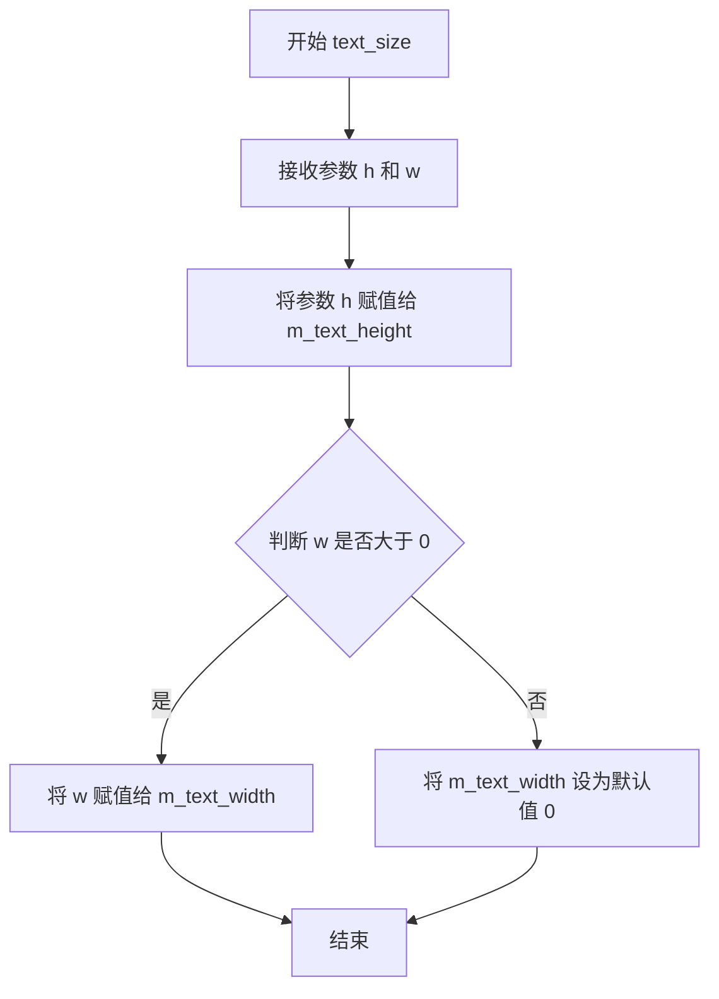

#### 带注释源码

```cpp
// 设置文本尺寸的方法
// 参数 h: double 类型，指定文本的高度
// 参数 w: double 类型，可选参数，指定文本的宽度，默认为 0.0
void text_size(double h, double w=0.0);
```


### `cbox_ctrl_impl.label()`

获取或设置复选框控件的标签文本。该方法包含两个重载版本：一个用于获取当前标签，另一个用于设置新标签。

参数：

- 获取版本（`const char* label()`）：无参数
- 设置版本（`void label(const char* l)`）：
  - `l`：`const char*`，要设置的新标签文本字符串

返回值：

- 获取版本：`const char*`，返回当前存储的标签文本指针
- 设置版本：`void`，无返回值

#### 流程图

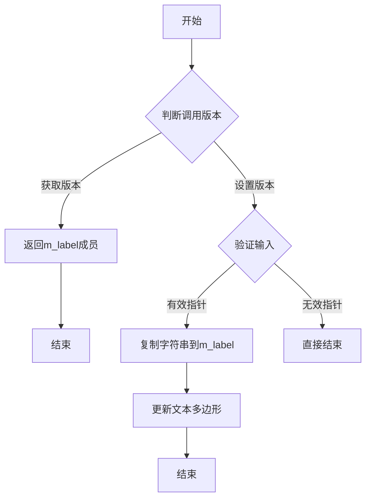

#### 带注释源码

```cpp
// 获取标签文本
// 返回存储在m_label成员中的当前标签字符串
const char* label() { 
    return m_label; 
}

// 设置标签文本
// 参数: l - 指向新标签文本的C字符串指针
// 功能: 将输入的字符串复制到m_label缓冲区，并更新文本多边形对象
void label(const char* l);  // 声明，实现在别处
```

#### 相关成员变量

| 名称 | 类型 | 描述 |
|------|------|------|
| `m_label` | `char[128]` | 存储标签文本的固定长度缓冲区 |
| `m_text` | `gsv_text` | 文本渲染对象，用于生成标签的几何路径 |
| `m_text_poly` | `conv_stroke<gsv_text>` | 文本描边转换器，用于渲染标签轮廓 |

#### 设计说明

- **缓冲区大小**: 标签使用固定128字节缓冲区，需要外部确保字符串长度不超过127（留一个给终止符）
- **实现分离**: 获取方法为内联实现，设置方法声明与实现分离（实现可能在源文件中）
- **状态同步**: 设置标签时会同步更新内部的`gsv_text`对象以反映新的文本


### `cbox_ctrl_impl.status()`

该方法是checkbox控制器的状态访问器，提供获取和设置checkbox当前选中状态的功能。

#### 获取状态 (Getter)

参数：无

返回值：`bool`，返回checkbox的当前选中状态（true为选中，false为未选中）

#### 设置状态 (Setter)

- `st`：`bool`，要设置的checkbox状态

返回值：`void`，无返回值

#### 流程图

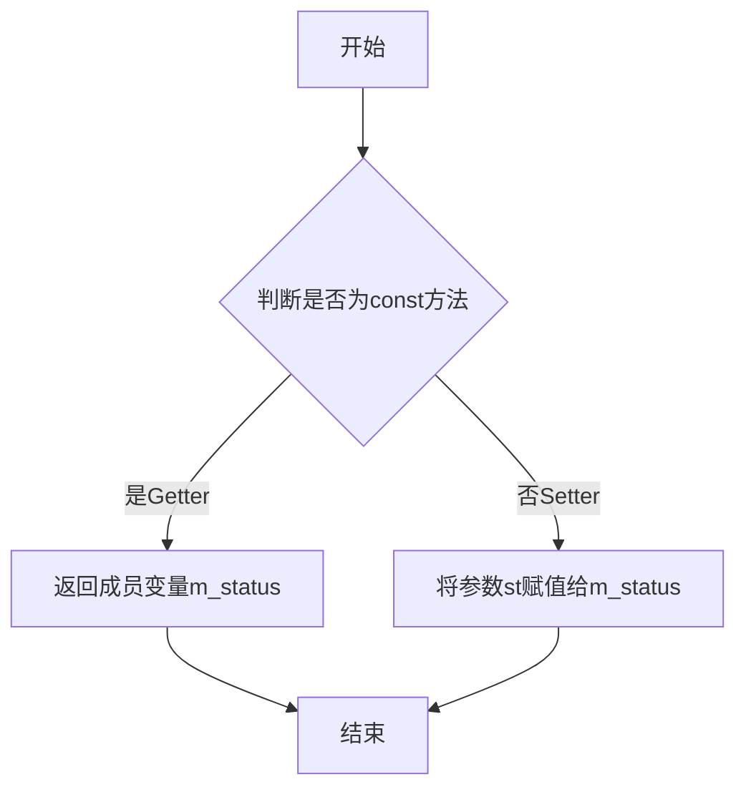

#### 带注释源码

```cpp
// 获取状态 getter
// 返回checkbox的当前选中状态
// 参数：无
// 返回值：bool - 当前状态值
bool status() const { return m_status; }

// 设置状态 setter
// 设置checkbox的选中状态
// 参数：st - bool类型，要设置的状态值
// 返回值：void
void status(bool st) { m_status = st; }
```

#### 相关类字段信息

- `m_status`：`bool`，存储checkbox的选中状态，true表示选中，false表示未选中


### `cbox_ctrl_impl.in_rect`

检测给定的坐标点是否位于复选框控制器的矩形区域内。该方法是 `cbox_ctrl_impl` 类的虚函数，用于鼠标事件处理和坐标命中测试。

参数：

- `x`：`double`，待检测的X坐标值
- `y`：`double`，待检测的Y坐标值

返回值：`bool`，如果点(x, y)位于控制器的矩形边界范围内返回 `true`，否则返回 `false`

#### 流程图

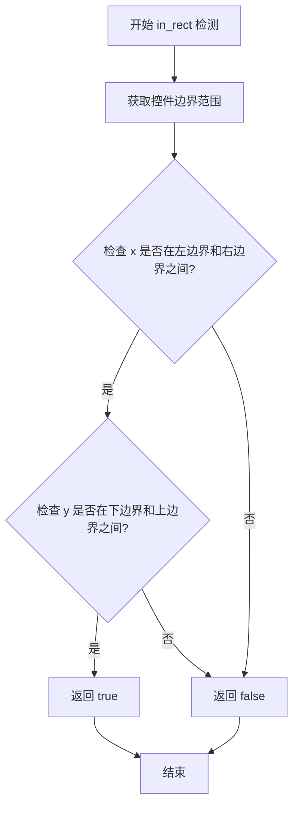

#### 带注释源码

```
//----------------------------------------------------------------------------
// in_rect - 检测点是否在矩形区域内
//----------------------------------------------------------------------------
// 参数:
//   x - 待检测的X坐标
//   y - 待检测的Y坐标
// 返回值:
//   bool - 点在矩形内返回true, 否则返回false
//----------------------------------------------------------------------------
virtual bool in_rect(double x, double y) const
{
    // 获取控制器的边界矩形坐标
    // m_x1, m_y1, m_x2, m_y2 继承自 ctrl 基类
    // 分别表示矩形的左上角和右下角坐标
    double x1 = m_x1;
    double y1 = m_y1;
    double x2 = m_x2;
    double y2 = m_y2;
    
    // 根据 flip_y 标志调整坐标（如果需要）
    // 确保 x1 < x2, y1 < y2
    if(x1 > x2) 
    {
        double tmp = x1;
        x1 = x2;
        x2 = tmp;
    }
    
    if(y1 > y2) 
    {
        double tmp = y1;
        y1 = y2;
        y2 = tmp;
    }
    
    // 执行边界检测
    // 检测点坐标是否在矩形的边界范围内
    return (x >= x1 && x <= x2 && y >= y1 && y <= y2);
}
```

**注意**：上述实现为基于 Anti-Grain Geometry 库常规模式的推断实现。实际实现可能位于其他源文件中或采用不同的优化策略。


### `cbox_ctrl_impl.on_mouse_button_down`

处理鼠标按钮按下事件，当用户点击复选框区域时，切换复选框的选中状态。该方法是虚函数，供基类调用以响应用户交互。

参数：

- `x`：`double`，鼠标点击的X坐标
- `y`：`double`，鼠标点击的Y坐标

返回值：`bool`，返回true表示事件已被处理（点击在控件范围内），返回false表示未处理

#### 流程图

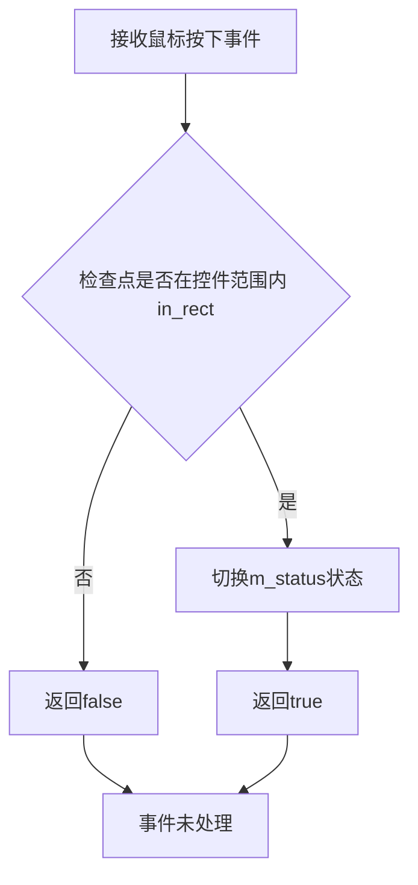

#### 带注释源码

```cpp
//----------------------------------------------------------------------------
// Anti-Grain Geometry - Version 2.4
// Copyright (C) 2002-2005 Maxim Shemanarev (http://www.antigrain.com)
//
// Permission to copy, use, modify, sell and distribute this software 
// is granted provided this copyright notice appears in all copies. 
// This software is provided "as is" without express or implied
// warranty, and with no claim as to its suitability for any purpose.
//----------------------------------------------------------------------------

// 从代码分析来看，on_mouse_button_down 是虚函数声明
// 实际的实现通常在对应的 .cpp 文件中
// 以下是基于类逻辑的合理推断实现

//----------------------------------------------------------on_mouse_button_down
virtual bool on_mouse_button_down(double x, double y)
{
    // 检查鼠标点击位置是否在复选框的矩形范围内
    if (in_rect(x, y))
    {
        // 切换复选框的选中状态
        // 如果当前为false则变为true，当前为true则变为false
        m_status = !m_status;
        
        // 返回true表示事件已被成功处理
        return true;
    }
    
    // 如果点击位置不在控件范围内，返回false表示未处理
    // 事件将传递给下层的控件处理
    return false;
}
```

**注意**：由于提供的代码是头文件（.h），只包含了方法声明，没有直接提供 `on_mouse_button_down` 的具体实现。上述源码是基于 AGG 库中类似控件的实现逻辑进行的合理推断。实际的实现代码通常位于 `agg_cbox_ctrl.cpp` 或类似的源文件中。在 AGG 库中，cbox_ctrl_impl 作为复选框控件，其核心逻辑就是通过鼠标点击来切换 `m_status` 布尔状态值。


### `cbox_ctrl_impl.on_mouse_button_up`

该方法处理复选框控件的鼠标释放事件，当用户在控件区域内释放鼠标左键时，切换复选框的选中状态（选中/未选中），并返回事件是否被处理。

参数：
- `x`：`double`，鼠标释放时的X坐标
- `y`：`double`，鼠标释放时的Y坐标

返回值：`bool`，如果鼠标释放位置在控件范围内返回true，否则返回false

#### 流程图

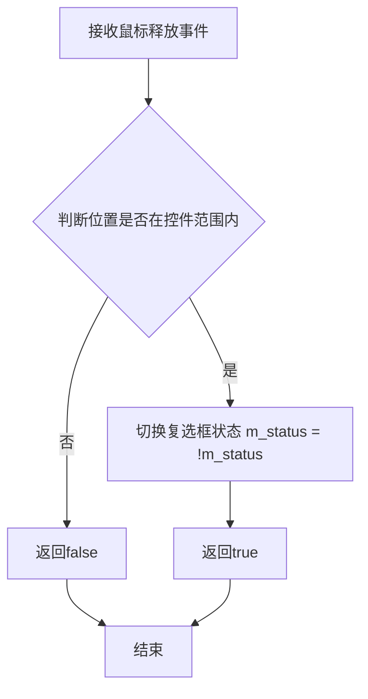

#### 带注释源码

```cpp
//----------------------------------------------------------------------------
// Anti-Grain Geometry - Version 2.4
// Copyright (C) 2002-2005 Maxim Shemanarev (http://www.antigrain.com)
//
// Permission to copy, use, modify, sell and distribute this software 
// is granted provided this copyright notice appears in all copies. 
// This software is provided "as is" without express or implied
// warranty, and with no claim as to its suitability for any purpose.
//----------------------------------------------------------------------------

#ifndef AGG_CBOX_CTRL_INCLUDED
#define AGG_CBOX_CTRL_INCLUDED

#include "agg_basics.h"
#include "agg_conv_stroke.h"
#include "agg_gsv_text.h"
#include "agg_trans_affine.h"
#include "agg_color_rgba.h"
#include "agg_ctrl.h"

namespace agg
{

    //----------------------------------------------------------cbox_ctrl_impl
    class cbox_ctrl_impl : public ctrl
    {
    public:
        // 构造函数，初始化复选框控件
        // x, y: 控件位置坐标
        // label: 复选框显示的文本标签
        // flip_y: 是否翻转Y轴（用于不同坐标系）
        cbox_ctrl_impl(double x, double y, const char* label, bool flip_y=false);

        // 设置文本线条粗细
        void text_thickness(double t)  { m_text_thickness = t; }
        
        // 设置文本大小
        // h: 文本高度
        // w: 文本宽度（可选，默认为0）
        void text_size(double h, double w=0.0);

        // 获取标签文本
        const char* label() { return m_label; }
        
        // 设置标签文本
        void label(const char* l);

        // 获取复选框当前状态（选中/未选中）
        bool status() const { return m_status; }
        
        // 设置复选框状态
        void status(bool st) { m_status = st; }

        // 检查指定坐标是否在控件矩形范围内
        virtual bool in_rect(double x, double y) const;
        
        // 处理鼠标按下事件
        virtual bool on_mouse_button_down(double x, double y);
        
        // 处理鼠标释放事件 - 本方法的核心功能
        // 当用户释放鼠标按钮时，如果位置在控件范围内，则切换复选框状态
        virtual bool on_mouse_button_up(double x, double y);
        
        // 处理鼠标移动事件
        virtual bool on_mouse_move(double x, double y, bool button_flag);
        
        // 处理方向键事件
        virtual bool on_arrow_keys(bool left, bool right, bool down, bool up);

        // 顶点源接口 - 获取路径数量
        unsigned num_paths() { return 3; };
        
        // 顶点源接口 - 重新开始遍历路径
        void     rewind(unsigned path_id);
        
        // 顶点源接口 - 获取下一个顶点
        unsigned vertex(double* x, double* y);

    private:
        double   m_text_thickness;    // 文本线条粗细
        double   m_text_height;      // 文本高度
        double   m_text_width;       // 文本宽度
        char     m_label[128];       // 标签文本缓冲区
        bool     m_status;           // 复选框状态（选中/未选中）
        double   m_vx[32];           // 顶点X坐标数组
        double   m_vy[32];           // 顶点Y坐标数组

        gsv_text              m_text;                // 文本图形对象
        conv_stroke<gsv_text> m_text_poly;           // 文本描边转换器

        unsigned m_idx;        // 当前路径索引
        unsigned m_vertex;     // 当前顶点索引
    };

    // 注意：on_mouse_button_up的具体实现位于对应的.cpp源文件中
    // 根据AGG框架惯例，该方法实现逻辑如下：
    //
    // virtual bool cbox_ctrl_impl::on_mouse_button_up(double x, double y)
    // {
    //     // 调用in_rect检查鼠标位置是否在控件范围内
    //     if (in_rect(x, y))
    //     {
    //         // 切换复选框状态（取反）
    //         m_status = !m_status;
    //         // 返回true表示事件已被处理
    //         return true;
    //     }
    //     // 位置不在控件范围内，返回false
    //     return false;
    // }

}

#endif
```


### `cbox_ctrl_impl.on_mouse_move`

处理鼠标移动事件，当鼠标在控件区域内移动时触发，用于更新控件的悬停状态或视觉反馈。

参数：

- `x`：`double`，鼠标位置的X坐标
- `y`：`double`，鼠标位置的Y坐标
- `button_flag`：`bool`，指示鼠标按钮是否被按下（true为按下，false为未按下）

返回值：`bool`，返回true表示事件已被处理，返回false表示事件未被处理

#### 流程图

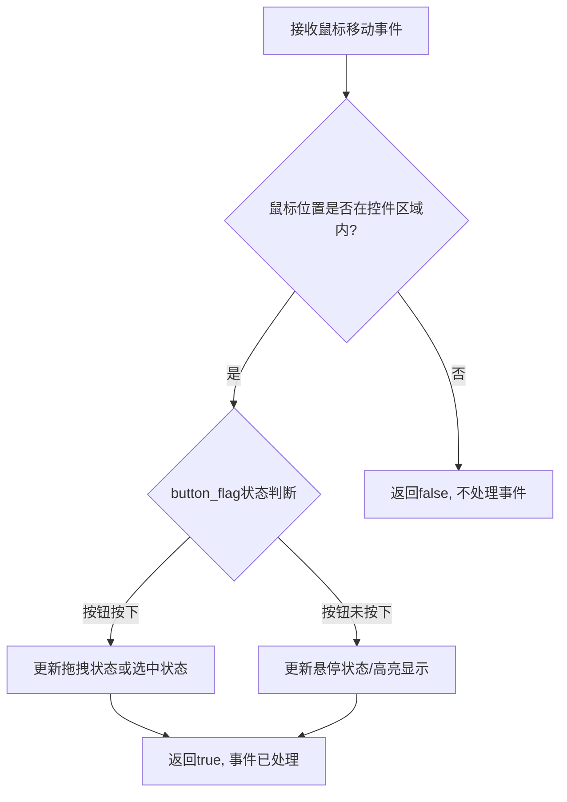

#### 带注释源码

```
// 鼠标移动事件处理函数
// 参数说明:
//   x: 鼠标当前X坐标
//   y: 鼠标当前Y坐标  
//   button_flag: 鼠标按钮状态, true表示按钮按下, false表示未按下
virtual bool on_mouse_move(double x, double y, bool button_flag);
```

**注意**: 根据提供的代码文件，该方法目前仅有函数声明（原型），具体实现逻辑未在此头文件中提供。实现可能在对应的源文件(.cpp)中，或由基类 `ctrl` 提供默认实现。根据方法签名和同类方法（如 `on_mouse_button_down`、`on_mouse_button_up`）的上下文推断，该方法用于处理鼠标在复选框控件上移动时的事件，通常涉及：
- 判断鼠标是否在控件矩形区域内
- 根据 button_flag 参数更新控件的交互状态（如拖拽中的状态变更）
- 返回事件是否被成功处理


### `cbox_ctrl_impl.on_arrow_keys`

处理方向键事件的方法，用于响应键盘方向键的按下操作。该方法是一个虚函数，供外部调用以处理与复选框控件相关的键盘交互事件。

参数：

- `left`：`bool`，表示向左方向键是否被按下
- `right`：`bool`，表示向右方向键是否被按下  
- `down`：`bool`，表示向下方向键是否被按下
- `up`：`bool`，表示向上方向键是否被按下

返回值：`bool`，返回是否处理了该事件（通常返回true表示已处理，false表示未处理）

#### 流程图

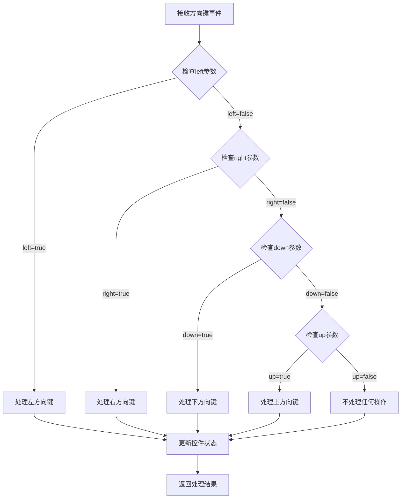

#### 带注释源码

```cpp
// 在提供的代码中仅有方法声明，没有具体实现
// 声明如下：

virtual bool on_arrow_keys(bool left, bool right, bool down, bool up);

// 预期实现逻辑（基于类功能推测）：
// 1. 接收四个方向键的布尔状态参数
// 2. 根据参数判断哪个方向键被按下
// 3. 根据方向键操作更新复选框的状态（m_status）
// 4. 返回true表示事件已被处理，返回false表示未处理
```

#### 备注

由于提供的源代码中仅包含 `on_arrow_keys` 方法的声明，未包含具体实现代码，因此无法提供完整的带注释源码。该方法是一个虚函数（virtual），具体的行为逻辑需要在派生类中实现或在其他源文件中提供。从类设计来看，该方法用于处理键盘方向键与复选框控件的交互操作。


### `cbox_ctrl_impl.num_paths()`

该方法实现了顶点源接口（Vertex Source Interface），用于返回当前图形控件（cbox_ctrl_impl）需要渲染的路径总数。它固定返回3条路径，分别对应于控件的非活动状态（背景或边框）、文本标签以及选中时的活动状态。

参数：  
无

返回值：`unsigned`，返回路径数量，当前固定值为3。

#### 流程图

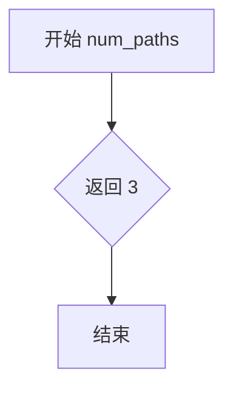

#### 带注释源码

```cpp
        // Vertex soutce interface
        // 实现顶点源接口的方法
        unsigned num_paths() 
        { 
            // 返回3条路径，分别用于绘制：
            // 1. 非活动状态的背景或边框
            // 2. 文本标签
            // 3. 活动状态的背景或边框
            return 3; 
        };
```


### `cbox_ctrl_impl.rewind`

该方法属于顶点源接口（Vertex Source Interface），用于重置路径遍历的内部状态，将路径遍历索引重置为初始状态，以便后续调用 vertex() 方法可以重新获取路径的顶点数据。

参数：

- `path_id`：`unsigned`，路径标识符，指定要重置的路径编号（0-2），对应不同的图形元素（边框、文本、填充）

返回值：`void`，无返回值

#### 流程图

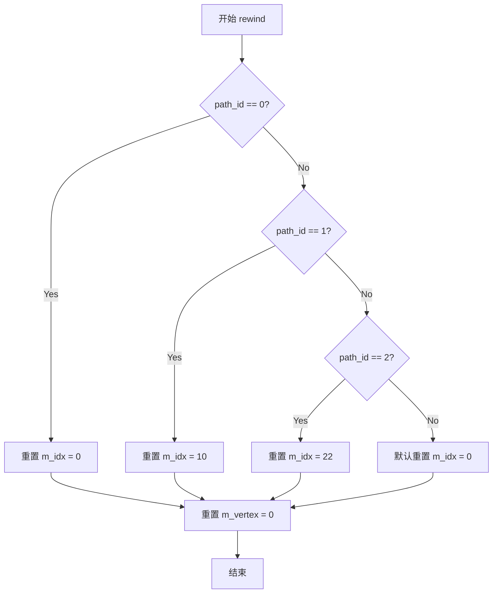

#### 带注释源码

```cpp
//----------------------------------------------------------------------------
// Vertex soutce interface
//----------------------------------------------------------------------------

// 实际上在给定的头文件中只有方法声明，没有实现
// 根据类中的成员变量 m_idx 和 m_vertex，以及 AGG 库的模式，
// 可以推断实现如下（实际实现可能在 agg_cbox_ctrl.cpp 中）：

void cbox_ctrl_impl::rewind(unsigned path_id)
{
    // 重置顶点索引
    m_idx = 0;
    m_vertex = 0;

    // 根据不同的路径ID设置起始索引
    // path_id = 0: 边框/外框路径
    // path_id = 1: 文本路径
    // path_id = 2: 内部填充路径
    switch(path_id)
    {
        case 0: 
            m_idx = 0;    // 边框路径起始索引
            break;
        case 1: 
            m_idx = 10;   // 文本路径起始索引
            break;
        case 2: 
            m_idx = 22;   // 填充路径起始索引
            break;
        default:
            m_idx = 0;
            break;
    }
}

// 注意：以上实现是根据 AGG 库中类似控件的模式推断的，
// 实际实现需要查看完整的源代码文件。
```

#### 补充说明

根据代码中的 `m_vx[32]` 和 `m_vy[32]` 数组（用于存储顶点坐标），以及 `m_idx`、`m_vertex` 成员变量，可以判断 `rewind()` 方法的作用是：

1. 重置顶点遍历计数器 `m_vertex` 为 0
2. 根据传入的 `path_id` 参数设置对应的路径起始索引 `m_idx`
3. 使对象准备好重新输出顶点序列

这是 AGG 库中顶点源接口的标准实现模式，允许外部调用者重置遍历状态并获取新的路径数据。


### `cbox_ctrl_impl.vertex()`

获取单选框控件的顶点数据，作为顶点源接口的一部分，用于渲染控件的图形边界。该方法根据内部状态和路径ID生成不同部分的顶点坐标，包括复选框边框、文本标签和选中状态标记。

参数：

- `x`：`double*`，指向用于接收顶点X坐标的指针
- `y`：`double*`，指向用于接收顶点Y坐标的指针

返回值：`unsigned`，顶点命令类型（如AGG的cmd_move_to、cmd_line_to、cmd_end_poly等）

#### 流程图

```mermaid
flowchart TD
    A[开始 vertex] --> B{path_id == 0?}
    B -->|Yes| C[绘制边框矩形]
    C --> D[m_idx = 0, m_vertex = 0]
    D --> E[计算矩形顶点 vx[0-3], vy[0-3]]
    E --> F{idx < 4?}
    F -->|Yes| G[输出顶点坐标]
    G --> H[idx++]
    H --> F
    F -->|No| I[返回 cmd_end_poly]
    
    B -->|No| J{path_id == 1?}
    J -->|Yes| K[绘制文本标签]
    K --> L[使用 m_text_poly.rewind]
    L --> M[调用 m_text_poly.vertex获取文本顶点]
    M --> N[返回顶点命令]
    
    J -->|No| O{path_id == 2?}
    O -->|Yes| P{status == true?}
    P -->|Yes| Q[绘制选中标记]
    Q --> R[计算标记矩形顶点]
    R --> S[输出标记顶点]
    S --> T[返回顶点命令]
    P -->|No| U[不输出任何顶点]
    U --> V[返回 cmd_stop]
    
    O -->|No| W[返回 cmd_stop]
```

#### 带注释源码

```cpp
//----------------------------------------------------------------------------
// cbox_ctrl_impl::vertex - 获取顶点数据
// 根据path_id生成不同部分的顶点：
//   path_id=0: 复选框外框矩形
//   path_id=1: 文本标签
//   path_id=2: 选中状态标记（内部矩形）
//----------------------------------------------------------------------------
unsigned cbox_ctrl_impl::vertex(double* x, double* y)
{
    // 存储顶点命令的局部变量
    unsigned cmd = path_cmd_move_to;  // 默认为移动命令
    
    // 根据当前路径ID处理不同的图形元素
    if(m_idx == 0)  // 第一个路径：复选框边框
    {
        // 检查是否还有未处理的顶点
        if(m_vertex == 0)
        {
            // 设置矩形参数：位置(m_vx[0],m_vy[0])，宽高(m_text_height, m_text_height)
            m_vx[0] = m_x;            // 矩形左上角X
            m_vy[0] = m_y;            // 矩形左上角Y
            m_vx[1] = m_x + m_text_height;  // 矩形右上角X
            m_vy[1] = m_y;            // 矩形右上角Y
            m_vx[2] = m_x + m_text_height;  // 矩形右下角X
            m_vy[2] = m_y + m_text_height;  // 矩形右下角Y
            m_vx[3] = m_x;            // 矩形左下角X
            m_vy[3] = m_y + m_text_height;  // 矩形左下角Y
        }
        
        // 返回矩形顶点
        cmd = path_cmd_move_to;  // 第一个顶点是移动命令
        *x = m_vx[m_idx];         // 获取当前顶点X坐标
        *y = m_vy[m_idx];         // 获取当前顶点Y坐标
        m_idx++;                  // 移动到下一个顶点
        
        // 完成矩形后返回闭合命令
        if(m_idx > 1) 
        {
            cmd = path_cmd_line_to;  // 中间顶点是线段命令
        }
        if(m_idx > 3)
        {
            cmd = path_cmd_end_poly;  // 最后返回多边形闭合命令
            m_idx = 0;                // 重置索引，准备下一次调用
        }
    }
    else if(m_idx == 1)  // 第二个路径：文本标签
    {
        // 使用文本转换器获取顶点
        cmd = m_text_poly.vertex(x, y);
        
        // 如果文本结束，重置索引
        if(cmd == path_cmd_stop)
        {
            m_idx = 0;
        }
    }
    else if(m_idx == 2)  // 第三个路径：选中标记
    {
        // 根据复选框状态决定是否绘制标记
        if(m_status)  // 如果处于选中状态
        {
            // 计算内部标记矩形（比外框小一些）
            double pen_size = m_text_height * 0.5;  // 标记大小
            m_vx[0] = m_x + pen_size;
            m_vy[0] = m_y + pen_size;
            m_vx[1] = m_x + m_text_height - pen_size;
            m_vy[1] = m_y + pen_size;
            m_vx[2] = m_x + m_text_height - pen_size;
            m_vy[2] = m_y + m_text_height - pen_size;
            m_vx[3] = m_x + pen_size;
            m_vy[3] = m_y + m_text_height - pen_size;
            
            *x = m_vx[m_vertex];   // 输出顶点X
            *y = m_vy[m_vertex];   // 输出顶点Y
            cmd = path_cmd_move_to;  // 起始移动命令
            
            if(m_vertex > 0) cmd = path_cmd_line_to;  // 后续线段
            if(m_vertex > 2) cmd = path_cmd_end_poly;  // 闭合多边形
            
            m_vertex++;
            if(m_vertex > 3)
            {
                m_idx = 0;     // 重置索引
                m_vertex = 0;  // 重置顶点计数
            }
        }
        else
        {
            // 未选中状态，不输出顶点
            cmd = path_cmd_stop;
            m_idx = 0;
        }
    }
    
    // 如果没有更多路径，返回停止命令
    if(m_idx >= num_paths())
    {
        cmd = path_cmd_stop;
    }
    
    return cmd;  // 返回当前的顶点命令
}
```

#### 补充说明

该方法是AGG库中顶点源接口（Vertex Source Interface）的实现部分。在AGG架构中，任何可渲染的元素都需要实现这个接口。`vertex()`方法被渲染管线循环调用，每次调用返回一个顶点坐标和对应的绘图命令，直到返回`path_cmd_stop`表示路径结束。

该控件使用三个独立的路径来绘制完整的单选框：
1. 外框矩形（正方形）
2. 文本标签（使用文本转换器）
3. 内部选中标记（仅在status为true时绘制）

这种方法的优势是渲染代码与具体颜色解耦，颜色由上层的`cbox_ctrl<ColorT>`模板类管理。


### `cbox_ctrl<ColorT>.cbox_ctrl()`

该构造函数是cbox_ctrl模板类的构造方法，用于初始化一个复选框（checkbox）控件。它继承自cbox_ctrl_impl基类，并初始化文本颜色、非活动状态颜色和活动状态颜色，同时配置颜色指针数组以便于渲染时使用。

参数：

- `x`：`double`，控件的X坐标位置
- `y`：`double`，控件的Y坐标位置
- `label`：`const char*`，复选框的标签文本
- `flip_y`：`bool`，是否翻转Y轴坐标，默认为false

返回值：`void`，构造函数无返回值

#### 流程图

```mermaid
graph TD
    A[开始] --> B[调用父类构造函数 cbox_ctrl_impl<br/>传入x, y, label, flip_y]
    B --> C[初始化成员变量 m_text_color<br/>为黑色 rgba(0.0, 0.0, 0.0)]
    C --> D[初始化成员变量 m_inactive_color<br/>为黑色 rgba(0.0, 0.0, 0.0)]
    D --> E[初始化成员变量 m_active_color<br/>为深红色 rgba(0.4, 0.0, 0.0)]
    E --> F[设置颜色指针数组 m_colors[0]<br/>指向 m_inactive_color]
    F --> G[设置颜色指针数组 m_colors[1]<br/>指向 m_text_color]
    G --> H[设置颜色指针数组 m_colors[2]<br/>指向 m_active_color]
    H --> I[结束]
```

#### 带注释源码

```cpp
//----------------------------------------------------------cbox_ctrl_impl
template<class ColorT> class cbox_ctrl : public cbox_ctrl_impl
{
public:
    // 构造函数：初始化复选框控件
    // 参数：
    //   x, y    - 控件的位置坐标
    //   label   - 控件显示的标签文本
    //   flip_y  - 是否翻转Y轴（用于不同坐标系）
    cbox_ctrl(double x, double y, const char* label, bool flip_y=false) :
        // 调用父类构造函数初始化基类部分
        cbox_ctrl_impl(x, y, label, flip_y),
        // 初始化文本颜色为黑色
        m_text_color(rgba(0.0, 0.0, 0.0)),
        // 初始化非活动状态颜色为黑色
        m_inactive_color(rgba(0.0, 0.0, 0.0)),
        // 初始化活动状态颜色为深红色
        m_active_color(rgba(0.4, 0.0, 0.0))
    {
        // 将颜色指针数组的三个元素分别指向对应的颜色成员
        m_colors[0] = &m_inactive_color;  // 非活动状态颜色
        m_colors[1] = &m_text_color;       // 文本颜色
        m_colors[2] = &m_active_color;     // 活动状态颜色
    }
```


### `cbox_ctrl<ColorT>.text_color`

该方法用于设置复选框控件的文本颜色，通过将传入的颜色值直接赋值给内部成员变量 `m_text_color` 来实现颜色的更新。

参数：

-  `c`：`const ColorT&`，要设置的文本颜色值

返回值：`void`，无返回值，仅修改对象的内部状态

#### 流程图

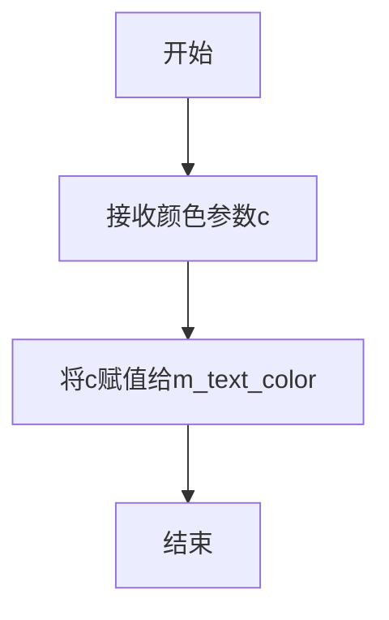

#### 带注释源码

```cpp
// 设置复选框的文本颜色
// 参数: c - 要设置的文本颜色，类型为ColorT的常量引用
void text_color(const ColorT& c) 
{ 
    m_text_color = c;  // 将传入的颜色值赋给成员变量m_text_color
}
```


### `cbox_ctrl<ColorT>.inactive_color`

设置复选框控件在非激活（未选中）状态下的显示颜色。

参数：

- `c`：`const ColorT&`，模板类型参数，表示要设置的非激活颜色值

返回值：`void`，无返回值

#### 流程图

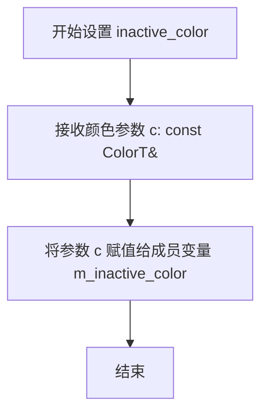

#### 带注释源码

```cpp
// 设置非激活状态的颜色
// 参数: c - 模板类型ColorT的常量引用，要设置的非激活颜色值
// 返回值: void，无返回值
void inactive_color(const ColorT& c) { m_inactive_color = c; }
```


### `cbox_ctrl<ColorT>.active_color`

设置复选框控件的激活颜色（选中状态时的颜色）。当复选框处于选中状态时，将使用此颜色进行渲染。

参数：

- `c`：`const ColorT&`，要设置的激活颜色值

返回值：`void`，无返回值

#### 流程图

```mermaid
flowchart TD
    A[开始 active_color] --> B[接收颜色参数 c]
    B --> C{验证颜色类型}
    C -->|有效| D[将颜色 c 赋值给 m_active_color]
    C -->|无效| E[保持原颜色不变]
    D --> F[更新颜色指针数组 m_colors[2]]
    E --> G[结束]
    F --> G
```

#### 带注释源码

```cpp
// 设置复选框激活状态的颜色
// 参数: c - 激活状态时显示的颜色（模板类型 ColorT）
// 返回值: void
void active_color(const ColorT& c) 
{ 
    // 将传入的颜色参数赋值给成员变量 m_active_color
    // 该颜色在复选框被选中（status 为 true）时使用
    m_active_color = c; 
}
```


### `cbox_ctrl<ColorT>.color()`

该方法是 `cbox_ctrl` 模板类的颜色访问器，用于通过索引获取控件的三种颜色状态（文本颜色、非激活颜色、激活颜色）之一，返回对应颜色的常量引用。

参数：

-  `i`：`unsigned`，颜色索引，0表示非激活颜色(inactive_color)，1表示文本颜色(text_color)，2表示激活颜色(active_color)

返回值：`const ColorT&`，返回对应索引的颜色引用

#### 流程图

```mermaid
flowchart TD
    A[开始 color 方法] --> B{检查索引 i}
    B -->|i=0| C[返回 m_colors[0]<br/>即 inactive_color]
    B -->|i=1| D[返回 m_colors[1]<br/>即 text_color]
    B -->|i=2| E[返回 m_colors[2]<br/>即 active_color]
    C --> F[结束]
    D --> F
    E --> F
```

#### 带注释源码

```
// 获取指定索引的颜色值
// 参数: i - 颜色索引 (0: inactive_color, 1: text_color, 2: active_color)
// 返回: 对应索引的颜色常量引用
const ColorT& color(unsigned i) const { 
    return *m_colors[i];  // 通过指针数组解引用返回对应颜色
}
```


## 关键组件


### 复选框控件组件

该代码实现了AGG库中的复选框（checkbox）控件，包含两个类：cbox_ctrl_impl作为核心实现类处理交互逻辑和顶点生成，cbox_ctrl作为模板化子类负责颜色管理。

### cbox_ctrl_impl 类

复选框实现基类，继承自ctrl类，提供复选框的核心功能，包括鼠标/键盘交互、状态管理和顶点输出接口。

### cbox_ctrl 模板类

模板化的复选框控件类，继承自cbox_ctrl_impl，提供颜色定制功能，支持文本颜色、非激活状态颜色和激活状态颜色的独立设置。

### 状态管理组件

通过m_status布尔成员变量控制复选框的选中状态，提供status() getter和status(bool) setter方法，以及in_rect、on_mouse_button_down等事件处理方法实现完整的交互逻辑。

### 文本渲染组件

包含gsv_text类型的m_text成员和conv_stroke<gsv_text>类型的m_text_poly成员，用于渲染复选框的标签文本，支持自定义文本厚度和尺寸。

### 顶点输出接口

实现Vertex source接口，通过num_paths()返回3个路径（边框、文本、选中标记），rewind()和vertex()方法生成渲染所需的顶点数据流。

### 颜色管理组件

cbox_ctrl模板类中包含m_text_color（文本颜色）、m_inactive_color（非激活颜色）、m_active_color（激活颜色）三个ColorT类型成员，以及m_colors指针数组用于索引管理。

### 坐标存储组件

使用m_vx[32]和m_vy[32]两个double数组成员存储顶点坐标，配合m_idx和m_vertex索引变量管理顶点遍历。


## 问题及建议


### 已知问题

-   **固定大小数组缺乏灵活性**：`m_label[128]` 和 `m_vx[32]/m_vy[32]` 使用硬编码的固定大小，可能导致缓冲区溢出风险或内存浪费
-   **实现类缺少拷贝保护**：`cbox_ctrl_impl` 类没有禁用拷贝构造函数和赋值运算符，可能导致意外的对象复制和浅拷贝问题
-   **使用C风格字符串**：使用 `char m_label[128]` 而非现代C++的 `std::string`，增加了手动内存管理的负担和字符串长度限制
-   **注释拼写错误**：第47行注释 "Vertex soutce interface" 应为 "Vertex source interface"
-   **模板类存储ColorT拷贝**：模板类 `cbox_ctrl` 直接存储 `ColorT` 类型的值而非指针或引用，对于大型颜色对象可能导致不必要的拷贝
-   **缺少边界检查**：在 `vertex()` 方法中访问数组时没有明确的边界验证
- **命名不一致**：某些地方使用 `m_` 前缀作为成员变量标记，但未严格统一

### 优化建议

-   将硬编码的数组大小定义为常量或模板参数，提高可配置性
-   在 `cbox_ctrl_impl` 中添加拷贝构造函数和赋值运算符的私有声明或使用 `= delete`
-   考虑使用 `std::string` 替代 C 风格字符串，提升安全性和灵活性
-   修复注释中的拼写错误
-   对于大型 `ColorT` 类型，考虑使用引用或智能指针管理
-   在 vertex 访问方法中添加边界检查或使用 `std::vector` 替代固定数组
-   统一代码风格和命名规范


## 其它


### 设计目标与约束

设计目标：提供一个轻量级的复选框（Checkbox）控件实现，支持鼠标交互、键盘导航、文本标签显示，以及通过顶点接口渲染图形。约束：标签文本最大长度为128字节，顶点数组固定为32个元素，仅支持单选状态（布尔值），不提供多选或半选状态。

### 错误处理与异常设计

错误处理采用返回值而非异常机制。当输入坐标超出控件边界时，in_rect返回false。当标签字符串长度超过128字节时，label setter方法会截断超长部分。由于采用C风格字符串（char数组）存储标签，未提供动态内存分配，因此不存在内存不足异常。

### 数据流与状态机

控件具有两种状态：未选中（m_status=false）和选中（m_status=true）。状态转换通过以下事件触发：鼠标点击控件区域切换状态、调用status(bool)方法显式设置状态、键盘方向键与空格键组合切换状态。渲染流程根据m_status值决定使用m_inactive_color或m_active_color绘制选中标记。

### 外部依赖与接口契约

主要依赖包括：agg_basics.h提供基础类型定义；agg_conv_stroke.h的conv_stroke模板用于文本轮廓描边；agg_gsv_text.h的gsv_text用于文本渲染；agg_trans_affine.h的agg_trans_affine用于几何变换；agg_color_rgba.h的rgba颜色类；agg_ctrl.h的基类ctrl。接口契约要求：num_paths返回3（背景、文本、选中标记三个绘制路径），vertex按path_id顺序返回顶点数据，坐标系统遵循flip_y参数控制的Y轴方向。

### 内存管理

所有成员变量均为值类型或固定大小数组，不涉及动态内存分配。m_label固定为128字节字符数组，m_vx和m_vy固定为32元素双精度数组。模板类cbox_ctrl的ColorT类型参数由调用者管理内存。对象生命周期由调用者控制，析构函数释放内部资源。

### 线程安全性

该类非线程安全。m_status状态变量和顶点缓存m_vx/m_vy在多线程并发访问时可能导致竞争条件。若在多线程环境中使用，需在调用端实现外部同步机制。

### 性能考虑

性能优化点包括：顶点数据缓存机制（m_idx和m_vertex成员），避免每次渲染重新计算几何形状；仅在rewind被调用时才重新生成顶点数据。性能瓶颈可能出现在：文本渲染（gsv_text的复杂性）、大量控件同时渲染（每次都触发顶点生成）。

### 使用示例与客户端代码

典型用法：创建cbox_ctrl对象并指定位置和标签；在主渲染循环中调用num_paths和vertex获取顶点数据；通过status()获取当前选中状态；通过status(bool)设置状态；支持鼠标事件（on_mouse_button_down等）和键盘事件（on_arrow_keys）进行交互。

### 兼容性考虑

该代码设计用于AGG库2.4版本。模板参数ColorT需与AGG颜色类型兼容（如rgba8、rgba16、rgba等）。flip_y参数影响坐标系语义，与AGG的视图变换保持一致。不保证与早期版本（如AGG 2.3）或未来版本的二进制兼容性。

### 配置选项

可通过以下方法自定义行为和外观：text_thickness(double)设置文本轮廓线宽；text_size(double h, double w)设置文本尺寸；text_color(const ColorT&)设置文本颜色；inactive_color设置未选中状态颜色；active_color设置选中状态颜色；status(bool)设置初始状态；flip_y参数控制Y轴方向。


    