# `matplotlib\extern\agg24-svn\include\ctrl\agg_ctrl.h` 详细设计文档

这是 Anti-Grain Geometry (AGG) 图形库的控件基础模块，定义了一个抽象的 ctrl 控件基类，提供了控件的坐标边界管理、坐标变换（支持 Y 轴翻转和仿射变换矩阵）、鼠标/键盘交互事件处理接口，以及两个模板函数 render_ctrl 和 render_ctrl_rs 用于渲染控件路径。

## 整体流程

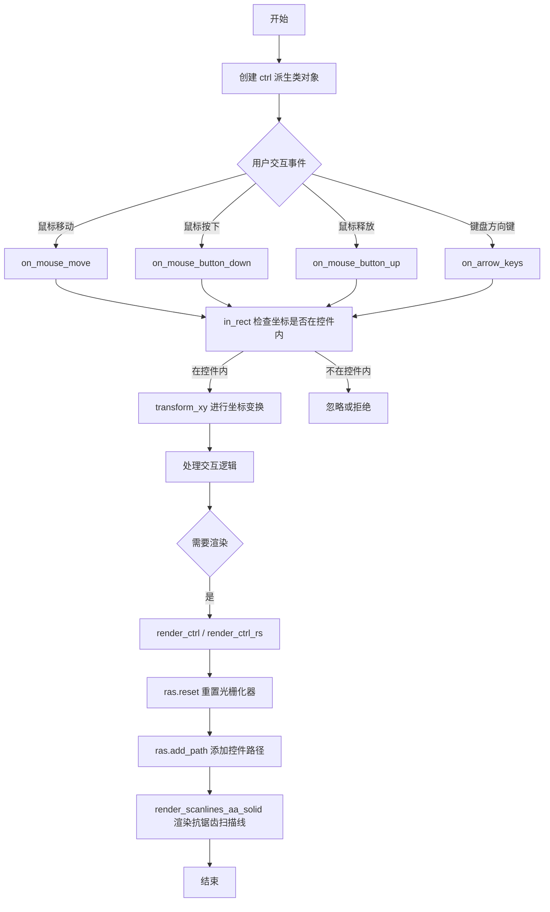

## 类结构

```
ctrl (抽象基类)
    ├── 虚析构函数 ~ctrl()
    ├── 坐标边界: m_x1, m_y1, m_x2, m_y2 (protected)
    ├── 变换控制: m_flip_y, m_mtx (private)
    └── 模板函数: render_ctrl, render_ctrl_rs (全局)
```

## 全局变量及字段


### `ctrl.m_x1`
    
控件左边界 X 坐标

类型：`double`
    


### `ctrl.m_y1`
    
控件上边界 Y 坐标

类型：`double`
    


### `ctrl.m_x2`
    
控件右边界 X 坐标

类型：`double`
    


### `ctrl.m_y2`
    
控件下边界 Y 坐标

类型：`double`
    


### `ctrl.m_flip_y`
    
是否翻转 Y 坐标标志

类型：`bool`
    


### `ctrl.m_mtx`
    
仿射变换矩阵指针

类型：`const trans_affine*`
    
    

## 全局函数及方法


### `render_ctrl(Rasterizer&, Scanline&, Renderer&, Ctrl&)`

该模板函数使用抗锯齿实色渲染方式绘制控件。它遍历控件中的所有路径，为每条路径重置光栅化器，添加路径，然后使用与该路径关联的颜色渲染抗锯齿扫描线。

参数：

- `ras`：`Rasterizer&`，光栅化器引用，用于执行多边形的扫描线转换
- `sl`：`Scanline&`，扫描线对象，用于存储和遍历扫描线数据
- `r`：`Renderer&`，渲染器引用，负责将扫描线输出到目标设备
- `c`：`Ctrl&`，控件引用，提供要渲染的路径数量、路径数据和颜色信息

返回值：`void`，无返回值

#### 流程图

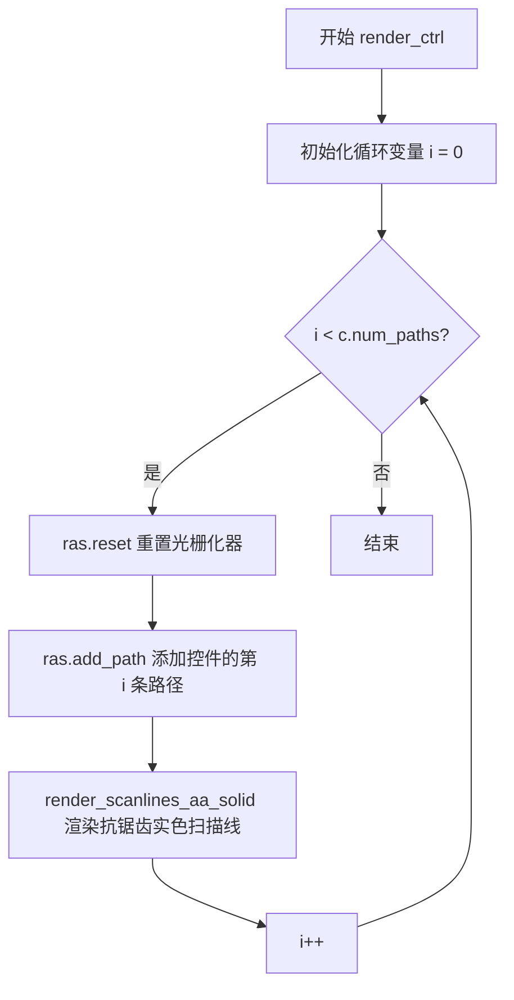

#### 带注释源码

```cpp
//--------------------------------------------------------------------
template<class Rasterizer, class Scanline, class Renderer, class Ctrl> 
void render_ctrl(Rasterizer& ras, Scanline& sl, Renderer& r, Ctrl& c)
{
    // 循环计数器，遍历控件中的所有路径
    unsigned i;
    
    // 遍历控件的每一条路径
    for(i = 0; i < c.num_paths(); i++)
    {
        // 重置光栅化器状态，准备处理新路径
        ras.reset();
        
        // 将控件的第 i 条路径添加到光栅化器
        // Ctrl 类需要提供 add_path(c, i) 接口
        ras.add_path(c, i);
        
        // 使用抗锯齿实色渲染方式绘制扫描线
        // c.color(i) 获取第 i 条路径对应的颜色
        // 该函数执行完整的 AA 渲染流程
        render_scanlines_aa_solid(ras, sl, r, c.color(i));
    }
}
```

#### 关键组件信息

- **Rasterizer（光栅化器）**：负责将矢量路径转换为扫描线数据，支持抗锯齿处理
- **Scanline（扫描线）**：存储扫描线渲染所需的数据结构
- **Renderer（渲染器）**：将扫描线数据渲染到目标输出设备（如图像缓冲区）
- **Ctrl（控件）**：提供路径数据和颜色信息的抽象接口，需实现 `num_paths()`、`add_path()` 和 `color()` 方法

#### 设计约束与依赖

- **模板参数约束**：Ctrl 类型必须实现 `num_paths()`（返回路径数量）、`add_path(Ctrl&, unsigned)`（添加路径到光栅化器）和 `color(unsigned)`（返回指定路径颜色）接口
- **渲染模式**：本函数使用 AA（抗锯齿）实色渲染，适用于需要高质量边缘的控件渲染场景
- **对比函数**：同期提供的 `render_ctrl_rs` 函数使用另一种渲染方式，适用于需要自定义渲染器的场景

#### 技术债务与优化空间

1. **颜色与路径映射假设**：代码假设 `num_paths()` 返回的数量与 `color(i)` 的有效索引范围一致，缺乏运行时验证
2. **错误处理缺失**：未检查 `ras.add_path()` 的返回值，若路径添加失败将继续执行
3. **模板编译开销**：每次实例化都会生成独立代码，可能导致二进制膨胀
4. **性能考量**：对于大量控件渲染，可考虑缓存光栅化结果或使用批处理优化


### render_ctrl_rs

使用指定的扫描线渲染器（Rasterizer）和图形渲染器（Renderer）绘制控件（Ctrl）的模板函数。它循环遍历控件中的每一个路径，将其添加到光栅化器进行光栅化，并通过渲染器绘制对应的扫描线。

参数：

-  `ras`：`Rasterizer&`，光栅化器引用，负责将矢量路径转换为扫描线数据
-  `sl`：`Scanline&`，扫描线容器引用，用于存储光栅化过程中生成的扫描线
-  `r`：`Renderer&`，渲染器引用，负责执行最终的像素绘制操作
-  `c`：`Ctrl&`，控件引用，包含待渲染的路径几何数据及颜色信息

返回值：`void`，无返回值

#### 流程图

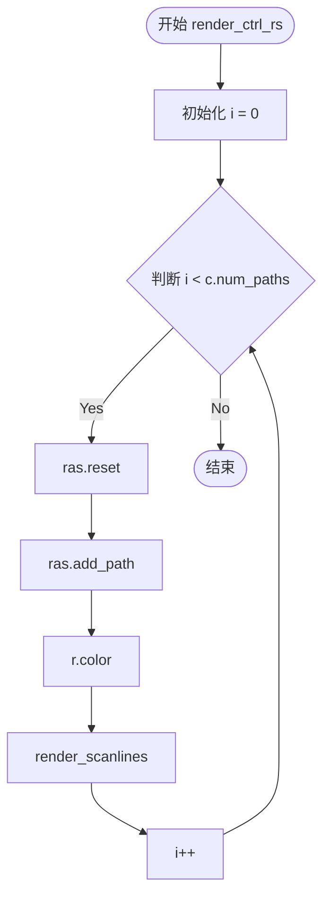

#### 带注释源码

```cpp
    //--------------------------------------------------------------------
    // 模板函数 render_ctrl_rs
    // 泛型参数: Rasterizer(光栅化器), Scanline(扫描线), Renderer(渲染器), Ctrl(控件)
    //--------------------------------------------------------------------
    template<class Rasterizer, class Scanline, class Renderer, class Ctrl> 
    void render_ctrl_rs(Rasterizer& ras, Scanline& sl, Renderer& r, Ctrl& c)
    {
        unsigned i;
        // 遍历控件对象中的所有路径
        for(i = 0; i < c.num_paths(); i++)
        {
            // 1. 重置光栅化器状态，准备生成新的路径数据
            ras.reset();
            
            // 2. 将控件中的第 i 条路径添加到光栅化器
            ras.add_path(c, i);
            
            // 3. 设置渲染器的当前颜色为控件第 i 个路径对应的颜色
            r.color(c.color(i));
            
            // 4. 调用通用扫描线渲染函数，将光栅化结果绘制到目标
            render_scanlines(ras, sl, r);
        }
    }
```


### `ctrl.ctrl`

构造函数，初始化控件的边界坐标和 Y 轴翻转标志，建立控件的几何空间基础。

参数：

- `x1`：`double`，控件左上角的 X 坐标
- `y1`：`double`，控件左上角的 Y 坐标
- `x2`：`double`，控件右下角的 X 坐标
- `y2`：`double`，控件右下角的 Y 坐标
- `flip_y`：`bool`，Y 轴翻转标志，用于坐标系转换

返回值：无（构造函数）

#### 流程图

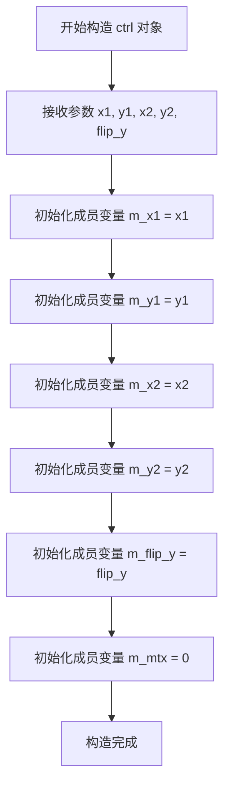

#### 带注释源码

```cpp
//--------------------------------------------------------------------
// 构造函数：初始化控件的边界和变换状态
// 参数：
//   x1, y1 - 控件左上角坐标
//   x2, y2 - 控件右下角坐标
//   flip_y - Y轴翻转标志，用于处理不同坐标系的映射
//--------------------------------------------------------------------
ctrl(double x1, double y1, double x2, double y2, bool flip_y) :
    m_x1(x1),    // 初始化左上角X坐标
    m_y1(y1),    // 初始化左上角Y坐标
    m_x2(x2),    // 初始化右下角X坐标
    m_y2(y2),    // 初始化右下角Y坐标
    m_flip_y(flip_y),  // 初始化Y轴翻转标志
    m_mtx(0)           // 初始化变换矩阵指针为空
{
    // 构造函数体为空，所有初始化工作在成员初始化列表中完成
}
```

#### 相关成员变量说明

| 变量名 | 类型 | 描述 |
|--------|------|------|
| `m_x1` | `double` | 控件左上角 X 坐标 |
| `m_y1` | `double` | 控件左上角 Y 坐标 |
| `m_x2` | `double` | 控件右下角 X 坐标 |
| `m_y2` | `double` | 控件右下角 Y 坐标 |
| `m_flip_y` | `bool` | Y 轴翻转标志，控制 `transform_xy` 和 `inverse_transform_xy` 方法中的 Y 坐标处理逻辑 |
| `m_mtx` | `const trans_affine*` | 仿射变换矩阵指针，用于坐标变换，初始化为 `nullptr`（0） |


### `ctrl::~ctrl()`

该虚析构函数是`ctrl`类的析构函数，用于确保通过基类指针删除派生类对象时能正确调用派生类的析构函数，实现多态销毁。

参数： 无

返回值：`void`，无返回值

#### 流程图

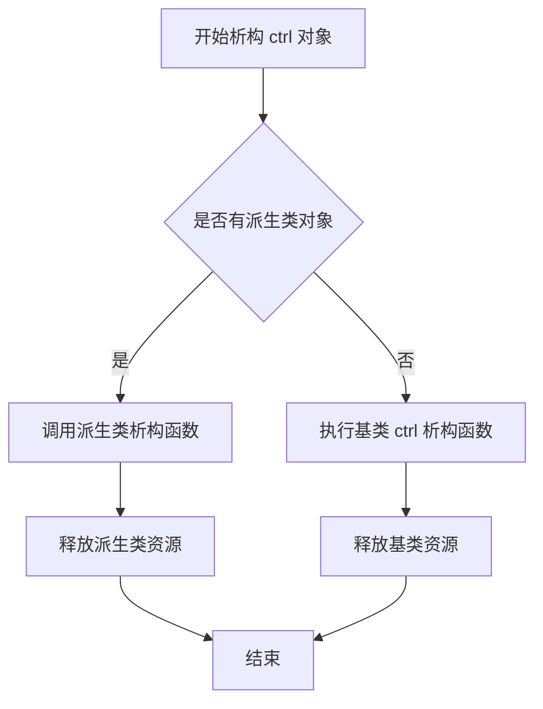

#### 带注释源码

```cpp
//----------------------------------------------------------------------------
// Anti-Grain Geometry - Version 2.4
//----------------------------------------------------------------------------

#ifndef AGG_CTRL_INCLUDED
#define AGG_CTRL_INCLUDED

#include "agg_trans_affine.h"
#include "agg_renderer_scanline.h"

namespace agg
{

    //--------------------------------------------------------------------ctrl
    class ctrl
    {
    public:
        //--------------------------------------------------------------------
        // 虚析构函数：确保通过基类指针删除派生类对象时能正确调用析构函数
        // 这是实现多态行为的关键，防止内存泄漏
        virtual ~ctrl() {}
        
        // 构造函数：初始化控制器的坐标和翻转标志
        ctrl(double x1, double y1, double x2, double y2, bool flip_y) :
            m_x1(x1), m_y1(y1), m_x2(x2), m_y2(y2), 
            m_flip_y(flip_y),
            m_mtx(0)
        {
        }

        //--------------------------------------------------------------------
        // 纯虚函数：派生类必须实现这些方法
        virtual bool in_rect(double x, double y) const = 0;
        virtual bool on_mouse_button_down(double x, double y) = 0;
        virtual bool on_mouse_button_up(double x, double y) = 0;
        virtual bool on_mouse_move(double x, double y, bool button_flag) = 0;
        virtual bool on_arrow_keys(bool left, bool right, bool down, bool up) = 0;

        //--------------------------------------------------------------------
        // 变换相关方法
        void transform(const trans_affine& mtx) { m_mtx = &mtx; }
        void no_transform() { m_mtx = 0; }

        //--------------------------------------------------------------------
        // 坐标变换方法：根据flip_y和变换矩阵变换坐标
        void transform_xy(double* x, double* y) const
        {
            if(m_flip_y) *y = m_y1 + m_y2 - *y;
            if(m_mtx) m_mtx->transform(x, y);
        }

        //--------------------------------------------------------------------
        // 逆变换方法
        void inverse_transform_xy(double* x, double* y) const
        {
            if(m_mtx) m_mtx->inverse_transform(x, y);
            if(m_flip_y) *y = m_y1 + m_y2 - *y;
        }

        //--------------------------------------------------------------------
        // 获取缩放比例
        double scale() const { return m_mtx ? m_mtx->scale() : 1.0; }

    private:
        // 禁止拷贝构造和赋值
        ctrl(const ctrl&);
        const ctrl& operator = (const ctrl&);

    protected:
        // 保护成员变量：控制器的边界坐标
        double m_x1;
        double m_y1;
        double m_x2;
        double m_y2;

    private:
        // 私有成员变量
        bool m_flip_y;                    // Y轴翻转标志
        const trans_affine* m_mtx;        // 仿射变换矩阵指针
    };

    // ... 其余代码 ...
}

#endif
```


### `ctrl.in_rect`

纯虚函数，用于检查给定的坐标点(x, y)是否在控件的矩形区域内。该函数由具体的控件类实现，用于鼠标事件处理中的命中测试（hit testing），判断鼠标点击位置是否落在控件的可交互区域内。

参数：

- `x`：`double`，指定要检查的X坐标
- `y`：`double`，指定要检查的Y坐标

返回值：`bool`，如果点(x, y)在控件矩形内返回true，否则返回false

#### 流程图

```mermaid
flowchart TD
    A[接收坐标点 x, y] --> B{检查 x 是否在 [m_x1, m_x2] 范围内}
    B -->|是| C{检查 y 是否在 [m_y1, m_y2] 范围内}
    B -->|否| D[返回 false]
    C -->|是| E[返回 true]
    C -->|否| D
```

#### 带注释源码

```cpp
//--------------------------------------------------------------------
// ctrl 类中的纯虚函数声明
//--------------------------------------------------------------------

// virtual bool in_rect(double x, double y) const = 0;
//
// 参数：
//   x - double类型的X坐标值
//   y - double类型的Y坐标值
//
// 返回值：
//   bool - 如果点(x,y)位于控件矩形区域内返回true，否则返回false
//
// 说明：
//   这是一个纯虚函数(pure virtual function)，由具体的控件类(如按钮、滑动条等)实现
//   用于处理鼠标事件时的命中测试(hit testing)
//   矩形范围由受保护的成员变量 m_x1, m_y1, m_x2, m_y2 定义
//   注意：实际的矩形检测逻辑由子类实现，此处仅为接口声明
//   const修饰符表明该函数不会修改对象状态
//--------------------------------------------------------------------

virtual bool in_rect(double x, double y) const = 0;
```


### `ctrl.on_mouse_button_down`

处理鼠标按下事件的纯虚函数，由具体控件类实现以响应用户鼠标按钮按下的交互行为。

参数：

- `x`：`double`，鼠标按下时的x坐标（世界坐标或屏幕坐标）
- `y`：`double`，鼠标按下时的y坐标（世界坐标或屏幕坐标）

返回值：`bool`，返回true表示事件已被控件处理，返回false表示事件未被处理

#### 流程图

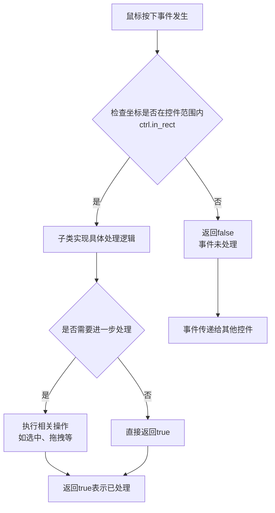

#### 带注释源码

```cpp
//----------------------------------------------------------------------------
// Anti-Grain Geometry - Version 2.4
// Copyright (C) 2002-2005 Maxim Shemanarev (http://www.antigrain.com)
//
// Permission to copy, use, modify, sell and distribute this software 
// is granted provided this copyright notice appears in all copies. 
// This software is provided "as is" without express or implied
// warranty, and with no claim as to its suitability for any purpose.
//----------------------------------------------------------------------------

#ifndef AGG_CTRL_INCLUDED
#define AGG_CTRL_INCLUDED

#include "agg_trans_affine.h"
#include "agg_renderer_scanline.h"

namespace agg
{

    //--------------------------------------------------------------------ctrl
    // ctrl类：UI控件的抽象基类，定义控件的基本接口和属性
    // 提供坐标变换、鼠标事件处理等基础功能
    //--------------------------------------------------------------------ctrl
    class ctrl
    {
    public:
        //--------------------------------------------------------------------
        // 析构函数
        virtual ~ctrl() {}
        
        //--------------------------------------------------------------------
        // 构造函数
        // 参数：
        //   x1, y1 - 控件左上角坐标
        //   x2, y2 - 控件右下角坐标
        //   flip_y - 是否翻转Y轴（用于坐标变换）
        ctrl(double x1, double y1, double x2, double y2, bool flip_y) :
            m_x1(x1), m_y1(y1), m_x2(x2), m_y2(y2), 
            m_flip_y(flip_y),
            m_mtx(0)
        {
        }

        //--------------------------------------------------------------------
        // 纯虚函数：检查给定坐标是否在控件矩形范围内
        // 参数：x, y - 待检测的坐标
        // 返回：bool - 坐标在范围内返回true
        virtual bool in_rect(double x, double y) const = 0;
        
        //--------------------------------------------------------------------
        // 纯虚函数：处理鼠标按下事件
        // 参数：
        //   x - 鼠标按下时的x坐标
        //   y - 鼠标按下时的y坐标
        // 返回：bool - 事件被处理返回true，否则返回false
        virtual bool on_mouse_button_down(double x, double y) = 0;
        
        //--------------------------------------------------------------------
        // 纯虚函数：处理鼠标释放事件
        virtual bool on_mouse_button_up(double x, double y) = 0;
        
        //--------------------------------------------------------------------
        // 纯虚函数：处理鼠标移动事件
        // 参数：
        //   x, y - 鼠标当前位置
        //   button_flag - 鼠标按钮状态（true表示按钮按下）
        virtual bool on_mouse_move(double x, double y, bool button_flag) = 0;
        
        //--------------------------------------------------------------------
        // 纯虚函数：处理方向键事件
        // 参数：left, right, down, up - 方向键状态
        virtual bool on_arrow_keys(bool left, bool right, bool down, bool up) = 0;

        //--------------------------------------------------------------------
        // 设置变换矩阵
        // 参数：mtx - 仿射变换矩阵指针
        void transform(const trans_affine& mtx) { m_mtx = &mtx; }
        
        //--------------------------------------------------------------------
        // 清除变换矩阵
        void no_transform() { m_mtx = 0; }

        //--------------------------------------------------------------------
        // 变换坐标（应用flip_y和变换矩阵）
        // 参数：x, y - 输入输出坐标
        void transform_xy(double* x, double* y) const
        {
            // 如果启用flip_y，则翻转Y坐标
            if(m_flip_y) *y = m_y1 + m_y2 - *y;
            // 如果存在变换矩阵，则应用变换
            if(m_mtx) m_mtx->transform(x, y);
        }

        //--------------------------------------------------------------------
        // 逆变换坐标
        // 参数：x, y - 输入输出坐标
        void inverse_transform_xy(double* x, double* y) const
        {
            // 先应用逆变换矩阵
            if(m_mtx) m_mtx->inverse_transform(x, y);
            // 如果启用flip_y，则翻转Y坐标
            if(m_flip_y) *y = m_y1 + m_y2 - *y;
        }

        //--------------------------------------------------------------------
        // 获取缩放比例
        double scale() const { return m_mtx ? m_mtx->scale() : 1.0; }

    private:
        // 禁用拷贝构造函数
        ctrl(const ctrl&);
        // 禁用赋值运算符
        const ctrl& operator = (const ctrl&);

    protected:
        // 控件边界坐标
        double m_x1;  // 左上角x坐标
        double m_y1;  // 左上角y坐标
        double m_x2;  // 右下角x坐标
        double m_y2;  // 右下角y坐标

    private:
        // 是否翻转Y轴
        bool m_flip_y;
        // 仿射变换矩阵指针
        const trans_affine* m_mtx;
    };
    // ... 其他模板函数 ...
}

#endif
```


### `ctrl.on_mouse_button_up`

处理鼠标释放事件的纯虚函数接口。该函数是 `agg::ctrl` 抽象类定义的四个鼠标事件处理接口之一，由具体控件类实现以响应用户释放鼠标按钮的操作。

参数：

- `x`：`double`，鼠标释放时的X坐标（相对于控件坐标系统）
- `y`：`double`，鼠标释放时的Y坐标（相对于控件坐标系统）

返回值：`bool`，返回 true 表示事件已被该控件处理，返回 false 表示事件未被处理且可传递给其他控件

#### 流程图

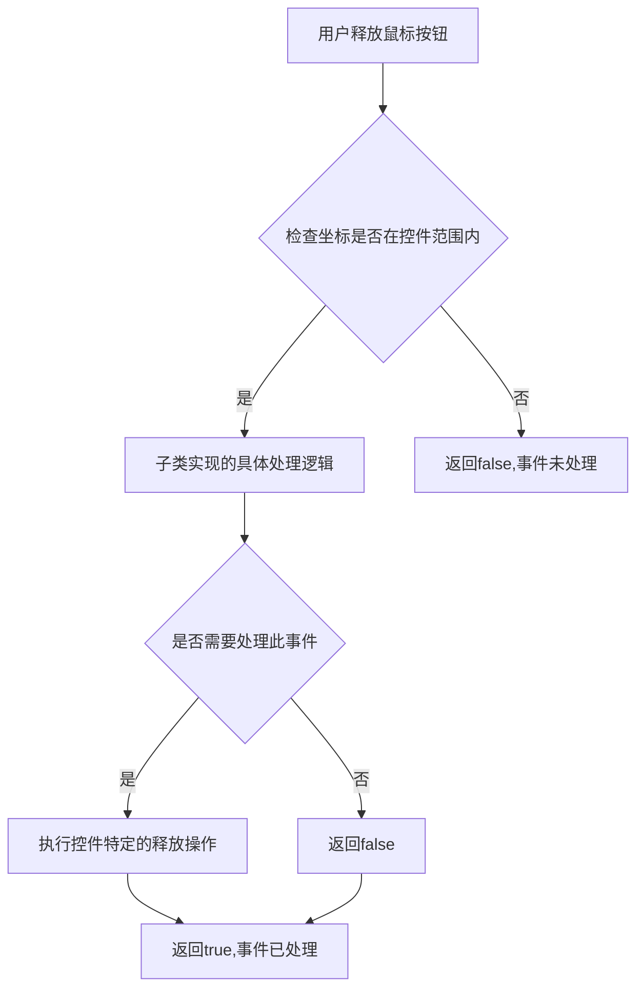

#### 带注释源码

```cpp
//----------------------------------------------------------------------------
// Anti-Grain Geometry - Version 2.4
// 纯虚函数声明 - 无实现代码
//----------------------------------------------------------------------------

// 在 ctrl 类中的声明（第44行）
virtual bool on_mouse_button_up(double x, double y) = 0;

/*
 * 说明：
 * - 这是一个纯虚函数（=0 语法），使 ctrl 类成为抽象基类
 * - 具体实现由派生类提供
 * - 类似于其他UI框架的 MouseUp 或 MouseRelease 事件处理器
 * - 参数 x, y 是经过 transform_xy 变换后的坐标
 * - 返回值表示事件是否被该控件消费（consumed）
 *
 * 典型实现模式（由子类实现）：
 * bool some_ctrl::on_mouse_button_up(double x, double y)
 * {
 *     // 检查坐标是否在控件区域内
 *     if (in_rect(x, y))
 *     {
 *         // 执行控件特定的释放操作
 *         // 例如：更新状态、触发回调等
 *         return true;  // 事件已处理
 *     }
 *     return false;  // 事件未处理，传递给其他控件
 * }
 */
```

#### 补充说明

由于这是纯虚函数，没有实际的实现代码。该函数的设计模式体现了：

1. **模板方法模式**：基类定义接口，子类提供具体实现
2. **事件委托机制**：返回值用于事件冒泡控制
3. **坐标变换集成**：输入参数已经过 `transform_xy` 变换处理

调用方通过多态调用具体子类的实现来实现控件交互。


### `ctrl.on_mouse_move`

该方法是 `agg::ctrl` 抽象基类中的纯虚函数，定义鼠标移动事件的处理接口。派生类需实现此方法以响应鼠标在控件区域内的移动操作，并根据 `button_flag` 参数区分鼠标按下与未按下状态的移动事件，返回布尔值表示事件是否被处理。

参数：

- `x`：`double`，鼠标当前的 X 坐标（经过坐标变换后的值）
- `y`：`double`，鼠标当前的 Y 坐标（经过坐标变换后的值）
- `button_flag`：`bool`，鼠标按钮状态标志，`true` 表示鼠标按钮处于按下状态，`false` 表示未按下

返回值：`bool`，返回 `true` 表示该移动事件已被控件处理，返回 `false` 表示未处理

#### 流程图

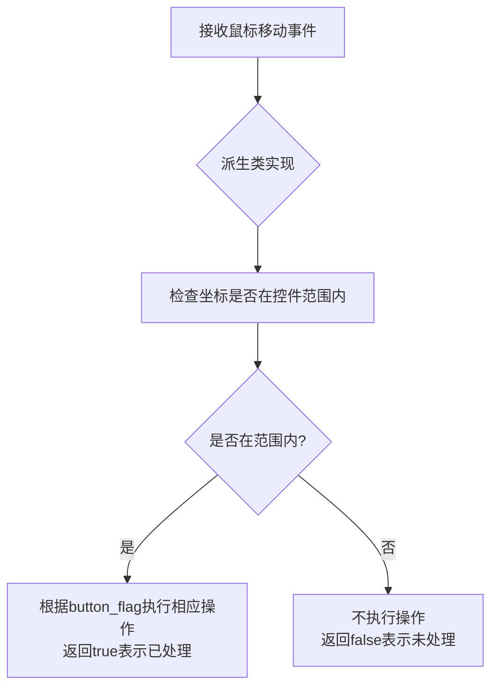

#### 带注释源码

```cpp
// 纯虚函数声明 - 无实现，由派生类重写
// 参数说明：
//   x: 鼠标位置的X坐标（经过transform_xy变换后的坐标）
//   y: 鼠标位置的Y坐标（经过transform_xy变换后的坐标）
//   button_flag: 鼠标按钮状态，true表示有按钮被按下，false表示无按钮按下
// 返回值：
//   true: 表示派生类处理了该鼠标移动事件
//   false: 表示派生类未处理该事件，事件可传递给其他控件
virtual bool on_mouse_move(double x, double y, bool button_flag) = 0;
```


### ctrl.on_arrow_keys

这是一个纯虚函数，定义了处理方向键事件的接口。具体实现由派生类完成，用于响应键盘的方向键输入。

参数：

- `left`：`bool`，表示是否按下左方向键，true表示按下，false表示未按下
- `right`：`bool`，表示是否按下右方向键，true表示按下，false表示未按下
- `down`：`bool`，表示是否按下下方向键，true表示按下，false表示未按下
- `up`：`bool`，表示是否按下上方向键，true表示按下，false表示未按下

返回值：`bool`，返回true表示事件已被成功处理，返回false表示事件未被处理

#### 流程图

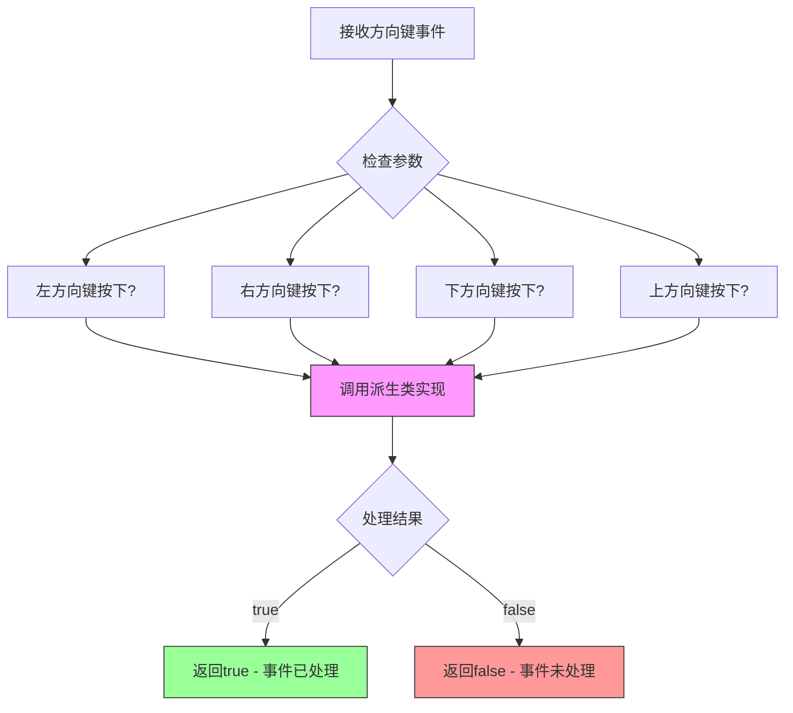

#### 带注释源码

```cpp
//--------------------------------------------------------------------
// virtual bool on_arrow_keys(bool left, bool right, bool down, bool up) = 0;
//
// 纯虚函数声明，定义处理方向键事件的接口
// 参数说明:
//   left  - 布尔值，表示左方向键是否被按下
//   right - 布尔值，表示右方向键是否被按下
//   down  - 布尔值，表示下方向键是否被按下
//   up    - 布尔值，表示上方向键是否被按下
// 返回值:
//   布尔值，true表示事件已被处理，false表示事件未被处理
// 注意:
//   - 此函数为纯虚函数(=0)，必须由派生类实现
//   - 派生类应覆盖此方法以实现具体的方向键处理逻辑
//   - 典型的实现包括控件的焦点移动、值调整等功能
//--------------------------------------------------------------------
virtual bool on_arrow_keys(bool left, bool right, bool down, bool up) = 0;
```


### `ctrl.transform`

设置控件的变换矩阵，将传入的仿射变换矩阵引用保存到成员变量中，供后续坐标变换使用。

参数：

- `mtx`：`const trans_affine&`，仿射变换矩阵的常量引用

返回值：`void`，无返回值

#### 流程图

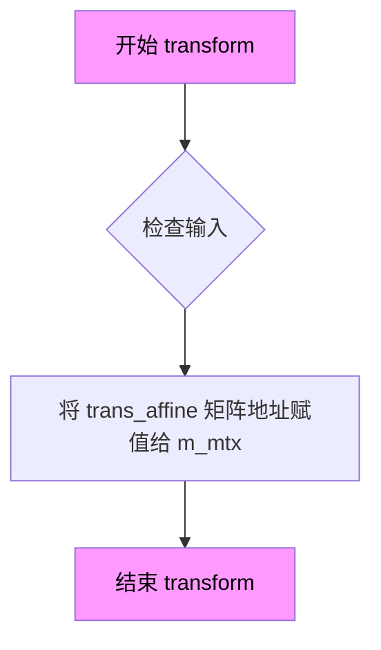

#### 带注释源码

```cpp
//--------------------------------------------------------------------
// 设置变换矩阵
// 参数: mtx - 仿射变换矩阵的常量引用
// 功能: 将传入的仿射变换矩阵的地址保存到成员变量 m_mtx 中
//       后续在 transform_xy 和 inverse_transform_xy 方法中会使用该矩阵
//       进行坐标的变换和逆变换操作
//--------------------------------------------------------------------
// 将传入的仿射变换矩阵的地址赋值给成员变量 m_mtx
// 注意：这里保存的是指针而非副本，因此外部需保证 mtx 的生命周期
void transform(const trans_affine& mtx) 
{ 
    m_mtx = &mtx; 
}
```


### `ctrl.no_transform`

清除变换矩阵，将内部变换矩阵指针设置为 `nullptr`（`0`），从而禁用坐标变换功能。

参数：无

返回值：`void`，无返回值

#### 流程图

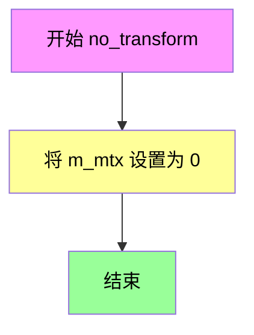

#### 带注释源码

```cpp
//--------------------------------------------------------------------
void no_transform() { m_mtx = 0; }
// 清除变换矩阵，将指向 trans_affine 的指针设置为 0（nullptr）
// 这样后续的 transform_xy 和 inverse_transform_xy 将不会应用任何矩阵变换
// 参数：无
// 返回值：无（void）
```


### `ctrl.transform_xy`

该方法用于对给定的坐标 (x, y) 进行坐标变换，首先根据 Y 轴翻转标志位对 Y 坐标进行翻转（如果启用），然后应用仿射变换矩阵（如果已设置），将坐标从本地坐标系变换到屏幕坐标系。

参数：

- `x`：`double*`，指向 X 坐标的指针，待变换的 X 坐标
- `y`：`double*`，指向 Y 坐标的指针，待变换的 Y 坐标

返回值：`void`，无返回值，直接在原指针位置修改坐标值

#### 流程图

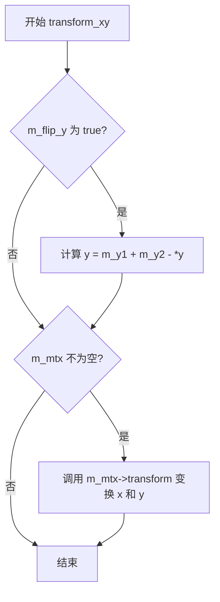

#### 带注释源码

```cpp
//----------------------------------------------------------------------------
// 方法: transform_xy
// 描述: 对坐标进行变换，包括 Y 轴翻转和矩阵变换
// 参数:
//   x: double* - 指向 X 坐标的指针
//   y: double* - 指向 Y 坐标的指针
// 返回值: void
//----------------------------------------------------------------------------
void transform_xy(double* x, double* y) const
{
    // 如果启用了 Y 轴翻转，则将 Y 坐标相对于控制框的 Y 范围进行翻转
    // 翻转公式: y_new = y1 + y2 - y_old
    if(m_flip_y) *y = m_y1 + m_y2 - *y;
    
    // 如果存在仿射变换矩阵，则应用矩阵变换
    // 该矩阵可以将坐标从本地坐标系变换到屏幕坐标系
    if(m_mtx) m_mtx->transform(x, y);
}
```


### `ctrl.inverse_transform_xy`

该方法执行坐标的逆变换，首先应用仿射变换矩阵的逆变换（如果存在），然后处理Y轴翻转（如果启用了flip_y）。它用于将屏幕或设备坐标转换回原始坐标系。

参数：

- `x`：`double*`，指向X坐标的指针，方法会将其变换到原始坐标系的X值
- `y`：`double*`，指向Y坐标的指针，方法会将其变换到原始坐标系的Y值

返回值：`void`，无返回值。坐标变换通过指针参数直接修改传入的值。

#### 流程图

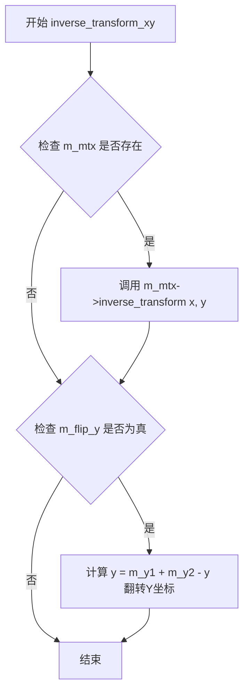

#### 带注释源码

```cpp
//--------------------------------------------------------------------
void inverse_transform_xy(double* x, double* y) const
{
    // 如果存在仿射变换矩阵，则先进行逆变换
    // 将屏幕坐标转换回变换前的坐标
    if(m_mtx) m_mtx->inverse_transform(x, y);
    
    // 如果启用了Y轴翻转，则需要将Y坐标翻转回来
    // 原始Y = m_y1 + m_y2 - 屏幕Y
    if(m_flip_y) *y = m_y1 + m_y2 - *y;
}
```


### `ctrl.scale()`

该方法用于获取当前变换矩阵的缩放比例。如果对象关联了变换矩阵，则返回该矩阵的缩放比例；否则返回默认值 1.0，表示无缩放。

参数：
- （无参数）

返回值：`double`，返回当前缩放比例。如果存在变换矩阵，则返回矩阵的缩放因子；否则返回 1.0。

#### 流程图

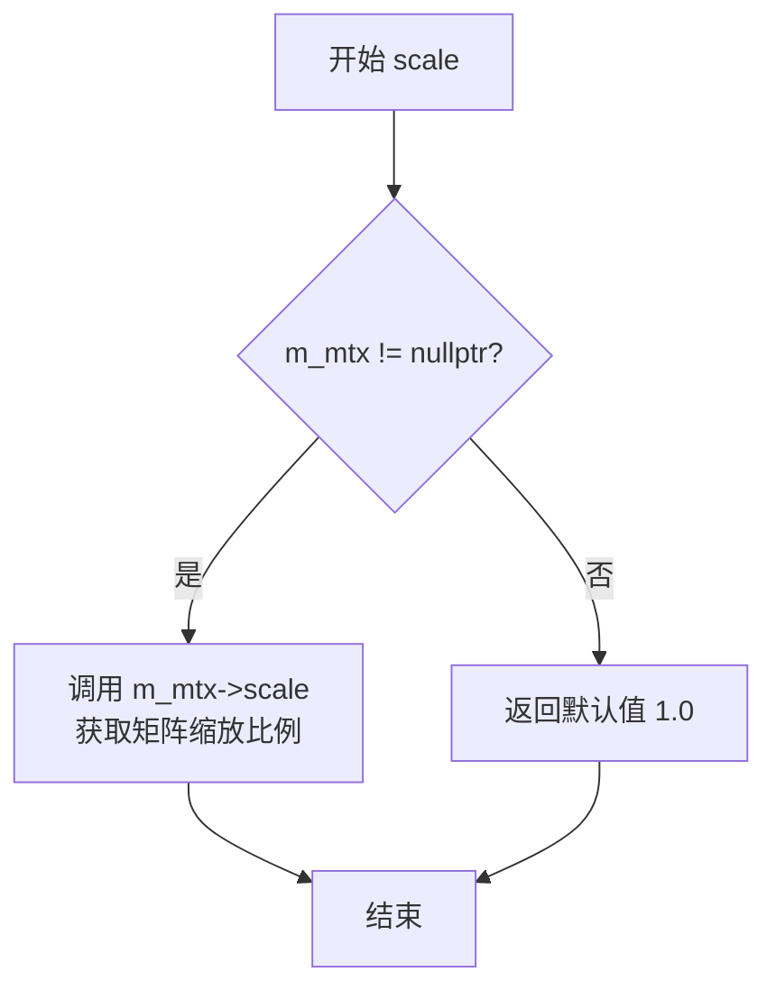

#### 带注释源码

```cpp
//--------------------------------------------------------------------
// 获取当前缩放比例
// 该方法返回与控件关联的仿射变换矩阵的缩放因子。
// 如果没有关联变换矩阵（m_mtx 为 nullptr），则返回 1.0，
// 表示控件保持原始比例，不进行缩放。
//--------------------------------------------------------------------
double scale() const 
{ 
    // 如果 m_mtx 不为空，调用矩阵的 scale() 方法获取缩放比例
    // 否则返回默认值 1.0
    return m_mtx ? m_mtx->scale() : 1.0; 
}
```


## 关键组件


### ctrl 类

ctrl 类是 AGG 库中的抽象基类，用于定义 UI 控件的基本接口和坐标变换功能。它提供坐标边界管理、Y 轴翻转支持、以及仿射变换矩阵应用，是所有 UI 控件的基类。

### 坐标变换机制

包含 transform_xy() 和 inverse_transform_xy() 方法，负责将屏幕坐标与控件本地坐标进行相互转换，支持 Y 轴翻转和仿射矩阵变换。

### render_ctrl 模板函数

通用的控件渲染函数，遍历控件的所有路径，使用 AA（抗锯齿）solid 渲染方式将每个路径渲染到扫描线上。

### render_ctrl_rs 模板函数

与 render_ctrl 类似，但使用渲染器特定的 scanline 渲染方式，提供了更灵活的渲染接口。

### 仿射变换支持

通过 m_mtx 指针和相关的 transform()/no_transform() 方法，允许对控件应用旋转、缩放、平移等仿射变换操作。

### 鼠标事件处理接口

定义了 in_rect()、on_mouse_button_down()、on_mouse_button_up()、on_mouse_move() 等纯虚方法，为子类实现交互功能提供接口。

### 键盘事件处理接口

定义了 on_arrow_keys() 纯虚方法，用于处理方向键输入，实现控件的键盘导航功能。


## 问题及建议


### 已知问题

-   **指针所有权不明确**：`m_mtx` 是指向 `trans_affine` 的裸指针，没有明确的内存所有权语义，调用者需确保指针有效性，容易导致悬挂指针问题
-   **虚函数设计不完整**：`transform()` 和 `no_transform()` 方法未声明为 virtual，无法在子类中重写，限制了多态扩展性
-   **模板参数缺少约束**：`render_ctrl` 和 `render_ctrl_rs` 函数模板对 `Ctrl` 类型使用了 `num_paths()`、`color(i)` 等方法，但未在模板中定义约束或概念检查，可能导致编译错误难以调试
-   **代码重复**：两个渲染函数 `render_ctrl` 和 `render_ctrl_rs` 结构几乎相同，仅在渲染方式上有细微差别，可通过策略模式或参数化合并
-   **const 正确性不足**：`transform()`、`no_transform()`、`transform_xy()`、`inverse_transform_xy()` 等不修改对象状态的方法未标记为 const
-   **缺乏错误处理**：未对空指针、无效坐标范围等边界条件进行校验
-   **裸 API 暴露**：使用裸指针和裸引用，缺少智能指针封装，现代 C++ 最佳实践中不推荐

### 优化建议

-   **引入智能指针管理**：将 `const trans_affine* m_mtx` 改为 `std::shared_ptr<const trans_affine>` 或 `std::weak_ptr`，或使用引用语义并提供更清晰的生命周期管理
-   **补充虚函数声明**：为需要在子类中重写的方法添加 `virtual` 关键字
-   **使用 C++ 概念约束模板**：使用 C++20 Concepts 或 SFINAE 约束 `Ctrl` 类型必须实现必要的方法，提升编译错误可读性
-   **重构消除重复**：将两个渲染函数合并为一个，通过模板参数或策略类区分渲染方式
-   **完善 const 正确性**：将所有不修改成员状态的方法标记为 const
-   **添加参数校验**：在 `in_rect()`、`transform_xy()` 等方法中增加坐标范围和指针有效性检查
-   **补充文档注释**：为类、方法、参数添加详细的 Doxygen 风格文档


## 其它


### 设计目标与约束

**设计目标**：为AGG图形库提供统一的UI控件抽象基类，定义控件的交互接口（鼠标/键盘事件处理）、渲染接口和坐标变换能力，使得具体控件实现可以复用通用的渲染逻辑。

**约束条件**：
- 坐标系统采用AGG标准的浮点坐标系
- 变换矩阵必须为仿射变换（trans_affine），仅支持线性变换
- 所有具体控件类必须实现ctrl定义的纯虚函数
- 模板函数依赖Ctrl类型提供num_paths()、color()、operator[]访问路径

### 错误处理与异常设计

**当前设计**：采用布尔返回值设计，on_mouse_button_down、on_mouse_button_up、on_mouse_move、on_arrow_keys等事件处理方法返回bool表示事件是否被处理。

**设计缺陷**：
- 缺乏错误状态传播机制，无法区分"事件未处理"和"处理失败"
- 变换矩阵指针m_mtx为nullptr时隐式假设为单位矩阵，但inverse_transform_xy未做空指针检查
- 建议增加异常类或错误码枚举用于处理边界计算溢出、内存分配失败等情况

### 数据流与状态机

**数据流向**：
1. 用户输入（鼠标/键盘）→ 具体控件实现 → 渲染请求
2. 坐标输入 → transform_xy/inverse_transform_xy → 变换后坐标输出

**状态管理**：
- 控件状态由具体实现类管理（如是否被选中、是否拖拽中）
- 全局变换状态通过m_mtx指针维护（无变换时为nullptr）
- 坐标翻转状态通过m_flip_y布尔值维护

### 外部依赖与接口契约

**依赖项**：
- agg_trans_affine：提供仿射变换矩阵类及transform/inverse_transform方法
- agg_renderer_scanline：提供render_scanlines_aa_solid和render_scanlines函数

**接口契约**：
- 具体控件类必须实现：in_rect、on_mouse_button_down、on_mouse_button_up、on_mouse_move、on_arrow_keys
- 具体控件类必须提供：num_paths()、color(unsigned)、operator[]（返回路径生成器）
- 模板函数要求Rasterizer提供reset()和add_path()方法，Scanline提供扫面线处理接口，Renderer提供color()方法

### 线程安全与并发考虑

**当前设计**：无线程安全保护

**风险**：ctrl类中的m_mtx指针在多线程环境下可能被同时修改，且无锁保护机制

**建议**：如需多线程支持，应增加线程同步机制或提供只读变换接口

### 内存管理设计

**当前设计**：
- m_mtx为指向外部trans_affine对象的指针，不负责内存释放
- ctrl类未实现拷贝构造函数和赋值运算符（私有化防止浅拷贝）

**风险**：外部变换矩阵生命周期需用户自行管理，可能出现悬空指针

### 边界条件与输入验证

**未处理的边界情况**：
- m_x1 > m_x2 或 m_y1 > m_y2 时的行为未定义
- 坐标变换可能产生NaN或Inf值（当变换矩阵极端时）
- scale()在m_mtx为nullptr时返回1.0，但未考虑极端缩放值

### 性能优化空间

- render_ctrl与render_ctrl_rs代码高度重复，可合并或通过策略模式优化
- transform_xy每次调用都进行m_flip_y判断，可考虑缓存变换标志
- 纯虚函数调用存在虚表查找开销，对性能敏感场景可考虑模板化实现

    