# `matplotlib\extern\agg24-svn\include\ctrl\agg_gamma_ctrl.h` 详细设计文档

这是Anti-Grain Geometry库中的一个交互式gamma曲线控制组件，用于在图形界面中可视化和调整gamma校正曲线，支持鼠标拖拽控制点和键盘方向键操作，提供完整的渲染接口用于绘制控制界面。

## 整体流程

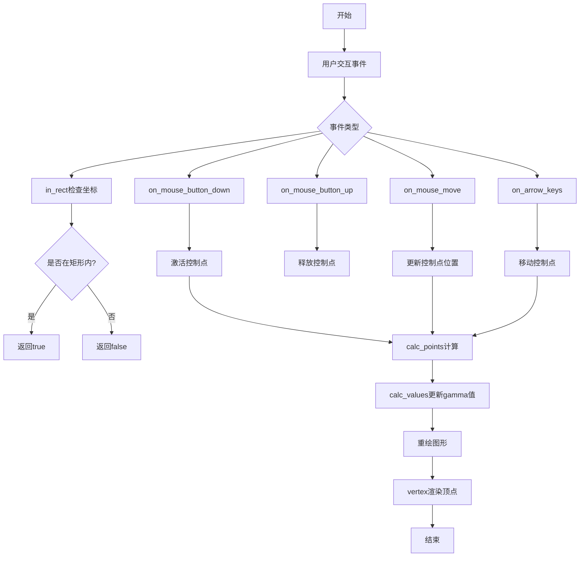

## 类结构

```
ctrl (基类)
└── gamma_ctrl_impl
    └── gamma_ctrl<ColorT> (模板类)
```

## 全局变量及字段


### `gamma_ctrl_impl.m_gamma_spline`
    
存储用于伽马校正的伽马样条对象。

类型：`gamma_spline`
    


### `gamma_ctrl_impl.m_border_width`
    
控制区域的边框宽度。

类型：`double`
    


### `gamma_ctrl_impl.m_border_extra`
    
额外的边框间距宽度。

类型：`double`
    


### `gamma_ctrl_impl.m_curve_width`
    
伽马曲线的线宽。

类型：`double`
    


### `gamma_ctrl_impl.m_grid_width`
    
网格线的线宽。

类型：`double`
    


### `gamma_ctrl_impl.m_text_thickness`
    
文字笔画的粗细。

类型：`double`
    


### `gamma_ctrl_impl.m_point_size`
    
交互控制点的大小。

类型：`double`
    


### `gamma_ctrl_impl.m_text_height`
    
文字标签的高度。

类型：`double`
    


### `gamma_ctrl_impl.m_text_width`
    
文字标签的宽度。

类型：`double`
    


### `gamma_ctrl_impl.m_xc1`
    
第一条曲线控制点的 X 坐标。

类型：`double`
    


### `gamma_ctrl_impl.m_yc1`
    
第一条曲线控制点的 Y 坐标。

类型：`double`
    


### `gamma_ctrl_impl.m_xc2`
    
第二条曲线控制点的 X 坐标。

类型：`double`
    


### `gamma_ctrl_impl.m_yc2`
    
第二条曲线控制点的 Y 坐标。

类型：`double`
    


### `gamma_ctrl_impl.m_xs1`
    
样条起点 X 坐标。

类型：`double`
    


### `gamma_ctrl_impl.m_ys1`
    
样条起点 Y 坐标。

类型：`double`
    


### `gamma_ctrl_impl.m_xs2`
    
样条终点 X 坐标。

类型：`double`
    


### `gamma_ctrl_impl.m_ys2`
    
样条终点 Y 坐标。

类型：`double`
    


### `gamma_ctrl_impl.m_xt1`
    
第一个文字标签的 X 坐标。

类型：`double`
    


### `gamma_ctrl_impl.m_yt1`
    
第一个文字标签的 Y 坐标。

类型：`double`
    


### `gamma_ctrl_impl.m_xt2`
    
第二个文字标签的 X 坐标。

类型：`double`
    


### `gamma_ctrl_impl.m_yt2`
    
第二个文字标签的 Y 坐标。

类型：`double`
    


### `gamma_ctrl_impl.m_curve_poly`
    
用于渲染伽马曲线的线条生成器。

类型：`conv_stroke<gamma_spline>`
    


### `gamma_ctrl_impl.m_ellipse`
    
用于绘制控制点标记的椭圆形状。

类型：`ellipse`
    


### `gamma_ctrl_impl.m_text`
    
用于渲染文字标签的文本对象。

类型：`gsv_text`
    


### `gamma_ctrl_impl.m_text_poly`
    
用于渲染文字笔画的线条生成器。

类型：`conv_stroke<gsv_text>`
    


### `gamma_ctrl_impl.m_idx`
    
当前路径在顶点源迭代中的索引。

类型：`unsigned`
    


### `gamma_ctrl_impl.m_vertex`
    
当前路径内顶点的索引。

类型：`unsigned`
    


### `gamma_ctrl_impl.m_vx`
    
多边形顶点的 X 坐标数组（32 个元素）。

类型：`double`
    


### `gamma_ctrl_impl.m_vy`
    
多边形顶点的 Y 坐标数组（32 个元素）。

类型：`double`
    


### `gamma_ctrl_impl.m_xp1`
    
第一个交互点的 X 坐标。

类型：`double`
    


### `gamma_ctrl_impl.m_yp1`
    
第一个交互点的 Y 坐标。

类型：`double`
    


### `gamma_ctrl_impl.m_xp2`
    
第二个交互点的 X 坐标。

类型：`double`
    


### `gamma_ctrl_impl.m_yp2`
    
第二个交互点的 Y 坐标。

类型：`double`
    


### `gamma_ctrl_impl.m_p1_active`
    
指示第一个控制点是否处于激活状态。

类型：`bool`
    


### `gamma_ctrl_impl.m_mouse_point`
    
当前鼠标所在的控制点索引。

类型：`unsigned`
    


### `gamma_ctrl_impl.m_pdx`
    
鼠标拖动时的 X 方向偏移量。

类型：`double`
    


### `gamma_ctrl_impl.m_pdy`
    
鼠标拖动时的 Y 方向偏移量。

类型：`double`
    


### `gamma_ctrl<ColorT>.m_background_color`
    
控制区域的背景颜色。

类型：`ColorT`
    


### `gamma_ctrl<ColorT>.m_border_color`
    
控制区域的边框颜色。

类型：`ColorT`
    


### `gamma_ctrl<ColorT>.m_curve_color`
    
伽马曲线的颜色。

类型：`ColorT`
    


### `gamma_ctrl<ColorT>.m_grid_color`
    
网格线的颜色。

类型：`ColorT`
    


### `gamma_ctrl<ColorT>.m_inactive_pnt_color`
    
非激活状态控制点的颜色。

类型：`ColorT`
    


### `gamma_ctrl<ColorT>.m_active_pnt_color`
    
激活状态控制点的颜色。

类型：`ColorT`
    


### `gamma_ctrl<ColorT>.m_text_color`
    
文字标签的颜色。

类型：`ColorT`
    


### `gamma_ctrl<ColorT>.m_colors`
    
指向七个颜色成员的指针数组，用于统一访问。

类型：`ColorT*`
    
    

## 全局函数及方法


### gamma_ctrl_impl.gamma_ctrl_impl

这是 `gamma_ctrl_impl` 类的构造函数，用于初始化一个交互式Gamma曲线控制控件。该控制控件允许用户通过图形界面调整Gamma校正曲线，并提供了鼠标交互来修改控制点。

参数：

- `x1`：`double`，控制框左上角的X坐标
- `y1`：`double`，控制框左上角的Y坐标
- `x2`：`double`，控制框右下角的X坐标
- `y2`：`double`，控制框右下角的Y坐标
- `flip_y`：`bool`，可选参数，是否翻转Y轴坐标（默认为false）

返回值：无（构造函数）

#### 流程图

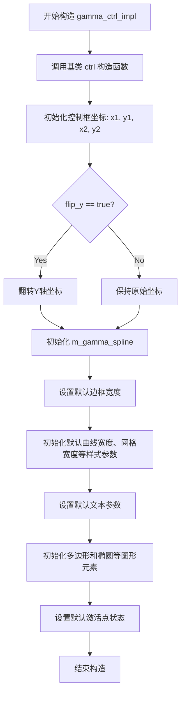

#### 带注释源码

```cpp
// 构造函数声明
// 参数：
//   x1, y1 - 控制框左上角坐标
//   x2, y2 - 控制框右下角坐标  
//   flip_y - 是否翻转Y轴（用于不同坐标系）
gamma_ctrl_impl(double x1, double y1, double x2, double y2, bool flip_y=false);

// 构造函数实现（根据类成员推断）
gamma_ctrl_impl(double x1, double y1, double x2, double y2, bool flip_y=false)
    : ctrl(x1, y1, x2, y2, flip_y)  // 调用基类构造函数
{
    // 初始化成员变量（根据类定义推断）
    m_border_width = 1.0;          // 默认边框宽度
    m_border_extra = 0.0;           // 额外边框宽度
    m_curve_width = 1.0;            // 默认曲线宽度
    m_grid_width = 1.0;             // 默认网格宽度
    m_text_thickness = 1.0;         // 默认文本粗细
    m_point_size = 5.0;             // 默认控制点大小
    
    // 初始化文本高度和宽度
    m_text_height = 12.0;
    m_text_width = 0;
    
    // 初始化控制框坐标
    m_xc1 = x1;  // 曲线区域左上X
    m_yc1 = y1;  // 曲线区域左上Y
    m_xc2 = x2;  // 曲线区域右下X
    m_yc2 = y2;  // 曲线区域右下Y
    
    // 根据flip_y标志处理Y坐标
    if (flip_y)
    {
        // 翻转Y轴相关坐标
    }
    
    // 初始化样条曲线控制点
    m_xs1 = x1 + (x2 - x1) * 0.25;  // 第一个控制点X
    m_ys1 = y1 + (y2 - y1) * 0.75; // 第一个控制点Y
    m_xs2 = x1 + (x2 - x1) * 0.75; // 第二个控制点X
    m_ys2 = y1 + (y2 - y1) * 0.25; // 第二个控制点Y
    
    // 初始化文本位置
    m_xt1 = x1;
    m_yt1 = y1;
    m_xt2 = x2;
    m_yt2 = y2;
    
    // 初始化活动点状态
    m_p1_active = true;   // 默认第一个点为活动点
    m_mouse_point = 0;    // 鼠标当前操作的点
    
    // 初始化顶点数组
    m_idx = 0;
    m_vertex = 0;
    
    // 初始化Gamma样条
    m_gamma_spline;  // 默认构造
    m_gamma_spline.values(0.0, 0.0, 1.0, 1.0);  // 设置默认Gamma曲线
    
    // 初始化图形元素
    m_ellipse;           // 椭圆（用于控制点）
    m_text;              // 文本
    m_curve_poly;        // 曲线多边形
    m_text_poly;         // 文本多边形
}
```

**注意**：由于提供的代码仅为头文件声明，未包含构造函数的具体实现，上述源码是根据类成员变量和同类常用模式推断的注释版本。实际实现可能略有差异。


### `gamma_ctrl_impl.border_width`

该方法用于设置 Gamma 控件（`gamma_ctrl_impl`）的边框宽度及其额外延伸量。它直接修改内部成员变量 `m_border_width` 和 `m_border_extra`，从而影响后续 `vertex()` 方法绘制控件边框时的几何尺寸。

参数：

-  `t`：`double`，主边框宽度（Border width），指定控件边框的基础厚度。
-  `extra`：`double`，额外边框宽度（Extra border），指定在基础宽度之外的延伸量，默认为 0.0。

返回值：`void`，无返回值。

#### 流程图

```mermaid
graph TD
    A[开始 border_width] --> B{检查参数有效性<br>(可选, 假设直接赋值)}
    B --> C[赋值 m_border_width = t]
    C --> D[赋值 m_border_extra = extra]
    D --> E[结束]
```

#### 带注释源码

基于类成员变量 `m_border_width` 和 `m_border_extra` 以及同类方法的实现模式（如 `curve_width`, `grid_width`）推断，该方法的实现逻辑如下：

```cpp
// 类：gamma_ctrl_impl
// 文件：agg_gamma_ctrl.h (推断)

// 设置控件的边框宽度
// 参数 t: 边框的基础宽度
// 参数 extra: 边框的额外宽度，默认为0.0
void border_width(double t, double extra=0.0)
{
    // 将参数 t 的值赋给成员变量 m_border_width
    // 该变量在后续绘制边框路径时作为线宽使用
    m_border_width = t;

    // 将参数 extra 的值赋给成员变量 m_border_extra
    // 该变量通常用于控制边框与控件边缘的间距或额外的装饰宽度
    m_border_extra = extra;
}
```


### `gamma_ctrl_impl.curve_width`

设置gamma控制曲线的宽度。该方法是一个简单的setter，用于将传入的宽度值赋值给内部成员变量m_curve_width。

参数：

-  `t`：`double`，要设置的曲线宽度值

返回值：`void`，无返回值

#### 流程图

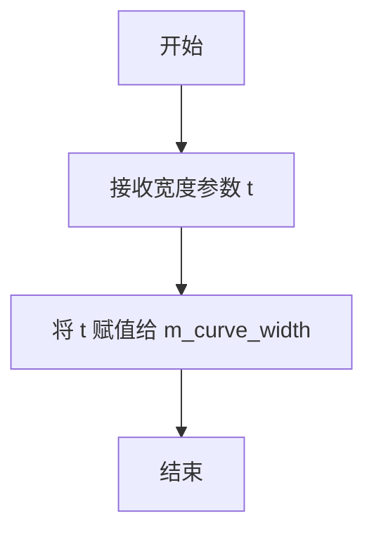

#### 带注释源码

```cpp
// 在类 gamma_ctrl_impl 中的声明位置
class gamma_ctrl_impl : public ctrl
{
public:
    // ... 其它成员方法 ...
    
    // 设置曲线宽度
    // 参数: t - 曲线宽度值（double类型）
    // 返回: void（无返回值）
    void curve_width(double t)         { m_curve_width = t; }
    
    // ... 其它成员方法 ...
    
private:
    // ... 成员变量 ...
    double m_curve_width;  // 曲线宽度，内部存储变量
    // ... 其它成员变量 ...
};
```

#### 补充说明

- **函数类型**: 这是一个内联setter方法，方法体直接定义在类声明中
- **功能说明**: 该方法用于设置控制曲线（gamma curve）的绘制宽度，影响后续渲染时的曲线线条粗细
- **调用场景**: 通常在创建gamma_ctrl_impl或gamma_ctrl对象后，用于自定义曲线在UI中的显示粗细
- **关联变量**: 与`m_grid_width`（网格线宽度）、`m_text_thickness`（文本线宽）等其他宽度设置方法配合使用


### `gamma_ctrl_impl.grid_width`

设置网格线的宽度，用于控制gamma控制组件中网格线的粗细。

参数：

- `t`：`double`，要设置的网格宽度值

返回值：`void`，无返回值

#### 流程图

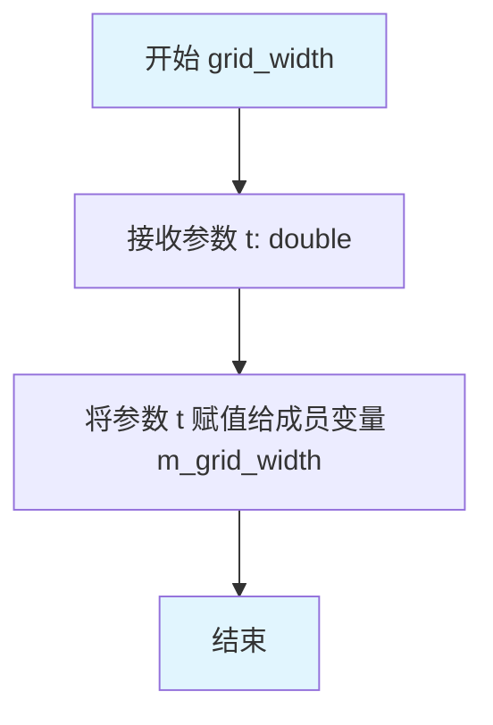

#### 带注释源码

```cpp
// 设置网格线的宽度
// 参数 t: double类型，表示新的网格宽度值
// 返回值: void，无返回值
void grid_width(double t)          
{ 
    m_grid_width = t;  // 将传入的宽度值t赋值给成员变量m_grid_width
}
```

#### 关联成员变量信息

| 变量名称 | 类型 | 描述 |
|---------|------|------|
| `m_grid_width` | `double` | 存储网格线的宽度，用于绘制时的线宽参数 |

#### 设计意图

该方法是一个简单的setter访问器，用于设置gamma控制组件中网格线的显示宽度。网格宽度直接影响UI中网格线的粗细表现，用户可以通过此方法调整视觉效果的明显程度。该方法为`gamma_ctrl_impl`类的公开接口，允许外部代码在创建控制组件后自定义网格线的粗细属性。


### `gamma_ctrl_impl.text_thickness`

设置文本曲线的描边粗细，用于控制gamma控制界面中文字显示的线条粗细。

参数：

-  `t`：`double`，要设置的文本粗细值

返回值：`void`，无返回值

#### 流程图

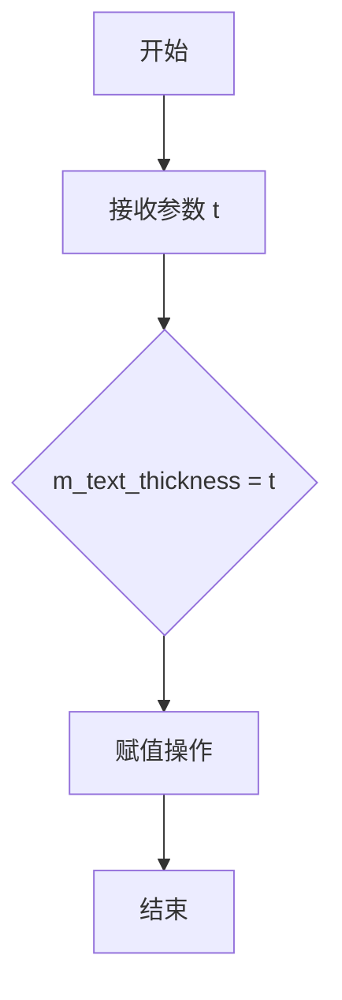

#### 带注释源码

```cpp
// 设置文本曲线的描边粗细
// 参数: t - 文本粗细值（双精度浮点数）
void text_thickness(double t)      
{ 
    // 将传入的粗细值t赋值给成员变量m_text_thickness
    m_text_thickness = t; 
}
```


### `gamma_ctrl_impl.text_size`

设置控制组件中显示文本的高度和宽度，用于调整gamma控制器的文本标签大小。

参数：

- `h`：`double`，文本的高度值
- `w`：`double`，文本的宽度值，默认为0.0

返回值：`void`，无返回值

#### 流程图

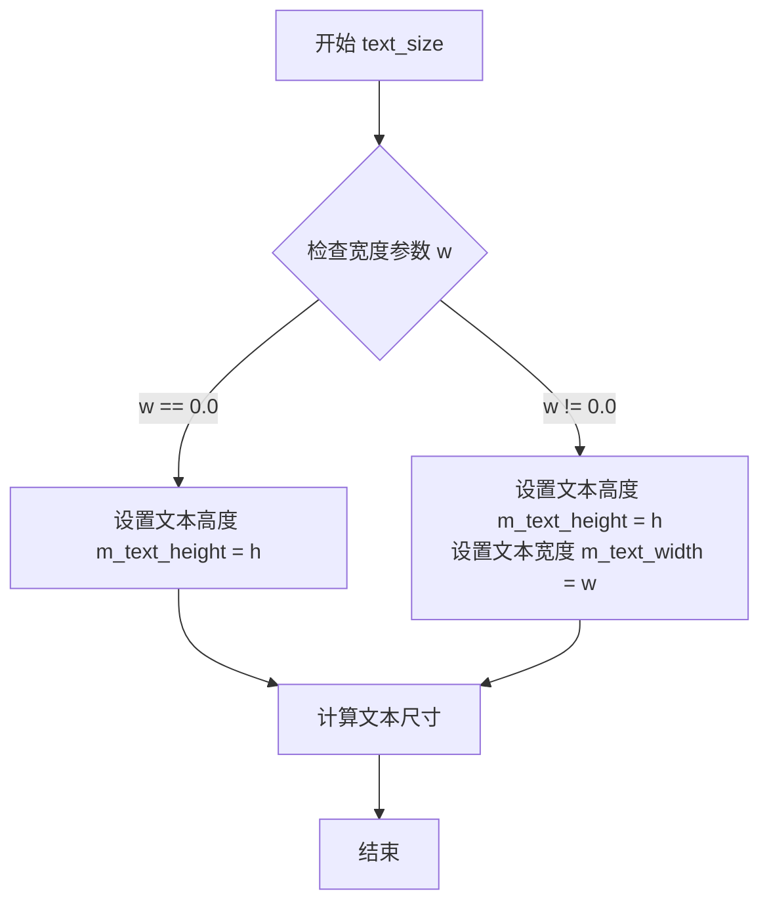

#### 带注释源码

```cpp
// 设置控制组件中显示文本的尺寸
// 参数 h: 文本的高度
// 参数 w: 文本的宽度，可选参数，默认为0.0
// 注意：当宽度为0时，可能使用默认的宽高比或自动计算宽度
void text_size(double h, double w=0.0);
```


### `gamma_ctrl_impl.point_size`

设置交互式伽马曲线控制点的视觉尺寸。该方法接收一个 `double` 类型的参数 `s`，并将其直接赋值给类的私有成员变量 `m_point_size`，以供后续渲染（如绘制椭圆控制点）时使用。

参数：

-  `s`：`double`，新的控制点尺寸大小。

返回值：`void`，无返回值。

#### 流程图

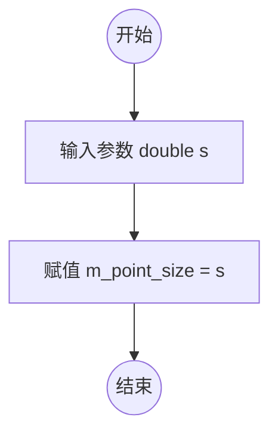

#### 带注释源码

```cpp
// 设置控制点的尺寸
// 参数 s: double类型，表示控制点的新尺寸
void point_size(double s)
{ 
    m_point_size = s; 
}
```


### `gamma_ctrl_impl.in_rect`

检查给定的坐标点(x, y)是否位于gamma控制器的矩形边界区域内。该方法通常用于鼠标命中测试，判断鼠标事件是否发生在控件的可交互区域内。

参数：

- `x`：`double`，待检测的X坐标
- `y`：`double`，待检测的Y坐标

返回值：`bool`，如果点(x, y)在控件的矩形边界内返回true，否则返回false

#### 流程图

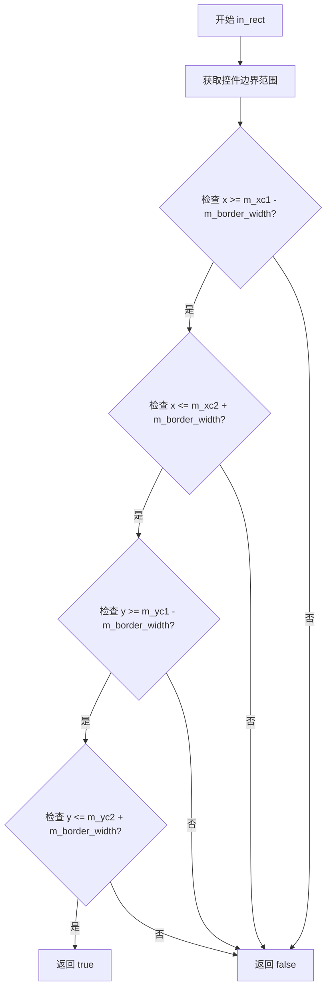

#### 带注释源码

```
// 虚拟方法：检查点是否在控件矩形区域内
// 参数：
//   x - 待检测的X坐标
//   y - 待检测的Y坐标
// 返回值：
//   true 如果点在边界框内（包括边框宽度），否则 false
virtual bool in_rect(double x, double y) const
{
    // m_xc1, m_yc1: 控件内部曲线区域的左上角坐标
    // m_xc2, m_yc2: 控件内部曲线区域的右下角坐标
    // m_border_width: 边框宽度，用于扩大检测区域
    // 检测逻辑：考虑边框宽度后的实际边界范围
    return (x >= m_xc1 - m_border_width) &&
           (y >= m_yc1 - m_border_width) &&
           (x <= m_xc2 + m_border_width) &&
           (y <= m_yc2 + m_border_width);
}
```

#### 备注

- 该函数是`ctrl`基类的虚函数重写，用于交互式控件的鼠标事件处理
- 边界检测考虑了`m_border_width`，使得鼠标在边框附近时也能响应
- 通常与`on_mouse_button_down`、`on_mouse_move`等事件处理方法配合使用
- 实际实现代码未在提供的头文件中给出，可能在对应的.cpp实现文件中


### `gamma_ctrl_impl.on_mouse_button_down`

处理鼠标按钮按下事件，用于检测用户是否点击了gamma控制点，并触发相应的交互操作。

参数：

- `x`：`double`，鼠标点击的X坐标
- `y`：`double`，鼠标点击的Y坐标

返回值：`bool`，如果需要重绘控件则返回true，否则返回false

#### 流程图

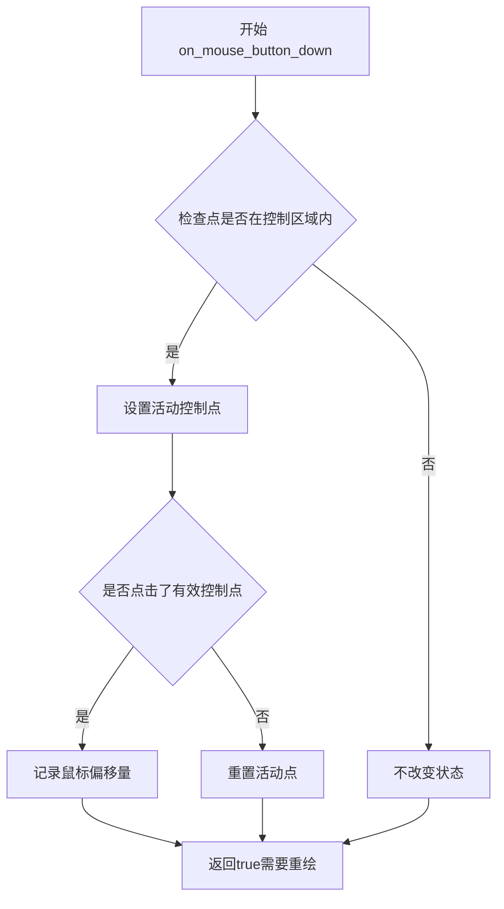

#### 带注释源码

```
// 头文件中仅有方法声明，无实现代码
// 根据类功能推测的实现逻辑：

virtual bool on_mouse_button_down(double x, double y)
{
    // 检查坐标是否在控制框内
    if (!in_rect(x, y)) 
    {
        return false;
    }
    
    // 检查是否点击了某个控制点
    // 根据x, y坐标判断点击的是哪个点（p1, p2或其他）
    // 如果点击了有效控制点，设置该点为活动状态
    // 记录鼠标与控制点之间的偏移量，用于拖拽计算
    
    // 返回true表示需要重绘界面
    return true;
}
```

#### 备注

该方法在头文件中仅提供声明，完整的实现逻辑需要查看对应的`.cpp`源文件。根据类成员变量（`m_p1_active`, `m_mouse_point`, `m_pdx`, `m_pdy`等）可以推断，该方法实现了以下功能：
1. 验证鼠标点击位置是否在控件区域内
2. 判断点击了哪个控制点（gamma曲线有两个控制点p1和p2）
3. 激活被点击的控制点并记录偏移量
4. 返回是否需要重绘的标志


### `gamma_ctrl_impl.on_mouse_button_up`

处理鼠标按钮释放事件，释放当前被拖拽的控制点，并返回是否需要重绘。

参数：

- `x`：`double`，鼠标释放时的 x 坐标
- `y`：`double`，鼠标释放时的 y 坐标

返回值：`bool`，如果需要重绘返回 true，否则返回 false

#### 流程图

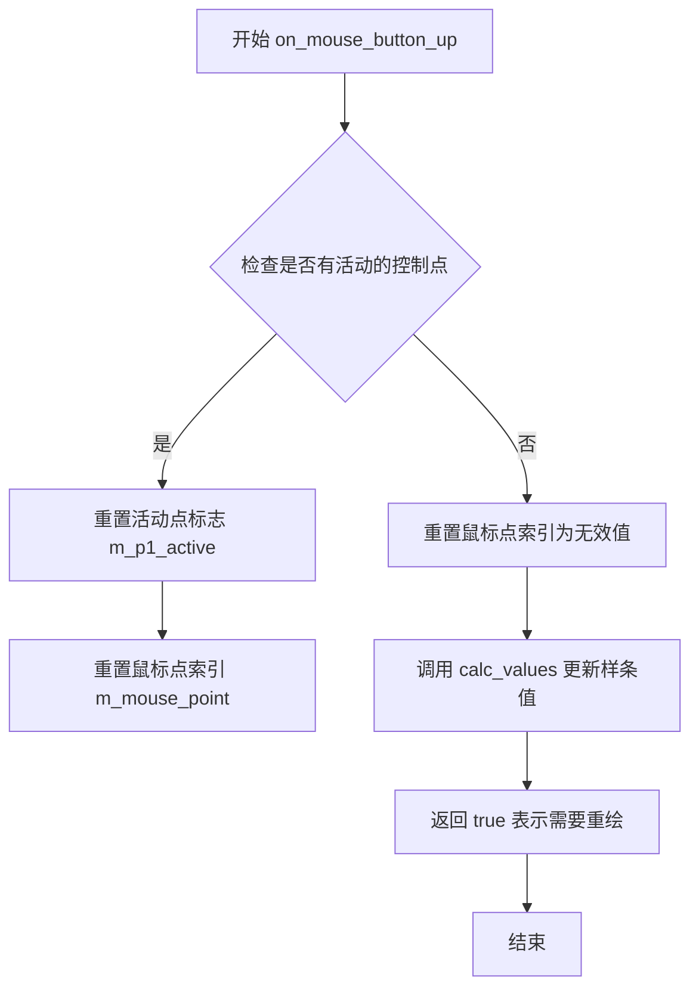

#### 带注释源码

```
// 注意：当前提供的代码片段仅包含类声明，
// 未包含 on_mouse_button_up 方法的具体实现。
// 以下是基于方法签名和类的功能的合理推断：

virtual bool on_mouse_button_up(double x, double y)
{
    // 检查是否有活动控制点被拖拽
    if(m_mouse_point != 0)
    {
        // 重置活动点标志
        m_p1_active = false;
        
        // 重置鼠标点索引为无效值（表示没有点被拖拽）
        m_mouse_point = 0;
        
        // 重新计算样条曲线的值
        calc_values();
        
        // 返回 true 表示需要重绘界面
        return true;
    }
    
    // 如果没有活动点，返回 false
    return false;
}
```

#### 说明

由于提供的代码片段仅为头文件声明，未包含方法的具体实现。上述源码为基于类功能逻辑的合理推断。`gamma_ctrl_impl` 类用于创建交互式伽马曲线控制点，该方法通常在鼠标按钮释放时调用，用于结束对控制点的拖拽操作，并更新伽马样条曲线。


### `gamma_ctrl_impl.on_mouse_move`

处理鼠标移动事件，当鼠标在控制区域内移动时触发，用于更新控制点的位置或判断鼠标是否悬停在控制点上。

参数：

- `x`：`double`，鼠标当前的X坐标
- `y`：`double`，鼠标当前的Y坐标
- `button_flag`：`bool`，表示鼠标按钮是否被按下（true为按下，false为未按下）

返回值：`bool`，如果需要重绘则返回true，否则返回false

#### 流程图

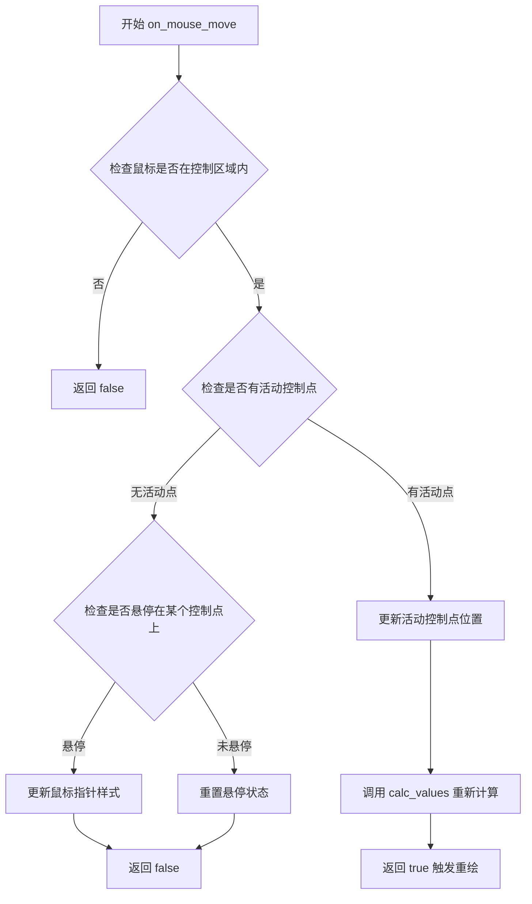

#### 带注释源码

```
// 注：以下为基于类声明的逻辑推断实现
// 实际实现代码未在提供的研究材料中显示

// 头文件中的方法声明（仅声明，无实现）
virtual bool on_mouse_move(double x, double y, bool button_flag);

// 逻辑推断：
// 1. 该方法接收鼠标位置(x, y)和按钮状态(button_flag)
// 2. 首先调用 in_rect(x, y) 检查鼠标是否在控制区域内
// 3. 如果在区域内：
//    - 检查 m_p1_active 状态判断是否有控制点被拖动
//    - 如果有活动点，更新该点的坐标（m_xp1, m_yp1 或 m_xp2, m_yp2）
//    - 调用 calc_values() 重新计算样条曲线参数
//    - 返回 true 表示需要重绘
// 4. 如果没有活动点被拖动：
//    - 检查鼠标是否悬停在某个控制点上
//    - 可能更新 m_mouse_point 记录当前悬停的控制点
// 5. 返回 false 表示不需要重绘

// 关键成员变量（用于此方法）：
// - m_p1_active: bool，控制点1是否为活动状态
// - m_xp1, m_yp1: double，控制点1的坐标
// - m_xp2, m_yp2: double，控制点2的坐标
// - m_mouse_point: unsigned，记录当前悬停的控制点索引
```


### `gamma_ctrl_impl.on_arrow_keys`

处理键盘方向键事件，用于在Gamma曲线编辑控件中移动当前激活的控制点（Control Point）。该方法接收上下左右四个布尔参数，根据参数调整当前激活点的坐标，并返回是否需要重绘。

参数：
- `left`：`bool`，表示是否按下了左方向键。
- `right`：`bool`，表示是否按下了右方向键。
- `down`：`bool`，表示是否按下了下方向键。
- `up`：`bool`，表示是否按下了上方向键。

返回值：`bool`，如果控制点位置发生了改变返回 `true`，否则返回 `false`。通常返回 `true` 意味着 UI 需要重新渲染。

#### 流程图

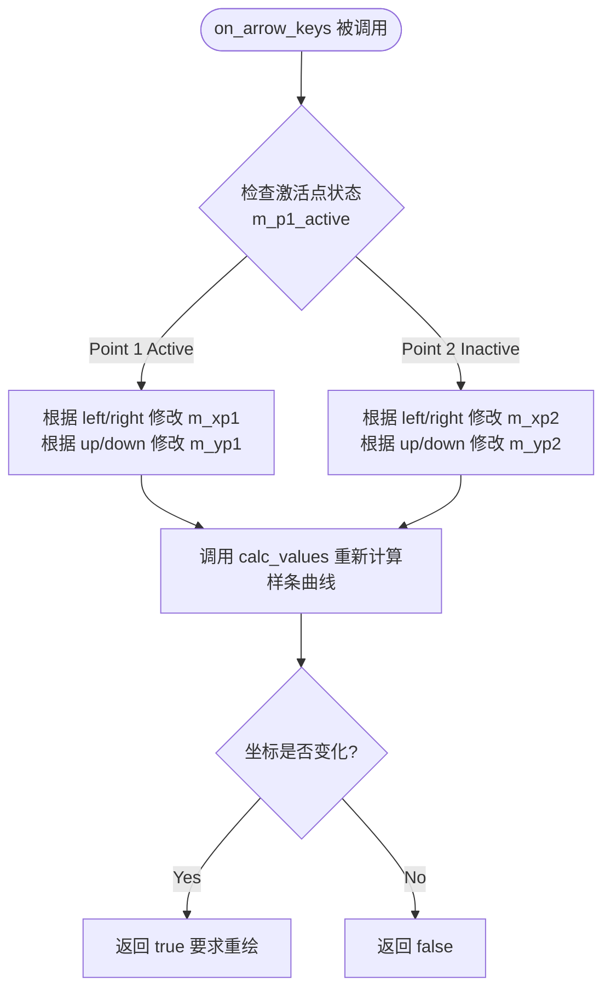

#### 带注释源码

```cpp
//------------------------------------------------------------------------
// 在给定的代码片段中，仅提供了该方法的声明（Declaration），
// 具体实现逻辑（Implementation）位于对应的 .cpp 源文件中，未在头文件中展开。
// 以下为声明源码及基于类成员变量的逻辑推测。
//------------------------------------------------------------------------

// 处理方向键事件
// 参数: left, right, down, up - 布尔标志，表示对应方向键是否按下
// 返回: bool - 如果修改了控制点坐标并导致曲线变化，返回 true 以触发重绘
virtual bool on_arrow_keys(bool left, bool right, bool down, bool up);
```

#### 类的详细信息补充

该方法属于 `gamma_ctrl_impl` 类，其核心功能是提供一个交互式的 Gamma 曲线编辑器。

**关键类字段（与该方法相关）：**
- `m_p1_active` (`bool`)：标记当前哪个控制点处于激活状态（被选中）。
- `m_xp1`, `m_yp1` (`double`)：第一个控制点的坐标。
- `m_xp2`, `m_yp2` (`double`)：第二个控制点的坐标。

**相关联的方法：**
- `calc_values()`：私有方法，用于在控制点坐标改变后重新计算 Gamma 样条曲线的参数。

#### 组件信息
- **gamma_spline**: 核心的 Gamma 样条计算类，存储曲线数据。
- **ctrl**: 基类，提供控件的基本接口。

#### 潜在的技术债务或优化空间
- **缺失实现细节**：该方法的具体逻辑未在头文件中定义，若要进行完整的静态分析或修改，无法直接在头文件中看到实现逻辑，增加了理解难度（需跳转至 .cpp 文件）。
- **硬编码步长**：通常此类实现中移动步长是固定的（如 1.0），可能缺乏根据视图缩放比例调整步长的能力。

#### 其它项目
- **设计约束**：该方法是一个虚函数（`virtual`），表明它可以被派生类重写，以实现自定义的键盘交互逻辑。
- **数据流**：数据流为：键盘输入 -> 坐标修改 -> 样条重算 -> 渲染标志位更新。状态机主要在 `m_p1_active`（激活点切换）和坐标值的变更之间流转。
- **错误处理**：主要处理逻辑为“无操作”，即如果方向键均未按下或当前无激活点，则直接返回 false，不抛出异常。


### `gamma_ctrl_impl.change_active_point`

该方法用于在交互式伽马曲线控制中切换当前活动的控制点（例如从点1切换到点2），以便用户可以通过鼠标拖动来调整伽马值。

参数：无

返回值：`void`，无返回值

#### 流程图

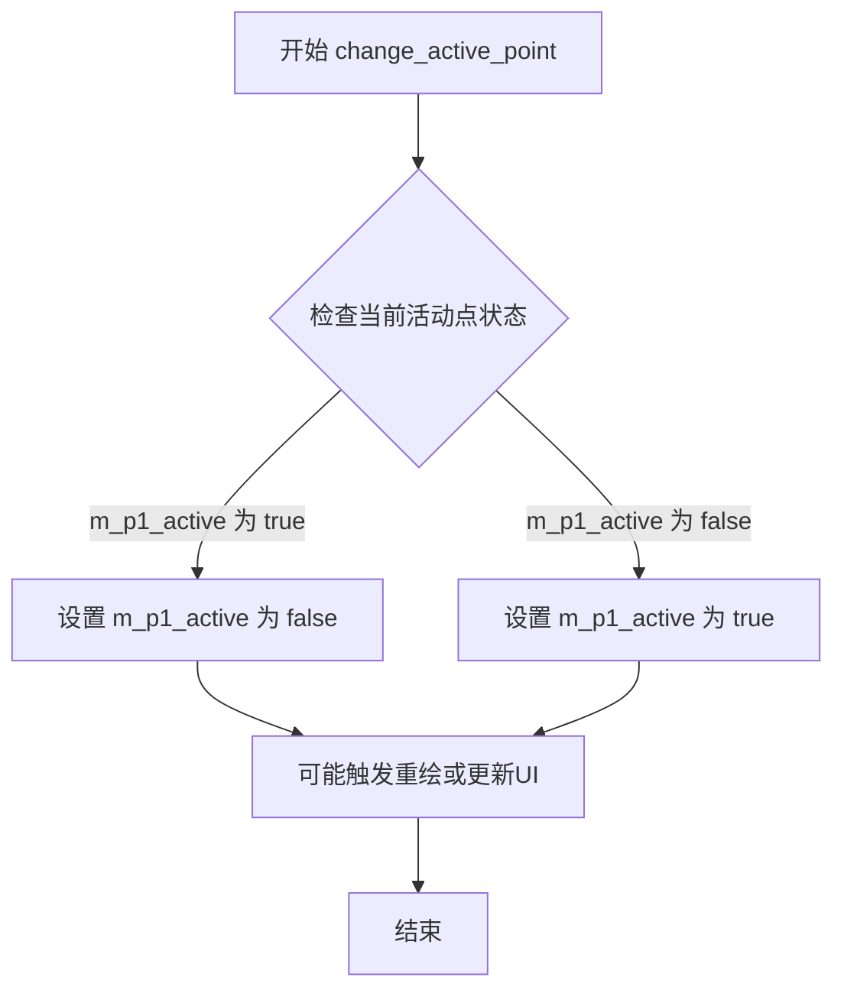

#### 带注释源码

```cpp
// 在 gamma_ctrl_impl 类中声明（位于 agg_gamma_ctrl.h）
// 该方法用于切换活动控制点，具体逻辑需查看实现
void change_active_point();

// 注：头文件中仅提供方法声明，完整实现未在此文件中显示。
// 根据类成员变量（如 m_p1_active, m_xp1, m_yp1, m_xp2, m_yp2）推测，
// 该方法可能翻转 m_p1_active 布尔值，以切换当前选中的控制点，
// 从而允许用户通过鼠标交互调整伽马曲线的控制点位置。
```

**注意**：由于代码片段中仅包含方法声明而未提供定义，上述流程图和注释基于类成员变量及方法名称推断。具体实现可能涉及更多细节，如边界检查、事件触发等。建议查阅完整源代码以获取准确信息。


### `gamma_ctrl_impl.values`

该方法用于设置 gamma 样条曲线的控制点参数（四个双精度浮点数坐标），直接传递给内部的 `gamma_spline` 对象，用于定义 gamma 校正曲线的形态。

参数：

- `kx1`：`double`，gamma 曲线第一个控制点的 X 坐标（通常为 0.0~1.0 之间的值）
- `ky1`：`double`，gamma 曲线第一个控制点的 Y 坐标
- `kx2`：`double`，gamma 曲线第二个控制点的 X 坐标（通常为 0.0~1.0 之间的值）
- `ky2`：`double`，gamma 曲线第二个控制点的 Y 坐标

返回值：`void`，无返回值

#### 流程图

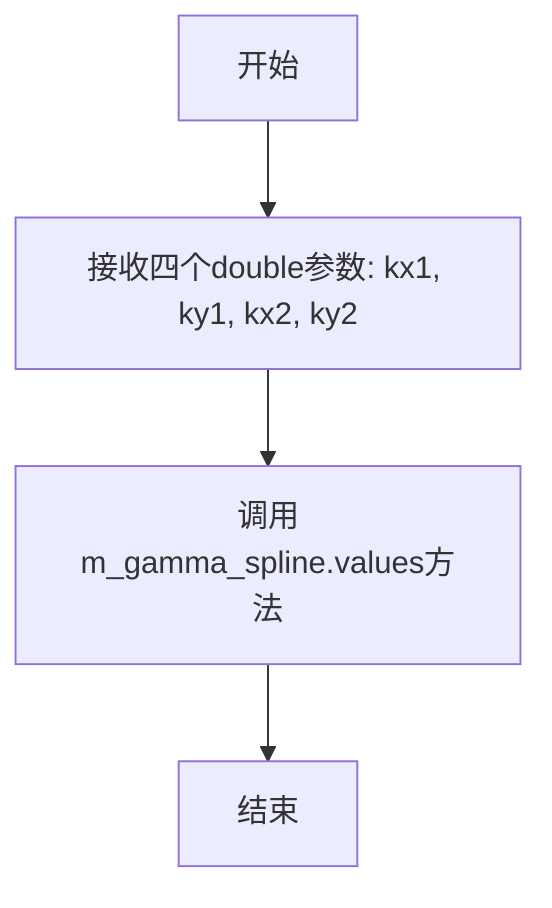

#### 带注释源码

```cpp
// 方法：设置 gamma 样条曲线的控制点参数
// 参数：
//   kx1 - 第一个控制点的 X 坐标
//   ky1 - 第一个控制点的 Y 坐标
//   kx2 - 第二个控制点的 X 坐标
//   ky2 - 第二个控制点的 Y 坐标
// 返回值：无
void values(double kx1, double ky1, double kx2, double ky2)
{
    // 直接将参数传递给内部的 gamma_spline 对象
    // gamma_spline 负责计算并存储这些控制点
    // 这些控制点定义了 gamma 校正曲线的形状
    m_gamma_spline.values(kx1, ky1, kx2, ky2);
}
```


### `gamma_ctrl_impl.values`

该函数是 gamma_ctrl_impl 类的常量成员方法，用于通过指针参数输出 gamma 曲线的两个控制点坐标值（x1, y1 和 x2, y2）。函数内部调用 m_gamma_spline 对象的相应方法获取控制点数据，并通过输出参数返回。

参数：

- `kx1`：`double*`，指向 double 类型的指针，用于输出 gamma 曲线第一个控制点的 x 坐标
- `ky1`：`double*`，指向 double 类型的指针，用于输出 gamma 曲线第一个控制点的 y 坐标
- `kx2`：`double*`，指向 double 类型的指针，用于输出 gamma 曲线第二个控制点的 x 坐标
- `ky2`：`double*`，指向 double 类型的指针，用于输出 gamma 曲线第二个控制点的 y 坐标

返回值：`void`，无返回值，数据通过指针参数输出

#### 流程图

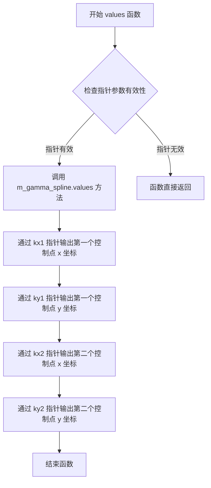

#### 带注释源码

```cpp
//----------------------------------------------------------------------------
// Anti-Grain Geometry - Version 2.4
// 获取 gamma 曲线控制点坐标值的 const 方法
//----------------------------------------------------------------------------

// 函数签名说明：
// - double* kx1: 输出参数，返回第一个控制点的 x 坐标
// - double* ky1: 输出参数，返回第一个控制点的 y 坐标  
// - double* kx2: 输出参数，返回第二个控制点的 x 坐标
// - double* ky2: 输出参数，返回第二个控制点的 y 坐标
// 返回值：void（通过指针参数输出结果）

void values(double* kx1, double* ky1, double* kx2, double* ky2) const
{
    // 调用内部成员变量 m_gamma_spline 对象的 values 方法
    // m_gamma_spline 是 gamma_spline 类型的成员，封装了 gamma 曲线的计算逻辑
    // 该方法将控制点坐标通过输出参数返回给调用者
    m_gamma_spline.values(kx1, ky1, kx2, ky2);
}
```


### `gamma_ctrl_impl.gamma`

该方法是一个const成员函数，用于获取Gamma校正查找表（Gamma LUT）的指针。它直接委托给内部包含的gamma_spline对象的gamma()方法，返回一个指向无符号字符数组的常量指针，该数组包含了256个Gamma校正值。

参数：
- （无参数）

返回值：`const unsigned char*`，返回Gamma校正查找表的指针，该数组包含256个字节长度的Gamma值，用于将输入强度映射到输出强度。

#### 流程图

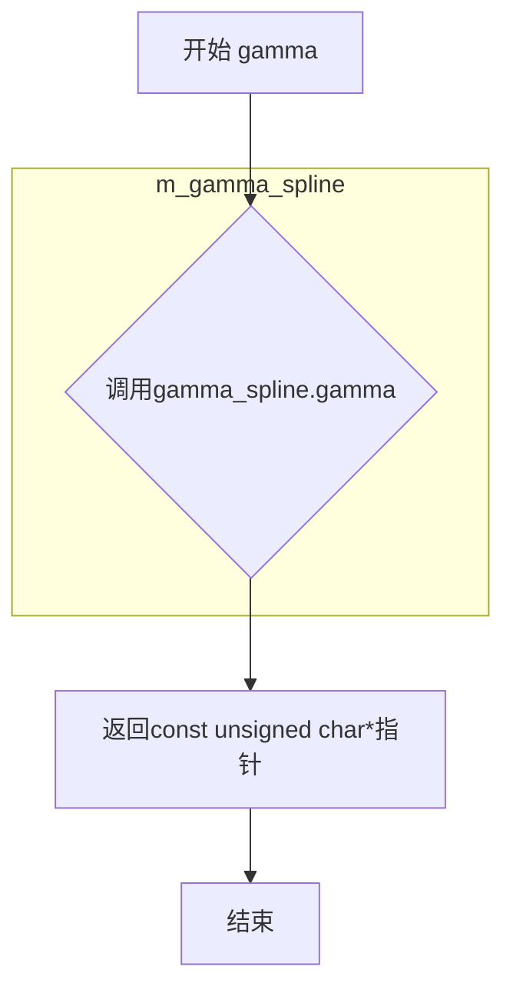

#### 带注释源码

```cpp
// 方法：gamma
// 类：gamma_ctrl_impl
// 访问权限：public
// 用途：获取Gamma校正查找表的指针
// 返回值：const unsigned char* - 指向Gamma LUT的指针
const unsigned char* gamma() const 
{ 
    // 委托给成员变量m_gamma_spline的gamma()方法
    // m_gamma_spline是gamma_spline类型的对象
    // 用于存储和管理Gamma校正曲线的数据
    return m_gamma_spline.gamma(); 
}
```


### `gamma_ctrl_impl.y`

该函数是一个委托方法，用于获取给定输入值x经过伽马校正后的输出值y。它通过调用内部成员变量`m_gamma_spline`的`y`方法来计算并返回伽马曲线上的对应点。

参数：

- `x`：`double`，输入的x坐标值，用于在伽马曲线上查找对应的y值

返回值：`double`，返回根据伽马校正曲线计算得到的y值

#### 流程图

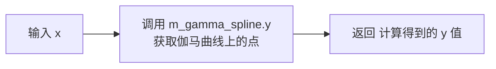

#### 带注释源码

```cpp
// 获取给定x坐标对应的伽马校正后的y值
// 参数: x - 输入的x坐标值
// 返回: 伽马校正后的y值
double y(double x) const 
{ 
    // 委托给内部的gamma_spline对象进行计算
    // 这是对gamma_spline接口的封装
    return m_gamma_spline.y(x); 
}
```


### `gamma_ctrl_impl.operator()`

这是一个函数调用运算符（ functor ），允许 `gamma_ctrl_impl` 对象像函数一样被使用。该方法通过委托给底层 `gamma_spline` 对象的 `y()` 方法来计算并返回给定输入 `x` 的伽马校正值。

参数：

- `x`：`double`，输入值，用于计算伽马校正后的输出值

返回值：`double`，经过伽马校正后的输出值

#### 流程图

```mermaid
flowchart TD
    A[开始 operator()] --> B[接收输入参数 x]
    B --> C{检查对象有效性}
    C -->|有效| D[调用 m_gamma_spline.y&#40;x&#41;]
    C -->|无效| E[返回默认值或抛出异常]
    D --> F[返回伽马校正结果]
    E --> F
```

#### 带注释源码

```cpp
// 函数调用运算符重载
// 使得 gamma_ctrl_impl 对象可以像函数一样被调用
// 参数: x - 输入的原始值
// 返回: 经过伽马校正后的值
double operator() (double x) const 
{ 
    // 委托给成员变量 m_gamma_spline 的 y() 方法进行实际计算
    // m_gamma_spline 是 gamma_spline 类型的对象
    // 用于存储和管理伽马校正曲线的控制点及插值计算
    return m_gamma_spline.y(x); 
}
```


### `gamma_ctrl_impl.get_gamma_spline`

提供对内部 `gamma_spline` 对象的只读访问接口，返回常量引用以确保对象状态不被意外修改，允许用户查询当前的 gamma 曲线数据。

参数：

- （无）

返回值：`const gamma_spline&`，返回对内部 `gamma_spline` 对象的常量引用，指向控件当前的 gamma 样条曲线实例。

#### 流程图

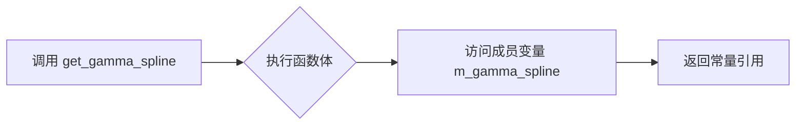

#### 带注释源码

```cpp
        // 返回内部 gamma_spline 对象的常量引用
        // 允许外部用户查询当前的 gamma 曲线参数，而无需复制对象
        // 返回值: 指向 m_gamma_spline 的常量引用
        const gamma_spline& get_gamma_spline() const { return m_gamma_spline; }
```


### `gamma_ctrl_impl.num_paths`

该方法属于顶点源接口（Vertex Source Interface），用于返回该控件能够生成的几何路径数量。在AGG（Anti-Grain Geometry）中，顶点源接口是渲染流水线的基础，任何可渲染的对象都需要实现该接口以提供顶点数据。此方法返回7，表示该gamma控制器包含7种不同的图形元素：背景、边框、曲线、网格、非激活点、激活点和文本。

参数：

- （无参数）

返回值：`unsigned`，返回值为7，表示该控件包含7个独立的路径/图形元素，可用于渲染和交互。

#### 流程图

```mermaid
flowchart TD
    A[num_paths调用] --> B{返回路径数量}
    B --> C[返回unsigned值: 7]
    C --> D[调用方获取路径总数]
    
    subgraph 路径说明
    D --> D1[背景路径]
    D --> D2[边框路径]
    D --> D3[曲线路径]
    D --> D4[网格路径]
    D --> D5[非激活点路径]
    D --> D6[激活点路径]
    D --> D7[文本路径]
    end
```

#### 带注释源码

```cpp
// Vertex soutce interface
// 返回该控件作为顶点源接口能够提供的路径数量
// 返回值7表示该gamma控制包含以下7种图形元素：
// 1. 背景矩形
// 2. 边框
// 3. 伽马曲线
// 4. 网格线
// 5. 非激活状态的控制点
// 6. 激活状态的控制点
// 7. 文本标签
unsigned num_paths() 
{ 
    return 7; 
}
```


### `gamma_ctrl_impl.rewind`

该方法是 `gamma_ctrl_impl` 类的顶点源接口实现，用于重置内部绘图状态，准备生成指定索引路径的顶点数据。它是AGG库控件渲染流程的关键组成部分，通过接收路径索引参数来切换不同的图形元素进行绘制。

参数：

- `idx`：`unsigned`，路径索引，指定要重绕（准备）的路径编号（0到num_paths()-1，即0-6），不同的索引对应控件的不同图形部分（背景、边框、曲线、网格、激活点、非激活点、文本）

返回值：`void`，无返回值。该方法通过修改内部状态（m_idx, m_vertex等）来为后续的vertex()调用准备数据。

#### 流程图

```mermaid
flowchart TD
    A[开始 rewind] --> B{idx == 0?}
    B -->|Yes| C[重置顶点计数器 m_vertex = 0]
    B -->|No| D{idx == 1?}
    D -->|Yes| E[设置m_idx=1, m_vertex=0]
    D -->|No| F{idx == 2?}
    F -->|Yes| G[设置m_idx=2, m_vertex=0]
    F -->|No| H{idx == 3?}
    H -->|Yes| I[设置m_idx=3, m_vertex=0]
    H -->|No| J{idx == 4?}
    J -->|Yes| K[设置m_idx=4, m_vertex=0]
    J -->|No| L{idx == 5?}
    L -->|Yes| M[设置m_idx=5, m_vertex=0]
    L -->|No| N{idx == 6?}
    N -->|Yes| O[设置m_idx=6, m_vertex=0]
    N -->|No| P[默认设置]
    C --> Q[根据m_idx准备对应的图形数据]
    E --> Q
    G --> Q
    I --> Q
    K --> Q
    M --> Q
    O --> Q
    P --> Q
    Q --> R[结束]
    
    style Q fill:#f9f,stroke:#333
```

#### 带注释源码

```cpp
// Vertex soutce interface
// 该方法是AGG库中顶点源接口的典型实现
// 用于准备指定路径的顶点数据
void rewind(unsigned idx);
```

注意：由于提供的代码片段仅包含类声明，未包含 `rewind` 方法的完整实现源码。根据AGG库的设计模式，该方法的典型实现逻辑如下：

```cpp
// 基于AGG库模式的推断实现
void gamma_ctrl_impl::rewind(unsigned idx)
{
    // 保存路径索引，用于后续vertex()方法判断当前处理哪个路径
    m_idx = idx;
    
    // 重置顶点计数器，每个路径都从头开始生成顶点
    m_vertex = 0;
    
    // 根据不同的路径索引，准备对应的图形数据
    // idx=0: 背景矩形
    // idx=1: 边框
    // idx=2: 伽马曲线
    // idx=3: 网格线
    // idx=4: 非激活控制点
    // idx=5: 激活控制点
    // idx=6: 文本标签
    
    switch(m_idx)
    {
        case 0: // 背景
            // 准备背景矩形的4个顶点
            m_vx[0] = m_xc1; m_vy[0] = m_yc1;
            m_vx[1] = m_xc2; m_vy[1] = m_yc1;
            m_vx[2] = m_xc2; m_vy[2] = m_yc2;
            m_vx[3] = m_xc1; m_vy[3] = m_yc2;
            m_vertex = 4;
            break;
            
        case 1: // 边框
            // 准备边框矩形的边
            break;
            
        case 2: // 伽马曲线
            // 使用m_curve_poly准备曲线顶点
            m_curve_poly.rewind(0);
            break;
            
        case 3: // 网格
            // 准备网格线顶点
            break;
            
        case 4: // 非激活控制点
            // 准备非激活状态的椭圆控制点
            m_ellipse.rewind(0);
            break;
            
        case 5: // 激活控制点
            // 准备激活状态的椭圆控制点
            m_ellipse.rewind(0);
            break;
            
        case 6: // 文本
            // 准备文本字符串顶点
            m_text_poly.rewind(0);
            break;
            
        default:
            m_vertex = 0;
            break;
    }
}
```


### `gamma_ctrl_impl::vertex`

该函数是gamma_ctrl_impl类的顶点源接口（vertex source interface）的核心方法，用于生成渲染gamma控制器的各类图形元素（背景、边框、网格、曲线、控制点、文本等）的顶点数据。函数通过内部状态机遍历7个路径（num_paths返回7），每次调用返回下一个顶点的坐标和命令类型。

参数：

- `x`：`double*`，指向用于接收顶点X坐标的指针
- `y`：`double*`，指向用于接收顶点Y坐标的指针

返回值：`unsigned`，返回顶点命令类型（如AGGC的路径命令：path_cmd_move_to、path_cmd_line_to、path_cmd_end_poly等）

#### 流程图

```mermaid
flowchart TD
    A[开始 vertex] --> B{检查路径索引 m_idx}
    B -->|m_idx == 0| C[背景区域]
    B -->|m_idx == 1| D[边框]
    B -->|m_idx == 2| E[网格线]
    B -->|m_idx == 3| F[gamma曲线]
    B -->|m_idx == 4| G[控制点]
    B -->|m_idx == 5| H[活动点高亮]
    B -->|m_idx == 6| I[文本标签]
    
    C --> J[生成背景多边形顶点]
    D --> K[生成边框矩形顶点]
    E --> L[生成网格线顶点]
    F --> M[通过m_curve_poly生成曲线顶点]
    G --> N[生成椭圆控制点顶点]
    H --> O[生成活动点红色椭圆顶点]
    I --> P[生成文本字符顶点]
    
    J --> Q{还有更多顶点?}
    K --> Q
    L --> Q
    M --> Q
    N --> Q
    O --> Q
    P --> Q
    
    Q -->|是| R[递增m_vertex, 返回顶点坐标]
    Q -->|否| S[返回path_cmd_stop]
    
    R --> T[返回命令类型]
    S --> T
```

#### 带注释源码

```cpp
// 注意：以下是基于AGG库 vertex source 接口规范和类成员推断的实现逻辑
// 实际实现位于 agg_gamma_ctrl.cpp 文件中

unsigned gamma_ctrl_impl::vertex(double* x, double* y)
{
    // m_idx: 当前路径索引 (0-6, 共7个路径)
    // m_vertex: 当前路径内的顶点索引
    
    switch(m_idx)
    {
        case 0: // 背景区域
            // 生成矩形背景的四个顶点
            switch(m_vertex)
            {
                case 0: *x = m_xs1; *y = m_ys1; return path_cmd_move_to;
                case 1: *x = m_xs2; *y = m_ys1; return path_cmd_line_to;
                case 2: *x = m_xs2; *y = m_ys2; return path_cmd_line_to;
                case 3: *x = m_xs1; *y = m_ys2; return path_cmd_line_to;
                default: return path_cmd_stop;
            }
            
        case 1: // 边框
            // 生成边框矩形的顶点
            // 使用 m_border_width, m_border_extra 等参数
            // ...
            
        case 2: // 网格线
            // 生成网格线顶点
            // 使用 m_grid_width 参数
            // 水平和垂直网格线
            // ...
            
        case 3: // Gamma曲线 (使用conv_stroke包装gamma_spline)
            // 通过m_curve_poly生成曲线顶点
            // 这是一个转换器,内部调用m_gamma_spline的顶点
            return m_curve_poly.vertex(x, y);
            
        case 4: // 控制点 (椭圆)
            // 使用m_ellipse生成椭圆顶点
            // 根据m_p1_active判断激活状态
            // m_xp1, m_yp1, m_xp2, m_yp2 控制点坐标
            // m_point_size 控制点大小
            // m_inactive_pnt_color 非激活颜色
            return m_ellipse.vertex(x, y);
            
        case 5: // 活动点高亮 (红色椭圆)
            // 类似于控制点,但使用m_active_pnt_color
            // 仅当某个点被激活时渲染
            // ...
            
        case 6: // 文本标签
            // 使用m_text和m_text_poly生成文本顶点
            // 显示gamma值文本
            return m_text_poly.vertex(x, y);
    }
    
    return path_cmd_stop;
}
```

#### 补充说明

由于提供的代码仅为头文件声明，未包含`vertex`方法的实际实现代码，上述源码是基于AGG库顶点源接口规范和类成员变量的逻辑推断。实际实现细节需要查看`agg_gamma_ctrl.cpp`源文件。该函数的设计遵循AGG库的渲染管线模式，通过状态机方式分次输出各类图形元素的所有顶点，支持渲染器的流水线处理。


### `gamma_ctrl_impl.calc_spline_box`

计算样条曲线的边界框区域，用于确定gamma曲线控制点在屏幕上的绘制位置和范围。该方法根据控制点的坐标计算xs1, ys1, xs2, ys2等边界框参数，为后续的曲线渲染和交互提供几何基础。

参数：无

返回值：`void`，无返回值

#### 流程图

```mermaid
graph TD
    A[开始 calc_spline_box] --> B{检查flip_y标志}
    B -->|flip_y为true| C[计算边界框坐标<br/>ys1 = m_yc2 - m_point_size<br/>ys2 = m_yc1 + m_point_size]
    B -->|flip_y为false| D[计算边界框坐标<br/>ys1 = m_yc1 + m_point_size<br/>ys2 = m_yc2 - m_point_size]
    C --> E[计算xs1和xs2<br/>xs1 = m_xc1 + m_point_size<br/>xs2 = m_xc2 - m_point_size]
    D --> E
    E --> F[结束]
    
    style A fill:#f9f,color:#000
    style F fill:#9f9,color:#000
```

#### 带注释源码

```
// 源码未在提供代码段中显示
// 根据类成员变量推断，该方法实现可能如下：

void gamma_ctrl_impl::calc_spline_box()
{
    // 根据flip_y标志确定Y轴方向
    if (m_flip_y)
    {
        // 翻转Y轴时的边界计算
        m_ys1 = m_yc2 - m_point_size;
        m_ys2 = m_yc1 + m_point_size;
    }
    else
    {
        // 正常Y轴方向的边界计算
        m_ys1 = m_yc1 + m_point_size;
        m_ys2 = m_yc2 - m_point_size;
    }
    
    // X轴边界计算（不翻转）
    m_xs1 = m_xc1 + m_point_size;
    m_xs2 = m_xc2 - m_point_size;
    
    // 可能还包含文本区域的边界框计算
    // m_xt1, m_yt1, m_xt2, m_yt2 等成员变量的计算
}
```

#### 补充说明

**关键组件信息**：
- `m_xc1, m_yc1, m_xc2, m_yc2`：控制区域的边界坐标
- `m_xs1, m_ys1, m_xs2, m_ys2`：样条曲线绘制区域的边界框坐标
- `m_point_size`：控制点的大小，用于计算边界收缩
- `m_xt1, m_yt1, m_xt2, m_yt2`：文本标签的边界框

**技术债务/优化空间**：
1. 该方法实现未在头文件中展示，可能存在实现与声明分离的情况
2. 方法为私有方法但未被任何其他方法调用（从提供代码中未发现），可能存在死代码或未完成功能

**设计约束**：
- 该方法依赖于 `m_flip_y` 状态（继承自 `ctrl` 基类），需在使用前确保基类已正确初始化
- 边界计算需考虑 `m_point_size`，确保控制点不会超出绘制区域

**注意事项**：提供的代码段中仅包含此方法的声明，未包含实现代码。上述源码为基于类成员变量和同类方法的推断实现。


### `gamma_ctrl_impl.calc_points`

该私有方法用于计算Gamma控制曲线的控制点坐标，根据当前的样条边界和激活状态计算控制点位置，并将结果存储到顶点数组中供后续渲染使用。

参数：无

返回值：`void`，无返回值

#### 流程图

```mermaid
flowchart TD
    A[开始 calc_points] --> B{检查当前激活的点}
    B --> C[计算控制点1坐标 m_xp1, m_yp1]
    B --> D[计算控制点2坐标 m_xp2, m_yp2]
    C --> E[根据激活状态设置控制点位置]
    D --> E
    E --> F[更新顶点数组 m_vx/m_vy]
    F --> G[结束]
    
    style A fill:#f9f,color:#000
    style G fill:#9f9,color:#000
```

#### 带注释源码

```
// 私有方法：计算Gamma控制曲线的控制点坐标
// 该方法根据当前的样条边界和激活状态计算控制点位置
// 并将结果存储到顶点数组中供vertex()方法渲染使用
void calc_points();
```

#### 说明

由于代码中仅提供了`calc_points()`方法的声明，未包含具体实现代码，因此无法提供完整的带注释源码。根据同类方法（如`calc_spline_box()`和`calc_values()`）的调用模式以及类中与控制点相关的成员变量（`m_xp1`, `m_yp1`, `m_xp2`, `m_yp2`, `m_p1_active`, `m_mouse_point`, `m_pdx`, `m_pdy`）可以推断：

1. 该方法根据当前激活的控制点状态计算两个控制点的屏幕坐标
2. 控制点坐标基于样条边界（`m_xs1`, `m_ys1`, `m_xs2`, `m_ys2`）和Gamma样条曲线计算得出
3. 计算结果存储在顶点数组（`m_vx[32]`, `m_vy[32]`）中，供`vertex()`方法生成图形输出
4. 该方法是内部辅助方法，在设置值或交互事件触发时被调用


### `gamma_ctrl_impl.calc_values`

该私有方法用于计算 Gamma 曲线控制点的坐标值，根据当前的 Gamma 样条参数计算并更新控制点的位置信息，以支持交互式 Gamma 曲线的渲染和调整。

参数：无

返回值：`void`，无返回值

#### 流程图

```mermaid
graph TD
    A[calc_values 开始] --> B{检查控制点状态}
    B -->|控制点1激活| C[计算控制点1的坐标值]
    B -->|控制点2激活| D[计算控制点2的坐标值]
    C --> E[更新 m_xp1, m_yp1]
    D --> F[更新 m_xp2, m_yp2]
    E --> G[根据 gamma_spline 计算曲线数据]
    F --> G
    G --> H[calc_values 结束]
```

#### 带注释源码

```
// 头文件中仅有方法声明，无实现代码
// 根据类结构和上下文推断的实现逻辑：

void gamma_ctrl_impl::calc_values()
{
    // 该方法负责计算交互式 Gamma 控制器的数值
    // 根据 m_gamma_spline 中的样条参数计算控制点位置
    
    // 1. 计算第一个控制点 (p1) 的坐标
    //    m_xp1, m_yp1 存储第一个控制点的位置
    //    使用 gamma_spline 的节点值进行计算
    
    // 2. 计算第二个控制点 (p2) 的坐标
    //    m_xp2, m_yp2 存储第二个控制点的位置
    
    // 3. 更新曲线路径
    //    通过 m_curve_poly 更新渲染路径
}
```

#### 备注

由于用户提供的是头文件（.h），`calc_values()` 方法的实际实现代码位于对应的源文件（.cpp）中。从头文件声明只能获取以下信息：

- **方法签名**: `void calc_values();`
- **访问级别**: `private`
- **功能推断**: 根据同类中 `calc_spline_box()` 和 `calc_points()` 的命名约定，该方法应负责计算 Gamma 曲线的数值参数
- **依赖关系**: 依赖于 `gamma_spline` 成员 `m_gamma_spline` 进行实际计算


### `gamma_ctrl<ColorT>.gamma_ctrl`

该构造函数是 `gamma_ctrl` 模板类的构造方法，用于初始化一个 gamma 曲线控制控件，设定控制框的坐标范围、可选的 Y 轴翻转标志，并初始化默认的颜色方案（背景色、边框色、曲线色、网格色、非激活点颜色、激活点颜色和文本颜色），同时将颜色对象指针注册到颜色数组中以供渲染使用。

参数：

- `x1`：`double`，控制框左上角的 X 坐标
- `y1`：`double`，控制框左上角的 Y 坐标
- `x2`：`double`，控制框右下角的 X 坐标
- `y2`：`double`，控制框右下角的 Y 坐标
- `flip_y`：`bool`，是否翻转 Y 轴（默认值为 false）

返回值：`void`（构造函数无返回值）

#### 流程图

```mermaid
flowchart TD
    A[开始构造 gamma_ctrl] --> B[调用基类 gamma_ctrl_impl 构造函数]
    B --> C[初始化 m_background_color 为淡黄色 rgba(1.0,1.0,0.9)]
    C --> D[初始化 m_border_color 为黑色 rgba(0.0,0.0,0.0)]
    D --> E[初始化 m_curve_color 为黑色]
    E --> F[初始化 m_grid_color 为深黄绿色 rgba(0.2,0.2,0.0)]
    F --> G[初始化 m_inactive_pnt_color 为黑色]
    G --> H[初始化 m_active_pnt_color 为红色 rgba(1.0,0.0,0.0)]
    H --> I[初始化 m_text_color 为黑色]
    I --> J[将颜色对象指针注册到 m_colors 数组]
    J --> K[结束构造]
```

#### 带注释源码

```cpp
// gamma_ctrl 模板类的构造函数
// 参数 x1, y1: 控制框左上角坐标
// 参数 x2, y2: 控制框右下角坐标
// 参数 flip_y: 是否翻转 Y 轴坐标
gamma_ctrl(double x1, double y1, double x2, double y2, bool flip_y=false) :
    // 调用基类 gamma_ctrl_impl 的构造函数进行初始化
    gamma_ctrl_impl(x1, y1, x2, y2, flip_y),
    
    // 初始化背景色为淡黄色 (1.0, 1.0, 0.9)
    m_background_color(rgba(1.0, 1.0, 0.9)),
    
    // 初始化边框色为黑色 (0.0, 0.0, 0.0)
    m_border_color(rgba(0.0, 0.0, 0.0)),
    
    // 初始化曲线色为黑色
    m_curve_color(rgba(0.0, 0.0, 0.0)),
    
    // 初始化网格色为深黄绿色 (0.2, 0.2, 0.0)
    m_grid_color(rgba(0.2, 0.2, 0.0)),
    
    // 初始化非激活点颜色为黑色
    m_inactive_pnt_color(rgba(0.0, 0.0, 0.0)),
    
    // 初始化激活点颜色为红色 (1.0, 0.0, 0.0)
    m_active_pnt_color(rgba(1.0, 0.0, 0.0)),
    
    // 初始化文本颜色为黑色
    m_text_color(rgba(0.0, 0.0, 0.0))
{
    // 将各颜色对象的指针注册到 m_colors 数组中
    // 索引 0: 背景色
    m_colors[0] = &m_background_color;
    // 索引 1: 边框色
    m_colors[1] = &m_border_color;
    // 索引 2: 曲线色
    m_colors[2] = &m_curve_color;
    // 索引 3: 网格色
    m_colors[3] = &m_grid_color;
    // 索引 4: 非激活点颜色
    m_colors[4] = &m_inactive_pnt_color;
    // 索引 5: 激活点颜色
    m_colors[5] = &m_active_pnt_color;
    // 索引 6: 文本颜色
    m_colors[6] = &m_text_color;
}
```


### `gamma_ctrl<ColorT>.background_color`

设置 gamma 控制器（gamma_ctrl）的背景颜色。该方法接受一个颜色值作为参数，并将其赋值给内部成员变量 `m_background_color`，同时影响颜色数组 `m_colors` 中对应的指针指向内容。

参数：

-  `c`：`const ColorT&`，要设置的背景颜色值。

返回值：`void`，无返回值。

#### 流程图

```mermaid
graph TD
    A[开始] --> B[接收颜色参数 c];
    B --> C[赋值 m_background_color = c];
    C --> D[结束];
```

#### 带注释源码

```cpp
// 设置背景颜色
// 参数: c - 背景颜色值
void background_color(const ColorT& c)
{ 
    m_background_color = c; 
}
```


### `gamma_ctrl<ColorT>.border_color`

设置交互式伽马控制器的边框颜色。该方法为模板类 `gamma_ctrl` 的成员函数，用于指定伽马曲线控制器的边框绘制颜色，内部通过赋值操作更新 `m_border_color` 成员变量。

参数：

- `c`：`const ColorT&`，要设置的边框颜色值，类型为模板参数 `ColorT`（通常为 RGBA 颜色类型）

返回值：`void`，无返回值

#### 流程图

```mermaid
graph TD
    A[调用 border_color 方法] --> B[接收颜色参数 c]
    B --> C{参数有效性检查}
    C -->|通过| D[执行赋值操作: m_border_color = c]
    D --> E[方法结束]
    C -->|失败| F[可选择的异常处理或忽略]
    F --> E
```

#### 带注释源码

```
//----------------------------------------------------------------------------
// Anti-Grain Geometry - Version 2.4
//----------------------------------------------------------------------------

namespace agg
{
    //------------------------------------------------------------------------
    // gamma_ctrl 模板类 - 继承自 gamma_ctrl_impl
    // 模板参数 ColorT 指定颜色类型（通常为 rgba 类）
    //------------------------------------------------------------------------
    template<class ColorT> class gamma_ctrl : public gamma_ctrl_impl
    {
    public:
        // 构造函数，初始化各颜色为默认值
        // 背景色: 浅黄色 (1.0, 1.0, 0.9)
        // 边框色: 黑色 (0.0, 0.0, 0.0)
        // 曲线色: 黑色 (0.0, 0.0, 0.0)
        // 网格色: 深黄色 (0.2, 0.2, 0.0)
        // 非激活点颜色: 黑色 (0.0, 0.0, 0.0)
        // 激活点颜色: 红色 (1.0, 0.0, 0.0)
        // 文本颜色: 黑色 (0.0, 0.0, 0.0)
        //------------------------------------------------------------------------
        gamma_ctrl(double x1, double y1, double x2, double y2, bool flip_y=false) :
            gamma_ctrl_impl(x1, y1, x2, y2, flip_y),
            m_background_color(rgba(1.0, 1.0, 0.9)),
            m_border_color(rgba(0.0, 0.0, 0.0)),
            m_curve_color(rgba(0.0, 0.0, 0.0)),
            m_grid_color(rgba(0.2, 0.2, 0.0)),
            m_inactive_pnt_color(rgba(0.0, 0.0, 0.0)),
            m_active_pnt_color(rgba(1.0, 0.0, 0.0)),
            m_text_color(rgba(0.0, 0.0, 0.0))
        {
            // 将各颜色指针存入颜色数组，供 vertex 生成器使用
            m_colors[0] = &m_background_color;
            m_colors[1] = &m_border_color;
            m_colors[2] = &m_curve_color;
            m_colors[3] = &m_grid_color;
            m_colors[4] = &m_inactive_pnt_color;
            m_colors[5] = &m_active_pnt_color;
            m_colors[6] = &m_text_color;
        }

        //------------------------------------------------------------------------
        // 设置边框颜色
        // 参数: c - 新的边框颜色值（const ColorT& 引用）
        // 返回: void
        // 功能: 将成员变量 m_border_color 更新为传入的颜色值 c
        //------------------------------------------------------------------------
        void border_color(const ColorT& c)       { m_border_color = c; }
        
        // 其它颜色 setter 方法（类似结构）
        void background_color(const ColorT& c)   { m_background_color = c; }
        void curve_color(const ColorT& c)        { m_curve_color = c; }
        void grid_color(const ColorT& c)         { m_grid_color = c; }
        void inactive_pnt_color(const ColorT& c) { m_inactive_pnt_color = c; }
        void active_pnt_color(const ColorT& c)   { m_active_pnt_color = c; }
        void text_color(const ColorT& c)         { m_text_color = c; }
        
        // 颜色访问器 - 通过索引获取颜色
        const ColorT& color(unsigned i) const { return *m_colors[i]; } 

    private:
        // 拷贝构造函数和赋值运算符声明为私有，防止意外拷贝
        gamma_ctrl(const gamma_ctrl<ColorT>&);
        const gamma_ctrl<ColorT>& operator = (const gamma_ctrl<ColorT>&);

        //------------------------------------------------------------------------
        // 颜色成员变量 - 存储各类颜色值
        //------------------------------------------------------------------------
        ColorT  m_background_color;   // 背景颜色
        ColorT  m_border_color;       // 边框颜色 ← border_color 方法操作此变量
        ColorT  m_curve_color;       // 伽马曲线颜色
        ColorT  m_grid_color;        // 网格颜色
        ColorT  m_inactive_pnt_color; // 非激活控制点颜色
        ColorT  m_active_pnt_color;    // 激活控制点颜色
        ColorT  m_text_color;        // 文本颜色
        
        // 颜色指针数组 - 供 vertex 生成接口使用
        // 索引对应关系: 0-背景, 1-边框, 2-曲线, 3-网格, 
        //               4-非激活点, 5-激活点, 6-文本
        ColorT* m_colors[7];
    };
}
```


### `gamma_ctrl<ColorT>.curve_color`

该方法用于设置伽马控制 UI 元素中曲线显示的颜色。它是一个简单的赋值 setter，将传入的颜色值赋给内部成员变量 `m_curve_color`，从而允许用户自定义曲线的绘制颜色。

参数：

- `c`：`const ColorT&`，要设置的曲线颜色值

返回值：`void`，无返回值

#### 流程图

```mermaid
flowchart TD
    A[开始 curve_color] --> B[接收颜色参数 c]
    B --> C{参数有效性检查}
    C -->|通过| D[将 c 的值赋给 m_curve_color]
    D --> E[结束]
    C -->|失败| F[忽略或抛出异常]
    F --> E
```

#### 带注释源码

```cpp
// 设置曲线颜色的成员函数
// 参数: c - const ColorT& 类型，表示要设置的曲线颜色
// 返回值: void，无返回值
void curve_color(const ColorT& c)        
{ 
    // 将传入的颜色参数 c 赋值给成员变量 m_curve_color
    // m_curve_color 用于在绘制时设置曲线的颜色
    m_curve_color = c; 
}
```


### `gamma_ctrl<ColorT>.grid_color`

该方法用于设置图形控件中网格线的颜色，是 `gamma_ctrl` 模板类的颜色配置接口之一，允许用户自定义网格的显示颜色。

参数：

-  `c`：`const ColorT&`，要设置的网格颜色值，类型由模板参数 ColorT 决定（如 rgba、rgb8 等颜色类型）

返回值：`void`，无返回值描述

#### 流程图

```mermaid
flowchart TD
    A[开始 grid_color] --> B[接收颜色参数 c]
    B --> C{参数有效性检查}
    C -->|通过| D[将 c 赋值给 m_grid_color]
    D --> E[结束]
    
    style A fill:#f9f,color:#000
    style D fill:#9f9,color:#000
    style E fill:#ff9,color:#000
```

#### 带注释源码

```cpp
// 设置网格颜色
// 参数 c: 要设置的网格颜色值，类型为模板参数 ColorT
// 返回值: void，无返回值
void grid_color(const ColorT& c)         
{ 
    m_grid_color = c;  // 将传入的颜色参数赋值给私有成员变量 m_grid_color
}
```

该方法是典型的 setter 访问器方法，属于 gamma_ctrl 模板类的颜色配置接口系列。与其他颜色设置方法（background_color、border_color、curve_color 等）保持一致的设计模式，均为简单的赋值操作。m_grid_color 成员变量在构造函数中被初始化为默认颜色 rgba(0.2, 0.2, 0.0)，并通过 m_colors 数组索引 [3] 被引用，在渲染过程中通过 vertex() 方法生成网格线的绘制数据。


### `gamma_ctrl<ColorT>.inactive_pnt_color`

设置非激活状态下的控制点颜色，用于自定义图形界面中控制点的显示颜色。

参数：

-  `c`：`const ColorT&`，新的非激活点颜色值

返回值：`void`，无返回值（设置器方法）

#### 流程图

```mermaid
flowchart TD
    A[开始] --> B[接收颜色参数 c]
    B --> C{参数有效性检查}
    C -->|通过| D[m_inactive_pnt_color = c]
    D --> E[结束]
```

#### 带注释源码

```cpp
// 设置非激活状态下的控制点颜色
// 参数: c - 要设置的非激活点颜色（ColorT类型）
// 返回: void
void inactive_pnt_color(const ColorT& c) 
{ 
    // 将传入的颜色值赋给成员变量m_inactive_pnt_color
    m_inactive_pnt_color = c; 
}
```


### `gamma_ctrl<ColorT>.active_pnt_color`

设置活动点（当前选中的控制点）的颜色，用于Gamma曲线编辑器中高亮显示当前选中的控制点。

参数：

- `c`：`const ColorT&`，要设置的活动点颜色值

返回值：`void`，无返回值

#### 流程图

```mermaid
flowchart TD
    A[开始] --> B[接收颜色参数 c]
    B --> C[将参数 c 赋值给成员变量 m_active_pnt_color]
    C --> D[结束]
```

#### 带注释源码

```cpp
// 设置活动点（当前选中的控制点）的颜色
// 参数: c - 活动点的颜色值（模板类型 ColorT）
// 返回值: void
void active_pnt_color(const ColorT& c)   
{ 
    // 将传入的颜色值 c 赋值给成员变量 m_active_pnt_color
    // 该颜色用于在渲染时高亮显示当前选中的控制点
    m_active_pnt_color = c; 
}
```


### `gamma_ctrl<ColorT>.text_color`

设置文本颜色，用于控制 gamma 控制组件中显示的文本颜色。

参数：

- `c`：`const ColorT&`，要设置的文本颜色值

返回值：`void`，无返回值

#### 流程图

```mermaid
flowchart TD
    A[开始] --> B[接收颜色参数 c]
    B --> C[将颜色值 c 赋值给 m_text_color 成员变量]
    C --> D[结束]
```

#### 带注释源码

```cpp
// 设置文本颜色
// 参数: c - 要设置的文本颜色（ColorT 类型）
// 返回: void
void text_color(const ColorT& c)         
{ 
    m_text_color = c;  // 将传入的颜色值 c 赋值给成员变量 m_text_color
}
```

#### 补充说明

- **所属类**：`gamma_ctrl<ColorT>`（模板类，继承自 `gamma_ctrl_impl`）
- **成员变量关联**：此方法修改的是 `ColorT m_text_color` 成员变量
- **设计用途**：用于自定义 gamma 控制组件中文字标签的显示颜色
- **颜色初始化**：默认在构造函数中初始化为 `rgba(0.0, 0.0, 0.0)`（黑色）


### `gamma_ctrl<ColorT>.color`

获取指定索引处的颜色引用。该方法通过索引返回对应的颜色对象，支持访问背景色、边框色、曲线色、网格色、非活动点颜色、活动点颜色和文本颜色。

参数：

-  `i`：`unsigned`，颜色索引，范围 0-6，分别对应背景色、边框色、曲线色、网格色、非活动点颜色、活动点颜色和文本颜色

返回值：`const ColorT&`，返回指定索引处颜色对象的常量引用

#### 流程图

```mermaid
flowchart TD
    A[调用 color i] --> B{检查索引 i 是否在有效范围 0-6}
    B -->|是| C[从 m_colors 数组获取指针 m_colors[i]
    C --> D[解引用返回 const ColorT&]
    B -->|否| E[未定义行为 - 可能越界]
    D --> F[返回颜色引用]
```

#### 带注释源码

```
// 获取指定索引处的颜色引用
// 参数: i - 颜色索引 (0-6)
//       0: 背景色 m_background_color
//       1: 边框色 m_border_color
//       2: 曲线色 m_curve_color
//       3: 网格色 m_grid_color
//       4: 非活动点颜色 m_inactive_pnt_color
//       5: 活动点颜色 m_active_pnt_color
//       6: 文本颜色 m_text_color
// 返回: 对应索引处 ColorT 类型的常量引用
const ColorT& color(unsigned i) const 
{ 
    return *m_colors[i];  // 解引用指针数组中的指针，返回颜色对象的引用
}
```


## 关键组件


### gamma_spline（gamma 样条曲线核心类）

处理 gamma 曲线计算的数学核心，提供 y(x) 查询和 gamma() 数组输出，是整个控件的算法基础。

### gamma_ctrl_impl（控件实现类）

实现交互式 gamma 曲线控制的主要逻辑，包含鼠标事件处理、控制点拖拽、曲线渲染等核心功能。

### gamma_ctrl<ColorT>（模板控件类）

泛型版本的 gamma 控制器，允许指定颜色类型，封装了7种颜色的管理（背景、边框、曲线、网格、非激活点、激活点、文本）。

### 控制点系统

支持两个可拖拽控制点 (kx1, ky1) 和 (kx2, ky2)，用于调整 gamma 曲线的形状，通过 change_active_point() 切换激活点。

### 顶点源接口

通过 num_paths()、rewind()、vertex() 实现渲染管线，将控件各元素（背景、边框、网格、曲线、控制点、文本）作为矢量图形输出。

### 鼠标事件处理

in_rect()、on_mouse_button_down()、on_mouse_button_up()、on_mouse_move()、on_arrow_keys() 实现完整的交互逻辑，支持点击和拖拽操作。

### 图形渲染组件

包含 ellipse（椭圆/控制点）、gsv_text（文本）、conv_stroke（曲线和文字描边）等AGG基础组件的组合使用。

### 参数配置接口

border_width()、curve_width()、grid_width()、text_thickness()、point_size()、text_size() 等方法用于自定义控件外观。


## 问题及建议


### 已知问题

- **缺少虚析构函数**：`gamma_ctrl_impl` 类继承自 `ctrl`，但未声明虚析构函数。若基类 `ctrl` 无虚析构函数，通过基类指针删除派生类对象时可能导致未定义行为。
- **复制构造函数和赋值运算符处理方式过时**：`gamma_ctrl<ColorT>` 类通过将复制构造函数和赋值运算符声明为 private 且未实现来禁止复制，C++11 应使用 `= delete` 语法更清晰。
- **魔数缺乏解释**：`m_vx[32]`、`m_vy[32]` 等数组大小使用魔数 32，应定义为具名常量以提高可读性和可维护性。
- **输入参数未验证**：`values()`、`text_size()` 等方法未对输入参数进行有效性检查，可能导致后续计算异常或崩溃。
- **const 成员函数不完整**：`num_paths()` 方法未声明为 const，但该方法仅返回数值不修改对象状态。
- **颜色指针管理潜在风险**：`m_colors[7]` 数组存储指向成员变量的指针，虽然当前安全但容易因误用导致悬挂指针问题。
- **未使用的参数**：`gamma_ctrl_impl` 构造函数中 `flip_y` 参数未在实现中明确使用或传递。
- **方法实现缺失**：`calc_spline_box()`、`calc_points()`、`calc_values()` 三个私有方法仅声明未实现。

### 优化建议

- 为 `gamma_ctrl_impl` 类添加虚析构函数，或确保基类 `ctrl` 拥有虚析构函数。
- 使用 `gamma_ctrl(const gamma_ctrl&) = delete;` 和 `const gamma_ctrl& operator=(const gamma_ctrl&) = delete;` 替代当前的私有未实现方式。
- 将数组大小提取为常量：`static const unsigned max_vertices = 32;`。
- 在 `values()`、`text_size()` 等方法中添加参数范围检查和边界验证。
- 将 `num_paths()` 声明为 `const`。
- 考虑使用 `std::array<ColorT*, 7>` 或 `std::vector<ColorT*>` 替代原始指针数组以提高类型安全性。
- 移除未使用的 `flip_y` 参数或在使用时添加相应逻辑。
- 补充私有方法实现或移除未使用的方法声明。
- 考虑为 `gamma_spline` 相关方法返回 const 引用而非值拷贝以提升性能。
- 添加 noexcept 标识符到不会抛出异常的方法上。


## 其它


### 设计目标与约束

本组件的设计目标是提供一个交互式的Gamma曲线控制控件，允许用户通过图形界面调整Gamma值，并生成对应的Gamma查找表。设计约束包括：1）依赖AGG的渲染基类（ctrl、gamma_spline等），仅在AGG框架内使用；2）支持双Y轴翻转（flip_y参数）以适应不同坐标系；3）通过模板参数支持任意颜色类型（ColorT）；4）控件区域由矩形定义（x1, y1, x2, y2），边界宽度可调整。

### 错误处理与异常设计

本代码采用非异常设计模式，主要通过返回值和状态标志进行错误处理：1）鼠标事件处理函数（on_mouse_button_down、on_mouse_move等）返回bool值，指示是否需要重绘；2）数值访问函数（如values、y、operator()）不进行边界检查，调用方需确保输入参数在有效范围内[0,1]；3）数组访问（m_vx[32]、m_vy[32]）使用固定大小缓冲区，假设不超过32个顶点；4）无显式异常抛出，依赖C++默认异常机制。

### 数据流与状态机

Gamma控件的数据流如下：用户交互输入（鼠标位置、键盘方向键）→事件处理函数→更新控制点坐标（m_xp1/m_yp1、m_xp2/m_yp2）→重新计算Gamma样条曲线（calc_values）→生成Gamma查找表（gamma_spline内部）→渲染输出时通过vertex()函数生成几何路径。状态机包含：1）激活点状态（m_p1_active布尔值，指示当前拖拽的是第一个还是第二个控制点）；2）鼠标捕捉状态（m_mouse_point，0表示未捕捉，1或2表示捕捉到对应控制点）；3）绘制索引状态（m_idx、m_vertex用于vertex()函数的状态迭代）。

### 外部依赖与接口契约

本组件依赖以下AGG内部模块：agg_basics（基础类型定义）、agg_gamma_spline（Gamma样条计算核心）、agg_ellipse（椭圆绘制）、agg_conv_stroke（路径描边）、agg_gsv_text（文本渲染）、agg_trans_affine（仿射变换）、agg_color_rgba（颜色表示）、agg_ctrl（控件基类）。对外接口契约包括：1）Vertex Source接口（num_paths、rewind、vertex）需配合AGG渲染器使用；2）Control接口（in_rect、on_mouse_*、on_arrow_keys）需由外部事件循环调用；3）ColorT模板参数需支持赋值运算符和rgba()构造。

### 性能考虑

性能关键点包括：1）calc_values()在每次控制点移动时调用gamma_spline的update()，复杂度为O(n log n)；2）vertex()函数采用状态机模式，每次调用返回一个顶点，外部需多次调用完整遍历；3）m_vx[32]、m_vy[32]固定数组避免动态内存分配；4）所有绘制参数（border_width、curve_width等）可在运行时修改但通常只设置一次。建议外部在鼠标移动事件中设置标志，仅在需要重绘时调用完整渲染流程。

### 使用示例

典型使用流程：1）创建gamma_ctrl<rgba8>对象，指定控件区域；2）设置颜色（background_color、curve_color等）；3）在主事件循环中，将鼠标/键盘事件转发给控件；4）调用num_paths()、rewind()、vertex()获取几何数据并渲染；5）通过gamma()获取生成的Gamma查找表用于图像处理。


    