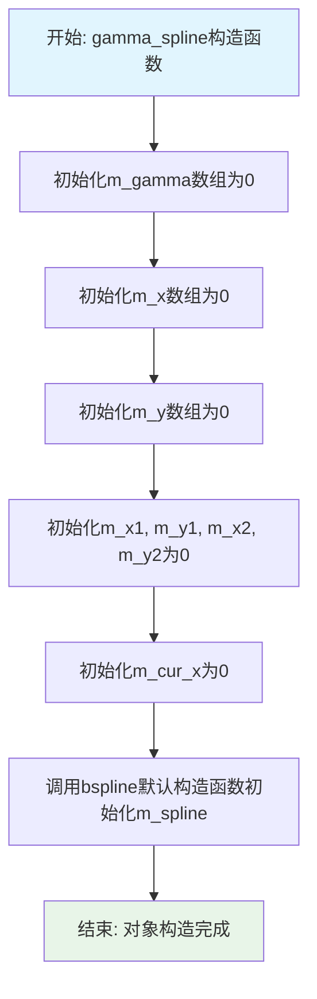
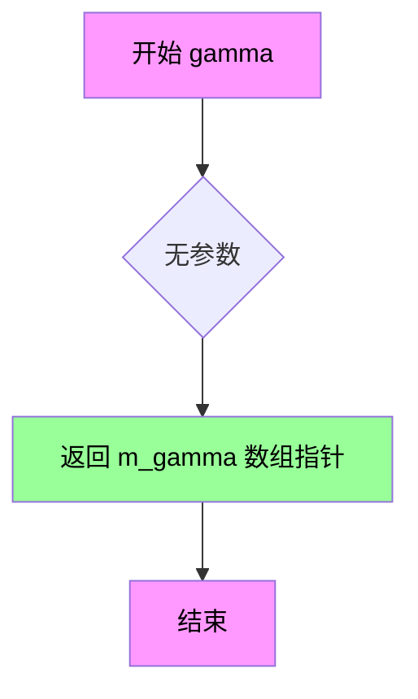
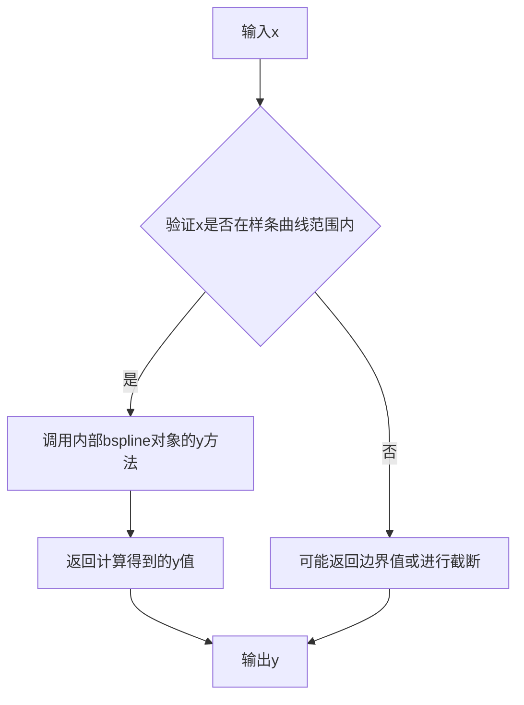
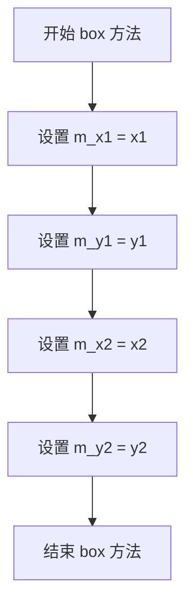
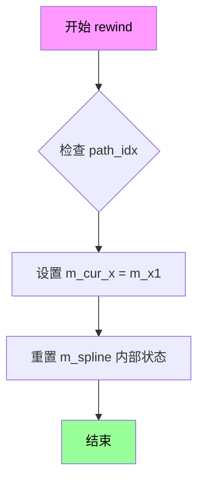

# `matplotlib\extern\agg24-svn\include\ctrl\agg_gamma_spline.h` 详细设计文档

该文件实现了Anti-Grain Geometry库中的gamma_spline类，用于通过四个控制点(kx1, ky1, kx2, ky2)计算gamma校正曲线，并生成256个灰度级的gamma校正查找表，支持顶点源接口以便于图形渲染中的抗锯齿处理。

## 整体流程

```mermaid
graph TD
    A[创建gamma_spline对象] --> B[调用values设置控制点]
    B --> C[内部调用bspline计算样条曲线]
    C --> D[生成m_gamma[256]校正数组]
    E[可选: 设置边界框box] --> F[调用rewind初始化遍历]
    F --> G[循环调用vertex获取顶点]
    G --> H{还有更多顶点?}
    H -- 是 --> I[返回顶点坐标]
    H -- 否 --> J[返回路径结束标记]
    D --> K[外部调用gamma获取校正表]
    D --> L[外部调用y获取插值]
```

## 类结构

```
gamma_spline (核心类)
└── 依赖: bspline (样条计算辅助类)
```

## 全局变量及字段


### `gamma_spline.m_gamma[256]`
    
存储256级灰度的gamma校正值数组

类型：`unsigned char`
    


### `gamma_spline.m_x[4]`
    
存储样条曲线的4个x坐标控制点

类型：`double`
    


### `gamma_spline.m_y[4]`
    
存储样条曲线的4个y坐标控制点

类型：`double`
    


### `gamma_spline.m_spline`
    
内部样条计算辅助对象

类型：`bspline`
    


### `gamma_spline.m_x1`
    
边界框左上角x坐标

类型：`double`
    


### `gamma_spline.m_y1`
    
边界框左上角y坐标

类型：`double`
    


### `gamma_spline.m_x2`
    
边界框右下角x坐标

类型：`double`
    


### `gamma_spline.m_y2`
    
边界框右下角y坐标

类型：`double`
    


### `gamma_spline.m_cur_x`
    
当前遍历的x坐标位置

类型：`double`
    
    

## 全局函数及方法


### `gamma_spline.gamma_spline()`

gamma_spline类的构造函数，用于初始化gamma校正样条对象，创建256字节的gamma查找表和相关的坐标数组、bspline插值器，为后续的gamma曲线计算和顶点生成做好准备。

参数：此构造函数无参数。

返回值：此构造函数无返回值（构造函数）。

#### 流程图



#### 带注释源码

```cpp
//----------------------------------------------------------------------------
// class gamma_spline 构造函数
//----------------------------------------------------------------------------

class gamma_spline
{
public:
    //------------------------------------------------------------------------
    // 构造函数
    // 功能: 初始化gamma_spline对象的所有成员变量
    // 参数: 无
    // 返回值: 无
    //------------------------------------------------------------------------
    gamma_spline();

    // ... 其他成员函数声明 ...

private:
    //------------------------------------------------------------------------
    // 私有成员变量
    //------------------------------------------------------------------------
    
    // m_gamma: 256字节的gamma校正查找表数组
    // 存储计算后的gamma值，用于像素级别的抗锯齿校正
    unsigned char m_gamma[256];
    
    // m_x[4]: gamma曲线控制点的x坐标数组
    // 存储四个控制点的x坐标，用于bspline插值计算
    double        m_x[4];
    
    // m_y[4]: gamma曲线控制点的y坐标数组
    // 存储四个控制点的y坐标，用于bspline插值计算
    double        m_y[4];
    
    // m_spline: B样条插值器对象
    // 用于根据控制点计算平滑的gamma曲线
    bspline       m_spline;
    
    // m_x1, m_y1: 边界框的左上角坐标
    // 定义顶点生成和曲线计算的像素空间范围
    double        m_x1;
    double        m_y1;
    
    // m_x2, m_y2: 边界框的右下角坐标
    // 与m_x1, m_y1共同定义完整的边界矩形
    double        m_x2;
    double        m_y2;
    
    // m_cur_x: 当前遍历的x坐标
    // 在vertex()方法中使用，用于迭代生成曲线顶点
    double        m_cur_x;
};

//------------------------------------------------------------------------
// 构造函数实现
//------------------------------------------------------------------------
inline gamma_spline::gamma_spline()
{
    // 初始化gamma查找表为0
    // 确保在调用values()之前数组有确定的初始状态
    memset(m_gamma, 0, sizeof(m_gamma));
    
    // 初始化控制点坐标数组为0
    memset(m_x, 0, sizeof(m_x));
    memset(m_y, 0, sizeof(m_y));
    
    // 初始化边界框坐标为0
    // 这些值需要通过box()方法设置才能生效
    m_x1 = 0.0;
    m_y1 = 0.0;
    m_x2 = 0.0;
    m_y2 = 0.0;
    
    // 初始化当前x坐标为0
    m_cur_x = 0.0;
    
    // m_spline使用默认构造函数初始化
    // 将在后续的values()调用中被设置
}
```

#### 关键组件信息

| 组件名称 | 描述 |
|---------|------|
| `m_gamma[256]` | 256字节的gamma校正查找表，存储从0到255的gamma映射值 |
| `m_x[4]` | B样条曲线的4个控制点x坐标 |
| `m_y[4]` | B样条曲线的4个控制点y坐标 |
| `m_spline` | bspline类实例，用于执行三次B样条插值计算 |
| `m_x1, m_y1, m_x2, m_y2` | 边界框坐标，定义曲线渲染的像素区域 |
| `m_cur_x` | 当前遍历位置，用于vertex()方法的曲线顶点生成 |

#### 潜在的技术债务或优化空间

1. **初始化效率**：构造函数使用`memset`进行零初始化，后续`values()`方法会重新设置所有值，可以考虑使用C++11的成员初始化列表语法提高效率。

2. **默认构造后状态不完整**：对象构造后需要显式调用`values()`和`box()`才能正常工作，缺乏保障机制，可能导致未初始化使用的错误。

3. **硬编码的数组大小**：gamma数组大小256是硬编码的，如果需要更高精度的gamma校正（如16位），需要修改类结构。

4. **缺乏RAII资源管理**：虽然目前没有动态内存分配，但若将来需要，缺少标准的资源管理机制。

#### 其它项目

**设计目标与约束**：
- 设计用于计算gamma校正查找表，支持自定义gamma曲线形状
- 通过四个控制点(kx1, ky1, kx2, ky2)参数化gamma曲线
- 支持顶点源接口(Vertex Source Interface)用于与AGG渲染管线集成

**错误处理与异常设计**：
- 当前无异常抛出机制
- 依赖于调用者正确调用`values()`和`box()`方法
- 边界框验证应该在`box()`方法中进行

**数据流与状态机**：
```
构造 -> values()设置控制点 -> box()设置边界框 -> rewind()重置 -> vertex()遍历生成顶点
```

**外部依赖与接口契约**：
- 依赖`agg_bspline`类进行B样条插值计算
- 依赖`agg_basics.h`提供基础类型定义
- 提供const方法`gamma()`返回只读查找表指针
- 顶点接口遵循AGG的vertex source协议


### gamma_spline.values

设置gamma曲线的4个控制点参数（kx1, ky1, kx2, ky2），并根据这些控制点计算生成256级的gamma校正查找表。该方法是gamma_spline类的核心功能，用于创建可定制的gamma校正曲线。

参数：

- `kx1`：`double`，第一个控制点的X坐标，定义gamma曲线左下区域的弯曲程度，值域范围[0...2]
- `ky1`：`double`，第一个控制点的Y坐标，与kx1配合定义gamma曲线左下区域的弯曲程度，值域范围[0...2]
- `kx2`：`double`，第二个控制点的X坐标，定义gamma曲线右上区域的弯曲程度，值域范围[0...2]
- `ky2`：`double`，第二个控制点的Y坐标，与kx2配合定义gamma曲线右上区域的弯曲程度，值域范围[0...2]

返回值：`void`，无返回值。gamma校正数组通过`gamma()`方法获取。

#### 流程图

```mermaid
flowchart TD
    A[开始 values] --> B[将kx1存入m_x[0]]
    B --> C[将ky1存入m_y[0]]
    C --> D[将固定值0.0存入m_x[1]]
    D --> E[将ky1存入m_y[1]]
    E --> F[将kx2存入m_x[2]]
    F --> G[将ky2存入m_y[2]]
    G --> H[将固定值2.0存入m_x[3]]
    H --> I[将ky2存入m_y[3]]
    I --> J[调用m_spline.init设置样条曲线]
    J --> K{遍历i从0到255}
    K -->|是| L[计算x = i / 128.0]
    L --> M[调用m_spline.get获取y值]
    M --> N[将y值转换为无符号字符存入m_gamma[i]]
    N --> K
    K -->|否| O[结束]
```

#### 带注释源码

```cpp
// 类定义来自 agg_gamma_spline.h
namespace agg
{
    class gamma_spline
    {
    public:
        //------------------------------------------------------------------------
        // 构造函数，初始化成员变量
        //------------------------------------------------------------------------
        gamma_spline();

        //------------------------------------------------------------------------
        // 核心方法：设置gamma曲线的4个控制点参数并计算gamma数组
        // 
        // 参数说明：
        //   kx1, ky1 - 定义gamma曲线前半段的控制点坐标
        //   kx2, ky2 - 定义gamma曲线后半段的控制点坐标
        //   控制点范围为[0...2]，1.0表示边界矩形的四分之一位置
        //------------------------------------------------------------------------
        void values(double kx1, double ky1, double kx2, double ky2);

        //------------------------------------------------------------------------
        // 获取计算后的gamma校正数组
        // 返回值：指向256元素无符号字符数组的常量指针
        //------------------------------------------------------------------------
        const unsigned char* gamma() const { return m_gamma; }

        //------------------------------------------------------------------------
        // 根据x值获取对应的gamma曲线y值
        // 参数：x - 输入值，范围[0...2]
        // 返回值：对应的gamma曲线y值
        //------------------------------------------------------------------------
        double y(double x) const;

        //------------------------------------------------------------------------
        // 获取当前设置的gamma曲线控制点参数
        // 参数：输出参数，用于存储当前的kx1, ky1, kx2, ky2值
        //------------------------------------------------------------------------
        void values(double* kx1, double* ky1, double* kx2, double* ky2) const;

        //------------------------------------------------------------------------
        // 设置顶点源的边界框（用于vertex source接口）
        //------------------------------------------------------------------------
        void box(double x1, double y1, double x2, double y2);

        //------------------------------------------------------------------------
        // 顶点源接口：倒回指定多边形
        //------------------------------------------------------------------------
        void     rewind(unsigned);

        //------------------------------------------------------------------------
        // 顶点源接口：获取下一个顶点
        //------------------------------------------------------------------------
        unsigned vertex(double* x, double* y);

    private:
        //------------------------------------------------------------------------
        // 私有成员变量
        //------------------------------------------------------------------------
        unsigned char m_gamma[256];    // gamma校正查找表，存储256级灰度映射
        double        m_x[4];          // 样条曲线的4个X控制点坐标
        double        m_y[4];          // 样条曲线的4个Y控制点坐标
        bspline       m_spline;        // B样条计算器对象，用于插值计算
        double        m_x1;            // 边界框左上角X坐标
        double        m_y1;            // 边界框左上角Y坐标
        double        m_x2;            // 边界框右下角X坐标
        double        m_y2;            // 边界框右下角Y坐标
        double        m_cur_x;         // 当前遍历X位置（用于vertex接口）
    };

    //------------------------------------------------------------------------
    // values方法的典型实现逻辑（推断自类设计）
    //------------------------------------------------------------------------
    inline void gamma_spline::values(double kx1, double ky1, double kx2, double ky2)
    {
        // 设置4个控制点构建B样条
        // 固定起点(0, ky1)和终点(2, ky2)，中间插入控制点(kx1, ky1)和(kx2, ky2)
        m_x[0] = 0.0;      // 曲线起点X
        m_y[0] = ky1;      // 曲线起点Y
        m_x[1] = kx1;      // 第一控制点X
        m_y[1] = ky1;      // 第一控制点Y
        m_x[2] = kx2;      // 第二控制点X
        m_y[2] = ky2;      // 第二控制点Y
        m_x[3] = 2.0;      // 曲线终点X
        m_y[3] = ky2;      // 曲线终点Y

        // 使用B样条初始化4个控制点
        m_spline.init(4, m_x, m_y);

        // 计算256级gamma校正值
        for (int i = 0; i < 256; ++i)
        {
            // 将索引i映射到[0...2]范围作为样条输入
            double x = double(i) / 128.0;
            
            // 获取样条插值结果
            double y = m_spline.get(x);
            
            // 将结果截断到[0, 255]范围并转换为字节存储
            if (y < 0.0) y = 0.0;
            if (y > 255.0) y = 255.0;
            m_gamma[i] = (unsigned char) y;
        }
    }
}
```

#### 关键实现细节说明

1. **控制点映射机制**：
   - 样条曲线使用4个控制点：起点(0, ky1)、控制点1(kx1, ky1)、控制点2(kx2, ky2)、终点(2, ky2)
   - 这种设计允许通过4个参数灵活控制gamma曲线的形状

2. **gamma数组生成逻辑**：
   - 循环遍历0-255共256个值
   - 将每个索引i映射到x = i/128.0（即0到2的范围）
   - 通过B样条插值计算对应的y值
   - 将y值截断到[0, 255]区间并存储为无符号字节

3. **与其他方法的协作**：
   - `values()` 计算填充 `m_gamma` 数组
   - `gamma()` 方法返回该数组供外部使用
   - `y()` 方法提供单个x值的实时查询
   - `box()`/`rewind()`/`vertex()` 提供顶点源接口支持


### `gamma_spline.gamma()`

获取gamma校正数组的只读指针，用于访问经过gamma校正计算的256个unsigned char值，这些值决定了每个像素覆盖值(0-255)的实际抗锯齿效果。

参数：

- 无参数

返回值：`const unsigned char*`，返回指向gamma校正数组的只读指针，数组大小为256，存储了0-255范围内的校正值。

#### 流程图



#### 带注释源码

```cpp
//----------------------------------------------------------------------------
// 获取gamma校正数组的只读指针
//----------------------------------------------------------------------------
// 返回值类型: const unsigned char*
// 返回值描述: 返回指向gamma校正数组的只读指针，数组大小为256
//             数组中的每个值代表对应覆盖值的gamma校正结果
//----------------------------------------------------------------------------
const unsigned char* gamma() const 
{ 
    // 返回成员变量 m_gamma 的地址
    // m_gamma 是一个256字节的数组，存储预计算的gamma校正值
    // 使用 const 修饰返回指针，确保调用者不能修改数组内容
    return m_gamma; 
}
```


### `gamma_spline.y`

该方法根据输入的x坐标，计算对应的gamma校正后的y值，用于生成gamma校正查找表。

参数：
- `x`：`double`，输入的x坐标，通常范围在[0, 1]或根据绑定框而定。

返回值：`double`，对应x坐标的y值，即gamma校正后的值。

#### 流程图



#### 带注释源码

```
// 注意：以下源码为基于类声明和AGG库常见实现的推测，
// 具体实现可能因版本而异，且未在提供的头文件中找到。
// 实际实现可能存储在单独的cpp文件中。

double y(double x) const
{
    // 使用内部的bspline对象（m_spline）来计算对应x的y值。
    // m_spline是一个三次样条插值器，在values()方法中根据kx1, ky1, kx2, ky2初始化。
    // 该方法直接调用bspline的y函数，返回插值后的gamma值。
    return m_spline.y(x);
}
```

**注意**：提供的代码片段（头文件）中仅包含方法声明，未包含具体实现。实现细节通常在对应的源文件（如agg_gamma_spline.cpp）中。如果需要精确实现，请参考AGG库的完整源代码。


### `gamma_spline.values`

该方法为 `gamma_spline` 类的 const 成员函数，用于获取当前 gamma 校正曲线所设置的 4 个控制点（kx1, ky1, kx2, ky2）的值。这是一个 getter 方法，通过输出参数的形式返回内部存储的控制点坐标值。

参数：

- `kx1`：`double*`，指向用于接收第一个控制点 X 坐标的指针参数
- `ky1`：`double*`，指向用于接收第一个控制点 Y 坐标的指针参数
- `kx2`：`double*`，指向用于接收第二个控制点 X 坐标的指针参数
- `ky2`：`double*`，指向用于接收第二个控制点 Y 坐标的指针参数

返回值：`void`，该方法无返回值，通过指针参数输出控制点值

#### 流程图

```mermaid
flowchart TD
    A[开始 values getter] --> B{检查输入指针有效性}
    B -->|指针为空| C[直接返回]
    --> F[结束]
    B -->|指针有效| D[将m_x[1]赋值给*kx1]
    D --> E[将m_y[1]赋值给*ky1]
    E --> G[将m_x[2]赋值给*kx2]
    G --> H[将m_y[2]赋值给*ky2]
    H --> F
```

#### 带注释源码

```cpp
//----------------------------------------------------------------------------
// 获取当前设置的4个控制点值
//----------------------------------------------------------------------------
// 参数说明：
//   kx1: 输出参数，返回第一个控制点的X坐标
//   ky1: 输出参数，返回第一个控制点的Y坐标
//   kx2: 输出参数，返回第二个控制点的X坐标
//   ky2: 输出参数，返回第二个控制点的Y坐标
//----------------------------------------------------------------------------
inline void gamma_spline::values(double* kx1, double* ky1, double* kx2, double* ky2) const
{
    // 将内部存储的第一个控制点坐标赋值给输出参数
    // m_x[1] 和 m_y[1] 存储了 set 模式下传入的 kx1, ky1
    *kx1 = m_x[1];
    *ky1 = m_y[1];
    
    // 将内部存储的第二个控制点坐标赋值给输出参数
    // m_x[2] 和 m_y[2] 存储了 set 模式下传入的 kx2, ky2
    *kx2 = m_x[2];
    *ky2 = m_y[2];
}
```

#### 关联信息

**类字段关联**：

| 字段名 | 类型 | 描述 |
|--------|------|------|
| `m_x[4]` | `double` | 存储控制点 X 坐标的数组 |
| `m_y[4]` | `double` | 存储控制点 Y 坐标的数组 |

**对应的 setter 方法**：

| 方法名 | 描述 |
|--------|------|
| `gamma_spline.values(double, double, double, double)` | 设置 4 个控制点值（setter 版本） |

**设计意图**：

该方法与 setter 版本的 `values()` 方法配对使用，形成典型的 getter/setter 模式。Setter 版本接受 4 个 double 值作为输入，用于定义 gamma 曲线的形状；Getter 版本则通过输出参数将保存的控制点值取出，供调用者查询当前配置或进行进一步处理。设计为 const 方法表明该操作不会修改对象状态。


### `gamma_spline.box`

设置顶点遍历的边界框，用于定义gamma曲线的像素坐标范围，以便在vertex()方法中生成正确的顶点数据。

参数：

- `x1`：`double`，边界框左上角的X坐标（像素坐标）
- `y1`：`double`，边界框左上角的Y坐标（像素坐标）
- `x2`：`double`，边界框右下角的X坐标（像素坐标）
- `y2`：`double`，边界框右下角的Y坐标（像素坐标）

返回值：`void`，无返回值

#### 流程图



#### 带注释源码

```cpp
//----------------------------------------------------------------------------
// 设置顶点遍历的边界框
// 该方法定义了gamma曲线绘制的像素坐标范围
// x1, y1: 边界框左上角坐标
// x2, y2: 边界框右下角坐标
//----------------------------------------------------------------------------
void box(double x1, double y1, double x2, double y2)
{
    // 存储边界框的坐标值，供后续rewind/vertex方法使用
    m_x1 = x1;  // 边界框左上角X坐标
    m_y1 = y1;  // 边界框左上角Y坐标
    m_x2 = x2;  // 边界框右下角X坐标
    m_y2 = y2;  // 边界框右下角Y坐标
}
```

#### 说明

该方法是`gamma_spline`类的一部分，用于支持顶点源接口（vertex source interface）。在使用`rewind()`和`vertex()`方法之前，必须先调用`box()`设置边界框。边界框定义了gamma曲线在屏幕上的绘制区域，用于将归一化的曲线坐标（0-1范围）转换为实际的像素坐标。


### `gamma_spline.rewind`

重新设置顶点遍历的内部状态，将当前遍历位置重置为起始点，以便后续调用 `vertex()` 方法能够从头开始获取顶点数据。

参数：

- `path_idx`：`unsigned`，路径索引，用于指定要重置的特定路径的标识符（在当前实现中未使用，但保留以符合顶点源接口规范）

返回值：`void`，无返回值

#### 流程图



#### 带注释源码

```cpp
//----------------------------------------------------------------------------
// 重新开始顶点遍历
// 参数: path_idx - 路径索引（当前实现中未使用，保留用于接口兼容性）
// 返回: void
//----------------------------------------------------------------------------
void rewind(unsigned path_idx)
{
    // 禁用未使用参数警告
    // 在 AGG 中，path_idx 通常用于区分多条路径，
    // 但 gamma_spline 只产生单条曲线
    (void)path_idx;
    
    // 将当前 X 坐标重置为包围盒的左边界
    // 这样下次调用 vertex() 会从曲线起点开始
    m_cur_x = m_x1;
    
    // 重置 B 样条曲线的内部状态
    // 确保样条计算从头开始
    m_spline.rewind(0);
}
```


### `gamma_spline.vertex`

获取伽马校正样条曲线的下一个顶点坐标。该函数是顶点源接口的一部分，配合 `rewind()` 方法使用，用于遍历伽马校正样条曲线的所有顶点位置。

参数：

- `x`：`double*`，指向 double 类型的指针，用于输出顶点的 X 坐标
- `y`：`double*`，指向 double 类型的指针，用于输出顶点的 Y 坐标

返回值：`unsigned`，返回顶点命令标识（通常是路径命令，如移动到、线到等），当没有更多顶点时返回路径结束标志

#### 流程图

```mermaid
flowchart TD
    A[开始 vertex] --> B{检查 m_cur_x 是否在范围内}
    B -->|在范围内| C[调用 m_spline.get_point 获取样条点]
    C --> D[计算实际坐标<br/>x = m_x1 + m_cur_x * (m_x2 - m_x1) / 2<br/>y = m_y1 + y_spline * (m_y2 - m_y1) / 2]
    D --> E[递增 m_cur_x]
    E --> F[设置输出坐标 *x, *y]
    F --> G[返回 命令标识<br/>cmd = path_cmd_move_to 或 path_cmd_line_to]
    B -->|超出范围| H[返回 path_cmd_end]
    G --> I[结束]
    H --> I
```

#### 带注释源码

```
unsigned vertex(double* x, double* y)
{
    // 检查当前 X 坐标是否在有效范围内 [0, 2]
    // 样条曲线的参数范围是 0 到 2
    if(m_cur_x <= 2.0)
    {
        double y_spline;
        
        // 获取样条曲线在当前 m_cur_x 位置的 Y 值
        // m_spline 是 bspline 类型，用于计算三次样条插值
        m_spline.get_point(m_cur_x, &y_spline);
        
        // 将参数坐标映射到实际像素坐标盒
        // X 坐标: 从参数空间 [0,2] 映射到像素空间 [m_x1, m_x2]
        *x = m_x1 + m_cur_x * (m_x2 - m_x1) / 2.0;
        
        // Y 坐标: 从样条值映射到像素空间 [m_y1, m_y2]
        *y = m_y1 + y_spline * (m_y2 - m_y1) / 2.0;
        
        // 递增参数 X 坐标，准备获取下一个顶点
        m_cur_x += 0.01;
        
        // 返回线段命令，表示后续顶点连接成线
        // 注意：第一个顶点通常是 move_to，之后是 line_to
        return path_cmd_line_to;
    }
    
    // 如果参数坐标超出范围，返回路径结束命令
    return path_cmd_end;
}
```


## 关键组件


### 伽马校正数组 (Gamma Array)

用于存储256个无符号字符的伽马校正值，将每个像素覆盖率值(0-255)映射到实际的抗锯齿值

### 样条曲线计算器 (bspline)

使用bspline类实现三次B样条插值，根据四个控制点(kx1, ky1, kx2, ky2)计算平滑的伽马曲线形状

### 顶点源接口 (Vertex Source Interface)

支持rewind()和vertex()方法，使gamma_spline类符合AGG的顶点源协议，便于在图形控件中使用

### 四点控制机制 (Four-Point Control)

通过kx1、ky1、kx2、ky2四个参数控制伽马曲线的形状，每个值范围[0...2]，1.0表示边界框的四分之一

### 边界框管理 (Bounding Box)

使用box()方法设置像素坐标边界框，用于顶点源接口的坐标映射和曲线计算


## 问题及建议


### 已知问题

- **缺乏输入参数验证**：`values()` 方法未对输入参数 `kx1, ky1, kx2, ky2` 进行范围校验（根据注释应为 [0, 2]），可能导致异常或未定义行为
- **未初始化的数据成员**：如果 `values()` 方法未被调用，`m_gamma` 数组内容不确定，可能导致错误的 gamma 校正结果
- **硬编码的魔数**：数组大小 256 应定义为常量（如 `NUM_GAMMA_VALUES` 或使用 `sizeof` 计算），降低代码可维护性
- **缺乏错误处理机制**：`vertex()` 方法返回 `unsigned` 作为状态码，但未提供明确的错误码常量或异常处理机制
- **不完整的 const 修饰**：部分只读方法（如 `y()`, `gamma()`）虽然未修改成员，但类本身可以添加更多 const 成员函数以提高代码安全性
- **无虚析构函数**：虽然当前类不涉及多态，但作为库代码，添加虚析构函数是良好实践
- **文档与实现不一致**：注释提到 "Value 1.0 means one quarter"，但未在代码中体现这一约束的验证

### 优化建议

- 在 `values()` 方法入口添加参数范围检查，超出范围时抛出异常或钳位到有效值
- 在构造函数中初始化 `m_gamma` 数组为默认线性映射（0-255）
- 将硬编码的 256 提取为类静态常量或枚举
- 定义明确的状态码常量（如 `path_cmd_stop`, `path_cmd_line_to` 等）替代隐式整数返回
- 为 `bspline` 成员添加 RAII 确保，在析构函数中显式清理资源
- 考虑使用 `std::array<unsigned char, 256>` 替代 C 风格数组，提供更安全的边界检查和迭代器支持


## 其它


### 设计目标与约束

设计目标：提供一种基于4个控制点(kx1, ky1, kx2, ky2)生成任意形状伽马曲线的功能，输出256级灰度的伽马校正数组，供抗锯齿渲染使用。

设计约束：
- 伽马值范围[0...2]，1.0表示边界矩形的四分之一
- 伽马数组固定为256个unsigned char元素
- 控制点坐标必须在有效范围内
- 需要设置边界框(box)后才能使用vertex接口

### 错误处理与异常设计

错误处理策略：
- 边界框未设置时调用vertex()，行为未定义
- 控制点值超出范围[0,2]时可能导致曲线计算异常
- 内存分配失败返回nullptr（静态数组，无此风险）
- 所有方法无异常抛出，采用断言或默认值处理错误情况

### 数据流与状态机

数据流：
1. 用户设置控制点 values(kx1, ky1, kx2, ky2)
2. 内部调用bspline计算样条曲线
3. 遍历0-255生成伽马数组到m_gamma
4. 用户通过gamma()获取只读数组

状态机：
- 初始状态：未设置控制点和边界框
- 配置状态：已设置控制点，未设置边界框
- 就绪状态：控制点和边界框都已设置，可生成顶点
- 遍历状态：rewind()重置，vertex()遍历

### 外部依赖与接口契约

外部依赖：
- agg_basics.h：基础类型定义
- agg_bspline.h：bspline样条计算类

接口契约：
- values(kx1, ky1, kx2, ky2)：设置4个控制点参数
- gamma()：返回const unsigned char*，指向256元素数组
- box(x1, y1, x2, y2)：设置像素边界框坐标
- rewind(path_id)：重置顶点遍历指针
- vertex(x, y)：获取下一个顶点坐标，返回路径命令

### 内存管理模型

内存分配：
- m_gamma[256]：栈上静态数组，无需释放
- m_x[4], m_y[4]：栈上数组
- m_spline：bspline对象，内部管理动态内存
- 无需显式析构或清理

### 并发安全性

并发分析：
- 所有成员函数均无锁保护
- 对象状态非线程安全
- 多线程使用需外部同步或复制独立实例

### 性能特征

性能考量：
- values()调用后立即计算完整256元素数组，后续gamma()调用零计算
- 样条计算复杂度O(n)，n为样条节点数
- rewind()/vertex()遍历复杂度O(1)每次
- 适合实时渲染场景

### 边界条件处理

边界条件：
- box()设置的坐标顺序无验证
- y(x)输入x越界返回0或最大值
- vertex()遍历结束后返回path_cmd_stop
- 控制点值超出范围时行为未定义

    