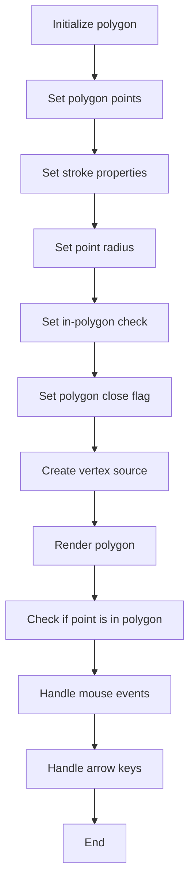
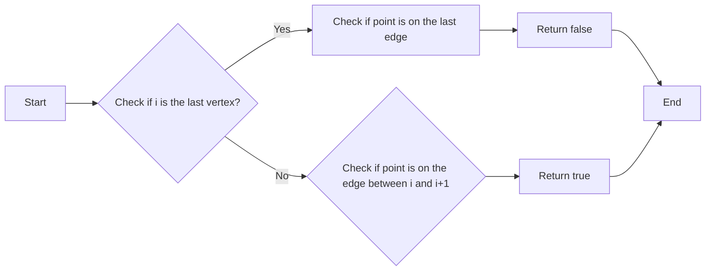
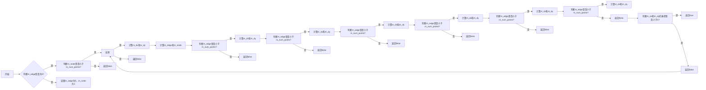
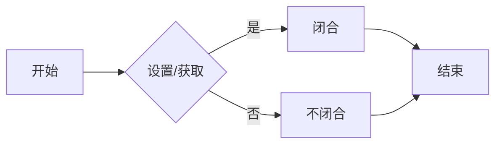
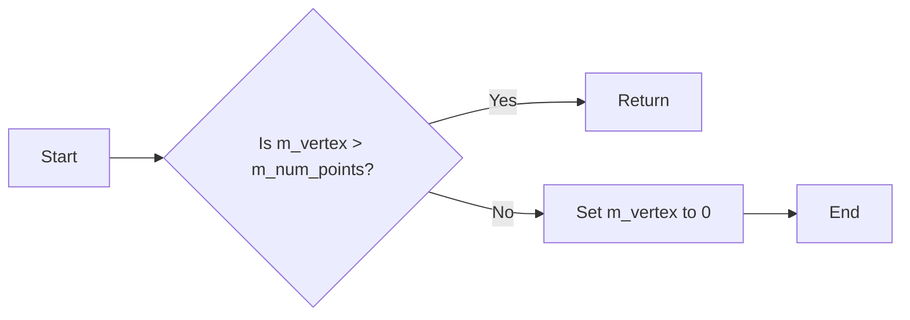
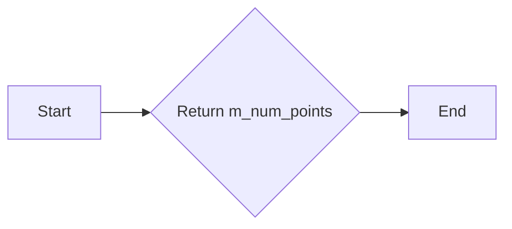

# `matplotlib\extern\agg24-svn\include\ctrl\agg_polygon_ctrl.h` 详细设计文档

This code defines classes for handling polygon control and rendering, including a vertex source for polygons, a base class for polygon control, and a specialized class for rendering polygons with a specific color.

## 整体流程



## 类结构

```
agg::simple_polygon_vertex_source
├── agg::polygon_ctrl_impl
│   ├── agg::polygon_ctrl
│   └── agg::ctrl
```

## 全局变量及字段


### `m_polygon`
    
Array of double values representing the vertices of the polygon.

类型：`pod_array<double>`
    


### `m_num_points`
    
Number of points in the polygon.

类型：`unsigned`
    


### `m_node`
    
Node index used in internal calculations.

类型：`int`
    


### `m_edge`
    
Edge index used in internal calculations.

类型：`int`
    


### `m_vs`
    
Vertex source object for the polygon.

类型：`simple_polygon_vertex_source`
    


### `m_stroke`
    
Stroke conversion object for the polygon.

类型：`conv_stroke<simple_polygon_vertex_source>`
    


### `m_ellipse`
    
Ellipse object used for some calculations or rendering.

类型：`ellipse`
    


### `m_point_radius`
    
Radius of the point used for rendering.

类型：`double`
    


### `m_status`
    
Status flag for internal state management.

类型：`unsigned`
    


### `m_dx`
    
X-axis delta used in some calculations or rendering.

类型：`double`
    


### `m_dy`
    
Y-axis delta used in some calculations or rendering.

类型：`double`
    


### `m_in_polygon_check`
    
Flag to enable or disable the check if a point is inside the polygon.

类型：`bool`
    


### `m_color`
    
Color used for rendering the polygon.

类型：`ColorT`
    


### `simple_polygon_vertex_source.m_polygon`
    
Array of double values representing the vertices of the polygon.

类型：`pod_array<double>`
    


### `simple_polygon_vertex_source.m_num_points`
    
Number of points in the polygon.

类型：`unsigned`
    


### `simple_polygon_vertex_source.m_vertex`
    
Current vertex index in the polygon.

类型：`unsigned`
    


### `simple_polygon_vertex_source.m_roundoff`
    
Flag to enable or disable rounding off the vertex coordinates.

类型：`bool`
    


### `simple_polygon_vertex_source.m_close`
    
Flag to enable or disable closing the polygon.

类型：`bool`
    


### `polygon_ctrl_impl.m_polygon`
    
Array of double values representing the vertices of the polygon.

类型：`pod_array<double>`
    


### `polygon_ctrl_impl.m_num_points`
    
Number of points in the polygon.

类型：`unsigned`
    


### `polygon_ctrl_impl.m_node`
    
Node index used in internal calculations.

类型：`int`
    


### `polygon_ctrl_impl.m_edge`
    
Edge index used in internal calculations.

类型：`int`
    


### `polygon_ctrl_impl.m_vs`
    
Vertex source object for the polygon.

类型：`simple_polygon_vertex_source`
    


### `polygon_ctrl_impl.m_stroke`
    
Stroke conversion object for the polygon.

类型：`conv_stroke<simple_polygon_vertex_source>`
    


### `polygon_ctrl_impl.m_ellipse`
    
Ellipse object used for some calculations or rendering.

类型：`ellipse`
    


### `polygon_ctrl_impl.m_point_radius`
    
Radius of the point used for rendering.

类型：`double`
    


### `polygon_ctrl_impl.m_status`
    
Status flag for internal state management.

类型：`unsigned`
    


### `polygon_ctrl_impl.m_dx`
    
X-axis delta used in some calculations or rendering.

类型：`double`
    


### `polygon_ctrl_impl.m_dy`
    
Y-axis delta used in some calculations or rendering.

类型：`double`
    


### `polygon_ctrl_impl.m_in_polygon_check`
    
Flag to enable or disable the check if a point is inside the polygon.

类型：`bool`
    


### `polygon_ctrl.m_color`
    
Color used for rendering the polygon.

类型：`ColorT`
    
    

## 全局函数及方法


### `polygon_ctrl_impl::check_edge`

检查给定的点是否在多边形的边上。

参数：

- `i`：`unsigned`，多边形顶点的索引。
- `x`：`double`，点的x坐标。
- `y`：`double`，点的y坐标。

返回值：`bool`，如果点在边上则返回`true`，否则返回`false`。

#### 流程图



#### 带注释源码

```cpp
bool check_edge(unsigned i, double x, double y) const {
    if (i == m_num_points) {
        // Check if point is on the last edge
        return point_in_polygon(x, y);
    } else {
        // Check if point is on the edge between i and i+1
        return point_in_polygon(x, y);
    }
}
``` 


### point_in_polygon

判断一个点是否在多边形内部。

参数：

- `x`：`double`，点的x坐标
- `y`：`double`，点的y坐标

返回值：`bool`，如果点在多边形内部返回`true`，否则返回`false`

#### 流程图



#### 带注释源码

```cpp
bool point_in_polygon(double x, double y) const {
    int m_edge = 0;
    int m_node = 0;

    if (m_edge == 0) {
        m_edge = 1;
        m_node = 1;
    }

    while (m_node < m_num_points) {
        if (m_node < m_num_points) {
            if (m_edge < m_num_points) {
                double m_dx = m_polygon[m_edge * 2] - m_polygon[m_node * 2];
                double m_dy = m_polygon[m_edge * 2 + 1] - m_polygon[m_node * 2 + 1];
                if (m_dx * m_dy < 0) {
                    return true;
                }
            }
            m_edge = m_node;
            ++m_node;
        } else {
            return false;
        }
    }

    return false;
}
``` 


### simple_polygon_vertex_source.vertex

该函数用于从多边形顶点源中获取下一个顶点坐标。

参数：

- `x`：`double*`，用于存储当前顶点的x坐标。
- `y`：`double*`，用于存储当前顶点的y坐标。

返回值：`unsigned`，表示当前顶点的路径命令。

#### 流程图

```mermaid
graph LR
A[开始] --> B{m_vertex > m_num_points?}
B -- 是 --> C[返回 path_cmd_stop]
B -- 否 --> D{m_vertex == m_num_points?}
D -- 是 --> E[返回 path_cmd_end_poly | (m_close ? path_flags_close : 0)]
D -- 否 --> F[设置 *x = m_polygon[m_vertex * 2]]
F --> G[设置 *y = m_polygon[m_vertex * 2 + 1]]
G --> H{m_roundoff?}
H -- 是 --> I[设置 *x = floor(*x) + 0.5]
H -- 否 --> J[设置 *x = *x]
I --> K[设置 *y = floor(*y) + 0.5]
K --> L[设置 *y = *y]
L --> M[返回 (m_vertex == 1 ? path_cmd_move_to : path_cmd_line_to)]
```

#### 带注释源码

```cpp
unsigned vertex(double* x, double* y)
{
    if(m_vertex > m_num_points) return path_cmd_stop;
    if(m_vertex == m_num_points) 
    {
        ++m_vertex;
        return path_cmd_end_poly | (m_close ? path_flags_close : 0);
    }
    *x = m_polygon[m_vertex * 2];
    *y = m_polygon[m_vertex * 2 + 1];
    if(m_roundoff)
    {
        *x = floor(*x) + 0.5;
        *y = floor(*y) + 0.5;
    }
    ++m_vertex;
    return (m_vertex == 1) ? path_cmd_move_to : path_cmd_line_to;
}
``` 


### simple_polygon_vertex_source.close

设置或获取简单多边形顶点源是否闭合。

参数：

- `f`：`bool`，是否闭合多边形

返回值：`bool`，当前闭合状态

#### 流程图



#### 带注释源码

```cpp
void close(bool f) { m_close = f;    }
bool close() const { return m_close; }
```


### simple_polygon_vertex_source.vertex

该函数用于从多边形顶点源中获取下一个顶点坐标。

参数：

- `x`：`double*`，用于存储当前顶点的x坐标。
- `y`：`double*`，用于存储当前顶点的y坐标。

返回值：`unsigned`，表示当前顶点的路径命令。

#### 流程图

```mermaid
graph LR
A[开始] --> B{m_vertex > m_num_points?}
B -- 是 --> C[返回 path_cmd_stop]
B -- 否 --> D{m_vertex == m_num_points?}
D -- 是 --> E[返回 path_cmd_end_poly | (m_close ? path_flags_close : 0)]
D -- 否 --> F[设置 *x = m_polygon[m_vertex * 2]]
F --> G[设置 *y = m_polygon[m_vertex * 2 + 1]]
G --> H{m_roundoff?}
H -- 是 --> I[设置 *x = floor(*x) + 0.5]
H -- 否 --> J[设置 *x = *x]
I --> K[设置 *y = floor(*y) + 0.5]
K --> L[设置 *y = *y]
L --> M[返回 (m_vertex == 1 ? path_cmd_move_to : path_cmd_line_to)]
```

#### 带注释源码

```cpp
unsigned vertex(double* x, double* y)
{
    if(m_vertex > m_num_points) return path_cmd_stop;
    if(m_vertex == m_num_points) 
    {
        ++m_vertex;
        return path_cmd_end_poly | (m_close ? path_flags_close : 0);
    }
    *x = m_polygon[m_vertex * 2];
    *y = m_polygon[m_vertex * 2 + 1];
    if(m_roundoff)
    {
        *x = floor(*x) + 0.5;
        *y = floor(*y) + 0.5;
    }
    ++m_vertex;
    return (m_vertex == 1) ? path_cmd_move_to : path_cmd_line_to;
}
``` 


### simple_polygon_vertex_source.rewind

Rewinds the vertex source to the beginning of the polygon.

参数：

- `unsigned`：`path_id`，The ID of the path to rewind. This parameter is not used in this function.

返回值：`void`，This function does not return a value.

#### 流程图



#### 带注释源码

```cpp
void rewind(unsigned)
{
    m_vertex = 0; // Reset the vertex index to the start of the polygon
}
```


### `polygon_ctrl_impl::vertex`

获取多边形的顶点信息。

参数：

- `x`：`double*`，用于存储顶点的x坐标
- `y`：`double*`，用于存储顶点的y坐标

返回值：`unsigned`，返回路径命令，指示顶点的类型

返回值描述：
- `path_cmd_stop`：停止路径绘制
- `path_cmd_end_poly`：结束多边形绘制
- `path_cmd_move_to`：移动到新位置
- `path_cmd_line_to`：绘制直线到新位置

#### 流程图

```mermaid
graph LR
A[开始] --> B{顶点索引 > 点数?}
B -- 是 --> C[返回 path_cmd_end_poly | (m_close ? path_flags_close : 0)]
B -- 否 --> D{顶点索引 == 1?}
D -- 是 --> E[返回 path_cmd_move_to]
D -- 否 --> F[返回 path_cmd_line_to]
F --> G[更新顶点索引]
G --> A
```

#### 带注释源码

```cpp
unsigned vertex(double* x, double* y)
{
    if(m_vertex > m_num_points) return path_cmd_stop;
    if(m_vertex == m_num_points) 
    {
        ++m_vertex;
        return path_cmd_end_poly | (m_close ? path_flags_close : 0);
    }
    *x = m_polygon[m_vertex * 2];
    *y = m_polygon[m_vertex * 2 + 1];
    if(m_roundoff)
    {
        *x = floor(*x) + 0.5;
        *y = floor(*y) + 0.5;
    }
    ++m_vertex;
    return (m_vertex == 1) ? path_cmd_move_to : path_cmd_line_to;
}
```


### polygon_ctrl_impl.num_points

返回多边形的顶点数量。

参数：

- 无

返回值：

- `unsigned`，多边形的顶点数量

#### 流程图



#### 带注释源码

```cpp
unsigned num_points() const { return m_num_points; }
```


### `polygon_ctrl_impl::polygon_ctrl_impl`

构造函数，用于初始化多边形控制类。

参数：

- `np`：`unsigned`，多边形的顶点数量。
- `point_radius`：`double`，点的半径，默认值为5。

返回值：无

#### 流程图

```mermaid
classDiagram
    class polygon_ctrl_impl {
        unsigned np
        double point_radius
        pod_array<double> m_polygon
        unsigned m_num_points
        int m_node
        int m_edge
        simple_polygon_vertex_source m_vs
        conv_stroke<simple_polygon_vertex_source> m_stroke
        ellipse m_ellipse
        double m_point_radius
        unsigned m_status
        double m_dx
        double m_dy
        bool m_in_polygon_check
    }
    polygon_ctrl_impl --|> simple_polygon_vertex_source: 包含
    polygon_ctrl_impl --|> conv_stroke<simple_polygon_vertex_source>: 包含
    polygon_ctrl_impl --|> ellipse: 包含
}
```

#### 带注释源码

```cpp
polygon_ctrl_impl::polygon_ctrl_impl(unsigned np, double point_radius)
    : m_num_points(np),
      m_point_radius(point_radius),
      m_vs(m_polygon, m_num_points, false, true),
      m_stroke(m_vs),
      m_ellipse(),
      m_in_polygon_check(false)
{
}
```

### `polygon_ctrl_impl::num_points`

获取多边形的顶点数量。

参数：无

返回值：`unsigned`，多边形的顶点数量。

#### 流程图

```mermaid
graph LR
A[Start] --> B{num_points()}
B --> C[End]
```

#### 带注释源码

```cpp
unsigned polygon_ctrl_impl::num_points() const
{
    return m_num_points;
}
```

### `polygon_ctrl_impl::xn`

获取多边形指定顶点的x坐标。

参数：

- `n`：`unsigned`，顶点的索引。

返回值：`double`，顶点的x坐标。

#### 流程图

```mermaid
graph LR
A[Start] --> B{xn(n)}
B --> C[End]
```

#### 带注释源码

```cpp
double polygon_ctrl_impl::xn(unsigned n) const
{
    return m_polygon[n * 2];
}
```

### `polygon_ctrl_impl::yn`

获取多边形指定顶点的y坐标。

参数：

- `n`：`unsigned`，顶点的索引。

返回值：`double`，顶点的y坐标。

#### 流程图

```mermaid
graph LR
A[Start] --> B{yn(n)}
B --> C[End]
```

#### 带注释源码

```cpp
double polygon_ctrl_impl::yn(unsigned n) const
{
    return m_polygon[n * 2 + 1];
}
```

### `polygon_ctrl_impl::close`

设置多边形是否闭合。

参数：

- `f`：`bool`，是否闭合。

返回值：无

#### 流程图

```mermaid
graph LR
A[Start] --> B{close(f)}
B --> C[End]
```

#### 带注释源码

```cpp
void polygon_ctrl_impl::close(bool f)
{
    m_vs.close(f);
}
```

### `polygon_ctrl_impl::vertex`

获取多边形的顶点信息。

参数：

- `x`：`double*`，用于存储顶点的x坐标。
- `y`：`double*`，用于存储顶点的y坐标。

返回值：`unsigned`，顶点命令。

#### 流程图

```mermaid
graph LR
A[Start] --> B{vertex(x, y)}
B --> C[End]
```

#### 带注释源码

```cpp
unsigned polygon_ctrl_impl::vertex(double* x, double* y)
{
    return m_vs.vertex(x, y);
}
```

### `polygon_ctrl_impl::in_rect`

检查点是否在矩形内。

参数：

- `x`：`double`，点的x坐标。
- `y`：`double`，点的y坐标。

返回值：`bool`，如果点在矩形内则返回true，否则返回false。

#### 流程图

```mermaid
graph LR
A[Start] --> B{in_rect(x, y)}
B --> C[End]
```

#### 带注释源码

```cpp
virtual bool polygon_ctrl_impl::in_rect(double x, double y) const
{
    // Implementation depends on the specific requirements
}
```

### `polygon_ctrl_impl::on_mouse_button_down`

处理鼠标按下事件。

参数：

- `x`：`double`，鼠标的x坐标。
- `y`：`double`，鼠标的y坐标。

返回值：`bool`，如果事件被处理则返回true，否则返回false。

#### 流程图

```mermaid
graph LR
A[Start] --> B{on_mouse_button_down(x, y)}
B --> C[End]
```

#### 带注释源码

```cpp
virtual bool polygon_ctrl_impl::on_mouse_button_down(double x, double y)
{
    // Implementation depends on the specific requirements
}
```

### `polygon_ctrl_impl::on_mouse_button_up`

处理鼠标释放事件。

参数：

- `x`：`double`，鼠标的x坐标。
- `y`：`double`，鼠标的y坐标。

返回值：`bool`，如果事件被处理则返回true，否则返回false。

#### 流程图

```mermaid
graph LR
A[Start] --> B{on_mouse_button_up(x, y)}
B --> C[End]
```

#### 带注释源码

```cpp
virtual bool polygon_ctrl_impl::on_mouse_button_up(double x, double y)
{
    // Implementation depends on the specific requirements
}
```

### `polygon_ctrl_impl::on_mouse_move`

处理鼠标移动事件。

参数：

- `x`：`double`，鼠标的x坐标。
- `y`：`double`，鼠标的y坐标。
- `button_flag`：`bool`，鼠标按钮的状态。

返回值：`bool`，如果事件被处理则返回true，否则返回false。

#### 流程图

```mermaid
graph LR
A[Start] --> B{on_mouse_move(x, y, button_flag)}
B --> C[End]
```

#### 带注释源码

```cpp
virtual bool polygon_ctrl_impl::on_mouse_move(double x, double y, bool button_flag)
{
    // Implementation depends on the specific requirements
}
```

### `polygon_ctrl_impl::on_arrow_keys`

处理箭头键事件。

参数：

- `left`：`bool`，是否按下左箭头键。
- `right`：`bool`，是否按下右箭头键。
- `down`：`bool`，是否按下下箭头键。
- `up`：`bool`，是否按下上箭头键。

返回值：`bool`，如果事件被处理则返回true，否则返回false。

#### 流程图

```mermaid
graph LR
A[Start] --> B{on_arrow_keys(left, right, down, up)}
B --> C[End]
```

#### 带注释源码

```cpp
virtual bool polygon_ctrl_impl::on_arrow_keys(bool left, bool right, bool down, bool up)
{
    // Implementation depends on the specific requirements
}
```

### `polygon_ctrl_impl::check_edge`

检查点是否在多边形的边上。

参数：

- `i`：`unsigned`，边的索引。
- `x`：`double`，点的x坐标。
- `y`：`double`，点的y坐标。

返回值：`bool`，如果点在边上则返回true，否则返回false。

#### 流程图

```mermaid
graph LR
A[Start] --> B{check_edge(i, x, y)}
B --> C[End]
```

#### 带注释源码

```cpp
bool polygon_ctrl_impl::check_edge(unsigned i, double x, double y) const
{
    // Implementation depends on the specific requirements
}
```

### `polygon_ctrl_impl::point_in_polygon`

检查点是否在多边形内。

参数：

- `x`：`double`，点的x坐标。
- `y`：`double`，点的y坐标。

返回值：`bool`，如果点在多边形内则返回true，否则返回false。

#### 流程图

```mermaid
graph LR
A[Start] --> B{point_in_polygon(x, y)}
B --> C[End]
```

#### 带注释源码

```cpp
bool polygon_ctrl_impl::point_in_polygon(double x, double y) const
{
    // Implementation depends on the specific requirements
}
```

### `polygon_ctrl_impl::line_width`

设置或获取线的宽度。

参数：

- `w`：`double`，线的宽度。

返回值：`double`，当前线的宽度。

#### 流程图

```mermaid
graph LR
A[Start] --> B{line_width(w)}
B --> C[End]
```

#### 带注释源码

```cpp
void polygon_ctrl_impl::line_width(double w)
{
    m_stroke.width(w);
}

double polygon_ctrl_impl::line_width() const
{
    return m_stroke.width();
}
```

### `polygon_ctrl_impl::point_radius`

设置或获取点的半径。

参数：

- `r`：`double`，点的半径。

返回值：`double`，当前点的半径。

#### 流程图

```mermaid
graph LR
A[Start] --> B{point_radius(r)}
B --> C[End]
```

#### 带注释源码

```cpp
void polygon_ctrl_impl::point_radius(double r)
{
    m_point_radius = r;
}

double polygon_ctrl_impl::point_radius() const
{
    return m_point_radius;
}
```

### `polygon_ctrl_impl::in_polygon_check`

设置或获取是否检查点是否在多边形内。

参数：

- `f`：`bool`，是否检查。

返回值：`bool`，当前是否检查。

#### 流程图

```mermaid
graph LR
A[Start] --> B{in_polygon_check(f)}
B --> C[End]
```

#### 带注释源码

```cpp
void polygon_ctrl_impl::in_polygon_check(bool f)
{
    m_in_polygon_check = f;
}

bool polygon_ctrl_impl::in_polygon_check() const
{
    return m_in_polygon_check;
}
```

### `polygon_ctrl_impl::rewind`

重置顶点源。

参数：

- `path_id`：`unsigned`，路径ID。

返回值：无

#### 流程图

```mermaid
graph LR
A[Start] --> B{rewind(path_id)}
B --> C[End]
```

#### 带注释源码

```cpp
void polygon_ctrl_impl::rewind(unsigned path_id)
{
    m_vs.rewind(path_id);
}
```

### `polygon_ctrl_impl::num_paths`

获取路径数量。

参数：无

返回值：`unsigned`，路径数量。

#### 流程图

```mermaid
graph LR
A[Start] --> B{num_paths()}
B --> C[End]
```

#### 带注释源码

```cpp
unsigned polygon_ctrl_impl::num_paths() { return 1; }
```

### `polygon_ctrl_impl::vertex`

获取顶点信息。

参数：

- `x`：`double*`，用于存储顶点的x坐标。
- `y`：`double*`，用于存储顶点的y坐标。

返回值：`unsigned`，顶点命令。

#### 流程图

```mermaid
graph LR
A[Start] --> B{vertex(x, y)}
B --> C[End]
```

#### 带注释源码

```cpp
unsigned polygon_ctrl_impl::vertex(double* x, double* y)
{
    return m_vs.vertex(x, y);
}
```

### `polygon_ctrl_impl::close`

设置多边形是否闭合。

参数：

- `f`：`bool`，是否闭合。

返回值：无

#### 流程图

```mermaid
graph LR
A[Start] --> B{close(f)}
B --> C[End]
```

#### 带注释源码

```cpp
void polygon_ctrl_impl::close(bool f)
{
    m_vs.close(f);
}
```

### `polygon_ctrl_impl::close`

获取多边形是否闭合。

参数：无

返回值：`bool`，是否闭合。

#### 流程图

```mermaid
graph LR
A[Start] --> B{close()}
B --> C[End]
```

#### 带注释源码

```cpp
bool polygon_ctrl_impl::close() const
{
    return m_vs.close();
}
```

### `polygon_ctrl_impl::vertex`

获取顶点信息。

参数：

- `x`：`double*`，用于存储顶点的x坐标。
- `y`：`double*`，用于存储顶点的y坐标。

返回值：`unsigned`，顶点命令。

#### 流程图

```mermaid
graph LR
A[Start] --> B{vertex(x, y)}
B --> C[End]
```

#### 带注释源码

```cpp
unsigned polygon_ctrl_impl::vertex(double* x, double* y)
{
    return m_vs.vertex(x, y);
}
```

### `polygon_ctrl_impl::in_rect`

检查点是否在矩形内。

参数：

- `x`：`double`，点的x坐标。
- `y`：`double`，点的y坐标。

返回值：`bool`，如果点在矩形内则返回true，否则返回false。

#### 流程图

```mermaid
graph LR
A[Start] --> B{in_rect(x, y)}
B --> C[End]
```

#### 带注释源码

```cpp
virtual bool polygon_ctrl_impl::in_rect(double x, double y) const
{
    // Implementation depends on the specific requirements
}
```

### `polygon_ctrl_impl::on_mouse_button_down`

处理鼠标按下事件。

参数：

- `x`：`double`，鼠标的x坐标。
- `y`：`double`，鼠标的y坐标。

返回值：`bool`，如果事件被处理则返回true，否则返回false。

#### 流程图

```mermaid
graph LR
A[Start] --> B{on_mouse_button_down(x, y)}
B --> C[End]
```

#### 带注释源码

```cpp
virtual bool polygon_ctrl_impl::on_mouse_button_down(double x, double y)
{
    // Implementation depends on the specific requirements
}
```

### `polygon_ctrl_impl::on_mouse_button_up`

处理鼠标释放事件。

参数：

- `x`：`double`，鼠标的x坐标。
- `y`：`double`，鼠标的y坐标。

返回值：`bool`，如果事件被处理则返回true，否则返回false。

#### 流程图

```mermaid
graph LR
A[Start] --> B{on_mouse_button_up(x, y)}
B --> C[End]
```

#### 带注释源码

```cpp
virtual bool polygon_ctrl_impl::on_mouse_button_up(double x, double y)
{
    // Implementation depends on the specific requirements
}
```

### `polygon_ctrl_impl::on_mouse_move`

处理鼠标移动事件。

参数：

- `x`：`double`，鼠标的x坐标。
- `y`：`double`，鼠标的y坐标。
- `button_flag`：`bool`，鼠标按钮的状态。

返回值：`bool`，如果事件被处理则返回true，否则返回false。

#### 流程图

```mermaid
graph LR
A[Start] --> B{on_mouse_move(x, y, button_flag)}
B --> C[End]
```

#### 带注释源码

```cpp
virtual bool polygon_ctrl_impl::on_mouse_move(double x, double y, bool button_flag)
{
    // Implementation depends on the specific requirements
}
```

### `polygon_ctrl_impl::on_arrow_keys`

处理箭头键事件。

参数：

- `left`：`bool`，是否按下左箭头键。
- `right`：`bool`，是否按下右箭头键。
- `down`：`bool`，是否按下下箭头键。
- `up`：`bool`，是否按下上箭头键。

返回值：`bool`，如果事件被处理则返回true，否则返回false。

#### 流程图

```mermaid
graph LR
A[Start] --> B{on_arrow_keys(left, right, down, up)}
B --> C[End]
```

#### 带注释源码

```cpp
virtual bool polygon_ctrl_impl::on_arrow_keys(bool left, bool right, bool down, bool up)
{
    // Implementation depends on the specific requirements
}
```

### `polygon_ctrl_impl::check_edge`

检查点是否在多边形的边上。

参数：

- `i`：`unsigned`，边的索引。
- `x`：`double`，点的x坐标。
- `y`：`double`，点的y坐标。

返回值：`bool`，如果点在边上则返回true，否则返回false。

#### 流程图

```mermaid
graph LR
A[Start] --> B{check_edge(i, x, y)}
B --> C[End]
```

#### 带注释源码

```cpp
bool polygon_ctrl_impl::check_edge(unsigned i, double x, double y) const
{
    // Implementation depends on the specific requirements
}
```

### `polygon_ctrl_impl::point_in_polygon`

检查点是否在多边形内。

参数：

- `x`：`double`，点的x坐标。
- `y`：`double`，点的y坐标。

返回值：`bool`，如果点在多边形内则返回true，否则返回false。

#### 流程图

```mermaid
graph LR
A[Start] --> B{point_in_polygon(x, y)}
B --> C[End]
```

#### 带注释源码

```cpp
bool polygon_ctrl_impl::point_in_polygon(double x, double y) const
{
    // Implementation depends on the specific requirements
}
```

### `polygon_ctrl_impl::line_width`

设置或获取线的宽度。

参数：

- `w`：`double`，线的宽度。

返回值：`double`，当前线的宽度。

#### 流程图

```mermaid
graph LR
A[Start] --> B{line_width(w)}
B --> C[End]
```

#### 带注释源码

```cpp
void polygon_ctrl_impl::line_width(double w)
{
    m_stroke.width(w);
}

double polygon_ctrl_impl::line_width() const
{
    return m_stroke.width();
}
```

### `polygon_ctrl_impl::point_radius`

设置或获取点的半径。

参数：

- `r`：


### `polygon_ctrl_impl::vertex`

获取多边形的顶点信息。

参数：

- `x`：`double*`，用于存储顶点的x坐标
- `y`：`double*`，用于存储顶点的y坐标

返回值：`unsigned`，返回路径命令，指示顶点的类型

返回值描述：
- `path_cmd_stop`：停止路径绘制
- `path_cmd_end_poly`：结束多边形绘制
- `path_cmd_move_to`：移动到新位置
- `path_cmd_line_to`：绘制直线到新位置

#### 流程图

```mermaid
graph LR
A[开始] --> B{顶点索引 > 点数?}
B -- 是 --> C[返回 path_cmd_end_poly | (m_close ? path_flags_close : 0)]
B -- 否 --> D{顶点索引 == 1?}
D -- 是 --> E[返回 path_cmd_move_to]
D -- 否 --> F[返回 path_cmd_line_to]
F --> G[更新顶点索引]
G --> A
```

#### 带注释源码

```cpp
unsigned vertex(double* x, double* y)
{
    if(m_vertex > m_num_points) return path_cmd_stop;
    if(m_vertex == m_num_points) 
    {
        ++m_vertex;
        return path_cmd_end_poly | (m_close ? path_flags_close : 0);
    }
    *x = m_polygon[m_vertex * 2];
    *y = m_polygon[m_vertex * 2 + 1];
    if(m_roundoff)
    {
        *x = floor(*x) + 0.5;
        *y = floor(*y) + 0.5;
    }
    ++m_vertex;
    return (m_vertex == 1) ? path_cmd_move_to : path_cmd_line_to;
}
```


### `polygon_ctrl_impl::polygon_ctrl_impl`

构造函数，用于初始化多边形控制类。

参数：

- `np`：`unsigned`，多边形的顶点数量。
- `point_radius`：`double`，点的半径，默认值为5。

返回值：无

#### 流程图

```mermaid
graph LR
A[Start] --> B{Initialize polygon}
B --> C[Set number of points]
C --> D[Set point radius]
D --> E[End]
```

#### 带注释源码

```cpp
polygon_ctrl_impl::polygon_ctrl_impl(unsigned np, double point_radius)
    : m_num_points(np),
      m_point_radius(point_radius)
{
}
```

### `polygon_ctrl_impl::num_points`

获取多边形的顶点数量。

参数：无

返回值：`unsigned`，多边形的顶点数量。

#### 流程图

```mermaid
graph LR
A[Start] --> B{Return number of points}
B --> C[End]
```

#### 带注释源码

```cpp
unsigned polygon_ctrl_impl::num_points() const
{
    return m_num_points;
}
```

### `polygon_ctrl_impl::xn`

获取多边形指定顶点的x坐标。

参数：

- `n`：`unsigned`，顶点的索引。

返回值：`double`，顶点的x坐标。

#### 流程图

```mermaid
graph LR
A[Start] --> B{Get x coordinate}
B --> C[End]
```

#### 带注释源码

```cpp
double polygon_ctrl_impl::xn(unsigned n) const
{
    return m_polygon[n * 2];
}
```

### `polygon_ctrl_impl::yn`

获取多边形指定顶点的y坐标。

参数：

- `n`：`unsigned`，顶点的索引。

返回值：`double`，顶点的y坐标。

#### 流程图

```mermaid
graph LR
A[Start] --> B{Get y coordinate}
B --> C[End]
```

#### 带注释源码

```cpp
double polygon_ctrl_impl::yn(unsigned n) const
{
    return m_polygon[n * 2 + 1];
}
```

### `polygon_ctrl_impl::close`

设置多边形是否闭合。

参数：

- `f`：`bool`，是否闭合。

返回值：无

#### 流程图

```mermaid
graph LR
A[Start] --> B{Set polygon close}
B --> C[End]
```

#### 带注释源码

```cpp
void polygon_ctrl_impl::close(bool f)
{
    m_vs.close(f);
}
```

### `polygon_ctrl_impl::vertex`

获取多边形的顶点信息。

参数：

- `x`：`double*`，用于存储顶点x坐标的指针。
- `y`：`double*`，用于存储顶点y坐标的指针。

返回值：`unsigned`，路径命令。

#### 流程图

```mermaid
graph LR
A[Start] --> B{Get vertex information}
B --> C{Check vertex index}
C -->|Valid| D[Set x and y coordinates]
C -->|Invalid| E[Return path command]
D --> F[Return path command]
E --> G[End]
```

#### 带注释源码

```cpp
unsigned polygon_ctrl_impl::vertex(double* x, double* y)
{
    if(m_vertex > m_num_points) return path_cmd_stop;
    if(m_vertex == m_num_points)
    {
        ++m_vertex;
        return path_cmd_end_poly | (m_close ? path_flags_close : 0);
    }
    *x = m_polygon[m_vertex * 2];
    *y = m_polygon[m_vertex * 2 + 1];
    if(m_roundoff)
    {
        *x = floor(*x) + 0.5;
        *y = floor(*y) + 0.5;
    }
    ++m_vertex;
    return (m_vertex == 1) ? path_cmd_move_to : path_cmd_line_to;
}
```

### `polygon_ctrl_impl::in_rect`

检查点是否在矩形内。

参数：

- `x`：`double`，点的x坐标。
- `y`：`double`，点的y坐标。

返回值：`bool`，如果点在矩形内则返回true，否则返回false。

#### 流程图

```mermaid
graph LR
A[Start] --> B{Check point in rectangle}
B --> C{End}
```

#### 带注释源码

```cpp
virtual bool polygon_ctrl_impl::in_rect(double x, double y) const
{
    // Implementation depends on the specific rectangle and polygon
}
```

### `polygon_ctrl_impl::on_mouse_button_down`

处理鼠标按下事件。

参数：

- `x`：`double`，鼠标的x坐标。
- `y`：`double`，鼠标的y坐标。

返回值：`bool`，如果事件被处理则返回true，否则返回false。

#### 流程图

```mermaid
graph LR
A[Start] --> B{Handle mouse button down}
B --> C{End}
```

#### 带注释源码

```cpp
virtual bool polygon_ctrl_impl::on_mouse_button_down(double x, double y)
{
    // Implementation depends on the specific application
}
```

### `polygon_ctrl_impl::on_mouse_button_up`

处理鼠标释放事件。

参数：

- `x`：`double`，鼠标的x坐标。
- `y`：`double`，鼠标的y坐标。

返回值：`bool`，如果事件被处理则返回true，否则返回false。

#### 流程图

```mermaid
graph LR
A[Start] --> B{Handle mouse button up}
B --> C{End}
```

#### 带注释源码

```cpp
virtual bool polygon_ctrl_impl::on_mouse_button_up(double x, double y)
{
    // Implementation depends on the specific application
}
```

### `polygon_ctrl_impl::on_mouse_move`

处理鼠标移动事件。

参数：

- `x`：`double`，鼠标的x坐标。
- `y`：`double`，鼠标的y坐标。
- `button_flag`：`bool`，鼠标按钮的状态。

返回值：`bool`，如果事件被处理则返回true，否则返回false。

#### 流程图

```mermaid
graph LR
A[Start] --> B{Handle mouse move}
B --> C{End}
```

#### 带注释源码

```cpp
virtual bool polygon_ctrl_impl::on_mouse_move(double x, double y, bool button_flag)
{
    // Implementation depends on the specific application
}
```

### `polygon_ctrl_impl::on_arrow_keys`

处理箭头键事件。

参数：

- `left`：`bool`，是否按下左箭头键。
- `right`：`bool`，是否按下右箭头键。
- `down`：`bool`，是否按下下箭头键。
- `up`：`bool`，是否按下上箭头键。

返回值：`bool`，如果事件被处理则返回true，否则返回false。

#### 流程图

```mermaid
graph LR
A[Start] --> B{Handle arrow keys}
B --> C{End}
```

#### 带注释源码

```cpp
virtual bool polygon_ctrl_impl::on_arrow_keys(bool left, bool right, bool down, bool up)
{
    // Implementation depends on the specific application
}
```

### `polygon_ctrl_impl::check_edge`

检查点是否在多边形的边上。

参数：

- `i`：`unsigned`，边的索引。
- `x`：`double`，点的x坐标。
- `y`：`double`，点的y坐标。

返回值：`bool`，如果点在边上则返回true，否则返回false。

#### 流程图

```mermaid
graph LR
A[Start] --> B{Check point on edge}
B --> C{End}
```

#### 带注释源码

```cpp
bool polygon_ctrl_impl::check_edge(unsigned i, double x, double y) const
{
    // Implementation depends on the specific polygon
}
```

### `polygon_ctrl_impl::point_in_polygon`

检查点是否在多边形内。

参数：

- `x`：`double`，点的x坐标。
- `y`：`double`，点的y坐标。

返回值：`bool`，如果点在多边形内则返回true，否则返回false。

#### 流程图

```mermaid
graph LR
A[Start] --> B{Check point in polygon}
B --> C{End}
```

#### 带注释源码

```cpp
bool polygon_ctrl_impl::point_in_polygon(double x, double y) const
{
    // Implementation depends on the specific polygon
}
```

### `polygon_ctrl_impl::line_width`

设置线宽。

参数：

- `w`：`double`，线宽。

返回值：无

#### 流程图

```mermaid
graph LR
A[Start] --> B{Set line width}
B --> C[End]
```

#### 带注释源码

```cpp
void polygon_ctrl_impl::line_width(double w)
{
    m_stroke.width(w);
}
```

### `polygon_ctrl_impl::line_width`

获取线宽。

参数：无

返回值：`double`，线宽。

#### 流程图

```mermaid
graph LR
A[Start] --> B{Get line width}
B --> C[End]
```

#### 带注释源码

```cpp
double polygon_ctrl_impl::line_width() const
{
    return m_stroke.width();
}
```

### `polygon_ctrl_impl::point_radius`

设置点半径。

参数：

- `r`：`double`，点半径。

返回值：无

#### 流程图

```mermaid
graph LR
A[Start] --> B{Set point radius}
B --> C[End]
```

#### 带注释源码

```cpp
void polygon_ctrl_impl::point_radius(double r)
{
    m_point_radius = r;
}
```

### `polygon_ctrl_impl::point_radius`

获取点半径。

参数：无

返回值：`double`，点半径。

#### 流程图

```mermaid
graph LR
A[Start] --> B{Get point radius}
B --> C[End]
```

#### 带注释源码

```cpp
double polygon_ctrl_impl::point_radius() const
{
    return m_point_radius;
}
```

### `polygon_ctrl_impl::in_polygon_check`

设置是否检查点是否在多边形内。

参数：

- `f`：`bool`，是否检查。

返回值：无

#### 流程图

```mermaid
graph LR
A[Start] --> B{Set in polygon check}
B --> C[End]
```

#### 带注释源码

```cpp
void polygon_ctrl_impl::in_polygon_check(bool f)
{
    m_in_polygon_check = f;
}
```

### `polygon_ctrl_impl::in_polygon_check`

获取是否检查点是否在多边形内。

参数：无

返回值：`bool`，是否检查。

#### 流程图

```mermaid
graph LR
A[Start] --> B{Get in polygon check}
B --> C[End]
```

#### 带注释源码

```cpp
bool polygon_ctrl_impl::in_polygon_check() const
{
    return m_in_polygon_check;
}
```

### `polygon_ctrl_impl::rewind`

重置顶点索引。

参数：

- `path_id`：`unsigned`，路径ID。

返回值：无

#### 流程图

```mermaid
graph LR
A[Start] --> B{Rewind vertex index}
B --> C[End]
```

#### 带注释源码

```cpp
void polygon_ctrl_impl::rewind(unsigned path_id)
{
    m_vertex = 0;
}
```

### `polygon_ctrl_impl::num_paths`

获取路径数量。

参数：无

返回值：`unsigned`，路径数量。

#### 流程图

```mermaid
graph LR
A[Start] --> B{Get number of paths}
B --> C[End]
```

#### 带注释源码

```cpp
unsigned polygon_ctrl_impl::num_paths() { return 1; }
```

### `polygon_ctrl_impl::vertex`

获取顶点信息。

参数：

- `x`：`double*`，用于存储顶点x坐标的指针。
- `y`：`double*`，用于存储顶点y坐标的指针。

返回值：`unsigned`，路径命令。

#### 流程图

```mermaid
graph LR
A[Start] --> B{Get vertex information}
B --> C{Check vertex index}
C -->|Valid| D[Set x and y coordinates]
C -->|Invalid| E[Return path command]
D --> F[Return path command]
E --> G[End]
```

#### 带注释源码

```cpp
unsigned polygon_ctrl_impl::vertex(double* x, double* y)
{
    if(m_vertex > m_num_points) return path_cmd_stop;
    if(m_vertex == m_num_points)
    {
        ++m_vertex;
        return path_cmd_end_poly | (m_close ? path_flags_close : 0);
    }
    *x = m_polygon[m_vertex * 2];
    *y = m_polygon[m_vertex * 2 + 1];
    if(m_roundoff)
    {
        *x = floor(*x) + 0.5;
        *y = floor(*y) + 0.5;
    }
    ++m_vertex;
    return (m_vertex == 1) ? path_cmd_move_to : path_cmd_line_to;
}
```

### `polygon_ctrl_impl::m_polygon`

多边形顶点数组。

参数：无

返回值：`const double*`，指向多边形顶点数组的指针。

#### 流程图

```mermaid
graph LR
A[Start] --> B{Get polygon vertices}
B --> C[End]
```

#### 带注释源码

```cpp
const double* polygon_ctrl_impl::polygon() const
{
    return &m_polygon[0];
}
```

### `polygon_ctrl_impl::m_stroke`

用于绘制多边形的线条。

参数：无

返回值：`conv_stroke<simple_polygon_vertex_source>`，线条对象。

#### 流程图

```mermaid
graph LR
A[Start] --> B{Get stroke}
B --> C[End]
```

#### 带注释源码

```cpp
conv_stroke<simple_polygon_vertex_source> polygon_ctrl_impl::m_stroke;
```

### `polygon_ctrl_impl::m_ellipse`

用于绘制椭圆。

参数：无

返回值：`ellipse`，椭圆对象。

#### 流程图

```mermaid
graph LR
A[Start] --> B{Get ellipse}
B --> C[End]
```

#### 带注释源码

```cpp
ellipse polygon_ctrl_impl::m_ellipse;
```

### `polygon_ctrl_impl::m_point_radius`

点的半径。

参数：无

返回值：`double`，点的半径。

#### 流程图

```mermaid
graph LR
A[Start] --> B{Get point radius}
B --> C[End]
```

#### 带注释源码

```cpp
double polygon_ctrl_impl::m_point_radius;
```

### `polygon_ctrl_impl::m_status`

状态。

参数：无

返回值：`unsigned`，状态。

#### 流程图

```mermaid
graph LR
A[Start] --> B{Get status}
B --> C[End]
```

#### 带注释源码

```cpp
unsigned polygon_ctrl_impl::m_status;
```

### `polygon_ctrl_impl::m_dx`

x方向的偏移量。

参数：无

返回值：`double`，x方向的偏移量。

#### 流程图

```mermaid
graph LR
A[Start] --> B{Get dx}
B --> C[End]
```

#### 带注释源码

```cpp
double polygon_ctrl_impl::m_dx;
```

### `polygon_ctrl_impl::m_dy`

y方向的偏移量。

参数：无

返回值：`double`，y方向的偏移量。

#### 流程图

```mermaid
graph LR
A[Start] --> B{Get dy}
B --> C[End]
```

#### 带注释源码

```cpp
double polygon_ctrl_impl::m_dy;
```

### `polygon_ctrl_impl::m_in_polygon_check`

是否检查点是否在多边形内。

参数：无

返回值：`bool`，是否检查。

#### 流程图

```mermaid
graph LR
A[Start] --> B{Get in polygon check}
B --> C[End]
```

#### 带注释源码

```cpp
bool polygon_ctrl_impl::m_in_polygon_check;
```

### `polygon_ctrl::polygon_ctrl`

构造函数，用于初始化多边形控制类。

参数：

- `np`：`unsigned`，多边形的顶点数量。
- `point_radius`：`double`，点的半径，默认值为5。

返回值：无

#### 流程图

```mermaid
graph LR
A[Start] --> B{Initialize polygon}
B --> C[Set number of points]
C --> D[Set point radius]
D --> E[End]
```

#### 带注释源码

```cpp
template<class ColorT> polygon_ctrl::polygon_ctrl(unsigned np, double point_radius)
    : polygon_ctrl_impl(np, point_radius),
      m_color(rgba(0.0, 0.0, 0.0))
{
}
```

### `polygon_ctrl::line_color`

设置线条颜色。

参数：

- `c`：`const ColorT&`，颜色。

返回值：无

#### 流程图

```mermaid
graph LR
A[Start] --> B{Set line color}
B --> C[End]
```

#### 带注释源码

```cpp
template<class ColorT> void polygon_ctrl::line_color(const ColorT& c)
{
    m_color = c;
}
```

### `polygon_ctrl::color`

获取线条颜色。

参数：

- `i`：`unsigned`，颜色索引。

返回值：`const ColorT&`，颜色。

#### 流程图

```mermaid
graph LR
A[Start] --> B{Get color}
B --> C[End]
```

#### 带注释源码

```cpp
template<class ColorT> const ColorT& polygon_ctrl::color(unsigned i) const
{
    return m_color;
}
```

### `polygon_ctrl::m_color`

线条颜色。

参数：无

返回值：`ColorT`，线条颜色。

#### 流程图

```mermaid
graph LR
A[Start] --> B{Get color}
B --> C[End]
```

#### 带注释


### `polygon_ctrl_impl::line_width`

设置或获取多边形控制对象的线宽。

参数：

- `w`：`double`，线宽值，用于设置或获取当前线宽。

返回值：`double`，当前线宽值。

#### 流程图

```mermaid
graph LR
A[Start] --> B{Set/Get?}
B -- Yes --> C[Set Line Width]
B -- No --> D[Get Line Width]
C --> E[End]
D --> E
```

#### 带注释源码

```cpp
void polygon_ctrl_impl::line_width(double w) {
    m_stroke.width(w); // Set the line width for the stroke conversion
}

double polygon_ctrl_impl::line_width() const {
    return m_stroke.width(); // Get the current line width
}
```


### polygon_ctrl_impl::point_radius

设置或获取多边形控制对象中点的半径。

参数：

- `r`：`double`，点的半径，用于控制绘制点的大小。

返回值：`double`，当前点的半径。

#### 流程图

```mermaid
graph LR
A[Set/Get Point Radius] --> B{Is it a Set?}
B -- Yes --> C[Set Radius]
B -- No --> D[Get Radius]
C --> E[Update Radius]
D --> E
E --> F[Return Radius]
```

#### 带注释源码

```cpp
void polygon_ctrl_impl::point_radius(double r) { m_point_radius = r; }
double polygon_ctrl_impl::point_radius() const   { return m_point_radius; }
```


### `polygon_ctrl_impl::in_polygon_check`

设置或获取是否启用多边形内点检查。

参数：

- `f`：`bool`，设置或获取是否启用多边形内点检查

返回值：`void`，无返回值

#### 流程图

```mermaid
graph LR
A[Set/Get in_polygon_check] --> B{Is in_polygon_check?}
B -- Yes --> C[No operation]
B -- No --> D[No operation]
```

#### 带注释源码

```cpp
void in_polygon_check(bool f) { m_in_polygon_check = f; }
bool in_polygon_check() const { return m_in_polygon_check; }
```


### polygon_ctrl_impl.close

关闭多边形的闭合状态。

参数：

- `f`：`bool`，设置多边形的闭合状态。

返回值：`void`，无返回值。

#### 流程图

```mermaid
graph LR
A[Start] --> B{Set close flag}
B --> C[End]
```

#### 带注释源码

```cpp
void polygon_ctrl_impl::close(bool f) {
    m_vs.close(f);
}
```


### polygon_ctrl_impl::num_paths

返回多边形控制对象中的路径数量。

参数：

- 无

返回值：

- `unsigned`，表示路径数量。当前实现中总是返回1，因为`polygon_ctrl_impl`类只处理一个多边形。

#### 流程图

```mermaid
graph LR
A[Start] --> B{Is there more than one path?}
B -- No --> C[Return 1]
B -- Yes --> D[Return number of paths]
D --> E[End]
```

#### 带注释源码

```cpp
unsigned polygon_ctrl_impl::num_paths() {
    // Always return 1 because polygon_ctrl_impl handles only one polygon.
    return 1;
}
```


### `simple_polygon_vertex_source.rewind`

重置顶点源到初始状态。

参数：

- `unsigned`：`path_id`，路径ID，用于指定要重置的路径

返回值：无

#### 流程图

```mermaid
graph LR
A[开始] --> B{重置顶点索引}
B --> C[结束]
```

#### 带注释源码

```cpp
void rewind(unsigned)
{
    m_vertex = 0;
}
``` 


### `polygon_ctrl_impl::vertex`

获取多边形的顶点信息。

参数：

- `x`：`double*`，用于存储顶点的x坐标
- `y`：`double*`，用于存储顶点的y坐标

返回值：`unsigned`，表示顶点的类型和状态，可能的值包括`path_cmd_move_to`、`path_cmd_line_to`、`path_cmd_end_poly`、`path_cmd_stop`等

#### 流程图

```mermaid
graph LR
A[Start] --> B{m_vertex > m_num_points?}
B -- Yes --> C[Return path_cmd_stop]
B -- No --> D{m_vertex == m_num_points?}
D -- Yes --> E[Set *x and *y, Increment m_vertex, Return path_cmd_end_poly | (m_close ? path_flags_close : 0)]
D -- No --> F{m_roundoff?}
F -- Yes --> G[Round off *x and *y, Increment m_vertex, Return (m_vertex == 1 ? path_cmd_move_to : path_cmd_line_to)}
F -- No --> H[Increment m_vertex, Return (m_vertex == 1 ? path_cmd_move_to : path_cmd_line_to)]
C --> I[End]
E --> I
G --> I
H --> I
```

#### 带注释源码

```cpp
unsigned vertex(double* x, double* y)
{
    if(m_vertex > m_num_points) return path_cmd_stop;
    if(m_vertex == m_num_points) 
    {
        ++m_vertex;
        return path_cmd_end_poly | (m_close ? path_flags_close : 0);
    }
    *x = m_polygon[m_vertex * 2];
    *y = m_polygon[m_vertex * 2 + 1];
    if(m_roundoff)
    {
        *x = floor(*x) + 0.5;
        *y = floor(*y) + 0.5;
    }
    ++m_vertex;
    return (m_vertex == 1) ? path_cmd_move_to : path_cmd_line_to;
}
``` 


### polygon_ctrl_impl::in_rect

判断给定的点是否在多边形的内部。

参数：

- `x`：`double`，点的x坐标
- `y`：`double`，点的y坐标

返回值：`bool`，如果点在多边形内部则返回`true`，否则返回`false`

#### 流程图

```mermaid
graph LR
A[Start] --> B{Check if point in polygon}
B --> |Yes| C[Return true]
B --> |No| D[Return false]
C --> E[End]
D --> E
```

#### 带注释源码

```cpp
virtual bool in_rect(double x, double y) const
{
    return point_in_polygon(x, y);
}
```


### polygon_ctrl_impl::point_in_polygon

判断给定的点是否在多边形的内部。

```cpp
bool point_in_polygon(double x, double y) const
{
    // Implementation of the point-in-polygon algorithm
    // ...
}
```

由于源码中未提供`point_in_polygon`函数的具体实现，无法提供详细的流程图和源码。此函数通常实现点在多边形内部判断的算法，如射线法或沃伦算法等。


### polygon_ctrl_impl.on_mouse_button_down

该函数处理鼠标按下事件，用于检测鼠标是否点击在多边形内部。

参数：

- `x`：`double`，鼠标点击的x坐标
- `y`：`double`，鼠标点击的y坐标

返回值：`bool`，返回true表示鼠标点击在多边形内部，否则返回false

#### 流程图

```mermaid
graph LR
A[Start] --> B{Check if mouse is inside polygon}
B -- Yes --> C[Set status to inside]
B -- No --> D[Set status to outside]
C --> E[End]
D --> E
```

#### 带注释源码

```cpp
virtual bool on_mouse_button_down(double x, double y)
{
    if (point_in_polygon(x, y))
    {
        m_status = inside;
        return true;
    }
    else
    {
        m_status = outside;
        return false;
    }
}
```


### polygon_ctrl_impl.on_mouse_button_up

该函数处理鼠标按钮释放的事件。

参数：

- `x`：`double`，鼠标释放时的x坐标
- `y`：`double`，鼠标释放时的y坐标

返回值：`bool`，表示事件是否被处理

#### 流程图

```mermaid
graph LR
A[Start] --> B{Check if event is handled}
B -- Yes --> C[End]
B -- No --> D[End]
```

#### 带注释源码

```cpp
virtual bool on_mouse_button_up(double x, double y)
{
    // Call the base class implementation
    if (ctrl::on_mouse_button_up(x, y))
        return true;

    // Check if the point is inside the polygon
    if (point_in_polygon(x, y))
    {
        // Handle the point being inside the polygon
        // ...
        return true;
    }

    // Handle the point being outside the polygon
    // ...
    return false;
}
```


### polygon_ctrl_impl.on_mouse_move

该函数处理鼠标移动事件，根据鼠标位置更新状态并可能触发绘制操作。

参数：

- `x`：`double`，鼠标的X坐标
- `y`：`double`，鼠标的Y坐标
- `button_flag`：`bool`，指示鼠标按钮的状态

返回值：`bool`，返回`true`表示事件已处理，`false`表示事件未处理

#### 流程图

```mermaid
graph LR
A[Start] --> B{Check if in polygon}
B -- Yes --> C[Update status]
B -- No --> D[End]
C --> E[End]
```

#### 带注释源码

```cpp
virtual bool on_mouse_move(double x, double y, bool button_flag)
{
    if (m_in_polygon_check)
    {
        if (point_in_polygon(x, y))
        {
            m_status = 1; // Inside polygon
        }
        else
        {
            m_status = 0; // Outside polygon
        }
    }
    return false; // Event not handled
}
```


### polygon_ctrl_impl.on_arrow_keys

该函数处理箭头键的输入，根据箭头键的方向移动多边形的顶点。

参数：

- `left`：`bool`，表示是否按下了左箭头键
- `right`：`bool`，表示是否按下了右箭头键
- `down`：`bool`，表示是否按下了下箭头键
- `up`：`bool`，表示是否按下了上箭头键

返回值：`bool`，表示是否成功处理了箭头键输入

#### 流程图

```mermaid
graph LR
A[Start] --> B{Is left pressed?}
B -- Yes --> C[Move left]
B -- No --> D{Is right pressed?}
D -- Yes --> E[Move right]
D -- No --> F{Is down pressed?}
F -- Yes --> G[Move down]
F -- No --> H{Is up pressed?}
H -- Yes --> I[Move up]
H -- No --> J[End]
```

#### 带注释源码

```cpp
virtual bool on_arrow_keys(bool left, bool right, bool down, bool up)
{
    if (left)
    {
        m_dx = -1;
        m_dy = 0;
    }
    else if (right)
    {
        m_dx = 1;
        m_dy = 0;
    }
    else if (down)
    {
        m_dx = 0;
        m_dy = 1;
    }
    else if (up)
    {
        m_dx = 0;
        m_dy = -1;
    }
    else
    {
        return false; // No arrow key pressed
    }

    for (unsigned i = 0; i < m_num_points; ++i)
    {
        m_polygon[i * 2] += m_dx;
        m_polygon[i * 2 + 1] += m_dy;
    }

    return true; // Arrow keys processed
}
```


### `polygon_ctrl_impl::check_edge`

检查给定的点是否在多边形的边上。

参数：

- `i`：`unsigned`，多边形顶点的索引。
- `x`：`double`，点的x坐标。
- `y`：`double`，点的y坐标。

返回值：`bool`，如果点在边上则为`true`，否则为`false`。

#### 流程图

```mermaid
graph LR
A[Start] --> B{Check if i is the last vertex?}
B -- Yes --> C[Check if point is on the last edge]
B -- No --> D{Check if point is on the edge between i and i+1}
C --> E[Return true]
D --> F[Return false]
E --> G[End]
F --> G
```

#### 带注释源码

```cpp
bool polygon_ctrl_impl::check_edge(unsigned i, double x, double y) const
{
    if (i == m_num_points - 1) // Check if i is the last vertex
    {
        return point_in_polygon(x, y); // Check if point is on the last edge
    }
    else
    {
        return point_in_polygon(x, y); // Check if point is on the edge between i and i+1
    }
}
```


### polygon_ctrl_impl::point_in_polygon

判断给定的点是否在多边形内部。

参数：

- `x`：`double`，点的x坐标
- `y`：`double`，点的y坐标

返回值：`bool`，如果点在多边形内部返回`true`，否则返回`false`

#### 流程图

```mermaid
graph LR
A[开始] --> B{判断m_in_polygon_check}
B -- 是 --> C[调用point_in_polygon算法]
B -- 否 --> D[返回false]
C --> E[返回结果]
E --> F[结束]
```

#### 带注释源码

```cpp
bool polygon_ctrl_impl::point_in_polygon(double x, double y) const {
    // 检查是否开启多边形内部检查
    if (!m_in_polygon_check) {
        return false;
    }

    // 调用point_in_polygon算法
    return check_edge(m_node, x, y);
}
``` 


### `polygon_ctrl_impl::vertex`

获取多边形的顶点信息。

参数：

- `x`：`double*`，用于存储顶点的x坐标
- `y`：`double*`，用于存储顶点的y坐标

返回值：`unsigned`，返回路径命令，指示顶点的类型

返回值描述：
- `path_cmd_stop`：停止路径绘制
- `path_cmd_end_poly`：结束多边形绘制
- `path_cmd_move_to`：移动到新位置
- `path_cmd_line_to`：绘制直线到新位置

#### 流程图

```mermaid
graph LR
A[开始] --> B{顶点索引 > 点数?}
B -- 是 --> C[返回 path_cmd_end_poly | (m_close ? path_flags_close : 0)]
B -- 否 --> D{顶点索引 == 1?}
D -- 是 --> E[返回 path_cmd_move_to]
D -- 否 --> F[返回 path_cmd_line_to]
F --> G[更新顶点索引]
G --> A
```

#### 带注释源码

```cpp
unsigned vertex(double* x, double* y)
{
    if(m_vertex > m_num_points) return path_cmd_stop;
    if(m_vertex == m_num_points) 
    {
        ++m_vertex;
        return path_cmd_end_poly | (m_close ? path_flags_close : 0);
    }
    *x = m_polygon[m_vertex * 2];
    *y = m_polygon[m_vertex * 2 + 1];
    if(m_roundoff)
    {
        *x = floor(*x) + 0.5;
        *y = floor(*y) + 0.5;
    }
    ++m_vertex;
    return (m_vertex == 1) ? path_cmd_move_to : path_cmd_line_to;
}
```


### polygon_ctrl_impl::line_color

设置多边形的线条颜色。

参数：

- `c`：`const ColorT&`，颜色值，用于设置多边形的线条颜色。

返回值：无

#### 流程图

```mermaid
graph LR
A[Start] --> B{Set line color}
B --> C[End]
```

#### 带注释源码

```cpp
void polygon_ctrl_impl::line_color(const ColorT& c) {
    m_stroke.color(c);
}
```


### polygon_ctrl.color

`polygon_ctrl.color` 方法用于获取或设置多边形控件的颜色。

参数：

- `c`：`const ColorT&`，颜色值，用于设置多边形控件的颜色。

返回值：`ColorT&`，当前多边形控件的颜色值。

#### 流程图

```mermaid
graph LR
A[Start] --> B{Is it a set operation?}
B -- Yes --> C[Set color]
B -- No --> D[Get color]
D --> E[Return color]
C --> E
E --> F[End]
```

#### 带注释源码

```cpp
// polygon_ctrl
template<class ColorT> class polygon_ctrl : public polygon_ctrl_impl
{
public:
    // ...

    void line_color(const ColorT& c) { m_color = c; }
    const ColorT& color(unsigned i) const { return m_color; } 

    // ...
private:
    // ...
    ColorT m_color;
};
```


## 关键组件


### 张量索引与惰性加载

张量索引与惰性加载是代码中用于高效访问和操作大型数据结构（如多边形顶点数组）的关键组件。它允许在需要时才计算或加载数据，从而减少内存使用和提高性能。

### 反量化支持

反量化支持是代码中用于处理和转换数值数据的关键组件。它允许将浮点数转换为整数，并在必要时进行反向转换，以适应特定的算法或硬件要求。

### 量化策略

量化策略是代码中用于优化数值数据表示和计算的关键组件。它通过减少数值的精度来减少内存使用和计算时间，同时保持足够的精度以满足应用需求。


## 问题及建议


### 已知问题

-   **代码复杂度**：代码中存在多个模板类和继承关系，这可能导致代码复杂度和维护难度增加。
-   **全局变量和函数**：代码中存在全局变量和函数，这可能导致代码的可测试性和可维护性降低。
-   **错误处理**：代码中缺少明确的错误处理机制，这可能导致在运行时出现未处理的异常。
-   **代码注释**：代码注释不足，这可能导致其他开发者难以理解代码的功能和逻辑。

### 优化建议

-   **重构代码结构**：考虑将模板类和继承关系进行重构，以简化代码结构并提高可维护性。
-   **移除全局变量和函数**：将全局变量和函数替换为成员变量和成员函数，以提高代码的可测试性和可维护性。
-   **增加错误处理**：在代码中增加适当的错误处理机制，以避免未处理的异常。
-   **增加代码注释**：为代码增加详细的注释，以提高代码的可读性和可维护性。
-   **性能优化**：考虑对代码进行性能优化，例如通过减少不必要的计算和内存分配来提高代码的执行效率。
-   **代码复用**：考虑将重复的代码提取为独立的函数或类，以提高代码的复用性。


## 其它


### 设计目标与约束

- 设计目标：
  - 提供一个用于绘制多边形的控件，支持自定义边宽、点半径和颜色。
  - 支持鼠标交互，包括鼠标按下、释放、移动和箭头键操作。
  - 支持多边形内部点的检查。
- 约束：
  - 控件应高效处理大量多边形点。
  - 控件应具有良好的可扩展性和可维护性。

### 错误处理与异常设计

- 错误处理：
  - 当输入的多边形点数小于2时，抛出异常。
  - 当调用未实现的虚函数时，抛出未实现异常。
- 异常设计：
  - 使用标准异常类，如`std::invalid_argument`和`std::logic_error`。

### 数据流与状态机

- 数据流：
  - 输入：多边形点数、点坐标、颜色等。
  - 输出：绘制结果、交互反馈等。
- 状态机：
  - 控件状态包括空闲、鼠标按下、鼠标移动等。

### 外部依赖与接口契约

- 外部依赖：
  - `agg_array.h`：用于存储多边形点。
  - `agg_conv_stroke.h`：用于绘制多边形边。
  - `agg_ellipse.h`：用于绘制点。
  - `agg_color_rgba.h`：用于颜色处理。
  - `agg_ctrl.h`：控件基类。
- 接口契约：
  - `simple_polygon_vertex_source`：提供多边形顶点数据。
  - `conv_stroke`：用于绘制多边形边。
  - `ellipse`：用于绘制点。
  - `polygon_ctrl`：多边形控件接口。

    