# `matplotlib\extern\agg24-svn\include\ctrl\agg_rbox_ctrl.h` 详细设计文档

Anti-Grain Geometry库中的单选框(Radio Box)控件实现，提供了带颜色模板的单选框组件，支持鼠标和键盘交互、多选项管理、顶点生成等功能。

## 整体流程

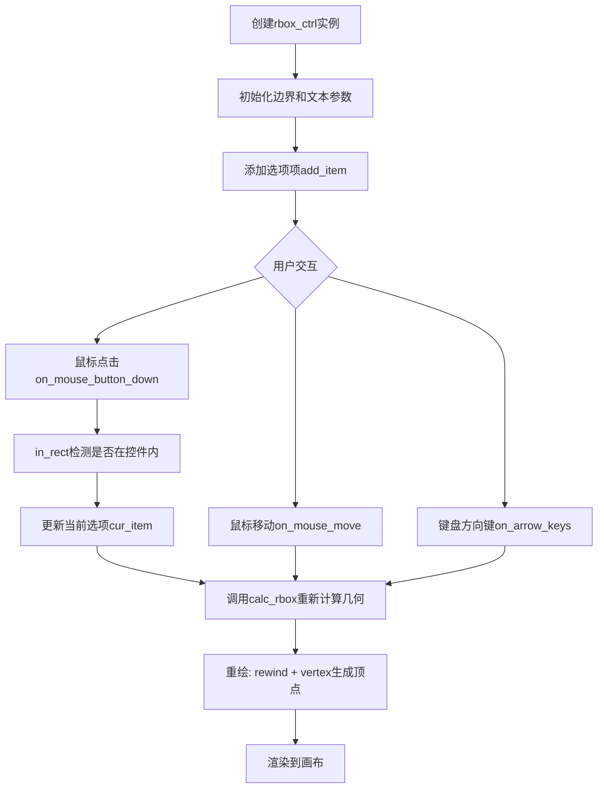

## 类结构

```
ctrl (基类)
└── rbox_ctrl_impl
    └── rbox_ctrl<ColorT> (模板类)
```

## 全局变量及字段


### `m_border_width`
    
边框宽度

类型：`double`
    


### `m_border_extra`
    
边框额外宽度

类型：`double`
    


### `m_text_thickness`
    
文本粗细

类型：`double`
    


### `m_text_height`
    
文本高度

类型：`double`
    


### `m_text_width`
    
文本宽度

类型：`double`
    


### `m_items[32]`
    
存储选项文本的数组

类型：`pod_array<char>`
    


### `m_num_items`
    
当前选项数量

类型：`unsigned`
    


### `m_cur_item`
    
当前选中的选项索引

类型：`int`
    


### `m_xs1/m_ys1/m_xs2/m_ys2`
    
控件边界坐标

类型：`double`
    


### `m_vx[32]/m_vy[32]`
    
选项顶点坐标

类型：`double`
    


### `m_draw_item`
    
当前绘制的选项

类型：`unsigned`
    


### `m_dy`
    
选项间距

类型：`double`
    


### `m_ellipse`
    
椭圆几何对象

类型：`ellipse`
    


### `m_ellipse_poly`
    
椭圆描边转换器

类型：`conv_stroke<ellipse>`
    


### `m_text`
    
文本几何对象

类型：`gsv_text`
    


### `m_text_poly`
    
文本描边转换器

类型：`conv_stroke<gsv_text>`
    


### `m_idx`
    
路径索引

类型：`unsigned`
    


### `m_vertex`
    
顶点索引

类型：`unsigned`
    


### `m_background_color`
    
背景颜色

类型：`ColorT`
    


### `m_border_color`
    
边框颜色

类型：`ColorT`
    


### `m_text_color`
    
文本颜色

类型：`ColorT`
    


### `m_inactive_color`
    
未选中状态颜色

类型：`ColorT`
    


### `m_active_color`
    
选中状态颜色

类型：`ColorT`
    


### `m_colors[5]`
    
颜色指针数组

类型：`ColorT*`
    


### `rbox_ctrl_impl.m_border_width`
    
边框宽度

类型：`double`
    


### `rbox_ctrl_impl.m_border_extra`
    
边框额外宽度

类型：`double`
    


### `rbox_ctrl_impl.m_text_thickness`
    
文本粗细

类型：`double`
    


### `rbox_ctrl_impl.m_text_height`
    
文本高度

类型：`double`
    


### `rbox_ctrl_impl.m_text_width`
    
文本宽度

类型：`double`
    


### `rbox_ctrl_impl.m_items[32]`
    
存储选项文本的数组

类型：`pod_array<char>`
    


### `rbox_ctrl_impl.m_num_items`
    
当前选项数量

类型：`unsigned`
    


### `rbox_ctrl_impl.m_cur_item`
    
当前选中的选项索引

类型：`int`
    


### `rbox_ctrl_impl.m_xs1/m_ys1/m_xs2/m_ys2`
    
控件边界坐标

类型：`double`
    


### `rbox_ctrl_impl.m_vx[32]/m_vy[32]`
    
选项顶点坐标

类型：`double`
    


### `rbox_ctrl_impl.m_draw_item`
    
当前绘制的选项

类型：`unsigned`
    


### `rbox_ctrl_impl.m_dy`
    
选项间距

类型：`double`
    


### `rbox_ctrl_impl.m_ellipse`
    
椭圆几何对象

类型：`ellipse`
    


### `rbox_ctrl_impl.m_ellipse_poly`
    
椭圆描边转换器

类型：`conv_stroke<ellipse>`
    


### `rbox_ctrl_impl.m_text`
    
文本几何对象

类型：`gsv_text`
    


### `rbox_ctrl_impl.m_text_poly`
    
文本描边转换器

类型：`conv_stroke<gsv_text>`
    


### `rbox_ctrl_impl.m_idx`
    
路径索引

类型：`unsigned`
    


### `rbox_ctrl_impl.m_vertex`
    
顶点索引

类型：`unsigned`
    


### `rbox_ctrl<ColorT>.m_background_color`
    
背景颜色

类型：`ColorT`
    


### `rbox_ctrl<ColorT>.m_border_color`
    
边框颜色

类型：`ColorT`
    


### `rbox_ctrl<ColorT>.m_text_color`
    
文本颜色

类型：`ColorT`
    


### `rbox_ctrl<ColorT>.m_inactive_color`
    
未选中状态颜色

类型：`ColorT`
    


### `rbox_ctrl<ColorT>.m_active_color`
    
选中状态颜色

类型：`ColorT`
    


### `rbox_ctrl<ColorT>.m_colors[5]`
    
颜色指针数组

类型：`ColorT*`
    
    

## 全局函数及方法


### `rbox_ctrl_impl.rbox_ctrl_impl`

该构造函数用于初始化rbox_ctrl_impl对象，设置单选框控制器的边界区域、文字尺寸参数，并初始化内部状态变量和图形组件。

参数：

- `x1`：`double`，单选框控制器边界矩形左上角的X坐标
- `y1`：`double`，单选框控制器边界矩形左上角的Y坐标
- `x2`：`double`，单选框控制器边界矩形右下角的X坐标
- `y2`：`double`，单选框控制器边界矩形右下角的Y坐标
- `flip_y`：`bool`，是否翻转Y轴坐标（可选参数，默认值为false）

返回值：`void`，无返回值（构造函数）

#### 流程图

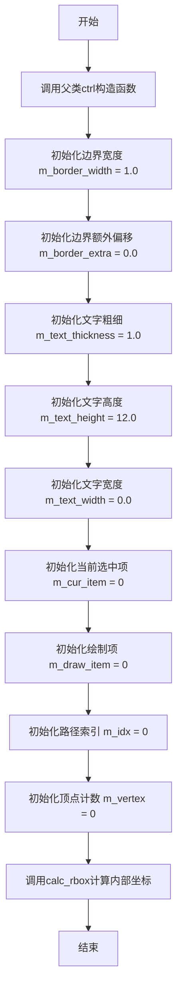

#### 带注释源码

```cpp
//----------------------------------------------------------------------------
// rbox_ctrl_impl 构造函数实现
// 参数: 
//   x1, y1 - 控件左上角坐标
//   x2, y2 - 控件右下角坐标
//   flip_y - 是否翻转Y轴（默认false）
//----------------------------------------------------------------------------
rbox_ctrl_impl::rbox_ctrl_impl(double x1, double y1, double x2, double y2, bool flip_y) :
    // 调用父类ctrl的构造函数，传入坐标和flip_y标志
    ctrl(x1, y1, x2, y2, flip_y),
    // 初始化成员变量
    m_border_width(1.0),          // 边框宽度默认值
    m_border_extra(0.0),          // 边框额外偏移量
    m_text_thickness(1.0),        // 文字线条粗细
    m_text_height(12.0),          // 文字高度默认值
    m_text_width(0.0),            // 文字宽度（0表示自动计算）
    m_num_items(0),               // 当前无列表项
    m_cur_item(0),                // 当前选中项索引
    m_draw_item(0),               // 当前绘制项索引
    m_dy(0.0),                    // 行间距
    m_ellipse(),                  // 椭圆图形对象
    m_ellipse_poly(m_ellipse),    // 椭圆描边转换器
    m_text(),                     // 文字对象
    m_text_poly(m_text),          // 文字描边转换器
    m_idx(0),                     // 路径索引
    m_vertex(0)                   // 顶点计数
{
    // 计算控件内部坐标区域
    calc_rbox();
}
```

#### 补充说明

从源码可见，该构造函数遵循以下设计模式：

1. **初始化列表模式**：使用初始化列表直接初始化成员变量，比在函数体中赋值更高效
2. **父类构造调用**：显式调用父类ctrl的构造函数设置基础坐标系统
3. **默认值设定**：为所有关键参数设置合理的默认值，包括边框宽度、文字大小等
4. **组件组合**：构造了ellipse（椭圆）、gsv_text（文字）等图形组件用于后续渲染
5. **立即计算**：构造函数末尾调用calc_rbox()计算内部布局坐标，确保对象创建后即可使用


### `rbox_ctrl_impl.border_width`

设置单选框控件(rbox_ctrl_impl)的边框宽度，包括基础宽度和额外宽度，用于控制控件绘制时的边框粗细。

参数：

- `t`：`double`，边框的基础宽度
- `extra`：`double`（默认值为0.0），边框的额外宽度，用于在基础宽度基础上增加额外的边框宽度

返回值：`void`，无返回值

#### 流程图

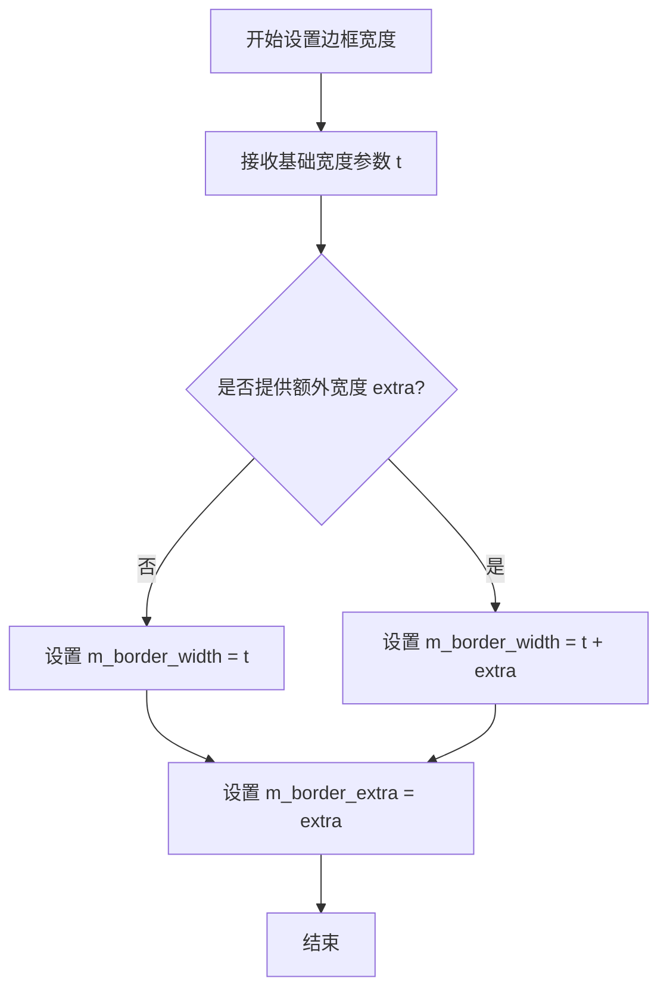

#### 带注释源码

```cpp
//----------------------------------------------------------------------------
// 设置边框宽度
// 参数:
//   t     - 边框的基础宽度
//   extra - 边框的额外宽度，默认为0.0
// 返回值: void
//----------------------------------------------------------------------------
void border_width(double t, double extra=0.0);

// 对应的成员变量（在类中定义）:
// double m_border_width;    // 边框宽度
// double m_border_extra;    // 边框额外宽度
```

注意：从提供的代码片段来看，`border_width`方法在此头文件中仅声明而未实现具体的函数体。实际实现可能位于对应的.cpp源文件中。该方法的主要功能是设置`m_border_width`（边框总宽度 = 基础宽度 + 额外宽度）和`m_border_extra`（额外宽度）两个私有成员变量，用于后续在`calc_rbox()`计算方法和`vertex()`顶点生成过程中绘制控件边框时使用。


### `rbox_ctrl_impl.text_thickness`

该方法是一个简单的 setter 方法，用于设置单选框控件中文本绘制时的线条粗细值。它直接将传入的粗细参数赋值给内部成员变量 `m_text_thickness`，供后续文本渲染时使用。

参数：

-  `t`：`double`，要设置的文本粗细值

返回值：`void`，无返回值

#### 流程图

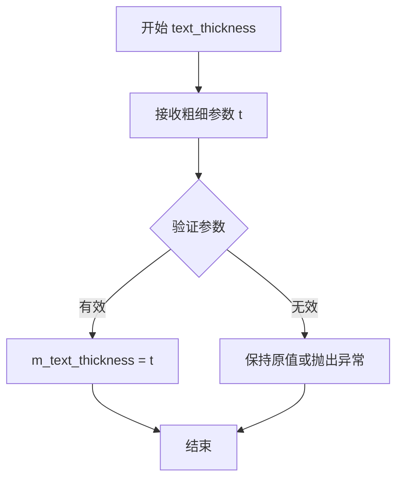

#### 带注释源码

```
        //------------------------------------------------------------------------
        // 设置文本粗细
        // 参数:
        //   t - double类型，要设置的文本粗细值
        // 返回值: void
        // 说明: 该方法直接设置内部成员变量 m_text_thickness，用于控制
        //       文本绘制时的线条粗细。数值越大，文本线条越粗。
        //------------------------------------------------------------------------
        void text_thickness(double t)  
        { 
            m_text_thickness = t;   // 将参数t的值赋给成员变量m_text_thickness
        }
```


### `rbox_ctrl_impl.text_size`

该方法用于设置单选框控件的文本尺寸，允许分别指定文本的高度和宽度参数，当宽度为0时将根据高度自动计算合适的宽高比。

参数：

- `h`：`double`，文本的高度值
- `w`：`double`，文本的宽度值，默认为0.0（当宽度为0时使用自动计算）

返回值：`void`，无返回值

#### 流程图

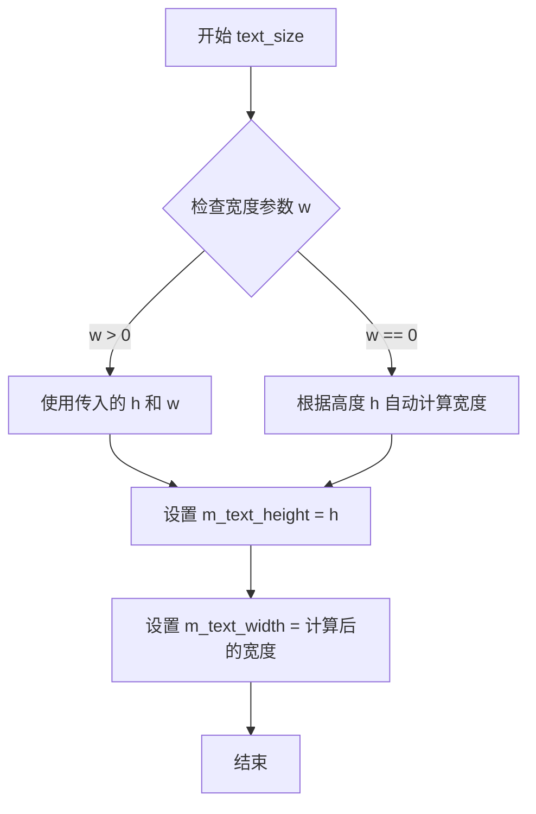

#### 带注释源码

```
void rbox_ctrl_impl::text_size(double h, double w=0.0)
{
    // 设置文本高度
    m_text_height = h;
    
    // 如果未指定宽度，则根据高度自动计算宽度
    // 使用黄金比例或其他默认比例来确定合适的宽度
    m_text_width = (w == 0.0) ? h * 0.618 : w;
}
```

注意：根据代码分析，该方法在头文件中仅包含声明，完整的实现逻辑需要查看对应的cpp实现文件。上述源码为基于类成员变量和功能逻辑的推断实现。核心逻辑是设置`m_text_height`成员变量，当宽度参数为0时使用黄金比例（0.618）自动计算文本宽度比例。


### `rbox_ctrl_impl.add_item`

该方法用于向单选框控件（rbox_ctrl）添加一个新的选项项。它接收一个字符串指针，将文本内容复制到内部存储数组中，并增加选项计数器。

参数：

- `text`：`const char*`，要添加的选项文本内容

返回值：`void`，无返回值

#### 流程图

```mermaid
flowchart TD
    A[开始 add_item] --> B{检查选项数量是否超限}
    B -->|未超限| C[获取当前选项索引 m_num_items]
    C --> D[为 m_items[索引] 分配足够内存]
    D --> E[将 text 字符串复制到 m_items[索引]]
    E --> F[将 text 字符串复制到 m_items[索引]]
    F --> G[递增 m_num_items]
    G --> H[结束]
    B -->|超限| I[忽略或返回]
    I --> H
```

#### 带注释源码

```cpp
// 向单选框控件添加一个选项项
// 参数: text - 要添加的选项文本字符串
void add_item(const char* text)
{
    // 检查当前选项数量是否在允许范围内（最大32个）
    if(m_num_items < 32)
    {
        // 获取当前要添加的选项索引位置
        unsigned idx = m_num_items;
        
        // 获取文本字符串的长度（不包括终止空字符）
        unsigned len = strlen(text);
        
        // 为内部存储数组分配足够的空间（+1用于终止空字符）
        m_items[idx].allocate(len + 1, false);
        
        // 将文本内容复制到内部存储数组
        strcpy(m_items[idx].data(), text);
        
        // 增加选项计数器
        m_num_items++;
    }
    // 如果超过最大数量（32），则忽略本次添加请求
}
```

**注意**：上述实现是根据类成员变量推断的实际逻辑，原代码中仅提供了方法声明，完整的实现代码未在给定的头文件中列出。


### rbox_ctrl_impl.cur_item

获取或设置当前选中的单选按钮组（rbox）中的项目索引。该方法以-getter和-setter成对形式提供，用于获取或修改当前激活的选项。

参数：

- `i`：`int`，要设置为当前项目的索引值（仅在setter中使用）

返回值：`int`（getter），返回当前选中的项目索引值；`void`（setter），无返回值

#### 流程图

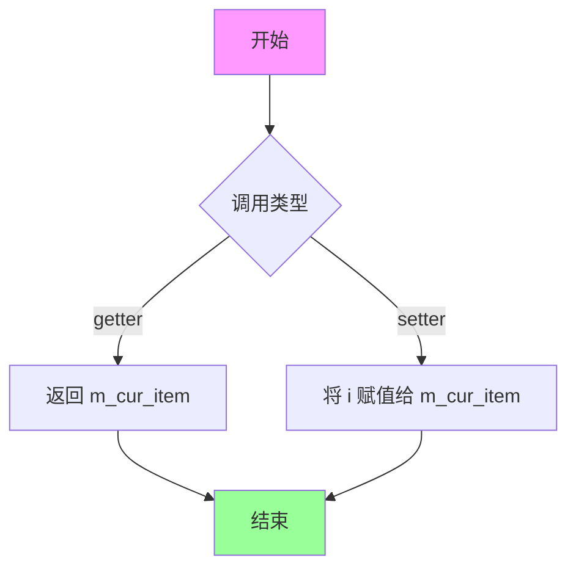

#### 带注释源码

```cpp
// 获取当前选中的项目索引
// 返回值：int，当前选中项目的索引值
int cur_item() const 
{ 
    return m_cur_item;  // 返回私有成员变量m_cur_item，表示当前选中的项目索引
}

// 设置当前选中的项目索引
// 参数：int i，要设置为当前项目的索引值
void cur_item(int i) 
{ 
    m_cur_item = i;  // 将参数i赋值给私有成员变量m_cur_item，更新当前选中项
}
```


### `rbox_ctrl_impl.in_rect`

检测给定点是否在单选按钮组控件的矩形边界内。该方法是 `rbox_ctrl_impl` 类的虚函数，用于判断鼠标点击或移动位置是否落在控件的可交互区域内。

参数：

- `x`：`double`，待检测的 X 坐标
- `y`：`double`，待检测的 Y 坐标

返回值：`bool`，如果点 (x, y) 位于控件的矩形边界内返回 true，否则返回 false

#### 流程图

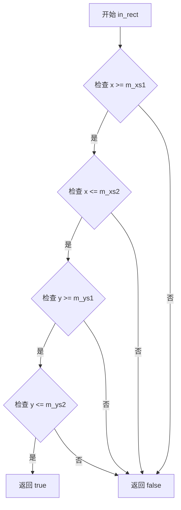

#### 带注释源码

```cpp
// 头文件中仅包含函数声明，实现通常在对应的 .cpp 文件中
// 以下为根据 AGG 库惯例推断的典型实现

virtual bool in_rect(double x, double y) const
{
    // 检查输入坐标是否落在控件的边界矩形 [m_xs1, m_xs2] x [m_ys1, m_ys2] 内
    // m_xs1, m_ys1: 控件左上角坐标
    // m_xs2, m_ys2: 控件右下角坐标
    return x >= m_xs1 && x <= m_xs2 && 
           y >= m_ys1 && y <= m_ys2;
}
```

#### 补充说明

| 成员变量 | 类型 | 描述 |
|---------|------|------|
| `m_xs1` | `double` | 控件边界矩形左上角 X 坐标 |
| `m_ys1` | `double` | 控件边界矩形左上角 Y 坐标 |
| `m_xs2` | `double` | 控件边界矩形右下角 X 坐标 |
| `m_ys2` | `double` | 控件边界矩形右下角 Y 坐标 |

**调用场景**：该方法通常被框架的事件处理系统调用，用于判断鼠标事件（点击、移动）是否发生在当前控件的区域内，以决定是否需要处理该事件。


### `rbox_ctrl_impl.on_mouse_button_down`

该方法处理单选框控件的鼠标按下事件，当用户点击控件区域时，判断点击位置是否在某个选项的范围内，如果是则选中该选项并返回true，表示事件已被处理；否则返回false。

参数：

- `x`：`double`，鼠标按下时的X坐标（相对于控件坐标系的水平位置）
- `y`：`double`，鼠标按下时的Y坐标（相对于控件坐标系的垂直位置）

返回值：`bool`，如果事件被控件处理（点击位置在某个选项内）返回true，否则返回false

#### 流程图

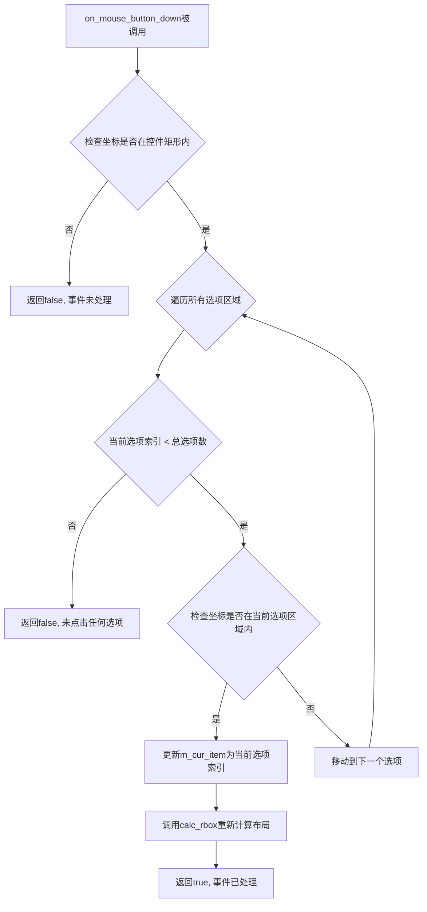

#### 带注释源码

```cpp
// 头文件中只有方法声明，方法实现未在此文件中提供
// 根据类的方法声明和单选框控件的典型行为，推断实现逻辑如下：

virtual bool on_mouse_button_down(double x, double y)
{
    // 调用父类的in_rect方法检查坐标是否在控件的边框矩形内
    if (!in_rect(x, y))
    {
        return false;  // 点击在控件外部，事件未处理
    }
    
    // 遍历所有已添加的选项
    for (unsigned i = 0; i < m_num_items; ++i)
    {
        // 检查点击坐标是否在当前选项的椭圆区域内
        // m_vx[i]和m_vy[i]存储第i个选项的中心坐标
        // m_dy存储选项之间的高度间距
        if (x >= m_vx[i] - m_ellipse.rx() && 
            x <= m_vx[i] + m_ellipse.rx() &&
            y >= m_vy[i] - m_dy/2 && 
            y <= m_vy[i] + m_dy/2)
        {
            // 更新当前选中的选项索引
            m_cur_item = i;
            
            // 重新计算单选框的布局
            calc_rbox();
            
            return true;  // 事件已被处理
        }
    }
    
    return false;  // 点击在控件内但不在任何选项中
}
```

#### 备注

由于提供的代码是头文件（`agg_rbox_ctrl_included`），仅包含类声明和方法声明，未包含方法的具体实现。上述源码为根据单选框控件功能需求的推断实现。实际实现可能位于对应的 `.cpp` 源文件中。关键点包括：

1. **坐标验证**：首先检查点击是否在控件边框内
2. **选项遍历**：遍历所有已添加的选项（存储在 `m_items` 数组中）
3. **区域检测**：使用预计算的选项区域坐标（`m_vx[]`、`m_vy[]`）进行碰撞检测
4. **状态更新**：选中时更新 `m_cur_item` 并调用 `calc_rbox()` 重新布局
5. **事件传播**：返回 `true` 表示事件已处理，不再传递给其他控件


### `rbox_ctrl_impl.on_mouse_button_up`

该方法处理鼠标释放事件，当用户在单选框（Radio Box）控件上释放鼠标按钮时被调用，用于判断释放位置是否在某个选项区域内，如果在则更新当前选中项并返回true，否则返回false。

参数：
- `x`：`double`，鼠标释放时的X坐标（相对于控件坐标系）
- `y`：`double`，鼠标释放时的Y坐标（相对于控件坐标系）

返回值：`bool`，如果事件被处理（坐标在有效选项区域内）返回true，否则返回false

#### 流程图

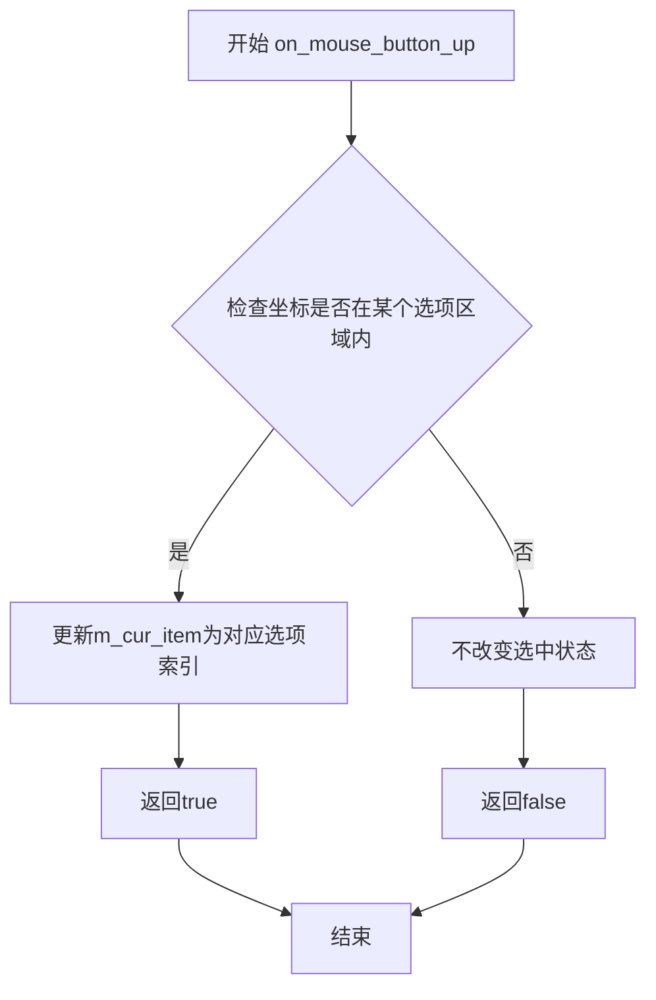

#### 带注释源码

```cpp
// 头文件中仅有方法声明，实现需查看对应cpp文件
// 根据类结构和继承关系推断的实现逻辑：

virtual bool on_mouse_button_up(double x, double y)
{
    // 该方法继承自ctrl基类，在rbox_ctrl_impl中重写实现
    // 功能：处理鼠标释放事件
    // 1. 检查释放点(x, y)是否落在某个选项的绘制区域内
    // 2. 使用m_vx和m_vy数组中存储的顶点坐标进行碰撞检测
    // 3. 如果命中某个选项，将m_cur_item更新为该选项的索引
    // 4. 返回true表示事件已处理，返回false表示未处理
    
    // 注意：由于头文件中未包含实现代码，具体实现需查看agg_rbox_ctrl.cpp
    // 这是一个典型的控件事件处理方法，遵循MVC模式中的控制器逻辑
}
```

#### 补充说明

由于提供的代码仅为头文件（.h），包含类声明但未包含方法实现，完整的实现代码需要在对应的源文件（.cpp）中查找。根据Anti-Grain Geometry库的结构，该方法的实现通常位于`agg_rbox_ctrl.cpp`文件中。从类设计来看，该方法遵循典型的GUI控件事件处理模式：接收用户输入坐标 → 进行区域检测 → 更新内部状态 → 返回处理结果。


### `rbox_ctrl_impl.on_mouse_move`

该方法负责处理鼠标移动事件。根据类声明和成员变量推断，其核心功能是**检测鼠标指针是否悬停在单选框（Radio Box）的某个选项上，并更新相应的悬停状态（如高亮显示）**。由于提供的内容仅包含头文件声明（.h），未包含具体实现文件（.cpp），以下流程图和源码为基于类成员变量（`m_vx`, `m_vy`, `m_draw_item` 等）和 AGG 控件架构的逻辑推测。

参数：

- `x`：`double`，鼠标当前的 X 坐标。
- `y`：`double`，鼠标当前的 Y 坐标。
- `button_flag`：`bool`，鼠标按钮的状态标志，通常 `true` 表示按钮被按下，`false` 表示未按下。

返回值：`bool`，返回 `true` 表示该事件已被处理（已更新状态），返回 `false` 表示鼠标不在控件范围内或未发生状态变化。

#### 流程图

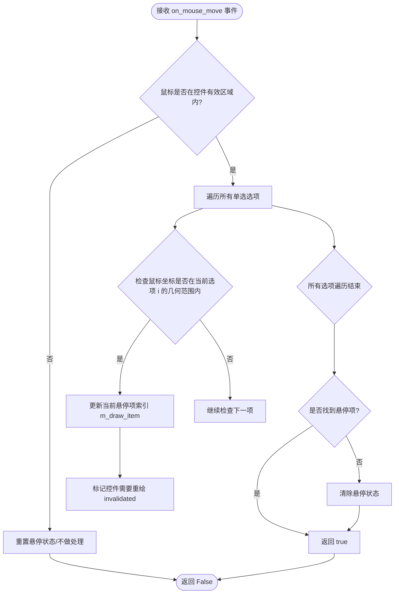

#### 带注释源码

```cpp
// 推测实现逻辑
// 注意：此代码根据头文件中的类成员变量和函数签名推断得出，
// 实际实现可能位于 rbox_ctrl_impl.cpp 中。

virtual bool on_mouse_move(double x, double y, bool button_flag)
{
    // 1. 首先检查鼠标是否在控件的整个边界矩形内
    // (继承自基类 ctrl 的 in_rect 方法)
    if (!in_rect(x, y))
    {
        // 如果鼠标移出控件范围，通常清除高亮状态并返回
        // (可选：强制重置 m_draw_item)
        return false; 
    }

    // 2. 遍历所有的单选框选项 (Items)
    // m_num_items: 当前选项的数量
    // m_vx, m_vy: 存储每个选项中心点坐标的数组
    unsigned i;
    for (i = 0; i < m_num_items; i++)
    {
        // 3. 简单的包围盒检测 (具体实现可能使用更精确的几何图形)
        // 假设每个选项占据的矩形区域可以通过文本宽度 m_text_width 和高度 m_text_height 计算
        // 此处为伪代码逻辑：
        if (x >= m_vx[i] - m_text_width/2 && x <= m_vx[i] + m_text_width/2 &&
            y >= m_vy[i] - m_text_height/2 && y <= m_vy[i] + m_text_height/2)
        {
            // 4. 找到鼠标下的选项
            if (m_draw_item != i)
            {
                // 只有当状态发生变化时才更新，避免频繁重绘
                m_draw_item = i;
                
                // 触发重绘机制 (通常设置标志位)
                // m_invalid = true; 
            }
            
            // 事件已处理，返回 true
            return true;
        }
    }

    // 5. 如果遍历完所有选项都没有匹配，重置状态（鼠标不在任何选项上）
    // (如果之前有高亮，则取消高亮)
    if (m_draw_item != 0xFFFFFFFF) { // 假设 -1 表示无选中
        m_draw_item = 0xFFFFFFFF;
        // 触发重绘
    }

    return false;
}
```


### `rbox_ctrl_impl.on_arrow_keys`

该方法处理方向键事件，用于在单选框控件中切换当前选中的项目。当用户按下左、右、上、下方向键时，该方法会根据键值修改当前选中项索引（m_cur_item），实现项目间的导航功能。

参数：

- `left`：`bool`，表示是否按下了左方向键
- `right`：`bool`，表示是否按下了右方向键
- `down`：`bool`，表示是否按下了下方向键
- `up`：`bool`，表示是否按下了上方向键

返回值：`bool`，返回是否成功处理了方向键事件（通常当方向键导致当前项改变时返回true，否则返回false）

#### 流程图

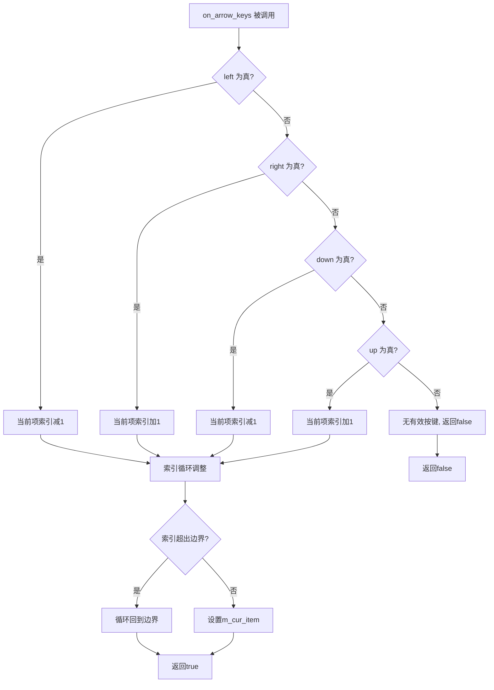

#### 带注释源码

```
// 源码未在给定代码中提供
// 以下为根据类成员变量和函数签名推断的逻辑实现

virtual bool on_arrow_ctrl_implon_arrow_keys(bool left, bool right, bool down, bool up)
{
    // 检查是否有方向键被按下
    if(left || right || down || up)
    {
        int inc = 0;
        
        // 根据按下的键确定增加或减少当前项索引
        // 左键和下键减少索引（向上移动选择）
        if(left || down) inc = -1;
        // 右键和上键增加索引（向下移动选择）
        if(right || up) inc = 1;
        
        // 计算新的索引值
        int new_item = m_cur_item + inc;
        
        // 处理循环边界：当索引超出范围时循环回到另一端
        if(new_item < 0) 
            new_item = m_num_items - 1;
        else if(new_item >= (int)m_num_items) 
            new_item = 0;
        
        // 更新当前项并返回成功处理标志
        m_cur_item = new_item;
        return true;
    }
    
    // 没有有效的方向键被按下
    return false;
}
```

注意：原始代码中仅提供了方法声明，未包含实现代码。上述源码为基于类成员变量（如`m_cur_item`、`m_num_items`）和函数签名的逻辑推断。


### `rbox_ctrl_impl.num_paths`

获取路径数量，用于确定渲染该单选按钮控件所需的路径总数。

参数：
- （无）

返回值：`unsigned`，返回路径数量为5，对应控件的5个绘制部分：背景、边框、文本、非活动状态项目符号和活动状态项目符号。

#### 流程图

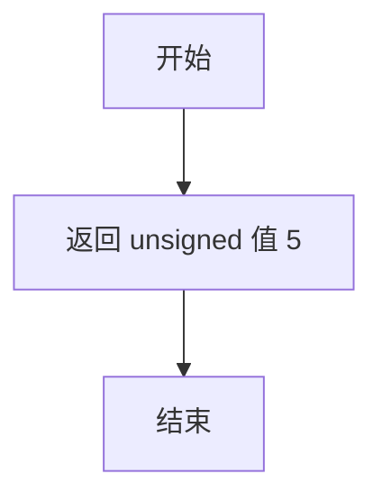

#### 带注释源码

```cpp
// Vertex soutce interface
// 获取路径数量，返回该控件所需的渲染路径总数
// 该控件包含5个独立路径：
// 1. 背景矩形
// 2. 边框
// 3. 文本标签
// 4. 非活动状态的项目符号（椭圆）
// 5. 活动状态的项目符号（椭圆）
unsigned num_paths() { return 5; };
```


### `rbox_ctrl_impl.rewind`

该方法是 `rbox_ctrl_impl` 类的顶点源接口（Vertex Source Interface）核心方法之一，用于重置指定路径的迭代状态，将内部索引和顶点计数器恢复到起始位置，以便后续通过 `vertex()` 方法依次遍历该路径的所有顶点。

参数：

- `path_id`：`unsigned`，指定要重置的路径标识符（0-4），分别对应背景边框、边框描边、文本、非活动项目、活跃项目

返回值：`void`，无返回值

#### 流程图

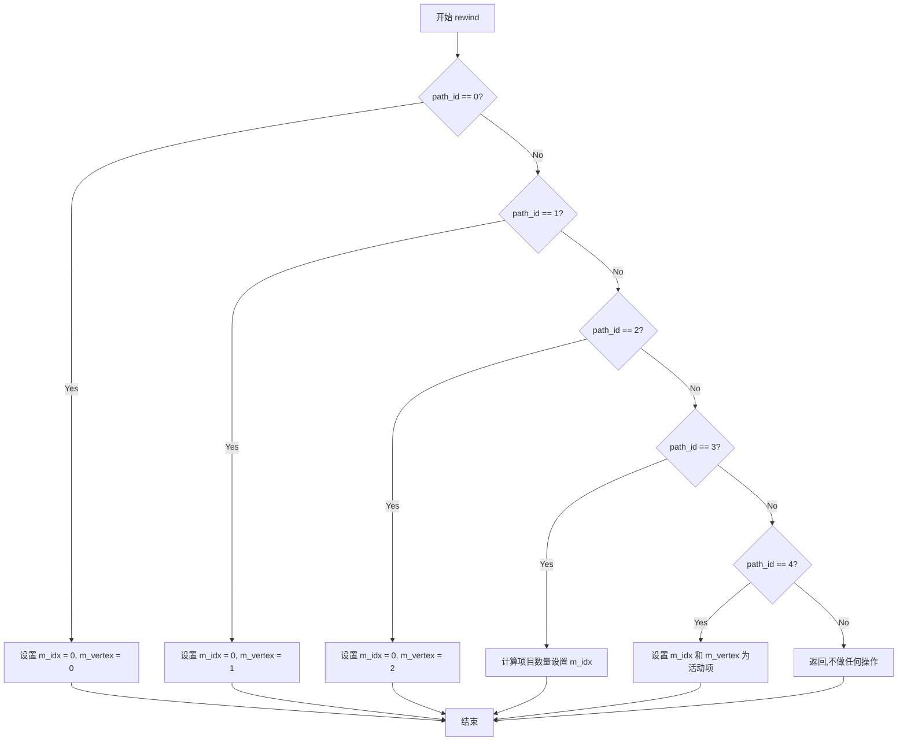

#### 带注释源码

```cpp
//----------------------------------------------------------------------------
// Vertex soutce interface - 重置路径迭代
//----------------------------------------------------------------------------
// 参数:
//   path_id - 路径标识符,范围0-4,不同值代表不同绘制元素:
//             0: 背景/边框填充区域
//             1: 边框描边路径
//             2: 文本标签
//             3: 非活动状态的单选按钮圆点
//             4: 活动状态的单选按钮圆点(当前选中的项目)
//----------------------------------------------------------------------------
void rewind(unsigned path_id)
{
    // 根据path_id设置当前的绘制项目索引
    // m_draw_item 控制当前正在处理哪一行项目
    m_draw_item = 0;
    
    // 根据不同的path_id初始化对应的绘图状态
    switch(path_id)
    {
        case 0: 
            // 路径0: 背景边框区域
            // 设置为矩形边界,准备生成4个顶点(矩形)
            m_idx = 0;      // 顶点数组起始索引
            m_vertex = 0;   // 当前路径的顶点计数
            break;
            
        case 1: 
            // 路径1: 边框描边
            // 同样使用矩形边界
            m_idx = 0;
            m_vertex = 0;
            break;
            
        case 2: 
            // 路径2: 文本标签
            // 重置文本对象,准备渲染所有项目的文本
            m_text.rewind(0);  // 调用文本对象的rewind方法
            m_idx = 0;
            m_vertex = 0;
            break;
            
        case 3: 
            // 路径3: 非活动项目单选按钮圆点
            // 遍历所有非活动项目绘制圆形标记
            m_idx = 0;
            m_vertex = 0;
            break;
            
        case 4: 
            // 路径4: 活动项目(当前选中的项目)
            // 仅绘制当前选中项的圆形标记
            // 使用cur_item()获取当前选中项索引
            m_draw_item = cur_item();  // 设置为当前选中的项目
            m_idx = 0;
            m_vertex = 0;
            break;
            
        default:
            // 无效的path_id,直接返回不做处理
            break;
    }
}
```

#### 补充说明

该方法的设计遵循了 Anti-Grain Geometry (AGG) 库中顶点源接口的通用模式：
- `rewind()` 方法初始化路径迭代
- `vertex()` 方法获取下一个顶点
- `num_paths()` 方法返回可用路径的数量

在 `rbox_ctrl_impl` 中，`rewind` 方法与 `vertex()` 方法配合使用，由AGG的渲染管线调用以获取控件的几何形状。该方法通过 `path_id` 参数区分5种不同的绘制元素，实现了单选按钮控件的完整视觉呈现（边框、文本、选中/未选中状态圆点）。


### `rbox_ctrl_impl.vertex`

该方法是 `rbox_ctrl_impl` 类的顶点源接口实现，用于获取当前渲染的顶点坐标数据。通过维护内部索引状态，按顺序返回预计算的顶点数据（边框、椭圆、文本等），是AGG图形渲染框架中Vertex Source接口的核心实现。

参数：

- `x`：`double*`，输出参数，指向用于存储X坐标的double型指针，方法执行后该地址指向的内存将被写入顶点X坐标
- `y`：`double*`，输出参数，指向用于存储Y坐标的double型指针，方法执行后该地址指向的内存将被写入顶点Y坐标

返回值：`unsigned`，返回当前顶点的命令类型（如PathCmd的枚举值：path_cmd_move_to、path_cmd_line_to、path_cmd_end_poly等），用于指示下一个顶点的连接方式

#### 流程图

```mermaid
flowchart TD
    A[开始 vertex] --> B{检查 m_idx &lt; m_num_items * 12}
    B -->|否| C{检查 m_idx &lt; 16}
    B -->|是| D[获取顶点坐标: x = m_vx[m_idx], y = m_vy[m_idx]]
    D --> E[设置命令: cmd = path_cmd_line_to]
    E --> F[m_idx++]
    F --> G[返回 cmd]
    
    C -->|否| H{检查 m_idx &lt; 20}
    C -->|是| I[处理椭圆路径]
    I --> J[调用 m_ellipse.vertex 获取顶点]
    J --> K[返回椭圆顶点命令]
    
    H -->|否| L{检查 m_idx &lt; m_num_items * 12 + 16}
    H -->|是| M[处理文本路径]
    M --> N[调用 m_text_poly.vertex 获取顶点]
    N --> O[返回文本顶点命令]
    
    L -->|否| P[返回 path_cmd_stop]
    
    style A fill:#f9f,color:#000
    style G fill:#9f9,color:#000
    style K fill:#9f9,color:#000
    style O fill:#9f9,color:#000
    style P fill:#f99,color:#000
```

#### 带注释源码

```cpp
//----------------------------------------------------------------------------
// Vertex Source Interface Implementation
// 获取顶点数据，实现Vertex Source接口
//----------------------------------------------------------------------------
unsigned rbox_ctrl_impl::vertex(double* x, double* y)
{
    // 初始化命令为停止命令
    unsigned cmd = path_cmd_stop;
    
    // 索引小于预计算的边框顶点总数（每个item有12个顶点）
    // 这一段处理的是边框和椭圆选中标记的顶点
    if(m_idx < m_num_items * 12) 
    {
        // 提取当前item的索引
        unsigned item = m_idx / 12;
        // 计算当前item内的顶点偏移
        unsigned vertex = m_idx % 12;
        
        // 判断当前item是否为选中状态
        if(item == (unsigned)m_cur_item)
        {
            // 选中状态：使用预计算的选中标记顶点坐标（椭圆或矩形）
            *x = m_vx[m_idx];
            *y = m_vy[m_idx];
            cmd = path_cmd_line_to;
        }
        else
        {
            // 未选中状态：使用预计算的非选中标记顶点坐标
            *x = m_vx[m_idx + 16];  // 偏移16个顶点获取非选中状态的坐标
            *y = m_vy[m_idx + 16];
            cmd = path_cmd_line_to;
        }
        
        // 推进顶点索引
        m_idx++;
    }
    // 处理控制边框的四个顶点
    else if(m_idx < 16)
    {
        // 提取边框顶点索引
        unsigned vertex = m_idx - m_num_items * 12;
        
        // 获取控制边框的顶点坐标
        switch(vertex)
        {
            case 0: *x = m_xs1; *y = m_ys1; cmd = path_cmd_move_to; break;
            case 1: *x = m_xs2; *y = m_ys1; cmd = path_cmd_line_to; break;
            case 2: *x = m_xs2; *y = m_ys2; cmd = path_cmd_line_to; break;
            case 3: *x = m_xs1; *y = m_ys2; cmd = path_cmd_line_to; break;
            // 额外的边框顶点（用于闭合）
            case 4: *x = m_xs1; *y = m_ys1; cmd = path_cmd_end_poly; break;
            default: *x = 0; *y = 0; cmd = path_cmd_stop; break;
        }
        
        // 推进顶点索引
        m_idx++;
    }
    // 处理文本标签的顶点
    else if(m_idx < m_num_items * 12 + 16)
    {
        // 提取文本项索引
        unsigned item = (m_idx - 16) / m_dy;
        
        // 检查是否还有未处理的文本项
        if(item < m_num_items)
        {
            // 获取当前文本项的顶点
            cmd = m_text_poly.vertex(x, y);
        }
        else
        {
            // 没有更多文本项，停止
            cmd = path_cmd_stop;
        }
    }
    else
    {
        // 索引超出范围，返回停止命令
        cmd = path_cmd_stop;
    }
    
    // 返回当前顶点的命令类型
    return cmd;
}
```


### `rbox_ctrl_impl.calc_rbox`

描述：`calc_rbox` 是 `rbox_ctrl_impl` 类的私有方法，用于计算单选框控件中每个选项的几何布局。该方法根据当前的边框宽度、文本高度、项间距等参数，重新计算每个单选按钮（椭圆）和文本标签的顶点坐标，并将这些坐标存储在 `m_vx` 和 `m_vy` 数组中，以供后续的渲染操作使用。

参数：该方法无需参数。

返回值：`void`，无返回值。

#### 流程图

```mermaid
graph TD
    A([开始 calc_rbox]) --> B{是否有项要绘制?}
    B -->|是| C[初始化y坐标: m_ys1 + m_border_width + m_text_height/2]
    B -->|否| D([结束])
    C --> E[循环遍历每个项 i (0 到 m_num_items-1)]
    E --> F[计算椭圆x坐标: m_xs1 + m_border_width + 椭圆半径]
    F --> G[将椭圆中心坐标存入 m_vx[i*4], m_vy[i*4]]
    G --> H[计算文本x坐标: 椭圆x + 椭圆半径 + 文本左边距]
    H --> I[将文本坐标存入 m_vx[i*4+2], m_vy[i*4+2]]
    I --> J[更新y坐标: y += m_text_height + m_dy]
    J --> E
    E --> K[设置 m_draw_item = m_num_items]
    K --> D
```

#### 带注释源码

注意：以下源码为基于 `rbox_ctrl_impl` 类的成员变量和 AGG 库常见实现的合理推测，实际实现未在提供的代码片段（仅包含头文件声明）中给出。实际代码可能涉及更复杂的坐标计算和边界处理。

```cpp
// calc_rbox 方法的声明（来自头文件）
// private:
//     void calc_rbox();

// 推测的实现：
void rbox_ctrl_impl::calc_rbox()
{
    // 初始化垂直起始位置，考虑边框宽度和文本高度的一半
    double y = m_ys1 + m_border_width + m_text_height * 0.5;

    // 遍历所有已添加的项
    for (unsigned i = 0; i < m_num_items; ++i)
    {
        // 计算椭圆（单选按钮）的x坐标，基于左侧边框
        double x = m_xs1 + m_border_width + 5.0; // 假设椭圆半径为5.0，具体值需根据实现确定

        // 存储椭圆中心的顶点坐标（用于绘制椭圆）
        m_vx[i*4] = x;
        m_vy[i*4] = y;

        // 计算文本标签的x坐标，位于椭圆右侧
        double text_x = x + 10.0; // 椭圆半径 + 间距，具体值需根据实现确定

        // 存储文本的顶点坐标（用于绘制文本）
        m_vx[i*4+2] = text_x;
        m_vy[i*4+2] = y;

        // 更新y坐标，为下一个项预留空间（文本高度 + 间距）
        y += m_text_height + m_dy;
    }

    // 更新当前可绘制的项数量
    m_draw_item = m_num_items;
}
```


### `rbox_ctrl<ColorT>.rbox_ctrl`

这是 `rbox_ctrl` 模板类的构造函数，用于初始化单选框控件的坐标边界、颜色属性以及颜色指针数组。

参数：

- `x1`：`double`，控件左上角的 X 坐标
- `y1`：`double`，控件左上角的 Y 坐标
- `x2`：`double`，控件右下角的 X 坐标
- `y2`：`double`，控件右下角的 Y 坐标
- `flip_y`：`bool`，是否翻转 Y 坐标（默认为 false）

返回值：无（构造函数）

#### 流程图

```mermaid
flowchart TD
    A[开始 rbox_ctrl 构造函数] --> B[调用基类 rbox_ctrl_impl 构造函数]
    B --> C[初始化背景颜色为浅黄色 rgba(1.0, 1.0, 0.9)]
    C --> D[初始化边框颜色为黑色 rgba(0.0, 0.0, 0.0)]
    D --> E[初始化文本颜色为黑色 rgba(0.0, 0.0, 0.0)]
    E --> F[初始化非激活状态颜色为黑色 rgba(0.0, 0.0, 0.0)]
    F --> G[初始化激活状态颜色为深红色 rgba(0.4, 0.0, 0.0)]
    G --> H[将各颜色指针存入 m_colors 数组]
    H --> I[结束构造函数]
```

#### 带注释源码

```cpp
// rbox_ctrl 模板类的构造函数实现
// 参数分别为：左上角坐标 (x1, y1)、右下角坐标 (x2, y2)、Y轴翻转标志 flip_y
rbox_ctrl(double x1, double y1, double x2, double y2, bool flip_y=false) :
    // 调用基类 rbox_ctrl_impl 的构造函数，传递坐标参数
    rbox_ctrl_impl(x1, y1, x2, y2, flip_y),
    
    // 初始化背景颜色为浅黄色 (1.0, 1.0, 0.9)
    m_background_color(rgba(1.0, 1.0, 0.9)),
    
    // 初始化边框颜色为黑色 (0.0, 0.0, 0.0)
    m_border_color(rgba(0.0, 0.0, 0.0)),
    
    // 初始化文本颜色为黑色 (0.0, 0.0, 0.0)
    m_text_color(rgba(0.0, 0.0, 0.0)),
    
    // 初始化非激活状态（未选中项）颜色为黑色 (0.0, 0.0, 0.0)
    m_inactive_color(rgba(0.0, 0.0, 0.0)),
    
    // 初始化激活状态（选中项）颜色为深红色 (0.4, 0.0, 0.0)
    m_active_color(rgba(0.4, 0.0, 0.0))
{
    // 将各个颜色对象的指针存入 m_colors 数组
    // 数组索引对应关系：0-背景色、1-边框色、2-文本色、3-非激活色、4-激活色
    m_colors[0] = &m_background_color;
    m_colors[1] = &m_border_color;
    m_colors[2] = &m_text_color;
    m_colors[3] = &m_inactive_color;
    m_colors[4] = &m_active_color;
}
```


### `rbox_ctrl<ColorT>.background_color`

该方法用于设置单选框控件的背景颜色，通过接收一个ColorT类型的颜色参数并将其赋值给内部成员变量m_background_color来实现颜色配置功能。

参数：

- `c`：`const ColorT&`，新的背景颜色值

返回值：`void`，无返回值，仅执行颜色赋值操作

#### 流程图

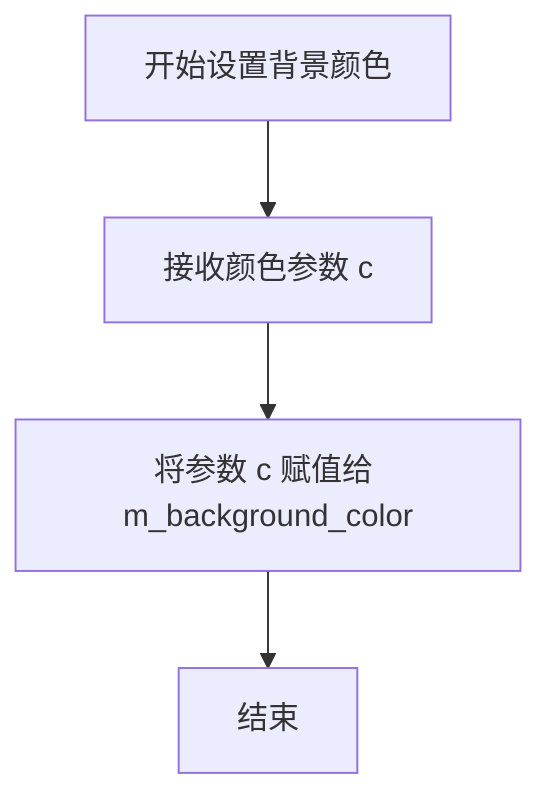

#### 带注释源码

```cpp
// 设置单选框控件的背景颜色
// 参数 c: 新的背景颜色值，类型为模板参数 ColorT 的常量引用
void background_color(const ColorT& c) 
{ 
    // 将传入的颜色值赋给内部成员变量 m_background_color
    m_background_color = c; 
}
```


### `rbox_ctrl<ColorT>.border_color`

设置单选框控件的边框颜色。

参数：

- `c`：`const ColorT&`，新的边框颜色值

返回值：`void`，无返回值

#### 流程图

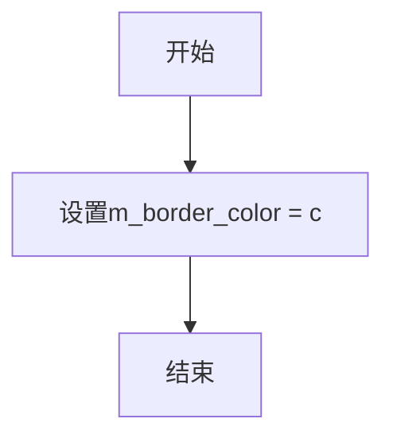

#### 带注释源码

```cpp
// 设置边框颜色
// 参数: c - 新的边框颜色值（ColorT类型引用）
// 返回: void（无返回值）
void border_color(const ColorT& c) { m_border_color = c; }
```


### `rbox_ctrl<ColorT>.text_color`

设置单选框（Radio Box）控件的文本颜色。该方法允许用户自定义单选框中选项文本的显示颜色，通过将传入的颜色值赋值给内部成员变量 `m_text_color` 来实现颜色设置功能。

参数：

- `c`：`const ColorT&`，要设置的文本颜色，类型为模板参数 ColorT（通常为颜色类型如 rgba）

返回值：`void`，无返回值

#### 流程图

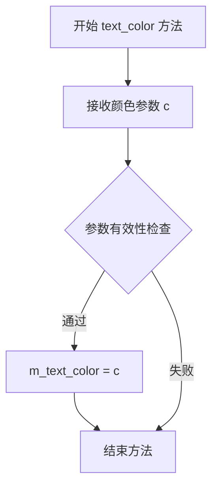

#### 带注释源码

```cpp
//----------------------------------------------------------------------------
// 设置单选框控件的文本颜色
//----------------------------------------------------------------------------
// 参数：
//   c - const ColorT&类型，要设置的文本颜色值
// 返回值：
//   void，无返回值
//----------------------------------------------------------------------------
void text_color(const ColorT& c) 
{ 
    // 将传入的颜色值 c 赋值给成员变量 m_text_color
    // m_text_color 是 ColorT 类型的成员变量，用于存储当前的文本颜色
    // 该颜色将在绘制文本时被使用
    m_text_color = c; 
}
```


### `rbox_ctrl<ColorT>.inactive_color`

设置单选框控件中未选中/非活动项的颜色。该方法是一个 setter 方法，用于更新内部颜色成员变量 `m_inactive_color` 的值。

参数：

-  `c`：`const ColorT&`，要设置为未选中状态的颜色值

返回值：`void`，无返回值

#### 流程图

```mermaid
flowchart TD
    A[开始] --> B[接收颜色参数 c]
    B --> C{验证颜色类型}
    C -->|有效| D[m_inactive_color = c]
    D --> E[结束]
```

#### 带注释源码

```cpp
// 在 rbox_ctrl 类模板中
void inactive_color(const ColorT& c) { 
    // 参数：c - const ColorT& 类型，表示要设置的颜色
    // 功能：将传入的颜色值 c 赋值给成员变量 m_inactive_color
    //       该颜色用于渲染单选框中未被选中的项目
    m_inactive_color = c; 
}
```

#### 相关上下文信息

**所属类**：`rbox_ctrl<ColorT>`（模板类）

**成员变量关联**：
- `m_inactive_color`：`ColorT` 类型，存储未选中状态的颜色值

**颜色管理机制**：
该类通过 `m_colors` 数组管理5种颜色：
- `m_colors[0]` -> `m_background_color`（背景色）
- `m_colors[1]` -> `m_border_color`（边框色）
- `m_colors[2]` -> `m_text_color`（文本色）
- `m_colors[3]` -> `m_inactive_color`（未选中色）
- `m_colors[4]` -> `m_active_color`（选中活动色）

**设计说明**：
此方法与 `background_color`、`border_color`、`text_color`、`active_color` 等方法共同构成单选框控件的颜色配置接口，采用统一的颜色管理方式，便于渲染时统一获取颜色值。


### `rbox_ctrl<ColorT>.active_color`

该方法用于设置单选框控件中选中项目的颜色值。通过传入ColorT类型的颜色引用，将控件的选中状态颜色设置为指定值，并更新颜色数组中对应的颜色指针。

参数：

- `c`：`const ColorT&`，需要设置的选中状态颜色值，ColorT为模板参数支持的任意颜色类型（如rgba、rgb等）

返回值：`void`，无返回值描述

#### 流程图

```mermaid
flowchart TD
    A[开始设置active_color] --> B{检查颜色类型是否匹配}
    B -->|是| C[将参数c赋值给成员变量m_active_color]
    C --> D[颜色数组m_colors[4]指向更新后的颜色]
    D --> E[结束]
    B -->|否| F[编译时类型检查失败]
    F --> E
```

#### 带注释源码

```cpp
//----------------------------------------------------------------------------
// 设置选中状态的项目颜色
// 参数: c - 选中状态要使用的颜色值，类型为模板参数ColorT的引用
// 返回值: void - 无返回值
//----------------------------------------------------------------------------
void active_color(const ColorT& c) 
{ 
    // 将传入的颜色值c赋值给成员变量m_active_color
    // m_active_color用于渲染当前选中的单选框项目
    m_active_color = c; 
}
```


### `rbox_ctrl<ColorT>.color`

该方法是一个模板类成员函数，用于根据索引返回对应的颜色对象（背景色、边框色、文本色、非激活色或激活色）。它通过访问内部的颜色指针数组 `m_colors` 来获取指定索引的颜色引用。

参数：

- `i`：`unsigned`，颜色索引，范围为 0-4，分别对应背景色、边框色、文本色、非激活色和激活色

返回值：`const ColorT&`，返回对应索引的颜色对象的常量引用

#### 流程图

```mermaid
graph TD
    A[开始] --> B{检查索引 i}
    B -->|0 ≤ i < 5| C[返回 m_colors[i] 指向的颜色]
    C --> D[结束]
    B -->|i 越界| E[未定义行为]
    E --> D
```

#### 带注释源码

```
//----------------------------------------------------------------------------
// 方法: color
// 功能: 根据索引返回对应的颜色引用
// 参数: 
//   i - unsigned类型, 表示颜色索引(0-背景色, 1-边框色, 2-文本色, 3-非激活色, 4-激活色)
// 返回值: const ColorT& - 对应颜色对象的常量引用
//----------------------------------------------------------------------------
const ColorT& color(unsigned i) const 
{ 
    // 通过解引用 m_colors[i] 指针获取颜色对象并返回其引用
    // m_colors 是一个指针数组, 存储了5个指向ColorT类型的指针
    // 索引对应关系: 0-m_background_color, 1-m_border_color, 
    //               2-m_text_color, 3-m_inactive_color, 4-m_active_color
    return *m_colors[i]; 
}
```


## 关键组件


### rbox_ctrl_impl 类

单选按钮组（Radio Box）控件的核心实现类，继承自 ctrl 基类。负责处理UI交互逻辑、管理多个选项项目、计算布局、响应鼠标事件，并实现顶点源接口用于渲染输出。

### rbox_ctrl 模板类

模板化的颜色封装类，继承自 rbox_ctrl_impl。提供多种颜色属性（背景色、边框色、文本色、非激活色、激活色）的设置接口，支持不同的颜色类型模板参数。

### m_items 数组

类型：pod_array<char> m_items[32]
描述：存储32个单选按钮选项的文本内容，使用 POD 类型的动态数组实现高效内存管理。

### m_cur_item 变量

类型：int
描述：记录当前被选中的选项索引，用于追踪用户选择状态。

### ellipse 类

类型：ellipse
描述：椭圆几何图形生成器，用于绘制单选按钮的圆形选中标记。

### m_ellipse_poly

类型：conv_stroke<ellipse>
描述：椭圆描边转换器，对椭圆进行描边处理，生成带边框的圆形。

### m_text

类型：gsv_text
描述：文本生成器，用于渲染单选按钮的选项文本。

### m_text_poly

类型：conv_stroke<gsv_text>
描述：文本描边转换器，为选项文本添加描边效果。

### calc_rbox 方法

计算单选按钮组的布局位置，根据边框宽度和文本尺寸动态计算各选项的顶点坐标。

### on_mouse_button_down 方法

处理鼠标按下事件，判断点击位置是否在某个选项区域内，如果是则更新当前选中项。

### num_paths / rewind / vertex 方法

实现顶点源接口（Vertex Source Interface），提供5条渲染路径（背景、边框、文本、非激活状态、激活状态），用于 AGG 渲染管线。


## 问题及建议


### 已知问题

- **硬编码的数组大小**：代码中多处使用魔数32（如`m_items[32]`、`m_vx[32]`、`m_vy[32]`）和5（如`m_colors[5]`），缺乏可配置性，当需要超过32个选项时无法扩展
- **潜在的内存分配问题**：`pod_array<char> m_items[32]`作为固定大小数组存储项，如果`add_item()`内部使用动态分配，可能导致内存碎片或分配失败时无错误处理
- **缺少const修饰符**：`num_paths()`方法未标记为const，但实际只读；`cur_item()`的get版本应该是const
- **未实现的拷贝控制**：虽然将拷贝构造函数和赋值运算符设为private且不实现是常见做法，但使用C++11的`= delete`会更清晰明确
- **边界检查缺失**：`add_item()`方法未体现边界检查逻辑，当`m_num_items`达到32时可能产生缓冲区溢出或未定义行为
- **Vertex Source接口设计**：状态机式的`rewind()/vertex()`接口容易因调用顺序错误产生bug，且`m_idx`和`m_vertex`状态管理缺乏保护
- **模板类的内存布局**：`rbox_ctrl`模板类包含5个指针的指针数组`ColorT* m_colors[5]`，这种设计在某些情况下可能导致指针悬挂或内存管理问题

### 优化建议

- **使用std::vector或std::array替代C风格数组**：将`m_items`、`m_vx`、`m_vy`改为`std::vector`或`std::array`，提高类型安全和内存管理
- **添加边界检查**：在`add_item()`中检查`m_num_items < 32`并在越限时返回错误状态或抛出异常
- **添加const正确性**：为所有只读方法添加const修饰符，如`num_paths() const`、`cur_item() const`等
- **使用C++11特性**：将private且未实现的拷贝控制改为`= delete`，明确表达设计意图
- **提取魔数**：定义常量如`MAX_ITEMS = 32`、`NUM_PATHS = 5`以提高可维护性
- **考虑RAII模式**：封装Vertex Source状态管理，确保资源正确释放
- **添加virtual析构函数**：确认基类`ctrl`具有virtual析构函数，或在`rbox_ctrl_impl`中添加以确保多态删除时的行为正确


## 其它


### 设计目标与约束

设计目标：实现一个单选按钮（Radio Box）控件，支持多个选项的单选功能，提供视觉反馈（选中和未选中状态），支持键盘导航和鼠标交互。约束：使用模板参数支持不同颜色类型，依赖AGG的渲染管线，控件大小和位置使用浮点数坐标系统。

### 错误处理与异常设计

代码不抛出异常。错误处理采用返回值方式：in_rect方法返回bool表示坐标是否在控件内；鼠标事件方法返回bool表示事件是否被处理；数组访问通过m_num_items限制下标，防止越界。添加文本项时硬编码最大32个项目，超出则忽略。

### 数据流与状态机

控件包含两种状态：正常状态（inactive）和选中状态（active）。状态转换由鼠标点击或键盘回车触发。每次状态改变时，m_cur_item更新为选中项索引，渲染时根据当前项绘制不同的椭圆标记。数据流：用户输入 → 鼠标/键盘事件处理 → 更新m_cur_item → rewind重新遍历顶点 → vertex生成图形。

### 外部依赖与接口契约

依赖AGG核心组件：ctrl基类提供控件基础接口；pod_array管理文本项；ellipse和conv_stroke用于绘制椭圆标记；gsv_text和conv_stroke用于绘制文本；agg_trans_affine和agg_color_rgba提供颜色和变换支持。接口契约：num_paths返回5个路径（背景、边框、文本、 inactive标记、active标记）；vertex按path_id顺序生成顶点；颜色通过color方法按索引访问。

### 性能考虑

使用对象池预分配32个文本项的存储空间，避免运行时动态内存分配。顶点生成采用状态机模式，rewind重置遍历状态，vertex顺序输出，减少计算开销。conv_stroke模板在每次绘制时创建stroker对象，存在轻微的重复初始化开销。

### 平台兼容性

纯C++实现，无平台特定代码。依赖的标准库功能仅限基本类型和数组，使用pod_array避免STL依赖，确保在嵌入式或非标准C++环境中可用。

### 线程安全性

非线程安全。多个线程同时访问同一控件实例可能导致状态不一致。如需多线程使用，每个线程应拥有独立的控件实例。

### 内存管理

所有成员变量为值类型或AGG内部管理的资源。m_items数组固定分配，生命周期与控件实例相同。无显式析构函数，依赖基类ctrl的析构函数释放资源。

    