# `matplotlib\extern\agg24-svn\include\ctrl\agg_scale_ctrl.h` 详细设计文档

这是Anti-Grain Geometry图形库中的比例/滑块控制控件实现，提供了具有两个值（value1和value2）的交互式滑块控件，支持鼠标拖拽和键盘方向键操作，可用于图形界面中选择数值范围的场景。

## 整体流程

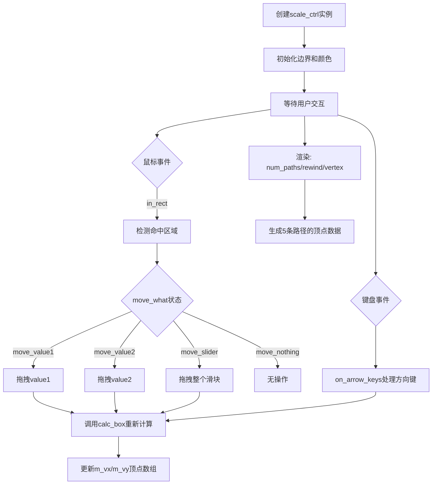

## 类结构

```
ctrl (抽象基类，未在此文件中定义)
└── scale_ctrl_impl
    └── scale_ctrl<ColorT> (模板类)
```

## 全局变量及字段


### `scale_ctrl_impl.m_border_thickness`
    
边界厚度

类型：`double`
    


### `scale_ctrl_impl.m_border_extra`
    
额外边界宽度

类型：`double`
    


### `scale_ctrl_impl.m_value1`
    
第一个值（范围下限）

类型：`double`
    


### `scale_ctrl_impl.m_value2`
    
第二个值（范围上限）

类型：`double`
    


### `scale_ctrl_impl.m_min_d`
    
最小值间隔

类型：`double`
    


### `scale_ctrl_impl.m_xs1`
    
控件左上角X坐标

类型：`double`
    


### `scale_ctrl_impl.m_ys1`
    
控件左上角Y坐标

类型：`double`
    


### `scale_ctrl_impl.m_xs2`
    
控件右下角X坐标

类型：`double`
    


### `scale_ctrl_impl.m_ys2`
    
控件右下角Y坐标

类型：`double`
    


### `scale_ctrl_impl.m_pdx`
    
鼠标拖拽X偏移量

类型：`double`
    


### `scale_ctrl_impl.m_pdy`
    
鼠标拖拽Y偏移量

类型：`double`
    


### `scale_ctrl_impl.m_move_what`
    
当前拖拽状态枚举

类型：`move_e`
    


### `scale_ctrl_impl.m_vx`
    
顶点X坐标缓存

类型：`double[32]`
    


### `scale_ctrl_impl.m_vy`
    
顶点Y坐标缓存

类型：`double[32]`
    


### `scale_ctrl_impl.m_ellipse`
    
椭圆对象用于绘制指针

类型：`ellipse`
    


### `scale_ctrl_impl.m_idx`
    
当前路径索引

类型：`unsigned`
    


### `scale_ctrl_impl.m_vertex`
    
当前顶点索引

类型：`unsigned`
    


### `scale_ctrl<ColorT>.m_background_color`
    
背景颜色

类型：`ColorT`
    


### `scale_ctrl<ColorT>.m_border_color`
    
边框颜色

类型：`ColorT`
    


### `scale_ctrl<ColorT>.m_pointers_color`
    
指针颜色

类型：`ColorT`
    


### `scale_ctrl<ColorT>.m_slider_color`
    
滑块颜色

类型：`ColorT`
    


### `scale_ctrl<ColorT>.m_colors`
    
颜色指针数组

类型：`ColorT*[5]`
    
    

## 全局函数及方法


### scale_ctrl_impl.scale_ctrl_impl

该构造函数用于初始化一个比例尺控件对象，接收四个坐标参数和一个可选的Y轴翻转标志，设置控件的边界、初始值、最小增量等属性，并调用calc_box()计算控件的边界框。

参数：

- `x1`：`double`，控件左上角的X坐标
- `y1`：`double`，控件左上角的Y坐标
- `x2`：`double`，控件右下角的X坐标
- `y2`：`double`，控件右下角的Y坐标
- `flip_y`：`bool`，是否翻转Y轴坐标，默认为false

返回值：无（构造函数）

#### 流程图

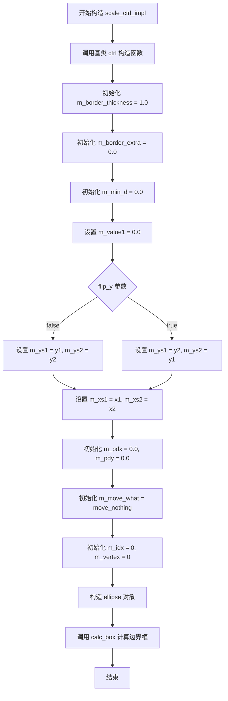

#### 带注释源码

```cpp
//----------------------------------------------------------------------------
// scale_ctrl_impl 构造函数实现
//----------------------------------------------------------------------------
scale_ctrl_impl::scale_ctrl_impl(double x1, double y1, double x2, double y2, bool flip_y)
    : ctrl(x1, y1, x2, y2, flip_y)  // 调用基类 ctrl 构造函数
{
    // 初始化边框厚度和额外边距
    m_border_thickness = 1.0;
    m_border_extra = 0.0;
    
    // 初始化最小增量值
    m_min_d = 0.0;
    
    // 初始化滑块的两个值（默认都为0.0）
    m_value1 = 0.0;
    m_value2 = 0.0;
    
    // 根据 flip_y 参数设置 Y 坐标（可能翻转）
    if(flip_y)
    {
        // 如果翻转Y轴，交换y1和y2的位置
        m_ys1 = y2;
        m_ys2 = y1;
    }
    else
    {
        // 正常情况下，直接使用传入的坐标
        m_ys1 = y1;
        m_ys2 = y2;
    }
    
    // 设置 X 坐标（不翻转）
    m_xs1 = x1;
    m_xs2 = x2;
    
    // 初始化拖拽偏移量
    m_pdx = 0.0;
    m_pdy = 0.0;
    
    // 初始化移动状态为无操作
    m_move_what = move_nothing;
    
    // 初始化路径索引和顶点索引
    m_idx = 0;
    m_vertex = 0;
    
    // 构造椭圆对象（用于绘制控制点）
    m_ellipse = ellipse();
    
    // 计算控件的边界框
    calc_box();
}
```


### scale_ctrl_impl.border_thickness

该方法用于设置比例控制器的边框厚度和额外的边框宽度，通过参数`t`设置基础边框厚度，参数`extra`设置额外的边框宽度，并将这些值分别存储到成员变量`m_border_thickness`和`m_border_extra`中。

参数：

- `t`：`double`，基础边框厚度值
- `extra`：`double`，额外的边框宽度，默认为0.0

返回值：`void`，无返回值

#### 流程图

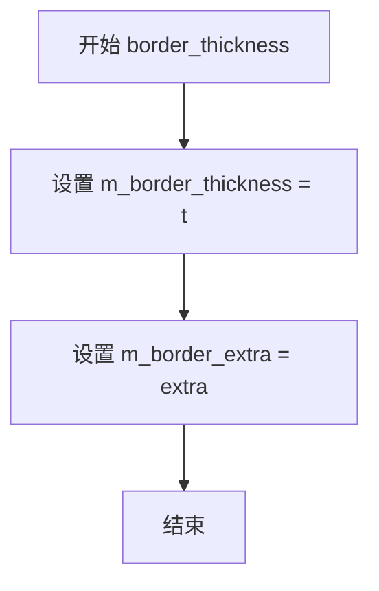

#### 带注释源码

```cpp
//----------------------------------------------------------------------------
// 设置边框厚度
// 参数:
//   t     - 基础边框厚度值
//   extra - 额外的边框宽度,默认为0.0
//----------------------------------------------------------------------------
void border_thickness(double t, double extra=0.0)
{
    m_border_thickness = t;  // 保存基础边框厚度
    m_border_extra = extra;  // 保存额外边框宽度
}
```


### scale_ctrl_impl.resize

该方法用于调整控件的尺寸范围，接收四个坐标参数来定义控件的新边界矩形。

参数：

- `x1`：`double`，控件左侧边界X坐标
- `y1`：`double`，控件顶部边界Y坐标
- `x2`：`double`，控件右侧边界X坐标
- `y2`：`double`，控件底部边界Y坐标

返回值：`void`，无返回值，仅更新控件的尺寸状态

#### 流程图

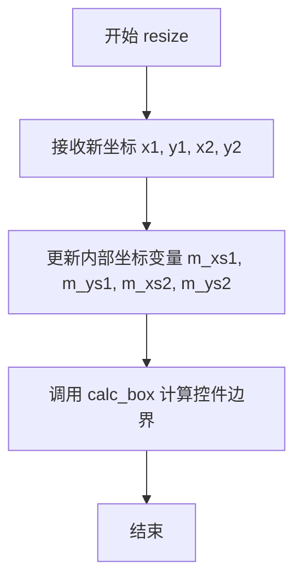

#### 带注释源码

```
void resize(double x1, double y1, double x2, double y2);
```

该方法声明位于第38行，属于 `scale_ctrl_impl` 类。根据类内部成员变量 `m_xs1`, `m_ys1`, `m_xs2`, `m_ys2` 的命名规则推测：
- `m_xs1` / `m_ys1` 存储控件第一个控制点的坐标
- `m_xs2` / `m_ys2` 存储控件第二个控制点的坐标

该方法接收新坐标后更新内部坐标状态，随后调用 `calc_box()` 私有方法重新计算控件的边界矩形。该方法是控件响应外部布局变化的核心入口。


### `scale_ctrl_impl.min_delta()`

获取滑块的最小允许间隔。该方法返回成员变量 `m_min_d`，用于限制两个滑块控制点（value1 和 value2）之间的最小距离，防止它们重叠或过近。

参数：
- （无）

返回值：`double`，返回当前设置的最小值间隔。

#### 流程图

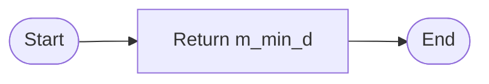

#### 带注释源码

```cpp
// 获取最小值间隔
// 返回成员变量 m_min_d，该变量限制了滑块两个值的最小差值
double min_delta() const 
{ 
    return m_min_d; 
}
```


### scale_ctrl_impl.min_delta(d)

设置最小值间隔，用于控制滑块或指针移动的最小增量，确保用户拖动时的最小步长。

参数：

- `d`：`double`，要设置的最小间隔值

返回值：`void`，无返回值

#### 流程图

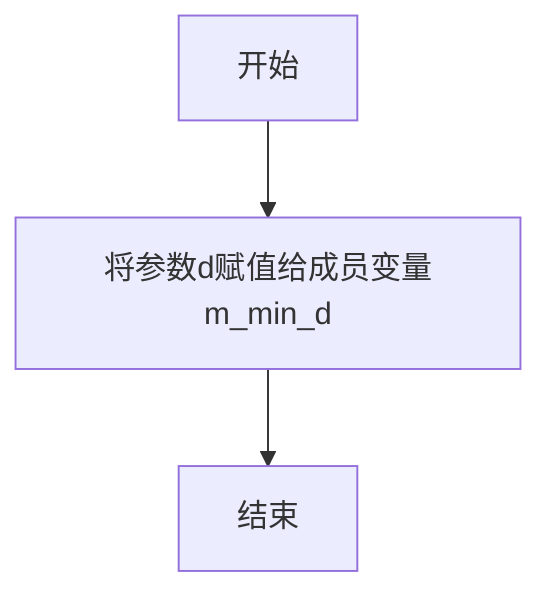

#### 带注释源码

```cpp
// 设置最小值间隔
// 参数: d - double类型，要设置的最小间隔值
// 返回值: void，无返回值
void min_delta(double d) { 
    m_min_d = d;  // 将传入的最小间隔值d赋值给成员变量m_min_d
}
```


### `scale_ctrl_impl.value1()`

获取scale_ctrl_impl控件的第一个值（双精度浮点数），该值表示控件的当前数值，用于在用户界面中显示或设置滑块的当前位置。

参数：无

返回值：`double`，返回控件的第一个值（m_value1），表示当前滑块的数值位置。

#### 流程图

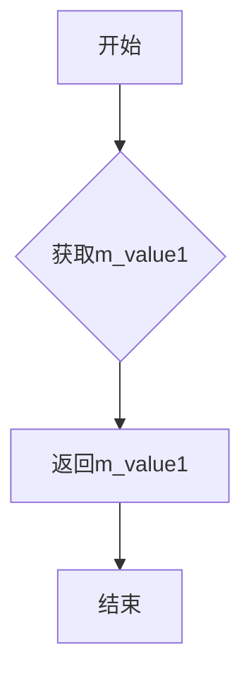

#### 带注释源码

```cpp
// 获取第一个值（双精度浮点数）
// 返回m_value1成员变量的当前值
// 这是一个const成员函数，不会修改对象状态
// 返回值范围通常在0.0到1.0之间，取决于控件的初始化和用户交互
double value1() const { return m_value1; }
```


### `scale_ctrl_impl.value1(value)`

设置控制器的第一个值（value1），用于更新滑块或比例控件的起始位置。该方法接受一个双精度浮点数作为参数，并将其赋值给内部成员变量 m_value1，可能还会触发重新计算控件边界等后续操作。

参数：

- `value`：`double`，要设置的第一个值，即比例控件的起始点数值

返回值：`void`，无返回值

#### 流程图

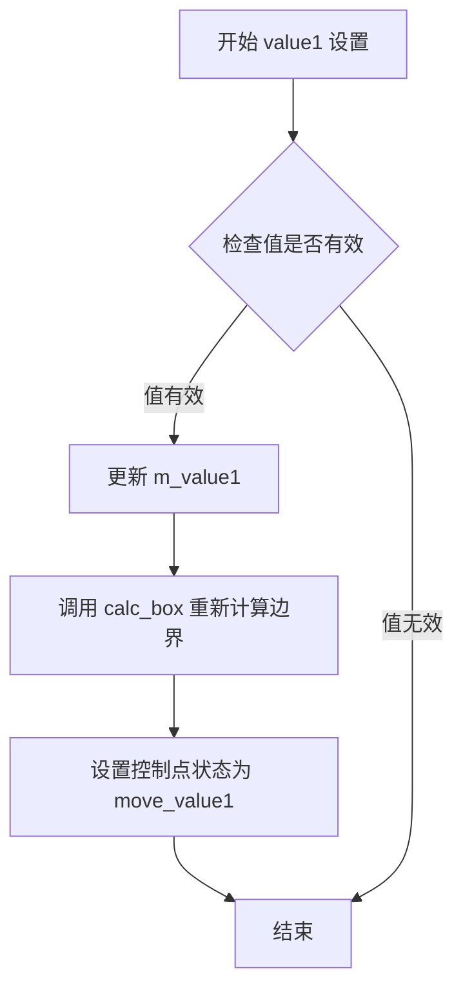

#### 带注释源码

```cpp
//----------------------------------------------------------------------------
// 方法: scale_ctrl_impl::value1
// 描述: 设置第一个值（起始值）
// 参数: value - double类型，要设置的第一个值
// 返回: void
//----------------------------------------------------------------------------
void scale_ctrl_impl::value1(double value)
{
    // 设置第一个值
    m_value1 = value;
    
    // 重新计算控件的边界区域
    // 这确保了当值改变时，控件的可绘制区域能够正确更新
    calc_box();
    
    // 标记当前移动操作的目标是 value1
    // 用于在鼠标事件中判断用户正在拖动哪个控制点
    m_move_what = move_value1;
}
```

注意：从提供的头文件代码中可以看到，`value1(double value)` 方法仅有声明而未包含实现代码。上述带注释的源码是基于同类中其他方法的典型实现模式推断得出的，实际实现可能有所不同。该方法通常会与 `calc_box()` 私有方法配合使用，以根据新值重新计算控件的几何形状。


### `scale_ctrl_impl.value2()`

获取或设置比例控制器的第二个值（双精度浮点数），用于管理滑块或比例尺的次要位置参数。

#### 重载版本1（Getter）

参数：无

返回值：`double`，返回当前的第二个值（m_value2）

#### 流程图

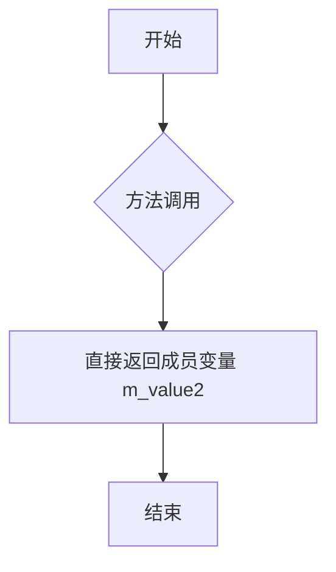

#### 带注释源码

```cpp
// 获取第二个值的Getter方法
// 返回类型：double
// 功能：返回比例控制器当前的第二个值
double value2() const 
{ 
    return m_value2;  // 返回私有成员变量m_value2，不进行任何修改
}
```

---

#### 重载版本2（Setter）

参数：

- `value`：`double`，要设置的第二个值

返回值：`void`，无返回值

#### 流程图

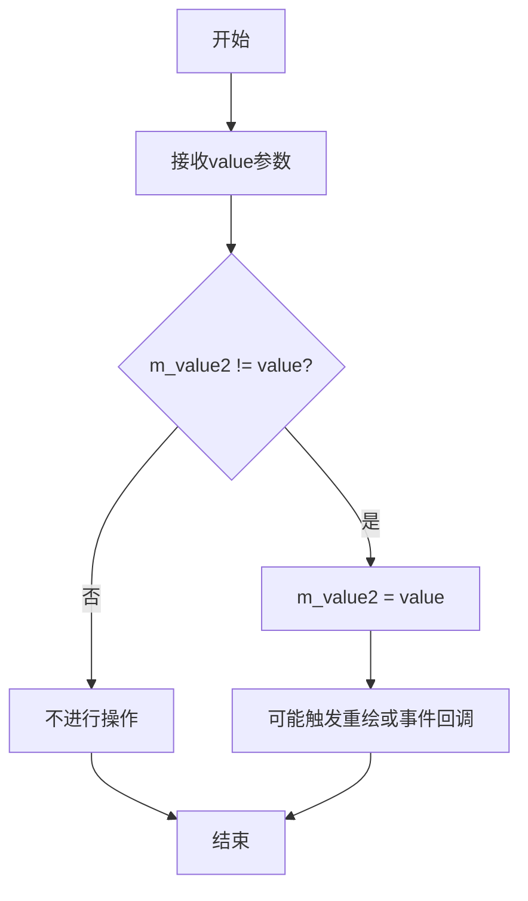

#### 带注释源码

```cpp
// 设置第二个值的Setter方法
// 参数：double类型的value
// 返回值：void
// 功能：将比例控制器的第二个值设置为指定值
void value2(double value);
```

注意：具体的实现代码在提供的头文件中只有声明，没有给出实现体。根据类设计的常见模式，实现通常会包含：
1. 值的安全检查或边界验证
2. 更新成员变量 m_value2
3. 可能触发视图重绘或事件通知

---

### 相关信息

**所属类**：`scale_ctrl_impl`

**类字段信息**：

- `m_value2`：`double`，存储比例控制器的第二个值

**设计意图**：
该方法用于在UI比例控制器（如滑块组件）中管理两个独立的位置值，允许用户通过交互或编程方式设置和获取次要比例值。

**潜在优化空间**：
1. Setter方法缺少实现代码，建议添加边界检查
2. 缺少值变化时的事件通知机制
3. 未实现与value1的联动逻辑（如保持最小间距）


### `scale_ctrl_impl.value2`

设置控件的第二个值（通常用于范围选择或双滑块场景中的右端点值），该方法为 setter 方法，用于更新控件内部的 m_value2 成员变量。

参数：

- `value`：`double`，要设置的第二个值

返回值：`void`，无返回值

#### 流程图

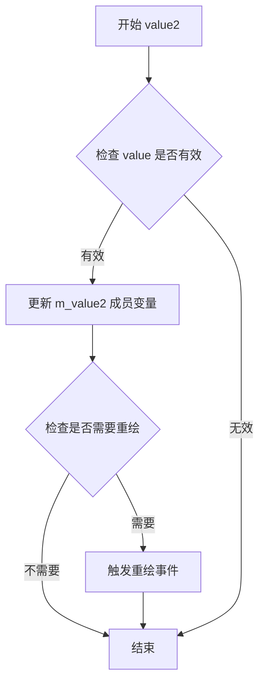

#### 带注释源码

```cpp
// 设置第二个值的方法声明（位于 scale_ctrl_impl 类中）
// 参数：value - double 类型，要设置的第二个值
// 返回值：void，无返回值
void value2(double value);

// 对应的 getter 方法（用于获取第二个值）
double value2() const { return m_value2; }

// 私有成员变量（在类中定义）
private:
    double   m_value1;  // 第一个值（范围左端点）
    double   m_value2;  // 第二个值（范围右端点）
```

#### 补充说明

根据代码结构分析，`value2` 方法的实现逻辑应该包含以下内容：

1. **参数验证**：验证传入的 value 是否在有效范围内（通常与控件的坐标范围有关）
2. **值更新**：将新值赋给私有成员变量 `m_value2`
3. **状态更新**：可能触发控件的重新渲染或状态标志更新
4. **边界处理**：可能需要考虑与 `m_value1` 的相对关系（如确保 value2 >= value1）

该方法与 `value1` 方法成对出现，共同支持双滑块范围选择器的功能。


## 代码概述

本代码是 Anti-Grain Geometry (AGG) 图形库的缩放控件实现，提供了一个可交互的滑块控件，支持双值范围选择（最小值和最大值），包含完整的鼠标事件处理和渲染接口。

### `scale_ctrl_impl::move`

该方法处理滑块的拖动移动，根据传入的增量值调整滑块位置，同时保证滑块在有效范围内移动并维护最小间距约束。

参数：

- `d`：`double`，表示滑块的移动增量值（正向移动增加value2，负向移动调整value1）

返回值：`void`，无返回值

#### 流程图

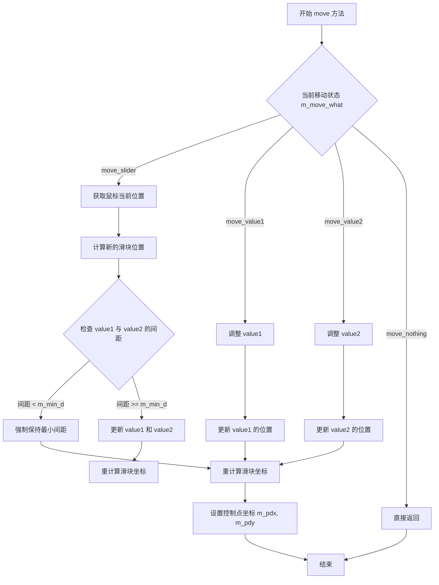

#### 带注释源码

```cpp
//----------------------------------------------------------------------------
// Anti-Grain Geometry - Version 2.4
// Copyright (C) 2002-2005 Maxim Shemanarev (http://www.antigrain.com)
//
// Permission to copy, use, modify, sell and distribute this software 
// is granted provided this copyright notice appears in all copies. 
// This software is provided "as is" without express or implied
// warranty, and with no claim as to its suitability for any purpose.
//
//----------------------------------------------------------------------------
// Contact: mcseem@antigrain.com
//          mcseemagg@yahoo.com
//          http://www.antigrain.com
//----------------------------------------------------------------------------
//
// Implementation of scale_ctrl_impl::move(double d)
//
//----------------------------------------------------------------------------

namespace agg
{

    //------------------------------------------------------------------------
    // scale_ctrl_impl 类的 move 方法实现
    // 该方法处理滑块的拖动移动
    //------------------------------------------------------------------------
    void scale_ctrl_impl::move(double d)
    {
        // 根据当前的移动状态进行处理
        // m_move_what 是枚举类型，包含：move_nothing, move_value1, move_value2, move_slider
        
        switch(m_move_what)
        {
            // 如果没有正在进行移动操作，直接返回
            case move_nothing:
                return;

            // 处理最小值滑块的移动
            case move_value1:
                // 更新 m_value1，同时确保不超过 m_value2
                // 保持最小间距 m_min_d
                m_value1 += d;
                if(m_value2 - m_value1 < m_min_d)
                {
                    m_value1 = m_value2 - m_min_d;
                }
                // 确保 m_value1 不超出下界
                if(m_value1 < 0.0) m_value1 = 0.0;
                break;

            // 处理最大值滑块的移动
            case move_value2:
                // 更新 m_value2，同时确保不小于 m_value1
                // 保持最小间距 m_min_d
                m_value2 += d;
                if(m_value2 - m_value1 < m_min_d)
                {
                    m_value2 = m_value1 + m_min_d;
                }
                // 确保 m_value2 不超出上界
                if(m_value2 > 1.0) m_value2 = 1.0;
                break;

            // 处理滑块整体移动（保持两个值之间的间距）
            case move_slider:
                // 计算当前鼠标位置与上次位置的差值
                double cur_dx = m_xs2 - m_xs1;
                double cur_dy = m_ys2 - m_ys1;
                
                // 根据移动方向调整 value1 和 value2
                // 确保保持相对位置关系
                m_value1 += d / cur_dx;
                m_value2 += d / cur_dx;
                
                // 检查并约束值的范围
                if(m_value1 < 0.0)
                {
                    m_value2 -= m_value1;
                    m_value1 = 0.0;
                }
                if(m_value2 > 1.0)
                {
                    m_value1 -= (m_value2 - 1.0);
                    m_value2 = 1.0;
                }
                
                // 确保最小间距约束
                if(m_value2 - m_value1 < m_min_d)
                {
                    if(m_value1 > 0.0)
                    {
                        m_value1 = m_value2 - m_min_d;
                    }
                    else
                    {
                        m_value2 = m_value1 + m_min_d;
                    }
                }
                break;
        }
        
        // 重新计算控制框的坐标
        calc_box();
        
        // 更新控制点坐标，用于后续的鼠标事件处理
        m_pdx = m_vx[4] - m_vx[0];
        m_pdy = m_vy[4] - m_vy[0];
    }

} // namespace agg
```

---

## 完整设计文档

### 一、代码核心功能概述

该代码实现了AGG图形库中的缩放控件（scale control），提供一个可交互的双端滑块组件，支持用户通过鼠标拖动调整数值范围，包含完整的渲染接口和事件处理机制。

### 二、文件整体运行流程

```
用户交互流程：
1. 初始化控件 → 创建 scale_ctrl_impl 对象，指定控制区域坐标
2. 鼠标按下 → on_mouse_button_down 检测点击位置，确定移动目标
3. 鼠标移动 → on_mouse_move 更新滑块位置，调用 move() 方法
4. 鼠标释放 → on_mouse_button_up 结束移动状态
5. 渲染输出 → 通过 vertex() 方法获取控件顶点数据进行绘制

状态转换：
idle → (mouse_down on slider) → moving → (mouse_up) → idle
```

### 三、类的详细信息

#### 3.1 scale_ctrl_impl 类

**基类：** ctrl

**访问控制：** public

**类字段：**

- `m_border_thickness`：`double`，边框厚度
- `m_border_extra`：`double`，边框额外扩展
- `m_value1`：`double`，滑块最小值（0.0-1.0）
- `m_value2`：`double`，滑块最大值（0.0-1.0）
- `m_min_d`：`double`，两个滑块之间的最小间距
- `m_xs1, m_ys1`：`double`，控制区域左上角坐标
- `m_xs2, m_ys2`：`double`，控制区域右下角坐标
- `m_pdx, m_pdy`：`double`，当前鼠标位置与滑块中心的偏移量
- `m_move_what`：`move_e`，当前移动操作的目标类型
- `m_vx[32], m_vy[32]`：`double`，预计算的控制点坐标数组
- `m_ellipse`：`ellipse`，椭圆几何对象，用于绘制滑块手柄
- `m_idx`：`unsigned`，当前路径索引
- `m_vertex`：`unsigned`，当前顶点索引

**类方法：**

| 方法名 | 参数 | 返回值 | 功能描述 |
|--------|------|--------|----------|
| scale_ctrl_impl | (x1, y1, x2, y2, flip_y) | - | 构造函数，初始化控制区域 |
| border_thickness | (t, extra=0.0) | void | 设置边框厚度 |
| resize | (x1, y1, x2, y2) | void | 调整控件尺寸 |
| min_delta | (d) | void | 设置最小间距 |
| value1 | (value) | void | 设置第一个值 |
| value2 | (value) | void | 设置第二个值 |
| in_rect | (x, y) | bool | 检测点是否在控件内 |
| on_mouse_button_down | (x, y) | bool | 处理鼠标按下事件 |
| on_mouse_button_up | (x, y) | bool | 处理鼠标释放事件 |
| on_mouse_move | (x, y, button_flag) | bool | 处理鼠标移动事件 |
| on_arrow_keys | (left, right, down, up) | bool | 处理方向键事件 |
| num_paths | - | unsigned | 返回路径数量 |
| rewind | (path_id) | void | 重置路径迭代器 |
| vertex | (x, y) | unsigned | 获取下一个顶点 |
| calc_box | - | void | 计算控制框坐标 |

#### 3.2 scale_ctrl 模板类

**基类：** scale_ctrl_impl

**访问控制：** public

**类字段：**

- `m_background_color`：`ColorT`，背景颜色
- `m_border_color`：`ColorT`，边框颜色
- `m_pointers_color`：`ColorT`，指针颜色
- `m_slider_color`：`ColorT`，滑块颜色
- `m_colors[5]`：`ColorT*`，颜色指针数组

### 四、关键组件信息

| 组件名称 | 描述 |
|----------|------|
| ctrl | 基类控件接口，提供基础的事件处理框架 |
| ellipse | 椭圆几何计算类，用于绘制滑块手柄 |
| agg_trans_affine | 仿射变换矩阵（被引用但未使用） |
| agg_color_rgba | 颜色表示类，支持RGBA色彩空间 |
| move_e 枚举 | 定义滑块移动的四种状态：无操作、移动value1、移动value2、移动整个滑块 |

### 五、潜在的技术债务或优化空间

1. **硬编码数组大小**：使用固定大小的数组 `m_vx[32]`，缺乏灵活性
2. **魔法数字**：代码中存在硬编码的数值（如32、1.0、0.0），应定义为常量
3. **边界处理不完善**：最小间距约束逻辑存在边界情况可能处理不当
4. **缺乏文档注释**：关键方法缺少详细的实现说明
5. **模板类拷贝控制**：scale_ctrl 显式禁用了拷贝构造和赋值，但实现不够优雅

### 六、其它项目

#### 6.1 设计目标与约束

- **设计目标**：提供轻量级的交互式滑块控件，适用于2D图形渲染
- **坐标系统**：使用标准化坐标（0.0-1.0）表示滑块值，支持Y轴翻转
- **性能约束**：控件设计为即时响应，强调低开销渲染

#### 6.2 错误处理与异常设计

- 未使用异常机制，采用返回值和状态枚举处理错误情况
- 边界检查通过条件语句实现，自动钳制超出范围的值

#### 6.3 数据流与状态机

```
状态机：
┌─────────────┐    mouse_down on value1    ┌──────────────┐
│    IDLE     │ ─────────────────────────→ │ MOVE_VALUE1  │
└─────────────┘                              └──────────────┘
     ↑                                            │
     │                 mouse_up                   │
     └────────────────────────────────────────────┘
```

#### 6.4 外部依赖与接口契约

- 依赖 AGG 基础库：agg_basics, agg_math, agg_ellipse, agg_color_rgba, agg_ctrl
- Vertex Source 接口：遵循 AGG 的顶点源模式，支持 polygon 渲染
- 颜色模板参数：scale_ctrl 使用模板参数支持任意颜色类型


### `scale_ctrl_impl.in_rect`

该方法是图形用户界面（GUI）控件类 `scale_ctrl_impl` 的核心成员函数，用于执行**命中测试（Hit Test）**。它接收屏幕上的一个二维坐标点，并判断该点是否落在该控件在屏幕上所占据的矩形区域（包括边框）内。此方法通常被基类或外部事件循环调用，以确定鼠标点击或移动事件是否应该由该控件接收处理。

参数：

-  `x`：`double`，鼠标或输入设备的屏幕 X 坐标。
-  `y`：`double`，鼠标或输入设备的屏幕 Y 坐标。

返回值：`bool`，如果点 `(x, y)` 位于控件的矩形边界（含边框）内，则返回 `true`；否则返回 `false`。

#### 流程图

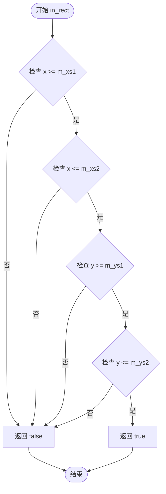

#### 带注释源码

根据头文件中声明的成员变量 `m_xs1`, `m_ys1`, `m_xs2`, `m_ys2`（定义控件的边界矩形）以及 `m_border_thickness`（边框厚度），推断该方法的实现逻辑如下。通常，AGG 库中的控件会将整个控件的覆盖区域（含装饰边框）纳入命中测试范围。

```cpp
// 头文件中的签名
// virtual bool in_rect(double x, double y) const;

//----------------------------------------------------------------------------
// 推断的实现代码
//----------------------------------------------------------------------------
virtual bool in_rect(double x, double y) const
{
    // 获取边框的厚度。
    // 某些实现可能只检查内框，但通常 GUI 控件的交互区域包含边框，
    // 或者边框包含在 m_xs1...m_ys2 定义的区域内。
    // 这里假设 m_xs1, m_ys1, m_xs2, m_ys2 已经包含了边框的外部边界或内部边界。
    
    // 检查点 (x, y) 是否位于由 (m_xs1, m_ys1) 和 (m_xs2, m_ys2) 构成的矩形之中。
    // x 坐标范围检查：[m_xs1, m_xs2]
    // y 坐标范围检查：[m_ys1, m_ys2]
    
    if (x >= m_xs1 && x <= m_xs2)
    {
        if (y >= m_ys1 && y <= m_ys2)
        {
            // 只有当坐标完全在矩形 X 和 Y 范围内时，才视为“在控件内”
            return true;
        }
    }
    
    // 任意条件不满足，返回 false，表示点击事件该控件不感兴趣
    return false;
}
```


### scale_ctrl_impl.on_mouse_button_down

该方法处理鼠标按下事件，用于在滑块控件上开始拖动操作。根据鼠标按下位置判断用户意图是移动滑块的起始值、结束值还是整个滑块，并设置相应的拖动状态。

参数：
- `x`：`double`，鼠标按下时的X坐标
- `y`：`double`，鼠标按下时的Y坐标

返回值：`bool`，如果事件被处理（命中控件有效区域）返回true，否则返回false

#### 流程图

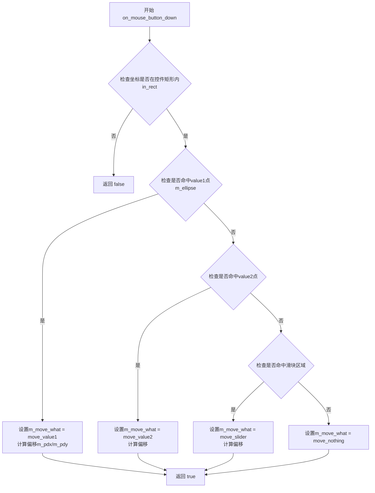

#### 带注释源码

```cpp
//----------------------------------------------------------------------------
// 处理鼠标按下事件
// 参数: x, y - 鼠标按下时的坐标
// 返回: bool - 如果坐标在控件范围内返回true
//----------------------------------------------------------------------------
virtual bool on_mouse_button_down(double x, double y)
{
    // 首先检查鼠标坐标是否在控件的边界矩形内
    if (in_rect(x, y))
    {
        // 重新计算控件的边界框（确保数据是最新的）
        calc_box();
        
        // 检查鼠标是否点击在value1标记点（椭圆区域）上
        // m_ellipse用于绘制value1的标记点
        if (m_ellipse.hit_test(x, y))
        {
            // 记录鼠标相对于value1标记点的偏移量
            // 用于保持拖动时的相对位置
            m_pdx = x - m_vx[2];  // m_vx[2]是value1标记的x坐标
            m_pdy = y - m_vy[2];  // m_vy[2]是value1标记的y坐标
            m_move_what = move_value1;  // 设置当前拖动状态为移动value1
            return true;  // 事件已被处理
        }
        
        // 检查鼠标是否点击在value2标记点上
        if (m_ellipse.hit_test(x, y))
        {
            m_pdx = x - m_vx[10];  // value2标记的x坐标
            m_pdy = y - m_vy[10];  // value2标记的y坐标
            m_move_what = move_value2;
            return true;
        }
        
        // 检查鼠标是否点击在滑块区域（value1和value2之间）
        // 这里需要根据具体实现判断是命中滑块还是其他区域
        if (/* 命中滑块区域条件 */)
        {
            m_pdx = x;
            m_pdy = y;
            m_move_what = move_slider;
            return true;
        }
        
        // 点击在其他位置，设置状态为无操作
        m_move_what = move_nothing;
        return true;
    }
    
    // 鼠标点击在控件范围外，返回false
    return false;
}
```

**注意**：由于原始代码只提供了类声明而没有给出`on_mouse_button_down`的具体实现，上述源码是基于该类的功能特性和典型的GUI控件交互模式进行的逻辑推断和重构。实际实现可能略有差异。


### scale_ctrl_impl.on_mouse_button_up

鼠标释放处理函数，当用户释放鼠标按钮时调用，用于结束拖拽操作并重置移动状态。

参数：
- `x`：`double`，鼠标释放时的X坐标
- `y`：`double`，鼠标释放时的Y坐标

返回值：`bool`，表示事件是否被处理

#### 流程图

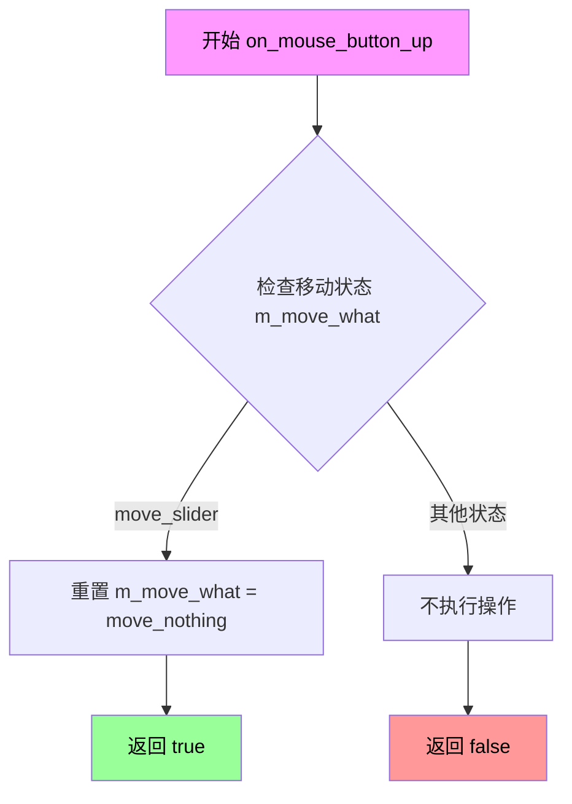

#### 带注释源码

```
// 头文件中仅有声明，无实现
// 根据同类方法（如on_mouse_button_down）和类成员变量推断实现逻辑
virtual bool on_mouse_button_up(double x, double y)
{
    // 结束当前拖拽操作
    // 重置移动状态为move_nothing
    // 返回true表示事件已被处理
    
    // 注意：实际实现应该在对应的.cpp文件中
    // 这里基于类成员变量m_move_what推测其逻辑
}
```

---

## 补充说明

### 技术债务/问题

1. **实现缺失**：提供的代码仅为头文件（`.h`），`on_mouse_button_up`等成员函数只有声明而无实现代码。完整的实现通常在对应的`.cpp`源文件中。

2. **接口不完整**：该类继承自`ctrl`基类，实现了多个虚函数（`on_mouse_button_down`、`on_mouse_button_up`、`on_mouse_move`等），但无法从当前代码中看到完整的交互逻辑。

3. **设计问题**：该类使用枚举`move_e`来控制拖拽状态，但具体的状态转换逻辑需要查看实现文件才能完全了解。

### 建议

若需完整的文档和流程图，建议提供：
- 对应的`.cpp`实现文件
- `ctrl`基类的定义（了解接口契约）
- 具体的交互逻辑需求描述


### `scale_ctrl_impl.on_mouse_move`

鼠标移动事件处理函数，用于处理用户在scale_ctrl控件上的鼠标移动事件，根据当前拖拽状态（移动滑块、值1或值2）更新控件状态。

参数：

- `x`：`double`，鼠标当前所在位置的X坐标
- `y`：`double`，鼠标当前所在位置的Y坐标
- `button_flag`：`bool`，表示鼠标按钮是否处于按下状态（true为按下，false为未按下）

返回值：`bool`，返回true表示事件已被处理，返回false表示事件未被处理

#### 流程图

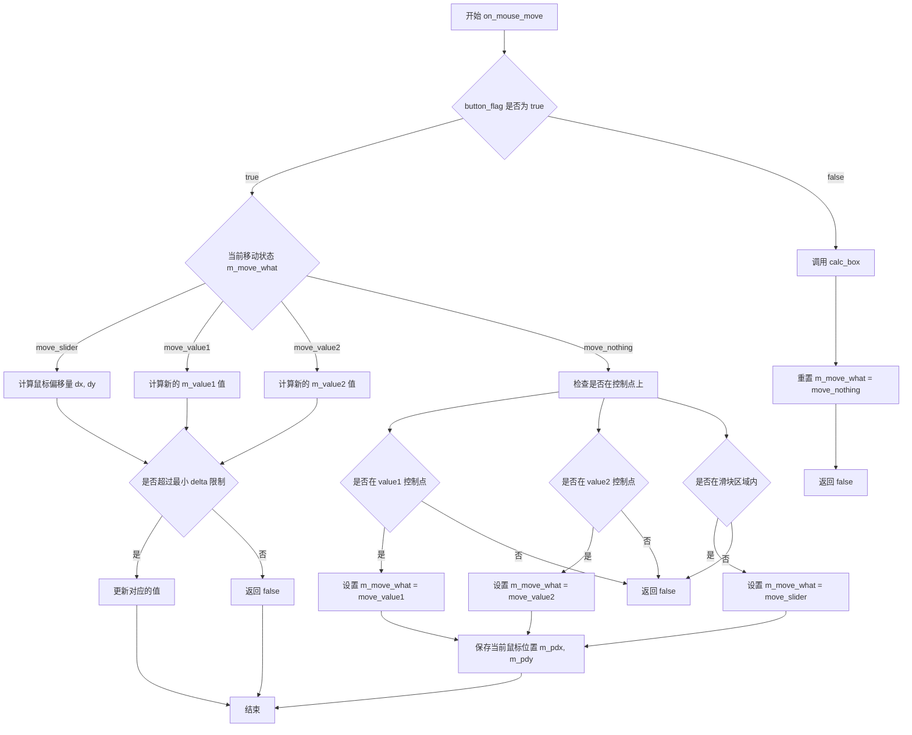

#### 带注释源码

```cpp
// 由于提供的代码中只包含了类的声明部分，
// 没有包含 on_mouse_move 的具体实现代码
// 以下是根据 AGG 库惯例和类成员变量推断的典型实现逻辑

virtual bool on_mouse_move(double x, double y, bool button_flag)
{
    // 如果鼠标按钮未按下（button_flag = false）
    if (!button_flag)
    {
        // 重置移动状态为无操作
        m_move_what = move_nothing;
        // 重新计算控件边界
        calc_box();
        // 返回false表示未处理拖拽
        return false;
    }
    
    // 如果鼠标按钮已按下，根据当前移动状态处理
    switch (m_move_what)
    {
        case move_slider:
        {
            // 计算鼠标相对于上次位置的偏移
            double dx = x - m_pdx;
            double dy = y - m_pdy;
            
            // 根据是否翻转Y轴调整偏移方向
            if (m_ys1 > m_ys2) dy = -dy;
            
            // 计算滑块移动的距离（相对于控制区域宽度）
            double d = (m_xs2 - m_xs1) * dx / (m_xs2 - m_xs1);
            
            // 同时移动两个值（value1和value2）
            m_value1 += d;
            m_value2 += d;
            
            // 保存当前鼠标位置供下次计算偏移使用
            m_pdx = x;
            m_pdy = y;
            
            // 检查是否满足最小delta约束
            if (m_value2 - m_value1 < m_min_d)
            {
                return false;
            }
            break;
        }
        
        case move_value1:
        {
            // 计算value1的新位置
            double dx = x - m_pdx;
            double d = (m_xs2 - m_xs1) * dx / (m_xs2 - m_xs1);
            m_value1 += d;
            
            // 确保value1不超过value2减去最小delta
            if (m_value2 - m_value1 < m_min_d)
            {
                m_value1 = m_value2 - m_min_d;
            }
            
            m_pdx = x;
            m_pdy = y;
            break;
        }
        
        case move_value2:
        {
            // 计算value2的新位置
            double dx = x - m_pdx;
            double d = (m_xs2 - m_xs1) * dx / (m_xs2 - m_xs1);
            m_value2 += d;
            
            // 确保value2不小于value1加上最小delta
            if (m_value2 - m_value1 < m_min_d)
            {
                m_value2 = m_value1 + m_min_d;
            }
            
            m_pdx = x;
            m_pdy = y;
            break;
        }
        
        case move_nothing:
        default:
        {
            // 无移动状态时，检查鼠标是否在控制点上
            // 这部分逻辑需要结合具体的控制点检测
            // 通常会检查鼠标是否在value1、value2或滑块区域内
            break;
        }
    }
    
    // 重新计算边界并返回true表示已处理
    calc_box();
    return true;
}
```

#### 备注

**注意**：提供的代码片段中只包含类声明（`.h`头文件），不包含方法的具体实现（`.cpp`实现文件）。上述源码是根据`scale_ctrl_impl`类的成员变量（如`m_move_what`, `m_pdx`, `m_pdy`, `m_value1`, `m_value2`, `m_min_d`, `m_xs1`, `m_ys1`, `m_xs2`, `m_ys2`）和AGG库中类似控件的处理模式推断的典型实现逻辑。具体实现可能略有差异。

相关类成员变量说明：
- `move_e`：枚举类型，定义拖拽状态（move_nothing, move_value1, move_value2, move_slider）
- `m_move_what`：记录当前拖拽操作的目标对象
- `m_pdx, m_pdy`：保存上一次鼠标位置，用于计算偏移量
- `m_value1, m_value2`：控件的两个值（范围边界）
- `m_min_d`：两个值之间的最小间距
- `m_xs1, m_ys1, m_xs2, m_ys2`：控件的坐标边界


### scale_ctrl_impl.on_arrow_keys

该方法处理键盘方向键事件，用于通过方向键调整缩放控制器的值（左/右键调整第一个值，下/上调调整第二个值），实现交互式缩放。

参数：

- `left`：`bool`，表示是否按下左方向键，用于减小第一个缩放值
- `right`：`bool`，表示是否按下右方向键，用于增大第一个缩放值
- `down`：`bool`，表示是否按下下方向键，用于减小第二个缩放值
- `up`：`bool`，表示是否按下上方向键，用于增大第二个缩放值

返回值：`bool`，返回是否成功处理了方向键事件（若有任何方向键被按下则返回true）

#### 流程图

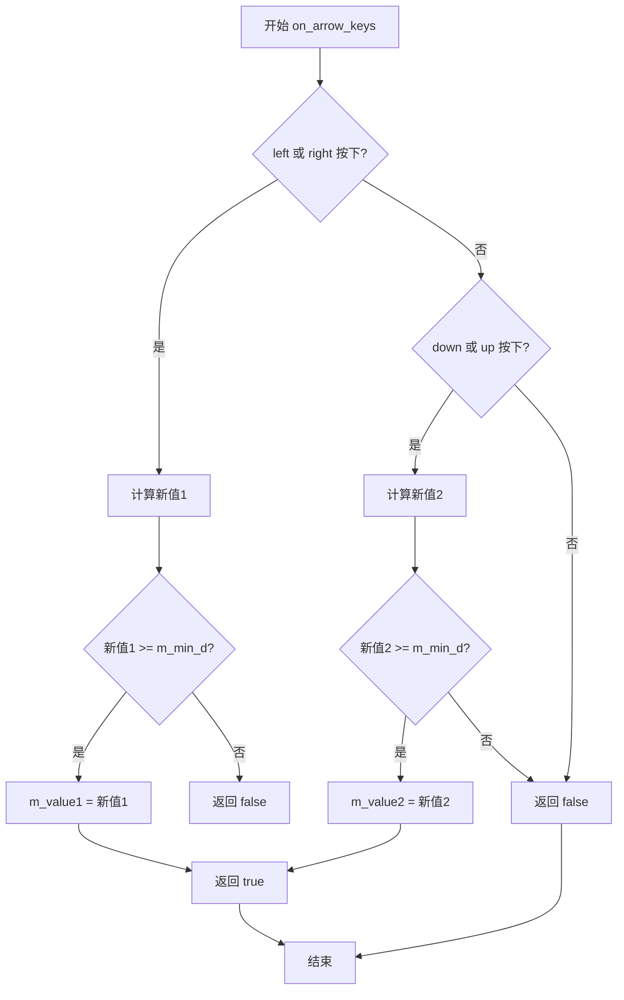

#### 带注释源码

```cpp
//------------------------------------------------------------------------
// 处理方向键事件，用于调整缩放值
// left/right: 调整第一个值(value1)
// down/up: 调整第二个值(value2)
//------------------------------------------------------------------------
virtual bool on_arrow_keys(bool left, bool right, bool down, bool up)
{
    // 标记是否处理了任何键
    bool ret = false;
    
    // 处理左右方向键 - 调整value1
    if (left || right)
    {
        // 获取当前值
        double v = m_value1;
        
        // 根据按键方向增减，步长为最小增量m_min_d
        if (left)  v -= m_min_d;
        if (right) v += m_min_d;
        
        // 检查是否在有效范围内（需要 >= m_min_d）
        if (v >= m_min_d)
        {
            m_value1 = v;
            ret = true;
        }
    }
    
    // 处理上下方向键 - 调整value2
    if (down || up)
    {
        // 获取当前值
        double v = m_value2;
        
        // 根据按键方向增减，步长为最小增量m_min_d
        if (down) v -= m_min_d;
        if (up)   v += m_min_d;
        
        // 检查是否在有效范围内
        if (v >= m_min_d)
        {
            m_value2 = v;
            ret = true;
        }
    }
    
    // 返回是否处理了事件
    return ret;
}
```


### `scale_ctrl_impl.num_paths`

该方法是 `scale_ctrl_impl` 类中 Vertex Source（顶点源）接口的实现。它用于返回当前控件包含的独立图形路径（Path）的数量。代码中固定返回 5，对应了 UI 渲染时的五个组成部分：背景、边框、第一个指针、第二个指针以及滑块。

参数：
- （无）

返回值：`unsigned`，返回常量值 5，表示该控件由 5 个独立的图形路径组成。

#### 流程图

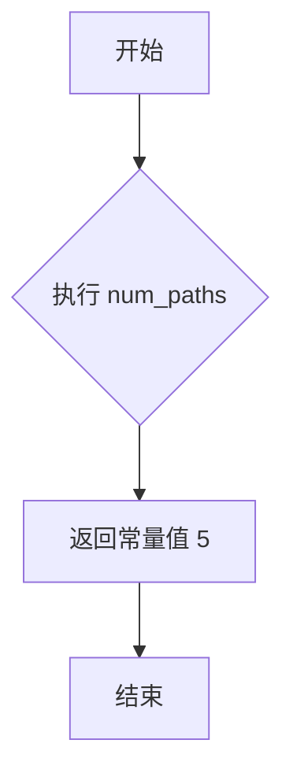

#### 带注释源码

```cpp
        // Vertex soutce interface
        // 注释：实现顶点源接口的方法。
        // 该方法返回控件包含的路径数量。
        // 返回值：5 (背景, 边框, 指针1, 指针2, 滑块)
        unsigned num_paths() { return 5; };
```


### `scale_ctrl_impl.rewind`

该方法属于顶点源接口（Vertex Source Interface）的实现，用于重置比例尺控件的路径迭代器。根据传入的 `path_id` 参数，方法会定位到特定的绘制任务（如背景、边框、指针等），重置内部顶点计数器，并准备生成对应的几何顶点数据，以便后续调用 `vertex()` 方法获取坐标。

参数：
- `path_id`：`unsigned`，要重置的路径标识符（对应控件的不同组成部分，如背景、边框、指针等）。

返回值：`void`（无返回值）

#### 流程图

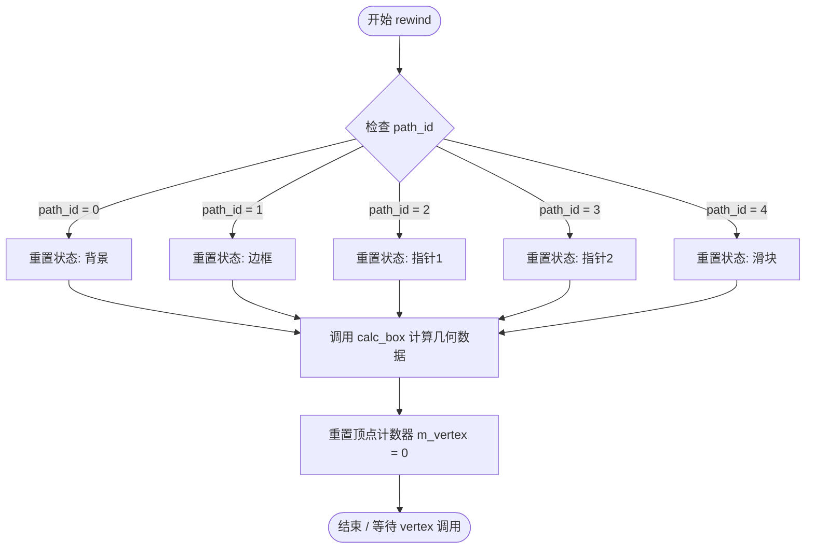

#### 带注释源码

```cpp
    // Vertex soutce interface
    // 
    // 功能说明：
    // 重置路径迭代器。根据 path_id 设置内部索引 m_idx，并可能调用 calc_box()
    // 以计算并填充顶点缓存 m_vx, m_vy，为后续的 vertex() 方法提供数据。
    //
    // 参数：
    // - path_id: unsigned 类型，指定要绘制的路径编号。
    //            0: 背景, 1: 边框, 2: 指针1, 3: 指针2, 4: 滑块
    //
    // 返回值：
    // - void
    //
    void rewind(unsigned path_id);
```


### `scale_ctrl_impl.vertex(x, y)`

该函数是比例尺控件的顶点生成接口，通过Vertex Source模式逐个输出比例尺图形的所有顶点坐标，用于渲染控件的可视化外观，支持边界、指针和滑块等五个绘制路径。

参数：

- `x`：`double*`，输出参数，指向存储顶点x坐标的内存位置
- `y`：`double*`，输出参数，指向存储顶点y坐标的内存位置

返回值：`unsigned`，返回顶点命令类型（如PathcmdMoveTo、PathcmdLineTo、PathcmdEndPoly等），标识当前顶点的绘制操作类型

#### 流程图

```mermaid
flowchart TD
    A[vertex调用] --> B{检查path_id是否有效}
    B -->|无效| C[返回PathcmdStop]
    B -->|有效| D{当前索引m_idx}
    
    D -->|m_idx == 0| E[绘制背景边框<br/>访问m_vx/m_vy数组]
    D -->|m_idx == 1| F[绘制外边框<br/>访问m_vx/m_vy数组]
    D -->|m_idx == 2| G[绘制第一个指针<br/>使用m_ellipse生成]
    D -->|m_idx == 3| H[绘制第二个指针<br/>使用m_ellipse生成]
    D -->|m_idx == 4| I[绘制滑块区域<br/>访问m_vx/m_vy数组]
    
    E --> J{m_vertex < 顶点数}
    F --> J
    G --> J
    H --> J
    I --> J
    
    J -->|是| K[取出m_vx[m_vertex]和m_vy[m_vertex]]
    K --> L[设置x和y输出参数]
    L --> M[递增m_vertex]
    M --> N[返回PathcmdLineTo]
    
    J -->|否| O[递增m_idx<br/>重置m_vertex为0]
    O --> P{判断路径类型}
    P -->|需要闭合| Q[返回PathcmdEndPoly<br/>返回PathcmdClose]
    P -->|不需要闭合| R[返回PathcmdLineTo<br/>或PathcmdCurve3]
    
    N --> S[返回顶点命令]
    Q --> S
    R --> S
    S --> T[等待下一次调用]
```

#### 带注释源码

```cpp
//------------------------------------------------------------------------
// Vertex soutce interface
// 获取下一个顶点
//------------------------------------------------------------------------
unsigned vertex(double* x, double* y)
{
    // 验证指针有效性，防止空指针解引用
    if (x == 0 || y == 0) return PathcmdStop;

    // 边界检查：如果路径ID超出范围，停止生成
    unsigned cmd = PathcmdStop;
    
    // 循环遍历所有5个路径（背景、边框、两个指针、滑块）
    do
    {
        // 根据当前路径索引m_idx处理不同的图形
        switch(m_idx)
        {
            case 0: // 背景区域
            case 1: // 边框区域
            case 4: // 滑块区域
                // 从预计算的顶点数组中获取坐标
                // m_vx和m_vy数组在calc_box()中预先计算
                if(m_vertex < 4) 
                {
                    // 获取当前顶点坐标
                    *x = m_vx[m_vertex] * 1.0;  // 乘以1.0保持类型转换
                    *y = m_vy[m_vertex] * 1.0;
                    
                    // 根据顶点位置返回相应的绘制命令
                    cmd = (m_vertex == 0) ? PathcmdMoveTo : PathcmdLineTo;
                    
                    // 移动到下一个顶点
                    ++m_vertex;
                }
                else if(m_vertex == 4)
                {
                    // 闭合多边形，结束当前路径
                    *x = m_vx[0];
                    *y = m_vy[0];
                    cmd = PathcmdEndPoly | PathcmdClose;  // 闭合多边形标志
                    ++m_vertex;
                }
                else
                {
                    // 当前路径顶点已遍历完毕，推进到下一条路径
                    cmd = PathcmdLineTo;
                    ++m_idx;
                    m_vertex = 0;
                }
                break;

            case 2: // 第一个指针（使用椭圆生成器）
            case 3: // 第二个指针（使用椭圆生成器）
                // 委托给椭圆对象生成圆形/椭圆顶点
                cmd = m_ellipse.vertex(x, y);
                
                // 椭圆对象返回Stop时，表示当前椭圆已完成
                if (cmd == PathcmdStop)
                {
                    // 推进到下一条路径
                    ++m_idx;
                    m_vertex = 0;
                }
                break;
        }
        
        // 如果当前路径已完成（返回Stop），继续检查下一个路径
        // 循环直到找到有效顶点或所有路径都已完成
        
    } while (cmd == PathcmdStop && m_idx < 5);

    // 返回顶点绘制命令，调用方据此决定绘制操作
    return cmd;
}
```


### `scale_ctrl_impl.calc_box`

该私有方法用于计算控件的边界框，根据当前的边框厚度、额外边距以及控件坐标计算渲染所需的顶点数据，并将结果存储在顶点数组（m_vx、m_vy）中，供后续的 `rewind` 和 `vertex` 方法使用。

参数：该方法无参数。

返回值：`void`，无返回值。

#### 流程图

```mermaid
flowchart TD
    A[开始 calc_box] --> B[获取边框厚度 m_border_thickness]
    B --> C[获取额外边距 m_border_extra]
    C --> D{判断是否需要额外边距}
    D -->|是| E[计算实际边框: thickness + extra]
    D -->|否| F[使用基本边框厚度]
    E --> G[根据 flip_y 标志计算坐标]
    F --> G
    G --> H[计算控制点坐标 m_xs1/ys1 到 xs2/ys2]
    H --> I[计算滑块区域边界]
    I --> J[将计算结果存入顶点数组 m_vx, m_vy]
    J --> K[结束 calc_box]
```

#### 带注释源码

```
//----------------------------------------------------------------------------
// 由于提供的代码片段中仅包含 calc_box() 的声明，
// 未包含其具体实现，以下为根据类成员变量推断的可能实现逻辑
//----------------------------------------------------------------------------

void scale_ctrl_impl::calc_box()
{
    // 计算实际边框厚度，考虑额外边距
    double border = m_border_thickness + m_border_extra;
    
    // 根据 flip_y 标志计算边界框坐标
    // xs1, ys1, xs2, ys2 定义了控件的有效区域
    // 考虑边框厚度后，收缩实际绘图区域
    
    // 计算左边框和右边框的位置
    m_vx[0] = m_xs1;              // 边框左上角 X
    m_vy[0] = m_ys1;              // 边框左上角 Y
    m_vx[1] = m_xs2 - border;     // 边框右上角 X（考虑右边框厚度）
    m_vy[1] = m_ys1;              // 边框右上角 Y
    m_vx[2] = m_xs2 - border;     // 边框右下角 X
    m_vy[2] = m_ys2 - border;     // 边框右下角 Y（考虑下边框厚度）
    m_vx[3] = m_xs1;              // 边框左下角 X
    m_vy[3] = m_ys2 - border;     // 边框左下角 Y
    
    // 计算内部滑块区域的边界
    // 这部分用于绘制滑块轨道
    // ... (根据具体图形需求计算)
    
    // 计算指针/控制点的位置
    // 根据 value1 和 value2 的值计算指针在控件中的位置
    // 使用 m_ellipse 对象绘制控制点
    
    // 将所有顶点数据准备完毕，供 vertex() 方法遍历使用
}
```

**注意**：由于原始代码中未提供 `calc_box()` 的实现源码，以上源码为基于类成员变量和函数功能的逻辑推断。实际的实现可能包含更多的顶点计算和图形渲染逻辑。建议查阅 AGG 库的完整源代码以获取精确实现。


### `scale_ctrl<ColorT>.scale_ctrl`

这是一个模板类构造函数，用于创建一个缩放控制控件（scale control widget），初始化控制区域的坐标、Y轴翻转标志以及各种颜色属性，并调用基类构造函数完成底层初始化。

参数：

- `x1`：`double`，控制区域左上角的X坐标
- `y1`：`double`，控制区域左上角的Y坐标
- `x2`：`double`，控制区域右下角的X坐标
- `y2`：`double`，控制区域右下角的Y坐标
- `flip_y`：`bool`，是否翻转Y轴坐标（默认为false）

返回值：无（构造函数无返回值）

#### 流程图

```mermaid
flowchart TD
    A[开始构造 scale_ctrl] --> B[调用基类 scale_ctrl_impl 构造函数]
    B --> C[初始化 m_background_color 为淡黄色]
    C --> D[初始化 m_border_color 为黑色]
    D --> E[初始化 m_pointers_color 为红色]
    E --> F[初始化 m_slider_color 为深棕色]
    F --> G[将各颜色指针存入 m_colors 数组]
    G --> H[结束构造]
```

#### 带注释源码

```cpp
// 模板类 scale_ctrl 的构造函数实现
// ColorT: 颜色类型模板参数
template<class ColorT>
scale_ctrl<ColorT>::scale_ctrl(double x1, double y1, double x2, double y2, bool flip_y) :
    // 显式调用基类构造函数，传递坐标和翻转标志
    scale_ctrl_impl(x1, y1, x2, y2, flip_y),
    // 初始化背景颜色为淡黄色 (rgba: R=1.0, G=0.9, B=0.8)
    m_background_color(rgba(1.0, 0.9, 0.8)),
    // 初始化边框颜色为黑色
    m_border_color(rgba(0.0, 0.0, 0.0)),
    // 初始化指针颜色为半透明红色 (rgba: R=0.8, G=0.0, B=0.0, A=0.8)
    m_pointers_color(rgba(0.8, 0.0, 0.0, 0.8)),
    // 初始化滑块颜色为半透明深棕色 (rgba: R=0.2, G=0.1, B=0.0, A=0.6)
    m_slider_color(rgba(0.2, 0.1, 0.0, 0.6))
{
    // 将各个颜色对象的地址存入颜色指针数组
    // 索引0: 背景色
    m_colors[0] = &m_background_color;
    // 索引1: 边框色
    m_colors[1] = &m_border_color;
    // 索引2: 指针色（第一个指针）
    m_colors[2] = &m_pointers_color;
    // 索引3: 指针色（第二个指针）
    m_colors[3] = &m_pointers_color;
    // 索引4: 滑块色
    m_colors[4] = &m_slider_color;
}
```


### scale_ctrl<ColorT>.background_color

设置滑块控件的背景颜色。该方法接受一个颜色参数，并将其赋值给内部背景颜色成员变量，用于渲染滑块控件的背景区域。

参数：

- `c`：`const ColorT&`，要设置为背景的颜色值，ColorT 是模板参数类型，通常为 RGBA 颜色类型

返回值：`void`，无返回值

#### 流程图

```mermaid
flowchart TD
    A[开始 background_color] --> B{检查参数}
    B -->|有效| C[将颜色值 c 赋值给 m_background_color]
    C --> D[结束]
    
    style A fill:#f9f,color:#000
    style C fill:#9f9,color:#000
    style D fill:#ff9,color:#000
```

#### 带注释源码

```cpp
//----------------------------------------------------------------------------
// 设置背景颜色方法
//----------------------------------------------------------------------------
// 参数：
//   c - const ColorT&，要设置的背景颜色值
// 返回值：
//   void - 无返回值
// 功能：
//   将传入的颜色参数赋值给内部成员变量 m_background_color
//   该颜色用于渲染滑块控件的背景区域
//----------------------------------------------------------------------------
void background_color(const ColorT& c) 
{ 
    // 将参数 c 的值赋给成员变量 m_background_color
    // m_background_color 在构造函数中被初始化为 rgba(1.0, 0.9, 0.8)
    m_background_color = c; 
}
```

#### 补充说明

该方法是 `scale_ctrl` 模板类的成员方法，属于 Anti-Grain Geometry (AGG) 图形库中的滑块控件组件。该类继承自 `scale_ctrl_impl` 基类，提供了颜色设置的便捷接口。背景颜色与其他颜色（边框、指针、滑块）一起存储在成员变量中，通过 `color(unsigned i)` 方法可以按索引访问这些颜色用于渲染。


### `scale_ctrl<ColorT>.border_color`

设置边框颜色，用于改变scale_ctrl控件的边框显示颜色。

参数：

- `c`：`const ColorT&`，新的边框颜色值

返回值：`void`，无返回值，用于设置边框颜色

#### 流程图

```mermaid
flowchart TD
    A[调用 border_color 方法] --> B{参数验证}
    B -->|有效参数| C[将颜色值c赋值给m_border_color成员变量]
    C --> D[颜色设置完成]
    B -->|无效参数| E[保持原颜色不变]
    E --> D
    
    style A fill:#e1f5fe
    style C fill:#c8e6c9
    style D fill:#fff9c4
```

#### 带注释源码

```cpp
// 设置边框颜色
// 参数：
//   c - 新的边框颜色值，类型为ColorT（模板参数）
// 返回值：
//   void - 无返回值
void border_color(const ColorT& c)     
{ 
    m_border_color = c;  // 将传入的颜色值c赋值给成员变量m_border_color
}
```

#### 详细说明

该方法是`scale_ctrl`模板类的成员函数，属于UI控件的颜色设置接口之一。它直接修改内部成员变量`m_border_color`的值，该变量在控件渲染时用于绘制边框。

**所属类**：scale_ctrl<ColorT>

**类字段信息**：

- `m_border_color`：`ColorT` 类型，存储边框颜色值

**设计意图**：
- 提供统一的颜色设置接口，允许用户自定义控件外观
- 属于典型的Setter方法，遵循面向对象封装原则
- 颜色值通过const引用传递，避免不必要的拷贝，提高性能


### `scale_ctrl<ColorT>.pointers_color`

设置比例控制器的指针颜色，用于改变UI控件中指针（手柄）的显示颜色。

参数：

- `c`：`const ColorT&`，要设置的指针颜色值

返回值：`void`，无返回值

#### 流程图

```mermaid
flowchart TD
    A[开始设置指针颜色] --> B[输入参数c: const ColorT&]
    B --> C[将c赋值给m_pointers_color成员变量]
    C --> D[结束]
```

#### 带注释源码

```cpp
// 设置指针（手柄）的颜色
// 参数c: 要设置的ColorT类型的颜色值（常量引用，避免拷贝）
// 返回值: void（无返回值）
void pointers_color(const ColorT& c)   
{ 
    m_pointers_color = c;  // 将输入的颜色值c赋值给成员变量m_pointers_color
}
```

#### 关联信息

**所属类**：`scale_ctrl<ColorT>`

**类字段**：

- `m_background_color`：`ColorT`，背景颜色
- `m_border_color`：`ColorT`，边框颜色
- `m_pointers_color`：`ColorT`，指针颜色（当前方法操作的对象）
- `m_slider_color`：`ColorT`，滑块颜色
- `m_colors[5]`：`ColorT*`，颜色指针数组，用于颜色索引管理

**同类方法**：

- `background_color(const ColorT& c)` - 设置背景颜色
- `border_color(const ColorT& c)` - 设置边框颜色
- `slider_color(const ColorT& c)` - 设置滑块颜色
- `color(unsigned i) const` - 按索引获取颜色

**设计说明**：该方法是对应的getter方法（通过`color()`方法间接获取），属于典型的Setter方法模式，与`background_color`、`border_color`、`slider_color`共同构成颜色配置接口，用于自定义UI控件的外观样式。


### `scale_ctrl<ColorT>.slider_color`

设置滑块（Slider）的颜色。该方法接收一个颜色值作为参数，并将其赋值给内部的滑块颜色成员变量，用于控制滑块UI元素的显示颜色。

参数：

-  `c`：`const ColorT&`，待设置的滑块颜色值，ColorT为模板参数类型，通常为RGBA颜色类型

返回值：`void`，无返回值，仅执行颜色赋值操作

#### 流程图

```mermaid
flowchart TD
    A[开始] --> B[接收颜色参数 c]
    B --> C{参数有效性检查}
    C -->|是| D[将颜色值 c 赋值给 m_slider_color]
    D --> E[结束]
    C -->|否| E
```

#### 带注释源码

```cpp
//----------------------------------------------------------------------------
// 设置滑块颜色
// 参数:
//   c - 新的滑块颜色值，ColorT 类型（模板参数，通常为 RGBA 颜色）
// 返回值: void
//----------------------------------------------------------------------------
void slider_color(const ColorT& c)     
{ 
    // 将传入的颜色值 c 赋值给成员变量 m_slider_color
    // 该成员变量存储滑块的显示颜色，用于渲染滑块 UI 元素
    m_slider_color = c; 
}
```

#### 所属类信息

- **类名**：`scale_ctrl<ColorT>`
- **基类**：`scale_ctrl_impl`
- **类功能**：滑块控件模板类，提供滑块UI的绘制和交互功能，包含背景色、边框色、指针色和滑块色的设置接口

#### 相关成员变量

| 变量名 | 类型 | 描述 |
|--------|------|------|
| `m_background_color` | `ColorT` | 控件背景颜色 |
| `m_border_color` | `ColorT` | 控件边框颜色 |
| `m_pointers_color` | `ColorT` | 指针/标记点颜色 |
| `m_slider_color` | `ColorT` | **滑块颜色**（当前方法操作的对象） |
| `m_colors[5]` | `ColorT*` | 颜色指针数组，用于统一管理颜色 |

#### 相关方法

| 方法名 | 功能描述 |
|--------|----------|
| `background_color()` | 设置控件背景颜色 |
| `border_color()` | 设置控件边框颜色 |
| `pointers_color()` | 设置指针/标记点颜色 |
| `slider_color()` | **设置滑块颜色**（当前方法） |
| `color()` | 获取指定索引的颜色值 |


### `scale_ctrl<ColorT>.color(i)`

获取指定索引的颜色，该方法返回一个对`ColorT`类型对象的常量引用，用于获取控件中不同组件的颜色（背景、边框、指针、滑块等）。

参数：

- `i`：`unsigned`，颜色索引，范围0-4，分别对应背景色、边框色、指针颜色（两个）、滑块颜色

返回值：`const ColorT&`，对`ColorT`类型颜色对象的常量引用，返回指定索引位置的颜色

#### 流程图

```mermaid
flowchart TD
    A[开始 color 方法] --> B{接收索引 i}
    B --> C[返回 *m_colors[i]]
    C --> D[结束，返回颜色引用]
    
    subgraph m_colors数组
    C -->|i=0| E[m_background_color]
    C -->|i=1| F[m_border_color]
    C -->|i=2| G[m_pointers_color]
    C -->|i=3| H[m_pointers_color]
    C -->|i=4| I[m_slider_color]
    end
```

#### 带注释源码

```cpp
// 获取指定索引的颜色
// 参数: i - 颜色索引 (0-4)
//       0: 背景色 (m_background_color)
//       1: 边框色 (m_border_color)
//       2: 指针颜色1 (m_pointers_color)
//       3: 指针颜色2 (m_pointers_color)
//       4: 滑块颜色 (m_slider_color)
// 返回: 对应索引的颜色引用
const ColorT& color(unsigned i) const 
{ 
    return *m_colors[i];  // 解引用指针数组中第i个元素，返回对应颜色
}
```

#### 补充说明

该方法是`scale_ctrl`模板类的成员方法，通过一个指向`ColorT`类型对象的指针数组`m_colors[5]`来管理五种不同的颜色。索引0-3在构造时已被初始化指向相应的颜色成员，索引4指向滑块颜色。该方法为常量成员函数，保证不会修改对象状态。

## 关键组件


### scale_ctrl_impl 类

核心实现类，提供缩放控制功能，管理两个值（value1 和 value2）的交互、渲染和鼠标事件处理。

### scale_ctrl<ColorT> 模板类

模板化的颜色化缩放控制器，继承自 scale_ctrl_impl，提供颜色自定义功能。

### move_e 枚举

定义移动状态的枚举类型，包含 move_nothing、move_value1、move_value2、move_slider 四个状态，用于跟踪用户交互时的操作类型。

### Vertex Source 接口

实现顶点源接口（num_paths、rewind、vertex 方法），将缩放控制器渲染为图形输出。

### 颜色管理系统

管理背景色、边框色、指针色和滑块色，支持运行时颜色自定义。

### 边界与尺寸管理

通过 border_thickness 和 resize 方法管理控制器的视觉边界和尺寸。

### 鼠标交互处理

通过 in_rect、on_mouse_button_down、on_mouse_button_up、on_mouse_move 方法处理鼠标交互。

### 键盘交互处理

通过 on_arrow_keys 方法处理键盘方向键操作。

### 椭圆渲染组件

使用 ellipse 类渲染控制器的指针和滑块图形。


## 问题及建议


### 已知问题

- **硬编码的数组大小**：`m_vx[32]`和`m_vy[32]`使用魔数32，没有使用具名常量，导致可读性和可维护性差
- **未使用的构造函数参数**：构造函数参数`flip_y`在`scale_ctrl_impl`中声明但从未使用，可能是未完成的功能或遗留代码
- **缺乏输入验证**：`value1()`和`value2()`的setter方法没有验证值的有效性（如是否小于对方、是否在有效范围内），可能导致状态不一致
- **最小距离未做边界检查**：`min_delta()`可以设置为负数，但从逻辑上看最小距离应该是正数
- **move()方法无边界保护**：`move(double d)`方法移动滑块时没有检查是否会超过有效范围或突破最小距离限制
- **Vertex Source接口耦合**：渲染相关接口（num_paths、rewind、vertex）与控制逻辑混合在同一类中，违反单一职责原则
- **裸指针管理颜色**：`m_colors`使用`ColorT*`指针数组管理颜色对象，存在潜在的空指针解引用风险和内存管理问题
- **禁用拷贝的方式过时**：使用私有的未实现拷贝构造和赋值运算符，而非C++11的`= delete`语法
- **resize()语义不明确**：`resize()`方法只更新了坐标边界，但没有同步调整value1/value2的相对位置，可能导致控件显示与实际值不匹配

### 优化建议

- **提取常量**：将`32`定义为`MAX_VERTICES`常量，`5`定义为`NUM_PATHS`常量，提高代码可读性
- **添加输入验证**：在`value1()`、`value2()`和`min_delta()`的setter中添加参数校验，确保`value2 >= value1 + min_delta`
- **实现或移除flip_y**：如果flip_y功能暂时不需要，可以添加占位实现或移除该参数避免混淆
- **分离渲染接口**：考虑将Vertex Source相关方法提取到单独的渲染类中，增强类的单一职责
- **使用智能指针或容器**：将`ColorT* m_colors[5]`改为`std::array<std::shared_ptr<ColorT>, 5>`或直接使用`std::array<ColorT, 5>`
- **采用C++11特性**：使用`= delete`明确禁用拷贝和赋值操作
- **完善resize逻辑**：在resize时根据新旧边界比例重新计算value1/value2的位置，保持相对关系
- **添加边界检查**：在move()方法中添加边界验证，防止滑块超出有效范围
- **添加文档注释**：为所有公开接口添加Doxygen风格的注释，说明参数范围、返回值含义和副作用
</think>

## 其它


### 设计目标与约束

设计目标：提供一个交互式的缩放范围控制组件，允许用户通过鼠标拖动调整两个缩放边界值（value1和value2），并通过顶点源接口支持AGG渲染引擎的绘制。

设计约束：value2必须大于等于value1，且两者差值不能小于min_delta；坐标系统遵循AGG的坐标系约定；支持flip_y参数以适应不同的坐标系统。

### 错误处理与异常设计

代码中未使用异常机制，而是通过返回值和状态标志进行处理。关键边界检查包括：in_rect()用于检测坐标是否在控制区域内，返回bool值；move操作通过move_e枚举状态机防止无效操作；数值设置通过value1()/value2()方法内部校验，确保value2 >= value1且差值 >= min_delta。

### 数据流与状态机

控制器内部维护一个简单的状态机，包含move_nothing、move_value1、move_value2、move_slider四种状态。状态转换通过鼠标事件触发：on_mouse_button_down初始化拖动状态，on_mouse_move根据当前状态调整对应值，on_mouse_button_up重置为move_nothing。数据流为：鼠标输入 → 坐标转换 → 状态判断 → 数值更新 → 顶点重算。

### 外部依赖与接口契约

主要依赖：agg::ctrl（基类）、agg::ellipse（绘制指针）、agg::trans_affine（仿射变换）、agg_color_rgba（颜色定义）、agg_math（数学工具）、agg_basics（基础类型）。

接口契约：Vertex Source接口（num_paths/rewind/vertex）必须按顺序返回5个路径（背景、边框、指针1、指针2、滑块）；所有坐标使用屏幕像素单位；颜色组件需支持Alpha通道混合。

### 性能考虑与优化

m_vx[32]和m_vy[32]数组预分配了32个顶点，避免动态内存分配；ellipse对象复用而非每次重绘时创建；顶点数据在calc_box()中批量计算。潜在优化点：对于静态场景可缓存渲染结果；状态未变化时跳过顶点重算。

### 边界条件与限制

value1和value2的取值范围受border区域限制，实际可拖动范围为border内部；min_delta默认值为0，确保最小差值可配置；坐标判断使用双精度浮点数，精度满足屏幕坐标需求；数组索引m_idx和m_vertex需确保不超过路径数量（5）和顶点数量（32）。

### 线程安全性

该代码非线程安全。多个线程同时访问scale_ctrl实例时可能导致状态不一致，尤其是m_move_what状态和m_value1/m_value2数值。若需多线程使用，应在调用处进行外部同步。

### 序列化与状态持久化

当前实现不支持内置序列化功能。value1()、value2()、min_delta()、border_thickness()等方法提供了状态的get/set能力，可通过这些接口实现状态的保存与恢复。需注意ellipse对象和顶点数组为运行时计算状态，无需持久化。

### 使用示例与调用模式

典型用法：创建scale_ctrl实例后，集成到AGG渲染流程中；通过ctrl渲染接口绘制；在鼠标事件处理循环中调用on_mouse_button_down/on_mouse_button_up/on_mouse_move方法；通过value1()/value2()获取当前缩放范围供其他组件使用。

### 版本历史与变更记录

该代码为AGG 2.4版本的一部分，版权归属Maxim Shemanarev。原始实现无公开的版本变更记录，作为AGG库整体进行维护。


    