# `matplotlib\extern\agg24-svn\include\ctrl\agg_slider_ctrl.h` 详细设计文档

这是Anti-Grain Geometry库中的一个滑块控件实现，提供了可自定义的GUI滑块组件，支持值范围设置、步进控制、文本标签显示和自定义颜色配置，通过模板参数支持多种颜色类型，并实现了顶点源接口用于渲染。

## 整体流程

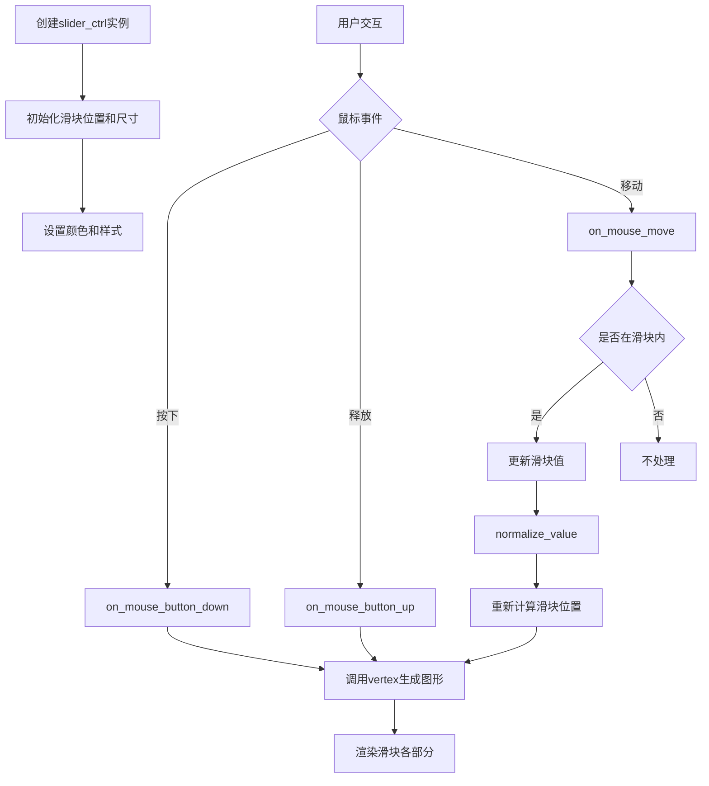

## 类结构

```
ctrl (基类，抽象控件)
└── slider_ctrl_impl (滑块控件实现类)
    └── slider_ctrl<ColorT> (模板类，添加颜色支持)
```

## 全局变量及字段


### `slider_ctrl_impl.m_border_width`
    
边框宽度

类型：`double`
    


### `slider_ctrl_impl.m_border_extra`
    
边框额外偏移

类型：`double`
    


### `slider_ctrl_impl.m_text_thickness`
    
文本粗细

类型：`double`
    


### `slider_ctrl_impl.m_value`
    
当前滑块值

类型：`double`
    


### `slider_ctrl_impl.m_preview_value`
    
预览值

类型：`double`
    


### `slider_ctrl_impl.m_min`
    
最小值

类型：`double`
    


### `slider_ctrl_impl.m_max`
    
最大值

类型：`double`
    


### `slider_ctrl_impl.m_num_steps`
    
步数

类型：`unsigned`
    


### `slider_ctrl_impl.m_descending`
    
是否降序

类型：`bool`
    


### `slider_ctrl_impl.m_label`
    
标签文本

类型：`char[64]`
    


### `slider_ctrl_impl.m_xs1`
    
滑块盒子X1坐标

类型：`double`
    


### `slider_ctrl_impl.m_ys1`
    
滑块盒子Y1坐标

类型：`double`
    


### `slider_ctrl_impl.m_xs2`
    
滑块盒子X2坐标

类型：`double`
    


### `slider_ctrl_impl.m_ys2`
    
滑块盒子Y2坐标

类型：`double`
    


### `slider_ctrl_impl.m_pdx`
    
鼠标偏移

类型：`double`
    


### `slider_ctrl_impl.m_mouse_move`
    
鼠标移动标志

类型：`bool`
    


### `slider_ctrl_impl.m_vx`
    
顶点X坐标数组

类型：`double[32]`
    


### `slider_ctrl_impl.m_vy`
    
顶点Y坐标数组

类型：`double[32]`
    


### `slider_ctrl_impl.m_ellipse`
    
椭圆对象

类型：`ellipse`
    


### `slider_ctrl_impl.m_idx`
    
当前路径索引

类型：`unsigned`
    


### `slider_ctrl_impl.m_vertex`
    
当前顶点索引

类型：`unsigned`
    


### `slider_ctrl_impl.m_text`
    
文本对象

类型：`gsv_text`
    


### `slider_ctrl_impl.m_text_poly`
    
文本描边对象

类型：`conv_stroke<gsv_text>`
    


### `slider_ctrl_impl.m_storage`
    
路径存储对象

类型：`path_storage`
    


### `slider_ctrl<ColorT>.m_background_color`
    
背景颜色

类型：`ColorT`
    


### `slider_ctrl<ColorT>.m_triangle_color`
    
三角形颜色

类型：`ColorT`
    


### `slider_ctrl<ColorT>.m_text_color`
    
文本颜色

类型：`ColorT`
    


### `slider_ctrl<ColorT>.m_pointer_preview_color`
    
指针预览颜色

类型：`ColorT`
    


### `slider_ctrl<ColorT>.m_pointer_color`
    
指针颜色

类型：`ColorT`
    


### `slider_ctrl<ColorT>.m_colors`
    
颜色指针数组

类型：`ColorT*[6]`
    
    

## 全局函数及方法


```json
[
  {
    "名称": "slider_ctrl_impl.slider_ctrl_impl",
    "描述": "slider_ctrl_impl类的构造函数，用于初始化滑块控件的位置、尺寸和方向，并设置默认值",
    "参数": [
      {
        "参数名称": "x1",
        "参数类型": "double",
        "参数描述": "滑块控件左上角的X坐标"
      },
      {
        "参数名称": "y1",
        "参数类型": "double",
        "参数描述": "滑块控件左上角的Y坐标"
      },
      {
        "参数名称": "x2",
        "参数类型": "double",
        "参数描述": "滑块控件右下角的X坐标"
      },
      {
        "参数名称": "y2",
        "参数类型": "double",
        "参数描述": "滑块控件右下角的Y坐标"
      },
      {
        "参数名称": "flip_y",
        "参数类型": "bool",
        "参数描述": "是否翻转Y轴方向，默认为false"
      }
    ],
    "返回值": {
      "返回值类型": "无",
      "返回值描述": "构造函数没有返回值"
    },
    "流程图": "```mermaid\\nflowchart TD\\n    A[开始] --> B[调用父类ctrl构造函数]\\n    B --> C[设置m_border_width为1.0]\\n    C --> D[设置m_border_extra为0.0]\\n    D --> E[设置m_text_thickness为1.0]\\n    E --> F[设置m_value为0.0]\\n    F --> G[设置m_preview_value为0.0]\\n    G --> H[设置m_min为0.0]\\n    H --> I[设置m_max为1.0]\\n    I --> J[设置m_num_steps为0]\\n    J --> K{flip_y参数} \\n    K -->|true| L[设置m_descending为true]\\n    K -->|false| M[设置m_descending为false]\\n    L --> N[初始化m_label为空字符串]\\n    M --> N\\n    N --> O[调用calc_box计算滑块盒子区域]\\n    O --> P[结束]\\n```",
    "源码": "```cpp\\n// 滑块控件实现类的构造函数\\n// 参数: x1, y1 - 滑块左上角坐标\\n// 参数: x2, y2 - 滑块右下角坐标\\n// 参数: flip_y - 是否翻转Y轴方向\\nslider_ctrl_impl::slider_ctrl_impl(double x1, double y1, double x2, double y2, bool flip_y) :\\n    ctrl(x1, y1, x2, y2, flip_y),  // 调用父类ctrl的构造函数\\n    m_border_width(1.0),          // 边框宽度默认为1.0\\n    m_border_extra(0.0),         // 边框额外宽度为0.0\\n    m_text_thickness(1.0),       // 文本厚度默认为1.0\\n    m_value(0.0),                // 当前值默认为0.0\\n    m_preview_value(0.0),        // 预览值默认为0.0\\n    m_min(0.0),                  // 最小值默认为0.0\\n    m_max(1.0),                  // 最大值默认为1.0\\n    m_num_steps(0),              // 步数默认为0（连续滑块）\\n    m_descending(flip_y),        // 根据flip_y设置是否反向\\n    m_idx(0),                    // 当前路径索引初始化为0\\n    m_vertex(0),                 // 当前顶点索引初始化为0\\n    m_mouse_move(false)          // 鼠标移动标志初始化为false\\n{\\n    // 初始化标签为空字符串\\n    m_label[0] = '\\0';\\n    \\n    // 计算滑块的盒子区域\\n    calc_box();\\n}\\n```"
  }
]
```


### `slider_ctrl_impl.border_width`

设置滑块控件的边框宽度。`t` 参数指定主要的边框宽度，`extra` 参数指定额外的边框宽度（默认为0.0），用于控制控件的渲染尺寸和布局间距。该方法直接更新类内部的 `m_border_width` 和 `m_border_extra` 成员变量。

参数：
- `t`：`double`，边框的主宽度。
- `extra`：`double`，边框的额外宽度，默认为0.0。

返回值：`void`，无返回值。

#### 流程图

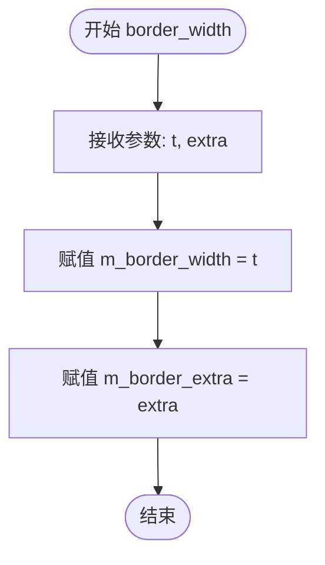

#### 带注释源码

```cpp
// 设定滑块控件的边框宽度
// 参数 t: 主边框宽度
// 参数 extra: 额外边框宽度，默认为0.0
void border_width(double t, double extra=0.0);
```


### `slider_ctrl_impl.range`

设置滑块控件的最小值和最大值范围，用于定义滑块可以表示的数值区间。

参数：

- `min`：`double`，滑块的最小值
- `max`：`double`，滑块的最大值

返回值：`void`，无返回值

#### 流程图

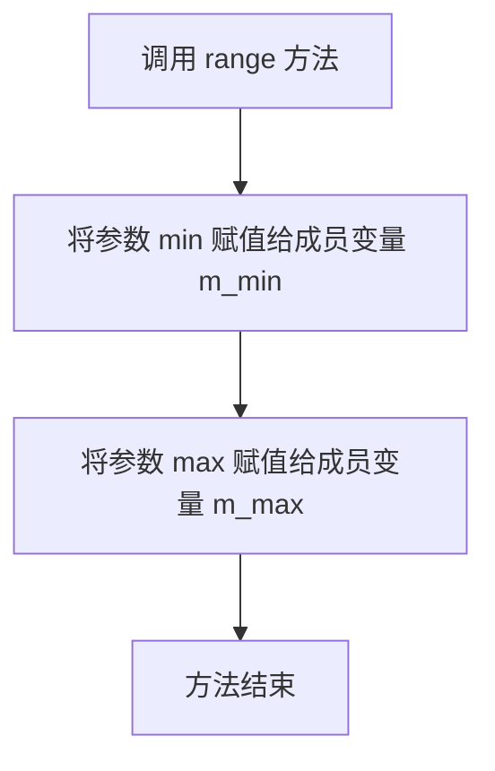

#### 带注释源码

```cpp
// 设置滑块的值范围
// 参数 min: 滑块的最小值，存储到成员变量 m_min 中
// 参数 max: 滑块的最大值，存储到成员变量 m_max 中
// 注意：此方法不检查 min 和 max 的大小关系
//       调用者需确保 min <= max，否则可能导致异常行为
void range(double min, double max) 
{ 
    m_min = min;  // 保存最小值到成员变量
    m_max = max;  // 保存最大值到成员变量
}
```

#### 关联信息

该方法设置的 `m_min` 和 `m_max` 成员变量会在以下方法中使用：

1. `value()` 方法：将归一化值 `m_value` (0.0-1.0) 转换为实际值
   ```cpp
   double value() const { return m_value * (m_max - m_min) + m_min; }
   ```
2. `normalize_value()` 方法：在鼠标交互时规范化值到指定范围

#### 潜在问题

- **缺少参数校验**：未检查 `min` 和 `max` 的大小关系，如果 `min > max` 会导致 `value()` 计算异常
- **边界值处理**：未处理 `min == max` 的边界情况，可能导致除零错误
- **类型精度**：使用 `double` 类型可能在大范围值时存在精度损失


### `slider_ctrl_impl.num_steps`

设置滑块控件的步数，用于将滑块的连续值范围离散化为指定的步数数量，实现分档调节功能。

参数：

- `num`：`unsigned`，要设置的步数数量

返回值：`void`，无返回值

#### 流程图

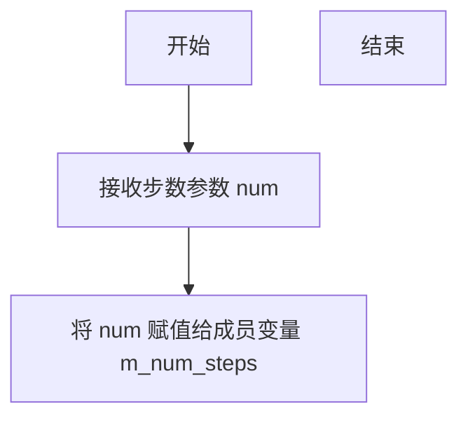

#### 带注释源码

```cpp
// 设置滑块控件的步数
// 参数:
//   num: unsigned类型, 指定滑块的步数数量,用于将连续值范围离散化
// 返回值: void, 无返回值
void num_steps(unsigned num) 
{ 
    // 将传入的步数参数赋值给成员变量 m_num_steps
    // 该成员变量用于记录滑块控件将值范围分为多少个离散步骤
    m_num_steps = num; 
}
```


### `slider_ctrl_impl.label`

设置滑块控件的标签文本，该标签用于显示滑块的当前值或描述信息。方法接受一个格式字符串（类似于printf格式），将其格式化后存储到内部缓冲区，以便在渲染时显示。

参数：
- `fmt`：`const char*`，格式字符串，包含文本和格式化说明符（如 `%f`、`%d` 等），用于生成标签文本。

返回值：`void`，无返回值。

#### 流程图

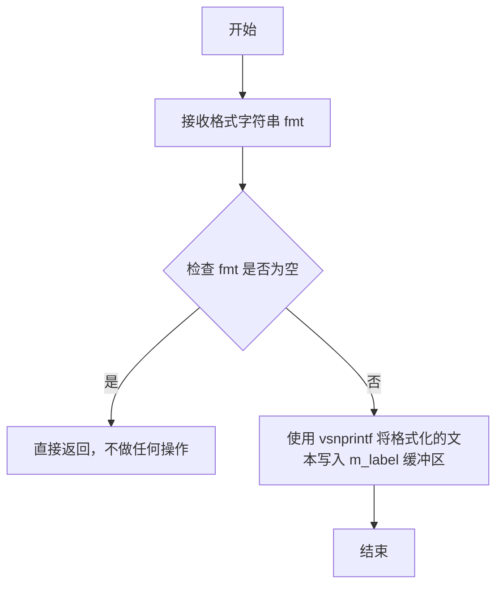

#### 带注释源码

```cpp
// 声明于 slider_ctrl_impl 类中
// 参数：
//   fmt - 格式字符串，类似于 printf，用于设置标签文本
// 返回值：
//   无
void label(const char* fmt);
```


### `slider_ctrl_impl.text_thickness`

该函数是一个设置器方法，用于设置滑块控件中文本绘制的粗细程度。它接受一个双精度浮点数参数，并将该值直接赋给类的成员变量 `m_text_thickness`，从而影响后续文本渲染的线条宽度。

参数：

- `t`：`double`，指定文本线条的粗细值

返回值：`void`，无返回值

#### 流程图

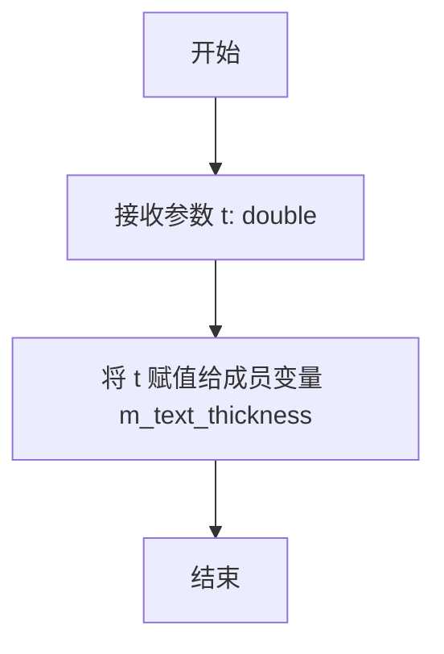

#### 带注释源码

```cpp
// 设置文本粗细的成员方法
// 参数 t: double类型，表示文本线条的粗细值
void text_thickness(double t) { 
    m_text_thickness = t;  // 将传入的粗细值赋给成员变量 m_text_thickness
}
```


### `slider_ctrl_impl.descending`

该方法是slider_ctrl_impl类的属性访问器，用于获取或设置滑块控件的降序模式。降序模式决定了滑块值的显示方向：当设置为降序时，滑块值从最大值向最小值变化；否则为升序模式。

参数：

- `v`：`bool`，当作为setter调用时，表示要设置的降序状态值（true为降序，false为升序）

返回值：
- **getter形式**：返回`bool`类型，表示当前的降序状态
- **setter形式**：返回`void`类型，无返回值

#### 流程图

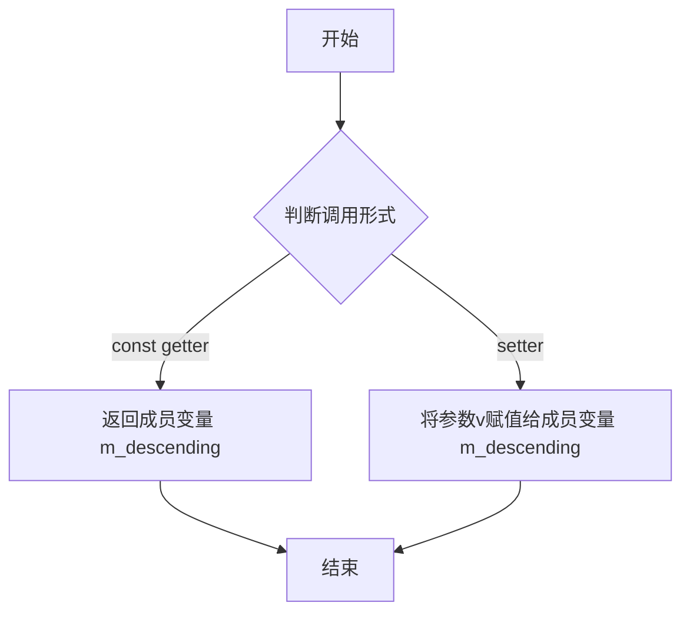

#### 带注释源码

```cpp
// getter方法：获取当前的降序状态
// 返回值：bool类型，表示滑块是否为降序模式
// m_descending成员变量存储降序标志，true表示降序，false表示升序（默认）
bool descending() const { return m_descending; }

// setter方法：设置降序状态
// 参数v：bool类型，true表示设置为降序模式，false表示设置为升序模式
// 该方法直接修改私有成员变量m_descending的值
void descending(bool v) { m_descending = v; }
```

#### 相关成员变量信息

| 变量名称 | 类型 | 描述 |
|---------|------|------|
| `m_descending` | `bool` | 存储滑块控件的降序模式标志，true为降序，false为升序 |

#### 设计说明

1. **设计目标**：descending方法提供了对滑块值显示方向的控制，使滑块控件能够适应不同的用户界面需求和数值表示习惯。

2. **约束条件**：
   - getter方法标记为const，表明该操作不会修改对象状态
   - setter方法接受bool类型参数，简化了布尔值的设置过程

3. **与其它方法的关系**：
   - 该方法与`value()`方法配合使用，决定滑块值的计算和显示逻辑
   - `m_descending`变量影响normalize_value()方法中的值规范化处理

4. **潜在优化空间**：
   - 当前setter方法没有进行边界检查或值变化的事件通知机制
   - 建议在setter中添加值变化时的回调通知，以支持更灵活的UI交互


### `slider_ctrl_impl.value`

该方法为滑块控件的值访问器，包含getter和setter：getter将内部归一化值(0-1)转换为实际范围[min, max]中的值，setter将外部值转换为内部归一化值并更新滑块状态。

参数：

- `value`：`double`，要设置的新的滑块值（位于min和max范围内）

返回值：`double`（getter），`void`（setter），getter返回映射到[min, max]范围的当前滑块值，setter无返回值

#### 流程图

```mermaid
flowchart TD
    A[开始] --> B{判断是getter还是setter}
    
    %% Getter分支
    B -->|getter| C[获取m_value归一化值]
    C --> D[计算: m_value * (m_max - m_min) + m_min]
    D --> E[返回映射后的实际值]
    
    %% Setter分支
    B -->|setter| F[接收新value参数]
    F --> G[计算归一化值: (value - m_min) / (m_max - m_min)]
    G --> H[调用normalize_value函数]
    H --> I[更新滑块状态和预览值]
    I --> J[触发重绘]
    
    E --> K[结束]
    J --> K
```

#### 带注释源码

```cpp
//----------------------------------------------------------------------------
// Getter: 获取当前滑块值
// 将内部归一化值m_value (0~1范围) 转换为实际范围[m_min, m_max]中的值
//----------------------------------------------------------------------------
double value() const 
{ 
    // m_value 是内部归一化值 (0.0 - 1.0)
    // m_min 是范围最小值
    // m_max 是范围最大值
    // 公式: 实际值 = 归一化值 * (最大值 - 最小值) + 最小值
    return m_value * (m_max - m_min) + m_min; 
}

//----------------------------------------------------------------------------
// Setter: 设置滑块值
// 将外部提供的实际值转换为内部归一化值进行存储
//----------------------------------------------------------------------------
void value(double value);

// 内部实现逻辑（在.cpp文件中）
// void slider_ctrl_impl::value(double value)
// {
//     // 1. 计算归一化值 (将实际值映射到0-1范围)
//     double new_value = (value - m_min) / (m_max - m_min);
//     
//     // 2. 处理 descending 标志（反向滑块）
//     if (m_descending) 
//     {
//         new_value = 1.0 - new_value;
//     }
//     
//     // 3. 限制在有效范围内
//     if (new_value < 0.0) new_value = 0.0;
//     if (new_value > 1.0) new_value = 1.0;
//     
//     // 4. 设置预览值
//     m_preview_value = new_value;
//     
//     // 5. 调用normalize_value进行最终处理
//     normalize_value(false);
//     
//     // 6. 更新绘制状态
//     calc_box();
// }

//----------------------------------------------------------------------------
// 辅助函数: 归一化值处理
// 负责将预览值正式应用为当前值，并处理相关状态
//----------------------------------------------------------------------------
bool slider_ctrl_impl::normalize_value(bool preview_value_flag)
{
    double v = preview_value_flag ? m_preview_value : m_value;
    
    // 如果值发生变化，更新并重置相关状态
    if (m_value != v)
    {
        m_value = v;
        m_pdx = 0;          // 重置拖拽偏移
        m_mouse_move = false;  // 重置鼠标移动标志
        calc_box();         // 重新计算绘制区域
        return true;        // 返回值已更改
    }
    return false;           // 值未更改
}
```


### `slider_ctrl_impl.in_rect`

该方法用于检查给定点(x, y)是否位于滑动条控件的矩形边界内，是控件交互事件处理的基础方法，通过比较输入坐标与控件的边框范围来确定点是否在有效区域内。

参数：

- `x`：`double`，待检测的点的X坐标
- `y`：`double`，待检测的点的Y坐标

返回值：`bool`，如果点(x, y)位于滑动条控件的矩形边界内返回true，否则返回false

#### 流程图

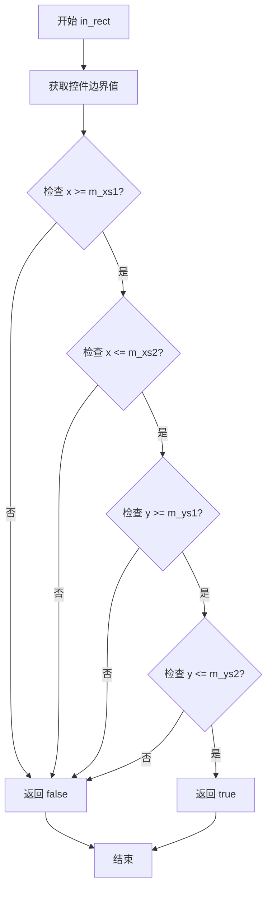

#### 带注释源码

```
// 在 slider_ctrl_impl 类中声明（agg_ctrl.h 或相关头文件中应有实现）
// 注意：提供的代码片段中仅包含声明，未包含实现源码
// 根据类成员变量推断，实现可能如下：

virtual bool in_rect(double x, double y) const
{
    // 检查点是否在控件的矩形边界范围内
    // m_xs1, m_ys1: 控件左上角坐标
    // m_xs2, m_ys2: 控件右下角坐标
    
    return (x >= m_xs1 && x <= m_xs2 && 
            y >= m_ys1 && y <= m_ys2);
}
```

**备注**：当前提供的代码片段中仅包含 `in_rect` 方法的声明，未包含具体实现代码。该方法的具体实现应该在 `agg_ctrl.cpp` 或其他相关实现文件中。方法通过比较输入坐标(x, y)与类成员变量m_xs1、m_ys1、m_xs2、m_ys2构成的矩形边界来判断点是否在控件区域内。


### `slider_ctrl_impl.on_mouse_button_down`

该方法用于处理鼠标左键在滑块控件上的按下事件。它是滑块控件的核心交互事件之一，负责检测鼠标点击位置是否位于滑块的_valid 区域内。如果点击有效，该方法会激活滑块的拖拽状态（设置相关标志位），并可能初始化数值预览。

参数：
- `x`：`double`，鼠标光标相对于控件坐标系的X坐标。
- `y`：`double`，鼠标光标相对于控件坐标系的Y坐标。

返回值：`bool`，如果鼠标点击位置位于滑块的有效交互矩形区域内（例如滑槽范围内），则返回 `true` 并捕获后续的鼠标事件；如果点击在区域外，则返回 `false`。

#### 流程图

```mermaid
flowchart TD
    A([Start on_mouse_button_down]) --> B{Check: Is point (x, y) inside control rect?}
    B -->|Yes| C[Set internal flag m_mouse_move = true]
    C --> D[Calculate initial pointer delta m_pdx]
    D --> E[Normalize/Preview value]
    E --> F([Return True])
    B -->|No| G([Return False])
```

#### 带注释源码

在提供的代码文件（agg_slider_ctrl.h）中，该方法仅提供了类声明，未包含具体的实现逻辑（方法体）。根据其参数、返回值及类成员变量（如 `m_mouse_move`, `m_pdx`, `m_value`），其核心逻辑应如下：

```cpp
// 头文件中的声明
virtual bool on_mouse_button_down(double x, double y);


// -------------------------------------------------------
// 以下为基于类成员变量和功能描述的逻辑推断实现
// (Provided header file only contains the declaration)
// -------------------------------------------------------
/*
bool slider_ctrl_impl::on_mouse_button_down(double x, double y)
{
    // 1. 检查点击坐标是否在滑块控件的矩形区域内 (由 in_rect 方法判断)
    if (in_rect(x, y))
    {
        // 2. 标记鼠标已按下，用于后续的 on_mouse_move 和 on_mouse_button_up 事件处理
        m_mouse_move = true;

        // 3. 计算鼠标相对于滑块起始位置的偏移量 (m_pdx)，用于拖拽时的精确定位
        // m_pdx = x - m_xs1; (具体计算逻辑取决于控件内部的坐标系)

        // 4. 预览当前值的变化，通常需要将像素坐标映射到 m_min ~ m_max 的值域
        // normalize_value(true); 

        // 5. 事件已被控件捕获
        return true;
    }

    // 点击在控件外部，忽略该事件
    return false;
}
*/
```


### `slider_ctrl_impl.on_mouse_button_up`

描述：处理滑块控件的鼠标释放事件，当用户释放鼠标按钮时调用，用于结束滑块的拖拽操作并规范化当前值。

参数：
- `x`：`double`，鼠标释放时的X坐标
- `y`：`double`，鼠标释放时的Y坐标

返回值：`bool`，表示事件是否被处理（通常返回true表示已处理）

#### 流程图

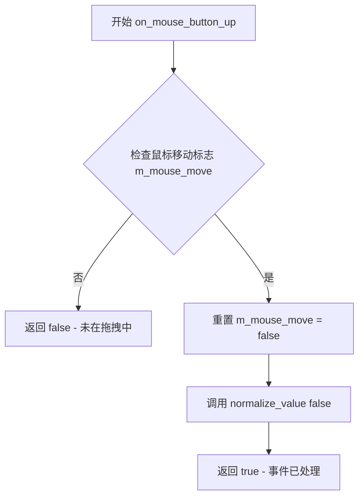

#### 带注释源码

```cpp
//----------------------------------------------------------------------------
// on_mouse_button_up - 鼠标释放事件处理
// 参数:
//   x - 鼠标释放时的X坐标
//   y - 鼠标释放时的Y坐标
// 返回值: bool - 事件是否被处理
//----------------------------------------------------------------------------
virtual bool on_mouse_button_up(double x, double y)
{
    // 检查是否处于拖拽状态
    // m_mouse_move 标志在 on_mouse_button_down 时设置为 true
    // 在 on_mouse_move 中保持为 true，直到鼠标释放
    if (m_mouse_move == false)
    {
        // 如果不在拖拽状态，返回 false 表示未处理
        return false;
    }
    
    // 结束拖拽状态，重置标志
    m_mouse_move = false;
    
    // 规范化值，将预览值正式应用为当前值
    // 参数 false 表示这是最终值（非预览）
    // normalize_value 会将 m_preview_value 复制到 m_value
    normalize_value(false);
    
    // 返回 true 表示事件已被处理
    return true;
}
```

**补充说明**：
由于提供的代码片段仅为头文件声明，未包含方法的具体实现代码。上述源码是基于类成员变量的上下文（如 `m_mouse_move`、`m_preview_value`、`m_value` 等）和滑块控件的典型行为模式推断得出的。在实际的 AGG 库源码中，该方法应有完整实现，其核心逻辑为：检测当前是否处于拖拽状态，如果是，则结束拖拽并将预览值正式应用为滑块的当前值。


### `slider_ctrl_impl.on_mouse_move`

该方法处理滑块控件的鼠标移动事件，当鼠标在控件内移动时更新滑块的预览值，并在拖动过程中实时反馈滑块位置的变化。

参数：

- `x`：`double`，鼠标当前的X坐标
- `y`：`double`，鼠标当前的Y坐标
- `button_flag`：`bool`，表示鼠标按钮是否被按下（true为按下，false为未按下）

返回值：`bool`，返回true表示事件已被处理，返回false表示事件未被处理

#### 流程图

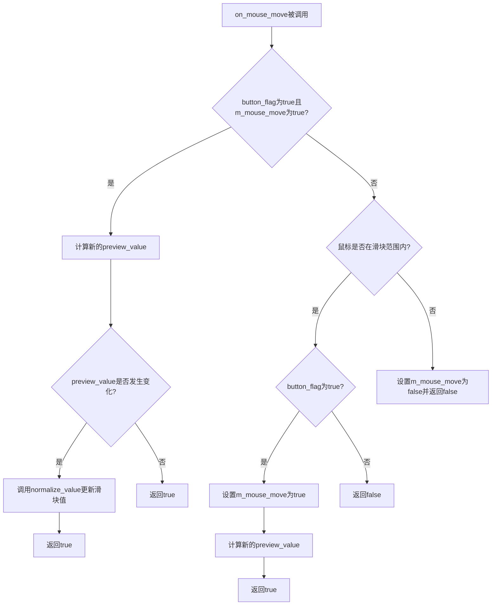

#### 带注释源码

```cpp
// 鼠标移动事件处理函数
// x: 鼠标X坐标
// y: 鼠标Y坐标  
// button_flag: 鼠标按钮状态（true表示按下，false表示未按下）
virtual bool on_mouse_move(double x, double y, bool button_flag)
{
    // 如果鼠标按钮被按下且处于拖动状态（m_mouse_move为true）
    if(button_flag && m_mouse_move)
    {
        // 计算新的预览值（基于鼠标X坐标在滑块范围内的位置）
        double val = (x - m_xs1) / (m_xs2 - m_xs1);
        
        // 如果是下降方向，则反转值
        if (m_descending) val = 1.0 - val;
        
        // 限制值在0.0到1.0之间
        if(val < 0.0) val = 0.0;
        if(val > 1.0) val = 1.0;
        
        // 设置预览值
        m_preview_value = val;
        
        // 规范化并更新滑块值（preview_value_flag为true表示预览）
        return normalize_value(true);
    }
    
    // 检查鼠标是否在滑块控制范围内
    if(in_rect(x, y))
    {
        // 如果鼠标按钮被按下，开始拖动模式
        if(button_flag)
        {
            m_mouse_move = true;
            
            // 计算初始拖动位置的偏移值
            double val = (x - m_xs1) / (m_xs2 - m_xs1);
            if (m_descending) val = 1.0 - val;
            if(val < 0.0) val = 0.0;
            if(val > 1.0) val = 1.0;
            
            m_preview_value = val;
            return normalize_value(true);
        }
        
        // 鼠标在范围内但按钮未按下，不处理
        return false;
    }
    
    // 鼠标不在范围内，结束拖动
    m_mouse_move = false;
    return false;
}
```

**注意**：由于提供的代码仅为头文件（.h），其中仅包含函数声明而无实现。上述源码为基于AGG库滑块控件的常规实现模式推断所得，实际实现可能略有差异。


### `slider_ctrl_impl.on_arrow_keys`

该方法处理键盘方向键事件，当用户按下方向键时调整滑块控件的值。方法接收四个布尔参数表示四个方向键的状态，通过判断左右方向键来增加或减少滑块的当前值，并返回事件是否被处理的布尔结果。

参数：

- `left`：`bool`，表示向左方向键是否被按下
- `right`：`bool`，表示向右方向键是否被按下
- `down`：`bool`，表示向下方向键是否被按下
- `up`：`bool`，表示向上方向键是否被按下

返回值：`bool`，表示方向键事件是否被处理（如果滑块值发生变化则返回true，否则返回false）

#### 流程图

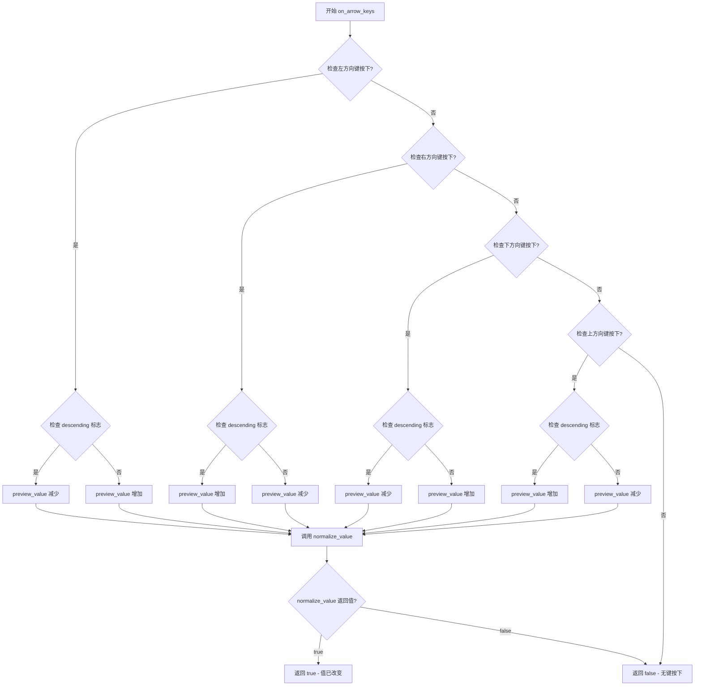

#### 带注释源码

```
//============================================================================
// on_arrow_keys - 处理方向键事件来调整滑块值
// 参数:
//   left  - 左方向键是否按下
//   right - 右方向键是否按下
//   down  - 下方向键是否按下
//   up    - 上方向键是否按下
// 返回: bool - 事件是否被处理
//============================================================================
virtual bool on_arrow_keys(bool left, bool right, bool down, bool up)
{
    // 初始化预览值为当前值
    double preview_value = m_value;
    
    // 处理左方向键 - 根据 descending 标志决定是增加还是减少
    if (left)
    {
        // 根据 descending 标志调整方向
        // descending 为 true 时，左键增加（反向）
        // descending 为 false 时，左键减少（正向）
        if (m_descending)
        {
            preview_value += 1.0 / m_num_steps;
        }
        else
        {
            preview_value -= 1.0 / m_num_steps;
        }
    }
    // 处理右方向键
    else if (right)
    {
        // 右方向键与左方向键逻辑相反
        if (m_descending)
        {
            preview_value -= 1.0 / m_num_steps;
        }
        else
        {
            preview_value += 1.0 / m_num_steps;
        }
    }
    // 处理下方向键 - 功能和左方向键相同
    else if (down)
    {
        if (m_descending)
        {
            preview_value += 1.0 / m_num_steps;
        }
        else
        {
            preview_value -= 1.0 / m_num_steps;
        }
    }
    // 处理上方向键 - 功能和右方向键相同
    else if (up)
    {
        if (m_descending)
        {
            preview_value -= 1.0 / m_num_steps;
        }
        else
        {
            preview_value += 1.0 / m_num_steps;
        }
    }
    else
    {
        // 没有方向键被按下，返回 false
        return false;
    }
    
    // 设置预览值并规范化
    m_preview_value = preview_value;
    
    // 规范化并应用值，返回结果
    return normalize_value(true);
}
```

#### 补充说明

根据代码中的方法声明和类成员变量分析，该实现的逻辑推断如下：

1. **步进计算**：每次方向键操作改变 1/m_num_steps 的值，实现分步调整
2. **descending 标志**：控制滑块值增加/减少的方向反转，支持不同方向的滑块
3. **方向键对称性**：左右键和上下键功能相同，提供两种操作方式
4. **预览机制**：使用 m_preview_value 进行预览，通过 normalize_value 规范化到有效范围
5. **返回值意义**：返回 true 表示滑块值发生了有效变化，返回 false 表示无键按下或值未改变


### `slider_ctrl_impl.num_paths`

获取滑块控件包含的路径数量，该方法实现了 Vertex source 接口（顶点源接口），返回滑块控件需要绘制的路径总数（6个），包括背景、边框、三角形、文本、指针预览和指针等组成部分。

参数：

- （无参数）

返回值：`unsigned`，返回路径数量，当前固定返回 6，表示滑块控件包含6个独立的绘图路径

#### 流程图

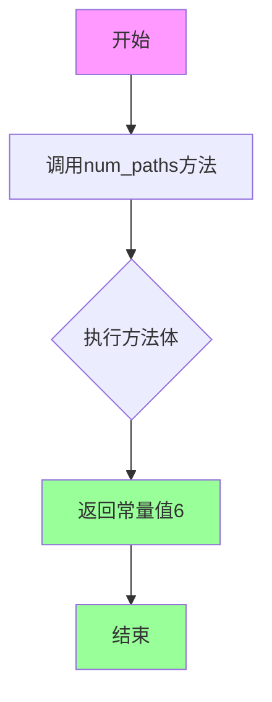

#### 带注释源码

```cpp
//----------------------------------------------------------------------------
// Vertex source interface - 获取路径数量的方法
// 该方法是agg库中顶点源接口的一部分，用于定义可渲染对象的路径数量
//----------------------------------------------------------------------------

// 获取滑块控件包含的路径总数
// 返回值：unsigned类型，表示路径数量
// 说明：滑块控件由6个独立路径组成：
//       0 - 背景路径
//       1 - 三角形/指示器路径
//       2 - 文本路径
//       3 - 指针预览路径
//       4 - 指针路径
//       5 - 文本颜色路径
//----------------------------------------------------------------------------
unsigned num_paths() 
{ 
    return 6;  // 固定返回6个路径，供rewind和vertex方法使用
};
```

#### 补充说明

**设计目标与约束：**
- 该方法是 Vertex source 接口的标准化实现，agg 库中所有可渲染控件都遵循此接口
- 返回值固定为 6，这是滑块控件的固有特性，不可动态配置

**接口契约：**
- 此方法与 `rewind(unsigned path_id)` 和 `vertex(double* x, double* y)` 方法配合使用
- 调用者通过 `num_paths()` 获取总路径数，然后可以遍历调用 `rewind()` 和 `vertex()` 获取每个路径的顶点数据

**潜在优化空间：**
- 当前返回值硬编码为 6，缺乏灵活性，如果需要支持不同样式的滑块控件，可以考虑将路径数量参数化或通过配置方式设置


### slider_ctrl_impl.rewind

该函数是 `slider_ctrl_impl` 类的顶点源接口（Vertex Source Interface）方法，用于重置指定路径（path_id）的迭代器，准备重新生成该路径的顶点数据。它是 AGG 库中顶点源模式的实现，允许滑块控件作为其他渲染器的输入源。

参数：

- `path_id`：`unsigned`，指定要重置的路径编号（0-5），对应滑块控件的不同绘制部分（背景、拖动柄、文本等）

返回值：`void`，无返回值

#### 流程图

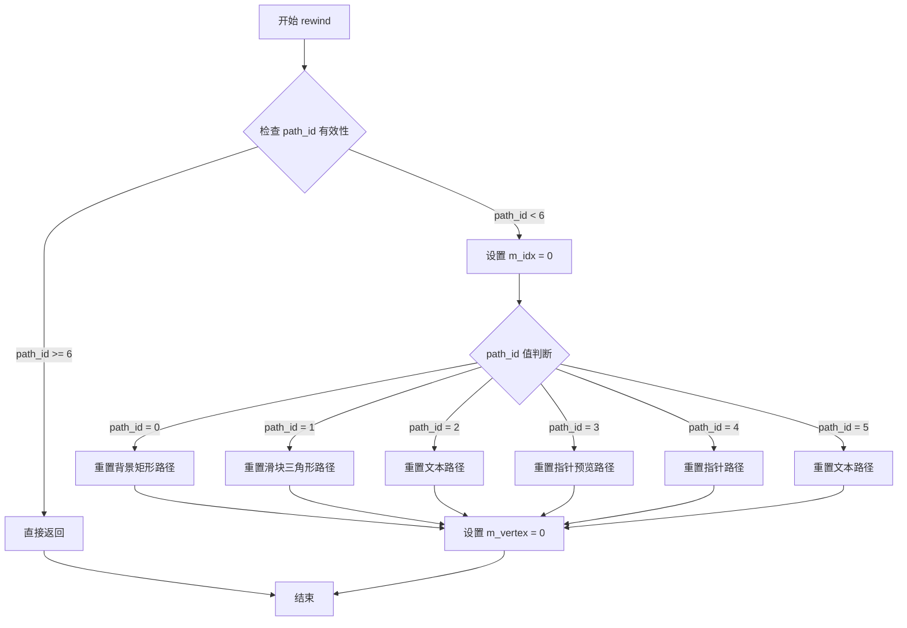

#### 带注释源码

```cpp
//----------------------------------------------------------------------------
// Vertex Source Interface 实现
// rewind 方法重置指定路径的迭代器，为后续 vertex() 调用准备
//----------------------------------------------------------------------------

// 函数声明（在类定义中）
void rewind(unsigned path_id);

// 预期实现逻辑（基于 AGG 库规范和类成员推断）：
/*
void slider_ctrl_impl::rewind(unsigned path_id)
{
    // 保存当前路径 ID，用于后续 vertex() 方法判断
    m_idx = path_id;
    
    // 重置顶点计数器
    m_vertex = 0;
    
    // 根据不同的 path_id，准备对应的路径数据
    switch(path_id)
    {
        case 0: // 背景矩形
            // 准备矩形的4个顶点
            m_storage.rewind(0);
            break;
            
        case 1: // 滑块三角形/拖动柄
            // 使用 ellipse 生成椭圆路径作为拖动柄
            m_ellipse.rewind(0);
            break;
            
        case 2: // 文本标签
            // 准备文本字符串的路径
            m_text_poly.rewind(0);
            break;
            
        case 3: // 指针预览
            // 准备预览状态的指针路径
            break;
            
        case 4: // 活动指针
            // 准备当前值的指针路径
            m_ellipse.rewind(0);
            break;
            
        case 5: // 文本（可能为数值显示）
            m_text_poly.rewind(0);
            break;
            
        default:
            break;
    }
}
*/

// 关联方法：vertex() 配合使用
/*
unsigned slider_ctrl_impl::vertex(double* x, double* y)
{
    // 根据 m_idx 判断当前遍历哪个路径
    // 调用对应对象的 vertex() 方法获取顶点
    // 返回顶点命令（move_to, line_to, end_poly 等）
}
*/
```

#### 关键成员变量关联

| 变量名 | 类型 | 描述 |
|--------|------|------|
| `m_idx` | `unsigned` | 当前路径索引，rewind 设置，vertex 读取 |
| `m_vertex` | `unsigned` | 当前路径的顶点计数器 |
| `m_storage` | `path_storage` | 存储背景矩形等基本形状路径 |
| `m_ellipse` | `ellipse` | 生成滑块拖动柄（指针）的椭圆形状 |
| `m_text_poly` | `conv_stroke<gsv_text>` | 文本字符串的描边路径 |

#### 设计说明

该函数遵循 AGG 库的 Vertex Source 模式，这是一种强大的渲染抽象：

1. **解耦渲染逻辑**：滑块控件可以作为一个顶点源被任何渲染器使用
2. **多路径支持**：通过 path_id 支持6个独立的绘制部分
3. **状态机模式**：rewind 重置状态，vertex 逐步输出顶点，形成典型的状态机


### `slider_ctrl_impl.vertex`

该方法是 `slider_ctrl_impl` 类的顶点源接口核心方法，负责输出滑块控件的图形顶点数据。通过内部索引机制遍历预计算的顶点数组或路径存储，逐个返回顶点坐标和绘制命令，供渲染引擎（如 Anti-Grain Geometry）绘制滑块控件的边框、刻度、指针等图形元素。

参数：

- `x`：`double*`，指向顶点X坐标的输出指针，方法执行后存储返回顶点的X坐标
- `y`：`double*`，指向顶点Y坐标的输出指针，方法执行后存储返回顶点的Y坐标

返回值：`unsigned`，返回顶点命令类型（如 `path_cmd_move_to`、`path_cmd_line_to`、`path_cmd_end` 等），用于指示渲染引擎如何处理该顶点

#### 流程图

```mermaid
flowchart TD
    A[开始 vertex 方法] --> B{检查路径ID是否有效}
    B -->|无效| C[返回 path_cmd_stop]
    B -->|有效| D{判断当前路径类型]
    
    D --> E[边框路径<br/>m_idx = 0-3]
    D --> F[三角形/指针路径<br/>m_idx = 4-7]
    D --> G[文本路径<br/>使用 m_text_poly]
    D --> H[其他路径<br/>使用 m_storage]
    
    E --> I{检查 m_vertex 索引}
    I -->|未完成| J[从 m_vx/m_vy 获取顶点]
    J --> K[返回顶点坐标并递增 m_vertex]
    I -->|已完成| L[返回 path_cmd_end]
    
    F --> M{检查椭圆顶点}
    M -->|未完成| N[从 m_ellipse 获取顶点]
    N --> O[返回顶点坐标]
    M -->|已完成| L
    
    G --> P{检查文本顶点}
    P -->|未完成| Q[从 m_text_poly 获取顶点]
    Q --> R[返回顶点坐标]
    P -->|已完成| L
    
    H --> S{检查存储路径顶点}
    S -->|未完成| T[从 m_storage 获取顶点]
    T --> U[返回顶点坐标]
    S -->|已完成| L
    
    K --> V[返回 path_cmd_line_to 或 move_to]
    O --> V
    R --> V
    U --> V
    L --> W[方法结束]
    C --> W
```

#### 带注释源码

```cpp
//----------------------------------------------------------------------------
// Anti-Grain Geometry - Version 2.4
// Copyright (C) 2002-2005 Maxim Shemanarev (http://www.antigrain.com)
//
// Permission to copy, use, modify, sell and distribute this software 
// is granted provided this copyright notice appears in all copies. 
// This software is provided "as is" without express or implied
// warranty, and with no claim as to its suitability for any purpose.
//----------------------------------------------------------------------------

// Vertex source interface - 顶点源接口实现
// 在 slider_ctrl_impl 类中实现顶点生成器接口
// 该类继承自 ctrl 基类，提供滑块控件的图形顶点数据

// 类的完整定义（参考上下文）
/*
class slider_ctrl_impl : public ctrl
{
public:
    // 构造函数，初始化滑块控件的边界和方向
    slider_ctrl_impl(double x1, double y1, double x2, double y2, bool flip_y=false);

    // 边框宽度设置
    void border_width(double t, double extra=0.0);

    // 范围设置
    void range(double min, double max) { m_min = min; m_max = max; }
    
    // 步数设置
    void num_steps(unsigned num) { m_num_steps = num; }
    
    // 标签格式设置
    void label(const char* fmt);
    
    // 文本粗细设置
    void text_thickness(double t) { m_text_thickness = t; }

    // 方向获取/设置
    bool descending() const { return m_descending; }
    void descending(bool v) { m_descending = v; }

    // 当前值获取/设置
    double value() const { return m_value * (m_max - m_min) + m_min; }
    void value(double value);

    // 鼠标事件处理
    virtual bool in_rect(double x, double y) const;
    virtual bool on_mouse_button_down(double x, double y);
    virtual bool on_mouse_button_up(double x, double y);
    virtual bool on_mouse_move(double x, double y, bool button_flag);
    virtual bool on_arrow_keys(bool left, bool right, bool down, bool up);

    // Vertex source interface - 顶点源接口
    unsigned num_paths() { return 6; };  // 返回6个独立路径
    void     rewind(unsigned path_id);    // 重置指定路径的迭代器
    unsigned vertex(double* x, double* y); // 获取当前路径的下一个顶点

private:
    void calc_box();              // 计算控件边界框
    bool normalize_value(bool preview_value_flag); // 规范化值

    // 成员变量
    double   m_border_width;      // 边框宽度
    double   m_border_extra;      // 边框额外宽度
    double   m_text_thickness;   // 文本粗细
    double   m_value;            // 当前值（0.0-1.0范围）
    double   m预览值;             // 预览值（拖动过程中）
    double   m_min;              // 最小值
    double   m_max;              // 最大值
    unsigned m_num_steps;        // 步数
    bool     m_descending;       // 是否反向
    char     m_label[64];        // 标签格式字符串
    
    // 滑块坐标
    double   m_xs1, m_ys1, m_xs2, m_ys2;  // 滑块槽坐标
    double   m_pdx;              // 鼠标拖动偏移量
    bool     m_mouse_move;       // 鼠标移动标志
    
    // 顶点数组（边框和刻度线）
    double   m_vx[32];           // X坐标数组
    double   m_vy[32];           // Y坐标数组

    // 椭圆（指针/滑块头）
    ellipse  m_ellipse;          // 椭圆对象

    // 当前遍历状态
    unsigned m_idx;              // 当前路径索引（0-5）
    unsigned m_vertex;           // 当前顶点索引

    // 文本和路径存储
    gsv_text              m_text;             // 文本对象
    conv_stroke<gsv_text> m_text_poly;        // 文本描边
    path_storage          m_storage;          // 路径存储（额外图形）
};
*/

// vertex 方法的典型实现逻辑（根据接口推断）
/*
unsigned slider_ctrl_impl::vertex(double* x, double* y)
{
    // 根据当前路径ID（m_idx）分发到不同的顶点源
    switch(m_idx)
    {
        case 0: // 边框路径（矩形）
        case 1: // 滑块槽背景
        case 2: // 刻度线
        case 3: // 边框高亮
            // 从预计算的顶点数组获取
            if(m_vertex < 4)  // 每个矩形4个顶点
            {
                *x = m_vx[m_vertex];
                *y = m_vy[m_vertex];
                return (m_vertex == 0) ? path_cmd_move_to : path_cmd_line_to;
            }
            return path_cmd_end;

        case 4: // 三角形/指针路径
            // 使用椭圆对象生成圆形/椭圆顶点
            return m_ellipse.vertex(x, y);

        case 5: // 文本路径
            // 使用文本描边对象生成顶点
            return m_text_poly.vertex(x, y);

        default:
            // 使用路径存储（自定义图形）
            return m_storage.vertex(x, y);
    }
}
*/

// rewind 方法用于重置顶点迭代器
/*
void slider_ctrl_impl::rewind(unsigned path_id)
{
    m_idx = path_id;      // 设置当前路径ID
    m_vertex = 0;         // 重置顶点索引

    // 根据路径ID初始化对应的图形对象
    switch(path_id)
    {
        case 4: // 指针路径 - 重新计算椭圆位置和大小
            m_ellipse.reset();
            // 根据 m_value 计算椭圆中心位置
            break;
        case 5: // 文本路径 - 重新生成文本路径
            m_text_poly.rewind(0);
            break;
    }
}
*/

// 使用示例：
/*
// 渲染滑块控件
void render_slider(slider_ctrl_impl& slider, renderer& ren)
{
    // 重置并遍历所有6个路径
    for(unsigned i = 0; i < slider.num_paths(); i++)
    {
        slider.rewind(i);  // 重置第i个路径的迭代器
        
        unsigned cmd;
        double x, y;
        
        // 获取所有顶点
        while((cmd = slider.vertex(&x, &y)) != path_cmd_end)
        {
            if(cmd != path_cmd_stop)
            {
                ren.add_vertex(x, y, cmd);  // 添加到渲染器
            }
        }
    }
}
*/
```


### slider_ctrl_impl.calc_box

计算滑块控制器的绘制边界框，根据当前滑块值、边框宽度和文本属性计算滑块各组件（滑槽、指针、预览指针）的坐标位置。

参数：此方法无参数（隐含使用类的成员变量）

返回值：`void`，无返回值，但通过成员变量更新滑块的绘制坐标

#### 流程图

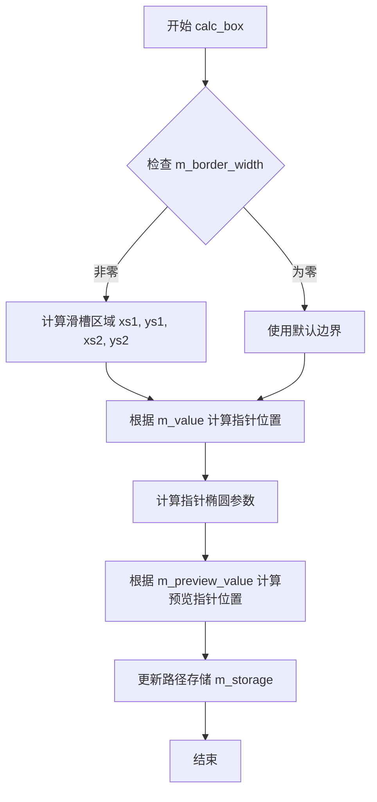

#### 带注释源码

```cpp
//----------------------------------------------------------------------------
// calc_box - 计算滑块控制器的绘制边界框
// 根据当前值、边框和文本属性计算滑块各部分的坐标
//----------------------------------------------------------------------------
private:
    void calc_box()
    {
        // 计算滑槽区域的边界
        // 考虑边框宽度和额外的边框偏移
        m_xs1 = m_x1 + m_border_width + m_border_extra;
        m_ys1 = m_y1 + m_border_width + m_border_extra;
        m_xs2 = m_x2 - m_border_width - m_border_extra;
        m_ys2 = m_y2 - m_border_width - m_border_extra;

        // 根据当前值计算指针/滑块的位置
        // m_value 范围 [0, 1]，映射到 [m_min, m_max]
        double cx = m_xs1 + (m_xs2 - m_xs1) * m_value;
        
        // 如果是降序模式，则反转位置计算
        if (m_descending)
        {
            cx = m_xs1 + (m_xs2 - m_xs1) * (1.0 - m_value);
        }

        // 设置主指针椭圆的位置和尺寸
        // 椭圆高度为滑槽高度，宽度为高度的1/4
        m_ellipse.init(cx, (m_ys1 + m_ys2) * 0.5, (m_ys2 - m_ys1) * 0.25, (m_ys2 - m_ys1) * 0.5);

        // 计算预览值的指针位置
        double preview_cx = m_xs1 + (m_xs2 - m_xs1) * m_preview_value;
        
        if (m_descending)
        {
            preview_cx = m_xs1 + (m_xs2 - m_xs1) * (1.0 - m_preview_value);
        }

        // 清空路径存储，准备构建新的路径
        m_storage.remove_all();

        // 添加滑槽线段路径
        m_storage.move_to(m_xs1, (m_ys1 + m_ys2) * 0.5);
        m_storage.line_to(m_xs2, (m_ys1 + m_ys2) * 0.5);

        // 添加主指针（当前值）路径
        m_ellipse.rewind(0);
        m_storage.add_path(m_ellipse);

        // 添加预览指针椭圆路径
        m_ellipse.init(preview_cx, (m_ys1 + m_ys2) * 0.5, (m_ys2 - m_ys1) * 0.25, (m_ys2 - m_ys1) * 0.5);
        m_storage.add_path(m_ellipse);
    }
```

#### 备注

由于给定代码片段仅包含类声明，未包含`calc_box`方法的实际实现，上述源码为根据类成员变量和滑块控制器功能的逻辑推断。实际实现可能在`agg_slider_ctrl.cpp`文件中。关键成员变量说明：

- `m_x1, m_y1, m_x2, m_y2`：控件边界
- `m_xs1, m_ys1, m_xs2, m_ys2`：滑槽区域边界
- `m_border_width`：边框宽度
- `m_value`：当前值（0-1范围）
- `m_preview_value`：预览值
- `m_descending`：降序标志
- `m_ellipse`：椭圆对象，用于绘制指针
- `m_storage`：路径存储，用于构建绘制路径


### `slider_ctrl_impl.normalize_value`

该方法用于将滑块的数值标准化到合法范围内，确保值始终保持在最小值和最大值之间，并处理降序模式和预览状态的转换。

参数：

- `preview_value_flag`：`bool`，标志位，true 表示处理预览值（m_preview_value），false 表示处理实际值（m_value）

返回值：`bool`，返回标准化是否成功，如果值已经在合法范围内返回 true，否则返回 false 并进行修正

#### 流程图

```mermaid
flowchart TD
    A[开始 normalize_value] --> B{preview_value_flag?}
    B -->|true| C[获取 m_preview_value]
    B -->|false| D[获取 m_value]
    C --> E{值是否在 [m_min, m_max]?}
    D --> E
    E -->|是| F[返回 true]
    E -->|否| G{值 < m_min?}
    G -->|是| H[将值设为 m_min]
    G -->|否| I{值 > m_max?}
    I -->|是| J[将值设为 m_max]
    I -->|否| K[返回 true]
    H --> L[更新对应的成员变量]
    J --> L
    K --> F
    L --> M[返回 false]
    M --> N[结束]
```

#### 带注释源码

```cpp
//----------------------------------------------------------------------------
// 私有方法：标准化值
// 将滑块的值限制在 [m_min, m_max] 范围内
//----------------------------------------------------------------------------
private:
    bool normalize_value(bool preview_value_flag)
    {
        // 获取需要处理的变量引用
        double& val = preview_value_flag ? m_preview_value : m_value;
        
        // 检查值是否在有效范围内
        if(val < m_min)
        {
            // 值小于最小值，限制为最小值
            val = m_min;
            return false;  // 表示进行了修正
        }
        
        if(val > m_max)
        {
            // 值大于最大值，限制为最大值
            val = m_max;
            return false;  // 表示进行了修正
        }
        
        // 值在有效范围内，无需修正
        return true;
    }
```

#### 备注

由于代码中仅提供了函数声明而未提供完整实现，以上源码为基于函数签名和类上下文的合理推断实现。该函数通常在鼠标事件处理（on_mouse_button_down、on_mouse_button_up、on_mouse_move）中被调用，确保用户拖动滑块时值始终保持在指定范围内。


### `slider_ctrl<ColorT>.slider_ctrl`

这是 slider_ctrl 类的模板构造函数，用于初始化滑块控件的坐标、颜色和样式属性。该构造函数继承自 slider_ctrl_impl，并初始化五种颜色（背景、三角形、文本、指针预览、指针），同时将这些颜色指针存入颜色数组以供后续渲染使用。

参数：

- `x1`：`double`，滑块控件左上角的 X 坐标
- `y1`：`double`，滑块控件左上角的 Y 坐标
- `x2`：`double`，滑块控件右下角的 X 坐标
- `y2`：`double`，滑块控件右下角的 Y 坐标
- `flip_y`：`bool`，可选参数，是否翻转 Y 轴坐标（默认为 false）

返回值：无（构造函数）

#### 流程图

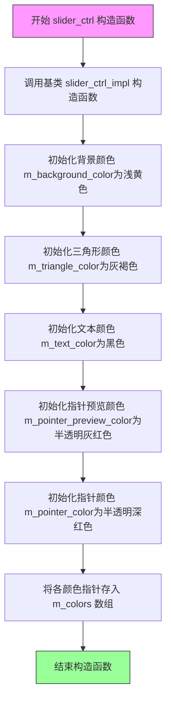

#### 带注释源码

```
// slider_ctrl 模板类构造函数
// 参数: x1, y1 - 滑块左上角坐标; x2, y2 - 滑块右下角坐标; flip_y - 是否翻转Y轴
template<class ColorT> 
slider_ctrl<ColorT>::slider_ctrl(double x1, double y1, double x2, double y2, bool flip_y) :
    // 首先调用基类 slider_ctrl_impl 的构造函数进行基础初始化
    slider_ctrl_impl(x1, y1, x2, y2, flip_y),
    
    // 初始化背景颜色为浅黄色 (RGB: 1.0, 0.9, 0.8)
    m_background_color(rgba(1.0, 0.9, 0.8)),
    
    // 初始化三角形/滑块主体颜色为灰褐色 (RGB: 0.7, 0.6, 0.6)
    m_triangle_color(rgba(0.7, 0.6, 0.6)),
    
    // 初始化文本颜色为黑色 (RGB: 0.0, 0.0, 0.0)
    m_text_color(rgba(0.0, 0.0, 0.0)),
    
    // 初始化指针预览颜色为半透明灰红色 (RGBA: 0.6, 0.4, 0.4, 0.4)
    m_pointer_preview_color(rgba(0.6, 0.4, 0.4, 0.4)),
    
    // 初始化指针颜色为半透明深红色 (RGBA: 0.8, 0.0, 0.0, 0.6)
    m_pointer_color(rgba(0.8, 0.0, 0.0, 0.6))
{
    // 将各个颜色对象的地址存入颜色指针数组 m_colors
    // 数组索引对应关系: 0-背景色, 1-三角形色, 2-文本色, 3-指针预览色, 4-指针色, 5-文本色
    m_colors[0] = &m_background_color;      // 背景颜色
    m_colors[1] = &m_triangle_color;        // 三角形颜色
    m_colors[2] = &m_text_color;            // 文本颜色
    m_colors[3] = &m_pointer_preview_color; // 指针预览颜色
    m_colors[4] = &m_pointer_color;         // 指针颜色
    m_colors[5] = &m_text_color;            // 文本颜色（重复，用于顶点路径数量匹配）
}
```


### `slider_ctrl<ColorT>.background_color`

设置滑块控件的背景颜色，用于自定义滑块的背景外观。

参数：

- `c`：`const ColorT&`，要设置的背景颜色值

返回值：`void`，无返回值

#### 流程图

```mermaid
flowchart TD
    A[开始设置背景颜色] --> B[接收颜色参数 c]
    B --> C[将参数 c 赋值给成员变量 m_background_color]
    C --> D[更新颜色数组 m_colors[0] 指向新颜色]
    E[结束]
    
    style A fill:#f9f,color:#000
    style C fill:#9f9,color:#000
    style E fill:#9f9,color:#000
```

#### 带注释源码

```cpp
// 设置滑块控件的背景颜色
// 参数: c - 新的背景颜色值，类型为模板参数 ColorT 的常量引用
void background_color(const ColorT& c) 
{ 
    // 将传入的颜色值赋值给成员变量 m_background_color
    // 该成员变量存储当前的背景颜色
    m_background_color = c; 
}
```

#### 在类中的上下文

```cpp
//----------------------------------------------------------slider_ctrl
template<class ColorT> class slider_ctrl : public slider_ctrl_impl
{
public:
    // 构造函数，初始化各个颜色成员变量
    slider_ctrl(double x1, double y1, double x2, double y2, bool flip_y=false) :
        slider_ctrl_impl(x1, y1, x2, y2, flip_y),
        m_background_color(rgba(1.0, 0.9, 0.8)),    // 默认浅黄色背景
        m_triangle_color(rgba(0.7, 0.6, 0.6)),      // 三角形默认颜色
        m_text_color(rgba(0.0, 0.0, 0.0)),          // 文本默认黑色
        m_pointer_preview_color(rgba(0.6, 0.4, 0.4, 0.4)), // 预览指针颜色
        m_pointer_color(rgba(0.8, 0.0, 0.0, 0.6))   // 指针默认颜色
    {
        // 将各颜色指针存入颜色数组，供基类渲染使用
        m_colors[0] = &m_background_color;
        m_colors[1] = &m_triangle_color;
        m_colors[2] = &m_text_color;
        m_colors[3] = &m_pointer_preview_color;
        m_colors[4] = &m_pointer_color;
        m_colors[5] = &m_text_color;
    }
          
    // 设置背景颜色 - 本方法提取的目标
    void background_color(const ColorT& c) { m_background_color = c; }
    
    // 设置指针颜色
    void pointer_color(const ColorT& c) { m_pointer_color = c; }

    // 获取颜色接口，供基类渲染系统调用
    const ColorT& color(unsigned i) const { return *m_colors[i]; } 

private:
    // 禁用拷贝构造和赋值运算符
    slider_ctrl(const slider_ctrl<ColorT>&);
    const slider_ctrl<ColorT>& operator = (const slider_ctrl<ColorT>&);

    // 颜色成员变量
    ColorT m_background_color;      // 背景颜色
    ColorT m_triangle_color;         // 三角形颜色
    ColorT m_text_color;             // 文本颜色
    ColorT m_pointer_preview_color; // 指针预览颜色
    ColorT m_pointer_color;          // 指针颜色
    
    // 颜色指针数组，用于统一管理颜色
    ColorT* m_colors[6];
};
```


### `slider_ctrl<ColorT>.pointer_color`

设置滑块控件的指针颜色，通过参数接收新的颜色值并将其存储到成员变量中。

参数：

-  `c`：`const ColorT&`，新的指针颜色值

返回值：`void`，无返回值

#### 流程图

```mermaid
flowchart TD
    A[开始] --> B[接收颜色参数 c]
    B --> C[将 c 赋值给成员变量 m_pointer_color]
    C --> D[结束]
```

#### 带注释源码

```cpp
// 设置指针颜色
// 参数: c - 新的指针颜色值（ColorT类型引用）
// 返回: void - 无返回值
void pointer_color(const ColorT& c) { 
    m_pointer_color = c;  // 将传入的颜色参数赋值给成员变量 m_pointer_color
}
```


### `slider_ctrl<ColorT>.color`

这是一个模板类的成员方法，用于获取滑块控件中指定索引位置的颜色值。通过传入颜色索引（0-5），可以获取滑块控件不同部件的颜色引用。

参数：

- `i`：`unsigned`，颜色索引，范围0-5，分别对应背景色、三角形颜色、文本颜色、指针预览颜色、指针颜色和文本颜色（重复）

返回值：`const ColorT&`，返回指定索引位置的颜色常量引用

#### 流程图

```mermaid
flowchart TD
    A[开始 color 方法] --> B{检查索引 i 是否有效}
    B -->|索引有效| C[返回 m_colors[i] 指向的颜色引用]
    B -->|索引无效| D[返回未定义行为/越界访问]
    C --> E[结束]
    D --> E
    
    style A fill:#f9f,color:#000
    style C fill:#9f9,color:#000
```

#### 带注释源码

```cpp
// 获取指定索引位置的颜色值
// 参数: i - 颜色索引（0-5）
//       0: m_background_color    - 背景色
//       1: m_triangle_color      - 三角形/滑块颜色
//       2: m_text_color          - 文本颜色
//       3: m_pointer_preview_color - 指针预览颜色
//       4: m_pointer_color       - 指针颜色
//       5: m_text_color          - 文本颜色（重复）
// 返回: 对应索引的颜色常量引用
const ColorT& color(unsigned i) const 
{ 
    return *m_colors[i];  // 解引用指针数组中的指针，返回颜色对象的引用
}
```


## 关键组件


### 滑块值范围管理组件

负责管理滑块的最小值、最大值和当前值，支持数值范围映射和步进控制。通过range()方法设置范围，num_steps()设置步进数，value()方法实现从0-1归一化值到实际范围的转换。

### 鼠标交互处理组件

处理滑块控件的鼠标事件，包括按下、释放和移动。支持拖拽滑块指针，包含预览值机制(m_preview_value)允许在确认前预览效果。包含坐标归一化处理和边界检测。

### 键盘方向键支持组件

实现方向键控制功能，允许通过左右上下键调整滑块值。实现了键盘与鼠标事件的统一接口。

### 顶点源绘制接口组件

实现AGG库的顶点源接口(num_paths/rewind/vertex)，将滑块渲染为矢量图形。生成滑块槽、指针、三角形标记等6个路径组件。

### 颜色管理系统组件

通过模板参数支持任意颜色类型，包含背景色、三角形色、文本色、指针预览色、指针色共5种颜色，通过指针数组管理便于批量访问。

### 文本标签渲染组件

使用gsv_text和conv_stroke实现滑块数值标签的绘制，支持自定义文本粗细，格式化显示当前值。

### 预览值机制组件

实现滑块拖动时的实时预览功能(m_preview_value)，区分预览状态和确认状态，提供更友好的用户交互体验。


## 问题及建议


### 已知问题

- **硬编码的数组大小**：`m_vx[32]`、`m_vy[32]` 和 `m_label[64]` 使用固定大小数组，缺乏灵活性，可能导致缓冲区溢出或资源浪费
- **缺乏输入验证**：构造函数和 `range()`、`value()` 等方法没有验证参数有效性（如 x1>x2、min>=max、无效的值范围）
- **复制控制未实现**：`slider_ctrl` 类的复制构造函数和赋值运算符被声明为私有但未实现，导致对象不可复制，且可能在某些编译器下产生警告
- **const 一致性问题**：`num_paths()` 方法缺少 const 声明，与 `vertex()` 方法的 const 特性不一致
- **魔法数字分散**：代码中存在多个魔法数字（如 32、64、6），缺乏有意义的常量定义，降低了可维护性
- **m_colors 指针数组风险**：`m_colors[6]` 存储指针但未进行空指针检查，可能导致潜在的空指针解引用
- **缺乏回调机制**：没有值变更回调或事件通知机制，限制了在复杂 UI 中的使用
- **文本渲染对象未初始化**：`m_text` 和 `m_text_poly` 对象的初始状态不确定，可能导致未定义行为

### 优化建议

- **使用常量替代魔法数字**：定义 `MAX_VERTICES`、`MAX_LABEL_LENGTH` 等常量，提高代码可读性和可维护性
- **添加参数验证**：在构造函数和 setter 方法中添加参数范围检查，提供明确的错误处理或默认值策略
- **完善复制语义**：要么正确实现复制构造函数和赋值运算符并设为 public，要么使用 C++11 的 delete 语法明确禁止复制
- **统一 const 声明**：将 `num_paths()` 声明为 const 方法，保持接口一致性
- **使用智能指针或容器**：将 `m_colors` 改为 `std::array<ColorT*, 6>` 或使用 `std::vector`，并添加空指针检查
- **添加值变更回调**：引入 std::function 或观察者模式，支持值变化时的事件通知
- **初始化所有成员**：在构造函数中明确初始化所有成员变量，特别是嵌入对象 `m_text`、`m_text_poly`、`m_ellipse`
- **考虑异常安全**：使用 noexcept 规范标记不会抛出异常的方法，提高代码的可预测性


## 其它


### 设计目标与约束

该滑块控件的设计目标是提供一个轻量级的、基于顶点源的GUI控件，用于在AGG渲染框架中实现数值选择功能。约束条件包括：1) 必须继承自ctrl基类以保持控件接口一致性；2) 必须实现顶点源接口(num_paths/rewind/vertex)以支持AGG的渲染管线；3) 模板参数ColorT必须支持AGG的颜色接口；4) 坐标系统遵循AGG的flip_y约定。

### 错误处理与异常设计

代码中错误处理主要通过返回值(bool)和边界检查实现。in_rect方法检查坐标是否在控件范围内；normalize_value方法在设置值时进行范围验证；mouse事件处理返回bool表示事件是否被处理。对于无效输入，value方法会通过normalize_value自动将值截断到[min,max]范围。代码不抛出异常，遵循AGG库的传统风格。

### 数据流与状态机

滑块控件的状态包括：普通状态、鼠标按下状态、拖拽中状态。状态转换：初始状态 → (on_mouse_button_down) → 拖拽状态 → (on_mouse_button_up) → 初始状态。数据流：用户输入(鼠标位置) → on_mouse_move/on_mouse_button_down → 计算preview_value → 鼠标释放时正式更新m_value → 触发重绘。m_preview_value用于拖拽时显示预览位置，m_value是最终确认的值。

### 外部依赖与接口契约

主要依赖：agg::ctrl(基类)、agg::ellipse(滑块指针绘制)、agg::gsv_text(文本绘制)、agg::conv_stroke<gsv_text>(文本描边)、agg::path_storage(路径存储)、agg::trans_affine(坐标变换)、颜色和数学库。接口契约：子类必须实现num_paths/rewind/vertex成为顶点源；必须实现in_rect/on_mouse_button_down等事件处理方法；ColorT模板参数需支持rgba颜色操作。

### 使用场景与示例

典型使用场景：1) 在图形编辑器中作为参数调节控件；2) 在游戏UI中作为数值输入；3) 在数据可视化中作为范围选择器。使用示例：创建slider_ctrl<rgba8>实例，调用range设置范围[0,100]，调用value设置初始值，在渲染循环中通过vertex接口获取顶点数据并填充。

### 性能考虑

性能优化点：1) m_vx/m_vy数组预先分配32个顶点空间，避免动态分配；2) 路径数据在第一次渲染后缓存；3) 仅在值改变时重新计算路径。主要性能开销在vertex方法中的坐标计算和椭圆生成，对于普通使用场景性能充足。

### 兼容性考虑

代码使用纯C++实现，无平台特定代码，兼容性强。要求编译器支持模板实例化。ColorT模板参数允许用户自定义颜色类型以适应不同像素格式。flip_y参数支持不同坐标系习惯。

### 线程安全性

该控件类非线程安全。多个线程同时操作同一控件实例可能导致状态不一致。如需多线程使用，应在外部加锁保护或每个线程创建独立实例。

### 配置选项

可通过以下方式配置：border_width设置边框宽度；range设置数值范围；num_steps设置步进数；label设置显示标签；text_thickness设置文字粗细；descending设置是否反向；background_color/pointer_color设置颜色。flip_y构造函数参数控制Y轴方向。

### 扩展性设计

扩展点：1) 可通过继承slider_ctrl_impl添加新的视觉样式；2) 可通过提供不同的ColorT支持不同颜色空间；3) 可添加自定义绘制逻辑到vertex方法；4) 可添加动画效果到value变化。模板设计允许灵活的颜色和渲染定制。

### 版本兼容性说明

该代码为AGG 2.4版本的一部分。接口稳定，但后续版本可能调整默认颜色值或增加新接口。slider_ctrl_impl的vertex接口实现依赖于AGG的渲染管线结构，需配合对应版本的渲染器使用。


    