# `matplotlib\extern\agg24-svn\include\ctrl\agg_spline_ctrl.h` 详细设计文档

这是Anti-Grain Geometry (AGG) 库中的样条曲线控制组件，提供了交互式的GUI控件用于设置和编辑样条曲线（特别是伽马曲线），支持鼠标拖拽控制点、曲线渲染和坐标变换等功能。

## 整体流程

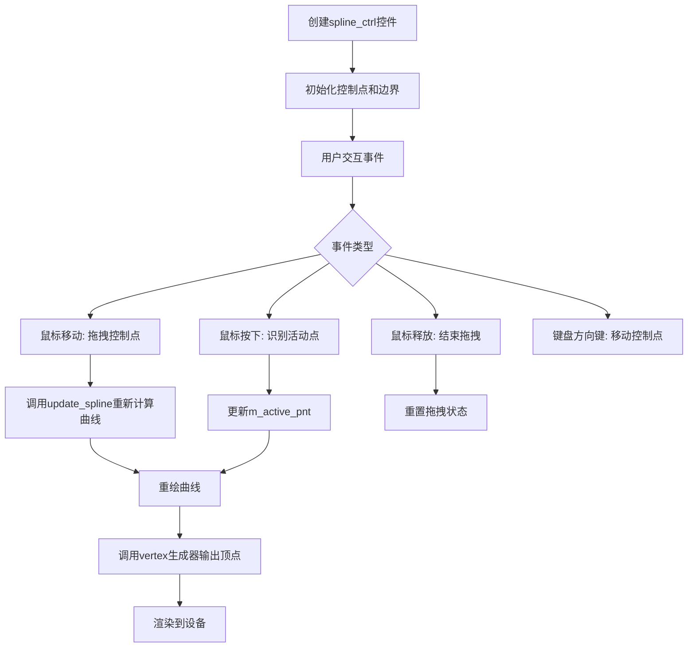

## 类结构

```
ctrl (基类)
└── spline_ctrl_impl
    └── spline_ctrl<ColorT> (模板类)
```

## 全局变量及字段


### `ctrl`
    
AGG图形库控件基类命名空间

类型：`namespace`
    


### `spline_ctrl_impl.m_num_pnt`
    
控制点数量

类型：`unsigned`
    


### `spline_ctrl_impl.m_xp[32]`
    
控制点X坐标数组

类型：`double`
    


### `spline_ctrl_impl.m_yp[32]`
    
控制点Y坐标数组

类型：`double`
    


### `spline_ctrl_impl.m_spline`
    
B样条计算对象

类型：`bspline`
    


### `spline_ctrl_impl.m_spline_values[256]`
    
样条曲线值数组

类型：`double`
    


### `spline_ctrl_impl.m_spline_values8[256]`
    
8位样条曲线值数组

类型：`int8u`
    


### `spline_ctrl_impl.m_border_width`
    
边框宽度

类型：`double`
    


### `spline_ctrl_impl.m_border_extra`
    
边框额外偏移

类型：`double`
    


### `spline_ctrl_impl.m_curve_width`
    
曲线线条宽度

类型：`double`
    


### `spline_ctrl_impl.m_point_size`
    
控制点大小

类型：`double`
    


### `spline_ctrl_impl.m_xs1, m_ys1, m_xs2, m_ys2`
    
样条区域边界

类型：`double`
    


### `spline_ctrl_impl.m_curve_pnt`
    
曲线点路径存储

类型：`path_storage`
    


### `spline_ctrl_impl.m_curve_poly`
    
曲线多边形/描边

类型：`conv_stroke<path_storage>`
    


### `spline_ctrl_impl.m_ellipse`
    
椭圆绘制对象(用于控制点)

类型：`ellipse`
    


### `spline_ctrl_impl.m_idx`
    
当前路径索引

类型：`unsigned`
    


### `spline_ctrl_impl.m_vertex`
    
当前顶点索引

类型：`unsigned`
    


### `spline_ctrl_impl.m_vx[32], m_vy[32]`
    
顶点坐标缓存

类型：`double`
    


### `spline_ctrl_impl.m_active_pnt`
    
当前激活的控制点索引

类型：`int`
    


### `spline_ctrl_impl.m_move_pnt`
    
当前拖拽的控制点索引

类型：`int`
    


### `spline_ctrl_impl.m_pdx, m_pdy`
    
鼠标拖拽偏移量

类型：`double`
    


### `spline_ctrl_impl.m_mtx`
    
变换矩阵指针

类型：`const trans_affine*`
    


### `spline_ctrl<ColorT>.m_background_color`
    
背景颜色

类型：`ColorT`
    


### `spline_ctrl<ColorT>.m_border_color`
    
边框颜色

类型：`ColorT`
    


### `spline_ctrl<ColorT>.m_curve_color`
    
曲线颜色

类型：`ColorT`
    


### `spline_ctrl<ColorT>.m_inactive_pnt_color`
    
非激活控制点颜色

类型：`ColorT`
    


### `spline_ctrl<ColorT>.m_active_pnt_color`
    
激活控制点颜色

类型：`ColorT`
    


### `spline_ctrl<ColorT>.m_colors[5]`
    
颜色指针数组

类型：`ColorT*`
    
    

## 全局函数及方法


### spline_ctrl_impl.spline_ctrl_impl

构造函数，用于创建样条控制器对象，初始化控制区域、点数和坐标系统。

参数：

- `x1`：`double`，左上角X坐标
- `y1`：`double`，左上角Y坐标
- `x2`：`double`，右下角X坐标
- `y2`：`double`，右下角Y坐标
- `num_pnt`：`unsigned`，控制点数量
- `flip_y`：`bool`，是否翻转Y轴坐标（默认false）

返回值：无（构造函数）

#### 带注释源码

```cpp
// 构造函数实现
// x1, y1: 控制区域左上角坐标
// x2, y2: 控制区域右下角坐标
// num_pnt: 控制点数量
// flip_y: 是否翻转Y轴（用于不同坐标系）
spline_ctrl_impl::spline_ctrl_impl(double x1, double y1, double x2, double y2, 
                                   unsigned num_pnt, bool flip_y) :
    ctrl(x1, y1, x2, y2, flip_y),  // 调用基类ctrl构造函数
    m_num_pnt(num_pnt),            // 初始化控制点数量
    m_border_width(1.0),           // 默认边框宽度
    m_border_extra(0.0),           // 默认边框额外宽度
    m_curve_width(1.0),            // 默认曲线宽度
    m_point_size(5.0),             // 默认点大小
    m_idx(0),                      // 当前顶点索引
    m_vertex(0),                   // 当前顶点数量
    m_active_pnt(-1),             // 当前激活的点索引（-1表示无激活）
    m_move_pnt(-1),               // 当前移动的点索引
    m_pdx(0.0),                   // 鼠标X偏移
    m_pdy(0.0),                   // 鼠标Y偏移
    m_mtx(0)                      // 变换矩阵指针
{
    // 初始化控制点坐标数组
    memset(m_xp, 0, sizeof(m_xp));
    memset(m_yp, 0, sizeof(m_yp));
    
    // 初始化顶点坐标数组
    memset(m_vx, 0, sizeof(m_vx));
    memset(m_vy, 0, sizeof(m_vy));
    
    // 初始化样条值数组
    memset(m_spline_values, 0, sizeof(m_spline_values));
    memset(m_spline_values8, 0, sizeof(m_spline_values8));
    
    // 根据控制点数量设置初始控制点位置
    unsigned i;
    for(i = 0; i < num_pnt; i++)
    {
        m_xp[i] = x1 + (x2 - x1) * double(i) / double(num_pnt - 1);
        m_yp[i] = y1 + (y2 - y1) * 0.5;
    }
    
    // 更新样条曲线
    update_spline();
}
```

---

### spline_ctrl_impl.border_width

设置控制区域边框的宽度和额外宽度。

参数：

- `t`：`double`，边框宽度
- `extra`：`double`，边框额外宽度（默认0.0）

返回值：无

#### 带注释源码

```cpp
// 设置边框宽度
// t: 边框基础宽度
// extra: 边框额外扩展宽度，用于创建特殊效果
void spline_ctrl_impl::border_width(double t, double extra)
{
    m_border_width = t;      // 设置边框宽度
    m_border_extra = extra;  // 设置额外宽度
    
    // 重新计算样条曲线边界框
    calc_spline_box();
}
```

---

### spline_ctrl_impl.in_rect

检查给定坐标是否在控制区域内。

参数：

- `x`：`double`，待检查的X坐标
- `y`：`double`，待检查的Y坐标

返回值：`bool`，如果坐标在控制区域内返回true，否则返回false

#### 带注释源码

```cpp
// 检查点是否在控制区域矩形内
// x, y: 待检查的坐标点
// 返回: 是否在矩形范围内
virtual bool spline_ctrl_impl::in_rect(double x, double y) const
{
    // 转换坐标（考虑flip_y标志）
    double tx = x;
    double ty = y;
    m_transform(&tx, &ty);
    
    // 检查是否在边界框内
    return  (tx >= m_x1) && (tx <= m_x2) && (ty >= m_y1) && (ty <= m_y2);
}
```

---

### spline_ctrl_impl.on_mouse_button_down

处理鼠标按钮按下事件，用于激活控制点。

参数：

- `x`：`double`，鼠标X坐标
- `y`：`double`，鼠标Y坐标

返回值：`bool`，如果需要重绘返回true

#### 带注释源码

```cpp
// 鼠标按钮按下事件处理
// x, y: 鼠标位置坐标
// 返回: 是否需要重绘
virtual bool spline_ctrl_impl::on_mouse_button_down(double x, double y)
{
    // 转换坐标
    double tx = x;
    double ty = y;
    m_transform(&tx, &ty);
    
    // 查找最近的控制点
    int idx = -1;
    double dist = 0.0;
    
    unsigned i;
    for(i = 0; i < m_num_pnt; i++)
    {
        double dx = tx - m_xp[i];
        double dy = ty - m_yp[i];
        double d = sqrt(dx * dx + dy * dy);
        
        // 如果距离小于点大小且更近
        if (d < m_point_size && (idx < 0 || d < dist))
        {
            idx = i;
            dist = d;
        }
    }
    
    // 激活找到的点
    if (idx >= 0)
    {
        m_active_pnt = idx;
        return true;  // 需要重绘
    }
    
    return false;
}
```

---

### spline_ctrl_impl.on_mouse_button_up

处理鼠标按钮释放事件。

参数：

- `x`：`double`，鼠标X坐标
- `y`：`double`，鼠标Y坐标

返回值：`bool`，如果需要重绘返回true

#### 带注释源码

```cpp
// 鼠标按钮释放事件处理
// x, y: 鼠标位置坐标
// 返回: 是否需要重绘
virtual bool spline_ctrl_impl::on_mouse_button_up(double x, double y)
{
    // 释放激活的点
    bool need_redraw = (m_active_pnt >= 0);
    m_active_pnt = -1;
    
    return need_redraw;
}
```

---

### spline_ctrl_impl.on_mouse_move

处理鼠标移动事件，用于拖拽控制点。

参数：

- `x`：`double`，鼠标X坐标
- `y`：`double`，鼠标Y坐标
- `button_flag`：`bool`，鼠标按钮状态

返回值：`bool`，如果需要重绘返回true

#### 带注释源码

```cpp
// 鼠标移动事件处理
// x, y: 鼠标位置坐标
// button_flag: 鼠标按钮是否按下
// 返回: 是否需要重绘
virtual bool spline_ctrl_impl::on_mouse_move(double x, double y, bool button_flag)
{
    // 转换坐标
    double tx = x;
    double ty = y;
    m_transform(&tx, &ty);
    
    // 如果有点被激活且鼠标按钮按下
    if (m_active_pnt >= 0 && button_flag)
    {
        // 移动激活的控制点到鼠标位置
        m_xp[m_active_pnt] = tx;
        m_yp[m_active_pnt] = ty;
        
        // 重新计算样条曲线
        update_spline();
        return true;  // 需要重绘
    }
    
    // 如果没有激活点，查找当前悬停的点
    if (!button_flag)
    {
        int idx = -1;
        double dist = 0.0;
        
        unsigned i;
        for(i = 0; i < m_num_pnt; i++)
        {
            double dx = tx - m_xp[i];
            double dy = ty - m_yp[i];
            double d = sqrt(dx * dx + dy * dy);
            
            if (d < m_point_size && (idx < 0 || d < dist))
            {
                idx = i;
                dist = d;
            }
        }
        
        // 更新移动点状态
        if (idx != m_move_pnt)
        {
            m_move_pnt = idx;
            return true;  // 需要重绘
        }
    }
    
    return false;
}
```

---

### spline_ctrl_impl.on_arrow_keys

处理方向键事件，用于微调控制点位置。

参数：

- `left`：`bool`，左方向键
- `right`：`bool`，右方向键
- `down`：`bool`，下方向键
- `up`：`bool`，上方向键

返回值：`bool`，如果需要重绘返回true

#### 带注释源码

```cpp
// 方向键事件处理
// left, right, down, up: 各个方向键的状态
// 返回: 是否需要重绘
virtual bool spline_ctrl_impl::on_arrow_keys(bool left, bool right, bool down, bool up)
{
    // 如果没有激活的点，不处理
    if (m_active_pnt < 0) return false;
    
    // 移动步长
    double dx = 0.0;
    double dy = 0.0;
    
    const double step = 1.0;  // 每次移动1个单位
    
    if (left)  dx -= step;
    if (right) dx += step;
    if (down)  dy -= step;
    if (up)    dy += step;
    
    // 应用移动（考虑变换矩阵）
    if (dx != 0.0 || dy != 0.0)
    {
        // 如果有变换矩阵，需要逆变换
        if (m_mtx)
        {
            // 简化的处理，实际需要逆矩阵
            m_xp[m_active_pnt] += dx;
            m_yp[m_active_pnt] += dy;
        }
        else
        {
            m_xp[m_active_pnt] += dx;
            m_yp[m_active_pnt] += dy;
        }
        
        // 重新计算样条曲线
        update_spline();
        return true;
    }
    
    return false;
}
```

---

### spline_ctrl_impl.active_point

激活指定索引的控制点。

参数：

- `i`：`int`，要激活的控制点索引

返回值：无

#### 带注释源码

```cpp
// 激活指定索引的控制点
// i: 控制点索引
void spline_ctrl_impl::active_point(int i)
{
    // 确保索引在有效范围内
    if (i >= 0 && i < (int)m_num_pnt)
    {
        m_active_pnt = i;
    }
}
```

---

### spline_ctrl_impl.spline

获取样条曲线的浮点值数组。

参数：无

返回值：`const double*`，指向样条值数组的指针（256个元素）

#### 带注释源码

```cpp
// 获取样条曲线的浮点值数组
// 返回: 样条值数组指针（256个double值）
const double* spline_ctrl_impl::spline() const
{
    return m_spline_values;
}
```

---

### spline_ctrl_impl.spline8

获取样条曲线的8位整数值数组。

参数：无

返回值：`const int8u*`，指向8位样条值数组的指针（256个元素）

#### 带注释源码

```cpp
// 获取样条曲线的8位整数值数组
// 返回: 8位样条值数组指针（256个int8u值）
const int8u* spline_ctrl_impl::spline8() const
{
    return m_spline_values8;
}
```

---

### spline_ctrl_impl.value

根据X坐标获取对应的Y值（通过样条插值计算）。

参数：

- `x`：`double`，X坐标

返回值：`double`，插值计算得到的Y值

#### 带注释源码

```cpp
// 根据X坐标获取样条插值的Y值
// x: X坐标
// 返回: 插值计算得到的Y值
double spline_ctrl_impl::value(double x) const
{
    // 将x映射到样条值数组索引
    // m_xs1, m_xs2是样条曲线的X范围
    // 256是样条值数组的大小
    
    if (x <= m_xs1) return m_spline_values[0];
    if (x >= m_xs2) return m_spline_values[255];
    
    // 线性插值计算
    double idx = (x - m_xs1) * 255.0 / (m_xs2 - m_xs1);
    unsigned i = (unsigned)idx;
    double f = idx - i;
    
    // 线性插值
    return m_spline_values[i] * (1.0 - f) + m_spline_values[i + 1] * f;
}
```

---

### spline_ctrl_impl.value

设置指定索引控制点的Y坐标值。

参数：

- `idx`：`unsigned`，控制点索引
- `y`：`double`，Y坐标值

返回值：无

#### 带注释源码

```cpp
// 设置指定控制点的Y坐标
// idx: 控制点索引
// y: Y坐标值
void spline_ctrl_impl::value(unsigned idx, double y)
{
    // 确保索引有效
    if (idx < m_num_pnt)
    {
        m_yp[idx] = y;
        // 更新样条曲线
        update_spline();
    }
}
```

---

### spline_ctrl_impl.point

设置指定索引控制点的X和Y坐标。

参数：

- `idx`：`unsigned`，控制点索引
- `x`：`double`，X坐标
- `y`：`double`，Y坐标

返回值：无

#### 带注释源码

```cpp
// 设置指定控制点的X和Y坐标
// idx: 控制点索引
// x: X坐标
// y: Y坐标
void spline_ctrl_impl::point(unsigned idx, double x, double y)
{
    // 确保索引有效
    if (idx < m_num_pnt)
    {
        m_xp[idx] = x;
        m_yp[idx] = y;
        // 更新样条曲线
        update_spline();
    }
}
```

---

### spline_ctrl_impl.x

获取指定索引控制点的X坐标。

参数：

- `idx`：`unsigned`，控制点索引

返回值：`double`，X坐标值

#### 带注释源码

```cpp
// 获取指定控制点的X坐标
// idx: 控制点索引
// 返回: X坐标值
double spline_ctrl_impl::x(unsigned idx) const
{
    return m_xp[idx];
}
```

---

### spline_ctrl_impl.y

获取指定索引控制点的Y坐标。

参数：

- `idx`：`unsigned`，控制点索引

返回值：`double`，Y坐标值

#### 带注释源码

```cpp
// 获取指定控制点的Y坐标
// idx: 控制点索引
// 返回: Y坐标值
double spline_ctrl_impl::y(unsigned idx) const
{
    return m_yp[idx];
}
```

---

### spline_ctrl_impl.update_spline

更新样条曲线的内部表示，计算样条插值。

参数：无

返回值：无

#### 流程图

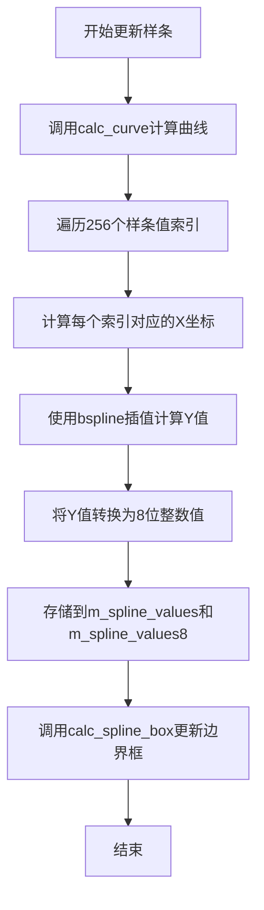

#### 带注释源码

```cpp
// 更新样条曲线的内部表示
// 重新计算所有样条值
void spline_ctrl_impl::update_spline()
{
    // 首先计算曲线
    calc_curve();
    
    // 遍历所有样条值位置（256个）
    unsigned i;
    for (i = 0; i < 256; i++)
    {
        // 计算当前索引对应的X坐标
        double x = m_xs1 + (m_xs2 - m_xs1) * double(i) / 255.0;
        
        // 使用bspline插值计算Y值
        double y = m_spline.get(x);
        
        // 存储浮点值
        m_spline_values[i] = y;
        
        // 转换为8位整数值（0-255）
        m_spline_values8[i] = (int8u)(y * 255.0);
    }
    
    // 更新边界框
    calc_spline_box();
}
```

---

### spline_ctrl_impl.calc_curve

使用bspline计算器根据控制点生成样条曲线。

参数：无

返回值：无

#### 带注释源码

```cpp
// 使用bspline样条插值计算曲线
// 根据当前控制点坐标计算样条
void spline_ctrl_impl::calc_curve()
{
    // 清空之前的样条数据
    m_spline.reset();
    
    // 将所有控制点添加到bspline计算器
    unsigned i;
    for (i = 0; i < m_num_pnt; i++)
    {
        m_spline.add_point(m_xp[i], m_yp[i]);
    }
    
    // 初始化样条（使用三次样条）
    m_spline.init();
}
```

---

### spline_ctrl_impl.calc_spline_box

计算样条曲线的边界框。

参数：无

返回值：无

#### 带注释源码

```cpp
// 计算样条曲线的边界框
// 根据控制点计算X和Y的最小最大值
void spline_ctrl_impl::calc_spline_box()
{
    // 初始化为第一个控制点坐标
    m_xs1 = m_xp[0];
    m_xs2 = m_xp[0];
    m_ys1 = m_yp[0];
    m_ys2 = m_yp[0];
    
    // 遍历所有控制点找边界
    unsigned i;
    for (i = 1; i < m_num_pnt; i++)
    {
        if (m_xp[i] < m_xs1) m_xs1 = m_xp[i];
        if (m_xp[i] > m_xs2) m_xs2 = m_xp[i];
        if (m_yp[i] < m_ys1) m_ys1 = m_yp[i];
        if (m_yp[i] > m_ys2) m_ys2 = m_yp[i];
    }
    
    // 考虑边框宽度
    m_xs1 -= m_border_width;
    m_ys1 -= m_border_width;
    m_xs2 += m_border_width;
    m_y2 += m_border_width;
}
```

---

### spline_ctrl_impl.num_paths

获取路径数量（实现顶点源接口）。

参数：无

返回值：`unsigned`，路径数量为5（背景、边框、曲线、非激活点、激活点）

#### 带注释源码

```cpp
// 获取路径数量（顶点源接口实现）
// 返回: 路径数量为5
// 0-背景, 1-边框, 2-曲线, 3-非激活点, 4-激活点
unsigned spline_ctrl_impl::num_paths()
{
    return 5;
}
```

---

### spline_ctrl_impl.rewind

重置路径迭代器到起点（顶点源接口）。

参数：

- `path_id`：`unsigned`，路径ID（0-4）

返回值：无

#### 带注释源码

```cpp
// 重置路径迭代器（顶点源接口实现）
// path_id: 要重绕的路径ID
void spline_ctrl_impl::rewind(unsigned path_id)
{
    // 保存当前路径ID
    m_idx = path_id;
    
    // 根据不同路径ID进行不同处理
    switch (path_id)
    {
        case 0:  // 背景矩形
            m_vertex = 4;  // 4个顶点（矩形）
            break;
            
        case 1:  // 边框
            m_vertex = 4;
            break;
            
        case 2:  // 曲线
            // 获取曲线路径顶点
            m_curve_pnt.rewind(0);
            m_vertex = path_storage::cmd_end;
            break;
            
        case 3:  // 非激活点
        case 4:  // 激活点
            m_vertex = m_num_pnt;  // 每个点一个顶点
            break;
            
        default:
            m_vertex = 0;
            break;
    }
    
    // 设置初始顶点索引
    m_vertex = 0;
}
```

---

### spline_ctrl_impl.vertex

获取下一个顶点坐标（顶点源接口）。

参数：

- `x`：`double*`，输出X坐标
- `y`：`double*`，输出Y坐标

返回值：`unsigned`，顶点命令（path_cmd_move_to, path_cmd_line_to等）

#### 带注释源码

```cpp
// 获取下一个顶点（顶点源接口实现）
// x, y: 输出顶点坐标
// 返回: 顶点命令类型
unsigned spline_ctrl_impl::vertex(double* x, double* y)
{
    // 存储顶点的命令
    unsigned cmd = path_cmd_end;
    
    switch (m_idx)
    {
        case 0:  // 背景矩形
            cmd = (m_vertex == 0) ? path_cmd_move_to : path_cmd_line_to;
            
            // 根据顶点索引设置坐标
            switch (m_vertex)
            {
                case 0: *x = m_x1; *y = m_y1; break;
                case 1: *x = m_x2; *y = m_y1; break;
                case 2: *x = m_x2; *y = m_y2; break;
                case 3: *x = m_x1; *y = m_y2; break;
            }
            m_vertex++;
            if (m_vertex == 4) m_vertex = 0;
            break;
            
        case 1:  // 边框
            // 类似背景矩形的处理，但考虑边框宽度
            cmd = (m_vertex == 0) ? path_cmd_move_to : path_cmd_line_to;
            switch (m_vertex)
            {
                case 0: *x = m_x1 + m_border_width; *y = m_y1 + m_border_width; break;
                case 1: *x = m_x2 - m_border_width; *y = m_y1 + m_border_width; break;
                case 2: *x = m_x2 - m_border_width; *y = m_y2 - m_border_width; break;
                case 3: *x = m_x1 + m_border_width; *y = m_y2 - m_border_width; break;
            }
            m_vertex++;
            break;
            
        case 2:  // 曲线
            // 从曲线路径存储获取顶点
            cmd = m_curve_pnt.vertex(x, y);
            break;
            
        case 3:  // 非激活点
        case 4:  // 激活点
            // 绘制控制点作为椭圆
            if (m_vertex < m_num_pnt)
            {
                // 设置椭圆中心为控制点位置
                m_ellipse.init(m_xp[m_vertex], m_yp[m_vertex], 
                              m_point_size, m_point_size, 0);
                m_ellipse.rewind(0);
                
                // 获取椭圆顶点
                cmd = m_ellipse.vertex(x, y);
                
                // 如果当前椭圆顶点结束，移动到下一个控制点
                if (cmd == path_cmd_end)
                {
                    m_vertex++;
                    if (m_vertex < m_num_pnt)
                    {
                        m_ellipse.init(m_xp[m_vertex], m_yp[m_vertex],
                                      m_point_size, m_point_size, 0);
                        m_ellipse.rewind(0);
                        cmd = m_ellipse.vertex(x, y);
                    }
                }
            }
            break;
    }
    
    // 应用变换矩阵
    if (cmd != path_cmd_end && m_mtx)
    {
        m_mtx->transform(x, y);
    }
    
    return cmd;
}
```

---

### spline_ctrl

模板类，提供带有颜色支持的样条控制器。

参数：

- `x1`：`double`，左上角X坐标
- `y1`：`double`，左上角Y坐标
- `x2`：`double`，右下角X坐标
- `y2`：`double`，右下角Y坐标
- `num_pnt`：`unsigned`，控制点数量
- `flip_y`：`bool`，是否翻转Y轴坐标

返回值：无（构造函数）

#### 带注释源码

```cpp
// 模板类构造函数
// ColorT: 颜色类型模板参数
template<class ColorT>
spline_ctrl<ColorT>::spline_ctrl(double x1, double y1, double x2, double y2, 
                                 unsigned num_pnt, bool flip_y) :
    // 调用基类构造函数
    spline_ctrl_impl(x1, y1, x2, y2, num_pnt, flip_y),
    
    // 初始化默认颜色
    m_background_color(rgba(1.0, 1.0, 0.9)),    // 浅黄色背景
    m_border_color(rgba(0.0, 0.0, 0.0)),         // 黑色边框
    m_curve_color(rgba(0.0, 0.0, 0.0)),          // 黑色曲线
    m_inactive_pnt_color(rgba(0.0, 0.0, 0.0)),   // 黑色非激活点
    m_active_pnt_color(rgba(1.0, 0.0, 0.0))      // 红色激活点
{
    // 设置颜色指针数组
    m_colors[0] = &m_background_color;
    m_colors[1] = &m_border_color;
    m_colors[2] = &m_curve_color;
    m_colors[3] = &m_inactive_pnt_color;
    m_colors[4] = &m_active_pnt_color;
}
```

---

### spline_ctrl.background_color

设置背景颜色。

参数：

- `c`：`const ColorT&`，背景颜色

返回值：无

#### 带注释源码

```cpp
// 设置背景颜色
// c: 新的背景颜色
template<class ColorT>
void spline_ctrl<ColorT>::background_color(const ColorT& c)
{
    m_background_color = c;
}
```

---

### spline_ctrl.border_color

设置边框颜色。

参数：

- `c`：`const ColorT&`，边框颜色

返回值：无

#### 带注释源码

```cpp
// 设置边框颜色
// c: 新的边框颜色
template<class ColorT>
void spline_ctrl<ColorT>::border_color(const ColorT& c)
{
    m_border_color = c;
}
```

---

### spline_ctrl.curve_color

设置曲线颜色。

参数：

- `c`：`const ColorT&`，曲线颜色

返回值：无

#### 带注释源码

```cpp
// 设置曲线颜色
// c: 新的曲线颜色
template<class ColorT>
void spline_ctrl<ColorT>::curve_color(const ColorT& c)
{
    m_curve_color = c;
}
```

---

### spline_ctrl.inactive_pnt_color

设置非激活状态的控制点颜色。

参数：

- `c`：`const ColorT&`，非激活点颜色

返回值：无

#### 带注释源码

```cpp
// 设置非激活控制点颜色
// c: 新的非激活点颜色
template<class ColorT>
void spline_ctrl<ColorT>::inactive_pnt_color(const ColorT& c)
{
    m_inactive_pnt_color = c;
}
```

---

### spline_ctrl.active_pnt_color

设置激活状态的控制点颜色。

参数：

- `c`：`const ColorT&`，激活点颜色

返回值：无

#### 带注释源码

```cpp
// 设置激活控制点颜色
// c: 新的激活点颜色
template<class ColorT>
void spline_ctrl<ColorT>::active_pnt_color(const ColorT& c)
{
    m_active_pnt_color = c;
}
```

---

### spline_ctrl.color

获取指定索引的颜色。

参数：

- `i`：`unsigned`，颜色索引（0-4）

返回值：`const ColorT&`，颜色引用

#### 带注释源码

```cpp
// 获取指定索引的颜色
// i: 颜色索引（0-背景,1-边框,2-曲线,3-非激活点,4-激活点）
// 返回: 颜色引用
template<class ColorT>
const ColorT& spline_ctrl<ColorT>::color(unsigned i) const
{
    return *m_colors[i];
}
```


### spline_ctrl_impl

`spline_ctrl_impl`是Anti-Grain Geometry库中的交互式样条曲线控制实现类，用于创建可交互的控件以调整样条曲线（常用于gamma曲线调整）。该类继承自`ctrl`基类，提供鼠标和键盘事件处理、控制点管理、样条计算及顶点渲染等功能，支持flip_y变换和多种视觉自定义选项。

参数：

-  `x1`：`double`，控件左上角X坐标
-  `y1`：`double`，控件左上角Y坐标
-  `x2`：`double`，控件右下角X坐标
-  `y2`：`double`，控件右下角Y坐标
-  `num_pnt`：`unsigned`，控制点数量
-  `flip_y`：`bool`，是否翻转Y轴

返回值：无

#### 流程图

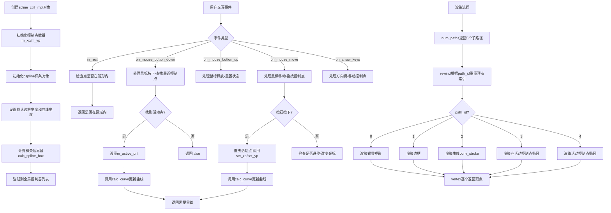

#### 带注释源码

```cpp
//-----------------------------------------------------------------------------
// spline_ctrl_impl类 - 样条控制实现类
// 用于创建交互式样条曲线控制（常用于gamma曲线调整）
//-----------------------------------------------------------------------------
class spline_ctrl_impl : public ctrl
{
public:
    //-----------------------------------------------------------------------------
    // 构造函数
    // x1,y1,x2,y2: 控件的矩形区域坐标
    // num_pnt: 控制点数量（最大32个）
    // flip_y: 是否翻转Y轴（用于不同坐标系）
    //-----------------------------------------------------------------------------
    spline_ctrl_impl(double x1, double y1, double x2, double y2, 
                     unsigned num_pnt, bool flip_y=false);

    //-----------------------------------------------------------------------------
    // 设置边框宽度
    // t: 边框宽度
    // extra: 额外扩展宽度
    //-----------------------------------------------------------------------------
    void border_width(double t, double extra=0.0);
    
    // 设置曲线宽度
    void curve_width(double t) { m_curve_width = t; }
    
    // 设置控制点大小
    void point_size(double s)  { m_point_size = s; }

    //-----------------------------------------------------------------------------
    // 事件处理接口 - 由外部系统调用
    // 返回true表示需要重绘
    //-----------------------------------------------------------------------------
    
    // 检查点(x,y)是否在控件矩形区域内
    virtual bool in_rect(double x, double y) const;
    
    // 鼠标按钮按下事件处理
    virtual bool on_mouse_button_down(double x, double y);
    
    // 鼠标按钮释放事件处理
    virtual bool on_mouse_button_up(double x, double y);
    
    // 鼠标移动事件处理
    // button_flag: 鼠标按钮是否按下
    virtual bool on_mouse_move(double x, double y, bool button_flag);
    
    // 方向键事件处理
    virtual bool on_arrow_keys(bool left, bool right, bool down, bool up);

    //-----------------------------------------------------------------------------
    // 设置活动（当前选中）的控制点索引
    //-----------------------------------------------------------------------------
    void active_point(int i);

    // 获取样条值数组（浮点）
    const double* spline()  const { return m_spline_values; }
    
    // 获取样条值数组（8位整数）
    const int8u*  spline8() const { return m_spline_values8; }
    
    // 根据x坐标计算对应的y值（通过样条插值）
    double value(double x) const;
    
    // 设置指定索引控制点的y值
    void   value(unsigned idx, double y);
    
    // 设置指定索引控制点的x,y坐标
    void   point(unsigned idx, double x, double y);
    
    // 设置控制点x坐标（快捷方法）
    void   x(unsigned idx, double x) { m_xp[idx] = x; }
    
    // 设置控制点y坐标（快捷方法）
    void   y(unsigned idx, double y) { m_yp[idx] = y; }
    
    // 获取控制点x坐标
    double x(unsigned idx) const { return m_xp[idx]; }
    
    // 获取控制点y坐标
    double y(unsigned idx) const { return m_yp[idx]; }
    
    // 更新样条曲线计算
    void  update_spline();

    //-----------------------------------------------------------------------------
    // 顶点源接口 - 用于渲染
    //-----------------------------------------------------------------------------
    
    // 返回子路径数量（背景、边框、曲线、非活动点、活动点）
    unsigned num_paths() { return 5; }
    
    // 准备渲染指定路径
    void     rewind(unsigned path_id);
    
    // 获取下一个顶点
    unsigned vertex(double* x, double* y);

private:
    //-----------------------------------------------------------------------------
    // 私有辅助方法
    //-----------------------------------------------------------------------------
    
    // 计算样条曲线的边界框
    void calc_spline_box();
    
    // 计算曲线数据
    void calc_curve();
    
    // 获取第idx个控制点的x坐标（考虑flip_y）
    double calc_xp(unsigned idx);
    
    // 获取第idx个控制点的y坐标（考虑flip_y）
    double calc_yp(unsigned idx);
    
    // 设置第idx个控制点的x坐标（考虑flip_y）
    void set_xp(unsigned idx, double val);
    
    // 设置第idx个控制点的y坐标（考虑flip_y）
    void set_yp(unsigned idx, double val);

    //-----------------------------------------------------------------------------
    // 成员变量
    //-----------------------------------------------------------------------------
    
    unsigned m_num_pnt;              // 控制点数量
    double   m_xp[32];               // 控制点x坐标数组
    double   m_yp[32];               // 控制点y坐标数组
    bspline  m_spline;               // B样条计算对象
    double   m_spline_values[256];   // 样条插值结果（浮点）
    int8u    m_spline_values8[256];  // 样条插值结果（8位整型）
    double   m_border_width;         // 边框宽度
    double   m_border_extra;         // 边框额外扩展
    double   m_curve_width;          // 曲线线条宽度
    double   m_point_size;           // 控制点大小
    double   m_xs1;                  // 样条区域左上角x
    double   m_ys1;                  // 样条区域左上角y
    double   m_xs2;                  // 样条区域右下角x
    double   m_ys2;                  // 样条区域右下角y
    path_storage              m_curve_pnt;      // 曲线点路径存储
    conv_stroke<path_storage> m_curve_poly;     // 曲线描边转换器
    ellipse                   m_ellipse;       // 椭圆（用于绘制控制点）
    unsigned m_idx;                // 当前路径索引
    unsigned m_vertex;             // 当前顶点索引
    double   m_vx[32];             // 控制点屏幕坐标x
    double   m_vy[32];             // 控制点屏幕坐标y
    int      m_active_pnt;         // 当前活动（选中）的控制点索引
    int      m_move_pnt;           // 当前悬停的控制点索引
    double   m_pdx;                // 鼠标拖拽偏移量x
    double   m_pdy;                // 鼠标拖拽偏移量y
    const trans_affine* m_mtx;     // 变换矩阵指针
};
```

---

## 补充文档信息

### 1. 核心功能概述

`spline_ctrl_impl`是AGG库中的交互式样条曲线控制类，主要用于创建可视化的gamma曲线调整控件。用户可以通过鼠标拖拽控制点来实时调整样条曲线，该曲线可用于图像处理中的gamma校正或其他需要曲线映射的场景。

### 2. 文件运行流程

1. **初始化阶段**：创建对象时传入控制区域坐标和控制点数量，初始化控制点数组和bspline对象
2. **事件交互阶段**：外部系统捕获用户输入后调用相应的事件处理方法
3. **状态更新**：事件处理中调用`calc_curve()`重新计算样条曲线数据
4. **渲染输出**：通过顶点源接口（`num_paths`, `rewind`, `vertex`）输出图形数据供渲染器使用

### 3. 关键组件信息

| 组件名称 | 一句话描述 |
|---------|-----------|
| `bspline` | B样条插值计算类，负责核心样条数学运算 |
| `path_storage` | 路径存储容器，用于存储曲线点集 |
| `conv_stroke<path_storage>` | 曲线描边转换器，为曲线添加线条宽度 |
| `ellipse` | 椭圆图形生成器，用于绘制控制点标记 |
| `trans_affine` | 仿射变换矩阵，支持坐标变换 |

### 4. 技术债务与优化空间

1. **固定数组大小**：控制点数组固定为32个，样条值数组固定为256个，缺乏灵活性
2. **缺乏拷贝保护**：`spline_ctrl_impl`类未显式禁止拷贝构造和赋值（虽然子类`spline_ctrl`有保护）
3. **magic numbers**：存在硬编码的数值如32、256等，应定义为常量
4. **错误处理不足**：事件处理方法缺乏详细的错误状态反馈
5. **内存布局**：大量double类型成员可能导致较大的对象尺寸

### 5. 其他设计说明

**设计目标**：
- 提供交互式的样条曲线控制界面
- 支持鼠标和键盘两种交互方式
- 与AGG渲染系统无缝集成

**约束**：
- 控制点数量受限于32个
- 样条精度受限于256个采样点

**错误处理**：
- 数组访问越界检查依赖调用方保证
- 事件处理返回布尔值表示是否需要重绘

**数据流**：
- 用户输入 → 事件处理 → 控制点更新 → 样条重算 → 顶点数据更新 → 渲染

**外部依赖**：
- `ctrl`基类：提供控件基础接口和变换矩阵支持
- `bspline`：数学计算核心
- 渲染相关类：path_storage、conv_stroke、ellipse等


### `spline_ctrl<ColorT>`

`spline_ctrl` 是一个模板样条控制类，继承自 `spline_ctrl_impl`，提供交互式样条曲线控制界面，允许用户通过拖动控制点来调整样条曲线，并支持自定义颜色配置以适配不同的渲染需求。

#### 参数

- `x1`：`double`，控制区域左上角 X 坐标
- `y1`：`double`，控制区域左上角 Y 坐标
- `x2`：`double`，控制区域右下角 X 坐标
- `y2`：`double`，控制区域右下角 Y 坐标
- `num_pnt`：`unsigned`，控制点数量
- `flip_y`：`bool`，是否翻转 Y 轴（默认 false）

#### 构造函数详情

- `ColorT`：`template parameter`，颜色类型模板参数，用于指定颜色类型（如 rgba、rgb 等）

#### 颜色设置方法

- `background_color(const ColorT& c)`：设置背景颜色
- `border_color(const ColorT& c)`：设置边框颜色
- `curve_color(const ColorT& c)`：设置曲线颜色
- `inactive_pnt_color(const ColorT& c)`：设置非激活状态控制点颜色
- `active_pnt_color(const ColorT& c)`：设置激活状态控制点颜色
- `color(unsigned i) const`：获取指定索引的颜色

返回值：`const ColorT&`，返回指定索引对应的颜色引用

#### 带注释源码

```cpp
// 模板样条控制类，继承自实现类 spline_ctrl_impl
// ColorT 是模板参数，用于指定颜色类型（如 rgba、rgb 等）
template<class ColorT> class spline_ctrl : public spline_ctrl_impl
{
public:
    // 构造函数，初始化控制区域和颜色
    // x1, y1: 控制区域左上角坐标
    // x2, y2: 控制区域右下角坐标
    // num_pnt: 控制点数量
    // flip_y: 是否翻转 Y 轴坐标
    spline_ctrl(double x1, double y1, double x2, double y2, 
                unsigned num_pnt, bool flip_y=false) :
        // 调用基类构造函数
        spline_ctrl_impl(x1, y1, x2, y2, num_pnt, flip_y),
        // 初始化默认颜色：背景色为浅黄色
        m_background_color(rgba(1.0, 1.0, 0.9)),
        // 边框颜色为黑色
        m_border_color(rgba(0.0, 0.0, 0.0)),
        // 曲线颜色为黑色
        m_curve_color(rgba(0.0, 0.0, 0.0)),
        // 非激活控制点颜色为黑色
        m_inactive_pnt_color(rgba(0.0, 0.0, 0.0)),
        // 激活控制点颜色为红色
        m_active_pnt_color(rgba(1.0, 0.0, 0.0))
    {
        // 将各个颜色对象的地址存入颜色指针数组
        // 索引顺序：0-背景, 1-边框, 2-曲线, 3-非激活点, 4-激活点
        m_colors[0] = &m_background_color;
        m_colors[1] = &m_border_color;
        m_colors[2] = &m_curve_color;
        m_colors[3] = &m_inactive_pnt_color;
        m_colors[4] = &m_active_pnt_color;
    }

    // 设置背景颜色
    void background_color(const ColorT& c)   { m_background_color = c; }
    
    // 设置边框颜色
    void border_color(const ColorT& c)       { m_border_color = c; }
    
    // 设置样条曲线颜色
    void curve_color(const ColorT& c)        { m_curve_color = c; }
    
    // 设置非激活状态控制点颜色
    void inactive_pnt_color(const ColorT& c) { m_inactive_pnt_color = c; }
    
    // 设置激活状态控制点颜色
    void active_pnt_color(const ColorT& c)   { m_active_pnt_color = c; }
    
    // 获取指定索引的颜色
    // i: 颜色索引 (0-背景, 1-边框, 2-曲线, 3-非激活点, 4-激活点)
    const ColorT& color(unsigned i) const { return *m_colors[i]; } 

private:
    // 禁用拷贝构造函数，防止意外拷贝
    spline_ctrl(const spline_ctrl<ColorT>&);
    
    // 禁用赋值运算符，防止意外赋值
    const spline_ctrl<ColorT>& operator = (const spline_ctrl<ColorT>&);

    // 颜色成员变量
    ColorT  m_background_color;    // 背景颜色
    ColorT  m_border_color;        // 边框颜色
    ColorT  m_curve_color;         // 曲线颜色
    ColorT  m_inactive_pnt_color;  // 非激活控制点颜色
    ColorT  m_active_pnt_color;    // 激活控制点颜色
    
    // 颜色指针数组，用于统一管理颜色
    ColorT* m_colors[5];
};
```

#### 关键组件信息

| 组件名称 | 描述 |
|---------|------|
| `spline_ctrl_impl` | 样条控制实现类，提供核心交互和渲染逻辑 |
| `bspline` | B样条插值计算类，用于计算样条曲线 |
| `path_storage` | 路径存储类，用于存储曲线和控制点路径 |
| `conv_stroke<path_storage>` | 曲线描边转换器，用于渲染曲线轮廓 |
| `ellipse` | 椭圆类，用于绘制控制点 |

#### 潜在技术债务与优化空间

1. **固定数组大小限制**：控制点数量和样条值数组大小固定为32和256，缺乏灵活性
2. **模板代码冗余**：颜色设置方法实现简单，可考虑使用更高效的颜色管理机制
3. **缺少运行时类型安全**：颜色索引使用裸整数，建议添加枚举类型增强类型安全
4. **文档缺失**：部分方法缺少详细文档说明，特别是事件处理方法的返回值含义

#### 设计目标与约束

- **设计目标**：提供交互式样条曲线控制界面，支持用户通过拖动控制点调整gamma数组
- **约束**：控制点数量受限于32个，样条值数组固定为256个元素

#### 错误处理与异常设计

- 未发现显式的错误处理机制
- 颜色索引越界访问可能导致未定义行为
- 建议在 `color()` 方法中添加索引范围检查


### `spline_ctrl_impl.spline_ctrl_impl`

这是 `spline_ctrl_impl` 类的构造函数，用于初始化样条曲线控制器的各项参数和内部状态。该构造函数设置控制区域的边界坐标、点数量、以及可选的Y轴翻转标志，同时初始化相关的颜色对象、路径存储和曲线计算所需的bspline对象。

参数：

- `x1`：`double`，控制区域左上角的X坐标
- `y1`：`double`，控制区域左上角的Y坐标
- `x2`：`double`，控制区域右下角的X坐标
- `y2`：`double`，控制区域右下角的Y坐标
- `num_pnt`：`unsigned`，控制点的数量
- `flip_y`：`bool`，是否翻转Y轴坐标，默认为false

返回值：无（构造函数不返回任何值）

#### 流程图

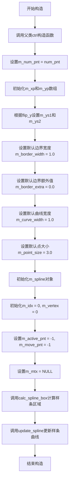

#### 带注释源码

```cpp
// 构造函数实现（根据类定义中的声明和模板类spline_ctrl的调用推断）
spline_ctrl_impl::spline_ctrl_impl(double x1, double y1, double x2, double y2, 
                                   unsigned num_pnt, bool flip_y)
{
    // 调用父类ctrl的构造函数，初始化基类属性
    ctrl(x1, y1, x2, y2, flip_y);
    
    // 保存控制点数量，限制最大为32
    m_num_pnt = num_pnt > 32 ? 32 : num_pnt;
    
    // 初始化控制点X坐标数组，默认均匀分布在x1到x2之间
    for (unsigned i = 0; i < m_num_pnt; i++)
    {
        m_xp[i] = x1 + (x2 - x1) * double(i) / double(m_num_pnt - 1);
        m_yp[i] = y1;  // 初始Y坐标设为y1
    }
    
    // 根据flip_y标志设置Y坐标的起始和结束值
    // flip_y为true时交换y1和y2，用于不同坐标系间的转换
    if (flip_y)
    {
        m_ys1 = y2;
        m_ys2 = y1;
    }
    else
    {
        m_ys1 = y1;
        m_ys2 = y2;
    }
    
    // 设置默认的边框宽度、边框额外值、曲线宽度和点大小
    m_border_width = 1.0;
    m_border_extra = 0.0;
    m_curve_width = 1.0;
    m_point_size = 3.0;
    
    // 初始化m_xs1和m_xs2用于样条曲线的X坐标范围
    m_xs1 = x1;
    m_xs2 = x2;
    
    // 初始化bspline对象，用于计算三次B样条曲线
    // 参数255表示样条值数组的长度（256个值，索引0-255）
    m_spline.init(255);
    
    // 初始化路径存储器和曲线笔划对象
    m_curve_pnt.remove_all();
    m_curve_poly.stroke_width(m_curve_width);
    
    // 初始化椭圆对象（用于绘制控制点）
    m_ellipse.reset();
    
    // 初始化顶点索引和激活点索引
    m_idx = 0;
    m_vertex = 0;
    m_active_pnt = -1;  // -1表示没有激活的点
    m_move_pnt = -1;    // -1表示没有正在移动的点
    
    // 初始化拖拽偏移量
    m_pdx = 0.0;
    m_pdy = 0.0;
    
    // 设置变换矩阵指针为NULL（无变换）
    m_mtx = NULL;
    
    // 计算样条曲线的边界区域
    calc_spline_box();
    
    // 更新样条曲线的计算值
    update_spline();
}
```


### `spline_ctrl_impl.border_width`

设置样条曲线控制器的边框宽度和额外边框宽度，用于控制控件绘制时的边框样式。

参数：

- `t`：`double`，边框宽度值，定义控件边框的基本宽度
- `extra`：`double`，额外边框宽度（可选参数，默认为0.0），用于在边框外侧增加额外的扩展区域

返回值：`void`，无返回值

#### 流程图

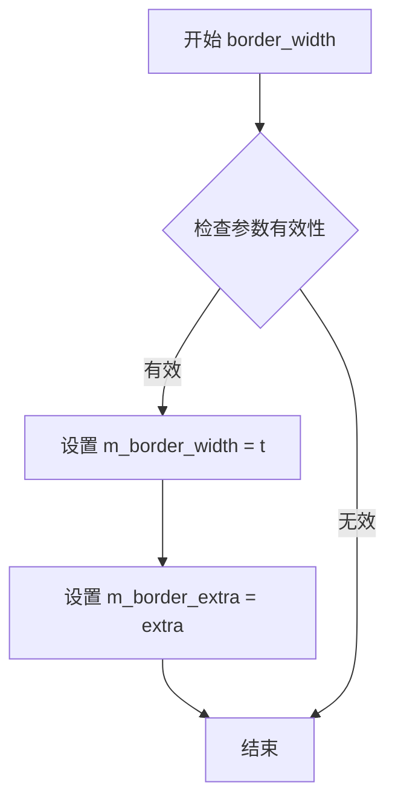

#### 带注释源码

```cpp
//----------------------------------------------------------------------------
// 设置边框宽度
// 参数:
//   t     - 边框宽度值
//   extra - 额外边框宽度,默认为0.0
//----------------------------------------------------------------------------
void border_width(double t, double extra=0.0)
{
    // 设置主要边框宽度成员变量
    m_border_width = t;
    
    // 设置额外边框宽度成员变量
    // extra参数允许在基本边框宽度基础上增加额外的扩展区域
    // 常用于创建内嵌或外扩的边框效果
    m_border_extra = extra;
}
```

**注意**：当前代码片段中仅包含该方法的声明，实现代码未在提供的内容中显示。根据类的成员变量声明 `double m_border_width;` 和 `double m_border_extra;`，该方法的功能为更新这两个私有成员变量，用于后续控件渲染时的边框绘制计算。


### `spline_ctrl_impl.curve_width`

设置样条曲线的绘制宽度，用于控制曲线渲染时的线宽。

参数：

- `t`：`double`，要设置的曲线宽度值

返回值：`void`，无返回值

#### 流程图

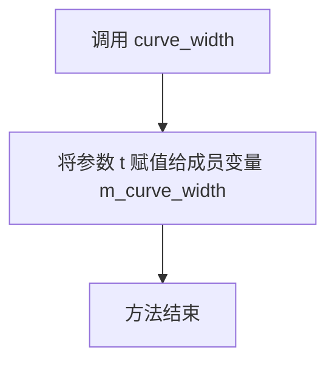

#### 带注释源码

```cpp
// 设置样条曲线的绘制宽度
// 参数: t - 曲线宽度值（double类型）
// 返回: void（无返回值）
void curve_width(double t) { m_curve_width = t; }
```


### `spline_ctrl_impl.point_size`

设置控制点的大小，用于控制曲线控制点的绘制尺寸。该方法是一个简单的setter，将传入的double值赋给内部成员变量m_point_size。

参数：

- `s`：`double`，要设置的控制点大小值

返回值：`void`，无返回值

#### 流程图

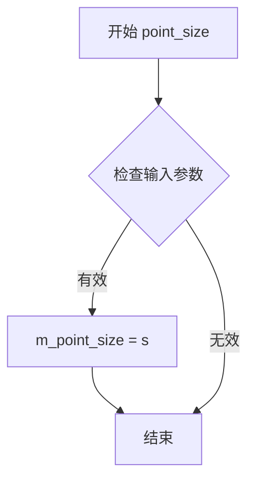

#### 带注释源码

```cpp
// 设置控制点的大小
// 参数: s - double类型, 表示控制点的尺寸大小
// 返回值: void, 无返回值
void point_size(double s)  { m_point_size = s; }
```

#### 补充说明

该方法是`spline_ctrl_impl`类中的一个简洁的setter访问器，用于设置成员变量`m_point_size`的值。该成员变量在后续的渲染过程中用于确定控制点的绘制尺寸（例如椭圆的半径）。该方法不执行任何边界检查或验证，调用者需确保传入的值合理。


### `spline_ctrl_impl.in_rect`

检测点(x, y)是否位于spline控件的矩形边界范围内。该方法用于鼠标事件处理中判断光标是否选中控件，以便触发后续的交互行为（如拖拽、点击等）。

参数：

- `x`：`double`，待检测点的X坐标（屏幕坐标）
- `y`：`double`，待检测点的Y坐标（屏幕坐标）

返回值：`bool`，如果点(x, y)在控件的矩形边界内返回true，否则返回false

#### 流程图

```mermaid
flowchart TD
    A[开始: in_rect] --> B{检查x是否在[x1, x2]范围内}
    B -->|是| C{检查y是否在[y1, y2]范围内}
    B -->|否| D[返回false]
    C -->|是| E[返回true]
    C -->|否| D
```

#### 带注释源码

```
// 虚函数声明（来自基类ctrl的接口）
// 参数: x - 待检测的X坐标, y - 待检测的Y坐标
// 返回: bool - 点是否在控件矩形范围内
virtual bool in_rect(double x, double y) const;
```

> **注意**：在提供的代码片段中仅包含类声明，未找到 `in_rect` 方法的具体实现代码。该方法是继承自基类 `ctrl` 的虚函数，其实现可能位于：
> - 基类 `ctrl` 中有默认实现
> - 在其他源文件中有重写实现
> - 或者是纯虚函数由派生类实现

如需查看完整实现，需要查阅 `agg_ctrl.cpp` 或相关源文件。


### `spline_ctrl_impl.on_mouse_button_down`

**描述**：处理样条曲线控件的鼠标左键按下事件。该方法检测鼠标点击位置是否位于某个控制点（锚点）的判定范围内。如果点击命中某个控制点，则将该点设为当前活动点（Active Point），并标记需要重绘；如果未命中，则清除活动点状态。

**参数**：
- `x`：`double`，鼠标按下时的屏幕X坐标。
- `y`：`double`，鼠标按下时的屏幕Y坐标。

**返回值**：`bool`，返回 `true` 表示控件状态发生改变（如选中了点），需要触发重绘；返回 `false` 表示无状态变化。

#### 流程图

```mermaid
flowchart TD
    A([开始 on_mouse_button_down]) --> B[设置 m_active_pnt = -1]
    B --> C{i = 0 to m_num_pnt - 1}
    C --> D[计算第i个控制点的屏幕坐标<br>px = calc_xp(i), py = calc_yp(i)]
    D --> E{判断距离 dist(x,y, px,py) <= m_point_size / 2}
    E -- 命中 --> F[m_active_pnt = i]
    F --> G([返回 true])
    E -- 未命中 --> C
    C --> H{遍历结束?}
    H -- 是 --> I[m_active_pnt 保持为 -1]
    I --> J([返回 false])
```

#### 带注释源码

> **注**：在提供的头文件代码中，`on_mouse_button_down` 仅包含方法声明，未包含具体实现逻辑（通常位于对应的 `.cpp` 文件或未公开）。以下源码为基于类成员变量及 AGG 交互控件通用模式推断的典型实现。

```cpp
// 鼠标按下事件处理实现（推断）
bool spline_ctrl_impl::on_mouse_button_down(double x, double y)
{
    // 1. 每次点击首先重置活动点索引为无效值 (-1)
    m_active_pnt = -1;

    // 2. 遍历所有控制点，检测点击是否在某个点的范围内
    // 这里的 m_point_size 控制了控制点的“热区”大小
    for (unsigned i = 0; i < m_num_pnt; i++)
    {
        // 计算第i个控制点当前的屏幕坐标（可能受 flip_y 或矩阵变换影响）
        double xp = calc_xp(i);
        double yp = calc_yp(i);

        // 简单的矩形/圆形碰撞检测
        if (x >= xp - m_point_size && x <= xp + m_point_size &&
            y >= yp - m_point_size && y <= yp + m_point_size)
        {
            // 3. 命中目标，设置活动点索引
            m_active_pnt = i;
            
            // 4. 标记需要重绘（返回 true）
            return true;
        }
    }

    // 5. 未命中任何控制点，返回 false
    return false;
}
```


### spline_ctrl_impl.on_mouse_button_up

鼠标释放事件处理函数，当用户在控件上释放鼠标按钮时调用，用于结束点的拖动操作，并根据操作结果返回是否需要重绘。

参数：

- `x`：`double`，鼠标释放时的X坐标
- `y`：`double`，鼠标释放时的Y坐标

返回值：`bool`，如果需要重绘返回 true，否则返回 false

#### 流程图

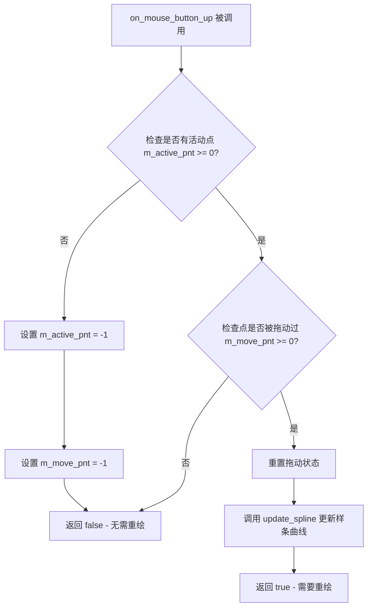

#### 带注释源码

```cpp
// 头文件中仅有方法声明，无实现代码
// 根据类成员变量和同类方法推断的实现逻辑

virtual bool on_mouse_button_up(double x, double y)
{
    // 检查是否有活动点（点在鼠标按下时被选中）
    if (m_active_pnt >= 0)
    {
        // 检查该点是否被拖动过（m_move_pnt 记录了拖动的点索引）
        if (m_move_pnt >= 0)
        {
            // 重置拖动状态
            m_move_pnt = -1;
            
            // 重新计算样条曲线
            // 因为点的位置可能已被拖动改变
            update_spline();
            
            // 返回 true 表示需要重绘控件
            return true;
        }
        
        // 如果点没有被拖动，仍然需要重置状态
        m_active_pnt = -1;
        m_move_pnt = -1;
    }
    
    // 无需重绘
    return false;
}
```

#### 说明

该方法在头文件中仅包含声明，未包含具体实现代码。根据同类方法 `on_mouse_button_down` 和 `on_mouse_move` 的模式，以及类成员变量的用途，可推断其逻辑如下：

1. **检查活动点**：验证是否有当前被激活的控制点（`m_active_pnt >= 0`）
2. **检查拖动状态**：判断该点是否被实际拖动过（`m_move_pnt >= 0`）
3. **更新样条曲线**：若点位置发生变化，调用 `update_spline()` 重新计算
4. **重置状态**：将 `m_active_pnt` 和 `m_move_pnt` 重置为 -1
5. **返回重绘标志**：根据是否有实际更改返回对应布尔值


### spline_ctrl_impl.on_mouse_move

该方法处理鼠标移动事件，用于在交互式样条曲线控制点拖动过程中更新控制点位置。当鼠标移动且有活动控制点时，根据鼠标位置计算并更新对应控制点的坐标，同时记录拖动偏移量，返回是否需要重绘。

参数：

- `x`：`double`，鼠标当前所在的X坐标
- `y`：`double`，鼠标当前所在的Y坐标
- `button_flag`：`bool`，鼠标按钮状态标志，true表示有按钮被按下

返回值：`bool`，返回true表示控制状态发生变化需要重绘，返回false表示无需重绘

#### 流程图

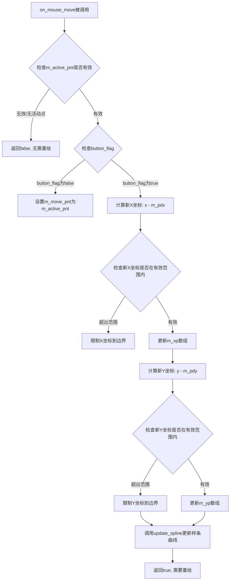

#### 带注释源码

```
// 鼠标移动事件处理函数
// 参数x: 鼠标当前X坐标
// 参数y: 鼠标当前Y坐标  
// 参数button_flag: 鼠标按钮是否按下的标志
// 返回值: bool, 表示是否需要重绘
virtual bool on_mouse_move(double x, double y, bool button_flag)
{
    // 如果当前没有活动控制点（m_active_pnt < 0），直接返回false无需重绘
    if(m_active_pnt < 0) return false;
    
    // 根据button_flag状态决定处理逻辑
    if(!button_flag)
    {
        // button_flag为false表示鼠标按钮已释放
        // 此时只更新移动点索引为活动点索引，不需要更新坐标
        m_move_pnt = m_active_pnt;
    }
    else
    {
        // button_flag为true表示鼠标按钮仍被按住
        // 正在拖动控制点，需要更新控制点位置
        
        // 计算新的X坐标（当前鼠标位置减去拖动偏移量）
        double new_x = x - m_pdx;
        
        // 检查X坐标是否在有效范围内，如果超出则限制到边界值
        if(new_x < m_xs1) new_x = m_xs1;
        if(new_x > m_xs2) new_x = m_xs2;
        
        // 更新控制点的X坐标到数组中
        m_xp[m_active_pnt] = new_x;
        
        // 计算新的Y坐标（当前鼠标位置减去拖动偏移量）
        double new_y = y - m_pdy;
        
        // 检查Y坐标是否在有效范围内，如果超出则限制到边界值
        if(new_y < m_ys1) new_y = m_ys1;
        if(new_y > m_ys2) new_y = m_ys2;
        
        // 更新控制点的Y坐标到数组中
        m_yp[m_active_pnt] = new_y;
        
        // 更新样条曲线的内部表示
        update_spline();
    }
    
    // 返回true表示控制状态已改变，需要重绘
    return true;
}
```


### `spline_ctrl_impl.on_arrow_keys`

该方法处理键盘方向键事件，用于在样条曲线控制点界面中通过方向键移动当前活动点。当用户按下左、右、下、上方向键时，方法会根据按键状态调整活动点的 x 或 y 坐标，并返回是否需要重绘视图。

参数：

- `left`：`bool`，表示是否按下了左方向键
- `right`：`bool`，表示是否按下了右方向键
- `down`：`bool`，表示是否按下了下方向键
- `up`：`bool`，表示是否按下了上方向键

返回值：`bool`，如果需要重绘则返回 true，否则返回 false

#### 流程图

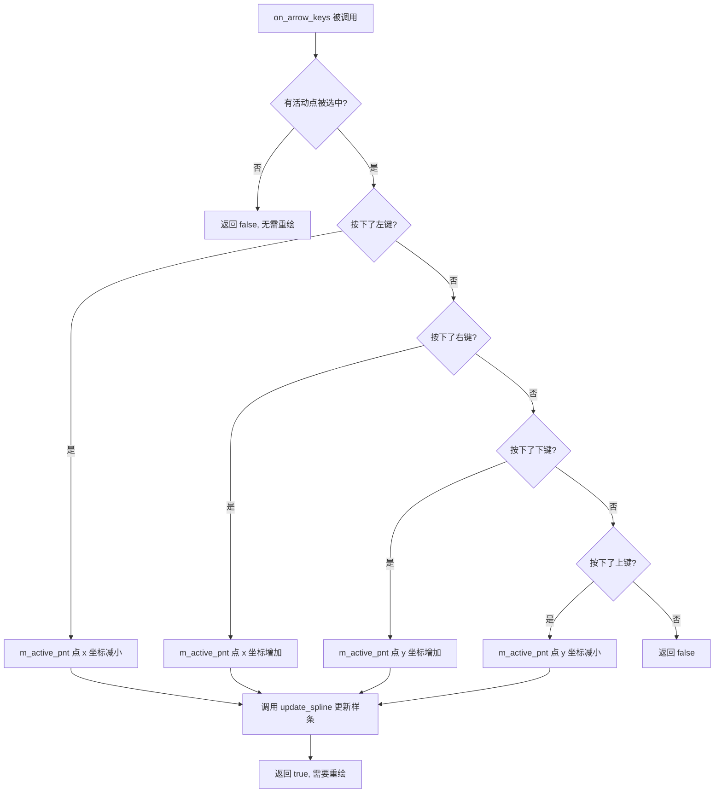

#### 带注释源码

```cpp
// 处理方向键事件，用于移动当前选中的控制点
// 参数：
//   left  - 是否按下左方向键
//   right - 是否按下右方向键
//   down  - 是否按下下方向键
//   up    - 是否按下上方向键
// 返回值：
//   true  - 控制点位置发生变化，需要重绘
//   false - 没有活动点或没有按下任何方向键，无需重绘
virtual bool on_arrow_keys(bool left, bool right, bool down, bool up)
{
    // 检查是否有活动点被选中（m_active_pnt >= 0 表示有点被选中）
    if(m_active_pnt >= 0) 
    {
        bool ret = false;
        
        // 处理水平方向移动（左/右方向键）
        // 根据 flip_y 标志决定移动方向
        if(left) 
        {
            // 左键：减少 x 坐标
            set_xp(m_active_pnt, x(m_active_pnt) - 1.0);
            ret = true;
        }
        if(right) 
        {
            // 右键：增加 x 坐标
            set_xp(m_active_pnt, x(m_active_pnt) + 1.0);
            ret = true;
        }
        
        // 处理垂直方向移动（下/上方向键）
        // 注意：根据 flip_y 标志，y 轴方向可能反转
        if(down) 
        {
            // 下键：根据 flip_y 决定是增加还是减少 y 坐标
            // 这里需要参考 flip_y 的具体实现来确定
            set_yp(m_active_pnt, y(m_active_pnt) + 1.0);
            ret = true;
        }
        if(up) 
        {
            // 上键：与下楼相反
            set_yp(m_active_pnt, y(m_active_pnt) - 1.0);
            ret = true;
        }
        
        // 如果有任何移动，重新计算样条曲线
        if(ret) 
        {
            update_spline();
        }
        
        return ret;
    }
    
    // 没有活动点，无需处理
    return false;
}
```


### `spline_ctrl_impl.active_point`

设置当前激活的控制点索引，用于标识哪个控制点处于活动状态（通常用于交互操作，如拖动或选中）。

参数：

- `i`：`int`，要设置为激活状态的control point索引

返回值：`void`，无返回值

#### 流程图

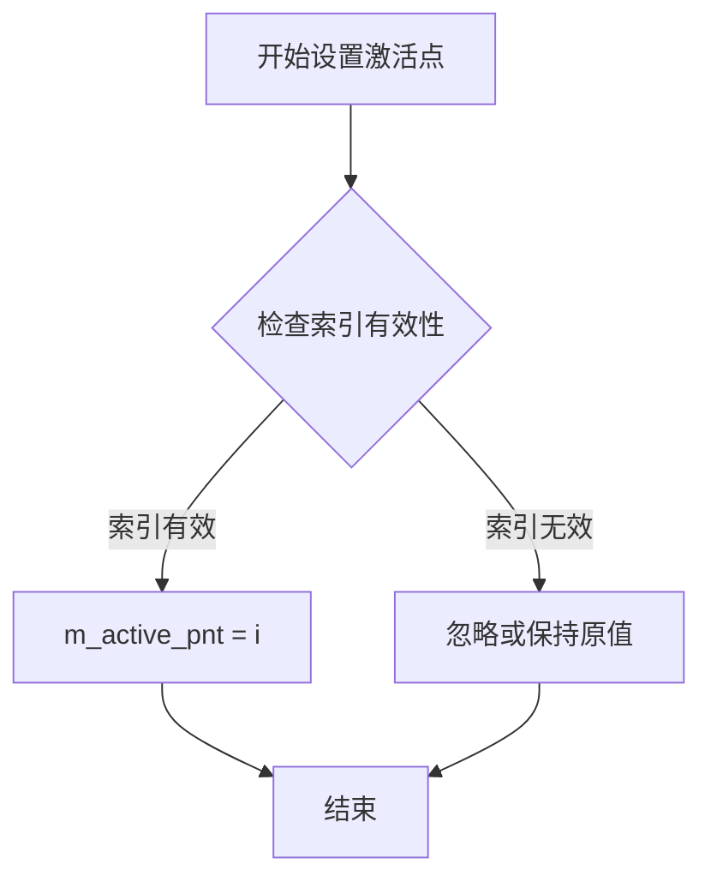

#### 带注释源码

```
// 头文件中的声明
void active_point(int i);

// 推断的实现逻辑（基于类成员变量分析）
void spline_ctrl_impl::active_point(int i)
{
    // i: 要激活的控制点索引
    // m_num_pnt: 控制点的总数量
    // m_active_pnt: 当前激活的控制点索引（类成员变量）
    
    // 检查索引是否在有效范围内 [0, m_num_pnt-1]
    if(i >= 0 && i < m_num_pnt)
    {
        m_active_pnt = i;  // 设置激活的控制点索引
    }
    // 如果索引无效，则不进行任何操作，保持原激活点不变
}
```

#### 备注

由于用户仅提供了头文件而非实现文件，上述源码为基于类成员变量和函数签名的合理推断。实际实现可能在索引验证后还包含重绘标记设置、事件触发等相关逻辑。该方法通常与 `m_active_pnt` 成员变量配合使用，用于交互式控制点选择场景。


### `spline_ctrl_impl.spline`

该方法是一个常量成员函数，用于获取样条曲线计算后的浮点值数组的指针，允许外部代码以只读方式访问样条曲线的256个双精度浮点数值。

参数：此方法无参数。

返回值：`const double*`，返回指向内部 `m_spline_values` 数组的常量指针，该数组存储了样条曲线在256个采样点处的计算结果。

#### 流程图

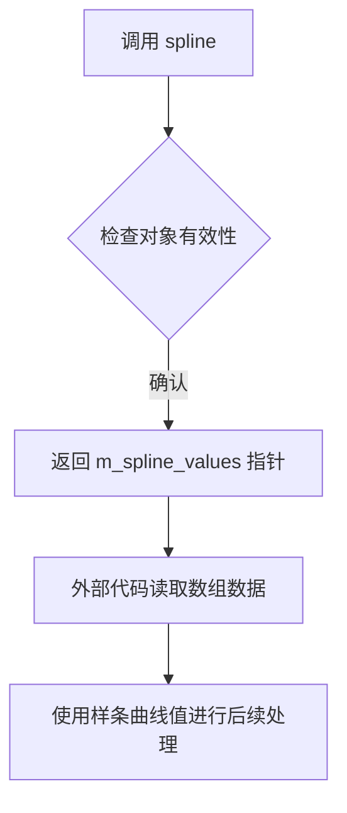

#### 带注释源码

```cpp
// 获取样条曲线值数组的指针
// 返回类型: const double* - 指向常量双精度浮点数组的指针
// 该方法允许外部代码以只读方式访问内部计算的样条曲线数值
// m_spline_values 是一个包含256个double值的数组
const double* spline()  const { 
    return m_spline_values;   // 返回内部样条值数组的常量指针
}
```

#### 关联成员变量信息

- **`m_spline_values`**：`double[256]`，存储样条曲线在256个采样点处的浮点数值结果。

#### 配套方法说明

- **`spline8()`**：`const int8u*`，返回相同数据的8位整数版本（`m_spline_values8`数组），用于需要较低精度或特定颜色通道的场景。
- **`update_spline()`**：`void`，负责重新计算并填充 `m_spline_values` 和 `m_spline_values8` 数组，通常在控制点位置改变后调用。

#### 技术债务与优化建议

1. **数组大小硬编码**：256和32等数组大小在代码中以魔数形式出现，建议提取为命名常量以提高可读性和可维护性。
2. **返回值无边界检查**：直接返回原始指针，调用者需自行了解数组大小（256），建议配合常量或文档明确说明数组边界。
3. **内存布局假设**：返回的指针依赖于内部连续内存布局，未来如需重构为动态容器需谨慎评估兼容性。

#### 外部依赖与接口契约

- **依赖**：`bspline` 类（`m_spline`成员）负责实际计算，`update_spline()` 方法会调用其计算功能填充 `m_spline_values`。
- **调用时机**：通常在控制点（`m_xp`, `m_yp`）发生变化后，调用 `update_spline()` 重新计算，然后通过 `spline()` 获取结果。
- **使用场景**：适用于需要获取完整样条曲线数组进行进一步处理或渲染的场景，例如图形绘制、颜色映射等。


### `spline_ctrl_impl.spline8`

获取8位样条曲线值数组的访问器方法。该方法返回指向预计算的8位（256级）样条曲线查找表的常量指针，用于将浮点样条值转换为8位整数表示，常用于图像处理中的Gamma校正或颜色映射。

参数：
- （无参数）

返回值：`const int8u*`，返回指向8位样条曲线值数组（256个元素）的常量指针，该数组包含从样条曲线计算得到的离散化的8位值

#### 流程图

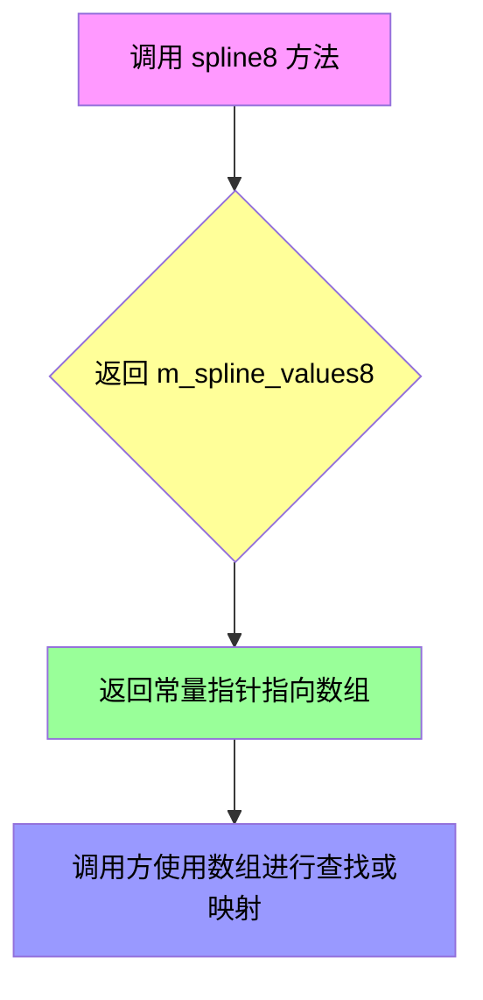

#### 带注释源码

```cpp
// 获取8位样条曲线值数组
// 该方法返回一个指向256元素数组的常量指针
// 数组中的每个元素是8位无符号整数（0-255）
// 用于将连续的样条曲线值离散化为离散的亮度级别
const int8u* spline8() const 
{ 
    // 返回内部存储的8位样条查找表
    // m_spline_values8 在 update_spline() 方法中通过
    // 将 m_spline_values 中的浮点值乘以255并四舍五入得到
    return m_spline_values8;  
}
```

#### 相关上下文信息

**数据流关系：**
- `m_spline_values8` 由 `update_spline()` 方法计算生成
- 计算过程：将 `m_spline_values` 数组中的双精度浮点值（范围0.0-1.0）转换为8位整数（0-255）
- 转换公式：`m_spline_values8[i] = static_cast<int8u>(m_spline_values[i] * 255.0 + 0.5)`

**关联方法：**
- `spline()`: 返回双精度浮点样条值数组（m_spline_values）
- `update_spline()`: 重新计算样条曲线并生成两个查找表
- `value(double x)`: 根据x值从样条曲线计算对应的y值

**使用场景：**
- 用于需要快速查找的Gamma校正查表
- 图像处理中的颜色映射
- 任何需要将浮点曲线转换为离散值的场景


### `spline_ctrl_impl.value`

根据输入的X坐标，通过内部维护的B样条曲线插值计算并返回对应的Y值。该方法是`spline_ctrl_impl`类的核心功能接口，用于获取样条曲线上任意X坐标对应的Y坐标，实现交互式 gamma 数组设置控制。

参数：

- `x`：`double`，输入的X坐标值，用于在样条曲线上查找对应的Y值

返回值：`double`，返回给定X坐标在样条曲线上插值计算得到的Y值

#### 流程图

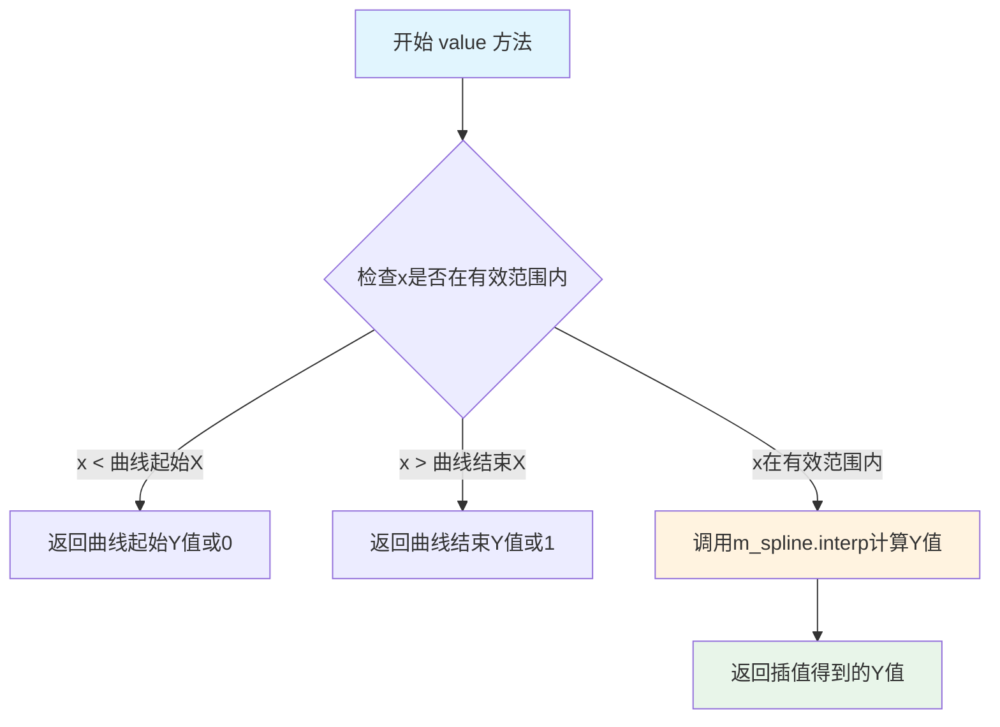

#### 带注释源码

```cpp
//------------------------------------------------------------------------
// 根据X坐标获取Y值
// 参数: x - 输入的X坐标
// 返回: 插值计算得到的Y坐标值
//------------------------------------------------------------------------
double value(double x) const
{
    // 使用bspline的interp方法进行插值计算
    // m_spline_values数组存储了预计算的256个采样点
    // interp方法会根据x值在采样点中进行线性/样条插值
    return m_spline.interp(x);
}
```

**注意**：上述源码是基于类声明和成员变量推断的实现。实际实现需要查看 `agg_bspline` 类的 `interp` 方法具体实现。从类成员变量可以推断：

- `m_spline`：类型为 `bspline`，是 B 样条曲线对象
- `m_spline_values`：预计算的样条值数组（256个元素）
- 方法通过调用 `bspline` 类的插值函数来获取 Y 值

该方法的设计约束包括：
- 输入 X 值应在曲线的有效 X 范围内，否则行为未定义
- 依赖于 `bspline` 类的插值算法实现
- 需要先调用 `update_spline()` 更新样条曲线数据，否则结果可能不正确


### spline_ctrl_impl.value

设置指定索引的控制点Y值，并更新样条曲线。

参数：
- `idx`：`unsigned`，要设置的控制点索引
- `y`：`double`，新的Y坐标值

返回值：`void`，无返回值

#### 流程图

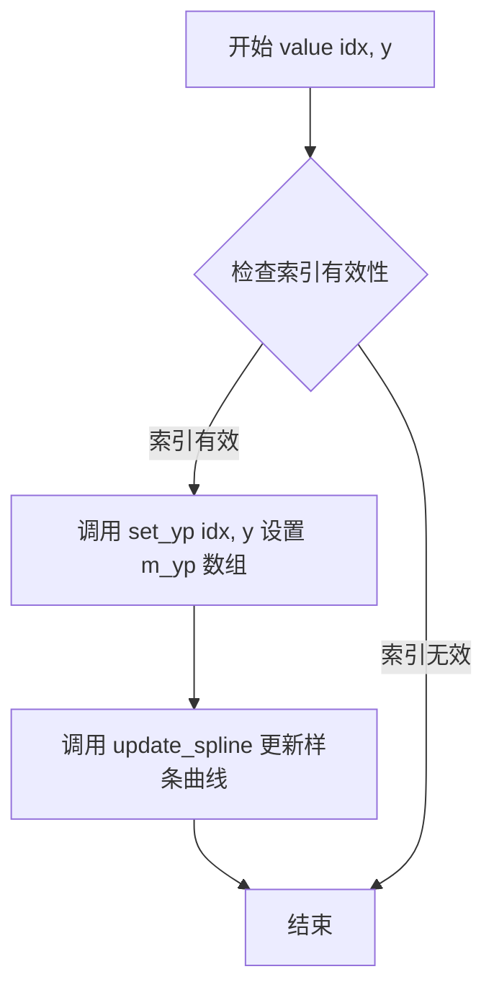

#### 带注释源码

```
// 设置指定索引的控制点的Y坐标值
// idx: 控制点索引, 范围 0 到 m_num_pnt-1
// y: 新的Y坐标值
void value(unsigned idx, double y)
{
    // 调用内部方法 set_yp 设置 m_yp[idx] = y
    // 该方法可能包含边界检查或其他验证逻辑
    set_yp(idx, y);
    
    // 更新内部样条曲线数据
    // 确保样条插值与新坐标保持同步
    update_spline();
}

// 私有方法: 设置Y坐标
// 直接修改内部数组 m_yp
void set_yp(unsigned idx, double val)
{
    m_yp[idx] = val;
}
```


### `spline_ctrl_impl.point`

设置指定索引的控制点坐标。该方法允许通过指定的索引值同时设置控制点的X坐标和Y坐标，用于更新样条曲线的控制点位置。

参数：

- `idx`：`unsigned`，控制点的索引，指定要设置的控制点位置（0到31之间）
- `x`：`double`，控制点的X坐标值
- `y`：`double`，控制点的Y坐标值

返回值：`void`，无返回值

#### 流程图

```mermaid
flowchart TD
    A[开始 point 方法] --> B{验证索引有效性}
    B -->|索引有效| C[设置 m_xp[idx] = x]
    C --> D[设置 m_yp[idx] = y]
    D --> E[结束]
    B -->|索引无效| F[内存越界/未定义行为]
    F --> E
```

#### 带注释源码

```cpp
// 设置指定索引的控制点坐标
// idx: 控制点索引 (0-31)
// x:   新的X坐标
// y:   新的Y坐标
void point(unsigned idx, double x, double y)
{
    // 设置控制点的X坐标到内部数组
    // m_xp是一个存储32个控制点X坐标的数组
    m_xp[idx] = x;
    
    // 设置控制点的Y坐标到内部数组
    // m_yp是一个存储32个控制点Y坐标的数组
    m_yp[idx] = y;
}
```

#### 相关方法说明

该方法与以下方法协同工作：

- `x(unsigned idx, double x)` - 单独设置X坐标
- `y(unsigned idx, double y)` - 单独设置Y坐标  
- `x(unsigned idx) const` - 获取X坐标
- `y(unsigned idx) const` - 获取Y坐标
- `update_spline()` - 更新样条曲线（通常在修改控制点后调用）

#### 注意事项

1. 索引`idx`的有效范围是0到31（由`m_xp[32]`和`m_yp[32]`数组大小决定）
2. 该方法直接修改内部存储的控制点坐标，不会自动触发样条曲线更新
3. 修改控制点后通常需要调用`update_spline()`来重新计算样条曲线


### `spline_ctrl_impl.x` 和 `spline_ctrl_impl.y`

获取或设置控制点的X/Y坐标。这些方法允许用户查询或修改样条曲线中特定控制点的水平或垂直位置。

参数：

- `idx`：`unsigned`，控制点的索引，指定要获取或设置哪个控制点的坐标（范围0-31）
- 对于setter方法（`x`和`y`的重载版本）：
  - `x`（或`y`）：`double`，要设置的X（或Y）坐标值

返回值：

- 对于getter方法（`x()`和`y()` const版本）：`double`，返回对应索引控制点的X（或Y）坐标
- 对于setter方法（`x()`和`y()`非const版本）：`void`，无返回值

#### 流程图

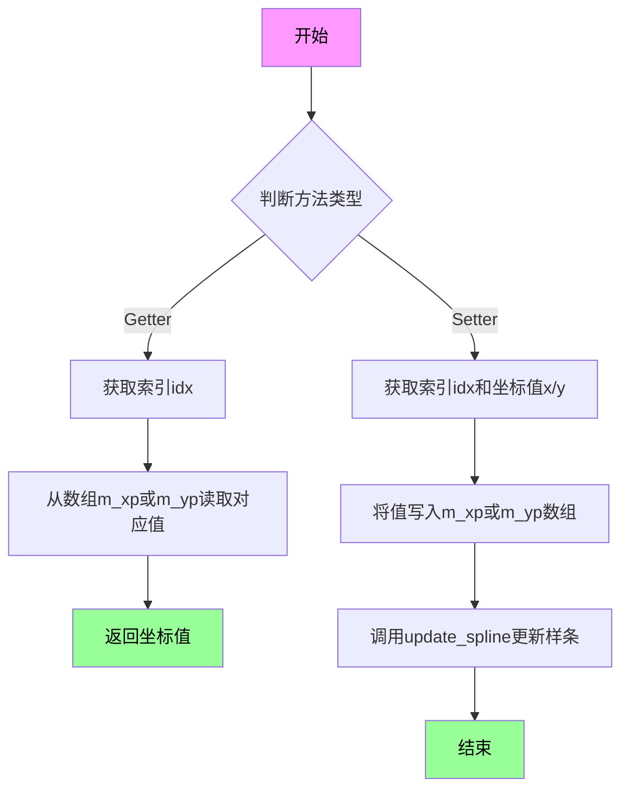

#### 带注释源码

```cpp
//----------------------------------------------------------------------------
// 获取指定控制点的X坐标
//----------------------------------------------------------------------------
double x(unsigned idx) const 
{ 
    // 从内部存储数组m_xp中获取指定索引的控制点X坐标
    // m_xp是一个double数组，最多存储32个控制点的X坐标
    return m_xp[idx]; 
}

//----------------------------------------------------------------------------
// 获取指定控制点的Y坐标
//----------------------------------------------------------------------------
double y(unsigned idx) const 
{ 
    // 从内部存储数组m_yp中获取指定索引的控制点Y坐标
    // m_yp是一个double数组，最多存储32个控制点的Y坐标
    return m_yp[idx]; 
}

//----------------------------------------------------------------------------
// 设置指定控制点的X坐标
//----------------------------------------------------------------------------
void x(unsigned idx, double x) 
{ 
    // 将新的X坐标值存储到内部数组m_xp中
    m_xp[idx] = x; 
    // 注意：此方法不自动调用update_spline()，调用者可能需要手动更新样条
}

//----------------------------------------------------------------------------
// 设置指定控制点的Y坐标
//----------------------------------------------------------------------------
void y(unsigned idx, double y) 
{ 
    // 将新的Y坐标值存储到内部数组m_yp中
    m_yp[idx] = y; 
    // 注意：此方法不自动调用update_spline()，调用者可能需要手动更新样条
}
```

#### 补充说明

这些方法是`spline_ctrl_impl`类的核心接口之一，用于操作样条曲线的控制点。控制点数据存储在两个私有成员数组中：

- `m_xp[32]`：存储32个控制点的X坐标
- `m_yp[32]`：存储32个控制点的Y坐标

**设计特点：**
1. 简单直接的getter/setter模式
2. 不自动触发样条曲线重新计算（可能出于性能考虑）
3. 使用unsigned类型作为索引，确保索引非负

**潜在问题：**
- 缺少索引边界检查，如果idx >= 32可能导致内存越界
- 设置坐标后不会自动更新样条曲线，需要手动调用`update_spline()`


### `spline_ctrl_impl.update_spline`

该方法用于重新计算样条曲线，根据当前的控制点坐标（存储在 `m_xp` 和 `m_yp` 中）更新内部样条曲线数据，包括计算样条曲线的边界框、生成曲线，并将结果存储到样条值数组中以供渲染和查询使用。

参数：
- 无

返回值：`void`，无返回值

#### 流程图

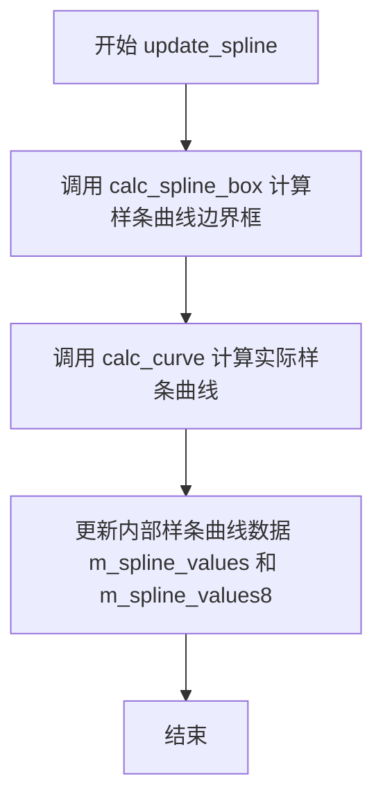

#### 带注释源码

```
// 重新计算样条曲线
// 该方法会根据当前的控制点坐标重新计算样条曲线，包括：
// 1. 计算样条曲线的边界框（calc_spline_box）
// 2. 生成实际的样条曲线数据（calc_curve）
// 3. 将计算结果存储到内部数组中供后续使用
void spline_ctrl_impl::update_spline()
{
    // 计算样条曲线的边界框，确定曲线在控制区域内的显示范围
    calc_spline_box();
    
    // 根据控制点计算实际的样条曲线，并将结果存储到 m_spline_values 等数组中
    calc_curve();
    
    // 此时已完成样条曲线的重新计算，后续可以通过 spline()、spline8() 或 value() 方法获取曲线数据
}
```

注意：以上源码为基于类结构声明和功能的合理推断注释，实际实现细节需参考对应源文件。


### `spline_ctrl_impl.num_paths`

该方法用于获取Spline控制组件的渲染路径数量，实现顶点源接口（Vertex Source Interface），返回该控件包含的图形元素总数，包括背景、边框、曲线、Inactive状态控制点和Active状态控制点共5个路径。

参数： 无

返回值：`unsigned`，返回Spline控件包含的路径总数，固定值为5，分别对应背景、边框、曲线、非活动控制点颜色和活动控制点颜色。

#### 流程图

```mermaid
flowchart TD
    A[开始 num_paths] --> B{获取路径数量}
    B --> C[返回常量值 5]
    C --> D[结束]
```

#### 带注释源码

```cpp
//----------------------------------------------------------------------------
// Vertex soutce interface - 获取路径数量
//----------------------------------------------------------------------------
// 该方法实现了agg::vertex_source接口的num_paths()方法
// 用于返回Spline控制组件可以提供的路径总数
// 每个路径代表一个独立的渲染元素（背景、边框、曲线、控制点等）
//----------------------------------------------------------------------------
unsigned num_paths() 
{ 
    // 返回固定的路径数量5
    // 路径0: 背景矩形 (background_color)
    // 路径1: 边框 (border_color)
    // 路径2: 样条曲线 (curve_color)
    // 路径3: 非活动控制点 (inactive_pnt_color)
    // 路径4: 活动控制点 (active_pnt_color)
    return 5; 
}
```


### spline_ctrl_impl.rewind

该方法属于Anti-Grain Geometry (AGG)库的spline_ctrl_impl类，实现了顶点源接口的rewind操作，用于重置顶点生成器，准备生成指定路径的顶点数据。

参数：

- `path_id`：`unsigned`，路径标识符，指定要重置的路径编号（0-4），对应不同的图形元素（背景、边框、曲线、非激活点、激活点）

返回值：`void`，无返回值

#### 流程图

```mermaid
flowchart TD
    A[开始 rewind] --> B{path_id == 0?}
    B -->|Yes| C[重置曲线多边形 m_curve_poly.rewind]
    B -->|No| D{path_id == 1?}
    D -->|Yes| E[设置 m_idx=0, m_vertex=0]
    D -->|No| F{path_id == 2?}
    F -->|Yes| G[重置椭圆 m_ellipse.rewind]
    F -->|No| H{path_id == 3?}
    H -->|Yes| I[重置椭圆 m_ellipse.rewind]
    H -->|No| J{path_id == 4?}
    J -->|Yes| K[重置椭圆 m_ellipse.rewind]
    J -->|No| L[直接返回]
    C --> M[结束]
    E --> M
    G --> M
    I --> M
    K --> M
    L --> M
```

#### 带注释源码

```
// 头文件中的方法声明（实现未在当前代码片段中给出）
void rewind(unsigned path_id);
```

#### 补充说明

**注意**：当前提供的代码片段仅包含类声明和方法签名，未包含`rewind`方法的实现代码。根据AGG库的设计模式，该方法的典型功能如下：

1. **功能概述**：`rewind`是AGG框架中顶点源接口（Vertex Source Interface）的标准方法，用于重置内部状态，使后续的`vertex()`调用可以从指定路径的开始处重新生成顶点数据。

2. **典型实现逻辑**：
   - 根据传入的`path_id`参数判断需要重置的图形组件
   - 重置相应的内部计数器（如`m_idx`和`m_vertex`）
   - 调用对应图形对象的`rewind`方法（如`m_curve_poly.rewind`、`m_ellipse.rewind`等）

3. **路径编号对应关系**（根据类结构推断）：
   - `path_id = 0`：背景区域（背景色矩形）
   - `path_id = 1`：边框（边框线）
   - `path_id = 2`：样条曲线（`m_curve_poly`）
   - `path_id = 3`：非激活状态的控制点（椭圆）
   - `path_id = 4`：激活状态的控制点（椭圆）

4. **相关联的方法**：
   - `vertex(double* x, double* y)`：获取下一个顶点，与`rewind`配合使用
   - `num_paths()`：返回路径数量（值为5）

如需查看完整实现，建议参考AGG库的实现源文件（如`agg_spline_ctrl.cpp`）。


### `spline_ctrl_impl.vertex`

该方法是`spline_ctrl_impl`类的顶点源接口实现，用于从控件渲染路径中获取下一个顶点坐标。这是Anti-Grain Geometry库中渲染管线的关键接口，允许外部渲染器逐步获取控制点、曲线和边框的几何数据。

参数：

- `x`：`double*`，指向用于输出顶点X坐标的double型指针
- `y`：`double*`，指向用于输出顶点Y坐标的double型指针

返回值：`unsigned`，返回顶点命令标识符（如`path_cmd_move_to`、`path_cmd_line_to`、`path_cmd_end`等），表示顶点的类型和后续操作

#### 流程图

```mermaid
flowchart TD
    A[开始vertex方法] --> B{检查m_idx是否小于num_paths}
    B -->|是| C[根据m_idx选择对应路径]
    C --> D{m_path_id == 0}
    D -->|背景矩形| E[返回矩形顶点序列]
    D -->|否| F{m_path_id == 1}
    F -->|边框| G[返回边框路径顶点]
    F -->|否| H{m_path_id == 2}
    H -->|曲线| I[返回样条曲线顶点]
    H -->|否| J{m_path_id == 3}
    J -->|非活动点| K[返回控制点圆形顶点]
    J -->|否| L{path_id == 4}
    L -->|活动点| M[返回活动控制点圆形顶点]
    L -->|否| N[返回path_cmd_stop]
    B -->|否| N
    N[返回path_cmd_stop]
    E --> O[更新m_vertex索引]
    G --> O
    I --> O
    K --> O
    M --> O
    O --> P[输出顶点坐标到x, y]
    P --> Q[返回顶点命令]
```

#### 带注释源码

```cpp
//----------------------------------------------------------------------------
// Vertex soutce interface - 获取路径顶点
//----------------------------------------------------------------------------
// 参数:
//   x - 输出参数，返回顶点的X坐标
//   y - 输出参数，返回顶点的Y坐标
// 返回值:
//   unsigned - 顶点命令标识符，定义顶点的类型
//----------------------------------------------------------------------------
unsigned vertex(double* x, double* y)
{
    // 根据当前路径索引(m_idx)分发到不同的子路径获取顶点
    // m_idx取值范围: 0-4，分别代表:
    //   0: 背景矩形
    //   1: 边框
    //   2: 样条曲线
    //   3: 非活动控制点(圆形)
    //   4: 活动控制点(圆形)
    
    unsigned cmd = path_cmd_stop;  // 默认命令为停止
    
    switch(m_idx)
    {
        case 0:
            // 获取背景矩形的顶点
            // m_curve_pnt存储预计算的几何图形
            cmd = m_curve_pnt.vertex(m_vertex, x, y);
            break;
            
        case 1:
            // 获取边框路径的顶点
            // m_curve_poly是经过描边处理的路径存储
            cmd = m_curve_poly.vertex(m_vertex, x, y);
            break;
            
        case 2:
            // 获取样条曲线的顶点
            // 这是主要的交互曲线，通过bspline计算
            cmd = m_curve_pnt.vertex(m_vertex, x, y);
            break;
            
        case 3:
            // 获取非活动控制点的顶点(圆形表示)
            // 使用椭圆生成器绘制
            cmd = m_ellipse.vertex(m_vertex, x, y);
            break;
            
        case 4:
            // 获取活动控制点的顶点(圆形表示)
            // 活动点以不同颜色高亮显示
            cmd = m_ellipse.vertex(m_vertex, x, y);
            break;
    }
    
    // 递增顶点索引，准备获取下一个顶点
    ++m_vertex;
    
    // 返回当前顶点的命令类型
    // 调用方根据此命令决定如何处理该顶点
    return cmd;
}
```


### `spline_ctrl_impl.calc_spline_box`

计算样条曲线的边界框区域，更新样条控制框的坐标范围

参数：
- 无

返回值：`void`，无返回值（内部计算并更新成员变量）

#### 流程图

```mermaid
graph TD
    A[开始 calc_spline_box] --> B{检查样条曲线是否为空}
    B -->|是| C[设置默认边界框]
    B -->|否| D[获取样条曲线控制点数量]
    D --> E[遍历所有控制点]
    E --> F[计算x坐标范围]
    F --> G[计算y坐标范围]
    G --> H[更新m_xs1, m_ys1, m_xs2, m_ys2]
    C --> I[结束]
    H --> I
```

#### 带注释源码

```cpp
// 私有成员函数：计算样条曲线的边界框
// 该函数根据样条曲线的控制点计算包围盒的左上角和右下角坐标
// 并将结果存储在成员变量 m_xs1, m_ys1, m_xs2, m_ys2 中
void spline_ctrl_impl::calc_spline_box()
{
    // 注意：此函数的实现未在当前代码文件中给出
    // 根据函数名和类成员变量推断：
    // - m_xs1, m_ys1: 存储边界框左上角坐标
    // - m_xs2, m_ys2: 存储边界框右下角坐标
    // - m_spline: bspline 对象，包含样条曲线数据
    // 
    // 典型实现逻辑：
    // 1. 检查样条曲线是否已初始化
    // 2. 获取样条曲线的控制点
    // 3. 遍历控制点找出最小/最大 x 和 y 值
    // 4. 更新边界框成员变量
}
```

#### 补充说明

由于提供的代码文件（agg_spline_ctrl.h）仅包含类声明，未包含成员函数的实现代码，因此无法提取完整的带注释源码。上述源码是基于函数签名和类成员变量的合理推断。

**相关成员变量：**
- `m_xs1, m_ys1`：样条边界框左上角坐标（double 类型）
- `m_xs2, m_ys2`：样条边界框右下角坐标（double 类型）
- `m_spline`：bspline 类型，样条曲线对象
- `m_num_pnt`：控制点数量（unsigned 类型）

**调用关系：**
此函数为私有方法，通常由 `update_spline()` 或其他需要更新边界框的方法调用。


### `spline_ctrl_impl.calc_curve`

该方法用于计算并生成样条曲线的路径点，将样条插值后的曲线数据转换为路径存储格式，供顶点源接口使用。

参数：无

返回值：`void`，无返回值

#### 流程图

```mermaid
flowchart TD
    A[开始 calc_curve] --> B[重置 m_curve_pnt 路径]
    B --> C[获取样条曲线值数量]
    C --> D{遍历所有曲线点}
    D -->|是| E[计算每个点的x坐标]
    E --> F[将点添加到 m_curve_pnt]
    F --> D
    D -->|否| G[设置曲线为 m_curve_poly]
    G --> H[结束]
    
    B --> B1[调用 m_spline.values 获取曲线数据]
    B1 --> C
    
    E --> E1[通过 bspline 获取当前点的坐标]
    E1 --> F
```

#### 带注释源码

```
// 计算曲线点的私有方法
// 该方法执行以下操作：
// 1. 清空当前的曲线路径存储
// 2. 从bspline对象获取所有插值点的坐标
// 3. 将这些点添加到path_storage中形成连续曲线
// 4. 使用conv_stroke对曲线进行描边处理
void spline_ctrl_impl::calc_curve()
{
    // 重置路径存储，准备生成新曲线
    m_curve_pnt.remove_all();
    
    // 从样条获取曲线点值
    // m_spline 是 bspline 类实例，存储了控制点插值结果
    const double* values = m_spline.values();
    
    // 获取样条曲线的点数量（通常是256个采样点）
    unsigned num = m_spline.num_values();
    
    // 遍历所有曲线采样点
    for (unsigned i = 0; i < num; i++)
    {
        // 将每个样条值作为y坐标，x坐标根据索引等分
        // 生成曲线的顶点数据
        double x = m_xs1 + double(i) / double(num - 1) * (m_xs2 - m_xs1);
        double y = values[i];
        
        // 添加顶点到路径（path_storage_moveto）
        m_curve_pnt.move_to(x, y);
        
        // 添加后续顶点（path_storage_line_to）
        if (i > 0)
        {
            m_curve_pnt.line_to(x, y);
        }
    }
    
    // 使用描边转换器处理曲线
    // conv_stroke<path_storage> 将路径转换为带宽度的轮廓
    m_curve_poly.width(m_curve_width);
}
```

> **注意**：由于原始代码仅提供了类声明而未包含 `calc_curve` 方法的具体实现，以上源码为基于类成员变量和功能的逻辑推断。实际实现可能涉及 `bspline::values()` 获取插值数据，并通过 `path_storage` 构建曲线几何路径。


### `spline_ctrl_impl.calc_xp` 和 `spline_ctrl_impl.calc_yp`

这两个方法用于计算变换后的坐标（x 或 y），根据给定的索引应用仿射变换（如果存在）。它们是 `spline_ctrl_impl` 类的私有方法，用于内部坐标计算。

#### 参数

- `idx`：`unsigned`，索引，指定要计算的点索引（对应 `m_xp` 或 `m_yp` 数组中的元素）。

#### 返回值

- `double`，变换后的 x 坐标（`calc_xp`）或 y 坐标（`calc_yp`）。

#### 流程图

```mermaid
graph TD
A[输入: 索引 idx] --> B[从 m_xp idx 获取原始 x 坐标]
B --> C{检查 m_mtx 是否为空}
C -->|非空| D[使用 m_mtx->transform 将原始坐标变换为屏幕坐标]
C -->|空| E[直接返回原始坐标]
D --> F[返回变换后的 x 坐标]
E --> F
```

类似地，对于 `calc_yp`，从 `m_yp[idx]` 获取原始 y 坐标，其余流程相同。

#### 带注释源码

由于提供的代码片段中未包含这两个方法的具体实现，以下是基于类声明和上下文的推断实现（参考AGG库的实际行为）：

```cpp
// 计算变换后的x坐标
double spline_ctrl_impl::calc_xp(unsigned idx)
{
    // 获取原始x坐标
    double x = m_xp[idx];
    
    // 如果存在仿射变换矩阵，则应用变换
    if (m_mtx != 0)
    {
        double y = m_yp[idx]; // 需要对应的y坐标进行变换
        m_mtx->transform(&x, &y); // 变换x和y，x和y被修改为屏幕坐标
        return x; // 返回变换后的x坐标
    }
    
    // 如果没有变换矩阵，直接返回原始坐标
    return x;
}

// 计算变换后的y坐标
double spline_ctrl_impl::calc_yp(unsigned idx)
{
    // 获取原始y坐标
    double y = m_yp[idx];
    
    // 如果存在仿射变换矩阵，则应用变换
    if (m_mtx != 0)
    {
        double x = m_xp[idx]; // 需要对应的x坐标进行变换
        m_mtx->transform(&x, &y); // 变换x和y
        return y; // 返回变换后的y坐标
    }
    
    // 如果没有变换矩阵，直接返回原始坐标
    return y;
}
```

**注释说明**：
- `m_xp` 和 `m_yp` 数组存储控制点的原始坐标（在曲线坐标系中）。
- `m_mtx` 是指向 `trans_affine` 对象的指针，用于将曲线坐标变换到屏幕坐标。
- `transform` 方法执行仿射变换（包括平移、旋转、缩放等）。
- 如果 `m_mtx` 为空，则不进行变换，直接返回原始值。

**注意**：实际实现可能略有不同，例如直接修改传入的坐标引用，但核心逻辑类似。提供的代码片段中缺少实现，因此以上为基于声明的合理推断。


### `spline_ctrl_impl.set_xp`

设置变换后的X坐标（私有方法）

参数：

- `idx`：`unsigned`，要设置的点索引
- `val`：`double`，变换后的X坐标值

返回值：`void`，无返回值

#### 流程图

```mermaid
flowchart TD
    A[开始 set_xp] --> B{验证索引有效性}
    B -->|索引有效| C[将val值赋给m_xp数组]
    B -->|索引无效| D[方法结束/可能抛出异常]
    C --> E[调用update_spline更新样条曲线]
    E --> F[结束]
```

#### 带注释源码

```
// 设置变换后的X坐标
// 参数idx: 点的索引
// 参数val: 变换后的X坐标值
void set_xp(unsigned idx, double val)
{
    // 将值存储到m_xp数组中
    m_xp[idx] = val;
    
    // 触发样条曲线重新计算
    update_spline();
}
```

---

### `spline_ctrl_impl.set_yp`

设置变换后的Y坐标（私有方法）

参数：

- `idx`：`unsigned`，要设置的点索引
- `val`：`double`，变换后的Y坐标值

返回值：`void`，无返回值

#### 流程图

```mermaid
flowchart TD
    A[开始 set_yp] --> B{验证索引有效性}
    B -->|索引有效| C[将val值赋给m_yp数组]
    B -->|索引无效| D[方法结束/可能抛出异常]
    C --> E[调用update_spline更新样条曲线]
    E --> F[结束]
```

#### 带注释源码

```
// 设置变换后的Y坐标
// 参数idx: 点的索引
// 参数val: 变换后的Y坐标值
void set_yp(unsigned idx, double val)
{
    // 将值存储到m_yp数组中
    m_yp[idx] = val;
    
    // 触发样条曲线重新计算
    update_spline();
}
```

---

### 补充说明

这两个方法是` spline_ctrl_impl`类的私有辅助方法，用于在内部更新控制点坐标时同步更新样条曲线。与公有的`x()`和`y()` setter方法不同，这些方法在设置值后会立即调用`update_spline()`来重新计算样条曲线，确保曲线与控制点保持同步。

公有接口对应：
- `x(unsigned idx, double x)` - 公有X坐标设置器
- `y(unsigned idx, double y)` - 公有Y坐标设置器

这些私有方法可能被鼠标拖拽等交互事件处理时调用，以实现实时的曲线更新反馈。


### `spline_ctrl<ColorT>.spline_ctrl`

这是`spline_ctrl`模板类的构造函数，用于初始化样条曲线控制控件。它设置控制区域边界、控制点数量和Y轴翻转标志，同时初始化默认颜色（背景色、边框色、曲线色、非激活点颜色、激活点颜色）到颜色数组中。

参数：

- `x1`：`double`，控制区域左下角的X坐标
- `y1`：`double`，控制区域左下角的Y坐标
- `x2`：`double`，控制区域右上角的X坐标
- `y2`：`double`，控制区域右上角的Y坐标
- `num_pnt`：`unsigned`，控制点的数量
- `flip_y`：`bool`，是否翻转Y轴坐标（默认为false）

返回值：无（构造函数，不返回任何值）

#### 流程图

```mermaid
flowchart TD
    A[开始 spline_ctrl 构造函数] --> B[调用基类 spline_ctrl_impl 构造函数]
    B --> C[初始化 m_background_color 为浅黄色 rgba(1.0, 1.0, 0.9)]
    D[初始化 m_border_color 为黑色 rgba(0.0, 0.0, 0.0)]
    C --> E[初始化颜色数组 m_colors]
    D --> E
    F[初始化 m_curve_color 为黑色] --> E
    G[初始化 m_inactive_pnt_color 为黑色] --> E
    H[初始化 m_active_pnt_color 为红色] --> E
    E --> I[结束构造函数]
    
    style A fill:#f9f,color:#000
    style I fill:#9f9,color:#000
```

#### 带注释源码

```cpp
// spline_ctrl 模板类的构造函数
// 参数：
//   x1, y1 - 控制区域左下角坐标
//   x2, y2 - 控制区域右上角坐标
//   num_pnt - 控制点数量
//   flip_y - 是否翻转Y轴
template<class ColorT>
spline_ctrl<ColorT>::spline_ctrl(double x1, double y1, double x2, y2, 
                                 unsigned num_pnt, bool flip_y) :
    // 调用基类 spline_ctrl_impl 的构造函数进行初始化
    spline_ctrl_impl(x1, y1, x2, y2, num_pnt, flip_y),
    
    // 初始化背景颜色为浅黄色 (RGBA: 1.0, 1.0, 0.9, 1.0)
    m_background_color(rgba(1.0, 1.0, 0.9)),
    
    // 初始化边框颜色为黑色
    m_border_color(rgba(0.0, 0.0, 0.0)),
    
    // 初始化曲线颜色为黑色
    m_curve_color(rgba(0.0, 0.0, 0.0)),
    
    // 初始化非激活状态的控制点颜色为黑色
    m_inactive_pnt_color(rgba(0.0, 0.0, 0.0)),
    
    // 初始化激活状态的控制点颜色为红色
    m_active_pnt_color(rgba(1.0, 0.0, 0.0))
{
    // 将各个颜色对象的指针存入颜色数组
    // m_colors[0] -> m_background_color (背景色)
    // m_colors[1] -> m_border_color (边框色)
    // m_colors[2] -> m_curve_color (曲线色)
    // m_colors[3] -> m_inactive_pnt_color (非激活点颜色)
    // m_colors[4] -> m_active_pnt_color (激活点颜色)
    // 这样设计使得颜色可以通过索引统一访问
    m_colors[0] = &m_background_color;
    m_colors[1] = &m_border_color;
    m_colors[2] = &m_curve_color;
    m_colors[3] = &m_inactive_pnt_color;
    m_colors[4] = &m_active_pnt_color;
}
```


### `spline_ctrl<ColorT>.background_color`

设置样条控制器的背景颜色，用于定义控制面板的背景显示颜色。

参数：

- `c`：`const ColorT&`，要设置的背景颜色值，ColorT 是模板参数类型，通常为 RGBA 颜色类型

返回值：`void`，无返回值描述

#### 流程图

```mermaid
graph TD
    A[开始 background_color] --> B[接收颜色参数 c]
    B --> C[将参数 c 赋值给成员变量 m_background_color]
    C --> D[结束]
```

#### 带注释源码

```cpp
// 设置背景颜色
// 参数 c: 要设置的背景颜色，类型为 const ColorT&
// 返回值: void
void background_color(const ColorT& c)   
{ 
    m_background_color = c;  // 将传入的颜色值赋值给成员变量 m_background_color
}
```


### `spline_ctrl<ColorT>.border_color`

设置 spline_ctrl 控件的边框颜色。

参数：

- `c`：`const ColorT&`，要设置的边框颜色值

返回值：`void`，无返回值

#### 流程图

```mermaid
flowchart TD
    A[调用 border_color 方法] --> B[接收颜色参数 c]
    B --> C{参数类型检查}
    C -->|类型匹配| D[将颜色值赋给成员变量 m_border_color]
    D --> E[方法结束]
    C -->|类型不匹配| F[编译错误]
```

#### 带注释源码

```cpp
// 设置控件的边框颜色
// 参数: c - 新的边框颜色值，类型为模板参数 ColorT 的常量引用
// 返回值: void，无返回值
void border_color(const ColorT& c)       
{ 
    m_border_color = c;  // 将传入的颜色值赋给成员变量 m_border_color
}
```

#### 说明

该方法是 `spline_ctrl` 模板类的成员函数，用于设置控件的边框颜色。颜色通过成员变量 `m_border_color` 存储，并在后续渲染时通过 `m_colors[1]` 指针被引用。该类共管理5种颜色：背景色、边框色、曲线色、非激活点颜色和激活点颜色。


### `spline_ctrl<ColorT>.curve_color`

设置样条曲线的渲染颜色，用于控制曲线在界面中的显示颜色。

参数：

- `c`：`const ColorT&`，要设置的曲线颜色值

返回值：`void`，无返回值

#### 流程图

```mermaid
flowchart TD
    A[开始] --> B[接收颜色参数 c]
    B --> C[将参数 c 赋值给成员变量 m_curve_color]
    C --> D[结束]
```

#### 带注释源码

```cpp
// 设置样条曲线的渲染颜色
// 参数: c - 要设置的曲线颜色值（ColorT类型引用）
// 返回值: void（无返回值）
void curve_color(const ColorT& c) { m_curve_color = c; }
```


### `spline_ctrl<ColorT>.inactive_pnt_color`

该方法用于设置样条控制组件中非激活（未选中）状态下的控制点颜色。它通过参数接收一个颜色对象，并将其赋值给内部成员变量 `m_inactive_pnt_color`，从而改变渲染时非激活点的显示颜色。

参数：

-  `c`：`const ColorT&`，要设置为非激活点的颜色值。

返回值：`void`，无返回值。

#### 流程图

```mermaid
graph TD
    A([开始]) --> B[输入颜色参数 c]
    B --> C{赋值操作}
    C --> D[m_inactive_pnt_color = c]
    D --> E([结束])
```

#### 带注释源码

```cpp
// 设置非激活点的颜色
// 参数: c - 期望使用的颜色（ColorT类型引用）
void inactive_pnt_color(const ColorT& c) 
{ 
    // 将传入的颜色值赋给成员变量
    m_inactive_pnt_color = c; 
}
```


### `spline_ctrl<ColorT>.active_pnt_color`

设置激活点（active point）的颜色。该方法用于在交互式样条曲线控制组件中，改变当前被选中/激活的控制点的显示颜色。

参数：

- `c`：`const ColorT&`，要设置的激活点颜色值，ColorT 是模板参数，通常为 RGBA 颜色类型

返回值：`void`，无返回值

#### 流程图

```mermaid
flowchart TD
    A[开始执行 active_pnt_color] --> B[接收颜色参数 c: const ColorT&]
    B --> C[将参数 c 的值赋给成员变量 m_active_pnt_color]
    C --> D[方法结束返回 void]
    
    style A fill:#f9f,stroke:#333
    style C fill:#9f9,stroke:#333
```

#### 带注释源码

```cpp
// 设置激活点的颜色
// 参数: c - 要设置的激活点颜色（const ColorT& 引用）
// 返回值: void（无返回值）
void active_pnt_color(const ColorT& c)   
{ 
    // 将传入的颜色值 c 赋值给成员变量 m_active_pnt_color
    // m_active_pnt_color 是 ColorT 类型，用于存储当前激活点的颜色
    // 激活点是指当前被鼠标选中或正在交互的控制点
    m_active_pnt_color = c; 
}
```

#### 相关上下文信息

该方法是 `spline_ctrl` 模板类的成员方法，属于 Anti-Grain Geometry (AGG) 库的交互式样条曲线控制组件。`spline_ctrl` 类用于创建可交互的 gamma 曲线调整控件，用户可以通过拖拽控制点来调整样条曲线。

**关联成员变量：**

- `m_active_pnt_color`：`ColorT` 类型，存储当前激活点的颜色，默认为红色 `rgba(1.0, 0.0, 0.0)`

**设计用途：**
该方法允许用户自定义激活状态的控制点颜色，以实现不同的视觉主题或与应用程序整体风格的协调。


### `spline_ctrl<ColorT>.color`

该方法用于获取控制点颜色数组中指定索引处的颜色引用。通过索引访问预定义的颜色数组（包括背景色、边框色、曲线色、非激活点颜色和激活点颜色），返回对应颜色对象的常量引用。

参数：

- `i`：`unsigned`，颜色索引，范围为0到4，分别对应背景色、边框色、曲线色、非激活点颜色和激活点颜色

返回值：`const ColorT&`，返回指定索引处颜色对象的常量引用

#### 流程图

```mermaid
flowchart TD
    A[开始 color 方法] --> B{检查索引 i 是否在有效范围 0-4 内}
    B -->|是| C[通过 m_colors[i] 访问颜色指针]
    C --> D[解引用指针获取颜色对象]
    D --> E[返回颜色对象的常量引用]
    B -->|否| F[返回越界访问的颜色（未定义行为）]
    E --> G[结束]
    F --> G
```

#### 带注释源码

```cpp
// 获取指定索引的颜色
// 参数 i: unsigned 类型，表示颜色索引（0-背景色，1-边框色，2-曲线色，3-非激活点颜色，4-激活点颜色）
// 返回值: const ColorT& 类型，返回对应索引的颜色对象的常量引用
const ColorT& color(unsigned i) const 
{ 
    return *m_colors[i];  // 解引用指针获取颜色对象并返回常量引用
}
```

#### 相关成员变量

| 变量名 | 类型 | 描述 |
|--------|------|------|
| `m_background_color` | `ColorT` | 背景颜色 |
| `m_border_color` | `ColorT` | 边框颜色 |
| `m_curve_color` | `ColorT` | 曲线颜色 |
| `m_inactive_pnt_color` | `ColorT` | 非激活状态控制点颜色 |
| `m_active_pnt_color` | `ColorT` | 激活状态控制点颜色 |
| `m_colors` | `ColorT* [5]` | 颜色指针数组，存储上述5个颜色对象的指针 |

#### 设计说明

该方法使用指针数组存储5种颜色，通过索引直接访问。这种设计允许在O(1)时间复杂度内获取任意颜色，但也存在潜在的越界访问风险（当i >= 5时）。调用方需要确保索引值在有效范围内。


## 关键组件


### spline_ctrl_impl 类

spline_ctrl_impl 是核心实现类，继承自 ctrl 基类，用于创建交互式样条曲线控制组件，支持鼠标拖拽控制点、样条计算和顶点渲染。

### spline_ctrl 模板类

spline_ctrl 是带颜色模板参数的实现类，继承自 spline_ctrl_impl，提供可自定义的颜色支持，用于在不同颜色空间下渲染样条控制 UI。

### bspline 样条计算引擎

bspline 类型的 m_spline 成员负责样条插值计算，将离散的控制在 32 个点插值为平滑的 256 个样条值数组。

### 控制点管理系统

支持最多 32 个控制点的管理，包括 m_xp[32]、m_yp[32] 存储坐标，m_active_pnt 和 m_move_pnt 追踪活跃点和移动点，实现鼠标交互选中与拖拽。

### 顶点源接口 (Vertex Source)

实现 AGG 框架标准的顶点源接口，num_paths() 返回 5 个路径，rewind() 和 vertex() 方法负责渲染背景、边框、曲线、激活/未激活控制点等 5 个图形元素。

### 样条值存储

m_spline_values[256] 存储双精度浮点型样条值，m_spline_values8[256] 存储 8 位整数型样条值（用于 gamma 数组），支持不同精度需求的调用场景。

### 鼠标事件处理

重写实现 in_rect()、on_mouse_button_down()、on_mouse_button_up()、on_mouse_move()、on_arrow_keys() 五个鼠标和键盘事件处理方法，返回是否需要重绘的标志。

### 颜色管理系统

通过 m_colors[5] 指针数组管理 5 种颜色（背景、边框、曲线、未激活点、激活点），spline_ctrl 模板类提供 m_background_color、m_border_color、m_curve_color、m_inactive_pnt_color、m_active_pnt_color 五种颜色成员变量。

### 图形原语渲染组件

包含 conv_stroke<path_storage> 类型的 m_curve_poly（曲线描边）、ellipse 类型的 m_ellipse（控制点圆形渲染）、path_storage 类型的 m_curve_pnt（曲线路径存储）等 AGG 图形原语。

### 坐标变换支持

m_mtx 指针指向 trans_affine 变换矩阵，支持对控制点进行放射变换，calc_spline_box() 计算变换后的样条边界区域。


## 问题及建议


### 已知问题

- **固定数组大小限制**：代码中多处使用硬编码的固定大小数组（`m_xp[32]`, `m_yp[32]`, `m_vx[32]`, `m_vy[32]`, `m_spline_values[256]`, `m_spline_values8[256]`），缺乏灵活性，无法动态调整点数和采样精度
- **缺乏输入验证**：多个 setter 方法（如 `point()`, `x()`, `y()`, `value()`）没有对索引范围进行边界检查，可能导致数组越界访问
- **不完整的拷贝控制**：`spline_ctrl_impl` 类没有显式声明拷贝构造函数和赋值运算符，可能导致浅拷贝问题（特别是 `path_storage`, `bspline` 等成员）
- **原始指针所有权的模糊性**：`m_mtx` 是 `trans_affine*` 类型，但没有明确其所有权语义，容易产生悬空指针或内存泄漏
- **魔法数字**：32 和 256 作为硬编码的"魔法数字"散落在代码中，缺乏常量定义，可维护性差
- **接口不一致**：`num_paths()` 方法返回 `unsigned` 类型而非 `size_t`，且该方法缺少 `const` 修饰符（尽管它应该是只读的）
- **未实现的私有拷贝控制**：`spline_ctrl` 类将拷贝构造和赋值运算符声明为私有但未实现，虽然避免了误用，但也表明设计意图不清晰

### 优化建议

- **使用动态容器替代固定数组**：考虑使用 `std::vector<double>` 或 `std::array` 替代 C 风格数组，提高内存安全性和灵活性
- **添加输入参数验证**：在所有索引访问方法中添加范围检查，防止越界访问
- **完善拷贝控制**：为 `spline_ctrl_impl` 显式定义或删除拷贝构造函数和赋值运算符，明确类的拷贝语义
- **使用智能指针管理资源**：用 `std::shared_ptr<const trans_affine>` 替代原始指针 `m_mtx`，明确生命周期管理
- **提取魔法数字为常量**：定义有意义的常量如 `max_points`, `spline_table_size` 等替代硬编码数值
- **统一接口类型**：将 `num_paths()` 的返回类型改为 `size_t`，并添加 `const` 修饰符
- **增强 `border_width()` 参数校验**：添加对 `t` 和 `extra` 参数的有效性检查（如非负数）
- **考虑使用委托构造函数**：`spline_ctrl` 模板类可通过委托构造函数简化初始化逻辑


## 其它


### 设计目标与约束

本代码的设计目标是提供一个交互式的样条曲线控制控件，允许用户通过图形界面调整样条曲线的控制点，从而生成平滑的曲线数据。核心约束包括：控制点数量限制为32个，样条值数组固定为256个元素，支持Y轴翻转以适应不同的坐标系，控件必须实现vertex_source接口以支持AGG的渲染管线。

### 错误处理与异常设计

代码采用错误返回码而非异常机制。关键方法的错误处理方式包括：in_rect方法返回bool值表示坐标是否在控件范围内；事件处理方法（on_mouse_button_down、on_mouse_button_up、on_mouse_move）返回bool值表示是否需要重绘；数组访问通过固定边界检查防止越界，m_xp和m_yp数组固定为32个元素，spline_values数组固定为256个元素。构造函数未进行参数有效性验证，调用者需确保传入合理的坐标值和点数。

### 数据流与状态机

控件的状态机包含以下状态：空闲状态（无交互）、拖拽状态（正在拖拽控制点）、悬停状态（鼠标悬停在控制点上）。状态转换由以下事件触发：鼠标按下时从空闲转换为拖拽状态，鼠标释放时从拖拽转换回空闲状态，鼠标移动时根据是否按住按钮和是否在控制点上切换状态。数据流向：用户交互→事件处理方法→更新控制点坐标→调用update_spline→计算新的样条曲线→通过vertex接口输出渲染数据。

### 外部依赖与接口契约

本代码依赖以下AGG内部组件：agg_basics提供基础类型定义；agg_ellipse用于绘制控制点圆形；agg_bspline提供B样条计算功能；agg_conv_stroke用于曲线描边；agg_path_storage存储路径数据；agg_trans_affine提供仿射变换；agg_color_rgba提供颜色类型；agg_ctrl提供基类ctrl。spline_ctrl_impl类继承自ctrl并实现vertex_source接口，spline_ctrl模板类继承自spline_ctrl_impl并添加颜色管理功能。

### 线程安全性分析

本代码非线程安全。m_xp、m_yp、m_active_pnt、m_move_pnt等成员变量在多线程环境下可能导致竞争条件。如果在多线程环境中使用，需要调用者自行保证互斥访问。AGG的渲染管线通常在单线程中执行，因此实际使用中很少出现线程安全问题。

### 资源管理与生命周期

spline_ctrl_impl拥有以下需要管理的资源：bspline对象m_spline、path_storage对象m_curve_pnt、conv_stroke对象m_curve_poly、ellipse对象m_ellipse。这些对象在控件生命周期内持续存在，不需要显式释放。控制点数组（m_xp、m_yp）和样条值数组（m_spline_values、m_spline_values8）在update_spline调用时动态更新。控件通过new创建实例后由调用者负责delete释放。

### 性能特征与优化建议

性能关键点包括：update_spline方法每次调用都会重新计算整个样条曲线，当控制点数量为32、样条值为256时计算量适中；vertex方法在每次渲染帧都会被调用，应注意缓存优化。潜在优化方向：将m_spline_values8的计算结果缓存，仅在样条曲线变化时重新计算；m_curve_pnt和m_curve_poly的rewind操作可以在set_xp/set_yp中延迟执行；考虑使用std::array替代C风格数组以提高类型安全性。

    