# `matplotlib\extern\agg24-svn\include\platform\agg_platform_support.h` 详细设计文档

Anti-Grain Geometry库的跨平台图形应用支持类，提供窗口管理、渲染缓冲区、图像加载保存、鼠标键盘事件处理和基本UI控件容器等功能，用于创建交互式演示应用程序，支持Windows、X-Window、SDL、MacOS等平台。

## 整体流程

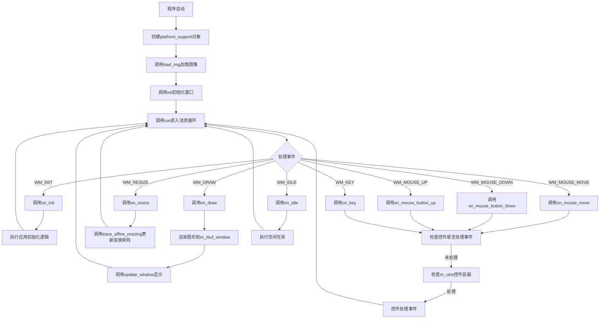

## 类结构

```
agg命名空间
├── 枚举类型
│   ├── window_flag_e (窗口标志)
│   ├── pix_format_e (像素格式)
│   ├── input_flag_e (输入标志)
│   └── key_code_e (键盘码)
├── 前向声明
│   └── platform_specific (平台特定实现)
├── ctrl_container (控件容器类)
└── platform_support (主平台支持类)
```

## 全局变量及字段


### `max_ctrl`
    
控件容器的最大控件数量常量

类型：`const int`
    


### `max_images`
    
平台支持类的最大图像缓冲区数量常量

类型：`enum max_images_e`
    


### `ctrl_container.m_ctrl[max_ctrl]`
    
存储控件指针的数组

类型：`ctrl*`
    


### `ctrl_container.m_num_ctrl`
    
当前已添加的控件数量

类型：`unsigned`
    


### `ctrl_container.m_cur_ctrl`
    
当前选中或激活的控件索引

类型：`int`
    


### `platform_support.m_specific`
    
指向平台特定实现细节的指针

类型：`platform_specific*`
    


### `platform_support.m_ctrls`
    
管理交互式控件的容器

类型：`ctrl_container`
    


### `platform_support.m_format`
    
渲染缓冲区的像素格式

类型：`pix_format_e`
    


### `platform_support.m_bpp`
    
像素位深度

类型：`unsigned`
    


### `platform_support.m_rbuf_window`
    
窗口的主渲染缓冲区

类型：`rendering_buffer`
    


### `platform_support.m_rbuf_img[max_images]`
    
图像缓冲区的数组，用于存储加载或创建的图像

类型：`rendering_buffer`
    


### `platform_support.m_window_flags`
    
窗口初始化标志

类型：`unsigned`
    


### `platform_support.m_wait_mode`
    
控制事件循环是否等待事件的标志

类型：`bool`
    


### `platform_support.m_flip_y`
    
Y轴是否垂直翻转的标志

类型：`bool`
    


### `platform_support.m_caption`
    
窗口标题文本

类型：`char[256]`
    


### `platform_support.m_initial_width`
    
窗口初始宽度

类型：`int`
    


### `platform_support.m_initial_height`
    
窗口初始高度

类型：`int`
    


### `platform_support.m_resize_mtx`
    
用于窗口缩放的仿射变换矩阵

类型：`trans_affine`
    
    

## 全局函数及方法


### `ctrl_container.ctrl_container`

构造函数，用于初始化控制容器对象，设置默认的空控制列表和当前无选中控制项。

参数：
- 无

返回值：
- 无（C++ 构造函数不返回任何值）

#### 流程图

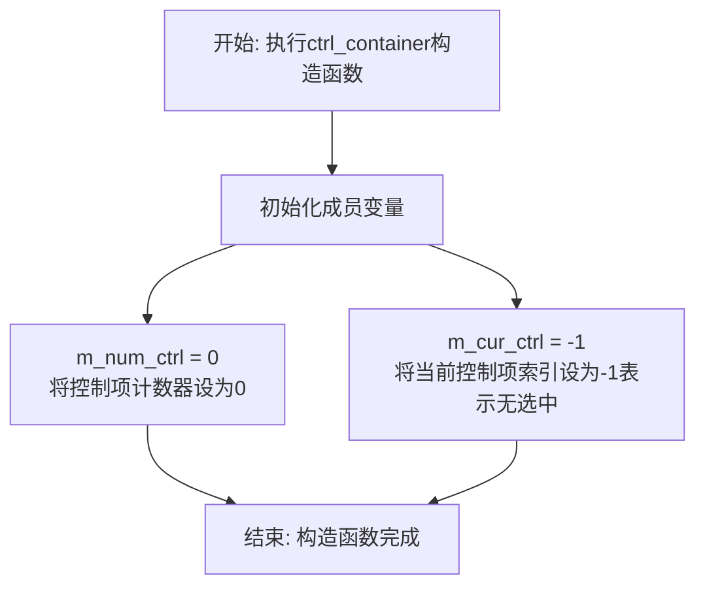

#### 带注释源码

```cpp
//--------------------------------------------------------------------
ctrl_container() : m_num_ctrl(0), m_cur_ctrl(-1) {}
/*
 * ctrl_container类的构造函数
 * 功能：初始化控制容器为空状态
 * 
 * 初始化列表：
 *   - m_num_ctrl = 0    : 控制项计数器，初始为0表示当前无任何控制项
 *   - m_cur_ctrl = -1   : 当前选中控制项索引，-1表示没有控制项被选中
 * 
 * 说明：
 *   - 使用初始化列表进行成员变量初始化是C++中的最佳实践
 *   - max_ctrl定义了最大支持的控制项数量为64个
 *   - 构造函数不返回任何值（void类型由编译器隐式处理）
 *   
 * 使用场景：
 *   - 在platform_support类中作为成员变量m_ctrls被构造
 *   - 用于管理一组GUI控件（如按钮、滑块等）的事件处理
 */
```


### `ctrl_container.add`

向控件容器中添加一个控件，如果容器未满则成功添加，否则忽略。

参数：

- `c`：`ctrl&`，要添加的控件引用

返回值：`void`，无返回值

#### 流程图

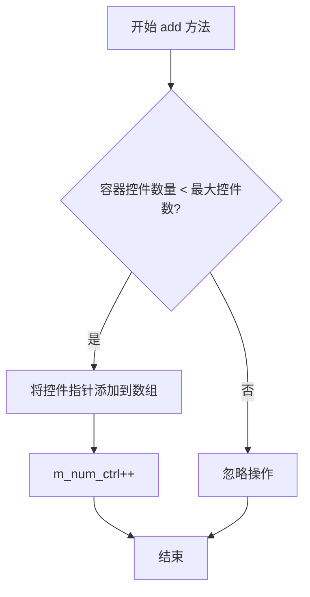

#### 带注释源码

```cpp
//--------------------------------------------------------------------
void add(ctrl& c)
{
    // 检查当前控件数量是否小于最大允许数量（64）
    if(m_num_ctrl < max_ctrl)
    {
        // 将控件指针添加到控件数组中，并递增计数器
        m_ctrl[m_num_ctrl++] = &c;
    }
    // 如果容器已满，则不执行任何操作（静默忽略）
}
```


### `ctrl_container.in_rect`

检查给定点(x, y)是否位于容器中任意控件的矩形区域内。

参数：

- `x`：`double`，要检查的点的X坐标
- `y`：`double`，要检查的点的Y坐标

返回值：`bool`，如果点(x, y)落在任意控件的矩形区域内则返回true，否则返回false

#### 流程图

```mermaid
flowchart TD
    A[开始 in_rect] --> B{遍历所有控件 i < m_num_ctrl}
    B -->|是| C{调用 m_ctrl[i]->in_rect(x, y)}
    C -->|返回true| D[返回 true]
    C -->|返回false| E[i++]
    E --> B
    B -->|否| F[返回 false]
    D --> G[结束]
    F --> G
```

#### 带注释源码

```cpp
//--------------------------------------------------------------------
bool in_rect(double x, double y)
{
    unsigned i;
    // 遍历容器中的所有控件
    for(i = 0; i < m_num_ctrl; i++)
    {
        // 调用每个控件的in_rect方法检查点是否在控件内
        if(m_ctrl[i]->in_rect(x, y)) 
            return true;  // 如果在任何控件内找到该点,立即返回true
    }
    return false;  // 遍历完所有控件均未找到,返回false
}
```


### `ctrl_container.on_mouse_button_down`

该方法接收鼠标按下事件的坐标，遍历容器内所有已注册的控件，依次调用各控件的 `on_mouse_button_down` 方法。一旦某个控件处理了该事件（返回 true），立即返回 true；若所有控件都未处理，则返回 false。

参数：

- `x`：`double`，鼠标按下位置的 X 坐标
- `y`：`double`，鼠标按下位置的 Y 坐标

返回值：`bool`，如果任意一个控件处理了鼠标按下事件则返回 true，否则返回 false

#### 流程图

```mermaid
flowchart TD
    A[开始 on_mouse_button_down] --> B[初始化循环变量 i = 0]
    B --> C{i < m_num_ctrl?}
    C -->|Yes| D[调用 m_ctrl[i].on_mouse_button_down(x, y)]
    D --> E{返回值 == true?}
    E -->|Yes| F[返回 true 并结束]
    E -->|No| G[i++]
    G --> C
    C -->|No| H[返回 false]
    F --> I[结束]
    H --> I
```

#### 带注释源码

```cpp
//--------------------------------------------------------------------
bool on_mouse_button_down(double x, double y)
{
    unsigned i;
    // 遍历容器中的所有控件
    for(i = 0; i < m_num_ctrl; i++)
    {
        // 调用当前控件的 on_mouse_button_down 方法
        // 如果该控件处理了事件（返回 true），则立即返回 true
        if(m_ctrl[i]->on_mouse_button_down(x, y)) return true;
    }
    // 所有控件都未处理该事件，返回 false
    return false;
}
```


### `ctrl_container.on_mouse_button_up`

该方法处理鼠标释放事件，遍历容器中的所有控件，依次调用它们的鼠标按钮释放事件处理函数，如果任意一个控件处理了该事件则返回 true，否则返回 false。

参数：

- `x`：`double`，鼠标释放时的 X 坐标
- `y`：`double`，鼠标释放时的 Y 坐标

返回值：`bool`，如果任意一个控件处理了该事件返回 true，否则返回 false

#### 流程图

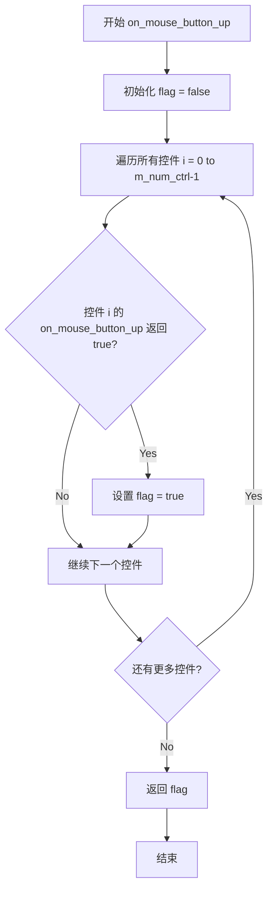

#### 带注释源码

```cpp
//--------------------------------------------------------------------
bool ctrl_container::on_mouse_button_up(double x, double y)
{
    // 定义循环计数器
    unsigned i;
    // 标记是否已有控件处理了该事件
    bool flag = false;
    
    // 遍历容器中的所有控件
    for(i = 0; i < m_num_ctrl; i++)
    {
        // 调用当前控件的鼠标按钮释放事件处理方法
        // 如果该控件处理了事件（返回true），则将flag设为true
        if(m_ctrl[i]->on_mouse_button_up(x, y)) flag = true;
    }
    
    // 返回结果：如果任意一个控件处理了事件返回true，否则返回false
    return flag;
}
```


### `ctrl_container.on_mouse_move`

该方法处理鼠标移动事件，遍历容器中的所有控件，将鼠标移动事件分发给第一个响应处理的控件。如果没有任何控件处理该事件，则返回 false。

参数：

- `x`：`double`，鼠标当前所在位置的 X 坐标
- `y`：`double`，鼠标当前所在位置的 Y 坐标
- `button_flag`：`bool`，标识鼠标按钮状态（true 表示按钮被按下，false 表示按钮未按下）

返回值：`bool`，如果某个控件处理了该事件则返回 true，否则返回 false

#### 流程图

```mermaid
flowchart TD
    A[开始 on_mouse_move] --> B[初始化循环变量 i = 0]
    B --> C{i < m_num_ctrl?}
    C -->|Yes| D[调用 m_ctrl[i].on_mouse_move]
    D --> E{处理结果 == true?}
    E -->|Yes| F[返回 true]
    E -->|No| G[i++]
    G --> C
    C -->|No| H[返回 false]
    F --> I[结束]
    H --> I
```

#### 带注释源码

```cpp
//--------------------------------------------------------------------
bool on_mouse_move(double x, double y, bool button_flag)
{
    unsigned i;
    // 遍历容器中的所有控件
    for(i = 0; i < m_num_ctrl; i++)
    {
        // 将鼠标移动事件传递给当前控件，如果该控件处理了事件则立即返回 true
        if(m_ctrl[i]->on_mouse_move(x, y, button_flag)) return true;
    }
    // 没有任何控件处理该事件，返回 false
    return false;
}
```


### `ctrl_container.on_arrow_keys`

该方法处理方向键事件，当存在当前选中的控件时，将方向键事件委托给该控件处理；如果没有选中的控件，则返回 false。

参数：

- `left`：`bool`，表示是否按下了左方向键
- `right`：`bool`，表示是否按下了右方向键
- `down`：`bool`，表示是否按下了下方向键
- `up`：`bool`，表示是否按下了上方向键

返回值：`bool`，如果存在当前选中的控件则返回该控件处理方向键的结果，否则返回 false

#### 流程图

```mermaid
flowchart TD
    A[开始 on_arrow_keys] --> B{m_cur_ctrl >= 0?}
    B -->|是| C[调用 m_ctrl[m_cur_ctrl]->on_arrow_keys]
    C --> D[返回控件处理结果]
    B -->|否| E[返回 false]
    D --> F[结束]
    E --> F
```

#### 带注释源码

```cpp
//--------------------------------------------------------------------
bool on_arrow_keys(bool left, bool right, bool down, bool up)
{
    // 检查是否存在当前选中的控件（索引大于等于0）
    if(m_cur_ctrl >= 0)
    {
        // 将方向键事件委托给当前选中控件的on_arrow_keys方法处理
        return m_ctrl[m_cur_ctrl]->on_arrow_keys(left, right, down, up);
    }
    // 没有选中任何控件时，返回false表示未处理
    return false;
}
```


### `ctrl_container.set_cur`

该方法接受鼠标的坐标 (x, y)，遍历容器内的所有控件，判断坐标是否落在某个控件的矩形区域内。如果落在某个控件内且该控件不是当前已选中的控件，则更新当前控件索引并返回 true；如果坐标不在任何控件内且之前有选中的控件，则取消选中并返回 true；其他情况返回 false。

参数：

-  `x`：`double`，鼠标位置的 X 坐标，用于检测该位置是否在某个控件范围内。
-  `y`：`double`，鼠标位置的 Y 坐标，用于检测该位置是否在某个控件范围内。

返回值：`bool`，返回当前控件的选中状态是否发生了改变（选中新的控件、取消选中返回 true；状态未变返回 false）。

#### 流程图

```mermaid
flowchart TD
    A([Start set_cur]) --> B[Loop through all controls]
    B --> C{Is (x, y) in control[i]?}
    C -->|Yes| D{m_cur_ctrl != i?}
    D -->|Yes| E[Set m_cur_ctrl = i]
    E --> F[Return true]
    D -->|No| G[Return false]
    C -->|No| H{Have more controls?}
    H -->|Yes| B
    H -->|No| I{m_cur_ctrl != -1?}
    I -->|Yes| J[Set m_cur_ctrl = -1]
    J --> K[Return true]
    I -->|No| L[Return false]
```

#### 带注释源码

```cpp
        //--------------------------------------------------------------------
        // Sets the current control (the one that contains the point x, y).
        // Returns true if the current control was changed.
        //--------------------------------------------------------------------
        bool set_cur(double x, double y)
        {
            unsigned i;
            // Iterate through all controls in the container
            for(i = 0; i < m_num_ctrl; i++)
            {
                // Check if the point (x, y) is inside the current control's rectangle
                if(m_ctrl[i]->in_rect(x, y)) 
                {
                    // If the found control is different from the currently selected one
                    if(m_cur_ctrl != int(i))
                    {
                        // Update the current control index to the new one
                        m_cur_ctrl = i;
                        // Return true indicating the selection has changed
                        return true;
                    }
                    // If it's the same control, return false (no change)
                    return false;
                }
            }
            // If the point is not inside any control
            // Check if there was a previously selected control
            if(m_cur_ctrl != -1)
            {
                // Deselect the current control (set to none)
                m_cur_ctrl = -1;
                // Return true indicating the selection was cleared
                return true;
            }
            // If there was no selected control, return false
            return false;
        }
```


### `platform_support.platform_support`

这是 `platform_support` 类的构造函数。它负责初始化渲染环境的像素格式、坐标系统方向（Y轴翻转），并为窗口、图像缓冲区和平台特定对象分配初始内存及默认值。

参数：

-  `format`：`pix_format_e`，指定渲染缓冲区的像素格式（例如：`pix_format_rgb24`, `pix_format_bgra32` 等）。
-  `flip_y`：`bool`，如果为 `true`，则表示 Y 轴垂直翻转（通常用于匹配窗口坐标系统与图像坐标系统）。

返回值：无（构造函数）。

#### 流程图

```mermaid
graph TD
    A([开始: platform_support(format, flip_y)]) --> B[设置成员变量: m_format = format]
    B --> C[设置成员变量: m_flip_y = flip_y]
    C --> D[计算并设置: m_bpp (根据format计算位深)]
    D --> E[初始化默认状态: m_wait_mode = true, m_window_flags = 0]
    E --> F[初始化控制容器: m_ctrls 重置]
    F --> G[清空渲染缓冲区: m_rbuf_window 和 m_rbuf_img]
    G --> H[创建平台特定对象: m_specific = new platform_specific(...)]
    H --> I([结束: 构造函数返回])
```

#### 带注释源码

```cpp
//----------------------------------------------------------------------------
// 构造函数声明 (位于 agg_platform_support.h)
//----------------------------------------------------------------------------

// format - 像素格式, 参考 enum pix_format_e
// flip_y - Y轴是否翻转
platform_support(pix_format_e format, bool flip_y);

//----------------------------------------------------------------------------
// 逻辑推断的构造函数实现细节 (基于类成员变量)
//----------------------------------------------------------------------------
/*
platform_support::platform_support(pix_format_e format, bool flip_y) 
    : m_format(format),           // 初始化渲染格式
      m_flip_y(flip_y),           // 初始化翻转标志
      m_wait_mode(true),          // 默认进入等待模式 (等待事件)
      m_window_flags(0),          // 窗口标志默认为空
      m_initial_width(0),         // 初始宽度
      m_initial_height(0),        // 初始高度
      m_bpp(0)                    // 位深待计算
{
    // 1. 根据 format 计算 m_bpp (Bits Per Pixel)
    //    (实际实现中通常调用辅助函数获取格式对应的位数)
    
    // 2. 初始化 m_caption 为空字符串
    memset(m_caption, 0, sizeof(m_caption));
    
    // 3. 初始化变换矩阵为单位矩阵
    m_resize_mtx = trans_affine(); 
    
    // 4. 初始化图像缓冲区数组 (m_rbuf_img)
    //    (通常将指针置空)
    
    // 5. 创建平台特定对象 (Platform Specific)
    //    m_specific = new platform_specific(*this); 
    //    (该对象持有系统原生句柄，如 HWND, X11 Window 等)
}
*/
```


### `platform_support::~platform_support`

析构函数，用于释放平台支持类实例所占用的资源，包括渲染缓冲区、控制容器以及平台特定实现对象的清理。

参数： 无

返回值： 无（C++ 析构函数没有返回值）

#### 流程图

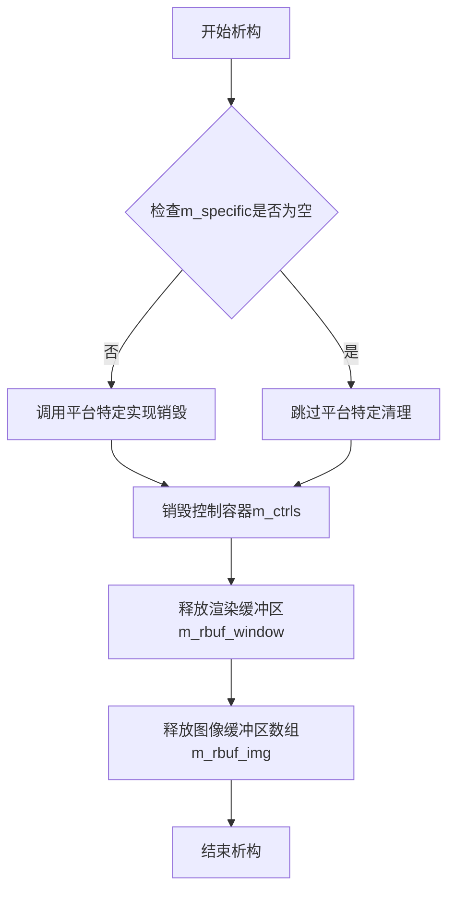

#### 带注释源码

```
//----------------------------------------------------------------------------
// 析构函数声明（来自头文件 agg_platform_support.h）
//----------------------------------------------------------------------------

// 文件位置：约第 370 行
// virtual ~platform_support();
//
// 描述：
//     虚析构函数，确保通过基类指针删除派生类对象时能正确调用派生类的析构函数
//     具体实现位于 agg_platform_support.cpp 中，通常包含：
//     1. 删除 platform_specific 对象（m_specific）
//     2. 清理控制容器（m_ctrls）
//     3. 释放渲染缓冲区（m_rbuf_window）
//     4. 释放图像缓冲区数组（m_rbuf_img）
//
// 参数：无
//
// 返回值：无（析构函数不返回任何值）
//
// 实现逻辑（推测自类结构和注释）：
virtual ~platform_support()
{
    // 删除平台特定实现对象，释放系统相关资源
    // 根据不同平台可能是 HWND、X11 Window、SDL_Window 等
    delete m_specific;
    m_specific = nullptr;
    
    // ctrl_container 的析构会自动清理已添加的控件指针
    // 但不删除控件对象本身（外部管理）
}
//----------------------------------------------------------------------------
```

**注意**：该头文件中仅包含析构函数的**声明**，具体**实现**代码位于 `agg_platform_support.cpp` 文件中（根据注释说明）。由于代码片段未包含实现部分，上述源码为基于类成员结构和注释的合理推断。


### `platform_support.caption`

该方法用于设置窗口的标题（caption），允许在窗口初始化前或运行期间随时调用，以更改窗口显示的文本标题。

参数：

- `cap`：`const char*`，指向以空字符结尾的字符串，表示要设置的窗口标题文本

返回值：`void`，无返回值

#### 流程图

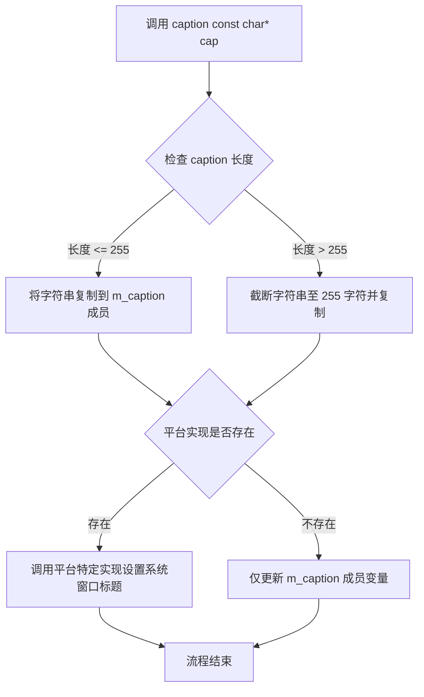

#### 带注释源码

```cpp
//------------------------------------------------------------------------------
// 在 platform_support 类中声明（agg_platform_support.h）
//------------------------------------------------------------------------------

// 设置窗口标题（字幕）
// 参数：
//   cap - 指向以空字符结尾的字符串，表示窗口标题
// 返回值：
//   void - 无返回值
// 说明：
//   此方法用于设置窗口的标题文本。应该在调用 init() 之前调用，
//   但最好能够支持在窗口生命周期内随时调用。
//   实现依赖于平台特定的代码（如 Win32、X11、SDL 等）
void caption(const char* cap);

// 获取当前窗口标题的 const 成员函数
// 返回值：
//   const char* - 返回存储在 m_caption 成员中的当前窗口标题
const char* caption() const { return m_caption; }

//------------------------------------------------------------------------------
// 私有成员变量声明（在类定义底部）
//------------------------------------------------------------------------------
private:
    // ...
    char m_caption[256];  // 存储窗口标题的字符数组，最大255字符+终止符
    // ...
```

#### 平台实现示例（伪代码，实际在 agg_platform_support.cpp 中）

```cpp
//------------------------------------------------------------------------------
// 平台实现中的 caption 方法示例（Win32 实现）
//------------------------------------------------------------------------------
void platform_support::caption(const char* cap)
{
    // 安全复制标题字符串到内部成员变量
    // 使用 strncpy 确保不会发生缓冲区溢出
    strncpy(m_caption, cap, 255);
    m_caption[255] = '\0';  // 确保字符串正确终止

    // 如果平台特定对象已创建，则调用平台相关API设置系统窗口标题
    if (m_specific)
    {
        // 调用平台特定实现设置实际窗口标题
        // Win32 示例：SetWindowText(m_specific->hwnd, m_caption);
        m_specific->set_window_title(m_caption);
    }
}
```

#### 相关成员变量

| 名称 | 类型 | 描述 |
|------|------|------|
| `m_caption` | `char[256]` | 存储窗口标题的内部缓冲区，最大支持255个字符 |
| `m_specific` | `platform_specific*` | 指向平台特定实现对象的指针，用于调用底层系统API |


### `platform_support.caption()`

获取窗口的标题（caption），返回当前设置的窗口标题文本。

参数：该方法无参数。

返回值：`const char*`，返回指向窗口标题字符串的常量指针，标题存储在内部的 `m_caption` 字符数组中（最大 255 个字符 + 空终止符）。

#### 流程图

```mermaid
flowchart TD
    A[开始] --> B{调用caption() const方法}
    B --> C[返回m_caption成员变量]
    C --> D[结束, 返回const char\*类型]
    
    style B fill:#e1f5fe
    style C fill:#e8f5e8
    style D fill:#fff3e0
```

#### 带注释源码

```cpp
//----------------------------------------------------------------------------
// 获取窗口标题的const方法
//----------------------------------------------------------------------------
// 返回值类型: const char*
// 返回值描述: 返回当前窗口的标题字符串，该字符串以空字符终止
//             标题通过对应的setter方法caption(const char* cap)设置
//----------------------------------------------------------------------------
const char* caption() const 
{ 
    // 直接返回内部成员变量m_caption的指针
    // m_caption是一个char[256]类型的数组，用于存储窗口标题
    // const修饰符确保返回的指针指向的内容不会被修改
    return m_caption; 
}
```

#### 相关上下文信息

**类字段信息：**

- `m_caption`：`char[256]`，存储窗口标题的字符数组，最大支持 255 个字符（保留一个位置给空终止符 `\0`）

**配套方法：**

- `void caption(const char* cap)`：设置窗口标题的非 const 方法，与本方法配合使用

**设计说明：**
该方法是一个简单的 getter 访问器，采用内联实现方式，直接返回内部 `m_caption` 成员变量。方法声明为 `const` 表示不会修改对象状态，符合类的封装设计原则。窗口标题可在 `init()` 调用前或之后的任意时刻设置和获取。


### `platform_support.load_img`

该函数是 `platform_support` 类的成员方法，用于从磁盘加载图像文件到应用程序的图像缓冲区中。它支持在窗口初始化之前调用，以便根据图像尺寸动态设置窗口大小。

参数：
- `idx`：`unsigned`，图像缓冲区的索引（0 到 max_images-1），用于标识存储图像的位置。
- `file`：`const char*`，图像文件的名称（不含扩展名，具体扩展名由实现决定，如 `.bmp` 或 `.ppm`）。

返回值：`bool`，如果图像加载成功返回 `true`，否则返回 `false`。

#### 流程图

```mermaid
flowchart TD
    A[Start load_img] --> B{idx < max_images?}
    B -- No --> C[Return False]
    B -- Yes --> D[Call full_file_name to get full path]
    D --> E[Call platform_specific->load_img]
    E --> F{Check file validity & format}
    F -- Failed --> C
    F -- Success --> G[Create/Resize m_rbuf_img[idx]]
    G --> H[Decode image data into buffer]
    H --> I[Return True]
```

#### 带注释源码

```cpp
// 在头文件 agg_platform_support.h 中的声明
// 注意：实际实现位于平台相关的 agg_platform_support.cpp 文件中
// 这里展示的是接口定义及基于类成员变量的逻辑推断

// These 3 methods handle working with images. The image
// formats are the simplest ones, such as .BMP in Windows or 
// .ppm in Linux. In the applications the names of the files
// should not have any file extensions. Method load_img() can
// be called before init(), so, the application could be able 
// to determine the initial size of the window depending on 
// the size of the loaded image. 
// The argument "idx" is the number of the image 0...max_images-1
bool load_img(unsigned idx, const char* file);

// 推断的实现逻辑（伪代码）：
// bool platform_support::load_img(unsigned idx, const char* file) {
//     if (idx >= max_images) return false;
//     
//     // 1. 获取完整文件路径
//     const char* full_name = full_file_name(file);
//     
//     // 2. 调用平台特定的加载函数（读取原始文件数据）
//     // 并填充 rendering_buffer m_rbuf_img[idx]
//     // 此调用涉及平台特定的图像解码（如 BMP/PPM 解析）
//     
//     return m_rbuf_img[idx].buf() != nullptr; 
// }
```


### `platform_support.save_img`

保存图像到文件。该函数将指定索引的图像缓冲区内容保存到文件系统，使用平台特定的图像格式（如Windows的BMP或Linux的PPM），文件名不带扩展名。

参数：

- `idx`：`unsigned`，图像索引（0到max_images-1），指定要保存的图像缓冲区
- `file`：`const char*`，文件名（不含扩展名），将保存的图像文件名

返回值：`bool`，保存成功返回true，失败返回false

#### 流程图

```mermaid
flowchart TD
    A[开始 save_img] --> B{验证 idx < max_images}
    B -->|否| C[返回 false]
    B -->|是| D{验证文件指针有效}
    D -->|否| C
    D -->|是| E{获取对应图像缓冲区 m_rbuf_img[idx]}
    E --> F{检查缓冲区是否有效 buf 非空}
    F -->|否| C
    F -->|是| G[调用平台特定实现保存图像]
    G --> H{保存成功?}
    H -->|否| C
    H -->|是| I[返回 true]
```

#### 带注释源码

```cpp
// 从类声明中提取的函数签名（在头文件中）
// 实际实现位于 agg_platform_support.cpp 中

//----------------------------------------------------------------------------
// 方法声明于 platform_support 类中
//----------------------------------------------------------------------------
bool save_img(unsigned idx, const char* file);  // 保存图像到文件

//----------------------------------------------------------------------------
// 相关成员变量（在类私有部分）
//----------------------------------------------------------------------------
private:
    rendering_buffer m_rbuf_img[max_images];  // 图像缓冲区数组，最多16个图像
    // max_images 定义为 16

//----------------------------------------------------------------------------
// 关联方法说明
//----------------------------------------------------------------------------

// save_img 内部逻辑（基于类文档和模式分析）:
/*
bool platform_support::save_img(unsigned idx, const char* file)
{
    // 1. 验证索引有效性
    if(idx >= max_images) return false;
    
    // 2. 获取图像缓冲区引用
    rendering_buffer& rbuf = m_rbuf_img[idx];
    
    // 3. 检查缓冲区是否包含有效数据
    if(rbuf.buf() == 0) return false;
    
    // 4. 获取平台特定的文件扩展名（如 .bmp 或 .ppm）
    const char* ext = img_ext();
    
    // 5. 构造完整文件名（添加路径和扩展名）
    //    使用 full_file_name() 获取完整路径
    // 6. 调用平台特定实现写入图像数据
    //    可能使用 fopen/fwrite 或平台特定API
    // 7. 返回操作结果
}
*/

//----------------------------------------------------------------------------
// 配套方法
//----------------------------------------------------------------------------

// 创建图像缓冲区
bool create_img(unsigned idx, unsigned width=0, unsigned height=0);

// 加载图像
bool load_img(unsigned idx, const char* file);

// 图像扩展名获取
const char* img_ext() const;

//----------------------------------------------------------------------------
// 使用示例（基于类文档）
//----------------------------------------------------------------------------
/*
    // 保存窗口内容到图像缓冲区
    app.copy_window_to_img(0);
    
    // 保存图像到文件
    if (app.save_img(0, "screenshot"))
    {
        // 保存成功
    }
*/
```


### `platform_support.create_img`

创建或重新创建指定索引的图像缓冲区，用于存储图像数据。该方法分配相应大小的渲染缓冲区，如果图像已存在则先释放旧缓冲区。

#### 参数

- `idx`：`unsigned`，图像索引，范围为 0 到 max_images-1，用于指定要创建/重新创建的图像槽位
- `width`：`unsigned`，图像宽度（默认为 0），指定图像缓冲区的像素宽度
- `height`：`unsigned`，图像高度（默认为 0），指定图像缓冲区的像素高度

#### 返回值

`bool`，表示图像创建是否成功。成功返回 true，否则返回 false。

#### 流程图

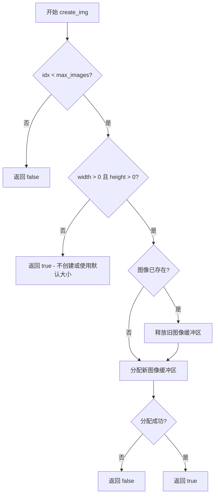

#### 带注释源码

```
//--------------------------------------------------------------------
/// 创建或重新创建指定索引的图像缓冲区
/// @param idx 图像索引（0到max_images-1）
/// @param width 图像宽度，默认为0
/// @param height 图像高度，默认为0
/// @return bool 成功返回true，失败返回false
//--------------------------------------------------------------------
bool create_img(unsigned idx, unsigned width=0, unsigned height=0)
{
    // 检查索引是否在有效范围内
    if(idx >= max_images) return false;

    // 如果宽度和高度都大于0，则创建/重新创建图像缓冲区
    if(width != 0 && height != 0)
    {
        // 调用底层渲染缓冲区的create方法分配内存
        return m_rbuf_img[idx].create(width, height, 
                                      ggl_color_depth(m_format), 
                                      m_flip_y ? rendering_buffer::bottom_up : rendering_buffer::top_down);
    }
    // 当width或height为0时，函数返回true但实际上不会创建缓冲区
    // 这种设计允许应用程序延迟创建或使用默认尺寸
    return true;
}
```


### `platform_support::init`

该函数是 `platform_support` 类的核心初始化方法，用于创建并初始化窗口、渲染缓冲区以及平台相关的底层资源，同时触发 `on_init()` 虚拟回调，使应用可以在窗口显示前完成自定义初始化逻辑。

参数：

- `width`：`unsigned`，窗口的初始宽度（像素单位）
- `height`：`unsigned`，窗口的初始高度（像素单位）
- `flags`：`unsigned`，窗口初始化标志，可组合使用（如 `window_resize`=1 支持调整大小、`window_hw_buffer`=2 启用硬件缓冲、`window_keep_aspect_ratio`=4 保持宽高比、`window_process_all_keys`=8 处理所有按键事件）

返回值：`bool`，返回 `true` 表示窗口初始化成功，返回 `false` 表示初始化失败（如窗口创建失败、平台不支持等）

#### 流程图

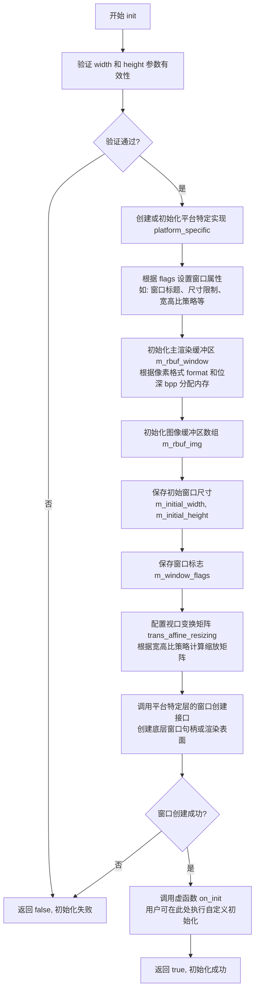

#### 带注释源码

```cpp
// 头文件声明 (agg_platform_support.h)
//------------------------------------------------------------------------
// init() 和 run() 的说明详见类定义前的注释。
// 在构造完成后调用 init() 的必要性在于：
// 1. 无法从构造函数中调用被重写的虚函数(on_init())；
// 2. 非常需要一个 on_init() 事件处理程序，当窗口创建但尚未显示时执行.
//    此时 rbuf_window() 方法(见下文)可从 on_init() 中访问。
//------------------------------------------------------------------------
bool init(unsigned width, unsigned height, unsigned flags);

// 注意：完整的实现代码位于 agg_platform_support.cpp 中
// 以下为基于类声明和注释的逻辑推断实现：

/*
bool platform_support::init(unsigned width, unsigned height, unsigned flags)
{
    // 1. 参数验证，确保窗口尺寸有效
    if (width == 0 || height == 0)
    {
        return false;
    }

    // 2. 保存窗口标志供后续使用
    m_window_flags = flags;

    // 3. 保存初始窗口尺寸，用于计算缩放变换矩阵
    m_initial_width = width;
    m_initial_height = height;

    // 4. 初始化或重置等待模式
    m_wait_mode = true;

    // 5. 根据 flags 计算并设置窗口变换矩阵
    //    如果设置了 window_keep_aspect_ratio，则使用视口保持宽高比
    trans_affine_resizing(width, height);

    // 6. 创建平台特定的底层实现
    //    platform_specific 是前向声明的类，具体实现因平台而异
    //    (Win32/X11/SDL/MacOS 等)
    if (m_specific == nullptr)
    {
        // 创建平台特定对象，失败返回 false
        m_specific = create_platform_specific(...); 
        if (!m_specific)
            return false;
    }

    // 7. 初始化渲染缓冲区，分配与窗口尺寸对应的内存
    //    像素格式由构造时指定的 format 决定
    m_rbuf_window.attach(...); // 绑定内存到渲染缓冲区

    // 8. 调用平台相关接口创建实际窗口
    //    传递 width, height, flags 以及格式信息
    if (!m_specific->create_window(width, height, flags, m_format, m_bpp))
    {
        return false;
    }

    // 9. 如果在构造时已加载图像，复制到窗口缓冲区
    //    (load_img 可在 init 之前调用)
    
    // 10. 触发虚函数 on_init()，用户自定义初始化逻辑
    //     此时窗口已创建但尚未显示，是初始化的最佳时机
    on_init();

    // 11. 标记需要首次绘制
    force_redraw();

    return true;
}
*/
```


### platform_support.run()

运行消息循环，启动应用程序的消息处理系统，处理窗口事件并调用相应的虚函数（如on_init、on_draw、on_idle等），直到程序退出。

参数：

- （无参数）

返回值：`int`，返回应用程序的退出状态码，通常0表示正常退出，非0表示异常退出。

#### 流程图

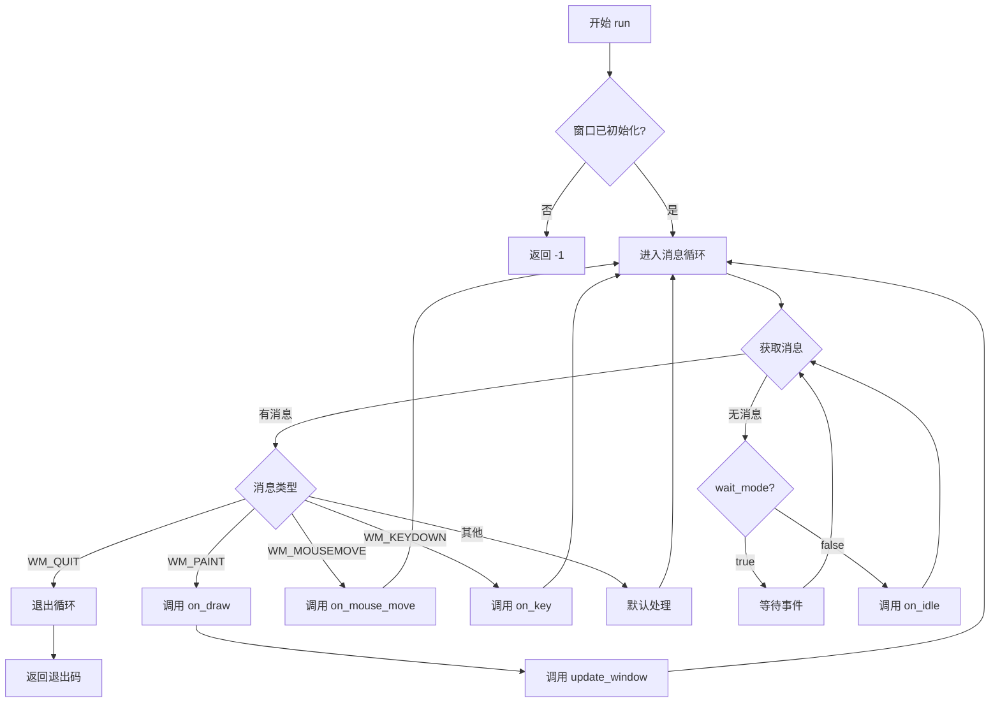

#### 带注释源码

```cpp
//--------------------------------------------------------------------
        // init() and run(). See description before the class for details.
        // The necessity of calling init() after creation is that it's 
        // impossible to call the overridden virtual function (on_init()) 
        // from the constructor. On the other hand it's very useful to have
        // some on_init() event handler when the window is created but 
        // not yet displayed. The rbuf_window() method (see below) is 
        // accessible from on_init().
        bool init(unsigned width, unsigned height, unsigned flags);
        
        //--------------------------------------------------------------------
        // run() 方法的声明
        // 该方法的具体实现依赖于平台（Win32、SDL、X11等）
        // 负责创建消息循环并处理各种窗口事件
        int  run();
```


### `platform_support.format() const`

获取当前平台支持的像素格式，返回在构造函数中指定的像素格式。

参数：该方法没有参数。

返回值：`pix_format_e`，返回当前渲染缓冲区所使用的像素格式（如 RGB24、BGRA32、灰度格式等），该值在对象构造时初始化。

#### 流程图

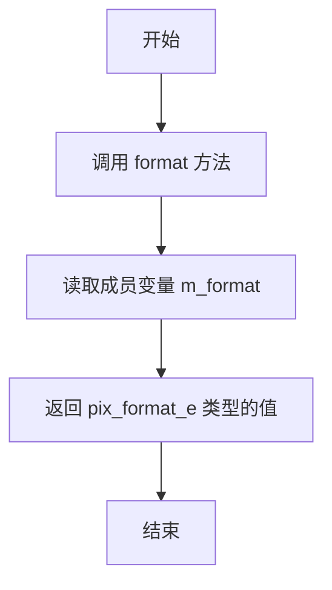

#### 带注释源码

```cpp
//--------------------------------------------------------------------
        // The very same parameters that were used in the constructor
        // 获取与构造函数中指定的相同参数
        pix_format_e format() const { return m_format; }
        // format: 返回当前使用的像素格式
        // m_format: 私有成员变量，存储像素格式枚举值
        // const 限定符表明该方法不会修改对象状态
        bool flip_y() const { return m_flip_y; }
        unsigned bpp() const { return m_bpp; }
```


### `platform_support.flip_y()`

获取Y轴翻转标志，表示是否启用了Y轴垂直翻转功能。

参数：

- （无参数）

返回值：`bool`，返回Y轴翻转标志。`true`表示Y轴已垂直翻转，`false`表示Y轴未翻转。

#### 流程图

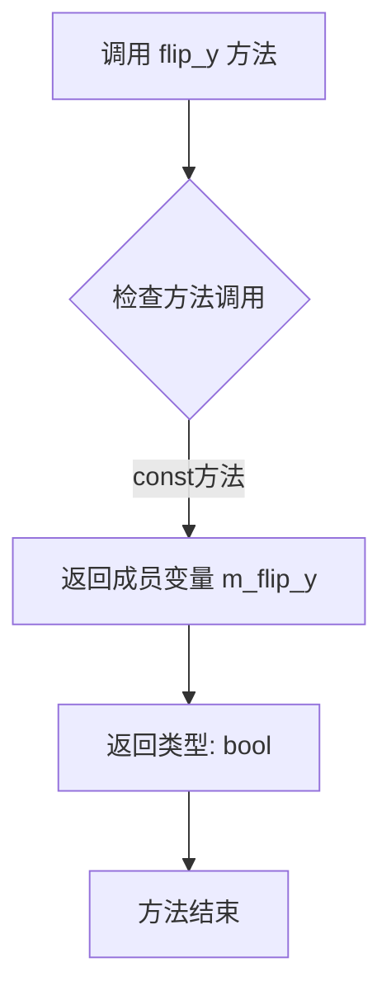

#### 带注释源码

```
//--------------------------------------------------------------------
        // The very same parameters that were used in the constructor
        pix_format_e format() const { return m_format; }
        
        // 获取Y轴翻转标志
        // 返回值: bool - true表示Y轴已垂直翻转, false表示未翻转
        // 该标志在构造函数中被初始化,用于控制渲染缓冲区的Y轴方向
        bool flip_y() const { return m_flip_y; }
        
        unsigned bpp() const { return m_bpp; }
```

---

### 字段信息

| 字段名称 | 类型 | 描述 |
|---------|------|------|
| `m_flip_y` | `bool` | Y轴翻转标志，存储是否启用Y轴垂直翻转的状态 |

---

### 设计说明

`flip_y()` 方法是 `platform_support` 类提供的只读访问器方法，用于获取在对象构造时设置的Y轴翻转标志。该标志影响渲染缓冲区的Y轴方向：当 `flip_y` 为 `true` 时，Y轴向上为正（类似数学坐标系）；当为 `false` 时，Y轴向下为正（类似屏幕坐标系）。此方法为 `const` 成员函数，确保不会修改对象状态，符合封装设计原则。


### `platform_support.bpp`

获取当前像素格式的位深度（bits per pixel），即每个像素使用的位数。

参数：

- （无参数）

返回值：`unsigned`，返回当前渲染缓冲区的位深度，通常为 8、16、24 或 32 位。

#### 流程图

```mermaid
flowchart TD
    A[调用 bpp 方法] --> B[直接返回成员变量 m_bpp]
    B --> C[返回位深度值]
```

#### 带注释源码

```cpp
// 获取位深度
// 返回值: unsigned, 表示每个像素的位数（如 8, 16, 24, 32 等）
unsigned bpp() const { return m_bpp; }
```


### `platform_support.wait_mode()`

获取当前的等待模式状态。该方法返回一个布尔值，表示系统是处于等待事件模式还是空闲处理模式。当返回true时，系统会等待事件而不调用on_idle()回调；当返回false时，当事件队列为空时会调用on_idle()来执行后台任务。

参数：
- 无参数

返回值：`bool`，返回等待模式的状态。true表示等待模式（阻塞等待事件，不调用on_idle），false表示非等待模式（事件队列为空时调用on_idle）。

#### 流程图

```mermaid
flowchart TD
    A[开始] --> B[读取成员变量 m_wait_mode]
    B --> C[返回 m_wait_mode 值]
    C --> D[结束]
```

#### 带注释源码

```cpp
//--------------------------------------------------------------------
        // The following provides a very simple mechanism of doing someting
        // in background. It's not multithreading. When wait_mode is true
        // the class waits for the events and it does not ever call on_idle().
        // When it's false it calls on_idle() when the event queue is empty.
        // The mode can be changed anytime. This mechanism is satisfactory
        // to create very simple animations.
        bool wait_mode() const { return m_wait_mode; }
```


### `platform_support.wait_mode(bool wait_mode)`

设置等待模式，控制事件循环在空闲时是否调用 `on_idle()` 方法。当 `wait_mode` 为 `true` 时，类等待事件而不调用 `on_idle()`；当为 `false` 时，在事件队列为空时调用 `on_idle()`。此机制可用于创建简单动画。

参数：

- `wait_mode`：`bool`，设置是否启用等待模式。`true` 表示等待事件，不调用 `on_idle()`；`false` 表示在事件队列为空时调用 `on_idle()`

返回值：`void`，无返回值

#### 流程图

```mermaid
flowchart TD
    A[调用 wait_mode] --> B{参数 wait_mode 为 true?}
    B -->|Yes| C[设置 m_wait_mode = true<br/>等待事件循环<br/>不调用 on_idle]
    B -->|No| D[设置 m_wait_mode = false<br/>空闲时调用 on_idle]
    C --> E[返回]
    D --> E
```

#### 带注释源码

```cpp
//--------------------------------------------------------------------
        // The following provides a very simple mechanism of doing someting
        // in background. It's not multithreading. When wait_mode is true
        // the class waits for the events and it does not ever call on_idle().
        // When it's false it calls on_idle() when the event queue is empty.
        // The mode can be changed anytime. This mechanism is satisfactory
        // to create very simple animations.
        //--------------------------------------------------------------------
        void wait_mode(bool wait_mode) { m_wait_mode = wait_mode; }
```

#### 相关成员变量

- `m_wait_mode`：`bool`，存储当前的等待模式状态，位于 `platform_support` 类的私有成员中


### `platform_support.force_redraw`

强制重绘窗口的方法，类似于 Win32 的 `InvalidateRect()` 函数。调用该方法会设置一个标志位或发送一条消息，导致在下一个事件周期中调用 `on_draw()` 方法来更新窗口内容。

参数： 无

返回值： `void`，无返回值描述

#### 流程图

```mermaid
flowchart TD
    A[开始 force_redraw] --> B{检查窗口是否已初始化}
    B -->|是| C[设置m_rbuf_window为脏/无效状态]
    C --> D[设置需要重绘标志位]
    D --> E[在下一事件循环中触发on_draw调用]
    E --> F[结束]
    B -->|否| F
```

#### 带注释源码

```cpp
//--------------------------------------------------------------------
        // These two functions control updating of the window. 
        // force_redraw() is an analog of the Win32 InvalidateRect() function.
        // Being called it sets a flag (or sends a message) which results
        // in calling on_draw() and updating the content of the window 
        // when the next event cycle comes.
        // update_window() results in just putting immediately the content 
        // of the currently rendered buffer to the window without calling
        // on_draw().
        void force_redraw();
        void update_window();
```

> **注意**：该方法在头文件中仅有声明，具体的实现代码位于平台相关的实现文件（如 `agg_platform_support.cpp`）中。从类的私有成员来看，实现可能涉及设置某个标志位来标记渲染缓冲区需要重绘，然后在事件循环处理中检查该标志位并调用 `on_draw()` 虚函数。


### `platform_support.update_window`

更新窗口显示，将当前渲染缓冲区的内容立即呈现到窗口上，而无需触发 `on_draw()` 回调。该方法用于在不需要重新绘制整个场景的情况下快速刷新窗口内容。

参数：

- 无参数

返回值：`void`，无返回值描述

#### 流程图

```mermaid
flowchart TD
    A[调用 update_window] --> B{平台特定实现}
    B --> C[获取底层图形上下文]
    C --> D[将渲染缓冲区 m_rbuf_window 的内容传输到窗口]
    D --> E[刷新显示/ blit 操作]
    E --> F[返回]
    
    style A fill:#f9f,stroke:#333
    style F fill:#9f9,stroke:#333
```

#### 带注释源码

```cpp
//--------------------------------------------------------------------
        // These two functions control updating of the window. 
        // force_redraw() is an analog of the Win32 InvalidateRect() function.
        // Being called it sets a flag (or sends a message) which results
        // in calling on_draw() and updating the content of the window 
        // when the next event cycle comes.
        // update_window() results in just putting immediately the content 
        // of the currently rendered buffer to the window without calling
        // on_draw().
        void force_redraw();
        void update_window();
```

> **注意**：该方法在头文件中仅有声明，具体实现位于 `agg_platform_support.cpp` 中，不同平台（Win32、X11、SDL、MacOS）有各自的实现方式。实现通常会调用平台特定的图形 API（如 Win32 的 `BitBlt`、X11 的 `XPutImage`、SDL 的 `SDL_UpdateWindowSurface` 等）将 `m_rbuf_window` 渲染缓冲区的像素数据直接传输到窗口表面。


### `platform_support.rbuf_window()`

该方法返回对主渲染缓冲区（rendering_buffer）的引用，用于将渲染内容显示到窗口。这是AGG库中用于获取窗口绘图表面的核心方法，应用程序可以通过它将任何渲染器附加到窗口缓冲区进行显示。

参数：无

返回值：`rendering_buffer&`，返回对主渲染缓冲区（`m_rbuf_window`）的引用，该缓冲区可以直接附加到任何AGG渲染类进行绘制操作。

#### 流程图

```mermaid
flowchart TD
    A[调用 rbuf_window 方法] --> B{返回m_rbuf_window引用}
    B --> C[将渲染缓冲区附加到渲染器]
    C --> D[执行渲染操作]
    D --> E[通过 update_window 显示到窗口]
```

#### 带注释源码

```cpp
//--------------------------------------------------------------------
 // So, finally, how to draw anythig with AGG? Very simple.
 // rbuf_window() returns a reference to the main rendering 
 // buffer which can be attached to any rendering class.
 // rbuf_img() returns a reference to the previously created
 // or loaded image buffer (see load_img()). The image buffers 
 // are not displayed directly, they should be copied to or 
 // combined somehow with the rbuf_window(). rbuf_window() is
 // the only buffer that can be actually displayed.
 rendering_buffer& rbuf_window()          { return m_rbuf_window; } 
```

---

**相关类成员变量信息：**

| 变量名 | 类型 | 描述 |
|--------|------|------|
| `m_rbuf_window` | `rendering_buffer` | 主渲染缓冲区，用于窗口显示 |
| `m_rbuf_img[max_images]` | `rendering_buffer[16]` | 图像缓冲区数组，用于存储加载或创建的图像 |
| `m_format` | `pix_format_e` | 像素格式枚举 |
| `m_flip_y` | `bool` | Y轴是否翻转 |
| `m_bpp` | `unsigned` | 每像素位数 |


### `platform_support.rbuf_img`

获取指定索引的图像渲染缓冲区引用，用于访问已创建或加载的图像数据。该方法返回的缓冲区不能直接显示，需要通过复制或组合操作将其内容传递到窗口缓冲区（rbuf_window）中才能显示。

参数：

- `idx`：`unsigned`，图像索引，范围为 0 到 max_images-1（max_images=16）

返回值：`rendering_buffer&`，返回对应索引位置的渲染缓冲区引用

#### 流程图

```mermaid
flowchart TD
    A[开始 rbuf_img] --> B{检查 idx 是否有效}
    B -->|无效索引| C[返回未定义行为/越界访问]
    B -->|有效索引| D[访问 m_rbuf_img 数组]
    D --> E[返回渲染缓冲区引用]
    E --> F[结束]
```

#### 带注释源码

```cpp
//----------------------------------------------------------------------------
// 获取图像缓冲区
//----------------------------------------------------------------------------
// 参数:
//   idx - 图像缓冲区索引，范围 0 到 max_images-1
//         可通过 load_img() 加载或 create_img() 创建
//
// 返回值:
//   rendering_buffer& - 对应索引的渲染缓冲区引用
//                      如果该索引尚未创建或加载图像，则返回的缓冲区可能为空
//
// 说明:
//   图像缓冲区不能直接显示，必须通过以下方式之一进行显示:
//   1. copy_img_to_window(idx) - 复制到窗口缓冲区
//   2. copy_img_to_img(idx_to, idx_from) - 复制到另一个图像缓冲区
//   3. 手动将缓冲区内容组合到 rbuf_window() 中
//
//   典型用法示例:
//     // 加载图像
//     app.load_img(0, "image_name");  // 不需要文件扩展名
//     
//     // 在绘制时将图像复制到窗口
//     app.copy_img_to_window(0);
//     
//     // 或者直接访问像素数据进行自定义处理
//     rendering_buffer& img_buf = app.rbuf_img(0);
//     if (img_buf.buf())  // 检查是否已加载
//     {
//         // 自定义渲染逻辑
//     }
//----------------------------------------------------------------------------
rendering_buffer& rbuf_img(unsigned idx) 
{ 
    // 直接返回指定索引位置的渲染缓冲区引用
    // 数组 m_rbuf_img 大小为 max_images (16)
    // 不进行边界检查，调用者需确保 idx 在有效范围内 [0, max_images)
    return m_rbuf_img[idx]; 
}
```

---

**补充说明**：

- **设计目的**：提供对多个图像缓冲区的访问能力，支持同时管理多个图像资源
- **约束条件**：索引必须在 `0` 到 `max_images-1` 范围内，否则会导致未定义行为
- **相关方法**：
  - `load_img()` - 从文件加载图像到指定索引
  - `create_img()` - 创建空白图像缓冲区
  - `rbuf_window()` - 获取窗口主渲染缓冲区（唯一可显示的缓冲区）
  - `copy_img_to_window()` - 将图像复制到窗口显示
  - `copy_window_to_img()` - 将窗口内容保存为图像


### `platform_support.img_ext`

该函数是 `platform_support` 类的 const 成员方法，用于获取当前平台实现所采用的图像文件扩展名（如 Windows 平台返回 ".bmp"，Linux 平台返回 ".ppm"），以便在进行图像保存和加载时使用正确的文件格式后缀。

参数：无需参数

返回值：`const char*`，返回当前平台默认使用的图像文件扩展名字符串常量指针

#### 流程图

```mermaid
flowchart TD
    A[调用 img_ext] --> B{检查 m_specific 是否存在}
    B -->|是| C[返回 m_specific->img_ext]
    B -->|否| D[返回空指针或默认扩展名]
    C --> E[结束]
    D --> E
```

#### 带注释源码

```cpp
//--------------------------------------------------------------------
        // Returns file extension used in the implementation for the particular
        // system.
        // 返回特定系统实现所使用的图像文件扩展名
        // 例如：Windows 平台返回 ".bmp"，X11/Linux 平台返回 ".ppm"
        const char* img_ext() const;
```

该函数在头文件中仅提供声明，完整实现位于平台相关的实现文件 `agg_platform_support.cpp` 中。根据不同平台（Win32、X11、SDL、MacOS 等），返回对应的图像文件扩展名。

**声明位置**：AGG 库头文件 `agg_platform_support.h`

**实现文件示例结构**（位于各平台目录下）：
```cpp
// 假设在 win32 平台实现中
const char* platform_support::img_ext() const
{
    // Windows 平台使用 BMP 格式
    return ".bmp";
}

// 假设在 X11 平台实现中  
const char* platform_support::img_ext() const
{
    // Linux/Unix 平台使用 PPM 格式
    return ".ppm";
}
```

该方法被 `load_img()`、`save_img()` 等图像处理方法内部调用，用于构建完整的文件路径。


### `platform_support.copy_img_to_window(unsigned idx)`

将图像缓冲区中指定索引的图像复制到窗口渲染缓冲区，以便在窗口中显示该图像。

参数：

- `idx`：`unsigned`，图像索引，范围为 0 到 max_images-1，用于指定要复制到窗口的图像缓冲区

返回值：`void`，无返回值

#### 流程图

```mermaid
flowchart TD
    A[开始 copy_img_to_window] --> B{idx < max_images?}
    B -->|否| C[直接返回, 不执行复制]
    B -->|是 --> D{rbuf_img(idx).buf() 有效?}
    D -->|否| C
    D -->|是 --> E[调用 rbuf_window.copy_from rbuf_img(idx)]
    E --> F[结束]
    
    C --> F
```

#### 带注释源码

```cpp
//--------------------------------------------------------------------
void copy_img_to_window(unsigned idx)
{
    // 检查索引是否在有效范围内 [0, max_images)
    // 并且对应的图像缓冲区是否已分配（buf() 返回非空指针）
    if(idx < max_images && rbuf_img(idx).buf())
    {
        // 将图像缓冲区的内容复制到窗口渲染缓冲区
        // 使得渲染的图像可以在窗口中显示出来
        rbuf_window().copy_from(rbuf_img(idx));
    }
}
```


### `platform_support.copy_window_to_img`

该方法用于将当前窗口的渲染内容复制到指定的图像缓冲区中，以便后续保存或处理。

参数：

- `idx`：`unsigned`，图像索引，指定目标图像在图像数组中的位置（0 到 max_images-1）

返回值：`void`，无返回值

#### 流程图

```mermaid
flowchart TD
    A([开始]) --> B{idx < max_images?}
    B -->|是| C[create_img 创建目标图像]
    C --> D[rbuf_img 复制窗口内容到图像]
    D --> E([结束])
    B -->|否| E
```

#### 带注释源码

```cpp
//--------------------------------------------------------------------
void copy_window_to_img(unsigned idx)
{
    // 检查索引是否在有效范围内
    if(idx < max_images)
    {
        // 首先创建或调整目标图像的尺寸，使其与窗口尺寸一致
        create_img(idx, rbuf_window().width(), rbuf_window().height());
        
        // 将窗口渲染缓冲区的内容复制到指定的图像缓冲区中
        rbuf_img(idx).copy_from(rbuf_window());
    }
}
```


### `platform_support.copy_img_to_img`

将源图像缓冲区（由 `idx_from` 指定）的内容完整复制到目标图像缓冲区（由 `idx_to` 指定），如果目标图像不存在或尺寸不匹配，则先创建目标图像使其与源图像尺寸一致，然后再执行复制操作。

参数：

- `idx_to`：`unsigned`，目标图像缓冲区的索引，指定复制到的目标位置
- `idx_from`：`unsigned`，源图像缓冲区的索引，指定复制数据的来源

返回值：`void`，该方法无返回值，通过修改目标图像缓冲区来实现复制功能

#### 流程图

```mermaid
flowchart TD
    A[开始 copy_img_to_img] --> B{检查 idx_from 是否有效}
    B -->|是| C{检查 idx_to 是否有效}
    B -->|否| Z[结束，不执行任何操作]
    C -->|是| D{检查源图像缓冲区是否有数据}
    C -->|否| Z
    D -->|是| E[创建目标图像<br/>宽度=源图像宽度<br/>高度=源图像高度]
    D -->|否| Z
    E --> F[将源图像数据复制到目标图像]
    F --> G[结束]
```

#### 带注释源码

```cpp
//--------------------------------------------------------------------
void copy_img_to_img(unsigned idx_to, unsigned idx_from)
{
    // 检查源图像索引和目标图像索引是否在有效范围内
    // max_images 定义为 16，因此索引值必须在 0-15 之间
    if(idx_from < max_images && 
       idx_to < max_images && 
       // 额外检查源图像缓冲区是否已分配内存
       // rbuf_img(idx_from).buf() 返回缓冲区指针，非空表示已初始化
       rbuf_img(idx_from).buf())
    {
        // 使用源图像的宽高创建目标图像
        // 如果目标图像已存在，此操作会先销毁旧图像再创建新图像
        create_img(idx_to, 
                   rbuf_img(idx_from).width(), 
                   rbuf_img(idx_from).height());
        
        // 执行实际的内存数据复制
        // copy_from 是 rendering_buffer 的成员方法，执行逐字节拷贝
        rbuf_img(idx_to).copy_from(rbuf_img(idx_from));
    }
    // 如果任一条件不满足，函数静默返回，不执行任何操作
    // 调用者需要确保传入有效的索引值
}
```


### `platform_support.on_init`

初始化事件处理函数，在窗口创建后但尚未显示时调用，用于执行应用程序的初始化逻辑。

参数：
- 无

返回值：`void`，无返回值

#### 流程图

```mermaid
flowchart TD
    A[窗口创建完成] --> B{调用init方法}
    B --> C[init方法内部触发on_init虚拟调用]
    C --> D[用户重写的on_init执行]
    D --> E[初始化渲染资源/数据等]
    E --> F[返回继续窗口显示流程]
```

#### 带注释源码

```cpp
//--------------------------------------------------------------------
        // Event handlers. They are not pure functions, so you don't have
        // to override them all.
        // In my demo applications these functions are defined inside
        // the the_application class (implicit inlining) which is in general 
        // very bad practice, I mean vitual inline methods. At least it does
        // not make sense. 
        // But in this case it's quite appropriate bacause we have the only
        // instance of the the_application class and it is in the same file 
        // where this class is defined.
        virtual void on_init();
        // 虚拟初始化事件处理函数
        // 用途：在窗口创建后、显示前调用，用于应用程序的初始化
        // 调用时机：由init()方法内部调用
        // 使用方式：用户需继承platform_support类并重写此方法
        // 注意：此函数不是纯虚函数，提供默认空实现，子类可选择重写
```


### `platform_support.on_resize`

窗口大小调整事件处理函数，当窗口尺寸发生变化时由平台特定实现调用，用于更新内部渲染缓冲区和变换矩阵。

参数：
- `sx`：`int`，窗口新的宽度（像素单位）
- `sy`：`int`，窗口新的高度（像素单位）

返回值：`void`，无返回值

#### 流程图

```mermaid
flowchart TD
    A[窗口尺寸改变事件] --> B{是否设置了window_keep_aspect_ratio标志}
    B -->|是| C[使用trans_viewport计算保持纵横比的变换矩阵]
    B -->|否| D[直接计算宽度和高度的缩放比例]
    C --> E[更新m_resize_mtx变换矩阵]
    D --> E
    E --> F[调用force_redraw标记需要重绘]
    F --> G[事件处理完成]
    
    style A fill:#f9f,color:#000
    style G fill:#9f9,color:#000
```

#### 带注释源码

```cpp
//--------------------------------------------------------------------
// 窗口大小调整事件处理虚函数
// 参数:
//   sx - 窗口新的宽度（像素）
//   sy - 窗口新的高度（像素）
// 说明:
//   这是一个可以被派生类重写的虚函数，用于处理窗口大小调整事件。
//   典型的实现会重新分配渲染缓冲区或更新视图变换。
//   具体的平台实现（如Win32、X11、SDL）会在检测到窗口大小变化时调用此方法。
//--------------------------------------------------------------------
// virtual void on_resize(int sx, int sy);
// 
// 在基类中仅为声明，具体实现由派生类提供。
// 典型的使用模式如下：
//
// virtual void on_resize(int sx, int sy)
// {
//     // 1. 更新渲染缓冲区尺寸
//     m_rbuf_window.resize(sx, sy);
//     
//     // 2. 更新缩放变换矩阵
//     trans_affine_resizing(sx, sy);
//     
//     // 3. 强制重绘
//     force_redraw();
// }

// 相关方法：trans_affine_resizing - 计算窗口缩放变换矩阵
// 相关方法：force_redraw - 标记窗口需要重绘
// 相关方法：rbuf_window - 获取主渲染缓冲区引用
```


### `platform_support.on_idle`

空闲事件处理函数，当事件队列为空且未处于等待模式时由系统调用，用于执行后台任务或动画更新。

参数：无需参数

返回值：`void`，无返回值

#### 流程图

```mermaid
flowchart TD
    A[事件循环开始] --> B{是否处于等待模式?}
    B -->|是| C[等待新事件]
    B -->|否| D{事件队列为空?}
    D -->|否| E[处理事件]
    D -->|是| F[调用 on_idle]
    F --> G[用户重写的 on_idle 处理]
    G --> H[触发 force_redraw]
    H --> C
    E --> C
    C --> A
```

#### 带注释源码

```cpp
//--------------------------------------------------------------------
 // Event handlers. They are not pure functions, so you don't have
 // to override them all.
 // In my demo applications these functions are defined inside
 // the the_application class (implicit inlining) which is in general 
 // very bad practice, I mean vitual inline methods. At least it does
 // not make sense. 
 // But in this case it's quite appropriate bacause we have the only
 // instance of the the_application class and it is in the same file 
 // where this class is defined.
 virtual void on_idle();
 // 空闲事件处理函数（虚函数，可被派生类重写）
 // 当wait_mode为false且事件队列为空时自动调用
 // 典型用途：执行动画更新、后台任务处理、触发重绘等
 
 //--------------------------------------------------------------------
 // The following provides a very simple mechanism of doing someting
 // in background. It's not multithreading. When wait_mode is true
 // the class waits for the events and it does not ever call on_idle().
 // When it's false it calls on_idle() when the event queue is empty.
 // The mode can be changed anytime. This mechanism is satisfactory
 // to create very simple animations.
 bool wait_mode() const { return m_wait_mode; }
 void wait_mode(bool wait_mode) { m_wait_mode = wait_mode; }
 
 //--------------------------------------------------------------------
 // These two functions control updating of the window. 
 // force_redraw() is an analog of the Win32 InvalidateRect() function.
 // Being called it sets a flag (or sends a message) which results
 // in calling on_draw() and updating the content of the window 
 // when the next event cycle comes.
 void force_redraw();
```


### `platform_support.on_mouse_move`

该函数是 `platform_support` 类的虚函数，用于处理鼠标移动事件。当鼠标在窗口内移动时，平台相关的实现会调用此方法，传递当前的鼠标坐标和输入状态标志（包含鼠标按钮和键盘修饰键信息）。

参数：

- `x`：`int`，鼠标事件的当前 X 坐标（相对于窗口左上角）
- `y`：`int`，鼠标事件的当前 Y 坐标（相对于窗口左上角）
- `flags`：`unsigned`，输入状态标志，组合了鼠标按钮状态（`mouse_left`、`mouse_right`）和键盘修饰键状态（`kbd_shift`、`kbd_ctrl`）

返回值：`void`，无返回值

#### 流程图

```mermaid
graph TD
    A[平台层检测到鼠标移动] --> B{是否存在活跃的鼠标按钮}
    B -->|是| C[调用on_mouse_move并传入坐标和标志]
    B -->|否| D[仅更新鼠标位置]
    C --> E{是否有控件捕获事件}
    E -->|是| F[控件处理鼠标移动]
    E -->|否| G[用户重写的on_mouse_move处理]
    F --> H[事件处理完成]
    G --> H
    D --> H
```

#### 带注释源码

```cpp
//----------------------------------------------------------------------------
// platform_support 类的虚函数声明
// 该函数在头文件中仅有声明，没有具体实现
// 具体的鼠标移动处理逻辑由派生类（如用户自己的应用类）重写实现
//----------------------------------------------------------------------------

// 虚函数声明（在类定义中）
virtual void on_mouse_move(int x, int y, unsigned flags);

//----------------------------------------------------------------------------
// 参数说明：
//   x     - 鼠标当前X坐标，相对于窗口客户区左上角
//   y     - 鼠标当前Y坐标，相对于窗口客户区左上角
//   flags - 输入状态标志位，可以是以下值的组合：
//           mouse_left  = 1  (鼠标左键按下)
//           mouse_right = 2  (鼠标右键按下)
//           kbd_shift   = 4  (Shift键按下)
//           kbd_ctrl    = 8  (Ctrl键按下)
//----------------------------------------------------------------------------
//
// 使用示例（用户应用类中的重写）：
//
// class my_application : public agg::platform_support
// {
//     virtual void on_mouse_move(int x, int y, unsigned flags) override
//     {
//         // 处理鼠标移动事件
//         if (flags & mouse_left)
//         {
//             // 鼠标左键按住时执行拖拽操作
//             do_drag_operation(x, y);
//         }
//         
//         // 可以通过ctrl_container检查是否有控件处理了该事件
//         if (!m_ctrls.on_mouse_move(x, y, flags & mouse_left))
//         {
//             // 控件未处理，执行应用特定的逻辑
//         }
//     }
// };
//----------------------------------------------------------------------------
```


### `platform_support.on_mouse_button_down`

该方法是 `platform_support` 类中的虚函数，用于处理鼠标按钮按下的事件。当用户点击鼠标时，该方法会被调用，并进一步将事件分发给已添加的控件（如按钮、滑块等），以实现交互式图形界面的响应。

参数：
- `x`：`int`，鼠标按下时的横坐标（窗口坐标）
- `y`：`int`，鼠标按下时的纵坐标（窗口坐标）
- `flags`：`unsigned`，表示鼠标按钮状态和键盘修饰符（如 Ctrl、Shift 键），用于判断是左键还是右键按下，以及是否有组合键被按下

返回值：`void`，该方法不返回任何值

#### 流程图

```mermaid
flowchart TD
    A[开始: on_mouse_button_down] --> B{检查当前控件数量}
    B -->|有控件| C[遍历所有控件]
    B -->|无控件| D[结束]
    C --> E{当前控件是否处理该事件?}
    E -->|是| F[返回true, 事件已处理]
    E -->|否| G[检查下一个控件]
    G --> C
    C -->|遍历完毕| H[返回false, 事件未处理]
    F --> I[结束]
    H --> I
    D --> I
```

#### 带注释源码

```cpp
// 在 ctrl_container 类中处理鼠标按钮按下的事件
// 该方法遍历所有已添加的控件，依次调用它们的 on_mouse_button_down 方法
// 如果任何一个控件处理了该事件，则返回 true
// 参数 x, y 是鼠标按下的坐标，flags 表示鼠标按钮和键盘修饰符状态
virtual void on_mouse_button_down(int x, int y, unsigned flags)
{
    // 调用 ctrl_container 的 in_rect 方法检查鼠标是否在某个控件区域内
    // 如果是，则将事件分发给对应的控件处理
    if (m_ctrls.in_rect(x, y))
    {
        // 遍历所有控件，寻找处理该事件的控件
        // 如果找到处理该事件的控件，则返回 true
        // 这里使用了 ctrl_container 类的辅助方法
        return m_ctrls.on_mouse_button_down(x, y);
    }
    // 如果鼠标不在任何控件区域内，则不做处理
    // 注意：这里实际上在 platform_support 类中是空实现
    // 具体实现由派生类或平台特定实现完成
}
```


### `platform_support.on_mouse_button_up`

该方法是平台支持类中的虚函数，用于处理鼠标按钮释放事件。当用户释放鼠标按钮时，系统会调用此方法，并将鼠标位置和当前输入状态标志作为参数传入。派生类可以通过重写此方法来响应鼠标释放事件，实现自定义的交互逻辑。

参数：

- `x`：`int`，鼠标释放时的X坐标，表示鼠标在窗口中的水平位置
- `y`：`int`，鼠标释放时的Y坐标，表示鼠标在窗口中的垂直位置
- `flags`：`unsigned`，鼠标和键盘标志位，用于表示哪个鼠标按钮被释放以及键盘修饰键（如Shift、Ctrl）的状态

返回值：`void`，该方法没有返回值

#### 流程图

```mermaid
flowchart TD
    A[鼠标释放事件触发] --> B{派生类是否重写了该方法?}
    B -->|是| C[调用派生类的on_mouse_button_up实现]
    B -->|否| D[默认空实现 - 不做任何处理]
    C --> E[根据x, y坐标和flags标志处理业务逻辑]
    D --> F[事件处理结束]
    E --> F
    
    style A fill:#e1f5fe
    style C fill:#fff3e0
    style E fill:#e8f5e9
```

#### 带注释源码

```cpp
//----------------------------------------------------------------------------
// platform_support 类中的虚函数声明
// 位置: agg_platform_support.h
//----------------------------------------------------------------------------

//--------------------------------------------------------------------
/// 鼠标按钮释放事件处理函数
/// 这是一个虚函数，派生类可以重写它来处理鼠标释放事件
/// 
/// @param x     鼠标释放时的X坐标（窗口坐标系）
/// @param y     鼠标释放时的Y坐标（窗口坐标系）
/// @param flags 输入标志位，包含：
///              - mouse_left (1): 鼠标左键释放
///              - mouse_right (2): 鼠标右键释放  
///              - kbd_shift (4): Shift键状态
///              - kbd_ctrl (8): Ctrl键状态
///              注意：在on_mouse_button_up中，鼠标标志表示按钮被释放，
///              而键盘标志仍表示按键被按下
//--------------------------------------------------------------------
virtual void on_mouse_button_up(int x, int y, unsigned flags);

//----------------------------------------------------------------------------
// 在 ctrl_container 类中也存在类似的鼠标释放处理
// 用于将事件分发给控件
//----------------------------------------------------------------------------

//--------------------------------------------------------------------
/// ctrl_container::on_mouse_button_up - 控件容器的鼠标释放处理
/// 遍历所有已添加的控件，调用它们的on_mouse_button_up方法
/// 如果任何一个控件处理了该事件则返回true
//--------------------------------------------------------------------
bool on_mouse_button_up(double x, double y)
{
    unsigned i;
    bool flag = false;
    for(i = 0; i < m_num_ctrl; i++)
    {
        // 调用每个控件的鼠标释放处理函数
        if(m_ctrl[i]->on_mouse_button_up(x, y)) flag = true;
    }
    return flag;
}
```

#### 使用示例说明

```cpp
// 用户自定义应用类中可以这样重写该方法：
class my_application : public agg::platform_support
{
    // 重写鼠标释放事件处理
    virtual void on_mouse_button_up(int x, int y, unsigned flags) override
    {
        // 检查左键是否被释放
        if (flags & agg::mouse_left)
        {
            // 处理左键释放逻辑
            // 可以使用 x, y 坐标进行点击位置判断
        }
        
        // 检查Ctrl键是否按下（即使在释放鼠标时）
        if (flags & agg::kbd_ctrl)
        {
            // 处理Ctrl+鼠标释放的组合操作
        }
    }
};
```


### `platform_support.on_key`

键盘事件处理函数，是一个虚函数，用于处理键盘输入事件。该函数在用户按下键盘时被调用，允许派生类重写以实现自定义的键盘响应逻辑。

参数：

- `x`：`int`，鼠标/键盘事件发生时的X坐标（窗口坐标）
- `y`：`int`，鼠标/键盘事件发生时的Y坐标（窗口坐标）
- `key`：`unsigned`，键盘按键的唯一标识符，对应 `key_code_e` 枚举中定义的键码
- `flags`：`unsigned`，输入状态标志，指示辅助按键（如Shift、Ctrl等）的按下状态，对应 `input_flag_e` 枚举

返回值：`void`，无返回值。作为事件处理函数，该方法不返回任何值，而是通过修改内部状态或调用其他方法来完成处理。

#### 流程图

```mermaid
flowchart TD
    A[接收到键盘事件] --> B{派生类是否重写了on_key?}
    B -->|是| C[执行派生类的on_key实现]
    B -->|否| D[默认空实现 - 不做任何处理]
    C --> E[事件处理完成]
    D --> E
```

#### 带注释源码

```cpp
// 虚函数声明，位于 platform_support 类中
// 这是一个事件处理器，当用户按下键盘时由平台特定实现调用
virtual void on_key(int x, int y, unsigned key, unsigned flags);

// 参数说明：
// x     - 键盘事件触发时鼠标的X坐标（窗口坐标系）
// y     - 键盘事件触发时鼠标的Y坐标（窗口坐标系）
// key   - 按键的代码，来源于 key_code_e 枚举（如 key_return, key_escape 等）
// flags - 辅助按键状态标志，来源于 input_flag_e 枚举
//         可以是以下值的组合：
//         - mouse_left (1): 鼠标左键
//         - mouse_right (2): 鼠标右键
//         - kbd_shift (4): Shift键被按下
//         - kbd_ctrl (8): Ctrl键被按下
// 返回值：无（void）
// 
// 使用示例（派生类中重写）：
// class my_application : public agg::platform_support
// {
//     virtual void on_key(int x, int y, unsigned key, unsigned flags)
//     {
//         if (key == agg::key_escape)
//         {
//             // 处理Escape键按下
//         }
//         if (flags & agg::kbd_ctrl)
//         {
//             // 处理Ctrl组合键
//         }
//     }
// };
```


### `platform_support.on_ctrl_change`

该方法是 `platform_support` 类中的虚函数，用于处理控件变化事件。当添加到 `ctrl_container` 中的控件状态发生改变时（如鼠标交互导致控件值变化），该方法会被调用，通知应用程序控件已更改，需要重新渲染。

参数： 无

返回值： `void`，无返回值

#### 流程图

```mermaid
flowchart TD
    A[平台层捕获控件事件] --> B{控件状态是否改变}
    B -->|是| C[调用 platform_support.on_ctrl_change]
    C --> D[应用程序重绘界面]
    B -->|否| E[忽略事件]
    
    style A fill:#f9f,color:#333
    style C fill:#9f9,color:#333
    style D fill:#9ff,color:#333
```

#### 带注释源码

```cpp
//--------------------------------------------------------------------
        // Event handlers. They are not pure functions, so you don't have
        // to override them all.
        // In my demo applications these functions are defined inside
        // the the_application class (implicit inlining) which is in general 
        // very bad practice, I mean vitual inline methods. At least it does
        // not make sense. 
        // But in this case it's quite appropriate bacause we have the only
        // instance of the the_application class and it is in the same file 
        // where this class is defined.
        virtual void on_ctrl_change();
        // 该虚函数在基类中声明为空实现，具体逻辑由派生类重写实现
        // 当控件值发生变化时（如滑块拖动、单选按钮点击等），
        // 平台实现层会调用此方法通知应用程序
        // 应用程序通常在此方法中调用 force_redraw() 触发界面重绘
```

#### 相关代码上下文

```cpp
//--------------------------------------------------------------------
        // Adding control elements. A control element once added will be 
        // working and reacting to the mouse and keyboard events. Still, you
        // will have to render them in the on_draw() using function 
        // render_ctrl() because platform_support doesn't know anything about 
        // renderers you use. The controls will be also scaled automatically 
        // if they provide a proper scaling mechanism (all the controls 
        // included into the basic AGG package do).
        // If you don't need a particular control to be scaled automatically 
        // call ctrl::no_transform() after adding.
        void add_ctrl(ctrl& c) { m_ctrls.add(c); c.transform(m_resize_mtx); }
        // add_ctrl 方法将控件添加到 m_ctrls 容器中
        // 控件的事件处理由 ctrl_container 类负责分发
        // 当控件状态改变时，最终会触发 on_ctrl_change 回调
```

#### 使用示例（派生类中的典型实现）

```cpp
// 在派生类中重写 on_ctrl_change
class the_application : public agg::platform_support
{
public:
    the_application(pix_format_e format, bool flip_y) 
        : platform_support(format, flip_y) {}
    
    // 重写控件变化事件处理
    virtual void on_ctrl_change() override
    {
        // 当控件值改变时触发重绘
        force_redraw();
    }
    
    virtual void on_draw() override
    {
        // 渲染控件
        agg::render_ctrl(m_ctrls, ...);
    }
};
```


### `platform_support.on_draw`

该函数是绘图事件处理函数，在窗口需要重绘时被调用。这是一个虚函数，AGG 库不提供默认实现，使用者需要在继承 `platform_support` 的应用类中重写该方法，以将渲染内容绘制到窗口的渲染缓冲区中。

参数：无

返回值：`void`，无返回值

#### 流程图

```mermaid
flowchart TD
    A[窗口需要重绘] --> B{平台层检测到绘制事件}
    B -->|是| C[调用 on_draw]
    C --> D[用户重写的绘制逻辑]
    D --> E[将渲染缓冲区内容拷贝到窗口]
    E --> F[显示更新后的窗口内容]
    B -->|否| G[等待其他事件]
```

#### 带注释源码

```cpp
//----------------------------------------------------------------------------
// platform_support 类中的 on_draw 虚函数声明
//----------------------------------------------------------------------------

namespace agg
{
    //---------------------------------------------------------platform_support
    class platform_support
    {
    public:
        //--------------------------------------------------------------------
        // Event handlers. They are not pure functions, so you don't have
        // to override them all.
        // In my demo applications these functions are defined inside
        // the the_application class (implicit inlining) which is in general 
        // very bad practice, I mean vitual inline methods. At least it does
        // not make sense. 
        // But in this case it's quite appropriate bacause we have the only
        // instance of the the_application class and it is in the same file 
        // where this class is defined.
        //--------------------------------------------------------------------
        
        // 绘图事件处理函数 - 虚函数，由用户在派生类中重写
        // 调用时机：当窗口需要重绘时（窗口初次显示、窗口大小改变、
        // 调用 force_redraw()、或其他导致窗口内容失效的情况）
        virtual void on_draw();
        
        // 其他事件处理函数...
        virtual void on_init();
        virtual void on_resize(int sx, int sy);
        virtual void on_idle();
        // ... 其他方法
    };
}

//----------------------------------------------------------------------------
// 使用示例（在派生类中重写 on_draw）
//----------------------------------------------------------------------------

/*
class the_application : public agg::platform_support
{
public:
    the_application(unsigned bpp, bool flip_y) :
        platform_support(bpp, flip_y) 
    {
        // 构造函数内容
    }

    //--------------------------------------------------------------------
    // 重写 on_draw 实现自定义绘制
    //--------------------------------------------------------------------
    virtual void on_draw() override
    {
        // 获取窗口渲染缓冲区
        rendering_buffer& rbuf = rbuf_window();
        
        // 在此处添加你的 AGG 渲染代码
        // 例如：
        // 1. 清除背景
        // 2. 绘制图形
        // 3. 渲染控件
        // 4. 等等...
        
        // 注意：这里只是声明，实际实现由用户编写
    }
};
*/
```


### `platform_support.on_post_draw`

这是 `platform_support` 类中的一个虚函数，用于处理绘制后的事件。该函数在窗口内容绘制完成后被调用，允许应用程序执行额外的渲染操作或与底层显示系统进行交互。`raw_handler` 参数提供对原始显示处理程序的访问，具体类型取决于实现平台（如 Win32 的 HDC、X11 的 Display 等）。

参数：

- `raw_handler`：`void*`，原始显示处理程序指针，具体类型取决于平台实现（如 Win32 的 HDC）

返回值：`void`，无返回值

#### 流程图

```mermaid
flowchart TD
    A[on_post_draw 被调用] --> B{检查 raw_handler 是否有效}
    B -->|有效| C[调用 update_window 将缓冲区内容刷新到显示]
    B -->|无效| D[直接返回，不执行任何操作]
    C --> E[返回调用点]
    D --> E
```

#### 带注释源码

```cpp
// 虚函数声明于 platform_support 类中
// 这是一个事件钩子函数，在主窗口绘制完成后被调用
// 允许应用程序在渲染后执行额外的平台特定操作
// 
// 参数:
//   raw_handler - 指向原始显示处理程序的指针
//                Win32平台: HDC (设备上下文句柄)
//                X11平台: Display*
//                SDL平台: 可能是渲染器上下文
//                如果为nullptr，表示不支持原始处理程序
virtual void on_post_draw(void* raw_handler);

// 典型的实现逻辑（在派生类中）
/*
virtual void on_post_draw(void* raw_handler)
{
    // raw_handler 可能为 nullptr，表示底层平台不支持
    // 或者提供了平台特定的显示上下文
    
    if(raw_handler != 0)
    {
        // 调用平台支持类的窗口更新方法
        // 该方法会将当前渲染缓冲区的内容拷贝到显示窗口
        update_window();
    }
    // 如果 raw_handler 为 nullptr，通常静默忽略
    // 或者某些平台可能执行默认行为
}
*/
```


### `platform_support.add_ctrl`

该方法用于向平台支持类添加交互式控件。添加后，控件将响应鼠标和键盘事件，并自动应用窗口缩放变换矩阵以支持控件的自动缩放功能。

参数：

- `c`：`ctrl&`，对要添加的控件对象的引用

返回值：`void`，无返回值

#### 流程图

```mermaid
graph TD
    A([开始 add_ctrl]) --> B{检查控件数量是否已满}
    B -- 未满 --> C[将控件指针添加到 ctrl_container]
    C --> D[调用控件的 transform 方法应用缩放矩阵]
    D --> E([结束])
    B -- 已满 --> E
```

#### 带注释源码

```cpp
//--------------------------------------------------------------------
// 添加控制元素。添加后的控制元素将能够响应鼠标和键盘事件。
// 但仍然需要在 on_draw() 中使用 render_ctrl() 函数手动渲染它们，
// 因为 platform_support 不知道用户使用的渲染器。
// 如果控件提供了适当的缩放机制（AGG 包中所有基础控件都支持），
// 控件将自动缩放。如果不需要特定控件自动缩放，
// 可在添加后调用 ctrl::no_transform()。
//--------------------------------------------------------------------
void add_ctrl(ctrl& c) 
{ 
    // 将控件添加到内部的 ctrl_container 容器中管理
    m_ctrls.add(c); 
    
    // 应用当前的窗口缩放变换矩阵到控件，使其随窗口调整大小
    c.transform(m_resize_mtx); 
}
```


### `platform_support.trans_affine_resizing`

该函数用于设置调整大小的仿射变换矩阵（Affine Transformation Matrix），根据给定的目标窗口宽度和高度，结合窗口的初始尺寸计算缩放变换，以便在窗口大小改变时保持内容正确的缩放比例。当设置了保持宽高比标志时，使用视口转换器来保持内容的宽高比；否则直接按照宽高比例进行缩放。

参数：

- `width`：`int`，目标窗口的宽度（像素）
- `height`：`int`，目标窗口的高度（像素）

返回值：`void`，无返回值（直接修改内部成员变量 `m_resize_mtx`）

#### 流程图

```mermaid
flowchart TD
    A[开始 trans_affine_resizing] --> B{检查 window_keep_aspect_ratio 标志}
    B -->|是| C[创建 trans_viewport 对象]
    C --> D[设置 preserve_aspect_ratio 为 0.5, 0.5]
    D --> E[设置设备视口为 0, 0, width, height]
    E --> F[设置世界视口为 0, 0, m_initial_width, m_initial_height]
    F --> G[将视口转换为仿射矩阵 m_resize_mtx = vp.to_affine]
    B -->|否| H[计算宽度缩放比例: width / m_initial_width]
    H --> I[计算高度缩放比例: height / m_initial_height]
    I --> J[创建缩放矩阵 m_resize_mtx = trans_affine_scaling]
    G --> K[结束]
    J --> K
```

#### 带注释源码

```cpp
//-----------------------------------------------------------------------------
// trans_affine_resizing: 设置调整大小的变换矩阵
// 参数: width - 新的窗口宽度, height - 新的窗口高度
//-----------------------------------------------------------------------------
void trans_affine_resizing(int width, int height)
{
    // 检查是否需要保持宽高比
    if(m_window_flags & window_keep_aspect_ratio)
    {
        // 注释掉的代码是旧的实现方式，已被 trans_viewport 方案取代
        //double sx = double(width) / double(m_initial_width);
        //double sy = double(height) / double(m_initial_height);
        //if(sy < sx) sx = sy;
        //m_resize_mtx = trans_affine_scaling(sx, sx);
        
        // 使用 trans_viewport 来处理保持宽高比的情况
        trans_viewport vp;
        
        // 设置保持宽高比的锚点为中心 (0.5, 0.5)，使用 meet 模式
        vp.preserve_aspect_ratio(0.5, 0.5, aspect_ratio_meet);
        
        // 设置设备视口为新的窗口尺寸
        vp.device_viewport(0, 0, width, height);
        
        // 设置世界视口为原始窗口尺寸
        vp.world_viewport(0, 0, m_initial_width, m_initial_height);
        
        // 将视口转换为仿射变换矩阵并保存
        m_resize_mtx = vp.to_affine();
    }
    else
    {
        // 不保持宽高比，直接按比例缩放
        // 计算宽度和高度的缩放比例
        m_resize_mtx = trans_affine_scaling(
            double(width) / double(m_initial_width),
            double(height) / double(m_initial_height));
    }
}
```


### `platform_support.trans_affine_resizing(int width, int height)`

该方法用于根据窗口的新尺寸和初始尺寸计算并设置调整大小的仿射变换矩阵，支持保持宽高比和自由缩放两种模式。

参数：

- `width`：`int`，窗口的新宽度
- `height`：`int`，窗口的新高度

返回值：`void`，无返回值（设置 `m_resize_mtx` 成员变量）

#### 流程图

```mermaid
flowchart TD
    A[调用 trans_affine_resizing] --> B{检查 window_keep_aspect_ratio 标志}
    B -->|是| C[创建 trans_viewport 对象]
    B -->|否| D[计算水平缩放比例 sx]
    C --> E[设置 preserve_aspect_ratio 0.5, 0.5]
    E --> F[设置 device_viewport]
    F --> G[设置 world_viewport]
    G --> H[通过 vp.to_affine 获取变换矩阵]
    D --> I[计算垂直缩放比例 sy]
    I --> J[通过 trans_affine_scaling 创建缩放矩阵]
    H --> K[赋值给 m_resize_mtx]
    J --> K
```

#### 带注释源码

```cpp
//-----------------------------------------------------------------------------
// 设置调整大小变换矩阵
// 根据窗口的新宽度和高度，以及初始宽高计算仿射变换矩阵
//-----------------------------------------------------------------------------
void trans_affine_resizing(int width, int height)
{
    // 检查是否需要保持宽高比
    if(m_window_flags & window_keep_aspect_ratio)
    {
        // 注释掉的代码是另一种保持宽高比的实现方式（等比缩放）
        // double sx = double(width) / double(m_initial_width);
        // double sy = double(height) / double(m_initial_height);
        // if(sy < sx) sx = sy;
        // m_resize_mtx = trans_affine_scaling(sx, sx);
        
        // 使用视口方式来保持宽高比
        trans_viewport vp;
        // 设置保持宽高比，中心对齐 (0.5, 0.5)，采用 meet 模式
        vp.preserve_aspect_ratio(0.5, 0.5, aspect_ratio_meet);
        // 设置设备视口为新的窗口尺寸
        vp.device_viewport(0, 0, width, height);
        // 设置世界视口为原始窗口尺寸
        vp.world_viewport(0, 0, m_initial_width, m_initial_height);
        // 将视口转换为仿射变换矩阵并赋值
        m_resize_mtx = vp.to_affine();
    }
    else
    {
        // 自由缩放模式：分别计算水平和垂直缩放比例
        m_resize_mtx = trans_affine_scaling(
            double(width) / double(m_initial_width),
            double(height) / double(m_initial_height));
    }
}
```

---

### `platform_support.trans_affine_resizing()` (const 版本)

该方法作为 getter（访问器），返回当前窗口调整大小的仿射变换矩阵，供外部使用进行额外的缩放计算。

参数：无

返回值：`const trans_affine&`，对当前调整大小变换矩阵的常量引用

#### 带注释源码

```cpp
//-----------------------------------------------------------------------------
// 获取当前调整大小变换矩阵的只读引用
//-----------------------------------------------------------------------------
const trans_affine& trans_affine_resizing() const { return m_resize_mtx; }
```


### `platform_support.width`

获取窗口的宽度（以像素为单位）。该方法返回主渲染缓冲区的宽度，用于确定当前窗口的横向尺寸。

参数： 无

返回值：`double`，窗口宽度（以像素为单位）

#### 流程图

```mermaid
flowchart TD
    A[调用 width] --> B{检查 m_rbuf_window 是否有效}
    B -->|有效| C[返回 m_rbuf_window.width]
    B -->|无效| D[返回 0 或未定义值]
    C --> E[结束]
    D --> E
```

#### 带注释源码

```cpp
//--------------------------------------------------------------------
        // 窗口尺寸获取函数
        // 返回当前窗口的宽度（像素单位）
        // 实际实现依赖于 rendering_buffer 对象的 width() 方法
        double   width()  const { return m_rbuf_window.width(); }
        double   height() const { return m_rbuf_window.height(); }
        double   initial_width()  const { return m_initial_width; }
        double   initial_height() const { return m_initial_height; }
        unsigned window_flags() const { return m_window_flags; }
```

---

**备注：** 该方法是 `platform_support` 类的 const 成员函数，通过调用内部成员 `m_rbuf_window`（类型为 `rendering_buffer`）的 `width()` 方法来获取窗口宽度。`m_rbuf_window` 是主渲染缓冲区，在 `init()` 方法中被初始化为窗口的实际像素尺寸。


### `platform_support.height`

获取当前窗口的高度（以像素为单位）。该方法直接调用底层渲染缓冲区对象的height()方法，返回窗口的垂直尺寸。

参数：
- 无

返回值：`double`，窗口的高度值（以像素为单位）

#### 流程图

```mermaid
flowchart TD
    A[开始] --> B[获取m_rbuf_window渲染缓冲区]
    B --> C[调用m_rbuf_window.height方法]
    C --> D[返回高度值]
    D --> E[结束]
```

#### 带注释源码

```cpp
//--------------------------------------------------------------------
/// 获取窗口高度
/// @return double 窗口的垂直像素高度
//--------------------------------------------------------------------
double   height() const { return m_rbuf_window.height(); }
```

在类中的位置上下文：

```cpp
class platform_support
{
    // ... 其他成员 ...
    
    //--------------------------------------------------------------------
    // 窗口尺寸获取函数组
    //--------------------------------------------------------------------
    double   width()  const { return m_rbuf_window.width(); }  // 获取窗口宽度
    double   height() const { return m_rbuf_window.height(); } // 获取窗口高度
    double   initial_width()  const { return m_initial_width; }    // 获取初始宽度
    double   initial_height() const { return m_initial_height; }   // 获取初始高度
    unsigned window_flags() const { return m_window_flags; }       // 获取窗口标志
    
    // ... 其他成员 ...
};
```

#### 补充说明

- **所属类**：`agg::platform_support`
- **const 成员函数**：该方法是 const 修饰的成员函数，不会修改对象状态
- **底层实现**：依赖于 `rendering_buffer` 类的 `height()` 方法
- **使用场景**：常用于渲染时获取视口高度，进行坐标转换，或调整图形元素大小


### `platform_support.initial_width`

获取平台的初始窗口宽度，用于在窗口大小调整时保持原始尺寸的参考。

参数：
- （无参数）

返回值：`double`，返回窗口初始化时的宽度值（以像素为单位），该值在 `init()` 方法调用时被设置，之后保持不变，作为窗口尺寸调整计算的基准参考。

#### 流程图

```mermaid
flowchart TD
    A[调用 initial_width] --> B{检查调用上下文}
    B -->|const方法| C[读取成员变量 m_initial_width]
    C --> D[返回 double 类型的初始宽度值]
    
    D --> E[调用方使用此值进行:<br/>- 纵横比计算<br/>- 缩放矩阵设置<br/>- 视口转换]
```

#### 带注释源码

```cpp
//--------------------------------------------------------------------
// 获取初始窗口宽度
// 该方法返回窗口创建时指定的初始宽度，用于在窗口大小调整时
// 计算缩放比例和保持纵横比。当 window_keep_aspect_ratio 标志被设置时，
// 此值作为 world_viewport 的参考尺寸。
//--------------------------------------------------------------------
double   initial_width()  const { return m_initial_width; }
```


### `platform_support.initial_height`

获取窗口的初始高度（以像素为单位），该值在窗口初始化时设置。

参数：

- （无参数）

返回值：`double`，窗口的初始高度值

#### 流程图

```mermaid
flowchart TD
    A[调用 initial_height] --> B{检查权限}
    B -->|public 方法| C[返回 m_initial_height]
    C --> D[返回类型为 double]
    
    style A fill:#f9f,stroke:#333
    style C fill:#9f9,stroke:#333
    style D fill:#9f9,stroke:#333
```

#### 带注释源码

```cpp
// 获取初始高度
// 返回窗口初始化时的宽度值（像素）
// 这是一个常量方法，不修改对象状态
double initial_height() const 
{ 
    // m_initial_height 是私有成员变量，类型为 int
    // 这里隐式转换为 double 返回
    return m_initial_height; 
}
```

#### 相关类成员信息

**类字段：**

| 名称 | 类型 | 描述 |
|------|------|------|
| `m_initial_height` | `int` | 窗口初始高度（私有成员变量） |
| `m_initial_width` | `int` | 窗口初始宽度（与 initial_height 配对使用） |

**相关方法：**

| 方法名 | 描述 |
|--------|------|
| `initial_width()` | 获取窗口初始宽度 |
| `width()` | 获取当前窗口宽度 |
| `height()` | 获取当前窗口高度 |
| `trans_affine_resizing(int width, int height)` | 设置窗口缩放矩阵，使用 initial_width/initial_height 计算缩放比例 |

#### 设计说明

1. **设计目标**：`initial_height()` 是一个简单的访问器方法，用于获取窗口创建时的初始高度值，配合 `initial_width()` 用于计算窗口缩放比例。

2. **约束条件**：
   - 该方法为 `const` 方法，保证不会修改对象状态
   - 返回值从 `int` 隐式转换为 `double`，可能存在精度损失（对于极大值）

3. **潜在优化空间**：
   - 可考虑返回 `int` 类型以保持与存储类型一致
   - 可添加验证确保返回值非负

4. **与其他组件的关系**：
   - 被 `trans_affine_resizing()` 方法使用，用于计算窗口缩放时的变换矩阵
   - 与 `initial_width()` 配对使用，构成窗口初始尺寸信息


### `platform_support.window_flags`

获取窗口标志位，返回在初始化时设置的窗口标志。

参数：  
无

返回值：`unsigned`，返回当前窗口的标志位，这些标志位在调用 `init()` 方法时设置，用于控制窗口行为（如 `window_resize`、`window_hw_buffer`、`window_keep_aspect_ratio`、`window_process_all_keys`）。

#### 流程图

```mermaid
flowchart TD
    A[调用 window_flags] --> B{是否已初始化}
    B -->|是| C[返回 m_window_flags]
    B -->|否| D[返回初始化时的默认值]
    C --> E[调用方使用返回值]
    D --> E
```

#### 带注释源码

```cpp
// 获取窗口标志位
// 该方法返回在 init() 方法中设置的窗口标志
// 标志用于控制窗口的不同行为特性
// 返回值类型为 unsigned，可以是以下标志的组合：
// window_resize = 1            - 允许窗口调整大小
// window_hw_buffer = 2         - 使用硬件缓冲区
// window_keep_aspect_ratio = 4 - 保持宽高比
// window_process_all_keys = 8  - 处理所有按键事件
unsigned window_flags() const { return m_window_flags; }
```


### `platform_support.raw_display_handler`

获取原始显示句柄（raw display handler），该函数返回平台特定的显示句柄。在 Windows 系统中返回 HDC，在其他系统中可能返回指向某种结构的指针。如果返回值为 nullptr，表示不支持 raw_display_handler。

参数：无

返回值：`void*`，返回原始显示句柄指针，类型取决于具体平台实现（Windows 下为 HDC，其他平台可能为结构体指针）

#### 流程图

```mermaid
flowchart TD
    A[开始调用 raw_display_handler] --> B{平台实现是否存在?}
    B -->|是| C[调用平台特定的显示句柄获取函数]
    B -->|否| D[返回 nullptr]
    C --> E{获取成功?}
    E -->|是| F[返回显示句柄指针 void\*]
    E -->|否| G[返回 nullptr]
    F --> H[结束]
    D --> H
    G --> H
```

#### 带注释源码

```cpp
//--------------------------------------------------------------------
        // Get raw display handler depending on the system. 
        // For win32 its an HDC, for other systems it can be a pointer to some
        // structure. See the implementation files for detals.
        // It's provided "as is", so, first you should check if it's not null.
        // If it's null the raw_display_handler is not supported. Also, there's 
        // no guarantee that this function is implemented, so, in some 
        // implementations you may have simply an unresolved symbol when linking.
        void* raw_display_handler();
```

**说明：**

- 这是一个纯虚函数声明，具体实现在 `platform_specific` 类中
- 返回类型为 `void*`，可以适配不同平台的不同类型
- 该函数为"按原样"提供，调用者需要自行检查返回值是否为 `nullptr`
- 某些平台实现可能不存在该函数，链接时可能出现未解析符号


### `platform_support.message`

该方法用于在应用程序中显示消息，具体行为取决于平台实现，通常表现为弹出消息框或向控制台输出消息。

参数：
- `msg`：`const char*`，指向以 null 终止的字符串的指针，包含要显示的消息文本。

返回值：`void`，无返回值。

#### 流程图

```mermaid
graph TD
    A[调用 message 方法] --> B[传入消息字符串 msg]
    B --> C{平台特定实现}
    C --> D[在窗口中显示消息框]
    C --> E[在控制台输出消息]
    D --> F[返回]
    E --> F
```

#### 带注释源码

```cpp
//--------------------------------------------------------------------
        // display message box or print the message to the console 
        // (depending on implementation)
        void message(const char* msg);
```

**注意**：上述代码仅包含该方法的声明，具体实现位于 `agg_platform_support.cpp` 文件中，不同平台（如 Win32、X11、SDL 等）有不同的实现细节。该方法接受一个 C 风格字符串参数，并根据底层平台调用相应的系统 API 来展示信息。


### `platform_support.start_timer`

启动计时器，用于测量后续操作经过的时间。该函数与 `elapsed_time()` 配合使用，后者返回自上次调用 `start_timer()` 以来经过的毫秒数。

参数： 无

返回值：`void`，无返回值

#### 流程图

```mermaid
flowchart TD
    A[调用 start_timer] --> B{平台特定实现}
    B --> C[Win32: QueryPerformanceCounter]
    B --> D[X11: gettimeofday]
    B --> E[SDL: SDL_GetTicks]
    B --> F[MacOS: mach_absolute_time]
    C --> G[记录当前时间到内部变量]
    D --> G
    E --> G
    F --> G
    G --> H[计时器已启动]
```

#### 带注释源码

```cpp
//------------------------------------------------------------------------------
// Stopwatch functions. Function elapsed_time() returns time elapsed 
// since the latest start_timer() invocation in millisecods. 
// The resolutoin depends on the implementation. 
// In Win32 it uses QueryPerformanceFrequency() / QueryPerformanceCounter().
//------------------------------------------------------------------------------
void   start_timer();
double elapsed_time() const;
```

**说明：** 该函数是 `platform_support` 类的成员函数，用于启动内部计时器。根据不同平台实现（Win32、X11、SDL、MacOS 等），底层使用不同的系统 API 来获取高精度时间戳。具体实现位于 `agg_platform_support.cpp` 及各平台特定的实现文件中。启动计时器后，可调用 `elapsed_time()` 获取自启动以来经过的时间（毫秒）。


### `platform_support.elapsed_time`

获取自上次调用 `start_timer()` 以来经过的时间（以毫秒为单位），常用于性能测量和动画计时。该函数为 const 成员方法，不修改对象状态，具体时间分辨率依赖于平台实现，在 Win32 平台下使用 `QueryPerformanceFrequency()` 和 `QueryPerformanceCounter()` 实现高精度计时。

参数： 无

返回值：`double`，返回从最近一次 `start_timer()` 调用至今经过的毫秒数。

#### 流程图

```mermaid
flowchart TD
    A[开始] --> B[获取当前时间计数器]
    B --> C[计算当前时间与启动时间的差值]
    C --> D[转换为毫秒单位]
    D --> E[返回差值]
    E --> F[结束]
```

#### 带注释源码

```cpp
//--------------------------------------------------------------------
        // Stopwatch functions. Function elapsed_time() returns time elapsed 
        // since the latest start_timer() invocation in millisecods. 
        // The resolutoin depends on the implementation. 
        // In Win32 it uses QueryPerformanceFrequency() / QueryPerformanceCounter().
        void   start_timer();
        double elapsed_time() const;
```


### `platform_support.full_file_name`

获取完整文件名，用于解决不同操作系统下文件路径的兼容性问题。在大多数系统中直接返回文件名，但在某些系统（如BeOS）中可以帮助访问文件，保持常用的文件查找策略。

参数：

- `file_name`：`const char*`，输入的文件名（可能是相对路径或仅文件名）

返回值：`const char*`，返回完整的文件名字符串（可能是绝对路径或处理后的文件名）

#### 流程图

```mermaid
flowchart TD
    A[开始: full_file_name] --> B{平台实现}
    B -->|Windows/X11| C[返回原始file_name]
    B -->|BeOS等特殊平台| D[转换为完整路径]
    D --> E[返回完整路径]
    C --> F[结束: 返回结果]
    E --> F
```

#### 带注释源码

```cpp
//--------------------------------------------------------------------
        // Get the full file name. In most cases it simply returns
        // file_name. As it's appropriate in many systems if you open
        // a file by its name without specifying the path, it tries to 
        // open it in the current directory. The demos usually expect 
        // all the supplementary files to be placed in the current 
        // directory, that is usually coincides with the directory where
        // the executable is. However, in some systems (BeOS) it's not so.
        // For those kinds of systems full_file_name() can help access files 
        // preserving commonly used policy.
        // So, it's a good idea to use in the demos the following:
        // FILE* fd = fopen(full_file_name("some.file"), "r"); 
        // instead of
        // FILE* fd = fopen("some.file", "r"); 
        const char* full_file_name(const char* file_name);
```

#### 备注

该函数的具体实现依赖于平台特定的实现文件（如 `agg_platform_support.cpp`），在头文件中仅提供声明。实现会根据不同平台（Windows、X11、SDL、BeOS等）采取不同的策略来获取完整文件名。

## 关键组件


### window_flag_e

窗口标志枚举，定义窗口初始化时的选项，包括窗口可调整大小、使用硬件缓冲区、保持宽高比和处理所有按键等标志。

### pix_format_e

像素格式枚举，定义渲染缓冲区支持的多种像素格式，涵盖从1位黑白到128位浮点RGBA的广泛格式，包括灰度、RGB、BGR及其变体。

### input_flag_e

输入标志枚举，定义鼠标和键盘按键状态，包括鼠标左键、右键以及Shift和Ctrl键的状态标志。

### key_code_e

键盘代码枚举，定义跨平台的统一键盘按键编码，包括ASCII控制键、功能键、方向键和数字小键盘键等。

### ctrl_container

控件容器类，管理最多64个控件的集合，提供添加控件、检测坐标是否在控件内、处理鼠标按钮事件和键盘方向键事件等功能。

### platform_support

平台支持基类，提供跨平台的图形应用程序框架，封装窗口管理、图像加载保存、渲染缓冲区管理、事件处理机制和控件管理等核心功能。

### platform_specific

平台特定类的前向声明，包含具体平台相关的实现细节（如Win32的HWND、X11的Window等），通过指针间接调用。

### 渲染缓冲区管理

提供rbuf_window()获取主窗口渲染缓冲区，rbuf_img()获取图像缓冲区，支持窗口与图像间的数据拷贝操作。

### 事件处理框架

定义虚函数接口处理各类事件：on_init()、on_resize()、on_idle()、on_mouse_move()、on_mouse_button_down()、on_mouse_button_up()、on_key()、on_ctrl_change()、on_draw()、on_post_draw()。

### 窗口缩放矩阵

通过trans_affine_resizing()方法维护窗口缩放变换矩阵，支持保持宽高比的视口计算和控件自动缩放。


## 问题及建议


### 已知问题

- **硬编码的数组大小**：`ctrl_container` 中 `max_ctrl = 64` 和 `platform_support` 中 `max_images = 16` 是硬编码的数值，缺乏灵活性和可配置性
- **固定大小数组**：使用 `ctrl* m_ctrl[max_ctrl]` 和 `rendering_buffer m_rbuf_img[max_images]` 静态数组，而非标准容器（如 `std::vector`），导致内存使用不灵活
- **内存管理不当**：`platform_specific` 指针的创建和销毁依赖实现文件，缺乏智能指针或 RAII 包装，存在内存泄漏风险
- **public 成员暴露实现细节**：`platform_specific* m_specific` 是 public 成员，违反了封装原则，暴露了平台相关实现
- **缺乏空指针检查**：多处访问指针和数组元素前未进行有效性验证（如 `rbuf_img(idx).buf()`）
- **错误处理缺失**：关键操作（如文件加载、图像创建）缺少错误状态返回和异常处理机制
- **非线程安全**：多线程环境下对共享状态（如 `m_ctrls`、`m_wait_mode`）的访问没有同步保护
- **枚举值硬编码**：`key_code_e` 等枚举的数值直接硬编码，与 SDL 库耦合，且扩展性差
- **注释不完整**：类私有成员 `m_specific` 注释明确说明"Sorry, I'm too tired to describe the private data members"，文档不完整

### 优化建议

- 将静态数组替换为 `std::vector<ctrl*>` 和 `std::vector<rendering_buffer>`，提高内存灵活性和安全性
- 使用 `std::unique_ptr<platform_specific>` 或类似智能指针管理生命周期，避免手动内存管理
- 将 `platform_specific* m_specific` 改为 private 或使用 pimpl 模式，增强封装性
- 为所有指针访问添加空指针检查，或使用 `std::optional` 和引用语义
- 增加错误返回码或异常处理机制，特别是在 I/O 操作和资源分配场景
- 考虑添加线程安全机制（如互斥锁）或明确标注类为非线程安全
- 将硬编码常量提取为配置参数或模板参数，提高可配置性
- 完善文档注释，特别是私有成员的详细说明
- 考虑使用 C++ 现代特性（如范围for、std::array、std::string_view）重写部分代码


## 其它


### 设计目标与约束

本模块的设计目标是提供一个跨平台的轻量级图形演示支持框架，使开发者能够快速创建交互式演示应用程序而无需处理复杂的平台特定代码。核心约束包括：不依赖任何系统头文件（如windows.h或X11.h），通过platform_specific指针实现平台相关实现的可插拔，支持Windows-32 API、X-Window API、SDL库和MacOS C/C++ API四种主流平台。设计遵循最小依赖原则，仅使用AGG库内部组件，提供最基本的图形交互功能（窗口显示、鼠标键盘输入、窗口调整大小、空闲事件处理）。

### 错误处理与异常设计

本类采用传统的C风格错误处理机制，不使用C++异常。所有可能失败的操作（如load_img、save_img、init）均返回bool类型表示成功或失败。错误情况包括：文件不存在或格式不支持返回false，初始化失败返回false，窗口创建失败返回false。类内部不抛出异常，错误信息通过message()方法输出到控制台或消息框。无异常的設計决策是为了保持代码的简洁性和跨平台兼容性，避免异常处理带来的性能开销。

### 数据流与状态机

数据流主要分为三个阶段：初始化阶段、运行阶段和渲染阶段。初始化阶段首先创建platform_support实例，设置像素格式和Y轴翻转标志，然后调用load_img预加载图像，最后调用init创建窗口并触发on_init回调。运行阶段由run()方法驱动的消息循环组成，等待用户输入事件（鼠标、键盘、定时器），根据事件类型调用相应的虚函数（on_mouse_move、on_key等），事件处理完成后如果不在等待模式则调用on_idle。渲染阶段应用程序在on_draw中执行AGG渲染操作，调用force_redraw()标记需要重绘，平台实现在下一次事件循环中调用on_draw并更新窗口内容。控制元素（ctrl）拥有独立的状态机处理鼠标悬停、按下、拖拽等状态转换。

### 外部依赖与接口契约

本模块依赖以下AGG内部组件：agg_basics.h提供基础类型定义和常量；agg_rendering_buffer.h提供渲染缓冲区类；agg_trans_viewport.h提供视口变换功能；ctrl/agg_ctrl.h提供控制元素基类。platform_specific类作为接口契约隐藏在实现文件中，不同平台的实现必须提供以下能力：创建窗口并返回句柄、处理窗口消息循环、提供原始显示处理器句柄（HDC或等效对象）、实现图像文件读写、提供计时器功能。应用程序通过继承platform_support类并重写虚拟函数来定制行为，无需了解底层平台细节。

### 资源管理策略

本类采用半自动资源管理模式。渲染缓冲区（rendering_buffer）由platform_support类直接拥有和管理，m_rbuf_window在窗口生命周期内持续存在，m_rbuf_img数组最多支持16个图像缓冲区，通过create_img、load_img显式创建或加载。platform_specific指针由platform_support拥有并在构造函数中创建、析构函数中销毁。控制元素（ctrl）的生命周期由应用程序管理，platform_support仅保存指针引用并在事件处理时转发。图像缓冲区支持copy_img_to_window、copy_window_to_img、copy_img_to_img三种拷贝方式，实现不同缓冲区间的数据传输。

### 多线程与并发考虑

本类设计为单线程运行模式，不支持真正的多线程。wait_mode()机制提供伪并发支持：当设置为true时，消息循环阻塞等待事件；当设置为false时，事件队列为空时持续调用on_idle()实现动画。这种设计避免了多线程带来的同步复杂性和平台差异性。应用程序如需后台处理，应在on_idle()中实现分时任务，或使用平台特定的多线程机制。rendering_buffer类本身不提供线程安全保护，多线程环境下需要应用程序自行实现访问控制。

### 平台适配层设计

platform_specific类作为适配器模式的实现，将不同平台的API差异统一抽象。设计原则包括：单一指针隐藏所有平台细节，所有平台相关操作封装在实现文件中，对外提供统一的C++接口。window_flag_e枚举定义标准窗口属性，不同平台实现可忽略不支持的标志。key_code_e枚举采用SDL的键码标准作为跨平台统一映射基础。pix_format_e枚举定义标准像素格式，平台实现负责与原生格式的转换。平台相关头文件仅在agg_platform_support.cpp中包含，保持主头文件的平台独立性。

### 性能特性与优化空间

本类的性能开销主要来自事件处理和缓冲区操作。run()方法的消息循环采用阻塞或轮询模式，取决于wait_mode设置。渲染操作直接操作内存缓冲区，拷贝操作使用memcpy或等效高效实现。优化空间包括：render_ctrl()方法在每次on_draw中重新渲染控制元素，可考虑增量更新；图像加载支持在init()前调用以支持自适应窗口大小；trans_affine_resizing()在每次窗口调整时重新计算变换矩阵，可缓存结果。平台实现可利用硬件加速（如Win32的BitBlt）提升显示性能。

### 安全考量与输入验证

输入验证主要依赖边界检查。load_img、save_img、create_img的idx参数必须小于max_images(16)，超出范围的操作被忽略。鼠标事件坐标直接传递给应用程序，未进行边界验证。文件操作使用full_file_name()获取完整路径，避免路径遍历攻击。caption()方法限制字符串长度为255字符。控制元素指针保存在固定大小数组中，防止缓冲区溢出。所有公共方法均进行了参数有效性检查，确保不会因非法输入导致未定义行为。


    