# `matplotlib\extern\agg24-svn\include\platform\mac\agg_mac_pmap.h` 详细设计文档

The code defines a pixel_map class for handling pixel data in various formats and provides methods for drawing and saving pixel maps to and from a file.

## 整体流程

```mermaid
graph TD
    A[Initialize pixel_map] --> B[Set width and height]
    B --> C[Set pixel organization (bits per pixel)]
    C --> D[Allocate memory for pixel data]
    D --> E[Clear pixel data with a specified value]
    E --> F[Load pixel data from a file]
    F --> G[Save pixel data to a file]
    G --> H[Draw pixel map to a window]
    H --> I[Blend pixel map onto a window]
    I --> J[End]
```

## 类结构

```
pixel_map (Concrete Class)
```

## 全局变量及字段


### `org_e`
    
Enumeration for pixel organization.

类型：`enum`
    


### `GWorldPtr`
    
Type for a pointer to a GWorld in the Carbon framework.

类型：`typedef`
    


### `pixel_map.m_pmap`
    
Pointer to the pixel map in the Carbon framework.

类型：`GWorldPtr`
    


### `pixel_map.m_buf`
    
Pointer to the buffer containing the pixel data.

类型：`unsigned char*`
    


### `pixel_map.m_bpp`
    
Bits per pixel of the pixel map.

类型：`unsigned`
    


### `pixel_map.m_img_size`
    
Size of the image in bytes.

类型：`unsigned`
    
    

## 全局函数及方法


### calc_row_len(unsigned width, unsigned bits_per_pixel)

Calculates the number of bytes per row in a pixel map.

参数：

- `width`：`unsigned`，The width of the pixel map.
- `bits_per_pixel`：`unsigned`，The number of bits per pixel in the pixel map.

返回值：`unsigned`，The number of bytes per row in the pixel map.

#### 流程图

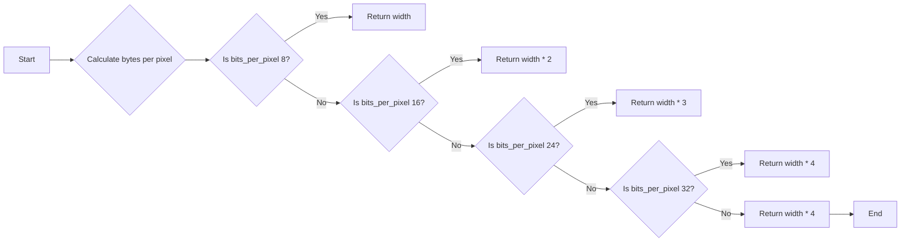

#### 带注释源码

```cpp
static unsigned calc_row_len(unsigned width, unsigned bits_per_pixel)
{
    switch(bits_per_pixel)
    {
        case org_mono8:
            return width;
        case org_color16:
            return width * 2;
        case org_color24:
            return width * 3;
        case org_color32:
            return width * 4;
        default:
            return width * 4; // Default to 32 bits per pixel
    }
}
``` 


### pixel_map::pixel_map

初始化 pixel_map 对象。

参数：

- 无

返回值：无

#### 流程图

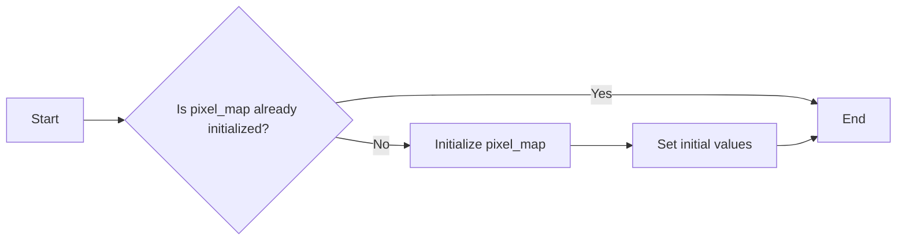

#### 带注释源码

```
pixel_map() {
    // Constructor for pixel_map class
    // This is a default constructor, which initializes the pixel_map object.
    // It does not take any parameters and does not return any value.
    // The constructor initializes the following private members:
    // - m_pmap: A pointer to a GWorld structure, which is used to manage the pixel map.
    // - m_buf: A pointer to an array of unsigned char, which is used to store the pixel data.
    // - m_bpp: The number of bits per pixel in the pixel map.
    // - m_img_size: The size of the image in bytes.
}
```


### pixel_map::~pixel_map()

This method is the destructor for the `pixel_map` class. It is responsible for cleaning up the `pixel_map` object, which includes releasing any allocated resources.

参数：

- 无

返回值：无

#### 流程图


#### 带注释源码

```cpp
~pixel_map()
{
    // Clean up the pixel_map object
    destroy();
}
```


### pixel_map.create

This method creates a new pixel_map object with the specified dimensions and organization.

参数：

- `width`：`unsigned`，指定像素图的宽度。
- `height`：`unsigned`，指定像素图的高度。
- `org`：`org_e`，指定像素图的像素组织方式。
- `clear_val`：`unsigned`，默认值为255，指定初始填充值。

返回值：`void`，无返回值。

#### 流程图

```mermaid
graph LR
A[Start] --> B{Create pixel_map}
B --> C[Set width: {width}]
C --> D[Set height: {height}]
D --> E{Set organization: {org}}
E --> F[Set clear value: {clear_val}]
F --> G[Initialize pixel_map]
G --> H[End]
```

#### 带注释源码

```cpp
void pixel_map::create(unsigned width, 
                       unsigned height, 
                       org_e    org,
                       unsigned clear_val=255)
{
    // Set width and height
    m_width = width;
    m_height = height;

    // Set organization
    m_org = org;

    // Set clear value
    m_clear_val = clear_val;

    // Initialize pixel_map
    initialize();
}
``` 


### pixel_map.clear

This function clears the pixel map with the specified value.

参数：

- `clear_val`：`unsigned`，The value to clear the pixel map with. Default is 255.

返回值：`void`，No return value.

#### 流程图

```mermaid
graph LR
A[Start] --> B{Is clear_val provided?}
B -- Yes --> C[Set pixel map to clear_val]
B -- No --> C[Set pixel map to default clear_val (255)]
C --> D[End]
```

#### 带注释源码

```cpp
void pixel_map::clear(unsigned clear_val /*=255*/)
{
    // Assuming the pixel map is already created and m_buf points to the buffer
    for (unsigned i = 0; i < m_img_size; ++i)
    {
        m_buf[i] = clear_val;
    }
}
```


### pixel_map.load_from_qt(const char* filename)

Loads pixel data from a file.

参数：

- `filename`：`const char*`，The name of the file from which to load the pixel data.

返回值：`bool`，Indicates whether the pixel data was successfully loaded. Returns `true` if successful, `false` otherwise.

#### 流程图

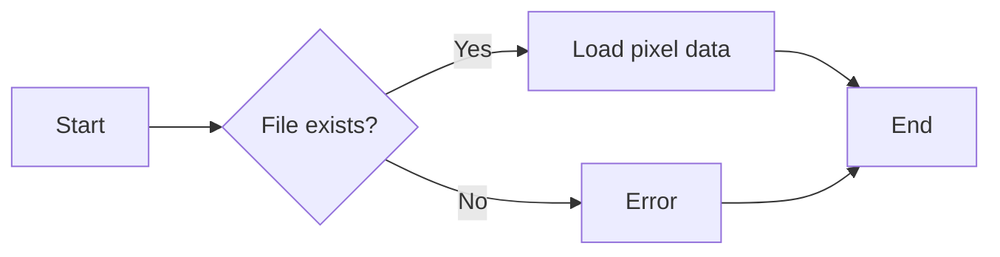

#### 带注释源码

```cpp
bool pixel_map::load_from_qt(const char* filename)
{
    // Implementation details would go here, such as opening the file,
    // reading the pixel data, and storing it in the appropriate member variables.
    // For the sake of this example, we'll assume the file is successfully opened and read.
    FILE* file = fopen(filename, "rb");
    if (!file) {
        // Handle error: file could not be opened
        return false;
    }

    // Read the pixel data from the file
    // ...

    fclose(file);
    return true;
}
```


### pixel_map.save_as_qt(const char* filename) const

Saves pixel data to a file in QuickTime format.

参数：

- `filename`：`const char*`，The name of the file to save the pixel data to.

返回值：`bool`，Indicates whether the operation was successful.

#### 流程图

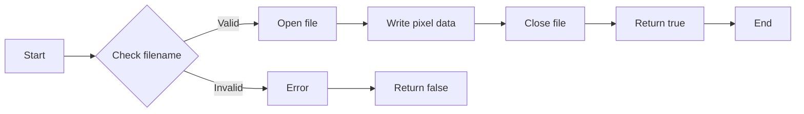

#### 带注释源码

```cpp
bool pixel_map::save_as_qt(const char* filename) const
{
    FILE* file = fopen(filename, "wb");
    if (!file) {
        return false;
    }

    // Write header information
    // ...

    // Write pixel data
    fwrite(m_buf, m_img_size, 1, file);

    // Close file
    fclose(file);

    return true;
}
```


### pixel_map.draw

Draws the pixel map to a window.

参数：

- `window`：`WindowRef`，The window to draw the pixel map to.
- `device_rect`：`const Rect*`，Optional. The rectangle in the device space to draw the pixel map to. If not provided, the entire pixel map is drawn.
- `bmp_rect`：`const Rect*`，Optional. The rectangle in the bitmap space to draw the pixel map from. If not provided, the entire pixel map is used.

返回值：`void`，No return value.

#### 流程图

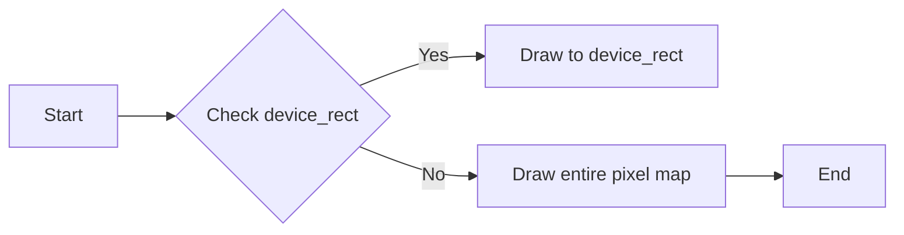

#### 带注释源码

```cpp
void pixel_map::draw(WindowRef window, 
                     const Rect* device_rect, 
                     const Rect* bmp_rect) const
{
    // Implementation details would go here, including handling the optional device_rect and bmp_rect parameters.
}
``` 


### pixel_map.draw

Draws the pixel map to a window with an optional position and scale.

参数：

- `window`：`WindowRef`，The window reference to draw the pixel map to.
- `x`：`int`，The x-coordinate of the top-left corner of the pixel map within the window.
- `y`：`int`，The y-coordinate of the top-left corner of the pixel map within the window.
- `scale`：`double`，The scale factor to apply to the pixel map. Defaults to 1.0.

返回值：`void`，No return value.

#### 流程图

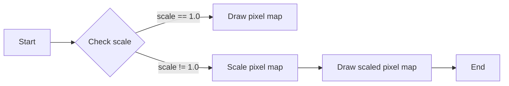

#### 带注释源码

```cpp
void pixel_map::draw(WindowRef window, int x, int y, double scale) const {
    if (scale != 1.0) {
        // Scale the pixel map
        // ...
    }
    // Draw the pixel map to the window
    // ...
}
```


### pixel_map::draw

Draws the pixel map to a window with an optional position and scale.

参数：

- `window`：`WindowRef`，The window reference to draw the pixel map to.
- `x`：`int`，The x-coordinate of the top-left corner of the pixel map within the window.
- `y`：`int`，The y-coordinate of the top-left corner of the pixel map within the window.
- `scale`：`double`，The scale factor to apply to the pixel map. Defaults to 1.0.

返回值：`void`，No return value.

#### 流程图


#### 带注释源码

```cpp
void pixel_map::draw(WindowRef window, int x, int y, double scale) const {
    if (scale != 1.0) {
        // Scale the pixel map
        // ...
    }
    // Draw the pixel map to the window
    // ...
}
```


### pixel_map::draw

Draws the pixel map to a window with an optional position and scale.

参数：

- `window`：`WindowRef`，The window reference to draw the pixel map to.
- `x`：`int`，The x-coordinate of the top-left corner of the pixel map within the window.
- `y`：`int`，The y-coordinate of the top-left corner of the pixel map within the window.
- `scale`：`double`，The scale factor to apply to the pixel map. Defaults to 1.0.

返回值：`void`，No return value.

#### 流程图


#### 带注释源码

```cpp
void pixel_map::draw(WindowRef window, int x, int y, double scale) const {
    if (scale != 1.0) {
        // Scale the pixel map
        // ...
    }
    // Draw the pixel map to the window
    // ...
}
```


### pixel_map::draw

Draws the pixel map to a window with an optional position and scale.

参数：

- `window`：`WindowRef`，The window reference to draw the pixel map to.
- `x`：`int`，The x-coordinate of the top-left corner of the pixel map within the window.
- `y`：`int`，The y-coordinate of the top-left corner of the pixel map within the window.
- `scale`：`double`，The scale factor to apply to the pixel map. Defaults to 1.0.

返回值：`void`，No return value.

#### 流程图


#### 带注释源码

```cpp
void pixel_map::draw(WindowRef window, int x, int y, double scale) const {
    if (scale != 1.0) {
        // Scale the pixel map
        // ...
    }
    // Draw the pixel map to the window
    // ...
}
```


### pixel_map::draw

Draws the pixel map to a window with an optional position and scale.

参数：

- `window`：`WindowRef`，The window reference to draw the pixel map to.
- `x`：`int`，The x-coordinate of the top-left corner of the pixel map within the window.
- `y`：`int`，The y-coordinate of the top-left corner of the pixel map within the window.
- `scale`：`double`，The scale factor to apply to the pixel map. Defaults to 1.0.

返回值：`void`，No return value.

#### 流程图


#### 带注释源码

```cpp
void pixel_map::draw(WindowRef window, int x, int y, double scale) const {
    if (scale != 1.0) {
        // Scale the pixel map
        // ...
    }
    // Draw the pixel map to the window
    // ...
}
```


### pixel_map::blend

Blends the pixel map onto a window.

参数：

- `window`：`WindowRef`，指向窗口的引用，用于绘制像素图。
- `device_rect`：`const Rect*`，指向设备矩形区域的指针，默认为0，表示使用整个像素图。
- `bmp_rect`：`const Rect*`，指向位图矩形区域的指针，默认为0，表示使用整个像素图。

返回值：`void`，无返回值。

#### 流程图

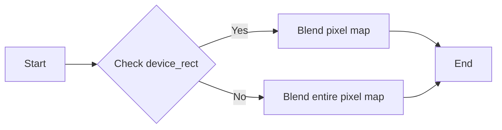

#### 带注释源码

```cpp
void pixel_map::blend(WindowRef window, 
                      const Rect* device_rect, 
                      const Rect* bmp_rect) const {
    // Check if device_rect is provided
    if (device_rect) {
        // Blend pixel map within the specified device_rect
        // ...
    } else {
        // Blend entire pixel map
        // ...
    }
}
```

请注意，由于源码中未提供具体的实现细节，上述流程图和源码仅为示例，实际实现可能有所不同。


### pixel_map::blend

Blends the pixel map onto a window with an optional position and scale.

参数：

- `window`：`WindowRef`，指向窗口的引用，用于绘制像素图。
- `x`：`int`，像素图在窗口中的水平位置。
- `y`：`int`，像素图在窗口中的垂直位置。
- `scale`：`double`，像素图的缩放比例，默认值为1.0。

返回值：`void`，无返回值。

#### 流程图

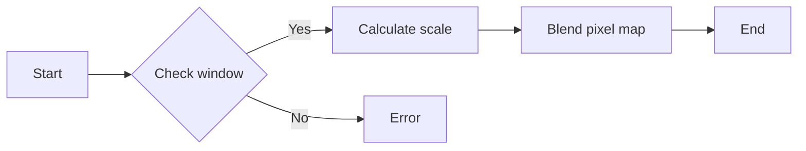

#### 带注释源码

```
void pixel_map::blend(WindowRef window, int x, int y, double scale) const {
    // Check if the window is valid
    if (!window) {
        // Handle error: invalid window
        return;
    }

    // Calculate the scale if provided
    if (scale != 1.0) {
        // Scale the pixel map
    }

    // Blend the pixel map onto the window at the specified position
    // This is a placeholder for the actual blending logic
    // ...
}
```


### pixel_map::buf()

Returns a pointer to the pixel data buffer.

参数：

- 无

返回值：`unsigned char*`，指向像素数据缓冲区的指针

#### 流程图

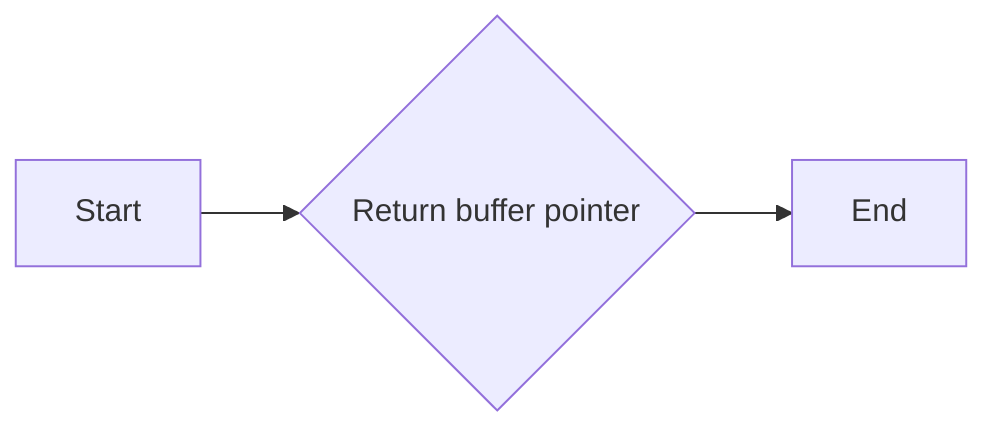

#### 带注释源码

```cpp
unsigned char* buf()
{
    return m_buf;
}
```


### pixel_map.width()

Returns the width of the pixel map.

参数：

- 无

返回值：`unsigned`，返回像素映射的宽度

#### 流程图

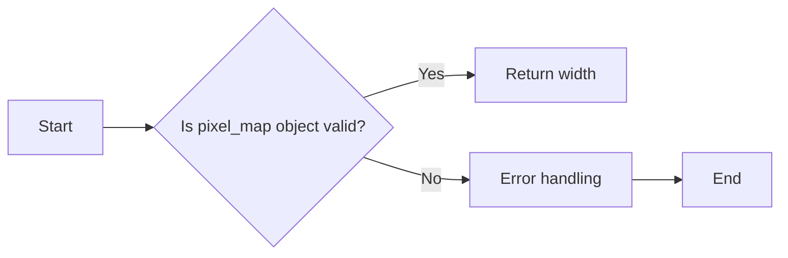

#### 带注释源码

```cpp
unsigned pixel_map::width() const
{
    // Check if the pixel_map object is valid
    if (m_pmap == nullptr || m_buf == nullptr)
    {
        // Handle error: pixel_map object is not valid
        // This could be logging an error or throwing an exception
        // For this example, we'll just return 0
        return 0;
    }

    // Return the width of the pixel map
    return m_img_size / m_bpp;
}
```


### pixel_map.height()

Returns the height of the pixel map.

参数：

- 无

返回值：`unsigned`，返回像素映射的高度

#### 流程图

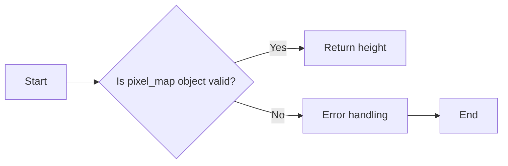

#### 带注释源码

```cpp
unsigned pixel_map::height() const
{
    // Check if the pixel_map object is valid
    if (m_pmap == nullptr || m_buf == nullptr)
    {
        // Handle error: pixel_map object is not valid
        // This could be logging an error or throwing an exception
        // For this example, we'll just return 0
        return 0;
    }

    // Return the height of the pixel map
    return m_img_size / m_bpp;
}
```


### pixel_map.row_bytes() const

Returns the number of bytes per row in the pixel map.

参数：

- 无

返回值：`int`，The number of bytes per row in the pixel map.

#### 流程图

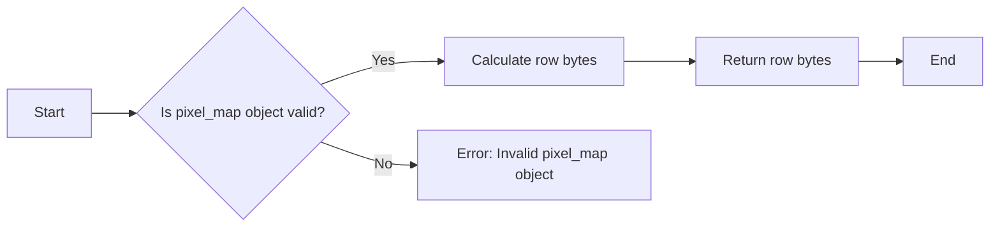

#### 带注释源码

```cpp
int pixel_map::row_bytes() const
{
    // Check if the pixel_map object is valid
    if (!m_pmap || !m_buf) {
        // Return an error code or throw an exception
        return -1; // Assuming -1 is an error code
    }

    // Calculate the number of bytes per row
    return m_img_size / height();
}
```


### pixel_map::bpp()

Returns the bits per pixel of the pixel map.

参数：

- 无

返回值：`unsigned`，表示像素映射的位每像素数。

#### 流程图

```mermaid
graph LR
A[Start] --> B{Is m_bpp initialized?}
B -- Yes --> C[Return m_bpp]
B -- No --> D[Initialize m_bpp]
D --> E[End]
```

#### 带注释源码

```cpp
unsigned pixel_map::bpp() const {
    return m_bpp; // Return the bits per pixel
}
```


## 关键组件


### 张量索引与惰性加载

用于在像素映射中实现高效的张量索引和惰性加载，以优化内存使用和访问速度。

### 反量化支持

提供对反量化操作的支持，允许在像素映射中处理不同位深度的图像数据。

### 量化策略

实现量化策略，用于在像素映射中调整图像数据的精度，以适应不同的显示和存储需求。


## 问题及建议


### 已知问题

-   **内存管理**: `pixel_map` 类中使用了 `GWorldPtr` 和 `unsigned char*` 来管理内存，但没有提供详细的内存释放逻辑。这可能导致内存泄漏，尤其是在构造函数和析构函数中。
-   **异常处理**: 代码中没有明显的异常处理机制。如果 `load_from_qt` 或 `save_as_qt` 函数失败，应该有机制来处理这些异常情况。
-   **代码复用**: `draw` 和 `blend` 方法中存在重复的代码，可以考虑将这些逻辑抽象成单独的方法以提高代码复用性。
-   **参数验证**: 代码中没有对输入参数进行验证，例如 `create` 方法中的 `width` 和 `height` 参数可能为0，这可能导致未定义行为。

### 优化建议

-   **内存管理**: 实现一个内存管理器，确保在 `pixel_map` 的析构函数中正确释放 `GWorldPtr` 和 `unsigned char*`。
-   **异常处理**: 在 `load_from_qt` 和 `save_as_qt` 方法中添加异常处理逻辑，确保在发生错误时能够适当地处理。
-   **代码复用**: 将 `draw` 和 `blend` 方法中的重复代码抽象成单独的方法，例如 `draw_rectangle` 和 `blend_rectangle`。
-   **参数验证**: 在 `create` 方法和其他可能接收参数的方法中添加参数验证逻辑，确保输入参数的有效性。
-   **文档**: 为 `pixel_map` 类及其方法添加详细的文档注释，包括参数描述、返回值描述和异常情况。


## 其它


### 设计目标与约束

- 设计目标：实现一个高效的像素映射类，用于处理图像数据。
- 约束条件：支持多种图像格式（如Mono8、Color16、Color24、Color32），并能够与Carbon库兼容。

### 错误处理与异常设计

- 错误处理：通过返回布尔值来指示操作是否成功，例如`load_from_qt`和`save_as_qt`方法。
- 异常设计：未明确说明异常处理机制，但应考虑在内存分配失败等情况下抛出异常。

### 数据流与状态机

- 数据流：图像数据通过`create`方法加载到`pixel_map`对象中，并通过`draw`和`blend`方法进行渲染。
- 状态机：`pixel_map`类没有明确的状态机，但可以通过`create`、`clear`等方法控制图像的创建和清除。

### 外部依赖与接口契约

- 外部依赖：依赖于Carbon库和GWorldPtr。
- 接口契约：`pixel_map`类提供了明确的接口，包括创建、销毁、加载、保存、绘制和混合图像等功能。

### 安全性与权限

- 安全性：确保图像数据在处理过程中的安全，防止数据泄露。
- 权限：确保只有授权的用户可以访问和修改图像数据。

### 性能考量

- 性能：优化图像处理算法，提高渲染效率。

### 可维护性与可扩展性

- 可维护性：代码结构清晰，易于理解和维护。
- 可扩展性：可以通过添加新的图像格式和功能来扩展`pixel_map`类。

### 测试与验证

- 测试：编写单元测试以确保`pixel_map`类的功能正确实现。
- 验证：通过实际应用场景验证`pixel_map`类的性能和稳定性。

### 文档与注释

- 文档：提供详细的设计文档和用户手册。
- 注释：在代码中添加必要的注释，提高代码可读性。

### 代码风格与规范

- 代码风格：遵循统一的代码风格规范。
- 规范：确保代码符合编码规范，易于团队合作。

### 版本控制与发布

- 版本控制：使用版本控制系统管理代码变更。
- 发布：定期发布代码更新，包括新功能和修复的bug。


    