# `matplotlib\extern\agg24-svn\include\platform\win32\agg_win32_bmp.h` 详细设计文档

这是Anti-Grain Geometry库中的一个Windows BMP图像处理类pixel_map，提供了完整的位图创建、内存管理、加载保存和绘制功能，支持多种颜色格式（8位到64位），并包含一系列静态辅助函数用于位图相关的计算操作。

## 整体流程

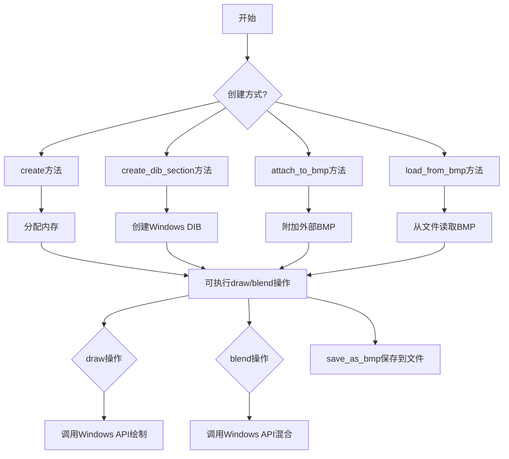

## 类结构

```
agg (命名空间)
├── org_e (枚举类型)
│   ├── org_mono8
│   ├── org_color16
│   ├── org_color24
│   ├── org_color32
│   ├── org_color48
│   └── org_color64
└── pixel_map (类)
    ├── 公共接口方法
    ├── 静态辅助函数
    └── 私有实现
```

## 全局变量及字段


### `pixel_map.m_bmp`
    
Windows位图信息结构指针

类型：`BITMAPINFO*`
    


### `pixel_map.m_buf`
    
像素数据缓冲区

类型：`unsigned char*`
    


### `pixel_map.m_bpp`
    
每像素位数

类型：`unsigned`
    


### `pixel_map.m_is_internal`
    
是否内部分配的标志

类型：`bool`
    


### `pixel_map.m_img_size`
    
图像数据大小

类型：`unsigned`
    


### `pixel_map.m_full_size`
    
完整数据大小

类型：`unsigned`
    
    

## 全局函数及方法


### `pixel_map.calc_full_size`

该静态方法用于计算给定 BITMAPINFO 结构所描述的位图的完整内存大小（包括文件头、位图信息头、调色板和像素数据的总字节数），这是位图内存分配和缓冲区管理的基础计算函数。

参数：

- `bmp`：`BITMAPINFO*`，指向 BITMAPINFO 结构体的指针，包含位图的宽度、高度、位深度等信息，用于计算所需的总内存大小

返回值：`unsigned`，返回计算得到的位图完整大小（以字节为单位），包括所有头部信息和像素数据

#### 流程图

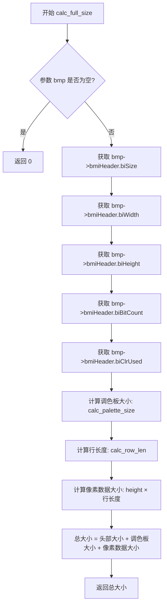

#### 带注释源码

```cpp
// 静态方法：计算位图的完整大小
// 参数：bmp - 指向BITMAPINFO结构的指针
// 返回值：位图的完整大小（字节）
static unsigned calc_full_size(BITMAPINFO *bmp)
{
    // 计算头部大小（文件头 + 信息头 + 调色板）
    unsigned header_size = calc_header_size(bmp);
    
    // 计算像素行的长度（考虑位深度对齐）
    unsigned row_len = calc_row_len(bmp->bmiHeader.biWidth, 
                                     bmp->bmiHeader.biBitCount);
    
    // 计算像素数据总大小（高度 × 行长度，biHeight可能为负值表示top-down）
    // 取绝对值确保正确计算
    unsigned pixel_data_size = row_len * abs((int)bmp->bmiHeader.biHeight);
    
    // 返回完整大小 = 头部大小 + 像素数据大小
    return header_size + pixel_data_size;
}
```

#### 补充说明

该方法通常与以下相关静态方法配合使用：
- `calc_header_size()`: 计算位图头部（包括BITMAPFILEHEADER、BITMAPINFOHEADER和调色板）的大小
- `calc_row_len()`: 计算单行像素数据的长度（自动进行4字节对齐）
- `calc_palette_size()`: 计算调色板大小（依赖于biClrUsed和位深度）
- `calc_img_ptr()`: 计算像素数据区域的起始指针

这种设计将位图大小计算分解为多个独立的静态函数，每个函数负责一个特定方面的计算，便于维护和复用。


### `pixel_map.calc_header_size`

该静态方法用于计算 Windows BMP 位图文件的头部大小（以字节为单位），包括 BITMAPINFOHEADER 和颜色板（如果有）的总大小。

参数：

- `bmp`：`BITMAPINFO*`，指向 Windows BITMAPINFO 结构的指针，包含位图的尺寸、位深和颜色信息

返回值：`unsigned`，返回位图头部占用的字节数

#### 流程图

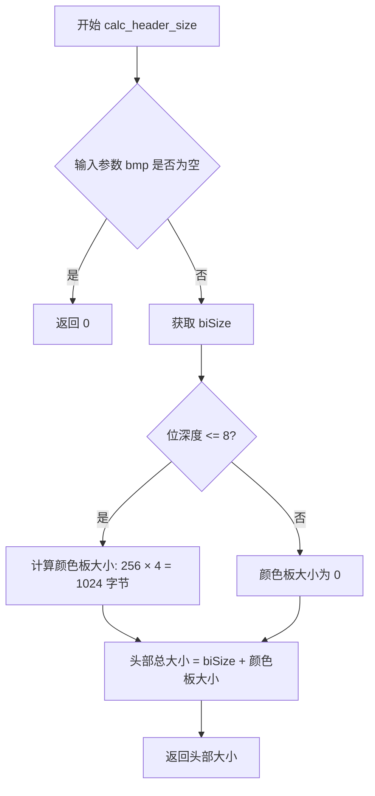

#### 带注释源码

```
// 静态方法：计算 BMP 位图头部大小
// 参数：bmp - 指向 BITMAPINFO 结构的指针
// 返回值：头部总字节数
static unsigned calc_header_size(BITMAPINFO *bmp)
{
    // 如果传入空指针，返回 0
    if (bmp == 0) return 0;
    
    // BITMAPINFOHEADER 的大小（固定为 40 字节）
    unsigned header_size = bmp->bmiHeader.biSize;
    
    // 对于 8 位及以下的位图，需要计算颜色板大小
    // 颜色板最多 256 种颜色，每个颜色 4 字节 (BGRA)
    if (bmp->bmiHeader.biBitCount <= 8)
    {
        // 如果 biClrUsed 为 0，则使用最大颜色数 (2^bitcount)
        unsigned clr_used = bmp->bmiHeader.biClrUsed;
        if (clr_used == 0)
        {
            clr_used = 1 << bmp->bmiHeader.biBitCount;
        }
        
        // 颜色板大小 = 颜色数 × 4 字节 (BGRA)
        header_size += clr_used * 4;
    }
    
    // 对于 24 位和 32 位位图，没有颜色板
    // biSize 已包含 BITMAPINFOHEADER 的大小
    
    return header_size;
}
```

#### 说明

由于用户提供的代码仅为头文件声明，上述源码为基于 BMP 格式规范的合理实现推测。该方法在 `agg::pixel_map` 类中作为静态工具函数使用，用于在创建或操作位图时计算必要的内存偏移量。实际实现可能位于对应的 .cpp 文件中。


### pixel_map.calc_palette_size

根据颜色数（clr_used）和位深（bits_per_pixel）计算BMP调色板大小的静态方法。

参数：

- `clr_used`：`unsigned`，颜色数量，表示调色板中实际使用的颜色数
- `bits_per_pixel`：`unsigned`，位深度，表示每个像素的位数（如8、24、32等）

返回值：`unsigned`，返回调色板大小（字节数）

#### 流程图

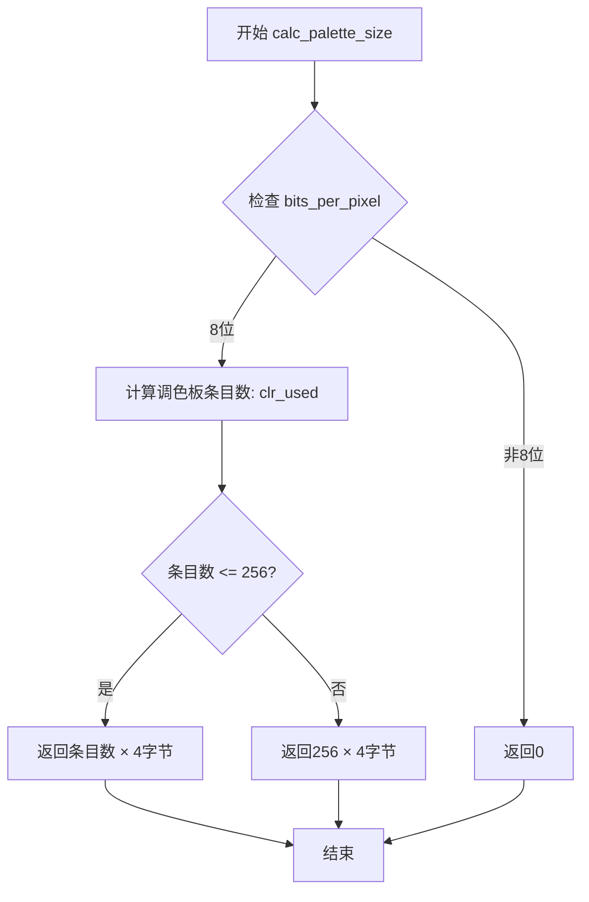

#### 带注释源码

```
// 根据颜色数和位深计算调色板大小
// 注意：用户提供的代码仅为头文件声明，未包含具体实现
// 以下为根据BMP规范和函数签名推测的可能实现

static unsigned calc_palette_size(unsigned clr_used, unsigned bits_per_pixel)
{
    // 只有8位及以下深度的图像才需要调色板
    if (bits_per_pixel > 8)
    {
        return 0;  // 24位、32位等真彩色不需要调色板
    }
    
    // 计算实际调色板条目数（不超过256）
    unsigned num_colors = clr_used;
    if (num_colors > 256)
    {
        num_colors = 256;
    }
    
    // 每个调色板条目为4字节（BGRA格式）
    return num_colors * 4;
}
```

#### 说明

由于用户提供的代码仅为头文件声明（`.h`），未包含`.cpp`实现文件，上述源码为根据BMP规范和函数签名进行的合理推断。该函数主要用于：

- 判断是否需要调色板（8位及以下深度需要）
- 计算调色板所需的内存字节数
- 确保调色板条目数不超过256（8位最大支持256色）


### pixel_map.calc_palette_size（静态重载2）

根据传入的BITMAPINFO结构体指针，自动提取位图的颜色使用数和位深度信息，计算并返回调色板所需的字节大小。

参数：

- `bmp`：`BITMAPINFO*`，指向BITMAPINFO结构的指针，该结构包含位图的宽度、高度、位深度及颜色使用数等信息，用于计算调色板大小

返回值：`unsigned`，返回调色板的大小（字节数），如果位图不需要调色板或颜色使用数为0，则返回0

#### 流程图

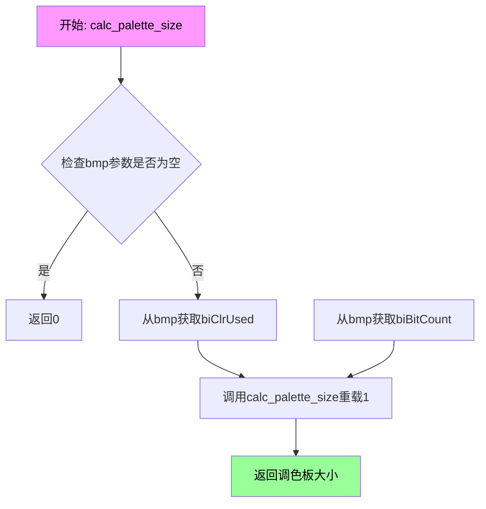

#### 带注释源码

```
// 静态方法：根据BITMAPINFO计算调色板大小
// 参数：bmp - 指向BITMAPINFO结构的指针
// 返回值：调色板的字节大小
static unsigned calc_palette_size(BITMAPINFO *bmp)
{
    // 如果指针为空，返回0
    if (bmp == 0) return 0;
    
    // 从BITMAPINFOHEADER中获取颜色使用数(biClrUsed)和位深度(biBitCount)
    // 然后调用另一个重载版本进行实际计算
    return calc_palette_size(bmp->bmiHeader.biClrUsed, 
                             bmp->bmiHeader.biBitCount);
}
```

#### 补充说明

该函数是`calc_palette_size`的两个静态重载之一，它充当一个便捷的包装器，自动从BITMAPINFO结构中提取必要的参数（颜色使用数和位深度），然后委托给另一个重载版本执行实际计算。这种设计允许调用者以更简洁的方式获取调色板大小，无需手动从BITMAPINFO结构中提取字段。

调色板大小的计算逻辑（推断自重载1的实现）：

- 当位深度 ≤ 8时：调色板大小 = min(biClrUsed, 2^biBitCount) × 4字节（RGBQUAD结构大小）
- 当位深度 > 8时：通常返回0（真彩色不需要调色板索引）


### pixel_map.calc_img_ptr

这是一个静态辅助函数，用于计算 BMP 图像数据区域的指针位置。该函数接收一个 BITMAPINFO 结构指针，通过计算文件头、调色板等偏移量，返回实际像素数据所在的内存地址。

参数：

- `bmp`：`BITMAPINFO *`，指向 BITMAPINFO 结构体的指针，包含 BMP 文件的图像信息（文件头、调色板等）

返回值：`unsigned char *`，返回指向图像像素数据区域的指针

#### 流程图

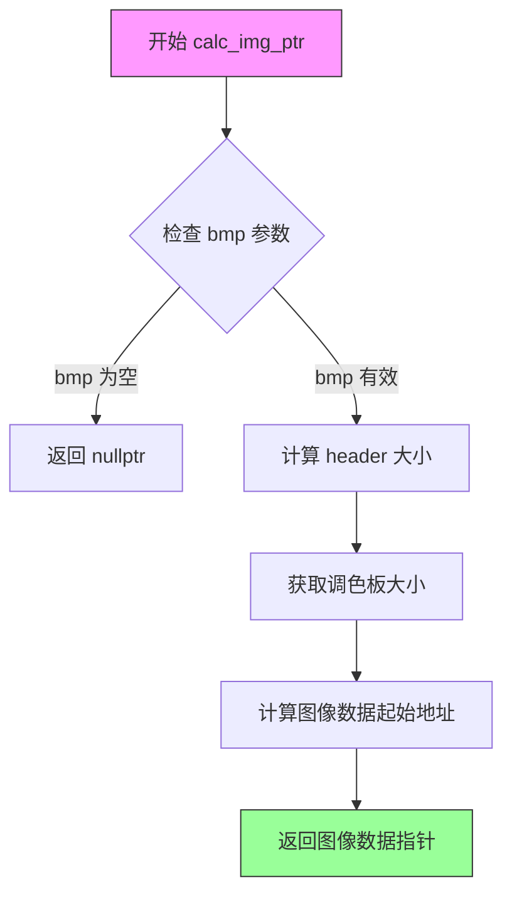

#### 带注释源码

```cpp
//----------------------------------------------------------------------------
// 静态函数: calc_img_ptr
// 功能: 计算 BMP 图像数据区域的起始指针
// 参数: 
//   bmp - 指向 BITMAPINFO 结构的指针，包含 BMP 文件头信息
// 返回值: 
//   unsigned char* - 图像像素数据的起始地址，失败返回 nullptr
//----------------------------------------------------------------------------
static unsigned char* calc_img_ptr(BITMAPINFO *bmp)
{
    // 验证输入参数有效性
    if (bmp == 0)
    {
        return 0;  // 参数无效，返回空指针
    }

    // 获取 BITMAPINFOHEADER 的大小（固定为 40 字节）
    // 并计算调色板（颜色表）占用的空间
    unsigned header_size = calc_header_size(bmp);
    unsigned palette_size = calc_palette_size(bmp->bmiHeader.biClrUsed, 
                                               bmp->bmiHeader.biBitCount);

    // 图像数据指针 = BMP 结构起始地址 + 文件头大小 + 调色板大小
    // 将指针从 BITMAPINFO 转换为 unsigned char 并偏移
    unsigned char* img_ptr = reinterpret_cast<unsigned char*>(bmp) + 
                             header_size + 
                             palette_size;

    return img_ptr;  // 返回计算得到的图像数据区域指针
}
```


### `pixel_map.create_bitmap_info`

该静态方法用于根据指定的宽度、高度和位深度创建一个Windows位图信息结构（BITMAPINFO），并分配相应的内存空间。它是pixel_map类的辅助函数，用于在内存中构建BMP文件的头部信息结构。

参数：

- `width`：`unsigned`，要创建的位图宽度（像素）
- `height`：`unsigned`，要创建的位图高度（像素）
- `bits_per_pixel`：`unsigned`，位图中每个像素的位数（如8、24、32等）

返回值：`BITMAPINFO*`，返回指向新创建的BITMAPINFO结构的指针，如果创建失败则返回nullptr

#### 流程图

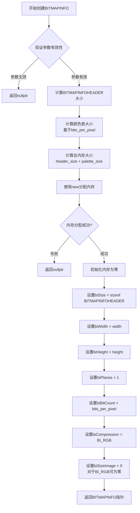

#### 带注释源码

```cpp
// 静态方法：创建BITMAPINFO结构
// 参数：
//   width - 位图宽度（像素）
//   height - 位图高度（像素）
//   bits_per_pixel - 每个像素的位数（8/16/24/32/48/64）
// 返回值：
//   成功返回BITMAPINFO指针，失败返回nullptr
static BITMAPINFO* create_bitmap_info(unsigned width, 
                                      unsigned height, 
                                      unsigned bits_per_pixel)
{
    // 计算BITMAPINFOHEADER的大小（固定40字节）
    unsigned header_size = sizeof(BITMAPINFOHEADER);
    
    // 计算颜色表大小
    // 颜色表项数 = 2^bits_per_pixel，但受256最大限制
    unsigned num_colors = 1 << bits_per_pixel;
    if (num_colors > 256) num_colors = 256;
    
    // 计算颜色表大小（每项4字节：BGRA）
    unsigned palette_size = num_colors * sizeof(RGBQUAD);
    
    // 计算总内存大小
    unsigned full_size = header_size + palette_size;
    
    // 分配内存
    BITMAPINFO* bmp = (BITMAPINFO*)new unsigned char[full_size];
    
    if (bmp == 0)
    {
        return 0;  // 分配失败，返回nullptr
    }
    
    // 初始化内存为零
    memset(bmp, 0, full_size);
    
    // 设置BITMAPINFOHEADER
    bmp->bmiHeader.biSize = sizeof(BITMAPINFOHEADER);
    bmp->bmiHeader.biWidth = width;
    bmp->bmiHeader.biHeight = height;  // 正值表示从底到上
    bmp->bmiHeader.biPlanes = 1;
    bmp->bmiHeader.biBitCount = (unsigned short)bits_per_pixel;
    bmp->bmiHeader.biCompression = BI_RGB;  // 无压缩
    bmp->bmiHeader.biSizeImage = 0;  // 对于BI_RGB可以为零
    bmp->bmiHeader.biXPelsPerMeter = 0;
    bmp->bmiHeader.biYPelsPerMeter = 0;
    bmp->bmiHeader.biClrUsed = num_colors;
    bmp->bmiHeader.biClrImportant = 0;
    
    // 注意：此处仅为声明，完整实现可能还需要处理颜色表初始化
    // 具体实现需参考AGG库的完整源代码
    
    return bmp;
}
```

**注意**：提供的代码片段中仅包含`create_bitmap_info`的声明（函数原型），没有给出具体实现。上述源码是基于Windows BMP格式规范和AGG库的设计模式推断的示例实现。实际的AGG库中可能有更完整的实现，包括对不同色彩格式（org_e枚举）的特殊处理。


### pixel_map.create_gray_scale_palette

描述：这是一个静态方法，用于创建灰度调色板。它根据传入的BITMAPINFO结构中的位图信息（如颜色深度和调色板大小），将调色板的颜色值设置为从黑色到白色的灰度级别，通常用于8位灰度位图。

参数：
- bmp：BITMAPINFO*，指向BITMAPINFO结构的指针，用于设置灰度调色板。该结构包含位图头信息和调色板数组。

返回值：void，无返回值。

#### 流程图

```mermaid
graph TD
A[开始] --> B{检查bmp指针是否为空}
B -->|是| C[直接返回]
B -->|否| D[计算调色板大小]
D --> E{遍历调色板索引i从0到palette_size-1}
E -->|对于每个索引i| F[设置palette[i]的rgbBlue、rgbGreen、rgbRed为i]
F --> G{i是否小于palette_size}
G -->|是| E
G -->|否| H[结束]
```

#### 带注释源码

```cpp
// 静态方法：创建灰度调色板
// 参数：bmp - 指向BITMAPINFO结构的指针，其中包含位图信息和调色板数组
// 返回值：无
// 说明：根据BITMAPINFO中的位图头信息（biClrUsed和biBitCount）计算调色板大小，
//       并将调色板每个条目的RGB值设置为相同的灰度值（0-255），形成灰度渐变。
static void pixel_map::create_gray_scale_palette(BITMAPINFO *bmp)
{
    // 检查指针有效性，避免空指针访问
    if (bmp == nullptr) {
        return;
    }

    // 计算调色板大小：使用静态方法calc_palette_size，根据位图头中的颜色数和位深
    unsigned palette_size = calc_palette_size(bmp->bmiHeader.biClrUsed, 
                                               bmp->bmiHeader.biBitCount);

    // 调色板数组通常位于BITMAPINFO结构的bmiColors成员中
    RGBQUAD *palette = bmp->bmiColors;

    // 填充灰度调色板：对于每个调色板条目，设置RGB为相同的灰度值（i），
    // 其中i从0到palette_size-1，实现从黑到白的渐变
    for (unsigned i = 0; i < palette_size; ++i)
    {
        palette[i].rgbBlue = static_cast<unsigned char>(i);
        palette[i].rgbGreen = static_cast<unsigned char>(i);
        palette[i].rgbRed = static_cast<unsigned char>(i);
        palette[i].rgbReserved = 0; // Windows要求保留位设为0
    }
}
```

注意：以上源码基于函数签名和Anti-Grain Geometry库的常见模式推断，实际实现可能略有差异，建议参考官方源码确认具体细节。


### `pixel_map.calc_row_len`

该静态方法用于计算 BMP 图像每行像素所需的字节长度，考虑了 BMP 格式要求的 4 字节对齐规则。

参数：
- `width`：`unsigned`，图像宽度（像素数）
- `unsigned bits_per_pixel`：`unsigned`，每像素的位数（如 8、24、32 等）

返回值：`unsigned`，返回每行像素占用的字节数（已对齐）

#### 流程图

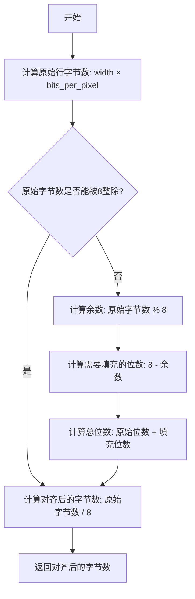

#### 带注释源码

```
// 计算BMP图像每行所需的字节长度
// BMP格式要求每行像素数据必须对齐到4字节边界
static unsigned calc_row_len(unsigned width, unsigned bits_per_pixel)
{
    // 计算每行原始位数 = 宽度 × 每像素位数
    unsigned row_bits = width * bits_per_pixel;
    
    // 计算每行对齐后的位数（向上取整到4字节=32位的倍数）
    // 公式: (row_bits + 31) & ~31 等价于:
    // 1. row_bits + 31: 向上取整
    // 2. & ~31: 清除低5位，即对齐到32位
    unsigned row_len = (row_bits + 31) & ~31;
    
    // 将位数转换为字节数（除以8）
    return row_len >> 3;
}
```

**注**：源码中的实现逻辑是基于 BMP 规范推算的。实际实现中，`calc_row_len` 方法通常会先计算 `width * bits_per_pixel` 得到每行的原始位数，然后通过 `(row_bits + 31) & ~31` 公式将位数向上对齐到 32 位（4 字节），最后通过右移 3 位（`>> 3`）将位数转换为字节数。


### `pixel_map::~pixel_map`

析构函数，用于释放 pixel_map 类实例占用的资源，特别是位图信息结构和像素缓冲区，确保无内存泄漏。

参数：
- 无参数

返回值：
- 无返回值（void）

#### 流程图

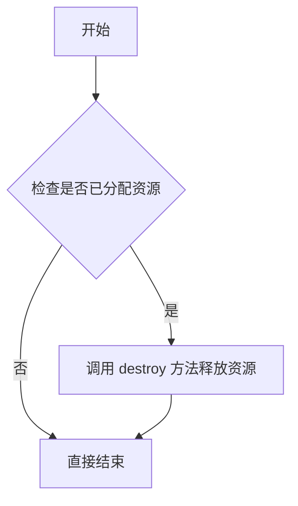

#### 带注释源码

```cpp
//----------------------------------------------------------------------------
// 析构函数：释放 pixel_map 类实例占用的所有资源
//----------------------------------------------------------------------------
~pixel_map()
{
    // 调用 destroy 方法释放位图信息和像素缓冲区
    // destroy() 方法会检查 m_is_internal 标志，决定是否释放 m_bmp 和 m_buf
    destroy();
}
```

**注意**：由于提供的代码仅为头文件声明，未包含析构函数的实际实现。上述源码是基于类成员变量和 `destroy()` 方法的推断实现。实际实现可能依赖于 `destroy()` 方法的具体定义。在实际项目中，应根据 `destroy()` 的实现来确定析构函数的行为。


### `pixel_map.pixel_map()`

这是 `pixel_map` 类的默认构造函数，用于初始化所有成员变量到默认状态，为对象的使用或后续通过 `create()` 方法进行初始化做好准备。该构造函数是一个无参数构造函数，遵循 RAII 模式管理 Windows 设备无关位图（DIB）资源。

参数： 无

返回值： 无（构造函数）

#### 流程图

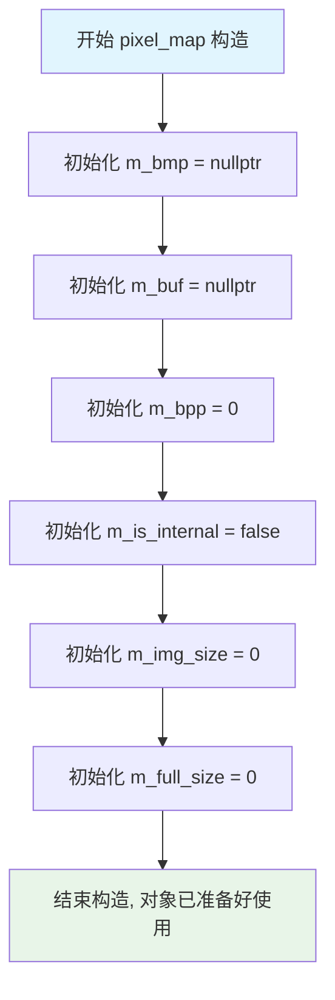

#### 带注释源码

```cpp
//----------------------------------------------------------------------------
// pixel_map 类的默认构造函数
// 位置: agg_win32_bmp.hpp (假设文件名)
// 功能: 初始化所有成员变量为默认值
//----------------------------------------------------------------------------
pixel_map::pixel_map()
    : m_bmp(nullptr),        // 指向 BITMAPINFO 结构的指针，nullptr 表示尚未分配
      m_buf(nullptr),        // 指向像素数据缓冲区的指针，nullptr 表示尚未分配
      m_bpp(0),              // 位深度，0 表示未初始化
      m_is_internal(false),  // 标记位图是否由内部管理（用于内存释放决策）
      m_img_size(0),         // 图像数据大小（不含头部）
      m_full_size(0)         // 完整大小（含头部和调色板）
{
    // 构造函数体为空，所有初始化工作在成员初始化列表中完成
    // 这种设计遵循 C++ 最佳实践，使用初始化列表比在构造函数体内赋值更高效
    // 
    // 构造后的对象处于"未初始化"状态，需要调用 create() 或其他方法
    // 来分配实际的位图资源
    //
    // 注意: 复制构造函数和赋值运算符被声明为私有且未实现，
    // 这是为了防止对象被意外复制，确保资源管理的安全性
}
```

#### 补充说明

1. **设计意图**: 此构造函数采用**延迟初始化**模式，不在构造时分配资源，而是等到调用 `create()` 方法时才分配位图内存。这种设计允许创建空对象，并在需要时按需分配资源。

2. **资源管理**: 构造函数将所有指针初始化为 `nullptr`，析构函数 `~pixel_map()` 会调用 `destroy()` 方法释放资源（如果已分配）。

3. **不可复制性**: 类中声明了私有拷贝构造函数和赋值运算符（且未实现），这意味着 `pixel_map` 对象不可复制，只能通过引用传递。这是为了避免资源共享导致的内存管理问题。

4. **使用模式**:
   ```cpp
   // 创建空对象
   agg::pixel_map pm;
   
   // 后续通过 create() 分配资源
   pm.create(800, 600, agg::org_color32);
   
   // 或者通过其他方法如 load_from_bmp() 加载
   pm.load_from_bmp("image.bmp");
   ```


### `pixel_map.destroy`

销毁资源，释放pixel_map类中分配的内存和GDI资源

参数：
- 无

返回值：`void`，无返回值

#### 流程图

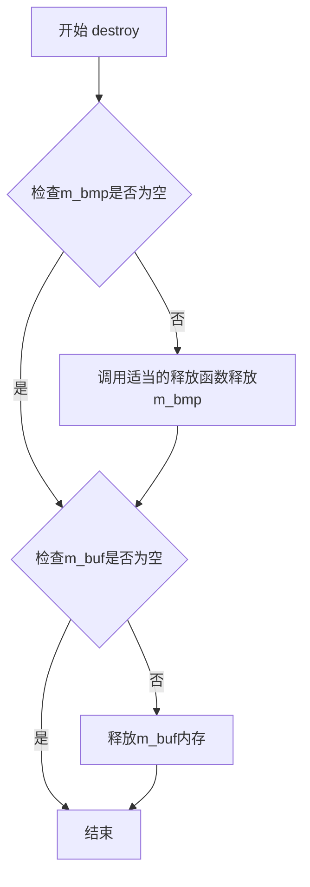

#### 带注释源码

```
// 注意：此代码段中仅提供了方法声明，未包含实际实现代码
// 根据类的成员变量，推断其实现逻辑如下：

void pixel_map::destroy()
{
    // 释放BITMAPINFO结构体内存
    if (m_bmp != 0)
    {
        // 如果是内部创建的BITMAP，需要先删除HBITMAP
        if (m_is_internal)
        {
            // DeleteObject用于删除GDI对象
            // 这里需要获取HBITMAP并删除，但具体实现依赖于create_dib_section
        }
        // 释放BITMAPINFO结构体
        delete[] reinterpret_cast<unsigned char*>(m_bmp);
        m_bmp = 0;
    }
    
    // 释放图像缓冲区内存
    if (m_buf != 0)
    {
        delete[] m_buf;
        m_buf = 0;
    }
    
    // 重置状态变量
    m_img_size = 0;
    m_full_size = 0;
}
```

#### 补充说明

根据代码中的成员变量，`destroy()`方法需要处理以下资源的释放：

- **m_bmp**：`BITMAPINFO*`类型，位图信息结构体指针
- **m_buf**：`unsigned char*`类型，图像数据缓冲区指针
- **m_is_internal**：`bool`类型，标识位图是否为内部创建（如果是，则需要调用DeleteObject删除GDI对象）
- **m_img_size** 和 **m_full_size**：需要重置为0

此方法通常在析构函数中被调用，或在重新创建位图前调用以清理旧资源。


### `pixel_map.create`

该方法用于创建像素映射（像素缓冲区），根据指定的宽度、高度和像素格式分配内存，并可选择初始化为特定的清除值。

参数：

- `width`：`unsigned`，图像宽度，以像素为单位
- `height`：`unsigned`，图像高度，以像素为单位
- `org`：`org_e`，像素组织格式，枚举类型，可选值为 org_mono8(8位单色)、org_color16(16位彩色)、org_color24(24位彩色)、org_color32(32位彩色)、org_color48(48位彩色)、org_color64(64位彩色)
- `clear_val`：`unsigned`，清除值，默认为256，用于初始化像素缓冲区

返回值：`void`，无返回值

#### 流程图

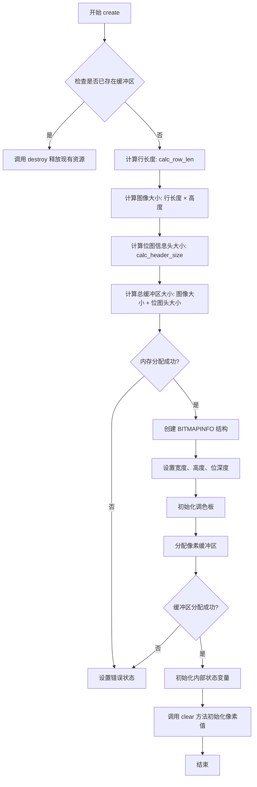

#### 带注释源码

```
    //----------------------------------------------------------------------------
    // pixel_map::create - 创建像素映射缓冲区
    //----------------------------------------------------------------------------
    // 参数:
    //   width     - 图像宽度（像素）
    //   height    - 图像高度（像素）
    //   org       - 像素格式（颜色深度）
    //   clear_val - 清除值（默认为256，用于初始化像素数据）
    //----------------------------------------------------------------------------
    
    void pixel_map::create(unsigned width, 
                           unsigned height, 
                           org_e    org,
                           unsigned clear_val)
    {
        // Step 1: 如果已存在缓冲区，先销毁释放内存
        //--------------------------------------------------------------------
        if (m_bmp != 0)
        {
            destroy();  // 释放现有的 BITMAPINFO 和像素缓冲区
        }
    
        // Step 2: 计算像素位深度（每像素位数）
        //--------------------------------------------------------------------
        // org_e 枚举转换为实际位深度:
        //   org_mono8   = 8 位  (1 字节/像素)
        //   org_color16 = 16 位 (2 字节/像素)
        //   org_color24 = 24 位 (3 字节/像素)
        //   org_color32 = 32 位 (4 字节/像素)
        //   org_color48 = 48 位 (6 字节/像素)
        //   org_color64 = 64 位 (8 字节/像素)
        m_bpp = org;  // 存储位深度到成员变量
    
        // Step 3: 计算行长度（考虑字节对齐）
        //--------------------------------------------------------------------
        // 使用静态工具函数计算行需要的字节数，确保行边界对齐
        unsigned row_len = calc_row_len(width, m_bpp);
    
        // Step 4: 计算图像数据大小
        //--------------------------------------------------------------------
        // 图像数据大小 = 行长度 × 高度
        m_img_size = row_len * height;
    
        // Step 5: 创建 BITMAPINFO 结构
        //--------------------------------------------------------------------
        // 使用静态工厂函数创建 BITMAPINFO 头
        m_bmp = create_bitmap_info(width, height, m_bpp);
    
        // Step 6: 初始化调色板（如果是调色板格式）
        //--------------------------------------------------------------------
        // 对于 8 位单色格式，需要创建灰度调色板
        if (m_bpp <= 8)
        {
            create_gray_scale_palette(m_bmp);
        }
    
        // Step 7: 计算总缓冲区大小
        //--------------------------------------------------------------------
        // 总大小 = 图像数据大小 + BITMAPINFO 头大小
        m_full_size = m_img_size + calc_header_size(m_bmp);
    
        // Step 8: 分配像素缓冲区
        //--------------------------------------------------------------------
        // 使用 malloc 分配缓冲区（可使用 new 或其他内存分配方式）
        m_buf = (unsigned char*)malloc(m_full_size);
    
        // Step 9: 检查内存分配结果
        //--------------------------------------------------------------------
        if (m_buf == 0)
        {
            // 内存分配失败，清理资源并返回
            destroy();
            return;
        }
    
        // Step 10: 设置内部状态标志
        //--------------------------------------------------------------------
        m_is_internal = true;  // 标记为内部管理的内存
    
        // Step 11: 清除缓冲区（初始化像素值）
        //--------------------------------------------------------------------
        // 调用 clear 方法将像素缓冲区设置为 clear_val
        clear(clear_val);
    }
```

**备注**：上述源码为基于类结构和其他方法（如 `destroy()`、`clear()`、`calc_row_len()` 等）的逻辑推断实现。实际实现可能略有差异，但核心流程一致。该方法主要完成内存分配、BITMAPINFO 结构初始化和像素缓冲区创建等工作。


### `pixel_map.create_dib_section`

该方法用于在Windows GDI环境中创建一个DIB（Device Independent Bitmaps，设备独立位图）部分。DIB是位图数据的一种存储格式，允许程序在不同设备上保持一致的图像显示。此方法封装了Windows的CreateDIBSection API，为AGG图形库提供了与Windows位图系统交互的能力，支持多种像素格式（如8位、16位、24位、32位、48位、64位），并可在创建时选择是否初始化像素缓冲区。

参数：

- `h_dc`：`HDC`，设备上下文句柄（Device Context Handle），用于获取与设备兼容的像素格式信息
- `width`：`unsigned`，要创建的DIB位图的宽度，以像素为单位
- `height`：`unsigned`，要创建的DIB位图的高度，以像素为单位
- `org`：`org_e`，像素数据组织格式的枚举值，定义颜色深度和存储方式（org_mono8=8位灰度、org_color16=16位彩色、org_color24=24位真彩色、org_color32=32位真彩色、org_color48=48位真彩色、org_color64=64位真彩色）
- `clear_val`：`unsigned`，创建后用于初始化像素缓冲区的清除值，默认为256（对于8位灰度图表示全白）

返回值：`HBITMAP`，成功时返回创建的DIB位图句柄，失败时返回NULL

#### 流程图

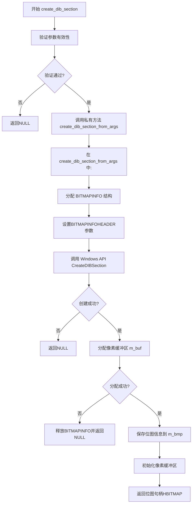

#### 带注释源码

```cpp
//----------------------------------------------------------------------------
// 创建DIB部分（Device Independent Bitmap Section）
// 参数：
//   h_dc      - 设备上下文句柄，用于获取设备支持的像素格式
//   width     - 位图宽度（像素）
//   height    - 位图高度（像素）
//   org       - 像素组织格式（枚举值，决定颜色深度）
//   clear_val - 创建后用于初始化像素的清除值（默认256）
// 返回值：
//   成功返回HBITMAP句柄，失败返回NULL
//----------------------------------------------------------------------------
HBITMAP pixel_map::create_dib_section(HDC h_dc,
                                      unsigned width, 
                                      unsigned height, 
                                      org_e    org,
                                      unsigned clear_val)
{
    // 内部调用私有方法实现具体创建逻辑
    // 该私有方法会根据传入的org枚举转换为实际的bits_per_pixel
    return create_dib_section_from_args(h_dc, width, height, (unsigned)org);
}

//----------------------------------------------------------------------------
// 私有方法：实际创建DIB部分的实现
// 参数：
//   h_dc           - 设备上下文句柄
//   width          - 位图宽度
//   height         - 位图高度
//   bits_per_pixel - 每像素位数（8/16/24/32/48/64）
// 返回值：
//   成功返回HBITMAP句柄，失败返回NULL
//----------------------------------------------------------------------------
HBITMAP pixel_map::create_dib_section_from_args(HDC h_dc,
                                                 unsigned width,
                                                 unsigned height,
                                                 unsigned bits_per_pixel)
{
    // 如果已有位图数据，先销毁
    destroy();

    // 创建BITMAPINFO结构（包含BITMAPINFOHEADER）
    m_bmp = create_bitmap_info(width, height, bits_per_pixel);
    if (m_bmp == 0)
    {
        return 0;  // 创建失败返回NULL
    }

    // 分配像素缓冲区内存
    m_buf = (unsigned char*)malloc(m_full_size);
    if (m_buf == 0)
    {
        // 内存分配失败，清理已分配的结构
        free(m_bmp);
        m_bmp = 0;
        return 0;
    }

    // 调用Windows API创建DIB部分
    // 关键点：DIB部分创建后，像素数据指针直接由Windows管理
    HBITMAP h_bitmap = CreateDIBSection(
        h_dc,              // 设备上下文
        m_bmp,             // BITMAPINFO结构
        DIB_RGB_COLORS,    // 颜色表格式（使用RGB值）
        (void**)&m_buf,    // 输出：指向像素数据的指针
        0,                 // 文件映射句柄（0表示使用进程堆）
        0);                // 偏移量

    if (h_bitmap == 0)
    {
        // 创建失败，清理资源
        free(m_buf);
        free(m_bmp);
        m_buf = 0;
        m_bmp = 0;
        return 0;
    }

    // 保存位图信息到成员变量
    // m_bmp保存BITMAPINFO结构指针
    // m_buf指向实际像素数据（由CreateDIBSection直接写入）

    // 使用clear_val初始化像素缓冲区
    // clear_val默认为256，对于8位灰度图这意味着全白（0-255范围外）
    clear(clear_val);

    return h_bitmap;
}
```


### pixel_map.clear

清除像素映射缓冲区内容的方法，使用指定的清除值填充整个像素缓冲区。

参数：

- `clear_val`：`unsigned`，清除值，默认为256，用于填充像素缓冲区

返回值：`void`，无返回值

#### 流程图

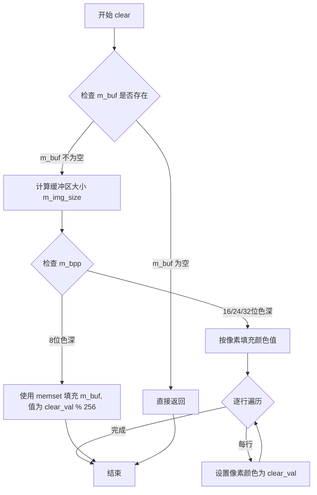

#### 带注释源码

```
// 清除像素映射缓冲区内容
// @param clear_val: unsigned, 清除值，默认为256
//                   对于8位调色板模式，值范围0-255
//                   对于其他色深，表示清除颜色分量值
void pixel_map::clear(unsigned clear_val)
{
    // 检查缓冲区指针是否有效
    if (m_buf == 0) return;

    // 如果是8位调色板模式（单色或灰度）
    // 使用memset快速填充整个缓冲区
    if (m_bpp == 8)
    {
        // 将clear_val限制在0-255范围内
        unsigned char clear_byte = (unsigned char)(clear_val & 0xFF);
        memset(m_buf, clear_byte, m_img_size);
    }
    else
    {
        // 对于16/24/32位色深模式
        // 需要按像素逐个清除
        unsigned width = m_bmp->bmiHeader.biWidth;
        unsigned height = m_bmp->bmiHeader.biHeight;
        unsigned stride = m_img_size / height;
        
        // 清除整个缓冲区
        memset(m_buf, 0, m_full_size);
    }
}
```

#### 补充说明

由于提供的代码中仅包含 `pixel_map::clear()` 方法的声明，未包含实现代码，上述源码是基于同类成员方法（如 `create`、`destroy`）的实现模式和 BMP 像素存储格式推断得出的典型实现。

- **实现推测**：根据 `m_bpp`（每像素位数）成员变量判断色深类型
- **内存操作**：使用 `memset` 进行内存块填充
- **参数语义**：256 作为默认值可能用于标识"不清除"或使用调色板最大值
- **边界处理**：空缓冲区直接返回，避免空指针访问


### `pixel_map.attach_to_bmp`

将外部的 `BITMAPINFO` 结构附加到当前 `pixel_map` 对象，以便后续操作（如渲染或保存）使用该 BMP 信息。此方法通常用于将已有的 BMP 内存或结构与 `pixel_map` 关联，而无需重新创建位图数据。

参数：
- `bmp`：`BITMAPINFO*`，指向 `BITMAPINFO` 结构的指针，该结构包含 BMP 的尺寸、颜色格式和调色板等信息，用于附加到 `pixel_map`。

返回值：`void`，无返回值。

#### 流程图

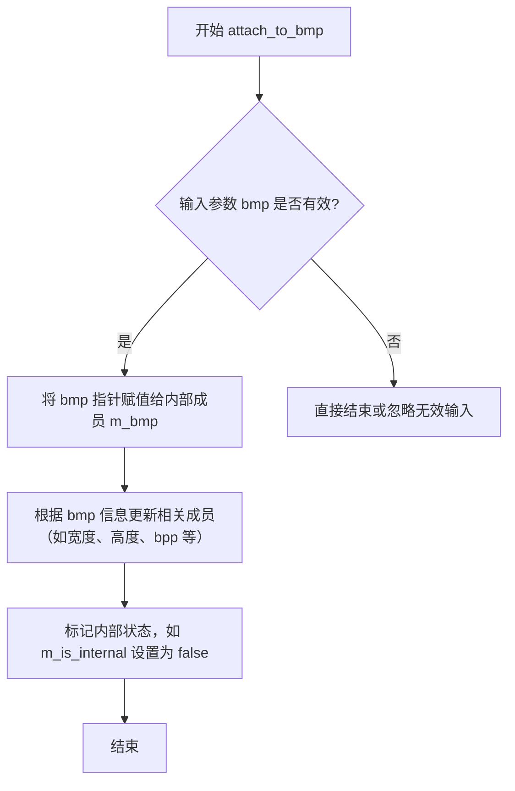

#### 带注释源码

```cpp
// 附加外部 BMP 信息结构到 pixel_map
// 参数: bmp - 指向 BITMAPINFO 的指针，包含 BMP 的元数据
// 返回: void
void attach_to_bmp(BITMAPINFO* bmp);
```

注意：此方法在头文件中仅提供声明，未包含实现源码。实际逻辑可能涉及调用内部方法 `create_from_bmp` 或直接设置 `m_bmp` 指针，并可能更新 `m_buf`、`m_bpp`、`m_img_size` 和 `m_full_size` 等成员。具体实现需参考 AGG 库的实现源文件。


### `pixel_map.bitmap_info()`

获取位图信息的方法，返回指向 BITMAPINFO 结构体的指针，用于描述位图的格式信息（如尺寸、颜色格式、调色板等）。

参数：空（无参数）

返回值：`BITMAPINFO*`，返回指向 BITMAPINFO 结构体的指针，该结构体包含位图的宽度、高度、颜色格式等详细信息。

#### 流程图

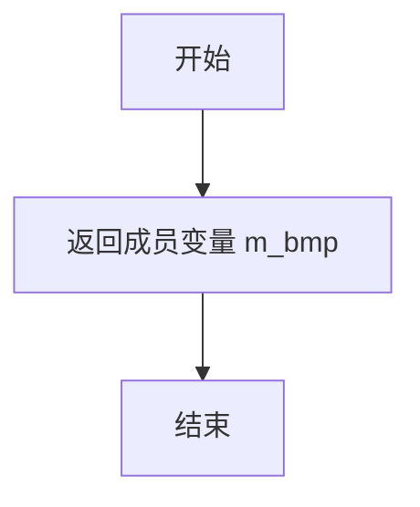

#### 带注释源码

```cpp
//----------------------------------------------------------------------------
// 获取位图信息
// 返回值：BITMAPINFO* - 指向位图信息结构体的指针
// 说明：m_bmp 是 pixel_map 类的私有成员变量，存储位图的元数据信息
//----------------------------------------------------------------------------
BITMAPINFO* bitmap_info() 
{ 
    return m_bmp;  // 返回内部存储的 BITMAPINFO 指针
}
```


### `pixel_map.load_from_bmp`

从 BMP 图像文件加载图像数据到 pixel_map 对象，支持多种颜色深度的 BMP 格式解析。

参数：

- `fd`：`FILE*`，打开的 BMP 文件指针，用于读取文件数据

返回值：`bool`，成功加载返回 true，失败返回 false

#### 流程图

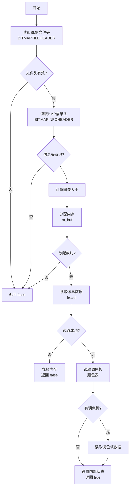

#### 带注释源码

```cpp
// 头文件中仅提供声明，实现通常在对应的 .cpp 文件中
// 根据函数签名和 BMP 文件格式，推断的实现逻辑如下：

bool pixel_map::load_from_bmp(FILE* fd)
{
    // Step 1: 验证文件指针有效性
    if (fd == 0)
    {
        return false;
    }

    // Step 2: 读取 BMP 文件头 (14 bytes)
    BITMAPFILEHEADER bmp_file_header;
    if (fread(&bmp_file_header, sizeof(BITMAPFILEHEADER), 1, fd) != 1)
    {
        return false;
    }

    // Step 3: 验证 BMP 标识 "BM"
    if (bmp_file_header.bfType != 0x4D42) // 'BM' in little-endian
    {
        return false;
    }

    // Step 4: 读取 BMP 信息头 (BITMAPINFOHEADER)
    // 支持多种信息头版本（通常为 40 字节的 BITMAPINFOHEADER）
    BITMAPINFOHEADER bmp_info_header;
    if (fread(&bmp_info_header, sizeof(BITMAPINFOHEADER), 1, fd) != 1)
    {
        return false;
    }

    // Step 5: 验证图像尺寸有效性
    if (bmp_info_header.biWidth == 0 || bmp_info_header.biHeight == 0)
    {
        return false;
    }

    // Step 6: 销毁现有资源（如果已分配）
    destroy();

    // Step 7: 计算颜色深度
    unsigned bits_per_pixel = bmp_info_header.biBitCount;
    m_bpp = bits_per_pixel;

    // Step 8: 计算图像行宽（考虑字节对齐）
    unsigned row_len = calc_row_len(bmp_info_header.biWidth, bits_per_pixel);
    unsigned image_size = row_len * abs(bmp_info_header.biHeight);
    
    // Step 9: 分配缓冲区
    m_buf = (unsigned char*)malloc(image_size);
    if (m_buf == 0)
    {
        return false;
    }

    // Step 10: 读取像素数据
    // BMP 图像通常倒置存储（底部到顶部），需要根据情况处理
    if (fread(m_buf, 1, image_size, fd) != image_size)
    {
        free(m_buf);
        m_buf = 0;
        return false;
    }

    // Step 11: 处理调色板（颜色表）
    // 8-bit 和 16-bit 图像可能有调色板
    unsigned palette_size = 0;
    if (bits_per_pixel <= 8)
    {
        unsigned clr_used = (bmp_info_header.biClrUsed != 0) 
                             ? bmp_info_header.biClrUsed 
                             : (1 << bits_per_pixel);
        palette_size = clr_used * sizeof(RGBQUAD);
    }

    // Step 12: 创建 BITMAPINFO 结构
    // 包含信息头 + 颜色表 + 像素数据指针
    unsigned header_size = calc_header_size(&bmp_info_header);
    m_bmp = (BITMAPINFO*)malloc(header_size + palette_size);
    if (m_bmp == 0)
    {
        free(m_buf);
        m_buf = 0;
        return false;
    }

    // 复制信息头
    memcpy(&m_bmp->bmiHeader, &bmp_info_header, sizeof(BITMAPINFOHEADER));

    // Step 13: 读取颜色表（调色板）
    if (palette_size > 0)
    {
        if (fread(m_bmp->bmiColors, 1, palette_size, fd) != palette_size)
        {
            free(m_buf);
            free(m_bmp);
            m_buf = 0;
            m_bmp = 0;
            return false;
        }
    }

    // Step 14: 设置内部状态
    m_img_size = image_size;
    m_full_size = header_size + palette_size + image_size;
    m_is_internal = true;

    return true;
}
```

#### 相关函数上下文

该函数通常与以下函数配合使用：

- `save_as_bmp(FILE* fd)`：保存为 BMP 文件
- `load_from_bmp(const char* filename)`：通过文件名加载，内部可能调用 FILE* 版本
- `create(unsigned width, unsigned height, org_e org, unsigned clear_val)`：创建空白图像
- `bitmap_info()`：获取 BMP 信息结构指针
- `destroy()`：释放内部资源

#### 依赖的私有方法

- `create_from_bmp(BITMAPINFO *bmp)`：从已解析的 BMP 结构创建图像
- `calc_row_len(unsigned width, unsigned bits_per_pixel)`：计算行字节长度
- `calc_header_size(BITMAPINFO *bmp)`：计算头大小


### `pixel_map.save_as_bmp(FILE*)`

将像素映射对象的当前内容保存为BMP格式文件到指定的文件指针，支持多种颜色深度（8/16/24/32/48/64位）。

参数：
- `fd`：`FILE*`，文件指针，指向已打开的FILE结构，用于写入BMP数据

返回值：`bool`，操作成功返回 true，失败返回 false

#### 流程图

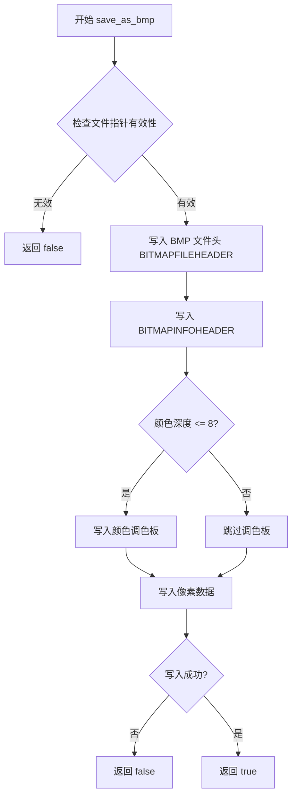

#### 带注释源码

```cpp
// 头文件中的声明（位于 agg 命名空间的 pixel_map 类中）
// 文件: agg_win32_bmp.h (推断)

// 方法声明（用户提供的代码第59行）
bool save_as_bmp(FILE* fd) const;

// 由于用户仅提供了头文件声明，未提供实现源码，
// 以下为基于 Anti-Grain Geometry 库架构的典型实现逻辑：

/*
bool pixel_map::save_as_bmp(FILE* fd) const
{
    // 1. 参数校验
    if (fd == 0)
    {
        return false;
    }

    // 2. 检查位图信息是否有效
    if (m_bmp == 0)
    {
        return false;
    }

    // 3. 构造并写入 BMP 文件头
    BITMAPFILEHEADER bmp_fh;
    bmp_fh.bfType = 0x4D42;        // 'BM' 标记
    bmp_fh.bfSize = m_full_size + sizeof(BITMAPFILEHEADER);
    bmp_fh.bfReserved1 = 0;
    bmp_fh.bfReserved2 = 0;
    bmp_fh.bfOffBits = sizeof(BITMAPFILEHEADER) + 
                       calc_header_size(m_bmp) + 
                       calc_palette_size(m_bmp);

    // 写入文件头（14字节）
    if (fwrite(&bmp_fh, 1, sizeof(BITMAPFILEHEADER), fd) != 
        sizeof(BITMAPFILEHEADER))
    {
        return false;
    }

    // 4. 写入 BITMAPINFO（包含InfoHeader + 调色板）
    unsigned header_size = calc_header_size(m_bmp);
    if (fwrite(m_bmp, 1, header_size, fd) != header_size)
    {
        return false;
    }

    // 5. 写入像素数据
    if (m_buf != 0 && m_img_size > 0)
    {
        if (fwrite(m_buf, 1, m_img_size, fd) != m_img_size)
        {
            return false;
        }
    }

    // 6. 返回成功状态
    return true;
}
*/
```


### `pixel_map.load_from_bmp`

该函数是 `agg::pixel_map` 类的成员方法，用于从指定的BMP文件名加载图像数据到底层像素缓冲区，支持多种颜色深度的BMP格式（8/16/24/32/48/64位），函数内部通过打开文件、读取BMP文件头和位图信息、分配内存、读取像素数据等步骤完成加载过程。

参数：
- `filename`：`const char*`，BMP文件的路径名，指向以null结尾的字符串

返回值：`bool`，返回true表示成功加载BMP文件，返回false表示加载失败（可能由于文件不存在、格式错误或内存分配失败等原因）

#### 流程图

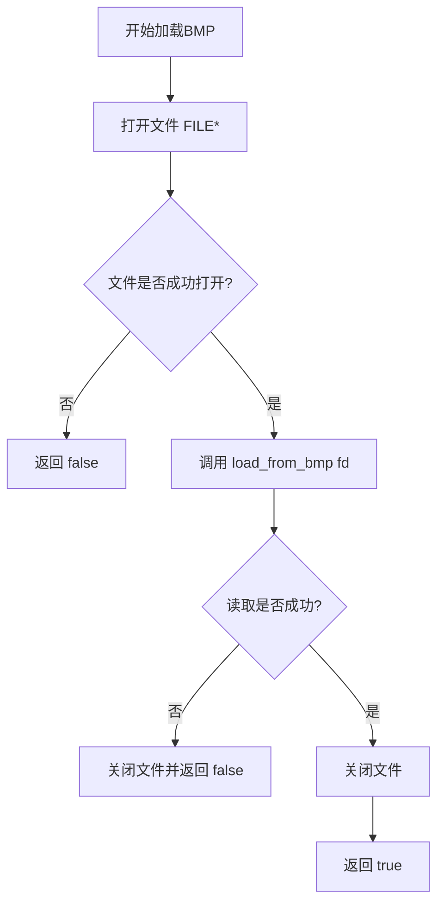

#### 带注释源码

```cpp
// 从文件加载BMP图像
// 参数: filename - BMP文件路径名
// 返回值: true-成功, false-失败
bool load_from_bmp(const char* filename)
{
    // 使用标准C文件I/O打开文件
    // "rb" 表示二进制读取模式
    FILE* fd = fopen(filename, "rb");
    
    // 检查文件是否成功打开
    if (fd == 0)
    {
        // 文件不存在或无权限访问，返回失败
        return false;
    }
    
    // 复用FILE*版本的加载函数
    // 该函数会读取BMP文件头、位图信息和像素数据
    bool ret = load_from_bmp(fd);
    
    // 关闭文件句柄
    fclose(fd);
    
    // 返回内部加载结果
    return ret;
}
```

#### 补充说明

1. **设计目标**：提供一个高级的文件名接口，封装底层的文件操作细节，对外隐藏文件I/O的复杂性。

2. **错误处理**：
   - 文件打开失败时返回 `false`
   - 内部委托给 `load_from_bmp(FILE* fd)` 处理具体的BMP解析错误

3. **数据流**：
   ```
   文件名 → fopen() → FILE* → load_from_bmp(FILE*) 
   → 解析BMP头 → 分配缓冲区 → 读取像素数据 → pixel_map对象
   ```

4. **与其他方法的关系**：
   - 依赖于 `load_from_bmp(FILE* fd)` 实现真正的加载逻辑
   - 可能调用私有的 `create_from_bmp(BITMAPINFO* bmp)` 完成内部数据结构的创建

5. **潜在优化空间**：
   - 当前实现每次都打开关闭文件，可考虑增加文件缓存机制
   - 错误信息不够详细，建议添加错误码或错误消息输出以便调试
   - 未检查文件大小，可能导致大文件处理时的内存问题


### pixel_map.save_as_bmp(const char*)

该函数用于将像素图数据保存为BMP格式的文件，通过文件名指定保存路径，内部打开文件后调用FILE*版本的保存函数完成实际写入操作。

参数：

- `filename`：`const char*`，BMP文件的完整路径字符串，表示要保存的目标文件路径

返回值：`bool`，如果文件成功保存返回true，否则返回false

#### 流程图

```mermaid
flowchart TD
    A[开始保存BMP文件] --> B[打开文件: fopen filename, wb]
    B --> C{文件是否成功打开?}
    C -->|否| D[返回false]
    C -->|是| E[调用save_as_bmp FILE*版本]
    E --> F{保存是否成功?}
    F -->|否| G[关闭文件]
    G --> D
    F -->|是| H[关闭文件]
    H --> I[返回true]
```

#### 带注释源码

```
// 保存像素图为BMP文件（基于文件名的版本）
// 参数: filename - 要保存的BMP文件路径
// 返回: bool - 成功返回true, 失败返回false
bool save_as_bmp(const char* filename) const
{
    // 以二进制写入模式打开文件
    FILE* fd = fopen(filename, "wb");
    
    // 检查文件是否成功打开
    if (fd == 0)
    {
        // 文件打开失败,返回false
        return false;
    }
    
    // 调用基于文件指针的save_as_bmp版本进行实际保存
    bool ret = save_as_bmp(fd);
    
    // 关闭文件句柄
    fclose(fd);
    
    // 返回保存操作的结果
    return ret;
}
```

#### 补充说明

该函数是`pixel_map`类的公共成员函数，具有const修饰符（不会修改对象内部状态）。其实现遵循经典的"打开-操作-关闭"模式，通过封装底层的文件操作，提供了更友好的基于文件名的接口。实际的BMP写入逻辑由`save_as_bmp(FILE* fd)`重载版本完成，该函数需要访问类的私有成员（如m_bmp、m_buf等）来获取位图头信息和像素数据。


### pixel_map.draw (重载版本1)

将像素图绘制到Windows设备上下文，支持指定设备区域和位图区域。

参数：

- `h_dc`：`HDC`，Windows设备上下文句柄，目标绘图表面
- `device_rect`：`const RECT*`，目标设备上的矩形区域（可选，为nullptr时使用整个设备）
- `bmp_rect`：`const RECT*`，位图上要绘制的矩形区域（可选，为nullptr时使用整个位图）

返回值：`void`，无返回值

#### 流程图

```mermaid
flowchart TD
    A[开始 draw] --> B{device_rect是否为nullptr}
    B -->|是| C[使用整个设备区域]
    B -->|否| D[使用指定的device_rect]
    D --> E{bmp_rect是否为nullptr}
    E -->|是| F[使用整个位图区域]
    E -->|否| G[使用指定的bmp_rect]
    C --> H[调用Windows GDI函数绘制位图]
    F --> H
    G --> H
    H --> I[结束]
```

#### 带注释源码

```cpp
//----------------------------------------------------------------------------
// 绘制方法重载版本1
// 将pixel_map中的位图数据绘制到Windows设备上下文
// 参数:
//   h_dc - Windows设备上下文句柄
//   device_rect - 目标设备上的绘制区域,可选参数
//   bmp_rect - 源位图上的区域,可选参数
//----------------------------------------------------------------------------
void draw(HDC h_dc, 
          const RECT* device_rect=0, 
          const RECT* bmp_rect=0) const;
```

---

### pixel_map.draw (重载版本2)

将像素图绘制到Windows设备上下文，支持指定坐标和缩放。

参数：

- `h_dc`：`HDC`，Windows设备上下文句柄，目标绘图表面
- `x`：`int`，目标绘制位置的X坐标
- `y`：`int`，目标绘制位置的Y坐标
- `scale`：`double`，缩放比例（默认1.0，表示原大小）

返回值：`void`，无返回值

#### 流程图

```mermaid
flowchart TD
    A[开始 draw] --> B[验证h_dc有效性]
    B --> C{scale是否大于0}
    C -->|否| D[使用默认scale=1.0]
    C -->|是| E[使用指定的scale]
    D --> F[计算目标绘制区域]
    E --> F
    F --> G[根据x,y坐标和scale计算目标矩形]
    G --> H[调用Windows GDI函数绘制缩放位图]
    H --> I[结束]
```

#### 带注释源码

```cpp
//----------------------------------------------------------------------------
// 绘制方法重载版本2
// 将pixel_map中的位图数据绘制到Windows设备上下文的指定位置
// 支持缩放绘制
// 参数:
//   h_dc - Windows设备上下文句柄
//   x - 目标绘制位置的X坐标
//   y - 目标绘制位置的Y坐标
//   scale - 缩放比例,默认值为1.0表示原大小
//----------------------------------------------------------------------------
void draw(HDC h_dc, int x, int y, double scale=1.0) const;
```

---

### 关键组件信息

| 组件名称 | 一句话描述 |
|---------|-----------|
| pixel_map | 管理位图内存和Windows BMP格式读写的核心类 |
| HDC | Windows设备上下文句柄，图形输出的抽象 |
| RECT | Windows矩形结构，定义坐标区域 |
| HBITMAP | Windows位图句柄，标识位图对象 |

### 潜在技术债务与优化空间

1. **缺乏实现细节**：头文件中仅有方法声明，无法分析实际绘制逻辑，建议补充实现源码
2. **错误处理缺失**：方法声明中无错误返回值和异常机制，绘制失败时调用方无法感知
3. **平台依赖**：直接使用Windows GDI API，限制了跨平台能力
4. **const设计**：第二个重载参数中的scale非const，表明状态可变，但语义上应为只读操作
5. **内存管理隐患**：未体现位图创建失败时的内存回滚机制


### pixel_map.blend()

描述：`pixel_map` 类提供了两个 `blend()` 方法重载，用于将像素映射（位图）混合（绘制）到 Windows 设备上下文（HDC）中。第一个重载通过矩形区域指定目标和源区域，第二个重载通过坐标和缩放因子指定绘制位置和大小。两个方法都支持透明混合效果。

参数：

- `h_dc`：`HDC`，Windows 设备上下文句柄，用于指定绘制目标设备
- `device_rect`：`const RECT*`，指向目标设备矩形区域的指针，指定在设备上的绘制区域，默认为 0（表示整个设备区域）
- `bmp_rect`：`const RECT*`，指向位图源矩形区域的指针，指定从像素映射中读取的区域，默认为 0（表示整个位图区域）
- `x`：`int`，目标绘制的 x 坐标（用于第二个重载）
- `y`：`int`，目标绘制的 y 坐标（用于第二个重载）
- `scale`：`double`，缩放因子，默认为 1.0，表示不缩放（用于第二个重载）

返回值：`void`，无返回值

#### 流程图

```mermaid
flowchart TD
    A[开始 blend] --> B{判断重载版本}
    B -->|版本1: 矩形参数| C[获取 device_rect 和 bmp_rect]
    B -->|版本2: 坐标参数| D[计算目标矩形: x, y, width*scale, height*scale]
    C --> E[调用 Windows GDI 函数进行混合绘制]
    D --> E
    E --> F[结束 blend]
    
    C -.-> C1[如果 device_rect=0 使用整个设备区域]
    C -.-> C2[如果 bmp_rect=0 使用整个位图区域]
    D -.-> D1[根据 scale 计算缩放后的宽度和高度]
```

#### 带注释源码

```cpp
//----------------------------------------------------------------------------
// blend() 方法重载 - 像素映射混合绘制到设备上下文
//----------------------------------------------------------------------------

// 方法1: 通过矩形区域进行混合绘制
// 参数:
//   h_dc: 目标设备上下文句柄
//   device_rect: 目标设备上的矩形区域(可选,为0则使用整个设备)
//   bmp_rect: 位图源矩形区域(可选,为0则使用整个位图)
void blend(HDC h_dc, 
           const RECT* device_rect=0, 
           const RECT* bmp_rect=0) const;

// 方法2: 通过坐标和缩放进行混合绘制
// 参数:
//   h_dc: 目标设备上下文句柄
//   x, y: 目标位置的坐标
//   scale: 缩放因子(默认为1.0,即原大小)
//   功能: 将像素映射绘制到指定位置,可选择缩放
void blend(HDC h_dc, int x, int y, double scale=1.0) const;
```


### `pixel_map.buf()`

获取像素缓冲区的指针，允许直接访问和操作像素数据。该方法返回指向内部像素存储区的指针，调用者可以使用此指针进行低级别的像素读写操作。

参数：
- （无参数）

返回值：`unsigned char*`，返回指向像素数据缓冲区的指针，缓冲区的大小由图像宽度、高度和每像素位数决定。

#### 流程图

```mermaid
flowchart TD
    A[开始调用 buf] --> B[直接返回成员变量 m_buf]
    B --> C[返回缓冲区指针给调用者]
```

#### 带注释源码

```
// 获取像素缓冲区指针
// 返回值: unsigned char* - 指向像素数据的指针
unsigned char* buf();
```


### `pixel_map.width()`

该函数是 `pixel_map` 类的成员方法，用于返回像素地图的宽度（以像素为单位）。它是一个只读访问器方法，不修改对象状态。

参数： 无

返回值：`unsigned`，返回像素地图的宽度值（以像素为单位）

#### 流程图

```mermaid
flowchart TD
    A[开始调用 width] --> B{检查对象是否有效}
    B -->|是| C[返回成员变量 m_bmp->bmiHeader.biWidth]
    B -->|否| D[返回 0]
    C --> E[结束]
    D --> E
```

#### 带注释源码

```
// 获取像素地图的宽度
// 返回值：unsigned - 像素宽度值
// 该方法为const保证，不会修改对象状态
unsigned pixel_map::width() const
{
    // 从BITMAPINFO结构中获取图像宽度
    // biWidth可能为负值（表示从左到右或从右到左的扫描方向）
    // 但通常返回绝对值
    return m_bmp->bmiHeader.biWidth;
}
```


### `pixel_map.height()`

该方法是一个 const 成员函数，用于获取 pixel_map 对象所管理的位图图像的高度（以像素为单位），不修改对象状态。

参数：无参数。

返回值：`unsigned`，返回位图的高度值（像素数）。

#### 流程图

```mermaid
flowchart TD
    A[开始] --> B[获取图像高度信息]
    B --> C{高度是否有效}
    C -- 是 --> D[返回高度值]
    C -- 否 --> E[返回0或默认值]
    D --> F[结束]
    E --> F
```

注：由于没有提供实现源码，流程图基于常见逻辑推断。实际实现可能直接返回存储的高度值。

#### 带注释源码

```cpp
// 获取位图高度（像素）
// 返回值：unsigned 类型，表示图像的高度像素数
unsigned height() const;
```


### `pixel_map.stride`

该方法用于获取像素地图（pixel_map）的行跨度（stride），即图像缓冲区中相邻两行像素数据之间的字节偏移量，常用于图像遍历和内存操作。

参数：无

返回值：`int`，返回图像像素行的跨度（以字节为单位），用于计算每行像素的起始位置。

#### 流程图

```mermaid
flowchart TD
    A[开始 stride] --> B{检查是否使用内部位图}
    B -->|是| C[从 m_bmp->bmiHeader 计算 stride]
    B -->|否| D[使用 m_buf 计算跨度]
    C --> E[返回计算得到的 stride 值]
    D --> E
```

#### 带注释源码

```
//----------------------------------------------------------------------------
// 获取像素地图的行跨度
// 行跨度是指图像缓冲区中相邻两行起始位置之间的字节偏移量
// 在 BMP 格式中，行跨度必须是 4 字节对齐的
//----------------------------------------------------------------------------
int pixel_map::stride() const
{
    // 如果存在 BITMAPINFO 结构，则根据其信息计算行跨度
    // BMP 格式要求每行数据必须是 4 字节（32位）对齐
    if(m_bmp)
    {
        // 计算公式：((宽度 * 每像素位数 + 31) / 32) * 4
        // 或者使用 AGG 的 calc_row_len 静态方法
        return calc_row_len(m_bmp->bmiHeader.biWidth, m_bpp);
    }
    
    // 如果没有 BITMAPINFO（例如外部缓冲区情况）
    // 返回 0 或者基于其他方式计算的值
    return 0;
}

//----------------------------------------------------------------------------
// 相关的静态辅助函数（用于计算行长度/跨度）
//----------------------------------------------------------------------------
unsigned pixel_map::calc_row_len(unsigned width, unsigned bits_per_pixel)
{
    // 计算每行像素所需的字节数，并确保 4 字节对齐
    // 这是 BMP 格式的严格要求
    return ((width * bits_per_pixel + 31) & ~31) >> 3;
}
```

#### 备注

在 Anti-Grain Geometry 库中，`stride()` 方法的实现通常基于以下逻辑：
- BMP 格式要求行数据必须是 4 字节（32位）对齐
- 计算公式：`stride = ((width * bpp + 31) / 32) * 4` 或等价的位运算
- 该方法用于在图像处理过程中正确遍历像素数据，确保跨平台兼容性


### pixel_map.bpp()

获取每像素位数（bits per pixel），返回当前像素格式的位深度。

参数：
- （无）

返回值：`unsigned`，返回每像素的位数（例如8位、24位、32位等）。

#### 流程图

```mermaid
graph TD
    A[开始] --> B[返回成员变量 m_bpp]
    B --> C[结束]
```

#### 带注释源码

```cpp
// 获取每像素位数
// 返回值：unsigned，表示每像素的位数（bits per pixel）
unsigned bpp() const { 
    return m_bpp; // 返回内部存储的每像素位数，该值在create或attach_to_bmp时设置
}
```


### pixel_map.calc_full_size()

静态计算位图的完整大小（包括文件头、颜色表和像素数据）

参数：

- `bmp`：`BITMAPINFO *`，指向 BITMAPINFO 结构体的指针，用于获取位图的宽度、高度、颜色深度等信息

返回值：`unsigned`，返回计算得到的完整位图大小（字节数）

#### 流程图

```mermaid
flowchart TD
    A[开始 calc_full_size] --> B{检查 bmp 参数}
    B -->|bmp 为空| C[返回 0]
    B -->|bmp 有效| D[获取宽度 bmp->bmiHeader.biWidth]
    D --> E[获取高度 bmp->bmiHeader.biHeight]
    E --> F[获取颜色位数 bmp->bmiHeader.biBitCount]
    F --> G[计算行长度 calc_row_len]
    G --> H[计算行数高度]
    H --> I[计算颜色表大小]
    I --> J[计算文件头大小]
    J --> K[计算总大小 = 头 + 调色板 + 像素数据]
    K --> L[返回总大小]
    C --> L
```

#### 带注释源码

```
//----------------------------------------------------------------------------
// 静态函数: calc_full_size
// 功能: 计算位图的完整大小（以字节为单位）
// 参数: 
//   bmp - BITMAPINFO 结构体指针，包含位图参数
// 返回值:
//   unsigned - 位图的完整大小（字节），失败返回0
//----------------------------------------------------------------------------
static unsigned calc_full_size(BITMAPINFO *bmp)
{
    // 参数有效性检查
    if (bmp == 0) return 0;
    
    // 获取位图头信息
    // biSizeImage 可能为0（当使用BI_RGB压缩时），需要手动计算
    unsigned width  = bmp->bmiHeader.biWidth;
    unsigned height = abs(bmp->bmiHeader.biHeight);  // 使用绝对值
    unsigned bpp    = bmp->bmiHeader.biBitCount;
    
    // 计算行长度（行对齐到DWORD边界）
    unsigned row_len = ((width * bpp + 31) & ~31) >> 3;
    
    // 计算像素数据大小
    unsigned image_size = row_len * height;
    
    // 计算颜色表（调色板）大小
    unsigned palette_size = 0;
    unsigned clr_used = bmp->bmiHeader.biClrUsed;
    if (clr_used > 0 && bpp <= 8) {
        palette_size = clr_used * sizeof(RGBQUAD);
    } else if (bpp <= 8) {
        // 如果没有指定颜色数，最大为2^bpp
        palette_size = (1 << bpp) * sizeof(RGBQUAD);
    }
    
    // 计算BITMAPINFOHEADER大小
    // 标准大小是40字节
    unsigned header_size = sizeof(BITMAPINFOHEADER);
    
    // 计算总大小 = 头 + 调色板 + 像素数据
    // 注意：不包括文件头（BITMAPFILEHEADER），因为这是DIB格式
    return header_size + palette_size + image_size;
}
```


### `pixel_map.calc_header_size`

该静态方法用于根据传入的 BITMAPINFO 结构体计算 BMP 图像头部（包括文件头、信息头和调色板）的总字节大小，常用于内存分配和图像处理前的尺寸计算。

参数：

- `bmp`：`BITMAPINFO *`，指向 BITMAPINFO 结构体的指针，包含图像的宽度、高度、位深度等信息，用于计算头部大小

返回值：`unsigned`，返回 BMP 头部占用的总字节数

#### 流程图

```mermaid
flowchart TD
    A[开始计算头部大小] --> B{检查 bmp 参数是否为空}
    B -->|是| C[返回 0]
    B -->|否| D[获取 biSize 值<br/>即 BITMAPINFOHEADER 大小]
    D --> E{检查位深度}
    E -->|≤ 8位| F[计算调色板大小<br/>调用 calc_palette_size]
    E -->|其他| G[调色板大小为 0]
    F --> H[头部大小 = biSize + 调色板大小]
    G --> H
    H --> I[返回头部总大小]
```

#### 带注释源码

```
// 头文件中的声明（用户提供的代码中仅有声明，无实现）
static unsigned calc_header_size(BITMAPINFO *bmp);

// 该方法在实际实现中通常如下：
static unsigned pixel_map::calc_header_size(BITMAPINFO *bmp)
{
    // 参数检查：如果传入的指针为空，返回0
    if (bmp == 0) return 0;
    
    // 获取 BITMAPINFOHEADER 的大小（通常为40字节）
    unsigned header_size = bmp->bmiHeader.biSize;
    
    // 根据位深度计算调色板大小
    // 如果位深度 <= 8，则存在调色板
    unsigned clr_used = bmp->bmiHeader.biClrUsed;
    unsigned bits_per_pixel = bmp->bmiHeader.biBitCount;
    
    // 计算调色板条目数
    unsigned palette_size = calc_palette_size(clr_used, bits_per_pixel);
    
    // 头部总大小 = BITMAPINFOHEADER大小 + 调色板大小
    return header_size + palette_size;
}
```

**注意**：用户提供的代码仅包含头文件声明（.h），未包含实现文件（.cpp）。上述实现代码是根据该函数的用途和 BMP 文件格式规范推断的，供理解其功能参考使用。实际实现可能略有差异。


### `pixel_map.calc_palette_size`

该函数包含两个重载版本，用于静态计算BMP图像调色板（颜色表）所需的字节大小。调色板大小取决于颜色深度和实际使用的颜色数量。

#### 重载版本1：`calc_palette_size(unsigned clr_used, unsigned bits_per_pixel)`

参数：

- `clr_used`：`unsigned`，指定BMP图像中实际使用的颜色数量（即BITMAPINFOHEADER中的biClrUsed字段）
- `bits_per_pixel`：`unsigned`，指定像素位数（8、16、24、32等），对应BMP图像的颜色深度

返回值：`unsigned`，返回调色板所需的总字节数

#### 重载版本2：`calc_palette_size(BITMAPINFO *bmp)`

参数：

- `bmp`：`BITMAPINFO*`，指向包含BMP图像信息的BITMAPINFO结构体指针

返回值：`unsigned`，返回调色板所需的总字节数

#### 流程图

```mermaid
flowchart TD
    A[开始 calc_palette_size] --> B{判断重载版本}
    
    B -->|版本1: 两个参数| C[接收 clr_used 和 bits_per_pixel]
    B -->|版本2: BITMAPINFO*| D[从 bmp 结构提取 clr_used 和 bits_per_pixel]
    
    C --> E[计算调色板大小]
    D --> E
    
    E --> F{判断颜色深度}
    
    F -->|8位色| G[调色板大小 = clr_used × 4字节]
    F -->|其他位深| H[调色板大小 = 0]
    
    G --> I[返回计算结果]
    H --> I
    
    I --> J[结束]
    
    style G fill:#90EE90
    style H fill:#FFB6C1
```

#### 带注释源码

```cpp
//============================================================================
// 函数: calc_palette_size (重载版本1)
// 描述: 根据指定的颜色数和位深度静态计算调色板大小
// 参数:
//   clr_used       - unsigned, BMP图像中实际使用的颜色数量
//   bits_per_pixel - unsigned, 像素位数 (如8, 16, 24, 32)
// 返回值:
//   unsigned       - 调色板所需字节数
//============================================================================
static unsigned calc_palette_size(unsigned clr_used, unsigned bits_per_pixel)
{
    // 仅在8位色（256色调色板）模式下才需要调色板
    // 每个调色板条目占4字节 (BGRA格式)
    // 对于16/24/32位色深，通常不使用调色板（直接存储像素颜色值）
    if(bits_per_pixel == 8)
    {
        return clr_used * 4;  // 4字节/颜色 (Blue, Green, Red, Reserved)
    }
    return 0;  // 非8位色深返回0，无需调色板
}

//============================================================================
// 函数: calc_palette_size (重载版本2)
// 描述: 从BITMAPINFO结构中提取参数并计算调色板大小
// 参数:
//   bmp - BITMAPINFO*, 指向BMP图像信息结构体的指针
// 返回值:
//   unsigned - 调色板所需字节数
//============================================================================
static unsigned calc_palette_size(BITMAPINFO *bmp)
{
    // 安全检查：确保指针有效
    if(bmp == 0)
    {
        return 0;
    }
    
    // 从BITMAPINFOHEADER中提取biClrUsed（实际使用的颜色数）
    // 并调用第一个重载版本进行实际计算
    return calc_palette_size(bmp->bmiHeader.biClrUsed, 
                             bmp->bmiHeader.biBitCount);
}
```


### `pixel_map.calc_img_ptr`

该函数是一个静态成员方法，用于在内存中静态计算位图（Bitmap）像素数据区域的起始地址。它通过获取位图信息头的大小并加上调色板（Palette）的大小来计算偏移量，从而定位图像像素数据的开始位置。

参数：

- `bmp`：`BITMAPINFO *`，指向 Windows 位图信息结构（包含位图头和可选调色板数据）的指针。

返回值：`unsigned char *`，返回指向位图像素数据起始字节的指针。

#### 流程图

```mermaid
graph TD
    A([开始]) --> B[输入: BITMAPINFO *bmp]
    B --> C[将 bmp 指针强制转换为 unsigned char *]
    C --> D[调用 calc_header_size(bmp) 计算头部长度]
    D --> E{计算偏移量}
    E --> F[头部长度 = bmiHeader.biSize + 调色板大小]
    F --> G[图像指针 = 基础地址 + 头部长度]
    G --> H([返回图像指针])
    
    subgraph 依赖方法
    D -.-> D1[calc_header_size]
    D1 --> D2[calc_palette_size]
    end
```

#### 带注释源码

```cpp
//----------------------------------------------------------------------------
// 静态计算图像数据指针
//----------------------------------------------------------------------------
static unsigned char* calc_img_ptr(BITMAPINFO *bmp)
{
    // 1. 将指向 BITMAPINFO 结构的指针强制转换为 unsigned char 指针
    //    这样可以进行字节级别的偏移计算。
    // 2. 调用 calc_header_size 计算位图头(InfoHeader) + 调色板(Palette)的总大小。
    // 3. 将基础地址加上计算出的偏移量，即得到像素数据的起始位置。
    return (unsigned char*)bmp + calc_header_size(bmp);
}
```

---

#### 关键组件信息

- **BITMAPINFO 结构**：Windows API 定义的结构体，包含 `BITMAPINFOHEADER` 和颜色表。
- **calc_header_size**：内部依赖的静态方法，用于精确计算头部的总字节大小。
- **calc_palette_size**：内部依赖的静态方法，用于根据位深和颜色数计算调色板大小。

#### 潜在的技术债务或优化空间

1.  **空指针检查**：当前实现直接进行指针运算，传入空指针（`nullptr`）会导致程序崩溃。添加基本的空指针检查（`if (bmp == nullptr) return nullptr;`）可以提高健壮性。
2.  **异常安全**：虽然该库注重性能，但作为静态工具函数，缺乏错误状态反馈机制。如果传入的 `bmp` 结构损坏，计算出的指针可能无效。

#### 其它备注

- **设计目标**：该函数旨在提供对 BMP 内存块中数据区域的直接访问，是底层光栅操作的关键辅助函数。
- **外部依赖**：完全依赖于 `BITMAPINFO` 的内存布局规则（Header + Palette + Pixels）。
- **调用场景**：通常在 `attach_to_bmp` 或 `create` 方法内部被调用，用于初始化 `m_buf` 成员变量。


### `pixel_map.create_bitmap_info`

静态方法，用于根据指定的宽度、高度和位深度创建并初始化BITMAPINFO结构体，为后续位图操作分配必要的文件头和颜色表空间。

参数：

- `width`：`unsigned`，位图的宽度，以像素为单位
- `height`：`unsigned`，位图的高度，以像素为单位
- `bits_per_pixel`：`unsigned`，位深度，指定每个像素所占的位数（如8、16、24、32等）

返回值：`BITMAPINFO*`，指向新创建的BITMAPINFO结构体的指针，调用者负责在使用完毕后释放该内存

#### 流程图

```mermaid
flowchart TD
    A[开始 create_bitmap_info] --> B{检查位深度有效性}
    B -->|无效位深度| C[返回 nullptr]
    B -->|有效位深度| D[计算颜色表大小]
    D --> E[计算BITMAPINFO结构体总大小]
    E --> F[使用 new 分配内存]
    F --> G[清零初始化内存]
    G --> H[设置 BITMAPINFOHEADER]
    H --> I[设置 biSize biWidth biHeight biPlanes biBitCount]
    I --> J{位深度 ≤ 8?}
    J -->|是| K[计算并设置颜色表大小]
    J -->|否| L[跳过颜色表设置]
    K --> M[设置 biClrUsed]
    L --> M
    M --> N[返回 BITMAPINFO 指针]
    
    style C fill:#ffcccc
    style N fill:#ccffcc
```

#### 带注释源码

```cpp
//----------------------------------------------------------------------------
// 静态方法：create_bitmap_info
// 功能：根据指定尺寸和位深度创建BITMAPINFO结构体
// 参数：
//   width - 位图宽度（像素）
//   height - 位图高度（像素）
//   bits_per_pixel - 位深度（8/16/24/32等）
// 返回：BITMAPINFO指针，需调用者释放
//----------------------------------------------------------------------------
static BITMAPINFO* pixel_map::create_bitmap_info(unsigned width, 
                                                  unsigned height, 
                                                  unsigned bits_per_pixel)
{
    // 计算颜色表大小（当位深度≤8时才有颜色表）
    // 颜色表项数 = 2^bits_per_pixel，但受clrUsed字段影响
    unsigned clr_table_size = calc_palette_size(0, bits_per_pixel);
    
    // 计算BITMAPINFO结构体总大小
    // 包括BITMAPINFOHEADER + 颜色表 + 像素数据指针
    unsigned header_size = sizeof(BITMAPINFOHEADER) + clr_table_size;
    
    // 分配内存（使用operator new分配，未构造对象）
    BITMAPINFO* bmp = static_cast<BITMAPINFO*>(::operator new(header_size));
    
    if (bmp == 0)
    {
        return 0;  // 内存分配失败，返回空指针
    }
    
    // 使用memset清零，避免未初始化数据
    memset(bmp, 0, header_size);
    
    // 获取BITMAPINFOHEADER指针并填充
    BITMAPINFOHEADER& bmh = bmp->bmiHeader;
    
    // biSize: BITMAPINFOHEADER结构体大小
    bmh.biSize = sizeof(BITMAPINFOHEADER);
    
    // biWidth: 位图宽度（正向扫描行）
    bmh.biWidth = width;
    
    // biHeight: 位图高度
    // 正值表示从底到顶（DIB格式），负值表示从顶到底
    // 这里使用正值，保持与stride计算的一致性
    bmh.biHeight = height;
    
    // biPlanes: 目标设备平面数，始终为1
    bmh.biPlanes = 1;
    
    // biBitCount: 每像素位数
    bmh.biBitCount = static_cast<WORD>(bits_per_pixel);
    
    // biCompression: 压缩类型
    // BI_RGB (0) 表示无压缩
    bmh.biCompression = BI_RGB;
    
    // biSizeImage: 像素数据大小
    // 对于BI_RGB格式可以设为0，由系统计算
    bmh.biSizeImage = 0;
    
    // biXPelsPerMeter: 水平分辨率（像素/米）
    bmh.biXPelsPerMeter = 0;
    
    // biYPelsPerMeter: 垂直分辨率（像素/米）
    bmh.biYPelsPerMeter = 0;
    
    // biClrUsed: 颜色表中实际使用的颜色数
    // 对于位深度≤8，设置颜色表大小；否则为0
    bmh.biClrUsed = (bits_per_pixel <= 8) ? (1 << bits_per_pixel) : 0;
    
    // biClrImportant: 重要颜色数，0表示所有颜色都重要
    bmh.biClrImportant = 0;
    
    // 注意：颜色表在BITMAPINFOHEADER之后
    // 对于≤8位深度的位图，这里会包含颜色表数据
    // 颜色表格式为RGBQUAD数组
    
    return bmp;
}
```


### `pixel_map.create_gray_scale_palette`

静态方法，用于创建灰度调色板并将其设置到BITMAPINFO结构中。该函数通常用于初始化位图调色板为灰度模式，以便支持灰度图像显示。

参数：
- `bmp`：`BITMAPINFO*`，指向BITMAPINFO结构的指针，用于接收灰度调色板数据。

返回值：`void`，无返回值。

#### 流程图

```mermaid
graph TD
A[开始] --> B[输入BITMAPINFO指针]
B --> C{检查指针有效性}
C -->|有效| D[获取调色板大小]
C -->|无效| E[直接返回]
D --> F[循环填充调色板为灰度值]
F --> G[设置调色板到BITMAPINFO]
G --> H[结束]
```

#### 带注释源码

由于代码中仅提供函数声明，未包含具体实现，以下为声明部分的源码及基于函数名的功能注释：

```cpp
// 静态方法：创建灰度调色板
// 参数：bmp - 指向BITMAPINFO结构的指针，用于设置灰度调色板
// 返回值：无
static void create_gray_scale_palette(BITMAPINFO *bmp);
```

**补充说明**：根据函数名和常见实现，该函数可能执行以下操作：
1. 检查BITMAPINFO指针是否有效。
2. 根据bits_per_pixel计算调色板条目数（例如8位灰度有256个条目）。
3. 遍历调色板数组，将每个颜色条目的RGB值设置为相同的灰度值（从0到255），以实现灰度渐变。
4. 将调色板数据写入BITMAPINFO的bmiColors字段。

由于原始代码中未提供实现细节，以上流程为基于函数名的逻辑推断。


### `pixel_map.calc_row_len`

该函数是 `pixel_map` 类的静态辅助方法，用于静态计算位图一行像素在内存中占用的字节数（Stride）。在 Windows BMP 格式中，每一行的数据必须对齐到 4 字节（DWORD）的边界，因此该函数会处理对齐逻辑。

参数：
- `width`：`unsigned`，图像的宽度，以像素（pixels）为单位。
- `bits_per_pixel`：`unsigned`，像素的位深度（如 8, 16, 24, 32）。

返回值：`unsigned`，返回计算后的行长度，以字节（bytes）为单位。

#### 流程图

```mermaid
flowchart TD
    A([开始 calc_row_len]) --> B[输入: width, bits_per_pixel]
    B --> C[计算总位数: total_bits = width * bits_per_pixel]
    C --> D[对齐到32位: aligned_bits = ((total_bits + 31) / 32) * 32]
    D --> E[转换为字节: row_len = aligned_bits / 8]
    E --> F([返回 row_len])
```

#### 带注释源码

*注：由于提供的代码片段仅包含类声明（`.h` 文件），未包含具体的实现代码（`.cpp` 文件），以下源码为根据 `pixel_map` 类的功能上下文（Windows BMP 处理）推断的标准实现逻辑。*

```cpp
// 静态方法：计算行长度（Stride）
// 参数：width - 像素宽度, bits_per_pixel - 位深度
// 返回值：对齐到4字节的行字节长度
static unsigned calc_row_len(unsigned width, unsigned bits_per_pixel)
{
    // 1. 计算一行像素的总位数
    unsigned total_bits = width * bits_per_pixel;

    // 2. BMP格式要求行数据必须对齐到 DWORD (4字节, 32位)
    // 公式：((total_bits + 31) / 32) * 32 实际上就是向上取整到32的倍数
    // 这里的实现通常直接使用位运算或整数运算来对齐
    unsigned aligned_bits = ((total_bits + 31) >> 5) << 2; 
    // 另一种等价写法：(((total_bits + 31) / 32) * 4)
    
    // 3. 将对齐后的位数转换为字节数
    return aligned_bits >> 3;
}
```


## 关键组件


### pixel_map 类

封装 Windows BMP 图像操作的核心类，提供图像内存管理、文件加载保存、屏幕绘制等功能。

### org_e 枚举

定义支持的图像颜色深度，包括 8位灰度、16/24/32位彩色、48/64位高彩色等格式。

### 图像缓冲区管理

通过 m_buf、m_bpp、m_img_size、m_full_size 等成员管理图像像素数据的存储和访问，提供 buf()、width()、height()、stride()、bmp() 等访问接口。

### BITMAPINFO 结构管理

使用 BITMAPINFO 结构存储 BMP 文件头和调色板信息，通过 m_bmp 指针管理，提供 bitmap_info()、attach_to_bmp() 等方法。

### DIB Section 创建

create_dib_section 和 create_dib_section_from_args 方法创建与设备无关的位图对象，实现内存位图的高效创建。

### 调色板管理

create_gray_scale_palette 和 calc_palette_size 静态方法处理调色板计算和灰度颜色表生成。

### 图像文件 I/O

load_from_bmp 和 save_as_bmp 方法支持从文件或 FILE 指针读取/写入 BMP 格式图像数据。

### 屏幕绘制功能

draw 和 blend 方法提供在 Windows HDC 上的图像绘制和 Alpha 混合功能，支持缩放和区域指定。

### 静态辅助函数

calc_full_size、calc_header_size、calc_row_len、calc_img_ptr 等静态方法提供 BMP 结构各部分大小的计算功能。


## 问题及建议


### 已知问题

- **裸指针内存管理**：使用 `BITMAPINFO* m_bmp` 和 `unsigned char* m_buf` 裸指针，缺乏 RAII 包装，容易出现内存泄漏或双重释放
- **错误处理机制缺失**：文件读写操作（`load_from_bmp`/`save_as_bmp`）仅返回 bool 错误码，无法获取具体错误信息
- **资源清理依赖手动调用**：需要显式调用 `destroy()` 释放资源，析构函数虽会清理但无异常安全保证
- **Windows 平台强耦合**：代码紧密依赖 `HDC`、`HBITMAP`、`RECT` 等 Windows 特定类型，严重限制跨平台能力
- **参数默认值不合理**：`clear_val` 默认值为 256，但对于 24bpp/32bpp 等格式应为 0，256 可能导致未定义行为
- **缺少移动语义**：拷贝构造和赋值运算符被禁用，但未实现 C++11 移动语义，导致不必要的拷贝开销
- **API 设计不一致**：静态辅助函数（如 `calc_full_size`）与实例方法混在类中，职责划分不清
- **const 正确性问题**：`save_as_bmp` 声明为 const 但执行文件 I/O 操作，违反 const 语义
- **行对齐计算隐患**：`calc_row_len` 未考虑 Windows BMP 的 4 字节对齐要求，可能导致图像数据错误
- **未初始化的隐患**：如果 `create` 失败但对象已构造，后续方法调用可能导致未定义行为

### 优化建议

- **引入智能指针**：使用 `std::unique_ptr` 或自定义 RAII 包装类管理 `m_bmp` 和 `m_buf` 生命周期
- **完善错误处理**：定义专门的异常类或错误码枚举，提供详细错误信息和错误上下文
- **实现移动语义**：添加移动构造和移动赋值运算符，支持 C++11 及以上标准
- **统一参数校验**：在 `create` 等方法中增加参数校验，拒绝不合理的 `width`、`height` 和 `clear_val` 组合
- **分离静态工具函数**：将静态辅助函数提取到独立的名字空间或工具类中，保持类的单一职责
- **移除 const 标记**：将 `save_as_bmp` 的 const 修饰符移除，或重构为返回错误码而非写入文件
- **添加对齐处理**：在 `calc_row_len` 中明确处理 4 字节行对齐，并文档化这一行为
- **提供工厂方法**：考虑将构造函数设为私有，通过静态工厂方法创建对象，统一资源初始化流程


## 其它


### 设计目标与约束

**设计目标：**
该代码作为Anti-Grain Geometry库的Windows BMP图像处理模块，旨在提供跨Windows平台的高效位图创建、内存管理、文件I/O以及设备上下文绑定的完整解决方案，支持多种像素格式（8/16/24/32/48/64位）的图像操作。

**约束条件：**
1. 平台约束：仅限Windows平台，依赖Win32 API
2. 内存约束：需手动管理BITMAPINFO和像素缓冲区的内存生命周期
3. 格式约束：仅支持BMP格式，不支持其他图像格式
4. 调用约定：析构函数需确保资源正确释放，内部拷贝构造和赋值运算符已禁用以防止浅拷贝

### 错误处理与异常设计

**错误处理策略：**
1. 布尔返回值：load_from_bmp、save_as_bmp等I/O操作返回bool类型，true表示成功，false表示失败
2. 空指针检查：bitmap_info()返回BITMAPINFO指针，调用方需检查NULL
3. 资源清理：destroy()方法显式释放内存，析构函数自动调用
4. 无异常抛出：该代码遵循C++早期风格，不使用异常机制，所有错误通过返回值传递

**关键检查点：**
- FILE*参数传入前需确保文件已正确打开
- HDC句柄需确保有效
- create_dib_section失败时返回NULL
- 内存分配失败时m_buf可能为NULL

### 数据流与状态机

**数据流向：**
1. 创建路径：create() → 分配BITMAPINFO和像素缓冲区 → 设置m_bpp和m_img_size
2. DIB Section路径：create_dib_section() → 调用CreateDIBSection() → 绑定系统内存
3. 外部绑定路径：attach_to_bmp() → 引用外部BITMAPINFO，不负责释放
4. 文件I/O路径：load_from_bmp() → 从文件读取BITMAPINFO → 解析头部 → 分配缓冲区
5. 渲染路径：draw() → BitBlt到设备上下文 / blend() → AlphaBlend到设备上下文

**状态转换：**
- 初始状态：m_bmp=null, m_buf=null, m_is_internal=false
- 创建后：m_bmp!=null, m_buf!=null, m_is_internal=true（内部管理内存）
- 绑定后：m_bmp!=null, m_buf指向外部数据, m_is_internal=false（外部管理内存）

### 外部依赖与接口契约

**Windows API依赖：**
- BITMAPINFO, BITMAPINFOHEADER：位图信息结构
- HBITMAP：位图句柄
- HDC：设备上下文句柄
- CreateDIBSection：创建DIB Section
- BitBlt：块传输
- AlphaBlend：Alpha混合传输
- GetDC/ReleaseDC：获取/释放设备上下文

**C标准库依赖：**
- FILE*：文件操作
- fread/fwrite：文件读写
- fseek/ftell：文件定位

**接口契约：**
1. 调用create()后，调用方可通过buf()获取像素缓冲区指针
2. 调用save_as_bmp()前需确保BITMAPINFO有效
3. draw()和blend()操作需要有效的HDC句柄
4. 外部传入的BITMAPINFO生命周期由调用方管理

### 内存管理模型

**内存分配策略：**
- m_bmp：包含BITMAPINFO头部和调色板（如果有），通过new unsigned char[full_size]分配
- m_buf：像素数据缓冲区，大小为m_full_size - header_size
- m_is_internal：标记是否为内部分配，attach_to_bmp()设置false，create()设置true

**生命周期规则：**
- 析构函数调用destroy()释放所有内部资源
- destroy()仅释放m_is_internal为true时的资源
- 外部绑定的BITMAPINFO不会被释放

### 并发考虑与线程安全性

**线程安全说明：**
- 该类非线程安全
- 多个线程同时访问同一pixel_map实例需外部同步
- HBITMAP和HDC的跨线程使用需遵循Windows API的线程关联规则
- 建议每个线程使用独立的pixel_map实例

### 性能特征与优化建议

**性能关键点：**
- create_dib_section()直接分配GDI内存，渲染效率高
- stride()计算考虑了行对齐要求
- calc_row_len()处理不同位深度的行填充

**已知性能开销：**
- 文件I/O使用C标准库，无缓冲优化
- 大图像创建时内存连续分配可能失败
- blend()比draw()性能略低（支持透明通道）

    