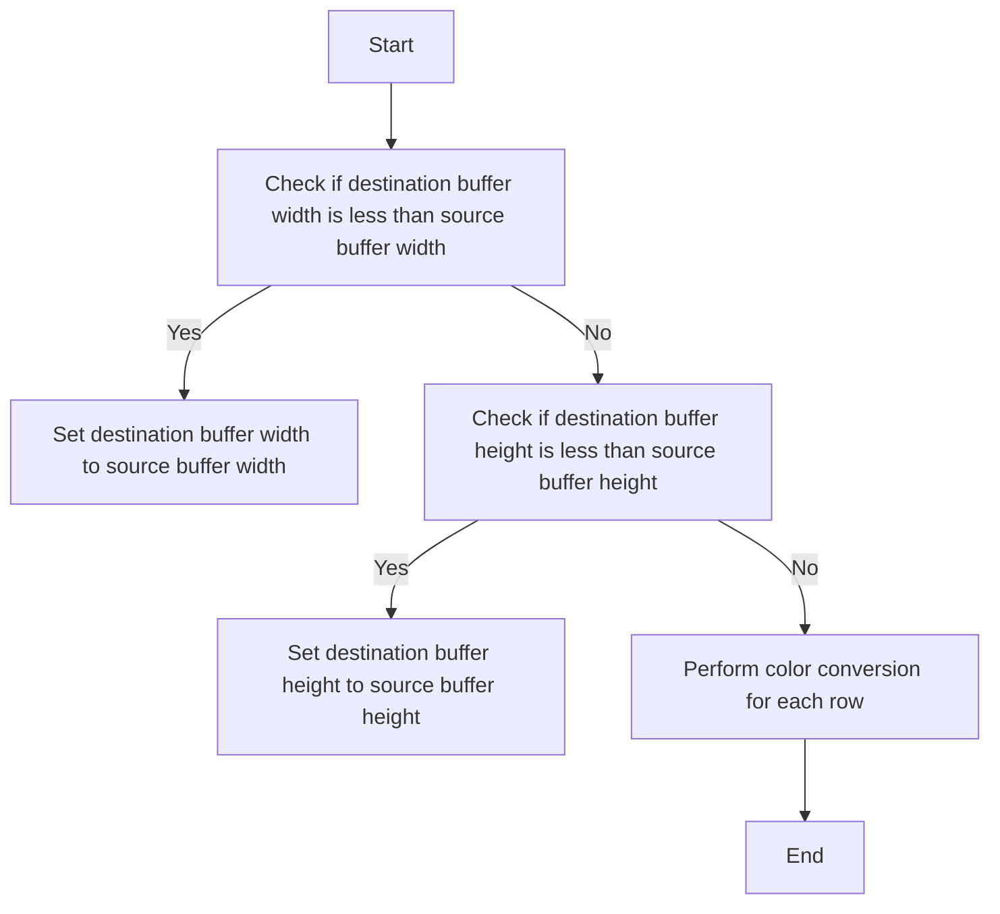
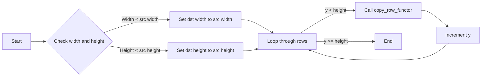
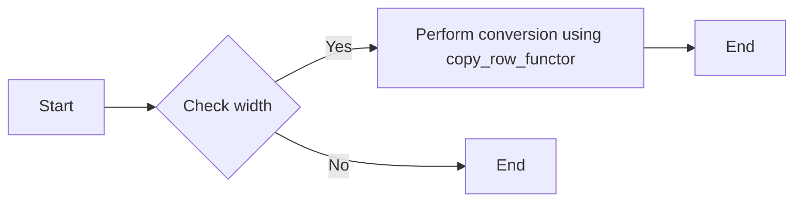
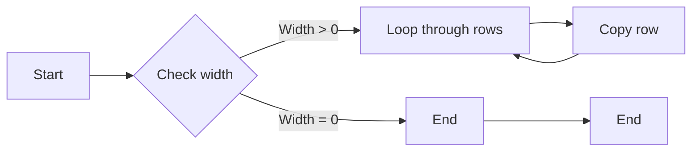
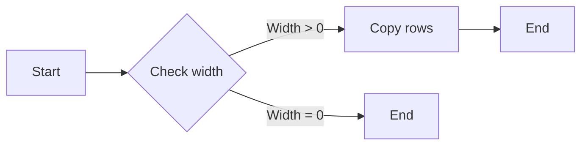
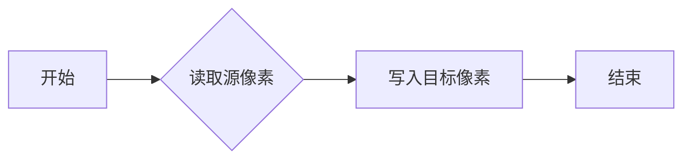
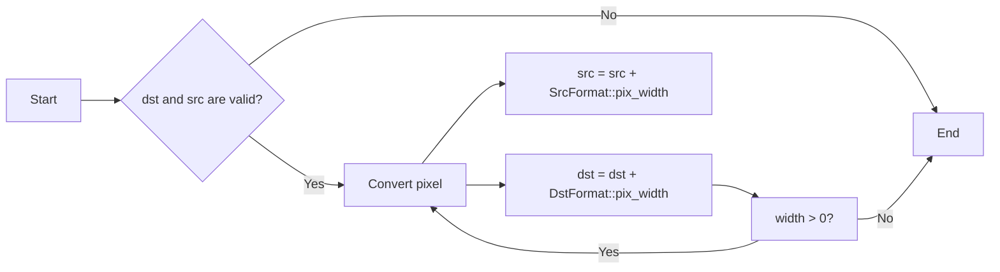
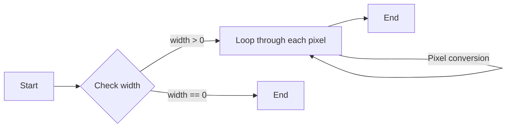
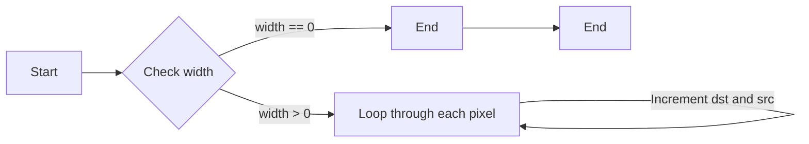

# `matplotlib\extern\agg24-svn\include\util\agg_color_conv.h` 详细设计文档

This code provides a set of functions for converting pixel formats between different color spaces and pixel formats in the Anti-Grain Geometry library.

## 整体流程



## 类结构

```
agg::color_conv (Function)
├── agg::color_conv_row (Function)
│   ├── agg::color_conv_same (Template class)
│   └── agg::conv_pixel (Template struct)
│       └── agg::conv_row (Template struct)
│           └── agg::conv_row<Format, Format> (Template struct specialization)
└── agg::convert (Function)
```

## 全局变量及字段


### `agg::RenBuf*.dst`
    
Destination rendering buffer pointer.

类型：`agg::RenBuf*`
    


### `agg::RenBuf*.src`
    
Source rendering buffer pointer.

类型：`agg::RenBuf*`
    


### `CopyRow.copy_row_functor`
    
Function object to copy a row of pixels.

类型：`CopyRow`
    


### `agg::RenBuf*.dst`
    
Destination row pointer in bytes.

类型：`int8u*`
    


### `agg::RenBuf*.src`
    
Source row pointer in bytes.

类型：`const int8u*`
    


### `agg::RenBuf*.width`
    
Width of the row to be copied.

类型：`unsigned`
    


### `agg::RenBuf*.copy_row_functor`
    
Function object to copy a row of pixels.

类型：`CopyRow`
    


### `color_conv_same.BPP`
    
Bits per pixel for the same format conversion.

类型：`int`
    


### `color_conv_same.dst`
    
Destination pixel buffer.

类型：`int8u*`
    


### `color_conv_same.src`
    
Source pixel buffer.

类型：`const int8u*`
    


### `color_conv_same.width`
    
Width of the pixel buffer.

类型：`unsigned`
    


### `conv_pixel.dst`
    
Destination pixel buffer pointer.

类型：`void*`
    


### `conv_pixel.src`
    
Source pixel buffer pointer.

类型：`const void*`
    


### `conv_row.dst`
    
Destination pixel buffer pointer.

类型：`void*`
    


### `conv_row.src`
    
Source pixel buffer pointer.

类型：`const void*`
    


### `conv_row.width`
    
Width of the pixel buffer to be converted.

类型：`unsigned`
    


### `conv_row.conv`
    
Pixel conversion object.

类型：`conv_pixel<DstFormat, SrcFormat>`
    


### `conv_row<Format, Format>.dst`
    
Destination pixel buffer pointer.

类型：`void*`
    


### `conv_row<Format, Format>.src`
    
Source pixel buffer pointer.

类型：`const void*`
    


### `conv_row<Format, Format>.width`
    
Width of the pixel buffer to be converted.

类型：`unsigned`
    
    

## 全局函数及方法


### color_conv

Converts a color from one pixel format to another.

参数：

- `dst`：`RenBuf*`，The destination rendering buffer where the converted color will be stored.
- `src`：`const RenBuf*`，The source rendering buffer from which the color will be read.
- `copy_row_functor`：`CopyRow`，A functor that copies a row of pixels from the source buffer to the destination buffer.

返回值：`void`，No return value.

#### 流程图



#### 带注释源码

```cpp
template<class RenBuf, class CopyRow> 
void color_conv(RenBuf* dst, const RenBuf* src, CopyRow copy_row_functor)
{
    unsigned width = src->width();
    unsigned height = src->height();

    if(dst->width()  < width)  width  = dst->width();
    if(dst->height() < height) height = dst->height();

    if(width)
    {
        unsigned y;
        for(y = 0; y < height; y++)
        {
            copy_row_functor(dst->row_ptr(0, y, width), 
                             src->row_ptr(y), 
                             width);
        }
    }
}
```

#### 关键组件信息

- `RenBuf`：Rendering buffer class that represents a buffer for pixel data.
- `CopyRow`：Functor that copies a row of pixels from one buffer to another.

#### 潜在的技术债务或优化空间

- The function could be optimized to handle cases where the source and destination buffers have the same dimensions without checking the width and height.
- The function could be modified to handle different types of rendering buffers, not just `RenBuf`.

#### 设计目标与约束

- The function is designed to convert colors between different pixel formats.
- The function must handle cases where the source and destination buffers have different dimensions.

#### 错误处理与异常设计

- The function does not handle errors, as it assumes that the input buffers are valid.

#### 数据流与状态机

- The function reads a row of pixels from the source buffer and writes it to the destination buffer using the `copy_row_functor`.

#### 外部依赖与接口契约

- The function depends on the `RenBuf` class and the `CopyRow` functor.
- The function must be used in conjunction with the `conv_row` functor to perform the actual pixel conversion.


### color_conv_row

Converts a row of pixels from one format to another using a copy_row_functor.

参数：

- `dst`：`int8u*`，The destination buffer where the converted row will be stored.
- `src`：`const int8u*`，The source buffer containing the row of pixels to be converted.
- `width`：`unsigned`，The width of the row in pixels.
- `copy_row_functor`：`CopyRow`，A functor that performs the actual pixel conversion.

返回值：`void`，No return value.

#### 流程图



#### 带注释源码

```cpp
template<class CopyRow> 
void color_conv_row(int8u* dst, 
                    const int8u* src,
                    unsigned width,
                    CopyRow copy_row_functor)
{
    copy_row_functor(dst, src, width);
}
```


### convert

Converts one pixel format to another.

参数：

- `dst`：`RenBuf*`，The destination rendering buffer where the converted pixels will be stored.
- `src`：`const RenBuf*`，The source rendering buffer from which the pixels will be read.

返回值：`void`，No return value. The conversion is performed in-place on the destination buffer.

#### 流程图

```mermaid
graph LR
A[Start] --> B{Check width and height}
B -->|Width < src width| C[Set dst width to src width]
B -->|Height < src height| D[Set dst height to src height]
C --> E[Check width]
E -->|Width == 0| F[End]
E -->|Width != 0| G[Loop through rows]
G --> H[Copy row]
H --> G
F -->|End
```

#### 带注释源码

```cpp
template<class DstFormat, class SrcFormat, class RenBuf>
void convert(RenBuf* dst, const RenBuf* src)
{
    // Check the width and height of the source and destination buffers
    unsigned width = src->width();
    unsigned height = src->height();

    // Adjust the width and height if necessary
    if(dst->width()  < width)  width  = dst->width();
    if(dst->height() < height) height = dst->height();

    // Perform the conversion if width is not zero
    if(width)
    {
        unsigned y;
        for(y = 0; y < height; y++)
        {
            // Use the conv_row functor to convert each row
            color_conv_row(dst->row_ptr(0, y, width), 
                           src->row_ptr(y), 
                           width, 
                           conv_row<DstFormat, SrcFormat>());
        }
    }
}
```


### color_conv_same::operator()

将相同像素格式的数据从一个缓冲区复制到另一个缓冲区。

参数：

- `dst`：`int8u*`，目标缓冲区的指针。
- `src`：`const int8u*`，源缓冲区的指针。
- `width`：`unsigned`，要复制的像素宽度。

返回值：`void`，无返回值。

#### 流程图



#### 带注释源码

```cpp
void color_conv_same::operator () (int8u* dst, 
                                   const int8u* src,
                                   unsigned width) const
{
    memmove(dst, src, width*BPP);
}
```


### color_conv_same::operator()

将相同像素格式的数据从一个缓冲区复制到另一个缓冲区。

参数：

- `dst`：`int8u*`，目标缓冲区的指针。
- `src`：`const int8u*`，源缓冲区的指针。
- `width`：`unsigned`，要复制的像素宽度。

返回值：`void`，没有返回值。

#### 流程图



#### 带注释源码

```cpp
void color_conv_same::operator()(int8u* dst, const int8u* src, unsigned width) const
{
    memmove(dst, src, width*BPP);
}
```


### agg::conv_pixel::operator()

将像素从源格式读取并写入目标格式。

参数：

- `dst`：`void*`，指向目标格式的像素缓冲区。
- `src`：`const void*`，指向源格式的像素缓冲区。

返回值：无

#### 流程图



#### 带注释源码

```cpp
template<class DstFormat, class SrcFormat>
struct conv_pixel
{
    void operator()(void* dst, const void* src) const
    {
        // Read a pixel from the source format and write it to the destination format.
        DstFormat::write_plain_color(dst, SrcFormat::read_plain_color(src));
    }
};
```


### `conv_pixel::operator()`

Reads a pixel from the source format and writes it to the destination format.

参数：

- `dst`：`void*`，The destination buffer where the pixel will be written.
- `src`：`const void*`，The source buffer from which the pixel will be read.

返回值：`void`，No return value.

#### 流程图


#### 带注释源码

```cpp
// Generic pixel converter.
template<class DstFormat, class SrcFormat>
struct conv_pixel
{
    void operator()(void* dst, const void* src) const
    {
        // Read a pixel from the source format and write it to the destination format.
        DstFormat::write_plain_color(dst, SrcFormat::read_plain_color(src));
    }
};
```


### agg::conv_row.operator()

This function is a member of the `conv_row` struct and is a template specialization for converting a row of pixels from one format to another. It uses the `conv_pixel` struct to convert individual pixels.

参数：

- `dst`：`void*`，指向目标像素行的起始地址。
- `src`：`const void*`，指向源像素行的起始地址。
- `width`：`unsigned`，像素行的宽度。

返回值：无

#### 流程图

```mermaid
graph LR
A[Start] --> B{Is width 0?}
B -- Yes --> C[End]
B -- No --> D[Call conv_pixel(dst, src)]
D --> E[dst = dst + DstFormat::pix_width]
D --> F[src = src + SrcFormat::pix_width]
E & F --> B
```

#### 带注释源码

```cpp
template<class DstFormat, class SrcFormat>
struct conv_row
{
    void operator()(void* dst, const void* src, unsigned width) const
    {
        conv_pixel<DstFormat, SrcFormat> conv;
        do
        {
            conv(dst, src);
            dst = (int8u*)dst + DstFormat::pix_width;
            src = (int8u*)src + SrcFormat::pix_width;
        }
        while (--width);
    }
};
```


### agg::conv_row::operator()

将一行像素从源格式转换为目标格式。

参数：

- `dst`：`void*`，指向目标像素行的起始地址。
- `src`：`const void*`，指向源像素行的起始地址。
- `width`：`unsigned`，像素行的宽度。

返回值：`void`，无返回值。

#### 流程图



#### 带注释源码

```cpp
template<class DstFormat, class SrcFormat>
struct conv_row
{
    void operator()(void* dst, const void* src, unsigned width) const
    {
        conv_pixel<DstFormat, SrcFormat> conv;
        do
        {
            conv(dst, src);
            dst = (int8u*)dst + DstFormat::pix_width;
            src = (int8u*)src + SrcFormat::pix_width;
        }
        while (--width);
    }
};
``` 


### `conv_row<Format, Format>::operator()`

This function is a specialization of the `conv_row` template for the case where the source and destination formats are identical. It performs a byte-wise copy of the pixel row from the source to the destination buffer.

参数：

- `dst`：`void*`，指向目标缓冲区的指针。
- `src`：`const void*`，指向源缓冲区的指针。
- `width`：`unsigned`，像素宽度。

返回值：`void`，无返回值。

#### 流程图



#### 带注释源码

```cpp
template<class Format>
struct conv_row<Format, Format>
{
    void operator()(void* dst, const void* src, unsigned width) const
    {
        // Perform a byte-wise copy of the pixel row from the source to the destination buffer.
        memmove(dst, src, width * Format::pix_width);
    }
};
```


### `conv_row<Format, Format>::void operator()(void* dst, const void* src, unsigned width) const`

This function is a specialized version of the `conv_row` template for cases where the source and destination formats are identical. It performs a byte-wise copy of the pixel row from the source to the destination buffer.

参数：

- `dst`：`void*`，指向目标缓冲区的指针。
- `src`：`const void*`，指向源缓冲区的指针。
- `width`：`unsigned`，源和目标缓冲区中像素的宽度。

返回值：`void`，没有返回值。

#### 流程图



#### 带注释源码

```cpp
template<class Format>
struct conv_row<Format, Format>
{
    void operator()(void* dst, const void* src, unsigned width) const
    {
        // Perform a byte-wise copy of the pixel row from the source to the destination buffer.
        memmove(dst, src, width * Format::pix_width);
    }
};
``` 


## 关键组件


### 张量索引与惰性加载

张量索引与惰性加载是代码中用于高效访问和操作大型数据结构（如图像数据）的关键组件。它允许在需要时才加载数据，从而减少内存使用并提高性能。

### 反量化支持

反量化支持是代码中用于处理量化数据的关键组件。它允许将量化后的数据转换回原始精度，以便进行进一步处理或分析。

### 量化策略

量化策略是代码中用于将数据从高精度转换为低精度表示的关键组件。它包括选择合适的量化级别和算法，以优化存储和计算效率。


## 问题及建议


### 已知问题

-   **代码重复**：`color_conv_row` 和 `color_conv_same` 类中存在重复的 `memmove` 调用，可以考虑将这部分逻辑提取到一个单独的函数中，以减少代码重复。
-   **泛型特化**：`conv_row` 结构体在 `Format, Format` 的情况下使用了 `memmove`，这可能不是最高效的实现，因为 `memmove` 是一个通用函数，可能不是针对特定格式优化的。
-   **错误处理**：代码中没有明显的错误处理机制，例如在 `color_conv` 和 `convert` 函数中，如果 `dst` 或 `src` 是 `nullptr`，可能会导致未定义行为。

### 优化建议

-   **提取重复代码**：创建一个名为 `copy_row` 的函数，用于执行 `memmove` 操作，并在 `color_conv_row` 和 `color_conv_same` 中调用它。
-   **优化泛型特化**：考虑为 `Format, Format` 的情况实现一个更高效的转换逻辑，例如直接使用指针操作，而不是 `memmove`。
-   **增加错误处理**：在 `color_conv` 和 `convert` 函数中添加对 `dst` 和 `src` 是否为 `nullptr` 的检查，并在必要时抛出异常或返回错误代码。
-   **性能优化**：考虑使用更高效的内存操作函数，例如 `memcpy`，如果源和目标内存是连续的，并且没有重叠。
-   **文档和注释**：增加对函数和类的文档和注释，以帮助其他开发者理解代码的目的和工作方式。


## 其它


### 设计目标与约束

- **设计目标**:
  - 实现不同颜色空间和像素格式之间的转换。
  - 提供灵活的转换机制，支持多种颜色格式。
  - 保证转换过程的效率和准确性。

- **约束**:
  - 转换过程应尽可能高效，避免不必要的性能损耗。
  - 转换函数应易于使用，提供清晰的接口。
  - 遵循C++编程规范，确保代码的可读性和可维护性。

### 错误处理与异常设计

- **错误处理**:
  - 函数应检查输入参数的有效性，如缓冲区指针是否为空。
  - 对于无效的输入，函数应返回错误代码或抛出异常。

- **异常设计**:
  - 使用C++标准异常处理机制，如`std::exception`。
  - 定义自定义异常类，以提供更具体的错误信息。

### 数据流与状态机

- **数据流**:
  - 数据流从源缓冲区流向目标缓冲区。
  - 转换过程涉及逐行或逐像素的数据处理。

- **状态机**:
  - 无需状态机，转换过程是线性的，不涉及状态转换。

### 外部依赖与接口契约

- **外部依赖**:
  - 依赖于`agg_basics.h`和`agg_rendering_buffer.h`头文件。
  - 依赖于C++标准库，如`<string.h>`和`<stdexcept>`。

- **接口契约**:
  - `RenBuf`类应提供`width()`, `height()`, 和`row_ptr()`方法。
  - `CopyRow`函数对象应接受目标行指针、源行指针和宽度作为参数。
  - `conv_pixel`和`conv_row`结构体应提供转换像素和行的接口。


    