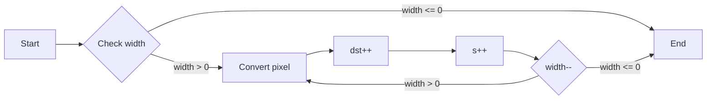
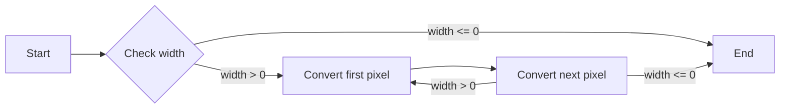
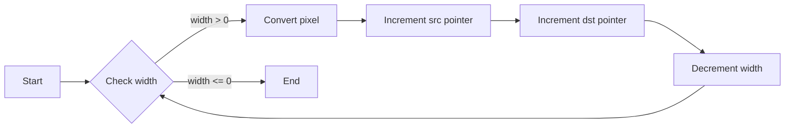
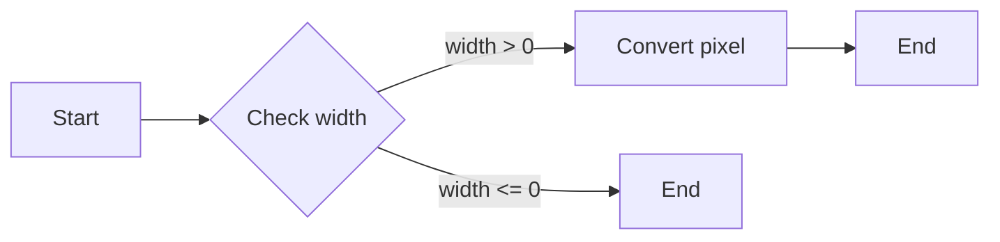
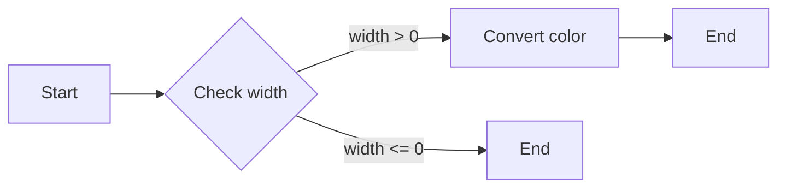
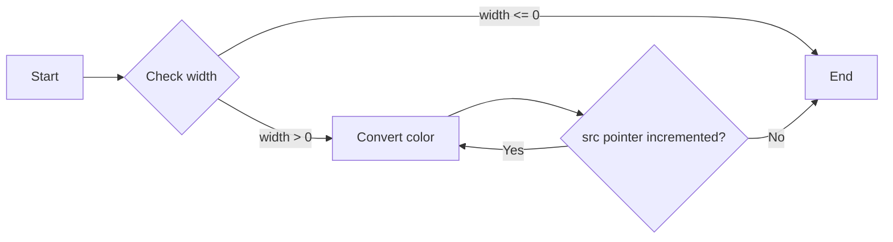
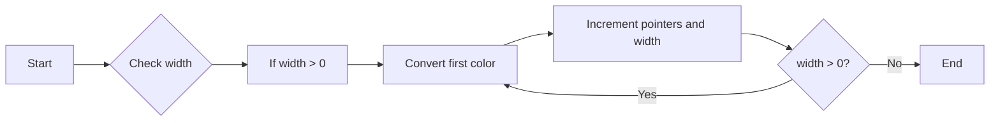
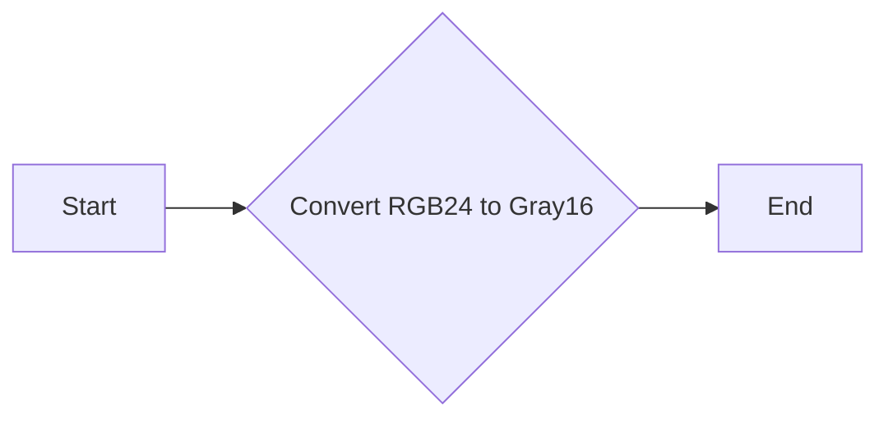

# `matplotlib\extern\agg24-svn\include\util\agg_color_conv_rgb16.h` 详细设计文档

This file defines a set of functors for converting colors between different color formats, such as RGB, RGBA, and grayscale.

## 整体流程

```mermaid
graph TD
    A[Start] --> B[Include agg_basics.h]
    B --> C[Include agg_color_conv.h]
    C --> D[Define color_conv_gray16_to_gray8 class]
    D --> E[Define color_conv_rgb24_rgb48 template class]
    E --> F[Define color_conv_rgb24_rgb48 typedefs]
    F --> G[Define color_conv_rgb48_rgb24 template class]
    G --> H[Define color_conv_rgb48_rgb24 typedefs]
    H --> I[Define color_conv_rgbAAA_rgb24 template class]
    I --> J[Define color_conv_rgbAAA_rgb24 typedefs]
    J --> K[Define color_conv_rgbBBA_rgb24 template class]
    K --> L[Define color_conv_rgbBBA_rgb24 typedefs]
    L --> M[Define color_conv_bgrABB_rgb24 template class]
    M --> N[Define color_conv_bgrABB_rgb24 typedefs]
    N --> O[Define color_conv_rgba64_rgba32 template class]
    O --> P[Define color_conv_rgba64_rgba32 typedefs]
    P --> Q[Define color_conv_rgb24_rgba64 template class]
    Q --> R[Define color_conv_rgb24_rgba64 typedefs]
    R --> S[Define color_conv_rgb24_gray16 template class]
    S --> T[Define color_conv_rgb24_gray16 typedefs]
    T --> U[End]
```



## 类结构

```
agg::color_conv_gray16_to_gray8
├── agg::color_conv_rgb24_rgb48
│   ├── agg::color_conv_rgb24_to_rgb48
│   ├── agg::color_conv_bgr24_to_bgr48
│   ├── agg::color_conv_rgb24_to_bgr48
│   └── agg::color_conv_bgr24_to_rgb48
├── agg::color_conv_rgb48_rgb24
│   ├── agg::color_conv_rgb48_to_rgb24
│   ├── agg::color_conv_bgr48_to_bgr24
│   ├── agg::color_conv_rgb48_to_bgr24
│   └── agg::color_conv_bgr48_to_rgb24
├── agg::color_conv_rgbAAA_rgb24
│   ├── agg::color_conv_rgbAAA_to_rgb24
│   ├── agg::color_conv_rgbAAA_to_bgr24
│   ├── agg::color_conv_bgrAAA_to_rgb24
│   └── agg::color_conv_bgrAAA_to_bgr24
├── agg::color_conv_rgbBBA_rgb24
│   ├── agg::color_conv_rgbBBA_to_rgb24
│   └── agg::color_conv_rgbBBA_to_bgr24
├── agg::color_conv_bgrABB_rgb24
│   ├── agg::color_conv_bgrABB_to_rgb24
│   └── agg::color_conv_bgrABB_to_bgr24
├── agg::color_conv_rgba64_rgba32
│   ├── agg::color_conv_rgba64_to_rgba32
│   ├── agg::color_conv_argb64_to_argb32
│   ├── agg::color_conv_bgra64_to_bgra32
│   ├── agg::color_conv_abgr64_to_abgr32
│   ├── agg::color_conv_argb64_to_abgr32
│   ├── agg::color_conv_argb64_to_bgra32
│   ├── agg::color_conv_argb64_to_rgba32
│   ├── agg::color_conv_bgra64_to_abgr32
│   ├── agg::color_conv_bgra64_to_argb32
│   ├── agg::color_conv_bgra64_to_rgba32
│   ├── agg::color_conv_rgba64_to_abgr32
│   ├── agg::color_conv_rgba64_to_argb32
│   └── agg::color_conv_rgba64_to_bgra32
└── agg::color_conv_rgb24_rgba64
    ├── agg::color_conv_rgb24_to_argb64
    ├── agg::color_conv_rgb24_to_abgr64
    ├── agg::color_conv_rgb24_to_bgra64
    ├── agg::color_conv_rgb24_to_rgba64
    ├── agg::color_conv_bgr24_to_argb64
    ├── agg::color_conv_bgr24_to_abgr64
    ├── agg::color_conv_bgr24_to_bgra64
    └── agg::color_conv_bgr24_to_rgba64
```

## 全局变量及字段


### `color_conv_gray16_to_gray8.dst`
    
Destination buffer for the converted grayscale image.

类型：`int8u*`
    


### `color_conv_gray16_to_gray8.src`
    
Source buffer containing the grayscale image to be converted.

类型：`const int8u*`
    


### `color_conv_gray16_to_gray8.width`
    
Width of the image to be converted.

类型：`unsigned`
    


### `color_conv_rgb24_rgb48.dst`
    
Destination buffer for the converted RGB48 image.

类型：`int8u*`
    


### `color_conv_rgb24_rgb48.src`
    
Source buffer containing the RGB24 image to be converted.

类型：`const int8u*`
    


### `color_conv_rgb24_rgb48.width`
    
Width of the image to be converted.

类型：`unsigned`
    


### `color_conv_rgb48_rgb24.dst`
    
Destination buffer for the converted RGB24 image.

类型：`int8u*`
    


### `color_conv_rgb48_rgb24.src`
    
Source buffer containing the RGB48 image to be converted.

类型：`const int8u*`
    


### `color_conv_rgb48_rgb24.width`
    
Width of the image to be converted.

类型：`unsigned`
    


### `color_conv_rgbAAA_rgb24.dst`
    
Destination buffer for the converted RGB24 image.

类型：`int8u*`
    


### `color_conv_rgbAAA_rgb24.src`
    
Source buffer containing the RGBAAA image to be converted.

类型：`const int8u*`
    


### `color_conv_rgbAAA_rgb24.width`
    
Width of the image to be converted.

类型：`unsigned`
    


### `color_conv_rgbBBA_rgb24.dst`
    
Destination buffer for the converted RGB24 image.

类型：`int8u*`
    


### `color_conv_rgbBBA_rgb24.src`
    
Source buffer containing the RGBBBA image to be converted.

类型：`const int8u*`
    


### `color_conv_rgbBBA_rgb24.width`
    
Width of the image to be converted.

类型：`unsigned`
    


### `color_conv_bgrABB_rgb24.dst`
    
Destination buffer for the converted RGB24 image.

类型：`int8u*`
    


### `color_conv_bgrABB_rgb24.src`
    
Source buffer containing the BGRABB image to be converted.

类型：`const int8u*`
    


### `color_conv_bgrABB_rgb24.width`
    
Width of the image to be converted.

类型：`unsigned`
    


### `color_conv_rgba64_rgba32.dst`
    
Destination buffer for the converted RGBA32 image.

类型：`int8u*`
    


### `color_conv_rgba64_rgba32.src`
    
Source buffer containing the RGBA64 image to be converted.

类型：`const int8u*`
    


### `color_conv_rgba64_rgba32.width`
    
Width of the image to be converted.

类型：`unsigned`
    


### `color_conv_rgb24_rgba64.dst`
    
Destination buffer for the converted RGBA64 image.

类型：`int8u*`
    


### `color_conv_rgb24_rgba64.src`
    
Source buffer containing the RGB24 image to be converted.

类型：`const int8u*`
    


### `color_conv_rgb24_rgba64.width`
    
Width of the image to be converted.

类型：`unsigned`
    


### `color_conv_rgb24_gray16.dst`
    
Destination buffer for the converted grayscale image.

类型：`int8u*`
    


### `color_conv_rgb24_gray16.src`
    
Source buffer containing the RGB24 image to be converted.

类型：`const int8u*`
    


### `color_conv_rgb24_gray16.width`
    
Width of the image to be converted.

类型：`unsigned`
    
    

## 全局函数及方法


### color_conv_gray16_to_gray8.operator ()

将16位灰度图像转换为8位灰度图像。

参数：

- `dst`：`int8u*`，目标图像数据缓冲区指针
- `src`：`const int8u*`，源图像数据缓冲区指针
- `width`：`unsigned`，图像宽度

返回值：无

#### 流程图



#### 带注释源码

```cpp
void color_conv_gray16_to_gray8::operator () (int8u* dst, 
                                              const int8u* src,
                                              unsigned width) const
{
    int16u* s = (int16u*)src;
    do
    {
        *dst++ = *s++ >> 8;
    }
    while(--width);
}
``` 


### color_conv_rgb24_rgb48.operator ()

将 RGB24 颜色转换为 RGB48 颜色。

参数：

- `dst`：`int8u*`，目标缓冲区指针
- `src`：`const int8u*`，源缓冲区指针
- `width`：`unsigned`，图像宽度

返回值：无

#### 流程图



#### 带注释源码

```cpp
void operator () (int8u* dst, 
                  const int8u* src,
                  unsigned width) const
{
    int16u* d = (int16u*)dst;
    do
    {
        *d++ = (src[I1] << 8) | src[I1];
        *d++ = (src[1]  << 8) | src[1] ;
        *d++ = (src[I3] << 8) | src[I3];
        src += 3;
    }
    while(--width);
}
```


### color_conv_rgb48_rgb24.operator ()

将 RGB48 颜色转换为 RGB24 颜色。

参数：

- `dst`：`int8u*`，目标缓冲区指针，用于存储转换后的 RGB24 颜色。
- `src`：`const int8u*`，源缓冲区指针，包含要转换的 RGB48 颜色。
- `width`：`unsigned`，图像宽度，表示需要转换的像素数量。

返回值：无

#### 流程图



#### 带注释源码

```cpp
void operator () (int8u* dst, 
                  const int8u* src,
                  unsigned width) const
{
    const int16u* s = (const int16u*)src;
    do
    {
        *dst++ = s[I1] >> 8;
        *dst++ = s[1]  >> 8;
        *dst++ = s[I3] >> 8;
        s += 3;
    }
    while(--width);
}
```


### color_conv_rgbAAA_rgb24.operator ()

将 RGBAAA 颜色格式转换为 RGB24 颜色格式。

参数：

- `dst`：`int8u*`，目标缓冲区指针，用于存储转换后的 RGB24 颜色数据。
- `src`：`const int8u*`，源缓冲区指针，包含 RGBAAA 颜色数据。
- `width`：`unsigned`，图像宽度，表示需要转换的像素数量。

返回值：无

#### 流程图



#### 带注释源码

```cpp
void operator () (int8u* dst, 
                  const int8u* src,
                  unsigned width) const
{
    do
    {
        int32u rgb = *(int32u*)src;
        dst[R] = int8u(rgb >> 22);
        dst[1] = int8u(rgb >> 12);
        dst[B] = int8u(rgb >> 2);
        src += 4;
        dst += 3;
    }
    while(--width);
}
```


### color_conv_rgbBBA_rgb24::operator ()

将 RGBBBA 格式的颜色转换为 RGB24 格式的颜色。

参数：

- `dst`：`int8u*`，目标颜色数据的指针。
- `src`：`const int8u*`，源颜色数据的指针。
- `width`：`unsigned`，转换的颜色宽度。

返回值：无

#### 流程图



#### 带注释源码

```cpp
void color_conv_rgbBBA_rgb24::operator () (int8u* dst, 
                                           const int8u* src,
                                           unsigned width) const
{
    do
    {
        int32u rgb = *(int32u*)src;
        dst[R] = int8u(rgb >> 24);
        dst[1] = int8u(rgb >> 13);
        dst[B] = int8u(rgb >> 2);
        src += 4;
        dst += 3;
    }
    while(--width);
}
```


### color_conv_bgrABB_rgb24.operator ()

将 BGR 格式的颜色转换为 RGB 格式的颜色。

参数：

- `dst`：`int8u*`，目标颜色数据的指针。
- `src`：`const int8u*`，源颜色数据的指针。
- `width`：`unsigned`，转换的颜色宽度。

返回值：无

#### 流程图



#### 带注释源码

```cpp
void color_conv_bgrABB_rgb24::operator () (int8u* dst, 
                                           const int8u* src,
                                           unsigned width) const
{
    do
    {
        int32u bgr = *(int32u*)src;
        dst[0] = int8u(bgr >> 3); // Blue component
        dst[1] = int8u(bgr >> 14); // Green component
        dst[2] = int8u(bgr >> 24); // Red component
        src += 4;
        dst += 3;
    }
    while(--width);
}
```


### color_conv_rgba64_rgba32::operator ()

将 64 位 RGBA 颜色转换为 32 位 RGBA 颜色。

参数：

- `dst`：`int8u*`，目标颜色数据的指针。
- `src`：`const int8u*`，源颜色数据的指针。
- `width`：`unsigned`，转换的颜色宽度。

返回值：`void`，无返回值。

#### 流程图



#### 带注释源码

```cpp
void color_conv_rgba64_rgba32::operator () (
    int8u* dst, 
    const int8u* src,
    unsigned width) const
{
    do
    {
        *dst++ = int8u(((int16u*)src)[I1] >> 8);
        *dst++ = int8u(((int16u*)src)[I2] >> 8);
        *dst++ = int8u(((int16u*)src)[I3] >> 8);
        *dst++ = int8u(((int16u*)src)[I4] >> 8); 
        src += 8;
    }
    while(--width);
}
``` 


### color_conv_rgb24_rgba64.operator ()

将 RGB24 颜色转换为 RGBA64 颜色。

参数：

- `dst`：`int8u*`，目标颜色数据的指针。
- `src`：`const int8u*`，源颜色数据的指针。
- `width`：`unsigned`，转换的颜色宽度。

返回值：无

#### 流程图


#### 带注释源码

```cpp
    void operator () (int8u* dst, 
                      const int8u* src,
                      unsigned width) const
    {
        int16u* d = (int16u*)dst;
        do
        {
            d[I1] = (src[0] << 8) | src[0];
            d[I2] = (src[1] << 8) | src[1];
            d[I3] = (src[2] << 8) | src[2];
            d[A]  = 65535; 
            d   += 4;
            src += 3;
        }
        while(--width);
    }
```


### color_conv_rgb24_gray16.operator ()

将 RGB24 颜色转换为 Gray16 颜色。

参数：

- `dst`：`int8u*`，目标缓冲区指针
- `src`：`const int8u*`，源缓冲区指针
- `width`：`unsigned`，图像宽度

返回值：无

#### 流程图



#### 带注释源码

```cpp
template<int R, int B>
class color_conv_rgb24_gray16
{
public:
    void operator () (int8u* dst, 
                      const int8u* src,
                      unsigned width) const
    {
        int16u* d = (int16u*)dst;
        do
        {
            *d++ = src[R]*77 + src[1]*150 + src[B]*29;
            src += 3;
        }
        while(--width);
    }
};
```


## 关键组件


### 张量索引与惰性加载

张量索引与惰性加载是代码中用于高效处理图像数据转换的关键组件。它允许在转换过程中仅访问必要的图像数据部分，从而减少内存访问和计算开销。

### 反量化支持

反量化支持是代码中用于处理图像数据反量化操作的关键组件。它能够将量化后的图像数据转换回原始精度，以恢复图像的细节和颜色。

### 量化策略

量化策略是代码中用于处理图像数据量化操作的关键组件。它能够将图像数据从高精度转换为低精度，以减少存储和传输需求，同时保持图像质量。


## 问题及建议


### 已知问题

-   **代码重复性**：代码中存在大量的模板类和typedef，这些类和typedef用于转换不同颜色格式。这种重复性可能导致维护困难，并且增加了代码的复杂性。
-   **缺乏注释**：代码中缺少详细的注释，这可能会使得理解代码的功能和目的变得困难，尤其是在处理复杂的颜色转换时。
-   **性能问题**：在转换过程中，使用了大量的位操作和算术运算，这可能会对性能产生一定的影响，尤其是在处理大量数据时。

### 优化建议

-   **重构代码**：可以通过提取公共代码和创建更通用的转换函数来减少代码重复性，从而简化代码结构并提高可维护性。
-   **增加注释**：在代码中添加详细的注释，解释每个类、方法和转换函数的目的和功能，这将有助于其他开发者理解代码。
-   **优化性能**：考虑使用更高效的算法或数据结构来处理颜色转换，例如使用查找表（LUT）来减少位操作和算术运算的数量。
-   **模块化设计**：将颜色转换功能分解成更小的模块，这样可以更容易地进行单元测试和集成测试。
-   **文档化**：为代码编写详细的文档，包括设计决策、性能分析、使用示例等，这将有助于其他开发者更好地使用和维护代码。


## 其它


### 设计目标与约束

- 设计目标：提供一系列颜色转换函数，用于在不同颜色格式之间转换图像数据。
- 约束条件：转换函数应高效执行，以适应实时图像处理需求。

### 错误处理与异常设计

- 错误处理：函数内部不包含错误处理机制，假设输入参数有效。
- 异常设计：不抛出异常，函数内部不进行异常处理。

### 数据流与状态机

- 数据流：数据流从源图像数据流向目标图像数据，通过转换函数进行格式转换。
- 状态机：无状态机设计，转换函数为纯函数，无状态变化。

### 外部依赖与接口契约

- 外部依赖：依赖于 `agg_basics.h` 和 `agg_color_conv.h` 头文件。
- 接口契约：转换函数接受源图像数据和目标图像数据指针，以及图像宽度，返回转换后的图像数据。


    