# `matplotlib\extern\agg24-svn\include\util\agg_color_conv_rgb8.h` 详细设计文档

This file defines a set of functors for converting images with up to 8 bits per component between different color formats.

## 整体流程

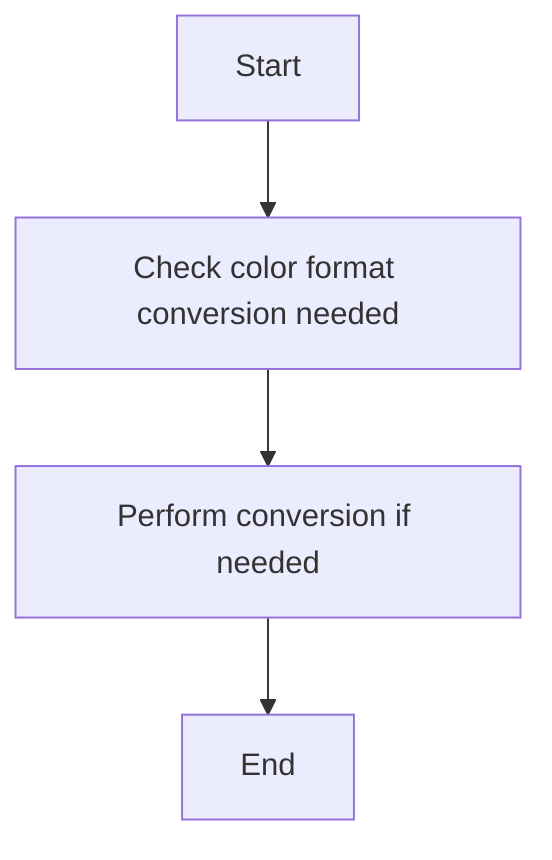

## 类结构

```
agg::color_conv_rgb24
├── agg::color_conv_rgba32
│   ├── agg::color_conv_argb32_to_abgr32
│   ├── agg::color_conv_argb32_to_bgra32
│   ├── agg::color_conv_argb32_to_rgba32
│   ├── agg::color_conv_bgra32_to_abgr32
│   ├── agg::color_conv_bgra32_to_argb32
│   ├── agg::color_conv_bgra32_to_rgba32
│   ├── agg::color_conv_rgba32_to_abgr32
│   ├── agg::color_conv_rgba32_to_argb32
│   ├── agg::color_conv_rgba32_to_bgra32
│   ├── agg::color_conv_abgr32_to_argb32
│   ├── agg::color_conv_abgr32_to_bgra32
│   ├── agg::color_conv_abgr32_to_rgba32
│   └── agg::color_conv_rgba32_to_rgba32
│   └── agg::color_conv_same
│       ├── agg::color_conv_same<3>
│       └── agg::color_conv_same<4>
│   └── agg::color_conv_rgb24_rgba32
│       ├── agg::color_conv_rgb24_to_argb32
│       ├── agg::color_conv_rgb24_to_abgr32
│       ├── agg::color_conv_rgb24_to_bgra32
│       └── agg::color_conv_rgb24_to_rgba32
│   └── agg::color_conv_rgba32_rgb24
│       ├── agg::color_conv_argb32_to_rgb24
│       ├── agg::color_conv_abgr32_to_rgb24
│       ├── agg::color_conv_bgra32_to_rgb24
│       └── agg::color_conv_rgba32_to_rgb24
│   └── agg::color_conv_rgb555_rgb24
│       ├── agg::color_conv_rgb555_to_bgr24
│       └── agg::color_conv_rgb555_to_rgb24
│   └── agg::color_conv_rgb24_rgb555
│       ├── agg::color_conv_bgr24_to_rgb555
│       └── agg::color_conv_rgb24_to_rgb555
│   └── agg::color_conv_rgb565_rgb24
│       ├── agg::color_conv_rgb565_to_bgr24
│       └── agg::color_conv_rgb565_to_rgb24
│   └── agg::color_conv_rgb24_rgb565
│       ├── agg::color_conv_bgr24_to_rgb565
│       └── agg::color_conv_rgb24_to_rgb565
│   └── agg::color_conv_rgb555_rgba32
│       ├── agg::color_conv_rgb555_to_argb32
│       ├── agg::color_conv_rgb555_to_abgr32
│       ├── agg::color_conv_rgb555_to_bgra32
│       └── agg::color_conv_rgb555_to_rgba32
│   └── agg::color_conv_rgba32_rgb555
│       ├── agg::color_conv_argb32_to_rgb555
│       ├── agg::color_conv_abgr32_to_rgb555
│       ├── agg::color_conv_bgra32_to_rgb555
│       └── agg::color_conv_rgba32_to_rgb555
│   └── agg::color_conv_rgb565_rgba32
│       ├── agg::color_conv_rgb565_to_argb32
│       ├── agg::color_conv_rgb565_to_abgr32
│       ├── agg::color_conv_rgb565_to_bgra32
│       └── agg::color_conv_rgb565_to_rgba32
│   └── agg::color_conv_rgba32_rgb565
│       ├── agg::color_conv_argb32_to_rgb565
│       ├── agg::color_conv_abgr32_to_rgb565
│       ├── agg::color_conv_bgra32_to_rgb565
│       └── agg::color_conv_rgba32_to_rgb565
│   └── agg::color_conv_rgb555_to_rgb565
│       └── agg::color_conv_rgb565_to_rgb555
│   └── agg::color_conv_rgb565_to_rgb555
│       └── agg::color_conv_rgb555_to_rgb565
│   └── agg::color_conv_rgb24_gray8
│       ├── agg::color_conv_rgb24_to_gray8
│       └── agg::color_conv_bgr24_to_gray8
└── agg::color_conv_same
```

## 全局变量及字段


### `color_conv_rgb24.dst`
    
Destination buffer where the converted color values will be stored.

类型：`int8u*`
    


### `color_conv_rgb24.src`
    
Source buffer containing the original color values.

类型：`const int8u*`
    


### `color_conv_rgb24.width`
    
Width of the image to be converted.

类型：`unsigned`
    


### `color_conv_rgb24.tmp`
    
Temporary buffer used to store intermediate color values during conversion.

类型：`int8u[3]`
    


### `color_conv_rgba32.dst`
    
Destination buffer where the converted color values will be stored.

类型：`int8u*`
    


### `color_conv_rgba32.src`
    
Source buffer containing the original color values.

类型：`const int8u*`
    


### `color_conv_rgba32.width`
    
Width of the image to be converted.

类型：`unsigned`
    


### `color_conv_rgba32.tmp`
    
Temporary buffer used to store intermediate color values during conversion.

类型：`int8u[4]`
    


### `color_conv_rgb24_rgba32.dst`
    
Destination buffer where the converted color values will be stored.

类型：`int8u*`
    


### `color_conv_rgb24_rgba32.src`
    
Source buffer containing the original color values.

类型：`const int8u*`
    


### `color_conv_rgb24_rgba32.width`
    
Width of the image to be converted.

类型：`unsigned`
    


### `color_conv_rgba32_rgb24.dst`
    
Destination buffer where the converted color values will be stored.

类型：`int8u*`
    


### `color_conv_rgba32_rgb24.src`
    
Source buffer containing the original color values.

类型：`const int8u*`
    


### `color_conv_rgba32_rgb24.width`
    
Width of the image to be converted.

类型：`unsigned`
    


### `color_conv_rgb555_rgb24.dst`
    
Destination buffer where the converted color values will be stored.

类型：`int8u*`
    


### `color_conv_rgb555_rgb24.src`
    
Source buffer containing the original color values.

类型：`const int8u*`
    


### `color_conv_rgb555_rgb24.width`
    
Width of the image to be converted.

类型：`unsigned`
    


### `color_conv_rgb24_rgb555.dst`
    
Destination buffer where the converted color values will be stored.

类型：`int8u*`
    


### `color_conv_rgb24_rgb555.src`
    
Source buffer containing the original color values.

类型：`const int8u*`
    


### `color_conv_rgb24_rgb555.width`
    
Width of the image to be converted.

类型：`unsigned`
    


### `color_conv_rgb565_rgb24.dst`
    
Destination buffer where the converted color values will be stored.

类型：`int8u*`
    


### `color_conv_rgb565_rgb24.src`
    
Source buffer containing the original color values.

类型：`const int8u*`
    


### `color_conv_rgb565_rgb24.width`
    
Width of the image to be converted.

类型：`unsigned`
    


### `color_conv_rgb24_rgb565.dst`
    
Destination buffer where the converted color values will be stored.

类型：`int8u*`
    


### `color_conv_rgb24_rgb565.src`
    
Source buffer containing the original color values.

类型：`const int8u*`
    


### `color_conv_rgb24_rgb565.width`
    
Width of the image to be converted.

类型：`unsigned`
    


### `color_conv_rgb555_rgba32.dst`
    
Destination buffer where the converted color values will be stored.

类型：`int8u*`
    


### `color_conv_rgb555_rgba32.src`
    
Source buffer containing the original color values.

类型：`const int8u*`
    


### `color_conv_rgb555_rgba32.width`
    
Width of the image to be converted.

类型：`unsigned`
    


### `color_conv_rgba32_rgb555.dst`
    
Destination buffer where the converted color values will be stored.

类型：`int8u*`
    


### `color_conv_rgba32_rgb555.src`
    
Source buffer containing the original color values.

类型：`const int8u*`
    


### `color_conv_rgba32_rgb555.width`
    
Width of the image to be converted.

类型：`unsigned`
    


### `color_conv_rgb565_rgba32.dst`
    
Destination buffer where the converted color values will be stored.

类型：`int8u*`
    


### `color_conv_rgb565_rgba32.src`
    
Source buffer containing the original color values.

类型：`const int8u*`
    


### `color_conv_rgb565_rgba32.width`
    
Width of the image to be converted.

类型：`unsigned`
    


### `color_conv_rgba32_rgb565.dst`
    
Destination buffer where the converted color values will be stored.

类型：`int8u*`
    


### `color_conv_rgba32_rgb565.src`
    
Source buffer containing the original color values.

类型：`const int8u*`
    


### `color_conv_rgba32_rgb565.width`
    
Width of the image to be converted.

类型：`unsigned`
    


### `color_conv_rgb555_to_rgb565.dst`
    
Destination buffer where the converted color values will be stored.

类型：`int8u*`
    


### `color_conv_rgb555_to_rgb565.src`
    
Source buffer containing the original color values.

类型：`const int8u*`
    


### `color_conv_rgb555_to_rgb565.width`
    
Width of the image to be converted.

类型：`unsigned`
    


### `color_conv_rgb565_to_rgb555.dst`
    
Destination buffer where the converted color values will be stored.

类型：`int8u*`
    


### `color_conv_rgb565_to_rgb555.src`
    
Source buffer containing the original color values.

类型：`const int8u*`
    


### `color_conv_rgb565_to_rgb555.width`
    
Width of the image to be converted.

类型：`unsigned`
    


### `color_conv_rgb24_gray8.dst`
    
Destination buffer where the converted color values will be stored.

类型：`int8u*`
    


### `color_conv_rgb24_gray8.src`
    
Source buffer containing the original color values.

类型：`const int8u*`
    


### `color_conv_rgb24_gray8.width`
    
Width of the image to be converted.

类型：`unsigned`
    
    

## 全局函数及方法


### color_conv_rgb24::operator()

将 RGB24 颜色转换为 BGR24 颜色。

参数：

- `dst`：`int8u*`，目标缓冲区的指针。
- `src`：`const int8u*`，源缓冲区的指针。
- `width`：`unsigned`，图像宽度。

返回值：无

#### 流程图

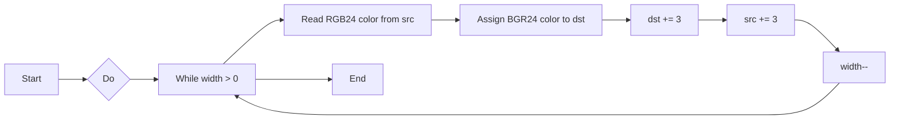

#### 带注释源码

```cpp
void color_conv_rgb24::operator () (int8u* dst, 
                                    const int8u* src,
                                    unsigned width) const
{
    do
    {
        int8u tmp[3];
        tmp[0] = *src++;
        tmp[1] = *src++;
        tmp[2] = *src++;
        *dst++ = tmp[2];
        *dst++ = tmp[1];
        *dst++ = tmp[0];
    }
    while(--width);
}
```


### color_conv_rgba32<I1, I2, I3, I4>.operator ()

将 RGBA32 颜色转换为指定顺序的 RGBA32 颜色。

参数：

- `dst`：`int8u*`，目标颜色数据的指针。
- `src`：`const int8u*`，源颜色数据的指针。
- `width`：`unsigned`，转换的颜色宽度。

返回值：无

#### 流程图


#### 带注释源码

```cpp
void operator () (int8u* dst, 
                  const int8u* src,
                  unsigned width) const
{
    do
    {
        int8u tmp[4];
        tmp[0] = *src++;
        tmp[1] = *src++;
        tmp[2] = *src++;
        tmp[3] = *src++;
        *dst++ = tmp[I1];
        *dst++ = tmp[I2];
        *dst++ = tmp[I3];
        *dst++ = tmp[I4]; 
    }
    while(--width);
}
```


### color_conv_rgb24::operator()

将 RGB24 颜色转换为 BGR24 颜色。

参数：

- `dst`：`int8u*`，目标缓冲区的指针。
- `src`：`const int8u*`，源缓冲区的指针。
- `width`：`unsigned`，图像宽度。

返回值：无

#### 流程图

```mermaid
graph LR
A[Start] --> B{Do}
B --> C[While width > 0]
C --> D[Read 3 bytes from src]
D --> E[Assign to tmp]
E --> F[Assign tmp[2] to *dst++]
F --> G[Assign tmp[1] to *dst++]
G --> H[Assign tmp[0] to *dst++]
H --> I[Decrement width]
I --> C
C --> J[End]
J --> K[End]
```

#### 带注释源码

```cpp
void operator () (int8u* dst, 
                  const int8u* src,
                  unsigned width) const
{
    do
    {
        int8u tmp[3];
        tmp[0] = *src++;
        tmp[1] = *src++;
        tmp[2] = *src++;
        *dst++ = tmp[2];
        *dst++ = tmp[1];
        *dst++ = tmp[0];
    }
    while(--width);
}
```


### color_conv_rgb24_rgb24.operator ()

将 RGB24 颜色转换为 BGR24 颜色。

参数：

- `dst`：`int8u*`，目标缓冲区的指针。
- `src`：`const int8u*`，源缓冲区的指针。
- `width`：`unsigned`，图像宽度。

返回值：无

#### 流程图

```mermaid
graph LR
A[Start] --> B{Do}
B --> C[dst = src[2]]
C --> D[dst++]
D --> E[dst = src[1]]
E --> F[dst++]
F --> G[dst = src[0]]
G --> H[dst++]
H --> I[src++]
I --> J[src++]
J --> K[src++]
K --> L[width--]
L --> M{width > 0}
M --> B
M --> N[End]
```

#### 带注释源码

```cpp
void operator () (int8u* dst, 
                  const int8u* src,
                  unsigned width) const
{
    do
    {
        int8u tmp[3];
        tmp[0] = *src++;
        tmp[1] = *src++;
        tmp[2] = *src++;
        *dst++ = tmp[2];
        *dst++ = tmp[1];
        *dst++ = tmp[0];
    }
    while(--width);
}
```


### color_conv_rgba32_rgb24::operator ()

将 RGBA32 颜色转换为 RGB24 颜色。

参数：

- `dst`：`int8u*`，目标缓冲区的指针，用于存储转换后的 RGB24 颜色。
- `src`：`const int8u*`，源缓冲区的指针，包含要转换的 RGBA32 颜色。
- `width`：`unsigned`，图像的宽度，表示需要转换的像素数量。

返回值：无

#### 流程图

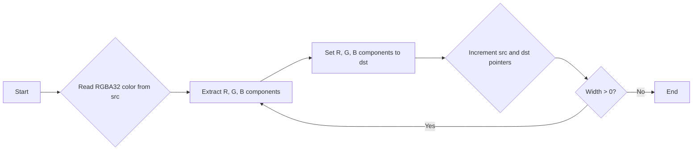

#### 带注释源码

```cpp
void color_conv_rgba32_rgb24::operator () (int8u* dst, 
                                            const int8u* src,
                                            unsigned width) const
{
    do
    {
        *dst++ = src[1]; // R
        *dst++ = src[2]; // G
        *dst++ = src[3]; // B
        src += 4; // Move to next RGBA32 color
    }
    while(--width);
}
```


### color_conv_rgb555_rgb24.operator ()

将 RGB555 颜色转换为 RGB24 颜色。

参数：

- `dst`：`int8u*`，目标缓冲区的指针，用于存储转换后的 RGB24 颜色。
- `src`：`const int8u*`，源缓冲区的指针，包含要转换的 RGB555 颜色。
- `width`：`unsigned`，图像的宽度，表示需要转换的像素数量。

返回值：无

#### 流程图

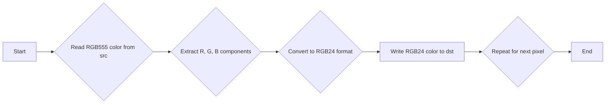

#### 带注释源码

```cpp
void operator () (int8u* dst, 
                  const int8u* src,
                  unsigned width) const
{
    do
    {
        unsigned rgb = *(int16u*)src;
        dst[R] = (int8u)((rgb >> 7) & 0xF8);
        dst[1] = (int8u)((rgb >> 2) & 0xF8);
        dst[B] = (int8u)((rgb << 3) & 0xF8);
        src += 2;
        dst += 3;
    }
    while(--width);
}
```


### color_conv_rgb24::operator()

将 RGB24 颜色转换为 BGR24 颜色。

参数：

- `dst`：`int8u*`，目标缓冲区的指针。
- `src`：`const int8u*`，源缓冲区的指针。
- `width`：`unsigned`，图像宽度。

返回值：无

#### 流程图

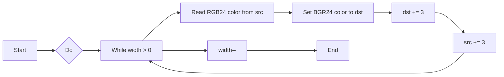

#### 带注释源码

```cpp
void color_conv_rgb24::operator () (int8u* dst, 
                                    const int8u* src,
                                    unsigned width) const
{
    do
    {
        int8u tmp[3];
        tmp[0] = *src++;
        tmp[1] = *src++;
        tmp[2] = *src++;
        *dst++ = tmp[2];
        *dst++ = tmp[1];
        *dst++ = tmp[0];
    }
    while(--width);
}
```


### color_conv_rgb565_rgb24.operator ()

将 RGB565 颜色转换为 RGB24 颜色。

参数：

- `dst`：`int8u*`，目标缓冲区的指针。
- `src`：`const int8u*`，源缓冲区的指针。
- `width`：`unsigned`，图像宽度。

返回值：无

#### 流程图

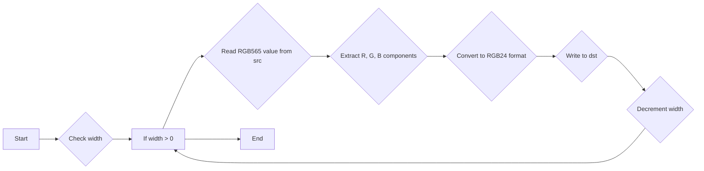

#### 带注释源码

```cpp
void color_conv_rgb565_rgb24::operator () (int8u* dst, 
                                            const int8u* src,
                                            unsigned width) const
{
    do
    {
        int8u tmp[3];
        tmp[0] = *src++;
        tmp[1] = *src++;
        tmp[2] = *src++;
        *dst++ = tmp[2];
        *dst++ = tmp[1];
        *dst++ = tmp[0];
    }
    while(--width);
}
```


### color_conv_rgb24_rgb565.operator ()

将 RGB24 颜色转换为 RGB565 颜色。

参数：

- `dst`：`int8u*`，目标缓冲区的指针，用于存储转换后的 RGB565 颜色。
- `src`：`const int8u*`，源缓冲区的指针，包含要转换的 RGB24 颜色。
- `width`：`unsigned`，图像的宽度，表示需要转换的像素数量。

返回值：无

#### 流程图

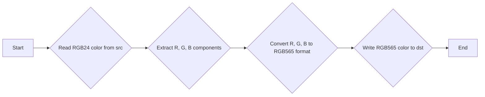

#### 带注释源码

```cpp
void operator () (int8u* dst, 
                  const int8u* src,
                  unsigned width) const
{
    do
    {
        int8u tmp[3];
        tmp[0] = *src++;
        tmp[1] = *src++;
        tmp[2] = *src++;
        *dst++ = tmp[2];
        *dst++ = tmp[1];
        *dst++ = tmp[0];
    }
    while(--width);
}
```


### color_conv_rgb555_rgba32.operator ()

将 RGB555 颜色转换为 RGBA32 颜色。

参数：

- `dst`：`int8u*`，目标缓冲区的指针。
- `src`：`const int8u*`，源缓冲区的指针。
- `width`：`unsigned`，转换的像素宽度。

返回值：无

#### 流程图

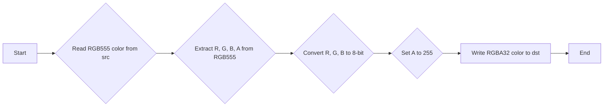

#### 带注释源码

```cpp
void color_conv_rgb555_rgba32::operator () (int8u* dst, 
                                             const int8u* src,
                                             unsigned width) const
{
    do
    {
        int rgb = *(int16*)src;
        dst[R] = (int8u)((rgb >> 7) & 0xF8);
        dst[G] = (int8u)((rgb >> 2) & 0xF8);
        dst[B] = (int8u)((rgb << 3) & 0xF8);
        dst[A] = (int8u)(rgb >> 15);
        src += 2;
        dst += 4;
    }
    while(--width);
}
``` 


### color_conv_rgb555_rgb24.operator ()

将 RGB555 颜色转换为 RGB24 颜色。

参数：

- `dst`：`int8u*`，目标缓冲区的指针。
- `src`：`const int8u*`，源缓冲区的指针。
- `width`：`unsigned`，转换的像素宽度。

返回值：无

#### 流程图

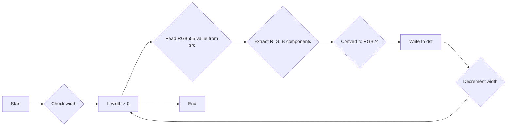

#### 带注释源码

```cpp
template<int R, int B> class color_conv_rgb555_rgb24
{
public:
    void operator () (int8u* dst, 
                      const int8u* src,
                      unsigned width) const
    {
        do
        {
            unsigned rgb = *(int16u*)src;
            dst[R] = (int8u)((rgb >> 7) & 0xF8);
            dst[1] = (int8u)((rgb >> 2) & 0xF8);
            dst[B] = (int8u)((rgb << 3) & 0xF8);
            src += 2;
            dst += 3;
        }
        while(--width);
    }
};
```


### color_conv_rgb565_rgba32.operator ()

将 RGB565 颜色转换为 RGBA32 颜色。

参数：

- `dst`：`int8u*`，目标缓冲区的指针。
- `src`：`const int8u*`，源缓冲区的指针。
- `width`：`unsigned`，图像宽度。

返回值：无

#### 流程图

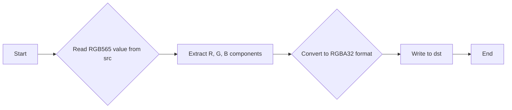

#### 带注释源码

```cpp
template<int R, int G, int B, int A> class color_conv_rgb565_rgba32
{
public:
    void operator () (int8u* dst, 
                      const int8u* src,
                      unsigned width) const
    {
        do
        {
            int rgb = *(int16*)src;
            dst[R] = (rgb >> 8) & 0xF8; // Extract R component
            dst[G] = (rgb >> 3) & 0xFC; // Extract G component
            dst[B] = (rgb << 3) & 0xF8; // Extract B component
            dst[A] = 255; // Set A component to 255 (fully opaque)
            src += 2; // Move to next RGB565 value
            dst += 4; // Move to next RGBA32 value
        }
        while(--width);
    }
};
```


### color_conv_rgb24_rgb565.operator ()

将 RGB24 颜色转换为 RGB565 颜色。

参数：

- `dst`：`int8u*`，目标缓冲区的指针，用于存储转换后的 RGB565 颜色。
- `src`：`const int8u*`，源缓冲区的指针，包含要转换的 RGB24 颜色。
- `width`：`unsigned`，图像的宽度，表示需要转换的像素数量。

返回值：无

#### 流程图

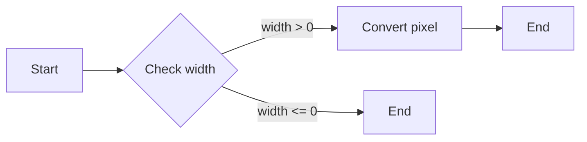

#### 带注释源码

```cpp
void color_conv_rgb24_rgb565::operator () (int8u* dst, 
                                           const int8u* src,
                                           unsigned width) const
{
    do
    {
        *(int16u*)dst = (int16u)(((unsigned(src[0]) << 8) & 0xF800) | 
                                 ((unsigned(src[1]) << 3) & 0x7E0)  |
                                 ((unsigned(src[2]) >> 3)));
        src += 3;
        dst += 2;
    }
    while(--width);
}
```


### color_conv_rgb555_to_rgb565.operator ()

将 RGB555 颜色转换为 RGB565 颜色。

参数：

- `dst`：`int8u*`，目标缓冲区的指针，用于存储转换后的 RGB565 颜色。
- `src`：`const int8u*`，源缓冲区的指针，包含要转换的 RGB555 颜色。
- `width`：`unsigned`，图像的宽度，表示需要转换的像素数量。

返回值：无

#### 流程图

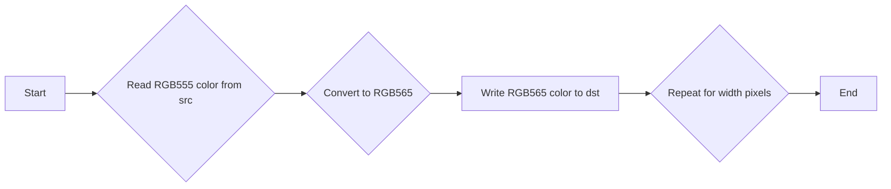

#### 带注释源码

```cpp
void color_conv_rgb555_to_rgb565::operator () (int8u* dst, 
                                              const int8u* src,
                                              unsigned width) const
{
    do
    {
        unsigned rgb = *(int16u*)src;
        *(int16u*)dst = (int16u)(((rgb << 1) & 0xFFC0) | (rgb & 0x1F));
        src += 2;
        dst += 2;
    }
    while(--width);
}
```


### color_conv_rgb565_rgb24.operator ()

将 RGB565 颜色转换为 RGB24 颜色。

参数：

- `dst`：`int8u*`，目标缓冲区的指针。
- `src`：`const int8u*`，源缓冲区的指针。
- `width`：`unsigned`，图像宽度。

返回值：无

#### 流程图

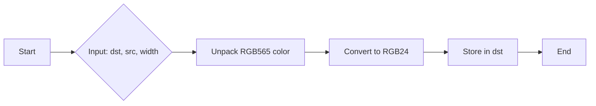

#### 带注释源码

```cpp
template<int R, int B> class color_conv_rgb565_rgb24
{
public:
    void operator () (int8u* dst, 
                      const int8u* src,
                      unsigned width) const
    {
        do
        {
            unsigned rgb = *(int16u*)src;
            dst[R] = (rgb >> 8) & 0xF8;
            dst[1] = (rgb >> 3) & 0xFC;
            dst[B] = (rgb << 3) & 0xF8;
            src += 2;
            dst += 3;
        }
        while(--width);
    }
};
```


### color_conv_rgb24_gray8.operator ()

将 RGB24 颜色转换为 Gray8 颜色。

参数：

- `dst`：`int8u*`，目标缓冲区的指针，用于存储转换后的灰度值。
- `src`：`const int8u*`，源缓冲区的指针，包含 RGB24 颜色值。
- `width`：`unsigned`，图像的宽度。

返回值：无

#### 流程图

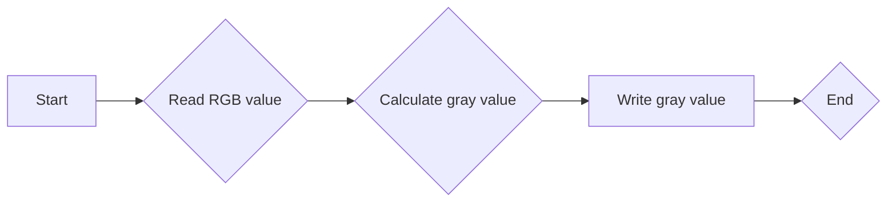

#### 带注释源码

```cpp
void operator () (int8u* dst, 
                  const int8u* src,
                  unsigned width) const
{
    do
    {
        *dst++ = (src[0]*77 + src[1]*150 + src[2]*29) >> 8;
        src += 3;
    }
    while(--width);
}
```

## 关键组件


### 张量索引与惰性加载

张量索引与惰性加载是代码中用于高效处理图像数据转换的关键组件。它允许在图像数据转换过程中仅处理需要的数据部分，从而减少内存使用和提高性能。

### 反量化支持

反量化支持是代码中用于处理图像数据反量化操作的关键组件。它能够将量化后的图像数据转换回原始数据，以便进行后续处理。

### 量化策略

量化策略是代码中用于处理图像数据量化操作的关键组件。它能够将图像数据转换成较低精度（例如8位）的数据，以减少存储空间和计算资源的使用。

### color_conv_rgb24

color_conv_rgb24是一个用于将RGB24格式的图像数据转换为BGR24格式的转换器。

### color_conv_rgba32

color_conv_rgba32是一个模板类，用于处理RGBA32格式的图像数据转换。

### color_conv_rgb24_rgba32

color_conv_rgb24_rgba32是一个模板类，用于将RGB24格式的图像数据转换为RGBA32格式。

### color_conv_rgba32_rgb24

color_conv_rgba32_rgb24是一个模板类，用于将RGBA32格式的图像数据转换回RGB24格式。

### color_conv_rgb555_rgb24

color_conv_rgb555_rgb24是一个模板类，用于将RGB555格式的图像数据转换为RGB24格式。

### color_conv_rgb24_rgb555

color_conv_rgb24_rgb555是一个模板类，用于将RGB24格式的图像数据转换回RGB555格式。

### color_conv_rgb565_rgb24

color_conv_rgb565_rgb24是一个模板类，用于将RGB565格式的图像数据转换为RGB24格式。

### color_conv_rgb24_rgb565

color_conv_rgb24_rgb565是一个模板类，用于将RGB24格式的图像数据转换回RGB565格式。

### color_conv_rgb555_rgba32

color_conv_rgb555_rgba32是一个模板类，用于将RGB555格式的图像数据转换为RGBA32格式。

### color_conv_rgba32_rgb555

color_conv_rgba32_rgb555是一个模板类，用于将RGBA32格式的图像数据转换回RGB555格式。

### color_conv_rgb565_rgba32

color_conv_rgb565_rgba32是一个模板类，用于将RGB565格式的图像数据转换为RGBA32格式。

### color_conv_rgba32_rgb565

color_conv_rgba32_rgb565是一个模板类，用于将RGBA32格式的图像数据转换回RGB565格式。

### color_conv_rgb555_to_rgb565

color_conv_rgb555_to_rgb565是一个类，用于将RGB555格式的图像数据转换为RGB565格式。

### color_conv_rgb565_to_rgb555

color_conv_rgb565_to_rgb555是一个类，用于将RGB565格式的图像数据转换回RGB555格式。

### color_conv_rgb24_gray8

color_conv_rgb24_gray8是一个模板类，用于将RGB24格式的图像数据转换为灰度8位格式。


## 问题及建议


### 已知问题

-   **代码复杂度**：代码中存在大量的模板类和函数模板，这可能导致代码难以理解和维护。
-   **性能问题**：在转换函数中，存在多次的内存访问和算术运算，这可能会影响性能。
-   **可读性**：代码中使用了大量的宏定义和类型别名，这可能会降低代码的可读性。

### 优化建议

-   **重构模板类**：考虑将一些模板类重构为非模板类，以简化代码结构并提高可读性。
-   **优化性能**：通过减少内存访问次数和优化算术运算，可以提高转换函数的性能。
-   **提高可读性**：减少宏定义和类型别名的使用，并使用更具描述性的变量和函数名，以提高代码的可读性。
-   **文档化**：为每个类和函数提供详细的文档说明，包括其功能、参数和返回值，以帮助其他开发者理解和使用代码。
-   **单元测试**：编写单元测试来验证每个转换函数的正确性，以确保代码的质量。


## 其它


### 设计目标与约束

- **设计目标**:
  - 提供一系列颜色转换函数，用于在不同颜色格式之间转换图像数据。
  - 确保转换过程高效且准确。
  - 支持多种颜色格式，包括RGB、RGBA、ARGB、ABGR、BGR、BGRA、RGB555、RGB565等。

- **约束**:
  - 转换函数必须能够处理任意大小的图像数据。
  - 转换函数必须能够在不使用额外内存的情况下执行转换。
  - 转换函数必须能够在不同的平台上编译和运行。

### 错误处理与异常设计

- **错误处理**:
  - 由于转换函数通常不涉及外部资源，因此没有特定的错误处理机制。
  - 如果输入数据不符合预期格式，转换函数将不会产生错误，而是可能产生不正确的结果。

- **异常设计**:
  - 由于转换函数不涉及外部资源，因此没有设计异常处理机制。

### 数据流与状态机

- **数据流**:
  - 数据流从源图像数据开始，通过转换函数进行处理，最终生成目标图像数据。

- **状态机**:
  - 该代码没有使用状态机，因为转换过程是线性的，不需要维护状态。

### 外部依赖与接口契约

- **外部依赖**:
  - 代码依赖于`agg_basics.h`和`agg_color_conv.h`头文件。

- **接口契约**:
  - 转换函数的接口契约定义了输入和输出参数的类型和数量。
  - 转换函数保证在给定有效的输入参数时，能够正确地执行转换并返回结果。

    