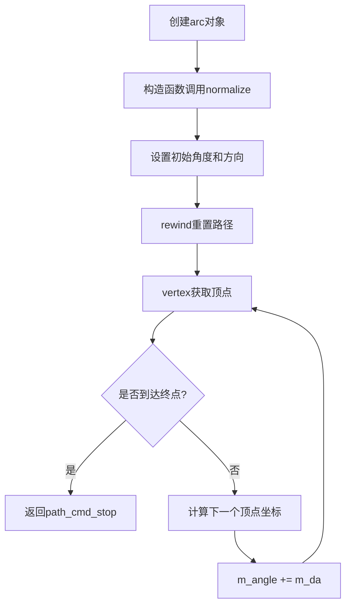
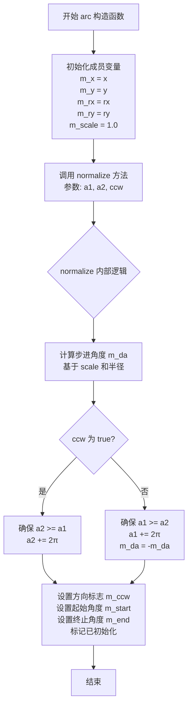
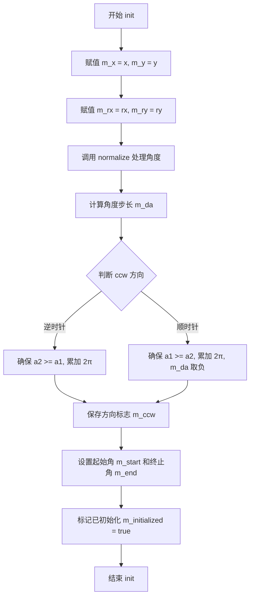
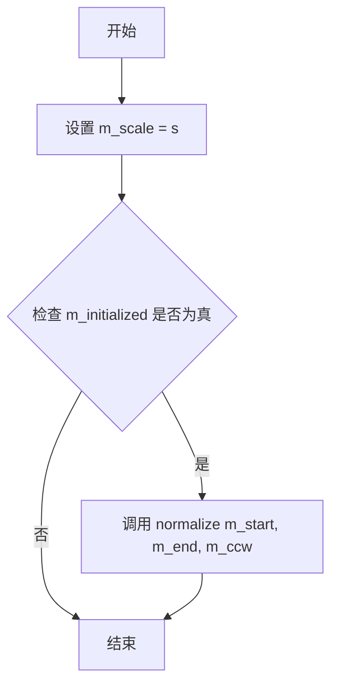
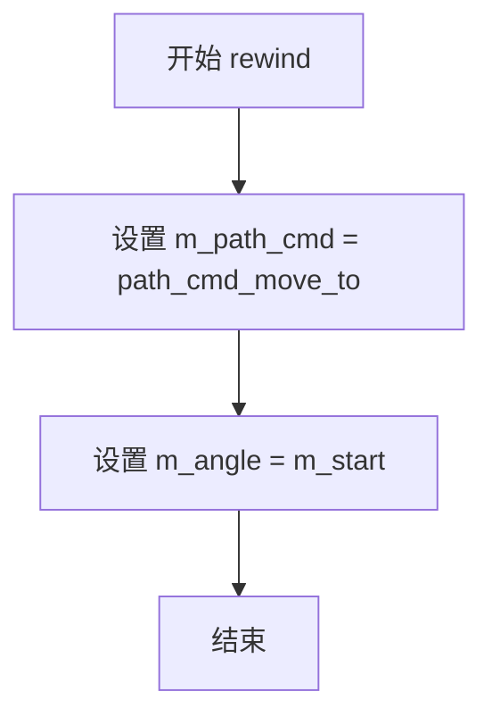
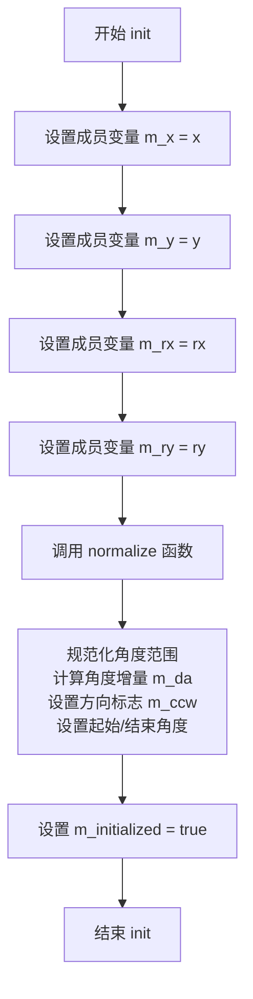
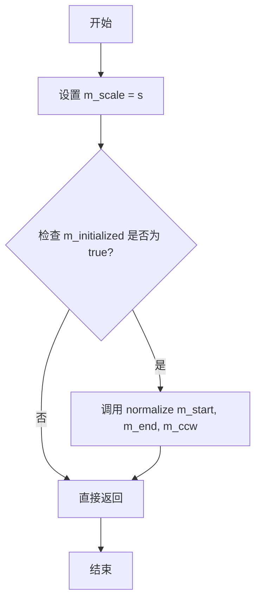

# `matplotlib\extern\agg24-svn\src\agg_arc.cpp` 详细设计文档

Anti-Grain Geometry库的弧线顶点生成器，实现椭圆弧线的参数化顶点输出，支持顺/逆时针绘制、自动角度规范化及自适应近似精度控制。

## 整体流程



## 类结构

```
agg (命名空间)
└── arc (弧线顶点生成器类)
```

## 全局变量及字段


### `arc.m_x`
    
弧线中心X坐标

类型：`double`
    


### `arc.m_y`
    
弧线中心Y坐标

类型：`double`
    


### `arc.m_rx`
    
椭圆X轴半径

类型：`double`
    


### `arc.m_ry`
    
椭圆Y轴半径

类型：`double`
    


### `arc.m_scale`
    
近似精度缩放因子

类型：`double`
    


### `arc.m_start`
    
弧线起始角度

类型：`double`
    


### `arc.m_end`
    
弧线结束角度

类型：`double`
    


### `arc.m_da`
    
角度步进增量

类型：`double`
    


### `arc.m_ccw`
    
是否逆时针绘制

类型：`bool`
    


### `arc.m_initialized`
    
初始化状态标志

类型：`bool`
    


### `arc.m_path_cmd`
    
当前路径命令

类型：`unsigned`
    


### `arc.m_angle`
    
当前角度

类型：`double`
    
    

## 全局函数及方法


### `arc.normalize`

该私有方法用于计算角度增量并规范化起止角度，根据逆时针标志调整角度范围，确保弧的起始和终止角度正确，同时初始化相关的角度状态标志。

参数：

- `a1`：`double`，起始角度（弧度）
- `a2`：`double`，终止角度（弧度）
- `ccw`：`bool`，逆时针标志，true表示逆时针，false表示顺时针

返回值：`void`，无返回值

#### 流程图

```mermaid
flowchart TD
    A[开始 normalize] --> B[计算平均半径: ra = (|m_rx| + |m_ry|) / 2]
    B --> C[计算角度增量: m_da = acos(ra / (ra + 0.125 / m_scale)) * 2]
    C --> D{ccw 为 true?}
    D -->|Yes| E[逆时针: while a2 < a1, a2 += 2π]
    D -->|No| F[顺时针: while a1 < a2, a1 += 2π]
    E --> G[m_da = -m_da]
    F --> G
    G --> H[设置成员变量: m_ccw, m_start, m_end, m_initialized]
    H --> I[结束]
```

#### 带注释源码

```cpp
//------------------------------------------------------------------------
// 规范化弧的角度参数
// a1: 起始角度（弧度）
// a2: 终止角度（弧度）
// ccw: 逆时针标志，true为逆时针，false为顺时针
//------------------------------------------------------------------------
void arc::normalize(double a1, double a2, bool ccw)
{
    // 计算椭圆rx和ry的平均半径，用于角度增量计算
    double ra = (fabs(m_rx) + fabs(m_ry)) / 2;
    
    // 计算角度增量m_da，使用反余弦函数计算步进角度
    // 公式: da = 2 * acos(ra / (ra + 0.125 / scale))
    // 0.125是精度控制因子，m_scale是近似缩放因子
    m_da = acos(ra / (ra + 0.125 / m_scale)) * 2;
    
    // 根据旋转方向（逆时针/顺时针）调整角度范围
    if(ccw)
    {
        // 逆时针旋转：确保终止角度大于起始角度
        // 通过累加2π使a2 >= a1
        while(a2 < a1) a2 += pi * 2.0;
    }
    else
    {
        // 顺时针旋转：确保起始角度大于终止角度
        // 通过累加2π使a1 >= a2
        while(a1 < a2) a1 += pi * 2.0;
        // 顺时针方向角度增量为负值
        m_da = -m_da;
    }
    
    // 保存旋转方向标志
    m_ccw   = ccw;
    // 保存规范化后的起始和终止角度
    m_start = a1;
    m_end   = a2;
    // 标记弧已初始化
    m_initialized = true;
}
```


### `arc::arc`

构造函数，初始化弧线的中心点坐标、半径、起始和终止角度，并调用normalize方法进行角度标准化处理。

参数：

- `x`：`double`，弧线中心点的X坐标
- `y`：`double`，弧线中心点的Y坐标
- `rx`：`double`，弧线在X轴方向的半径
- `ry`：`double`，弧线在Y轴方向的半径
- `a1`：`double`，弧线的起始角度（弧度制）
- `a2`：`double`，弧线的终止角度（弧度制）
- `ccw`：`bool`，弧线绘制方向，true表示逆时针，false表示顺时针

返回值：`无`（构造函数无返回值）

#### 流程图



#### 带注释源码

```cpp
//------------------------------------------------------------------------
// Arc 类的构造函数实现
// 参数说明：
//   x, y   - 弧线中心点坐标
//   rx, ry - 椭圆弧在X和Y方向的半径
//   a1, a2 - 起始和终止角度（弧度）
//   ccw    - 绘制方向：true=逆时针, false=顺时针
//------------------------------------------------------------------------
arc::arc(double x,  double y, 
         double rx, double ry, 
         double a1, double a2, 
         bool ccw) :
    // 使用初始化列表直接初始化成员变量
    m_x(x), m_y(y),     // 设置弧线中心点坐标
    m_rx(rx), m_ry(ry), // 设置椭圆弧的两个半径
    m_scale(1.0)        // 初始化缩放因子为默认值1.0
{
    // 调用 normalize 方法对角度进行标准化处理
    // 该方法会根据 ccw 方向调整角度范围，
    // 并计算弧线绘制的步进角度 m_da
    normalize(a1, a2, ccw);
}
```


### `arc::init`

初始化或重置弧线（Arc）的参数，包括圆心坐标、半径和角度，并调用 normalize() 方法进行角度标准化和方向处理。

参数：

- `x`：`double`，圆心的 X 坐标
- `y`：`double`，圆心的 Y 坐标
- `rx`：`double`，弧线在 X 轴方向的半径
- `ry`：`double`，弧线在 Y 轴方向的半径
- `a1`：`double`，弧线的起始角度（弧度制）
- `a2`：`double`，弧线的终止角度（弧度制）
- `ccw`：`bool`，指定绘制方向是否为逆时针（true 表示逆时针，false 表示顺时针）

返回值：`void`，无返回值

#### 流程图



#### 带注释源码

```cpp
//------------------------------------------------------------------------
// 初始化或重置弧线参数
// 参数：
//   x, y  - 圆心坐标
//   rx, ry - 椭圆半径（X轴和Y轴方向）
//   a1, a2 - 起始和终止角度（弧度）
//   ccw    - 是否逆时针绘制
//------------------------------------------------------------------------
void arc::init(double x,  double y, 
               double rx, double ry, 
               double a1, double a2, 
               bool ccw)
{
    // 1. 设置圆心坐标
    m_x   = x;  m_y  = y;
    
    // 2. 设置椭圆半径
    m_rx  = rx; m_ry = ry; 
    
    // 3. 调用 normalize 方法进行角度标准化和方向处理
    normalize(a1, a2, ccw);
}
```


### `arc::approximation_scale`

设置近似精度比例因子，如果弧线已初始化则重新规范化弧线参数。

参数：

- `s`：`double`，近似精度比例因子，用于控制弧线的顶点生成精度

返回值：`void`，无返回值

#### 流程图



#### 带注释源码

```cpp
//------------------------------------------------------------------------
// 设置近似精度比例因子并重新规范化弧线
//------------------------------------------------------------------------
void arc::approximation_scale(double s)
{
    // 将传入的比例因子 s 赋值给成员变量 m_scale
    m_scale = s;
    
    // 如果弧线已经初始化过，则需要重新计算弧线参数
    // 这是因为近似精度改变会影响弧线的顶点生成
    if(m_initialized)
    {
        // 使用当前的起始角、终止角和方向重新调用 normalize
        // normalize 会根据新的 m_scale 值重新计算角度步长 m_da
        normalize(m_start, m_end, m_ccw);
    }
}
```


### `arc::rewind`

该方法实现了顶点源接口（Vertex Source Interface），用于重置弧线生成器的内部状态，将路径命令重置为移动到起始点，并将当前角度重置为起始角度，以便重新生成弧线路径。

参数：

- `{unnamed}`：`unsigned`，未使用的参数，保留用于顶点源接口兼容性

返回值：`void`，无返回值

#### 流程图



#### 带注释源码

```cpp
//------------------------------------------------------------------------
// 重置弧线生成器的内部状态，准备重新生成顶点
// 该方法实现了顶点源接口（Vertex Source Interface）
//------------------------------------------------------------------------
void arc::rewind(unsigned)
{
    // 将路径命令设置为 path_cmd_move_to，表示下一个顶点是路径的起始点
    m_path_cmd = path_cmd_move_to; 
    
    // 将当前角度重置为起始角度，从弧线的起点开始生成顶点
    m_angle = m_start;
}
```


### `arc::vertex`

该方法是弧线顶点生成器的核心实现，通过迭代计算弧线上各顶点的坐标，并按路径命令序列输出顶点，直至弧线绘制完成。

参数：

- `x`：`double*`，指向用于接收生成顶点 x 坐标的指针参数。
- `y`：`double*`，指向用于接收生成顶点 y 坐标的指针参数。

返回值：`unsigned`，返回当前顶点的路径命令（如 `path_cmd_move_to`、`path_cmd_line_to` 或 `path_cmd_stop`）。

#### 流程图

```mermaid
flowchart TD
    A([开始 vertex]) --> B{is_stop(m_path_cmd)?}
    B -->|是| C[返回 path_cmd_stop]
    B -->|否| D{(m_angle < m_end - m_da/4) != m_ccw?}
    D -->|是| E[计算终点坐标: x = m_x + cos(m_end) * m_rx, y = m_y + sin(m_end) * m_ry]
    E --> F[m_path_cmd = path_cmd_stop]
    F --> G[返回 path_cmd_line_to]
    D -->|否| H[计算当前顶点坐标: x = m_x + cos(m_angle) * m_rx, y = m_y + sin(m_angle) * m_ry]
    H --> I[m_angle += m_da]
    I --> J[pf = m_path_cmd]
    J --> K[m_path_cmd = path_cmd_line_to]
    K --> L([返回 pf])
```

#### 带注释源码

```cpp
//----------------------------------------------------------------------------
// 生成弧线顶点，每次调用返回一个顶点坐标和对应的路径命令
//----------------------------------------------------------------------------
unsigned arc::vertex(double* x, double* y)
{
    // 如果路径命令已停止，直接返回停止命令
    if(is_stop(m_path_cmd)) return path_cmd_stop;
    
    // 检查是否到达弧线终点：通过判断当前角度是否小于终点角度（考虑步长和方向）
    // 如果到达终点，计算终点坐标，并设置路径命令为停止，返回线段命令
    if((m_angle < m_end - m_da/4) != m_ccw)
    {
        *x = m_x + cos(m_end) * m_rx;
        *y = m_y + sin(m_end) * m_ry;
        m_path_cmd = path_cmd_stop;
        return path_cmd_line_to;
    }

    // 计算当前角度对应的顶点坐标（椭圆参数方程）
    *x = m_x + cos(m_angle) * m_rx;
    *y = m_y + sin(m_angle) * m_ry;

    // 增加角度步长，为下一次调用做准备
    m_angle += m_da;

    // 保存当前的路径命令（首次调用为 move_to，后续为 line_to）
    unsigned pf = m_path_cmd;
    // 将路径命令设置为 line_to（因为后续顶点都是线段）
    m_path_cmd = path_cmd_line_to;
    // 返回之前的路径命令
    return pf;
}
```


### `arc.arc()`

这是arc类的构造函数，用于初始化椭圆弧的所有参数，并通过normalize方法处理角度参数。

参数：

- `x`：`double`，椭圆弧中心的X坐标
- `y`：`double`，椭圆弧中心的Y坐标
- `rx`：`double`，椭圆弧X轴方向的半径
- `ry`：`double`，椭圆弧Y轴方向的半径
- `a1`：`double`，弧的起始角度（弧度制）
- `a2`：`double`，弧的结束角度（弧度制）
- `ccw`：`bool`，是否为逆时针方向（true表示逆时针，false表示顺时针）

返回值：`无`（构造函数，隐式返回构造的arc对象实例）

#### 流程图

```mermaid
graph TD
    A[开始 arc 构造函数] --> B[接收参数: x, y, rx, ry, a1, a2, ccw]
    B --> C[初始化成员变量: m_x = x, m_y = y]
    C --> D[初始化成员变量: m_rx = rx, m_ry = ry]
    D --> E[初始化成员变量: m_scale = 1.0]
    E --> F[调用 normalize 方法]
    F --> G[计算平均半径: ra = (|m_rx| + |m_ry|) / 2]
    G --> H[计算角度步长: m_da = acos(ra / (ra + 0.125 / m_scale)) * 2]
    H --> I{ccw 为 true?}
    I -->|是| J[确保 a2 >= a1: while a2 < a1, a2 += 2π]
    I -->|否| K[确保 a1 >= a2: while a1 < a2, a1 += 2π]
    J --> L[设置 m_da 为正]
    K --> L
    L --> M[设置成员变量: m_ccw, m_start, m_end]
    M --> N[设置 m_initialized = true]
    N --> O[结束构造函数]
```

#### 带注释源码

```cpp
//------------------------------------------------------------------------
// arc 类的构造函数
// 用于创建椭圆弧生成器对象
// 参数：
//   x, y  - 椭圆弧的中心点坐标
//   rx, ry - 椭圆弧在X和Y方向的半径
//   a1, a2 - 起始和结束角度（弧度）
//   ccw   - 逆时针标志，true表示逆时针，false表示顺时针
//------------------------------------------------------------------------
arc::arc(double x,  double y, 
         double rx, double ry, 
         double a1, double a2, 
         bool ccw) :
    // 初始化列表：直接初始化成员变量
    m_x(x), m_y(y),       // 设置椭圆中心坐标
    m_rx(rx), m_ry(ry),   // 设置椭圆X和Y方向的半径
    m_scale(1.0)          // 初始化缩放比例为1.0
{
    // 调用normalize方法处理角度参数
    // 该方法会根据ccw标志调整角度范围，并计算角度步长m_da
    normalize(a1, a2, ccw);
}
```


### `arc::init()`

初始化弧线参数函数，用于设置弧线的中心点坐标、半径、起始和结束角度，并自动规范化角度范围。

参数：

- `x`：`double`，弧线中心点的X坐标
- `y`：`double`，弧线中心点的Y坐标
- `rx`：`double`，弧线在X轴方向的半径
- `ry`：`double`，弧线在Y轴方向的半径
- `a1`：`double`，弧线起始角度（弧度值）
- `a2`：`double`，弧线结束角度（弧度值）
- `ccw`：`bool`，是否逆时针方向绘制（true为逆时针，false为顺时针）

返回值：`void`，无返回值

#### 流程图



#### 带注释源码

```cpp
//------------------------------------------------------------------------
// 初始化弧线参数函数
// 参数:
//   x   - 弧线中心点X坐标
//   y   - 弧线中心点Y坐标
//   rx  - 弧线X轴半径
//   ry  - 弧线Y轴半径
//   a1  - 起始角度（弧度）
//   a2  - 结束角度（弧度）
//   ccw - 逆时针标志（true表示逆时针，false表示顺时针）
// 返回值: void
//------------------------------------------------------------------------
void arc::init(double x,  double y, 
               double rx, double ry, 
               double a1, double a2, 
               bool ccw)
{
    // 设置弧线中心点坐标
    m_x   = x;  
    m_y   = y;
    
    // 设置弧线X轴和Y轴半径
    m_rx  = rx; 
    m_ry  = ry; 
    
    // 调用规范化函数，处理角度范围并计算相关参数
    // 该函数会:
    // 1. 根据半径和缩放因子计算角度增量m_da
    // 2. 根据ccw标志规范化角度范围
    // 3. 设置起始角度m_start和结束角度m_end
    // 4. 设置方向标志m_ccw
    // 5. 将m_initialized设置为true表示已初始化
    normalize(a1, a2, ccw);
}
```


### `arc.approximation_scale`

设置弧线的近似精度缩放因子，用于控制弧线生成的顶点数量。该方法会更新内部缩放值，如果弧线已经初始化，则会重新计算弧线的角度增量以应用新的精度设置。

参数：

- `s`：`double`，近似精度缩放因子，值越大生成的顶点越多，曲线越平滑

返回值：`void`，无返回值

#### 流程图



#### 带注释源码

```
//------------------------------------------------------------------------
// 设置近似精度缩放因子
// 参数: s - double类型，近似精度缩放因子
// 返回值: void，无返回值
// 说明: 更新内部缩放值，如果弧线已初始化则重新计算角度增量
//------------------------------------------------------------------------
void arc::approximation_scale(double s)
{
    m_scale = s;                                    // 保存传入的缩放因子
    if(m_initialized)                               // 检查弧线是否已初始化
    {
        normalize(m_start, m_end, m_ccw);           // 重新规范化弧线参数
    }
}
```


### `arc::rewind`

重置弧线路径遍历的内部状态，将路径命令重置为移动到起始点，并将当前角度重置为弧线起始角度，以便重新开始生成顶点数据。

参数：

- `unsued`：`unsigned`，未使用的参数，保留为接口兼容性（通常传入路径标识符，但在此实现中未使用）

返回值：`void`，无返回值

#### 流程图


#### 带注释源码

```
//------------------------------------------------------------------------
// 重置路径遍历 - 将弧线生成器恢复到初始状态
// 参数：unsigned - 未使用的参数，保留为接口兼容性
//------------------------------------------------------------------------
void arc::rewind(unsigned)
{
    // 将路径命令重置为 move_to，表示开始新的子路径
    m_path_cmd = path_cmd_move_to; 
    
    // 将当前角度重置为弧线的起始角度，从头开始生成顶点
    m_angle = m_start;
}
```


### `arc.vertex()`

该函数是弧线顶点生成器的核心方法，用于逐步生成弧线路径上的每个顶点坐标。它通过角度累加的方式计算下一个顶点位置，并根据当前状态返回相应的路径命令（move_to、line_to 或 stop）。

参数：

- `x`：`double*`，指向存储输出顶点X坐标的指针
- `y`：`double*`，指向存储输出顶点Y坐标的指针

返回值：`unsigned`，返回路径命令类型，包括 `path_cmd_move_to`（起始移动）、`path_cmd_line_to`（线段连接）和 `path_cmd_stop`（路径结束）

#### 流程图

```mermaid
flowchart TD
    A[开始 vertex] --> B{路径命令是否为 stop?}
    B -->|是| C[返回 path_cmd_stop]
    B -->|否| D{角度是否超出终点?<br/>根据 ccw 方向判断}
    D -->|是| E[计算终点坐标<br/>x = mx + cos(m_end) * m_rx<br/>y = my + sin(m_end) * m_ry]
    E --> F[设置路径命令为 stop]
    F --> G[返回 path_cmd_line_to]
    D -->|否| H[计算当前角度顶点<br/>x = mx + cos(m_angle) * m_rx<br/>y = my + sin(m_angle) * m_ry]
    H --> I[角度增加步长<br/>m_angle += m_da]
    I --> J[保存当前路径命令]
    J --> K[设置路径命令为 line_to]
    K --> L[返回之前保存的路径命令]
```

#### 带注释源码

```cpp
//------------------------------------------------------------------------
// 生成弧线的下一个顶点
// 参数:
//   x - 输出参数，返回顶点的X坐标
//   y - 输出参数，返回顶点的Y坐标
// 返回值:
//   unsigned - 路径命令类型
//------------------------------------------------------------------------
unsigned arc::vertex(double* x, double* y)
{
    // 检查路径是否已经结束，如果是则直接返回停止命令
    if(is_stop(m_path_cmd)) return path_cmd_stop;
    
    // 判断当前角度是否已经到达或超过终点
    // 根据ccw（逆时针）方向决定比较逻辑
    // 如果角度已达到终点范围，则生成终点并结束路径
    if((m_angle < m_end - m_da/4) != m_ccw)
    {
        // 计算弧线终点的坐标
        *x = m_x + cos(m_end) * m_rx;
        *y = m_y + sin(m_end) * m_ry;
        
        // 设置路径命令为停止状态
        m_path_cmd = path_cmd_stop;
        
        // 返回线段命令，连接到终点
        return path_cmd_line_to;
    }

    // 计算当前角度对应的顶点坐标
    // 使用参数方程: x = xc + cos(angle) * rx, y = yc + sin(angle) * ry
    *x = m_x + cos(m_angle) * m_rx;
    *y = m_y + sin(m_angle) * m_ry;

    // 角度增加步长，准备生成下一个顶点
    m_angle += m_da;

    // 保存当前路径命令（在返回前保存，因为接下来会改变命令状态）
    unsigned pf = m_path_cmd;
    
    // 将路径命令设置为line_to，后续顶点都使用线段连接
    m_path_cmd = path_cmd_line_to;
    
    // 返回之前的路径命令（首次调用返回move_to，后续返回line_to）
    return pf;
}
```


### `arc.normalize`

规范化角度范围，根据起始角度、结束角度和方向（顺时针/逆时针）计算步进角度，并初始化相关成员变量。

参数：
- `a1`：`double`，起始角度（弧度）。
- `a2`：`double`，结束角度（弧度）。
- `ccw`：`bool`，是否为逆时针方向（true 表示逆时针，false 表示顺时针）。

返回值：`void`，无返回值。

#### 流程图

```mermaid
flowchart TD
    A[开始] --> B[计算平均半径 ra = (|m_rx| + |m_ry|) / 2]
    B --> C[计算步进角度 m_da = acos(ra / (ra + 0.125 / m_scale)) * 2]
    C --> D{ccw == true?}
    D -->|Yes| E[调整 a2: while a2 < a1, a2 += 2π]
    E --> F[设置 m_ccw = true, m_start = a1, m_end = a2]
    D -->|No| G[调整 a1: while a1 < a2, a1 += 2π]
    G --> H[m_da = -m_da]
    H --> F
    F --> I[标记 m_initialized = true]
    I --> J[结束]
```

#### 带注释源码

```cpp
//------------------------------------------------------------------------
// 规范化角度范围
//------------------------------------------------------------------------
void arc::normalize(double a1, double a2, bool ccw)
{
    // 计算平均半径，用于确定角度步进大小
    double ra = (fabs(m_rx) + fabs(m_ry)) / 2;
    
    // 根据近似比例计算步进角度 m_da
    // 使用反三角函数 acos 计算，使得弧线在当前缩放比例下足够平滑
    m_da = acos(ra / (ra + 0.125 / m_scale)) * 2;
    
    if(ccw)
    {
        // 逆时针方向：确保结束角度不小于起始角度
        while(a2 < a1) a2 += pi * 2.0;
    }
    else
    {
        // 顺时针方向：确保起始角度不小于结束角度
        while(a1 < a2) a1 += pi * 2.0;
        
        // 顺时针时，角度递减，步进角度取反
        m_da = -m_da;
    }
    
    // 保存方向、起始角度、结束角度，并标记为已初始化
    m_ccw   = ccw;
    m_start = a1;
    m_end   = a2;
    m_initialized = true;
}
```

## 关键组件


### arc 类

弧线顶点生成器类，用于根据给定的椭圆参数（中心点、半径、起始角度、终止角度）生成近似弧线的顶点序列。该类是 Anti-Grain Geometry 库中路径生成器的重要组成部分，实现了 path_vertices 接口。

### normalize 方法

角度规范化方法，根据顺时针/逆时针标志将起始和终止角度标准化到合理范围，并计算角度步长（m_da）用于顶点生成的近似计算。

### vertex 方法

顶点生成方法，依次返回弧线上的每个顶点坐标。该方法使用当前角度计算椭圆上的点，然后递增角度值，是弧线生成的核心迭代器。

### rewind 方法

路径重置方法，将弧线生成器重置为初始状态，准备重新生成顶点序列。

### approximation_scale 方法

近似尺度设置方法，用于控制弧线逼近的精度，影响角度步长 m_da 的计算。

### 构造函数 arc(x, y, rx, ry, a1, a2, ccw)

带参数的构造函数，直接初始化弧线的中心点坐标、椭圆半径、起始角度、终止角度和旋转方向。

### init 方法

弧线参数初始化方法，与构造函数功能相同，用于在对象创建后重新设置弧线参数。


## 问题及建议


### 已知问题

- **除零风险**：在 `normalize()` 函数中，当 `m_rx` 和 `m_ry` 均为 0 时，`ra` 计算为 0，导致 `acos(ra / (ra + 0.125 / m_scale))` 产生除零错误
- **缩放值为零**：当 `m_scale` 为 0 时，`0.125 / m_scale` 会导致除零异常
- **浮点精度问题**：`vertex()` 函数中 `m_angle < m_end - m_da/4` 的比较可能因浮点精度误差导致弧线终点计算不准确
- **参数值传递副作用**：在 `normalize()` 中通过 while 循环修改局部变量 `a1` 和 `a2`，这些是按值传递的参数，修改不影响调用者，可能导致代码理解和维护问题
- **完整圆弧处理**：当 `a1` 和 `a2` 相差 2π 的整数倍时，可能因浮点精度导致弧线无法正确闭合
- **缺少输入验证**：构造函数和 `init()` 方法未验证 `rx`、`ry` 为负数或 `a1`、`a2` 为 NaN/Inf 的情况

### 优化建议

- 在 `normalize()` 入口处添加参数有效性检查，确保 `m_rx` 和 `m_ry` 非负，`m_scale` 大于 0
- 考虑使用 `std::fabs` 替代 `fabs`，提高代码一致性
- 对于完整圆弧（角度差接近 2π 的整数倍），添加特殊处理逻辑
- 将角度标准化为 [0, 2π) 范围，简化边界条件判断
- 考虑使用更鲁棒的浮点比较方法（如 epsilon 比较）替代直接比较
- 添加 `explicit` 关键字到单参数构造函数（如果存在的话）
- 将魔法数字（如 0.125、2.0）提取为命名常量，提高可读性和可维护性


## 其它


### 设计目标与约束

该弧线顶点生成器的核心设计目标是提供一种高效、精确的椭圆弧线近似算法，能够将数学意义上的椭圆弧转换为一系列离散的顶点（线段），供图形渲染系统使用。设计约束包括：输入的角度参数支持任意范围（通过归一化处理）、支持顺时针和逆时针两种绘制方向、通过近似比例因子控制生成顶点的密度以平衡精度与性能、仅依赖标准数学库（math.h）确保跨平台兼容性。

### 错误处理与异常设计

该组件采用错误容忍而非异常抛出的设计哲学。当输入的半径rx或ry为负数时，fabs()函数会自动取其绝对值进行处理。对于角度参数，通过while循环确保a1和a2的相对关系符合ccw参数的语义。数值稳定性方面，在计算近似步长时使用ra + 0.125 / m_scale作为分母，避免除零错误。当m_scale为0时，会导致除零，但由于m_scale有默认值1.0，且approximation_scale()方法会先设置m_scale再调用normalize()，因此实际使用中不会出现该问题。

### 数据流与状态机

该类实现了顶点生成器的状态机模式。状态转换如下：初始状态（m_path_cmd = path_cmd_move_to）-> 绘制状态（m_path_cmd = path_cmd_line_to）-> 停止状态（m_path_cmd = path_cmd_stop）。在vertex()方法中，每次调用会根据当前m_angle与m_end的关系决定是继续生成顶点还是返回停止命令。状态转换由m_angle的递进驱动，每调用一次vertex()，m_angle增加m_da，直到跨越终点为止。

### 外部依赖与接口契约

该组件依赖以下外部依赖：math.h头文件（提供cos、sin、acos、fabs函数和M_PI/pi常量）。接口契约方面：该类实现了顶点生成器接口（通过rewind()和vertex()方法），调用方需按照以下顺序使用：首先调用rewind(unsigned)重置状态，然后循环调用vertex(double*, double*)获取顶点，当返回值为path_cmd_stop时停止。输入参数x、y为弧心坐标，rx、ry为椭圆半轴长度，a1、a2为起始和终止角度（弧度），ccw为true表示逆时针绘制。

### 数学模型与算法说明

该弧线生成器采用等角度步长近似算法。核心算法在于normalize()方法中计算角度步长m_da：m_da = acos(ra / (ra + 0.125 / m_scale)) * 2，其中ra = (|rx| + |ry|) / 2。该公式的数学原理是：对于椭圆弧上的任意一点，到弧心的距离随角度变化，为保证弦长误差一致，需要动态调整角度步长。m_scale参数控制近似精度，m_scale越大，m_da越小，生成的顶点越多，近似误差越小。默认m_scale = 1.0时，m_da约为0.67弧度（约38度），即每个弧段约由6个顶点组成。

### 精度与数值稳定性

该组件使用double类型（64位浮点）进行所有计算，能够满足大多数图形渲染的精度需求。数值稳定性措施包括：使用fabs()处理负半径、避免除零的 safeguard（0.125 / m_scale项）、通过while循环处理角度溢出。对于极端情况（如rx和ry都接近0），ra会接近0，导致acos参数接近1，m_da会变得非常小，可能会生成大量顶点，此时调用方需要注意性能影响。

### 内存管理

该类不进行动态内存分配，所有状态存储在栈上的成员变量中。对象通常作为临时变量在栈上创建，或作为成员变量嵌入到其他类中。这种设计使得该类具有极低的内存开销和良好的缓存局部性，适合在高性能渲染场景中使用。

### 性能特征

时间复杂度方面，每次调用vertex()的时间复杂度为O(1)，生成完整弧线的总时间与顶点数成线性关系。空间复杂度为O(1)，仅使用固定数量的成员变量。性能优化建议：如果需要频繁创建相同的弧线，可以考虑缓存生成的顶点数组，但当前设计优先考虑简单性和低内存开销。

### 使用示例与调用模式

典型调用模式如下：首先创建arc对象（构造或init初始化），然后调用rewind(0)重置，接着循环调用vertex(&x, &y)获取顶点序列，最后遇到path_cmd_stop结束。示例代码：
```cpp
agg::arc a(100, 100, 50, 30, 0, M_PI, true);
a.rewind(0);
double x, y;
while(a.vertex(&x, &y) != agg::path_cmd_stop) {
    // 处理顶点(x, y)
}
```

### 兼容性考虑

该代码使用标准C++和C库编写，兼容大多数编译器。math.h中的M_PI可能不是ISO C标准定义，在某些编译器下需要定义_STDC_MACROS或使用acos(-1.0)替代。该代码使用namespace agg，避免与用户代码发生命名冲突。double类型的使用确保了在绝大多数平台下的一致性。

    