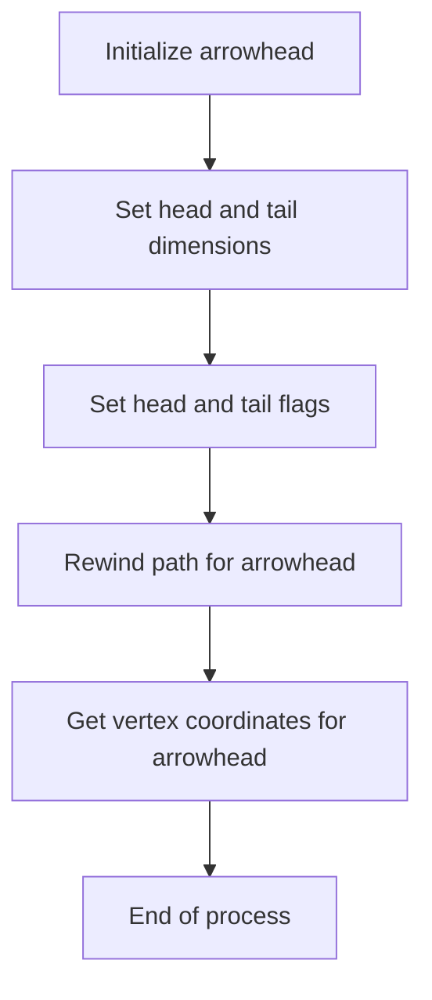
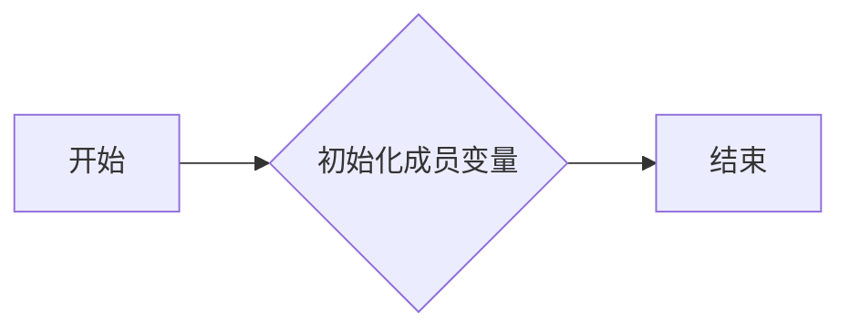
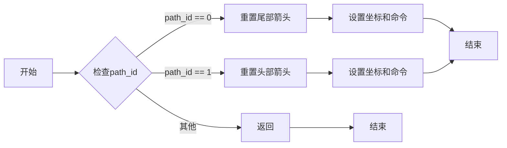
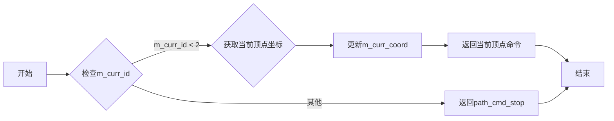
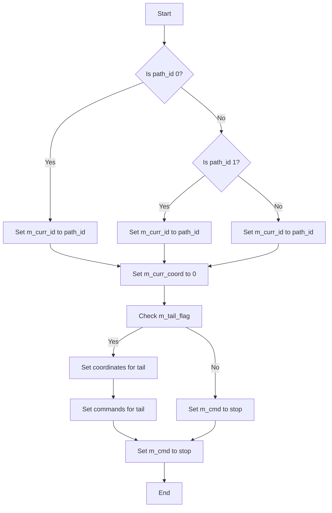

# `matplotlib\extern\agg24-svn\src\agg_arrowhead.cpp` 详细设计文档

This code defines a class 'arrowhead' that generates arrowheads for graphical representations, with customizable head and tail sizes and flags to enable or disable them.

## 整体流程



## 类结构

```
arrowhead (Concrete class)
```

## 全局变量及字段


### `path_cmd_stop`
    
Command to stop the path drawing.

类型：`path_cmd`
    


### `path_cmd_move_to`
    
Command to move the pen to a new position without drawing.

类型：`path_cmd`
    


### `path_cmd_line_to`
    
Command to draw a line to a new position.

类型：`path_cmd`
    


### `path_cmd_end_poly`
    
Command to end a polygon path.

类型：`path_cmd`
    


### `path_flags_close`
    
Flag to indicate that the path should be closed.

类型：`path_flags`
    


### `path_flags_ccw`
    
Flag to indicate that the path should be drawn in a counter-clockwise direction.

类型：`path_flags`
    


### `arrowhead.m_head_d1`
    
The size of the first dimension of the arrowhead.

类型：`double`
    


### `arrowhead.m_head_d2`
    
The size of the second dimension of the arrowhead.

类型：`double`
    


### `arrowhead.m_head_d3`
    
The size of the third dimension of the arrowhead.

类型：`double`
    


### `arrowhead.m_head_d4`
    
The size of the fourth dimension of the arrowhead.

类型：`double`
    


### `arrowhead.m_tail_d1`
    
The size of the first dimension of the arrow tail.

类型：`double`
    


### `arrowhead.m_tail_d2`
    
The size of the second dimension of the arrow tail.

类型：`double`
    


### `arrowhead.m_tail_d3`
    
The size of the third dimension of the arrow tail.

类型：`double`
    


### `arrowhead.m_tail_d4`
    
The size of the fourth dimension of the arrow tail.

类型：`double`
    


### `arrowhead.m_head_flag`
    
Flag to enable or disable the arrowhead.

类型：`bool`
    


### `arrowhead.m_tail_flag`
    
Flag to enable or disable the arrow tail.

类型：`bool`
    


### `arrowhead.m_curr_id`
    
Current path ID.

类型：`unsigned`
    


### `arrowhead.m_curr_coord`
    
Current coordinate index.

类型：`unsigned`
    


### `arrowhead.m_cmd`
    
Array of commands for the path.

类型：`path_cmd[]`
    


### `arrowhead.m_coord`
    
Array of coordinates for the path.

类型：`double[]`
    
    

## 全局函数及方法


### arrowhead::arrowhead()

构造函数，用于初始化arrowhead类的实例。

参数：

- 无

返回值：无

#### 流程图



#### 带注释源码

```cpp
arrowhead::arrowhead() :
    m_head_d1(1.0),
    m_head_d2(1.0),
    m_head_d3(1.0),
    m_head_d4(0.0),
    m_tail_d1(1.0),
    m_tail_d2(1.0),
    m_tail_d3(1.0),
    m_tail_d4(0.0),
    m_head_flag(false),
    m_tail_flag(false),
    m_curr_id(0),
    m_curr_coord(0)
{
    // 初始化成员变量
}
```


### arrowhead::rewind(unsigned path_id)

重置箭头路径到指定的路径ID。

参数：

- `path_id`：`unsigned`，指定要重置的路径ID。

返回值：无

#### 流程图



#### 带注释源码

```cpp
void arrowhead::rewind(unsigned path_id)
{
    m_curr_id = path_id;
    m_curr_coord = 0;
    if(path_id == 0)
    {
        if(!m_tail_flag)
        {
            m_cmd[0] = path_cmd_stop;
            return;
        }
        m_coord[0]  =  m_tail_d1;             m_coord[1]  =  0.0;
        m_coord[2]  =  m_tail_d1 - m_tail_d4; m_coord[3]  =  m_tail_d3;
        m_coord[4]  = -m_tail_d2 - m_tail_d4; m_coord[5]  =  m_tail_d3;
        m_coord[6]  = -m_tail_d2;             m_coord[7]  =  0.0;
        m_coord[8]  = -m_tail_d2 - m_tail_d4; m_coord[9]  = -m_tail_d3;
        m_coord[10] =  m_tail_d1 - m_tail_d4; m_coord[11] = -m_tail_d3;

        m_cmd[0] = path_cmd_move_to;
        m_cmd[1] = path_cmd_line_to;
        m_cmd[2] = path_cmd_line_to;
        m_cmd[3] = path_cmd_line_to;
        m_cmd[4] = path_cmd_line_to;
        m_cmd[5] = path_cmd_line_to;
        m_cmd[7] = path_cmd_end_poly | path_flags_close | path_flags_ccw;
        m_cmd[6] = path_cmd_stop;
        return;
    }

    if(path_id == 1)
    {
        if(!m_head_flag)
        {
            m_cmd[0] = path_cmd_stop;
            return;
        }
        m_coord[0]  = -m_head_d1;            m_coord[1]  = 0.0;
        m_coord[2]  = m_head_d2 + m_head_d4; m_coord[3]  = -m_head_d3;
        m_coord[4]  = m_head_d2;             m_coord[5]  = 0.0;
        m_coord[6]  = m_head_d2 + m_head_d4; m_coord[7]  = m_head_d3;

        m_cmd[0] = path_cmd_move_to;
        m_cmd[1] = path_cmd_line_to;
        m_cmd[2] = path_cmd_line_to;
        m_cmd[3] = path_cmd_line_to;
        m_cmd[4] = path_cmd_end_poly | path_flags_close | path_flags_ccw;
        m_cmd[5] = path_cmd_stop;
        return;
    }
}
```


### arrowhead::vertex(double* x, double* y)

获取箭头路径的顶点坐标。

参数：

- `x`：`double*`，指向用于存储x坐标的变量的指针。
- `y`：`double*`，指向用于存储y坐标的变量的指针。

返回值：`unsigned`，返回当前顶点的命令或`path_cmd_stop`。

#### 流程图



#### 带注释源码

```cpp
unsigned arrowhead::vertex(double* x, double* y)
{
    if(m_curr_id < 2)
    {
        unsigned curr_idx = m_curr_coord * 2;
        *x = m_coord[curr_idx];
        *y = m_coord[curr_idx + 1];
        return m_cmd[m_curr_coord++];
    }
    return path_cmd_stop;
}
```


### arrowhead.rewind(unsigned path_id)

Resets the current path ID and coordinate index.

参数：

- `path_id`：`unsigned`，指定要重置的路径ID。

返回值：无

#### 流程图



#### 带注释源码

```cpp
void arrowhead::rewind(unsigned path_id)
{
    m_curr_id = path_id;
    m_curr_coord = 0;
    if(path_id == 0)
    {
        if(!m_tail_flag)
        {
            m_cmd[0] = path_cmd_stop;
            return;
        }
        m_coord[0]  =  m_tail_d1;             m_coord[1]  =  0.0;
        m_coord[2]  =  m_tail_d1 - m_tail_d4; m_coord[3]  =  m_tail_d3;
        m_coord[4]  = -m_tail_d2 - m_tail_d4; m_coord[5]  =  m_tail_d3;
        m_coord[6]  = -m_tail_d2;             m_coord[7]  =  0.0;
        m_coord[8]  = -m_tail_d2 - m_tail_d4; m_coord[9]  = -m_tail_d3;
        m_coord[10] =  m_tail_d1 - m_tail_d4; m_coord[11] = -m_tail_d3;

        m_cmd[0] = path_cmd_move_to;
        m_cmd[1] = path_cmd_line_to;
        m_cmd[2] = path_cmd_line_to;
        m_cmd[3] = path_cmd_line_to;
        m_cmd[4] = path_cmd_line_to;
        m_cmd[5] = path_cmd_line_to;
        m_cmd[7] = path_cmd_end_poly | path_flags_close | path_flags_ccw;
        m_cmd[6] = path_cmd_stop;
        return;
    }

    if(path_id == 1)
    {
        if(!m_head_flag)
        {
            m_cmd[0] = path_cmd_stop;
            return;
        }
        m_coord[0]  = -m_head_d1;            m_coord[1]  = 0.0;
        m_coord[2]  = m_head_d2 + m_head_d4; m_coord[3]  = -m_head_d3;
        m_coord[4]  = m_head_d2;             m_coord[5]  = 0.0;
        m_coord[6]  = m_head_d2 + m_head_d4; m_coord[7]  = m_head_d3;

        m_cmd[0] = path_cmd_move_to;
        m_cmd[1] = path_cmd_line_to;
        m_cmd[2] = path_cmd_line_to;
        m_cmd[3] = path_cmd_line_to;
        m_cmd[4] = path_cmd_end_poly | path_flags_close | path_flags_ccw;
        m_cmd[5] = path_cmd_stop;
        return;
    }
}
```


### arrowhead.vertex(double* x, double* y)

This function returns the next vertex coordinate for the arrowhead.

参数：

- `x`：`double*`，A pointer to a double where the x-coordinate of the vertex will be stored.
- `y`：`double*`，A pointer to a double where the y-coordinate of the vertex will be stored.

返回值：`unsigned`，The next vertex command or `path_cmd_stop` if there are no more vertices.

#### 流程图

```mermaid
graph LR
A[Start] --> B{Check m_curr_id < 2}
B -- Yes --> C[Get current index]
C --> D[Get x-coordinate]
C --> E[Get y-coordinate]
D --> F[Increment m_curr_coord]
E --> F
F --> G[Return m_cmd[m_curr_coord++]]
B -- No --> H[Return path_cmd_stop]
G --> I[End]
H --> I
```

#### 带注释源码

```cpp
    unsigned arrowhead::vertex(double* x, double* y)
    {
        if(m_curr_id < 2)
        {
            unsigned curr_idx = m_curr_coord * 2;
            *x = m_coord[curr_idx];
            *y = m_coord[curr_idx + 1];
            return m_cmd[m_curr_coord++];
        }
        return path_cmd_stop;
    }
```


## 关键组件


### 张量索引与惰性加载

张量索引与惰性加载是代码中处理数据访问和存储的关键组件。它允许在需要时才计算或加载数据，从而提高性能和减少内存使用。

### 反量化支持

反量化支持是代码中用于处理数值反量化的组件。它能够将量化后的数值转换回原始数值，以便进行进一步的处理或显示。

### 量化策略

量化策略是代码中用于处理数值量化的组件。它将数值范围映射到有限数量的离散值，以减少数据的大小和计算复杂度。


## 问题及建议


### 已知问题

-   **代码可读性**：代码中存在大量的缩进不一致和空格使用不规范的情况，这可能会影响代码的可读性和维护性。
-   **注释缺失**：代码中缺少必要的注释，使得理解代码的功能和逻辑变得困难。
-   **代码重复**：在rewind函数中，对于头部和尾部的处理有大量的重复代码，可以考虑使用函数或模板来减少重复。
-   **全局变量**：代码中使用了全局变量，如m_cmd和m_coord，这可能会增加代码的耦合性和维护难度。

### 优化建议

-   **改进代码格式**：统一代码的缩进和空格使用，提高代码的可读性。
-   **添加注释**：在关键代码段添加注释，解释代码的功能和逻辑。
-   **重构代码**：将rewind函数中的重复代码提取为单独的函数，减少代码重复。
-   **避免全局变量**：考虑使用类成员变量或局部变量来替代全局变量，降低代码的耦合性。
-   **使用设计模式**：如果代码逻辑复杂，可以考虑使用设计模式来提高代码的可维护性和可扩展性。


## 其它


### 设计目标与约束

- 设计目标：提供一种简单的方法来生成箭头头部和尾部。
- 约束条件：代码应保持高效，且易于集成到现有的图形渲染系统中。

### 错误处理与异常设计

- 错误处理：代码中未明确处理错误情况，但应确保在调用 `rewind` 和 `vertex` 方法时提供有效的路径 ID。
- 异常设计：未使用异常处理机制，但应考虑在未来的版本中添加异常处理以增强代码的健壮性。

### 数据流与状态机

- 数据流：数据流从外部传入的路径 ID 开始，通过 `rewind` 方法初始化状态，然后通过 `vertex` 方法逐个返回顶点坐标。
- 状态机：状态机由 `m_curr_id` 和 `m_curr_coord` 字段控制，用于跟踪当前处理的路径和顶点。

### 外部依赖与接口契约

- 外部依赖：代码依赖于 `agg_arrowhead.h` 头文件，可能需要确保该头文件在编译环境中可用。
- 接口契约：`rewind` 和 `vertex` 方法定义了与外部系统交互的接口契约，确保正确处理路径和顶点。

### 测试与验证

- 测试策略：应编写单元测试来验证 `rewind` 和 `vertex` 方法的功能，确保它们能够正确生成箭头头部和尾部。
- 验证方法：通过比较生成的顶点坐标与预期结果来验证代码的正确性。

### 性能考量

- 性能优化：代码应避免不必要的计算和内存分配，以提高性能。
- 性能测试：应进行性能测试以评估代码在处理大量数据时的性能。

### 安全性考量

- 安全漏洞：代码中未发现明显的安全漏洞，但应确保在集成到其他系统时不会引入安全风险。
- 安全测试：应进行安全测试以验证代码的健壮性。

### 维护与扩展性

- 维护策略：代码应易于维护，包括清晰的命名约定和注释。
- 扩展性：代码应设计为易于扩展，以支持未来可能的需求变化。

### 文档与支持

- 文档：提供详细的代码注释和设计文档，以便其他开发者理解和使用代码。
- 支持渠道：提供支持渠道，如邮件列表或论坛，以便用户和开发者提问和交流。


    