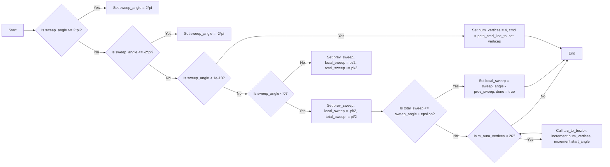

# `matplotlib\extern\agg24-svn\src\agg_bezier_arc.cpp` 详细设计文档

This code defines a C++ class for generating Bezier curves from an arc, using the Anti-Grain Geometry library.

## 整体流程

```mermaid
graph TD
    A[Start] --> B[Calculate radii and middle point]
    B --> C{Radii check?}
    C -- Yes --> D[Calculate (cx1, cy1)]
    C -- No --> E[Adjust radii]
    D --> F[Calculate (cx, cy)]
    F --> G[Calculate start_angle and sweep_angle]
    G --> H[Initialize Bezier arc]
    H --> I[Transform vertices]
    I --> J[Set start and end points]
    J --> K[End]
```

## 类结构

```
namespace agg
├── const double bezier_arc_angle_epsilon
│   ├── arc_to_bezier
│   ├── bezier_arc
│   └── bezier_arc_svg
```

## 全局变量及字段


### `bezier_arc_angle_epsilon`
    
Epsilon value used to prevent adding degenerate curves.

类型：`double`
    


### `m_num_vertices`
    
Number of vertices in the bezier arc.

类型：`unsigned`
    


### `m_cmd`
    
Command type for the bezier arc path.

类型：`path_cmd`
    


### `m_vertices`
    
Array of vertices for the bezier arc.

类型：`double[4]`
    


### `m_radii_ok`
    
Flag indicating if the radii are valid for the bezier arc SVG.

类型：`bool`
    


### `m_arc`
    
Bezier arc object used in bezier_arc_svg class.

类型：`bezier_arc`
    


### `bezier_arc.m_num_vertices`
    
Number of vertices in the bezier arc.

类型：`unsigned`
    


### `bezier_arc.m_cmd`
    
Command type for the bezier arc path.

类型：`path_cmd`
    


### `bezier_arc.m_vertices`
    
Array of vertices for the bezier arc.

类型：`double[4]`
    


### `bezier_arc_svg.m_radii_ok`
    
Flag indicating if the radii are valid for the bezier arc SVG.

类型：`bool`
    


### `bezier_arc_svg.m_arc`
    
Bezier arc object used in bezier_arc_svg class.

类型：`bezier_arc`
    
    

## 全局函数及方法


### arc_to_bezier

Converts an arc to a sequence of cubic bezier curves.

参数：

- `cx`：`double`，The x-coordinate of the center of the arc.
- `cy`：`double`，The y-coordinate of the center of the arc.
- `rx`：`double`，The x-radius of the arc.
- `ry`：`double`，The y-radius of the arc.
- `start_angle`：`double`，The starting angle of the arc in radians.
- `sweep_angle`：`double`，The sweep angle of the arc in radians.
- `curve`：`double*`，The array where the bezier curve points will be stored.

返回值：`void`，No return value.

#### 流程图

```mermaid
graph LR
A[Start] --> B{Calculate x0, y0, tx, ty}
B --> C{Calculate px, py}
C --> D{Calculate sn, cs}
D --> E{Loop 4 times}
E --> F{Calculate curve[i * 2], curve[i * 2 + 1]}
F --> G[End]
```

#### 带注释源码

```cpp
void arc_to_bezier(double cx, double cy, double rx, double ry, 
                   double start_angle, double sweep_angle,
                   double* curve)
{
    double x0 = cos(sweep_angle / 2.0);
    double y0 = sin(sweep_angle / 2.0);
    double tx = (1.0 - x0) * 4.0 / 3.0;
    double ty = y0 - tx * x0 / y0;
    double px[4];
    double py[4];
    px[0] =  x0;
    py[0] = -y0;
    px[1] =  x0 + tx;
    py[1] = -ty;
    px[2] =  x0 + tx;
    py[2] =  ty;
    px[3] =  x0;
    py[3] =  y0;

    double sn = sin(start_angle + sweep_angle / 2.0);
    double cs = cos(start_angle + sweep_angle / 2.0);

    unsigned i;
    for(i = 0; i < 4; i++)
    {
        curve[i * 2]     = cx + rx * (px[i] * cs - py[i] * sn);
        curve[i * 2 + 1] = cy + ry * (px[i] * sn + py[i] * cs);
    }
}
``` 


### bezier_arc::init

This method initializes the bezier_arc object with the given parameters to generate a bezier curve representing an arc.

参数：

- `x`：`double`，The x-coordinate of the center of the arc.
- `y`：`double`，The y-coordinate of the center of the arc.
- `rx`：`double`，The x-radius of the arc.
- `ry`：`double`，The y-radius of the arc.
- `start_angle`：`double`，The starting angle of the arc in radians.
- `sweep_angle`：`double`，The sweep angle of the arc in radians.

返回值：`void`，This method does not return a value.

#### 流程图



#### 带注释源码

```cpp
void bezier_arc::init(double x, double y, double rx, double ry, double start_angle, double sweep_angle)
{
    start_angle = fmod(start_angle, 2.0 * pi);
    if(sweep_angle >=  2.0 * pi) sweep_angle =  2.0 * pi;
    if(sweep_angle <= -2.0 * pi) sweep_angle = -2.0 * pi;

    if(fabs(sweep_angle) < 1e-10)
    {
        m_num_vertices = 4;
        m_cmd = path_cmd_line_to;
        m_vertices[0] = x + rx * cos(start_angle);
        m_vertices[1] = y + ry * sin(start_angle);
        m_vertices[2] = x + rx * cos(start_angle + sweep_angle);
        m_vertices[3] = y + ry * sin(start_angle + sweep_angle);
        return;
    }

    double total_sweep = 0.0;
    double local_sweep = 0.0;
    double prev_sweep;
    m_num_vertices = 2;
    m_cmd = path_cmd_curve4;
    bool done = false;
    do
    {
        if(sweep_angle < 0.0)
        {
            prev_sweep  = total_sweep;
            local_sweep = -pi * 0.5;
            total_sweep -= pi * 0.5;
            if(total_sweep <= sweep_angle + bezier_arc_angle_epsilon)
            {
                local_sweep = sweep_angle - prev_sweep;
                done = true;
            }
        }
        else
        {
            prev_sweep  = total_sweep;
            local_sweep =  pi * 0.5;
            total_sweep += pi * 0.5;
            if(total_sweep >= sweep_angle - bezier_arc_angle_epsilon)
            {
                local_sweep = sweep_angle - prev_sweep;
                done = true;
            }
        }

        arc_to_bezier(x, y, rx, ry, start_angle, local_sweep, m_vertices + m_num_vertices - 2);

        m_num_vertices += 6;
        start_angle += local_sweep;
    }
    while(!done && m_num_vertices < 26);
}
``` 


### `bezier_arc_svg::init`

This method initializes the Bezier arc SVG object with the given parameters, calculating the necessary properties to draw the arc.

参数：

- `x0`：`double`，The x-coordinate of the initial point of the arc.
- `y0`：`double`，The y-coordinate of the initial point of the arc.
- `rx`：`double`，The x-radius of the arc.
- `ry`：`double`，The y-radius of the arc.
- `angle`：`double`，The angle of rotation of the arc.
- `large_arc_flag`：`bool`，Flag indicating whether to use the larger arc when the sweep angle is equal to or greater than 180 degrees.
- `sweep_flag`：`bool`，Flag indicating the direction of the sweep.
- `x2`：`double`，The x-coordinate of the final point of the arc.
- `y2`：`double`，The y-coordinate of the final point of the arc.

返回值：`void`，No return value.

#### 流程图

```mermaid
graph LR
A[Start] --> B{Calculate middle point}
B --> C{Calculate (x1, y1)}
C --> D{Ensure radii are large enough}
D --> E{Calculate (cx1, cy1)}
E --> F{Calculate (cx, cy)}
F --> G{Calculate start_angle and sweep_angle}
G --> H{Build and transform the resulting arc}
H --> I[End]
```

#### 带注释源码

```cpp
void bezier_arc_svg::init(double x0, double y0, 
                          double rx, double ry, 
                          double angle,
                          bool large_arc_flag,
                          bool sweep_flag,
                          double x2, double y2)
{
    m_radii_ok = true;

    if(rx < 0.0) rx = -rx;
    if(ry < 0.0) ry = -rx;

    // Calculate the middle point between 
    // the current and the final points
    //------------------------
    double dx2 = (x0 - x2) / 2.0;
    double dy2 = (y0 - y2) / 2.0;

    double cos_a = cos(angle);
    double sin_a = sin(angle);

    // Calculate (x1, y1)
    //------------------------
    double x1 =  cos_a * dx2 + sin_a * dy2;
    double y1 = -sin_a * dx2 + cos_a * dy2;

    // Ensure radii are large enough
    //------------------------
    double prx = rx * rx;
    double pry = ry * ry;
    double px1 = x1 * x1;
    double py1 = y1 * y1;

    // Check that radii are large enough
    //------------------------
    double radii_check = px1/prx + py1/pry;
    if(radii_check > 1.0) 
    {
        rx = sqrt(radii_check) * rx;
        ry = sqrt(radii_check) * ry;
        prx = rx * rx;
        pry = ry * ry;
        if(radii_check > 10.0) m_radii_ok = false;
    }

    // Calculate (cx1, cy1)
    //------------------------
    double sign = (large_arc_flag == sweep_flag) ? -1.0 : 1.0;
    double sq   = (prx*pry - prx*py1 - pry*px1) / (prx*py1 + pry*px1);
    double coef = sign * sqrt((sq < 0) ? 0 : sq);
    double cx1  = coef *  ((rx * y1) / ry);
    double cy1  = coef * -((ry * x1) / rx);

    //
    // Calculate (cx, cy) from (cx1, cy1)
    //------------------------
    double sx2 = (x0 + x2) / 2.0;
    double sy2 = (y0 + y2) / 2.0;
    double cx = sx2 + (cos_a * cx1 - sin_a * cy1);
    double cy = sy2 + (sin_a * cx1 + cos_a * cy1);

    // Calculate the start_angle (angle1) and the sweep_angle (dangle)
    //------------------------
    double ux =  (x1 - cx1) / rx;
    double uy =  (y1 - cy1) / ry;
    double vx = (-x1 - cx1) / rx;
    double vy = (-y1 - cy1) / ry;
    double p, n;

    // Calculate the angle start
    //------------------------
    n = sqrt(ux*ux + uy*uy);
    p = ux; // (1 * ux) + (0 * uy)
    sign = (uy < 0) ? -1.0 : 1.0;
    double v = p / n;
    if(v < -1.0) v = -1.0;
    if(v >  1.0) v =  1.0;
    double start_angle = sign * acos(v);

    // Calculate the sweep angle
    //------------------------
    n = sqrt((ux*ux + uy*uy) * (vx*vx + vy*vy));
    p = ux * vx + uy * vy;
    sign = (ux * vy - uy * vx < 0) ? -1.0 : 1.0;
    v = p / n;
    if(v < -1.0) v = -1.0;
    if(v >  1.0) v =  1.0;
    double sweep_angle = sign * acos(v);
    if(!sweep_flag && sweep_angle > 0) 
    {
        sweep_angle -= pi * 2.0;
    } 
    else 
    if (sweep_flag && sweep_angle < 0) 
    {
        sweep_angle += pi * 2.0;
    }

    // We can now build and transform the resulting arc
    //------------------------
    m_arc.init(0.0, 0.0, rx, ry, start_angle, sweep_angle);
    trans_affine mtx = trans_affine_rotation(angle);
    mtx *= trans_affine_translation(cx, cy);
    
    for(unsigned i = 2; i < m_arc.num_vertices()-2; i += 2)
    {
        mtx.transform(m_arc.vertices() + i, m_arc.vertices() + i + 1);
    }

    // We must make sure that the starting and ending points
    // exactly coincide with the initial (x0,y0) and (x2,y2)
    m_arc.vertices()[0] = x0;
    m_arc.vertices()[1] = y0;
    if(m_arc.num_vertices() > 2)
    {
        m_arc.vertices()[m_arc.num_vertices() - 2] = x2;
        m_arc.vertices()[m_arc.num_vertices() - 1] = y2;
    }
}
```


## 关键组件


### 张量索引与惰性加载

张量索引与惰性加载是用于高效处理大型数据集的关键组件。它允许在需要时才计算或加载数据，从而减少内存消耗和提高性能。

### 反量化支持

反量化支持是用于将量化后的数据恢复到原始精度级别的组件。它确保在量化过程中不会丢失过多的信息，从而提高模型的准确性和鲁棒性。

### 量化策略

量化策略是用于将浮点数数据转换为固定点数表示的组件。它通过减少数据位数来减少模型大小和计算量，同时保持可接受的精度。


## 问题及建议


### 已知问题

-   **代码复杂度**：代码中存在大量的数学运算和几何变换，这可能导致代码难以理解和维护。
-   **全局变量**：存在全局变量 `bezier_arc_angle_epsilon`，这可能会在代码的不同部分产生意外的副作用。
-   **代码重复**：`arc_to_bezier` 函数被多次调用，这可能导致代码重复和维护困难。
-   **异常处理**：代码中没有明显的异常处理机制，这可能导致在错误情况下程序崩溃。

### 优化建议

-   **模块化**：将几何计算和变换逻辑封装到单独的函数或类中，以提高代码的可读性和可维护性。
-   **局部变量**：避免使用全局变量，使用局部变量来减少副作用。
-   **代码复用**：将 `arc_to_bezier` 函数封装成一个类或库，以便在需要时重用。
-   **异常处理**：添加异常处理机制来捕获和处理潜在的运行时错误。
-   **文档**：为代码添加详细的文档注释，以便其他开发者更好地理解代码的功能和用法。
-   **单元测试**：编写单元测试来验证代码的正确性和稳定性。
-   **性能优化**：对代码进行性能分析，找出瓶颈并进行优化。


## 其它


### 设计目标与约束

- 设计目标：实现一个高效的弧线生成器，能够根据给定的参数生成最多4条连续的贝塞尔曲线。
- 约束条件：弧线生成器应能够处理各种参数组合，包括不同的半径、起始角度和扫描角度。

### 错误处理与异常设计

- 错误处理：当输入参数不合理时（如半径为负数、起始角度或扫描角度超出合理范围），应抛出异常或返回错误信息。
- 异常设计：定义自定义异常类，用于处理特定的错误情况，如`InvalidArcParametersException`。

### 数据流与状态机

- 数据流：输入参数（x, y, rx, ry, start_angle, sweep_angle）通过类方法`init`进行处理，并生成贝塞尔曲线的顶点坐标。
- 状态机：`bezier_arc`类在初始化过程中根据扫描角度的大小和方向，逐步生成贝塞尔曲线的顶点。

### 外部依赖与接口契约

- 外部依赖：代码依赖于`<math.h>`库中的数学函数。
- 接口契约：`bezier_arc`和`bezier_arc_svg`类提供了公共接口，用于初始化和获取弧线信息。

### 测试用例

- 测试用例：编写测试用例以验证弧线生成器在不同参数组合下的正确性和性能。

### 性能优化

- 性能优化：优化贝塞尔曲线生成的算法，减少不必要的计算和内存使用。

### 安全性考虑

- 安全性考虑：确保代码不会因为输入参数的错误处理不当而导致安全漏洞。

### 维护与扩展

- 维护与扩展：代码应具有良好的可读性和可维护性，以便于未来的维护和功能扩展。


    