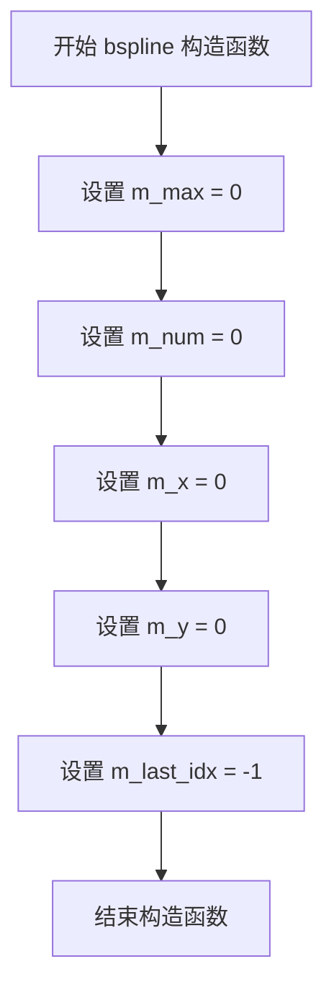
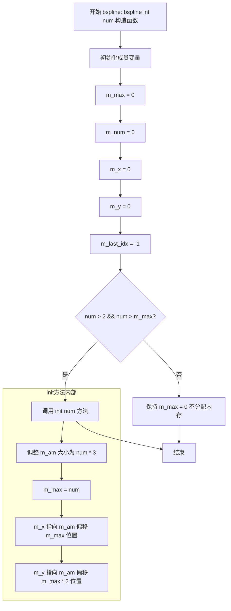
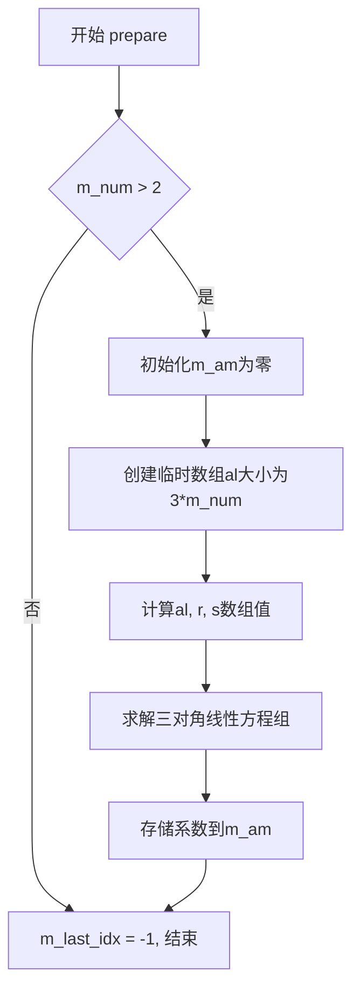

```mermaid
flowchart TD
    A[开始 init] --> B{num > 2?}
    B -->|否| C[跳过内部初始化]
    B -->|是| D[调用 init&#40;num&#41; 分配内存]
    D --> E[循环 i 从 0 到 num-1]
    E --> F[调用 add_point 添加点]
    F --> E
    E --> G[调用 prepare 准备数据]
    G --> H[设置 m_last_idx = -1]
    C --> H
    H --> I[结束 init]
```

# `matplotlib\extern\agg24-svn\src\agg_bspline.cpp` 详细设计文档

这是Anti-Grain Geometry库中的bspline类实现，提供了B样条曲线插值功能。通过一组控制点创建B样条曲线，支持在给定x坐标处进行插值计算对应的y值，同时支持左右外推处理边界情况，并提供有状态和无状态两种查询接口以优化性能。

## 整体流程

```mermaid
graph TD
    A[开始] --> B[创建bspline对象]
B --> C{初始化方式}
C --> D[空构造器]
C --> E[init(num)初始化]
C --> F[init(num, x, y)一步到位]
D --> G[调用add_point添加控制点]
E --> G
F --> H[内部调用add_point和prepare]
G --> I[调用prepare准备插值数据]
H --> I
I --> J[调用get或get_stateful获取插值结果]
J --> K{x的位置}
K --> L[x < m_x[0] 左外推]
K --> M[x >= m_x[m_num-1] 右外推]
K --> N[中间区间 插值]
L --> O[调用extrapolation_left]
M --> P[调用extrapolation_right]
N --> Q{查询方式}
Q --> R[无状态get - 每次二分搜索]
Q --> S[有状态get_stateful - 缓存优化]
R --> T[调用bsearch + interpolation]
S --> T
O --> U[返回y值]
P --> U
T --> U
```

## 类结构

```
agg (命名空间)
└── bspline (B样条曲线插值类)
```

## 全局变量及字段


### `bspline.m_max`
    
最大支持的控制点数量

类型：`int`
    


### `bspline.m_num`
    
当前已添加的控制点数量

类型：`int`
    


### `bspline.m_x`
    
控制点x坐标数组指针

类型：`double*`
    


### `bspline.m_y`
    
控制点y坐标数组指针

类型：`double*`
    


### `bspline.m_am`
    
内部用于存储中间计算结果的数组

类型：`pod_array<double>`
    


### `bspline.m_last_idx`
    
有状态查询时缓存的上次搜索索引，-1表示未初始化

类型：`int`
    
    

## 全局函数及方法


### `bspline::bspline()` - 默认构造函数

该默认构造函数是B样条曲线类的初始化入口，将所有成员变量初始化为0或-1，为后续调用init()或带参数构造函数做好准备。

参数：无

返回值：无（构造函数无返回值）

#### 流程图



#### 带注释源码

```cpp
//------------------------------------------------------------------------
// bspline::bspline - 默认构造函数
// 初始化所有成员变量为默认值
//------------------------------------------------------------------------
bspline::bspline() :
    m_max(0),       // 最大支持的控制点数量，0表示未初始化
    m_num(0),       // 当前已添加的控制点数量
    m_x(0),         // X坐标数组指针，0表示未分配内存
    m_y(0),         // Y坐标指针，0表示未分配内存
    m_last_idx(-1)  // 上次查询的索引，-1表示无有效缓存
{
    // 构造函数体为空，所有初始化工作在初始化列表中完成
    // 此类采用RAII模式，通过析构函数自动释放资源
}
```

#### 类的完整上下文信息

**类名：** `bspline`

**核心功能描述：** 
bspline类实现了三次B样条曲线插值功能，支持通过添加控制点构建样条曲线，并提供插值和 extrapolation（外推）计算获取任意X坐标对应的Y值。

**类字段信息：**

| 字段名称 | 类型 | 描述 |
|---------|------|------|
| m_max | int | 最大支持的控制点数量 |
| m_num | 当前已添加的控制点数量 |
| m_x | double* | X坐标数组指针，指向内部存储的后1/3区域 |
| m_y | double* | Y坐标数组指针，指向内部存储的后2/3区域 |
| m_last_idx | int | 缓存的上次插值索引，用于优化连续查询 |
| m_am | pod_array<double> | 内部存储数组，包含m_x和m_y的存储空间 |

**关键方法：**

| 方法名 | 功能描述 |
|-------|---------|
| init(int max) | 初始化bspline，分配内存准备接收控制点 |
| add_point(double x, double y) | 添加一个控制点 |
| prepare() | 构建样条系数矩阵，完成插值准备 |
| get(double x) | 获取指定x坐标的y值（每次完整搜索） |
| get_stateful(double x) | 获取y值（带缓存优化） |

**潜在技术债务与优化空间：**

1. **内存管理方式**：使用裸指针m_x和m_y，存在潜在的内存泄漏和野指针风险，可考虑使用智能指针
2. **默认值设计**：默认构造函数将m_max设为0，后续必须调用init()才能使用，增加了使用复杂度
3. **错误处理缺失**：init()方法中对无效参数（max <= 2）的处理不够明显，文档缺失
4. **状态管理**：m_last_idx的存在使得类非线程安全，多线程环境下需加锁
5. **常量性**：部分方法（如bsearch）虽不修改状态但未标记为const

**设计约束与错误处理：**
- 控制点数量必须大于2才能进行插值计算
- x坐标必须单调递增才能保证算法正确性
- 外推计算仅在第一个和最后一个区间有效


### `bspline::bspline(int num)`

该构造函数是bspline类的核心初始化方法之一，通过传入的点数参数num直接初始化样条插值器，初始化所有成员变量并调用init(num)方法分配内存和准备数据结构。

参数：

- `num`：`int`，样条插值支持的最大点数，必须大于2才能进行有效的样条插值计算

返回值：无返回值（构造函数）

#### 流程图



#### 带注释源码

```cpp
//------------------------------------------------------------------------
// bspline 构造函数 - 带点数参数的构造
// 功能：初始化bspline对象并设置最大支持点数
//------------------------------------------------------------------------
bspline::bspline(int num) :
    // 初始化列表：初始化所有成员变量为默认值
    m_max(0),       // 最大点数，初始化为0
    m_num(0),       // 当前实际点数，初始化为0
    m_x(0),         // X坐标数组指针，初始化为nullptr
    m_y(0),         // Y坐标数组指针，初始化为nullptr
    m_last_idx(-1)  // 上次查询的索引，初始化为-1表示无缓存
{
    // 调用init方法进行实际初始化
    // init方法会：
    // 1. 检查num是否大于2且大于当前m_max
    // 2. 重新调整内部数组m_am的大小
    // 3. 设置m_x和m_y指针指向正确的内存位置
    init(num);
}
```

#### 相关方法调用关系

```cpp
// init(int max) 方法的实现
void bspline::init(int max)
{
    // 只有当max > 2 且大于当前最大值时才重新分配内存
    if(max > 2 && max > m_max)
    {
        // 调整内部数组大小为 max * 3
        // 用途：m_am数组存储三组数据
        // - [0, m_max): 存储系数m_am
        // - [m_max, m_max*2): 存储x坐标
        // - [m_max*2, m_max*3): 存储y坐标
        m_am.resize(max * 3);
        m_max = max;
        // m_x 指向数组的中间部分（x坐标）
        m_x   = &m_am[m_max];
        // m_y 指向数组的末尾部分（y坐标）
        m_y   = &m_am[m_max * 2];
    }
    // 重置当前点数为0
    m_num = 0;
    // 重置缓存索引
    m_last_idx = -1;
}
```


### `bspline::bspline(int num, const double* x, const double* y)`

该构造函数是B样条曲线类的便捷初始化方法，接受控制点数量及坐标数组，一步完成内存分配、数据添加和样条系数计算的全部初始化过程。

参数：

- `num`：`int`，控制点的数量
- `x`：`const double*`，控制点的X坐标数组指针
- `y`：`const double*`，控制点的Y坐标数组指针

返回值：无（构造函数）

#### 流程图

```mermaid
flowchart TD
    A[开始构造] --> B[初始化成员变量<br/>m_max=0, m_num=0<br/>m_x=0, m_y=0<br/>m_last_idx=-1]
    B --> C{num > 2?}
    C -->|否| D[直接返回]
    C -->|是| E[调用init(num)<br/>分配内存并设置m_max]
    E --> F[i = 0 to num-1]
    F --> G[add_point<br/>添加控制点]
    G --> H[i++]
    H --> F
    F -->|循环结束| I[调用prepare()<br/>计算样条系数]
    I --> J[m_last_idx = -1]
    J --> K[构造完成]
```

#### 带注释源码

```
//-----------------------------------------------------------------------------
// B样条曲线类的构造函数
// 功能：一步完成初始化，包括内存分配、控制点添加和样条系数计算
// 参数：
//   num - 控制点数量，必须大于2
//   x   - 控制点X坐标数组
//   y   - 控制点Y坐标数组
//-----------------------------------------------------------------------------
bspline::bspline(int num, const double* x, const double* y) :
    // 初始化成员变量列表
    m_max(0),        // 最大控制点数，初始化为0
    m_num(0),        // 当前控制点数，初始化为0
    m_x(0),          // X坐标数组指针，初始化为nullptr
    m_y(0),          // Y坐标数组指针，初始化为nullptr
    m_last_idx(-1)   // 上次查找索引，初始化为-1表示无效
{
    // 调用重载的init函数，执行完整的初始化流程
    init(num, x, y);
}
```


### `bspline::init(int max)`

初始化 B 样条曲线对象，设置最大支持的控制点数量，并分配相应的内存空间用于存储控制点坐标和计算过程中所需的临时数组。

参数：

- `max`：`int`，最大控制点数量，用于确定内存分配大小

返回值：`void`，无返回值

#### 流程图

```mermaid
flowchart TD
    A[开始 init] --> B{检查 max > 2 && max > m_max}
    B -->|是| C[调整 m_am 大小为 max * 3]
    C --> D[m_max = max]
    D --> E[m_x 指向 &m_am[m_max]]
    E --> F[m_y 指向 &m_am[m_max * 2]]
    F --> G[m_num = 0]
    G --> H[m_last_idx = -1]
    B -->|否| I[跳过内存分配]
    I --> H
    H --> J[结束]
```

#### 带注释源码

```cpp
//------------------------------------------------------------------------
// 初始化 B 样条曲线，设置最大点数并分配内存
//------------------------------------------------------------------------
void bspline::init(int max)
{
    // 只有当 max 大于 2（样条至少需要 3个点）且大于当前最大点数时才重新分配内存
    if(max > 2 && max > m_max)
    {
        // 调整内部数组大小，分配 3 倍 max 的空间
        // 空间分配：m_am[0~max-1] 用于临时计算，m_am[max~2*max-1] 用于 x 坐标，m_am[2*max~3*max-1] 用于 y 坐标
        m_am.resize(max * 3);
        m_max = max;                       // 更新最大点数
        m_x   = &m_am[m_max];              // 设置 x 坐标数组指针，指向 m_am 的中间位置
        m_y   = &m_am[m_max * 2];          // 设置 y 坐标数组指针，指向 m_am 的后 1/3 位置
    }
    m_num = 0;          // 重置当前控制点数量为 0
    m_last_idx = -1;    // 重置最后访问索引为 -1，表示未初始化状态
}
```


### `bspline.add_point`

该方法用于向B样条曲线添加一个控制点，将给定的(x, y)坐标存储到内部数组中，仅在未达到最大容量时才执行添加操作。

参数：

- `x`：`double`，控制点的X坐标
- `y`：`double`，控制点的Y坐标

返回值：`void`，无返回值

#### 流程图

```mermaid
flowchart TD
    A[开始 add_point] --> B{检查 m_num < m_max?}
    B -->|是| C[将x存入m_x[m_num]]
    C --> D[将y存入m_y[m_num]]
    D --> E[m_num++]
    E --> F[结束]
    B -->|否| F
```

#### 带注释源码

```cpp
//------------------------------------------------------------------------
// 向B样条曲线添加一个控制点
// 参数:
//   x - 控制点的X坐标
//   y - 控制点的Y坐标
//------------------------------------------------------------------------
void bspline::add_point(double x, double y)
{
    // 检查当前点数量是否小于设定的最大容量
    if(m_num < m_max)
    {
        // 将X坐标存储到内部X坐标数组的当前索引位置
        m_x[m_num] = x;
        
        // 将Y坐标存储到内部Y坐标数组的当前索引位置
        m_y[m_num] = y;
        
        // 点计数加1，指向下一个可用位置
        ++m_num;
    }
    // 如果已达到最大容量，则忽略此操作，不添加点
}
```


### `bspline::prepare`

该方法通过构建并求解三对角线性方程组，计算B样条曲线的二阶导数系数矩阵，为后续的插值和外推计算提供必要的样条系数。

参数：无

返回值：`void`，无返回值。该方法直接修改对象的内部状态（`m_am` 系数矩阵和 `m_last_idx` 状态标志）。

#### 流程图

```mermaid
flowchart TD
    A[开始 prepare] --> B{m_num > 2?}
    B -->|否| C[直接跳转到设置 m_last_idx]
    B -->|是| D[初始化: k循环将m_am前m_num个元素置0]
    D --> E[创建临时数组al大小为3*m_num]
    E --> F[初始化: k循环将al所有元素置0]
    F --> G[设置r和s指针指向al的不同位置]
    G --> H[计算初始d和e值<br/>d = x[1] - x[0]<br/>e = (y[1] - y[0]) / d]
    H --> I[k从1到n1-1循环<br/>构建三对角矩阵系数al[k], r[k], s[k]]
    I --> J[k从1到n1-1循环<br/>前向消元求解]
    J --> K[设置边界条件<br/>m_am[n1] = 0<br/>al[n1-1] = s[n1-1]]
    K --> L[回代求解<br/>计算m_am[n1-1]]
    L --> M[反向循环回代<br/>计算其余m_am[k]]
    M --> C
    C --> N[设置 m_last_idx = -1]
    N --> O[结束]
```

#### 带注释源码

```cpp
//------------------------------------------------------------------------
// 方法: bspline::prepare
// 描述: 准备插值数据，计算B样条系数矩阵
//       使用三对角矩阵算法求解自然三次样条的二阶导数
//------------------------------------------------------------------------
void bspline::prepare()
{
    // 只有当点数大于2时才进行计算（三次样条至少需要3个点）
    if(m_num > 2)
    {
        int i, k, n1;
        double* temp; 
        double* r; 
        double* s;
        double h, p, d, f, e;

        // 第一步：将系数数组m_am的前m_num个元素初始化为0
        for(k = 0; k < m_num; k++) 
        {
            m_am[k] = 0.0;
        }

        // 计算临时数组的大小（3倍于点数）
        n1 = 3 * m_num;

        // 创建临时数组用于存储三对角矩阵的系数
        // al数组结构: [0, m_num-1]=下对角, [m_num, 2*m_num-1]=r, [2*m_num, 3*m_num-1]=s
        pod_array<double> al(n1);
        temp = &al[0];

        // 初始化临时数组为0
        for(k = 0; k < n1; k++) 
        {
            temp[k] = 0.0;
        }

        // r指向temp数组的中间位置，s指向三分之二位置
        // 这样三个数组可以共享同一块内存
        r = temp + m_num;
        s = temp + m_num * 2;

        // n1重新赋值为点数减1，用于后续循环
        n1 = m_num - 1;
        
        // 计算第一个区间的基础数据
        d = m_x[1] - m_x[0];  // 第一个x区间长度
        e = (m_y[1] - m_y[0]) / d;  // 第一个y差商

        // 第二步：构建三对角线性方程组的系数
        // 遍历所有内部点，计算矩阵的次对角线系数
        for(k = 1; k < n1; k++) 
        {
            h = d;                    // 保存上一个x区间长度
            d = m_x[k + 1] - m_x[k];  // 当前x区间长度
            f = e;                    // 保存上一个y差商
            e = (m_y[k + 1] - m_y[k]) / d;  // 当前y差商
            
            // al[k]: 次对角线系数 = d / (d + h)
            al[k] = d / (d + h);
            
            // r[k]: 主对角线系数 = 1 - al[k]
            r[k] = 1.0 - al[k];
            
            // s[k]: 右端向量 = 6 * (e - f) / (h + d)
            s[k] = 6.0 * (e - f) / (h + d);
        }

        // 第三步：前向消元（Gauss elimination for tridiagonal system）
        for(k = 1; k < n1; k++) 
        {
            // 计算主元倒数
            p = 1.0 / (r[k] * al[k - 1] + 2.0);
            
            // 更新次对角线系数
            al[k] *= -p;
            
            // 更新右端向量
            s[k] = (s[k] - r[k] * s[k - 1]) * p; 
        }

        // 第四步：设置边界条件（自然样条：两端二阶导数为0）
        m_am[n1] = 0.0;           // 最后一个二阶导数为0
        al[n1 - 1] = s[n1 - 1];   // 边界值传递给前一个位置
        m_am[n1 - 1] = al[n1 - 1]; // 存储倒数第二个二阶导数

        // 第五步：回代求解得到所有二阶导数
        for(k = n1 - 2, i = 0; i < m_num - 2; i++, k--) 
        {
            al[k] = al[k] * al[k + 1] + s[k];
            m_am[k] = al[k];  // 将计算得到的二阶导数存入m_am数组
        }
    }
    
    // 重置最后访问索引，强制下次插值时重新搜索区间
    m_last_idx = -1;
}
```


### `bspline.init`

该函数是 B 样条曲线类的完整初始化方法，负责接收控制点数据、分配内存空间、添加所有控制点并完成插值计算前的准备工作，是使用该样条类进行曲线插值的入口函数。

参数：

- `num`：`int`，控制点的数量，必须大于 2 才能进行样条插值计算
- `x`：`const double*`，指向 x 坐标数组的指针，长度为 num
- `y`：`const double*`，指向 y 坐标数组的指针，长度为 num，与 x 数组对应

返回值：`void`，无返回值

#### 流程图



#### 带注释源码

```cpp
//------------------------------------------------------------------------
// 完整的初始化函数，同时完成内存分配、点添加和数据准备
//------------------------------------------------------------------------
void bspline::init(int num, const double* x, const double* y)
{
    // 只有当控制点数量大于 2 时才进行初始化
    //（样条插值至少需要 3 个控制点）
    if(num > 2)
    {
        // 第一步：调用重载的 init(max) 函数分配内部内存空间
        // 分配 m_am 向量，大小为 num * 3
        // 并设置 m_max = num，m_x 和 m_y 指向对应区域
        init(num);
        
        // 第二步：循环添加所有控制点
        // 注意：x 和 y 指针在循环中递增，依次读取数组中的每个点
        int i;
        for(i = 0; i < num; i++)
        {
            add_point(*x++, *y++);
        }
        
        // 第三步：调用 prepare 函数进行插值前的数据准备
        // 该函数会构建三对角矩阵并求解，得到插值所需的系数数组 m_am
        prepare();
    }
    
    // 第四步：重置最后一次访问的索引
    // 这确保了后续调用 get 或 get_stateful 时会重新进行搜索
    m_last_idx = -1;
}
```


### `bspline::bsearch`

该函数实现二分搜索算法，用于在已排序的数组 x 中找到给定值 x0 所在的区间，返回 x0 所在区间的左边界索引 i（即满足 x[i] ≤ x0 < x[i+1] 的 i 值）。

参数：

- `n`：`int`，数组 x 的元素个数
- `x`：`const double*`，指向已排序的 double 类型数组的指针
- `x0`：`double`，要搜索的目标值
- `i`：`int*`，指向整型变量的指针，用于输出搜索结果（x0 所在区间的左边界索引）

返回值：`void`，无返回值，通过指针参数 i 输出结果

#### 流程图

```mermaid
flowchart TD
    A[开始 bsearch] --> B[j = n - 1]
    B --> C[初始化 *i = 0]
    C --> D{判断 j - *i > 1?}
    D -->|否| H[结束, *i 即为结果]
    D -->|是| E[计算 k = (*i + j) >> 1]
    E --> F{判断 x0 < x[k]?}
    F -->|是| G[j = k, 搜索左半区]
    F -->|否| I[*i = k, 搜索右半区]
    G --> D
    I --> D
```

#### 带注释源码

```cpp
//------------------------------------------------------------------------
// 二分搜索函数：在已排序数组 x[0..n-1] 中找到 x0 所在的区间
// 输出 x0 所在区间的左边界索引 i，满足 x[i] <= x0 < x[i+1]
//------------------------------------------------------------------------
void bspline::bsearch(int n, const double *x, double x0, int *i) 
{
    // j 初始化为数组最后一个索引 n-1
    int j = n - 1;
    // k 用于存储中间索引
    int k;
      
    // *i 初始化为 0，从数组起始位置开始搜索
    for(*i = 0; (j - *i) > 1; ) 
    {
        // 计算中间位置：k = (*i + j) / 2
        // 使用右移运算符 >> 1 代替除以 2，提高效率
        if(x0 < x[k = (*i + j) >> 1]) 
        {
            // x0 小于中间值，目标在左半区
            // 调整右边界 j 为 k
            j = k; 
        }
        else 
        {
            // x0 大于等于中间值，目标在右半区
            // 调整左边界 *i 为 k
            *i = k;
        }
    }
    // 循环结束时，(j - *i) <= 1
    // *i 即为 x0 所在区间的左边界索引
}
```


### `bspline.interpolation`

在指定区间 [i, i+1] 内进行 B 样条插值，根据输入的 x 坐标计算对应的 y 值。

参数：

- `x`：`double`，要进行插值的 x 坐标
- `i`：`int`，区间索引，指定在哪个区间 [i, i+1] 内进行插值

返回值：`double`，插值计算后得到的 y 值

#### 流程图

```mermaid
flowchart TD
    A[开始 interpolation] --> B[计算 j = i + 1]
    B --> C[计算区间距离 d = m_x[i] - m_x[j]]
    C --> D[计算 h = x - m_x[j], r = m_x[i] - x]
    D --> E[计算 p = d² / 6]
    E --> F[计算第一项: cubic term]
    F --> G[((m_am[j] × r³ + m_am[i] × h³) / 6) / d]
    G --> H[计算第二项: linear term]
    H --> I[((m_y[j] - m_am[j] × p) × r + (m_y[i] - m_am[i] × p) × h) / d]
    I --> J[返回两项之和]
    J --> K[结束]
```

#### 带注释源码

```cpp
//------------------------------------------------------------------------
// 在指定区间[i,i+1]内进行B样条插值
// 参数:
//   x - double 要进行插值的x坐标
//   i - int 区间索引，指定在哪个区间[i,i+1]内进行插值
// 返回值:
//   double 插值计算后得到的y值
//------------------------------------------------------------------------
double bspline::interpolation(double x, int i) const
{
    int j = i + 1;                              // 计算相邻区间索引
    
    double d = m_x[i] - m_x[j];                // 计算区间两端点的x坐标差
    double h = x - m_x[j];                      // 计算x到区间右端点的距离
    double r = m_x[i] - x;                      // 计算x到区间左端点的距离
    
    double p = d * d / 6.0;                     // 计算辅助变量p (d²/6)
    
    // 返回B样条插值公式结果
    // 第一部分: 三次样条基函数项 ((m_am[j]*r³ + m_am[i]*h³) / 6) / d
    // 第二部分: 线性插值项 ((m_y[j] - m_am[j]*p)*r + (m_y[i] - m_am[i]*p)*h) / d
    return (m_am[j] * r * r * r + m_am[i] * h * h * h) / 6.0 / d +
           ((m_y[j] - m_am[j] * p) * r + (m_y[i] - m_am[i] * p) * h) / d;
}
```

#### 关键组件信息

- `m_x`：全局变量，存储控制点的 x 坐标数组
- `m_y`：全局变量，存储控制点的 y 坐标数组  
- `m_am`：全局变量，存储 B 样条的二阶导数系数（矩数组）

#### 潜在技术债务与优化空间

1. **缺少输入验证**：未检查 `i` 是否在有效范围 [0, m_num-2] 内，可能导致数组越界
2. **未处理边界情况**：当 `d` 接近 0 时（两点重合），计算可能产生除零错误
3. **性能优化**：可考虑将部分重复计算（如 `r*r*r`）提取为临时变量，减少重复运算
4. **文档缺失**：函数缺乏详细的数学公式说明，B 样条插值的具体原理不易理解


### `bspline.extrapolation_left`

使用左侧外推算法，当输入的 x 坐标小于样条曲线第一个控制点的 x 坐标时，基于第一段曲线趋势计算对应的 y 值。该函数通过计算第一段样条曲线的切线，使用线性外推公式延伸曲线到左侧区域。

参数：

- `x`：`double`，要计算外推值的 x 坐标，通常小于样条曲线第一个控制点的 x 坐标（m_x[0]）

返回值：`double`，基于左侧曲线趋势外推得到的 y 值

#### 流程图

```mermaid
graph TD
    A[Start] --> B[计算d = m_x[1] - m_x[0]<br/>获取第一段曲线的x轴跨度]
    B --> C[计算斜率slope = (m_y[1] - m_y[0]) / d<br/>第一段曲线的平均斜率]
    C --> D[计算截距项intercept = -d * m_am[1] / 6<br/>利用二阶导数系数m_am[1]修正]
    E --> F[计算外推值result<br/>= (intercept + slope) * (x - m_x[0]) + m_y[0]]
    D --> E[计算x相对于起始点的偏移<br/>offset = x - m_x[0]]
    F --> G[Return result]
```

#### 带注释源码

```cpp
//------------------------------------------------------------------------
// 左侧外推函数
// 当输入x小于第一个控制点x坐标时调用此函数
// 使用第一段样条曲线的切线进行线性外推
//------------------------------------------------------------------------
double bspline::extrapolation_left(double x) const
{
    // 计算第一段曲线在x方向的跨度（第一个和第二个控制点之间）
    double d = m_x[1] - m_x[0];
    
    // 返回外推结果
    // 公式: (截距项 + 斜率) * (x - 起始x) + 起始y
    // 其中:
    //   -d * m_am[1] / 6    是基于二阶导数（曲率）的修正项
    //   (m_y[1] - m_y[0]) / d 是第一段曲线的平均斜率
    //   (x - m_x[0])       是外推点相对于起始点的偏移量
    return (-d * m_am[1] / 6 + (m_y[1] - m_y[0]) / d) * 
           (x - m_x[0]) + 
           m_y[0];
}
```


### `bspline.extrapolation_right`

该函数用于在输入x值超出样条曲线定义范围右侧时，基于最后一段三次样条曲线的趋势进行线性外推计算，返回对应的y坐标值。

参数：

- `x`：`double`，待计算的x坐标值，当该值大于等于样条节点最大x坐标时触发外推

返回值：`double`，基于最后一段曲线趋势外推计算得到的y坐标值

#### 流程图

```mermaid
flowchart TD
    A[开始 extrapolation_right] --> B[计算d = m_x[m_num - 1] - m_x[m_num - 2]]
    B --> C[计算斜率系数: d \* m_am[m_num - 2] / 6 + (m_y[m_num - 1] - m_y[m_num - 2]) / d]
    C --> D[计算偏移量: (x - m_x[m_num - 1])]
    D --> E[计算外推结果: 斜率系数 \* 偏移量 + m_y[m_num - 1]]
    E --> F[返回外推的y值]
```

#### 带注释源码

```cpp
//------------------------------------------------------------------------
// 右侧外推函数 - 基于最后一段曲线趋势计算x对应的y值
// 参数: x - 待外推的x坐标值
// 返回: 外推得到的y坐标值
//------------------------------------------------------------------------
double bspline::extrapolation_right(double x) const
{
    // 计算最后两个节点之间的x差值（即最后一段曲线区间长度）
    double d = m_x[m_num - 1] - m_x[m_num - 2];
    
    // 返回外推结果：
    // 斜率系数 = d * m_am[m_num - 2] / 6 + (m_y[m_num - 1] - m_y[m_num - 2]) / d
    // - 第一项: 基于最后一段样条二阶导数(m_am)的外推修正
    // - 第二项: 最后一段曲线的平均斜率
    // 最终结果 = 斜率系数 * (x - 最后一个节点x) + 最后一个节点y值
    return (d * m_am[m_num - 2] / 6 + (m_y[m_num - 1] - m_y[m_num - 2]) / d) * 
           (x - m_x[m_num - 1]) + 
           m_y[m_num - 1];
}
```


### `bspline.get`

该函数是B样条插值类的无状态版本，每次调用都执行完整的二分搜索来确定输入x所属的区间，然后根据区间进行样条插值或外推计算。

参数：

- `x`：`double`，输入的自变量值，用于计算对应的插值结果

返回值：`double`，根据x计算得到的样条插值或外推的函数值

#### 流程图

```mermaid
flowchart TD
    A[开始 get x] --> B{m_num > 2?}
    B -->|否| C[返回 0.0]
    B -->|是| D{x < m_x[0]?}
    D -->|是| E[调用 extrapolation_left]
    E --> F[返回结果]
    D -->|否| G{x >= m_x[m_num - 1]?}
    G -->|是| H[调用 extrapolation_right]
    H --> F
    G -->|否| I[调用 bsearch 查找区间索引 i]
    I --> J[调用 interpolation]
    J --> F
```

#### 带注释源码

```cpp
//------------------------------------------------------------------------
// B样条无状态插值函数
// 每次调用都执行完整二分搜索，不缓存上次查找的索引位置
//------------------------------------------------------------------------
double bspline::get(double x) const
{
    // 检查是否有足够的控制点进行插值（至少需要3个点）
    if(m_num > 2)
    {
        int i;

        // 左侧外推处理：当x小于最小控制点x坐标时
        // 使用左侧端点的一阶导数进行线性外推
        if(x < m_x[0]) return extrapolation_left(x);

        // 右侧外推处理：当x大于等于最大控制点x坐标时
        // 使用右侧端点的一阶导数进行线性外推
        if(x >= m_x[m_num - 1]) return extrapolation_right(x);

        // 区间内插值处理：使用二分搜索找到x所属的区间索引
        // 然后调用三次样条插值公式计算结果
        bsearch(m_num, m_x, x, &i);
        return interpolation(x, i);
    }
    // 控制点不足时返回默认值0.0
    return 0.0;
}
```


### `bspline.get_stateful`

该函数是有状态插值方法，利用缓存机制（`m_last_idx`）优化重复查询的性能。当查询点位于缓存区间内时，直接返回插值结果，避免重复的二分搜索；仅当查询点超出缓存区间时才执行完整的二分查找，提高连续查询场景下的效率。

参数：
- `x`：`double`，要插值的x坐标值

返回值：`double`，对应x坐标的y值（通过样条插值或外推计算得到）

#### 流程图

```mermaid
flowchart TD
    A[开始 get_stateful] --> B{m_num > 2?}
    B -->|否| Z[返回 0.0]
    B -->|是| C{x < m_x[0]?}
    C -->|是| D[调用 extrapolation_left]
    D --> Z
    C -->|否| E{x >= m_x[m_num-1]?}
    E -->|是| F[调用 extrapolation_right]
    F --> Z
    E -->|否| G{m_last_idx >= 0?}
    G -->|否| H[调用 bsearch 查找索引]
    H --> I[调用 interpolation]
    I --> Z
    G -->|是| J{x在[m_last_idx, m_last_idx+1]区间?}
    J -->|是| I
    J -->|否| K{m_last_idx < m_num-2 且 x在[m_last_idx+1, m_last_idx+2]?}
    K -->|是| L[m_last_idx++]
    L --> I
    K -->|否| M{m_last_idx > 0 且 x在[m_last_idx-1, m_last_idx]?}
    M -->|是| N[m_last_idx--]
    N --> I
    M -->|否| O[调用 bsearch 查找索引]
    O --> I
```

#### 带注释源码

```cpp
//------------------------------------------------------------------------
// 有状态插值方法 - 利用缓存优化重复查询
//------------------------------------------------------------------------
double bspline::get_stateful(double x) const
{
    // 检查是否有足够的点进行样条插值（至少需要3个点）
    if(m_num > 2)
    {
        // -------- 外推处理 --------
        
        // 左侧外推：当x小于最小x坐标时
        if(x < m_x[0]) return extrapolation_left(x);

        // 右侧外推：当x大于等于最大x坐标时
        if(x >= m_x[m_num - 1]) return extrapolation_right(x);

        // -------- 缓存查找优化 --------
        
        // m_last_idx >= 0 表示有缓存的索引可用
        if(m_last_idx >= 0)
        {
            // 检查x是否不在当前缓存的区间内
            if(x < m_x[m_last_idx] || x > m_x[m_last_idx + 1])
            {
                // 优化1：检查x是否在下一个相邻区间（最可能的情况）
                if(m_last_idx < m_num - 2 && 
                   x >= m_x[m_last_idx + 1] &&
                   x <= m_x[m_last_idx + 2])
                {
                    ++m_last_idx;  // 移动到下一个区间
                }
                else
                // 优化2：检查x是否在上一个相邻区间
                if(m_last_idx > 0 && 
                   x >= m_x[m_last_idx - 1] && 
                   x <= m_x[m_last_idx])
                {
                    --m_last_idx;  // 移动到上一个区间
                }
                else
                {
                    // 缓存未命中，执行完整的二分搜索
                    bsearch(m_num, m_x, x, &m_last_idx);
                }
            }
            // 使用缓存的索引进行插值计算
            return interpolation(x, m_last_idx);
        }
        else
        {
            // 首次调用或缓存无效，进行初始二分搜索
            bsearch(m_num, m_x, x, &m_last_idx);
            return interpolation(x, m_last_idx);
        }
    }
    // 点数不足，返回默认值
    return 0.0;
}
```


## 关键组件


### 核心功能描述

该代码实现了三次B样条曲线（Cubic B-Spline）插值算法，用于在离散数据点之间进行平滑的曲线拟合，支持插值、外推和状态缓存优化。

### 文件整体运行流程

1. 构造函数或 init() 初始化内部数组缓冲区
2. add_point() 添加数据点
3. prepare() 构建三对角矩阵并求解B样条系数
4. get() 或 get_stateful() 计算任意x坐标对应的y值

### 类的详细信息

#### 类名：bspline

**类字段：**

| 名称 | 类型 | 描述 |
|------|------|------|
| m_max | int | 最大数据点数量 |
| m_num | int | 当前数据点数量 |
| m_x | double* | x坐标数组指针 |
| m_y | double* | y坐标数组指针 |
| m_am | pod_array<double> | 系数存储数组（包含m_x、m_y的存储） |
| m_last_idx | int | 状态缓存索引 |

**类方法：**

#### init(int max)

- **参数：** max - 最大点数
- **返回值：** void
- **描述：** 初始化bspline，分配内存缓冲区
- **mermaid流程图：**

```mermaid
graph TD
    A[开始 init] --> B{max > 2 && max > m_max}
    B -->|是| C[重设m_am大小为max*3]
    B -->|否| D[跳过]
    C --> E[m_max = max]
    E --> F[m_x指向m_am[m_max]]
    F --> G[m_y指向m_am[m_max*2]]
    G --> H[m_num = 0, m_last_idx = -1]
    H --> I[结束]
```

#### add_point(double x, double y)

- **参数：** x - x坐标，y - y坐标
- **返回值：** void
- **描述：** 添加一个数据点到样条
- **mermaid流程图：**

```mermaid
graph TD
    A[开始 add_point] --> B{m_num < m_max}
    B -->|是| C[m_x[m_num] = x]
    C --> D[m_y[m_num] = y]
    D --> E[m_num++]
    E --> F[结束]
    B -->|否| F
```

#### prepare()

- **参数：** 无
- **返回值：** void
- **描述：** 构建并求解三对角矩阵，计算B样条系数
- **mermaid流程图：**



#### interpolation(double x, int i)

- **参数：** x - 插值点x坐标，i - 区间索引
- **返回值：** double
- **描述：** 在指定区间内进行三次样条插值计算

#### extrapolation_left(double x)

- **参数：** x - 外推点x坐标
- **返回值：** double
- **描述：** 左侧外推，使用线性外推公式

#### extrapolation_right(double x)

- **参数：** x - 外推点x坐标
- **返回值：** double
- **描述：** 右侧外推，使用线性外推公式

#### get(double x)

- **参数：** x - 查询点x坐标
- **返回值：** double
- **描述：** 获取插值结果（完整搜索）
- **mermaid流程图：**

```mermaid
graph TD
    A[开始 get] --> B{m_num > 2}
    B -->|否| C[返回 0.0]
    B -->|是| D{x < m_x[0]}
    D -->|是| E[extrapolation_left]
    D -->|否| F{x >= m_x[m_num-1]}
    F -->|是| G[extrapolation_right]
    F -->|否| H[bsearch查找区间]
    H --> I[interpolation计算]
    E --> J[结束]
    G --> J
    I --> J
    C --> J
```

#### get_stateful(double x)

- **参数：** x - 查询点x坐标
- **返回值：** double
- **描述：** 获取插值结果（带状态缓存优化）
- **mermaid流程图：**

```mermaid
graph TD
    A[开始 get_stateful] --> B{m_num > 2}
    B -->|否| C[返回 0.0]
    B -->|是| D{x < m_x[0]}
    D -->|是| E[extrapolation_left]
    D -->|否| F{x >= m_x[m_num-1]}
    F -->|是| G[extrapolation_right]
    F -->|否| H{m_last_idx >= 0}
    H -->|是| I{x在当前区间}
    I -->|否| J{尝试邻近区间}
    J -->|是| K[更新m_last_idx]
    J -->|否| L[完整bsearch]
    K --> M[interpolation]
    L --> M
    I -->|是| M
    H -->|否| L
    M --> N[结束]
    E --> N
    G --> N
```

#### bsearch(int n, const double *x, double x0, int *i)

- **参数：** n - 数组长度，x - 数组指针，x0 - 查询值，i - 结果索引
- **返回值：** void
- **描述：** 二分搜索查找区间

### 关键组件信息

### 三次B样条核心算法

使用三对角矩阵求解算法计算B样条系数，支持自然边界条件

### 惰性加载机制

prepare() 方法延迟计算系数，仅在调用 get() 时触发实际计算

### 状态缓存优化

get_stateful() 方法通过 m_last_idx 缓存上次查找区间，减少二分搜索次数

### 区间插值与外推

支持区间内插值、左侧外推和右侧外推三种模式

### 张量索引设计

使用单一连续数组 m_am 分段存储：系数|m_x|m_y，通过指针偏移实现高效访问

### 潜在技术债务或优化空间

1. **内存管理**：使用原始指针 m_x 和 m_y，存在潜在的空指针解引用风险
2. **错误处理**：init() 和 add_point() 对无效输入（max<=2）的处理不够健壮
3. **数值稳定性**：除法操作未做零除检查（如 d=0 的情况）
4. **API设计**：prepare() 需要手动调用，容易遗漏
5. **边界条件**：仅支持自然边界，外推使用简单线性公式

### 其它项目

**设计目标与约束：**
- 目标：高性能三次样条插值
- 约束：依赖 pod_array<double> 容器类

**错误处理与异常设计：**
- 无异常抛出机制
- 边界情况返回0.0或使用外推

**数据流与状态机：**
- 状态：未初始化 -> 已初始化 -> 已准备(系数已计算)
- get_stateful() 维护查找区间状态

**外部依赖与接口契约：**
- 依赖 agg 命名空间的 pod_array<double>
- x坐标数组必须严格递增

## 问题及建议


### 已知问题

- **内存管理不安全**：使用裸指针 `m_x` 和 `m_y`，通过取地址 `&m_am[m_max]` 获得，违反了现代 C++ 最佳实践，存在悬挂指针风险
- **边界检查不足**：`interpolation`、`extrapolation_left`、`extrapolation_right` 等方法未对索引 `i` 进行有效性验证，可能导致数组越界访问
- **数值稳定性风险**：除法操作如 `(m_y[1] - m_y[0]) / d` 在 `d` 接近零时未做保护，会导致除零错误或数值溢出
- **代码重复**：`get()` 和 `get_stateful()` 存在大量重复的外推和插值逻辑，违反了 DRY 原则
- **初始化逻辑混乱**：存在三个构造函数和两个 `init()` 重载，职责不清晰；`init(int max)` 不添加点但 `init(int num, const double* x, const double* y)` 会调用 `prepare()`，行为不一致
- **状态管理复杂**：`m_last_idx` 在 `get_stateful` 中的状态转移逻辑嵌套过深（6层），难以维护且易产生边界 bug
- **缺乏异常处理**：对无效输入（如 `num <= 2`、空数组指针）仅静默忽略，无错误码或异常通知

### 优化建议

- 使用 `std::vector<double>` 替代裸指针和 `pod_array<double>`，消除悬挂指针风险
- 添加参数校验和异常机制，对非法输入抛出明确异常或设置错误状态
- 将重复的外推/插值逻辑提取为私有辅助方法（如 `extrapolate_left_impl`、`interpolate_impl`），供 `get()` 和 `get_stateful()` 共用
- 统一初始化流程，考虑使用工厂方法或 builder 模式简化对象构造
- 重构 `get_stateful()` 的状态转移逻辑，使用更清晰的条件分支或查找表
- 对 `d` 接近零的情况添加数值稳定性保护（如设置最小阈值或使用安全除法函数）
- 考虑将内存分配与计算分离，支持预分配和增量添加点，提高大数据量场景性能

## 其它


### 设计目标与约束

设计目标：实现高效的三次B样条曲线插值，支持控制点的累积添加和查询，适用于图形渲染中的平滑曲线生成。

约束：
- 输入的控制点数量必须大于2，否则无法进行样条插值。
- 控制点的x坐标应严格递增，否则插值结果未定义。
- 仅支持一维插值（x到y的映射），不支持多维或参数曲线。

### 错误处理与异常设计

- 代码不抛出异常，采用返回值和条件判断处理错误：
  - `init(int max)`：若`max <= 2`或`max <= m_max`，则不执行初始化，可能导致后续操作无效。
  - `add_point`：若点数量已达上限`m_max`，则静默忽略新点，不报错。
  - `get`/`get_stateful`：若点数量不足3个，返回0.0。
- 建议：应在文档中明确约束，并考虑添加断言或错误码。

### 数据流与状态机

数据流：
1. 用户调用`init(num)`或构造函数初始化最大点数。
2. 通过`add_point(x, y)`累积控制点坐标。
3. 调用`prepare()`构建样条系数矩阵，计算二阶导数等。
4. 通过`get(x)`或`get_stateful(x)`查询给定x对应的y值。

状态机：
- 类包含内部状态`m_last_idx`，用于缓存上一次查询的索引，常见于`get_stateful`方法，实现状态化搜索以优化连续查询性能。
- `prepare()`方法将状态标记为已就绪，后续查询直接使用系数。

### 外部依赖与接口契约

外部依赖：
- `agg::pod_array<double>`：用于动态存储内部数组（系数、x坐标、y坐标），需包含头文件`agg_bspline.h`。

接口契约：
- `init(int max)`：输入参数`max`必须大于2，否则不初始化。
- `add_point(x, y)`：调用前需确保`init`已调用且点数量未满。
- `prepare()`：必须在所有点添加完成后调用，且点数量大于2。
- `get(x)`/`get_stateful(x)`：假设`prepare`已调用，否则行为未定义；返回插值或外推结果。

### 性能考虑

- `prepare()`方法时间复杂度为O(n)，空间复杂度为O(n)，其中n为控制点数量。
- `get_stateful`方法通过缓存索引减少二分搜索次数，适用于连续查询场景，但需注意多线程环境下的数据竞争。
- 内存使用优化：使用`pod_array`避免频繁分配释放。

### 线程安全性

- 类本身不包含线程同步机制，非线程安全。
- 多线程并发访问同一`bspline`实例进行读操作时需外部加锁，写操作（如添加点、重新初始化）必须互斥。

### 内存管理

- 通过`pod_array<double>`管理动态内存，自动释放，无需手动delete。
- 内部数组`m_am`大小为`3 * m_max`，分别存储系数、x坐标、y坐标。

### 使用示例

```cpp
agg::bspline sp(10); // 初始化最多10个点
sp.add_point(0.0, 0.0);
sp.add_point(1.0, 1.0);
sp.add_point(2.0, 0.0);
sp.prepare(); // 构建样条
double y = sp.get(1.5); // 获取插值结果
```

### 测试策略

- 边界测试：点数量为2、3时；x值在定义域外；x坐标非递增。
- 正确性验证：与理论值对比样条曲线通过控制点。
- 性能测试：大量点和高频查询下的耗时。

### 参考文献

- 样条插值算法参考《数值分析》教材，三次样条插值。
- Anti-Grain Geometry库官方文档。

    