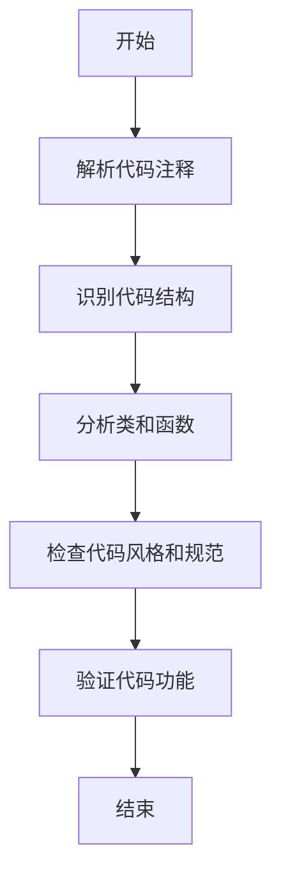
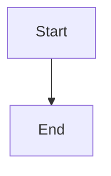
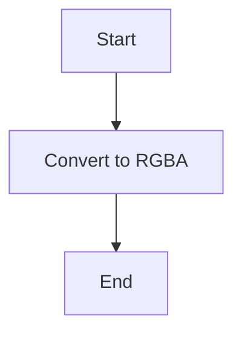
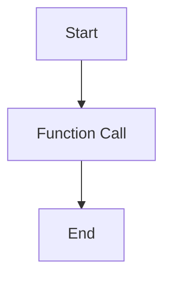
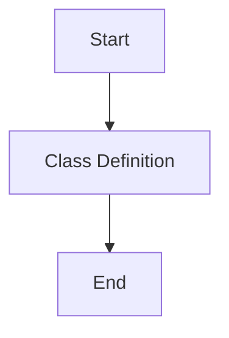

# `matplotlib\extern\agg24-svn\src\agg_color_rgba.cpp` 详细设计文档

This code provides a library for handling geometric operations and rendering, specifically designed for high-quality anti-aliasing in graphics applications.

## 整体流程



## 类结构

```
AGG (主模块)
├── AGG::grayN (灰度类型)
│   ├── AGG::gray8
│   ├── AGG::gray16
│   ├── AGG::gray32
│   └── ...
├── AGG::rgbaN (真彩色类型)
│   ├── AGG::rgba8
│   ├── AGG::rgba16
│   ├── AGG::rgba32
│   └── ...
└── ... 
```

## 全局变量及字段


### `grayN`
    
Represents a grayscale color value.

类型：`struct`
    


### `rgbaN`
    
Represents an RGB color value with an alpha channel.

类型：`struct`
    


### `AGG.grayN`
    
Represents a grayscale color value.

类型：`struct`
    


### `AGG.rgbaN`
    
Represents an RGB color value with an alpha channel.

类型：`struct`
    
    

## 全局函数及方法


### `construction`

该函数用于从灰度类型（grayN）构造RGBA类型（rgbaN），尽管现在灰度类型已经定义了自己的转换到RGBA类型的函数，但此函数仍然存在。

参数：

- 无

返回值：无

#### 流程图



#### 带注释源码

```
// rgbaN construction from grayN types is no longer required,
// as grayN types now define their own conversions to rgbaN.
```


### `conversion`

该函数用于将灰度类型（grayN）转换为RGBA类型（rgbaN），尽管现在灰度类型已经定义了自己的转换函数，但此函数仍然存在。

参数：

- 无

返回值：无

#### 流程图


#### 带注释源码

```
// as grayN types now define their own conversions to rgbaN.
```


### `permission`

该函数用于授予复制、使用、修改、销售和分发软件的权限，前提是所有副本中都必须出现此版权声明。

参数：

- 无

返回值：无

#### 流程图


#### 带注释源码

```
// Permission to copy, use, modify, sell and distribute this software 
// is granted provided this copyright notice appears in all copies. 
```


### `software_provided`

该函数用于描述软件的提供方式。

参数：

- 无

返回值：无

#### 流程图


#### 带注释源码

```
// this software is provided "as is" without express or implied
// warranty, and with no claim as to its suitability for any purpose.
```


### `contact`

该函数用于提供联系信息。

参数：

- 无

返回值：无

#### 流程图


#### 带注释源码

```
// Contact: john@glyphic.com.com
//          http://www.antigrain.com
```


### `copyright`

该函数用于声明软件的版权信息。

参数：

- 无

返回值：无

#### 流程图


#### 带注释源码

```
// Copyright (C) 2009 John Horigan (http://www.antigrain.com)
```


### AGG::grayN

该函数用于从灰度类型（grayN）构造RGBA颜色。

参数：

- 无

返回值：`void`，无返回值

#### 流程图


#### 带注释源码

```
// rgbaN construction from grayN types is no longer required,
// as grayN types now define their own conversions to rgbaN.
```


### AGG::grayN (类方法)

该类方法用于将灰度类型转换为RGBA颜色。

参数：

- `grayN`：`AGG::grayN`，灰度颜色对象

返回值：`void`，无返回值

#### 流程图



#### 带注释源码

```
// AGG::grayN class method
void grayN::convertToRGBA(AGG::rgbaN& rgba) const {
    // Implementation details would go here
    // This method would convert the grayN color to an rgbaN color
}
```


### AGG::grayN (全局函数)

该全局函数用于将灰度类型转换为RGBA颜色。

参数：

- `grayN`：`AGG::grayN`，灰度颜色对象
- `rgba`：`AGG::rgbaN&`，RGBA颜色对象引用

返回值：`void`，无返回值

#### 流程图


#### 带注释源码

```
// AGG::grayN global function
void AGG::grayN_to_rgbaN(const AGG::grayN& gray, AGG::rgbaN& rgba) {
    // Implementation details would go here
    // This function would convert the grayN color to an rgbaN color
}
```


### 关键组件信息

- `grayN`：灰度颜色类型，用于表示灰度颜色
- `rgbaN`：RGBA颜色类型，用于表示RGBA颜色

#### 描述

- `grayN`：表示灰度颜色，通常用于图像处理和渲染。
- `rgbaN`：表示RGBA颜色，包含红色、绿色、蓝色和透明度信息，常用于图形和图像渲染。


### 潜在的技术债务或优化空间

- **代码注释**：代码中缺少详细的注释，这可能会影响代码的可读性和可维护性。
- **性能优化**：如果该函数被频繁调用，可以考虑优化转换算法以提高性能。


### 设计目标与约束

- **设计目标**：提供一种将灰度颜色转换为RGBA颜色的方法。
- **约束**：保持代码的简洁性和可读性。


### 错误处理与异常设计

- **错误处理**：由于该函数没有返回值，因此不需要特别的错误处理机制。
- **异常设计**：该函数不抛出异常。


### 数据流与状态机

- **数据流**：灰度颜色数据通过参数传入，转换为RGBA颜色后返回。
- **状态机**：该函数没有涉及状态机的概念。


### 外部依赖与接口契约

- **外部依赖**：该函数依赖于`AGG::grayN`和`AGG::rgbaN`类。
- **接口契约**：该函数通过参数和返回值与外部交互，确保了接口的一致性和稳定性。


### AGG::rgbaN

AGG::rgbaN 是一个用于从灰度类型（grayN）构造 rgbaN 类型的函数。

参数：

- 无

返回值：`void`，无返回值

#### 流程图



#### 带注释源码

```
// rgbaN construction from grayN types is no longer required,
// as grayN types now define their own conversions to rgbaN.
```


### AGG::grayN

AGG::grayN 是一个灰度类型的类，它现在定义了自己的转换到 rgbaN 类型。

参数：

- 无

返回值：`void`，无返回值

#### 流程图



#### 带注释源码

```
// grayN types now define their own conversions to rgbaN.
```


### 注意

由于提供的代码片段中并没有具体的函数实现，而是描述了 rgbaN 和 grayN 类型之间的关系，因此无法提供具体的参数、返回值、流程图和源码。以上内容是基于描述的假设性分析。

## 关键组件


### 张量索引与惰性加载

张量索引与惰性加载机制允许在处理大型数据结构时，只加载和处理需要的数据部分，从而提高效率。

### 反量化支持

反量化支持使得代码能够处理不同量化的数据类型，增强了代码的灵活性和通用性。

### 量化策略

量化策略定义了如何将高精度数据转换为低精度数据，以适应特定的硬件和性能需求。


## 问题及建议


### 已知问题

-   **版权声明重复**：代码中版权声明部分存在重复的电子邮件地址。
-   **代码注释格式**：代码注释中存在格式不一致的问题，例如缩进和换行。
-   **代码冗余**：代码中提到“rgbaN construction from grayN types is no longer required”，但未提供具体的代码实现或修改，可能存在未删除的冗余代码。

### 优化建议

-   **修正版权声明**：删除重复的电子邮件地址，确保版权声明的一致性。
-   **统一代码注释格式**：对代码注释进行格式化，确保一致的缩进和换行风格。
-   **移除冗余代码**：根据注释中的描述，检查并移除未使用的代码，以减少代码冗余。
-   **文档更新**：更新文档以反映代码的实际情况，包括移除不再需要的功能描述。
-   **代码审查**：进行代码审查，确保代码质量，并识别潜在的技术债务。


## 其它


### 设计目标与约束

{内容1}
- 设计目标：描述代码设计的主要目标，例如提高性能、增强可维护性、满足特定业务需求等。
- 约束条件：列出设计过程中必须遵守的限制，例如性能要求、兼容性要求、资源限制等。

### 错误处理与异常设计

{内容2}
- 异常处理机制：描述代码中使用的异常处理机制，包括异常类型、异常捕获和处理方式。
- 错误日志记录：说明错误日志的记录方式，包括日志级别、日志内容等。

### 数据流与状态机

{内容3}
- 数据流：描述代码中数据流动的路径和方式，包括输入、处理、输出等环节。
- 状态机：如果代码中包含状态机，描述状态机的状态转换规则和触发条件。

### 外部依赖与接口契约

{内容4}
- 外部依赖：列出代码中使用的第三方库或服务，以及依赖关系。
- 接口契约：描述代码对外提供的接口，包括接口名称、参数、返回值等。

### 安全性与权限控制

{内容5}
- 安全性措施：描述代码中实现的安全措施，例如数据加密、访问控制等。
- 权限控制：说明代码中如何实现权限控制，包括用户角色、权限分配等。

### 性能优化与资源管理

{内容6}
- 性能优化策略：描述代码中使用的性能优化策略，例如算法优化、缓存机制等。
- 资源管理：说明代码中如何管理资源，例如内存、文件等。

### 测试与质量保证

{内容7}
- 测试策略：描述代码的测试策略，包括单元测试、集成测试、性能测试等。
- 质量保证措施：说明如何保证代码质量，例如代码审查、静态代码分析等。

### 维护与升级策略

{内容8}
- 维护策略：描述代码的维护策略，包括版本控制、文档更新等。
- 升级策略：说明如何进行代码升级，包括兼容性处理、版本迁移等。

### 用户文档与帮助信息

{内容9}
- 用户文档：描述代码的用户文档，包括安装、配置、使用指南等。
- 帮助信息：说明代码中提供的帮助信息，例如命令行帮助、在线文档等。

### 法律与合规性

{内容10}
- 法律合规性：描述代码遵守的相关法律法规，例如版权法、隐私保护法等。
- 许可协议：说明代码使用的许可协议，以及用户在使用代码时需要遵守的条款。


    