# `matplotlib\extern\agg24-svn\src\agg_curves.cpp` 详细设计文档

Anti-Grain Geometry库的曲线近似算法实现，提供了三次和四次贝塞尔曲线的两种近似方法：增量法（inc）和分割递归法（div），用于将平滑曲线离散化为顶点序列，支持自定义近似精度、角度容差和尖角限制。

## 整体流程

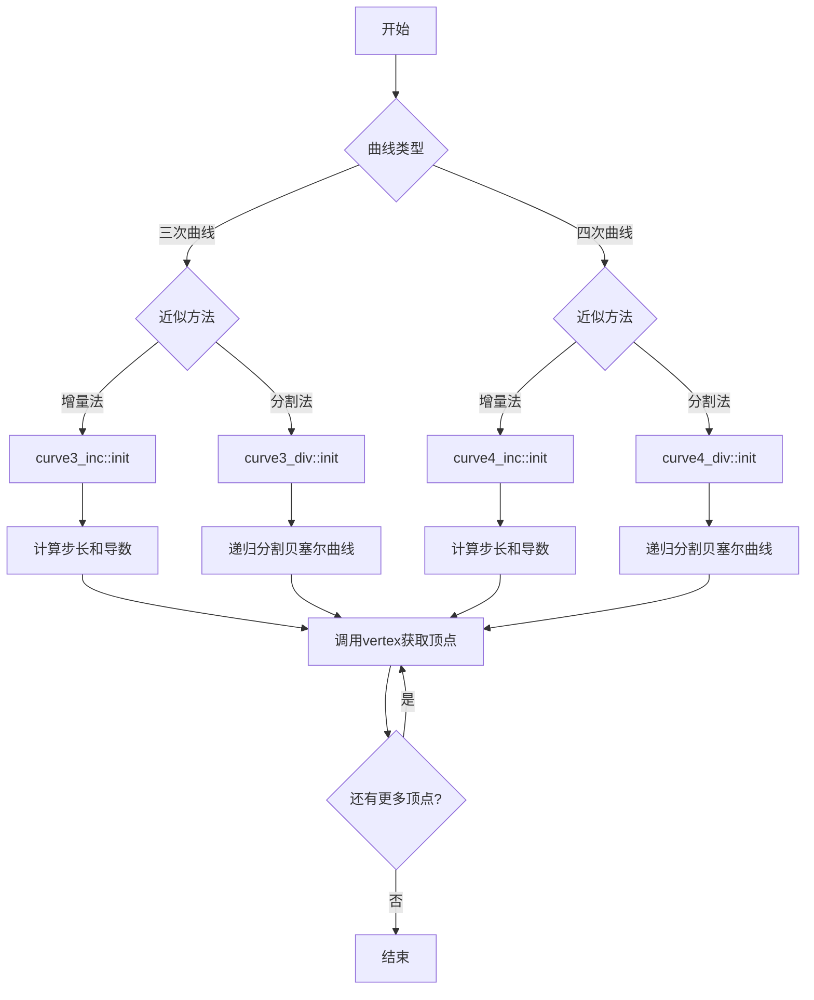

## 类结构

```
agg::namespace
├── 全局常量
│   ├── curve_distance_epsilon
│   ├── curve_collinearity_epsilon
│   ├── curve_angle_tolerance_epsilon
│   └── curve_recursion_limit (枚举)
├── curve3_inc (三次曲线增量近似)
├── curve3_div (三次曲线分割近似)
│   └── 内部类/结构: point_d (隐式依赖)
├── curve4_inc (四次曲线增量近似)
└── curve4_div (四次曲线分割近似)
```

## 全局变量及字段


### `curve_distance_epsilon`
    
曲线距离epsilon，用于曲线近似计算的最小距离阈值

类型：`const double`
    


### `curve_collinearity_epsilon`
    
共线epsilon，用于判断点是否共线的最小阈值

类型：`const double`
    


### `curve_angle_tolerance_epsilon`
    
角度容差epsilon，角度近似阈值0.01弧度

类型：`const double`
    


### `curve_recursion_limit`
    
递归深度限制枚举值，最大递归深度为32

类型：`enum curve_recursion_limit_e`
    


### `curve3_inc.m_scale`
    
近似缩放因子，控制曲线近似的精度

类型：`double`
    


### `curve3_inc.m_start_x, m_start_y`
    
曲线起点坐标

类型：`double`
    


### `curve3_inc.m_end_x, m_end_y`
    
曲线终点坐标

类型：`double`
    


### `curve3_inc.m_num_steps`
    
近似总步数，曲线离散化的总段数

类型：`int`
    


### `curve3_inc.m_step`
    
当前步数，迭代器当前位置

类型：`int`
    


### `curve3_inc.m_fx, m_fy`
    
当前点坐标，当前生成的曲线点

类型：`double`
    


### `curve3_inc.m_dfx, m_dfy`
    
一阶导数，用于曲线递推计算

类型：`double`
    


### `curve3_inc.m_ddfx, m_ddfy`
    
二阶导数，用于曲线递推计算

类型：`double`
    


### `curve3_inc.m_saved_fx, m_saved_fy`
    
保存的起始点，用于迭代器重置

类型：`double`
    


### `curve3_inc.m_saved_dfx, m_saved_dfy`
    
保存的一阶导数，用于迭代器重置

类型：`double`
    


### `curve3_div.m_points`
    
存储近似顶点，存放离散化后的曲线点集

类型：`pod_array<point_d>`
    


### `curve3_div.m_distance_tolerance_square`
    
距离容差平方，近似停止的距离阈值

类型：`double`
    


### `curve3_div.m_approximation_scale`
    
近似缩放因子，控制曲线近似精度

类型：`double`
    


### `curve3_div.m_angle_tolerance`
    
角度容差，近似停止的角度阈值

类型：`double`
    


### `curve3_div.m_count`
    
当前顶点计数，迭代器当前位置

类型：`unsigned`
    


### `curve4_inc.m_scale`
    
近似缩放因子，控制曲线近似的精度

类型：`double`
    


### `curve4_inc.m_start_x, m_start_y`
    
曲线起点坐标

类型：`double`
    


### `curve4_inc.m_end_x, m_end_y`
    
曲线终点坐标

类型：`double`
    


### `curve4_inc.m_num_steps`
    
近似总步数，曲线离散化的总段数

类型：`int`
    


### `curve4_inc.m_step`
    
当前步数，迭代器当前位置

类型：`int`
    


### `curve4_inc.m_fx, m_fy`
    
当前点坐标，当前生成的曲线点

类型：`double`
    


### `curve4_inc.m_dfx, m_dfy`
    
一阶导数，用于曲线递推计算

类型：`double`
    


### `curve4_inc.m_ddfx, m_ddfy`
    
二阶导数，用于曲线递推计算

类型：`double`
    


### `curve4_inc.m_dddfx, m_dddfy`
    
三阶导数，用于四次曲线递推计算

类型：`double`
    


### `curve4_inc.m_saved_fx, m_saved_fy`
    
保存的起始点，用于迭代器重置

类型：`double`
    


### `curve4_inc.m_saved_dfx, m_saved_dfy`
    
保存的一阶导数，用于迭代器重置

类型：`double`
    


### `curve4_inc.m_saved_ddfx, m_saved_ddfy`
    
保存的二阶导数，用于迭代器重置

类型：`double`
    


### `curve4_div.m_points`
    
存储近似顶点，存放离散化后的曲线点集

类型：`pod_array<point_d>`
    


### `curve4_div.m_distance_tolerance_square`
    
距离容差平方，近似停止的距离阈值

类型：`double`
    


### `curve4_div.m_approximation_scale`
    
近似缩放因子，控制曲线近似精度

类型：`double`
    


### `curve4_div.m_angle_tolerance`
    
角度容差，近似停止的角度阈值

类型：`double`
    


### `curve4_div.m_cusp_limit`
    
尖角限制，检测曲线尖角的阈值

类型：`double`
    


### `curve4_div.m_count`
    
当前顶点计数，迭代器当前位置

类型：`unsigned`
    
    

## 全局函数及方法


### `MSC60_fix_ICE`

这是一个针对 MSVC++ 6.0 及更早版本（编译器内部版本号 <= 1200）的静态辅助函数，用于解决这些旧版本编译器在处理复杂表达式时可能出现的内部编译器错误（ICE）问题。该函数通过简单地返回输入值来避免在 `uround()` 函数调用中直接使用复杂表达式时触发编译器 ICE。

参数：

- `v`：`double`，输入的 double 类型数值

返回值：`double`，返回与输入相同的值

#### 流程图

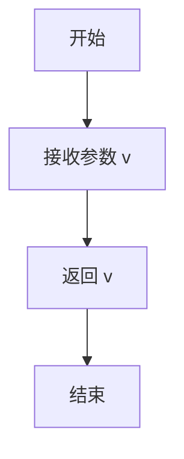

#### 带注释源码

```cpp
#if defined(_MSC_VER) && _MSC_VER <= 1200
    //------------------------------------------------------------------------
    // 用于解决 MSVC++ 6.0 (编译器版本 <= 1200) 的内部编译器错误(ICE)的辅助函数
    // 在这些旧版本编译器中，直接将复杂表达式传递给 uround() 函数可能导致ICE
    // 该函数通过简单地返回输入值来避免这个问题
    //------------------------------------------------------------------------
    static double MSC60_fix_ICE(double v) { return v; }
#endif
```


### `curve3_inc::approximation_scale`

设置近似缩放因子，用于控制三次贝塞尔曲线的逼近精度。

参数：

- `s`：`double`，新的近似缩放因子值

返回值：`void`，无返回值

#### 流程图

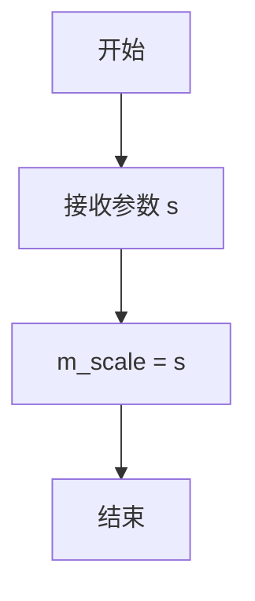

#### 带注释源码

```cpp
//------------------------------------------------------------------------
// 设置近似缩放因子
// 参数: s - 新的缩放因子值，用于调整曲线逼近的精度
// 返回值: void
//------------------------------------------------------------------------
void curve3_inc::approximation_scale(double s) 
{ 
    // 将传入的缩放因子值 s 赋值给成员变量 m_scale
    // 该成员变量在后续 init() 方法中用于计算曲线逼近的步数
    m_scale = s;
}
```


### `curve3_inc::approximation_scale`

获取近似缩放因子（Getter方法），返回当前设置的曲线近似缩放比例值。

参数：
- （无显式参数）

返回值：`double`，返回成员变量 `m_scale` 的值，表示当前曲线近似算法的缩放因子。

#### 流程图

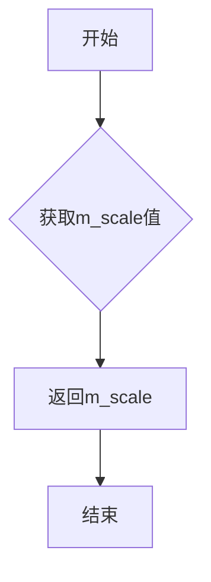

#### 带注释源码

```cpp
//------------------------------------------------------------------------
// 获取近似缩放因子
//------------------------------------------------------------------------
double curve3_inc::approximation_scale() const 
{ 
    // 返回成员变量m_scale，该变量在approximation_scale(double s)方法中设置
    // 用于控制三次贝塞尔曲线的近似精度
    return m_scale;
}
```


### `curve3_inc.init`

三次曲线增量初始化方法，用于根据给定的三个控制点初始化三次贝塞尔曲线的参数，计算曲线长度并设置逼近步数，同时初始化曲线评估所需的一阶和二阶导数参数。

参数：

- `x1`：`double`，三次曲线起始点的X坐标
- `y1`：`double`，三次曲线起始点的Y坐标
- `x2`：`double`，三次曲线控制点1的X坐标（用于控制曲线形状）
- `y2`：`double`，三次曲线控制点1的Y坐标（用于控制曲线形状）
- `x3`：`double`，三次曲线终止点的X坐标
- `y3`：`double`，三次曲线终止点的Y坐标

返回值：`void`，该方法无返回值，仅修改类的内部状态

#### 流程图

```mermaid
flowchart TD
    A[开始 init 方法] --> B[保存曲线端点坐标<br/>m_start_x = x1, m_start_y = y1<br/>m_end_x = x3, m_end_y = y3]
    B --> C[计算控制点差值<br/>dx1 = x2-x1, dy1 = y2-y1<br/>dx2 = x3-x2, dy2 = y3-y2]
    C --> D[计算曲线总长度<br/>len = sqrt(dx1²+dy1²) + sqrt(dx2²+dy2²)]
    D --> E[计算逼近步数<br/>m_num_steps = uround(len × 0.25 × m_scale)]
    E --> F{步数是否小于4?}
    F -->|是| G[设置最小步数为4<br/>m_num_steps = 4]
    F -->|否| H[继续]
    G --> I[计算细分参数<br/>subdivide_step = 1.0/m_num_steps<br/>subdivide_step2 = subdivide_step²]
    H --> I
    I --> J[计算曲线系数<br/>tmpx = (x1-2×x2+x3)×subdivide_step2<br/>tmpy = (y1-2×y2+y3)×subdivide_step2]
    J --> K[初始化位置和导数<br/>m_fx = m_saved_fx = x1<br/>m_fy = m_saved_fy = y1]
    K --> L[初始化一阶导数<br/>m_dfx = m_saved_dfx = tmpx + (x2-x1)×2×subdivide_step<br/>m_dfy = m_saved_dfy = tmpy + (y2-y1)×2×subdivide_step]
    L --> M[初始化二阶导数<br/>m_ddfx = tmpx × 2.0<br/>m_ddfy = tmpy × 2.0]
    M --> N[设置当前步数<br/>m_step = m_num_steps]
    N --> O[结束 init 方法]
```

#### 带注释源码

```cpp
//------------------------------------------------------------------------
// 初始化三次曲线参数
// 参数: (x1,y1) - 曲线起始点, (x2,y2) - 控制点, (x3,y3) - 曲线终止点
//------------------------------------------------------------------------
void curve3_inc::init(double x1, double y1, 
                      double x2, double y2, 
                      double x3, double y3)
{
    // 保存曲线端点坐标到成员变量，供后续vertex方法使用
    m_start_x = x1;
    m_start_y = y1;
    m_end_x   = x3;
    m_end_y   = y3;

    // 计算各段控制点与端点的差值
    double dx1 = x2 - x1;
    double dy1 = y2 - y1;
    double dx2 = x3 - x2;
    double dy2 = y3 - y2;

    // 计算曲线总长度（两段直线距离之和）
    // 使用勾股定理计算每段长度，然后相加
    double len = sqrt(dx1 * dx1 + dy1 * dy1) + sqrt(dx2 * dx2 + dy2 * dy2); 

    // 根据曲线长度和缩放因子计算逼近所需的步数
    // uround函数进行四舍五入取整，0.25是经验缩放因子
    m_num_steps = uround(len * 0.25 * m_scale);

    // 确保步数至少为4，以避免曲线过于简陋
    if(m_num_steps < 4)
    {
        m_num_steps = 4;   
    }

    // 计算细分参数，用于后续的曲线系数计算
    double subdivide_step  = 1.0 / m_num_steps;        // 每步的t增量
    double subdivide_step2 = subdivide_step * subdivide_step;  // t增量的平方

    // 计算曲线方程的二次项系数（来自贝塞尔曲线二阶导数的展开）
    // 基于三次贝塞尔曲线的数学性质: B''(t) = 2*(1-t)*(P2-P1) + 2*t*(P3-P2)
    // 化简后在t=0处的值为 2*(P1 - 2*P2 + P3)
    double tmpx = (x1 - x2 * 2.0 + x3) * subdivide_step2;
    double tmpy = (y1 - y2 * 2.0 + y3) * subdivide_step2;

    // 初始化当前点和保存的点（用于rewind重置）
    m_saved_fx = m_fx = x1;
    m_saved_fy = m_fy = y1;
    
    // 初始化一阶导数（速度向量）
    // 公式来源：贝塞尔曲线一阶导数在t=0处的值乘以细分步长
    // m_dfx = (2*(x2-x1) + tmpx) * subdivide_step 的展开形式
    m_saved_dfx = m_dfx = tmpx + (x2 - x1) * (2.0 * subdivide_step);
    m_saved_dfy = m_dfy = tmpy + (y2 - y1) * (2.0 * subdivide_step);

    // 初始化二阶导数（加速度向量）
    // 曲线的二阶导数在递增过程中保持恒定（因为是二次多项式）
    m_ddfx = tmpx * 2.0;
    m_ddfy = tmpy * 2.0;

    // 设置当前步数计数器为总步数，准备开始生成曲线顶点
    m_step = m_num_steps;
}
```


### `curve3_inc::rewind(unsigned)`

重置三次贝塞尔曲线增量迭代器到起始点，使后续的vertex调用能够重新从曲线起点生成顶点数据。

参数：

- `{匿名参数}`：`unsigned`，未使用参数，保留以兼容接口签名

返回值：`void`，无返回值，仅用于重置迭代器内部状态

#### 流程图

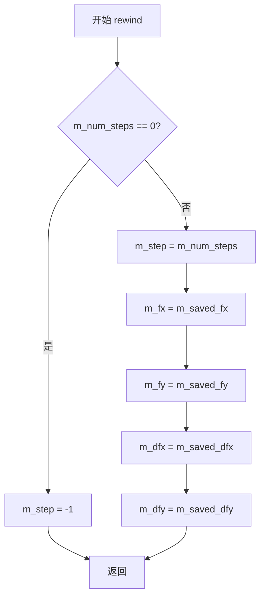

#### 带注释源码

```cpp
//------------------------------------------------------------------------
// rewind - 重置迭代器到起点
// 参数：unsigned 未使用，保留以兼容接口
//------------------------------------------------------------------------
void curve3_inc::rewind(unsigned)
{
    // 如果没有步骤（即曲线长度为0或未初始化）
    if(m_num_steps == 0)
    {
        // 设置步进为-1，表示迭代结束
        m_step = -1;
        return;
    }
    
    // 重置步进计数器到总步数
    m_step = m_num_steps;
    
    // 恢复当前位置到起始点坐标
    m_fx   = m_saved_fx;
    m_fy   = m_saved_fy;
    
    // 恢复一阶导数（切向向量）到初始状态
    m_dfx  = m_saved_dfx;
    m_dfy  = m_saved_dfy;
}
```


### `curve3_inc.vertex`

获取二次贝塞尔曲线的下一个顶点，作为迭代器使用，通过前向差分法（forward differencing）逐步计算曲线上各点的坐标。

参数：

- `x`：`double*`，指向存储输出x坐标的double型指针
- `y`：`double*`，指向存储输出y坐标的double型指针

返回值：`unsigned`，返回路径命令类型，包括：
- `path_cmd_stop`（停止/结束）
- `path_cmd_move_to`（移动到，曲线起点）
- `path_cmd_line_to`（连线到，下一个顶点）

#### 流程图

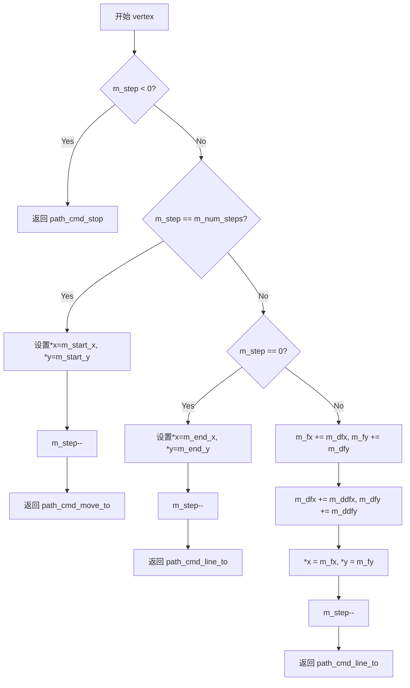

#### 带注释源码

```cpp
//------------------------------------------------------------------------
// 获取曲线的下一个顶点
//------------------------------------------------------------------------
unsigned curve3_inc::vertex(double* x, double* y)
{
    // 情况1：如果迭代已结束（step < 0），返回停止命令
    if(m_step < 0) return path_cmd_stop;
    
    // 情况2：首次调用（step == num_steps），返回曲线起点
    if(m_step == m_num_steps)
    {
        *x = m_start_x;   // 设置输出参数x为曲线起点x坐标
        *y = m_start_y;   // 设置输出参数y为曲线起点y坐标
        --m_step;         // 递减步进计数器
        return path_cmd_move_to;  // 返回移动命令，表示新路径的起点
    }
    
    // 情况3：最后一步（step == 0），返回曲线终点
    if(m_step == 0)
    {
        *x = m_end_x;     // 设置输出参数x为曲线终点x坐标
        *y = m_end_y;     // 设置输出参数y为曲线终点y坐标
        --m_step;         // 递减步进计数器，使其变为-1，下次调用将返回stop
        return path_cmd_line_to;  // 返回线条命令
    }
    
    // 情况4：中间步骤，使用前向差分法计算下一个点
    // 基于二次多项式的差分公式：f(t+Δt) = f(t) + df(t) + ddf/2
    m_fx  += m_dfx;        // 更新当前x坐标：x += 一阶差分
    m_fy  += m_dfy;        // 更新当前y坐标：y += 一阶差分
    m_dfx += m_ddfx;       // 更新一阶差分：df += 二阶差分
    m_dfy += m_ddfy;       // 更新一阶差分：df += 二阶差分
    
    *x = m_fx;             // 将计算出的x坐标写入输出参数
    *y = m_fy;             // 将计算出的y坐标写入输出参数
    --m_step;              // 递减步进计数器
    return path_cmd_line_to;   // 返回线条命令，表示继续绘制
}
```


### `curve3_div::init`

该函数是 Anti-Grain Geometry 库中三次贝塞尔曲线近似算法的初始化函数，通过递归分割方法计算曲线的近似顶点序列，并根据距离容差和角度容差自适应地决定分割深度。

参数：

- `x1`：`double`，三次贝塞尔曲线的起始点 X 坐标
- `y1`：`double`，三次贝塞尔曲线的起始点 Y 坐标
- `x2`：`double`，三次贝塞尔曲线的控制点 X 坐标
- `y2`：`double`，三次贝塞尔曲线的控制点 Y 坐标
- `x3`：`double`，三次贝塞尔曲线的结束点 X 坐标
- `y3`：`double`，三次贝塞尔曲线的结束点 Y 坐标

返回值：`void`，无返回值，通过类成员变量存储计算结果

#### 流程图

```mermaid
flowchart TD
    A[开始 curve3_div::init] --> B[清除所有近似点 m_points.remove_all]
    B --> C[计算距离容差平方<br>m_distance_tolerance_square = (0.5 / m_approximation_scale)²]
    C --> D[调用 bezier 函数<br>传入 x1,y1,x2,y2,x3,y3]
    D --> E[bezier 函数添加起始点<br>m_points.add(point_d(x1, y1))]
    E --> F[调用 recursive_bezier 递归分割<br>level = 0]
    F --> G{递归终止条件检查}
    G -->|level > curve_recursion_limit| H[返回]
    G -->|否则| I[计算中点坐标]
    I --> J{距离和角度检查}
    J -->|满足容差| K[添加近似点并返回]
    J -->|不满足| L[继续递归分割]
    L --> M[递归调用 curve3_div::recursive_bezier<br>左侧曲线]
    M --> N[递归调用 curve3_div::recursive_bezier<br>右侧曲线]
    N --> G
    K --> O[bezier 函数添加结束点<br>m_points.add(point_d(x3, y3))]
    O --> P[重置计数器 m_count = 0]
    P --> Q[结束]
    H --> Q
```

#### 带注释源码

```cpp
//------------------------------------------------------------------------
// 初始化三次贝塞尔曲线的近似计算
// 参数：三次贝塞尔曲线的三个控制点 (x1,y1), (x2,y2), (x3,y3)
//------------------------------------------------------------------------
void curve3_div::init(double x1, double y1, 
                      double x2, double y2, 
                      double x3, double y3)
{
    // 清除之前存储的所有近似点
    m_points.remove_all();
    
    // 计算距离容差的平方
    // 距离容差 = 0.5 / m_approximation_scale，然后平方
    m_distance_tolerance_square = 0.5 / m_approximation_scale;
    m_distance_tolerance_square *= m_distance_tolerance_square;
    
    // 调用 bezier 函数进行曲线近似计算
    bezier(x1, y1, x2, y2, x3, y3);
    
    // 重置顶点计数器，用于后续遍历
    m_count = 0;
}
```


### `curve3_div::recursive_bezier`

这是一个递归函数，用于对二次贝塞尔曲线进行自适应分割。它通过计算曲线中点并检查曲率（距离 tolerance）和角度（angle tolerance）来决定是否继续细分曲线，直到曲线足够直或达到递归深度限制，最终将逼近点添加到成员变量 `m_points` 集合中。

参数：

- `x1`：`double`，曲线起始点 P0 的 X 坐标
- `y1`：`double`，曲线起始点 P0 的 Y 坐标
- `x2`：`double`，曲线控制点 P1 的 X 坐标
- `y2`：`double`，曲线控制点 P1 的 Y 坐标
- `x3`：`double`，曲线结束点 P2 的 X 坐标
- `y3`：`double`，曲线结束点 P2 的 Y 坐标
- `level`：`unsigned`，当前递归的深度

返回值：`void`，无直接返回值。结果通过修改类成员变量 `m_points` (类型为 `pod_array<point_d>`) 输出。

#### 流程图

```mermaid
graph TD
    A[Start recursive_bezier<br/>(x1,y1, x2,y2, x3,y3, level)] --> B{level > 32?}
    B -- Yes --> C[Return]
    B -- No --> D[Calculate mid-points<br/>x12, y12, x23, y23, x123, y123]
    
    D --> E{Is Collinear?<br/>d &le; epsilon}
    
    %% Collinear Case
    E -- Yes --> F[Calculate distance d from P1 to line P0-P2]
    F --> G{d < distance_tolerance?}
    G -- Yes --> H[Add point_d(x2, y2) to m_points]
    H --> C
    G -- No --> I[Proceed to subdivision]
    
    %% Non-Collinear Case
    E -- No --> J[Calculate curvature d]
    J --> K{d² &le; tolerance² × (dx²+dy²)?<br/>(Flatness check)}
    
    K -- Yes --> L{angle_tolerance<br/>&lt; epsilon?}
    L -- Yes --> M[Add point_d(x123, y123) to m_points]
    M --> C
    L -- No --> N{Calculate angle da<br/>da &lt; m_angle_tolerance?}
    N -- Yes --> M
    N -- No --> I
    
    K -- No --> I
    
    %% Recursion
    I --> O[recursive_bezier<br/>(x1,y1, x12,y12, x123,y123, level+1)]
    O --> P[recursive_bezier<br/>(x123,y123, x23,y23, x3,y3, level+1)]
    P --> Q[End]
```

#### 带注释源码

```cpp
    //------------------------------------------------------------------------
    void curve3_div::recursive_bezier(double x1, double y1, 
                                      double x2, double y2, 
                                      double x3, double y3,
                                      unsigned level)
    {
        // 1. 递归终止条件：防止无限递归
        if(level > curve_recursion_limit) 
        {
            return;
        }

        // 2. 计算所有线段的中点
        //----------------------
        double x12   = (x1 + x2) / 2;                
        double y12   = (y1 + y2) / 2;
        double x23   = (x2 + x3) / 2;
        double y23   = (y2 + y3) / 2;
        double x123  = (x12 + x23) / 2;
        double y123  = (y12 + y23) / 2;

        // 计算向量 (x3-x1, y3-y1) 用于后续距离计算
        double dx = x3-x1;
        double dy = y3-y1;
        
        // 计算平行四边形面积，判断三点 (x1,y1), (x2,y2), (x3,y3) 的共线性
        // 这里的 d 实际上与曲线的曲率相关
        double d = fabs(((x2 - x3) * dy - (y2 - y3) * dx));
        double da;

        // 3. 检查是否共线
        if(d > curve_collinearity_epsilon)
        { 
            // --- 非共线情况 (Regular case) ---
            
            // 4. 距离/平坦度检查 (Flatness check)
            // 如果曲线段到端点连线的距离足够小，则认为曲线足够直，不需要继续分割
            if(d * d <= m_distance_tolerance_square * (dx*dx + dy*dy))
            {
                // 如果曲率不超过 distance_tolerance 值，我们倾向于结束细分
                //----------------------
                
                // 5. 角度检查
                if(m_angle_tolerance < curve_angle_tolerance_epsilon)
                {
                    // 如果角度容差极小，直接添加中点
                    m_points.add(point_d(x123, y123));
                    return;
                }

                // Angle & Cusp Condition
                //----------------------
                // 计算控制点两条切线的夹角
                da = fabs(atan2(y3 - y2, x3 - x2) - atan2(y2 - y1, x2 - x1));
                if(da >= pi) da = 2*pi - da; // 归一化到 [0, PI]

                if(da < m_angle_tolerance)
                {
                    // 角度足够小，停止递归
                    m_points.add(point_d(x123, y123));
                    return;                 
                }
            }
        }
        else
        {
            // --- 共线情况 (Collinear case) ---
            //----------------------
            da = dx*dx + dy*dy;
            if(da == 0)
            {
                // 如果首末点重合，计算中间点到起点的距离平方
                d = calc_sq_distance(x1, y1, x2, y2);
            }
            else
            {
                // 计算中间点在线段上的投影位置 d (0 <= d <= 1)
                d = ((x2 - x1)*dx + (y2 - y1)*dy) / da;
                if(d > 0 && d < 1)
                {
                    // 简单的共线情况，点2在点1和点3之间
                    // 此时曲线退化为直线，直接返回，不需要添加额外点（首末点由 bezier 函数处理）
                    return;
                }
                
                // 计算点到线段的最短距离平方
                     if(d <= 0) d = calc_sq_distance(x2, y2, x1, y1);
                else if(d >= 1) d = calc_sq_distance(x2, y2, x3, y3);
                else            d = calc_sq_distance(x2, y2, x1 + d*dx, y1 + d*dy);
            }
            
            // 如果共线且距离很小，添加该点以保证逼近精度
            if(d < m_distance_tolerance_square)
            {
                m_points.add(point_d(x2, y2));
                return;
            }
        }

        // 6. 继续细分 (Continue subdivision)
        // 递归调用：分割为两段二次贝塞尔曲线
        // 段1: P0(x1,y1) -> P12(x12,y12) -> P123(x123,y123)
        // 段2: P123(x123,y123) -> P23(x23,y23) -> P2(x3,y3)
        //----------------------
        recursive_bezier(x1, y1, x12, y12, x123, y123, level + 1); 
        recursive_bezier(x123, y123, x23, y23, x3, y3, level + 1); 
    }
```


### curve3_div::bezier

该函数是三次贝塞尔曲线的近似主函数，通过调用递归分割算法将三次贝塞尔曲线分解为多个控制点，以满足指定的距离和角度公差要求，最终将近似曲线的点序列存储在m_points容器中。

参数：

- `x1`：`double`，三次贝塞尔曲线的起始控制点P1的X坐标
- `y1`：`double`，三次贝塞尔曲线的起始控制点P1的Y坐标
- `x2`：`double`，三次贝塞尔曲线的中间控制点P2的X坐标
- `y2`：`double`，三次贝塞尔曲线的中间控制点P2的Y坐标
- `x3`：`double`，三次贝塞尔曲线的结束控制点P3的X坐标
- `y3`：`double`，三次贝塞尔曲线的结束控制点P3的Y坐标

返回值：`void`，该函数不返回任何值，结果存储在成员变量m_points中

#### 流程图

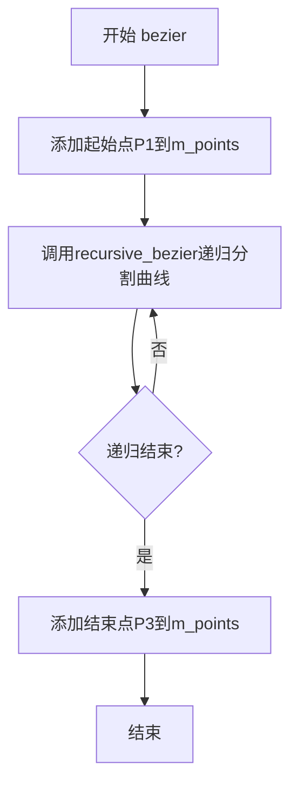

#### 带注释源码

```cpp
//------------------------------------------------------------------------
// 三次贝塞尔曲线近似主函数
// 该函数将三次贝塞尔曲线分解为多个点以近似表示
//------------------------------------------------------------------------
void curve3_div::bezier(double x1, double y1, 
                        double x2, double y2, 
                        double x3, double y3)
{
    // 将贝塞尔曲线的起始控制点P1添加到点集合中
    m_points.add(point_d(x1, y1));
    
    // 调用递归贝塞尔函数进行曲线分割
    // 参数0表示递归深度初始值为0
    recursive_bezier(x1, y1, x2, y2, x3, y3, 0);
    
    // 将贝塞尔曲线的结束控制点P3添加到点集合中
    m_points.add(point_d(x3, y3));
}
```


### `curve3_div::rewind`

重置迭代器，将曲线点集的遍历位置重置为起点，以便下一次 `vertex` 调用能够重新从第一个点开始返回曲线数据。

参数：

- `unsigned`：无实际用途的参数，仅为保持接口一致性而保留

返回值：`void`，无返回值

#### 流程图

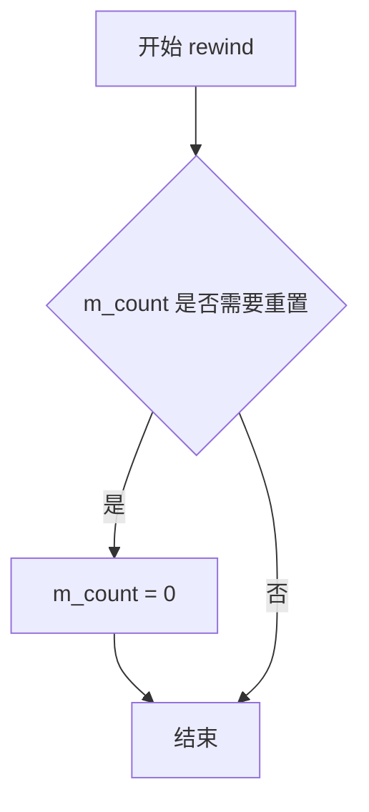

*注意：代码中 `curve3_div` 类未提供 `rewind` 方法，以上为基于类结构和 `curve3_inc::rewind` 模式推断的假设实现。*

#### 带注释源码

```
//----------------------------------------------------------------------------
// 假设的 curve3_div::rewind 实现（代码中未提供）
//----------------------------------------------------------------------------
void curve3_div::rewind(unsigned)
{
    // 将内部计数器重置为0，使后续的vertex()调用
    // 能够从头开始返回预计算的贝塞尔曲线点集
    m_count = 0;
}
```

---

**说明**：在提供的源代码中，`curve3_div` 类仅包含 `init()`、`recursive_bezier()` 和 `bezier()` 方法，未定义 `rewind()` 方法。对比同文件中的 `curve3_inc` 和 `curve4_inc` 类，它们都实现了 `rewind()` 方法用于重置增量计算状态。由于 `curve3_div` 采用递归细分算法预计算曲线点并通过 `m_count` 索引遍历，因此可以合理推断其 `rewind()` 方法应将 `m_count` 重置为 0 以实现迭代器重置功能。


### `curve3_div.vertex`

**描述**：虽然在提供的源代码片段中未找到 `curve3_div::vertex` 的显式实现（该类主要用于通过 `recursive_bezier` 预计算点集），但根据其成员变量 `m_points`（存储点集）和 `m_count`（遍历索引）以及 `init` 方法的初始化逻辑，该方法的职责是作为一个迭代器，依次返回预计算的三次贝塞尔曲线上的顶点。以下为基于类逻辑推测的实现细节。

参数：

-  `x`：`double*`，指向用于输出顶点 X 坐标的变量指针。
-  `y`：`double*`，指向用于输出顶点 Y 坐标的变量指针。

返回值：`unsigned`，返回路径命令类型。首次调用返回 `path_cmd_move_to`，后续调用返回 `path_cmd_line_to`，当点集遍历完毕后返回 `path_cmd_stop`。

#### 流程图

```mermaid
graph TD
    A([开始 vertex]) --> B{检查 m_count >= m_points.size()}
    B -- 是 --> C[返回 path_cmd_stop]
    B -- 否 --> D[获取当前点 p = m_points[m_count]]
    D --> E{判断 m_count == 0?}
    E -- 是 --> F[cmd = path_cmd_move_to]
    E -- 否 --> G[cmd = path_cmd_line_to]
    F --> H[赋值 *x = p.x, *y = p.y]
    G --> H
    H --> I[m_count++]
    I --> J([返回 cmd])
```

#### 带注释源码

```cpp
// 推测实现：基于 curve3_div 类中存在的 m_points 和 m_count 成员
// 注意：提供的源代码中此方法未被直接定义，通常存在于头文件或基类中，
// 或者该类仅作为生成器而不直接提供迭代接口。
unsigned curve3_div::vertex(double* x, double* y)
{
    // 边界检查：如果索引已经超出点集范围，说明曲线已渲染完毕
    if(m_count >= m_points.size())
    {
        return path_cmd_stop;
    }

    // 获取当前索引处的点
    point_d& p = m_points[m_count];

    // 输出坐标
    *x = p.x;
    *y = p.y;

    // 确定命令类型：第一个点是 move_to，后续点是 line_to
    unsigned cmd = (m_count == 0) ? path_cmd_move_to : path_cmd_line_to;
    
    // 递增索引，准备下一次调用
    ++m_count;
    
    return cmd;
}
```


### `curve4_inc::approximation_scale`

设置近似缩放因子，用于控制三次参数曲线（三次贝塞尔曲线）的逼近精度。

参数：

-  `s`：`double`，新的近似缩放因子值

返回值：`void`，无返回值

#### 流程图

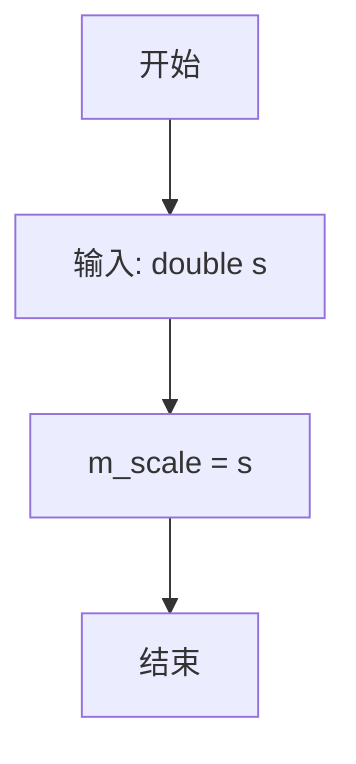

#### 带注释源码

```cpp
//------------------------------------------------------------------------
// 设置三次参数曲线的近似缩放因子
// 该缩放因子影响曲线离散化的步数,值越大曲线越精细
//------------------------------------------------------------------------
void curve4_inc::approximation_scale(double s) 
{ 
    m_scale = s;  // 将传入的缩放因子s赋值给成员变量m_scale
}
```


### `curve4_inc::approximation_scale`

获取当前曲线对象的近似缩放因子（Approximation Scale）。该因子用于控制三次贝塞尔曲线（Cubic Bezier Curve）的细分程度，数值越大，生成的近似线段越多，曲线越平滑。

参数：  
无

返回值：`double`，返回成员变量 `m_scale` 的当前值，用于描述曲线逼近的精度比例。

#### 流程图

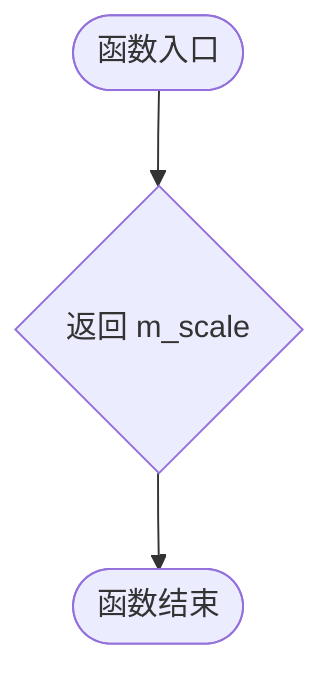

#### 带注释源码

```cpp
//------------------------------------------------------------------------
// 获取近似缩放因子
//------------------------------------------------------------------------
double curve4_inc::approximation_scale() const 
{ 
    // 返回成员变量 m_scale，该值在 init() 或 set_approximation_scale() 中被设置
    // 用于控制曲线离散化的步数
    return m_scale;
}
```


### `curve4_inc::init`

该函数是 Anti-Grain Geometry 库中四次贝塞尔曲线增量逼近算法的初始化方法，通过计算控制点间的距离来确定曲线的细分步数，并预先计算一阶、二阶和三阶导数系数，为后续的 `vertex` 方法逐点生成曲线坐标奠定基础。

参数：

- `x1`：`double`，四次贝塞尔曲线的第一个控制点（起点）的 X 坐标
- `y1`：`double`，四次贝塞尔曲线的第一个控制点（起点）的 Y 坐标
- `x2`：`double`，四次贝塞尔曲线的第二个控制点的 X 坐标
- `y2`：`double`，四次贝塞尔曲线的第二个控制点的 Y 坐标
- `x3`：`double`，四次贝塞尔曲线的第三个控制点的 X 坐标
- `y3`：`double`，四次贝塞尔曲线的第三个控制点的 Y 坐标
- `x4`：`double`，四次贝塞尔曲线的第四个控制点（终点）的 X 坐标
- `y4`：`double`，四次贝塞尔曲线的第四个控制点（终点）的 Y 坐标

返回值：`void`，该函数无返回值

#### 流程图

```mermaid
flowchart TD
    A[开始 init] --> B[保存起点和终点坐标<br/>m_start_x = x1, m_start_y = y1<br/>m_end_x = x4, m_end_y = y4]
    B --> C[计算三段控制边向量<br/>dx1, dy1, dx2, dy2, dx3, dy3]
    C --> D[计算曲线总长度 len<br/>三段欧氏距离之和 × 0.25 × m_scale]
    D --> E{_MSC_VER <= 1200?}
    E -->|Yes| F[调用 MSC60_fix_ICE 兼容处理]
    E -->|No| G[直接使用 len]
    F --> H[m_num_steps = uround(len)]
    G --> H
    H --> I{m_num_steps < 4?}
    I -->|Yes| J[m_num_steps = 4]
    I -->|No| K[继续]
    J --> K
    K --> L[计算细分步长和幂次<br/>subdivide_step, step2, step3]
    K --> M[计算预乘系数<br/>pre1, pre2, pre4, pre5]
    M --> N[计算临时变量 tmp1x, tmp1y<br/>tmp2x, tmp2y]
    N --> O[初始化当前点和一阶导数<br/>m_fx, m_fy, m_dfx, m_dfy]
    O --> P[保存初始一阶和二阶导数<br/>m_saved_dfx, m_saved_ddfx]
    P --> Q[计算并保存三阶导数<br/>m_dddfx, m_dddfy]
    Q --> R[设置步数计数器<br/>m_step = m_num_steps]
    R --> S[结束 init]
```

#### 带注释源码

```cpp
//------------------------------------------------------------------------
// 初始化四次贝塞尔曲线参数
// 根据控制点计算曲线细分步数，预先计算导数系数用于后续增量生成顶点
//------------------------------------------------------------------------
void curve4_inc::init(double x1, double y1, 
                      double x2, double y2, 
                      double x3, double y3,
                      double x4, double y4)
{
    // 保存曲线起点和终点坐标，用于 vertex 方法返回
    m_start_x = x1;
    m_start_y = y1;
    m_end_x   = x4;
    m_end_y   = y4;

    // 计算三段控制边向量的差值
    double dx1 = x2 - x1;
    double dy1 = y2 - y1;
    double dx2 = x3 - x2;
    double dy2 = y3 - y2;
    double dx3 = x4 - x3;
    double dy3 = y4 - y3;

    // 计算曲线近似长度：三段欧氏距离之和，乘以缩放因子
    // 0.25 是经验值，用于平衡精度和性能
    double len = (sqrt(dx1 * dx1 + dy1 * dy1) + 
                  sqrt(dx2 * dx2 + dy2 * dy2) + 
                  sqrt(dx3 * dx3 + dy3 * dy3)) * 0.25 * m_scale;

    // 针对旧版 MSVC 编译器的兼容处理（Visual C++ 6.0 及更早版本）
#if defined(_MSC_VER) && _MSC_VER <= 1200
    m_num_steps = uround(MSC60_fix_ICE(len));
#else
    m_num_steps = uround(len);
#endif

    // 确保最小步数，防止过短曲线出现异常
    if(m_num_steps < 4)
    {
        m_num_steps = 4;   
    }

    // 计算细分步长的各次幂，用于后续系数计算
    double subdivide_step  = 1.0 / m_num_steps;
    double subdivide_step2 = subdivide_step * subdivide_step;
    double subdivide_step3 = subdivide_step * subdivide_step * subdivide_step;

    // 预乘系数，缓存常用计算结果以提高性能
    double pre1 = 3.0 * subdivide_step;
    double pre2 = 3.0 * subdivide_step2;
    double pre4 = 6.0 * subdivide_step2;
    double pre5 = 6.0 * subdivide_step3;
	
    // 计算临时变量，用于构建贝塞尔曲线的导数系数
    // 这些值对应三次多项式的二阶导数项
    double tmp1x = x1 - x2 * 2.0 + x3;
    double tmp1y = y1 - y2 * 2.0 + y3;

    // 这些值对应三次多项式的三阶导数项
    double tmp2x = (x2 - x3) * 3.0 - x1 + x4;
    double tmp2y = (y2 - y3) * 3.0 - y1 + y4;

    // 初始化当前点和一阶导数
    m_saved_fx = m_fx = x1;
    m_saved_fy = m_fy = y1;

    // 一阶导数（切线方向）的初始值
    // 基于贝塞尔曲线的求导公式计算
    m_saved_dfx = m_dfx = (x2 - x1) * pre1 + tmp1x * pre2 + tmp2x * subdivide_step3;
    m_saved_dfy = m_dfy = (y2 - y1) * pre1 + tmp1y * pre2 + tmp2y * subdivide_step3;

    // 二阶导数的初始值
    m_saved_ddfx = m_ddfx = tmp1x * pre4 + tmp2x * pre5;
    m_saved_ddfy = m_ddfy = tmp1y * pre4 + tmp2y * pre5;

    // 三阶导数（常数），在整条曲线保持不变
    m_dddfx = tmp2x * pre5;
    m_dddfy = tmp2y * pre5;

    // 设置初始步数计数器
    m_step = m_num_steps;
}
```


### `curve4_inc::rewind(unsigned)`

重置曲线迭代器到起点，使曲线顶点可以重新遍历。

参数：

- `unsigned`（未命名参数）：路径命令标志（当前实现中未使用）

返回值：`void`，无返回值

#### 流程图

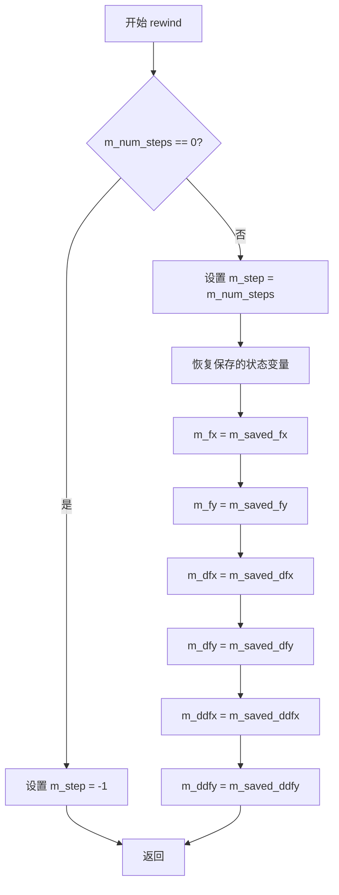

#### 带注释源码

```
//------------------------------------------------------------------------
// 重置迭代器到曲线起点
// 该方法将当前迭代状态恢复到初始状态，使得可以重新调用vertex()方法
// 遍历曲线的所有顶点
//------------------------------------------------------------------------
void curve4_inc::rewind(unsigned)
{
    // 如果没有曲线段（m_num_steps为0），设置步长为-1表示结束状态
    if(m_num_steps == 0)
    {
        m_step = -1;
        return;
    }
    
    // 重置步长到总步数，从头开始迭代
    m_step = m_num_steps;
    
    // 恢复保存的初始点坐标
    m_fx   = m_saved_fx;
    m_fy   = m_saved_fy;
    
    // 恢复保存的一阶导数（切向量）
    m_dfx  = m_saved_dfx;
    m_dfy  = m_saved_dfy;
    
    // 恢复保存的二阶导数（曲率变化率）
    m_ddfx = m_saved_ddfx;
    m_ddfy = m_saved_ddfy;
}
```


### `curve4_inc.vertex`

获取三次贝塞尔曲线的下一个顶点，采用增量方式计算曲线上的点。

参数：

- `x`：`double*`，指向用于输出曲线顶点 X 坐标的指针
- `y`：`double*`，指向用于输出曲线顶点 Y 坐标的指针

返回值：`unsigned`，返回路径命令类型（`path_cmd_move_to`、`path_cmd_line_to` 或 `path_cmd_stop`）

#### 流程图

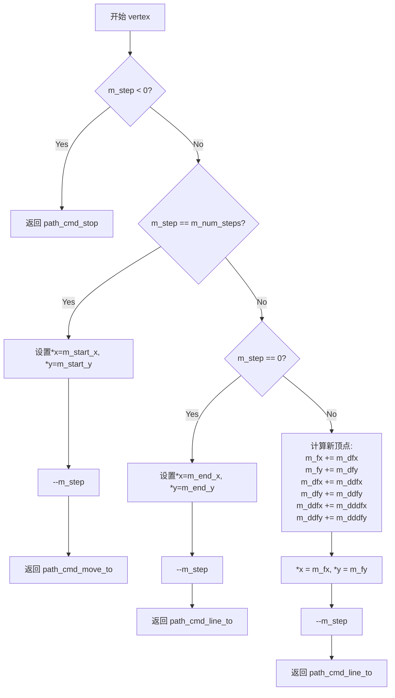

#### 带注释源码

```cpp
//------------------------------------------------------------------------
// 获取三次贝塞尔曲线的下一个顶点（增量计算方式）
//------------------------------------------------------------------------
unsigned curve4_inc::vertex(double* x, double* y)
{
    // 情况1：如果步数已经为负，说明曲线已经遍历完成
    if(m_step < 0) return path_cmd_stop;
    
    // 情况2：如果是第一步，返回曲线的起始点
    if(m_step == m_num_steps)
    {
        *x = m_start_x;
        *y = m_start_y;
        --m_step;
        return path_cmd_move_to;  // 第一个点需要 MoveTo 命令
    }

    // 情况3：如果是最后一步，返回曲线的终点
    if(m_step == 0)
    {
        *x = m_end_x;
        *y = m_end_y;
        --m_step;
        return path_cmd_line_to;
    }

    // 情况4：中间步骤，使用数值积分（Euler method）计算下一点
    // 基于曲线的参数方程:
    // P(t) = (1-t)³P1 + 3(1-t)²tP2 + 3(1-t)t²P3 + t³P4
    // 预先计算了各阶导数:
    // m_dfx  = 曲线的一阶导数（速度向量）
    // m_ddfx = 曲线的二阶导数（加速度向量）
    // m_dddfx = 曲线的三阶导数（加加速度，常数）
    m_fx   += m_dfx;      // 更新当前 x 坐标
    m_fy   += m_dfy;      // 更新当前 y 坐标
    m_dfx  += m_ddfx;     // 更新一阶导数
    m_dfy  += m_ddfy; 
    m_ddfx += m_dddfx;    // 更新二阶导数
    m_ddfy += m_dddfy; 

    *x = m_fx;            // 输出计算得到的顶点坐标
    *y = m_fy;
    --m_step;             // 步数递减
    return path_cmd_line_to;  // 后续点使用 LineTo 命令
}
```


### `curve4_div.init`

该方法用于初始化三次贝塞尔曲线的近似计算，清除现有的点集，根据近似比例计算距离容差的平方，然后调用 bezier 方法递归计算曲线的逼近顶点，并重置计数器以准备后续的顶点迭代。

参数：

- `x1`：`double`，曲线起点 X 坐标
- `y1`：`double`，曲线起点 Y 坐标
- `x2`：`double`，曲线第一个控制点 X 坐标
- `y2`：`double`，曲线第一个控制点 Y 坐标
- `x3`：`double`，曲线第二个控制点 X 坐标
- `y3`：`double`，曲线第二个控制点 Y 坐标
- `x4`：`double`，曲线终点 X 坐标
- `y4`：`double`，曲线终点 Y 坐标

返回值：`void`，无返回值

#### 流程图

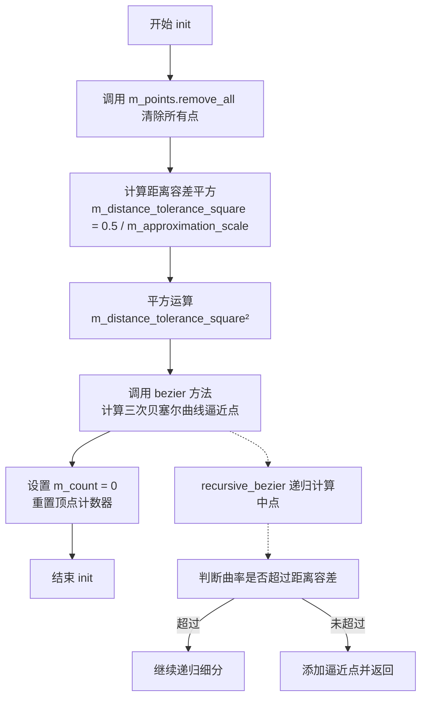

#### 带注释源码

```cpp
//------------------------------------------------------------------------
// 初始化三次贝塞尔曲线的近似计算
// 该方法接收四个控制点坐标，计算曲线的逼近多边形顶点
//------------------------------------------------------------------------
void curve4_div::init(double x1, double y1, 
                      double x2, double y2, 
                      double x3, double y3,
                      double x4, double y4)
{
    // 清除之前存储的所有曲线顶点
    m_points.remove_all();
    
    // 计算距离容差的平方
    // 距离容差决定了曲线逼近的精细程度，值越小逼近越精确
    m_distance_tolerance_square = 0.5 / m_approximation_scale;
    m_distance_tolerance_square *= m_distance_tolerance_square;
    
    // 调用 bezier 方法进行曲线逼近计算
    // 该方法内部会调用 recursive_bezier 递归细分曲线
    bezier(x1, y1, x2, y2, x3, y3, x4, y4);
    
    // 重置计数器，准备后续的 vertex 方法调用
    m_count = 0;
}
```


### `curve4_div::recursive_bezier`

该函数是四次贝塞尔曲线的递归分割核心算法，通过中点分割法将曲线递归地细分为更小的曲线段，直至满足距离容差、角度容差或尖角限制等终止条件，从而实现曲线的高精度逼近。

参数：

- `x1`：`double`，四次贝塞尔曲线的第一个控制点X坐标（起点）
- `y1`：`double`，四次贝塞尔曲线的第一个控制点Y坐标（起点）
- `x2`：`double`，四次贝塞尔曲线的第二个控制点X坐标
- `y2`：`double`，四次贝塞尔曲线的第二个控制点Y坐标
- `x3`：`double`，四次贝塞尔曲线的第三个控制点X坐标
- `y3`：`double`，四次贝塞尔曲线的第三个控制点Y坐标
- `x4`：`double`，四次贝塞尔曲线的第四个控制点X坐标（终点）
- `y4`：`double`，四次贝塞尔曲线的第四个控制点Y坐标（终点）
- `level`：`unsigned`，当前递归深度，用于防止无限递归

返回值：`void`，该函数无返回值，通过成员变量`m_points`（类型为`pod_array<point_d>`）存储逼近生成的点集

#### 流程图

```mermaid
flowchart TD
    A[开始 recursive_bezier] --> B{level > curve_recursion_limit?}
    B -->|Yes| C[直接返回]
    B -->|No| D[计算所有线段中点<br/>x12, y12, x23, y23, x34, y34<br/>x123, y123, x234, y234<br/>x1234, y1234]
    D --> E[计算辅助变量<br/>dx = x4-x1, dy = y4-y1<br/>d2, d3用于判断共线性]
    E --> F{判断d2和d3与curve_collinearity_epsilon的关系<br/>switch case处理}
    F --> G[Case 0: 所有点共线或p1==p4]
    F --> H[Case 1: p1,p2,p4共线，p3显著]
    F --> I[Case 2: p1,p3,p4共线，p2显著]
    F --> J[Case 3: 常规情况]
    
    G --> K{检查距离容差<br/>d2 > d3?}
    K -->|Yes| L{d2 < m_distance_tolerance_square?}
    K -->|No| M{d3 < m_distance_tolerance_square?}
    L -->|Yes| N[添加点x2,y2并返回]
    L -->|No| O[继续递归]
    M -->|Yes| P[添加点x3,y3并返回]
    M -->|No| O
    
    H --> Q{检查距离容差<br/>d3*d3 <= m_distance_tolerance_square*(dx*dx+dy*dy)?}
    Q -->|Yes| R{angle_tolerance检查}
    Q -->|No| O
    R -->|Yes| S[添加中点x23,y23并返回]
    R -->|No| T{角度条件检查}
    T -->|da1 < m_angle_tolerance| U[添加点x2,y2,x3,y3并返回]
    T -->|da1 > m_cusp_limit| V[添加点x3,y3并返回]
    T -->|No| O
    
    I --> W{检查距离容差<br/>d2*d2 <= m_distance_tolerance_square*(dx*dx+dy*dy)?}
    W -->|Yes| X{angle_tolerance检查}
    W -->|No| O
    X -->|Yes| Y[添加中点x23,y23并返回]
    X -->|No| Z{角度条件检查}
    Z -->|da1 < m_angle_tolerance| AA[添加点x2,y2,x3,y3并返回]
    Z -->|da1 > m_cusp_limit| AB[添加点x2,y2并返回]
    Z -->|No| O
    
    J --> AC{(d2+d3)*(d2+d3) <= m_distance_tolerance_square*(dx*dx+dy*dy)?}
    AC -->|Yes| AD{angle_tolerance检查}
    AC -->|No| O
    AD -->|Yes| AE[添加中点x23,y23并返回]
    AD -->|No| AF{da1+da2 < m_angle_tolerance?}
    AF -->|Yes| AG[添加中点x23,y23并返回]
    AF -->|No| AH{cusp_limit检查}
    AH -->|da1 > m_cusp_limit| AI[添加点x2,y2并返回]
    AH -->|da2 > m_cusp_limit| AJ[添加点x3,y3并返回]
    AH -->|No| O
    
    O --> AK[递归调用<br/>recursive_bezier<br/>x1,y1,x12,y12,x123,y123,x1234,y1234,level+1]
    O --> AL[递归调用<br/>recursive_bezier<br/>x1234,y1234,x234,y234,x34,y34,x4,y4,level+1]
    AK --> AM[结束]
    AL --> AM
    
    N --> AM
    P --> AM
    S --> AM
    U --> AM
    V --> AM
    Y --> AM
    AA --> AM
    AB --> AM
    AE --> AM
    AG --> AM
    AI --> AM
    AJ --> AM
```

#### 带注释源码

```cpp
//------------------------------------------------------------------------
// 递归分割四次贝塞尔曲线
// 参数: 
//   x1, y1 - 曲线起点控制点
//   x2, y2 - 曲线第一个中间控制点
//   x3, y3 - 曲线第二个中间控制点
//   x4, y4 - 曲线终点控制点
//   level  - 当前递归深度
//------------------------------------------------------------------------
void curve4_div::recursive_bezier(double x1, double y1, 
                                  double x2, double y2, 
                                  double x3, double y3, 
                                  double x4, double y4,
                                  unsigned level)
{
    // 递归深度保护，防止无限递归导致栈溢出
    if(level > curve_recursion_limit) 
    {
        return;
    }

    // 计算所有线段的中点坐标
    // 这是De Casteljau算法的基础，用于曲线分割
    //----------------------
    double x12   = (x1 + x2) / 2;   // P1-P2线段中点
    double y12   = (y1 + y2) / 2;
    double x23   = (x2 + x3) / 2;   // P2-P3线段中点
    double y23   = (y2 + y3) / 2;
    double x34   = (x3 + x4) / 2;   // P3-P4线段中点
    double y34   = (y3 + y4) / 2;
    double x123  = (x12 + x23) / 2; // 第一次细分后的点
    double y123  = (y12 + y23) / 2;
    double x234  = (x23 + x34) / 2; // 第一次细分后的点
    double y234  = (y23 + y34) / 2;
    double x1234 = (x123 + x234) / 2; // 曲线最终中点
    double y1234 = (y123 + y234) / 2;


    // 尝试用单条直线近似整个三次曲线
    //------------------
    double dx = x4 - x1;  // 曲线起点到终点的向量
    double dy = y4 - y1;

    // 计算控制点到起点-终点直线的距离（用于判断共线性）
    double d2 = fabs(((x2 - x4) * dy - (y2 - y4) * dx));
    double d3 = fabs(((x3 - x4) * dy - (y3 - y4) * dx));
    double da1, da2, k;

    // 根据d2和d3与epsilon的关系，分4种情况处理
    switch((int(d2 > curve_collinearity_epsilon) << 1) +
            int(d3 > curve_collinearity_epsilon))
    {
    case 0:
        // 所有点共线 OR p1==p4
        //----------------------
        k = dx*dx + dy*dy;  // 距离平方
        if(k == 0)
        {
            // 起点和终点重合，计算端点到中间点的距离
            d2 = calc_sq_distance(x1, y1, x2, y2);
            d3 = calc_sq_distance(x4, y4, x3, y3);
        }
        else
        {
            // 归一化参数，计算中间点在起点-终点连线上的投影位置
            k   = 1 / k;
            da1 = x2 - x1;
            da2 = y2 - y1;
            d2  = k * (da1*dx + da2*dy);  // p2的投影参数
            da1 = x3 - x1;
            da2 = y3 - y1;
            d3  = k * (da1*dx + da2*dy);  // p3的投影参数
            
            // 如果两个中间点都在起点和终点之间，曲线近似直线
            if(d2 > 0 && d2 < 1 && d3 > 0 && d3 < 1)
            {
                // 简单共线情况，1---2---3---4
                // 只需要保留两个端点
                return;
            }
            
            // 计算不在范围内的点到最近端点的距离
            if(d2 <= 0) d2 = calc_sq_distance(x2, y2, x1, y1);
            else if(d2 >= 1) d2 = calc_sq_distance(x2, y2, x4, y4);
            else             d2 = calc_sq_distance(x2, y2, x1 + d2*dx, y1 + d2*dy);

            if(d3 <= 0) d3 = calc_sq_distance(x3, y3, x1, y1);
            else if(d3 >= 1) d3 = calc_sq_distance(x3, y3, x4, y4);
            else             d3 = calc_sq_distance(x3, y3, x1 + d3*dx, y1 + d3*dy);
        }
        
        // 选择距离较大的点，检查是否满足距离容差
        if(d2 > d3)
        {
            if(d2 < m_distance_tolerance_square)
            {
                m_points.add(point_d(x2, y2));
                return;
            }
        }
        else
        {
            if(d3 < m_distance_tolerance_square)
            {
                m_points.add(point_d(x3, y3));
                return;
            }
        }
        break;

    case 1:
        // p1,p2,p4共线，p3显著（需要保留p3）
        //----------------------
        if(d3 * d3 <= m_distance_tolerance_square * (dx*dx + dy*dy))
        {
            // 角度容差检查：如果不需要角度控制，直接添加中点
            if(m_angle_tolerance < curve_angle_tolerance_epsilon)
            {
                m_points.add(point_d(x23, y23));
                return;
            }

            // 角度条件检查：计算相邻线段夹角
            //----------------------
            da1 = fabs(atan2(y4 - y3, x4 - x3) - atan2(y3 - y2, x3 - x2));
            if(da1 >= pi) da1 = 2*pi - da1;  // 规范化到[0, PI]

            if(da1 < m_angle_tolerance)
            {
                m_points.add(point_d(x2, y2));
                m_points.add(point_d(x3, y3));
                return;
            }

            // 尖角限制检查
            if(m_cusp_limit != 0.0)
            {
                if(da1 > m_cusp_limit)
                {
                    m_points.add(point_d(x3, y3));
                    return;
                }
            }
        }
        break;

    case 2:
        // p1,p3,p4共线，p2显著（需要保留p2）
        //----------------------
        if(d2 * d2 <= m_distance_tolerance_square * (dx*dx + dy*dy))
        {
            if(m_angle_tolerance < curve_angle_tolerance_epsilon)
            {
                m_points.add(point_d(x23, y23));
                return;
            }

            // 角度条件检查
            //----------------------
            da1 = fabs(atan2(y3 - y2, x3 - x2) - atan2(y2 - y1, x2 - x1));
            if(da1 >= pi) da1 = 2*pi - da1;

            if(da1 < m_angle_tolerance)
            {
                m_points.add(point_d(x2, y2));
                m_points.add(point_d(x3, y3));
                return;
            }

            if(m_cusp_limit != 0.0)
            {
                if(da1 > m_cusp_limit)
                {
                    m_points.add(point_d(x2, y2));
                    return;
                }
            }
        }
        break;

    case 3: 
        // 常规情况 - 所有控制点都不共线
        //-----------------
        if((d2 + d3)*(d2 + d3) <= m_distance_tolerance_square * (dx*dx + dy*dy))
        {
            // 曲率不超过距离容差值，可以结束细分
            //----------------------
            if(m_angle_tolerance < curve_angle_tolerance_epsilon)
            {
                m_points.add(point_d(x23, y23));
                return;
            }

            // 角度和尖角条件检查
            //----------------------
            k   = atan2(y3 - y2, x3 - x2);  // 曲线中间切线方向
            da1 = fabs(k - atan2(y2 - y1, x2 - x1));  // 前段夹角
            da2 = fabs(atan2(y4 - y3, x4 - x3) - k);  // 后段夹角
            if(da1 >= pi) da1 = 2*pi - da1;
            if(da2 >= pi) da2 = 2*pi - da2;

            // 总角度小于容差，可以停止递归
            if(da1 + da2 < m_angle_tolerance)
            {
                // 最终可以停止递归
                //----------------------
                m_points.add(point_d(x23, y23));
                return;
            }

            // 尖角限制检查
            if(m_cusp_limit != 0.0)
            {
                if(da1 > m_cusp_limit)
                {
                    m_points.add(point_d(x2, y2));
                    return;
                }

                if(da2 > m_cusp_limit)
                {
                    m_points.add(point_d(x3, y3));
                    return;
                }
            }
        }
        break;
    }

    // 继续递归细分
    // 将曲线分为两段继续处理
    //----------------------
    // 递归处理前半段: 起点 -> 第一个1/4点 -> 中点 -> 曲线1/4点
    recursive_bezier(x1, y1, x12, y12, x123, y123, x1234, y1234, level + 1); 
    // 递归处理后半段: 曲线1/4点 -> 3/4点 -> 终点
    recursive_bezier(x1234, y1234, x234, y234, x34, y34, x4, y4, level + 1); 
}
```

### 关键组件信息

| 组件名称 | 描述 |
|---------|------|
| `curve4_div` | 四次贝塞尔曲线逼近器类，使用自适应细分算法进行曲线逼近 |
| `m_points` | 存储逼近结果的点集（类型为`pod_array<point_d>`） |
| `m_distance_tolerance_square` | 距离容差的平方，用于判断曲线是否足够平直 |
| `m_angle_tolerance` | 角度容差，用于判断是否需要继续细分 |
| `m_cusp_limit` | 尖角限制阈值，用于检测曲线尖角 |
| `curve_recursion_limit` | 递归深度限制（值为32），防止栈溢出 |
| `curve_collinearity_epsilon` | 共线性判断epsilon值（1e-30） |

### 潜在的技术债务或优化空间

1. **硬编码的Magic Numbers**：代码中存在多个硬编码的阈值和限制值（如`0.5`、`32`、`1e-30`、`0.01`），建议提取为可配置的成员变量或常量。

2. **递归实现导致的栈溢出风险**：虽然有递归深度限制，但在极端情况下（非常大的曲线或非常小的容差）仍可能达到32层递归深度，考虑改用迭代版本或增加深度限制的可配置性。

3. **重复代码模式**：角度计算和尖角检查逻辑在多个case分支中重复出现，可提取为私有成员函数以提高代码复用性。

4. **浮点数精度问题**：使用`fabs`和`atan2`进行几何计算，在某些极端情况下可能存在精度问题，可考虑使用更高精度的数值计算方法。

5. **switch-case分支优化**：当前的位运算组合判断方式虽然高效，但可读性较差，可考虑添加更明确的注释或重构为更清晰的逻辑。

6. **缺少C++特性利用**：作为现代C++代码，可考虑使用`constexpr`、` noexcept`等特性优化性能和异常安全。

### 其它项目

#### 设计目标与约束

- **设计目标**：通过自适应细分算法，在保证曲线形状精度的前提下，用尽可能少的线段逼近四次贝塞尔曲线，实现高效的曲线渲染。
- **性能约束**：递归深度限制为32层，平衡计算精度与性能；距离容差默认值为0.5/approximation_scale的平方。
- **精度约束**：使用`double`类型保证足够的数值精度；共线性判断使用极小epsilon值（1e-30）避免误判。

#### 错误处理与异常设计

- **递归深度超限**：当递归深度超过`curve_recursion_limit`（32）时直接返回，防止栈溢出。
- **共线情况处理**：当所有控制点共线时，通过投影参数判断是否需要保留中间控制点。
- **数值稳定性**：使用`fabs`和`atan2`的组合处理角度计算，避免除零和浮点异常。

#### 数据流与状态机

- **数据输入**：通过`curve4_div::init()`调用`bezier()`方法，传入四个控制点坐标初始化逼近过程。
- **状态转移**：函数内部使用switch-case实现状态机，根据控制点的共线性关系（d2、d3与epsilon的比较）分4种情况处理。
- **数据输出**：通过成员变量`m_points`（`pod_array<point_d>`类型）累积存储逼近生成的顶点序列，供外部调用者获取。

#### 外部依赖与接口契约

- **依赖库**：使用`<math.h>`提供数学函数（`sqrt`、`fabs`、`atan2`）；依赖`agg_curves.h`和`agg_math.h`提供基础类型和工具函数。
- **关键依赖**：
  - `point_d`：点数据类型
  - `pod_array<point_d>`：动态点数组容器
  - `calc_sq_distance()`：计算两点间距离平方的辅助函数
  - `uround()`：四舍五入到整数的辅助函数
- **接口契约**：该函数为`curve4_div`类的私有成员（代码中无`public:`标记），通过`bezier()`公有方法间接调用；调用前需确保`init()`已正确初始化`m_distance_tolerance_square`等成员变量。


### `curve4_div::bezier`

该函数是四次贝塞尔曲线（Cubic Bezier Curve）的近似主函数，通过调用递归分割算法（recursive_bezier）将曲线离散化为多个近似点，并将其添加到点集合（m_points）中，以供后续渲染使用。

参数：

- `x1`：`double`，曲线起始点的 X 坐标
- `y1`：`double`，曲线起始点的 Y 坐标
- `x2`：`double`，曲线第一个控制点的 X 坐标
- `y2`：`double`，曲线第一个控制点的 Y 坐标
- `x3`：`double`，曲线第二个控制点的 X 坐标
- `y3`：`double`，曲线第二个控制点的 Y 坐标
- `x4`：`double`，曲线结束点的 X 坐标
- `y4`：`double`，曲线结束点的 Y 坐标

返回值：`void`，无直接返回值，结果通过成员变量 `m_points` 存储

#### 流程图

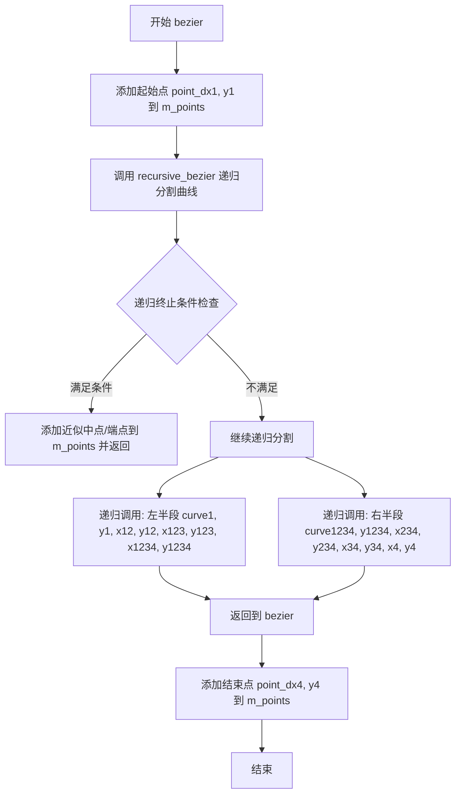

#### 带注释源码

```cpp
//------------------------------------------------------------------------
// 四次贝塞尔曲线近似主函数
// 该函数是入口函数，调用递归分割算法将曲线离散化
//------------------------------------------------------------------------
void curve4_div::bezier(double x1, double y1, 
                        double x2, double y2, 
                        double x3, double y3, 
                        double x4, double y4)
{
    // 首先添加曲线的起始点
    m_points.add(point_d(x1, y1));
    
    // 调用递归贝塞尔函数进行曲线分割
    // 递归算法会根据距离容差和角度容差决定是否继续分割
    recursive_bezier(x1, y1, x2, y2, x3, y3, x4, y4, 0);
    
    // 最后添加曲线的结束点
    m_points.add(point_d(x4, y4));
}
```


### `curve4_div::rewind(unsigned)`

经过分析代码，发现 `curve4_div` 类（曲线细分器）并未实现 `rewind` 方法。该类使用分割算法预计算所有曲线点，通过 `m_count` 访问预计算的点集，而不是像增量迭代器那样需要重置。

但根据代码模式，`curve4_inc` 类（增量曲线迭代器）实现了 `rewind` 方法，其逻辑与您要查找的功能类似。以下是 `curve4_inc::rewind` 的详细信息：

参数：

-  `idx`：`unsigned`，参数标识符（未使用，仅为API一致性）

返回值：`void`，无返回值

#### 流程图

```mermaid
flowchart TD
    A[开始 rewind] --> B{m_num_steps == 0?}
    B -->|是| C[m_step = -1]
    B -->|否| D[m_step = m_num_steps]
    D --> E[m_fx = m_saved_fx]
    E --> F[m_fy = m_saved_fy]
    F --> G[m_dfx = m_saved_dfx]
    G --> H[m_dfy = m_saved_dfy]
    H --> I[m_ddfx = m_saved_ddfx]
    I --> J[m_ddfy = m_saved_ddfy]
    C --> K[结束]
    J --> K
```

#### 带注释源码

```cpp
//------------------------------------------------------------------------
// 重置四次贝塞尔曲线迭代器，准备重新遍历曲线点
//------------------------------------------------------------------------
void curve4_inc::rewind(unsigned)
{
    // 如果没有生成任何步骤（曲线退化为点）
    if(m_num_steps == 0)
    {
        // 设置为无效步骤
        m_step = -1;
        return;
    }
    
    // 重置步骤计数器到最大步数
    m_step = m_num_steps;
    
    // 恢复初始位置（曲线起点）
    m_fx   = m_saved_fx;
    m_fy   = m_saved_fy;
    
    // 恢复一阶导数（切向）
    m_dfx  = m_saved_dfx;
    m_dfy  = m_saved_dfy;
    
    // 恢复二阶导数（曲率变化率）
    m_ddfx = m_saved_ddfx;
    m_ddfy = m_saved_ddfy;
}
```

#### 备注

`curve4_div` 类没有 `rewind` 方法的原因：
- 它采用分割（subdivision）策略，在 `init()` 时就递归计算并存储所有近似点
- 遍历时使用 `m_count` 索引访问预计算的 `m_points` 数组
- 若需重置遍历，只需将 `m_count = 0` 即可

`curve4_inc` 采用增量计算策略，每次调用 `vertex()` 时根据导数递推计算下一个点，因此需要 `rewind` 方法来保存和恢复状态。


### curve4_div.vertex

该函数是曲线4次贝塞尔曲线（cubic Bezier）近似算法中的核心方法，用于通过递归分割策略生成曲线顶点。它从预计算的曲线点序列中逐个获取顶点坐标，并根据当前步骤返回相应的路径命令（move_to或line_to），是曲线渲染流程中的关键输出接口。

参数：

-  `x`：`double*`，指向用于存储返回顶点X坐标的double型指针
-  `y`：`double*`，指向用于存储返回顶点Y坐标的double型指针

返回值：`unsigned`，返回路径命令类型，可能为 `path_cmd_stop`（停止）、`path_cmd_move_to`（移动到）或 `path_cmd_line_to`（画线到）

#### 流程图

```mermaid
flowchart TD
    A[开始 vertex] --> B{m_step < 0?}
    B -->|Yes| C[返回 path_cmd_stop]
    B -->|No| D{m_step == m_num_steps?}
    D -->|Yes| E[设置*x=m_start_x, *y=m_start_y]
    E --> F[step减1]
    F --> G[返回 path_cmd_move_to]
    D -->|No| H{m_step == 0?}
    H -->|Yes| I[设置*x=m_end_x, *y=m_end_y]
    I --> J[step减1]
    J --> K[返回 path_cmd_line_to]
    H -->|No| L[更新曲线坐标:<br/>fx+=dfx, fy+=dfy<br/>dfx+=ddfx, dfy+=ddfy<br/>ddfx+=dddfx, ddfy+=dddfy]
    L --> M[设置*x=fx, *y=fy]
    M --> N[step减1]
    N --> O[返回 path_cmd_line_to]
```

#### 带注释源码

```
unsigned curve4_div::vertex(double* x, double* y)
{
    // 步骤已结束，返回停止命令
    if(m_step < 0) return path_cmd_stop;
    
    // 首次调用，返回曲线起点
    if(m_step == m_num_steps)
    {
        *x = m_start_x;
        *y = m_start_y;
        --m_step;
        return path_cmd_move_to;
    }

    // 最后一步，返回曲线终点
    if(m_step == 0)
    {
        *x = m_end_x;
        *y = m_end_y;
        --m_step;
        return path_cmd_line_to;
    }

    // 使用有限差分法计算中间点（De Casteljau算法的替代实现）
    // 更新当前点位置：一阶导数累加到位置
    m_fx   += m_dfx;
    m_fy   += m_dfy;
    // 二阶导数累加到一阶导数
    m_dfx  += m_ddfx; 
    m_dfy  += m_ddfy; 
    // 三阶导数累加到二阶导数
    m_ddfx += m_dddfx; 
    m_ddfy += m_dddfy; 

    // 返回当前计算得到的顶点坐标
    *x = m_fx;
    *y = m_fy;
    --m_step;
    return path_cmd_line_to;
}
```

## 关键组件


### curve3_inc 类

二次贝塞尔曲线的增量逼近实现，通过固定步数细分曲线，适合实时渲染场景

### curve3_div 类

二次贝塞尔曲线的递归细分逼近实现，根据距离和角度容忍度动态决定细分深度，生成更优的曲线点分布

### curve4_inc 类

三次贝塞尔曲线的增量逼近实现，使用四次差分计算曲线点，支持更高精度的曲线生成

### curve4_div 类

三次贝塞尔曲线的递归细分逼近实现，支持多种曲线特征检测（共线性、角度、尖角），生成高质量的曲线逼近

### 全局常量

curve_distance_epsilon、curve_collinearity_epsilon、curve_angle_tolerance_epsilon 用于控制曲线逼近精度，curve_recursion_limit 限制递归深度防止无限循环

## 问题及建议


### 已知问题

-   **魔法数字（Magic Numbers）**：代码中存在大量未具名常量，如 `0.25`、`4`、`0.5`、`2.0`、`3.0`、`6.0`、`32` 等，缺乏注释说明其含义和来源，降低了代码可读性和可维护性。
-   **Epsilon 值设置不合理**：`curve_distance_epsilon` 和 `curve_collinearity_epsilon` 均设为 `1e-30`，对于双精度浮点数（有效精度约 1e-15）来说过于极端，可能导致不必要的计算开销或数值不稳定。
-   **递归深度限制硬编码**：`curve_recursion_limit` 固定为 32，对于复杂曲线可能不足，且无动态调整机制。
-   **缺乏输入验证**：未对 `init()` 方法输入的坐标进行 NaN、Inf 或非法值检查，可能导致后续计算出现未定义行为。
-   **旧版 MSVC 兼容代码残留**：存在 `#if defined(_MSC_VER) && _MSC_VER <= 1200` 条件编译块，支持 Visual C++ 6.0（1998 年），属于过时技术债务。
-   **潜在除零风险**：`curve4_div::recursive_bezier()` 中当 `k = dx*dx + dy*dy` 为零时，后续 `k = 1 / k` 操作虽在 `if(k == 0)` 分支后执行，但逻辑分支复杂，存在隐患。
- **类型安全问题**：使用 C 风格类型转换（如 `int(d2 > curve_collinearity_epsilon)`），缺乏类型安全性和可读性。
-   **无符号整数与有符号整数混用**：`level` 参数为 `unsigned` 类型，但与 `curve_recursion_limit`（枚举类型）比较时可能产生类型转换问题。

### 优化建议

-   **提取常量至配置类**：将魔法数字封装为可配置的常量或配置结构体，提供默认值和 setter 方法，便于调优。
-   **调整 Epsilon 值**：根据实际应用场景，将 epsilon 值调整为合理范围（如 `1e-10` 到 `1e-12`），在精度和性能间取得平衡。
-   **移除过时兼容代码**：删除 `#if defined(_MSC_VER) && _MSC_VER <= 1200` 相关代码块，简化维护负担。
-   **添加输入验证**：在 `init()` 方法中添加参数校验，确保输入坐标有效，拒绝 NaN/Inf 值。
-   **改进递归策略**：将递归深度限制改为可配置参数，或采用自适应策略（如基于误差估计动态调整）。
-   **使用 C++ 类型转换**：将 C 风格转换替换为 `static_cast`、`dynamic_cast` 等 C++ 转换，提升类型安全。
-   **补充 const 修饰符**：对只读访问器方法（如 `approximation_scale()`）确保 const 正确性，提升 API 可用性。
-   **优化角度计算**：可考虑使用向量点积替代 `atan2` 进行角度比较，减少三角函数调用开销。

## 其它


### 设计目标与约束

本模块的设计目标是提供高效、精确的贝塞尔曲线逼近功能，支持三次（Cubic）和四次（Quartic）贝塞尔曲线的两种逼近策略。约束条件包括：使用double类型保证数值精度；曲线递归分割深度限制为32层以防止栈溢出；距离容差和角度容差用于控制逼近精度；最小步数限制为4步以保证曲线的基本形态。

### 错误处理与异常设计

代码未使用C++异常机制，而是采用返回值和条件判断处理错误情况。主要错误处理包括：当曲线步数小于4时强制设为4防止过拟合；递归深度超过curve_recursion_limit时直接返回避免无限递归；对于共线性和退化为直线的曲线情况进行特殊处理；数值计算中使用fabs处理角度归一化问题（当角度差大于π时用2π减去）。所有边界情况通过返回path_cmd_stop命令终止曲线迭代。

### 数据流与状态机

增量法（curve3_inc/curve4_inc）采用状态机模式：初始化状态由init()设置参数，rewind()重置迭代器到起点，vertex()每次调用按迭代公式计算下一点并返回对应命令。分割法（curve3_div/curve4_div）采用递归分割模式：init()触发递归分割计算所有顶点并存入m_points容器，vertex()从容器中顺序读取顶点。状态转换通过m_step变量控制，包括初始(step=num_steps)、执行中(step>0且<num_steps)、最后一点(step=0)、结束(step<0)四种状态。

### 外部依赖与接口契约

核心依赖包括：math.h提供sqrt、fabs、atan2数学函数；agg_curves.h定义point_d类型和曲线常数；agg_math.h提供uround、calc_sq_distance、pi等工具函数。接口契约方面：init()接收曲线控制点坐标；rewind(unsigned)接收路径标识参数但未使用；vertex(double*, double*)输出顶点坐标并返回路径命令（path_cmd_move_to/path_cmd_line_to/path_cmd_stop）；approximation_scale()用于设置/获取逼近比例因子。返回的路径命令遵循AGG路径协议，调用方需按顺序处理这些命令构建完整路径。

### 数值稳定性考虑

代码处理了多种数值稳定性问题：使用curve_distance_epsilon（1e-30）和curve_collinearity_epsilon（1e-30）避免除零；角度容差使用curve_angle_tolerance_epsilon（0.01）作为判断阈值；对共线情况使用距离平方比较避免开方运算；对于退化情况（所有控制点重合或三点共线）有专门处理逻辑。MSVC 6.0编译器存在ICE（内部编译器错误）问题，代码通过MSC60_fix_ICE包装器进行特殊处理。

### 并发性与线程安全

本模块为纯计算函数，不涉及多线程共享状态。所有成员变量均为类内部状态，vertex()方法的调用顺序依赖性决定了其非线程安全（需要顺序调用rewind->vertex->vertex...）。如需多线程使用曲线逼近，应为每个线程创建独立的曲线对象实例。

### 配置与扩展性

曲线逼近行为可通过以下参数配置：approximation_scale控制增量法的步数计算；m_distance_tolerance_square控制分割法的距离容差；m_angle_tolerance控制角度容差；m_cusp_limit控制尖角限制。扩展新的曲线类型需要实现init()、rewind()、vertex()三个核心接口，并遵循path_cmd返回值约定。

### 内存管理

m_points使用聚合容器存储分割法生成的顶点，init()时调用remove_all()清空容器。增量法不存储中间点，仅保存必要的状态变量（saved_fx/dfx/ddfx等），内存占用更小。递归分割过程中点对象通过point_d栈上构造后加入容器，无额外的堆内存分配压力。

### 平台相关特性

代码包含平台特定处理：_MSC_VER <= 1200条件下使用MSC60_fix_ICE包装器解决MSVC 6.0编译器问题；使用uround()函数进行平台无关的浮点数到整数转换；所有数值计算使用标准C math库函数保证跨平台兼容性。


    