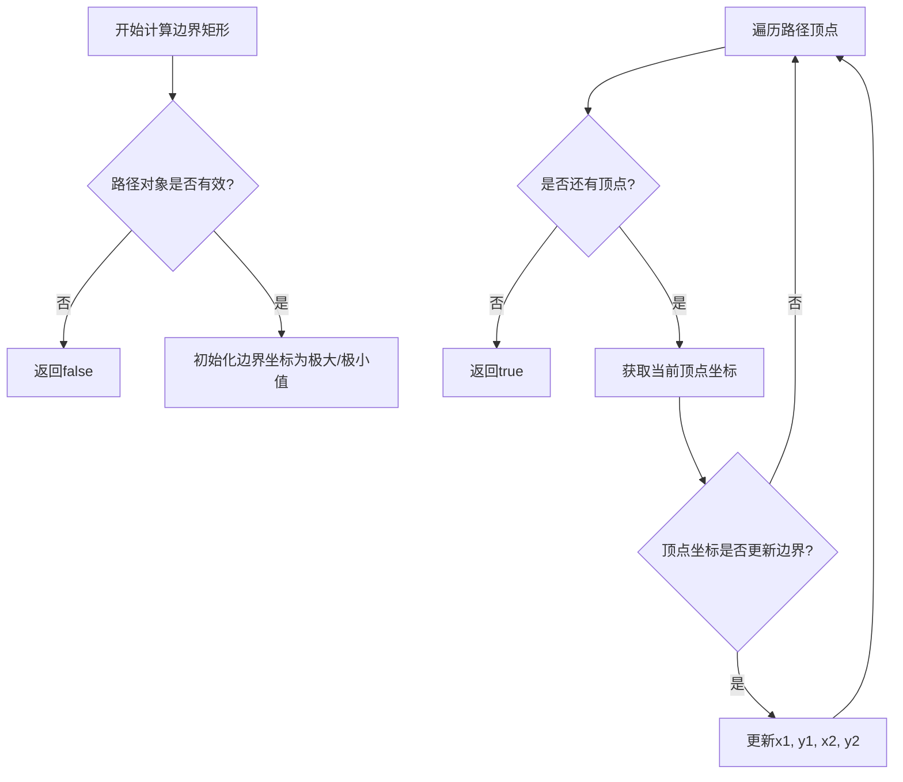
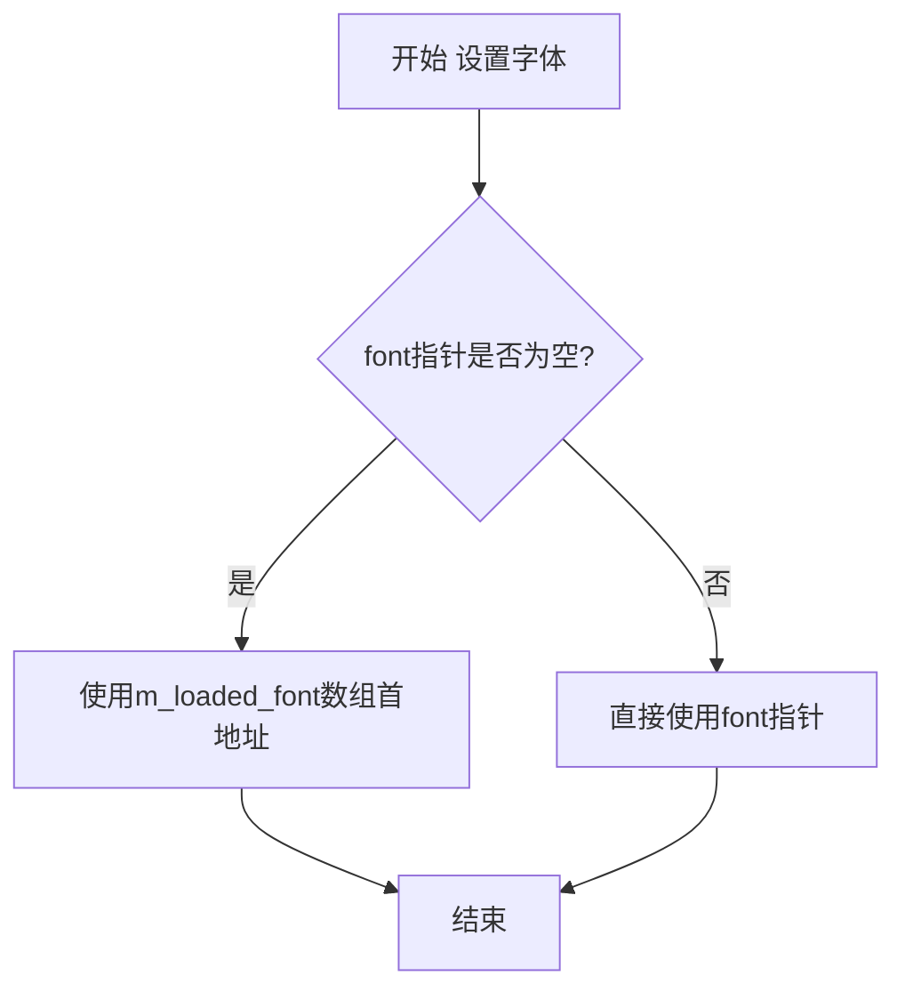
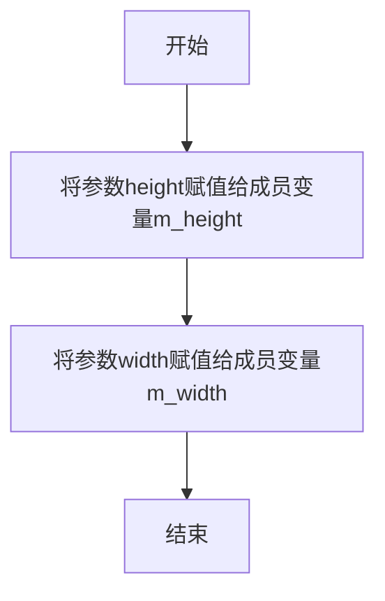
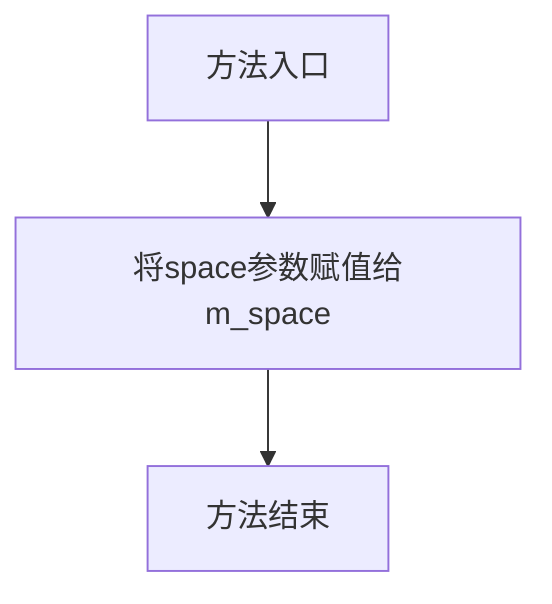
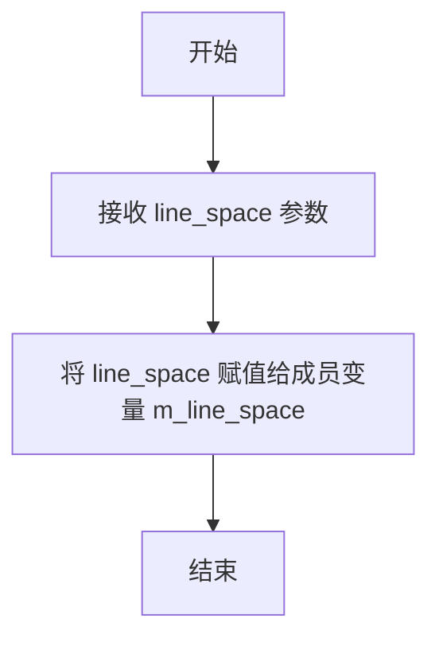
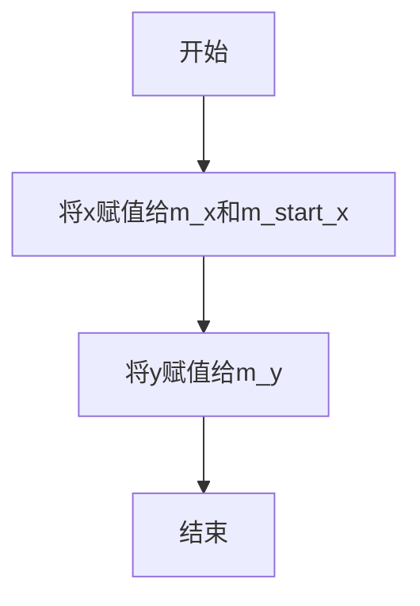
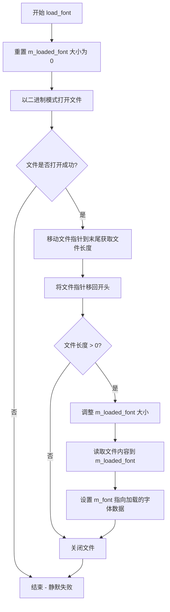
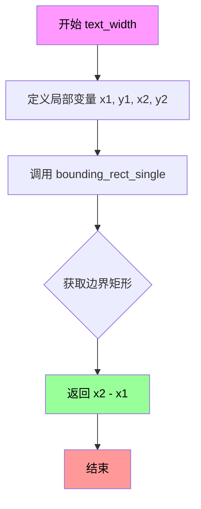

```mermaid
flowchart TD
    A[开始 vertex] --> B{quit 为真?}
    B -->|是| E[返回 path_cmd_stop]
    B -->|否| C{根据 m_status 分支}
    
    C -->|initial| D[检查字体是否存在]
    D -->|否| B
    D -->|是| F[设置状态为 next_char]
    F --> C
    
    C -->|next_char| G{当前字符为结束符?}
    G -->|是| B
    G -->|否| H[获取字符索引]
    H --> I{字符是换行符?}
    I -->|是| J[重置 X, 更新 Y 为下一行]
    J --> C
    I -->|否| K[计算字形索引]
    K --> L[获取字形边界]
    L --> M[设置状态为 start_glyph]
    M --> C
    
    C -->|start_glyph| N[设置当前坐标到输出参数]
    N --> O[设置状态为 glyph]
    O --> P[返回 path_cmd_move_to]
    
    C -->|glyph| Q{字形数据处理完毕?}
    Q -->|是| R[更新状态为 next_char, X 加上空格宽度]
    R --> C
    Q -->|否| S[读取字形数据 dx, dy]
    S --> T[计算新坐标]
    T --> U{是换行点?}
    U -->|是| V[返回 path_cmd_move_to]
    U -->|否| W[返回 path_cmd_line_to]
```

# `matplotlib\extern\agg24-svn\src\agg_gsv_text.cpp` 详细设计文档

Anti-Grain Geometry库中的gsv_text类实现，用于渲染文本。该类作为路径生成器，提供文本到矢量路径的转换功能，支持内置默认字体和外部字体文件加载，可配置字体大小、字符间距、行间距，并生成对应的move_to、line_to等路径命令。

## 整体流程

```mermaid
graph TD
    A[开始] --> B[设置字体: font() 或 load_font()]
    B --> C[设置尺寸: size()]
    C --> D[设置文本: text()]
    D --> E[设置起始点: start_point()]
    E --> F[初始化解析器: rewind()]
    F --> G{还有更多顶点?}
    G -- 是 --> H[调用 vertex() 获取顶点]
    H --> G
    G -- 否 --> I[结束]
    H --> J[计算文本宽度: text_width()]
    J --> I
```

## 类结构

```
agg (命名空间)
└── gsv_text (文本渲染类)
    ├── 构造函数: gsv_text()
    ├── 设置方法: font(), size(), space(), line_space(), start_point(), load_font(), text()
    ├── 解析方法: rewind(), vertex()
    └── 工具方法: text_width()
```

## 全局变量及字段


### `gsv_default_font`
    
内置默认字体数据数组

类型：`int8u[]`
    


### `gsv_text.m_x`
    
当前X坐标

类型：`double`
    


### `gsv_text.m_y`
    
当前Y坐标

类型：`double`
    


### `gsv_text.m_start_x`
    
起始X坐标

类型：`double`
    


### `gsv_text.m_width`
    
字体宽度

类型：`double`
    


### `gsv_text.m_height`
    
字体高度

类型：`double`
    


### `gsv_text.m_space`
    
字符间距

类型：`double`
    


### `gsv_text.m_line_space`
    
行间距

类型：`double`
    


### `gsv_text.m_text`
    
当前文本指针

类型：`const char*`
    


### `gsv_text.m_chr`
    
单字符缓冲区

类型：`char[2]`
    


### `gsv_text.m_text_buf`
    
文本缓冲区

类型：`std::vector<char>`
    


### `gsv_text.m_cur_chr`
    
当前处理的字符指针

类型：`const char*`
    


### `gsv_text.m_font`
    
字体数据指针

类型：`const void*`
    


### `gsv_text.m_loaded_font`
    
加载的字体数据

类型：`std::vector<int8u>`
    


### `gsv_text.m_status`
    
解析状态机

类型：`枚举`
    


### `gsv_text.m_big_endian`
    
字节序标志

类型：`bool`
    


### `gsv_text.m_flip`
    
翻转标志

类型：`bool`
    


### `gsv_text.m_indices`
    
字体索引表指针

类型：`int8u*`
    


### `gsv_text.m_glyphs`
    
字形数据指针

类型：`int8*`
    


### `gsv_text.m_bglyph`
    
当前字形起始指针

类型：`int8*`
    


### `gsv_text.m_eglyph`
    
当前字形结束指针

类型：`int8*`
    


### `gsv_text.m_h`
    
垂直缩放因子

类型：`double`
    


### `gsv_text.m_w`
    
水平缩放因子

类型：`double`
    
    

## 全局函数及方法


### `value`

该全局函数用于从字体数据中提取数值。它从指定的内存位置读取两个字节（16位）的数据，并根据大端或小端序将其转换为双精度浮点数返回。

参数：

- `p`：`int8u*`，指向字体数据内存位置的指针

返回值：`double`，从字体数据中提取的数值

#### 流程图

```mermaid
flowchart TD
    A[开始 value 函数] --> B{检查大端序标识 m_big_endian}
    B -->|大端序| C[读取高字节 p[0] << 8]
    B -->|小端序| D[读取低字节 p[0]]
    C --> E[加上低字节 p[1]]
    D --> F[加上高字节 p[1] << 8]
    E --> G[转换为 double 并返回]
    F --> G
```

#### 带注释源码

```
// 注意：此函数声明在头文件中，未在此cpp中实现
// 从代码中的调用方式可以推断其实现逻辑：
// value 函数从内存中读取2字节数据并转换为double
// 
// 根据调用示例：
// double base_height = value(m_indices + 4);
// m_indices += value(m_indices);
// m_bglyph = m_glyphs + value(m_indices + idx);
// m_eglyph = m_glyphs + value(m_indices + idx + 2);
// 
// 推断的实现逻辑（参考agg库风格）：
/*
double value(const int8u* p)
{
    // 如果是大端序机器
    if(m_big_endian)
    {
        // 高字节在前，低字节在后
        return double((p[0] << 8) | p[1]);
    }
    else
    {
        // 低字节在前，高字节在后
        return double((p[1] << 8) | p[0]);
    }
}
*/
```


### `bounding_rect_single`

该函数是一个全局函数（声明在 `agg_bounding_rect.h` 中），用于计算给定路径或对象的边界矩形。在代码中，`text_width()` 方法通过调用此函数来获取文本的宽度。

参数：

- `path`：`const PodBezier&` 或类似的路径类型，指向要计算边界矩形的路径对象
- `idx`：`unsigned`，路径索引或顶点索引
- `x1`：`double*`，指向最小 X 坐标的指针
- `y1`：`double*`，指向最小 Y 坐标的指针
- `x2`：`double*`，指向最大 X 坐标的指针
- `y2`：`double*`，指向最大 Y 坐标的指针

返回值：`bool`，表示是否成功计算了边界矩形

#### 流程图



#### 带注释源码

```cpp
// 从 text_width() 方法中的调用推断出的函数签名
// 实际定义在 agg_bounding_rect.h 中
bool bounding_rect_single(const gsv_text& path, 
                         unsigned idx, 
                         double* x1, 
                         double* y1, 
                         double* x2, 
                         double* y2)
{
    // 初始化边界值
    *x1 =  1e100;  // 设置一个很大的初始值作为最小值
    *y1 =  1e100;
    *x2 = -1e100;  // 设置一个很小的初始值作为最大值
    *y2 = -1e100;
    
    // 获取路径的顶点访问器
    double x, y;
    unsigned cmd = path.vertex(&x, &y);
    
    // 遍历所有顶点
    while(!is_stop(cmd))
    {
        // 只处理实际绘制命令（move_to, line_to 等）
        if(is_drawing(cmd))
        {
            // 更新边界矩形
            if(x < *x1) *x1 = x;
            if(y < *y1) *y1 = y;
            if(x > *x2) *x2 = x;
            if(y > *y2) *y2 = y;
        }
        cmd = path.vertex(&x, &y);
    }
    
    // 检查是否有效（至少有一个顶点）
    return *x2 >= *x1 && *y2 >= *y1;
}
```


### `gsv_text::gsv_text()`

构造函数，初始化 gsv_text 类的所有成员变量，设置默认字体为内置的 gsv_default_font，并检测系统字节序（大小端）。

参数：
- （无显式参数，包含隐含的 `this` 指针）

返回值：无返回值（构造函数）

#### 流程图

```mermaid
flowchart TD
    A[开始构造] --> B[初始化数值成员变量]
    B --> C[m_x = 0.0, m_y = 0.0, m_start_x = 0.0]
    B --> D[m_width = 10.0, m_height = 0.0]
    B --> E[m_space = 0.0, m_line_space = 0.0]
    C --> F[初始化指针/容器成员]
    F --> G[m_text = m_chr, m_cur_chr = m_chr]
    F --> H[m_font = gsv_default_font]
    F --> I[m_status = initial]
    F --> J[m_big_endian = false, m_flip = false]
    G --> K[设置字符数组]
    K --> L[m_chr[0] = m_chr[1] = 0]
    L --> M[检测字节序]
    M --> N{检测大端序}
    N -->|是| O[m_big_endian = true]
    N -->|否| P[保持 false]
    O --> Q[构造完成]
    P --> Q
```

#### 带注释源码

```cpp
//-------------------------------------------------------------------------
// 构造函数：初始化 gsv_text 对象的所有成员变量
//-------------------------------------------------------------------------
gsv_text::gsv_text() :
    // 初始化坐标相关成员
    m_x(0.0),           // 当前X坐标，初始为0
    m_y(0.0),           // 当前Y坐标，初始为0
    m_start_x(0.0),     // 文本起始X坐标，初始为0
    
    // 尺寸相关成员
    m_width(10.0),      // 文本宽度，默认为10.0
    m_height(0.0),      // 文本高度，初始为0
    
    // 间距相关成员
    m_space(0.0),       // 字符间距，初始为0
    m_line_space(0.0), // 行间距，初始为0
    
    // 文本缓冲相关成员
    m_text(m_chr),      // 当前文本指针，指向内部字符数组
    m_text_buf(),       // 文本缓冲区，用于存储动态文本
    m_cur_chr(m_chr),   // 当前字符指针，初始指向内部字符数组
    
    // 字体相关成员
    m_font(gsv_default_font), // 默认字体，指向内置字体数据
    m_loaded_font(),         // 外部加载的字体缓冲区
    
    // 状态相关成员
    m_status(initial),  // 解析状态，初始为 initial 状态
    m_big_endian(false),// 字节序标记，false 表示小端序
    m_flip(false)       // 翻转标记，false 表示不翻转
{
    // 设置终止字符
    m_chr[0] = m_chr[1] = 0;
    
    // 检测系统字节序：通过将整数1的字节序来判断
    // 如果最低地址存放的是0（即1的低字节），则为小端序
    // 如果最低地址存放的是0（即1的高字节），则为大端序
    int t = 1;
    if(*(char*)&t == 0) 
        m_big_endian = true;  // 系统为大端序
}
```


### `gsv_text.font`

设置字体数据指针，将传入的字体数据地址赋值给成员变量，并在指针为空时使用默认加载的字体数组。

参数：

- `font`：`const void*`，要设置的字体数据指针

返回值：`void`，无返回值

#### 流程图



#### 带注释源码

```cpp
//-------------------------------------------------------------------------
// 函数：gsv_text::font
// 功能：设置字体数据指针
// 参数：
//   font - const void*类型的字体数据指针
// 返回值：无
//-------------------------------------------------------------------------
void gsv_text::font(const void* font)
{
    // 将传入的字体指针赋值给成员变量m_font
    m_font = font;
    
    // 如果传入的指针为空（NULL），则使用预加载的字体数据
    // m_loaded_font是一个动态数组，在load_font函数中可能被填充
    if(m_font == 0) 
        m_font = &m_loaded_font[0];
}
```


### `gsv_text::size`

设置字体的尺寸（高度和宽度），用于后续文本渲染时的字体大小控制。

参数：

- `height`：`double`，要设置的字体高度
- `width`：`double`，要设置的字体宽度

返回值：`void`，无返回值

#### 流程图



#### 带注释源码

```cpp
//-------------------------------------------------------------------------
// 设置字体的尺寸（高度和宽度）
// 参数:
//   height - 字体的高度
//   width  - 字体的宽度
//-------------------------------------------------------------------------
void gsv_text::size(double height, double width)
{
    m_height = height;  // 设置字体高度
    m_width  = width;   // 设置字体宽度
}
```


### `gsv_text.space`

设置字符间距，用于控制文本渲染时相邻字符之间的水平距离。

参数：

- `space`：`double`，要设置的字符间距值，正值增加间距，负值减小间距

返回值：`void`，无返回值

#### 流程图



#### 带注释源码

```cpp
//-------------------------------------------------------------------------
// 设置字符间距
// 参数: space - 字符间距值（双精度浮点数）
// 返回: void
//-------------------------------------------------------------------------
void gsv_text::space(double space)
{
    // 将传入的间距值直接赋值给成员变量m_space
    // 该值在vertex()方法渲染字符时被使用
    // 正值增加字符间距，负值减少字符间距，0表示无额外间距
    m_space = space;
}
```


### `gsv_text.line_space`

设置文本渲染时的行间距（line space），用于控制多行文本之间的垂直间距。

参数：

- `line_space`：`double`，要设置的行间距值

返回值：`void`，无返回值

#### 流程图



#### 带注释源码

```cpp
//-------------------------------------------------------------------------
// 设置行间距
// 参数: line_space - 行间距的数值
// 返回: void
//-------------------------------------------------------------------------
void gsv_text::line_space(double line_space)
{
    // 将传入的行间距值直接赋给成员变量 m_line_space
    // 该成员变量会在 text 或 vertex 方法中被使用
    // 用于控制换行时 y 坐标的增量
    m_line_space = line_space;
}
```


### `gsv_text.start_point`

设置文本渲染的起始点坐标，初始化文本的当前绘制位置。

参数：

- `x`：`double`，文本起始点的X坐标
- `y`：`double`，文本起始点的Y坐标

返回值：`void`，无返回值

#### 流程图



#### 带注释源码

```cpp
//-------------------------------------------------------------------------
// 设置文本渲染的起始点坐标
// 参数:
//   x - 文本起始点的X坐标
//   y - 文本起始点的Y坐标
//-------------------------------------------------------------------------
void gsv_text::start_point(double x, double y)
{
    m_x = m_start_x = x;  // 同时设置当前X坐标和起始X坐标
    m_y = y;               // 设置当前Y坐标
    //if(m_flip) m_y += m_height;  // 翻转模式下的Y坐标调整（已注释）
}
```


### `gsv_text.load_font`

从字体文件加载字体数据到内存，将其存储到内部缓冲区并更新字体指针。

参数：

- `file`：`const char*`，要加载的字体文件路径

返回值：`void`，无返回值

#### 流程图



#### 带注释源码

```
// 从文件加载字体的实现
void gsv_text::load_font(const char* file)
{
    // 首先清空之前加载的字体数据，重置大小为0
    m_loaded_font.resize(0);
    
    // 以二进制只读模式打开字体文件
    FILE* fd = fopen(file, "rb");
    
    // 检查文件是否成功打开
    if(fd)
    {
        unsigned len;

        // 将文件指针移动到文件末尾
        fseek(fd, 0l, SEEK_END);
        // 获取文件大小（当前文件指针位置即文件长度）
        len = ftell(fd);
        // 将文件指针重新移动到文件开头
        fseek(fd, 0l, SEEK_SET);
        
        // 只有当文件大小大于0时才进行读取
        if(len > 0)
        {
            // 调整字体缓冲区大小以容纳整个文件
            m_loaded_font.resize(len);
            // 从文件读取数据到缓冲区
            fread(&m_loaded_font[0], 1, len, fd);
            // 更新字体指针，指向新加载的字体数据
            m_font = &m_loaded_font[0];
        }
        
        // 关闭文件句柄
        fclose(fd);
    }
    // 注意：如果文件打开失败，该函数静默返回，不抛出异常
}
```


### `gsv_text.text`

设置 `gsv_text` 对象要渲染的文本内容。该方法接受一个 C 风格字符串指针，将文本复制到内部缓冲区中，如果传入 NULL 则重置为空的单字符字符串。

参数：

- `text`：`const char*`，指向以 null 终止的字符数组的指针，表示要设置的文本内容。当传入 NULL 时，将文本重置为空字符串。

返回值：`void`，无返回值。

#### 流程图

```mermaid
flowchart TD
    A[开始 text 方法] --> B{text == NULL?}
    B -->|是| C[设置 m_chr[0] = 0]
    C --> D[m_text 指向 m_chr]
    D --> Z[返回]
    B -->|否| E[计算新文本长度: new_size = strlen(text) + 1]
    E --> F{new_size > m_text_buf.size()?}
    F -->|是| G[调整 m_text_buf 大小]
    F -->|否| H[直接复制]
    G --> H
    H --> I[memcpy 复制文本到 m_text_buf]
    I --> J[m_text 指向 m_text_buf 首地址]
    J --> Z
```

#### 带注释源码

```cpp
//-------------------------------------------------------------------------
// 方法：gsv_text::text
// 功能：设置要渲染的文本内容
// 参数：
//   text - const char*，指向以null结尾的字符串，要设置的文本内容
// 返回值：void
//-------------------------------------------------------------------------
void gsv_text::text(const char* text)
{
    // 如果传入的文本指针为NULL，则重置为空的单字符字符串
    if(text == 0)
    {
        m_chr[0] = 0;           // 设置字符数组第一个元素为null终止符
        m_text = m_chr;          // 将m_text指向内部单字符缓冲区
        return;                  // 直接返回，不进行后续复制操作
    }
    
    // 计算新文本的大小（包含null终止符）
    unsigned new_size = strlen(text) + 1;
    
    // 如果新文本大小超过当前缓冲区大小，则调整缓冲区
    if(new_size > m_text_buf.size())
    {
        m_text_buf.resize(new_size);  // 动态调整vector缓冲区大小
    }
    
    // 将文本内容复制到内部缓冲区
    memcpy(&m_text_buf[0], text, new_size);
    
    // 更新文本指针指向内部缓冲区
    m_text = &m_text_buf[0];
}
```


### `gsv_text::rewind(unsigned)`

该方法用于初始化或重置文本解析器的状态，准备重新遍历文本字符串以生成字形路径。它设置内部状态机为初始状态，计算基于字体基准高度的缩放因子，并重置字符指针到文本开头。

参数：

- `unsigned`：`unsigned`，未使用的参数，保留用于API兼容性

返回值：`void`，无返回值

#### 流程图

```mermaid
flowchart TD
    A[开始 rewind] --> B[设置 m_status = initial]
    B --> C{m_font == 0?}
    C -->|是| D[直接返回]
    C -->|否| E[获取字体数据指针 m_indices]
    E --> F[从 m_indices + 4 读取基准高度 base_height]
    F --> G[m_indices += value[m_indices] 跳过字体头]
    G --> H[计算 m_glyphs 指针指向字形数据]
    H --> I[计算垂直缩放因子 m_h = m_height / base_height]
    I --> J{ m_width == 0.0?}
    J -->|是| K[m_w = m_h]
    J -->|否| L[m_w = m_width / base_height]
    K --> M{m_flip 为 true?}
    L --> M
    M -->|是| N[m_h = -m_h 垂直翻转]
    M -->|否| O[保持 m_h 不变]
    N --> P[设置 m_cur_chr = m_text]
    O --> P
    D --> Q[结束]
    P --> Q
```

#### 带注释源码

```cpp
//-------------------------------------------------------------------------
// 方法: gsv_text::rewind
// 功能: 初始化/重置解析器状态，准备重新生成文本路径
// 参数: unsigned - 保留参数，未使用
// 返回: void
//-------------------------------------------------------------------------
void gsv_text::rewind(unsigned)
{
    // 步骤1: 将状态机重置为初始状态
    m_status = initial;
    
    // 步骤2: 检查字体是否已加载
    if(m_font == 0) return;
    
    // 步骤3: 获取字体索引表指针
    m_indices = (int8u*)m_font;
    
    // 步骤4: 从字体数据中读取基准高度（字体设计高度）
    //        偏移量4处存储的是基准高度值
    double base_height = value(m_indices + 4);
    
    // 步骤5: 跳过字体头数据
    //        m_indices[0] 存储头部长度，移动指针到索引表开始位置
    m_indices += value(m_indices);
    
    // 步骤6: 计算字形数据起始位置
    //        索引表后是字形数据，每个字符占用 257*2 字节的索引空间
    m_glyphs = (int8*)(m_indices + 257*2);
    
    // 步骤7: 计算垂直缩放因子
    //        根据目标高度和字体基准高度计算缩放比例
    m_h = m_height / base_height;
    
    // 步骤8: 计算水平缩放因子
    //        如果未指定宽度，则使用与高度相同的缩放因子
    m_w = (m_width == 0.0) ? m_h : m_width / base_height;
    
    // 步骤9: 处理垂直翻转
    //        如果需要翻转文本，则将垂直缩放因子取反
    if(m_flip) m_h = -m_h;
    
    // 步骤10: 重置字符指针，指向文本开头
    //         准备从第一个字符开始生成路径
    m_cur_chr = m_text;
}
```


### `gsv_text.vertex`

获取文本渲染的下一个顶点坐标，通过内部状态机遍历文本字符，为每个字符生成路径顶点（move_to 或 line_to 命令），并在文本结束时返回停止命令。

参数：

- `x`：`double*`，输出参数，用于返回顶点的 X 坐标
- `y`：`double*`，输出参数，用于返回顶点的 Y 坐标

返回值：`unsigned`，返回路径命令类型（`path_cmd_move_to`、`path_cmd_line_to` 或 `path_cmd_stop`）

#### 流程图



#### 带注释源码

```cpp
//-------------------------------------------------------------------------
// vertex: 获取文本渲染的下一个顶点坐标
// 参数:
//   x - 输出参数，返回顶点的 X 坐标
//   y - 输出参数，返回顶点的 Y 坐标
// 返回值: unsigned - 路径命令类型
//-------------------------------------------------------------------------
unsigned gsv_text::vertex(double* x, double* y)
{
    unsigned idx;      // 字符索引
    int8 yc, yf;       // y坐标和标志
    int dx, dy;        // 增量坐标
    bool quit = false; // 退出标志
    
    // 状态机循环，处理不同状态的顶点生成
    while(!quit)
    {
        switch(m_status)
        {
        case initial:
            // 初始状态：检查字体是否已加载
            if(m_font == 0) 
            {
                quit = true;  // 无字体，退出
                break;
            }
            m_status = next_char;  // 转向处理下一个字符

        case next_char:
            // 处理下一个字符
            if(*m_cur_chr == 0) 
            {
                quit = true;  // 文本结束，退出
                break;
            }
            // 获取当前字符并移动指针
            idx = (*m_cur_chr++) & 0xFF;
            
            // 处理换行符：重置 X 坐标，移动到下一行
            if(idx == '\n')
            {
                m_x = m_start_x;
                // 根据 flip 标志决定行间距方向
                m_y -= m_flip ? -m_height - m_line_space : m_height + m_line_space;
                break;
            }
            
            // 计算字形索引（字符码 * 2，用于查找字形边界）
            idx <<= 1;
            m_bglyph = m_glyphs + value(m_indices + idx);      // 字形起始位置
            m_eglyph = m_glyphs + value(m_indices + idx + 2);  // 字形结束位置
            m_status = start_glyph;  // 转向字形处理状态

        case start_glyph:
            // 字形起始：输出当前起点作为 move_to
            *x = m_x;
            *y = m_y;
            m_status = glyph;
            return path_cmd_move_to;  // 返回移动命令，开始新路径

        case glyph:
            // 字形处理：遍历字形的每个点
            if(m_bglyph >= m_eglyph)
            {
                // 字形点已处理完，移动到下一个字符
                m_status = next_char;
                m_x += m_space;  // 添加字符间距
                break;
            }
            
            // 读取字形数据：dx 和 y 坐标
            dx = int(*m_bglyph++);
            yf = (yc = *m_bglyph++) & 0x80;  // 获取换行点标志
            yc <<= 1; 
            yc >>= 1;  // 有符号扩展
            dy = int(yc);
            
            // 根据缩放因子计算新坐标
            m_x += double(dx) * m_w;
            m_y += double(dy) * m_h;
            
            // 输出计算后的顶点坐标
            *x = m_x;
            *y = m_y;
            
            // 返回对应的路径命令
            return yf ? path_cmd_move_to : path_cmd_line_to;
        }
    }
    
    // 所有顶点已生成，返回停止命令
    return path_cmd_stop;
}
```


### `gsv_text.text_width()`

计算文本宽度的成员方法，通过调用边界矩形计算函数获取文本的包围盒，并返回其宽度值。

参数：
- （无参数）

返回值：`double`，返回文本的宽度，即文本边界矩形的水平尺寸（x2 - x1）

#### 流程图



#### 带注释源码

```cpp
//-------------------------------------------------------------------------
// 计算文本宽度的成员方法
// 该方法通过获取文本的边界矩形来计算文本的实际显示宽度
//-------------------------------------------------------------------------
double gsv_text::text_width()
{
    // 定义用于存储边界矩形坐标的局部变量
    // x1, y1: 边界矩形的左上角坐标
    // x2, y2: 边界矩形的右下角坐标
    double x1, y1, x2, y2;
    
    // 调用 bounding_rect_single 函数计算当前文本对象的边界矩形
    // 参数说明:
    //   *this   - 对当前 gsv_text 对象的引用（作为路径生成器）
    //   0       - 路径标志参数
    //   &x1, &y1, &x2, &y2 - 边界矩形坐标的输出参数
    bounding_rect_single(*this, 0, &x1, &y1, &x2, &y2);
    
    // 返回边界矩形的宽度（右下角x坐标 - 左上角x坐标）
    return x2 - x1;
}
```

## 关键组件


### gsv_text 类

核心文本渲染类，负责将文本字符串栅格化为矢量路径（顶点数据），支持自定义字体、大小、间距等参数。

### 字体加载与管理组件

load_font() 方法从文件加载字体数据到内存，font() 方法设置当前使用的字体，支持运行时切换字体源。

### 文本解析组件

text() 方法将输入字符串复制到内部缓冲区，rewind() 方法初始化文本渲染状态，解析字体索引表和字形数据指针。

### 顶点生成器组件

vertex() 方法是状态机驱动的路径命令生成器，按需产生 path_cmd_move_to、path_cmd_line_to 和 path_cmd_stop 命令，构成文本轮廓。

### 字形索引系统组件

通过 m_indices 和 m_glyphs 指针进行张量索引，使用位运算（idx << 1）实现字形查找的缩放索引。

### 坐标变换组件

m_h 和 m_w 为水平和垂直缩放因子，实现字体大小调整；m_flip 控制Y轴翻转；支持 base_height 归一化。

### 默认字体数据组件

gsv_default_font 是内嵌的完整字体位图数据，包含 Unicode 字符映射表和字形路径点数据。

### 状态机组件

m_status 管理渲染状态流转：initial → next_char → start_glyph → glyph，控制单字符渲染流程和路径命令生成。

### 边界计算组件

text_width() 方法使用 bounding_rect_single 计算文本边界框，返回渲染宽度。


## 问题及建议


### 已知问题

- **内存管理风险**：使用原始指针（`m_font`, `m_indices`, `m_glyphs` 等）而缺乏智能指针管理，可能导致内存泄漏或野指针问题，特别是在异常情况下
- **文件资源泄漏**：`load_font()` 函数中 `fopen` 打开的文件句柄虽然在成功后有 `fclose`，但如果中间发生异常或错误处理路径不完整，可能导致资源未释放
- **缺乏错误处理**：`fread` 调用后未检查返回值，无法得知字体数据是否完整加载；`vertex()` 函数在字体未加载时直接返回，无错误码反馈机制
- **状态机实现混乱**：使用 `switch-case` 且故意让某些 case fall-through（如 `initial` 到 `next_char`，`start_glyph` 到 `glyph`），虽然功能正确但严重降低代码可读性和维护性
- **类型安全不足**：大量使用 `void*` 和 `int8u*` 原始指针，缺乏类型安全封装；混用 C 风格数组（`m_chr[2]`）和 STL 容器（`m_text_buf`）
- **魔法数字和硬编码**：代码中多处出现硬编码数值（如 `257*2`, `0xFF`, `0x80`）未定义常量，降低可读性
- **不完整的参数验证**：`size()`, `space()`, `line_space()` 等 setter 方法未对参数进行有效性检查（如负值、零值等边界情况）
- **功能缺失**：未实现 `m_flip` 相关的完整功能（相关代码被注释掉），`m_big_endian` 检测后未在代码中实际使用

### 优化建议

- **引入 RAII 和智能指针**：使用 C++ 的文件流（`std::ifstream`）替代 `FILE*`，或封装 RAII 资源管理器；考虑使用智能指针管理动态分配的字体数据
- **重构状态机**：将状态机逻辑提取为独立的状态处理函数或状态类，消除 fall-through 行为，使用明确的状态转换逻辑
- **添加错误处理和验证**：为所有 I/O 操作添加错误检查；为 setter 方法添加参数验证；为 `vertex()` 返回值增加错误状态码
- **类型安全改进**：用 `std::vector<int8u>` 替代原始指针操作；定义明确的枚举类型替代整数状态码；封装底层字体数据访问
- **常量提取**：将所有魔法数字提取为具名常量（如 `GLYPH_INDEX_COUNT`, `BITMAP_FLAG_MASK` 等），并添加注释说明其含义
- **完善文档**：为 `value()` 等关键函数、位操作逻辑、字体数据结构添加详细注释
- **考虑功能补全**：实现或移除 `m_flip` 相关功能；如果支持国际化，需要重新设计字符编码处理逻辑

## 其它


### 设计目标与约束

本类gsv_text的设计目标是提供一种轻量级的嵌入式字体渲染解决方案，支持单字节字符的文本绘制。核心约束包括：仅支持单字节字符集（如ASCII），不支持Unicode或双字节字符；依赖外部文件加载字体数据，默认使用内置的gsv_default_font；渲染输出为路径顶点数据，需配合agg的渲染管线使用；所有计算使用double类型以保证精度。

### 错误处理与异常设计

错误处理采用返回值和状态标志相结合的方式：字体加载失败（load_font）静默返回，不抛异常，仅保持使用前一个有效字体；text()方法接收nullptr时将文本置为空字符串；vertex()方法在无字体或文本结束时返回path_cmd_stop；未提供字体时rewind()直接返回，不执行初始化。缺乏显式的错误码或异常机制是当前设计的局限。

### 数据流与状态机

gsv_text内部实现了一个状态机用于字符迭代：状态initial表示初始态，vertex()首次调用时检查字体有效性并跳转；状态next_char读取下一个字符，处理换行符时调整坐标，处理普通字符时计算字形索引并跳转；状态start_glyph返回path_cmd_move_to并设置当前坐标；状态glyph遍历字形的控制点，生成path_cmd_line_to或path_cmd_move_to。数据流：设置text() → 调用rewind()初始化遍历状态 → 循环调用vertex()获取路径顶点 → 顶点送入渲染器。

### 外部依赖与接口契约

主要外部依赖包括：agg_bounding_rect.h中的bounding_rect_single()用于计算文本边界框；标准库cstring、cstdio用于字符串操作和文件I/O；C运行时库FILE操作。接口契约：font()接受有效指针或nullptr，为nullptr时使用已加载的自定义字体；size()设置高度和宽度，宽度为0时自动使用与高度相同的比例；text()接受C风格字符串或nullptr；vertex()输出参数x、y必须为有效指针；所有setter方法返回void，getter未直接提供。

### 性能考虑与优化空间

性能关键点：vertex()采用轮询状态机，每次调用处理一个状态，适合流式处理；字符索引计算使用位操作（idx <<= 1）优化乘2；字体数据使用指针直接偏移，避免索引查找开销。潜在优化：文本内容变更时可缓存text_width()避免重复计算边界框；状态机可改用函数指针表消除switch分支预测失败；多字符文本处理时考虑SIMD加速字形坐标计算；当前每次vertex()调用都可能触发多次内存访问（m_bglyph、m_eglyph），可局部缓存。

### 内存管理

内存管理全部由调用方负责：m_text_buf根据输入文本动态resize；m_loaded_font根据加载的字体文件大小分配；字体数据指针m_font可在内置字体与加载字体间切换；类本身不管理vertex()输出缓冲，调用方需自行处理路径命令消费。析构函数未显式定义，依赖默认行为。

### 线程安全性

类本身不包含线程同步机制，为非线程安全类：多个线程同时读写同一gsv_text实例会导致状态不确定；text()和vertex()的调用序列必须保证原子性；静态成员gsv_default_font为只读，可安全共享。

### 平台兼容性

平台相关代码：检测字节序（m_big_endian）通过指针类型转换实现；文件操作使用标准C库FILE接口；类型别名int8u、int8、double为平台相关。当前代码假设int8u为unsigned char、int8为signed char，且sizeof(double)足够存储坐标。

### 使用示例与典型工作流

典型使用流程：创建gsv_text实例 → 调用font()加载自定义字体或使用默认字体 → 调用size()设置渲染尺寸 → 调用start_point()设置起始坐标 → 调用text()设置要渲染的文本 → 调用rewind()初始化遍历状态 → 循环调用vertex()获取路径命令和坐标 → 将路径数据送入渲染管线 → 可选调用text_width()获取文本宽度。

    