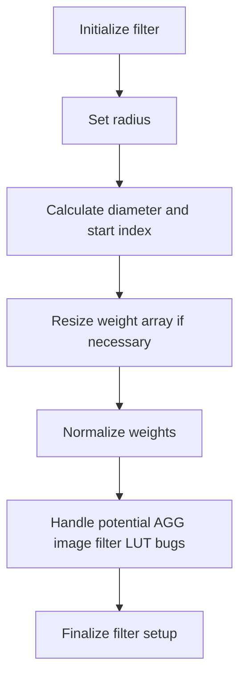
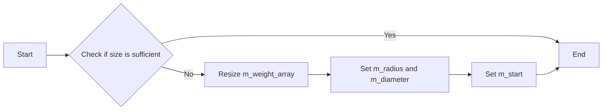
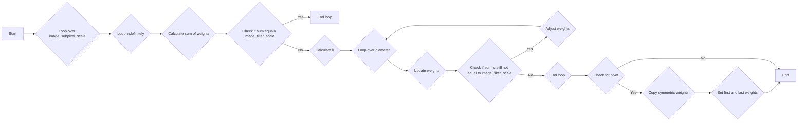
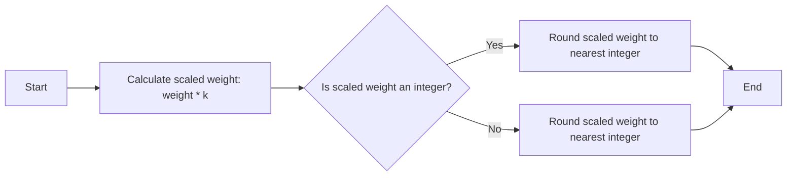
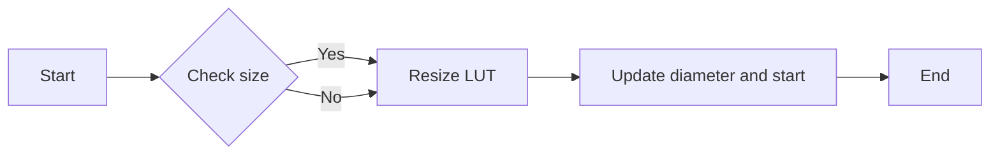

# `matplotlib\extern\agg24-svn\src\agg_image_filters.cpp` 详细设计文档

The code implements a lookup table (LUT) based image filter for Anti-Grain Geometry (AGG) library, which is used to apply various image filtering operations with a focus on normalization and rounding error correction.

## 整体流程



## 类结构

```
namespace agg
├── class image_filter_lut
│   ├── void realloc_lut(double radius)
│   └── void normalize()
```

## 全局变量及字段


### `image_subpixel_shift`
    
The shift amount for subpixel calculations.

类型：`unsigned`
    


### `image_subpixel_scale`
    
The scale factor for subpixel calculations.

类型：`unsigned`
    


### `image_filter_scale`
    
The scale factor for the image filter.

类型：`int`
    


### `m_radius`
    
The radius of the image filter.

类型：`double`
    


### `m_diameter`
    
The diameter of the image filter's weight array.

类型：`unsigned`
    


### `m_start`
    
The starting index for the weight array.

类型：`int`
    


### `m_weight_array`
    
The weight array for the image filter's lookup table (LUT).

类型：`std::vector<int>`
    


### `image_filter_lut.m_radius`
    
The radius of the image filter.

类型：`double`
    


### `image_filter_lut.m_diameter`
    
The diameter of the image filter's weight array.

类型：`unsigned`
    


### `image_filter_lut.m_start`
    
The starting index for the weight array.

类型：`int`
    


### `image_filter_lut.m_weight_array`
    
The weight array for the image filter's lookup table (LUT).

类型：`std::vector<int>`
    
    

## 全局函数及方法


### image_filter_lut::realloc_lut

This function reallocates the lookup table (LUT) for the image filter based on the given radius.

参数：

- `radius`：`double`，The radius of the filter to be used for reallocating the LUT.

返回值：`void`，No return value.

#### 流程图



#### 带注释源码

```cpp
void image_filter_lut::realloc_lut(double radius)
{
    m_radius = radius;
    m_diameter = uceil(radius) * 2;
    m_start = -int(m_diameter / 2 - 1);
    unsigned size = m_diameter << image_subpixel_shift;
    if(size > m_weight_array.size())
    {
        m_weight_array.resize(size);
    }
}
```


### image_filter_lut::normalize

This function normalizes the integer values in the weight array to correct rounding errors and ensure that the sum of pixel weights equals 1.0.

参数：

- No parameters.

返回值：`void`，No return value.

#### 流程图



#### 带注释源码

```cpp
void image_filter_lut::normalize()
{
    unsigned i;
    int flip = 1;

    for(i = 0; i < image_subpixel_scale; i++)
    {
        for(;;)
        {
            int sum = 0;
            unsigned j;
            for(j = 0; j < m_diameter; j++)
            {
                sum += m_weight_array[j * image_subpixel_scale + i];
            }

            if(sum == image_filter_scale) break;

            double k = double(image_filter_scale) / double(sum);
            sum = 0;
            for(j = 0; j < m_diameter; j++)
            {
                sum +=     m_weight_array[j * image_subpixel_scale + i] = 
                    iround(m_weight_array[j * image_subpixel_scale + i] * k);
            }

            sum -= image_filter_scale;
            int inc = (sum > 0) ? -1 : 1;

            for(j = 0; j < m_diameter && sum; j++)
            {
                flip ^= 1;
                unsigned idx = flip ? m_diameter/2 + j/2 : m_diameter/2 - j/2;
                int v = m_weight_array[idx * image_subpixel_scale + i];
                if(v < image_filter_scale)
                {
                    m_weight_array[idx * image_subpixel_scale + i] += inc;
                    sum += inc;
                }
            }
        }
    }

#ifndef MPL_FIX_AGG_IMAGE_FILTER_LUT_BUGS
    unsigned pivot = m_diameter << (image_subpixel_shift - 1);

    for(i = 0; i < pivot; i++)
    {
        m_weight_array[pivot + i] = m_weight_array[pivot - i];
    }
    unsigned end = (diameter() << image_subpixel_shift) - 1;
    m_weight_array[0] = m_weight_array[end];
#endif
}
```


### iround

This function normalizes integer values and corrects the rounding errors. It multiplies the weight by a scaling factor and rounds the result to the nearest integer.

参数：

- `weight`：`int`，The weight value to be scaled and rounded.
- `k`：`double`，The scaling factor.

返回值：`int`，The rounded integer value of the scaled weight.

#### 流程图



#### 带注释源码

```cpp
int iround(double value)
{
    return (int)(value + 0.5);
}
```


### image_filter_lut::realloc_lut

This function reallocates the lookup table (LUT) for the image filter based on the specified radius.

参数：

- `radius`：`double`，The radius of the filter to be used for reallocating the LUT.

返回值：`void`，No return value.

#### 流程图



#### 带注释源码

```cpp
void image_filter_lut::realloc_lut(double radius)
{
    m_radius = radius;
    m_diameter = uceil(radius) * 2;
    m_start = -int(m_diameter / 2 - 1);
    unsigned size = m_diameter << image_subpixel_shift;
    if(size > m_weight_array.size())
    {
        m_weight_array.resize(size);
    }
}
```


### image_filter_lut.normalize

This function normalizes the integer values in the weight array of the image filter lookup table (LUT), correcting rounding errors and ensuring that the sum of pixel weights equals 1.0.

参数：

- `radius`：`double`，The radius of the filter, used to determine the size of the weight array.

返回值：`void`，No return value, the function modifies the weight array in place.

#### 流程图

```mermaid
graph TD
    A[Start] --> B[Loop over image_subpixel_scale]
    B --> C{Sum of weights equal to image_filter_scale?}
    C -- Yes --> D[End]
    C -- No --> E[Calculate k = image_filter_scale / sum]
    E --> F[Loop over m_diameter]
    F --> G{m_weight_array[j * image_subpixel_scale + i] = iround(m_weight_array[j * image_subpixel_scale + i] * k)?}
    G -- Yes --> H[End loop]
    G -- No --> I[Adjust weights and sum]
    I --> F
    H --> J[Loop over m_diameter]
    J --> K{flip ^= 1?}
    K -- Yes --> L[Adjust weights and sum]
    K -- No --> M[Adjust weights and sum]
    L --> J
    M --> J
    J --> N[End loop]
    N --> O[End loop]
```

#### 带注释源码

```cpp
void image_filter_lut::normalize()
{
    unsigned i;
    int flip = 1;

    for(i = 0; i < image_subpixel_scale; i++)
    {
        for(;;)
        {
            int sum = 0;
            unsigned j;
            for(j = 0; j < m_diameter; j++)
            {
                sum += m_weight_array[j * image_subpixel_scale + i];
            }

            if(sum == image_filter_scale) break;

            double k = double(image_filter_scale) / double(sum);
            sum = 0;
            for(j = 0; j < m_diameter; j++)
            {
                sum +=     m_weight_array[j * image_subpixel_scale + i] = 
                    iround(m_weight_array[j * image_subpixel_scale + i] * k);
            }

            sum -= image_filter_scale;
            int inc = (sum > 0) ? -1 : 1;

            for(j = 0; j < m_diameter && sum; j++)
            {
                flip ^= 1;
                unsigned idx = flip ? m_diameter/2 + j/2 : m_diameter/2 - j/2;
                int v = m_weight_array[idx * image_subpixel_scale + i];
                if(v < image_filter_scale)
                {
                    m_weight_array[idx * image_subpixel_scale + i] += inc;
                    sum += inc;
                }
            }
        }
    }

#ifndef MPL_FIX_AGG_IMAGE_FILTER_LUT_BUGS
    unsigned pivot = m_diameter << (image_subpixel_shift - 1);

    for(i = 0; i < pivot; i++)
    {
        m_weight_array[pivot + i] = m_weight_array[pivot - i];
    }
    unsigned end = (diameter() << image_subpixel_shift) - 1;
    m_weight_array[0] = m_weight_array[end];
#endif
}
``` 


## 关键组件


### 张量索引与惰性加载

张量索引与惰性加载是代码中用于高效处理图像滤波器查找表（LUT）的机制。它允许在需要时才计算和存储权重数组，从而减少内存使用和提高性能。

### 反量化支持

反量化支持是代码中用于处理浮点数和整数之间的转换的机制。它确保在滤波器函数中，像素权重的总和正确地等于1.0，从而保持图像质量。

### 量化策略

量化策略是代码中用于优化权重数组计算的策略。它通过调整权重值来最小化舍入误差，并确保滤波器函数产生正确的图形形状。


## 问题及建议


### 已知问题

-   **内存使用效率**：`m_weight_array`数组在`realloc_lut`方法中根据`radius`重新分配大小，如果`radius`频繁变化，可能会导致频繁的内存分配和释放，影响性能。
-   **循环冗余**：`normalize`方法中的循环结构较为复杂，存在多个嵌套循环和条件判断，这可能导致代码的可读性和可维护性降低。
-   **硬编码**：代码中存在一些硬编码的值，如`image_filter_scale`和`image_subpixel_shift`，这些值可能需要根据不同的图像处理需求进行调整，但调整起来较为困难。

### 优化建议

-   **内存管理优化**：考虑使用更高效的内存管理策略，例如预先分配一个足够大的数组，或者使用内存池来减少内存分配和释放的次数。
-   **代码重构**：对`normalize`方法进行重构，简化循环结构，提高代码的可读性和可维护性。
-   **参数化设计**：将硬编码的值改为参数，使得代码更加灵活，便于调整和适应不同的图像处理需求。
-   **异常处理**：增加异常处理机制，以处理可能的错误情况，例如数组越界等。
-   **性能测试**：对代码进行性能测试，找出性能瓶颈，并针对性地进行优化。


## 其它


### 设计目标与约束

- 设计目标：实现一个高效的图像滤波器，用于在图像处理中应用各种滤波效果。
- 约束条件：滤波器必须能够处理不同大小的图像，并且能够适应不同的滤波半径。

### 错误处理与异常设计

- 错误处理：当输入的半径值不合理时，应抛出异常或返回错误代码。
- 异常设计：使用标准异常处理机制，确保在发生错误时程序能够优雅地处理。

### 数据流与状态机

- 数据流：输入图像数据通过滤波器处理，输出滤波后的图像数据。
- 状态机：滤波器在处理过程中可能处于不同的状态，如初始化、计算权重、归一化等。

### 外部依赖与接口契约

- 外部依赖：依赖于图像处理库和数学函数库。
- 接口契约：确保滤波器接口的稳定性和可预测性，方便与其他模块集成。

### 性能考量

- 性能优化：考虑使用缓存和优化算法来提高滤波器的处理速度。

### 安全性考量

- 安全性：确保滤波器在处理图像数据时不会泄露敏感信息。

### 可维护性与可扩展性

- 可维护性：代码结构清晰，易于理解和维护。
- 可扩展性：设计允许未来添加新的滤波效果或优化算法。

### 测试与验证

- 测试：编写单元测试和集成测试，确保滤波器的功能和性能符合预期。
- 验证：通过实际图像处理任务验证滤波器的效果。

### 文档与注释

- 文档：提供详细的设计文档和用户手册。
- 注释：代码中包含必要的注释，解释关键代码段的功能。

### 版本控制与发布

- 版本控制：使用版本控制系统管理代码变更。
- 发布：定期发布新版本，包括新功能和修复的bug。


    