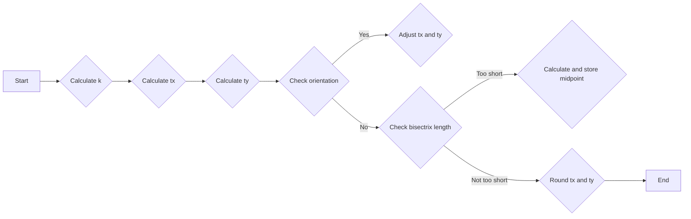

# `matplotlib\extern\agg24-svn\src\agg_line_aa_basics.cpp` 详细设计文档

This code defines a set of functions and constants for line operations in the Anti-Grain Geometry library, including line parameters and bisectrix calculations.

## 整体流程

```mermaid
graph TD
    A[Start] --> B[Calculate line parameters for l1 and l2]
    B --> C[Calculate k (ratio of line lengths)]
    C --> D[Calculate tx and ty (intersection point coordinates)]
    D --> E[Check if bisectrix is on the right of the line]
    E -->|Yes| F[Adjust tx and ty if necessary]
    F --> G[Check if bisectrix is too short]
    G -->|Yes| H[Calculate midpoint of l2]
    G -->|No| I[Round tx and ty to nearest integer]
    I --> J[End]
```

## 类结构

```
namespace agg
├── line_parameters
│   ├── s_orthogonal_quadrant
│   └── s_diagonal_quadrant
└── bisectrix
    └── void bisectrix(const line_parameters& l1, const line_parameters& l2, int* x, int* y)
```

## 全局变量及字段


### `line_parameters::s_orthogonal_quadrant`
    
Array containing the orthogonal quadrant indices for line parameters.

类型：`const int8u[8]`
    


### `line_parameters::s_diagonal_quadrant`
    
Array containing the diagonal quadrant indices for line parameters.

类型：`const int8u[8]`
    


### `line_subpixel_scale`
    
Scale factor used for subpixel precision in line calculations.

类型：`double`
    


### `line_parameters.line_parameters::s_orthogonal_quadrant`
    
Array containing the orthogonal quadrant indices for line parameters.

类型：`const int8u[8]`
    


### `line_parameters.line_parameters::s_diagonal_quadrant`
    
Array containing the diagonal quadrant indices for line parameters.

类型：`const int8u[8]`
    
    

## 全局函数及方法


### `bisectrix`

The `bisectrix` function calculates the bisectrix of two lines defined by their parameters. It returns the coordinates of the bisectrix intersection point.

参数：

- `l1`：`const line_parameters&`，The first line parameters object.
- `l2`：`const line_parameters&`，The second line parameters object.
- `x`：`int*`，A pointer to store the x-coordinate of the bisectrix intersection point.
- `y`：`int*`，A pointer to store the y-coordinate of the bisectrix intersection point.

返回值：`void`，No return value. The coordinates are stored in the provided pointers.

#### 流程图



#### 带注释源码

```cpp
void bisectrix(const line_parameters& l1, 
               const line_parameters& l2, 
               int* x, int* y)
{
    double k = double(l2.len) / double(l1.len);
    double tx = l2.x2 - (l2.x1 - l1.x1) * k;
    double ty = l2.y2 - (l2.y1 - l1.y1) * k;

    //All bisectrices must be on the right of the line
    //If the next point is on the left (l1 => l2.2)
    //then the bisectix should be rotated by 180 degrees.
    if(double(l2.x2 - l2.x1) * double(l2.y1 - l1.y1) <
       double(l2.y2 - l2.y1) * double(l2.x1 - l1.x1) + 100.0)
    {
        tx -= (tx - l2.x1) * 2.0;
        ty -= (ty - l2.y1) * 2.0;
    }

    // Check if the bisectrix is too short
    double dx = tx - l2.x1;
    double dy = ty - l2.y1;
    if((int)sqrt(dx * dx + dy * dy) < line_subpixel_scale)
    {
        *x = (l2.x1 + l2.x1 + (l2.y1 - l1.y1) + (l2.y2 - l2.y1)) >> 1;
        *y = (l2.y1 + l2.y1 - (l2.x1 - l1.x1) - (l2.x2 - l2.x1)) >> 1;
        return;
    }
    *x = iround(tx);
    *y = iround(ty);
}
```


## 关键组件


### 张量索引与惰性加载

张量索引与惰性加载是用于高效处理和存储大量数据的技术，它允许在需要时才计算或加载数据，从而减少内存使用和提高性能。

### 反量化支持

反量化支持是指系统能够处理和解释量化后的数据，通常用于降低模型大小和加速推理过程。

### 量化策略

量化策略是指将浮点数数据转换为固定点数表示的方法，以减少模型大小和提高计算效率。常见的量化策略包括全局量化、层量化、通道量化和权重量化等。


## 问题及建议


### 已知问题

-   **代码注释不足**：代码中缺少详细的注释，使得理解代码逻辑和功能变得困难。
-   **全局变量和函数的使用**：`line_subpixel_scale` 在代码中被使用，但没有在代码中定义或初始化，这可能导致未定义行为。
-   **浮点数精度问题**：在计算中使用了浮点数，可能会引入精度问题，特别是在涉及图形渲染时。
-   **代码可读性**：代码的布局和命名习惯可能不符合最佳实践，影响代码的可读性和可维护性。

### 优化建议

-   **添加注释**：为代码添加详细的注释，解释每个函数和变量的用途，以及算法的逻辑。
-   **初始化全局变量**：确保所有全局变量在使用前都被正确初始化。
-   **使用整数运算**：如果可能，使用整数运算代替浮点运算，以减少精度问题。
-   **代码重构**：重构代码以提高可读性和可维护性，例如使用更清晰的命名习惯和改进的布局。
-   **单元测试**：编写单元测试来验证代码的正确性和稳定性。
-   **性能优化**：分析代码的性能瓶颈，并对其进行优化，例如通过减少不必要的计算或使用更高效的算法。


## 其它


### 设计目标与约束

- 设计目标：实现高效的直线分割算法，用于图形渲染中的线段处理。
- 约束条件：算法需适应不同的线段参数，并保证计算结果的准确性。

### 错误处理与异常设计

- 错误处理：算法中未明确指出错误处理机制，但应考虑输入参数的有效性检查。
- 异常设计：未定义异常处理机制，但应考虑在输入参数无效时抛出异常。

### 数据流与状态机

- 数据流：输入为两个线段参数，输出为分割点的坐标。
- 状态机：无明确的状态机设计，算法直接计算结果。

### 外部依赖与接口契约

- 外部依赖：依赖于数学函数（如sqrt）和类型定义（如int8u）。
- 接口契约：函数bisectrix接受两个line_parameters类型的参数，并返回两个int类型的分割点坐标。

### 测试用例

- 测试用例1：输入两个相交的线段，验证输出分割点坐标是否正确。
- 测试用例2：输入两个平行的线段，验证输出分割点坐标是否正确。
- 测试用例3：输入两个不相交的线段，验证输出分割点坐标是否正确。

### 性能分析

- 性能指标：计算分割点坐标的时间复杂度。
- 性能优化：考虑使用更高效的数学算法或数据结构来提高性能。

### 安全性分析

- 安全性风险：输入参数错误可能导致计算结果不准确。
- 安全性措施：对输入参数进行有效性检查，确保算法的鲁棒性。

### 维护与扩展

- 维护策略：定期审查代码，确保算法的正确性和效率。
- 扩展性：考虑将算法扩展到更复杂的线段处理场景。


    