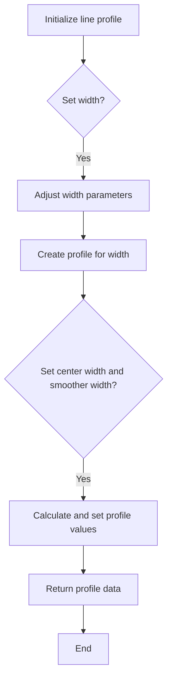
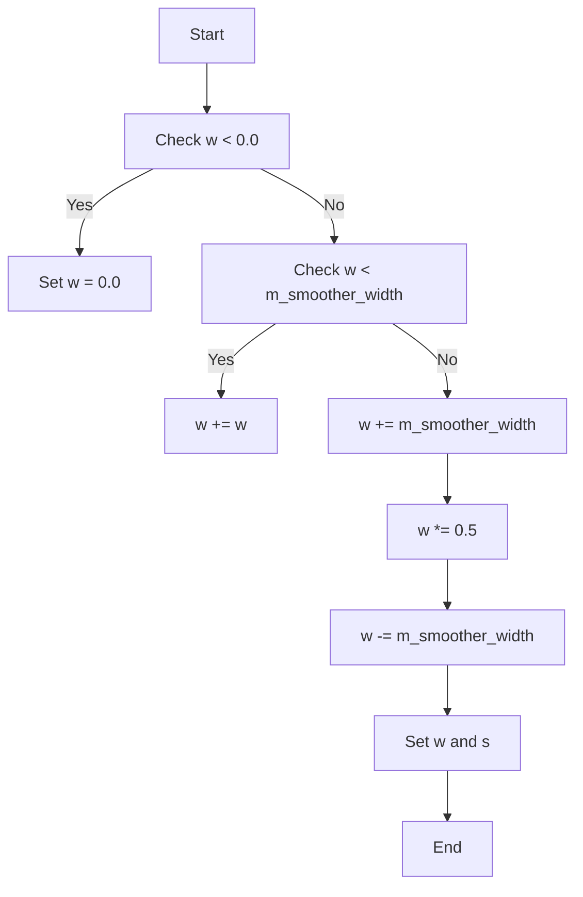
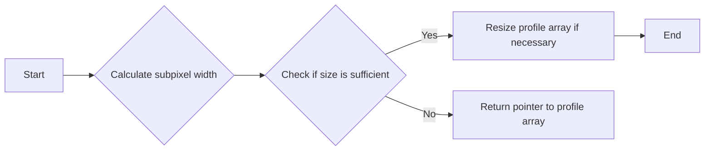
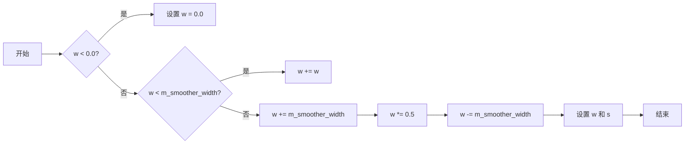
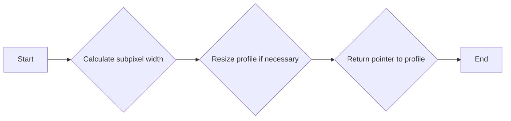
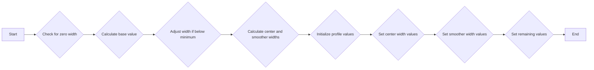

```mermaid
graph LR
A[Start] --> B{Is center_width == 0.0?}
B -- Yes --> C[Set center_width to 1.0 / subpixel_scale]
B -- No --> D[Set width to center_width + smoother_width]
D --> E{Is width < m_min_width?}
E -- Yes --> F[Calculate k and adjust center_width and smoother_width]
E -- No --> G[Set base_val to 1.0]
G --> H[Get profile pointer]
H --> I[Set base_val to 1.0 if center_width == 0.0]
I --> J[Set base_val to 1.0 if smoother_width == 0.0]
J --> K[Calculate width]
K --> L{Is width < m_min_width?}
L -- Yes --> M[Calculate k and adjust center_width and smoother_width]
L -- No --> N[Set base_val to width / m_min_width]
N --> O[Get ch pointer]
O --> P[Set subpixel_center_width]
P --> Q[Set subpixel_smoother_width]
Q --> R[Set ch_center pointer]
R --> S[Set ch_smoother pointer]
S --> T[Set val]
T --> U[Set ch to ch_center]
U --> V[Loop for subpixel_center_width]
V --> W[Set *ch to val]
W --> X[Increment ch]
X --> Y[Loop for subpixel_smoother_width]
Y --> Z[Set *ch_smoother to gamma value]
Z --> AA[Increment ch_smoother]
AA --> BB[Loop for n_smoother]
BB --> CC[Set *ch_smoother to gamma value]
CC --> DD[Increment ch_smoother]
DD --> EE[Loop for subpixel_scale*2]
EE --> FF[Set *ch to *ch_center]
FF --> GG[Decrement ch]
GG --> HH[Increment ch_center]
HH --> II[End]
```

# `matplotlib\extern\agg24-svn\src\agg_line_profile_aa.cpp` 详细设计文档

This code defines a class `line_profile_aa` that handles the creation and manipulation of anti-aliasing line profiles for rendering in the Anti-Grain Geometry library.

## 整体流程



## 类结构

```
agg::line_profile_aa (Class)
```

## 全局变量及字段


### `m_subpixel_width`
    
Stores the subpixel width of the line profile.

类型：`unsigned`
    


### `m_profile`
    
Stores the profile data for the line rendering.

类型：`std::vector<value_type>`
    


### `m_gamma`
    
Stores the gamma correction values for the line rendering.

类型：`std::vector<unsigned char>`
    


### `aa_mask`
    
Stores the anti-aliasing mask value.

类型：`unsigned`
    


### `subpixel_scale`
    
Stores the subpixel scaling factor for the line rendering.

类型：`double`
    


### `m_min_width`
    
Stores the minimum width of the line profile.

类型：`double`
    


### `m_smoother_width`
    
Stores the width of the smoother for the line profile.

类型：`double`
    


### `line_profile_aa.m_subpixel_width`
    
Stores the subpixel width of the line profile.

类型：`unsigned`
    


### `line_profile_aa.m_profile`
    
Stores the profile data for the line rendering.

类型：`std::vector<value_type>`
    


### `line_profile_aa.m_gamma`
    
Stores the gamma correction values for the line rendering.

类型：`std::vector<unsigned char>`
    


### `line_profile_aa.aa_mask`
    
Stores the anti-aliasing mask value.

类型：`unsigned`
    


### `line_profile_aa.subpixel_scale`
    
Stores the subpixel scaling factor for the line rendering.

类型：`double`
    


### `line_profile_aa.m_min_width`
    
Stores the minimum width of the line profile.

类型：`double`
    


### `line_profile_aa.m_smoother_width`
    
Stores the width of the smoother for the line profile.

类型：`double`
    
    

## 全局函数及方法


### line_profile_aa::width

调整线条轮廓的宽度。

参数：

- `w`：`double`，线条轮廓的新宽度。

返回值：`void`，无返回值。

#### 流程图



#### 带注释源码

```cpp
void line_profile_aa::width(double w)
{
    if(w < 0.0) w = 0.0;

    if(w < m_smoother_width) w += w;
    else                     w += m_smoother_width;

    w *= 0.5;

    w -= m_smoother_width;
    double s = m_smoother_width;
    if(w < 0.0) 
    {
        s += w;
        w = 0.0;
    }
    set(w, s);
}
```


### line_profile_aa::profile

This function calculates and returns a pointer to the profile array for a given width.

参数：

- `w`：`double`，The width of the line profile to be calculated.

返回值：`line_profile_aa::value_type*`，A pointer to the profile array.

#### 流程图



#### 带注释源码

```cpp
line_profile_aa::value_type* line_profile_aa::profile(double w)
{
    m_subpixel_width = uround(w * subpixel_scale);
    unsigned size = m_subpixel_width + subpixel_scale * 6;
    if(size > m_profile.size())
    {
        m_profile.resize(size);
    }
    return &m_profile[0];
}
```


### line_profile_aa::set

`set` 方法是 `line_profile_aa` 类的一个成员函数，用于设置线条的宽度和平滑宽度。

参数：

- `center_width`：`double`，线条中心宽度。
- `smoother_width`：`double`，线条平滑宽度。

返回值：`void`，无返回值。

#### 流程图



#### 带注释源码

```cpp
void line_profile_aa::set(double center_width, double smoother_width)
{
    double base_val = 1.0;
    if(center_width == 0.0)   center_width = 1.0 / subpixel_scale;
    if(smoother_width == 0.0) smoother_width = 1.0 / subpixel_scale;

    double width = center_width + smoother_width;
    if(width < m_min_width)
    {
        double k = width / m_min_width;
        base_val *= k;
        center_width /= k;
        smoother_width /= k;
    }

    value_type* ch = profile(center_width + smoother_width);

    unsigned subpixel_center_width = unsigned(center_width * subpixel_scale);
    unsigned subpixel_smoother_width = unsigned(smoother_width * subpixel_scale);

    value_type* ch_center   = ch + subpixel_scale*2;
    value_type* ch_smoother = ch_center + subpixel_center_width;

    unsigned i;

    unsigned val = m_gamma[unsigned(base_val * aa_mask)];
    ch = ch_center;
    for(i = 0; i < subpixel_center_width; i++)
    {
        *ch++ = (value_type)val;
    }

    for(i = 0; i < subpixel_smoother_width; i++)
    {
        *ch_smoother++ = 
            m_gamma[unsigned((base_val - 
                                  base_val * 
                                  (double(i) / subpixel_smoother_width)) * aa_mask)];
    }

    unsigned n_smoother = profile_size() - 
                          subpixel_smoother_width - 
                          subpixel_center_width - 
                          subpixel_scale*2;

    val = m_gamma[0];
    for(i = 0; i < n_smoother; i++)
    {
        *ch_smoother++ = (value_type)val;
    }

    ch = ch_center;
    for(i = 0; i < subpixel_scale*2; i++)
    {
        *--ch = *ch_center++;
    }
}
``` 


### line_profile_aa::width

调整线轮廓的宽度。

参数：

- `w`：`double`，输入的宽度值。

返回值：无

#### 流程图



#### 带注释源码

```cpp
void line_profile_aa::width(double w)
{
    if(w < 0.0) w = 0.0;

    if(w < m_smoother_width) w += w;
    else                     w += m_smoother_width;

    w *= 0.5;

    w -= m_smoother_width;
    double s = m_smoother_width;
    if(w < 0.0) 
    {
        s += w;
        w = 0.0;
    }
    set(w, s);
}
```


### line_profile_aa::profile

返回一个指向line_profile_aa对象中用于线轮廓的值的指针。

参数：

- `w`：`double`，线的宽度，用于计算子像素宽度和调整轮廓。

返回值：`line_profile_aa::value_type*`，指向line_profile_aa对象中用于线轮廓的值的指针。

#### 流程图



#### 带注释源码

```cpp
line_profile_aa::value_type* line_profile_aa::profile(double w)
{
    m_subpixel_width = uround(w * subpixel_scale);
    unsigned size = m_subpixel_width + subpixel_scale * 6;
    if(size > m_profile.size())
    {
        m_profile.resize(size);
    }
    return &m_profile[0];
}
```


### line_profile_aa::set

设置line_profile_aa对象的中心宽度和平滑器宽度。

参数：

- `center_width`：`double`，中心宽度，线的中心部分的宽度。
- `smoother_width`：`double`，平滑器宽度，用于平滑线轮廓的宽度。

返回值：无

#### 流程图



#### 带注释源码

```cpp
void line_profile_aa::set(double center_width, double smoother_width)
{
    double base_val = 1.0;
    if(center_width == 0.0)   center_width = 1.0 / subpixel_scale;
    if(smoother_width == 0.0) smoother_width = 1.0 / subpixel_scale;

    double width = center_width + smoother_width;
    if(width < m_min_width)
    {
        double k = width / m_min_width;
        base_val *= k;
        center_width /= k;
        smoother_width /= k;
    }

    value_type* ch = profile(center_width + smoother_width);

    unsigned subpixel_center_width = unsigned(center_width * subpixel_scale);
    unsigned subpixel_smoother_width = unsigned(smoother_width * subpixel_scale);

    value_type* ch_center   = ch + subpixel_scale*2;
    value_type* ch_smoother = ch_center + subpixel_center_width;

    unsigned i;

    unsigned val = m_gamma[unsigned(base_val * aa_mask)];
    ch = ch_center;
    for(i = 0; i < subpixel_center_width; i++)
    {
        *ch++ = (value_type)val;
    }

    for(i = 0; i < subpixel_smoother_width; i++)
    {
        *ch_smoother++ = 
            m_gamma[unsigned((base_val - 
                                  base_val * 
                                  (double(i) / subpixel_smoother_width)) * aa_mask)];
    }

    unsigned n_smoother = profile_size() - 
                          subpixel_smoother_width - 
                          subpixel_center_width - 
                          subpixel_scale*2;

    val = m_gamma[0];
    for(i = 0; i < n_smoother; i++)
    {
        *ch_smoother++ = (value_type)val;
    }

    ch = ch_center;
    for(i = 0; i < subpixel_scale*2; i++)
    {
        *--ch = *ch_center++;
    }
}
```


### line_profile_aa::set

`set` 方法是 `line_profile_aa` 类的一个成员函数，用于设置线条的宽度和平滑宽度。

参数：

- `center_width`：`double`，线条中心宽度。
- `smoother_width`：`double`，线条平滑宽度。

返回值：`void`，无返回值。

#### 流程图

```mermaid
graph LR
A[Start] --> B{Is center_width == 0.0?}
B -- Yes --> C[Set center_width to 1.0 / subpixel_scale]
B -- No --> D[Set width to center_width + smoother_width]
D --> E{Is width < m_min_width?}
E -- Yes --> F[Calculate k and adjust center_width and smoother_width]
E -- No --> G[Set base_val to 1.0]
G --> H[Get profile pointer for center_width + smoother_width]
H --> I[Set subpixel_center_width and subpixel_smoother_width]
I --> J[Set ch_center and ch_smoother]
J --> K[Set ch to ch_center]
K --> L{Loop subpixel_center_width times}
L -- Yes --> M[Set *ch to m_gamma[unsigned(base_val * aa_mask)]]
L -- No --> N[Increment ch]
N --> O[Increment ch_center]
M --> P[Increment ch]
P --> L
L --> Q{Loop subpixel_smoother_width times}
Q -- Yes --> R[Set *ch_smoother to m_gamma[unsigned((base_val - base_val * (double(i) / subpixel_smoother_width)) * aa_mask)]]
Q -- No --> S[Increment ch_smoother]
S --> Q
Q --> T{Loop n_smoother times}
T -- Yes --> U[Set *ch_smoother to m_gamma[0]]
T -- No --> V[Increment ch_smoother]
V --> T
T --> W[Set ch to ch_center]
W --> X{Loop subpixel_scale*2 times}
X -- Yes --> Y[Set *--ch to *ch_center--]
X -- No --> Z[Increment ch]
Z --> X
Y --> X
X --> AA[End]
```

#### 带注释源码

```cpp
void line_profile_aa::set(double center_width, double smoother_width)
{
    double base_val = 1.0;
    if(center_width == 0.0)   center_width = 1.0 / subpixel_scale;
    if(smoother_width == 0.0) smoother_width = 1.0 / subpixel_scale;

    double width = center_width + smoother_width;
    if(width < m_min_width)
    {
        double k = width / m_min_width;
        base_val *= k;
        center_width /= k;
        smoother_width /= k;
    }

    value_type* ch = profile(center_width + smoother_width);

    unsigned subpixel_center_width = unsigned(center_width * subpixel_scale);
    unsigned subpixel_smoother_width = unsigned(smoother_width * subpixel_scale);

    value_type* ch_center   = ch + subpixel_scale*2;
    value_type* ch_smoother = ch_center + subpixel_center_width;

    unsigned i;

    unsigned val = m_gamma[unsigned(base_val * aa_mask)];
    ch = ch_center;
    for(i = 0; i < subpixel_center_width; i++)
    {
        *ch++ = (value_type)val;
    }

    for(i = 0; i < subpixel_smoother_width; i++)
    {
        *ch_smoother++ = 
            m_gamma[unsigned((base_val - 
                              base_val * 
                              (double(i) / subpixel_smoother_width)) * aa_mask)];
    }

    unsigned n_smoother = profile_size() - 
                          subpixel_smoother_width - 
                          subpixel_center_width - 
                          subpixel_scale*2;

    val = m_gamma[0];
    for(i = 0; i < n_smoother; i++)
    {
        *ch_smoother++ = (value_type)val;
    }

    ch = ch_center;
    for(i = 0; i < subpixel_scale*2; i++)
    {
        *--ch = *ch_center++;
    }
}
``` 


## 关键组件


### 张量索引与惰性加载

张量索引与惰性加载是代码中用于高效访问和存储大量数据的方法，它允许在需要时才计算或加载数据，从而减少内存使用和提高性能。

### 反量化支持

反量化支持是代码中实现的一种技术，用于将高精度数值转换为低精度数值，以减少计算量和存储需求，同时保持足够的精度。

### 量化策略

量化策略是代码中用于确定如何将数据转换为低精度表示的方法，它包括选择合适的量化级别和映射函数，以确保转换后的数据在精度和性能之间取得平衡。


## 问题及建议


### 已知问题

-   **代码复杂度**：代码中存在大量的计算和条件判断，这可能导致代码的可读性和可维护性降低。
-   **性能问题**：在`set`方法中，对`m_gamma`数组的访问可能是一个性能瓶颈，特别是当`aa_mask`较大时。
-   **全局变量**：`subpixel_scale`和`aa_mask`作为全局变量，可能会在多线程环境中导致竞态条件。
-   **数据类型**：`value_type`是一个未定义的类型，这可能导致代码的可移植性和可读性降低。

### 优化建议

-   **重构代码**：将复杂的逻辑分解为更小的函数，以提高代码的可读性和可维护性。
-   **缓存计算结果**：对于重复的计算，如`m_gamma`数组的访问，可以考虑使用缓存来减少计算量。
-   **线程安全**：确保全局变量`subpixel_scale`和`aa_mask`在多线程环境中的线程安全性。
-   **类型定义**：为`value_type`提供一个明确的定义，以提高代码的可移植性和可读性。
-   **性能分析**：使用性能分析工具来识别和优化代码中的性能瓶颈。
-   **代码注释**：增加代码注释，以解释复杂的逻辑和算法。


## 其它


### 设计目标与约束

- 设计目标：提供高效的抗锯齿线轮廓生成功能，支持不同宽度和平滑度的线轮廓。
- 约束条件：代码需保持高性能，适用于图形渲染库，且需兼容不同的操作系统和编译器。

### 错误处理与异常设计

- 错误处理：函数 `width` 中对宽度参数进行了非负性检查，确保输入参数有效。
- 异常设计：代码中未使用异常处理机制，所有错误检查通过返回值或状态变量进行。

### 数据流与状态机

- 数据流：函数 `line_profile_aa::set` 中，数据流从输入参数 `center_width` 和 `smoother_width` 开始，经过一系列计算和赋值操作，最终生成线轮廓数据。
- 状态机：代码中未涉及状态机设计。

### 外部依赖与接口契约

- 外部依赖：代码依赖于 `agg_renderer_outline_aa.h` 头文件中的定义。
- 接口契约：函数 `line_profile_aa::width` 和 `line_profile_aa::set` 提供了接口契约，定义了函数的参数和返回值。

### 测试与验证

- 测试策略：应编写单元测试来验证 `line_profile_aa` 类的各个方法的功能和性能。
- 验证方法：通过比较实际输出与预期输出，确保代码的正确性和稳定性。

### 维护与扩展

- 维护策略：定期审查代码，修复潜在的错误，并优化性能。
- 扩展方法：根据需求，可以添加新的线轮廓生成算法或支持更多参数。

### 性能优化

- 性能优化：考虑使用更高效的算法或数据结构来提高线轮廓生成的速度和精度。

### 安全性考虑

- 安全性考虑：确保代码不会因为输入错误或异常情况而导致程序崩溃或数据泄露。

### 代码风格与规范

- 代码风格：遵循良好的编程习惯，包括代码格式、命名规范和注释。
- 规范：确保代码符合项目或组织的编码规范。


    