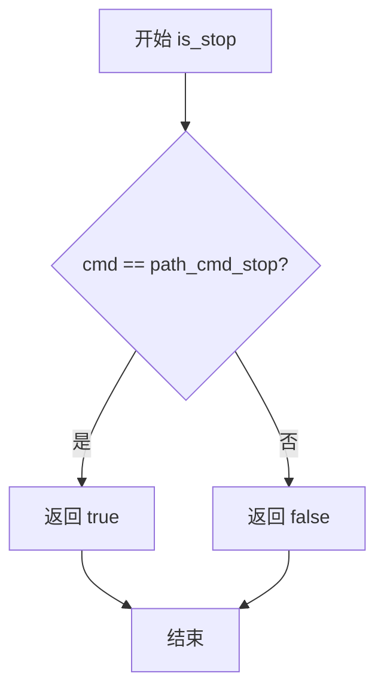
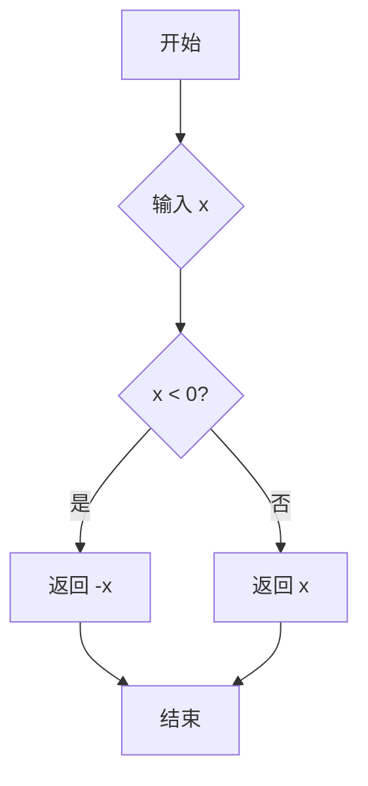
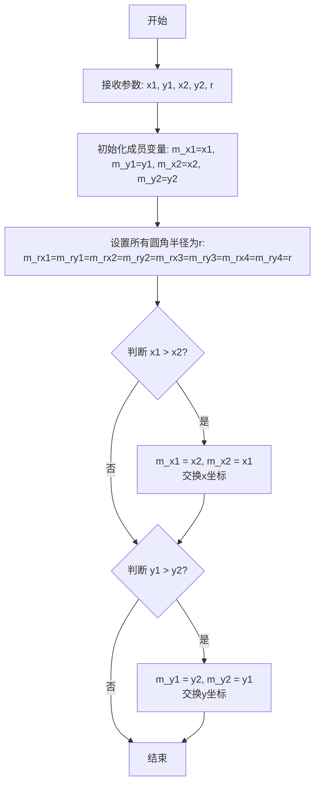
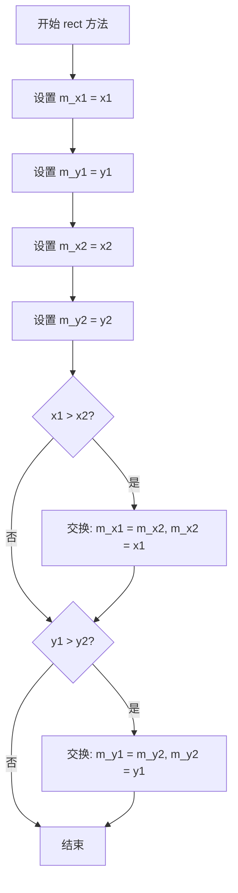
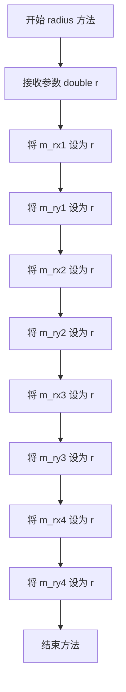
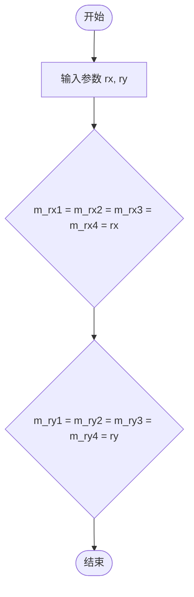
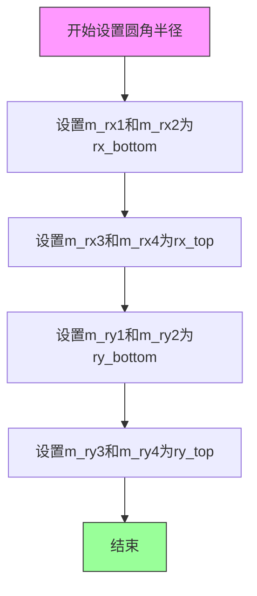
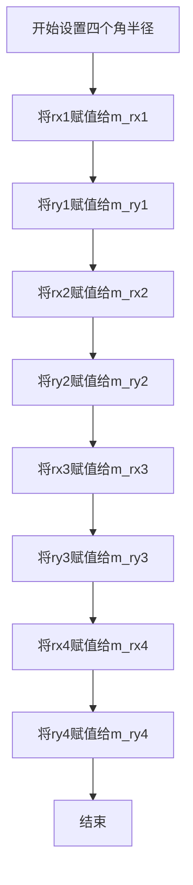
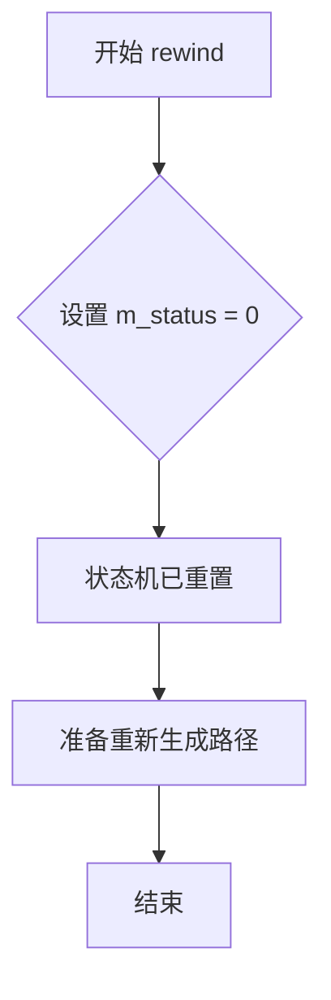
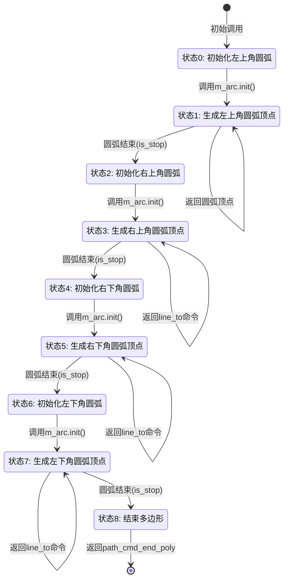

# `matplotlib\extern\agg24-svn\src\agg_rounded_rect.cpp` 详细设计文档

这是 Anti-Grain Geometry (AGG) 库中的一个顶点生成器类 `rounded_rect`，用于计算并输出绘制圆角矩形所需的顶点序列（路径命令和坐标）。该类通过内部状态机（State Machine）配合一个弧线生成器（arc），分阶段生成四个圆角弧以及连接它们的直线顶点。

## 整体流程

```mermaid
graph TD
    A[调用 vertex(x, y)] --> B{检查 m_status 状态}
    B -- 0 --> C[初始化左上角弧线 m_arc]
    C --> D[m_status++]
    B -- 1 --> E[获取弧线顶点]
    E --> F{is_stop(cmd)?}
    F -- 否 --> G[返回 顶点]
    F -- 是 --> D
    B -- 2 --> H[初始化右上角弧线]
    B -- 3 --> I[获取顶点并返回 path_cmd_line_to]
    B -- 4 --> J[初始化右下角弧线]
    B -- 5 --> K[获取顶点并返回 path_cmd_line_to]
    B -- 6 --> L[初始化左下角弧线]
    B -- 7 --> M[获取顶点并返回 path_cmd_line_to]
    B -- 8 --> N[返回 path_cmd_end_poly]
```

## 类结构

```
agg (命名空间)
└── rounded_rect (类: 负责生成圆角矩形路径)
```

## 全局变量及字段


### `pi`
    
数学常量 π，用于弧度计算

类型：`const double`
    


### `path_cmd_stop`
    
路径命令：停止/结束

类型：`unsigned`
    


### `path_cmd_line_to`
    
路径命令：直线连接到当前点

类型：`unsigned`
    


### `path_cmd_end_poly`
    
路径命令：多边形结束

类型：`unsigned`
    


### `path_flags_close`
    
路径标志：闭合多边形

类型：`unsigned`
    


### `path_flags_ccw`
    
路径标志：逆时针方向

类型：`unsigned`
    


### `rounded_rect.m_x1`
    
矩形左上角 X 坐标

类型：`double`
    


### `rounded_rect.m_y1`
    
矩形左上角 Y 坐标

类型：`double`
    


### `rounded_rect.m_x2`
    
矩形右下角 X 坐标

类型：`double`
    


### `rounded_rect.m_y2`
    
矩形右下角 Y 坐标

类型：`double`
    


### `rounded_rect.m_rx1`
    
左上角 X 方向圆角半径

类型：`double`
    


### `rounded_rect.m_ry1`
    
左上角 Y 方向圆角半径

类型：`double`
    


### `rounded_rect.m_rx2`
    
右上角 X 方向圆角半径

类型：`double`
    


### `rounded_rect.m_ry2`
    
右上角 Y 方向圆角半径

类型：`double`
    


### `rounded_rect.m_rx3`
    
右下角 X 方向圆角半径

类型：`double`
    


### `rounded_rect.m_ry3`
    
右下角 Y 方向圆角半径

类型：`double`
    


### `rounded_rect.m_rx4`
    
左下角 X 方向圆角半径

类型：`double`
    


### `rounded_rect.m_ry4`
    
左下角 Y 方向圆角半径

类型：`double`
    


### `rounded_rect.m_arc`
    
内部封装的弧线生成器对象

类型：`arc`
    


### `rounded_rect.m_status`
    
顶点生成状态机当前状态 (0-8)

类型：`unsigned`
    
    

## 全局函数及方法


### `is_stop`

全局函数或宏，用于判断路径命令是否为停止信号。该函数接收一个无符号整型命令参数，通过与 `path_cmd_stop` 常量进行比较，返回布尔值以指示当前命令是否代表路径结束的停止信号。

参数：

- `cmd`：`unsigned`，路径命令值，表示从顶点生成器返回的当前路径操作命令

返回值：`bool`，返回 true 表示命令为停止信号（path_cmd_stop），返回 false 表示命令为其他有效路径命令

#### 流程图



#### 带注释源码

```
// is_stop 判断路径命令是否为停止信号的宏或内联函数
// 参数 cmd: unsigned类型的路径命令值
// 返回值: bool类型，true表示命令为停止信号，false表示为其他命令
//
// 在 Anti-Grain Geometry 库中，is_stop 通常定义为宏或内联函数：
// #define is_stop(cmd) ((cmd) == path_cmd_stop)
//
// 或者等价的内联形式：
// inline bool is_stop(unsigned cmd)
// {
//     return cmd == path_cmd_stop;
// }
//
// 使用场景：在 vertex() 方法中检查弧线顶点生成器返回的命令
// 如果返回停止命令，则切换到下一个状态继续生成路径
//
// 示例：
//   cmd = m_arc.vertex(x, y);
//   if(is_stop(cmd)) m_status++;
```


### `fabs`

计算双精度浮点数的绝对值，返回无符号的双精度浮点数。

参数：

- `x`：`double`，需要计算绝对值的双精度浮点数

返回值：`double`，返回 `x` 的绝对值。当 `x` 为负数时返回其相反数，当 `x` 为正数时返回其本身。

#### 流程图



#### 带注释源码

```c
// 标准库 math.h 中的 fabs 函数实现示例
// 该函数计算双精度浮点数的绝对值

double fabs(double x)
{
    // 如果 x 为负数，返回其相反数（即正值）
    // 如果 x 为正数或零，直接返回原值
    return x < 0.0 ? -x : x;
}
```

---

### `rounded_rect::normalize_radius`

在 `agg_rounded_rect.cpp` 文件中，`fabs` 函数被用于 `rounded_rect` 类的 `normalize_radius()` 方法中，用于确保矩形圆角半径不会超过矩形边界。

#### 带注释源码（使用 fabs 的上下文）

```cpp
// 标准化圆角半径，确保圆角不会超出矩形边界
void rounded_rect::normalize_radius()
{
    // 计算矩形的宽度和高度（使用 fabs 确保为正数）
    double dx = fabs(m_y2 - m_y1);  // fabs: 计算高度绝对值
    double dy = fabs(m_x2 - m_x1);  // fabs: 计算宽度绝对值

    double k = 1.0;
    double t;
    
    // 计算各个圆角半径与对应边长的比例，找出最小比例系数
    t = dx / (m_rx1 + m_rx2); if(t < k) k = t; 
    t = dx / (m_rx3 + m_rx4); if(t < k) k = t; 
    t = dy / (m_ry1 + m_ry2); if(t < k) k = t; 
    t = dy / (m_ry3 + m_ry4); if(t < k) k = t; 

    // 如果最小比例系数小于1，按比例缩小所有圆角半径
    if(k < 1.0)
    {
        m_rx1 *= k; m_ry1 *= k; m_rx2 *= k; m_ry2 *= k;
        m_rx3 *= k; m_ry3 *= k; m_rx4 *= k; m_ry4 *= k;
    }
}
```

#### 关键信息

| 项目 | 描述 |
|------|------|
| 使用位置 | `rounded_rect::normalize_radius()` 方法 |
| 调用原因 | 确保矩形坐标差值为正，用于正确计算宽高比 |
| 数学意义 | `fabs(x)` 返回 `x` 的绝对值 |


### `rounded_rect.rounded_rect`

构造函数，初始化矩形区域和统一圆角半径。该构造函数接收矩形两个对角坐标和统一的圆角半径，将四个角的圆角半径设置为相同值，并确保坐标顺序正确（x1<=x2, y1<=y2）。

参数：

- `x1`：`double`，矩形左上角X坐标
- `y1`：`double`，矩形左上角Y坐标
- `x2`：`double`，矩形右下角X坐标
- `y2`：`double`，矩形右下角Y坐标
- `r`：`double`，统一的圆角半径（应用于所有四个角）

返回值：无（构造函数，无返回值）

#### 流程图



#### 带注释源码

```cpp
//------------------------------------------------------------------------
// 构造函数：rounded_rect
// 功能：初始化矩形区域和统一圆角半径
// 参数：
//   x1 - 矩形左上角X坐标
//   y1 - 矩形左上角Y坐标
//   x2 - 矩形右下角X坐标
//   y2 - 矩形右下角Y坐标
//   r  - 统一的圆角半径（应用于所有四个角）
//------------------------------------------------------------------------
rounded_rect::rounded_rect(double x1, double y1, double x2, double y2, double r) :
    // 初始化矩形的四个顶点坐标
    m_x1(x1), m_y1(y1), m_x2(x2), m_y2(y2),
    // 初始化四个角的圆角半径（全部设为相同的r值）
    // m_rx1/m_ry1: 左下角
    // m_rx2/m_ry2: 右下角
    // m_rx3/m_ry3: 右上角
    // m_rx4/m_ry4: 左上角
    m_rx1(r), m_ry1(r), m_rx2(r), m_ry2(r), 
    m_rx3(r), m_ry3(r), m_rx4(r), m_ry4(r)
{
    // 确保坐标顺序正确：x1 <= x2, y1 <= y2
    // 如果传入的坐标顺序相反，则进行交换
    if(x1 > x2) { m_x1 = x2; m_x2 = x1; }
    if(y1 > y2) { m_y1 = y2; m_y2 = y1; }
}
```


### `rounded_rect.rect`

设置矩形边界坐标，同时对输入坐标进行规范化处理，确保左上角坐标小于右下角坐标。

参数：

- `x1`：`double`，矩形左上角X坐标
- `y1`：`double`，矩形左上角Y坐标
- `x2`：`double`，矩形右下角X坐标
- `y2`：`double`，矩形右下角Y坐标

返回值：`void`，无返回值

#### 流程图



#### 带注释源码

```cpp
//--------------------------------------------------------------------
void rounded_rect::rect(double x1, double y1, double x2, double y2)
{
    // 设置矩形左上角X坐标
    m_x1 = x1;
    
    // 设置矩形左上角Y坐标
    m_y1 = y1;
    
    // 设置矩形右下角X坐标
    m_x2 = x2;
    
    // 设置矩形右下角Y坐标
    m_y2 = y2;
    
    // 规范化X坐标：如果x1 > x2，则交换确保x1为最小值
    if(x1 > x2) { m_x1 = x2; m_x2 = x1; }
    
    // 规范化Y坐标：如果y1 > y2，则交换确保y1为最小值
    if(y1 > y2) { m_y1 = y2; m_y2 = y1; }
}
```


### `rounded_rect.radius`

该方法用于将矩形的全部8个圆角半径参数（水平半径和垂直半径）统一设置为指定值 r，实现一次性重置所有圆角为相同半径的功能。

参数：

- `r`：`double`，统一圆角半径值，将同时赋值给四个角的水平圆角半径（rx1~rx4）和垂直圆角半径（ry1~ry4）

返回值：`void`，无返回值，仅修改内部圆角半径状态

#### 流程图



#### 带注释源码

```cpp
//--------------------------------------------------------------------
void rounded_rect::radius(double r)
{
    // 将四个角的所有圆角半径统一设置为 r
    // m_rx1, m_ry1: 左上角水平/垂直半径
    // m_rx2, m_ry2: 右上角水平/垂直半径
    // m_rx3, m_ry3: 右下角水平/垂直半径
    // m_rx4, m_ry4: 左下角水平/垂直半径
    m_rx1 = m_ry1 = m_rx2 = m_ry2 = m_rx3 = m_ry3 = m_rx4 = m_ry4 = r; 
}
```


### `rounded_rect.radius(double rx, double ry)`

设置所有圆角为统一椭圆半径。

参数：

-  `rx`：`double`，水平方向的圆角半径，将统一应用于矩形的左下、右下、右上、左下四个角。
-  `ry`：`double`，垂直方向的圆角半径，将统一应用于矩形的左下、右下、右上、左下四个角。

返回值：`void`，无返回值。

#### 流程图



#### 带注释源码

```cpp
//--------------------------------------------------------------------
void rounded_rect::radius(double rx, double ry)
{
    // 将所有四个角的水平(X轴)半径统一设置为 rx
    m_rx1 = m_rx2 = m_rx3 = m_rx4 = rx; 
    
    // 将所有四个角的垂直(Y轴)半径统一设置为 ry
    m_ry1 = m_ry2 = m_ry3 = m_ry4 = ry; 
}
```


### `rounded_rect.radius`

该方法用于分别设置矩形上下边缘的圆角半径，允许用户为底部（下方）和顶部（上方）边缘分别指定不同的水平和垂直圆角半径值。

参数：

- `rx_bottom`：`double`，底部边缘的水平圆角半径
- `ry_bottom`：`double`，底部边缘的垂直圆角半径
- `rx_top`：`double`，顶部边缘的水平圆角半径
- `ry_top`：`double`，顶部边缘的垂直圆角半径

返回值：`void`，无返回值描述

#### 流程图



#### 带注释源码

```cpp
//--------------------------------------------------------------------
void rounded_rect::radius(double rx_bottom, double ry_bottom, 
                          double rx_top,    double ry_top)
{
    // 设置底部边缘（左下角m_rx1/m_ry1和右下角m_rx2/m_ry2）的圆角半径
    m_rx1 = m_rx2 = rx_bottom; 
    m_ry1 = m_ry2 = ry_bottom; 
    
    // 设置顶部边缘（右上角m_rx3/m_ry3和左上角m_rx4/m_ry4）的圆角半径
    m_rx3 = m_rx4 = rx_top; 
    m_ry3 = m_ry4 = ry_top; 
}
```


### `rounded_rect.radius`

该方法用于分别设置矩形四个角的独立圆角半径，允许用户为左上、右上、右下、左下四个角分别指定不同的水平和垂直圆角半径值，从而实现复杂的圆角矩形效果。

参数：

- `rx1`：`double`，左上角水平方向的圆角半径
- `ry1`：`double`，左上角垂直方向的圆角半径
- `rx2`：`double`，右上角水平方向的圆角半径
- `ry2`：`double`，右上角垂直方向的圆角半径
- `rx3`：`double`，右下角水平方向的圆角半径
- `ry3`：`double`，右下角垂直方向的圆角半径
- `rx4`：`double`，左下角水平方向的圆角半径
- `ry4`：`double`，左下角垂直方向的圆角半径

返回值：`void`，无返回值

#### 流程图



#### 带注释源码

```cpp
//--------------------------------------------------------------------
void rounded_rect::radius(double rx1, double ry1, double rx2, double ry2, 
                          double rx3, double ry3, double rx4, double ry4)
{
    // 设置左上角（corner 1）的圆角半径
    m_rx1 = rx1; m_ry1 = ry1; 
    
    // 设置右上角（corner 2）的圆角半径
    m_rx2 = rx2; m_ry2 = ry2; 
    
    // 设置右下角（corner 3）的圆角半径
    m_rx3 = rx3; m_ry3 = ry3; 
    
    // 设置左下角（corner 4）的圆角半径
    m_rx4 = rx4; m_ry4 = ry4;
}
```


### `rounded_rect.normalize_radius()`

#### 描述

`normalize_radius` 是 `rounded_rect` 类的核心成员方法，用于确保圆角矩形的四个圆角半径不会超过矩形边界的一半，从而避免圆弧之间发生重叠或超出矩形范围。该方法通过计算矩形宽高与对应边半径总和的比值，得出一个缩放因子 `k`（取值范围 0 到 1），并将该因子应用于所有四个角的 x 轴半径（`m_rx`）和 y 轴半径（`m_ry`），从而在几何上保证圆角矩形的有效性。

> **注意**：在提供的源码中，计算矩形尺寸的逻辑存在疑似交换错误：`dx` 被赋值为垂直高度 (`|y2-y1|`)，而 `dy` 被赋值为水平宽度 (`|x2-x1|`)。尽管如此，后面的约束计算逻辑（用 `dx` 限制 `rx`，用 `dy` 限制 `ry`）实际上是反向工作的，这可能表明代码存在逻辑缺陷或注释缺失。详见“潜在的技术债务”部分。

#### 参数

- 无参数。

#### 返回值

- `void`：无返回值。该方法直接修改对象内部的半径成员变量（`m_rx1..4`, `m_ry1..4`）。

#### 流程图

```mermaid
graph TD
    A([开始 normalize_radius]) --> B[计算 dx = |m_y2 - m_y1| <br>计算 dy = |m_x2 - m_x1|]
    B --> C[初始化缩放因子 k = 1.0]
    C --> D[计算水平约束 t1 = dx / (m_rx1 + m_rx2)]
    D --> E{当前 t1 < k?}
    E -- 是 --> F[k = t1]
    E -- 否 --> G[继续]
    F --> G
    G --> H[计算水平约束 t2 = dx / (m_rx3 + m_rx4)]
    H --> I{当前 t2 < k?}
    I -- 是 --> J[k = t2]
    I -- 否 --> K
    J --> K
    K --> L[计算垂直约束 t3 = dy / (m_ry1 + m_ry2)]
    L --> M{当前 t3 < k?}
    M -- 是 --> N[k = t3]
    M -- 否 --> O
    N --> O
    O --> P[计算垂直约束 t4 = dy / (m_ry3 + m_ry4)]
    P --> Q{当前 t4 < k?}
    Q -- 是 --> R[k = t4]
    Q -- 否 --> S
    R --> S
    S --> T{k < 1.0?}
    T -- 是 --> U[等比缩放所有半径<br>m_rx* = m_rx * k<br>m_ry* = m_ry * k]
    T -- 否 --> V([结束])
    U --> V
```

#### 带注释源码

```cpp
//--------------------------------------------------------------------
void rounded_rect::normalize_radius()
{
    // 【疑问】通常 dx 代表水平宽度 (x2-x1)，dy 代表垂直高度 (y2-y1)。
    // 但此处代码将 dx 赋值为高度差，dy 赋值为宽度差，这导致后续逻辑中
    // 实际上是用高度去约束水平半径，用宽度去约束垂直半径。
    double dx = fabs(m_y2 - m_y1); 
    double dy = fabs(m_x2 - m_x1);

    // 初始化缩放系数 k 为 1.0（即不缩放）
    double k = 1.0;
    double t;

    // 计算矩形宽度 dx 与底边两个角水平半径之和的比值 t。
    // 如果比值小于当前 k，则更新 k。
    t = dx / (m_rx1 + m_rx2); if(t < k) k = t; 
    
    // 计算矩形宽度 dx 与顶边两个角水平半径之和的比值 t。
    t = dx / (m_rx3 + m_rx4); if(t < k) k = t; 
    
    // 计算矩形高度 dy 与左边两个角垂直半径之和的比值 t。
    // 注意：这里使用了 dy (实际是宽度值) 来限制垂直半径。
    t = dy / (m_ry1 + m_ry2); if(t < k) k = t; 
    
    // 计算矩形高度 dy 与右边两个角垂直半径之和的比值 t。
    t = dy / (m_ry3 + m_ry4); if(t < k) k = t; 

    // 如果计算出的最小比值 k 小于 1.0，说明半径过大，需要按比例缩小
    if(k < 1.0)
    {
        // 对四个角的所有半径进行等比缩放
        m_rx1 *= k; m_ry1 *= k; m_rx2 *= k; m_ry2 *= k;
        m_rx3 *= k; m_ry3 *= k; m_rx4 *= k; m_ry4 *= k;
    }
}
```

### 关键组件信息

1.  **缩放因子 (k)**: 这是一个临时变量，用于存储当前发现的最严格的约束比值。如果矩形尺寸相对于半径足够大，`k` 保持为 1.0；否则 `k` 会是一个小于 1.0 的数，用于整体缩小半径。
2.  **约束计算 (t)**: 每次循环计算矩形边长与对应边两个角半径之和的比值。这个比值表示“当前半径占用了边长的多少比例”，显然不能超过 1.0。

### 潜在的技术债务或优化空间

1.  **变量命名与计算逻辑混淆 (Bug/Code Smell)**:
    *   源码中 `dx` 计算为 `fabs(m_y2 - m_y1)`（高度），`dy` 计算为 `fabs(m_x2 - m_x1)`（宽度）。这与常规的 `dx` (宽) / `dy` (高) 命名习惯相反。
    *   更严重的是，在约束检查中：`t = dx / (m_rx1 + m_rx2)`（用高度限制水平半径），`t = dy / (m_ry1 + m_ry2)`（用宽度限制垂直半径）。这在几何上是错误的（水平半径应由宽度限制，垂直半径应由高度限制）。
    *   **优化建议**: 应将 `dx` 和 `dy` 的赋值交换，并调整代码注释以符合标准几何逻辑，或者如果这是有意为之（例如为了适应某个特定的坐标系），则必须添加详细的注释说明原因。

### 其它项目

#### 设计目标与约束
*   **目标**: 保证圆角矩形的几何合法性，防止生成顶点时出现交叉边。
*   **约束**: 这是一个“归一化”过程，强制将半径“收缩”到合法范围内，而不是抛出错误。这是一种健壮的设计选择，确保了后续顶点生成（`vertex` 方法）总是能成功执行。

#### 错误处理与异常设计
*   该方法没有返回值，也不抛出异常。它通过“自我修正”（自动缩小半径）来处理“半径过大”的错误情况。这种设计简化了调用者的逻辑，无需进行异常捕获。

#### 数据流与状态机
*   该方法是非状态改变的（除了修改了成员变量），不依赖于当前的状态机状态（`m_status`）。它通常在设置完半径（`radius()` 方法）和矩形坐标（`rect()` 或构造函数）之后，生成图形（`rewind()` / `vertex()`）之前被调用。


### `rounded_rect::rewind`

该函数是圆角矩形顶点生成器的状态重置方法，通过将内部状态计数器归零，准备重新生成完整的圆角矩形路径。

参数：

- `path_id`：`unsigned`，路径标识符（根据AGG接口规范，此参数被忽略，仅为保持接口一致性）

返回值：`void`，无返回值

#### 流程图



#### 带注释源码

```cpp
//--------------------------------------------------------------------
void rounded_rect::rewind(unsigned)
{
    // 重置内部状态计数器为0，准备重新生成圆角矩形的完整路径
    // m_status控制vertex()方法中switch语句的执行流程
    // 将其设为0表示下次调用vertex()将从头开始生成第一个圆弧段
    m_status = 0;
}
```

#### 补充说明

该函数是AGG库中顶点生成器接口的一部分。根据Anti-Grain Geometry的设计模式：
- `rewind(unsigned)` 方法属于`vertex_source`接口，用于将生成器重置为初始状态
- 参数`path_id`在AGG中用于区分多条独立路径，但圆角矩形只有单条路径，因此该参数被忽略
- `m_status`状态变量控制`vertex()`方法中的有限状态机，每个状态对应圆角矩形的一个角（4个弧线段）和边（3条直线段），共8个状态
- 调用此函数后，首次调用`vertex()`将生成左上角的圆弧，然后依次生成右边、上边、左边的圆弧和连接线段


### `rounded_rect::vertex`

该函数是圆角矩形顶点生成器的核心状态机实现，通过内部状态计数器（m_status）按顺序控制四个圆角圆弧的初始化与顶点遍历，最终输出圆角矩形的完整轮廓顶点序列及绘图命令。

参数：
- `x`：`double*`，输出参数，指向用于接收生成顶点 x 坐标的 double 型指针
- `y`：`double*`，输出参数，指向用于接收生成顶点 y 坐标的 double 型指针

返回值：`unsigned`，返回当前顶点的绘图命令（如 `path_cmd_line_to`、`path_cmd_stop`、`path_cmd_end_poly` 等）

#### 流程图



#### 带注释源码

```cpp
//----------------------------------------------------------------------------
// Anti-Grain Geometry - Version 2.4
// 圆角矩形顶点生成器实现
//----------------------------------------------------------------------------

unsigned rounded_rect::vertex(double* x, double* y)
{
    unsigned cmd = path_cmd_stop;  // 初始化命令为停止命令
    
    // 使用状态机模式按顺序生成四个圆角及连接线
    switch(m_status)
    {
    //----------------------------------------
    // 状态0: 初始化左上角圆弧
    //----------------------------------------
    case 0:
        // 初始化圆弧: 圆心(x1+rx1, y1+ry1), 半径(rx1, ry1), 角度从π到1.5π (左上角90度圆弧)
        m_arc.init(m_x1 + m_rx1, m_y1 + m_ry1, m_rx1, m_ry1,
                   pi, pi+pi*0.5);
        m_arc.rewind(0);  // 重置圆弧生成器
        m_status++;       // 移动到下一状态

    //----------------------------------------
    // 状态1: 生成左上角圆弧的顶点
    //----------------------------------------
    case 1:
        cmd = m_arc.vertex(x, y);  // 获取圆弧下一个顶点
        if(is_stop(cmd))           // 判断圆弧是否已结束
            m_status++;            // 圆弧结束，切换到下一状态
        else
            return cmd;            // 圆弧未结束，返回当前顶点命令

    //----------------------------------------
    // 状态2: 初始化右上角圆弧
    //----------------------------------------
    case 2:
        // 初始化圆弧: 圆心(x2-rx2, y1+ry2), 角度从1.5π到2π (右上角)
        m_arc.init(m_x2 - m_rx2, m_y1 + m_ry2, m_rx2, m_ry2,
                   pi+pi*0.5, 0.0);
        m_arc.rewind(0);
        m_status++;

    //----------------------------------------
    // 状态3: 生成右上角圆弧的顶点
    //----------------------------------------
    case 3:
        cmd = m_arc.vertex(x, y);
        if(is_stop(cmd))
            m_status++;
        else
            return path_cmd_line_to;  // 返回line_to命令连接圆弧

    //----------------------------------------
    // 状态4: 初始化右下角圆弧
    //----------------------------------------
    case 4:
        // 初始化圆弧: 圆心(x2-rx3, y2-ry3), 角度从0到0.5π (右下角)
        m_arc.init(m_x2 - m_rx3, m_y2 - m_ry3, m_rx3, m_ry3,
                   0.0, pi*0.5);
        m_arc.rewind(0);
        m_status++;

    //----------------------------------------
    // 状态5: 生成右下角圆弧的顶点
    //----------------------------------------
    case 5:
        cmd = m_arc.vertex(x, y);
        if(is_stop(cmd))
            m_status++;
        else
            return path_cmd_line_to;

    //----------------------------------------
    // 状态6: 初始化左下角圆弧
    //----------------------------------------
    case 6:
        // 初始化圆弧: 圆心(x1+rx4, y2-ry4), 角度从0.5π到π (左下角)
        m_arc.init(m_x1 + m_rx4, m_y2 - m_ry4, m_rx4, m_ry4,
                   pi*0.5, pi);
        m_arc.rewind(0);
        m_status++;

    //----------------------------------------
    // 状态7: 生成左下角圆弧的顶点
    //----------------------------------------
    case 7:
        cmd = m_arc.vertex(x, y);
        if(is_stop(cmd))
            m_status++;
        else
            return path_cmd_line_to;

    //----------------------------------------
    // 状态8: 结束多边形
    //----------------------------------------
    case 8:
        // 返回结束多边形命令: 闭合 + 逆时针
        cmd = path_cmd_end_poly | path_flags_close | path_flags_ccw;
        m_status++;
        break;
    }
    return cmd;  // 返回当前命令
}
```

## 关键组件


### rounded_rect 类

负责生成圆角矩形的顶点路径，通过内部状态机控制依次输出四个圆角弧和连接线段。

### 圆角半径管理组件

支持单一半径、对称半径、上下不同半径、四角独立半径四种设置方式，并提供 normalize_radius() 方法确保圆角半径不超过矩形尺寸。

### 弧生成器 (m_arc)

内部使用的 arc 类实例，用于生成各个圆角的圆弧路径数据。

### 状态机控制组件

通过 m_status 状态变量控制 vertex() 方法的执行流程，依次处理左上、右上、右下、左下四个圆角，并在线段之间切换。

### 顶点生成方法 (vertex)

核心方法，以状态机模式依次返回路径命令（move_to、line_to、end_poly）和坐标值，构建完整的圆角矩形轮廓。


## 问题及建议


### 已知问题

- **缺少参数验证**：构造函数和`radius()`方法未验证半径参数是否为负数或零，可能导致后续计算出现异常结果
- **半径边界检查缺失**：未检查圆角半径是否超过矩形边长的一半，`normalize_radius()`需要手动调用，否则可能生成无效的几何图形
- **魔法数字使用**：`pi`、`pi*0.5`等数学常量直接以字面量形式出现，缺乏语义化命名，降低了代码可读性和可维护性
- **状态机fall-through设计**：`vertex()`函数中switch-case使用了fall-through逻辑（无break语句），虽然功能正确但违反了常见的控制流习惯，降低了代码可读性
- **浮点数比较风险**：`normalize_radius()`中除法操作未检查除数是否为零，当所有半径都为0时会导致除零错误
- **输入坐标一致性未保证**：`rect()`方法修改坐标后未同步更新或重置内部状态，可能导致不一致状态

### 优化建议

- 在构造函数和所有`radius()`重载方法中添加参数有效性检查，使用断言或异常处理无效输入
- 考虑在`rect()`方法中自动调用`normalize_radius()`或添加边界检查，确保圆角半径不超过矩形尺寸
- 将数学常量提取为命名的静态常量或枚举，如`static const double PI = 3.14159265358979323846;`
- 重构`vertex()`函数的状态机逻辑，使用明确的state模式或添加注释说明fall-through的设计意图
- 在`normalize_radius()`中添加除数非零检查，防止除零异常
- 为类添加拷贝构造和赋值运算符的显式声明（如果允许）或删除（如果禁止），提升API清晰度
- 考虑将m_arc的初始化延迟到真正需要时，避免不必要的重复构造开销

## 其它


### 设计目标与约束

该类的主要设计目标是为2D图形渲染提供一个灵活、可配置的圆角矩形顶点生成器。核心约束包括：圆角半径必须为非负值；当圆角半径超过矩形边长的一半时，normalize_radius()方法会自动缩小半径以确保圆角合法；矩形坐标支持任意顺序输入（x1可以大于x2），类内部会自动处理坐标规范化。

### 错误处理与异常设计

代码采用值式错误处理模式，不抛出异常。错误情况通过返回值体现：vertex()方法在状态机异常终止时返回path_cmd_stop；normalize_radius()通过计算比例系数k自动修正过大的圆角半径；rect()方法同样通过交换坐标处理输入错误。潜在改进点：可增加断言(assert)或条件检查以验证半径为非负数，以及在半径超过矩形尺寸时发出警告。

### 数据流与状态机

vertex()方法内部实现了一个有限状态机(FSM)，包含8个有效状态（0-7）和终止状态。状态转换由m_status变量控制，每个状态对应圆角矩形的一条边（底部左圆弧、底部边、右上圆弧、右边、左上圆弧、顶部边、左下圆弧、左边）。数据流：调用rewind(0)初始化状态机 -> 循环调用vertex()获取顶点 -> 状态机依次产出各段圆弧顶点 -> 最终产出path_cmd_end_poly闭合多边形。

### 外部依赖与接口契约

主要依赖：agg命名空间下的arc类（用于生成圆弧顶点）、math.h（提供fabs函数）、agg_path_base.h中定义的path_cmd_*和path_flags_*常量。接口契约：vertex(double* x, double* y)方法输出顶点坐标到指针参数，返回path_cmd类型命令；rewind(unsigned)方法接受未使用的mask参数以保持接口一致性；所有radius()重载方法修改内部半径参数但不返回值。

### 性能考量

该类设计为轻量级状态对象，内存占用极低（仅存储12个double成员变量和状态变量）。时间复杂度：生成完整圆角矩形需要O(n)次vertex()调用，其中n取决于圆弧的细分程度（由arc类决定）。无动态内存分配，所有计算均为栈上操作。normalize_radius()方法包含除法运算，可考虑缓存计算结果以优化重复调用场景。

### 线程安全性

该类本身不包含静态状态或线程局部存储，成员变量均为实例级数据，因此默认线程安全（每个实例可独立使用）。但需注意：如果多个线程共享同一rounded_rect实例并调用vertex()，状态机会产生交织输出，导致不可预测结果。建议每个线程使用独立实例或外部加锁。

### 版本兼容性说明

代码使用C++98标准编写，兼容现代C++编译器。需包含<agg_rounded_rect.h>头文件使用此类。pi常量通常在agg_math.h中定义，此处代码依赖全局命名空间或预定义常量。编译时需链接math库（-lm）。

### 使用示例与典型场景

典型用法：创建rounded_rect对象设置矩形坐标和圆角半径 -> 调用rewind(0)初始化 -> 循环调用vertex()获取顶点序列 -> 将顶点送入渲染管线。示例代码：
```cpp
rounded_rect rr(10, 10, 100, 50, 5);
rr.rewind(0);
double x, y;
unsigned cmd;
while((cmd = rr.vertex(&x, &y)) != path_cmd_stop) {
    // 处理顶点坐标和命令
}
```

### 设计模式分析

该类体现了两种设计模式：1) 迭代器模式 - vertex()方法配合rewind()实现顶点序列的迭代访问；2) 状态模式 - vertex()方法内部根据m_status状态执行不同逻辑。normalize_radius()方法体现了防御式编程思想，主动修正非法输入而非简单拒绝。


    