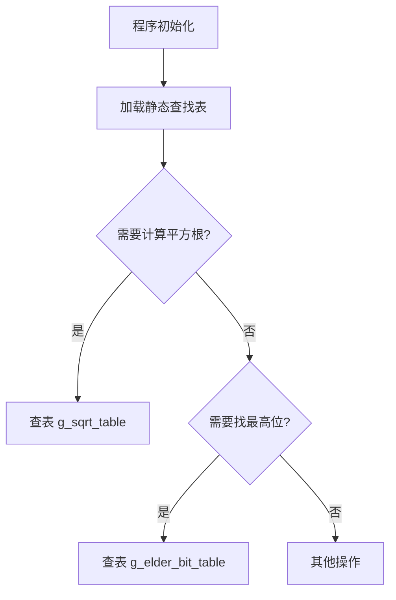

# `matplotlib\extern\agg24-svn\src\agg_sqrt_tables.cpp` 详细设计文档

该文件是Anti-Grain Geometry库的静态查找表实现，提供了两个关键的预计算表格用于图形渲染中的快速整数运算：g_sqrt_table用于0-1023范围内整数的平方根快速查找，g_elder_bit_table用于0-255范围内整数的最高有效位位置查找，这些表格在渲染管线中可显著提升计算性能。

## 整体流程



## 类结构

```
agg (命名空间)
└── 全局变量
    ├── g_sqrt_table (int16u[1024])
    └── g_elder_bit_table (int8[256])
```

## 全局变量及字段


### `g_sqrt_table`
    
预计算的平方根查找表，用于快速整数平方根运算

类型：`int16u[1024]`
    


### `g_elder_bit_table`
    
最高有效位位置查找表，用于快速计算整数的位深度

类型：`int8[256]`
    


    

## 全局函数及方法


## 关键组件


### 概述

本文件属于Anti-Grain Geometry (AGG) 2D图形库，提供两个预计算的静态查找表，用于加速图形渲染过程中的整数平方根计算和最高有效位查找，从而避免昂贵的运行时计算。

### 文件整体运行流程

本文件为头文件包含，不包含可执行流程。查找表在程序加载时自动初始化，供其他模块通过全局变量引用使用。

### 关键组件信息

#### g_sqrt_table

预计算的整数平方根查找表，包含1024个int16u类型的值，用于快速整数平方根运算。

#### g_elder_bit_table

最高有效位位置查找表，包含256个int8类型的值，用于快速确定给定字节值的最高位位置。

### 全局变量详细信息

| 名称 | 类型 | 描述 |
|------|------|------|
| g_sqrt_table | int16u[1024] | 整数平方根预计算查找表，提供0-1048575范围内整数的平方根近似值 |
| g_elder_bit_table | int8[256] | 最高有效位位置查找表，返回0-255范围内值的最高设置位索引 |

### 潜在的技术债务或优化空间

1. 硬编码的查找表缺乏灵活性，无法动态调整精度需求
2. 未提供SIMD或并行化访问支持，在现代CPU上可能存在缓存效率问题
3. 表的大小固定，无法适应不同精度要求的应用场景

### 其它项目

#### 设计目标与约束

- 目标：通过空间换时间策略，用预计算表换取计算性能提升
- 约束：表大小固定为1024和256，需保证内存占用可控

#### 错误处理与异常设计

- 本模块不涉及运行时错误处理，表内容在编译期静态确定
- 调用方需自行保证输入参数在有效范围内

#### 外部依赖与接口契约

- 依赖 agg_basics.h 中的类型定义（int16u, int8）
- 供外部模块通过 agg 命名空间直接访问全局变量
- 无函数接口，仅提供数据访问


## 问题及建议


### 已知问题

- **拼写错误**：变量名 `g_elder_bit_table` 存在拼写问题（"elder"可能应为"older"或"eldest"），且注释 `//---------g_elder_bit_table` 中也有拼写错误
- **硬编码魔数**：数组大小 1024 和 256 直接硬编码，未使用具名常量或宏定义，降低了代码可维护性
- **缺乏文档说明**：缺少对这些查找表用途、精度范围、使用场景的说明，增加了后续维护难度
- **全局变量暴露**：直接暴露全局变量而非通过访问函数，违反了信息隐藏原则，降低了封装性
- **表格数据来源不透明**：静态初始化的数值没有注释说明其计算方式或生成逻辑，难以验证正确性

### 优化建议

- 修正 `g_elder_bit_table` 的拼写，并添加注释说明变量命名含义
- 使用常量或宏定义数组大小（如 `SQRT_TABLE_SIZE` 和 `BIT_TABLE_SIZE`），提高可维护性
- 添加详细的文件头注释，说明两个表的用途、输入输出范围、精度信息及典型使用场景
- 考虑封装为命名空间内的静态只读引用或提供访问函数，保持接口稳定性
- 如可能，使用编译时计算（constexpr）或代码生成脚本生成表格数据，便于验证和后续修改

## 其它


### 设计目标与约束

本模块的核心设计目标是为Anti-Grain Geometry库提供高效的整数平方根和前导零位计算功能，通过预计算查找表替代运行时计算，以空间换时间的方式提升渲染性能。设计约束包括：g_sqrt_table表大小固定为1024元素，仅覆盖0-1048575（2^20-1）范围的平方根近似值；g_elder_bit_table表固定为256元素，用于计算0-255范围内的前导零位数；两者均为只读数据，不涉及运行时状态变更。

### 错误处理与异常设计

本文件不涉及运行时错误处理机制，因为查找表在编译时已完全确定。若输入值超出表索引范围（如g_sqrt_table索引>=1024或g_elder_bit_table索引>=256），调用方需自行保证索引有效性，库层面不提供边界检查。数据表本身无空值风险，初始化时已填充完整。

### 外部依赖与接口契约

本文件依赖agg_basics.h头文件，该头文件提供int16u和int8u等类型定义以及命名空间agg的声明。外部模块使用这两个查找表时需遵循以下契约：g_sqrt_table的索引为0-1023，返回值类型为int16u，表示对应输入值的平方根乘以2048（即fixed-point Q11.0格式）；g_elder_bit_table的索引为0-255，返回值类型为int8u，表示前导零位数（0-8）。

### 性能优化策略

该模块采用查表法（Lookup Table）避免运行时进行复杂的平方根迭代计算。g_sqrt_table的数值经过特殊设计：table[i] = floor(sqrt(i) * 2048)，其中2048 = 2^11，用于提供11位的整数精度。这种fixed-point表示法使得调用方可通过简单的数组访问替代牛顿迭代法，将O(log n)或O(1)的时间复杂度降至常量级访问。

### 数据存储格式说明

g_sqrt_table采用fixed-point Q11.0格式存储，数值范围0-65504，对应实际平方根值0-31.9995。g_elder_bit_table采用标准整型存储，数值范围0-7（表中最大值为7，表示8位全为0时的前导零位数）。两个表均为静态分配，存储于全局/静态数据段，程序启动时自动初始化。

### 平台相关考虑

本代码为纯C++实现，无平台特定代码，但依赖agg_basics.h中定义的类型别名。int16u通常为unsigned short（16位），int8u通常为unsigned char（8位）。若在非常规平台（如某些嵌入式系统）使用，需确保这两个类型定义正确。查找表大小固定，不支持动态调整。

### 使用场景与限制

该模块适用于需要快速整数平方根但精度要求不高于11位的实时渲染场景。限制包括：仅支持0-1048575范围的整数输入；精度固定为约0.5（1/2048）；无法直接处理浮点数输入。对于需要更高精度或更大范围的场景，应使用标准的sqrt()函数或专门的整数平方根算法。

    